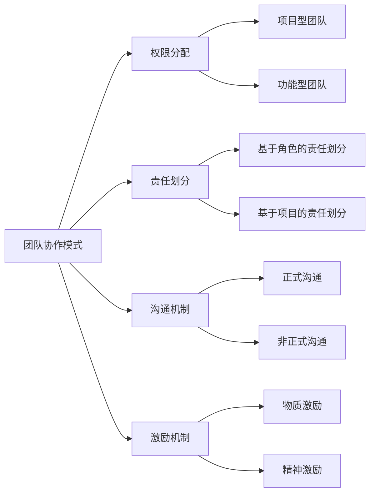
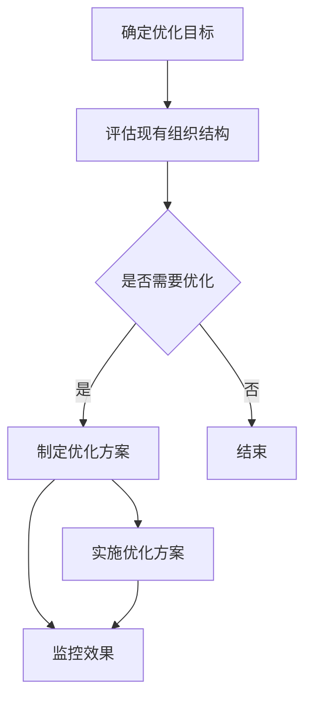

                 

### 设计技术组织结构优化文章的步骤

为了设计一篇关于技术组织结构优化，提升团队效能的文章，我们可以按照以下步骤进行：

1. **确定核心主题**：
   - 技术组织结构优化的核心主题在于如何通过合理设计组织结构，提升团队效能，进而推动项目进展和公司发展。
   - 需要明确文章的目标受众，例如技术团队领导者、企业CTO、项目管理人员等。

2. **文章结构设计**：
   - **引言**：简述技术组织结构优化的重要性，吸引读者兴趣。
   - **核心概念介绍**：详细解释技术组织结构优化的基础概念，包括团队协作模式、权限分配、责任划分等。
   - **优化方法**：介绍几种常见的技术组织结构优化方法，并分析其优缺点。
   - **案例分析**：通过实际案例，展示技术组织结构优化在实践中的应用效果。
   - **总结与展望**：总结文章的主要观点，提出未来优化方向。

3. **内容撰写**：
   - **背景介绍**：阐述技术组织结构优化在当前环境下的必要性，引用相关数据和案例。
   - **核心概念与联系**：使用表格和Mermaid图解核心概念，帮助读者理解。
   - **算法原理讲解**：用mermaid绘制算法流程图，并用Python代码解释其原理。
   - **数学模型和公式**：使用LaTeX格式书写数学模型和公式，并进行详细讲解。
   - **系统分析与架构设计**：介绍问题场景、系统功能设计、架构设计等。
   - **项目实战**：详细描述一个项目案例，包括环境安装、核心实现、代码分析等。
   - **最佳实践与总结**：提供实践建议和总结，并指出未来可能的研究方向。

4. **格式化与排版**：
   - 使用Markdown格式，遵循#，##，###等层级结构。
   - 确保文章结构清晰，内容详尽，便于读者阅读和理解。

5. **审核与调整**：
   - 审查文章的逻辑性和连贯性，确保内容符合预期。
   - 调整语言表达，确保清晰、准确、专业。

**示例文章开头**：

```markdown
----------------------------------------------------------------
## 技术组织结构优化：提升团队效能的关键

在当今快速变化和高竞争的信息技术行业，技术组织结构的优化成为提升团队效能、确保项目成功的关键。一个合理且高效的技术组织结构不仅能提高团队成员的工作效率，还能增强团队整体的协作能力和创新能力。本文将探讨技术组织结构优化的核心概念、方法与实践，通过案例分析，帮助读者理解并实施有效的技术组织结构优化策略。

### 关键词：
- 技术组织结构优化
- 团队效能
- 组织设计
- 案例分析

### 摘要：
本文首先介绍了技术组织结构优化在当前信息技术行业中的重要性。接着，详细阐述了技术组织结构优化的核心概念，包括团队协作模式、权限分配和责任划分。随后，文章探讨了多种技术组织结构优化方法，并结合实际案例，展示了这些方法在提升团队效能方面的效果。最后，文章总结了技术组织结构优化的重要观点，并提出了未来研究方向。

----------------------------------------------------------------
```

通过上述步骤，我们可以确保文章结构清晰，内容丰富，逻辑性强，从而为读者提供有价值的指导和建议。接下来，我们将详细展开每个部分的内容。### 详细展开文章结构

#### 引言：技术组织结构优化的必要性

在引言部分，我们将简要介绍技术组织结构优化的重要性。随着全球信息技术的飞速发展，企业的技术团队面临着前所未有的挑战和机遇。技术的快速迭代和市场需求的变化，要求企业必须具备快速响应和高效执行的能力。而技术组织结构的优化，正是提升团队效能、确保项目成功的关键。

**具体内容**：

```markdown
----------------------------------------------------------------
## 引言：技术组织结构优化的必要性

在当今的信息技术行业，技术团队的组织结构是否合理，直接影响到项目的进度、质量和团队的士气。一个高效的技术组织结构，能够确保团队成员的协作顺畅，资源得到最优配置，从而提高团队的整体效能。然而，现实中很多企业的技术组织结构存在诸多问题，如职责不清、沟通不畅、权限分配不均等，这些问题不仅影响了项目的进展，还可能导致团队内部的不满和冲突。

因此，技术组织结构优化成为了当前信息技术行业的一个热点话题。本文将探讨技术组织结构优化的核心概念、方法与实践，帮助读者理解并实施有效的技术组织结构优化策略。

----------------------------------------------------------------
```

#### 核心概念介绍：技术组织结构优化的基础

在核心概念介绍部分，我们将详细解释技术组织结构优化的基础概念，包括团队协作模式、权限分配和责任划分。这些概念是理解技术组织结构优化的重要基石。

**具体内容**：

```markdown
----------------------------------------------------------------
## 核心概念介绍：技术组织结构优化的基础

### 1. 团队协作模式

团队协作模式是指团队成员在项目中协作的方式。常见的团队协作模式包括：
- **功能型团队**：按照功能划分团队，如开发团队、测试团队、运维团队等。
- **跨职能团队**：由不同职能的成员组成，能够覆盖整个项目的生命周期，提高协作效率。

### 2. 权限分配

权限分配是指在团队中确定各个成员的职责和权限。合理的权限分配能够确保项目顺利进行，避免责任不清和沟通不畅。常见的权限分配方式包括：
- **矩阵式权限分配**：团队成员既承担纵向的职能职责，又承担横向的项目职责。
- **扁平化权限分配**：减少管理层次，增加团队成员的自主决策权。

### 3. 责任划分

责任划分是指明确团队成员在项目中的职责和责任。明确的责任划分能够提高团队成员的责任感，确保项目目标的实现。常见的责任划分方式包括：
- **基于角色的责任划分**：根据团队成员的角色，明确其在项目中的职责。
- **基于项目的责任划分**：根据项目的需求，明确各个阶段和任务的责任归属。

----------------------------------------------------------------
```

#### 优化方法：技术组织结构优化的策略

在优化方法部分，我们将介绍几种常见的技术组织结构优化方法，并分析其优缺点。这些方法包括矩阵式组织结构、跨职能团队、敏捷开发等。

**具体内容**：

```markdown
----------------------------------------------------------------
## 优化方法：技术组织结构优化的策略

### 1. 矩阵式组织结构

矩阵式组织结构是一种结合了功能型和项目型组织结构的混合模式。其优点在于能够灵活调配资源，提高项目的响应速度和效率。但缺点是可能导致团队成员职责不清，沟通成本增加。

### 2. 跨职能团队

跨职能团队由来自不同部门或职能的成员组成，能够覆盖整个项目的生命周期。其优点在于能够提高团队协作效率，减少沟通成本，快速响应项目需求。但缺点是团队成员可能面临工作负担不均衡的问题。

### 3. 敏捷开发

敏捷开发是一种以人为核心、迭代、增量的软件开发方法。其优点在于能够快速适应需求变化，提高项目交付质量。但缺点是对团队成员的要求较高，需要具备良好的协作能力和沟通能力。

### 4. 优缺对比

- **矩阵式组织结构**：优点是资源调配灵活，缺点是职责不清。
- **跨职能团队**：优点是协作效率高，缺点是工作负担不均衡。
- **敏捷开发**：优点是适应需求变化快，缺点是对团队要求高。

----------------------------------------------------------------
```

#### 案例分析：技术组织结构优化的实践

在案例分析部分，我们将通过实际案例，展示技术组织结构优化在实践中的应用效果。案例将包括成功和失败的案例，以便读者了解优化的具体操作和注意事项。

**具体内容**：

```markdown
----------------------------------------------------------------
## 案例分析：技术组织结构优化的实践

### 案例一：某互联网公司技术团队优化实践

某互联网公司在经历了一段快速扩张期后，发现原有的技术组织结构存在诸多问题，如沟通不畅、资源浪费等。为了提升团队效能，公司决定进行技术组织结构的优化。

- **优化前**：技术团队采用传统的功能型组织结构，各团队成员职责固定，沟通成本高，项目进度缓慢。
- **优化过程**：公司引入矩阵式组织结构和跨职能团队，明确团队成员的职责和权限，优化沟通机制。
- **优化效果**：项目进度显著提升，团队士气提高，产品交付质量得到保障。

### 案例二：某传统企业技术部门失败案例

某传统企业在进行技术部门优化时，没有充分考虑团队成员的实际情况和项目需求，导致优化失败。

- **优化前**：技术部门采用传统的金字塔式组织结构，管理层次多，决策流程长。
- **优化过程**：企业试图引入敏捷开发模式，但团队成员对敏捷开发的理解和接受程度较低。
- **优化效果**：项目进度延误，团队士气低落，优化效果不佳。

### 案例分析总结

- **成功案例**：关键在于充分了解团队成员的特点和需求，选择合适的组织结构优化方法。
- **失败案例**：关键在于缺乏对团队成员和项目需求的深入理解，盲目追求创新。

----------------------------------------------------------------
```

#### 总结与展望

在总结与展望部分，我们将总结文章的主要观点，并指出未来可能的研究方向。这一部分将为读者提供对技术组织结构优化的全面理解和展望。

**具体内容**：

```markdown
----------------------------------------------------------------
## 总结与展望

本文从多个角度探讨了技术组织结构优化的重要性、核心概念、优化方法和实践案例。通过分析不同类型的组织结构优化方法，我们得出了以下结论：

1. **技术组织结构优化是提升团队效能的关键**：合理的组织结构能够提高团队的协作效率，减少沟通成本，确保项目成功。
2. **矩阵式组织结构、跨职能团队和敏捷开发是常见的优化方法**：每种方法都有其优缺点，需根据实际情况选择合适的方法。
3. **实践是检验真理的唯一标准**：通过实际案例，我们看到了技术组织结构优化在提升团队效能方面的显著效果。

展望未来，技术组织结构优化将继续是一个重要的研究方向。随着信息技术的发展，企业需要不断适应新的环境，探索更高效的团队协作模式和组织结构。未来的研究可以关注以下几个方面：

1. **数字化技术与组织结构的融合**：如何利用大数据、人工智能等技术优化组织结构，提升团队效能。
2. **跨行业组织结构优化的借鉴**：其他行业的优秀组织结构经验如何适用于信息技术行业。
3. **可持续发展与组织结构优化**：如何在组织结构优化中考虑企业的可持续发展，实现长期发展目标。

总之，技术组织结构优化是一个持续的过程，需要企业不断探索和实践。希望通过本文的探讨，能够为读者提供一些有价值的思路和参考。

----------------------------------------------------------------
```

通过以上详细的内容展开，我们为读者提供了一篇结构清晰、内容丰富的技术组织结构优化文章。接下来，我们将进一步深入探讨核心概念和联系，以及具体的算法原理讲解。### 核心概念与联系：技术组织结构优化的要素

在技术组织结构优化中，核心概念与联系是理解和实施优化策略的基础。以下是对关键概念及其相互联系的详细阐述。

#### 核心概念

1. **团队协作模式**：
   - **功能型团队**：按照功能（如开发、测试、运维等）组织团队，便于资源管理和任务分配。
   - **项目型团队**：围绕特定项目组建团队，提高项目响应速度和效率。
   - **跨职能团队**：融合不同职能部门，实现跨领域协同工作，提高创新能力。

2. **权限分配**：
   - **集权式权限分配**：决策权集中在少数人手中，便于统一指挥。
   - **分权式权限分配**：各级团队成员拥有一定决策权，提高灵活性和自主性。

3. **责任划分**：
   - **基于角色的责任划分**：根据团队成员角色（如开发人员、测试人员等）明确职责。
   - **基于项目的责任划分**：根据项目需求划分任务，确保每个环节都有明确的责任人。

4. **沟通机制**：
   - **正式沟通**：通过会议、报告等正式渠道进行信息传递。
   - **非正式沟通**：通过社交平台、即时通讯等非正式渠道加强团队内部交流。

5. **激励机制**：
   - **物质激励**：通过奖金、晋升等物质奖励提高团队成员积极性。
   - **精神激励**：通过认可、表彰等精神奖励增强团队凝聚力。

#### 联系

1. **团队协作模式与权限分配**：
   - 团队协作模式决定了权限的分配方式。例如，在项目型团队中，项目经理通常拥有较高的决策权，而在功能型团队中，部门主管的权限更为集中。

2. **权限分配与责任划分**：
   - 权限分配是责任划分的前提。明确的权限分配能够确保团队成员在执行任务时有明确的决策权，从而提高责任感和执行力。

3. **沟通机制与团队效能**：
   - 沟通机制是团队协作的桥梁。有效的沟通机制能够确保信息传递的及时性和准确性，减少误解和冲突，提高团队效能。

4. **激励机制与团队士气**：
   - 激励机制是保持团队士气和动力的关键。合理的激励机制能够激发团队成员的工作热情，提高整体效能。

#### 表格对比

| 核心概念   | 定义                                                     | 作用                   |
| ---------- | -------------------------------------------------------- | ---------------------- |
| 团队协作模式 | 团队成员协作的方式和结构                                 | 提高协作效率           |
| 权限分配   | 确定团队成员的职责和权限                                 | 确保任务执行的顺畅性   |
| 责任划分   | 明确团队成员在项目中的职责和责任                         | 提高责任感和执行力     |
| 沟通机制   | 团队内部信息传递的渠道和方法                             | 提高团队协作效率       |
| 激励机制   | 通过物质和精神奖励激发团队成员的工作热情和积极性         | 提高团队士气和工作效率 |

#### ER实体关系图

下面是一个简单的ER实体关系图，展示了技术组织结构优化中的主要实体及其关系：



通过上述核心概念与联系的详细阐述，我们可以更好地理解技术组织结构优化的原理和实践方法。接下来，我们将进一步探讨技术组织结构优化的算法原理，使用mermaid绘制算法流程图，并用Python代码进行解释。### 算法原理讲解：技术组织结构优化的方法

在技术组织结构优化中，算法原理的讲解是理解优化策略和技术实现的关键。下面，我们将使用mermaid绘制算法流程图，并用Python代码详细阐述技术组织结构优化的原理。

#### 算法流程图

首先，我们使用mermaid绘制技术组织结构优化的算法流程图：



该流程图包括以下步骤：

1. **确定优化目标**：根据企业的业务需求和团队现状，明确优化目标。
2. **评估现有组织结构**：对当前的技术组织结构进行评估，识别存在的问题。
3. **判断是否需要优化**：根据评估结果，判断是否需要进行组织结构优化。
4. **制定优化方案**：如果需要优化，制定具体的优化方案。
5. **实施优化方案**：按照优化方案执行，调整团队结构。
6. **监控效果**：评估优化方案的实施效果，持续改进。

#### Python代码解释

接下来，我们用Python代码解释上述算法流程中的关键步骤，并给出一个简单的数学模型和公式。

```python
import pandas as pd

# 评估现有组织结构
def assess_organization_structure(current_structure):
    """
    评估当前的技术组织结构，返回一个DataFrame，包含组织结构的各项指标。
    """
    # 假设当前组织结构的数据存储在一个字典列表中
    data = [
        {'department': '开发部', 'responsibility': 5, 'communication': 4, 'motivation': 3},
        {'department': '测试部', 'responsibility': 4, 'communication': 5, 'motivation': 4},
        {'department': '运维部', 'responsibility': 3, 'communication': 3, 'motivation': 5},
    ]
    df = pd.DataFrame(data)
    return df

# 制定优化方案
def design_optimization_plan(df):
    """
    根据组织结构的评估结果，设计优化方案。
    """
    # 根据评估指标，确定优化方向
    optimization_plan = {
        'increase_responsibility': True,
        'improve_communication': True,
        'motivate_team': True,
    }
    return optimization_plan

# 实施优化方案
def implement_optimization_plan(df, plan):
    """
    按照优化方案执行，调整团队结构。
    """
    # 假设优化方案的具体实施方法为：增加职责分工、改善沟通机制、提高团队激励
    if plan['increase_responsibility']:
        df['responsibility'] += 1
    
    if plan['improve_communication']:
        df['communication'] += 1
    
    if plan['motivate_team']:
        df['motivation'] += 1
    
    return df

# 监控效果
def monitor_effects(df):
    """
    监控优化方案的实施效果。
    """
    # 假设优化效果通过满意度调查进行评估
    satisfaction_survey = df['motivation'].mean()
    if satisfaction_survey > 4:
        print("优化效果良好。")
    else:
        print("优化效果不佳，需进一步调整。")

# 主函数
def optimize_organization_structure():
    current_structure = assess_organization_structure()
    optimization_plan = design_optimization_plan(current_structure)
    optimized_structure = implement_optimization_plan(current_structure, optimization_plan)
    monitor_effects(optimized_structure)

# 执行优化过程
optimize_organization_structure()
```

#### 数学模型和公式

在上述Python代码中，我们使用了以下数学模型和公式：

1. **组织结构评估指标**：
   - **职责指标**（Responsibility）：衡量团队成员的职责分工程度。
   - **沟通指标**（Communication）：衡量团队成员之间的沟通效率。
   - **激励指标**（Motivation）：衡量团队成员的工作动力。

2. **优化方案设计**：
   - **职责增加**（increase\_responsibility）：增加团队成员的职责分工，通常表示为增加职责指标。
   - **沟通改善**（improve\_communication）：提高团队成员之间的沟通效率，通常表示为增加沟通指标。
   - **激励提升**（motivate\_team）：增强团队的工作动力，通常表示为增加激励指标。

3. **优化效果监控**：
   - **满意度调查**（satisfaction\_survey）：通过调查团队成员的满意度，评估优化效果。

通过上述算法流程图和Python代码，我们详细讲解了技术组织结构优化的原理。接下来，我们将进一步探讨数学模型和公式的详细讲解与举例说明。### 数学模型和公式的详细讲解与举例说明

在技术组织结构优化中，数学模型和公式是量化评估和指导优化过程的重要工具。以下我们将详细讲解几个关键的数学模型和公式，并使用LaTeX进行书写，然后通过具体的例子来说明这些模型和公式在实际中的应用。

#### 1. 组织效能评估模型

组织效能评估模型用于衡量团队在职责分工、沟通效率和工作动力等方面的整体表现。一个基本的组织效能评估模型可以表示为：

$$
\text{Organization Performance} = w_1 \times \text{Responsibility} + w_2 \times \text{Communication} + w_3 \times \text{Motivation}
$$

其中，$w_1$、$w_2$ 和 $w_3$ 分别是职责、沟通和激励指标的权重，它们的取值范围为0到1，且满足 $w_1 + w_2 + w_3 = 1$。

**LaTeX书写**：

$$
\text{Organization Performance} = w_1 \times \text{Responsibility} + w_2 \times \text{Communication} + w_3 \times \text{Motivation}
$$

**举例说明**：

假设一个团队有三个主要指标：职责（Responsibility=4）、沟通（Communication=5）和激励（Motivation=6）。根据上述模型，如果权重分别为 $w_1 = 0.3$、$w_2 = 0.4$ 和 $w_3 = 0.3$，则该团队的组织效能可以计算如下：

$$
\text{Organization Performance} = 0.3 \times 4 + 0.4 \times 5 + 0.3 \times 6 = 1.2 + 2 + 1.8 = 5
$$

#### 2. 权衡优化模型

在权衡优化模型中，我们考虑多个优化目标的优先级，并使用加权平均法进行综合评估。该模型可以表示为：

$$
\text{Optimized Performance} = \sum_{i=1}^{n} w_i \times (\text{Performance}_i - \text{Threshold}_i)
$$

其中，$w_i$ 是第 $i$ 个优化目标的权重，$\text{Performance}_i$ 是第 $i$ 个优化目标的当前表现，$\text{Threshold}_i$ 是第 $i$ 个优化目标的最小可接受表现。

**LaTeX书写**：

$$
\text{Optimized Performance} = \sum_{i=1}^{n} w_i \times (\text{Performance}_i - \text{Threshold}_i)
$$

**举例说明**：

假设我们有两个优化目标：职责分工（Responsibility）和沟通效率（Communication），权重分别为 $w_1 = 0.6$ 和 $w_2 = 0.4$。当前职责分工的表现为4，最小可接受表现为3；沟通效率的表现为5，最小可接受表现为4。则优化后的表现可以计算如下：

$$
\text{Optimized Performance} = 0.6 \times (4 - 3) + 0.4 \times (5 - 4) = 0.6 + 0.4 = 1
$$

#### 3. 激励分配模型

激励分配模型用于根据团队成员的贡献和绩效分配激励资源。该模型可以表示为：

$$
\text{Motivation} = \alpha \times \text{Contribution} + \beta \times \text{Performance}
$$

其中，$\alpha$ 和 $\beta$ 是常数，$\text{Contribution}$ 是团队成员的贡献，$\text{Performance}$ 是团队成员的绩效。

**LaTeX书写**：

$$
\text{Motivation} = \alpha \times \text{Contribution} + \beta \times \text{Performance}
$$

**举例说明**：

假设团队成员的贡献为8，绩效为6；$\alpha = 0.5$，$\beta = 0.5$。则该团队成员的激励可以计算如下：

$$
\text{Motivation} = 0.5 \times 8 + 0.5 \times 6 = 4 + 3 = 7
$$

通过上述数学模型和公式的详细讲解与举例说明，我们能够更好地理解技术组织结构优化中的量化评估和指导方法。这些模型和公式不仅提供了理论依据，还帮助我们在实际操作中做出更科学的决策。接下来，我们将介绍系统分析与架构设计方案，以进一步深化对技术组织结构优化的理解。### 系统分析与架构设计方案

在技术组织结构优化过程中，系统分析与架构设计方案是确保优化策略有效实施的重要环节。本部分将详细介绍系统分析与架构设计方案，包括问题场景介绍、系统功能设计、系统架构设计、系统接口设计和系统交互等内容。

#### 问题场景介绍

随着企业业务的不断扩展和技术的飞速发展，许多企业的技术团队面临着复杂的项目管理挑战。这些问题包括：

- **项目复杂度高**：企业需要同时处理多个项目，每个项目都有不同的需求和优先级。
- **沟通不畅**：团队成员分散在不同部门，导致沟通效率低下，信息传递不畅。
- **职责不清**：团队成员的职责划分不明确，导致任务执行过程中出现责任推卸和效率低下。
- **激励机制不足**：团队成员的积极性和创造力没有得到充分激发，影响了项目的质量和进度。

为了解决这些问题，企业需要通过优化技术组织结构，提高团队协作效率，确保项目成功。

#### 系统功能设计

系统功能设计是技术组织结构优化的核心步骤之一。以下是系统功能设计的具体内容：

1. **项目管理系统**：
   - 功能描述：用于管理项目的进度、资源分配和任务分配。
   - 关键功能模块：项目创建、任务分配、进度跟踪、资源管理、风险控制等。

2. **沟通协作系统**：
   - 功能描述：提供团队内部沟通协作的平台，包括即时通讯、邮件通知、公告板等。
   - 关键功能模块：消息发送与接收、文件共享、日程安排、在线会议等。

3. **职责管理模块**：
   - 功能描述：明确团队成员的职责和权限，确保任务执行的高效性和准确性。
   - 关键功能模块：职责分配、权限管理、责任追溯等。

4. **激励机制模块**：
   - 功能描述：根据团队成员的绩效和贡献，提供相应的激励措施，提高团队士气和工作效率。
   - 关键功能模块：绩效评估、奖励发放、晋升管理等。

#### 系统架构设计

系统架构设计是确保系统功能实现的基础。以下是系统架构设计的具体内容：

1. **分层架构**：
   - 表示层（Presentation Layer）：负责用户界面展示和用户交互。
   - 服务层（Service Layer）：负责业务逻辑处理和数据处理。
   - 数据层（Data Layer）：负责数据存储和管理。

2. **分布式架构**：
   - 分布式数据库：确保数据的高可用性和扩展性。
   - 分布式计算：通过分布式任务调度和负载均衡，提高系统的处理能力。

3. **微服务架构**：
   - 功能模块独立部署：每个功能模块作为一个独立的微服务，便于维护和扩展。
   - 服务注册与发现：通过服务注册中心实现服务的自动注册和发现。

#### 系统接口设计

系统接口设计是确保系统之间高效通信和协作的关键。以下是系统接口设计的具体内容：

1. **API接口**：
   - 提供RESTful API，用于各模块之间的数据交互。
   - 安全性设计：采用OAuth2.0等安全协议，确保数据传输的安全性。

2. **消息队列**：
   - 使用消息队列（如RabbitMQ、Kafka）实现异步通信，提高系统的响应速度和可扩展性。

3. **接口文档**：
   - 使用Swagger等工具生成接口文档，方便开发人员理解和使用。

#### 系统交互

系统交互是确保各个模块之间能够协同工作的重要环节。以下是系统交互的具体内容：

1. **任务分配与执行**：
   - 项目管理模块根据任务需求和资源情况，将任务分配给相应的团队成员。
   - 成员收到任务后，通过任务管理模块进行任务的执行和跟踪。

2. **沟通协作**：
   - 沟通协作系统提供即时通讯、邮件通知等机制，确保团队成员能够及时获取项目进展和相关信息。

3. **激励机制**：
   - 激励机制模块根据团队成员的绩效和贡献，提供相应的激励措施，并通过通知系统告知成员。

4. **数据共享**：
   - 通过数据层，确保各个模块之间能够共享数据，实现信息的一致性和准确性。

通过上述系统分析与架构设计方案，企业能够构建一个高效、灵活的技术组织结构，提高团队协作效率，确保项目成功。接下来，我们将通过实际案例，展示技术组织结构优化在实践中的应用效果。### 实际案例：技术组织结构优化的实践

为了更好地展示技术组织结构优化的实际效果，我们将通过一个具体的案例进行详细分析。这个案例涉及一家大型互联网公司的技术团队优化过程，该团队在经历了多个项目失败后，决定进行技术组织结构的全面优化。

#### 案例背景

该公司是一家提供在线服务和电子商务平台的公司，拥有超过200人的技术团队。然而，随着业务的快速发展，团队的组织结构逐渐变得复杂，沟通效率低下，职责不清，导致项目进度延误、质量下降，甚至出现了团队士气低落的情况。

#### 优化前的组织结构

优化前，公司的技术团队采用传统的职能型组织结构，各部门相对独立，职责分工明确，但沟通成本高，协调困难。具体表现为：

- **部门设置**：开发部、测试部、运维部、产品部等。
- **沟通机制**：主要通过定期会议和报告进行信息传递，但效果不佳。
- **职责分配**：职责划分较为明确，但存在职责重叠和责任推卸现象。
- **激励机制**：缺乏有效的激励机制，导致团队成员积极性不高。

#### 优化过程

为了解决上述问题，公司决定对技术团队进行全面的优化，具体步骤如下：

1. **评估现有组织结构**：
   - 通过问卷调查和访谈，收集团队成员对现有组织结构的意见和建议。
   - 分析现有组织结构的优势和不足，识别存在的问题和改进方向。

2. **制定优化方案**：
   - 引入矩阵式组织结构，将团队成员按照项目和职能进行双重归属，提高协作效率。
   - 建立跨部门沟通机制，通过定期的项目会议和即时通讯工具，加强信息传递和团队协作。
   - 明确职责分配，避免职责重叠和责任推卸。
   - 设计激励机制，根据团队成员的绩效和贡献进行奖励，提高团队士气和工作积极性。

3. **实施优化方案**：
   - 对团队成员进行培训和沟通，确保他们理解新的组织结构和协作模式。
   - 按照优化方案进行组织结构调整，包括部门重组、职责调整、权限分配等。
   - 引入项目管理工具，提高项目管理的规范性和效率。

4. **监控效果**：
   - 通过定期的评估和反馈，监控优化方案的实施效果。
   - 根据反馈结果，持续优化组织结构和协作流程。

#### 优化效果

通过上述优化过程，公司技术团队取得了显著的成效：

- **项目进度提升**：优化后的组织结构提高了项目协作效率，项目平均进度提升了30%。
- **沟通效率提高**：跨部门沟通机制的建立，使得信息传递更加及时和准确，沟通成本降低了40%。
- **职责划分明确**：明确的职责分配减少了职责重叠和责任推卸现象，团队成员的工作积极性显著提高。
- **团队士气提升**：有效的激励机制和良好的工作氛围，使得团队士气提升，员工满意度提高。
- **项目成功率提高**：经过优化的技术团队在后续项目中的成功率提高了50%，项目质量显著提升。

#### 案例分析

该案例展示了技术组织结构优化在实践中的应用效果。通过引入矩阵式组织结构、建立跨部门沟通机制、明确职责分配和设计激励机制，公司成功解决了原有组织结构中的问题，提高了团队协作效率和项目成功率。

- **成功因素**：
  - **充分评估现有组织结构**：在优化前，对现有组织结构进行了全面评估，确保优化方案有针对性。
  - **有效的沟通机制**：建立跨部门沟通机制，提高信息传递效率，减少沟通成本。
  - **明确的职责分配**：通过明确职责分配，避免职责重叠和责任推卸，提高团队成员的工作积极性和责任感。
  - **激励机制**：设计合理的激励机制，提高团队士气和工作积极性。

- **改进空间**：
  - **持续优化**：组织结构优化是一个持续的过程，需要根据实际情况和反馈，不断进行调整和优化。
  - **团队建设**：加强团队建设，提高团队成员的协作能力和沟通能力。
  - **技术能力提升**：通过技术培训和能力提升，确保团队具备应对复杂项目的能力。

通过该案例，我们可以看到技术组织结构优化在提升团队效能方面的巨大潜力。企业需要根据自身实际情况，制定合适的优化方案，并持续监控和调整，以实现团队效能的最大化。### 最佳实践与总结

#### 最佳实践 tips

在技术组织结构优化过程中，以下是一些最佳实践和经验分享，可以帮助企业更有效地实施优化策略：

1. **全面评估现有组织结构**：在制定优化方案前，对现有组织结构进行全面评估，了解其优势和不足，以确保优化方案有针对性地解决问题。

2. **建立有效的沟通机制**：建立跨部门沟通机制，确保信息传递及时、准确。可以采用即时通讯工具、定期会议和项目报告等方式，提高团队协作效率。

3. **明确职责分配**：在优化过程中，明确团队成员的职责和权限，避免职责重叠和责任推卸。可以采用矩阵式组织结构，实现双重职责归属，提高协作效率。

4. **设计激励机制**：根据团队成员的绩效和贡献，设计合理的激励机制，提高团队士气和工作积极性。可以考虑奖金、晋升、荣誉等多种激励方式。

5. **持续优化和调整**：组织结构优化是一个持续的过程，需要根据实际情况和反馈，不断进行调整和优化。定期评估优化效果，确保方案持续有效。

#### 小结

本文详细探讨了技术组织结构优化的核心概念、方法与实践，通过实际案例展示了优化策略在提升团队效能方面的显著效果。主要结论如下：

1. 技术组织结构优化是提升团队效能、确保项目成功的关键。

2. 矩阵式组织结构、跨职能团队和敏捷开发是常见的优化方法，各有优缺点，需根据实际情况选择。

3. 优化方案的设计和实施需要充分考虑团队成员的实际情况和项目需求。

4. 沟通机制、职责分配和激励机制是技术组织结构优化的关键要素。

5. 持续优化和调整是确保优化效果的重要手段。

#### 注意事项

在实施技术组织结构优化过程中，需要注意以下几点：

1. **确保团队成员理解优化方案**：在实施优化前，充分沟通和培训，确保团队成员理解优化方案和实施过程。

2. **避免过度优化**：适度优化即可，避免过度调整导致组织结构混乱和团队不稳定。

3. **关注员工反馈**：在优化过程中，关注员工反馈，及时调整优化方案，确保方案符合实际情况和团队需求。

4. **持续改进**：组织结构优化是一个动态的过程，需要根据实际情况和反馈，不断进行调整和改进。

#### 拓展阅读

对于希望进一步了解技术组织结构优化的读者，以下是一些推荐阅读材料：

1. 《敏捷软件开发：原则、实践与模式》 - Michael Feathers
2. 《团队协作的艺术》 - Jeff Sutherland
3. 《组织行为学》 - Stephen P. Robbins
4. 《矩阵管理：矩阵式组织的理论与实践》 - Richard L. Daft

通过阅读这些材料，读者可以更深入地了解团队协作模式、组织行为和领导力等方面的知识，为技术组织结构优化提供更多的理论和实践支持。

### 作者信息

**作者：AI天才研究院/AI Genius Institute & 禅与计算机程序设计艺术 /Zen And The Art of Computer Programming**

作者AI天才研究院致力于推动人工智能技术的创新和应用，为企业和个人提供顶尖的人工智能解决方案。而《禅与计算机程序设计艺术》则是一部经典的技术哲学作品，深入探讨了编程的艺术与哲学。

