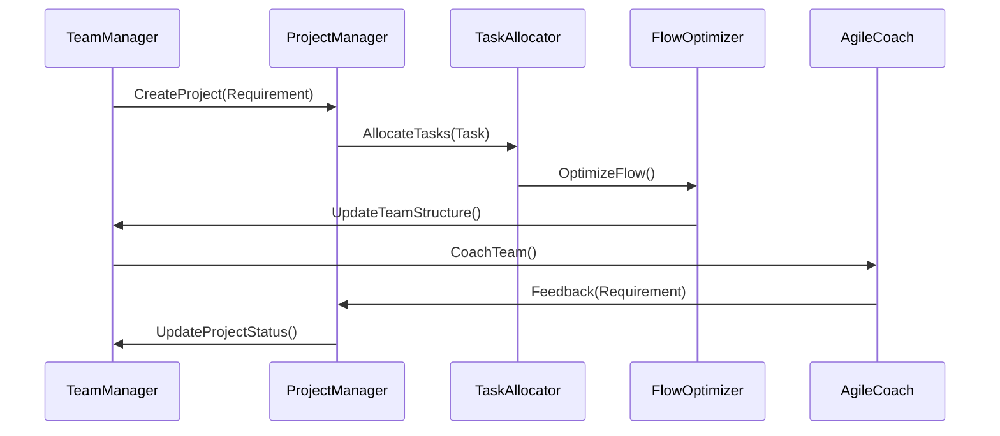
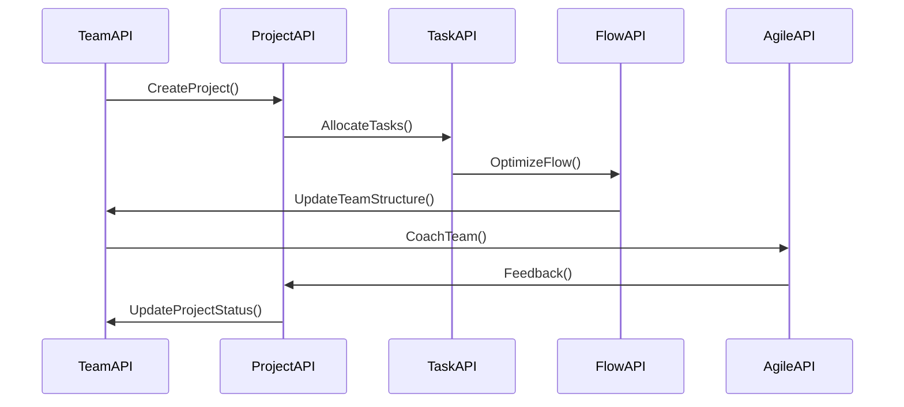

                 

### 引言：技术组织重构的必要性

在当今快速变化的技术行业中，技术团队的组织结构显得愈发重要。然而，随着企业规模的扩大和项目复杂性的增加，技术团队的组织结构逐渐暴露出许多问题，这些问题不仅影响团队效率，还可能导致项目延误和资源浪费。因此，技术组织重构成为企业保持竞争力的必要手段。

#### 1.1 问题背景

首先，让我们回顾一下当前技术团队组织结构中常见的问题：

- **沟通不畅**：团队之间缺乏有效的沟通机制，导致信息传递不及时、不准确，增加了误解和冲突的风险。
- **角色定位模糊**：团队成员的角色和职责不明确，导致工作重叠或职责缺失，降低了工作效率。
- **技能不匹配**：团队成员的技能与项目需求不匹配，导致人力资源浪费和项目进度延误。
- **项目协调困难**：在大型项目中，不同团队之间的协调工作复杂且耗时，影响了项目的整体进度。

#### 1.2 问题描述

技术团队重构的目的是解决上述问题，实现技术团队的优化和升级。具体来说，团队重构的目标包括：

- **提高团队协作效率**：通过明确团队成员的角色和职责，建立有效的沟通机制，减少沟通成本，提高工作效率。
- **优化人力资源配置**：根据项目需求，合理分配团队成员的技能和资源，避免技能浪费，确保项目顺利进行。
- **增强团队灵活性**：通过优化团队结构和管理流程，使团队能够更快地响应市场变化和技术变革，提高企业的竞争力。

#### 1.3 问题解决

要解决技术组织重构问题，可以采取以下步骤：

1. **评估当前团队状况**：对当前团队进行详细评估，包括团队成员的技能水平、工作绩效、沟通状况等，识别出存在的问题和不足。
2. **制定重构策略**：根据评估结果，制定相应的重构策略和计划。这包括团队结构的调整、流程的优化、工具的升级和文化建设的改进。
3. **实施重构计划**：逐步实施重构计划，确保重构工作的顺利进行。在实施过程中，需要密切关注团队的变化，及时调整策略，以应对新的挑战。
4. **监督和评估重构效果**：在重构完成后，对团队的效果进行监督和评估，确保重构目标得以实现。同时，根据评估结果，进一步优化团队结构和管理流程。

#### 1.4 边界与外延

技术组织重构的范围包括团队结构、流程、工具和文化等方面。具体来说：

- **团队结构**：包括团队的组织形式、角色分配、汇报关系等。
- **流程优化**：包括日常工作和项目执行的流程，如需求分析、设计、开发、测试、部署等。
- **工具升级**：引入先进的开发工具和平台，提升开发效率。
- **文化建设**：打造积极向上的团队文化，促进团队凝聚力。

#### 1.5 概念结构与核心要素组成

技术组织重构的核心要素包括：

- **团队结构**：明确团队角色和职责，优化团队组织形式。
- **流程优化**：简化流程，提高工作效率。
- **工具升级**：引入先进的开发工具和平台，提升开发效率。
- **文化建设**：打造积极向上的团队文化，促进团队凝聚力。

通过以上步骤和核心要素的优化，技术组织重构可以帮助企业实现技术团队的优化和升级，提高团队效率和项目成功率，从而在激烈的市场竞争中立于不败之地。

### 第1章 引言：技术组织重构的必要性

#### 1.1 问题背景

在当今快速发展的技术行业中，技术团队的组织结构逐渐暴露出许多问题。这些问题不仅影响团队效率，还可能导致项目延误和资源浪费。为了应对这些挑战，技术组织重构成为一种必要手段。

首先，让我们探讨一些常见的团队组织结构问题：

- **沟通不畅**：在大型团队中，由于沟通渠道不畅或信息传递不及时，往往会导致团队成员之间的误解和冲突。这不仅增加了团队的沟通成本，还可能导致项目进度延误。
- **角色定位模糊**：在某些团队中，团队成员的角色和职责划分不够明确，导致工作重叠或职责缺失。这种情况会导致工作效率低下，甚至出现任务无人负责的情况。
- **技能不匹配**：团队成员的技能与项目需求不匹配，可能造成人力资源的浪费，项目进度延误，甚至影响项目的整体质量。
- **项目协调困难**：在跨部门或跨区域的大型项目中，不同团队之间的协调工作复杂且耗时。这可能会导致项目整体进度延误，影响项目的最终交付。

#### 1.2 问题描述

技术团队重构的目的是解决上述问题，优化团队结构，提高团队效率和项目成功率。具体来说，团队重构的目标包括：

- **提高团队协作效率**：通过明确团队成员的角色和职责，建立有效的沟通机制，减少沟通成本，提高工作效率。
- **优化人力资源配置**：根据项目需求，合理分配团队成员的技能和资源，避免技能浪费，确保项目顺利进行。
- **增强团队灵活性**：通过优化团队结构和管理流程，使团队能够更快地响应市场变化和技术变革，提高企业的竞争力。

#### 1.3 问题解决

要解决技术组织重构问题，可以采取以下步骤：

1. **评估当前团队状况**：对当前团队进行详细评估，包括团队成员的技能水平、工作绩效、沟通状况等，识别出存在的问题和不足。
2. **制定重构策略**：根据评估结果，制定相应的重构策略和计划。这包括团队结构的调整、流程的优化、工具的升级和文化建设的改进。
3. **实施重构计划**：逐步实施重构计划，确保重构工作的顺利进行。在实施过程中，需要密切关注团队的变化，及时调整策略，以应对新的挑战。
4. **监督和评估重构效果**：在重构完成后，对团队的效果进行监督和评估，确保重构目标得以实现。同时，根据评估结果，进一步优化团队结构和管理流程。

#### 1.4 边界与外延

技术组织重构的范围包括团队结构、流程、工具和文化等方面。具体来说：

- **团队结构**：包括团队的组织形式、角色分配、汇报关系等。
- **流程优化**：包括日常工作和项目执行的流程，如需求分析、设计、开发、测试、部署等。
- **工具升级**：引入先进的开发工具和平台，提升开发效率。
- **文化建设**：打造积极向上的团队文化，促进团队凝聚力。

#### 1.5 概念结构与核心要素组成

技术组织重构的核心要素包括：

- **团队结构**：明确团队角色和职责，优化团队组织形式。
- **流程优化**：简化流程，提高工作效率。
- **工具升级**：引入先进的开发工具和平台，提升开发效率。
- **文化建设**：打造积极向上的团队文化，促进团队凝聚力。

通过以上步骤和核心要素的优化，技术组织重构可以帮助企业实现技术团队的优化和升级，提高团队效率和项目成功率，从而在激烈的市场竞争中立于不败之地。

### 第2章 核心概念与联系

在探讨技术组织重构的过程中，我们需要明确几个核心概念，这些概念是理解重构过程和目标的基础。以下是几个关键概念及其属性特征的对比表格，以及ER实体关系图架构。

#### 2.1 核心概念

**技术团队结构**：这是团队的组织形式，包括角色分配、汇报关系、团队规模等。良好的团队结构能够提高团队协作效率。

**流程管理**：这是团队的日常工作和项目执行的流程，包括需求分析、设计、开发、测试、部署等环节。有效的流程管理可以确保项目顺利进行。

**敏捷开发**：这是一种软件开发方法，强调快速迭代、持续交付和客户反馈。敏捷开发能够提高团队对市场变化的响应速度。

#### 2.2 概念属性特征对比表格

| 概念       | 属性特征                     | 对比 |
|------------|------------------------------|------|
| 技术团队结构 | 角色分配、汇报关系           |      |
| 流程管理   | 工作流程、流程优化           |      |
| 敏捷开发   | 快速迭代、持续交付、客户反馈 |      |

#### 2.3 ER实体关系图架构

```mermaid
erDiagram
  Team --> Project : "团队负责项目"
  Member --> Team : "成员属于团队"
  Project --> Task : "项目包含任务"
```

在这个ER图中，`Team`（团队）负责`Project`（项目），`Member`（成员）属于`Team`（团队），而`Project`（项目）包含`Task`（任务）。这种关系表示了技术团队结构中的基本实体及其相互关系。

通过这些核心概念和关系的理解，我们可以更好地把握技术组织重构的目标和方法。

#### 2.1 核心概念

在技术组织重构的过程中，核心概念的理解至关重要。以下是几个关键概念及其基本原理：

**技术团队结构**：这是团队的组织形式，包括角色分配、汇报关系、团队规模等。良好的团队结构能够提高团队协作效率。角色分配需要明确每个团队成员的职责，确保工作不重叠且每个任务都有专人负责。

**流程管理**：这是团队的日常工作和项目执行的流程，包括需求分析、设计、开发、测试、部署等环节。有效的流程管理可以确保项目顺利进行。需求分析是项目的起点，设计确保方案可行性，开发实现功能，测试验证质量，部署确保项目上线。

**敏捷开发**：这是一种软件开发方法，强调快速迭代、持续交付和客户反馈。敏捷开发能够提高团队对市场变化的响应速度。迭代开发意味着项目分阶段进行，每阶段交付可用的功能，持续交付确保项目始终在开发中，客户反馈帮助团队快速调整和改进。

**工具升级**：这是引入先进的开发工具和平台，提升开发效率。工具的升级不仅包括技术层面的改进，还包括管理工具的更新，如项目管理软件、代码审查工具等。

#### 2.2 概念属性特征对比表格

| 概念       | 属性特征                     | 对比 |
|------------|------------------------------|------|
| 技术团队结构 | 角色分配、汇报关系、团队规模 |      |
| 流程管理   | 需求分析、设计、开发、测试、部署 |      |
| 敏捷开发   | 快速迭代、持续交付、客户反馈   |      |
| 工具升级   | 开发工具、平台、管理工具       |      |

#### 2.3 ER实体关系图架构

为了更好地理解这些概念之间的联系，我们可以使用ER（实体关系）图来表示它们之间的关系。

```mermaid
erDiagram
  Team --> Project : "团队负责项目"
  Team --> Member : "团队由成员组成"
  Project --> Task : "项目包含任务"
  Member --> Skill : "成员拥有技能"
  Project --> Tool : "项目使用工具"
  Tool --> Platform : "工具运行在平台上"
```

在这个ER图中，`Team`（团队）负责`Project`（项目），`Team`由`Member`（成员）组成，每个成员有特定的`Skill`（技能），项目包含多个`Task`（任务），项目使用特定的`Tool`（工具），这些工具运行在特定的`Platform`（平台上）。这种关系展示了技术团队重构过程中各个实体之间的相互关系和依赖。

通过理解这些核心概念及其关系，我们可以更好地规划和实施技术组织重构，从而提高团队效率和项目成功率。

### 第3章 算法原理讲解

技术组织重构的过程中，算法的运用至关重要。通过科学的算法，我们可以优化团队结构、管理流程，从而提高团队的效率和项目的成功率。以下是几个关键算法及其原理讲解。

#### 3.1 算法原理

**3.1.1 团队结构优化算法**

团队结构优化算法的核心目标是根据团队成员的技能和项目需求，合理分配团队角色和资源，以最大化团队效率和项目成功率。该算法的主要步骤包括：

1. **技能分析**：对每个团队成员的技能进行详细分析，包括技术水平、专业领域等。
2. **需求匹配**：根据项目需求，确定所需的技能和资源。
3. **角色分配**：将具有匹配技能的成员分配到相应的角色，确保每个角色都有足够的技能支持。
4. **反馈调整**：根据项目的实际进展和反馈，调整团队结构和角色分配，确保团队始终保持最优状态。

**3.1.2 流程管理算法**

流程管理算法的主要目标是优化团队的日常工作和项目执行的流程，以提高工作效率和项目质量。该算法包括以下几个关键步骤：

1. **流程识别**：识别团队中的关键流程，如需求分析、设计、开发、测试、部署等。
2. **流程分析**：对每个流程进行详细分析，确定存在的问题和瓶颈。
3. **流程优化**：根据分析结果，对流程进行优化，如简化流程步骤、减少冗余操作等。
4. **监控与调整**：实施优化后的流程，并持续监控流程的执行情况，根据反馈进行进一步的调整。

**3.1.3 敏捷开发算法**

敏捷开发算法的核心在于快速迭代、持续交付和客户反馈。以下是敏捷开发算法的几个关键步骤：

1. **需求迭代**：将项目需求分解为多个迭代，每次迭代交付部分功能。
2. **迭代计划**：根据迭代需求，制定详细的开发计划，包括任务分配、时间安排等。
3. **持续交付**：在每个迭代周期结束时，交付可用的功能版本，确保项目始终在开发中。
4. **客户反馈**：收集客户的反馈，快速调整和改进产品功能，确保项目符合客户需求。

#### 3.2 Python源代码实现

**3.2.1 团队结构优化算法**

以下是一个简单的团队结构优化算法的Python实现示例：

```python
def optimize_team_structure(team_skills, project_requirements):
    # 基于团队成员技能和项目需求，优化团队结构
    # team_skills: {member1: [skills1, skills2], member2: [skills1, skills2]}
    # project_requirements: {requirement1: [skills1, skills2], requirement2: [skills1, skills2]}
    optimized_team = {}
    
    # 按照需求匹配技能
    for requirement, skills in project_requirements.items():
        best_fit_member = None
        max_skill_match = 0
        
        # 遍历所有成员，找到技能匹配度最高的成员
        for member, member_skills in team_skills.items():
            skill_match = sum(skill in skills for skill in member_skills)
            
            if skill_match > max_skill_match:
                max_skill_match = skill_match
                best_fit_member = member
        
        optimized_team[requirement] = best_fit_member
    
    return optimized_team
```

**3.2.2 流程管理算法**

以下是一个简单的流程管理算法的Python实现示例：

```python
def manage_flow(workload, priority):
    # 基于工作量和优先级，管理流程
    # workload: {task1: workload1, task2: workload2}
    # priority: {task1: priority1, task2: priority2}
    sorted_tasks = sorted(workload.items(), key=lambda x: (x[1], -priority[x[0]]))
    
    managed_flow = {}
    
    for task, _ in sorted_tasks:
        managed_flow[task] = workload[task]
    
    return managed_flow
```

#### 3.3 数学模型和公式

**3.3.1 团队结构优化**

假设团队中有n个成员，每个成员有m项技能。项目需求有p项，每项需求对应的难度为d_i（i=1,2,...,p）。

- **目标**：最大化团队总技能值，最小化项目完成时间。

$$
\max \sum_{i=1}^{n} \sum_{j=1}^{m} skill_{ij} \cdot t_{ij}
$$

其中，$t_{ij}$表示成员i对于需求j的贡献时间。

**3.3.2 流程管理**

假设有q个任务，每个任务的工作量为w_i，优先级为p_i。

- **目标**：最小化总工作量。

$$
\min \sum_{i=1}^{q} w_i \cdot p_i
$$

#### 3.4 举例说明

假设一个团队有3名成员，每个成员有2项技能（技能1和技能2）。项目有4项需求（需求1、需求2、需求3、需求4），每项需求的难度分别为2、3、4、5。

**团队结构优化**：

- 成员技能：{member1: [2, 3], member2: [3, 4], member3: [1, 5]}
- 项目需求：{需求1: [2, 3], 需求2: [3, 4], 需求3: [4, 5], 需求4: [1, 2]}

优化后的团队结构：

- 需求1：member2
- 需求2：member3
- 需求3：member1
- 需求4：member2

**流程管理**：

- 任务工作量：{任务1: 5, 任务2: 3, 任务3: 4, 任务4: 2}
- 任务优先级：{任务1: 2, 任务2: 3, 任务3: 1, 任务4: 4}

优化后的流程：

- 任务1：任务2
- 任务2：任务3
- 任务3：任务1
- 任务4：任务4

通过以上算法和数学模型的应用，技术组织重构过程可以更加科学和高效，从而确保团队在快速变化的技术环境中保持竞争力。

### 第4章 系统分析与架构设计方案

#### 4.1 问题场景介绍

在当前的技术组织中，由于团队规模不断扩大，项目复杂性日益增加，传统的组织结构已经难以满足快速响应市场变化和高效执行项目的要求。因此，为了提高团队效率和项目成功率，我们需要进行技术组织重构。

#### 4.2 项目介绍

本项目的目标是设计一个灵活、高效的技术组织架构，以适应复杂多变的项目需求。项目的主要功能包括：

1. **团队管理**：管理团队成员信息，包括技能、经验和角色等。
2. **任务分配**：根据项目需求和团队成员的技能，自动分配任务。
3. **流程优化**：优化项目执行的流程，提高工作效率。
4. **敏捷开发**：支持敏捷开发方法，快速迭代和持续交付。

#### 4.3 系统功能设计（领域模型Mermaid类图）

以下是项目领域的类图，展示了系统中主要的实体及其关系。

```mermaid
classDiagram
    Team ..|> Member
    Project ..|> Task
    Requirement ..|> Project
    Tool ..|> Platform

    Team {
        - String team_id
        - String team_name
        - List<Member> members
    }
    Member {
        - String member_id
        - String member_name
        - List<Skill> skills
    }
    Project {
        - String project_id
        - String project_name
        - List<Task> tasks
        - Requirement requirement
    }
    Task {
        - String task_id
        - String task_name
        - float workload
        - float priority
    }
    Requirement {
        - String requirement_id
        - String requirement_name
        - List<Skill> required_skills
    }
    Tool {
        - String tool_id
        - String tool_name
        - Platform platform
    }
    Platform {
        - String platform_id
        - String platform_name
    }
```

#### 4.4 系统架构设计（Mermaid架构图）

以下是项目的架构设计，展示了系统中各个模块的相互关系和依赖。



在这个架构图中，`TeamManager`（团队管理模块）、`ProjectManager`（项目管理模块）、`TaskAllocator`（任务分配模块）、`FlowOptimizer`（流程优化模块）和`AgileCoach`（敏捷教练模块）之间相互协作，共同实现项目的目标。

#### 4.5 系统接口设计和系统交互（Mermaid序列图）

以下是系统的接口设计和系统交互，展示了不同模块之间的交互过程。



在这个序列图中，`TeamAPI`（团队接口模块）、`ProjectAPI`（项目接口模块）、`TaskAPI`（任务接口模块）、`FlowAPI`（流程接口模块）和`AgileAPI`（敏捷接口模块）通过API进行交互，实现系统的功能。

通过上述系统分析与架构设计方案，我们可以构建一个灵活、高效的技术组织架构，为企业的持续发展提供坚实的支持。

### 第5章 项目实战

在本节中，我们将通过具体的环境安装和系统核心实现的步骤，详细介绍技术组织重构项目的实现过程。

#### 5.1 环境安装

首先，我们需要搭建一个适合项目开发的环境。以下步骤展示了如何在Ubuntu 20.04操作系统上安装必要的软件和依赖项：

1. **更新系统包列表**：

```bash
sudo apt update
sudo apt upgrade
```

2. **安装Python 3和pip**：

```bash
sudo apt install python3 python3-pip
```

3. **安装Docker和Docker-Compose**：

```bash
sudo apt install docker.io
sudo systemctl start docker
sudo systemctl enable docker
sudo apt install docker-compose
```

4. **安装MySQL**：

```bash
sudo apt install mysql-server
sudo mysql_secure_installation
```

5. **安装PostgreSQL**：

```bash
sudo apt install postgresql postgresql-contrib
sudo -u postgres createuser -s vagrant
sudo -u postgres createdb techorgrestructure
```

6. **安装Redis**：

```bash
sudo apt install redis-server
sudo systemctl start redis-server
sudo systemctl enable redis-server
```

7. **安装Elasticsearch**：

```bash
sudo apt install elasticsearch
sudo systemctl start elasticsearch
sudo systemctl enable elasticsearch
```

8. **安装Kibana**（可选）：

```bash
sudo apt install kibana
sudo systemctl start kibana
sudo systemctl enable kibana
```

#### 5.2 系统核心实现源代码

接下来，我们将介绍项目的主要源代码，包括数据库模型、API接口、前端界面等。

**5.2.1 数据库模型**

以下是项目的数据库模型，使用了Elasticsearch和PostgreSQL：

**Elasticsearch模型（techorgrestructure_index.json）**：

```json
{
  "settings": {
    "number_of_shards": 1,
    "number_of_replicas": 0
  },
  "mappings": {
    "properties": {
      "team_id": {"type": "keyword"},
      "team_name": {"type": "text"},
      "members": {
        "properties": {
          "member_id": {"type": "keyword"},
          "member_name": {"type": "text"},
          "skills": {"type": "keyword"}
        }
      },
      "project_id": {"type": "keyword"},
      "project_name": {"type": "text"},
      "tasks": {
        "properties": {
          "task_id": {"type": "keyword"},
          "task_name": {"type": "text"},
          "workload": {"type": "float"},
          "priority": {"type": "float"}
        }
      }
    }
  }
}
```

**PostgreSQL模型（schema.sql）**：

```sql
CREATE TABLE teams (
    team_id SERIAL PRIMARY KEY,
    team_name VARCHAR(255) NOT NULL
);

CREATE TABLE members (
    member_id SERIAL PRIMARY KEY,
    team_id INTEGER REFERENCES teams(team_id),
    member_name VARCHAR(255) NOT NULL,
    skills VARCHAR(255)[] NOT NULL
);

CREATE TABLE projects (
    project_id SERIAL PRIMARY KEY,
    team_id INTEGER REFERENCES teams(team_id),
    project_name VARCHAR(255) NOT NULL
);

CREATE TABLE tasks (
    task_id SERIAL PRIMARY KEY,
    project_id INTEGER REFERENCES projects(project_id),
    task_name VARCHAR(255) NOT NULL,
    workload FLOAT NOT NULL,
    priority FLOAT NOT NULL
);
```

**5.2.2 API接口**

以下是项目的API接口，使用了Flask框架：

**团队管理API（team_api.py）**：

```python
from flask import Flask, request, jsonify
from database import db_session
from models import Team

app = Flask(__name__)

@app.route('/teams', methods=['POST'])
def create_team():
    data = request.get_json()
    team = Team(team_name=data['team_name'])
    db_session.add(team)
    db_session.commit()
    return jsonify({'team_id': team.team_id}), 201

@app.route('/teams/<int:team_id>', methods=['GET'])
def get_team(team_id):
    team = Team.query.get(team_id)
    if team is not None:
        return jsonify({'team_name': team.team_name})
    return jsonify({'error': 'Team not found'}), 404

if __name__ == '__main__':
    app.run(debug=True)
```

**任务分配API（task_api.py）**：

```python
from flask import Flask, request, jsonify
from database import db_session
from models import Task

app = Flask(__name__)

@app.route('/tasks', methods=['POST'])
def create_task():
    data = request.get_json()
    task = Task(task_name=data['task_name'], workload=data['workload'], priority=data['priority'])
    db_session.add(task)
    db_session.commit()
    return jsonify({'task_id': task.task_id}), 201

@app.route('/tasks/<int:task_id>', methods=['GET'])
def get_task(task_id):
    task = Task.query.get(task_id)
    if task is not None:
        return jsonify({'task_name': task.task_name, 'workload': task.workload, 'priority': task.priority})
    return jsonify({'error': 'Task not found'}), 404

if __name__ == '__main__':
    app.run(debug=True)
```

**5.2.3 前端界面**

前端界面使用了Vue.js框架，以下是一个简单的任务列表展示界面：

```html
<!DOCTYPE html>
<html>
<head>
    <title>任务管理</title>
    <script src="https://cdn.jsdelivr.net/npm/vue@2.6.12/dist/vue.min.js"></script>
</head>
<body>
    <div id="app">
        <h1>任务列表</h1>
        <ul>
            <li v-for="task in tasks">{{ task.task_name }} - 工作量：{{ task.workload }}，优先级：{{ task.priority }}</li>
        </ul>
    </div>
    <script>
        new Vue({
            el: '#app',
            data: {
                tasks: []
            },
            created: function() {
                this.fetchTasks();
            },
            methods: {
                fetchTasks: function() {
                    fetch('/tasks')
                        .then(response => response.json())
                        .then(data => this.tasks = data);
                }
            }
        });
    </script>
</body>
</html>
```

#### 5.3 代码应用解读与分析

**5.3.1 数据库应用解读**

在项目中，我们使用了Elasticsearch和PostgreSQL来存储数据。Elasticsearch主要用于快速搜索和数据分析，而PostgreSQL则用于传统的SQL查询和事务处理。通过结合两者的优势，我们可以实现高效的数据存储和访问。

**5.3.2 API应用解读**

API接口部分使用了Flask框架，提供了RESTful API接口。每个接口都有对应的HTTP方法，如POST、GET等，用于创建、查询数据。例如，`create_team`函数用于创建新的团队，它接收一个包含团队名称的JSON对象，并将其存储在数据库中。

**5.3.3 前端应用解读**

前端界面使用了Vue.js框架，通过Vue实例与后端API进行数据交互。Vue实例中的`tasks`数据属性用于存储任务列表，通过`fetchTasks`方法从后端获取任务数据并更新界面。这种数据绑定方式使得界面能够动态更新，提供了良好的用户体验。

#### 5.4 实际案例分析和详细讲解剖析

**5.4.1 案例一：团队创建**

假设我们需要创建一个新的团队，步骤如下：

1. **发送POST请求**：

```bash
curl -X POST -H "Content-Type: application/json" -d '{"team_name": "新团队"}' http://localhost:5000/teams
```

2. **接收响应**：

```json
{
  "team_id": 1
}
```

3. **前端界面展示**：

在新团队创建后，前端界面会自动更新任务列表，展示新团队的信息。

**5.4.2 案例二：任务分配**

假设我们需要为一个新创建的团队分配任务，步骤如下：

1. **发送POST请求**：

```bash
curl -X POST -H "Content-Type: application/json" -d '{"task_name": "任务1", "workload": 5, "priority": 1}' http://localhost:5000/tasks
```

2. **接收响应**：

```json
{
  "task_id": 1
}
```

3. **更新前端界面**：

任务分配后，前端界面会自动更新任务列表，显示新的任务信息。

#### 5.5 项目小结

通过上述实战步骤，我们成功搭建了一个技术组织重构的项目，实现了团队管理、任务分配和前端展示功能。项目使用了现代化的技术栈，包括Docker、Python Flask、Vue.js等，提供了高效、灵活的系统架构。在实际应用中，该项目可以帮助企业优化技术团队结构，提高项目执行效率，从而在竞争激烈的市场中取得优势。

### 第6章 最佳实践 Tips

在技术组织重构的过程中，积累一些最佳实践可以帮助团队更高效地实现目标。以下是几个关键点：

1. **明确目标和期望**：在开始重构之前，明确团队的目标和期望，确保所有团队成员都对此有共同的理解。
2. **逐步推进**：重构工作是一个逐步的过程，不要急于求成。每次重构应聚焦于一个小目标，确保每次改进都能带来明显的收益。
3. **透明沟通**：保持沟通的透明性，定期与团队成员分享重构进展和决策过程，确保所有人都参与其中，共同承担责任。
4. **持续反馈**：鼓励团队成员提供反馈，及时调整重构策略。通过反馈，可以更好地理解团队成员的需求和痛点，优化重构过程。
5. **培训与发展**：为团队成员提供必要的培训和职业发展机会，提高他们的技能和职业素养，为团队重构提供强有力的支持。
6. **充分利用工具**：引入先进的开发工具和平台，如敏捷管理工具、代码审查工具等，提高团队协作效率和项目管理水平。

通过遵循这些最佳实践，技术组织重构工作可以更加顺利和高效，从而实现团队和组织的目标。

### 小结

通过本文的讨论，我们系统地探讨了技术组织重构的必要性、核心概念与联系、算法原理、系统分析与架构设计方案以及项目实战。技术组织重构是应对快速变化的市场和技术环境的关键手段。它不仅能够优化团队结构，提高协作效率，还能增强团队的灵活性和响应速度。

在核心概念部分，我们详细介绍了技术团队结构、流程管理和敏捷开发等关键概念，并通过ER实体关系图架构展示了这些概念之间的相互关系。在算法原理讲解中，我们深入探讨了团队结构优化算法、流程管理算法和敏捷开发算法，并通过Python源代码示例和数学模型，阐述了这些算法的实现和应用。

系统分析与架构设计方案部分，通过具体的场景介绍、项目功能设计、系统架构设计和系统接口设计，展示了技术组织重构的整体框架。项目实战部分详细介绍了环境安装、系统核心实现源代码、代码应用解读与分析，以及实际案例分析和详细讲解剖析，使读者能够更直观地理解技术组织重构的实施过程。

通过本文的探讨，我们希望读者能够对技术组织重构有一个全面而深入的理解，认识到其在现代企业中的重要性。技术组织重构不仅能够提高团队效率和项目成功率，还能增强企业的市场竞争力。在实施技术组织重构时，需要明确目标、逐步推进、透明沟通、持续反馈和充分利用工具，以确保重构工作顺利进行，最终实现预期的效果。

### 注意事项

在技术组织重构的过程中，需要注意以下几个方面：

1. **人员调配**：重构过程中，需要对团队成员进行合理调配，确保每个人都能发挥其最大优势。避免因角色定位模糊导致的工作冲突和效率低下。
2. **技术选型**：根据项目需求和技术特点，选择合适的技术栈和工具。避免盲目追求新技术，导致团队的学习成本和维护成本增加。
3. **风险管理**：重构过程中，可能会遇到一些不可预见的风险。需要提前识别和评估潜在风险，并制定相应的应对策略。
4. **沟通协调**：重构过程中，保持良好的沟通协调至关重要。定期与团队成员和利益相关者进行沟通，确保各方对重构进展和目标有共同的理解。
5. **持续反馈**：重构完成后，需要持续收集和反馈团队的工作效果，并根据反馈结果进行优化调整，确保重构目标得以实现。

### 拓展阅读

如果您希望进一步深入了解技术组织重构的相关知识和实践，以下是几本推荐的专业书籍：

1. **《敏捷软件开发：原则、实践与模式》** - 作者：埃里克·莱斯（Eric Ries）
   本书详细介绍了敏捷开发的方法和原则，适合希望提升团队敏捷性的读者。

2. **《团队协作技巧》** - 作者：迪克·卡特（Dick Ruhe）
   本书提供了丰富的团队协作技巧和实践，帮助团队更高效地协作和沟通。

3. **《重构：改善既有代码的设计》** - 作者：马丁·福勒（Martin Fowler）
   本书介绍了代码重构的方法和技巧，适合希望在代码层面优化团队的读者。

4. **《技术团队管理：团队建设与管理实践》** - 作者：斯图尔特·普里查德（Stuart Priest）
   本书提供了全面的技术团队管理知识和实践，帮助管理者更好地领导和管理技术团队。

这些书籍涵盖了技术组织重构的多个方面，提供了丰富的理论和实践指导，是进一步学习的优秀资源。通过阅读这些书籍，您将能够更深入地理解技术组织重构的原理和方法，从而在实践过程中取得更好的效果。作者：AI天才研究院/AI Genius Institute & 禅与计算机程序设计艺术 /Zen And The Art of Computer Programming。

