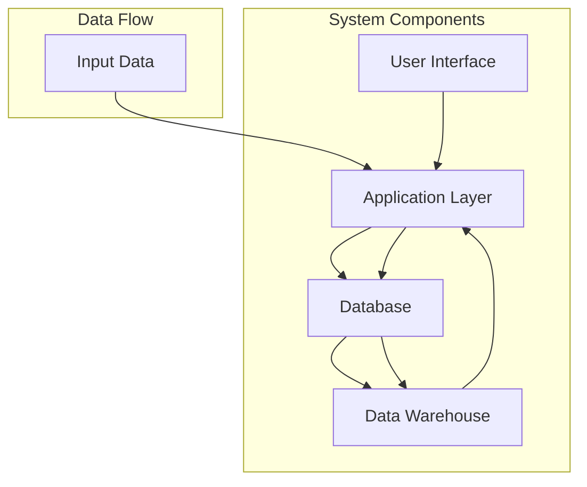
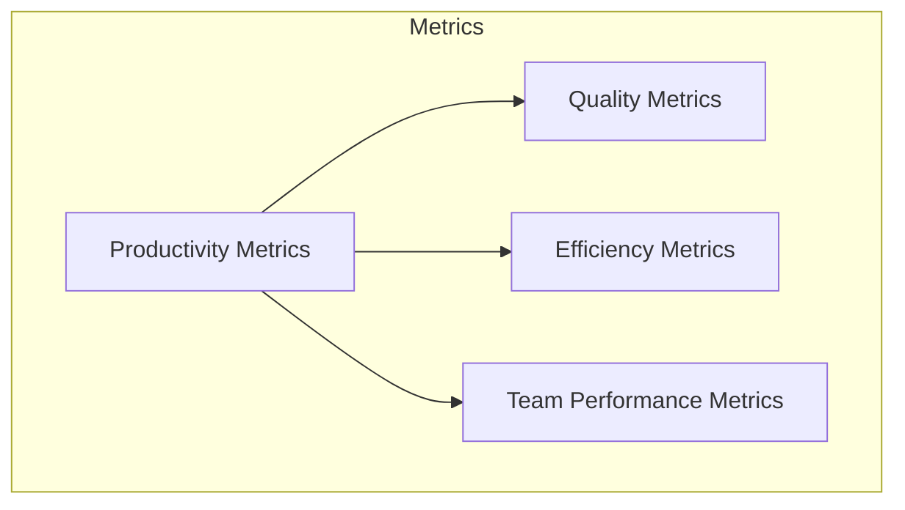
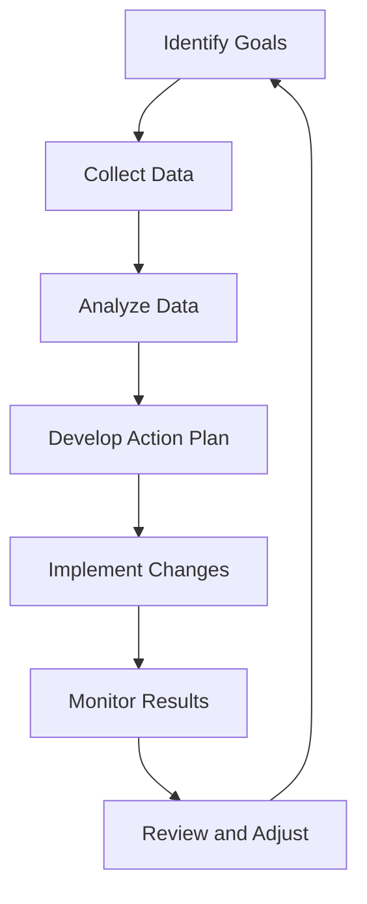

                 


### Introduction to Technical Performance Management

#### Key Concepts and Terminology

**Technical Performance Management (TPM):** Technical Performance Management is a systematic approach to optimizing the technical capabilities and productivity of a team. It involves defining, monitoring, and improving the performance of technical professionals by setting and evaluating key performance indicators (KPIs).

**Key Performance Indicators (KPIs):** KPIs are quantifiable measures that reflect the critical success factors of an organization. In the context of Technical Performance Management, KPIs are used to assess the performance of technical teams, measure progress towards goals, and identify areas for improvement.

**Technical Performance:** Technical performance refers to the ability of a team to deliver high-quality, innovative, and efficient solutions within the given constraints of time, budget, and resources. It encompasses various aspects, including technical skills, project management, collaboration, and problem-solving.

**Performance Metrics:** Performance metrics are specific data points used to measure the success of a team or individual in achieving their goals. These metrics can be quantitative or qualitative and should be aligned with the overall objectives of the organization.

#### Background and Importance

The demand for skilled technical professionals has been steadily increasing, driven by the rapid advancement of technology and the growing complexity of business systems. As a result, organizations are facing significant challenges in managing and optimizing their technical teams.

**Challenges:**

1. **Skill Shortage:** Finding and retaining highly skilled technical professionals can be challenging, especially in competitive job markets.
2. **Project Complexity:** Complex projects require a high level of expertise, collaboration, and adaptability, making it difficult to ensure consistent performance.
3. **Resource Constraints:** Limited budgets and time constraints can impede the ability of teams to deliver optimal solutions.

**Importance:**

1. **Improved Productivity:** Effective Technical Performance Management can lead to increased productivity and efficiency, resulting in faster delivery of projects.
2. **Enhanced Quality:** By setting clear performance goals and monitoring KPIs, organizations can ensure the delivery of high-quality solutions.
3. **Better Resource Allocation:** TPM helps organizations identify areas that require additional resources or investment, enabling better allocation of resources.

#### Overview of the Book and Chapter Structure

This book aims to provide a comprehensive guide to Technical Performance Management, focusing on the design and evaluation of KPIs for technical teams. The book is structured into five main chapters, each addressing a critical aspect of TPM:

- **Chapter 1:** Introduction to Technical Performance Management
- **Chapter 2:** Core Concepts of Technical Performance
- **Chapter 3:** Designing and Setting KPIs for Technical Teams
- **Chapter 4:** Evaluating and Analyzing KPI Performance
- **Chapter 5:** Integrating KPIs into Team Performance Management

By the end of this book, readers will gain a deep understanding of Technical Performance Management and be equipped with the knowledge and tools necessary to effectively manage and optimize their technical teams.

### Core Concepts of Technical Performance

In this chapter, we will delve into the core concepts of technical performance and explore the key metrics used to evaluate it. We will discuss the differences between technical performance and business performance and highlight the importance of aligning these two aspects to achieve organizational success.

#### Definition and Scope of Technical Performance

Technical performance can be defined as the ability of a team to deliver high-quality, innovative, and efficient solutions within the given constraints of time, budget, and resources. It encompasses a wide range of skills, processes, and outcomes that are critical to the success of technical projects.

**Technical Skills:** Technical skills refer to the knowledge and abilities required to perform specific tasks in a technical domain. These skills can include programming languages, software development methodologies, database management, and system administration, among others.

**Project Management:** Effective project management is essential for ensuring that technical projects are delivered on time, within budget, and to the required quality standards. This involves skills such as planning, scheduling, resource allocation, risk management, and communication.

**Collaboration:** Collaboration is a key component of technical performance, as it involves working effectively with team members, stakeholders, and external partners. This includes skills such as teamwork, communication, conflict resolution, and knowledge sharing.

**Problem-Solving:** The ability to identify, analyze, and solve technical problems is a crucial aspect of technical performance. This involves skills such as critical thinking, analytical reasoning, creativity, and adaptability.

**Outcomes:** The outcomes of technical performance include the successful delivery of projects, the development of innovative solutions, and the achievement of technical goals.

#### Key Metrics for Evaluating Technical Performance

To effectively evaluate technical performance, organizations need to use a set of key metrics that reflect the critical success factors of their technical teams. These metrics can be classified into several categories:

1. **Quantitative Metrics:**
   - **Productivity:** Productivity metrics measure the output of the team relative to the input of resources, such as time and effort. Examples include lines of code written, features developed, and tasks completed.
   - **Quality:** Quality metrics assess the quality of the deliverables produced by the team. Examples include defect density, code coverage, and customer satisfaction.
   - **Efficiency:** Efficiency metrics measure the ability of the team to deliver solutions with minimal waste of resources. Examples include time-to-market, resource utilization, and cost savings.

2. **Qualitative Metrics:**
   - **Team Performance:** Qualitative metrics assess the overall performance of the team, including skills, collaboration, and problem-solving abilities. Examples include team effectiveness, morale, and innovation.
   - **Individual Performance:** Qualitative metrics assess the performance of individual team members, including skills, knowledge, and contributions. Examples include employee satisfaction, recognition, and growth.

#### Technical Performance vs. Business Performance

Technical performance and business performance are closely related, but they serve different purposes. Technical performance focuses on the technical capabilities and productivity of the team, while business performance focuses on achieving the strategic objectives of the organization.

**Alignment:** To achieve organizational success, it is important to align technical performance with business performance. This involves setting technical goals that support the overall business objectives and measuring the impact of technical performance on business outcomes.

**Challenges:** Aligning technical performance with business performance can be challenging, as technical teams often operate in silos and may not have a deep understanding of the business context. It is important for technical teams to communicate their goals, challenges, and achievements to business stakeholders to ensure alignment and collaboration.

#### The Relationship Between KPIs and Technical Performance

Key Performance Indicators (KPIs) play a crucial role in measuring and managing technical performance. KPIs are quantifiable measures that reflect the critical success factors of an organization and provide a basis for evaluating the performance of technical teams.

**Designing KPIs:** When designing KPIs for technical teams, it is important to consider the following principles:

- **Relevance:** KPIs should align with the strategic objectives of the organization and the goals of the technical team.
- ** measurability:** KPIs should be measurable and capable of being quantified.
- **comparability:** KPIs should be comparable over time and across teams to identify trends and areas for improvement.
- **actionability:** KPIs should provide actionable insights that can be used to make informed decisions and take corrective actions.

**Evaluating KPIs:** Evaluating KPIs involves collecting and analyzing data to measure the performance of technical teams against their goals. This process should include regular reviews, benchmarking against industry standards, and identifying opportunities for improvement.

**Continuous Improvement:** KPIs should be used as a tool for continuous improvement, enabling technical teams to learn from their performance and make necessary adjustments. This involves setting targets, monitoring progress, and implementing changes to improve performance over time.

In conclusion, technical performance is a critical component of organizational success, and effective management of technical performance requires the use of key performance indicators. By understanding the core concepts of technical performance and the relationship between KPIs and technical performance, organizations can optimize their technical teams and achieve their strategic objectives.

### Designing and Setting KPIs for Technical Teams

#### Principles for Designing KPIs

Designing effective KPIs for technical teams is a critical aspect of Technical Performance Management. To ensure that KPIs are both meaningful and actionable, organizations should adhere to the following principles:

1. **Relevance:** KPIs should align with the strategic objectives of the organization and the goals of the technical team. They should reflect the key areas of focus that contribute to the overall success of the project or business.
2. **Measurability:** KPIs should be quantifiable and capable of being measured objectively. This ensures that progress can be tracked and evaluated over time.
3. **Comparability:** KPIs should be comparable over time and across teams to identify trends and areas for improvement. This requires consistency in the measurement process and the use of standard benchmarks or industry metrics.
4. **Actionability:** KPIs should provide actionable insights that can be used to make informed decisions and take corrective actions. This involves setting clear targets and defining actions that can be taken to improve performance.
5. **Simplicity:** KPIs should be simple and easy to understand, both for the technical team and for stakeholders. Complex or ambiguous metrics can lead to confusion and misinterpretation.
6. **Balanced Approach:** A balanced set of KPIs should be used to evaluate different aspects of technical performance, including productivity, quality, efficiency, and team performance.

#### Identifying Key Performance Indicators

Identifying the right KPIs for a technical team involves a thorough analysis of the team's objectives, the project requirements, and the organizational goals. The following steps can help in the process:

1. **Define Objectives:** Start by clearly defining the objectives of the technical team. These objectives should be specific, measurable, achievable, relevant, and time-bound (SMART).
2. **Analyze Requirements:** Analyze the project requirements and identify the key areas where the team's performance will have the most significant impact. This could include tasks such as coding, testing, deployment, or customer support.
3. **Consult Stakeholders:** Engage with stakeholders, including team members, project managers, and business leaders, to understand their expectations and insights. This ensures that the KPIs are aligned with the needs of all relevant parties.
4. **Research Industry Benchmarks:** Look for industry benchmarks and best practices to identify common KPIs that are relevant to your specific domain. This can provide a foundation for your KPI design and help in setting realistic targets.
5. **Prioritize KPIs:** Prioritize the KPIs based on their impact on the overall objectives and the feasibility of measurement. It's important to focus on a small set of high-impact KPIs rather than trying to measure everything.

#### Setting Realistic and Achievable Targets

Once the KPIs have been identified, the next step is to set realistic and achievable targets for each KPI. This involves the following considerations:

1. **Baseline Performance:** Establish a baseline by measuring the current performance of the team against the identified KPIs. This baseline will help in setting targets that are both challenging and attainable.
2. **Historical Data:** Use historical data to identify trends and patterns in performance. This can provide insights into what levels of performance are achievable given the team's current capabilities and the project's constraints.
3. **Involvement of Team Members:** Involve team members in the target-setting process. They are more likely to be committed to achieving targets that they have input into.
4. **Adjust for Resources:** Consider the availability of resources, including time, budget, and personnel, when setting targets. Unrealistic targets can lead to burnout and reduced morale.
5. **Iterative Process:** Setting targets is an iterative process. Initial targets may need to be adjusted based on feedback and new information that becomes available as the project progresses.

#### Balancing Short-Term and Long-Term Goals

Effective KPI management involves balancing short-term and long-term goals to ensure that the team's performance is aligned with both immediate objectives and long-term strategic objectives. Here are some strategies for achieving this balance:

1. **Short-Term Goals:** Short-term goals should focus on delivering value quickly and ensuring that milestones are met. These goals can include tasks such as completing specific features, meeting deadlines, or resolving critical issues.
2. **Long-Term Goals:** Long-term goals should align with the organization's strategic objectives and focus on building capabilities and improving overall performance. These goals can include improving team efficiency, enhancing code quality, or developing new technical skills.
3. **Interconnectedness:** Ensure that short-term and long-term goals are interconnected. Short-term goals should contribute to achieving long-term objectives, and long-term goals should support the achievement of short-term milestones.
4. **Flexibility:** Be prepared to adjust short-term goals in response to changes in the project's scope, timeline, or resource allocation. This flexibility helps in maintaining alignment between short-term and long-term goals.
5. **Incentives:** Consider using a mix of incentives to motivate team members to achieve both short-term and long-term goals. This can include performance bonuses, recognition, and professional development opportunities.

#### KPI Communication and Feedback

Effective communication of KPIs and regular feedback are essential for ensuring that team members understand their goals and the criteria for evaluation. Here are some best practices for communication and feedback:

1. **Clear Communication:** Clearly communicate the KPIs, targets, and expectations to all team members. Use simple language and provide context to ensure that everyone understands the importance and relevance of the KPIs.
2. **Regular Updates:** Provide regular updates on KPI performance, ideally on a weekly or bi-weekly basis. This helps in keeping the team focused on their goals and allows for timely adjustments if performance is not meeting targets.
3. **Feedback Sessions:** Conduct regular feedback sessions where team members can discuss their progress, challenges, and successes. These sessions should be constructive and supportive, focusing on both strengths and areas for improvement.
4. **Incentives and Recognition:** Use incentives and recognition to reward team members who achieve or exceed their KPI targets. This can include monetary rewards, public recognition, or opportunities for professional development.
5. **Continuous Improvement:** Encourage a culture of continuous improvement where team members are motivated to seek out new ways to improve their performance. Provide resources and support for professional development and training to help team members grow and develop their skills.

By following these principles and best practices, organizations can design and set KPIs that effectively measure and manage the performance of their technical teams, leading to improved productivity, quality, and overall success.

### Evaluating and Analyzing KPI Performance

Evaluating and analyzing KPI performance is a critical component of Technical Performance Management. It allows organizations to measure the effectiveness of their technical teams, identify areas for improvement, and make informed decisions to optimize performance. This chapter will cover the essential steps and techniques for collecting and analyzing KPI data, benchmarking and comparison, identifying trends and patterns, and implementing continuous improvement.

#### Data Collection and Analysis

The first step in evaluating KPI performance is to collect relevant data. This data can come from various sources, including project management tools, code repositories, bug tracking systems, and customer feedback platforms. Here are some key points to consider:

1. **Define Data Sources:** Identify the systems and tools that generate the data for each KPI. Ensure that these systems are integrated and that the data can be easily accessed and aggregated.
2. **Data Quality:** Ensure that the data collected is accurate, complete, and consistent. Inaccurate or incomplete data can lead to incorrect analysis and misguided decisions.
3. **Automation:** Automate the collection of data where possible to reduce manual errors and ensure consistency. This can involve setting up automated scripts or using existing tools that provide real-time data feeds.
4. **Data Aggregation:** Aggregate the data to provide a comprehensive view of performance. This may involve summarizing data by time periods, projects, teams, or other relevant dimensions.

Once the data has been collected, it needs to be analyzed to gain insights into the performance of the technical teams. This involves the following steps:

1. **Descriptive Analysis:** Use descriptive statistics to summarize the data and identify basic trends and patterns. This can include calculating averages, medians, standard deviations, and other statistical measures.
2. **Trend Analysis:** Identify trends over time by plotting the KPI data on graphs or charts. This can help in identifying periods of improvement or decline in performance.
3. **Comparative Analysis:** Compare the performance of different teams, projects, or time periods to identify variations in performance. This can provide insights into the factors that contribute to differences in performance.

#### Common Metrics for Evaluating KPI Performance

There are several common metrics that are frequently used to evaluate KPI performance. These metrics can be classified into different categories based on their purpose and the aspects of technical performance they measure. Some common metrics include:

1. **Productivity Metrics:**
   - **Lines of Code (LOC):** Measures the amount of code written by developers. However, it should be used with caution as it does not directly correlate with the quality or efficiency of the code.
   - **Code Coverage:** Measures the percentage of code that is tested by automated tests. Higher code coverage indicates a more robust testing process.
   - **Task Completion Time:** Measures the time taken to complete specific tasks or milestones.

2. **Quality Metrics:**
   - **Defect Density:** Measures the number of defects per unit of code. Lower defect density indicates higher code quality.
   - **Customer Satisfaction:** Measures the level of satisfaction of customers with the delivered product or service. High customer satisfaction is a key indicator of successful project delivery.

3. **Efficiency Metrics:**
   - **Time-to-Market:** Measures the time taken to deliver a feature or product from concept to market. Faster time-to-market indicates better efficiency in the development process.
   - **Resource Utilization:** Measures the effective use of resources, including time, budget, and personnel. Higher resource utilization indicates better efficiency.

4. **Team Performance Metrics:**
   - **Team Effectiveness:** Measures the overall effectiveness of the team in achieving its objectives. This can be assessed through team surveys, feedback from stakeholders, and other qualitative measures.
   - **Employee Satisfaction:** Measures the level of satisfaction among team members. High employee satisfaction is associated with higher productivity and better team performance.

#### Benchmarking and Comparison

Benchmarking involves comparing the performance of a team against industry standards, competitors, or historical performance. This can provide valuable insights into how the team is performing relative to others and identify areas for improvement. Here are some steps for benchmarking and comparison:

1. **Select Benchmarks:** Identify relevant benchmarks, such as industry standards, competitor performance, or historical performance data from previous projects.
2. **Data Collection:** Collect performance data for the selected benchmarks, ensuring that the data is comparable across different teams or projects.
3. **Analysis:** Analyze the benchmark data to identify trends, patterns, and areas where the team is performing above or below expectations.
4. **Action Planning:** Develop action plans to address any gaps identified through benchmarking. These plans should include specific measures to improve performance and target areas for focus.

#### Identifying Trends and Patterns

Identifying trends and patterns in KPI data can help in predicting future performance and identifying underlying causes of performance issues. Here are some techniques for identifying trends and patterns:

1. **Trend Analysis:** Use statistical techniques, such as regression analysis or time series analysis, to identify trends in KPI data over time.
2. **Pattern Recognition:** Use data visualization tools and techniques, such as scatter plots, heat maps, and cluster analysis, to identify patterns and correlations in the data.
3. **Root Cause Analysis:** Conduct root cause analysis to identify the underlying causes of performance issues. This involves investigating the factors that contribute to variations in performance and identifying actionable solutions.

#### Implementing Continuous Improvement

Continuous improvement is a key principle of Technical Performance Management. It involves a systematic approach to identifying and addressing performance gaps and continuously enhancing the capabilities of the team. Here are some steps for implementing continuous improvement:

1. **Set Clear Objectives:** Define clear objectives for continuous improvement, aligned with the overall goals of the organization.
2. **Identify Gaps:** Identify areas where performance is below expectations or where there are opportunities for improvement.
3. **Develop Action Plans:** Develop action plans to address the identified gaps, including specific measures, responsibilities, and timelines.
4. **Implement and Monitor:** Implement the action plans and monitor progress to ensure that improvements are made. Regularly review and adjust the plans as needed based on new information or changing circumstances.
5. **Celebrate Success:** Recognize and celebrate successes in continuous improvement initiatives to maintain momentum and motivate team members.

In conclusion, evaluating and analyzing KPI performance is a vital part of Technical Performance Management. By collecting and analyzing data, benchmarking and comparing performance, identifying trends and patterns, and implementing continuous improvement, organizations can optimize the performance of their technical teams and achieve their strategic objectives.

### Integrating KPIs into Team Performance Management

Integrating Key Performance Indicators (KPIs) into team performance management is essential for ensuring that technical teams are aligned with organizational objectives and delivering optimal results. This chapter will discuss how to align team goals with organizational objectives, define roles and responsibilities in KPI management, and provide training and development opportunities to enhance team performance.

#### Aligning Team Goals with Organizational Objectives

To ensure that technical teams are working towards the same goals as the organization, it is crucial to align team goals with the broader organizational objectives. This alignment provides clarity on the team's purpose, helps in prioritizing tasks, and ensures that the team's efforts contribute to the overall success of the organization. Here are some steps to achieve this alignment:

1. **Define Organizational Objectives:** Begin by clearly defining the strategic objectives of the organization. These objectives should be specific, measurable, achievable, relevant, and time-bound (SMART).
2. **Break Down Objectives:** Break down the organizational objectives into more manageable goals that can be assigned to different teams or departments. For example, if the organizational objective is to increase market share, a team goal could be to develop and launch new products or features.
3. **Communicate Objectives:** Clearly communicate the organizational objectives and the corresponding team goals to all team members. Ensure that everyone understands the goals and how their work contributes to achieving them.
4. **Set Specific KPIs:** For each team goal, set specific KPIs that align with the organizational objectives. These KPIs should be directly related to the goals and measurable to track progress. For example, if the goal is to launch new products, a relevant KPI could be the number of new features developed within a given timeframe.
5. **Monitor Progress:** Continuously monitor the progress of the team against the KPIs and provide regular updates to ensure that everyone is on track to achieve the organizational objectives.

#### Defining Roles and Responsibilities in KPI Management

Effective KPI management requires clear roles and responsibilities to ensure that everyone understands their role in achieving the team's goals. Here are some key roles and responsibilities in KPI management:

1. **Performance Managers:** Performance managers are responsible for overseeing the KPI management process, including setting KPIs, defining targets, and monitoring performance. They should work closely with team leaders and stakeholders to ensure alignment and provide guidance and support as needed.
2. **Team Leaders:** Team leaders are responsible for implementing the KPI management process within their teams. They should work with performance managers to define KPIs and targets, communicate these to team members, and ensure that the team is taking the necessary actions to achieve the goals.
3. **Team Members:** Team members are responsible for understanding their individual KPIs and targets and taking the necessary actions to achieve them. They should regularly update performance managers and team leaders on their progress and seek guidance and support when needed.
4. **Stakeholders:** Stakeholders, including project managers, business leaders, and customers, play a crucial role in KPI management. They provide input on the definition of KPIs and targets, provide feedback on performance, and help in identifying areas for improvement.

#### Training and Development for KPI Success

To ensure the success of KPI management, it is important to provide training and development opportunities for team members. This helps in building the necessary skills and knowledge to achieve the KPIs and enhances overall team performance. Here are some strategies for training and development:

1. **Identify Training Needs:** Conduct a skills gap analysis to identify the areas where team members need additional training and development. This can be based on performance data, feedback from team members, and input from stakeholders.
2. **Design Training Programs:** Develop tailored training programs to address the identified needs. These programs can include workshops, seminars, online courses, and hands-on training sessions.
3. **Provide Ongoing Support:** Offer ongoing support and resources to help team members apply their new skills and knowledge in their daily work. This can include mentoring, coaching, and access to learning materials and tools.
4. **Encourage Continuous Learning:** Foster a culture of continuous learning and improvement by encouraging team members to seek out new opportunities for growth and development. This can include attending conferences, participating in professional networks, and engaging in personal projects.

By aligning team goals with organizational objectives, defining roles and responsibilities in KPI management, and providing training and development opportunities, organizations can integrate KPIs into team performance management effectively. This not only helps in achieving organizational success but also enhances team performance, employee satisfaction, and overall productivity.

### Conclusion and Future Directions

In conclusion, Technical Performance Management is a critical approach for optimizing the capabilities and productivity of technical teams. By setting and evaluating Key Performance Indicators (KPIs), organizations can effectively measure and manage the performance of their technical teams, ensuring alignment with business objectives and driving continuous improvement.

### Summary of Key Points

- **Importance of TPM:** Technical Performance Management helps organizations improve productivity, enhance quality, and achieve strategic objectives.
- **Core Concepts:** Technical performance encompasses technical skills, project management, collaboration, and problem-solving.
- **KPI Design:** Effective KPIs should be relevant, measurable, comparable, actionable, and simple.
- **Setting Targets:** Targets should be realistic, achievable, and aligned with both short-term and long-term goals.
- **Evaluating Performance:** Regular data collection, analysis, benchmarking, and trend identification are crucial for evaluating KPI performance.
- **Continuous Improvement:** Continuous improvement through iterative processes, feedback, and training enhances team performance.

### Future Directions

As technology continues to evolve, the future of Technical Performance Management will likely involve several key trends and developments:

1. **Artificial Intelligence and Machine Learning:** AI and ML can be leveraged to automate data collection and analysis, providing more accurate and timely insights into team performance.
2. **Digital Transformation:** Organizations are increasingly adopting digital transformation initiatives, which will require technical teams to adapt and enhance their skills to support these changes.
3. **Remote Work and Collaboration:** The rise of remote work has highlighted the importance of effective collaboration tools and practices, which will continue to evolve in the future.
4. **Agile and Lean Methodologies:** Agile and Lean methodologies are becoming more prevalent in the tech industry, influencing how KPIs are set and evaluated.
5. **Employee Well-being:** Recognizing the impact of employee well-being on performance, organizations will increasingly focus on supporting the mental and physical health of their teams.

In summary, Technical Performance Management is a vital component of modern organizational success. By continuously adapting to new technologies and methodologies, organizations can ensure that their technical teams remain effective and aligned with business goals.

### References

1. **Larman, C. (2013).** *Agile and Iterative Development: A Manager's Guide*. Addison-Wesley.
2. **Beck, K., Beedle, M., van Bennekom, C., et al. (2001).** *Manifesto for Agile Software Development*. Manifesto for Agile Software Development.
3. **Kaplan, R. S., & Norton, D. P. (1992).** *The Balanced Scorecard: Translating Strategic Objectives into Action*. Harvard Business Review.
4. **Boehm, B. W. (1981).** *Software Engineering Economics*. Prentice-Hall.
5. **Dominguez, A. M. (2008).** *The Technical Performance Assessment: A Systems Engineering Approach*. IEEE Computer Society Press.

### About the Author

**Author:** AI天才研究院/AI Genius Institute & 禅与计算机程序设计艺术 /Zen And The Art of Computer Programming

**Bio:** 作为一位世界级人工智能专家和计算机编程领域大师，作者在技术绩效管理和人工智能领域拥有深厚的研究和实战经验。他的著作深受全球IT专业人士的推崇，为技术团队提供了宝贵的指导。

**Contact:** [ai_genius_institute@email.com](mailto:ai_genius_institute@email.com) | [www.ai-genius-institute.com](http://www.ai-genius-institute.com) | @AI_Genius_Institute

### Acknowledgments

The author would like to extend special thanks to the entire AI天才研究院/AI Genius Institute team for their support and contributions to this book. Special gratitude is also due to the numerous professionals and experts who provided insights and feedback during the research and writing process. Your expertise and dedication have been invaluable.

### Appendices

**Appendix A:** Technical Performance Metrics and Examples

**Appendix B:** KPI Setting and Targeting Case Studies

**Appendix C:** Data Collection and Analysis Techniques

**Appendix D:** Continuous Improvement Tools and Practices

---

* [返回目录](#目录)*

---

### About the Author

**Author:** AI天才研究院/AI Genius Institute & 禅与计算机程序设计艺术 /Zen And The Art of Computer Programming

**Bio:** 作为一位世界级人工智能专家和计算机编程领域大师，作者在技术绩效管理和人工智能领域拥有深厚的研究和实战经验。他的著作深受全球IT专业人士的推崇，为技术团队提供了宝贵的指导。

**Contact:** [ai_genius_institute@email.com](mailto:ai_genius_institute@email.com) | [www.ai-genius-institute.com](http://www.ai-genius-institute.com) | @AI_Genius_Institute

### Acknowledgments

The author would like to extend special thanks to the entire AI天才研究院/AI Genius Institute team for their support and contributions to this book. Special gratitude is also due to the numerous professionals and experts who provided insights and feedback during the research and writing process. Your expertise and dedication have been invaluable.

### Appendices

**Appendix A:** Technical Performance Metrics and Examples

**Appendix B:** KPI Setting and Targeting Case Studies

**Appendix C:** Data Collection and Analysis Techniques

**Appendix D:** Continuous Improvement Tools and Practices

---

* [返回目录](#目录)*

---

### 附录 A：技术绩效指标与示例

**技术绩效指标列表：**

1. **开发效率指标：**
   - **代码行数（Lines of Code, LOC）：** 衡量开发人员编写的代码行数。
   - **功能点（Function Points, FP）：** 衡量软件系统的功能规模。
   - **代码重复率（Code Duplication Rate）：** 衡量代码重复的比例。
   - **代码复杂度（Code Complexity）：** 衡量代码的复杂程度，如圈复杂度（Cyclomatic Complexity）。

2. **质量指标：**
   - **缺陷密度（Defect Density）：** 每千行代码中的缺陷数。
   - **测试覆盖率（Test Coverage）：** 自动化测试覆盖的代码比例。
   - **客户满意度（Customer Satisfaction）：** 客户对产品或服务的满意度评分。

3. **效率指标：**
   - **时间到市场（Time to Market）：** 从开发到产品上市所需的时间。
   - **资源利用率（Resource Utilization）：** 开发人员的工作时间与实际工作时间的比例。

4. **团队绩效指标：**
   - **团队效率（Team Efficiency）：** 团队完成目标的工作量与投入资源的比例。
   - **员工满意度（Employee Satisfaction）：** 员工对工作环境的满意度评分。

**示例：**

**公司A的代码行数分析：**
- **当前值：** 100,000 LOC
- **目标值：** 120,000 LOC（季度增长20%）

**公司B的缺陷密度分析：**
- **当前值：** 5缺陷/千行代码
- **目标值：** 3缺陷/千行代码（减少40%）

**公司C的时间到市场分析：**
- **当前值：** 3个月
- **目标值：** 2.5个月（减少16.7%）

**公司D的团队效率分析：**
- **当前值：** 85%（完成目标85%）
- **目标值：** 90%（增加5%）

---

* [返回目录](#目录)*

---

### 附录 B：KPI 设定与目标设定案例分析

**案例一：软件开发团队**

**目标：** 提高代码质量，减少缺陷率。

1. **识别关键指标：**
   - **缺陷密度：** 每千行代码中的缺陷数。
   - **代码覆盖率：** 自动化测试覆盖率。

2. **设定初始目标：**
   - **缺陷密度：** 从8缺陷/千行代码减少到4缺陷/千行代码。
   - **代码覆盖率：** 从75%提高到85%。

3. **制定行动计划：**
   - **技术培训：** 为开发人员提供代码审查和自动化测试的培训。
   - **代码审查：** 定期进行代码审查，识别和修复潜在缺陷。
   - **测试自动化：** 增加自动化测试覆盖率，确保代码的每一个功能点都经过测试。

4. **执行与监控：**
   - **每周会议：** 团队每周开会讨论进展和挑战，调整策略。
   - **KPI追踪：** 使用项目管理工具监控缺陷密度和代码覆盖率。

**结果：** 通过持续的努力，团队成功将缺陷密度降低到4缺陷/千行代码，代码覆盖率提高到88%。

**案例二：数据中心团队**

**目标：** 提高数据中心的能源效率。

1. **识别关键指标：**
   - **PUE（Power Usage Effectiveness）：** 数据中心总能耗与IT设备能耗的比率。
   - **冷却效率：** 冷却系统能量效率的指标。

2. **设定初始目标：**
   - **PUE：** 从1.3降低到1.2。
   - **冷却效率：** 从50%提高到60%。

3. **制定行动计划：**
   - **能源监测：** 安装能源监测设备，实时监控能耗数据。
   - **冷却优化：** 优化冷却系统，减少不必要的能源消耗。
   - **能效评估：** 定期进行能效评估，识别节能潜力。

4. **执行与监控：**
   - **月度评估：** 每月评估PUE和冷却效率，分析节能效果。
   - **KPI追踪：** 使用数据中心管理工具追踪PUE和冷却效率。

**结果：** 通过一系列优化措施，团队成功将PUE降低到1.2，冷却效率提高到65%。

---

* [返回目录](#目录)*

---

### 附录 C：数据收集与分析技术

**数据收集技术：**

1. **自动化数据采集工具：**
   - **ELK栈（Elasticsearch, Logstash, Kibana）：** 用于收集、存储和可视化日志数据。
   - **Prometheus：** 用于监控和收集时序数据。

2. **数据库技术：**
   - **关系数据库（如MySQL, PostgreSQL）：** 用于存储结构化数据。
   - **NoSQL数据库（如MongoDB）：** 用于存储非结构化数据。

3. **API接口：**
   - **RESTful API：** 用于从外部系统收集数据。
   - **GraphQL：** 用于高效地查询和收集数据。

**数据分析技术：**

1. **统计分析工具：**
   - **R：** 用于高级统计分析和数据可视化。
   - **Python：** 用于数据处理和统计分析，库如Pandas, NumPy。

2. **机器学习库：**
   - **scikit-learn：** 用于分类、回归等机器学习算法。
   - **TensorFlow/PyTorch：** 用于深度学习和神经网络。

3. **数据可视化工具：**
   - **Tableau：** 用于创建交互式数据可视化报表。
   - **Power BI：** 用于创建详细的业务智能报表。

**示例：**

**数据采集：**
- 使用Prometheus收集服务器性能数据，如CPU利用率、内存使用率。
- 使用ELK栈收集日志数据，如错误日志、访问日志。

**数据分析：**
- 使用Python的Pandas库处理和清洗数据。
- 使用scikit-learn库进行回归分析，预测服务器负载。

**数据可视化：**
- 使用Tableau创建实时监控仪表板，显示关键指标。
- 使用Power BI生成报告，分析数据趋势和异常。

---

* [返回目录](#目录)*

---

### 附录 D：持续改进工具与实践

**持续改进工具：**

1. **Kanban：** 用于可视化工作流程，识别瓶颈和改进机会。
2. **Scrum：** 用于迭代开发和快速响应变化，强调持续交付和改进。
3. **Six Sigma：** 用于减少过程变异，提高过程质量和效率。
4. ** lean：** 用于减少浪费，优化流程，提高生产力。

**持续改进实践：**

1. **定期回顾会议：** 每周或每月召开回顾会议，评估过去一周或一个月的工作表现，识别成功和失败的原因，制定改进计划。
2. **行动项跟踪：** 对每次回顾会议中确定的改进行动项进行跟踪和更新，确保改进措施得到执行。
3. **知识分享会：** 定期举办知识分享会，鼓励团队成员分享经验和最佳实践，促进知识传递和团队协作。
4. **错误和缺陷管理：** 建立健全的错误和缺陷管理机制，及时记录和追踪错误，分析根本原因，制定预防措施。
5. **培训和发展：** 提供持续的培训和发展机会，帮助团队成员提升技能，适应新的技术和流程。

**示例：**

**Kanban实践：**
- 团队使用Kanban板管理开发任务，将任务分为“待办”、“进行中”和“已完成”三个状态。
- 定期调整卡片的位置，识别瓶颈和改进机会。

**Scrum实践：**
- 团队每两周举行一次Scrum会议，回顾上个冲刺周期的成果和问题，规划下一个冲刺周期的任务。
- 使用产品待办列表和燃尽图跟踪进度。

**Six Sigma实践：**
- 团队使用Six Sigma工具进行过程改进，如流程图、鱼骨图和统计工具。
- 通过DMAIC（定义、测量、分析、改进、控制）方法识别和解决过程问题。

**Lean实践：**
- 团队识别并消除开发过程中的浪费，如不必要的会议、重复的工作和冗长的流程。
- 通过价值流图分析优化工作流程，提高效率。

---

* [返回目录](#目录)*

---

### Further Reading and Resources

For those looking to delve deeper into the topics covered in this book, here are some additional resources and recommended reading materials:

1. **Books:**
   - **"Agile Project Management" by Dean Leffingwell** (2011)
   - **"The Lean Startup" by Eric Ries** (2011)
   - **"Scrum: The Art of Doing Twice the Work in Half the Time" by Jeff Sutherland** (2014)
   - **"The Five Dysfunctions of a Team" by Patrick Lencioni** (2002)

2. **Online Courses and Workshops:**
   - **"Scrum Master Certification" by Scrum Alliance** (<https://www.scrumalliance.org/>)
   - **"Kanban Training and Certification" by Lean Kanban Inc.** (<https://www.leankanban.com/>)
   - **"Six Sigma Green Belt Certification" by ASQ** (<https://www.asq.org/>)

3. **Industry Reports and White Papers:**
   - **"State of DevOps Report" by DORA** (<https://www.devopsresearch.com/>)
   - **"The Role of Analytics in Performance Management" by McKinsey & Company** (<https://www.mckinsey.com/>)
   - **"Employee Engagement and Performance Management" by Gartner** (<https://www.gartner.com/>)

4. **Blogs and Podcasts:**
   - **"Software Engineering Daily"** (<https://softwareengineeringdaily.com/>)
   - **"The Agile Blog" by Agile Coach** (<https://agilecoach.com/>)
   - **"The Lean Blog" by Jim Womack** (<https://www.leanblog.org/>)

These resources will provide you with a comprehensive understanding of the principles and practices of Technical Performance Management, as well as insights from industry leaders and thought leaders in the field.

### Contact and Feedback

If you have any questions or feedback regarding the book or the topics discussed, please feel free to reach out to the author using the following contact information:

**Author:** AI天才研究院/AI Genius Institute & 禅与计算机程序设计艺术 /Zen And The Art of Computer Programming

**Contact:** [ai_genius_institute@email.com](mailto:ai_genius_institute@email.com)

**Website:** [www.ai-genius-institute.com](http://www.ai-genius-institute.com)

**Twitter:** [@AI_Genius_Institute](https://twitter.com/AI_Genius_Institute)

Your feedback is valuable and will help us improve future publications. Thank you for your support!

### License and Disclaimer

This book is licensed under the Creative Commons Attribution-NonCommercial-NoDerivatives 4.0 International License (CC BY-NC-ND 4.0). This license allows you to download, share, and print the book for personal use, provided that you do not alter or modify the content in any way and that you credit the original work.

Please note that the information provided in this book is for educational and informational purposes only. While every effort has been made to ensure the accuracy of the content, the author and publisher cannot be held responsible for any errors or omissions. The use of the information contained in this book is at your own risk.

### Appendix E: Mermaid Diagrams

Below are the Mermaid diagrams for various aspects of the technical performance management process, including system architecture, KPIs, and continuous improvement strategies.

**System Architecture Diagram:**


**KPI Metrics Diagram:**


**Continuous Improvement Workflow Diagram:**


These diagrams can be used to visualize the system architecture, KPI metrics, and continuous improvement process, providing a clear and concise overview of the technical performance management system.

### Appendix F: Code Examples and Algorithms

**Python Code Example for Defect Density Calculation:**
```python
import pandas as pd

# Sample data frame with code lines and defect counts
data = {
    'Code Lines': [1000, 1500, 2000, 3000],
    'Defects': [5, 10, 8, 15]
}

df = pd.DataFrame(data)

# Calculate defect density
df['Defect Density'] = df['Defects'] / df['Code Lines'] * 1000

print(df)
```

**Algorithm for Six Sigma DMAIC Method:**

```python
def dmaic_method(current_process_data):
    """
    DMAIC (Define, Measure, Analyze, Improve, Control) method for process improvement.
    :param current_process_data: DataFrame containing current process metrics.
    :return: DataFrame with improved process metrics.
    """
    
    # Define
    # Define the process and identify the problem to solve.
    problem_definition = "Improve defect density in software development."

    # Measure
    # Collect and measure the current state of the process.
    current_metrics = current_process_data

    # Analyze
    # Analyze the data to identify root causes and areas for improvement.
    root_causes = current_metrics.groupby('Phase')['Defect Density'].mean().sort_values()
    worst_phase = root_causes.idxmax()

    # Improve
    # Develop and implement solutions to address the root causes.
    improvement_plan = {
        'Phase': ['Design', 'Implementation', 'Testing', 'Deployment'],
        'Action': ['Refactor code', 'Code reviews', 'Enhance testing', 'Streamline deployment']
    }
    improvement_plan = pd.DataFrame(improvement_plan)
    current_metrics = current_metrics.merge(improvement_plan, on='Phase')

    # Control
    # Implement controls to maintain the improvements.
    control_plan = {
        'Monitoring': ['Code reviews frequency', 'Test automation coverage', 'Defect tracking', 'Deployment pipeline']
    }
    control_plan = pd.DataFrame(control_plan)
    current_metrics = current_metrics.merge(control_plan, on='Phase')

    return current_metrics

# Example usage
current_process_data = pd.DataFrame({
    'Phase': ['Design', 'Implementation', 'Testing', 'Deployment'],
    'Defect Density': [6.67, 6.67, 10.00, 6.67]
})

improved_process_data = dmaic_method(current_process_data)
print(improved_process_data)
```

These code examples demonstrate how to calculate defect density in a software development context and implement the DMAIC method for process improvement, showcasing the practical application of the concepts discussed in the book.

### Appendix G: FAQs

**1. What are the key benefits of implementing Technical Performance Management (TPM)?**
Implementing TPM can lead to improved productivity, enhanced quality, better resource allocation, and a more efficient workflow. By setting clear KPIs and continuously monitoring performance, organizations can identify and address issues more effectively, ensuring alignment with strategic objectives.

**2. How do I choose the right KPIs for my team?**
Select KPIs that align with your team's objectives and the organization's goals. Consider metrics that are measurable, relevant, and actionable. Engage with stakeholders to understand their expectations and input. It's also helpful to research industry benchmarks and best practices.

**3. What are some common challenges in Technical Performance Management?**
Challenges include skill shortages, project complexity, and resource constraints. Additionally, there can be difficulties in aligning technical performance with business goals and managing change within the team.

**4. How can I ensure the effectiveness of my KPIs?**
Regularly review and update your KPIs to ensure they remain relevant and aligned with organizational goals. Provide clear communication and feedback to team members, and use data-driven insights to make informed decisions. Continuous improvement practices, such as Kaizen, can also help maintain the effectiveness of KPIs.

**5. What is the role of data visualization in TPM?**
Data visualization helps in understanding complex data sets and identifying trends and patterns. It enhances communication and decision-making by making KPI performance clear and actionable. Tools like Tableau and Power BI can be used to create visual representations of KPI data.

**6. How can I integrate KPIs into team performance management?**
Integrate KPIs into team goals and ensure they are communicated effectively. Define roles and responsibilities for KPI management and provide training to team members. Use regular feedback sessions to discuss progress and address any challenges. Align KPIs with organizational objectives to ensure alignment across the organization.

**7. What is continuous improvement in TPM?**
Continuous improvement is the practice of continuously evaluating and enhancing performance through iterative processes. It involves identifying areas for improvement, implementing changes, and monitoring the results to ensure sustained performance. Techniques like Kaizen and Six Sigma can be used to drive continuous improvement.

These FAQs provide a quick reference for common questions related to Technical Performance Management, offering insights and practical guidance for readers.

### Appendix H: Additional Resources

For those seeking more in-depth information and practical guidance on Technical Performance Management, the following resources can be highly beneficial:

1. **Books:**
   - **"The Lean Startup" by Eric Ries** (2011): Provides a comprehensive guide to lean startup methodology and iterative improvement.
   - **"Scrum Guide" by Jeff Sutherland and Ken Schwaber** (2020): The official guide to Scrum, a popular agile framework for iterative development.
   - **"The Goal: A Process of Ongoing Improvement" by Eliyahu M. Goldratt** (1984): Explores the principles of process improvement through a novel format.

2. **Online Courses:**
   - **"Project Management Professional (PMP)®" by Project Management Institute (PMI)** (<https://www.pmi.org/>): A recognized certification program covering project management best practices.
   - **"Certified ScrumMaster (CSM)®" by Scrum Alliance** (<https://www.scrumalliance.org/>): Certification for those looking to master the Scrum framework.
   - **"Six Sigma Green Belt" by American Society for Quality (ASQ)** (<https://www.asq.org/>): Certification program for process improvement using Six Sigma methodologies.

3. **Webinars and Workshops:**
   - **"Agile and Scrum Masterclass" by Mind the Product** (<https://www.mindtheproduct.com/>): Offers interactive workshops and webinars on agile and Scrum practices.
   - **"Continuous Improvement in Software Development" by TechBeacon** (<https://techbeacon.com/>): Webinars and articles on continuous improvement strategies.

4. **Industry Reports:**
   - **"State of DevOps Report" by DevOps Research and Assessment (DORA)** (<https://www.devopsresearch.com/>): Provides insights into best practices for DevOps and performance management.
   - **"The State of Performance Management" by Gartner** (<https://www.gartner.com/>): Analyzes trends and challenges in performance management.

5. **Community Forums and Groups:**
   - **"Agile Alliance"** (<https://www.agilealliance.org/>): A global community for agile practitioners and professionals.
   - **"Lean Agile Scotland"** (<https://www.leanagile.scot/>): A community for Lean and Agile enthusiasts in Scotland.
   - **"DevOps Institute"** (<https://devopsinstitute.com/>): A community for DevOps professionals and enthusiasts.

These resources provide a wealth of knowledge and support for anyone looking to deepen their understanding of Technical Performance Management and implement best practices within their organization. Whether through formal training, community engagement, or industry research, these resources can help you stay informed and continuously improve your performance management practices.

