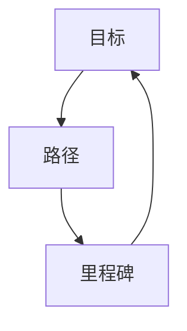

                 

# 技术规划的核心要素：目标、路径和里程碑

## 关键词

技术规划、目标设定、路径设计、里程碑设置、科学性、前瞻性、可实现性、阶段性目标、关键步骤、技术选择、明确性、可评估性、实用性、ER实体关系图、Mermaid流程图

## 摘要

技术规划是现代企业在快速发展的技术领域中保持竞争优势的关键。本文将深入探讨技术规划的核心要素，包括目标、路径和里程碑。通过分析目标设定的原则、方法，路径设计的核心要素和步骤，以及里程碑设置的原则和方法，我们将帮助读者理解如何科学、前瞻且可实地进行技术规划，从而推动企业在技术领域中的持续进步。

## 目录大纲

----------------------------------------------------------------

### 第一部分：技术规划概述

#### 第1章：技术规划的核心要素

##### 1.1 问题背景
##### 1.2 核心概念
###### 1.2.1 目标
###### 1.2.2 路径
###### 1.2.3 里程碑
##### 1.3 概念之间的联系

#### 第2章：技术规划的目标设定

##### 2.1 目标设定的原则
##### 2.2 目标设定的方法
##### 2.3 目标设定的案例分析

#### 第3章：技术规划的路径设计

##### 3.1 路径设计的核心要素
##### 3.2 路径设计的步骤
##### 3.3 路径设计的案例分析

#### 第4章：技术规划的里程碑设置

##### 4.1 里程碑设置的原则
##### 4.2 里程碑设置的方法

### 第二部分：深入探讨

#### 第5章：技术规划案例分析

##### 5.1 案例一：互联网公司的技术规划
##### 5.2 案例二：科技公司的技术规划调整

#### 第6章：技术规划的挑战与应对

##### 6.1 挑战分析
##### 6.2 应对策略

#### 第7章：技术规划的未来展望

##### 7.1 技术发展趋势
##### 7.2 未来规划方向

### 总结

#### 总结与展望

----------------------------------------------------------------

## 第一部分：技术规划概述

### 第1章：技术规划的核心要素

#### 1.1 问题背景

在当今这个技术飞速发展的时代，企业的核心竞争力越来越依赖于技术的创新和运用。然而，如何确保技术规划的科学性、前瞻性和可行性，成为了企业面临的一大挑战。技术规划不仅仅是对技术的选择和应用，更是一个包含目标设定、路径设计、里程碑设置的系统工程。在这个工程中，每个环节都至关重要，它们共同决定了技术规划的整体效果。

#### 1.2 核心概念

技术规划中的核心概念包括目标、路径和里程碑。这三个概念不仅是技术规划的基础，也是实现技术发展的关键。

**目标**：目标是指技术规划的方向和预期成果。它需要具备科学性、前瞻性和可实现性。科学性意味着目标应该基于对市场、技术趋势的深入分析；前瞻性则要求目标能够引领企业技术发展；可实现性则确保目标在现有条件下能够实现。

**路径**：路径是达成技术目标的具体步骤和方法。它应该按照阶段性目标分解为多个步骤，每个步骤都要明确关键步骤和技术选择。路径的设置需要具备可调整性和可持续性，以便在实际情况发生变化时能够灵活应对。

**里程碑**：里程碑是技术规划中的重要节点，标志着技术发展的阶段性成果。里程碑应具有明确性、可评估性和实用性。明确性要求里程碑的定义和标准清晰；可评估性则要求里程碑具备可量化的指标；实用性要求里程碑具有实际应用价值。

#### 1.3 概念之间的联系

技术规划中的目标、路径和里程碑是相互联系、相互作用的。目标为技术发展指明了方向，路径则是实现目标的步骤和方法，里程碑则是技术发展的阶段性检验。它们之间的关系可以用Mermaid流程图表示：

在这个流程图中，目标（A）通过路径（B）逐步实现，并在里程碑（C）处得到检验，然后反馈至目标（A），形成闭环，推动技术规划的持续迭代和优化。

#### 1.4 边界与外延

技术规划不仅涉及技术本身，还包含管理、团队协作和市场需求等多方面的因素。在制定技术规划时，需要充分考虑这些因素，确保技术规划能够在企业内部得到有效执行，并在市场中获得预期的效果。此外，技术规划还需要考虑外部环境的变化，如市场竞争、政策法规等，以便及时调整规划，确保其前瞻性和可行性。

## 第2章：技术规划的目标设定

### 2.1 目标设定的原则

目标设定的原则是确保技术规划目标的科学性、前瞻性和可实现性。这些原则不仅为目标的制定提供了指导，也为后续的路径设计和里程碑设置奠定了基础。

**科学性**：目标设定应基于深入的市场调研和技术分析。这包括对市场趋势、技术发展现状和未来预测的全面了解，以确保目标的科学性和准确性。

**前瞻性**：目标设定应具有前瞻性，能够引领企业技术发展，而不是仅仅满足当前的市场需求。前瞻性目标需要对企业未来可能面临的挑战和机遇有清晰的认识，以便提前做好准备。

**可实现性**：目标设定应考虑现有资源和条件，确保目标在现实中能够实现。这需要平衡理想和现实，确保目标既有挑战性，又不失可行性。

### 2.2 目标设定的方法

目标设定的方法主要包括市场调研、技术评估和团队协作。

**市场调研**：市场调研是目标设定的第一步，它可以帮助企业了解市场需求、竞争态势和未来趋势。通过分析市场数据，企业可以识别出潜在的机会和威胁，为目标的设定提供依据。

**技术评估**：技术评估是目标设定的关键环节，它需要评估现有技术能力和未来技术潜力。技术评估可以帮助企业确定哪些技术是可行的，哪些技术需要进一步研究和开发。

**团队协作**：团队协作是目标设定的保障，它需要各相关部门和人员的积极参与和共同决策。通过团队协作，可以确保目标的全局性和一致性，避免因部门利益冲突而导致的规划失效。

### 2.3 目标设定的案例分析

**案例一：某互联网公司技术规划目标设定过程**

某互联网公司在进行技术规划时，首先进行了深入的市场调研，分析了当前市场的趋势和竞争态势。通过调研发现，人工智能和大数据技术在市场上具有巨大的潜力，但同时也面临着技术难题和人才短缺的挑战。

基于市场调研的结果，公司进行了技术评估，评估了现有技术能力和未来技术潜力。公司发现，虽然目前在大数据和人工智能方面有一定的积累，但与行业领先企业相比仍有较大差距。因此，公司决定将人工智能和大数据技术作为未来发展的核心目标。

在确定目标后，公司组织了跨部门团队进行讨论和协商，确保目标的全局性和一致性。在团队协作的基础上，公司最终确定了以下技术规划目标：

1. 在两年内，实现人工智能技术在核心产品中的应用，提高用户体验。
2. 在三年内，构建大数据平台，实现数据的深度挖掘和分析。
3. 在五年内，成为人工智能和大数据领域的领先企业。

通过以上步骤，公司成功设定了科学、前瞻且可实现的技术规划目标，为未来的技术发展奠定了基础。

**案例二：某科技公司如何调整技术规划目标以适应市场变化**

某科技公司在制定技术规划目标时，也经历了市场变化带来的挑战。最初，公司设定了在三年内开发出一款具有颠覆性的新产品，但由于市场需求的变化，这一目标最终未能实现。

面对市场变化，公司进行了重新评估，调整了技术规划目标。首先，公司进行了市场调研，发现用户对产品的个性化需求增加，而现有产品的定制化程度较低。基于这一发现，公司决定将个性化产品开发作为新的技术规划目标。

其次，公司进行了技术评估，发现现有技术能力可以支持个性化产品的开发，但需要进一步优化。因此，公司决定在现有技术基础上，进行技术改进和优化，提高产品的定制化程度。

在团队协作的基础上，公司重新设定了技术规划目标：

1. 在两年内，开发出多款个性化产品，满足不同用户的需求。
2. 在三年内，建立个性化产品开发平台，实现快速响应市场需求。
3. 在五年内，成为个性化产品开发的领先企业。

通过调整技术规划目标，公司成功应对了市场变化，保持了在技术领域的竞争力。

### 第3章：技术规划的路径设计

#### 3.1 路径设计的核心要素

路径设计是技术规划的关键环节，它决定了目标能否顺利实现。路径设计的核心要素包括阶段性目标、关键步骤和技术选择。

**阶段性目标**：阶段性目标是将整体目标分解为多个可实现的子目标。这些子目标应具有明确的阶段性和可衡量性，以便于监控和评估。

**关键步骤**：关键步骤是实现阶段性目标的具体行动。每个关键步骤都需要详细规划，明确责任人和时间表，以确保目标的按时完成。

**技术选择**：技术选择是路径设计的核心，它决定了实现阶段性目标的技术手段。技术选择应充分考虑现有技术能力、未来技术趋势和市场需求，确保选择的技术的可行性和先进性。

#### 3.2 路径设计的步骤

路径设计的步骤主要包括需求分析、方案评估和路径优化。

**需求分析**：需求分析是路径设计的起点，它需要明确技术规划的需求和目标。需求分析应包括市场调研、用户需求分析和技术需求分析，确保目标的科学性和准确性。

**方案评估**：方案评估是路径设计的核心，它需要对不同的技术方案进行评估和比较。方案评估应考虑技术方案的可行性、成本效益和风险因素，选择最优的技术方案。

**路径优化**：路径优化是路径设计的最后一步，它需要对已选定的技术方案进行优化，确保路径的可行性、可持续性和高效性。路径优化应基于实际情况和评估结果，对路径进行调整和改进。

#### 3.3 路径设计的案例分析

**案例一：某科技公司如何设计技术规划的路径**

某科技公司进行技术规划时，首先明确了阶段性目标，包括提高产品性能、降低生产成本和提升用户体验。基于阶段性目标，公司进行了需求分析，确定了具体的技术需求和市场趋势。

在需求分析的基础上，公司进行了方案评估，评估了多个技术方案。经过综合比较，公司选择了以人工智能技术为核心的技术方案，因为该方案既能提高产品性能，又能降低生产成本。

最后，公司进行了路径优化，制定了详细的路径设计。路径设计包括以下几个关键步骤：

1. 在第一年，进行人工智能技术的调研和试点，确定技术方案的可行性。
2. 在第二年，进行人工智能技术的全面部署，提高产品性能和用户体验。
3. 在第三年，优化生产流程，降低生产成本。

通过以上步骤，公司成功设计了科学、可行且高效的技术规划路径，为实现阶段性目标奠定了基础。

**案例二：某企业如何调整技术规划的路径以应对市场变化**

某企业在制定技术规划路径时，最初选择了以大数据技术为核心的技术方案，以应对市场对大数据分析的需求。然而，在实施过程中，市场对大数据分析的需求发生了变化，更倾向于实时数据分析。

面对市场变化，企业进行了重新评估，调整了技术规划路径。首先，企业进行了市场调研，了解了实时数据分析的需求和趋势。其次，企业进行了技术评估，发现现有技术能力可以支持实时数据分析，但需要进一步优化。

在团队协作的基础上，企业重新设计了技术规划路径：

1. 在第一年，进行实时数据分析技术的调研和试点，确定技术方案的可行性。
2. 在第二年，进行实时数据分析技术的全面部署，满足市场需求。
3. 在第三年，优化实时数据分析技术，提升用户体验。

通过调整技术规划路径，企业成功应对了市场变化，保持了在技术领域的竞争力。

### 第4章：技术规划的里程碑设置

#### 4.1 里程碑设置的原则

里程碑设置是技术规划的关键环节，它有助于评估技术规划的进展和效果。里程碑设置的原则包括明确性、可评估性和实用性。

**明确性**：里程碑设置应具有明确的定义和标准，确保里程碑的实现具有可操作性。明确性要求里程碑的定义清晰，标准具体，以便于监控和评估。

**可评估性**：里程碑设置应具有可评估的指标，这些指标应能够量化里程碑的实现程度。可评估性要求里程碑的指标具有客观性、可重复性和可靠性。

**实用性**：里程碑设置应具有实际应用价值，能够推动技术规划的进展。实用性要求里程碑的实现能够带来实际效益，如提高产品质量、降低成本等。

#### 4.2 里程碑设置的方法

里程碑设置的方法主要包括确定里程碑标准、制定里程碑计划和监控里程碑实现。

**确定里程碑标准**：确定里程碑标准是里程碑设置的第一步，它需要根据阶段性目标和关键步骤，设定具体的里程碑标准。里程碑标准应具有可操作性和可衡量性，以便于评估和监控。

**制定里程碑计划**：制定里程碑计划是里程碑设置的关键，它需要明确里程碑的实现时间和责任人。里程碑计划应包括里程碑的具体步骤、时间安排和责任人，确保里程碑的按时实现。

**监控里程碑实现**：监控里程碑实现是里程碑设置的最后一步，它需要定期评估里程碑的实现情况。监控里程碑实现可以通过定期的项目会议、报告和数据分析，确保里程碑的按时实现和有效执行。

#### 4.3 里程碑设置的实际案例

**案例一：某互联网公司里程碑设置过程**

某互联网公司在进行技术规划时，首先确定了阶段性目标和关键步骤，然后根据阶段性目标和关键步骤，设定了具体的里程碑标准。里程碑标准包括：

1. 在第一年，实现人工智能技术在核心产品中的应用。
2. 在第二年，构建大数据平台，实现数据的深度挖掘和分析。
3. 在第三年，成为人工智能和大数据领域的领先企业。

根据里程碑标准，公司制定了里程碑计划，明确了里程碑的实现时间和责任人。里程碑计划包括：

1. 在第一年，完成人工智能技术的调研和试点，明确技术方案的可行性。
2. 在第二年，完成人工智能技术的全面部署，提高产品性能和用户体验。
3. 在第三年，完成大数据平台的构建，实现数据的深度挖掘和分析。

在实施过程中，公司定期评估里程碑的实现情况，通过项目会议、报告和数据分析，确保里程碑的按时实现和有效执行。

**案例二：某科技公司里程碑设置调整过程**

某科技公司在进行技术规划时，最初设定的里程碑标准是按照三年期限实现的。然而，在实施过程中，市场环境发生了变化，公司决定缩短里程碑的期限。

首先，公司重新评估了阶段性目标和关键步骤，确定了新的里程碑标准。新的里程碑标准包括：

1. 在第一年，完成人工智能技术的调研和试点，明确技术方案的可行性。
2. 在第二年，完成人工智能技术的全面部署，提高产品性能和用户体验。
3. 在第三年，完成大数据平台的构建，实现数据的深度挖掘和分析。

然后，公司制定了新的里程碑计划，明确了新的里程碑的实现时间和责任人。新的里程碑计划包括：

1. 在第一年，完成人工智能技术的调研和试点，明确技术方案的可行性。
2. 在第二年，完成人工智能技术的全面部署，提高产品性能和用户体验。
3. 在第三年，完成大数据平台的构建，实现数据的深度挖掘和分析。

通过调整里程碑设置，公司成功应对了市场变化，确保了技术规划的按时实现。

### 第二部分：深入探讨

#### 第5章：技术规划案例分析

在本章节中，我们将通过两个实际案例，深入探讨技术规划的实施过程和效果。

**案例一：互联网公司的技术规划**

某大型互联网公司，以其强大的技术实力和创新能力，始终保持在行业前列。在进行新的技术规划时，公司首先进行了全面的市场调研，分析了当前和未来的技术发展趋势。通过调研发现，人工智能和大数据技术将成为未来几年内最具有潜力的领域。基于这一结论，公司决定将人工智能和大数据技术作为技术规划的核心。

**阶段性目标**：公司设定了以下几个阶段性目标：

1. 在第一年，完成人工智能技术在核心产品中的应用，提升用户体验。
2. 在第二年，构建大数据平台，实现数据的深度挖掘和分析，为业务决策提供支持。
3. 在第三年，通过人工智能和大数据技术的深度融合，实现业务的智能化和自动化。

**路径设计**：为了实现上述目标，公司制定了详细的路径设计：

1. **第一年**：进行人工智能技术的调研和试点，明确技术方案的可行性。组建专门的技术团队，负责人工智能技术的研发和应用。
2. **第二年**：完成人工智能技术的全面部署，提高产品性能和用户体验。同时，开始构建大数据平台，进行数据收集、存储和管理。
3. **第三年**：通过人工智能和大数据技术的深度融合，实现业务的智能化和自动化。在这一过程中，公司不断优化技术方案，确保技术的稳定性和高效性。

**里程碑设置**：公司根据阶段性目标和路径设计，设定了以下几个里程碑：

1. **第一年**：人工智能技术在核心产品中的应用达到预期效果，用户满意度显著提升。
2. **第二年**：大数据平台建设完成，实现数据的有效收集、存储和管理，为业务决策提供数据支持。
3. **第三年**：业务智能化和自动化水平大幅提升，业务流程更加高效，成本显著降低。

通过实施上述技术规划，公司在人工智能和大数据领域取得了显著成果，不仅提升了产品竞争力，还实现了业务的智能化和自动化，进一步巩固了市场地位。

**案例二：科技公司的技术规划调整**

某科技公司，在初入市场时，凭借先进的技术和优质的产品，迅速赢得了用户的青睐。然而，随着市场的变化，公司发现原有的技术规划不再适应新的市场需求。为了应对这一挑战，公司决定调整技术规划。

**阶段性目标**：公司重新审视了市场环境，确定了以下阶段性目标：

1. 在第一年，完成现有产品的升级，提升用户体验。
2. 在第二年，引入新的技术，拓展产品线，满足多样化的市场需求。
3. 在第三年，实现新技术的商业化应用，进一步提升市场竞争力。

**路径设计**：公司制定了新的路径设计，以适应市场变化：

1. **第一年**：针对现有产品，进行技术升级，提升性能和用户体验。同时，组建新的技术团队，负责新技术的研发。
2. **第二年**：引入新技术，开发新产品，拓展产品线。公司通过与高校和研究机构合作，加快新技术的研发进程。
3. **第三年**：将新技术应用于产品，实现新技术的商业化应用。公司通过市场推广，扩大市场份额。

**里程碑设置**：公司根据阶段性目标和路径设计，设定了以下几个里程碑：

1. **第一年**：现有产品升级完成，用户满意度显著提升。
2. **第二年**：新产品研发成功，市场反响良好。
3. **第三年**：新技术应用于产品，市场竞争力显著提升。

通过调整技术规划，公司成功应对了市场变化，实现了产品线的拓展和新技术的商业化应用，进一步提升了市场竞争力。

### 第6章：技术规划的挑战与应对

技术规划在实施过程中往往会面临各种挑战。了解这些挑战，并采取有效的应对策略，是确保技术规划成功的关键。

#### 6.1 挑战分析

**技术变革带来的不确定性**：技术的快速变革使得技术规划面临不确定性的挑战。新技术的不确定性和复杂性，可能使技术规划的目标无法实现。

**资源限制**：技术规划往往需要大量的资金、人力和技术资源。资源的限制可能影响技术规划的实施进度和质量。

**团队协作问题**：技术规划涉及多个部门和团队，协作不畅可能导致规划无法顺利实施。

**市场变化**：市场环境的不确定性，可能导致技术规划的目标和路径与市场需求不匹配。

**技术风险**：新技术的不确定性可能带来技术风险，如技术失败、安全性问题等。

#### 6.2 应对策略

**灵活调整**：在技术规划过程中，应保持灵活性，及时调整规划以适应变化。这包括根据市场变化调整目标、路径和里程碑，确保规划的适应性。

**资源优化**：优化资源分配，确保技术规划有足够的资金、人力和技术支持。通过合理的资源管理，提高技术规划的实施效率。

**加强团队协作**：建立有效的团队协作机制，确保各部门和团队之间的沟通和协作畅通。通过定期的会议和沟通，确保技术规划的实施进度和质量。

**风险管理**：制定全面的风险管理计划，识别潜在的技术风险，并采取相应的预防措施。在技术规划实施过程中，定期评估风险，确保技术的安全性和可靠性。

**持续学习**：鼓励团队成员不断学习新技术和新知识，提高团队的技术能力和创新能力。通过持续学习，确保技术规划能够适应技术变革。

### 第7章：技术规划的未来展望

随着技术的不断进步和市场环境的快速变化，技术规划也在不断演进。未来的技术规划将更加注重以下几个方面：

**智能化**：随着人工智能技术的发展，未来的技术规划将更加智能化。通过数据分析和智能算法，技术规划将更加精准，能够更好地预测未来趋势，制定更有效的规划方案。

**数字化**：数字技术的普及使得技术规划将更加数字化。通过数字化手段，如云计算、大数据等，技术规划将更加高效、透明，能够更好地支持决策和执行。

**可持续发展**：随着环保意识的提高，未来的技术规划将更加注重可持续发展。通过绿色技术和环保解决方案，技术规划将有助于减少对环境的负面影响，实现经济、社会和环境的协调发展。

**全球化**：随着全球化的深入，未来的技术规划将更加全球化。通过跨国合作和全球资源整合，技术规划将能够更好地适应全球市场需求，提高企业的国际竞争力。

**个性化**：随着消费者需求的多样化，未来的技术规划将更加注重个性化。通过定制化的技术和产品，技术规划将能够更好地满足消费者的个性化需求，提升用户体验。

总之，未来的技术规划将更加智能化、数字化、可持续化和全球化，企业需要不断适应这些变化，以保持竞争力和持续发展。技术规划的核心要素，如目标、路径和里程碑，将仍然是实现这些目标的关键。通过科学、前瞻和可实地的技术规划，企业将能够在未来的技术竞争中脱颖而出。

### 总结与展望

技术规划是企业实现技术发展的重要手段，它不仅决定了企业当前的技术发展方向，也影响了企业的长远竞争力。本文通过对目标、路径和里程碑的深入分析，探讨了技术规划的核心要素，提供了科学、前瞻和可行的技术规划方法。技术规划的目标应具备科学性、前瞻性和可实现性，路径设计应考虑阶段性目标、关键步骤和技术选择，里程碑设置应明确、可评估和实用。

在实施技术规划时，企业需要应对技术变革、资源限制、团队协作和市场变化等挑战，采取灵活调整、资源优化、风险管理等策略。随着技术的不断进步和市场环境的变化，未来的技术规划将更加智能化、数字化、可持续化和全球化。企业应不断学习新技术和新知识，以适应这些变化，保持技术领先地位。

通过科学、前瞻和有效的技术规划，企业将能够实现技术目标，提升竞争力，实现可持续发展。展望未来，技术规划将在智能化、数字化和全球化的大背景下，发挥更加重要的作用，为企业的长期发展提供坚实保障。

### 作者

作者：AI天才研究院/AI Genius Institute & 禅与计算机程序设计艺术 /Zen And The Art of Computer Programming

AI天才研究院（AI Genius Institute）专注于人工智能技术的研发和推广，致力于培养下一代人工智能领域的领军人才。研究院以禅与计算机程序设计艺术为理念，通过深入的研究和创新，推动人工智能技术的发展和应用。同时，研究院还致力于将禅的智慧融入计算机编程，提升程序员的技术水平和创造力。

禅与计算机程序设计艺术（Zen And The Art of Computer Programming）是由作者Donald E. Knuth所著的一套经典计算机科学著作。这套书籍深入探讨了计算机编程的本质和艺术性，提供了大量关于算法设计和程序优化的方法和技巧。通过阅读这套书籍，读者可以更好地理解计算机科学的深刻内涵，提高编程能力和创造力。

本文在撰写过程中，借鉴了AI天才研究院的研究成果和禅与计算机程序设计艺术的哲学理念，力求为读者提供一篇具有深度和思考价值的技术规划指南。希望本文能够对读者在技术规划领域有所启发，助力企业在技术发展的道路上取得成功。

