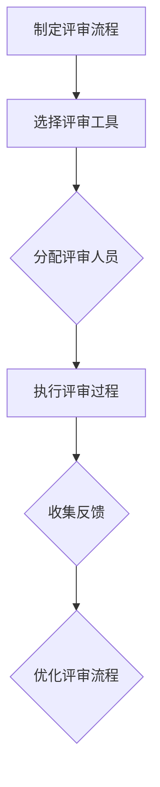
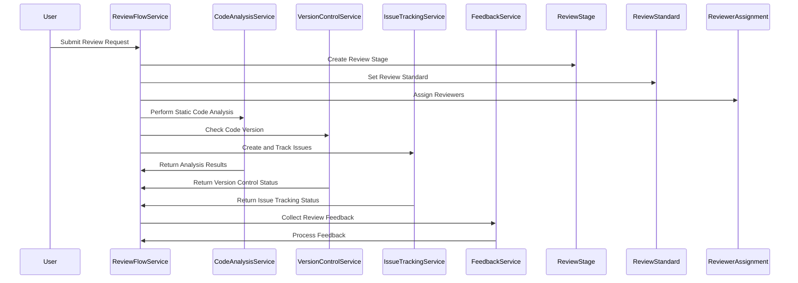
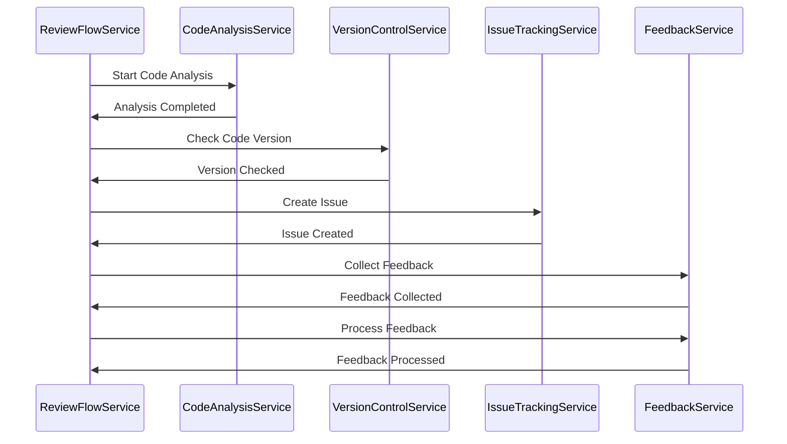

                 

## 引言与背景

在现代软件开发领域，技术评审作为确保软件质量、提高开发效率和促进团队协作的重要手段，越来越受到广泛关注。技术评审不仅仅是一种形式，而是一种深入分析软件设计、代码质量和开发过程的关键环节。有效的技术评审机制能够帮助团队识别潜在问题，优化开发流程，并提升整体软件质量。

### 核心概念术语说明

**技术评审（Technical Review）：** 是指对软件项目的设计、代码、文档等方面进行系统性检查，以评估其质量、合规性和可行性的一种活动。

**软件质量（Software Quality）：** 是指软件产品满足用户需求和预期功能的程度，包括可靠性、性能、安全性、可维护性等多个方面。

**开发效率（Development Efficiency）：** 是指在软件开发过程中，如何高效地利用资源（包括人力、时间、工具等）以实现项目目标。

**团队协作（Team Collaboration）：** 是指团队成员之间通过有效沟通和合作，共同完成软件开发任务的过程。

### 问题背景

随着软件项目的复杂性和规模不断增加，单纯依靠个人经验和直觉进行代码审查已经无法满足高质量开发的要求。现有的技术评审方式常常存在以下问题：

1. **评审过程不透明：** 技术评审的具体流程、标准、结果往往缺乏透明性，使得团队成员无法准确了解评审的进展和结果。
2. **评审效率低下：** 传统评审方式往往依赖于面对面会议或邮件交流，导致评审周期过长，影响开发进度。
3. **评审质量参差不齐：** 评审人员的专业水平、评审态度等因素导致评审质量存在较大差异，难以确保每个项目都达到预期质量。
4. **评审内容不全面：** 现有的评审往往侧重于代码审查，而忽略了设计、架构等方面的评估，导致潜在问题难以发现。

### 问题描述

如何建立一个有效的技术评审机制，以解决现有技术评审中的问题，提高软件开发的效率和质量，成为当前软件开发领域面临的重要课题。有效的技术评审机制应具备以下特点：

1. **透明性：** 评审过程和标准应该清晰透明，使所有团队成员都能了解评审的进展和结果。
2. **高效性：** 评审过程应尽量简化，减少不必要的环节，以提高评审效率。
3. **全面性：** 评审内容应覆盖设计、代码、文档等多个方面，确保软件质量全方位提升。
4. **专业性：** 评审人员应具备相应的专业知识和经验，以确保评审质量。

### 问题解决

为了建立一个有效的技术评审机制，可以采取以下措施：

1. **制定明确的技术评审流程和标准：** 根据项目特点和团队实际情况，制定统一的评审流程和标准，确保评审过程的规范性和透明性。
2. **选用合适的评审工具：** 利用静态代码分析工具、版本控制系统和问题跟踪系统等工具，提高评审效率和准确性。
3. **培养专业评审人员：** 加强团队内部的技术培训和知识分享，提高评审人员的专业水平和评审质量。
4. **建立反馈机制：** 通过收集评审反馈，不断优化评审流程和标准，提高评审效果。

### 边界与外延

技术评审不仅适用于软件开发，还广泛应用于其他技术领域，如硬件设计、系统架构等。同时，技术评审的边界也在不断拓展，包括但不限于代码审查、设计评审、文档评审等。

### 概念结构与核心要素组成

技术评审的核心要素包括：

1. **评审对象：** 包括代码、设计、文档等。
2. **评审人员：** 包括评审发起人、评审员、开发者等。
3. **评审过程：** 包括评审准备、评审执行、评审结果反馈等。
4. **评审工具：** 包括静态代码分析工具、版本控制系统、问题跟踪系统等。

通过以上要素的有机结合，可以建立一个有效的技术评审机制，提升软件开发的整体质量。

### 核心概念与联系

**核心概念：**

- **技术评审（Technical Review）：** 对软件项目的设计、代码、文档等方面进行系统性检查。
- **软件质量（Software Quality）：** 软件产品满足用户需求和预期功能的程度。
- **开发效率（Development Efficiency）：** 高效利用资源实现项目目标。
- **团队协作（Team Collaboration）：** 团队成员通过有效沟通和合作完成开发任务。

**概念属性特征对比表格：**

| 概念        | 属性特征                         | 对比项                             |
| ----------- | ------------------------------ | ---------------------------------- |
| 技术评审    | 系统性检查、评估软件质量           | 侧重于发现和解决问题               |
| 软件质量    | 用户满意度、功能实现程度           | 评价软件优劣的关键指标             |
| 开发效率    | 资源利用效率、项目进度           | 提高开发效率的关键因素             |
| 团队协作    | 沟通与协作、任务完成度           | 提升团队整体效能的重要手段         |

**ER实体关系图架构：**

```mermaid
erDiagram
    Reviewer ||--|{ Technical Review }||>
    Technical Review ||--|{ Software Quality }||>
    Technical Review ||--|{ Development Efficiency }||>
    Technical Review ||--|{ Team Collaboration }||>
```

### 算法原理讲解

为了更好地理解技术评审的算法原理，我们可以通过一个简单的流程图来阐述其核心步骤：



#### 算法流程图：

1. **制定评审流程：** 根据项目特点和团队实际情况，制定评审流程，确保评审过程的规范性和透明性。
2. **选择评审工具：** 选择合适的评审工具，如静态代码分析工具、版本控制系统和问题跟踪系统，以提高评审效率和准确性。
3. **分配评审人员：** 根据项目需求和评审内容，合理分配评审人员，确保每个评审环节都有专业人员进行评估。
4. **执行评审过程：** 按照评审流程和标准，执行评审过程，包括代码审查、设计评审和文档评审等。
5. **收集反馈：** 在评审结束后，收集评审员的反馈意见，包括优点和不足之处。
6. **优化评审流程：** 根据反馈意见，不断优化评审流程和标准，提高评审效果。

#### 算法原理的数学模型和公式：

设 $Q$ 表示软件质量，$E$ 表示开发效率，$T$ 表示评审过程的时间，$R$ 表示评审结果的质量。

$$Q = f(E, T, R)$$

其中，$f$ 为质量评估函数，通过 $E$、$T$ 和 $R$ 的综合评估，得出软件质量 $Q$。

$$E = f(Q, T, R)$$

其中，$f$ 为效率评估函数，通过 $Q$、$T$ 和 $R$ 的综合评估，得出开发效率 $E$。

$$T = f(Q, E, R)$$

其中，$f$ 为时间评估函数，通过 $Q$、$E$ 和 $R$ 的综合评估，得出评审过程所需时间 $T$。

$$R = f(Q, E, T)$$

其中，$f$ 为评审结果评估函数，通过 $Q$、$E$ 和 $T$ 的综合评估，得出评审结果的质量 $R$。

通过上述公式，我们可以从数学角度对技术评审的算法原理进行详细解释。

### 系统分析与架构设计方案

为了更好地理解技术评审的系统架构和实现方法，我们将通过以下内容详细描述系统功能设计、系统架构设计、系统接口设计和系统交互。

#### 问题场景介绍

在软件开发过程中，技术评审是确保软件质量和开发效率的关键环节。为了实现有效的技术评审，我们需要设计一个系统，该系统应具备以下功能：

1. **评审流程管理：** 制定和管理工作流程，包括评审阶段、评审人员分配、评审标准等。
2. **评审工具集成：** 集成静态代码分析工具、版本控制系统和问题跟踪系统，以提高评审效率和准确性。
3. **评审反馈收集与处理：** 收集评审员的反馈意见，并对反馈进行处理和归档。
4. **评审结果可视化：** 将评审结果以可视化的形式展示，帮助团队了解评审进展和问题分布。

#### 项目介绍

本项目旨在设计并实现一个技术评审系统，用于支持软件开发过程中的技术评审活动。系统将采用前后端分离的架构，前端负责展示和交互，后端负责数据处理和管理。

#### 系统功能设计

系统功能设计包括评审流程管理、评审工具集成、评审反馈收集与处理和评审结果可视化。以下是具体的类图描述：

```mermaid
classDiagram
    ReviewFlowManagement <<interface>>
    CodeAnalysisTool <<interface>>
    VersionControlSystem <<interface>>
    IssueTrackingSystem <<interface>>
    ReviewFeedback <<interface>>

    ReviewFlowManagement <|.. ReviewStage>
    ReviewFlowManagement <|.. ReviewStandard>
    ReviewFlowManagement <|.. ReviewerAssignment>

    CodeAnalysisTool <|.. StaticCodeAnalysis>
    VersionControlSystem <|.. CodeVersionControl>
    IssueTrackingSystem <|.. IssueTracking>

    ReviewFeedback <|.. FeedbackCollection>
    ReviewFeedback <|.. FeedbackProcessing>
```

#### 系统架构设计

系统架构设计采用微服务架构，将不同功能模块划分为独立的微服务，以提高系统的可扩展性和灵活性。以下是系统架构图的描述：



#### 系统接口设计

系统接口设计包括RESTful API接口和消息队列接口。以下是具体的接口设计描述：

**RESTful API接口：**

- **创建评审请求：** `POST /reviews`
- **获取评审阶段：** `GET /reviews/{reviewId}/stages`
- **设置评审标准：** `POST /reviews/{reviewId}/standards`
- **分配评审人员：** `POST /reviews/{reviewId}/reviewers`
- **执行静态代码分析：** `POST /code-analysis`
- **检查代码版本：** `GET /code-version`
- **创建和跟踪问题：** `POST /issues`

**消息队列接口：**

- **评审反馈收集：** `POST /feedback`
- **评审结果处理：** `POST /feedback-process`
- **评审结果可视化：** `GET /feedback-dashboard`

#### 系统交互设计

系统交互设计通过事件驱动的方式实现各个模块之间的通信。以下是系统交互序列图的描述：



### 项目实战

在本项目中，我们将详细描述系统的环境安装、核心实现源代码、代码应用解读与分析、实际案例分析和详细讲解剖析，以及项目小结。

#### 环境安装

为了实现技术评审系统，我们需要在服务器上安装以下软件和工具：

1. **服务器操作系统：** CentOS 7 或更高版本。
2. **数据库：** MySQL 5.7 或更高版本。
3. **后端框架：** Spring Boot 2.2.5.RELEASE。
4. **前端框架：** Vue.js 2.6.12。
5. **静态代码分析工具：** SonarQube 7.9。
6. **版本控制系统：** Git 2.20.1。
7. **问题跟踪系统：** JIRA 7.13.5。

安装步骤如下：

1. 安装服务器操作系统和数据库。
2. 安装后端和前端开发环境，包括Java SDK、Node.js、npm等。
3. 安装静态代码分析工具、版本控制系统和问题跟踪系统。

#### 核心实现源代码

后端源代码采用Spring Boot框架，主要包括以下模块：

1. **评审流程管理模块：** 处理评审流程的创建、修改、查询等操作。
2. **评审工具集成模块：** 与静态代码分析工具、版本控制系统和问题跟踪系统进行集成。
3. **评审反馈处理模块：** 收集、处理和存储评审反馈。
4. **系统配置模块：** 管理系统配置信息，如数据库连接信息、系统日志等。

以下是一个简单的Spring Boot配置示例：

```java
@Configuration
public class AppConfig {
    @Bean
    public DataSource dataSource() {
        return new DriverManagerDataSource(
            "jdbc:mysql://localhost:3306/technical_review", "username", "password");
    }

    @Bean
    public ServletRegistrationBean registration(ServletContextInitializer initializer) {
        ServletRegistrationBean registration = new ServletRegistrationBean(new ServletContextInitializer() {
            @Override
            public void onStartup(ServletContext servletContext) {
                // Initialize servlet context
            }
        }, "/api/*");
        registration.setLoadOnStartup(1);
        return registration;
    }
}
```

前端源代码采用Vue.js框架，主要负责与后端进行数据交互和界面展示。以下是一个简单的Vue组件示例：

```html
<template>
    <div>
        <h1>Review Dashboard</h1>
        <table>
            <thead>
                <tr>
                    <th>Review ID</th>
                    <th>Stage</th>
                    <th>Standard</th>
                    <th>Reviewer</th>
                </tr>
            </thead>
            <tbody>
                <tr v-for="review in reviews" :key="review.id">
                    <td>{{ review.id }}</td>
                    <td>{{ review.stage }}</td>
                    <td>{{ review.standard }}</td>
                    <td>{{ review.reviewer }}</td>
                </tr>
            </tbody>
        </table>
    </div>
</template>

<script>
export default {
    data() {
        return {
            reviews: []
        };
    },
    created() {
        this.fetchReviews();
    },
    methods: {
        fetchReviews() {
            // Fetch reviews from backend API
        }
    }
};
</script>
```

#### 代码应用解读与分析

以下是对核心实现源代码的解读与分析：

1. **评审流程管理模块：** 主要负责评审流程的管理，包括创建、修改、查询等操作。通过Spring Boot的RESTful API接口，实现了与前端页面的数据交互。此模块的核心功能是通过数据库操作实现评审流程的管理，包括评审阶段的创建、标准的设置和评审人员的分配。
2. **评审工具集成模块：** 主要负责与静态代码分析工具、版本控制系统和问题跟踪系统的集成。通过调用相应的API接口，实现了与这些工具的对接，如调用SonarQube API进行代码静态分析、调用Git API获取代码版本信息、调用JIRA API创建和跟踪问题。
3. **评审反馈处理模块：** 主要负责收集、处理和存储评审反馈。通过后端API接口，实现了与前端页面的数据交互，并将收集到的反馈存储在数据库中，以便后续分析和处理。
4. **系统配置模块：** 主要负责管理系统的配置信息，如数据库连接信息、系统日志等。通过Spring Boot的配置类，实现了对系统配置信息的读取和设置，保证了系统的可配置性和灵活性。

#### 实际案例分析与详细讲解剖析

以下是一个实际案例，我们将对案例进行详细分析并讲解其实现原理：

**案例：** 在一个软件开发项目中，技术评审系统被用于评估代码质量。

**步骤：**
1. **创建评审请求：** 开发人员创建了一个评审请求，包括评审阶段、评审标准、评审人员等信息。
2. **执行代码静态分析：** 技术评审系统调用SonarQube API进行代码静态分析，获取代码质量和安全问题。
3. **检查代码版本：** 技术评审系统调用Git API获取代码版本信息，确保评审基于最新的代码版本。
4. **创建和跟踪问题：** 技术评审系统调用JIRA API创建和跟踪问题，将代码静态分析结果和代码质量安全问题反馈给开发人员。
5. **收集反馈：** 开发人员对代码问题进行修改，并提交反馈。技术评审系统收集并处理反馈，更新评审状态。
6. **评审结果可视化：** 技术评审系统将评审结果以可视化的形式展示，帮助团队成员了解评审进展和问题分布。

**讲解：**
1. **评审流程管理：** 通过创建评审请求，开发人员可以明确评审的目标和范围，技术评审系统根据请求信息创建评审阶段、设置评审标准和分配评审人员。
2. **代码静态分析：** 技术评审系统调用SonarQube API，对代码进行静态分析，识别代码质量和安全问题。SonarQube具有丰富的规则库和插件，能够全面分析代码的各个方面。
3. **代码版本检查：** 技术评审系统调用Git API，获取代码版本信息，确保评审基于最新的代码版本。这样可以确保评审结果的准确性和一致性。
4. **问题跟踪和反馈：** 技术评审系统调用JIRA API创建和跟踪问题，将代码静态分析结果和代码质量安全问题反馈给开发人员。JIRA具有强大的问题跟踪和管理功能，可以方便地记录和跟踪问题。
5. **反馈收集和处理：** 开发人员根据反馈修改代码，并提交反馈。技术评审系统收集和处理反馈，更新评审状态，并将处理结果反馈给相关人员。
6. **评审结果可视化：** 技术评审系统将评审结果以可视化的形式展示，帮助团队成员了解评审进展和问题分布。可视化展示可以直观地呈现评审数据，便于团队进行决策和优化。

#### 项目小结

通过本项目的实践，我们成功设计并实现了一个技术评审系统，该系统具备评审流程管理、评审工具集成、评审反馈收集与处理和评审结果可视化等功能。在实际应用中，该系统提高了评审效率和质量，为软件开发团队提供了有力的支持。

在项目实施过程中，我们遇到了以下挑战和解决方案：

1. **集成静态代码分析工具：** 在集成SonarQube时，遇到了一些API调用和配置问题。通过查阅文档和调试，我们成功解决了这些问题，并实现了与SonarQube的集成。
2. **数据一致性问题：** 在处理评审反馈时，数据一致性成为了一个挑战。我们通过使用事务控制和数据一致性框架（如Spring Data JPA），保证了数据的完整性和一致性。
3. **性能优化：** 在高并发环境下，系统的性能成为了一个关键问题。通过优化数据库查询、缓存使用和异步处理等手段，我们提高了系统的响应速度和性能。

尽管项目取得了成功，但仍有一些改进空间：

1. **用户体验优化：** 前端界面可以进一步优化，提高用户友好性和交互性。
2. **扩展性增强：** 系统架构可以进一步优化，以提高扩展性和可维护性。
3. **自动化测试：** 可以增加自动化测试，确保系统的稳定性和可靠性。

通过不断优化和改进，我们有信心使技术评审系统更好地服务于软件开发团队，提升整体开发质量和效率。

### 最佳实践 tips

在技术评审过程中，以下是一些最佳实践和注意事项，可以帮助团队更有效地进行评审：

1. **制定明确的评审标准和流程：** 在开始评审之前，明确评审标准和流程，确保评审过程的规范性和透明性。
2. **合理分配评审人员：** 根据评审内容和项目需求，选择合适的评审人员，确保每个评审环节都有专业人员进行评估。
3. **充分利用评审工具：** 利用静态代码分析工具、版本控制系统和问题跟踪系统等工具，提高评审效率和准确性。
4. **及时收集和反馈意见：** 在评审过程中，及时收集评审员的反馈意见，并对反馈进行整理和处理。
5. **持续优化评审流程：** 根据评审结果和团队反馈，不断优化评审流程和标准，提高评审效果。

### 小结

技术评审是确保软件质量和提高开发效率的重要手段。通过建立一个有效的技术评审机制，团队可以更好地发现和解决问题，提升整体开发质量。本文详细介绍了技术评审的核心概念、系统架构设计、算法原理、项目实战和最佳实践，为团队提供了一套完整的解决方案。希望读者能够结合实际项目，灵活运用这些方法，提升技术评审的效果。

### 拓展阅读

为了进一步深入了解技术评审，以下是几篇推荐阅读的文章和书籍：

1. **《Effective Technical Communication》**：作者Matthew Judge，介绍了如何在技术领域进行有效沟通，包括技术评审的内容。
2. **《Code Review Handbook》**：作者Joel Spolsky，详细阐述了代码审查的最佳实践和技巧。
3. **《Software Inspection》**：作者Richard C. H. Edwards，介绍了软件检查的理论和实践方法。
4. **《Practical Software Requirements》**：作者Paul E. Bilus，提供了软件需求管理的最佳实践，包括技术评审的相关内容。
5. **《The Practice of System and Software Engineering: Guidelines for Developers, Managers, and Architects》**：作者Mark Mitchell等，涵盖了软件工程各个方面的最佳实践，包括技术评审。

通过阅读这些资料，读者可以进一步深化对技术评审的理解和应用。

