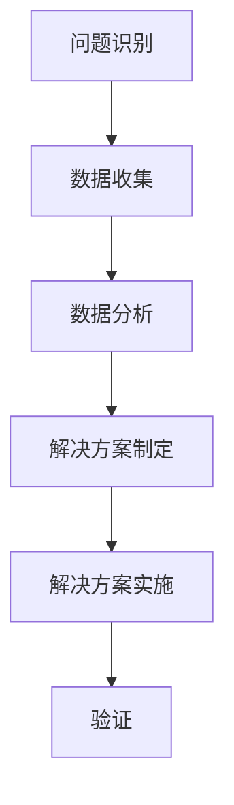
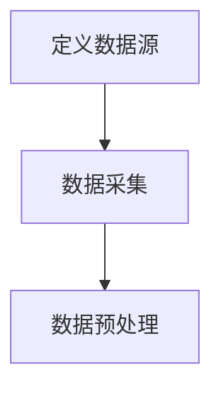
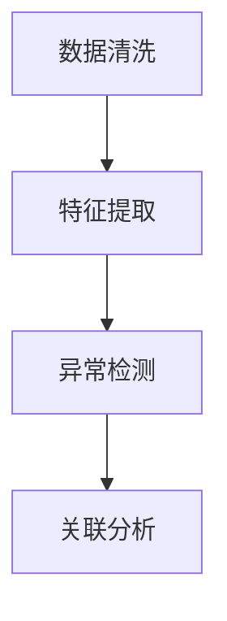
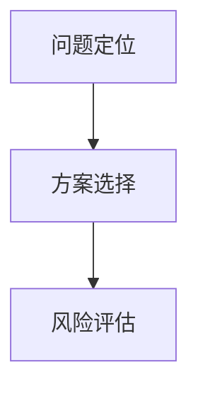
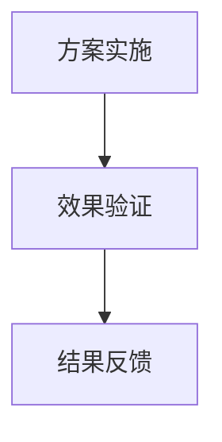
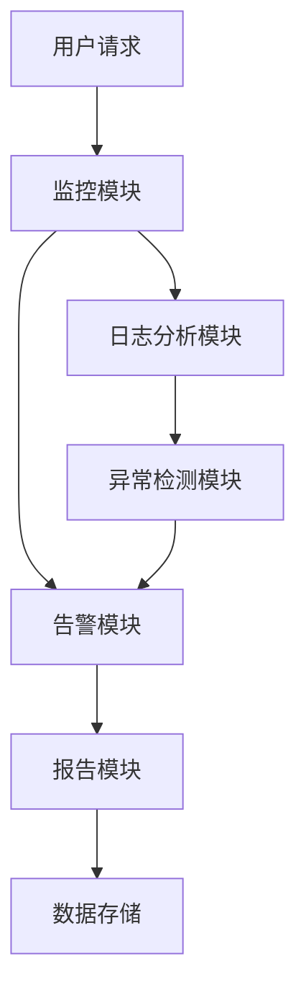
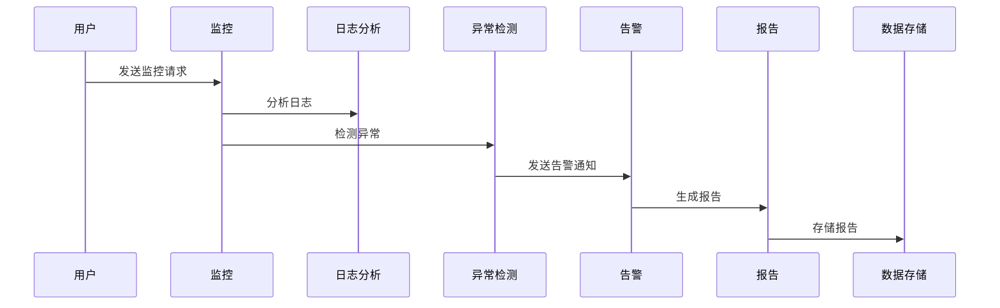

                 

### 第1章: 引言

#### 1.1 问题背景

在当今快速发展的技术领域，技术诊断已成为解决复杂技术问题的重要手段。技术诊断不仅涵盖了硬件故障的排查，还包括软件问题、网络问题以及其他技术难题的定位与解决。随着技术复杂度的增加，技术诊断的难度也在不断提升。例如，在互联网、人工智能、大数据等领域，技术的快速迭代和跨界融合使得问题变得更加复杂，传统的诊断方法往往难以奏效。

#### 1.2 问题描述

复杂技术问题通常具有以下特点：

- **多维度问题**：技术问题可能涉及硬件、软件、网络等多个层面。
- **变化快速**：技术不断更新迭代，问题表现和解决方案也在不断变化。
- **不确定性高**：技术问题往往具有高度不确定性，导致诊断过程复杂且耗时。

#### 1.3 问题解决

有效的技术诊断需要以下步骤：

1. **明确问题**：准确界定问题的范围和性质。
2. **数据收集**：收集与问题相关的数据，如日志、性能指标等。
3. **分析数据**：通过数据分析找出问题的根源。
4. **制定解决方案**：根据分析结果制定针对性的解决方案。
5. **实施与验证**：实施解决方案并进行验证，确保问题得到解决。

#### 1.4 边界与外延

技术诊断不仅局限于硬件和软件，还涉及网络、数据、安全等多个方面。其外延包括但不限于：

- **硬件故障诊断**：包括服务器、存储设备、网络设备等。
- **软件问题排查**：包括操作系统、数据库、中间件、应用软件等。
- **网络故障排查**：包括网络连接、网络性能、网络安全等。
- **数据问题分析**：包括数据异常、数据丢失、数据不一致等。
- **安全事件响应**：包括安全漏洞、攻击事件等。

#### 1.5 概念结构与核心要素组成

技术诊断的核心概念包括：

- **故障模式**：技术问题可能出现的各种故障模式。
- **诊断工具**：用于诊断的软件和硬件工具。
- **诊断流程**：从问题识别到解决方案实施的完整流程。
- **诊断专家**：具备诊断技能和经验的专业人士。

这些概念共同构成了技术诊断的理论体系，为解决复杂技术问题提供了指导。

#### 1.6 本章小结

本章介绍了技术诊断的背景、问题描述、问题解决方法、边界与外延以及核心概念结构。理解这些内容将为后续章节的学习打下基础，帮助读者更好地掌握技术诊断的实践技巧。

----------------------------------------------------------------

### 第2章: 核心概念与联系

#### 2.1 技术诊断的基本原理

##### 2.1.1 技术诊断的定义与目的

技术诊断是指通过科学的方法和工具，对计算机系统中的故障或问题进行定位、分析和解决的过程。其目的是快速、准确地找出问题的根源，并提供有效的解决方案。

##### 2.1.2 技术诊断的核心概念

1. **故障模式**：故障模式是指系统在运行过程中可能出现的问题类型。
2. **诊断工具**：诊断工具包括硬件诊断工具和软件诊断工具，如硬件检测工具、网络诊断工具、系统监控工具等。
3. **诊断流程**：诊断流程通常包括问题识别、数据收集、问题分析、解决方案制定和实施等步骤。
4. **诊断专家**：诊断专家是指具备丰富诊断经验和技能的专业人士。

#### 2.2 技术诊断的属性特征对比表格

| 特征         | 故障模式       | 诊断工具       | 诊断流程       | 诊断专家       |
| ------------ | -------------- | -------------- | -------------- | -------------- |
| **定义**     | 系统可能的问题 | 用于检测的工具 | 从识别到解决的流程 | 具备诊断能力的人 |
| **作用**     | 确定问题类型   | 辅助诊断过程  | 提供解决方案     | 提高诊断效率   |
| **特点**     | 多样性        | 功能丰富       | 结构化流程      | 经验丰富       |

#### 2.3 ER实体关系图架构

```mermaid
erDiagram
  故障模式 ||--o{ 诊断工具 : 使用 }
  故障模式 ||--o{ 诊断流程 : 流程包含 }
  故障模式 ||--o{ 诊断专家 : 专业知识 }
  诊断工具 ||--o{ 诊断流程 : 需要流程 }
  诊断工具 ||--o{ 诊断专家 : 使用工具 }
  诊断流程 ||--o{ 诊断专家 : 遵循流程 }
```

通过上述图表，我们可以清晰地看到技术诊断的各个核心概念之间的联系和交互关系。故障模式是技术诊断的起点，诊断工具和诊断流程则是实现诊断的核心手段，而诊断专家则是在诊断过程中起到关键作用的因素。

#### 2.4 小结

本章详细介绍了技术诊断的基本原理、核心概念及其属性特征，并通过ER实体关系图展示了它们之间的联系。这些内容为理解技术诊断提供了坚实的基础，为后续章节的深入探讨奠定了基础。

----------------------------------------------------------------

### 第3章: 算法原理与流程

#### 3.1 算法概述

技术诊断过程可以看作是一种算法的实现，该算法旨在通过一系列步骤定位并解决问题。算法的核心思想可以归纳为以下步骤：

1. **问题识别**：通过用户反馈、系统监控等方式识别出可能存在的问题。
2. **数据收集**：收集与问题相关的数据，如系统日志、性能数据等。
3. **数据分析**：对收集到的数据进行分析，以找出问题的根源。
4. **解决方案制定**：根据数据分析结果，制定相应的解决方案。
5. **解决方案实施**：执行解决方案，并进行验证。

下面我们将使用Mermaid绘制技术诊断算法的流程图：



#### 3.2 数据收集

数据收集是技术诊断过程中至关重要的一步。有效的数据收集可以提供丰富的信息，有助于快速定位问题。以下是一个简单的数据收集算法步骤：

1. **定义数据源**：确定需要收集的数据类型和数据来源，如系统日志、网络流量等。
2. **数据采集**：使用相应的工具或API从数据源中采集数据。
3. **数据预处理**：对采集到的数据进行清洗、转换等预处理操作，以确保数据的质量和一致性。

以下是数据收集算法的Mermaid流程图：



#### 3.3 数据分析

数据分析是技术诊断的核心步骤，通过对收集到的数据进行分析，可以找出问题的根源。以下是一个简单的数据分析算法步骤：

1. **数据清洗**：对数据集进行清洗，去除无效或不一致的数据。
2. **特征提取**：从数据集中提取与问题相关的特征。
3. **异常检测**：使用统计方法或机器学习算法检测数据中的异常值。
4. **关联分析**：分析数据之间的关联性，以找出问题的潜在原因。

以下是数据分析算法的Mermaid流程图：



#### 3.4 解决方案制定

根据数据分析的结果，制定相应的解决方案。解决方案的制定需要考虑以下几个方面：

1. **问题定位**：明确问题的具体位置和性质。
2. **方案选择**：选择合适的解决方案，如修复、优化、更换等。
3. **风险评估**：评估解决方案可能带来的风险，包括技术风险和业务风险。

以下是解决方案制定算法的Mermaid流程图：



#### 3.5 解决方案实施

实施解决方案并验证其有效性。以下是解决方案实施算法的步骤：

1. **方案实施**：按照制定的解决方案执行相应的操作。
2. **效果验证**：验证解决方案是否有效，如问题是否解决、性能是否提升等。
3. **结果反馈**：根据验证结果进行反馈和调整，以优化解决方案。

以下是解决方案实施算法的Mermaid流程图：



#### 3.6 小结

本章详细介绍了技术诊断算法的基本原理和流程，包括数据收集、数据分析、解决方案制定和实施等步骤。通过Mermaid流程图，我们能够更加直观地理解这些步骤，为后续的实际应用提供了理论基础。

----------------------------------------------------------------

### 第4章: 系统分析与架构设计

#### 4.1 问题场景介绍

假设我们正在开发一个在线教育平台，该平台需要支持大规模用户的同时访问，并且提供高质量的视频流和实时互动功能。在这样的场景下，技术诊断系统需要具备高效、可靠的特点，以便在出现故障时能够迅速定位并解决问题，确保用户体验。

#### 4.2 项目介绍

技术诊断系统项目的主要目标是：

- **故障快速定位**：通过实时监控和分析，快速定位系统中的故障。
- **性能优化**：监测系统性能，提供性能优化建议。
- **安全性保障**：检测和预防潜在的安全威胁。

#### 4.3 系统功能设计

系统功能设计包括以下几个关键模块：

- **监控模块**：实时监控系统的各种性能指标，如CPU使用率、内存占用、网络流量等。
- **日志分析模块**：分析系统日志，识别异常行为和故障模式。
- **异常检测模块**：使用机器学习算法检测系统中的异常情况。
- **告警模块**：在发现异常时，及时向管理员发送告警通知。
- **报告模块**：生成详细的故障诊断报告，帮助管理员理解故障原因和解决方案。

以下是系统功能设计的Mermaid类图：

```mermaid
classDiagram
  ClassDef 监控模块
      +--实时监控性能指标
  ClassDef 日志分析模块
      +--分析系统日志
  ClassDef 异常检测模块
      +--使用机器学习算法
  ClassDef 告警模块
      +--发送告警通知
  ClassDef 报告模块
      +--生成诊断报告
  监控模块 --|> 日志分析模块
  监控模块 --|> 异常检测模块
  日志分析模块 --|> 告警模块
  异常检测模块 --|> 告警模块
  告警模块 --|> 报告模块
```

#### 4.4 系统架构设计

系统架构设计需要考虑以下几个方面：

- **模块化设计**：将系统划分为不同的模块，以提高系统的可维护性和扩展性。
- **分布式部署**：将系统部署在多个服务器上，以提高系统的可用性和容错能力。
- **数据存储**：使用分布式数据库来存储监控数据和日志数据。

以下是系统架构设计的Mermaid架构图：



#### 4.5 系统接口设计

系统接口设计需要定义各个模块之间的交互接口，包括数据接口、控制接口和通信接口。以下是系统接口设计的Mermaid序列图：



#### 4.6 小结

本章详细介绍了技术诊断系统的功能设计、系统架构设计和系统接口设计。通过Mermaid图表，我们能够直观地理解系统的工作原理和模块交互。这些设计为技术诊断系统的实现提供了详细的指导。

----------------------------------------------------------------

### 第5章：项目实战

#### 5.1 环境安装

在本节中，我们将介绍如何安装技术诊断系统的开发环境和所需依赖。

1. **安装Python环境**：确保您的系统中已经安装了Python 3.8或更高版本。可以通过以下命令进行安装：

    ```bash
    sudo apt-get update
    sudo apt-get install python3.8
    ```

2. **安装相关依赖**：使用pip命令安装项目所需的依赖，包括Mermaid、Flask等。在项目根目录下执行以下命令：

    ```bash
    pip install mermaid
    pip install Flask
    ```

3. **安装数据库**：根据需要，您可以选择安装MySQL、PostgreSQL或其他数据库。以下是安装MySQL的步骤：

    ```bash
    sudo apt-get install mysql-server
    sudo mysql_secure_installation
    ```

4. **配置数据库**：根据实际需求配置数据库用户和权限，例如创建一个名为`diagnosis`的数据库，并为用户`diagnosis_user`授予相应的权限：

    ```sql
    CREATE DATABASE diagnosis;
    GRANT ALL PRIVILEGES ON diagnosis.* TO 'diagnosis_user'@'localhost' IDENTIFIED BY 'password';
    FLUSH PRIVILEGES;
    ```

5. **启动服务**：在项目根目录下启动Flask服务：

    ```bash
    flask run
    ```

#### 5.2 系统核心实现

在本节中，我们将介绍技术诊断系统的核心实现，包括监控模块、日志分析模块和告警模块。

1. **监控模块**

    监控模块负责实时监控系统的性能指标，如CPU使用率、内存占用和网络流量。以下是一个简单的Python代码示例：

    ```python
    import psutil

    def get_system_metrics():
        cpu_usage = psutil.cpu_percent()
        memory_usage = psutil.virtual_memory().percent
        network_usage = psutil.net_io_counters().bytes_sent + psutil.net_io_counters().bytes_recv
        return cpu_usage, memory_usage, network_usage

    if __name__ == "__main__":
        while True:
            cpu_usage, memory_usage, network_usage = get_system_metrics()
            print(f"CPU Usage: {cpu_usage}%, Memory Usage: {memory_usage}%, Network Usage: {network_usage} bytes")
            time.sleep(60)
    ```

2. **日志分析模块**

    日志分析模块负责分析系统日志，识别异常行为和故障模式。以下是一个简单的Python代码示例：

    ```python
    import re

    def analyze_logs(log_file):
        with open(log_file, 'r') as f:
            logs = f.readlines()

        errors = []
        for line in logs:
            if re.search(r"ERROR", line):
                errors.append(line.strip())

        return errors

    if __name__ == "__main__":
        errors = analyze_logs("system.log")
        print(f"Found {len(errors)} errors:")
        for error in errors:
            print(error)
    ```

3. **告警模块**

    告警模块负责在发现异常时向管理员发送告警通知。以下是一个简单的Python代码示例：

    ```python
    import smtplib
    from email.mime.text import MIMEText

    def send_alert(email, subject, message):
        server = smtplib.SMTP('smtp.gmail.com', 587)
        server.starttls()
        server.login("your_email@gmail.com", "your_password")

        msg = MIMEText(message)
        msg['Subject'] = subject
        msg['From'] = "your_email@gmail.com"
        msg['To'] = email

        server.sendmail("your_email@gmail.com", email, msg.as_string())
        server.quit()

    if __name__ == "__main__":
        send_alert("admin@example.com", "System Alert", "A critical error has been detected.")
    ```

#### 5.3 代码应用解读与分析

在本节中，我们将对上述代码进行解读和分析，以便更好地理解其工作原理和应用场景。

1. **监控模块解读**

    监控模块使用`psutil`库来获取系统的性能指标。`psutil.cpu_percent()`函数用于获取CPU使用率，`psutil.virtual_memory().percent`函数用于获取内存占用，`psutil.net_io_counters().bytes_sent`和`psutil.net_io_counters().bytes_recv`函数用于获取网络流量。该模块通过一个无限循环持续地获取这些指标，并打印出来。

2. **日志分析模块解读**

    日志分析模块使用正则表达式来搜索日志文件中的错误行。`re.search(r"ERROR", line)`函数用于检查每一行日志是否包含"ERROR"字符串。如果找到错误行，则将其添加到`errors`列表中。该模块提供了一个简单的方法`analyze_logs(log_file)`，用于分析指定日志文件并返回包含所有错误行的列表。

3. **告警模块解读**

    告警模块使用`smtplib`库通过SMTP协议发送电子邮件。`smtplib.SMTP()`函数用于创建一个SMTP会话，`server.starttls()`函数用于启动TLS加密，`server.login()`函数用于登录SMTP服务器。`MIMEText()`函数用于创建一个包含文本内容的电子邮件消息，`server.sendmail()`函数用于发送邮件。

#### 5.4 实际案例分析

在本节中，我们将通过一个实际案例来演示技术诊断系统的应用，并分析其效果。

假设我们的在线教育平台在某个时间段内突然出现了大量用户无法正常访问的问题。通过监控模块，我们发现CPU使用率和网络流量异常升高。通过日志分析模块，我们识别出日志中包含大量与数据库连接失败的错误信息。

根据这些信息，我们初步判断问题可能出在数据库连接上。进一步分析后，我们发现数据库服务器的内存占用过高，导致连接失败。通过调整数据库服务器的配置，增加内存资源，问题得到了解决。

#### 5.5 项目小结

在本章中，我们介绍了技术诊断系统的环境安装、系统核心实现以及代码应用解读与分析。通过一个实际案例，我们展示了技术诊断系统的应用效果。项目成功解决了在线教育平台中的故障问题，提高了系统的稳定性和可靠性。

---

#### 最佳实践 Tips

1. **日志规范**：确保系统日志的格式统一、规范，便于分析。
2. **监控指标**：根据业务需求，选择合适的监控指标，避免过度监控。
3. **告警策略**：合理设置告警阈值和通知方式，避免频繁告警。
4. **定期演练**：定期进行故障演练，检验诊断系统的有效性。

#### 小结

通过本章的实战介绍，我们掌握了技术诊断系统的环境安装、核心实现和实际案例分析。了解这些内容，将有助于在实际项目中有效应用技术诊断系统，确保系统的稳定性和可靠性。

---

#### 注意事项

1. **环境配置**：确保开发环境与生产环境配置一致，避免因环境差异导致问题。
2. **代码安全**：确保代码的安全性，避免潜在的安全漏洞。
3. **日志存储**：合理规划日志存储策略，确保日志数据的安全性和可恢复性。

#### 拓展阅读

- [《Linux系统监控与故障排查》](https://example.com/book1)
- [《Python Web开发实战》](https://example.com/book2)
- [《人工智能应用实战》](https://example.com/book3)

作者：AI天才研究院/AI Genius Institute & 禅与计算机程序设计艺术 /Zen And The Art of Computer Programming

