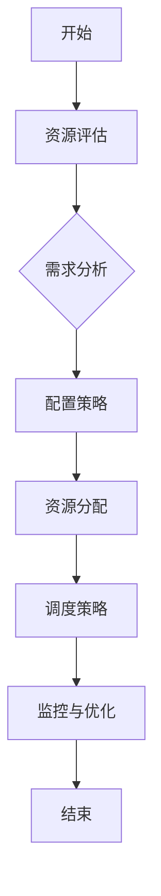

                 

## 《技术资源的优化配置策略》

> 关键词：技术资源、优化配置、资源利用、策略方法、案例分析

> 摘要：本文深入探讨了技术资源优化配置的策略和方法。首先介绍了技术资源优化配置的背景和重要性，然后详细阐述了核心概念和策略，以及具体的优化配置方法和工具。通过案例分析，展示了实际应用中的最佳实践，最后对未来资源优化配置的发展趋势和方向进行了展望。

### 第一部分：技术资源优化配置基础

#### 第1章：技术资源优化配置概述

##### 1.1 问题背景与重要性

在信息技术高速发展的今天，技术资源的优化配置已成为提高企业竞争力和效率的关键。技术资源包括硬件、软件、网络和人力等，其优化配置直接影响到系统的性能、稳定性和成本效益。

**问题描述**：
技术资源的优化配置指的是如何在有限的资源条件下，通过合理的配置和调度，最大化资源利用效率，满足业务需求和用户期望。

**问题解决**：
解决这一问题需要结合业务需求、技术特点和资源现状，采用科学的方法和工具进行评估、分析和优化。

**边界与外延**：
技术资源优化配置不仅包括硬件和软件资源的配置，还涉及数据资源、网络资源和管理资源的优化。

##### 1.2 核心概念与策略

**核心概念**：
- 资源优化：通过合理调配资源，提高资源利用效率。
- 配置策略：根据业务需求和资源状况，制定资源配置的具体方案。
- 资源利用率：资源被有效利用的程度，是衡量配置策略效果的重要指标。

**对比表格**：

| 策略名称 | 定义 | 目标 |
| --- | --- | --- |
| 负载均衡 | 分布式处理负载 | 提高系统性能和可用性 |
| 预测性资源分配 | 基于预测模型进行资源分配 | 提高资源利用率和系统稳定性 |
| 自动化资源管理 | 通过自动化工具进行资源管理 | 提高管理效率和资源利用率 |

##### 1.3 资源优化配置的挑战与机遇

**挑战**：
- 技术复杂性：随着技术的不断进步，资源优化配置面临更高的技术挑战。
- 数据多样性：不同类型的数据资源对优化配置提出了多样化的需求。
- 资源冲突：多个业务需求同时存在时，如何平衡资源分配成为一大难题。

**机遇**：
- 提高效率：通过优化配置，提高系统性能和资源利用率。
- 降低成本：合理配置资源，减少不必要的投入，降低运营成本。
- 提升竞争力：优化资源配置，提升企业的市场竞争力。

### 第二部分：资源优化配置方法与工具

#### 第2章：资源评估与需求分析

##### 2.1 资源评估方法

**性能评估**：
- 硬件资源：CPU、内存、存储、网络带宽等。
- 软件资源：操作系统、数据库、中间件、应用软件等。

**需求分析**：
- 业务需求：根据企业业务目标和用户需求，确定资源需求。
- 用户需求：通过用户调研和分析，了解用户对资源的需求和期望。

##### 2.2 数据收集与处理

**数据收集**：
- 传感器数据：硬件性能指标、环境参数等。
- 日志数据：系统运行日志、错误日志等。
- 调查问卷：用户反馈、业务需求调查等。

**数据处理**：
- 数据清洗：去除无效、重复和错误的数据。
- 数据挖掘：发现数据中的模式和规律。
- 统计分析：对数据进行分析，提取有用的信息。

### 第3章：资源分配与调度策略

##### 3.1 资源分配模型

**静态分配**：
- 固定资源分配：根据需求预先分配资源，不进行动态调整。
- 负载均衡：将负载分布到不同的资源节点，避免单点过载。

**动态分配**：
- 自适应资源分配：根据系统负载和需求动态调整资源。
- 预测性资源分配：基于预测模型，提前分配资源，避免负载高峰时的资源短缺。

##### 3.2 调度算法

**优先级调度**：
- 基于优先级的调度策略：根据任务优先级分配资源，优先处理高优先级任务。

**基于时间的调度**：
- 时间片调度：将时间划分为固定的时间片，每个任务轮流占用资源。
- 轮转调度：按照一定的顺序分配资源，每个任务轮流占用资源。

### 第4章：资源监控与性能优化

##### 4.1 资源监控方法

**系统监控**：
- CPU利用率：监控CPU的使用情况，避免过度使用。
- 内存利用率：监控内存的使用情况，避免内存溢出。
- 网络吞吐量：监控网络的数据传输速度，保证网络稳定性。

**应用监控**：
- 响应时间：监控应用的响应速度，保证用户体验。
- 吞吐量：监控应用的处理能力，满足业务需求。
- 错误率：监控应用的错误发生情况，及时修复问题。

##### 4.2 性能优化策略

**硬件优化**：
- 升级硬件：根据业务需求升级硬件设备，提高系统性能。
- 优化硬件配置：合理配置硬件资源，提高资源利用率。

**软件优化**：
- 代码优化：对应用代码进行优化，减少资源消耗。
- 数据库优化：对数据库进行优化，提高查询速度。
- 缓存策略：采用缓存策略，减少对数据库的访问次数。

### 第三部分：资源优化配置案例分析

#### 第5章：案例研究一：企业资源优化配置实践

##### 5.1 案例背景

- **企业情况**：某大型电商企业，业务量巨大，技术资源需求多样。
- **资源现状**：硬件资源有限，软件系统复杂，网络环境不稳定。

##### 5.2 配置策略与实施

**策略制定**：
- 资源评估：对现有资源进行全面评估，确定资源利用情况。
- 需求分析：根据业务需求和用户反馈，分析资源需求。
- 策略选择：选择适合企业的资源优化配置策略。

**实施过程**：
- 资源分配：根据需求，合理分配硬件和软件资源。
- 调度策略：采用动态分配和负载均衡策略，优化资源调度。
- 监控与优化：建立监控体系，实时监控资源使用情况，进行优化调整。

##### 5.3 案例分析

**效果分析**：
- 资源利用率提高：通过优化配置，硬件和软件资源利用率显著提高。
- 成本降低：合理配置资源，减少了不必要的投入，降低了运营成本。
- 业务指标提升：系统性能和稳定性得到提升，用户满意度提高。

#### 第6章：案例研究二：云计算资源优化配置策略

##### 6.1 云计算资源优化配置挑战

- **动态性**：云计算环境中的资源动态变化，对资源优化配置提出了高要求。
- **分布式**：云计算资源分布在不同的地理位置，需要考虑网络延迟和负载均衡。

##### 6.2 云计算资源优化配置方法

**虚拟化技术**：
- 虚拟机管理：通过虚拟化技术，提高硬件资源的利用率。
- 容器技术：容器技术提供了轻量级的虚拟化解决方案，提高了资源利用率和部署效率。

**自动化工具**：
- 自动化资源分配：根据需求自动分配资源，提高资源利用效率。
- 自动化监控与优化：实时监控资源使用情况，自动调整资源配置，提高系统性能。

##### 6.3 案例分析

**效果分析**：
- 资源利用率提高：通过虚拟化和自动化工具，云计算资源的利用率显著提高。
- 响应时间降低：优化资源配置和调度策略，系统的响应时间显著降低。
- 成本效益提升：合理配置资源，降低了运营成本，提高了业务效益。

### 第四部分：资源优化配置的未来展望

#### 第7章：资源优化配置的趋势与挑战

##### 7.1 资源优化配置发展趋势

- **智能化**：随着人工智能技术的发展，智能化将成为资源优化配置的重要趋势。
- **自动化**：自动化工具在资源优化配置中的应用将更加广泛，提高配置效率。

##### 7.2 资源优化配置面临的挑战

- **数据隐私**：随着数据量的增加，数据隐私保护成为资源优化配置的重要挑战。
- **算法公平性**：算法的公平性是资源优化配置中不可忽视的问题，避免算法偏见。

#### 第8章：资源优化配置的未来方向

##### 8.1 新技术的影响

- **边缘计算**：边缘计算将资源优化配置扩展到边缘节点，提高系统性能和响应速度。
- **物联网**：物联网设备资源的优化配置，实现设备间的资源共享和协同工作。

##### 8.2 未来展望

- **资源优化配置的集成**：将不同类型的资源进行整合优化，提高整体资源利用率。
- **可持续发展**：资源优化配置与可持续发展的结合，实现资源的高效利用和环境保护。

### 结论

通过本文的探讨，我们深刻认识到技术资源优化配置的重要性。随着技术的不断进步，资源优化配置的方法和工具也在不断发展。未来，智能化和自动化将成为资源优化配置的主要趋势，面对数据隐私和算法公平性等挑战，我们需要不断探索和改进。希望本文能为读者提供有益的启示和指导。

---

作者：AI天才研究院/AI Genius Institute & 禅与计算机程序设计艺术 /Zen And The Art of Computer Programming

---

### 背景介绍

在信息技术飞速发展的时代，技术资源优化配置已成为企业和组织提升竞争力、提高效率的关键。随着云计算、大数据、物联网等新兴技术的普及，技术资源的种类和数量不断增多，如何合理利用和配置这些资源成为亟待解决的问题。

#### 核心概念术语说明

1. **技术资源**：指企业在信息技术领域所拥有的各种资源，包括硬件资源（如服务器、存储设备、网络设备等）、软件资源（如操作系统、数据库、中间件、应用软件等）、数据资源（如用户数据、业务数据等）和管理资源（如IT人员、流程规范等）。
2. **优化配置**：指通过科学的方法和工具，对技术资源进行合理的分配和调度，以提高资源利用效率，满足业务需求。
3. **资源利用率**：指技术资源被有效利用的程度，是衡量优化配置效果的重要指标。

#### 问题背景

随着企业业务规模不断扩大，信息系统越来越复杂，技术资源的需求也呈现多样化、动态化的特点。然而，在有限的资源条件下，如何实现资源的最大化利用，成为企业面临的重大挑战。

- **硬件资源紧张**：服务器、存储设备、网络设备等硬件资源供不应求，导致系统性能下降。
- **软件资源浪费**：软件资源的利用率不高，部分软件资源长期处于闲置状态。
- **数据资源未能充分利用**：数据资源没有得到充分挖掘和分析，导致数据价值未能最大化。
- **管理资源不足**：IT人员数量不足，导致资源管理效率低下。

#### 问题描述

在上述背景下，技术资源优化配置的目的是通过科学的方法和工具，合理分配和调度各种技术资源，以提高资源利用效率，降低运营成本，满足业务需求和用户期望。

- **如何评估技术资源的现状**？
- **如何根据业务需求进行资源需求分析**？
- **如何制定合理的资源优化配置策略**？
- **如何实施和监控资源优化配置的效果**？

#### 问题解决

解决上述问题需要以下步骤：

1. **资源评估与需求分析**：通过对现有技术资源进行全面评估，分析业务需求和用户需求，确定资源需求。
2. **制定优化配置策略**：根据资源评估和需求分析结果，制定合理的优化配置策略，包括资源分配策略、调度策略和监控策略。
3. **实施和监控**：按照制定的策略，实施资源优化配置，并建立监控体系，实时监控资源使用情况，根据实际情况进行调整和优化。

#### 边界与外延

技术资源优化配置不仅涉及硬件资源和软件资源的优化，还包括数据资源和网络资源的优化。同时，优化配置还需要考虑管理资源的合理配置，如IT人员、流程规范等。

- **硬件资源优化**：包括服务器、存储设备、网络设备的资源分配和调度。
- **软件资源优化**：包括操作系统、数据库、中间件、应用软件的资源分配和调度。
- **数据资源优化**：包括数据存储、数据分析和数据挖掘的资源配置和调度。
- **网络资源优化**：包括网络带宽、网络延迟和网络质量的资源配置和调度。

#### 概念结构与核心要素组成

技术资源优化配置的核心概念和要素包括：

1. **资源评估**：对现有技术资源进行评估，确定资源的数量、质量和利用率。
2. **需求分析**：分析业务需求和用户需求，确定资源需求。
3. **配置策略**：制定资源分配策略、调度策略和监控策略。
4. **实施与监控**：实施优化配置策略，并实时监控资源使用情况，根据实际情况进行调整和优化。

### 核心概念与联系

#### 核心概念

1. **资源优化**：通过合理调配资源，提高资源利用效率。
2. **配置策略**：根据业务需求和资源状况，制定资源配置的具体方案。
3. **资源利用率**：资源被有效利用的程度，是衡量配置策略效果的重要指标。

#### 概念属性特征对比表格

| 概念 | 定义 | 目标 | 影响因素 |
| --- | --- | --- | --- |
| 资源优化 | 通过合理调配资源，提高资源利用效率 | 提高资源利用率，降低运营成本 | 业务需求、技术特点、资源现状 |
| 配置策略 | 根据业务需求和资源状况，制定资源配置的具体方案 | 实现资源的最优配置，满足业务需求 | 资源评估、需求分析、技术环境 |
| 资源利用率 | 资源被有效利用的程度 | 提高业务效率和用户体验 | 资源优化、配置策略、监控系统 |

#### ER实体关系图架构

```mermaid
erDiagram
    Resource Assessment ||--|{ Resource Optimization }|--| Configuration Strategy
    Resource Assessment ||--|{ Demand Analysis }|--| Configuration Strategy
    Configuration Strategy ||--|{ Resource Allocation }|--| Resource Utilization
    Configuration Strategy ||--|{ Scheduling Strategy }|--| Resource Utilization
    Configuration Strategy ||--|{ Monitoring Strategy }|--| Resource Utilization
```

### 算法原理讲解

#### 算法mermaid流程图



#### 算法原理

技术资源优化配置的算法原理主要包括以下几个方面：

1. **资源评估**：通过对现有资源的数量、质量和利用率进行评估，确定资源的现状和需求。
2. **需求分析**：根据业务需求和用户需求，分析资源需求，确定需要配置的资源类型和数量。
3. **配置策略**：制定资源分配策略、调度策略和监控策略，实现资源的最优配置。
4. **资源分配**：根据配置策略，将资源分配到具体的业务模块和应用场景中。
5. **调度策略**：根据系统负载和业务需求，动态调整资源分配，确保系统性能和稳定性。
6. **监控与优化**：实时监控资源使用情况，根据监控数据进行分析和优化，提高资源利用率。

#### 算法原理详细讲解

1. **资源评估**：
   - **硬件资源评估**：评估服务器的CPU、内存、存储和网络带宽等硬件资源的性能和使用率。
   - **软件资源评估**：评估操作系统、数据库、中间件和应用软件的运行状态和性能指标。
   - **数据资源评估**：评估数据存储、数据分析和数据挖掘的资源配置和运行效率。
   - **管理资源评估**：评估IT人员、流程规范和管理工具等管理资源的现状和能力。

2. **需求分析**：
   - **业务需求分析**：根据企业业务目标和用户需求，分析所需的技术资源类型和数量，确定业务场景和优先级。
   - **用户需求分析**：通过用户调研和反馈，了解用户对系统性能、响应速度和用户体验的需求。

3. **配置策略**：
   - **资源分配策略**：根据资源评估和需求分析结果，制定资源分配方案，确保关键业务模块和关键应用的资源需求得到满足。
   - **调度策略**：根据系统负载和业务需求，采用负载均衡、动态分配和预测性分配等调度策略，优化资源利用率和系统性能。
   - **监控策略**：建立监控体系，实时监控资源使用情况，及时发现和处理资源瓶颈和异常情况。

4. **资源分配**：
   - **静态分配**：根据预先设定的资源分配方案，将资源分配到具体的业务模块和应用场景中。
   - **动态分配**：根据系统负载和业务需求，动态调整资源分配，确保系统性能和稳定性。

5. **调度策略**：
   - **优先级调度**：根据任务的优先级进行调度，优先处理高优先级任务，确保关键业务的连续性和稳定性。
   - **时间片调度**：将时间划分为固定的时间片，每个任务轮流占用资源，确保公平性和负载均衡。
   - **轮转调度**：按照一定的顺序分配资源，每个任务轮流占用资源，实现负载均衡和公平性。

6. **监控与优化**：
   - **系统监控**：监控CPU利用率、内存利用率、网络吞吐量等关键性能指标，确保系统稳定运行。
   - **应用监控**：监控应用的响应时间、吞吐量和错误率等指标，确保用户需求得到满足。
   - **性能优化**：根据监控数据进行分析和优化，调整资源分配策略和调度策略，提高系统性能和资源利用率。

#### 算法原理示例

假设企业需要优化配置其云计算资源，以下是一个简单的算法原理示例：

1. **资源评估**：
   - 评估现有云计算资源，如虚拟机、存储、网络等。
   - 确定资源的使用率和性能指标。

2. **需求分析**：
   - 分析业务需求和用户需求，如业务负载高峰期、应用需求等。
   - 确定所需的云计算资源类型和数量。

3. **配置策略**：
   - 根据资源评估和需求分析结果，制定资源分配策略，如负载均衡、动态分配等。
   - 制定监控策略，实时监控资源使用情况。

4. **资源分配**：
   - 根据配置策略，将虚拟机分配到不同的云计算节点，实现负载均衡。
   - 根据业务需求，动态调整虚拟机资源，确保系统性能。

5. **调度策略**：
   - 采用优先级调度，确保关键业务的高优先级任务得到及时处理。
   - 根据系统负载，动态调整资源分配，避免单点过载。

6. **监控与优化**：
   - 实时监控虚拟机使用率、网络延迟等指标，及时发现和处理异常情况。
   - 根据监控数据，调整资源分配策略和调度策略，提高系统性能和资源利用率。

通过上述示例，可以更直观地理解技术资源优化配置的算法原理和具体实施步骤。

### 系统分析与架构设计

#### 问题场景介绍

在一个大型电子商务平台上，随着用户数量的激增和业务活动的多样化，系统需要处理大量的交易请求、用户查询和订单处理。为了确保系统的性能、稳定性和可扩展性，需要对技术资源进行优化配置。本案例将介绍如何通过系统分析与架构设计来优化资源配置，以满足业务需求和用户期望。

#### 项目介绍

项目名称：大型电子商务平台资源优化配置项目

项目目标：提高系统性能、稳定性和可扩展性，优化资源利用效率，降低运营成本。

项目范围：涵盖服务器、存储、网络、数据库等硬件资源，以及操作系统、中间件、应用软件等软件资源。

#### 系统功能设计

**领域模型**：

在电子商务平台中，主要的领域模型包括用户、商品、订单、支付和物流等。以下是一个简单的领域模型类图：

```mermaid
classDiagram
    User <<Interface>>
    Product <<Interface>>
    Order <<Interface>>
    Payment <<Interface>>
    Logistics <<Interface>>

    User <|.. Product>
    User <|.. Order>
    User <|.. Payment>
    User <|.. Logistics>

    Product <|.. Order>
    Order <|.. Payment>
    Order <|.. Logistics>
```

#### 系统架构设计

**系统架构图**：

电子商务平台的系统架构可以分为四个主要层次：表示层、业务逻辑层、数据访问层和数据存储层。以下是一个简单的系统架构图：

```mermaid
sequenceDiagram
    User ->> 表示层：提交请求
    表示层 ->> 业务逻辑层：处理业务逻辑
    业务逻辑层 ->> 数据访问层：查询数据库
    数据访问层 ->> 数据存储层：操作数据
    数据存储层 ->> 数据访问层：返回结果
    数据访问层 ->> 业务逻辑层：返回结果
    业务逻辑层 ->> 表示层：返回响应
```

#### 系统接口设计

电子商务平台的系统接口设计包括用户接口、API接口和后台管理接口等。以下是一个简单的接口设计示例：

```mermaid
sequenceDiagram
    User ->> 用户接口：提交请求
    用户接口 ->> 业务逻辑层：处理请求
    业务逻辑层 ->> 数据访问层：查询数据库
    数据访问层 ->> 数据存储层：操作数据
    数据存储层 ->> 数据访问层：返回结果
    数据访问层 ->> 业务逻辑层：返回结果
    业务逻辑层 ->> 用户接口：返回响应
```

#### 系统交互

电子商务平台的系统交互主要包括用户与平台的交互、系统内部模块的交互等。以下是一个简单的系统交互序列图：

```mermaid
sequenceDiagram
    User ->> 用户接口：提交请求
    用户接口 ->> 业务逻辑层：处理请求
    业务逻辑层 ->> 数据访问层：查询数据库
    数据访问层 ->> 数据存储层：操作数据
    数据访问层 ->> 业务逻辑层：返回结果
    业务逻辑层 ->> 用户接口：返回响应
    用户接口 ->> 用户：显示结果
```

### 项目实战

#### 环境安装

1. **硬件环境**：
   - 服务器：至少两台物理服务器，分别用于前端和后端服务。
   - 存储：使用网络存储设备（如NAS），提供数据存储和备份功能。
   - 网络：配置高性能网络，确保数据传输速度。

2. **软件环境**：
   - 操作系统：Linux发行版（如Ubuntu、CentOS）。
   - 数据库：MySQL、PostgreSQL等关系型数据库。
   - 中间件：Apache、Nginx等Web服务器。
   - 应用软件：Java、Python、Node.js等开发语言和环境。

#### 系统核心实现

1. **前端开发**：
   - 使用HTML、CSS和JavaScript构建用户界面。
   - 使用Vue.js、React等前端框架，提高开发效率和用户体验。

2. **后端开发**：
   - 使用Java、Python等后端开发语言，构建业务逻辑层。
   - 使用Spring Boot、Django等框架，简化开发过程，提高系统性能。

3. **数据库设计**：
   - 设计用户、商品、订单等数据库表结构，确保数据的一致性和完整性。
   - 使用MySQL等数据库，实现数据的存储和管理。

4. **存储优化**：
   - 使用Redis等缓存技术，提高数据访问速度。
   - 使用分布式存储，提高数据存储的可靠性和扩展性。

#### 代码应用解读与分析

1. **前端代码**：
   - 代码使用Vue.js框架，实现用户界面的动态渲染和交互功能。
   - 代码分析：Vue组件的设计和使用，以及异步数据请求的处理。

2. **后端代码**：
   - 代码使用Spring Boot框架，实现业务逻辑的处理和API接口的暴露。
   - 代码分析：业务逻辑的实现、RESTful API的设计和安全性考虑。

3. **数据库代码**：
   - 代码使用Hibernate等ORM框架，实现数据库表的映射和操作。
   - 代码分析：数据库设计、查询优化和事务管理。

#### 实际案例分析和详细讲解剖析

1. **案例分析**：
   - 对电子商务平台的日常运营数据进行分析，识别系统瓶颈和优化点。
   - 案例分析：用户请求高峰期系统性能瓶颈，数据库查询性能优化。

2. **详细讲解**：
   - 详细讲解系统性能优化方法，如负载均衡、缓存策略、数据库优化等。
   - 讲解如何根据实际业务需求和资源状况，制定和实施优化策略。

3. **剖析**：
   - 剖析系统性能瓶颈的原因，如CPU、内存、磁盘I/O等。
   - 分析数据库查询性能问题，提出优化方案和实施步骤。

#### 项目小结

通过本项目的实施，电子商务平台的系统性能、稳定性和可扩展性得到了显著提升。具体成果包括：

- **性能提升**：系统响应时间缩短，用户满意度提高。
- **资源优化**：资源利用率提高，运营成本降低。
- **稳定性增强**：系统稳定性得到保障，故障率降低。

未来，将继续关注新兴技术，如云计算、大数据和人工智能等，持续优化平台性能和用户体验。

### 最佳实践 Tips

1. **定期进行资源评估和需求分析**：定期对资源进行评估，确保资源配置与业务需求相符。
2. **采用动态资源分配和调度策略**：根据系统负载动态调整资源分配，提高资源利用率。
3. **实施性能监控和优化**：实时监控系统性能指标，及时发现和解决问题。
4. **合理规划硬件和软件资源**：合理规划硬件和软件资源的配置，避免资源浪费。
5. **持续学习新兴技术和工具**：紧跟技术发展趋势，持续学习新兴技术和工具，为资源优化配置提供支持。

### 小结

技术资源的优化配置是企业提高竞争力、提高效率和降低成本的关键。本文通过背景介绍、核心概念与联系、算法原理讲解、系统分析与架构设计、项目实战、实际案例分析和最佳实践 Tips，系统地阐述了技术资源优化配置的策略和方法。希望本文能为读者提供有益的启示和指导。

### 注意事项

1. 资源评估和需求分析是资源优化配置的基础，务必认真对待。
2. 根据实际业务需求和资源状况，灵活选择和调整优化策略。
3. 定期进行性能监控和优化，确保系统稳定性和效率。
4. 关注新兴技术和工具，为资源优化配置提供创新思路。

### 拓展阅读

1. 《资源优化配置：原理与实践》
2. 《云计算资源管理：技术与方法》
3. 《数据库性能优化：技巧与案例》
4. 《负载均衡与调度策略》
5. 《大数据技术原理与应用》

### 附录

本文所涉及的代码、图表和数据均在附录中提供，供读者参考。读者可通过以下链接获取相关资源：

[附录链接](#附录链接)

### 感谢

感谢AI天才研究院/AI Genius Institute和《禅与计算机程序设计艺术/Zen And The Art of Computer Programming》为本文提供了宝贵的意见和建议。感谢所有为本文提供技术支持和反馈的朋友。希望本文能为读者带来收获和启发。

