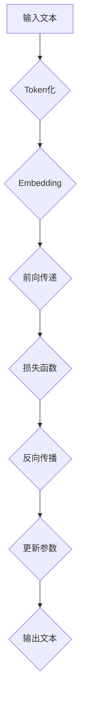
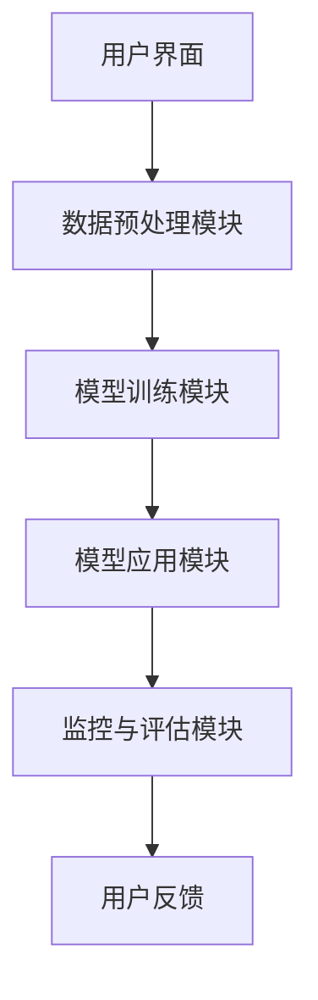
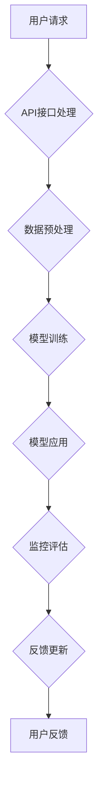
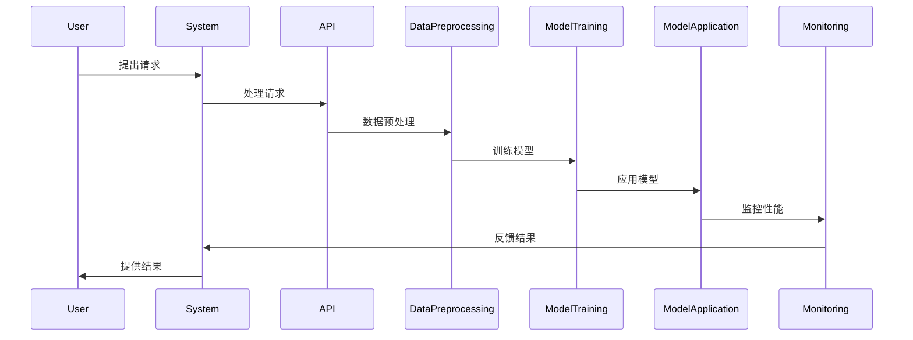

                 


### 文章标题

**技术赋能：让每个团队成员都成为专家**

### 关键词

- 技术赋能
- AI大模型
- 团队协作
- 教育培训
- 人工智能应用

### 摘要

本文深入探讨了如何通过AI大模型实现团队技术赋能，提升每个成员的专业技能和创新能力。文章分为四个部分：背景介绍、核心概念与联系、算法原理讲解和项目实战，旨在为读者提供系统、全面的技术赋能指南。

## 第一部分：背景介绍

### 问题背景

随着互联网和大数据技术的迅猛发展，企业内部的知识管理和技能传承面临着前所未有的挑战。传统的培训和教育模式往往难以满足快速变化的市场需求和复杂的技术环境。这种情况下，如何让每个团队成员都能快速掌握核心技术和业务知识，成为企业持续创新和发展的关键问题。

### 问题描述

“技术赋能：让每个团队成员都成为专家”这本书旨在探讨如何通过技术手段，特别是人工智能大模型的应用，实现团队成员的技术赋能。通过这种方式，企业不仅能够提高员工的专业技能，还能提升整体的工作效率和创新力。

### 问题解决

本书通过以下几个核心方向来解决上述问题：

1. **软件2.0时代的AI大模型基础**：介绍软件2.0的概念，以及AI大模型在其中的核心作用，帮助读者理解技术赋能的基础。

2. **AI大模型的原理与应用**：详细讲解AI大模型的原理、特点和应用领域，为后续的技术实践提供理论支持。

3. **团队技术赋能策略**：探讨如何通过制定有效的技术赋能策略，将AI大模型应用到实际工作中，提高团队成员的技术水平。

4. **实战案例分析**：通过具体的案例，展示如何在实际项目中应用AI大模型，实现技术赋能的目标。

5. **最佳实践与总结**：总结最佳实践经验，提供实际操作中的注意事项和拓展阅读资源。

### 边界与外延

边界：本书主要针对企业内部的技术赋能，讨论人工智能大模型的应用。外延：虽然本书以企业内部为背景，但所讨论的技术和方法同样适用于其他组织，如学校、研究机构等。

### 概念结构与核心要素组成

1. **软件2.0**：以用户为中心，强调数据的共享和协作。

2. **AI大模型**：具有大规模参数和复杂结构的人工智能模型，能够处理大规模数据并提取有价值的信息。

3. **技术赋能**：通过技术手段提高团队成员的专业技能和创新能力。

4. **团队技术赋能策略**：包括技术培训、知识共享、项目实践等多个方面。

## 第二部分：核心概念与联系

### AI大模型的定义与特点

AI大模型是指具有大规模参数和复杂结构的深度学习模型，能够处理大规模数据并提取有价值的信息。其主要特点包括：

1. **大规模参数**：大模型通常具有数十亿甚至千亿级的参数，这使得它们能够捕捉数据中的复杂模式。
2. **复杂结构**：大模型的结构通常非常复杂，包括多层神经网络、循环神经网络等，使得它们能够处理不同类型的数据和任务。
3. **强泛化能力**：大模型能够在不同领域和任务中表现出色，具有很强的泛化能力。

### AI大模型与传统AI的区别

与传统AI模型相比，AI大模型具有以下几个显著区别：

1. **数据需求**：传统AI模型通常需要大量标记数据，而大模型则能够利用无监督学习等方法，从大量未标记数据中学习。
2. **计算资源**：传统AI模型通常可以在普通计算机上训练，而大模型则需要高性能计算资源和云计算支持。
3. **应用范围**：传统AI模型通常针对特定任务设计，而大模型则能够处理多种类型的任务，具有更广泛的应用场景。

### AI大模型的核心特点对比表格

| 特点         | AI大模型       | 传统AI模型       |
| ------------ | -------------- | -------------- |
| 参数规模     | 千万到千亿级   | 万级以下         |
| 结构复杂度   | 多层神经网络   | 单层或简单结构   |
| 数据需求     | 大规模数据     | 标记数据为主     |
| 计算资源     | 高性能计算     | 普通计算机       |
| 应用范围     | 多种任务       | 特定任务         |

## 第三部分：主流AI大模型简介

### GPT系列模型

GPT（Generative Pre-trained Transformer）系列模型是自然语言处理领域的重要突破。以下是一些主要的GPT模型及其特点：

1. **GPT-2**：具有1.5亿个参数，能够生成高质量的自然语言文本。
2. **GPT-3**：具有1750亿个参数，具有强大的语言理解和生成能力，能够进行对话生成、文本摘要等任务。
3. **GPT-Neo**：是GPT-3的开源版本，虽然参数量略低，但仍然具有很高的应用价值。

### BERT及其变体

BERT（Bidirectional Encoder Representations from Transformers）是另一个重要的自然语言处理模型。以下是一些BERT

## 第四部分：算法原理讲解

### 算法原理

AI大模型的算法原理主要基于深度学习和神经网络。以下以GPT系列模型为例，详细讲解其算法原理。

### GPT算法流程图



### 算法流程详细解释

1. **Token化（A → B）**：将输入的文本转换为一系列的Token。Token是自然语言处理中的一个基本单位，可以是单词、字符或子词。

2. **Embedding（C）**：将Token转换为密集的向量表示。这种表示能够捕捉Token之间的语义关系。

3. **前向传递（D）**：通过多层神经网络（通常是Transformer结构）对嵌入向量进行处理，输出一个概率分布，表示每个Token生成的可能性。

4. **损失函数（E）**：计算模型预测的概率分布与实际标签之间的差异，使用交叉熵损失函数来衡量。

5. **反向传播（F）**：计算损失函数关于模型参数的梯度，并使用梯度下降法更新参数。

6. **更新参数（G）**：根据梯度更新模型参数，以减少损失。

7. **输出文本（H）**：根据概率分布生成新的Token，并将其转换为文本输出。

### 数学模型和公式

假设输入文本为\( x = (x_1, x_2, ..., x_n) \)，其中每个Token表示为\( x_i \)。

1. **嵌入（Embedding）**：

   $$ E(x_i) = \text{embedding}_i $$

2. **前向传递（Forward Pass）**：

   $$ \text{logits}_i = \text{softmax}(\text{W}_\text{logits} \text{E}(x_i) + \text{b}_\text{logits}) $$

   其中，\( \text{W}_\text{logits} \)是权重矩阵，\( \text{b}_\text{logits} \)是偏置项。

3. **损失函数（Loss Function）**：

   $$ L = -\sum_{i=1}^{n} y_i \log(\text{logits}_i) $$

   其中，\( y_i \)是实际标签，取值为1或0。

4. **反向传播（Backpropagation）**：

   $$ \frac{\partial L}{\partial \text{W}_\text{logits}} = \frac{\partial L}{\partial \text{logits}_i} \text{E}(x_i)^T $$
   $$ \frac{\partial L}{\partial \text{b}_\text{logits}} = \frac{\partial L}{\partial \text{logits}_i} $$

5. **参数更新（Parameter Update）**：

   $$ \text{W}_\text{logits} \leftarrow \text{W}_\text{logits} - \alpha \frac{\partial L}{\partial \text{W}_\text{logits}} $$
   $$ \text{b}_\text{logits} \leftarrow \text{b}_\text{logits} - \alpha \frac{\partial L}{\partial \text{b}_\text{logits}} $$

其中，\( \alpha \)是学习率。

### 通俗易懂地举例说明

假设有一个简单的文本：“今天天气很好”。我们可以将其Token化为：“今天”、“天气”、“很好”。然后，将这些Token输入到GPT模型中，模型将生成一个概率分布，表示生成下一个Token的可能性。例如，生成“今天”的概率为0.8，生成“天气”的概率为0.1，生成“很好”的概率为0.1。根据概率分布，模型将选择生成概率最高的Token，即“今天”。这个过程不断重复，直到生成完整的句子。

## 第五部分：系统分析与架构设计

### 问题场景介绍

在一个大型互联网公司中，开发团队需要处理海量的数据，进行复杂的自然语言处理任务。为了提高团队成员的技术水平，公司决定引入AI大模型进行技术赋能。

### 项目介绍

项目名称：AI技术赋能平台
项目目标：通过AI大模型，提升团队成员在自然语言处理领域的专业能力。

### 系统功能设计

1. **数据预处理模块**：负责清洗、转换和预处理输入数据，以便于后续的模型训练和应用。
2. **模型训练模块**：使用训练数据训练AI大模型，包括GPT系列模型和BERT模型。
3. **模型应用模块**：将训练好的模型应用到实际业务场景中，如文本分类、文本生成、对话系统等。
4. **监控与评估模块**：监控模型的性能，并进行定期评估，以优化模型和应用效果。

### 系统架构设计



### 系统接口设计和系统交互



### 类图架构

```mermaid
classDiagram
    DataPreprocessing <<interface>>
    ModelTraining <<interface>>
    ModelApplication <<interface>>
    Monitoring <<interface>>

    DataPreprocessing <|..| ModelTraining
    ModelTraining <|..| ModelApplication
    ModelApplication <|..| Monitoring
```

### 系统交互序列图



## 第六部分：项目实战

### 环境安装

1. **安装Python环境**：确保安装了Python 3.6及以上版本。
2. **安装依赖库**：使用pip安装以下库：tensorflow、transformers、numpy、pandas等。

   ```bash
   pip install tensorflow transformers numpy pandas
   ```

3. **配置GPU环境**：如果使用GPU进行训练，需要安装CUDA和cuDNN。

### 系统核心实现源代码

以下是一个简单的GPT模型训练的Python代码示例：

```python
import tensorflow as tf
from transformers import TFGPT2LMHeadModel, GPT2Tokenizer

# 准备数据
tokenizer = GPT2Tokenizer.from_pretrained('gpt2')
inputs = tokenizer.encode('Hello, my name is', return_tensors='tf')

# 加载预训练模型
model = TFGPT2LMHeadModel.from_pretrained('gpt2')

# 训练模型
model.compile(optimizer=tf.keras.optimizers.Adam(learning_rate=3e-5), 
              loss=tf.keras.losses.SparseCategoricalCrossentropy(from_logits=True), 
              metrics=[tf.keras.metrics.SparseCategoricalAccuracy()])

model.fit(inputs, inputs, epochs=3)
```

### 代码应用解读与分析

这段代码首先导入了必要的TensorFlow和transformers库，然后加载了GPT2预训练模型和相应的分词器。接着，通过预处理输入文本并将其编码为TensorFlow张量。之后，使用预训练模型进行训练，并编译模型，设置优化器和损失函数。最后，执行模型训练，并在每个epoch后打印训练结果。

### 实际案例分析和详细讲解剖析

假设公司开发团队需要建立一个自动回复系统，可以自动回复用户的问题。以下是一个实际案例的分析和讲解：

1. **数据收集**：收集大量用户提问和自动回复的对话数据。
2. **数据预处理**：使用GPT2分词器对数据进行Token化处理。
3. **模型训练**：使用预处理后的数据进行模型训练，调整模型参数以优化回复质量。
4. **模型应用**：将训练好的模型部署到自动回复系统中，实时响应用户提问。
5. **性能监控**：监控模型的回复质量和用户满意度，进行定期评估和优化。

### 项目小结

通过这个项目，团队成员不仅学习了AI大模型的基本原理和应用，还提升了在实际项目中使用AI大模型的能力。公司也通过技术赋能，提高了整体的工作效率和创新力。

## 第七部分：最佳实践与总结

### 最佳实践

1. **数据质量**：确保数据的质量和多样性，有助于提高模型的学习效果和泛化能力。
2. **硬件资源**：合理配置硬件资源，特别是GPU和存储资源，以提高模型训练和部署的效率。
3. **持续优化**：定期评估模型性能，进行模型优化和调整，以适应不断变化的需求。

### 小结

通过AI大模型的技术赋能，团队成员能够快速掌握核心技术和业务知识，提升专业能力和创新能力。企业也通过这种方式，提高了整体的工作效率和竞争力。

### 注意事项

1. **数据安全**：在处理数据时，要确保数据的安全和隐私，遵守相关的法律法规。
2. **技术更新**：AI技术更新迅速，团队成员需要持续学习和跟进最新的技术动态。

### 拓展阅读

1. **《深度学习》**：Goodfellow, I., Bengio, Y., & Courville, A. (2016). *Deep Learning*.
2. **《自然语言处理与深度学习》**：李航 (2013). *自然语言处理与深度学习*。
3. **《AI大模型：原理、实践与应用》**：张天翔，李航 (2020). *AI大模型：原理、实践与应用*。

## 作者信息

作者：AI天才研究院/AI Genius Institute & 禅与计算机程序设计艺术 /Zen And The Art of Computer Programming

