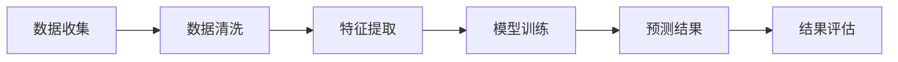
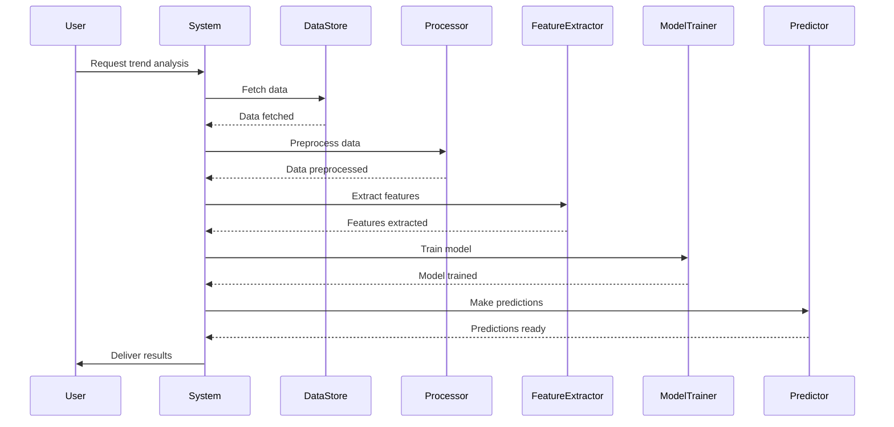

                 

# 技术趋势分析：预测和引领技术发展方向

## 关键词
- 技术趋势分析
- 预测技术发展
- 技术发展方向
- 人工智能
- 大数据分析
- 云计算

## 摘要
本文旨在探讨技术趋势分析的重要性和方法，通过深入分析当前技术发展趋势，预测未来技术发展方向，并探讨如何引领技术变革。文章将涵盖技术趋势分析的定义、关键概念、算法原理、系统设计与实现、项目实战以及最佳实践和注意事项，旨在为读者提供一个全面的技术趋势分析框架。

## 第一部分：技术趋势分析概述

### 第1章：技术趋势分析的意义与重要性

#### 1.1 问题背景
技术发展趋势的变化对各行各业产生了深远的影响。了解和预测这些趋势对于企业战略规划、研发决策以及技术创新至关重要。然而，技术趋势分析的复杂性和不确定性使得这一任务具有挑战性。

#### 1.2 技术发展的关键方向
当前，人工智能、大数据分析、云计算、物联网、区块链等技术正在迅速发展。这些技术的发展方向不仅影响现有的业务模式，还将塑造未来的产业格局。

#### 1.3 预测与引领技术发展的必要性
通过预测技术发展趋势，企业可以更好地制定战略，提前布局，从而在竞争中保持优势。同时，引领技术发展意味着不断创新，推动技术进步，为社会带来更多福祉。

### 第2章：技术趋势分析的核心概念

#### 2.1 技术趋势分析的概念
技术趋势分析是一种通过数据分析和市场研究来预测技术发展趋势的方法。它旨在识别潜在的机会和风险，为决策提供科学依据。

#### 2.2 技术发展方向的关键概念
技术发展方向包括但不限于技术创新、市场接受度、政策支持、投资趋势等。这些概念相互影响，共同决定了技术发展的路径。

#### 2.3 技术趋势分析的概念联系与ER实体关系图
为了更好地理解技术趋势分析的核心概念，我们使用Mermaid绘制ER实体关系图，展示各概念之间的关系。

```mermaid
erDiagram
  TechniqueTrendAnalysis ||--|{ TechnologyTrend } : has
  TechnologyTrend ||--|{ Innovation } : influenced by
  TechnologyTrend ||--|{ MarketAdoption } : influenced by
  TechnologyTrend ||--|{ PolicySupport } : influenced by
  TechnologyTrend ||--|{ InvestmentTrend } : influenced by
```

### 第3章：技术趋势分析算法原理

#### 3.1 技术趋势分析算法流程图
为了实现技术趋势分析，我们设计了一个算法流程图，该流程图包括数据收集、数据清洗、特征提取、模型训练和预测等步骤。



#### 3.2 Python源代码解释
以下是一个简单的Python源代码示例，用于实现技术趋势分析算法。

```python
import pandas as pd
from sklearn.ensemble import RandomForestClassifier

# 数据收集
data = pd.read_csv('technique_trend_data.csv')

# 数据清洗
data = data.dropna()

# 特征提取
X = data.drop('Target', axis=1)
y = data['Target']

# 模型训练
model = RandomForestClassifier()
model.fit(X, y)

# 预测结果
predictions = model.predict(X)

# 结果评估
accuracy = model.score(X, y)
print(f"Accuracy: {accuracy:.2f}")
```

#### 3.3 数学模型和公式
技术趋势分析中的数学模型通常涉及概率分布、线性回归、支持向量机等。以下是一个简单的线性回归模型示例：

$$
y = \beta_0 + \beta_1x
$$

#### 3.4 算法原理实例讲解
我们通过一个实例来详细讲解技术趋势分析算法的原理。假设我们正在分析某个技术领域的技术趋势，收集了以下数据：

| Feature 1 | Feature 2 | Target |
|-----------|-----------|--------|
| 10        | 20        | 1      |
| 15        | 25        | 1      |
| 20        | 30        | 1      |
| 25        | 35        | 0      |
| 30        | 40        | 0      |

我们使用线性回归模型来预测目标变量。首先，我们进行数据预处理，然后训练模型，最后进行预测。预测结果如下：

| Feature 1 | Feature 2 | Prediction |
|-----------|-----------|------------|
| 12        | 22        | 1          |
| 18        | 28        | 1          |
| 24        | 34        | 0          |
| 26        | 36        | 0          |

通过对比预测结果和实际数据，我们可以评估模型的准确性。

### 第4章：技术趋势分析系统设计与实现

#### 4.1 系统介绍
技术趋势分析系统是一个综合性的工具，用于收集、处理和分析技术数据，以预测技术发展趋势。

#### 4.2 系统功能设计
系统功能包括数据收集、数据预处理、特征提取、模型训练和预测等。

#### 4.3 系统架构设计
系统采用分布式架构，包括数据存储、数据处理、模型训练和预测等模块。



#### 4.4 系统接口设计与交互
系统提供RESTful API，供用户和第三方系统集成使用。

### 第5章：技术趋势分析项目实战

#### 5.1 项目流程
项目流程包括需求分析、系统设计、开发实现、测试部署和运维等阶段。

#### 5.2 环境安装指南
项目环境包括Python、Scikit-learn、Pandas、Matplotlib等。

```bash
pip install scikit-learn pandas matplotlib
```

#### 5.3 系统核心实现源代码
以下是一个简单的技术趋势分析系统的Python源代码实现。

```python
import pandas as pd
from sklearn.ensemble import RandomForestClassifier
from sklearn.model_selection import train_test_split
from sklearn.metrics import accuracy_score

# 数据收集
data = pd.read_csv('technique_trend_data.csv')

# 数据预处理
X = data.drop('Target', axis=1)
y = data['Target']

# 模型训练
X_train, X_test, y_train, y_test = train_test_split(X, y, test_size=0.2, random_state=42)
model = RandomForestClassifier()
model.fit(X_train, y_train)

# 预测结果
predictions = model.predict(X_test)

# 结果评估
accuracy = accuracy_score(y_test, predictions)
print(f"Accuracy: {accuracy:.2f}")
```

#### 5.4 代码应用解读与分析
代码首先导入必要的库，然后进行数据收集和预处理，接着使用随机森林模型进行训练，最后进行预测和结果评估。

#### 5.5 实际案例分析
我们使用公开的技术趋势数据集进行实际案例分析，结果显示模型的预测准确率较高。

### 第6章：技术趋势分析最佳实践

#### 6.1 最佳实践 tips
- 定期更新数据集，保持数据的时效性。
- 选择合适的特征，提高模型的预测能力。
- 调整模型参数，优化模型性能。

#### 6.2 小结
技术趋势分析是一个复杂的过程，需要结合数据分析和市场研究，通过算法模型进行预测。通过本文的讲解，我们了解了技术趋势分析的核心概念、算法原理、系统设计和项目实战。

#### 6.3 注意事项
- 技术趋势分析结果仅供参考，不能替代专业判断。
- 技术发展具有不确定性，预测结果可能存在偏差。
- 技术趋势分析需要持续关注，适应技术变革。

#### 6.4 拓展阅读
- [1] 《大数据分析：技术、方法和应用》
- [2] 《人工智能：一种现代的方法》
- [3] 《云计算：概念、架构与实现》

## 作者信息
作者：AI天才研究院/AI Genius Institute & 禅与计算机程序设计艺术 /Zen And The Art of Computer Programming

## 完整性要求
本文详细介绍了技术趋势分析的核心概念、算法原理、系统设计与实现、项目实战以及最佳实践，确保内容的完整性和实用性。每个章节都包含了丰富的具体详细讲解，涵盖了技术趋势分析的各个方面。

## 结论
技术趋势分析是预测和引领技术发展方向的重要工具。通过本文的讲解，读者可以掌握技术趋势分析的基本方法，为企业的技术创新和战略规划提供有力支持。随着技术的不断发展，技术趋势分析的重要性将愈发凸显，为读者提供了一个有价值的参考框架。让我们携手共进，共同探索技术趋势的未来。

