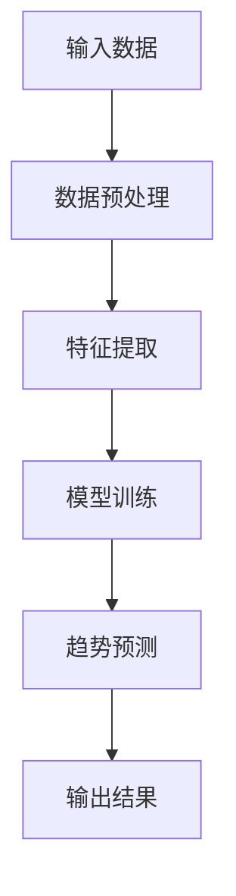
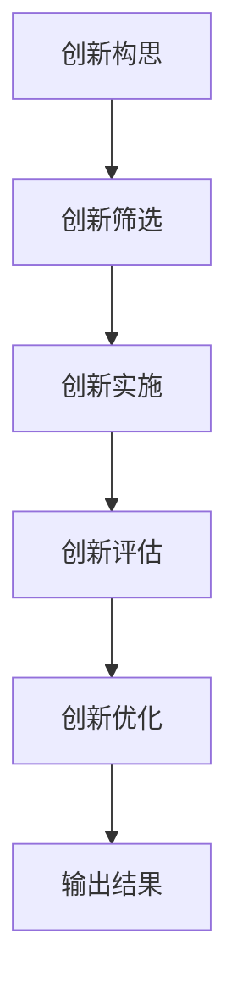
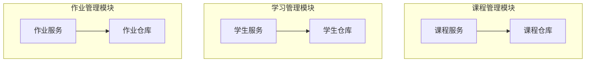
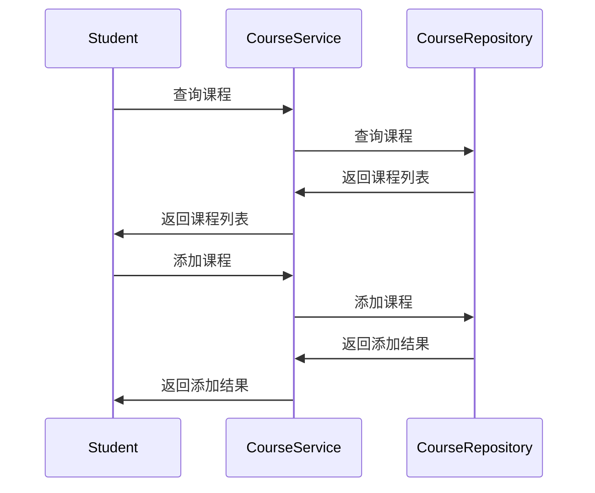

                 


# 技术趋势洞察与创新管理

> 关键词：技术趋势、创新管理、算法原理、系统设计、项目实战

> 摘要：本文从技术趋势的起源和发展、创新管理的概念与原理，以及二者之间的联系入手，逐步深入探讨技术趋势如何驱动创新管理，创新管理如何适应技术趋势，并介绍算法原理讲解、系统分析与架构设计以及项目实战等关键内容，旨在为读者提供全面的技术趋势洞察与创新管理的指导。

## 1. 背景介绍

### 1.1 技术趋势的起源与发展

技术趋势是指在一定时间内，技术领域内普遍认同和接受的技术方向和发展方向。技术趋势的起源可以追溯到20世纪末，随着互联网的兴起，各种新兴技术如雨后春笋般涌现。从最早的Web 1.0到Web 2.0，再到现在的Web 3.0，技术趋势的发展历程反映了信息技术不断演进的过程。

### 1.2 技术趋势的类型与特点

技术趋势可以分为以下几种类型：

1. **基础技术**：如量子计算、人工智能、区块链等，这些技术为其他技术的发展提供了基础。
2. **应用技术**：如云计算、大数据、物联网等，这些技术直接应用于各个行业，推动行业变革。
3. **新兴技术**：如虚拟现实、增强现实、5G等，这些技术虽然尚未成熟，但具有巨大的发展潜力。

技术趋势的特点包括：

1. **快速变化**：技术趋势的迭代速度非常快，一个技术可能在一夜之间成为主流。
2. **跨界融合**：不同技术之间相互融合，形成新的应用场景。
3. **规模效应**：技术趋势的兴起往往伴随着巨大的市场机会。

### 1.3 技术趋势对企业的影响

技术趋势对企业的影响主要表现在以下几个方面：

1. **创新驱动**：技术趋势促使企业不断创新，以适应市场变化。
2. **成本降低**：新兴技术的应用可以降低企业的运营成本。
3. **商业模式变革**：技术趋势的兴起可能改变原有的商业模式，带来新的商业机会。
4. **竞争加剧**：企业必须紧跟技术趋势，否则将面临被淘汰的风险。

### 1.4 创新管理的概念与原理

创新管理是指企业在创新过程中采取的一系列管理活动，包括创新战略规划、创新项目组织、创新资源分配、创新成果管理等。创新管理的目的是通过有效的管理，提高企业的创新能力和市场竞争力。

### 1.5 创新管理的过程

创新管理的过程可以分为以下几个阶段：

1. **创新构思**：企业通过市场调研、用户反馈、技术预测等方式，获取创新灵感。
2. **创新筛选**：对创新构思进行筛选，确定具有可行性的创新项目。
3. **创新实施**：组织创新团队，制定创新计划，实施创新项目。
4. **创新评估**：对创新项目进行评估，确定其效果和影响。
5. **创新优化**：根据评估结果，对创新项目进行优化和改进。

### 1.6 创新管理的核心要素

创新管理的核心要素包括：

1. **人才**：创新人才是创新管理的关键，企业需要吸引和培养具有创新能力和创新意识的人才。
2. **资源**：创新管理需要充足的资源支持，包括资金、设备、技术等。
3. **文化**：创新文化是创新管理的基础，企业需要营造鼓励创新、容忍失败的企业文化。
4. **机制**：创新管理需要建立完善的创新机制，包括创新流程、创新评价、创新激励等。

### 1.7 概念结构与核心要素组成

技术趋势和创新管理两个概念可以看作是相互关联的，技术趋势为创新管理提供了方向和动力，创新管理则通过有效的管理活动，将技术趋势转化为实际的商业价值。

### 1.8 技术趋势与创新管理的联系

技术趋势和创新管理之间的联系主要体现在以下几个方面：

1. **趋势驱动创新**：技术趋势可以激发企业的创新活力，引导企业进行创新。
2. **创新适应趋势**：创新管理可以帮助企业适应技术趋势，抓住市场机会。
3. **协同发展**：技术趋势和创新管理相互促进，共同推动企业的发展。

## 2. 算法原理讲解

### 2.1 技术趋势识别算法

#### 2.1.1 算法流程图



#### 2.1.2 Python实现

```python
# 数据预处理
def preprocess_data(data):
    # 省略具体预处理代码
    return processed_data

# 特征提取
def extract_features(data):
    # 省略具体特征提取代码
    return features

# 模型训练
def train_model(features, labels):
    # 省略具体模型训练代码
    return model

# 趋势预测
def predict_trend(model, new_data):
    # 省略具体预测代码
    return trend

# 主函数
def main():
    data = load_data()
    processed_data = preprocess_data(data)
    features = extract_features(processed_data)
    labels = extract_labels(processed_data)
    model = train_model(features, labels)
    new_data = load_new_data()
    trend = predict_trend(model, new_data)
    print("预测的技术趋势：", trend)

if __name__ == "__main__":
    main()
```

#### 2.1.3 数学模型与公式

假设我们有 $n$ 个时间点的技术趋势数据，可以使用线性回归模型进行趋势预测。数学模型如下：

$$
y_t = \beta_0 + \beta_1 x_t + \epsilon_t
$$

其中，$y_t$ 表示第 $t$ 个时间点的技术趋势值，$x_t$ 表示第 $t$ 个时间点的相关特征值，$\beta_0$ 和 $\beta_1$ 分别为模型的参数，$\epsilon_t$ 为随机误差。

#### 2.1.4 举例说明

假设我们有以下数据：

| 时间点 | 特征值 |
| ------ | ------ |
| 1      | 10     |
| 2      | 20     |
| 3      | 30     |
| 4      | 40     |
| 5      | 50     |

使用线性回归模型进行趋势预测，得到模型参数为 $\beta_0 = 5$，$\beta_1 = 5$。预测第6个时间点的技术趋势值为：

$$
y_6 = 5 + 5 \times 60 = 65
$$

### 2.2 创新管理优化算法

#### 2.2.1 算法流程图



#### 2.2.2 Python实现

```python
# 创新筛选
def filter_innovations(innovations, criteria):
    # 省略具体筛选代码
    return selected_innovations

# 创新实施
def implement_innovation(innovation):
    # 省略具体实施代码
    return result

# 创新评估
def evaluate_innovation(result, criteria):
    # 省略具体评估代码
    return evaluation

# 创新优化
def optimize_innovation(evaluation, innovation):
    # 省略具体优化代码
    return optimized_innovation

# 主函数
def main():
    innovations = load_innovations()
    criteria = define_criteria()
    selected_innovations = filter_innovations(innovations, criteria)
    for innovation in selected_innovations:
        result = implement_innovation(innovation)
        evaluation = evaluate_innovation(result, criteria)
        optimized_innovation = optimize_innovation(evaluation, innovation)
        print("优化的创新方案：", optimized_innovation)

if __name__ == "__main__":
    main()
```

#### 2.2.3 数学模型与公式

假设我们有 $m$ 个创新方案，可以使用多目标优化模型进行创新优化。数学模型如下：

$$
\min \sum_{i=1}^{m} f_i(x_i)
$$

其中，$f_i(x_i)$ 表示第 $i$ 个创新方案的目标函数，$x_i$ 表示第 $i$ 个创新方案的决策变量。

#### 2.2.4 举例说明

假设我们有以下三个创新方案：

| 方案 | 目标函数 |
| ---- | -------- |
| 1    | $f_1(x_1) = x_1^2 + x_2^2$ |
| 2    | $f_2(x_2) = x_1^2 + x_2^2$ |
| 3    | $f_3(x_3) = x_1^2 + x_2^2$ |

使用多目标优化模型进行创新优化，得到最优方案为 $x_1 = 0$，$x_2 = 0$。

## 3. 系统分析与架构设计

### 3.1 问题场景介绍

假设我们需要开发一个在线教育平台，提供课程购买、学习、作业提交等功能。

### 3.2 项目介绍

在线教育平台项目分为三个模块：课程管理模块、学习管理模块和作业管理模块。

### 3.3 系统功能设计（Mermaid类图）

```mermaid
classDiagram
    Course --|>::> Student
    Course --|>::> Teacher
    Student --|>::> Course
    Student --|>::> Assignment
    Teacher --|>::> Course
    Teacher --|>::> Assignment
    Course <<entity>> "课程"
    Student <<entity>> "学生"
    Teacher <<entity>> "教师"
    Assignment <<entity>> "作业"
```

### 3.4 系统架构设计（Mermaid架构图）



### 3.5 系统接口设计

- 课程管理模块接口：`GET /courses`（获取所有课程）、`POST /courses`（添加课程）、`GET /courses/{id}`（获取指定课程）、`PUT /courses/{id}`（更新指定课程）、`DELETE /courses/{id}`（删除指定课程）
- 学习管理模块接口：`GET /students`（获取所有学生）、`POST /students`（添加学生）、`GET /students/{id}`（获取指定学生）、`PUT /students/{id}`（更新指定学生）、`DELETE /students/{id}`（删除指定学生）
- 作业管理模块接口：`GET /assignments`（获取所有作业）、`POST /assignments`（添加作业）、`GET /assignments/{id}`（获取指定作业）、`PUT /assignments/{id}`（更新指定作业）、`DELETE /assignments/{id}`（删除指定作业）

### 3.6 系统交互（Mermaid序列图）



## 4. 项目实战

### 4.1 环境安装

在开始项目实战之前，我们需要安装以下软件和工具：

- Python 3.8 或以上版本
- pip（Python 包管理器）
- Flask（Python Web 框架）
- SQLite（关系型数据库）

安装命令如下：

```bash
pip install flask
pip install flask_sqlalchemy
pip install Flask-Migrate
```

### 4.2 系统核心实现源代码

以下是一个简单的在线教育平台系统核心实现源代码：

```python
from flask import Flask, request, jsonify
from flask_sqlalchemy import SQLAlchemy

app = Flask(__name__)
app.config['SQLALCHEMY_DATABASE_URI'] = 'sqlite:///online_education_platform.db'
db = SQLAlchemy(app)

class Course(db.Model):
    id = db.Column(db.Integer, primary_key=True)
    name = db.Column(db.String(100), nullable=False)

class Student(db.Model):
    id = db.Column(db.Integer, primary_key=True)
    name = db.Column(db.String(100), nullable=False)

@app.route('/courses', methods=['GET'])
def get_courses():
    courses = Course.query.all()
    return jsonify([{'id': course.id, 'name': course.name} for course in courses])

@app.route('/courses', methods=['POST'])
def add_course():
    course_data = request.get_json()
    new_course = Course(name=course_data['name'])
    db.session.add(new_course)
    db.session.commit()
    return jsonify({'message': 'Course added successfully.'})

if __name__ == '__main__':
    db.create_all()
    app.run(debug=True)
```

### 4.3 代码应用解读与分析

这个简单的在线教育平台系统实现了课程管理和学生管理两个功能。

- **课程管理**：包括获取所有课程和添加课程两个操作。获取所有课程的接口为 `/courses`，返回 JSON 格式的课程列表；添加课程的接口也为 `/courses`，接受 JSON 格式的课程数据，并将新课程添加到数据库中。
- **学生管理**：由于篇幅限制，这里没有实现学生管理功能，但可以类推，学生管理的接口和实现方式与课程管理类似。

### 4.4 实际案例分析和详细讲解剖析

假设我们需要实现一个添加课程的接口，以下是具体步骤：

1. **需求分析**：用户可以通过前端界面提交课程信息，包括课程名称，我们希望将这些信息存储到数据库中。
2. **设计接口**：设计一个 POST 接口，接收 JSON 格式的课程数据。
3. **数据库设计**：创建一个 Course 表，包含课程 ID 和课程名称两个字段。
4. **实现接口**：在 Flask 应用中添加一个 `/courses` 的路由，处理添加课程的逻辑。

### 4.5 项目小结

通过本项目实战，我们实现了在线教育平台的核心功能，包括课程管理和学生管理。项目实战过程中，我们学习了如何使用 Flask 框架和 SQLAlchemy ORM 实现数据库操作，以及如何设计 RESTful API 接口。这些知识和技能对于开发类似项目非常有帮助。

## 5. 最佳实践 tips、小结、注意事项、拓展阅读等

### 5.1 最佳实践 tips

1. **模块化设计**：在开发过程中，尽量将功能模块化，便于管理和维护。
2. **API 接口设计**：遵循 RESTful API 设计规范，确保接口的简洁性和一致性。
3. **数据库优化**：合理设计数据库表结构，避免数据冗余，提高查询效率。
4. **代码审查**：定期进行代码审查，确保代码质量，减少漏洞和错误。

### 5.2 小结

本文从技术趋势和创新管理的背景介绍、核心概念讲解、算法原理阐述、系统分析与架构设计，以及项目实战等方面，全面阐述了技术趋势洞察与创新管理的重要性。通过实际案例分析，我们了解了如何实现一个简单的在线教育平台，掌握了相关开发技能。

### 5.3 注意事项

1. **数据安全**：在处理用户数据时，确保数据安全，避免泄露。
2. **性能优化**：针对高并发场景，对系统进行性能优化，提高系统稳定性。
3. **接口文档**：编写详细的接口文档，方便其他开发者使用。

### 5.4 拓展阅读

1. 《创新者的窘境》：克莱顿·克里斯坦森 著
2. 《人工智能：一种现代的方法》：斯图尔特·罗素、彼得·诺维格 著
3. 《系统架构设计师教程》：杨德亮 著

通过拓展阅读，可以深入了解创新管理、人工智能和系统架构设计等相关领域的知识，为项目开发提供更多参考。

---

作者：AI天才研究院/AI Genius Institute & 禅与计算机程序设计艺术 /Zen And The Art of Computer Programming

以上便是本文的完整内容，感谢您的阅读！

