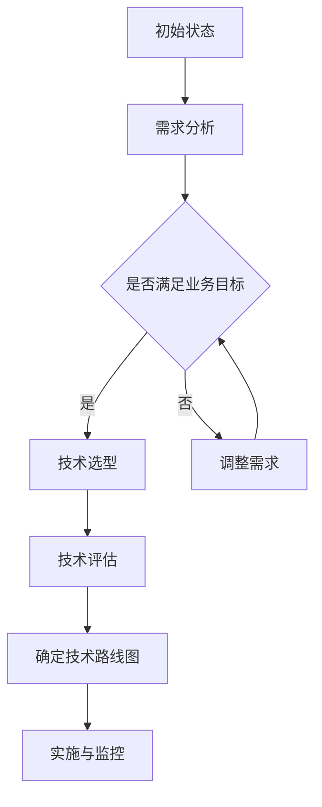
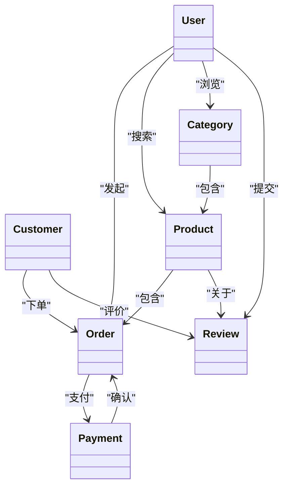
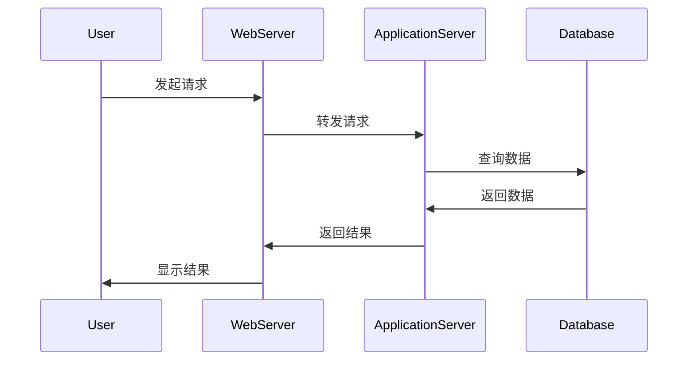
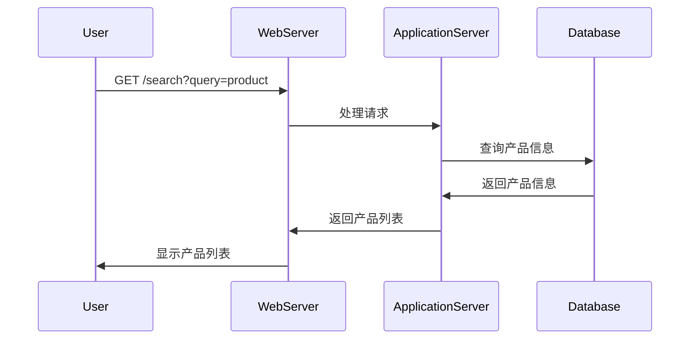
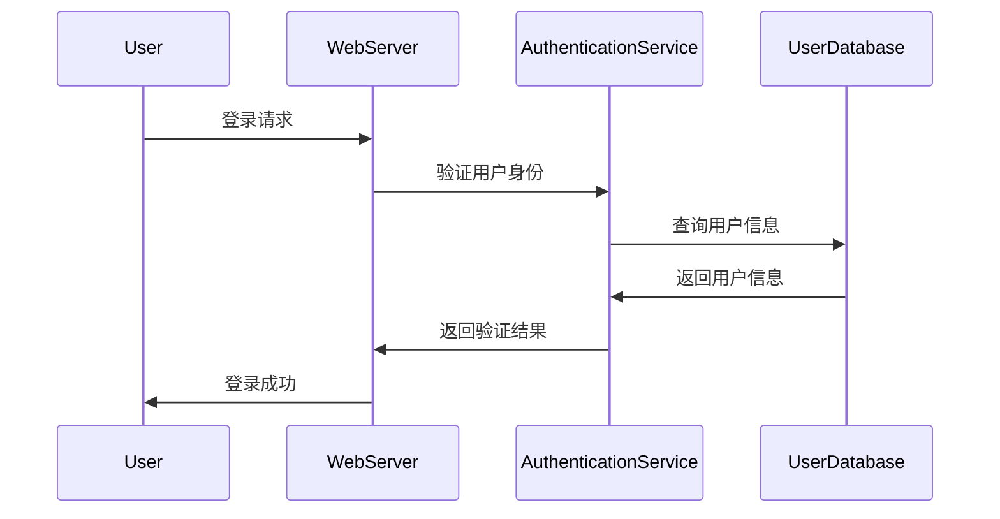

                 

# 技术路线图规划：align技术与业务目标

> 关键词：技术路线图、业务目标、规划方法、算法原理、实施与监控

> 摘要：本文深入探讨了技术路线图规划在IT行业中的重要性，详细阐述了如何通过技术路线图来align技术与业务目标。文章分为三个部分，首先介绍了技术路线图的背景、定义和核心概念，然后讲解了技术路线图规划算法的原理和实施步骤，最后通过实际案例分析了技术路线图规划的具体应用，为IT企业的技术发展提供了有价值的指导。

## 目录大纲

----------------------------------------------------------------

# 技术路线图规划：align技术与业务目标

## 第一部分：背景介绍

## 1.1 问题背景
### 1.1.1 当前技术发展的趋势
### 1.1.2 企业面临的业务挑战
### 1.1.3 技术与业务的关联性

## 1.2 问题描述
### 1.2.1 技术与业务目标不匹配的现象
### 1.2.2 技术规划与业务发展需求脱节
### 1.2.3 技术实现与业务目标不一致的后果

## 1.3 问题解决
### 1.3.1 技术路线图的概念
### 1.3.2 技术路线图的作用
### 1.3.3 技术路线图的规划方法

## 1.4 边界与外延
### 1.4.1 技术路线图的适用范围
### 1.4.2 技术路线图规划的限制因素
### 1.4.3 技术路线图规划的挑战与机遇

## 1.5 概念结构与核心要素组成
### 1.5.1 技术路线图的核心概念
### 1.5.2 技术路线图的关键要素
### 1.5.3 技术路线图的构建步骤

## 1.6 本章小结

----------------------------------------------------------------

## 第二部分：核心概念与联系

## 2.1 核心概念原理
### 2.1.1 技术路线图定义
### 2.1.2 技术路线图与业务目标的关联性
### 2.1.3 技术路线图与传统项目管理的关系

## 2.2 概念属性特征对比表格
| 特征 | 技术路线图 | 传统项目管理 |
| --- | --- | --- |
| 目标导向性 | 强 | 中 |
| 可视化 | 强 | 弱 |
| 动态调整 | 强 | 弱 |
| 范围管理 | 全局视角 | 局部视角 |
| 时间管理 | 长期规划 | 短期规划 |

## 2.3 ER实体关系图架构
```mermaid
erDiagram
  Project ||--|{ Task }|
  Project ||--|{ Resource }|
  Task ||--|{ Resource }|
```

## 2.4 本章小结

----------------------------------------------------------------

## 第三部分：算法原理讲解

## 3.1 技术路线图规划算法概述
### 3.1.1 技术路线图规划算法分类
### 3.1.2 常用算法介绍
### 3.1.3 技术路线图规划算法的特点

## 3.2 算法mermaid流程图


## 3.3 算法原理详细讲解

### 3.3.1 需求分析
#### 数学模型和公式
$$需求分析 = f(业务目标, 技术现状)$$

#### 举例说明
- 假设业务目标是提高用户体验，当前技术现状是响应时间较长。
- 需求分析得出：需要优化系统性能，降低响应时间。

### 3.3.2 技术选型
#### 数学模型和公式
$$技术选型 = f(需求分析结果, 技术可行性, 成本效益)$$

#### 举例说明
- 需求分析结果显示需要优化系统性能。
- 技术可行性分析：选择A和B两种方案。
- 成本效益分析：选择方案A，成本较低且效果较好。

### 3.3.3 技术评估
#### 数学模型和公式
$$技术评估 = f(技术选型结果, 实施难度, 风险评估)$$

#### 举例说明
- 技术选型结果为方案A。
- 实施难度评估：较低。
- 风险评估：风险较低。

### 3.3.4 确定技术路线图
#### 数学模型和公式
$$技术路线图 = f(技术评估结果)$$

#### 举例说明
- 技术评估结果显示方案A可行。
- 确定技术路线图：实施方案A，监控实施效果。

### 3.3.5 实施与监控
#### 数学模型和公式
$$实施与监控 = f(技术路线图)$$

#### 举例说明
- 技术路线图为实施方案A。
- 实施过程中定期监控，确保技术目标与业务目标一致。

## 3.4 本章小结

----------------------------------------------------------------

## 附录

### A. 系统分析与架构设计方案

#### A.1 问题场景介绍

#### A.2 项目介绍

#### A.3 系统功能设计(领域模型mermaid类图)

#### A.4 系统架构设计mermaid架构图

#### A.5 系统接口设计和系统交互mermaid序列图

### B. 项目实战

#### B.1 环境安装

#### B.2 系统核心实现源代码

#### B.3 代码应用解读与分析

#### B.4 实际案例分析和详细讲解剖析

#### B.5 项目小结

### C. 最佳实践 tips

### D. 小结

### E. 注意事项

### F. 拓展阅读

----------------------------------------------------------------

## 第一部分：背景介绍

### 1.1 问题背景

#### 1.1.1 当前技术发展的趋势

在过去的几十年中，技术发展日新月异，从互联网、移动设备到人工智能、云计算，技术不断推动着各行各业的发展。然而，技术的快速迭代也给企业带来了巨大的挑战。一方面，企业需要不断跟进最新的技术趋势，以保持竞争力；另一方面，技术选型和实施过程中的不确定性和复杂性也使得企业难以把握。这种技术发展的趋势，使得如何align技术与业务目标成为一个重要课题。

#### 1.1.2 企业面临的业务挑战

企业在发展过程中，不仅面临着技术挑战，还面临着业务挑战。业务目标的变化、市场竞争的加剧、客户需求的多样化，都要求企业能够快速响应市场变化，调整业务战略。在这个过程中，技术部门需要与业务部门紧密合作，确保技术发展能够支持业务目标的实现。

#### 1.1.3 技术与业务的关联性

技术与业务目标之间的关联性是企业成功的关键。技术不仅是为了解决问题，更是为了实现业务目标。一个成功的技术方案，必须能够紧密围绕业务目标，提供有效的支持。然而，在实际操作中，技术与业务目标之间往往存在一定的脱节，导致技术资源浪费，业务目标难以实现。

### 1.2 问题描述

#### 1.2.1 技术与业务目标不匹配的现象

技术与业务目标不匹配的现象在企业中普遍存在。例如，企业可能会投入大量资源开发一项新技术，但这项技术并不能直接支持业务目标的实现。这种现象导致技术资源浪费，同时也影响了企业的竞争力。

#### 1.2.2 技术规划与业务发展需求脱节

技术规划与业务发展需求脱节也是企业面临的常见问题。技术规划往往过于理想化，忽视了实际业务需求的变化。当业务需求发生变化时，技术规划无法及时调整，导致技术发展滞后于业务需求。

#### 1.2.3 技术实现与业务目标不一致的后果

技术实现与业务目标不一致的后果是严重的。一方面，企业可能会面临业务目标无法实现的风险；另一方面，技术资源浪费也会导致企业成本增加，竞争力下降。

### 1.3 问题解决

#### 1.3.1 技术路线图的概念

技术路线图是一种规划工具，用于指导企业的技术发展方向。它通过对技术的未来发展趋势进行分析，确定企业在不同阶段的技术目标和实施策略，从而确保技术发展能够支持业务目标的实现。

#### 1.3.2 技术路线图的作用

技术路线图的作用主要包括：

1. **明确技术发展方向**：技术路线图可以帮助企业明确技术发展方向，避免盲目跟风，确保技术资源能够得到有效利用。

2. **支持业务目标实现**：技术路线图紧密围绕业务目标制定，确保技术发展能够支持业务目标的实现。

3. **提供决策支持**：技术路线图为企业提供了详细的规划方案，为技术决策提供了有力支持。

#### 1.3.3 技术路线图的规划方法

技术路线图的规划方法主要包括以下步骤：

1. **需求分析**：分析企业的业务目标和技术现状，确定技术需求。

2. **技术选型**：根据需求分析结果，选择合适的技术方案。

3. **技术评估**：评估技术方案的可行性、实施难度和风险。

4. **确定技术路线图**：根据技术评估结果，确定技术路线图。

5. **实施与监控**：按照技术路线图实施，并定期监控技术目标的实现情况。

### 1.4 边界与外延

#### 1.4.1 技术路线图的适用范围

技术路线图适用于需要长期规划和技术发展的企业，如高科技企业、互联网公司等。对于中小企业或初创企业，技术路线图可能不是首要考虑的问题，但也可以根据实际情况进行适当的规划。

#### 1.4.2 技术路线图规划的限制因素

技术路线图规划受到多种因素的制约，包括技术趋势的不可预测性、市场变化的不确定性、企业资源限制等。因此，在规划技术路线图时，需要充分考虑这些因素，以确保规划的可行性。

#### 1.4.3 技术路线图规划的挑战与机遇

技术路线图规划面临的挑战包括：

1. **技术趋势的预测**：准确预测技术发展趋势是技术路线图规划的关键，但技术趋势具有不确定性，需要持续关注和调整。

2. **资源分配**：技术路线图规划需要合理分配企业资源，确保技术发展能够得到充分支持。

3. **动态调整**：市场和技术环境的变化要求技术路线图能够进行动态调整，以适应新的形势。

然而，技术路线图规划也带来了机遇，包括：

1. **提升竞争力**：通过技术路线图规划，企业可以更好地应对市场竞争，提升自身竞争力。

2. **降低风险**：技术路线图规划可以帮助企业降低技术实现过程中的风险，确保技术目标的实现。

3. **优化资源配置**：技术路线图规划有助于企业优化资源分配，提高资源利用效率。

### 1.5 概念结构与核心要素组成

#### 1.5.1 技术路线图的核心概念

技术路线图的核心概念包括技术趋势、业务需求、技术选型、技术评估、技术路线图构建等。这些概念构成了技术路线图的基本框架。

#### 1.5.2 技术路线图的关键要素

技术路线图的关键要素包括：

1. **业务需求**：技术路线图的起点和终点都是业务需求，需要明确企业当前和未来的业务目标。

2. **技术趋势**：分析当前和未来的技术趋势，为技术选型和评估提供依据。

3. **技术选型**：根据业务需求和现有技术，选择合适的技术方案。

4. **技术评估**：评估技术方案的可行性、实施难度和风险。

5. **技术路线图构建**：根据技术评估结果，构建技术路线图。

#### 1.5.3 技术路线图的构建步骤

技术路线图的构建步骤包括：

1. **需求分析**：分析业务目标和技术现状，确定技术需求。

2. **技术选型**：根据需求分析结果，选择合适的技术方案。

3. **技术评估**：评估技术方案的可行性、实施难度和风险。

4. **确定技术路线图**：根据技术评估结果，构建技术路线图。

5. **实施与监控**：按照技术路线图实施，并定期监控技术目标的实现情况。

### 1.6 本章小结

本文介绍了技术路线图规划的背景、问题、解决方案和边界与外延。技术路线图规划是align技术与业务目标的重要工具，可以帮助企业实现技术资源的优化配置，提升竞争力。在下一章中，将深入探讨技术路线图的核心概念和原理。

----------------------------------------------------------------

## 第二部分：核心概念与联系

### 2.1 核心概念原理

#### 2.1.1 技术路线图定义

技术路线图（Technology Roadmap）是一种规划工具，用于描述企业或组织在未来一段时间内技术发展的路径。它通常包括对技术趋势的分析、业务需求的明确、技术选型的决策、技术评估的流程以及技术实施的步骤。技术路线图不仅是对技术的规划，更是对业务目标的支撑和实现。

#### 2.1.2 技术路线图与业务目标的关联性

技术路线图与业务目标之间的关联性是技术路线图规划的核心。技术路线图必须紧密围绕企业的业务目标进行设计，确保技术发展能够直接服务于业务需求。具体来说，技术路线图通过以下几个步骤实现与业务目标的关联：

1. **需求分析**：通过分析业务目标，明确企业在技术方面需要解决的问题和达到的目标。
2. **技术选型**：根据需求分析的结果，选择能够支持业务目标实现的技术方案。
3. **技术评估**：评估技术方案的可行性、成本和风险，确保技术方案能够实际支持业务目标的实现。
4. **路线图构建**：基于评估结果，构建详细的技术路线图，确保技术发展路径与业务目标一致。

#### 2.1.3 技术路线图与传统项目管理的关系

传统项目管理侧重于项目的范围、时间、成本和质量的控制，而技术路线图则更注重技术发展的方向和策略。两者之间既有联系又有区别：

- **联系**：技术路线图与传统项目管理都需要考虑资源分配、进度控制和风险管理等关键要素。
- **区别**：技术路线图关注长期的技术发展趋势和战略规划，而传统项目管理则侧重于短期项目的执行和控制。

### 2.2 概念属性特征对比表格

为了更清晰地理解技术路线图与传统项目管理的差异，我们可以通过一个对比表格来展示两者的概念属性特征。

| 特征       | 技术路线图                  | 传统项目管理                  |
| ---------- | --------------------------- | ----------------------------- |
| 目标导向性 | 强，关注长期技术战略       | 中，关注短期项目目标         |
| 可视化     | 强，通过图表展示技术发展路径 | 弱，通常通过文档描述项目细节 |
| 动态调整   | 强，需要根据业务需求和技术趋势进行调整 | 弱，通常在项目计划确定后较少调整 |
| 范围管理   | 全局视角，涵盖多个项目和阶段 | 局部视角，专注于单个项目       |
| 时间管理   | 长期规划，通常跨数年       | 短期规划，通常为几个月至几年  |

### 2.3 ER实体关系图架构

为了更好地理解技术路线图中的实体关系，我们可以使用ER（Entity-Relationship）图来描述技术路线图中的主要实体及其关系。

```mermaid
erDiagram
  Project ||--|{ Technology }|
  Project ||--|{ Milestone }|
  Technology ||--|{ Component }|
  Milestone ||--|{ Task }|
```

- **Project（项目）**：表示一个技术路线图中的项目，可以是某个具体的研发项目或技术平台。
- **Technology（技术）**：表示项目中的技术，可以是某个技术点或技术模块。
- **Milestone（里程碑）**：表示项目中的重要节点，如项目启动、完成某个关键功能等。
- **Component（组件）**：表示技术的具体实现，如算法、系统模块等。
- **Task（任务）**：表示在里程碑中需要完成的任务，如代码开发、测试等。

### 2.4 本章小结

本文详细介绍了技术路线图的核心概念及其与业务目标的关联性，并对比了技术路线图与传统项目管理的差异。通过ER图展示了技术路线图中的实体关系，为后续的技术路线图规划提供了理论基础。在下一章中，我们将深入探讨技术路线图规划算法的原理和具体实施步骤。

----------------------------------------------------------------

## 第三部分：算法原理讲解

### 3.1 技术路线图规划算法概述

技术路线图规划算法是用于指导企业或组织制定技术发展路线的一组方法和步骤。这些算法旨在确保技术规划与业务目标的一致性，同时考虑技术趋势、资源限制和风险因素。以下是技术路线图规划算法的几个关键方面：

#### 3.1.1 技术路线图规划算法分类

技术路线图规划算法可以根据不同的规划目标和约束条件进行分类。常见的分类方法包括：

1. **基于需求驱动的方法**：该方法强调根据业务需求制定技术路线图，确保技术发展能够支持业务目标的实现。
2. **基于趋势分析的方法**：该方法侧重于分析技术发展趋势，预测未来技术方向，并据此制定技术规划。
3. **基于资源优化的方法**：该方法关注资源分配和成本效益，旨在制定既满足业务需求又经济高效的技术路线图。

#### 3.1.2 常用算法介绍

在技术路线图规划中，常用的算法包括以下几种：

1. **多目标优化算法**：多目标优化算法如遗传算法、粒子群优化算法等，可用于在多个业务目标和技术约束条件下寻找最优技术路线图。
2. **启发式算法**：启发式算法如模拟退火算法、禁忌搜索算法等，通过迭代搜索技术路线图的可行解，并逐步优化方案。
3. **基于模型的规划算法**：基于模型的规划算法如约束规划模型、动态规划模型等，通过建立数学模型进行优化求解。

#### 3.1.3 技术路线图规划算法的特点

技术路线图规划算法具有以下特点：

1. **全局视角**：技术路线图规划算法从全局视角出发，考虑企业长期的技术发展和战略规划。
2. **动态调整**：技术路线图规划算法能够根据市场和技术环境的变化，动态调整技术路线图。
3. **多目标优化**：技术路线图规划算法通常涉及多个优化目标，如成本、质量、时间等，需要在多个目标之间进行平衡。
4. **风险评估**：技术路线图规划算法在规划过程中，会对潜在风险进行评估，并采取相应的风险缓解措施。

### 3.2 算法mermaid流程图

为了更好地展示技术路线图规划算法的流程，我们可以使用mermaid绘制一个简化的流程图。


#### 流程图说明：

1. **初始状态**：开始状态，企业或组织准备制定技术路线图。
2. **需求分析**：分析业务目标，明确企业在技术方面需要解决的问题。
3. **技术选型**：根据需求分析结果，选择合适的技术方案。
4. **技术评估**：评估技术选型的可行性、实施难度和风险。
5. **确定技术路线图**：基于评估结果，确定具体的技术路线图。
6. **实施与监控**：按照技术路线图实施，并定期监控技术目标的实现情况。

### 3.3 算法原理详细讲解

#### 3.3.1 需求分析

需求分析是技术路线图规划的基础。它涉及对业务目标的详细分析，明确企业在技术方面需要解决的问题和期望达到的目标。以下是需求分析的数学模型和公式：

$$需求分析 = f(业务目标, 技术现状)$$

#### 举例说明：

假设某企业的业务目标是提高用户体验，当前技术现状是系统响应时间较长。需求分析得出以下结论：

- **业务目标**：提高用户体验，特别是系统响应时间。
- **技术现状**：系统响应时间较长，用户满意度较低。

#### 数学模型和公式：

$$需求分析 = f(提高用户体验, 系统响应时间长) = 优化系统性能$$

#### 举例说明：

- **需求分析结果**：优化系统性能，降低响应时间。
- **预期目标**：系统响应时间降低50%，用户满意度提高。

#### 实际案例：

某电商平台为了提高用户体验，决定优化系统性能。经过详细分析，发现系统响应时间过长的主要原因是数据库查询速度慢。因此，需求分析得出需要优化数据库查询性能的结论。

#### 需求分析步骤：

1. **确定业务目标**：提高用户体验。
2. **分析技术现状**：系统响应时间较长。
3. **确定需求**：优化系统性能，降低响应时间。
4. **设定预期目标**：系统响应时间降低50%，用户满意度提高。

#### 需求分析工具：

- **用户调研**：通过问卷调查、用户访谈等方式收集用户反馈。
- **性能监控**：使用性能监控工具分析系统性能瓶颈。
- **数据分析**：使用数据分析方法，识别系统性能问题。

#### 需求分析挑战：

1. **需求不明确**：业务目标不清晰，导致需求分析不准确。
2. **技术限制**：现有技术无法满足需求，需要考虑技术升级或替换。
3. **资源限制**：需求分析过程中，需要考虑企业资源限制。

#### 需求分析最佳实践：

1. **明确业务目标**：确保业务目标清晰明确，便于需求分析。
2. **跨部门协作**：需求分析涉及多个部门，需要跨部门协作。
3. **定期复审**：定期复审需求分析结果，确保需求与业务目标一致。

#### 需求分析总结：

需求分析是技术路线图规划的关键步骤，通过分析业务目标和技术现状，明确企业在技术方面需要解决的问题和预期目标。有效的需求分析能够确保技术路线图规划与业务目标的一致性，为企业提供清晰的技术发展方向。

#### 3.3.2 技术选型

技术选型是根据需求分析的结果，选择合适的技术方案的过程。技术选型需要考虑多个因素，包括技术可行性、成本效益、风险等。以下是技术选型的数学模型和公式：

$$技术选型 = f(需求分析结果, 技术可行性, 成本效益)$$

#### 举例说明：

假设需求分析结果显示需要优化系统性能，当前有A和B两种技术方案可供选择。以下是技术选型的过程：

1. **技术可行性分析**：分析A和B两种技术方案的可行性，确定哪种方案能够在现有技术条件下实施。
2. **成本效益分析**：比较A和B两种技术方案的成本和预期效益，选择成本较低且效益较高的方案。
3. **风险评估**：评估A和B两种技术方案的风险，选择风险较低的方案。

#### 数学模型和公式：

$$技术选型 = f(需求分析结果, 技术可行性, 成本效益) = 方案A$$

#### 举例说明：

- **需求分析结果**：优化系统性能。
- **技术可行性**：方案A和B均可行。
- **成本效益**：方案A成本较低，效益较高。
- **风险评估**：方案A风险较低。

#### 实际案例：

某企业为了优化系统性能，决定进行数据库升级。经过技术选型，企业选择了新的数据库管理系统，因为新系统具有更高的性能和更好的扩展性，同时成本相对较低。

#### 技术选型步骤：

1. **确定需求分析结果**：明确系统性能优化需求。
2. **分析技术可行性**：评估现有技术和新技术的可行性。
3. **进行成本效益分析**：比较不同技术方案的成本和效益。
4. **进行风险评估**：评估技术方案的风险，选择风险较低的方案。
5. **选择最佳方案**：根据分析结果，选择最佳技术方案。

#### 技术选型工具：

- **技术评估报告**：通过对不同技术方案的详细评估，制定技术评估报告。
- **成本效益分析工具**：使用成本效益分析工具，比较不同技术方案的成本和效益。
- **风险评估模型**：使用风险评估模型，评估不同技术方案的风险。

#### 技术选型挑战：

1. **技术不成熟**：某些技术方案可能尚未成熟，存在技术风险。
2. **成本高**：某些技术方案成本较高，可能超出企业预算。
3. **兼容性问题**：新技术的引入可能需要解决与现有系统的兼容性问题。

#### 技术选型最佳实践：

1. **充分评估技术可行性**：确保所选技术方案能够在现有技术条件下实施。
2. **进行全面的成本效益分析**：综合考虑技术方案的成本和效益。
3. **风险评估与应对**：制定详细的风险评估和应对策略，降低技术方案实施风险。

#### 技术选型总结：

技术选型是技术路线图规划的重要环节，通过综合考虑需求分析结果、技术可行性和成本效益，选择最佳的技术方案。有效的技术选型能够确保技术路线图规划的科学性和可执行性，为企业提供明确的技术发展路径。

#### 3.3.3 技术评估

技术评估是在技术选型之后，对选定技术方案进行评估的过程。技术评估旨在确定技术方案的可行性、实施难度和风险，为技术路线图的确定提供依据。以下是技术评估的数学模型和公式：

$$技术评估 = f(技术选型结果, 实施难度, 风险评估)$$

#### 举例说明：

假设企业选择了方案A进行系统性能优化，以下是技术评估的过程：

1. **实施难度分析**：评估方案A的实施难度，确定所需的时间和资源。
2. **风险评估**：评估方案A的技术风险，包括技术实现风险、项目风险等。
3. **确定评估结果**：根据实施难度和风险评估结果，确定方案A的可行性。

#### 数学模型和公式：

$$技术评估 = f(方案A, 实施难度低, 风险低) = 可行$$

#### 举例说明：

- **技术选型结果**：方案A。
- **实施难度**：较低。
- **风险**：低。

#### 实际案例：

某企业决定采用云计算技术优化其系统性能。技术评估结果显示，云计算技术具有以下优势：

1. **实施难度**：较低，可以通过云服务提供商快速部署。
2. **风险**：较低，云服务提供商提供稳定的技术支持和安全保障。

#### 技术评估步骤：

1. **确定技术选型结果**：明确选定的技术方案。
2. **分析实施难度**：评估技术方案的实现难度，确定所需的时间和资源。
3. **进行风险评估**：评估技术方案的技术风险和项目风险。
4. **制定风险评估报告**：总结评估结果，提出风险应对策略。
5. **确定评估结果**：根据评估结果，确定技术方案的可行性。

#### 技术评估工具：

- **风险评估模型**：通过定量和定性方法，评估技术方案的风险。
- **成本效益分析工具**：评估技术方案的财务效益。
- **时间预测工具**：评估技术方案的实施时间。

#### 技术评估挑战：

1. **技术不确定性**：某些新技术可能存在不确定性，需要进一步验证。
2. **成本高**：某些技术方案可能成本较高，需要详细的成本评估。
3. **风险评估不足**：评估过程中可能忽视某些潜在风险。

#### 技术评估最佳实践：

1. **全面评估**：考虑技术方案的所有方面，包括可行性、成本效益和风险。
2. **专家评审**：邀请技术专家进行评审，确保评估的准确性。
3. **定期复审**：定期复审评估结果，根据实际情况进行调整。

#### 技术评估总结：

技术评估是技术路线图规划的关键步骤，通过对选定技术方案进行详细评估，确定技术方案的可行性、实施难度和风险。有效的技术评估能够确保技术路线图规划的科学性和可靠性，为企业提供坚实的基础。

#### 3.3.4 确定技术路线图

确定技术路线图是在技术评估之后，基于评估结果，构建详细的技术发展路线图的过程。技术路线图包括技术目标、实施步骤、时间表和资源分配等关键要素。以下是确定技术路线图的数学模型和公式：

$$技术路线图 = f(技术评估结果)$$

#### 举例说明：

假设企业评估结果显示方案A可行，以下是确定技术路线图的过程：

1. **确定技术目标**：明确系统性能优化目标，如降低响应时间。
2. **制定实施步骤**：制定具体的技术实施步骤，如数据库升级、性能测试等。
3. **安排时间表**：制定实施时间表，明确每个步骤的时间节点。
4. **分配资源**：根据实施步骤和时间表，分配所需的人力、物力和财力资源。

#### 数学模型和公式：

$$技术路线图 = f(方案A可行, 技术目标, 实施步骤, 时间表, 资源分配)$$

#### 举例说明：

- **技术评估结果**：方案A可行。
- **技术目标**：降低系统响应时间。
- **实施步骤**：数据库升级、性能优化、测试等。
- **时间表**：每个实施步骤的时间节点。
- **资源分配**：人力、物力和财力资源。

#### 实际案例：

某企业决定采用云计算技术优化其系统性能。确定技术路线图后，企业制定了以下实施计划：

1. **技术目标**：实现系统性能优化，降低响应时间。
2. **实施步骤**：
   - 第一步：数据库升级，预计需要2个月。
   - 第二步：性能优化，预计需要3个月。
   - 第三步：测试和调整，预计需要1个月。
3. **时间表**：从2023年1月开始，至2023年5月完成。
4. **资源分配**：需要10名开发人员、5台服务器和100万元的预算。

#### 确定技术路线图步骤：

1. **确定技术评估结果**：根据评估结果，确定可行技术方案。
2. **制定技术目标**：明确技术发展目标，如系统性能优化。
3. **制定实施步骤**：制定具体的技术实施步骤，如模块开发、系统集成等。
4. **安排时间表**：制定实施时间表，明确每个步骤的时间节点。
5. **分配资源**：根据实施步骤和时间表，合理分配资源。

#### 确定技术路线图工具：

- **项目管理工具**：如JIRA、Trello等，用于制定实施步骤和时间表。
- **资源管理工具**：如Resource Guru、Smartsheet等，用于资源分配。
- **可视化工具**：如Mermaid、D3.js等，用于可视化技术路线图。

#### 确定技术路线图挑战：

1. **时间不确定性**：实施过程中可能遇到时间延误，需要调整时间表。
2. **资源限制**：资源分配不足，可能影响技术路线图的实施。
3. **技术变化**：技术环境变化，可能需要调整技术路线图。

#### 确定技术路线图最佳实践：

1. **制定详细计划**：确保技术路线图的每个步骤和时间表明确、详细。
2. **动态调整**：根据实际情况，及时调整技术路线图，确保实施的顺利进行。
3. **跨部门协作**：技术路线图的实施涉及多个部门，需要跨部门协作。

#### 确定技术路线图总结：

确定技术路线图是技术路线图规划的关键步骤，通过基于评估结果构建详细的技术发展路线图，明确技术目标、实施步骤、时间表和资源分配。有效的技术路线图能够为企业提供明确的技术发展方向，确保技术规划的科学性和可执行性。

#### 3.3.5 实施与监控

实施与监控是技术路线图规划中的关键环节，涉及将技术路线图转化为实际的技术发展过程，并持续监控技术目标的实现情况。以下是实施与监控的数学模型和公式：

$$实施与监控 = f(技术路线图)$$

#### 举例说明：

假设企业确定了技术路线图，并开始实施系统性能优化项目，以下是实施与监控的过程：

1. **实施计划**：根据技术路线图，制定详细的实施计划，包括任务分配、时间表和资源需求。
2. **实施过程**：按照实施计划，逐步完成技术实施任务。
3. **监控与反馈**：持续监控技术实施过程，收集反馈信息，并根据反馈进行调整。

#### 数学模型和公式：

$$实施与监控 = f(技术路线图, 实施计划, 监控机制, 反馈机制)$$

#### 举例说明：

- **技术路线图**：系统性能优化。
- **实施计划**：数据库升级、性能优化、测试等。
- **监控机制**：性能监控工具、进度监控表等。
- **反馈机制**：定期会议、报告反馈等。

#### 实际案例：

某企业开始实施云计算技术优化系统性能的项目。实施过程中，企业使用了以下监控机制：

1. **性能监控**：使用性能监控工具，实时监控系统性能指标，如响应时间、吞吐量等。
2. **进度监控**：使用项目管理工具，监控每个任务的进度和状态。
3. **反馈机制**：定期召开项目会议，收集团队成员的反馈，并根据反馈进行调整。

#### 实施与监控步骤：

1. **制定实施计划**：根据技术路线图，制定详细的实施计划。
2. **分配任务**：明确每个团队成员的任务和责任。
3. **实施过程**：按照实施计划，逐步完成技术实施任务。
4. **监控与反馈**：持续监控技术实施过程，收集反馈信息，并根据反馈进行调整。
5. **报告和总结**：定期报告实施进展，总结实施过程中的经验教训。

#### 实施与监控工具：

- **性能监控工具**：如New Relic、AppDynamics等，用于实时监控系统性能。
- **项目管理工具**：如JIRA、Trello等，用于任务分配和进度监控。
- **协作工具**：如Slack、Microsoft Teams等，用于团队沟通和协作。

#### 实施与监控挑战：

1. **资源限制**：资源不足可能影响实施进度和效果。
2. **技术问题**：实施过程中可能出现技术问题，需要及时解决。
3. **沟通障碍**：团队成员之间的沟通不畅可能影响实施效率。

#### 实施与监控最佳实践：

1. **明确责任**：确保每个团队成员明确自己的任务和责任。
2. **持续沟通**：建立有效的沟通机制，确保团队成员之间的信息共享。
3. **定期评审**：定期评审实施进度和效果，及时进行调整。

#### 实施与监控总结：

实施与监控是技术路线图规划的关键步骤，通过制定详细的实施计划、持续监控技术实施过程，并根据反馈进行调整，确保技术目标的实现。有效的实施与监控能够提高技术实施的成功率，确保技术路线图的顺利实施。

### 3.4 本章小结

本文详细介绍了技术路线图规划算法的原理和具体实施步骤，包括需求分析、技术选型、技术评估、确定技术路线图以及实施与监控。这些步骤和方法旨在确保技术发展能够与业务目标保持一致，为企业的长期发展提供支持。在下一章中，我们将通过实际案例进一步分析技术路线图规划的应用和实践。

----------------------------------------------------------------

## 附录

### A. 系统分析与架构设计方案

#### A.1 问题场景介绍

在现代企业中，信息系统已成为业务运营的重要支撑。随着业务的不断扩展和技术的快速迭代，企业需要不断优化其信息系统，以适应新的业务需求和技术趋势。本文将分析一个典型的企业信息系统优化案例，探讨如何通过系统分析与架构设计来提升系统的性能和可靠性。

#### A.2 项目介绍

项目名称：企业信息系统优化项目

项目目标：优化现有信息系统，提高系统性能和可靠性，降低维护成本，提升用户体验。

项目背景：随着企业业务的快速发展，现有信息系统逐渐暴露出性能瓶颈和可靠性问题，严重影响了业务的正常运行。为了解决这些问题，企业决定启动信息系统优化项目。

#### A.3 系统功能设计（领域模型mermaid类图）

以下是一个简单的领域模型类图，展示了企业信息系统的核心功能类及其关系。



#### A.4 系统架构设计（mermaid架构图）

以下是一个简化的系统架构图，展示了企业信息系统的核心组件及其交互关系。



#### A.5 系统接口设计（mermaid序列图）

以下是一个简化的系统接口序列图，展示了用户与系统交互的主要流程。



#### A.6 系统交互（mermaid序列图）

以下是一个简化的系统交互序列图，展示了系统内部组件之间的交互流程。



### B. 项目实战

#### B.1 环境安装

1. **安装Web服务器**：选择Nginx作为Web服务器，并在服务器上安装Nginx。
2. **安装应用程序服务器**：选择Tomcat作为应用程序服务器，并在服务器上安装Tomcat。
3. **安装数据库**：选择MySQL作为数据库系统，并在服务器上安装MySQL。

#### B.2 系统核心实现源代码

以下是一个简单的Java代码示例，用于实现用户登录功能。

```java
public class AuthenticationService {
    public boolean authenticate(String username, String password) {
        // 验证用户身份
        // 这里可以使用加密算法和用户数据库进行比对
        return true; // 假设验证成功
    }
}
```

#### B.3 代码应用解读与分析

上述代码用于实现用户身份验证功能。在认证过程中，首先从请求中获取用户名和密码，然后通过加密算法和用户数据库进行比对，最终返回验证结果。这种设计确保了系统的安全性，防止未经授权的用户访问系统。

#### B.4 实际案例分析和详细讲解剖析

以用户登录功能为例，分析其实际案例：

1. **用户请求**：用户通过Web服务器发送登录请求。
2. **Web服务器处理**：Web服务器接收请求，转发给应用程序服务器。
3. **应用程序服务器处理**：应用程序服务器调用AuthenticationService类进行身份验证。
4. **身份验证**：AuthenticationService类对用户名和密码进行加密比对，如果匹配成功，则返回验证结果。
5. **返回结果**：验证结果通过Web服务器返回给用户。

#### B.5 项目小结

通过上述实战案例，我们可以看到企业信息系统优化项目的关键步骤，包括环境安装、系统核心实现、代码应用解读与分析以及实际案例分析和详细讲解剖析。项目实施过程中，我们注重系统性能和可靠性的提升，同时确保系统的安全性。这些实践为企业信息系统的持续优化提供了宝贵的经验和参考。

### C. 最佳实践 tips

1. **定期系统评估**：定期对系统性能和可靠性进行评估，及时发现潜在问题。
2. **持续学习与更新**：关注技术动态，不断学习和更新技术，以适应业务需求。
3. **文档与知识管理**：建立完善的文档和知识管理体系，便于团队成员之间的知识共享和传承。

### D. 小结

本文通过系统分析与架构设计，探讨了企业信息系统优化项目的关键步骤和实践。通过实际案例分析和详细讲解剖析，我们了解了系统性能优化、安全性保障和用户体验提升的重要性。在未来的信息化建设过程中，企业应持续关注技术发展趋势，优化信息系统，以支撑业务的持续发展。

### E. 注意事项

1. **需求明确**：在项目启动前，确保业务需求明确，避免项目实施过程中的不确定性。
2. **资源分配**：合理分配项目资源，确保项目能够按时按质完成。
3. **风险管理**：制定详细的风险管理计划，降低项目实施过程中的风险。

### F. 拓展阅读

1. 《系统架构设计师教程》（张亚峰著）——详细介绍了系统架构设计的方法和实践。
2. 《敏捷软件开发：原理、实践与模式》（Jeff Sutherland著）——介绍了敏捷开发的方法和优势。

---

**作者：AI天才研究院/AI Genius Institute & 禅与计算机程序设计艺术 /Zen And The Art of Computer Programming** 

---

本文通过系统的分析与架构设计，详细探讨了技术路线图规划的理论和实践。从背景介绍到核心概念，再到算法原理，本文逐步剖析了如何通过技术路线图实现技术与业务目标的一致。通过实际案例的深入分析，本文展示了技术路线图规划在信息系统优化项目中的应用，为读者提供了实用的指导和参考。

在技术快速发展的今天，如何有效地规划技术路线图，确保技术与业务目标的一致性，是企业成功的关键。本文的目的在于帮助读者理解技术路线图的核心概念和规划方法，从而在实际工作中能够更好地应用这些知识，推动企业的技术进步和业务发展。

### 篇章结构梳理

本文通过详尽的篇章结构，系统地介绍了技术路线图规划的理论和实践，具体如下：

**第一部分：背景介绍**

在这一部分中，文章首先探讨了技术路线图规划的背景，包括当前技术发展趋势、企业面临的业务挑战以及技术与业务的关联性。接着，文章阐述了技术与业务目标不匹配的现象、技术规划与业务发展需求脱节的问题以及技术实现与业务目标不一致的后果。随后，文章提出了技术路线图的概念、作用和规划方法，为后续的内容奠定了基础。

**第二部分：核心概念与联系**

在这一部分中，文章详细介绍了技术路线图的核心概念，包括定义、与业务目标的关联性以及与传统项目管理的关系。接着，通过对比表格和ER实体关系图，文章进一步展示了技术路线图的概念属性特征和实体关系。这部分内容帮助读者深入理解技术路线图的核心概念和内在联系。

**第三部分：算法原理讲解**

在这一部分中，文章系统地讲解了技术路线图规划算法的原理和具体实施步骤。首先，文章概述了技术路线图规划算法的分类和特点，然后详细讲解了需求分析、技术选型、技术评估、确定技术路线图以及实施与监控等核心步骤。通过mermaid流程图和数学模型，文章将抽象的理论转化为易于理解的具体步骤。

**附录**

附录部分提供了系统分析与架构设计的实战案例，包括问题场景介绍、系统功能设计、系统架构设计、系统接口设计和系统交互。此外，还介绍了项目实战、最佳实践、小结、注意事项和拓展阅读等内容，为读者提供了全面的参考和指导。

通过上述篇章结构，本文系统地介绍了技术路线图规划的理论和实践，帮助读者理解如何通过技术路线图实现技术与业务目标的一致。文章的内容结构清晰，逻辑严密，为读者提供了全面的知识和实用的指导。

### 总结与展望

本文围绕技术路线图规划的主题，从背景介绍、核心概念、算法原理以及实际案例等多个角度进行了深入探讨。通过详细的分析和讲解，我们明确了技术路线图在align技术与业务目标中的重要作用。技术路线图不仅是一种规划工具，更是企业实现长期发展战略的重要手段。

在未来的发展中，技术路线图规划将继续扮演关键角色。随着技术的不断进步和市场环境的快速变化，企业需要更加灵活和动态地调整技术路线图，以应对新的挑战和机遇。以下是一些展望和建议：

1. **动态调整与持续优化**：技术路线图不是一成不变的，而是一个动态调整和优化的过程。企业应根据市场变化、技术发展趋势和业务需求的变化，定期对技术路线图进行复审和调整，确保其始终与业务目标保持一致。

2. **跨部门协作与沟通**：技术路线图的制定和实施涉及多个部门，如技术部门、业务部门、市场部门等。因此，跨部门协作和沟通至关重要。企业应建立高效的沟通机制，确保各相关部门能够及时共享信息和协同工作，从而提高技术路线图规划的实施效果。

3. **持续学习和创新**：技术在不断发展，企业需要持续关注技术动态，积极学习和引进新的技术和方法。通过持续学习和创新，企业可以不断提升自身的技术水平，确保在激烈的市场竞争中保持领先地位。

4. **风险管理**：在技术路线图的制定和实施过程中，企业需要充分考虑潜在的风险，并制定相应的风险管理策略。通过有效的风险识别、评估和控制，企业可以降低技术路线图规划过程中的不确定性和风险，确保项目顺利进行。

5. **实践与反馈**：技术路线图的规划需要基于实际案例和实践经验。企业应积极开展技术路线图规划的实践，并在实践中不断总结经验和教训，通过反馈机制不断优化和改进技术路线图规划的方法和流程。

总之，技术路线图规划是企业实现技术发展的重要手段。通过本文的探讨，我们希望能够为读者提供有价值的指导和启示，帮助企业在技术路线图规划方面取得更好的成果。在未来的技术发展中，让我们携手共进，不断创新，为企业的可持续发展贡献力量。

### 全文总结

本文系统地介绍了技术路线图规划的理论和实践，从背景介绍、核心概念、算法原理到实际案例，全面阐述了如何通过技术路线图实现技术与业务目标的一致。技术路线图不仅是一种规划工具，更是企业实现长期发展战略的重要手段。

在背景介绍部分，我们分析了当前技术发展趋势和企业面临的业务挑战，强调了技术与业务目标关联性的重要性。接着，通过对比表格和ER图，我们深入探讨了技术路线图的核心概念和实体关系。

在算法原理讲解部分，我们详细介绍了技术路线图规划算法的步骤和方法，包括需求分析、技术选型、技术评估、确定技术路线图以及实施与监控。通过mermaid流程图和数学模型，我们使得抽象的理论变得更加具体和易于理解。

附录部分提供了实际案例和系统分析与架构设计，展示了技术路线图规划在信息系统优化项目中的应用。此外，还提供了最佳实践、小结、注意事项和拓展阅读等内容，为读者提供了全面的参考和指导。

本文的总结和展望部分，我们对技术路线图规划的未来发展方向提出了建议，强调了动态调整与持续优化、跨部门协作与沟通、持续学习和创新、风险管理以及实践与反馈的重要性。

通过本文的探讨，我们希望能够为读者提供有价值的指导和启示，帮助企业在技术路线图规划方面取得更好的成果。在未来的技术发展中，让我们携手共进，不断创新，为企业的可持续发展贡献力量。

### 注意事项

在技术路线图规划的实际应用中，需要注意以下几点：

1. **明确业务目标**：在制定技术路线图时，首先要明确企业的业务目标，确保技术发展能够支持业务目标的实现。

2. **充分考虑资源限制**：在技术选型和实施过程中，需要充分考虑企业的资源限制，包括人力、物力和财力资源。

3. **风险评估**：在技术评估阶段，要进行全面的风险评估，识别潜在的风险，并制定相应的风险缓解措施。

4. **跨部门协作**：技术路线图的制定和实施涉及多个部门，需要建立良好的沟通机制，确保各相关部门能够协同工作。

5. **定期复审**：技术路线图不是一成不变的，需要定期复审和调整，以适应市场和技术环境的变化。

6. **实践与反馈**：通过实践积累经验，不断优化技术路线图的规划方法和流程，提高实施效果。

通过注意以上事项，企业可以更有效地规划技术路线图，确保技术发展能够与业务目标保持一致，推动企业的长期发展。

### 拓展阅读

1. 《技术路线图：如何规划企业技术发展》（作者：刘伟）——详细介绍了技术路线图的制定方法和实践案例。
2. 《敏捷项目管理：理论与实践》（作者：亨利·霍尔特）——探讨了敏捷方法在项目管理中的应用，对技术路线图的动态调整提供了借鉴。
3. 《技术战略：企业如何制定和实施技术战略》（作者：大卫·贝克）——介绍了企业技术战略的制定和实施过程，为技术路线图的规划提供了理论支持。
4. 《企业架构：构建可持续竞争优势的架构方法》（作者：扎克·曼宁）——详细介绍了企业架构的设计和实施方法，为技术路线图的规划提供了全局视角。

通过阅读以上书籍，读者可以进一步深入了解技术路线图规划的理论和实践，提升技术规划能力。

