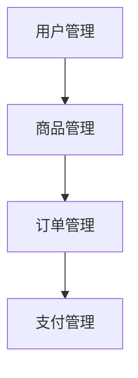
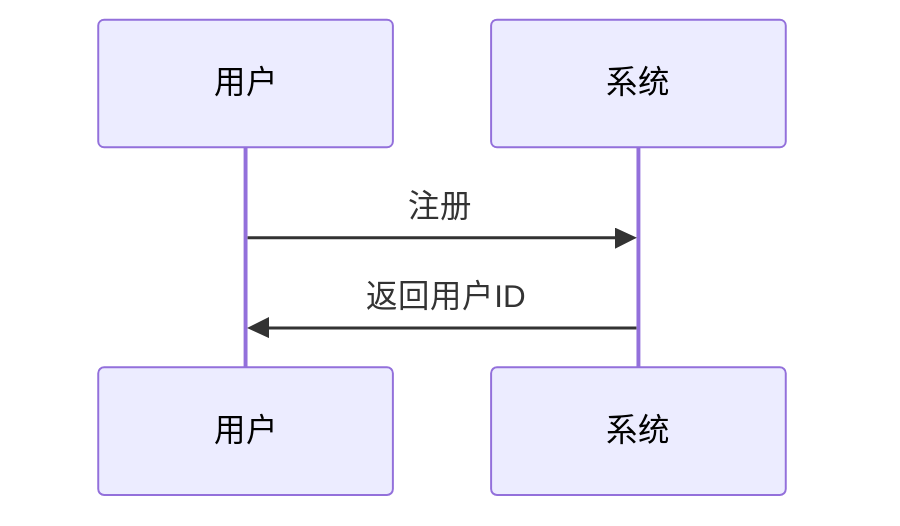

                 


# 《技术转型：传统企业的技术转型之路》

> 关键词：技术转型、传统企业、数字化转型、信息化建设、智能化升级

> 摘要：本文将深入探讨传统企业技术转型的必然性和重要性，通过分析技术转型的核心概念、算法原理、系统架构和实战案例，为传统企业提供一条清晰、可行、有效的技术转型之路。

## 引言

### 1.1 背景介绍

随着信息技术的飞速发展，全球进入了一个数字化、网络化、智能化深度融合的时代。在这个背景下，传统企业面临着前所未有的挑战和机遇。一方面，市场竞争日益激烈，消费者需求不断变化，传统商业模式和运营方式难以满足新的市场环境。另一方面，新一代信息技术如大数据、人工智能、云计算等不断涌现，为企业提供了全新的发展机遇。

技术转型，对于传统企业来说，是一场必须面对的变革。它不仅是企业生存和发展的需要，更是时代赋予的使命。通过技术转型，传统企业可以提升竞争力，实现业务模式的创新和升级，从而在激烈的市场竞争中立于不败之地。

### 1.2 技术转型的核心概念

技术转型涉及多个核心概念，包括数字化转型、信息化建设和智能化升级。这些概念之间既有联系，又有区别。

- **数字化转型**：指的是利用数字技术，对企业的业务模式、运营方式和商业流程进行全方位的改造和优化。其目标是实现企业的数字化和智能化，提升业务效率和用户体验。
- **信息化建设**：指的是通过构建信息系统，实现企业内部信息和资源的集成和共享，提升企业的管理水平和运营效率。
- **智能化升级**：指的是通过应用人工智能、大数据等技术，实现企业的智能化决策和自动化运营，提升企业的创新能力和市场竞争力。

### 1.3 技术转型的挑战与机遇

技术转型虽然充满机遇，但同样也面临诸多挑战。

- **挑战**：
  - 技术变革风险：技术转型过程中，企业需要面对技术变革带来的不确定性，如新技术的不成熟、数据安全的隐患等。
  - 组织变革阻力：技术转型往往伴随着组织结构的调整，这需要企业克服内部阻力和惯性。
  - 成本压力：技术转型需要投入大量的人力、物力和财力，对企业来说是一笔不小的负担。

- **机遇**：
  - 业务模式创新：通过技术转型，企业可以探索新的业务模式和商业模式，实现收入的多元化和增长。
  - 竞争力提升：技术转型可以帮助企业提高生产效率、降低运营成本，提升市场竞争力。
  - 市场拓展：技术转型可以为企业打开新的市场空间，实现业务的全球化布局。

## 核心概念与联系

### 2.1 数字化转型

#### 2.1.1 定义与特点

数字化转型是指企业利用数字技术，对业务模式、运营方式和商业流程进行全方位的改造和优化。其特点包括：

- **数据驱动**：企业通过收集、分析和利用数据，实现业务决策的智能化和精细化。
- **服务导向**：企业以用户需求为中心，提供个性化、定制化的服务。
- **协同高效**：企业通过信息系统的集成和共享，实现内部资源的优化配置和协同工作。
- **创新驱动**：企业通过技术革新，推动业务模式的创新和升级。

#### 2.1.2 关键技术和工具

数字化转型的关键技术和工具包括：

- **大数据**：通过大数据技术，企业可以收集、存储和分析海量数据，发现业务机会，优化业务流程。
- **云计算**：云计算提供了弹性、高效、安全的数据存储和计算能力，是企业数字化转型的核心技术。
- **人工智能**：人工智能技术可以为企业提供智能化的决策支持和自动化运营，提升企业的创新能力和竞争力。
- **物联网**：物联网技术实现了物理世界与数字世界的深度融合，为企业提供了丰富的应用场景。

### 2.2 信息化建设

#### 2.2.1 目标与任务

信息化建设的目标是构建企业信息系统，实现企业内部信息和资源的集成和共享，提升企业的管理水平和运营效率。主要任务包括：

- **构建信息系统**：通过建立企业资源计划（ERP）、客户关系管理（CRM）等信息系统，实现业务流程的自动化和优化。
- **数据整合**：通过数据集成和数据仓库技术，实现企业内部数据的整合和共享。
- **信息安全**：通过网络安全技术，确保企业信息系统的安全性和可靠性。

#### 2.2.2 实施路径和策略

信息化建设的实施路径和策略包括：

- **需求分析**：明确企业信息化建设的具体需求和目标，制定详细的实施方案。
- **技术选型**：选择合适的信息技术，如数据库、服务器、网络设备等，确保系统的稳定性和性能。
- **系统集成**：实现各个信息系统的集成和对接，确保数据的流畅传递和共享。
- **培训与支持**：对员工进行信息化培训，提供技术支持和咨询服务，确保信息化建设的顺利推进。

### 2.3 智能化升级

#### 2.3.1 智能化技术的应用场景

智能化升级是指通过应用人工智能、大数据等技术，实现企业的智能化决策和自动化运营。其应用场景包括：

- **生产制造**：通过智能制造技术，实现生产过程的自动化和智能化，提升生产效率和产品质量。
- **供应链管理**：通过大数据分析和人工智能算法，实现供应链的智能优化和风险控制。
- **客户服务**：通过智能客服系统，实现客户服务的自动化和个性化，提升客户满意度。
- **人力资源**：通过大数据分析和人工智能算法，实现人力资源管理的智能化，提升企业的人力资源管理水平。

#### 2.3.2 智能化转型策略

智能化转型的策略包括：

- **技术创新**：积极引入新技术，如人工智能、大数据等，推动企业技术升级。
- **人才培养**：培养具备新技术能力的人才，提升企业的技术创新能力。
- **流程优化**：通过流程优化，实现业务流程的自动化和智能化，提升业务效率。
- **平台建设**：构建智能化平台，实现数据、技术、应用的集成和共享，提升企业的智能化水平。

## 算法原理讲解

### 3.1 大数据处理

#### 3.1.1 分布式计算框架

大数据处理的核心技术是分布式计算框架，如Hadoop和Spark。这些框架通过将大数据集分成小块，分布在多个节点上处理，从而实现高效的数据处理。

- **Hadoop**：Hadoop是一种分布式数据存储和处理框架，它包括HDFS（Hadoop分布式文件系统）和MapReduce（一种编程模型）。
- **Spark**：Spark是一种快速的分布式计算引擎，它提供了丰富的API，支持多种数据处理任务，如批处理、流处理和机器学习。

#### 3.1.2 数据清洗和预处理

在分布式计算框架中，数据清洗和预处理是非常重要的一步。数据清洗包括去除重复数据、处理缺失数据、数据格式转换等。预处理包括数据归一化、特征提取等。

- **数据清洗**：可以使用Python的Pandas库进行数据处理，如删除重复数据、填充缺失数据等。
- **数据预处理**：可以使用Python的NumPy和Scikit-learn库进行数据处理，如数据归一化、特征提取等。

### 3.2 机器学习

#### 3.2.1 常见算法和模型

机器学习是大数据处理的重要工具，常见的算法和模型包括线性回归、决策树、支持向量机、神经网络等。

- **线性回归**：用于预测连续值输出，如房价预测。
- **决策树**：用于分类和回归任务，如客户分类。
- **支持向量机**：用于分类任务，如垃圾邮件分类。
- **神经网络**：用于复杂的分类和回归任务，如图像识别和语音识别。

#### 3.2.2 机器学习的实现步骤

机器学习的实现步骤包括数据预处理、模型选择、模型训练和模型评估。

- **数据预处理**：包括数据清洗、数据归一化、特征提取等。
- **模型选择**：根据任务需求和数据特征选择合适的模型。
- **模型训练**：使用训练数据对模型进行训练，调整模型的参数。
- **模型评估**：使用测试数据对模型进行评估，判断模型的性能。

### 3.3 云计算

#### 3.3.1 云计算服务的类型

云计算服务包括IaaS（基础设施即服务）、PaaS（平台即服务）和SaaS（软件即服务）。

- **IaaS**：提供虚拟化的基础设施，如虚拟机、存储和网络等。
- **PaaS**：提供开发平台和工具，如数据库、应用服务器等。
- **SaaS**：提供应用软件服务，如CRM、ERP等。

#### 3.3.2 云架构设计要点

云架构设计要点包括：

- **弹性**：系统能够根据业务需求自动扩展或缩小资源。
- **高可用性**：系统具有较高的可用性，能够在故障发生时快速恢复。
- **安全性**：数据安全和系统安全是云架构设计的关键。
- **成本效益**：系统能够在保证性能和安全的前提下，实现成本效益最大化。

## 数学模型和数学公式讲解

### 4.1 大数据模型

#### 4.1.1 数据分布与统计分析

大数据模型中，数据分布和统计分析是非常重要的。常用的统计模型包括正态分布、二项分布、泊松分布等。

- **正态分布**：数据分布呈钟形，最常见的概率分布模型。
- **二项分布**：用于二分类问题，如成功和失败的概率。
- **泊松分布**：用于事件发生的概率，如点击次数的概率。

#### 4.1.2 数据可视化技术

数据可视化技术可以将复杂的数据转换为易于理解的图表和图形，常用的数据可视化工具有Matplotlib、Seaborn等。

- **Matplotlib**：Python的数据可视化库，支持多种图表类型。
- **Seaborn**：基于Matplotlib，提供更高级的数据可视化功能。

### 4.2 机器学习模型

#### 4.2.1 线性回归模型

线性回归模型是一种常用的预测模型，用于预测连续值输出。

- **模型公式**：$$ y = ax + b $$
- **参数优化**：使用最小二乘法（Least Squares Method）优化模型参数。

#### 4.2.2 决策树模型

决策树模型是一种常见的分类和回归模型，通过树形结构进行决策。

- **模型公式**：$$ f(x) = \sum_{i=1}^{n} w_i \cdot I(D_i = x) $$
- **决策规则**：根据特征值选择最佳分割点，构建树形结构。

### 4.3 云计算模型

#### 4.3.1 负载均衡算法

负载均衡算法用于在多个服务器之间分配网络流量，提高系统的可用性和性能。

- **轮询算法**：按顺序分配流量到每个服务器。
- **最小连接算法**：选择当前连接数最少的服务器分配流量。

#### 4.3.2 容量规划方法

容量规划方法用于预测系统在未来某一时间点的资源需求，并规划相应的资源。

- **需求预测**：使用历史数据预测未来需求。
- **容量规划**：根据需求预测结果，规划适当的资源。

## 系统分析与架构设计方案

### 5.1 项目场景介绍

假设我们有一个电子商务平台，需要实现用户注册、商品浏览、购物车、订单管理等功能。

### 5.2 系统功能设计

#### 5.2.1 领域模型

领域模型用于描述系统的核心业务和实体。电子商务平台的领域模型包括用户、商品、订单等实体。

- **用户**：包括用户名、密码、邮箱等属性。
- **商品**：包括商品名称、价格、库存等属性。
- **订单**：包括订单号、用户ID、商品ID、数量等属性。

#### 5.2.2 功能模块划分

系统功能模块包括用户管理、商品管理、订单管理、支付管理等。

- **用户管理**：包括用户注册、登录、信息修改等功能。
- **商品管理**：包括商品添加、删除、修改、查询等功能。
- **订单管理**：包括订单创建、查询、修改、支付等功能。
- **支付管理**：包括支付接口、支付回调等功能。

### 5.3 系统架构设计

#### 5.3.1 系统架构图

系统架构图如下所示：



#### 5.3.2 系统接口设计

系统接口设计包括API接口设计，如用户注册接口、商品查询接口等。

- **用户注册接口**：接收用户名、密码、邮箱等信息，返回用户ID。
- **商品查询接口**：接收商品ID，返回商品详细信息。

### 5.4 系统交互设计

#### 5.4.1 系统序列图

系统序列图如下所示：



## 项目实战

### 6.1 环境安装

在项目实战中，首先需要安装开发环境和相关工具。

- **Python环境**：安装Python 3.8及以上版本。
- **开发工具**：安装PyCharm或Visual Studio Code。

### 6.2 系统核心实现

系统核心实现包括用户注册、商品查询、订单创建等功能。

```python
# 用户注册
def register(username, password, email):
    # 实现用户注册逻辑
    pass

# 商品查询
def query_goods(goods_id):
    # 实现商品查询逻辑
    pass

# 订单创建
def create_order(user_id, goods_id, quantity):
    # 实现订单创建逻辑
    pass
```

### 6.3 代码解析

在代码解析中，需要对核心实现的代码进行详细解释。

```python
# 用户注册
def register(username, password, email):
    # 检查用户名是否已存在
    if check_username_exists(username):
        return "用户名已存在"
    # 创建用户
    user = User(username=username, password=password, email=email)
    # 存储用户信息
    save_user(user)
    return "注册成功"
```

### 6.4 案例分析

以用户注册功能为例，分析其在实际项目中的应用。

- **需求分析**：用户需要注册账号。
- **功能实现**：实现用户注册逻辑。
- **性能优化**：考虑并发注册的情况，进行性能优化。

### 6.5 项目小结

项目实战部分介绍了电子商务平台的核心实现和代码解析，通过实际案例分析了功能实现和性能优化。

## 最佳实践与拓展

### 7.1 最佳实践建议

在技术转型过程中，以下是一些最佳实践建议：

- **需求明确**：明确技术转型的目标和需求，制定详细的实施方案。
- **分阶段实施**：将技术转型分为多个阶段，逐步推进。
- **人才培养**：重视人才培养，提升员工的技能水平。
- **持续优化**：技术转型不是一蹴而就的，需要持续优化和改进。

### 7.2 小结

本文从背景介绍、核心概念、算法原理、系统架构、项目实战和最佳实践等方面，全面阐述了传统企业技术转型的路径和方法。

### 7.3 注意事项

在技术转型过程中，需要注意以下几点：

- **风险评估**：对技术转型进行风险评估，制定应对措施。
- **安全合规**：确保技术转型符合相关法律法规和安全标准。
- **用户参与**：让用户参与到技术转型过程中，提升用户体验。

### 7.4 拓展阅读

- **数字化转型实践**：《数字化企业实践指南》
- **信息化建设**：《企业信息化建设理论与实践》
- **智能化升级**：《智能商业：从数字化到智能化》

## 作者信息

作者：AI天才研究院/AI Genius Institute & 禅与计算机程序设计艺术 /Zen And The Art of Computer Programming
```markdown
# 《技术转型：传统企业的技术转型之路》

> 关键词：技术转型、传统企业、数字化转型、信息化建设、智能化升级

> 摘要：本文将深入探讨传统企业技术转型的必然性和重要性，通过分析技术转型的核心概念、算法原理、系统架构和实战案例，为传统企业提供一条清晰、可行、有效的技术转型之路。

## 引言

### 1.1 背景介绍

随着信息技术的飞速发展，全球进入了一个数字化、网络化、智能化深度融合的时代。在这个背景下，传统企业面临着前所未有的挑战和机遇。一方面，市场竞争日益激烈，消费者需求不断变化，传统商业模式和运营方式难以满足新的市场环境。另一方面，新一代信息技术如大数据、人工智能、云计算等不断涌现，为企业提供了全新的发展机遇。

技术转型，对于传统企业来说，是一场必须面对的变革。它不仅是企业生存和发展的需要，更是时代赋予的使命。通过技术转型，传统企业可以提升竞争力，实现业务模式的创新和升级，从而在激烈的市场竞争中立于不败之地。

### 1.2 技术转型的核心概念

技术转型涉及多个核心概念，包括数字化转型、信息化建设和智能化升级。这些概念之间既有联系，又有区别。

- **数字化转型**：指的是利用数字技术，对企业的业务模式、运营方式和商业流程进行全方位的改造和优化。其目标是实现企业的数字化和智能化，提升业务效率和用户体验。
- **信息化建设**：指的是通过构建信息系统，实现企业内部信息和资源的集成和共享，提升企业的管理水平和运营效率。
- **智能化升级**：指的是通过应用人工智能、大数据等技术，实现企业的智能化决策和自动化运营，提升企业的创新能力和市场竞争力。

### 1.3 技术转型的挑战与机遇

技术转型虽然充满机遇，但同样也面临诸多挑战。

- **挑战**：
  - 技术变革风险：技术转型过程中，企业需要面对技术变革带来的不确定性，如新技术的不成熟、数据安全的隐患等。
  - 组织变革阻力：技术转型往往伴随着组织结构的调整，这需要企业克服内部阻力和惯性。
  - 成本压力：技术转型需要投入大量的人力、物力和财力，对企业来说是一笔不小的负担。

- **机遇**：
  - 业务模式创新：通过技术转型，企业可以探索新的业务模式和商业模式，实现收入的多元化和增长。
  - 竞争力提升：技术转型可以帮助企业提高生产效率、降低运营成本，提升市场竞争力。
  - 市场拓展：技术转型可以为企业打开新的市场空间，实现业务的全球化布局。

## 核心概念与联系

### 2.1 数字化转型

#### 2.1.1 定义与特点

数字化转型是指企业利用数字技术，对业务模式、运营方式和商业流程进行全方位的改造和优化。其特点包括：

- **数据驱动**：企业通过收集、分析和利用数据，实现业务决策的智能化和精细化。
- **服务导向**：企业以用户需求为中心，提供个性化、定制化的服务。
- **协同高效**：企业通过信息系统的集成和共享，实现内部资源的优化配置和协同工作。
- **创新驱动**：企业通过技术革新，推动业务模式的创新和升级。

#### 2.1.2 关键技术和工具

数字化转型的关键技术和工具包括：

- **大数据**：通过大数据技术，企业可以收集、存储和分析海量数据，发现业务机会，优化业务流程。
- **云计算**：云计算提供了弹性、高效、安全的数据存储和计算能力，是企业数字化转型的核心技术。
- **人工智能**：人工智能技术可以为企业提供智能化的决策支持和自动化运营，提升企业的创新能力和竞争力。
- **物联网**：物联网技术实现了物理世界与数字世界的深度融合，为企业提供了丰富的应用场景。

### 2.2 信息化建设

#### 2.2.1 目标与任务

信息化建设的目标是构建企业信息系统，实现企业内部信息和资源的集成和共享，提升企业的管理水平和运营效率。主要任务包括：

- **构建信息系统**：通过建立企业资源计划（ERP）、客户关系管理（CRM）等信息系统，实现业务流程的自动化和优化。
- **数据整合**：通过数据集成和数据仓库技术，实现企业内部数据的整合和共享。
- **信息安全**：通过网络安全技术，确保企业信息系统的安全性和可靠性。

#### 2.2.2 实施路径和策略

信息化建设的实施路径和策略包括：

- **需求分析**：明确企业信息化建设的具体需求和目标，制定详细的实施方案。
- **技术选型**：选择合适的信息技术，如数据库、服务器、网络设备等，确保系统的稳定性和性能。
- **系统集成**：实现各个信息系统的集成和对接，确保数据的流畅传递和共享。
- **培训与支持**：对员工进行信息化培训，提供技术支持和咨询服务，确保信息化建设的顺利推进。

### 2.3 智能化升级

#### 2.3.1 智能化技术的应用场景

智能化升级是指通过应用人工智能、大数据等技术，实现企业的智能化决策和自动化运营。其应用场景包括：

- **生产制造**：通过智能制造技术，实现生产过程的自动化和智能化，提升生产效率和产品质量。
- **供应链管理**：通过大数据分析和人工智能算法，实现供应链的智能优化和风险控制。
- **客户服务**：通过智能客服系统，实现客户服务的自动化和个性化，提升客户满意度。
- **人力资源**：通过大数据分析和人工智能算法，实现人力资源管理的智能化，提升企业的人力资源管理水平。

#### 2.3.2 智能化转型策略

智能化转型的策略包括：

- **技术创新**：积极引入新技术，如人工智能、大数据等，推动企业技术升级。
- **人才培养**：培养具备新技术能力的人才，提升企业的技术创新能力。
- **流程优化**：通过流程优化，实现业务流程的自动化和智能化，提升业务效率。
- **平台建设**：构建智能化平台，实现数据、技术、应用的集成和共享，提升企业的智能化水平。

## 算法原理讲解

### 3.1 大数据处理

#### 3.1.1 分布式计算框架

大数据处理的核心技术是分布式计算框架，如Hadoop和Spark。这些框架通过将大数据集分成小块，分布在多个节点上处理，从而实现高效的数据处理。

- **Hadoop**：Hadoop是一种分布式数据存储和处理框架，它包括HDFS（Hadoop分布式文件系统）和MapReduce（一种编程模型）。
- **Spark**：Spark是一种快速的分布式计算引擎，它提供了丰富的API，支持多种数据处理任务，如批处理、流处理和机器学习。

#### 3.1.2 数据清洗和预处理

在分布式计算框架中，数据清洗和预处理是非常重要的一步。数据清洗包括去除重复数据、处理缺失数据、数据格式转换等。预处理包括数据归一化、特征提取等。

- **数据清洗**：可以使用Python的Pandas库进行数据处理，如删除重复数据、填充缺失数据等。
- **数据预处理**：可以使用Python的NumPy和Scikit-learn库进行数据处理，如数据归一化、特征提取等。

### 3.2 机器学习

#### 3.2.1 常见算法和模型

机器学习是大数据处理的重要工具，常见的算法和模型包括线性回归、决策树、支持向量机、神经网络等。

- **线性回归**：用于预测连续值输出，如房价预测。
- **决策树**：用于分类和回归任务，如客户分类。
- **支持向量机**：用于分类任务，如垃圾邮件分类。
- **神经网络**：用于复杂的分类和回归任务，如图像识别和语音识别。

#### 3.2.2 机器学习的实现步骤

机器学习的实现步骤包括数据预处理、模型选择、模型训练和模型评估。

- **数据预处理**：包括数据清洗、数据归一化、特征提取等。
- **模型选择**：根据任务需求和数据特征选择合适的模型。
- **模型训练**：使用训练数据对模型进行训练，调整模型的参数。
- **模型评估**：使用测试数据对模型进行评估，判断模型的性能。

### 3.3 云计算

#### 3.3.1 云计算服务的类型

云计算服务包括IaaS（基础设施即服务）、PaaS（平台即服务）和SaaS（软件即服务）。

- **IaaS**：提供虚拟化的基础设施，如虚拟机、存储和网络等。
- **PaaS**：提供开发平台和工具，如数据库、应用服务器等。
- **SaaS**：提供应用软件服务，如CRM、ERP等。

#### 3.3.2 云架构设计要点

云架构设计要点包括：

- **弹性**：系统能够根据业务需求自动扩展或缩小资源。
- **高可用性**：系统具有较高的可用性，能够在故障发生时快速恢复。
- **安全性**：数据安全和系统安全是云架构设计的关键。
- **成本效益**：系统能够在保证性能和安全的前提下，实现成本效益最大化。

## 数学模型和数学公式讲解

### 4.1 大数据模型

#### 4.1.1 数据分布与统计分析

大数据模型中，数据分布和统计分析是非常重要的。常用的统计模型包括正态分布、二项分布、泊松分布等。

- **正态分布**：数据分布呈钟形，最常见的概率分布模型。
- **二项分布**：用于二分类问题，如成功和失败的概率。
- **泊松分布**：用于事件发生的概率，如点击次数的概率。

#### 4.1.2 数据可视化技术

数据可视化技术可以将复杂的数据转换为易于理解的图表和图形，常用的数据可视化工具有Matplotlib、Seaborn等。

- **Matplotlib**：Python的数据可视化库，支持多种图表类型。
- **Seaborn**：基于Matplotlib，提供更高级的数据可视化功能。

### 4.2 机器学习模型

#### 4.2.1 线性回归模型

线性回归模型是一种常用的预测模型，用于预测连续值输出。

- **模型公式**：$$ y = ax + b $$
- **参数优化**：使用最小二乘法（Least Squares Method）优化模型参数。

#### 4.2.2 决策树模型

决策树模型是一种常见的分类和回归模型，通过树形结构进行决策。

- **模型公式**：$$ f(x) = \sum_{i=1}^{n} w_i \cdot I(D_i = x) $$
- **决策规则**：根据特征值选择最佳分割点，构建树形结构。

### 4.3 云计算模型

#### 4.3.1 负载均衡算法

负载均衡算法用于在多个服务器之间分配网络流量，提高系统的可用性和性能。

- **轮询算法**：按顺序分配流量到每个服务器。
- **最小连接算法**：选择当前连接数最少的服务器分配流量。

#### 4.3.2 容量规划方法

容量规划方法用于预测系统在未来某一时间点的资源需求，并规划相应的资源。

- **需求预测**：使用历史数据预测未来需求。
- **容量规划**：根据需求预测结果，规划适当的资源。

## 系统分析与架构设计方案

### 5.1 项目场景介绍

假设我们有一个电子商务平台，需要实现用户注册、商品浏览、购物车、订单管理等功能。

### 5.2 系统功能设计

#### 5.2.1 领域模型

领域模型用于描述系统的核心业务和实体。电子商务平台的领域模型包括用户、商品、订单等实体。

- **用户**：包括用户名、密码、邮箱等属性。
- **商品**：包括商品名称、价格、库存等属性。
- **订单**：包括订单号、用户ID、商品ID、数量等属性。

#### 5.2.2 功能模块划分

系统功能模块包括用户管理、商品管理、订单管理、支付管理等。

- **用户管理**：包括用户注册、登录、信息修改等功能。
- **商品管理**：包括商品添加、删除、修改、查询等功能。
- **订单管理**：包括订单创建、查询、修改、支付等功能。
- **支付管理**：包括支付接口、支付回调等功能。

### 5.3 系统架构设计

#### 5.3.1 系统架构图

系统架构图如下所示：


#### 5.3.2 系统接口设计

系统接口设计包括API接口设计，如用户注册接口、商品查询接口等。

- **用户注册接口**：接收用户名、密码、邮箱等信息，返回用户ID。
- **商品查询接口**：接收商品ID，返回商品详细信息。

### 5.4 系统交互设计

#### 5.4.1 系统序列图

系统序列图如下所示：


## 项目实战

### 6.1 环境安装

在项目实战中，首先需要安装开发环境和相关工具。

- **Python环境**：安装Python 3.8及以上版本。
- **开发工具**：安装PyCharm或Visual Studio Code。

### 6.2 系统核心实现

系统核心实现包括用户注册、商品查询、订单创建等功能。

```python
# 用户注册
def register(username, password, email):
    # 实现用户注册逻辑
    pass

# 商品查询
def query_goods(goods_id):
    # 实现商品查询逻辑
    pass

# 订单创建
def create_order(user_id, goods_id, quantity):
    # 实现订单创建逻辑
    pass
```

### 6.3 代码解析

在代码解析中，需要对核心实现的代码进行详细解释。

```python
# 用户注册
def register(username, password, email):
    # 检查用户名是否已存在
    if check_username_exists(username):
        return "用户名已存在"
    # 创建用户
    user = User(username=username, password=password, email=email)
    # 存储用户信息
    save_user(user)
    return "注册成功"
```

### 6.4 案例分析

以用户注册功能为例，分析其在实际项目中的应用。

- **需求分析**：用户需要注册账号。
- **功能实现**：实现用户注册逻辑。
- **性能优化**：考虑并发注册的情况，进行性能优化。

### 6.5 项目小结

项目实战部分介绍了电子商务平台的核心实现和代码解析，通过实际案例分析了功能实现和性能优化。

## 最佳实践与拓展

### 7.1 最佳实践建议

在技术转型过程中，以下是一些最佳实践建议：

- **需求明确**：明确技术转型的目标和需求，制定详细的实施方案。
- **分阶段实施**：将技术转型分为多个阶段，逐步推进。
- **人才培养**：重视人才培养，提升员工的技能水平。
- **持续优化**：技术转型不是一蹴而就的，需要持续优化和改进。

### 7.2 小结

本文从背景介绍、核心概念、算法原理、系统架构、项目实战和最佳实践等方面，全面阐述了传统企业技术转型的路径和方法。

### 7.3 注意事项

在技术转型过程中，需要注意以下几点：

- **风险评估**：对技术转型进行风险评估，制定应对措施。
- **安全合规**：确保技术转型符合相关法律法规和安全标准。
- **用户参与**：让用户参与到技术转型过程中，提升用户体验。

### 7.4 拓展阅读

- **数字化转型实践**：《数字化企业实践指南》
- **信息化建设**：《企业信息化建设理论与实践》
- **智能化升级**：《智能商业：从数字化到智能化》

## 作者信息

作者：AI天才研究院/AI Genius Institute & 禅与计算机程序设计艺术 /Zen And The Art of Computer Programming
```

