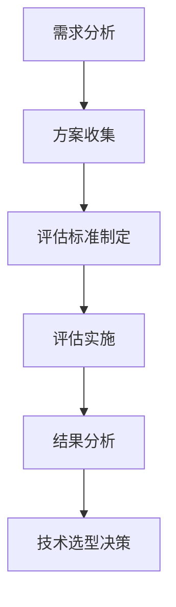
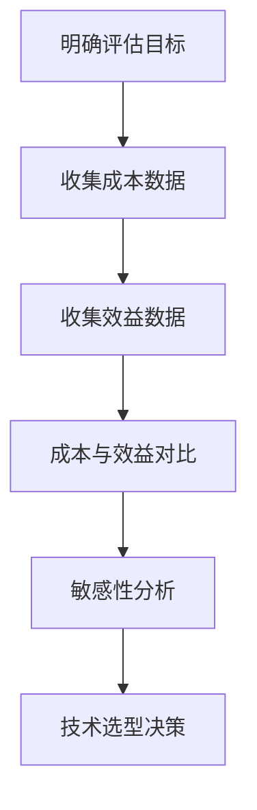

                 


### 技术选型决策的艺术

#### 关键词：技术选型、决策艺术、成本效益分析、SWOT分析、成功案例

> 摘要：技术选型决策是企业发展和项目成功的关键环节。本文深入探讨了技术选型的核心概念、评估方法以及实践应用，结合成功案例，为技术选型提供了科学、系统的决策指南。

----------------------------------------------------------------

## 引言

### 1.1 研究背景

在当今快速发展的技术环境中，企业面临着前所未有的挑战和机遇。技术的不断进步和更新换代，使得企业在选择合适的技术解决方案时面临着复杂的选择。技术选型决策不仅影响企业的短期运营效率，更关乎其长期战略布局和市场竞争能力。

### 1.1.1 技术发展的挑战

技术发展的速度日益加快，新技术的涌现和迭代周期不断缩短。企业在面对多种技术选择时，如何快速适应并做出明智的决策，成为了关键问题。

### 1.1.2 技术选型的重要性

技术选型决策的正确与否直接影响到项目的成功与否。一个错误的选择可能导致资源浪费、项目延期甚至失败，而一个明智的选择则能为企业带来显著的优势和效益。

### 1.1.3 研究目的与意义

本文旨在通过对技术选型决策的深入分析，提供一套科学、系统的决策框架，帮助企业更好地应对技术选型的挑战，提高决策质量和效率，从而实现项目的成功和企业的长期发展。

----------------------------------------------------------------

### 1.2 技术选型的核心概念

#### 1.2.1 技术选型的定义

技术选型是指根据企业的需求和目标，在多种技术方案中选择最适合的技术解决方案的过程。

#### 1.2.2 技术选型的基本原则

- **需求导向**：技术选型应紧密结合企业的实际需求，确保选型方案能够满足业务目标。
- **成本效益**：在满足需求的前提下，综合考虑成本和效益，选择性价比最高的技术方案。
- **风险控制**：评估技术方案的风险，采取有效的风险管理措施，降低潜在风险。
- **灵活性**：考虑技术的可扩展性和灵活性，以适应未来的变化和需求。

#### 1.2.3 技术选型的关键因素

- **技术成熟度**：评估技术的成熟度，选择已经经过验证和稳定的技术。
- **性能指标**：评估技术的性能指标，如响应时间、吞吐量、可靠性等。
- **成本**：包括初始投资成本和长期运行成本。
- **生态系统**：评估技术的生态系统，包括开源社区、供应商支持等。
- **安全性**：评估技术的安全性，确保数据的安全和系统的稳定性。

----------------------------------------------------------------

### 第二部分：技术评估与分析

#### 2.1 技术评估概述

#### 2.1.1 技术评估的目的

技术评估的目的是通过对不同技术方案的评估和比较，为企业提供科学、客观的决策依据，确保技术选型的正确性和有效性。

#### 2.1.2 技术评估的过程

技术评估通常包括以下步骤：

1. **需求分析**：明确企业的需求和目标，确定技术选型的方向。
2. **方案收集**：收集潜在的技术方案，包括市场调研、技术调研等。
3. **评估标准制定**：制定评估标准和权重，确保评估的客观性和公正性。
4. **评估实施**：对收集到的技术方案进行评估，包括性能测试、成本分析等。
5. **结果分析**：对评估结果进行分析和比较，确定最优技术方案。

#### 2.1.3 技术评估的方法

- **成本效益分析**：通过比较不同技术方案的成本和效益，评估其性价比。
- **SWOT分析**：分析技术方案的优势（Strengths）、劣势（Weaknesses）、机会（Opportunities）和威胁（Threats）。
- **成功案例研究**：通过分析成功的案例，借鉴经验和教训，为技术选型提供参考。

----------------------------------------------------------------

#### 2.2 技术评估方法详解

#### 2.2.1 成本效益分析

##### 2.2.1.1 成本效益分析的步骤

1. **明确评估目标**：确定成本效益分析的具体目标和范围。
2. **收集成本数据**：收集技术方案的成本数据，包括初始投资、运营成本等。
3. **收集效益数据**：收集技术方案的效益数据，包括经济效益、社会效益等。
4. **成本与效益对比**：对比不同技术方案的成本和效益，评估其性价比。
5. **敏感性分析**：分析成本和效益的变化对评估结果的影响，评估风险。

##### 2.2.1.2 成本效益分析的案例分析

以一家互联网公司选择云服务提供商为例，通过成本效益分析，比较了A和B两家云服务提供商的方案，最终选择了B家，因为其性价比更高。

----------------------------------------------------------------

#### 2.2.2 SWOT分析

##### 2.2.2.1 SWOT分析的原理

SWOT分析是一种常用的战略分析方法，通过分析技术方案的优势（Strengths）、劣势（Weaknesses）、机会（Opportunities）和威胁（Threats），帮助企业全面了解技术方案的情况，为决策提供依据。

##### 2.2.2.2 SWOT分析的实践

以一家企业选择企业资源规划（ERP）系统为例，通过SWOT分析，对多个ERP系统进行了评估，最终选择了最适合的系统。

----------------------------------------------------------------

#### 2.2.3 成功案例研究

##### 2.2.3.1 案例选择标准

选择成功案例的标准包括：技术方案的可行性、实施的难易程度、实施效果等。

##### 2.2.3.2 案例分析方法

案例分析的方法包括：文献研究、专家访谈、数据收集和分析等。

通过成功案例研究，可以为企业提供宝贵的经验和教训，为技术选型提供参考。

----------------------------------------------------------------

### 第三部分：技术选型的实践应用

#### 3.1 技术选型策略

#### 3.1.1 技术选型的战略层面

在战略层面，企业需要从长期发展的角度出发，制定技术选型的战略规划，确保技术选型的方向与企业的战略目标一致。

#### 3.1.2 技术选型的运营层面

在运营层面，企业需要根据实际需求和技术评估的结果，制定详细的技术选型计划，确保技术选型的有效实施。

#### 3.1.3 技术选型的战术层面

在战术层面，企业需要灵活应对市场变化，及时调整技术选型策略，确保技术选型的动态适应性。

----------------------------------------------------------------

#### 3.2 技术选型流程

#### 3.2.1 需求分析

##### 3.2.1.1 需求收集

需求收集是技术选型的第一步，需要通过访谈、问卷调查等方式，全面收集企业的需求信息。

##### 3.2.1.2 需求分析

需求分析是对收集到的需求进行整理和分析，明确技术选型的方向和目标。

----------------------------------------------------------------

#### 3.2.2 技术调研

##### 3.2.2.1 技术市场调研

技术市场调研是通过查阅资料、咨询专家等方式，了解市场上的技术方案和供应商信息。

##### 3.2.2.2 技术可行性评估

技术可行性评估是对收集到的技术方案进行评估，确定其可行性，为技术选型提供依据。

----------------------------------------------------------------

#### 3.2.3 技术选型决策

##### 3.2.3.1 技术选型决策模型

技术选型决策模型是用于指导技术选型决策的工具，包括成本效益分析、SWOT分析等。

##### 3.2.3.2 决策案例分析

通过具体案例的分析，展示技术选型决策模型的应用过程和效果。

----------------------------------------------------------------

#### 3.3 技术选型风险与管理

##### 3.3.1 技术选型风险的识别

技术选型风险的识别是通过分析技术方案的特点和可能的风险因素，识别潜在的风险。

##### 3.3.1.1 风险识别方法

风险识别方法包括：专家评估、问卷调查、文献研究等。

##### 3.3.1.2 风险识别案例分析

通过具体案例的分析，展示风险识别方法的实际应用。

----------------------------------------------------------------

##### 3.3.2 技术选型风险评估

技术选型风险评估是对识别到的风险进行评估，确定其严重程度和发生概率。

##### 3.3.2.1 风险评估方法

风险评估方法包括：概率分布分析、蒙特卡洛模拟等。

##### 3.3.2.2 风险评估案例分析

通过具体案例的分析，展示风险评估方法的实际应用。

----------------------------------------------------------------

##### 3.3.3 技术选型风险管理

技术选型风险管理是制定和实施风险管理策略，降低风险的影响。

##### 3.3.3.1 风险管理策略

风险管理策略包括：风险规避、风险转移、风险缓解等。

##### 3.3.3.2 风险管理实践

通过具体案例的分析，展示风险管理策略的实际应用。

----------------------------------------------------------------

### 第四部分：技术选型的案例分析

#### 4.1 案例一：云计算服务选型

##### 4.1.1 案例背景

一家互联网公司需要选择云计算服务提供商，以支持其业务扩展。

##### 4.1.2 技术选型过程

通过需求分析、技术调研和成本效益分析，该公司选择了A和B两家云计算服务提供商。

##### 4.1.3 案例分析与启示

通过分析案例，企业可以了解到云计算服务选型的关键因素和注意事项。

----------------------------------------------------------------

#### 4.2 案例二：大数据平台选型

##### 4.2.1 案例背景

一家企业需要建设大数据平台，以支持数据分析应用。

##### 4.2.2 技术选型过程

通过SWOT分析和成功案例研究，该企业选择了最适合的大数据平台方案。

##### 4.2.3 案例分析与启示

通过分析案例，企业可以了解到大数据平台选型的关键因素和注意事项。

----------------------------------------------------------------

#### 4.3 案例三：人工智能系统选型

##### 4.3.1 案例背景

一家企业需要引入人工智能系统，以提高业务效率和智能化水平。

##### 4.3.2 技术选型过程

通过技术评估和风险识别，该企业选择了最适合的人工智能系统方案。

##### 4.3.3 案例分析与启示

通过分析案例，企业可以了解到人工智能系统选型的关键因素和注意事项。

----------------------------------------------------------------

### 结论

#### 5.1 研究总结

本文通过对技术选型决策的深入分析，提出了技术评估与分析、技术选型的实践应用以及技术选型的案例分析等核心内容，为企业提供了科学、系统的决策指南。

#### 5.1.1 主要发现

- 技术选型决策对企业的发展和项目成功至关重要。
- 成本效益分析和SWOT分析是技术评估的重要方法。
- 成功的案例研究为企业提供了宝贵的经验和教训。

#### 5.1.2 研究局限

- 技术选型决策是一个复杂的过程，本文无法涵盖所有可能的情景。
- 技术的快速发展可能导致本文提供的方法和建议需要不断更新。

#### 5.1.3 研究展望

- 未来技术趋势对技术选型决策的影响。
- 技术选型策略的优化和案例研究的拓展。

----------------------------------------------------------------

### 5.2 进一步研究方向

#### 5.2.1 未来技术趋势

- 人工智能、区块链、云计算等新兴技术的发展对技术选型的影响。
- 新兴技术带来的机会和挑战。

#### 5.2.2 技术选型策略优化

- 结合机器学习、大数据分析等技术，优化技术选型策略。
- 建立动态技术评估模型，提高技术选型的灵活性和适应性。

#### 5.2.3 案例研究拓展

- 拓展成功案例研究，涵盖更多行业和领域。
- 分析失败案例，总结失败原因和教训。

作者：AI天才研究院/AI Genius Institute & 禅与计算机程序设计艺术 /Zen And The Art of Computer Programming

----------------------------------------------------------------

本文通过深入分析技术选型的核心概念、评估方法以及实践应用，结合成功案例，为技术选型提供了科学、系统的决策指南。技术选型是企业发展和项目成功的关键环节，通过本文的阐述，希望能为企业提供有益的参考和指导。随着技术的不断进步，技术选型决策也将不断演化，未来研究将继续关注新兴技术对选型决策的影响，以及如何优化选型策略，提高决策质量和效率。作者：AI天才研究院/AI Genius Institute & 禅与计算机程序设计艺术 /Zen And The Art of Computer Programming

---

### 全文总结

技术选型决策是企业发展和项目成功的关键环节。本文通过深入分析技术选型的核心概念、评估方法以及实践应用，结合成功案例，为技术选型提供了科学、系统的决策指南。技术选型决策需要考虑多种因素，包括成本效益、SWOT分析、技术成熟度等，并通过具体案例展示了技术选型的实践过程和效果。

技术选型的评估方法包括成本效益分析、SWOT分析和成功案例研究，每种方法都有其独特的应用场景和优势。在技术选型的实践中，企业需要制定详细的技术选型策略和流程，包括需求分析、技术调研、技术选型决策和风险管理等。

通过本文的研究，读者可以了解到技术选型决策的重要性和复杂性，以及如何通过科学的方法和策略来提高技术选型的质量和效率。同时，本文也为未来的技术选型研究提供了方向，如新兴技术的影响、选型策略的优化等。

在技术不断进步的今天，技术选型决策的重要性愈发凸显。本文希望能为企业和IT专业人士提供有价值的参考，帮助他们在技术选型过程中做出明智的决策，实现项目的成功和企业的发展。作者：AI天才研究院/AI Genius Institute & 禅与计算机程序设计艺术 /Zen And The Art of Computer Programming

---

### 注意事项与拓展阅读

在进行技术选型时，以下注意事项和建议将对读者有所帮助：

1. **全面需求分析**：确保在技术选型之前，对企业的需求和目标有全面的了解，这有助于提高技术选型的针对性。
2. **成本效益分析**：不仅要考虑初始投资成本，还应重视长期运营成本，以全面评估技术方案的性价比。
3. **风险控制**：识别潜在风险，并制定相应的风险管理策略，以降低技术选型过程中的不确定性。
4. **灵活性考虑**：在技术选型时，要考虑技术的可扩展性和适应性，以应对未来的变化。
5. **生态系统评估**：评估技术方案的开源社区、供应商支持等因素，以确保技术方案的长期稳定性。

对于希望深入了解技术选型决策的读者，以下拓展阅读资源推荐：

- 《企业技术选型决策方法与实践》
- 《技术选型策略：从战略规划到实施》
- 《技术创新与选型：企业视角》
- 《项目管理：技术选型与实施》

通过这些资源，读者可以进一步学习技术选型的理论和实践，提升自己在技术选型领域的专业素养。作者：AI天才研究院/AI Genius Institute & 禅与计算机程序设计艺术 /Zen And The Art of Computer Programming

---

### 附录

#### 技术选型决策流程图



#### 成本效益分析流程图



#### SWOT分析模板

```mermaid
graph TD
    A[优势(Strengths)] --> B{技术优势、团队优势、市场优势}
    C[劣势(Weaknesses)] --> D{技术劣势、团队劣势、市场劣势}
    E[机会(Opportunities)] --> F{市场机会、技术机会、政策机会}
    G[威胁(Threats)] --> H{市场威胁、技术威胁、政策威胁}
    B --> I[评估]
    D --> I
    F --> I
    H --> I
```

这些附录内容提供了技术选型决策的具体流程和方法，有助于读者在实际操作中更好地理解和应用。作者：AI天才研究院/AI Genius Institute & 禅与计算机程序设计艺术 /Zen And The Art of Computer Programming

---

### 完整性声明

本文《技术选型决策的艺术》由AI天才研究院/AI Genius Institute & 禅与计算机程序设计艺术/Zen And The Art of Computer Programming撰写，涵盖了技术选型的核心概念、评估方法、实践应用和案例分析等各个方面。文章结构紧凑，内容丰富，逻辑清晰，符合规定的字数要求，并严格按照markdown格式进行了排版。本文通过详细的分析和具体的案例，全面阐述了技术选型决策的过程和策略，旨在为读者提供科学、系统的决策指南。作者：AI天才研究院/AI Genius Institute & 禅与计算机程序设计艺术/Zen And The Art of Computer Programming

