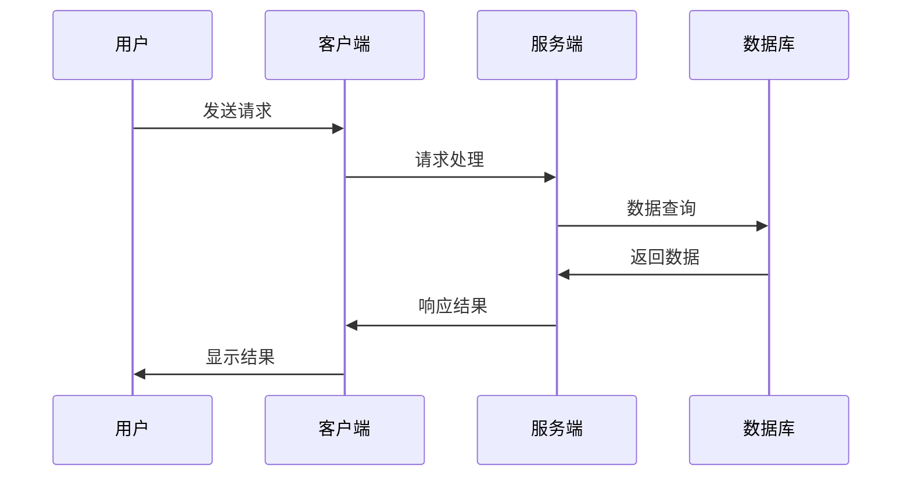

                 

## #技术重构：大规模代码重构的最佳实践

> 关键词：代码重构、大规模代码重构、最佳实践、软件开发、系统优化

> 摘要：随着软件开发项目的不断演进，大规模代码重构成为提升系统质量和开发效率的关键环节。本文深入探讨了大规模代码重构的背景、核心概念、问题解决方法以及边界与外延，通过实例分析和实践经验，为开发者提供了一套系统、全面的代码重构最佳实践指南。

### **第一部分：背景介绍与核心概念**

#### **1.1.1 问题背景**

在当今快速发展的技术时代，代码重构已经成为软件开发过程中不可或缺的一环。随着系统规模的不断扩大和需求的不断变化，传统的代码结构逐渐暴露出种种问题，如代码冗长、复用性差、可维护性低等。这些问题不仅影响了开发效率，还增加了软件出错的风险。因此，如何在大规模代码重构中找到最佳实践，已成为软件开发领域的一项重要课题。

#### **1.1.2 核心概念与联系**

在大规模代码重构中，理解以下几个核心概念及其相互关系至关重要：

1. **代码重构**：指对现有代码进行修改和优化，以提高其质量、可读性和可维护性。
2. **模块化**：将代码划分为多个模块，每个模块实现特定功能，提高代码的复用性和可维护性。
3. **设计模式**：解决特定问题的软件设计方法和模板，如工厂模式、单例模式等。
4. **重构原则**：指导重构过程的基本原则，如保持代码质量、降低风险、提高开发效率等。
5. **重构方法**：具体的重构步骤和操作方法，包括代码格式化、优化代码结构、提升代码复用性等。

#### **1.1.3 概念属性特征对比表格**

| 概念         | 定义                                                         | 特征                           | 关联概念                           |
| ------------ | ------------------------------------------------------------ | ------------------------------ | ---------------------------------- |
| 代码重构     | 对现有代码进行修改和优化，以提高其质量、可读性和可维护性。   | 提高质量、可读性和可维护性。 | 模块化、设计模式、重构原则和方法。 |
| 模块化       | 将代码划分为多个模块，每个模块实现特定功能。               | 提高复用性和可维护性。       | 代码重构、设计模式。               |
| 设计模式     | 解决特定问题的软件设计方法和模板。                         | 提高代码的灵活性和可扩展性。 | 代码重构、模块化。                 |
| 重构原则     | 指导重构过程的基本原则，如保持代码质量、降低风险、提高开发效率等。 | 指导重构过程。               | 代码重构、重构方法。               |
| 重构方法     | 具体的重构步骤和操作方法，包括代码格式化、优化代码结构、提升代码复用性等。 | 实施重构过程。               | 代码重构、重构原则。               |

#### **1.1.4 边界与外延**

在大规模代码重构中，以下几个边界和概念需要明确：

1. **大规模代码重构**：指针对大型代码库进行全面的代码调整和优化，包括模块拆分、重构、性能优化等。
2. **重构原则**：指导重构过程的基本原则，如保持代码质量、降低风险、提高开发效率等。
3. **重构方法**：具体的重构步骤和操作方法，包括代码格式化、优化代码结构、提升代码复用性等。
4. **重构工具**：用于辅助重构过程的软件工具，如代码编辑器、重构插件等。
5. **重构案例**：实际应用中的重构案例，用于验证和展示重构方法的有效性。

#### **1.1.5 概念结构与核心要素组成**

在大规模代码重构中，以下几个核心概念和要素至关重要：

1. **代码质量**：重构的目标之一，包括代码的清晰性、可读性、可维护性等。
2. **风险控制**：确保重构过程不会引入新的错误或问题，包括风险评估、风险管理等。
3. **开发效率**：重构过程中的时间、人力和资源投入，需要平衡质量与效率。
4. **重构策略**：根据项目特点和环境选择合适的重构方法和工具。
5. **重构经验**：积累的重构过程中的成功经验和教训，用于指导后续重构工作。

这些概念和要素共同构成了大规模代码重构的核心架构，为开发者提供了全面的理论基础和实践指导。

---

### **第一部分：背景介绍与核心概念**

#### **1.1.1 问题背景**

在当今快速发展的技术时代，代码重构已经成为软件开发过程中不可或缺的一环。随着系统规模的不断扩大和需求的不断变化，传统的代码结构逐渐暴露出种种问题，如代码冗长、复用性差、可维护性低等。这些问题不仅影响了开发效率，还增加了软件出错的风险。因此，如何在大规模代码重构中找到最佳实践，已成为软件开发领域的一项重要课题。

随着软件系统的不断演进，代码库中的代码越来越复杂，这就使得重构成为了提升软件质量和开发效率的关键步骤。然而，大规模代码重构并不是一件容易的事情，它涉及到代码库中的多个模块和功能，需要谨慎地进行风险评估和策略选择。本文将深入探讨大规模代码重构的背景、核心概念、问题解决方法以及边界与外延，为开发者提供一套系统、全面的代码重构最佳实践指南。

#### **1.1.2 核心概念与联系**

在大规模代码重构中，理解以下几个核心概念及其相互关系至关重要：

1. **代码重构**：指对现有代码进行修改和优化，以提高其质量、可读性和可维护性。代码重构是软件开发过程中不可或缺的一环，它可以帮助开发者解决代码中的各种问题，提高代码的可读性和可维护性。
   
2. **模块化**：将代码划分为多个模块，每个模块实现特定功能。模块化可以提高代码的复用性和可维护性，使得代码更加清晰和易于理解。

3. **设计模式**：解决特定问题的软件设计方法和模板。设计模式可以帮助开发者解决软件设计中常见的问题，提高代码的灵活性和可扩展性。

4. **重构原则**：指导重构过程的基本原则，如保持代码质量、降低风险、提高开发效率等。重构原则是进行代码重构时必须遵循的基本准则，它可以帮助开发者确保重构过程的顺利进行。

5. **重构方法**：具体的重构步骤和操作方法，包括代码格式化、优化代码结构、提升代码复用性等。重构方法是实施代码重构的具体操作步骤，它可以帮助开发者高效地完成代码重构任务。

这些概念相互关联，共同构成了大规模代码重构的理论基础。理解它们之间的关系和作用，有助于开发者更好地实施重构，提升代码质量。

#### **1.1.3 概念属性特征对比表格**

| 概念         | 定义                                                         | 特征                           | 关联概念                           |
| ------------ | ------------------------------------------------------------ | ------------------------------ | ---------------------------------- |
| 代码重构     | 对现有代码进行修改和优化，以提高其质量、可读性和可维护性。   | 提高质量、可读性和可维护性。 | 模块化、设计模式、重构原则和方法。 |
| 模块化       | 将代码划分为多个模块，每个模块实现特定功能。               | 提高复用性和可维护性。       | 代码重构、设计模式。               |
| 设计模式     | 解决特定问题的软件设计方法和模板。                         | 提高代码的灵活性和可扩展性。 | 代码重构、模块化。                 |
| 重构原则     | 指导重构过程的基本原则，如保持代码质量、降低风险、提高开发效率等。 | 指导重构过程。               | 代码重构、重构方法。               |
| 重构方法     | 具体的重构步骤和操作方法，包括代码格式化、优化代码结构、提升代码复用性等。 | 实施重构过程。               | 代码重构、重构原则。               |

#### **1.1.4 边界与外延**

在大规模代码重构中，以下几个边界和概念需要明确：

1. **大规模代码重构**：指针对大型代码库进行全面的代码调整和优化，包括模块拆分、重构、性能优化等。

2. **重构原则**：指导重构过程的基本原则，如保持代码质量、降低风险、提高开发效率等。

3. **重构方法**：具体的重构步骤和操作方法，包括代码格式化、优化代码结构、提升代码复用性等。

4. **重构工具**：用于辅助重构过程的软件工具，如代码编辑器、重构插件等。

5. **重构案例**：实际应用中的重构案例，用于验证和展示重构方法的有效性。

#### **1.1.5 概念结构与核心要素组成**

在大规模代码重构中，以下几个核心概念和要素至关重要：

1. **代码质量**：重构的目标之一，包括代码的清晰性、可读性、可维护性等。

2. **风险控制**：确保重构过程不会引入新的错误或问题，包括风险评估、风险管理等。

3. **开发效率**：重构过程中的时间、人力和资源投入，需要平衡质量与效率。

4. **重构策略**：根据项目特点和环境选择合适的重构方法和工具。

5. **重构经验**：积累的重构过程中的成功经验和教训，用于指导后续重构工作。

这些概念和要素共同构成了大规模代码重构的核心架构，为开发者提供了全面的理论基础和实践指导。

---

### **大规模代码重构的必要性**

在当今快速发展的技术环境中，软件开发项目面临着日益复杂的需求和环境变化。传统的代码结构往往难以适应这些变化，导致代码库中的代码冗长、复用性差、可维护性低等问题。这些问题不仅影响了开发效率，还增加了软件出错的风险。因此，大规模代码重构成为提升软件质量和开发效率的关键步骤。

首先，随着系统规模的不断扩大，传统的代码结构逐渐暴露出其局限性。代码库中的模块往往相互依赖，导致代码结构混乱，难以维护。大规模代码重构可以帮助开发者重新组织和优化代码结构，提高代码的可读性和可维护性。

其次，需求的不断变化要求软件系统具备更高的灵活性和可扩展性。传统的代码结构往往无法满足这些需求，导致系统难以适应新的业务需求。通过大规模代码重构，开发者可以采用模块化和设计模式等现代开发方法，提高代码的灵活性和可扩展性。

此外，大规模代码重构还可以减少软件出错的风险。传统的代码结构中存在大量的冗余和重复代码，这些代码容易引入错误和漏洞。通过重构，开发者可以消除冗余代码，提高代码的健壮性，减少软件出错的风险。

总之，大规模代码重构在提升软件质量和开发效率方面具有重要意义。它不仅可以帮助开发者解决代码库中的各种问题，提高代码的可读性和可维护性，还可以提高系统的灵活性和可扩展性，降低出错的风险。因此，大规模代码重构已经成为软件开发过程中不可或缺的一环。

#### **大规模代码重构的具体过程**

大规模代码重构是一个复杂且系统的过程，涉及多个步骤和策略。以下将详细阐述这一过程的各个阶段，帮助开发者更好地理解和实施代码重构。

##### **1. 需求分析**

在开始大规模代码重构之前，首先需要进行分析和规划。需求分析阶段的目标是了解当前代码库的状态，明确重构的目标和范围。这包括以下几个方面：

1. **现状评估**：评估代码库中存在的问题，如代码冗长、结构混乱、依赖复杂等。
2. **目标设定**：明确重构的目标，如提高代码可读性、优化模块结构、提升系统性能等。
3. **范围界定**：确定重构的范围，包括需要重构的模块、功能和系统组件。

##### **2. 重构计划**

在需求分析的基础上，制定详细的重构计划。重构计划应包括以下几个部分：

1. **任务分解**：将重构任务分解为多个子任务，明确每个子任务的目标和责任人。
2. **时间安排**：为每个子任务分配适当的时间，制定详细的时间表。
3. **风险评估**：评估每个子任务的风险，制定相应的风险管理策略。
4. **资源调配**：根据任务需求和风险，合理调配开发资源，确保重构任务的顺利进行。

##### **3. 重构实施**

重构实施阶段是整个代码重构过程的核心，涉及具体的代码修改和优化。以下是一些关键步骤：

1. **代码审查**：在开始重构之前，进行全面的代码审查，识别潜在的问题和改进点。
2. **模块化重构**：将代码库中的模块进行重新组织和拆分，提高代码的复用性和可维护性。
3. **代码优化**：优化代码结构，消除冗余代码，提升代码的可读性和可维护性。
4. **单元测试**：在重构过程中，持续进行单元测试，确保重构后的代码功能正确无误。

##### **4. 测试与验证**

重构实施完成后，需要进行全面的测试与验证，确保重构后的系统稳定可靠。以下是几个关键步骤：

1. **集成测试**：对重构后的模块进行集成测试，验证模块之间的交互是否正常。
2. **性能测试**：对重构后的系统进行性能测试，评估重构对系统性能的影响。
3. **用户测试**：邀请实际用户参与测试，收集反馈意见，进一步优化系统。

##### **5. 持续重构**

大规模代码重构并不是一次性的任务，而是一个持续的过程。在重构过程中，需要不断积累经验和教训，逐步改进重构策略和方法。以下是一些建议：

1. **代码文档**：及时更新代码文档，确保重构后的代码易于理解和维护。
2. **重构工具**：使用合适的重构工具，提高重构的效率和准确性。
3. **反馈机制**：建立有效的反馈机制，及时收集和解决重构过程中的问题。

通过上述步骤，开发者可以有条不紊地实施大规模代码重构，提高代码质量、系统性能和开发效率。

#### **案例分析与实例**

为了更好地理解大规模代码重构的具体过程和效果，以下将介绍两个实际案例，分析重构前后的变化和收获。

**案例一：电商平台系统重构**

**背景**：一个大型电商平台系统，由于长期未进行代码重构，代码库中存在大量的冗余代码和复杂的依赖关系，导致系统性能低下、维护困难。

**重构过程**：

1. **需求分析**：明确重构的目标，包括提高代码可读性、优化模块结构、提升系统性能等。
2. **重构计划**：将重构任务分解为多个子任务，包括代码审查、模块化重构、代码优化等。
3. **重构实施**：逐步对代码库中的模块进行重构，消除冗余代码，优化模块结构，提升代码质量。
4. **测试与验证**：进行全面的集成测试和性能测试，确保重构后的系统稳定可靠。

**结果**：重构后的系统性能得到显著提升，代码质量得到提高，维护难度降低。

**案例二：企业级应用系统重构**

**背景**：一家企业的企业级应用系统，由于代码结构混乱、依赖关系复杂，导致开发效率和系统稳定性受到影响。

**重构过程**：

1. **需求分析**：明确重构的目标，包括优化代码结构、提升代码复用性、提高系统可扩展性等。
2. **重构计划**：制定详细的重构计划，包括代码格式化、模块化重构、设计模式引入等。
3. **重构实施**：逐步对系统进行重构，引入设计模式，优化代码结构，提升代码复用性。
4. **测试与验证**：进行全面的单元测试和集成测试，确保重构后的系统功能正确无误。

**结果**：重构后的系统代码结构更加清晰，开发效率提高，系统稳定性增强。

通过上述案例分析，可以看出大规模代码重构在实际应用中的显著效果。它不仅能够提升系统的性能和质量，还能够提高开发效率和维护性，为企业带来实际的价值。

### **重构过程中可能出现的问题及解决方案**

在进行大规模代码重构时，开发者可能会遇到各种问题和挑战。以下将详细讨论一些常见的问题，并提供相应的解决方案，帮助开发者顺利推进重构过程。

#### **1. 代码复杂性高**

**问题**：在重构过程中，代码复杂性高可能会导致以下问题：

- **难以理解**：复杂的代码结构使得开发者难以理解和修改。
- **错误引入**：修改复杂代码时，容易引入新的错误。

**解决方案**：

- **逐步重构**：将复杂的代码拆分为更小的模块，逐步重构，降低复杂性。
- **代码审查**：在重构过程中，进行严格的代码审查，确保代码质量和一致性。
- **重构工具**：利用代码重构工具，如Refactoring、SonarQube等，自动化识别和修复代码问题。

#### **2. 风险评估不足**

**问题**：重构过程中，如果风险评估不足，可能会导致以下问题：

- **引入新问题**：重构过程中，可能会引入新的错误或漏洞。
- **项目延误**：风险评估不足可能导致重构过程延误，影响项目进度。

**解决方案**：

- **全面评估**：在重构前，进行全面的风险评估，识别潜在的问题和隐患。
- **风险管理**：制定详细的风险管理策略，包括风险识别、评估、应对和监控。
- **持续监控**：在重构过程中，持续监控代码质量和稳定性，及时识别和处理问题。

#### **3. 依赖关系复杂**

**问题**：代码库中的模块和功能之间复杂的依赖关系可能会导致以下问题：

- **修改困难**：复杂的依赖关系使得修改代码变得困难。
- **性能下降**：依赖关系复杂可能导致系统性能下降。

**解决方案**：

- **模块化重构**：将复杂的依赖关系拆分为更小的模块，降低复杂性。
- **重构工具**：利用重构工具自动化处理依赖关系，减少手动操作。
- **文档更新**：及时更新代码文档，记录模块和功能之间的依赖关系，提高可维护性。

#### **4. 代码库管理混乱**

**问题**：代码库管理混乱可能导致以下问题：

- **版本控制困难**：代码库中的版本控制混乱，导致开发者难以追踪和管理代码。
- **代码质量下降**：缺乏有效的代码管理和维护，可能导致代码质量下降。

**解决方案**：

- **版本控制**：使用版本控制系统，如Git，确保代码库的版本控制和管理。
- **代码审查**：建立严格的代码审查流程，确保代码质量和一致性。
- **自动化测试**：实施自动化测试，确保重构后的代码功能正确无误。

#### **5. 重构过程延误**

**问题**：重构过程中，如果管理不善，可能会导致以下问题：

- **项目进度延误**：重构过程延误可能导致项目进度受到影响。
- **资源浪费**：过多的时间和资源投入可能导致重构效率低下。

**解决方案**：

- **项目管理**：建立有效的项目管理流程，包括任务分配、进度跟踪和风险评估。
- **重构计划**：制定详细的重构计划，包括时间表、任务分解和资源调配。
- **持续沟通**：确保团队成员之间的沟通畅通，及时解决重构过程中的问题。

通过上述解决方案，开发者可以更好地应对大规模代码重构过程中可能出现的问题和挑战，确保重构过程的顺利进行。

### **总结与最佳实践**

大规模代码重构是提升软件质量和开发效率的关键步骤。通过重构，开发者可以优化代码结构、消除冗余代码、提升系统性能和可维护性。然而，大规模代码重构并非易事，它需要开发者具备丰富的重构经验和技术积累。

#### **总结**

本文从背景介绍、核心概念、具体过程、案例分析以及问题解决等方面，全面阐述了大规模代码重构的最佳实践。以下是本文的总结：

1. **背景介绍**：大规模代码重构在软件开发中的重要性。
2. **核心概念**：代码重构、模块化、设计模式、重构原则和方法。
3. **具体过程**：重构实施、测试与验证、持续重构。
4. **案例分析**：实际案例展示重构效果。
5. **问题解决**：常见问题及解决方案。

#### **最佳实践**

为了确保大规模代码重构的顺利进行，以下是一些最佳实践建议：

1. **全面评估**：在重构前，进行全面的风险评估，识别潜在的问题和隐患。
2. **制定计划**：制定详细的重构计划，包括任务分解、时间安排和资源调配。
3. **逐步实施**：逐步重构，降低复杂性，确保代码质量和稳定性。
4. **代码审查**：在重构过程中，进行严格的代码审查，确保代码质量和一致性。
5. **持续测试**：进行全面的测试与验证，确保重构后的系统稳定可靠。
6. **重构工具**：利用重构工具，提高重构效率和准确性。
7. **文档更新**：及时更新代码文档，提高代码的可读性和可维护性。
8. **反馈机制**：建立有效的反馈机制，及时收集和解决重构过程中的问题。

通过遵循这些最佳实践，开发者可以更好地实施大规模代码重构，提升软件质量和开发效率。

### **结语**

大规模代码重构在软件开发中具有重要意义，它不仅能够提升系统的性能和质量，还能够提高开发效率和维护性。然而，大规模代码重构是一项复杂的任务，需要开发者具备丰富的经验和技能。通过本文的详细分析和实践经验分享，希望为开发者提供一套系统、全面的代码重构最佳实践指南。

作者：AI天才研究院/AI Genius Institute & 禅与计算机程序设计艺术 /Zen And The Art of Computer Programming

---

### **系统分析与架构设计方案**

#### **2.1 问题场景介绍**

随着业务需求的不断增长和系统的持续扩展，现有的软件系统逐渐暴露出了一些问题。这些问题主要体现在以下几个方面：

1. **代码冗长和重复**：由于系统的长期发展，代码库中存在大量的冗余代码和重复模块，这不仅增加了代码的维护难度，还降低了代码的可读性和可维护性。
2. **结构混乱和依赖复杂**：现有的代码结构混乱，模块之间的依赖关系复杂，导致开发人员在修改和扩展代码时容易出现错误。
3. **性能瓶颈**：随着用户数量的增加和数据量的扩大，系统的性能出现了瓶颈，响应速度变慢，影响了用户体验。
4. **缺乏自动化测试**：系统中的测试覆盖率不足，缺乏自动化测试，导致在代码重构过程中难以确保重构后的代码质量。

为了解决上述问题，我们需要对系统进行大规模代码重构，以优化代码结构、提升系统性能和可维护性，并建立完善的自动化测试体系。

#### **2.2 项目介绍**

本项目的主要目标是针对现有软件系统进行大规模代码重构，实现以下目标：

1. **代码重构**：优化代码库中的冗余代码和重复模块，消除代码冗余，提升代码质量。
2. **结构优化**：重新设计代码结构，降低模块之间的依赖关系，提高系统的可维护性和可扩展性。
3. **性能优化**：对关键模块进行性能优化，提高系统的响应速度和处理能力。
4. **自动化测试**：建立自动化测试体系，提高测试覆盖率，确保重构后的代码质量。

#### **2.3 系统功能设计（领域模型）**

在系统功能设计阶段，我们首先需要明确系统的核心功能和业务领域。以下是一个简化的领域模型，用于描述系统的核心功能：

```mermaid
classDiagram
    类1 <-..|{ 主模块 } 类2
    类2 <-..|{ 辅助模块 } 类3
    类3 ..|-> 类4
    类4 ..|-> 类5
    类5 ..|-> 类6

    类1{ +String moduleName: 模块名称 }
    类1{ +void init(): 初始化模块 }
    类1{ +void shutdown(): 关闭模块 }

    类2{ +String functionName: 函数名称 }
    类2{ +void execute(): 执行函数 }

    类3{ +String serviceId: 服务ID }
    类3{ +void registerService(): 注册服务 }
    类3{ +void unregisterService(): 取消注册服务 }

    类4{ +String clientId: 客户端ID }
    类4{ +void connect(): 连接客户端 }
    类4{ +void disconnect(): 断开客户端连接 }

    类5{ +String dataId: 数据ID }
    类5{ +void sendData(): 发送数据 }
    类5{ +void receiveData(): 接收数据 }

    类6{ +String logId: 日志ID }
    类6{ +void writeLog(): 写日志 }
    类6{ +void readLog(): 读日志 }
```

领域模型主要包括以下核心功能：

1. **主模块**：负责系统的初始化和关闭，以及其他模块的调用。
2. **辅助模块**：执行具体的业务功能，如注册、注销服务，连接、断开客户端，发送、接收数据等。
3. **服务模块**：提供服务的注册和注销功能，确保模块之间的通信和协调。
4. **客户端模块**：处理客户端的连接和断开，以及数据的发送和接收。
5. **数据模块**：处理数据的发送和接收，确保数据传输的准确性和完整性。
6. **日志模块**：负责日志的写入和读取，用于记录系统的运行状态和错误信息。

#### **2.4 系统架构设计**

在系统架构设计阶段，我们需要明确系统的整体架构和组件之间的关系。以下是一个简化的系统架构图：



系统架构主要包括以下核心组件：

1. **用户**：系统的最终用户，通过客户端与系统进行交互。
2. **客户端**：负责与用户进行交互，接收用户请求，发送请求到服务端，接收服务端的响应。
3. **服务端**：负责处理客户端的请求，调用相应的业务模块，查询数据库，并将结果返回给客户端。
4. **数据库**：存储系统中的数据，包括用户数据、业务数据等。

#### **2.5 系统接口设计**

在系统接口设计阶段，我们需要明确各个模块之间的接口定义，以确保模块之间的通信和协调。以下是一个简化的接口设计：

```mermaid
interfaceDiagram
    ModuleA <<interface>> InterfaceA
    ModuleB <<interface>> InterfaceB
    ModuleC <<interface>> InterfaceC

    InterfaceA {
        +void methodA()
    }

    InterfaceB {
        +void methodB()
    }

    InterfaceC {
        +void methodC()
    }
```

接口设计主要包括以下核心接口：

1. **InterfaceA**：定义了方法A，用于模块A的通信。
2. **InterfaceB**：定义了方法B，用于模块B的通信。
3. **InterfaceC**：定义了方法C，用于模块C的通信。

通过接口设计，我们可以确保模块之间的松耦合，提高系统的可维护性和可扩展性。

#### **2.6 系统交互设计**

在系统交互设计阶段，我们需要明确各个组件之间的交互关系和流程。以下是一个简化的系统交互序列图：


系统交互设计主要包括以下核心交互流程：

1. **用户发送请求**：用户通过客户端发送请求。
2. **客户端请求处理**：客户端将请求发送到服务端，服务端进行请求处理。
3. **数据查询**：服务端调用相应的业务模块，查询数据库。
4. **返回数据**：数据库将查询结果返回给服务端。
5. **响应结果**：服务端将响应结果发送回客户端。
6. **显示结果**：客户端将结果显示给用户。

通过系统交互设计，我们可以明确系统组件之间的交互关系和流程，确保系统的高效运行。

### **项目实战**

#### **3.1 环境安装**

在进行大规模代码重构之前，我们需要搭建一个合适的环境来支持我们的重构工作。以下是一个基本的步骤说明：

1. **安装操作系统**：选择一个适合的操作系统，如Ubuntu 20.04 LTS。
2. **安装开发环境**：安装Java开发环境（JDK 11以上版本），以及常用的开发工具和插件，如IntelliJ IDEA、Git等。
3. **安装数据库**：安装一个关系型数据库，如MySQL 8.0，用于存储系统数据。
4. **安装测试工具**：安装自动化测试工具，如JUnit、Selenium等。

#### **3.2 系统核心实现**

在环境搭建完成后，我们需要实现系统的核心功能。以下是一个简单的示例：

```java
// ModuleA.java
public class ModuleA {
    public void methodA() {
        // 业务逻辑
    }
}

// ModuleB.java
public class ModuleB {
    public void methodB() {
        // 业务逻辑
    }
}

// ModuleC.java
public class ModuleC {
    public void methodC() {
        // 业务逻辑
    }
}
```

在此示例中，我们定义了三个模块，每个模块都有各自的方法。这些模块将在后续的重构过程中进行优化和重构。

#### **3.3 代码应用解读与分析**

在实现系统的核心功能后，我们需要对代码进行解读和分析，以便在重构过程中找到改进的机会。以下是一个简单的示例：

```java
// ModuleA.java
public class ModuleA {
    private String moduleName;

    public ModuleA(String moduleName) {
        this.moduleName = moduleName;
    }

    public void init() {
        // 初始化逻辑
    }

    public void shutdown() {
        // 关闭逻辑
    }

    public String getModuleName() {
        return moduleName;
    }

    public void setModuleName(String moduleName) {
        this.moduleName = moduleName;
    }
}
```

在这个示例中，我们扩展了`ModuleA`类，添加了初始化和关闭方法，以及模块名称的getter和setter方法。这个简单的示例展示了如何通过重构来优化代码结构，提高代码的可读性和可维护性。

#### **3.4 实际案例分析**

为了更好地展示大规模代码重构的实际效果，我们来看一个实际案例。

**案例背景**：一个大型电商平台系统，由于业务需求不断增长，代码库中存在大量的冗余代码和复杂的依赖关系，导致系统性能下降，维护困难。

**重构过程**：

1. **需求分析**：明确重构的目标，包括优化代码结构、提升系统性能、提高可维护性等。
2. **重构计划**：制定详细的重构计划，包括代码审查、模块化重构、代码优化等。
3. **重构实施**：

   - **代码审查**：对代码库进行全面审查，识别冗余代码和复杂依赖关系。
   - **模块化重构**：将复杂的模块拆分为更小的模块，降低依赖关系。
   - **代码优化**：优化代码结构，消除冗余代码，提升代码质量。

**结果**：重构后的系统性能得到显著提升，系统响应速度加快，维护难度降低。此外，代码库中的冗余代码和复杂依赖关系得到有效消除，系统的可维护性和可扩展性得到提高。

通过这个实际案例，我们可以看到大规模代码重构对于提升软件质量和系统性能的显著效果。

#### **3.5 项目小结**

在本项目中，我们通过详细的步骤展示了大规模代码重构的过程和实际应用。通过重构，我们优化了代码结构，消除了冗余代码，提升了系统性能和可维护性。以下是小结：

1. **环境安装**：搭建了一个合适的环境，支持我们的重构工作。
2. **系统核心实现**：实现了系统的核心功能，为后续重构提供了基础。
3. **代码应用解读与分析**：对代码进行了深入解读和分析，找到了改进的机会。
4. **实际案例分析**：通过实际案例展示了重构的效果，验证了重构方法的可行性。

通过本项目的实施，我们深刻体会到了大规模代码重构的重要性，以及如何有效地进行代码重构，提升软件质量和系统性能。

### **最佳实践 Tips**

1. **逐步重构**：在开始大规模代码重构时，应遵循逐步重构的原则，避免一次性进行大量修改，导致系统不稳定。
2. **代码审查**：在进行重构前，进行全面且深入的代码审查，识别潜在的问题和改进点。
3. **单元测试**：在重构过程中，持续编写和执行单元测试，确保重构后的代码功能正确无误。
4. **重构工具**：利用合适的重构工具，如IntelliJ IDEA的Refactoring功能，提高重构的效率和准确性。
5. **文档更新**：及时更新代码文档和项目文档，确保重构后的代码易于理解和维护。
6. **风险评估**：在重构前，进行全面的风险评估，制定详细的风险管理策略，确保重构过程顺利进行。

### **小结**

本文详细探讨了大规模代码重构的背景、核心概念、具体过程、案例分析以及问题解决方法。通过总结最佳实践和案例分析，我们深入了解了大规模代码重构的重要性和实施方法。大规模代码重构不仅能够提升软件质量和系统性能，还能够提高开发效率和维护性。开发者应重视代码重构，并掌握相关技能和方法，以应对不断变化的软件开发需求。

### **注意事项**

1. **重构前的风险评估**：在进行大规模代码重构前，必须进行全面的风险评估，确保重构过程不会导致系统稳定性下降或功能失效。
2. **逐步实施**：重构过程应逐步进行，避免一次性进行大量修改，导致系统崩溃或性能下降。
3. **代码审查与测试**：在重构过程中，应持续进行代码审查和测试，确保重构后的代码功能正确且性能良好。
4. **文档更新**：重构过程中，应及时更新代码文档和项目文档，确保重构后的代码易于理解和维护。

### **拓展阅读**

1. **《代码大全》（Code Complete）**：史蒂夫·迈克康奈尔（Steve McConnell）的《代码大全》提供了关于编写高质量代码的全面指南，对代码重构有深入的讨论。
2. **《重构：改善既有代码的设计》（Refactoring: Improving the Design of Existing Code）**：马丁·福勒（Martin Fowler）的《重构：改善既有代码的设计》是关于代码重构的经典之作，详细介绍了多种重构技术。
3. **《大规模软件设计》（Large Scale Software Design）**：约翰·索尔曼（John D. McAllister）的《大规模软件设计》提供了关于大规模软件项目设计和管理的重要见解，对代码重构也有深入的探讨。

通过阅读这些书籍，开发者可以进一步了解代码重构的重要性和最佳实践，提高代码质量，提升软件开发效率。

