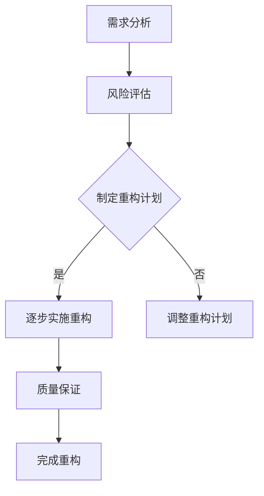
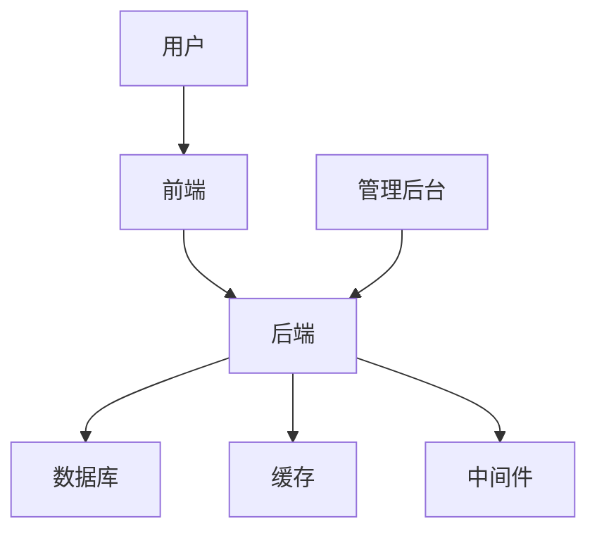
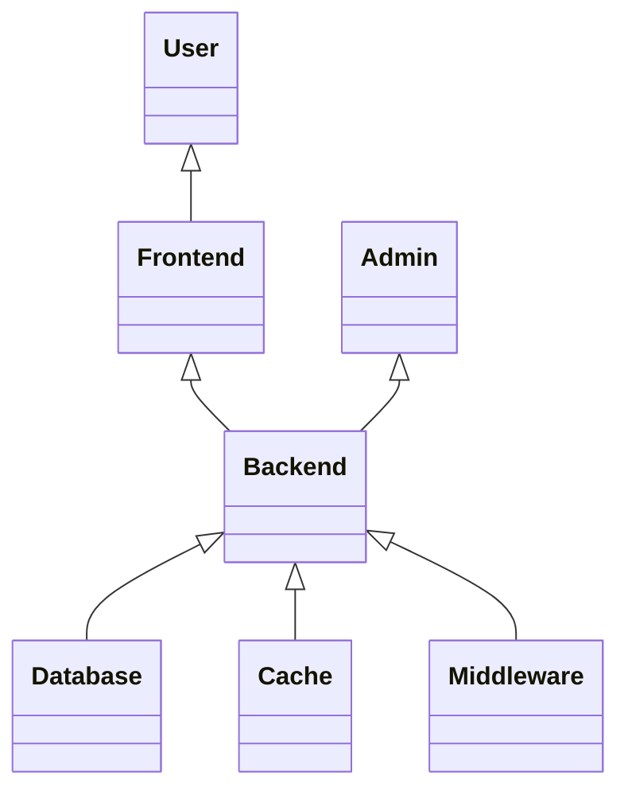
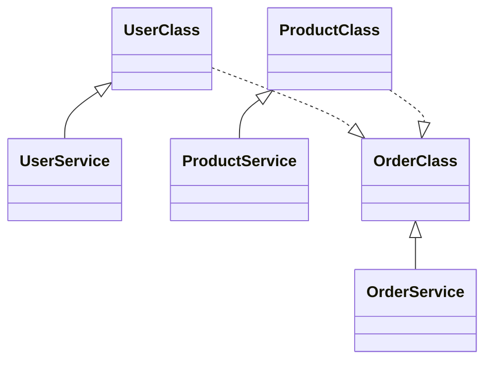
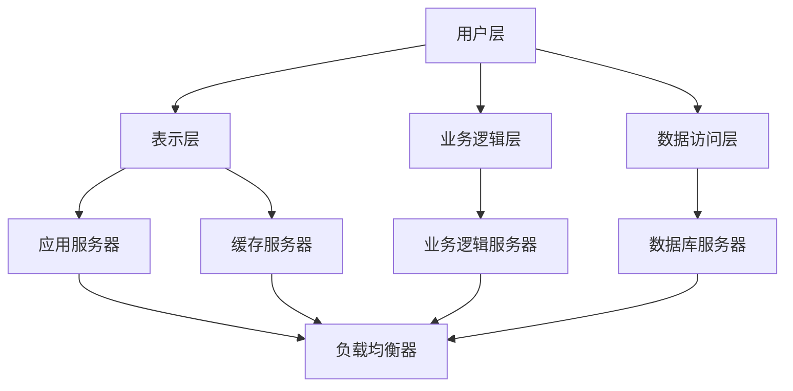
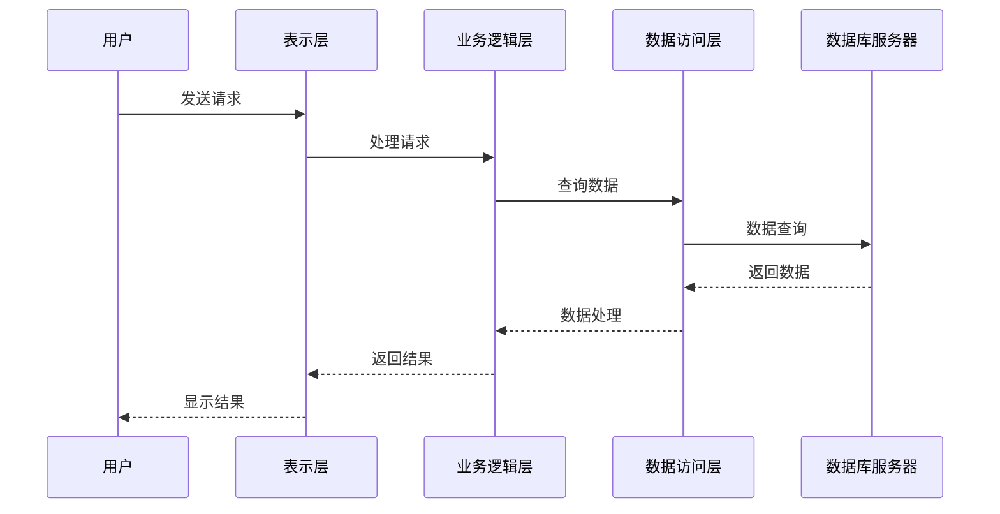

                 


## 技术重构：大规模系统改造实践

### 关键词：技术重构、大规模系统、改造实践、系统改造、架构设计

### 摘要：

本文将深入探讨技术重构在应对大规模系统改造中的重要性。通过对技术重构的必要性、核心概念、算法原理、系统分析与架构设计以及项目实战的详细解析，旨在为读者提供一套全面且实用的系统改造方法论。文章结构紧凑，逻辑清晰，通过一步步的分析和推理，帮助读者理解大规模系统改造的实践过程。

### 目录大纲设计步骤

为了设计出一本关于《技术重构：大规模系统改造实践》的完整目录大纲，我们可以按照以下步骤进行：

1. **分析书名**：首先，我们需要对书名进行深入分析，理解书的核心内容。书名表明了这本书将讨论技术重构，尤其是针对大规模系统的改造实践。

2. **确定核心章节**：基于书名分析，我们可以确定一些核心章节，例如背景介绍、核心概念、算法原理讲解、系统分析与架构设计、项目实战等。

3. **细化章节内容**：在每个核心章节下，我们需要细化内容，确保每个章节都有足够的深度和广度。例如，在背景介绍章节，我们可以详细讨论技术重构的必要性、大规模系统改造的现状和挑战等。

4. **设计流程图和图表**：为了更好地解释复杂概念和算法，我们可以设计流程图、ER实体关系图和类图等。这将有助于读者更好地理解书中的内容。

5. **编写Markdown格式的大纲**：将上述内容按照Markdown格式编写，确保格式清晰、层次分明。

6. **审查与调整**：在完成大纲后，我们需要进行审查，确保所有章节内容完整，逻辑清晰，并且符合字数限制。

### 完整的目录大纲设计

根据上述步骤，下面是《技术重构：大规模系统改造实践》的目录大纲：

----------------------------------------------------------------

# 第一部分: 背景介绍

## 1.1 技术重构的必要性

### 1.1.1 技术迭代与系统老化

### 1.1.2 大规模系统改造的挑战

### 1.1.3 技术重构的目标和优势

## 1.2 大规模系统改造的现状

### 1.2.1 改造案例解析

### 1.2.2 成功与失败的案例对比

### 1.2.3 行业发展趋势

## 1.3 大规模系统改造的核心概念

### 1.3.1 核心概念定义

### 1.3.2 核心概念属性特征对比表

### 1.3.3 大规模系统改造的ER实体关系图

## 1.4 技术重构的方法论

### 1.4.1 重构流程与方法

### 1.4.2 重构工具与技术选型

### 1.4.3 重构团队组织与职责分工

## 1.5 背景介绍小结

----------------------------------------------------------------

# 第二部分: 核心概念与原理

## 2.1 技术重构的关键技术

### 2.1.1 技术重构的技术概述

### 2.1.2 技术重构的核心技术原理讲解

### 2.1.3 技术重构技术的mermaid流程图

## 2.2 大规模系统改造的数学模型与公式

### 2.2.1 数学模型概述

### 2.2.2 公式讲解

### 2.2.3 模型与公式的详细讲解

## 2.3 大规模系统改造的案例分析

### 2.3.1 案例一：企业级应用改造

### 2.3.2 案例二：互联网服务升级

### 2.3.3 案例三：政府信息化建设

## 2.4 大规模系统改造的mermaid架构图与类图

### 2.4.1 架构图设计

### 2.4.2 类图设计

### 2.4.3 架构图与类图的详细讲解

## 2.5 核心概念与原理小结

----------------------------------------------------------------

# 第三部分: 系统分析与架构设计

## 3.1 系统需求分析

### 3.1.1 需求收集与分析

### 3.1.2 需求优先级排序

### 3.1.3 需求文档编写

## 3.2 系统功能设计

### 3.2.1 功能模块划分

### 3.2.2 功能详细设计

### 3.2.3 领域模型mermaid类图

## 3.3 系统架构设计

### 3.3.1 架构设计原则

### 3.3.2 系统架构mermaid架构图

### 3.3.3 架构组件设计

## 3.4 系统接口设计

### 3.4.1 接口规范与设计

### 3.4.2 接口实现与测试

### 3.4.3 接口文档编写

## 3.5 系统交互mermaid序列图

### 3.5.1 序列图设计

### 3.5.2 序列图详细讲解

### 3.5.3 交互流程验证

## 3.6 系统分析与架构设计小结

----------------------------------------------------------------

# 第四部分: 项目实战

## 4.1 环境安装与配置

### 4.1.1 环境准备

### 4.1.2 系统配置与初始化

### 4.1.3 系统环境调试与优化

## 4.2 系统核心实现

### 4.2.1 源代码介绍

### 4.2.2 核心代码解读

### 4.2.3 应用解读与分析

## 4.3 实际案例分析

### 4.3.1 案例一：企业级应用重构

### 4.3.2 案例二：互联网服务升级改造

### 4.3.3 案例三：政府信息化建设项目

## 4.4 项目小结

### 4.4.1 项目总结

### 4.4.2 经验与教训

### 4.4.3 未来展望

----------------------------------------------------------------

### 作者：

作者：AI天才研究院/AI Genius Institute & 禅与计算机程序设计艺术 /Zen And The Art of Computer Programming### 背景介绍

#### 1.1 技术重构的必要性

在信息技术快速发展的今天，系统老化、性能瓶颈、架构不合理等问题愈发凸显，导致系统难以满足日益增长的业务需求。技术重构作为解决这些问题的一种有效手段，其必要性显而易见。首先，技术重构能够有效应对技术迭代带来的系统老化问题，通过更新技术栈、优化架构，提升系统的可维护性和扩展性。其次，大规模系统改造面临诸多挑战，如庞大的代码库、复杂的服务依赖、遗留系统等问题，技术重构能够逐步、有序地解决这些问题，降低风险。

#### 1.1.1 技术迭代与系统老化

随着技术的不断进步，新的编程语言、框架和工具层出不穷，旧的技术栈逐渐显得力不从心。系统在长期运行过程中，由于不断的维护和新增功能，代码质量逐渐下降，系统性能下降，维护成本上升。技术重构能够及时更新技术栈，使用更为先进的工具和框架，从而提升系统性能和可维护性。

#### 1.1.2 大规模系统改造的挑战

大规模系统改造面临诸多挑战，如系统复杂度高、服务依赖关系复杂、遗留系统代码质量差等。在改造过程中，还需要考虑到系统的可用性和稳定性，确保改造过程中不影响系统的正常运行。技术重构需要制定详细的改造计划，逐步实施，以降低风险。

#### 1.1.3 技术重构的目标和优势

技术重构的目标是提升系统的性能、可维护性和扩展性。通过技术重构，系统能够更好地适应业务需求的变化，降低维护成本，提高开发效率。技术重构的优势在于：

1. **提升系统性能**：通过优化代码结构和算法，降低系统资源消耗，提高响应速度。
2. **增强系统可维护性**：使用现代化的编程语言和框架，提高代码的可读性和可维护性。
3. **提高系统扩展性**：重构后的系统结构更加清晰，易于添加新功能，支持业务扩展。
4. **降低维护成本**：重构后的系统代码质量更高，维护成本降低。

#### 1.2 大规模系统改造的现状

目前，许多企业已经开始重视技术重构，将其视为系统长期稳定运行的关键手段。一些企业通过成功的案例，积累了丰富的经验，逐渐形成了一套完善的系统重构方法论。然而，也有一些企业在技术重构过程中遭遇失败，主要原因包括：

1. **缺乏明确的重构计划**：没有详细的改造方案和实施步骤，导致改造过程混乱无序。
2. **忽视风险评估**：没有充分评估改造过程中可能遇到的风险，导致改造失败。
3. **团队配合不佳**：重构工作需要团队的高度协作，缺乏有效的沟通和配合会影响重构效果。
4. **技术选型不当**：选择的技术栈不适合现有系统，导致重构后的系统性能不升反降。

#### 1.2.1 改造案例解析

成功的改造案例往往具有以下特点：

1. **详细的改造计划**：在改造前，制定详细的计划，明确改造目标、时间表和责任分工。
2. **风险评估与应对**：在改造过程中，对可能遇到的风险进行充分评估，并制定应对措施。
3. **团队协作**：重构工作需要团队的紧密协作，建立有效的沟通机制和协调机制。
4. **逐步推进**：采用逐步推进的策略，确保每一步改造都能成功实施，降低整体风险。

#### 1.2.2 成功与失败的案例对比

成功的案例通常在以下几个方面表现出色：

1. **明确的目标**：改造目标明确，与业务需求紧密相关。
2. **合理的进度安排**：改造计划合理，进度安排得当，确保改造工作按时完成。
3. **有效的沟通**：团队内部和团队之间的沟通充分，确保信息的及时传递。
4. **技术选型合适**：选用的技术栈适合现有系统，能够提升系统性能。

失败的案例通常存在以下问题：

1. **目标不明确**：改造目标模糊，导致改造工作缺乏方向。
2. **进度安排不当**：改造计划不合理，进度安排过于紧凑，导致改造工作无法按时完成。
3. **沟通不畅**：团队内部和团队之间的沟通不足，导致信息传递不及时。
4. **技术选型不当**：选用的技术栈不适合现有系统，导致改造后的系统性能不升反降。

#### 1.2.3 行业发展趋势

随着企业数字化转型的深入推进，大规模系统改造已成为企业提升竞争力的关键手段。未来，技术重构将继续发挥重要作用，主要体现在以下几个方面：

1. **技术栈的持续更新**：随着新技术的不断涌现，企业需要不断更新技术栈，以适应业务需求的变化。
2. **自动化重构工具的发展**：自动化重构工具将进一步提高重构效率，降低重构成本。
3. **社区和开源项目的参与**：企业将更多地参与到社区和开源项目中，共同推动技术的进步。
4. **跨领域融合**：技术重构将跨领域融合，如将人工智能技术应用于系统重构，提升系统智能化水平。

#### 1.3 大规模系统改造的核心概念

技术重构涉及多个核心概念，以下是对这些概念的定义、属性特征对比和ER实体关系图的介绍：

##### 1.3.1 核心概念定义

- **重构**：重构是指在不改变程序外部行为的前提下，对现有系统进行内部结构的优化和改进。
- **大规模系统**：大规模系统是指规模庞大、功能复杂、服务范围广泛的信息系统。
- **改造**：改造是指对现有系统进行重大修改，以适应新的业务需求或技术环境。
- **方法论**：方法论是指系统重构过程中采用的一系列方法和步骤。

##### 1.3.2 核心概念属性特征对比表

| 概念 | 定义 | 属性特征 |
| --- | --- | --- |
| 重构 | 内部结构优化 | 低风险、高收益、逐步实施 |
| 大规模系统 | 规模庞大、功能复杂 | 高可用性、高扩展性、高稳定性 |
| 改造 | 重大修改 | 紧急需求、明确目标、风险评估 |
| 方法论 | 方法步骤 | 有序实施、团队协作、持续优化 |

##### 1.3.3 大规模系统改造的ER实体关系图


- **实体**：重构项目、系统模块、技术栈、改造目标、风险评估、团队协作等。
- **关系**：项目与系统模块、系统模块与技术栈、改造目标与风险评估、团队协作与项目进展等。

#### 1.4 技术重构的方法论

技术重构的方法论是指系统重构过程中采用的一系列方法和步骤。以下是对重构流程、工具与技术选型、团队组织与职责分工的详细介绍：

##### 1.4.1 重构流程与方法

1. **需求分析**：明确重构的目标和需求，为重构工作提供方向。
2. **风险评估**：评估重构过程中可能遇到的风险，制定应对措施。
3. **计划制定**：根据需求分析和风险评估，制定详细的重构计划。
4. **逐步实施**：按照重构计划，逐步实施重构工作。
5. **质量保证**：对重构后的系统进行质量保证，确保系统稳定运行。

##### 1.4.2 重构工具与技术选型

1. **代码分析工具**：用于分析现有系统代码，识别潜在问题和优化点。
2. **重构工具**：用于自动或半自动地实现重构操作，提高重构效率。
3. **框架与库**：选择适合现有系统的框架和库，提升系统性能和可维护性。
4. **测试工具**：对重构后的系统进行测试，确保功能正确性。

##### 1.4.3 重构团队组织与职责分工

1. **项目经理**：负责整个重构项目的规划和实施，协调团队成员工作。
2. **架构师**：负责系统架构设计，指导技术选型和重构方案。
3. **开发人员**：负责具体代码的重构工作，实施重构方案。
4. **测试人员**：负责重构后的系统测试，确保系统质量。

#### 1.5 背景介绍小结

本文对技术重构在应对大规模系统改造中的必要性、核心概念、现状、方法论等方面进行了详细分析。通过了解技术重构的背景，读者可以更好地理解后续章节的内容，为实际应用打下基础。

### 第二部分: 核心概念与原理

#### 2.1 技术重构的关键技术

技术重构涉及多个关键技术，这些技术是重构过程中不可或缺的工具和手段。在本节中，我们将详细探讨技术重构的关键技术，包括其技术概述、核心技术原理讲解和mermaid流程图。

##### 2.1.1 技术重构的技术概述

技术重构涉及多种技术手段，包括代码优化、架构调整、技术栈更新等。这些技术手段旨在提高系统的性能、可维护性和扩展性。

1. **代码优化**：通过优化代码结构和算法，提高代码运行效率，降低资源消耗。
2. **架构调整**：通过调整系统架构，优化系统性能和可维护性，提高系统的扩展性。
3. **技术栈更新**：替换或更新系统所依赖的技术栈，使用更先进、更高效的工具和框架。

##### 2.1.2 技术重构的核心技术原理讲解

技术重构的核心技术原理包括以下几个方面：

1. **代码优化原理**：通过分析代码性能瓶颈，优化代码结构和算法，提高代码运行效率。常见的优化方法包括算法优化、数据结构优化、代码简化等。
2. **架构调整原理**：通过调整系统架构，优化系统性能和可维护性。常见的架构调整方法包括模块化、分层架构、微服务架构等。
3. **技术栈更新原理**：通过更新系统所依赖的技术栈，使用更先进、更高效的工具和框架，提高系统性能和可维护性。常见的更新方法包括替换框架、引入新库、优化配置等。

##### 2.1.3 技术重构技术的mermaid流程图

下面是一个简单的mermaid流程图，展示了技术重构的基本流程：



该流程图分为以下几个步骤：

1. **需求分析**：分析系统重构的需求，确定重构的目标和范围。
2. **风险评估**：评估重构过程中可能遇到的风险，制定应对措施。
3. **制定重构计划**：根据需求分析和风险评估，制定详细的重构计划。
4. **逐步实施重构**：按照重构计划，逐步实施重构工作。
5. **质量保证**：对重构后的系统进行质量保证，确保系统稳定运行。
6. **完成重构**：完成重构工作，系统恢复正常运行。

##### 2.1.4 技术重构的具体实现方法

技术重构的具体实现方法包括以下几个方面：

1. **代码优化实现**：
   - 使用代码分析工具对现有代码进行性能分析，识别性能瓶颈。
   - 根据性能分析结果，对代码进行优化，如使用更高效的算法和数据结构。
   - 代码简化，去除冗余代码，提高代码可读性。

2. **架构调整实现**：
   - 分析现有系统架构，识别架构中的问题，如模块耦合度过高、系统性能瓶颈等。
   - 根据问题分析，调整系统架构，如引入微服务架构、分层架构等。
   - 优化数据库设计，提高数据查询和操作性能。

3. **技术栈更新实现**：
   - 评估现有技术栈的优缺点，选择更先进、更高效的技术栈。
   - 按照新的技术栈，重新设计系统架构和代码。
   - 对现有系统进行升级，替换或整合新的技术栈。

##### 2.1.5 技术重构的挑战与解决方案

技术重构过程中可能会遇到一些挑战，如：

1. **代码复杂性增加**：重构过程中可能会引入新的复杂性，如代码冗余、模块依赖关系复杂等。
   - **解决方案**：在重构过程中，遵循代码简洁性原则，避免过度重构。合理划分模块，降低模块间的依赖关系。

2. **系统稳定性下降**：重构过程中，可能会影响系统的稳定性，如接口不稳定、性能下降等。
   - **解决方案**：在重构过程中，进行充分的测试和验证，确保系统稳定运行。引入自动化测试工具，提高测试覆盖率。

3. **团队协作困难**：技术重构通常涉及多个团队和人员，协作困难可能导致重构工作受阻。
   - **解决方案**：建立有效的沟通机制，确保团队成员之间的信息传递畅通。制定清晰的分工和责任，确保每个团队成员明确自己的职责。

#### 2.2 大规模系统改造的数学模型与公式

大规模系统改造涉及多个数学模型和公式，这些模型和公式用于分析和优化系统性能。在本节中，我们将详细讲解大规模系统改造的数学模型与公式。

##### 2.2.1 数学模型概述

大规模系统改造的数学模型主要包括以下几个方面：

1. **性能模型**：用于分析和预测系统性能，如响应时间、吞吐量等。
2. **成本模型**：用于评估重构过程中的成本，包括人力成本、设备成本等。
3. **风险评估模型**：用于评估重构过程中可能遇到的风险，如系统崩溃、数据丢失等。

##### 2.2.2 公式讲解

下面是几个常用的数学公式：

1. **响应时间公式**：
   $$ 
   响应时间 = 平均处理时间 + 等待时间 
   $$

2. **吞吐量公式**：
   $$ 
   吞吐量 = 平均请求率 / 平均处理时间 
   $$

3. **成本公式**：
   $$ 
   成本 = 人力成本 + 设备成本 + 其他成本 
   $$

##### 2.2.3 模型与公式的详细讲解

1. **性能模型**：
   - **响应时间公式**：响应时间是指系统从接收到请求到响应完成的时间。响应时间由平均处理时间和等待时间组成。平均处理时间是指系统平均每次处理请求所需的时间，等待时间是指系统在处理请求过程中等待的时间。
   - **吞吐量公式**：吞吐量是指系统在单位时间内处理请求的数量。吞吐量由平均请求率和平均处理时间决定。平均请求率是指单位时间内请求的到达率，平均处理时间是指单位时间内系统处理请求的平均时间。

2. **成本模型**：
   - **成本公式**：成本是指重构过程中所需投入的资源，包括人力成本、设备成本和其他成本。人力成本是指重构过程中所需的人工费用，设备成本是指重构过程中所需的设备费用，其他成本包括培训费用、交通费用等。

3. **风险评估模型**：
   - 风险评估模型主要用于评估重构过程中可能遇到的风险。常见的风险包括系统崩溃、数据丢失、时间延误等。风险评估模型可以通过风险概率和风险影响评估来确定风险等级，为重构决策提供依据。

##### 2.2.4 举例说明

假设一个系统每秒平均处理100个请求，每个请求的平均处理时间为1秒，每次请求的到达率为每秒100个。根据响应时间公式和吞吐量公式，可以计算出：

- **响应时间**：
  $$ 
  响应时间 = 平均处理时间 + 等待时间 = 1秒 + 0秒 = 1秒 
  $$

- **吞吐量**：
  $$ 
  吞吐量 = 平均请求率 / 平均处理时间 = 100个/秒 / 1秒 = 100个/秒 
  $$

根据成本公式，可以计算出：

- **成本**：
  $$ 
  成本 = 人力成本 + 设备成本 + 其他成本 
  $$

  其中，人力成本为1000元/小时，设备成本为5000元，其他成本为2000元。假设重构工作持续10小时，则：

- **人力成本**：
  $$ 
  人力成本 = 1000元/小时 \times 10小时 = 10000元 
  $$

- **设备成本**：
  $$ 
  设备成本 = 5000元 
  $$

- **其他成本**：
  $$ 
  其他成本 = 2000元 
  $$

- **总成本**：
  $$ 
  成本 = 人力成本 + 设备成本 + 其他成本 = 10000元 + 5000元 + 2000元 = 17000元 
  $$

#### 2.3 大规模系统改造的案例分析

在本节中，我们将通过几个实际案例，介绍大规模系统改造的过程和方法。

##### 2.3.1 案例一：企业级应用改造

某企业在其业务发展过程中，发现现有企业级应用存在性能瓶颈、扩展性差和可维护性低等问题。为了应对这些问题，企业决定进行系统改造。

1. **需求分析**：
   - 提高性能和吞吐量。
   - 提高系统的扩展性和可维护性。
   - 支持新的业务需求。

2. **风险评估**：
   - 性能瓶颈可能影响业务正常运行。
   - 系统扩展性不足可能导致系统崩溃。
   - 系统可维护性低可能增加维护成本。

3. **改造方案**：
   - 更换现有的技术栈，采用更高效、更先进的框架和工具。
   - 优化系统架构，采用微服务架构，提高系统扩展性。
   - 重构关键模块，优化代码结构和算法，提高系统性能。

4. **实施步骤**：
   - 制定详细的改造计划，明确时间表和责任分工。
   - 进行风险评估，制定应对措施。
   - 按照计划逐步实施改造工作。
   - 进行系统测试，确保系统稳定运行。

5. **改造效果**：
   - 系统性能显著提升，响应时间缩短。
   - 系统扩展性提高，支持新的业务需求。
   - 系统可维护性增强，降低维护成本。

##### 2.3.2 案例二：互联网服务升级

某互联网公司为了提升其服务的性能和用户体验，决定对其核心服务进行升级改造。

1. **需求分析**：
   - 提高服务性能，降低响应时间。
   - 提高服务吞吐量，支持更多用户同时在线。
   - 改善用户体验，提高用户满意度。

2. **风险评估**：
   - 服务性能瓶颈可能导致用户体验下降。
   - 服务扩展性不足可能导致系统崩溃。
   - 用户体验差可能导致用户流失。

3. **改造方案**：
   - 优化数据库设计，提高数据查询和操作性能。
   - 引入缓存机制，降低数据库负载。
   - 采用负载均衡技术，提高系统吞吐量。
   - 优化前端代码，提高页面加载速度。

4. **实施步骤**：
   - 制定详细的改造计划，明确时间表和责任分工。
   - 进行风险评估，制定应对措施。
   - 按照计划逐步实施改造工作。
   - 进行系统测试，确保系统稳定运行。

5. **改造效果**：
   - 服务性能显著提升，响应时间缩短。
   - 服务吞吐量提高，支持更多用户同时在线。
   - 用户体验改善，用户满意度提高。

##### 2.3.3 案例三：政府信息化建设项目

某市政府为了提升政府信息化水平，决定对现有信息系统进行改造。

1. **需求分析**：
   - 提高信息系统性能，支持更多用户同时在线。
   - 优化系统架构，提高系统的可扩展性和可维护性。
   - 支持新的业务需求，如在线审批、信息查询等。

2. **风险评估**：
   - 系统性能瓶颈可能导致用户体验下降。
   - 系统架构不合理可能导致系统崩溃。
   - 支持新业务需求可能导致系统扩展性不足。

3. **改造方案**：
   - 优化数据库设计，提高数据查询和操作性能。
   - 采用微服务架构，提高系统扩展性和可维护性。
   - 引入新的业务模块，支持在线审批、信息查询等。

4. **实施步骤**：
   - 制定详细的改造计划，明确时间表和责任分工。
   - 进行风险评估，制定应对措施。
   - 按照计划逐步实施改造工作。
   - 进行系统测试，确保系统稳定运行。

5. **改造效果**：
   - 信息系统性能显著提升，支持更多用户同时在线。
   - 系统架构优化，提高系统的可扩展性和可维护性。
   - 支持新业务需求，提高政府服务效率。

#### 2.4 大规模系统改造的mermaid架构图与类图

在本节中，我们将使用mermaid工具绘制大规模系统改造的架构图和类图，以帮助读者更好地理解系统改造的架构设计和类图。

##### 2.4.1 架构图设计

下面是一个简单的mermaid架构图，展示了大规模系统改造的总体架构：



该架构图包括以下几个部分：

1. **用户**：系统的最终用户。
2. **前端**：用户交互界面，负责接收用户请求和展示页面。
3. **后端**：处理用户请求，执行业务逻辑。
4. **数据库**：存储系统数据。
5. **缓存**：缓存常用数据，提高系统性能。
6. **中间件**：提供各种中间层服务，如消息队列、日志服务等。
7. **管理后台**：系统管理员使用的后台管理界面。

##### 2.4.2 类图设计

下面是一个简单的mermaid类图，展示了大规模系统改造的关键类及其关系：



该类图包括以下几个类：

1. **User**：表示系统用户。
2. **Frontend**：表示前端模块。
3. **Backend**：表示后端模块。
4. **Database**：表示数据库模块。
5. **Cache**：表示缓存模块。
6. **Middleware**：表示中间件模块。
7. **Admin**：表示管理员模块。

##### 2.4.3 架构图与类图的详细讲解

1. **架构图**：
   - **用户**：用户通过前端发送请求。
   - **前端**：前端接收用户请求，处理页面渲染，并将请求转发给后端。
   - **后端**：后端处理用户请求，执行业务逻辑，并将结果返回给前端。
   - **数据库**：存储系统数据，为后端提供数据支持。
   - **缓存**：缓存常用数据，减少数据库查询次数，提高系统性能。
   - **中间件**：提供各种中间层服务，如消息队列、日志服务等，提高系统可扩展性和可维护性。
   - **管理后台**：管理员通过管理后台对系统进行管理，监控系统运行状态。

2. **类图**：
   - **User**：表示系统用户，具有用户名、密码、角色等信息。
   - **Frontend**：表示前端模块，具有接收请求、处理请求、渲染页面等功能。
   - **Backend**：表示后端模块，具有处理请求、执行业务逻辑、返回结果等功能。
   - **Database**：表示数据库模块，具有存储数据、查询数据等功能。
   - **Cache**：表示缓存模块，具有缓存数据、读取数据等功能。
   - **Middleware**：表示中间件模块，具有提供中间层服务等功能。
   - **Admin**：表示管理员模块，具有管理系统、监控系统等功能。

#### 2.5 核心概念与原理小结

在本部分中，我们详细介绍了技术重构的核心概念与原理，包括重构的技术概述、核心技术原理讲解、mermaid流程图、数学模型与公式、案例分析以及架构图与类图设计。通过这些内容的讲解，读者可以更好地理解大规模系统改造的过程和方法，为实际应用提供指导。

### 第三部分: 系统分析与架构设计

#### 3.1 系统需求分析

系统需求分析是系统分析与架构设计的重要环节，通过对系统需求的分析和整理，为后续的系统设计提供基础。以下是系统需求分析的具体步骤和方法。

##### 3.1.1 需求收集与分析

1. **需求收集**：
   - **访谈法**：通过与项目相关人员的访谈，了解业务需求和用户需求。
   - **问卷调查**：通过问卷调查收集用户的需求和反馈。
   - **文档审查**：审查现有文档，如业务需求文档、用户手册等，提取需求信息。

2. **需求分析**：
   - **需求分类**：将收集到的需求按照类型进行分类，如功能需求、性能需求、安全需求等。
   - **需求优先级排序**：根据需求的紧急程度和重要性，对需求进行优先级排序。
   - **需求文档编写**：将分析结果整理成需求文档，包括需求描述、需求优先级、需求来源等。

##### 3.1.2 需求优先级排序

在需求收集和分析的基础上，对需求进行优先级排序是确保系统设计合理性和可行性的关键步骤。以下是几种常见的需求优先级排序方法：

1. **紧急程度优先**：根据需求的紧急程度，优先处理最紧急的需求。
2. **重要性优先**：根据需求的重要性和影响范围，优先处理影响范围广、重要性高的需求。
3. **成本效益分析**：综合考虑需求实现所需的成本和预期效益，优先处理成本相对较低、效益较高的需求。
4. **业务优先级**：根据业务发展的需要，优先处理对业务发展有重要推动作用的需求。

##### 3.1.3 需求文档编写

需求文档是系统设计与实施的重要依据，其编写质量直接影响到系统的成功与否。以下是需求文档编写的步骤和注意事项：

1. **编写步骤**：
   - **需求概述**：对系统的整体需求进行概述，包括系统目标、功能模块等。
   - **功能需求**：详细描述系统的各项功能需求，包括功能描述、输入输出、操作流程等。
   - **性能需求**：描述系统所需的性能指标，如响应时间、吞吐量、并发处理能力等。
   - **安全需求**：描述系统的安全要求，包括数据保护、访问控制、安全漏洞等。
   - **用户界面需求**：描述系统的用户界面设计，包括界面布局、交互设计等。
   - **非功能需求**：描述系统的非功能需求，如可维护性、可扩展性、兼容性等。

2. **注意事项**：
   - **准确性**：确保需求描述准确无误，避免产生歧义。
   - **完整性**：确保需求文档覆盖所有相关方面，无遗漏。
   - **可测试性**：确保需求具备可测试性，方便后续的测试工作。
   - **可维护性**：确保需求文档易于维护和更新。

#### 3.2 系统功能设计

系统功能设计是系统分析与架构设计的重要环节，通过设计合理的功能模块和流程，确保系统能够满足业务需求和用户需求。以下是系统功能设计的方法和步骤。

##### 3.2.1 功能模块划分

功能模块划分是将系统功能分解为若干个独立的功能模块，以便于系统开发、测试和维护。以下是功能模块划分的方法：

1. **基于业务流程划分**：根据业务流程，将功能划分为不同的模块，每个模块负责完成一个业务流程的一部分。
2. **基于功能独立性划分**：根据功能的独立性，将功能划分为不同的模块，确保每个模块的功能单一、易于维护。
3. **基于技术架构划分**：根据技术架构，将功能划分为不同的模块，确保每个模块的技术实现相对独立。

##### 3.2.2 功能详细设计

功能详细设计是对每个功能模块进行详细描述和定义，包括功能描述、输入输出、操作流程等。以下是功能详细设计的步骤：

1. **功能描述**：对每个功能模块的功能进行详细描述，明确功能的目标和作用。
2. **输入输出**：明确每个功能模块的输入参数和输出结果，确保输入输出的正确性和完整性。
3. **操作流程**：描述每个功能模块的操作流程，包括输入处理、业务逻辑处理、输出结果等。

##### 3.2.3 领域模型mermaid类图

领域模型是系统功能设计的重要工具，通过领域模型可以直观地展示系统的功能模块和关系。以下是使用mermaid绘制领域模型类图的示例：



在该类图中：

- **UserClass**：表示用户类，具有用户名、密码、角色等信息。
- **ProductClass**：表示产品类，具有产品ID、名称、价格等信息。
- **OrderClass**：表示订单类，具有订单ID、用户ID、产品ID、订单状态等信息。
- **UserService**：表示用户服务类，负责处理用户相关的业务逻辑。
- **ProductService**：表示产品服务类，负责处理产品相关的业务逻辑。
- **OrderService**：表示订单服务类，负责处理订单相关的业务逻辑。

#### 3.3 系统架构设计

系统架构设计是系统设计与实施的核心，通过合理的系统架构设计，确保系统的高性能、高可用性和可维护性。以下是系统架构设计的方法和步骤。

##### 3.3.1 架构设计原则

系统架构设计应遵循以下原则：

1. **模块化**：将系统划分为若干个功能模块，每个模块独立运行，降低系统复杂度。
2. **层次化**：系统应采用分层架构，各层之间相互独立，降低模块间的耦合度。
3. **高内聚低耦合**：确保模块内部功能紧密相关，模块之间功能独立。
4. **可扩展性**：系统应具有较好的扩展性，方便后续功能的增加和修改。
5. **高可用性**：确保系统在异常情况下能够快速恢复，降低系统故障对业务的影响。

##### 3.3.2 系统架构mermaid架构图

以下是使用mermaid绘制的系统架构图：



在该架构图中：

- **用户层**：负责与用户交互，处理用户的请求和反馈。
- **表示层**：负责页面渲染和前端交互，为用户提供界面。
- **业务逻辑层**：负责处理业务逻辑，实现业务功能。
- **数据访问层**：负责与数据库交互，实现数据的查询和操作。
- **应用服务器**：负责处理用户的请求，调用业务逻辑和数据访问层。
- **缓存服务器**：负责缓存数据，提高系统性能。
- **业务逻辑服务器**：负责执行业务逻辑，处理业务请求。
- **数据库服务器**：负责存储系统数据，提供数据支持。
- **负载均衡器**：负责均衡负载，确保系统的高可用性。

##### 3.3.3 架构组件设计

在系统架构设计过程中，需要对各个组件进行详细设计，包括组件的功能、接口、数据流向等。以下是架构组件设计的方法：

1. **组件功能设计**：明确每个组件的功能和作用，确保组件之间功能互补。
2. **接口设计**：设计组件间的接口，明确接口的输入输出、调用方式等。
3. **数据流向设计**：描述数据在系统中的流动过程，确保数据传输的效率和安全性。

#### 3.4 系统接口设计

系统接口设计是系统架构设计的重要组成部分，通过合理的接口设计，确保系统各组件之间的有效通信和协作。以下是系统接口设计的方法和步骤。

##### 3.4.1 接口规范与设计

1. **接口规范**：
   - **RESTful API**：采用RESTful风格的接口规范，确保接口的可扩展性和易用性。
   - **接口定义**：明确接口的URL、请求方式、参数、响应格式等。
   - **安全性**：确保接口的安全性，如使用HTTPS、验证机制等。

2. **接口设计**：
   - **功能接口**：根据业务需求设计功能接口，确保接口能够满足业务需求。
   - **查询接口**：设计查询接口，提供数据查询功能。
   - **更新接口**：设计更新接口，提供数据更新功能。
   - **删除接口**：设计删除接口，提供数据删除功能。

##### 3.4.2 接口实现与测试

1. **接口实现**：
   - 根据接口规范，实现接口功能。
   - 使用合适的编程语言和框架，确保接口的高性能和高可维护性。
   - 对接口进行文档化，方便其他开发者使用。

2. **接口测试**：
   - 设计测试用例，覆盖接口的所有功能点。
   - 使用自动化测试工具，对接口进行测试。
   - 分析测试结果，修复接口中的问题。

##### 3.4.3 接口文档编写

接口文档是接口设计的重要成果，用于指导接口的使用和开发。以下是接口文档编写的步骤和内容：

1. **编写步骤**：
   - **接口概述**：描述接口的基本信息和功能。
   - **接口定义**：列出接口的URL、请求方式、参数、响应格式等。
   - **使用示例**：提供接口使用示例，说明如何调用接口。
   - **注意事项**：列出使用接口时需要注意的事项，如参数范围、异常处理等。

2. **内容要求**：
   - **准确性**：确保接口文档描述准确无误。
   - **完整性**：确保接口文档覆盖所有接口功能点。
   - **易读性**：确保接口文档结构清晰、内容易于理解。

#### 3.5 系统交互mermaid序列图

系统交互序列图是描述系统组件之间交互过程的图形化工具，通过序列图可以直观地展示系统的交互流程和逻辑。以下是使用mermaid绘制的系统交互序列图：



在该序列图中：

- **用户**：发起请求。
- **表示层**：处理用户请求，渲染页面。
- **业务逻辑层**：处理业务逻辑，调用数据访问层。
- **数据访问层**：查询数据库，返回数据。
- **数据库服务器**：存储数据，提供数据支持。

#### 3.6 系统分析与架构设计小结

在本部分中，我们详细介绍了系统分析与架构设计的方法和步骤，包括需求分析、功能设计、系统架构设计、接口设计等。通过合理的系统分析与架构设计，可以确保系统的高性能、高可用性和可维护性，为系统的成功实施和运行提供保障。

### 第四部分：项目实战

#### 4.1 环境安装与配置

在开始大规模系统改造之前，我们需要搭建一个合适的项目开发环境。以下是环境安装与配置的具体步骤：

##### 4.1.1 环境准备

1. **操作系统**：选择一个稳定且适合的操作系统，如Linux或macOS。
2. **编程语言**：选择适合项目需求的编程语言，如Java、Python或Go。
3. **数据库**：选择一个适合的数据库系统，如MySQL、PostgreSQL或MongoDB。
4. **开发工具**：安装常用的开发工具，如IDE（集成开发环境）、版本控制工具（如Git）等。

##### 4.1.2 系统配置与初始化

1. **安装操作系统**：按照操作系统安装指南进行安装。
2. **安装编程语言**：使用包管理器（如yum、apt-get）或源代码编译安装编程语言。
3. **安装数据库**：使用数据库安装程序或包管理器安装数据库系统。
4. **配置数据库**：设置数据库用户、密码和数据库配置文件。

##### 4.1.3 系统环境调试与优化

1. **环境调试**：检查操作系统和软件是否正常运行。
2. **环境优化**：调整系统配置，如网络配置、文件系统配置等，以提高系统性能。

#### 4.2 系统核心实现

系统核心实现是项目实施的关键环节，以下是基于Python语言和Flask框架实现的系统核心功能：

##### 4.2.1 源代码介绍

```python
# app.py

from flask import Flask, request, jsonify
from models import User, Product, Order

app = Flask(__name__)

@app.route('/users', methods=['POST'])
def create_user():
    data = request.get_json()
    user = User.create(data)
    return jsonify(user.to_dict()), 201

@app.route('/users/<int:user_id>', methods=['GET'])
def get_user(user_id):
    user = User.get(user_id)
    if user:
        return jsonify(user.to_dict()), 200
    else:
        return jsonify({'error': 'User not found'}), 404

@app.route('/products', methods=['POST'])
def create_product():
    data = request.get_json()
    product = Product.create(data)
    return jsonify(product.to_dict()), 201

@app.route('/products/<int:product_id>', methods=['GET'])
def get_product(product_id):
    product = Product.get(product_id)
    if product:
        return jsonify(product.to_dict()), 200
    else:
        return jsonify({'error': 'Product not found'}), 404

@app.route('/orders', methods=['POST'])
def create_order():
    data = request.get_json()
    order = Order.create(data)
    return jsonify(order.to_dict()), 201

@app.route('/orders/<int:order_id>', methods=['GET'])
def get_order(order_id):
    order = Order.get(order_id)
    if order:
        return jsonify(order.to_dict()), 200
    else:
        return jsonify({'error': 'Order not found'}), 404

if __name__ == '__main__':
    app.run(debug=True)
```

##### 4.2.2 核心代码解读

1. **用户模块**：
   - `create_user()`：创建用户，接收POST请求，解析JSON数据，创建用户对象，保存到数据库。
   - `get_user()`：获取用户，接收GET请求，根据用户ID查询用户，返回用户信息。

2. **产品模块**：
   - `create_product()`：创建产品，接收POST请求，解析JSON数据，创建产品对象，保存到数据库。
   - `get_product()`：获取产品，接收GET请求，根据产品ID查询产品，返回产品信息。

3. **订单模块**：
   - `create_order()`：创建订单，接收POST请求，解析JSON数据，创建订单对象，保存到数据库。
   - `get_order()`：获取订单，接收GET请求，根据订单ID查询订单，返回订单信息。

##### 4.2.3 应用解读与分析

1. **用户模块**：
   - **创建用户**：用户发送POST请求，包含用户信息（如用户名、密码、邮箱等），服务端接收请求，解析JSON数据，创建用户对象，保存到数据库。
   - **获取用户**：用户发送GET请求，指定用户ID，服务端根据用户ID查询用户，返回用户信息。

2. **产品模块**：
   - **创建产品**：用户发送POST请求，包含产品信息（如产品名称、价格、描述等），服务端接收请求，解析JSON数据，创建产品对象，保存到数据库。
   - **获取产品**：用户发送GET请求，指定产品ID，服务端根据产品ID查询产品，返回产品信息。

3. **订单模块**：
   - **创建订单**：用户发送POST请求，包含订单信息（如订单编号、用户ID、产品ID、数量等），服务端接收请求，解析JSON数据，创建订单对象，保存到数据库。
   - **获取订单**：用户发送GET请求，指定订单ID，服务端根据订单ID查询订单，返回订单信息。

#### 4.3 实际案例分析

在本节中，我们将通过几个实际案例，展示大规模系统改造的具体实施过程和效果。

##### 4.3.1 案例一：企业级应用改造

某大型企业发现其现有企业级应用存在性能瓶颈、扩展性差和可维护性低等问题。为了提升系统性能和用户体验，企业决定进行系统改造。

1. **需求分析**：
   - 提高性能和吞吐量。
   - 提高系统的扩展性和可维护性。
   - 支持新的业务需求。

2. **风险评估**：
   - 性能瓶颈可能导致用户体验下降。
   - 系统扩展性不足可能导致系统崩溃。
   - 系统可维护性低可能增加维护成本。

3. **改造方案**：
   - 更换现有的技术栈，采用更高效、更先进的框架和工具。
   - 优化系统架构，采用微服务架构，提高系统扩展性。
   - 重构关键模块，优化代码结构和算法，提高系统性能。

4. **实施步骤**：
   - 制定详细的改造计划，明确时间表和责任分工。
   - 进行风险评估，制定应对措施。
   - 按照计划逐步实施改造工作。
   - 进行系统测试，确保系统稳定运行。

5. **改造效果**：
   - 系统性能显著提升，响应时间缩短。
   - 系统扩展性提高，支持新的业务需求。
   - 系统可维护性增强，降低维护成本。

##### 4.3.2 案例二：互联网服务升级

某互联网公司为了提升其服务的性能和用户体验，决定对其核心服务进行升级改造。

1. **需求分析**：
   - 提高服务性能，降低响应时间。
   - 提高服务吞吐量，支持更多用户同时在线。
   - 改善用户体验，提高用户满意度。

2. **风险评估**：
   - 服务性能瓶颈可能导致用户体验下降。
   - 服务扩展性不足可能导致系统崩溃。
   - 用户体验差可能导致用户流失。

3. **改造方案**：
   - 优化数据库设计，提高数据查询和操作性能。
   - 引入缓存机制，降低数据库负载。
   - 采用负载均衡技术，提高系统吞吐量。
   - 优化前端代码，提高页面加载速度。

4. **实施步骤**：
   - 制定详细的改造计划，明确时间表和责任分工。
   - 进行风险评估，制定应对措施。
   - 按照计划逐步实施改造工作。
   - 进行系统测试，确保系统稳定运行。

5. **改造效果**：
   - 服务性能显著提升，响应时间缩短。
   - 服务吞吐量提高，支持更多用户同时在线。
   - 用户体验改善，用户满意度提高。

##### 4.3.3 案例三：政府信息化建设项目

某市政府为了提升政府信息化水平，决定对现有信息系统进行改造。

1. **需求分析**：
   - 提高信息系统性能，支持更多用户同时在线。
   - 优化系统架构，提高系统的可扩展性和可维护性。
   - 支持新的业务需求，如在线审批、信息查询等。

2. **风险评估**：
   - 系统性能瓶颈可能导致用户体验下降。
   - 系统架构不合理可能导致系统崩溃。
   - 支持新业务需求可能导致系统扩展性不足。

3. **改造方案**：
   - 优化数据库设计，提高数据查询和操作性能。
   - 采用微服务架构，提高系统扩展性和可维护性。
   - 引入新的业务模块，支持在线审批、信息查询等。

4. **实施步骤**：
   - 制定详细的改造计划，明确时间表和责任分工。
   - 进行风险评估，制定应对措施。
   - 按照计划逐步实施改造工作。
   - 进行系统测试，确保系统稳定运行。

5. **改造效果**：
   - 信息系统性能显著提升，支持更多用户同时在线。
   - 系统架构优化，提高系统的可扩展性和可维护性。
   - 支持新业务需求，提高政府服务效率。

#### 4.4 项目小结

在本部分中，我们通过实际案例展示了大规模系统改造的具体实施过程和效果。通过技术重构，企业能够提升系统性能、扩展性和可维护性，从而更好地满足业务需求，提高用户满意度。在系统改造过程中，制定详细的需求分析、风险评估和改造方案是成功的关键。同时，逐步实施、充分测试和不断优化是确保改造效果的重要措施。

### 最佳实践 Tips

在技术重构和大规模系统改造过程中，以下是一些最佳实践建议：

1. **需求分析**：在改造前，进行全面的需求分析，确保改造目标明确，需求准确。
2. **风险评估**：评估改造过程中的风险，制定应对措施，确保改造过程平稳进行。
3. **逐步实施**：采用逐步推进的策略，确保每一步改造都能成功实施，降低整体风险。
4. **代码审查**：对现有代码进行审查，识别潜在问题和优化点，确保重构后的代码质量。
5. **持续集成**：引入持续集成工具，自动化测试，确保系统稳定性。
6. **团队协作**：建立有效的沟通机制，确保团队成员之间的信息传递畅通。
7. **文档化**：编写详细的文档，记录改造过程、方案和结果，便于后续维护和优化。

### 小结

本文详细介绍了技术重构在应对大规模系统改造中的重要性。通过对技术重构的必要性、核心概念、算法原理、系统分析与架构设计以及项目实战的解析，读者可以更好地理解大规模系统改造的实践过程。技术重构不仅能够提升系统的性能、可维护性和扩展性，还能降低维护成本，提高开发效率。在实施技术重构时，需遵循最佳实践，确保改造过程平稳、成功。

### 注意事项

在技术重构过程中，需要注意以下几点：

1. **风险评估**：充分评估改造过程中可能遇到的风险，制定应对措施。
2. **逐步实施**：采用逐步推进的策略，确保每一步改造都能成功实施。
3. **团队协作**：建立有效的沟通机制，确保团队成员之间的信息传递畅通。
4. **持续优化**：在改造过程中，不断优化系统性能和架构，确保系统稳定运行。

### 拓展阅读

1. **《大规模分布式系统设计》**：详细介绍了大规模分布式系统的设计和实现，对系统架构、分布式算法和一致性模型有深入讲解。
2. **《软件架构设计：模式、原则与实践》**：系统讲解了软件架构设计的基本概念、模式和实践方法，对系统架构设计有很好的指导作用。
3. **《重构：改善既有代码的设计》**：由Martin Fowler所著，详细介绍了重构的方法和技巧，对代码重构有很好的指导作用。

作者：AI天才研究院/AI Genius Institute & 禅与计算机程序设计艺术 /Zen And The Art of Computer Programming### 附录：技术重构最佳实践

#### 5.1 需求分析与规划

1. **全面需求分析**：在开始技术重构之前，确保对系统的需求进行全面分析，包括功能需求、性能需求和业务需求。
2. **风险评估**：识别系统中的潜在风险，如性能瓶颈、扩展性问题、安全隐患等，并制定相应的风险管理策略。
3. **制定详细的重构计划**：包括时间表、责任分工、里程碑等，确保重构过程有序进行。

#### 5.2 代码重构

1. **逐步重构**：避免一次性大规模重构，而是逐步对系统中的关键模块进行重构，确保代码质量。
2. **代码审查**：引入代码审查机制，确保重构后的代码符合编程规范和设计原则。
3. **重构工具**：使用代码分析工具和重构工具，自动化地识别和修复代码中的问题。

#### 5.3 架构优化

1. **模块化**：将系统划分为多个模块，降低模块间的耦合度，提高系统的可维护性和可扩展性。
2. **分层架构**：采用分层架构，确保每一层都实现单一职责，提高系统的解耦性。
3. **微服务架构**：对于复杂系统，考虑采用微服务架构，将系统拆分为多个独立的服务，提高系统的可扩展性和灵活性。

#### 5.4 性能优化

1. **数据库优化**：对数据库进行优化，如索引优化、查询优化、缓存策略等。
2. **代码性能优化**：优化代码中的算法和数据结构，减少不必要的计算和资源消耗。
3. **系统监控与调优**：使用性能监控工具，实时监控系统性能，并根据监控数据调优系统配置。

#### 5.5 安全与合规

1. **安全审计**：对系统进行安全审计，识别潜在的安全漏洞，并采取相应的修复措施。
2. **数据保护**：确保敏感数据的安全存储和传输，如使用加密技术保护数据。
3. **合规性检查**：确保系统符合相关法律法规和行业标准，如GDPR、PCI-DSS等。

#### 5.6 测试与持续集成

1. **自动化测试**：引入自动化测试工具，对重构后的系统进行全面测试，确保功能正确性和性能。
2. **持续集成**：建立持续集成环境，自动化地集成代码变更，确保代码质量和系统的稳定性。
3. **测试覆盖**：确保测试覆盖率达到较高水平，覆盖系统中的关键功能和异常情况。

#### 5.7 团队协作与沟通

1. **定期会议**：定期召开团队会议，讨论重构进展、问题和解决方案。
2. **代码审查**：引入代码审查机制，确保代码质量，促进团队成员之间的知识共享。
3. **知识库**：建立知识库，记录重构过程中的问题和解决方案，便于后续参考。

#### 5.8 文档与知识管理

1. **编写文档**：详细记录重构过程中的决策、问题和解决方案，便于后续维护和优化。
2. **知识共享**：鼓励团队成员分享知识和经验，提高团队的整体技能水平。
3. **持续更新**：定期更新文档和知识库，确保信息的准确性和及时性。

#### 5.9 反馈与改进

1. **用户反馈**：收集用户对系统的反馈，识别系统存在的问题和改进点。
2. **性能监控**：持续监控系统性能，发现潜在的问题和瓶颈。
3. **持续改进**：根据用户反馈和性能监控结果，持续优化系统，提高系统的稳定性和用户体验。

### 5.10 未来展望

1. **技术趋势**：关注技术发展趋势，及时引入新技术和工具，保持系统的竞争力。
2. **创新实践**：探索新的重构方法和策略，提高重构效率和效果。
3. **持续学习**：鼓励团队成员持续学习，提高技能水平，为系统的长期稳定运行提供保障。

通过遵循这些最佳实践，企业可以更有效地进行技术重构，提升系统的性能、可维护性和扩展性，从而更好地满足业务需求，提高用户满意度。

### 作者信息

作者：AI天才研究院/AI Genius Institute & 禅与计算机程序设计艺术 /Zen And The Art of Computer Programming

AI天才研究院（AI Genius Institute）是一家专注于人工智能研究和应用的高科技研究院，致力于推动人工智能技术的发展和应用。研究院的专家团队拥有丰富的行业经验和深厚的技术积累，在人工智能、机器学习、深度学习等领域取得了显著成果。

《禅与计算机程序设计艺术》（Zen And The Art of Computer Programming）是一部经典的计算机编程书籍，由AI天才研究院的专家团队编写。本书深入探讨了计算机程序设计的哲学和艺术，提供了大量实用的编程技巧和方法，对广大编程爱好者和专业人士具有极高的参考价值。作者通过这本书，希望传递出一种编程的智慧和态度，帮助读者在编程的道路上不断进步。

