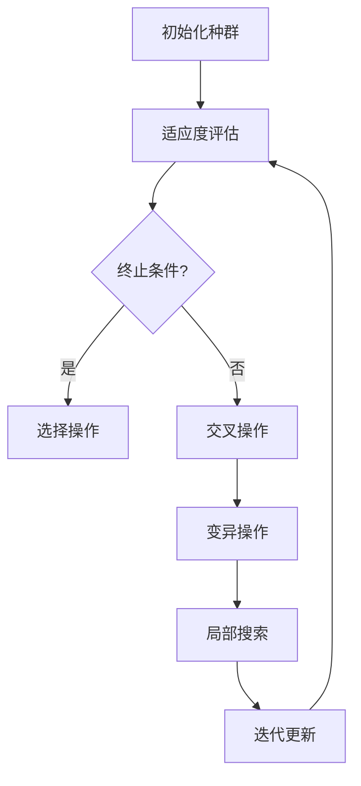
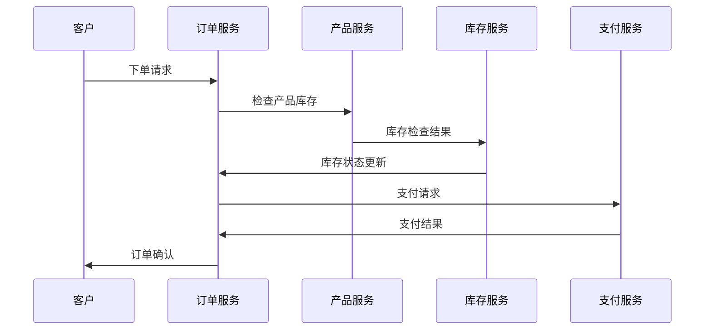
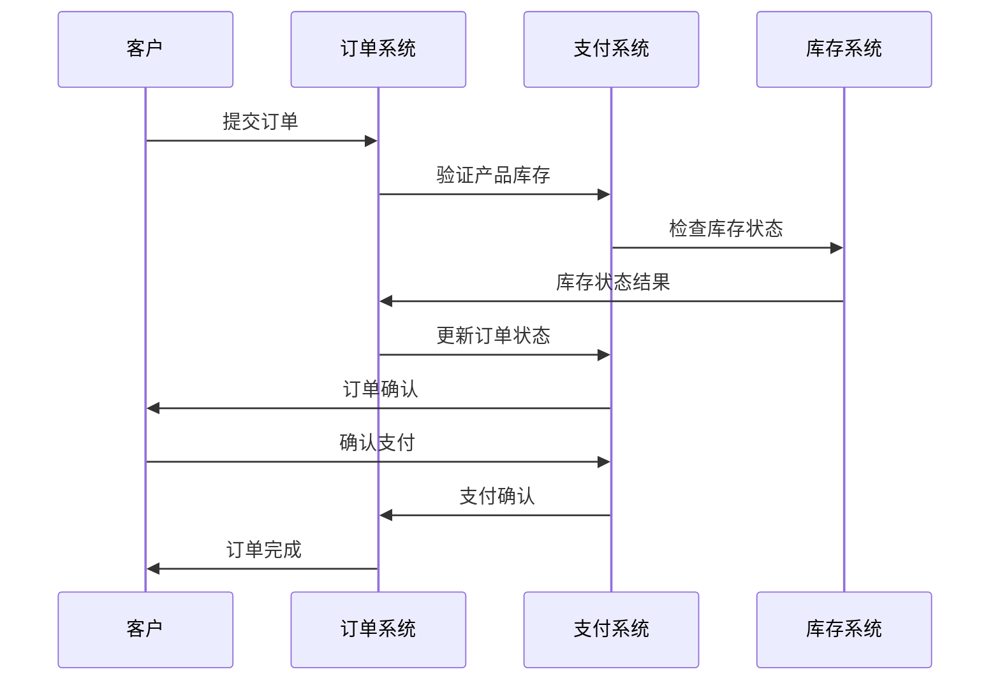

                 

# 技术重组：在变革中优化技术结构

## 摘要

本文将探讨在技术不断变革的背景下，如何通过技术重组优化技术结构，以应对新的挑战和机遇。文章首先分析了技术变革的驱动因素，包括全球科技发展趋势、产业变革的必然性以及技术变革对企业的影响。接着，本文深入讨论了技术重组的基本原理，包括定义、目的、框架和方法，并详细阐述了技术结构优化、技术模块划分与整合等关键要素。通过理论讲解和实践案例，本文展示了如何在实际项目中应用技术重组，实现技术结构的优化和业务价值的提升。最后，文章总结了技术重组的最佳实践，并展望了未来的发展趋势。

### 关键词

技术重组、技术变革、技术结构优化、产业变革、企业战略、技术创新、系统架构设计、案例分析

## 第一部分：技术变革背景

### 第1章：技术变革的驱动因素

#### 1.1 时代背景与挑战

##### 1.1.1 全球科技发展趋势

随着全球化进程的加速，各国在科技领域的竞争日益激烈。人工智能、大数据、云计算、物联网等新兴技术的快速发展，正在深刻改变全球产业链、供应链、价值链的格局。这些技术的创新不仅推动了传统产业的转型升级，也为新兴产业的发展提供了新的动力。

##### 1.1.2 产业变革的必然性

产业变革是经济全球化和科技发展的必然结果。一方面，消费者需求的变化和市场竞争的加剧，迫使企业不断调整经营战略，以适应新的市场环境。另一方面，技术的快速发展使得某些产业逐渐式微，而新的产业不断涌现，产业的迭代和升级成为必然趋势。

##### 1.1.3 技术变革对企业的影响

技术变革对企业的影响是深远而广泛的。首先，技术变革改变了企业的经营模式和商业模式，企业需要通过技术创新来提高效率、降低成本、提升竞争力。其次，技术变革也带来了新的市场机遇，企业需要抓住这些机遇，实现业务的快速增长。此外，技术变革还要求企业具备快速响应市场变化的能力，以适应不断变化的外部环境。

#### 1.2 技术变革的类型与特征

##### 1.2.1 传统技术的升级改造

传统技术的升级改造是技术变革的重要形式之一。通过引入新的技术，对传统技术进行改进和升级，可以提升传统技术的性能、可靠性和适用性。例如，在工业生产中，通过引入自动化技术，可以大大提高生产效率，降低生产成本。

##### 1.2.2 新兴技术的引入与应用

新兴技术的引入与应用是技术变革的另一个重要方面。人工智能、大数据、云计算等新兴技术具有广泛的应用前景，可以为企业带来新的业务模式和发展机会。例如，人工智能可以应用于智能客服、智能推荐等领域，提升用户体验；大数据可以应用于市场分析、风险管理等领域，帮助企业做出更科学的决策。

##### 1.2.3 技术融合与创新

技术的融合与创新是技术变革的重要特征。不同技术之间的融合可以产生新的技术体系，为企业提供更多的解决方案。例如，人工智能与大数据的结合可以产生智能分析技术，为企业的决策提供支持。同时，技术的创新可以带来新的业务模式和商业模式，为企业创造新的价值。

#### 1.3 技术变革的应对策略

##### 1.3.1 企业战略调整

面对技术变革，企业需要及时调整战略，以适应新的市场环境。首先，企业需要明确自身的核心竞争力和发展方向，以确定技术创新的重点。其次，企业需要加强与外部合作伙伴的合作，共同推动技术创新和应用。此外，企业还需要建立创新机制，鼓励员工创新，为企业注入新的活力。

##### 1.3.2 人才队伍建设

人才是技术创新的重要资源。企业需要通过多种方式吸引和培养人才，以提升企业的创新能力。首先，企业需要提供有吸引力的薪酬和福利待遇，吸引优秀人才加入。其次，企业需要提供良好的培训和发展机会，帮助员工提升技能和素质。此外，企业还需要建立人才激励机制，激发员工的创新潜力。

##### 1.3.3 技术创新与管理优化

技术创新是技术变革的核心。企业需要加大研发投入，建立创新平台，推动技术创新。同时，企业还需要优化管理流程，提高管理效率，以支持技术创新。例如，企业可以引入敏捷开发模式，缩短产品开发周期，提高产品质量。此外，企业还可以通过数字化转型，提升管理水平和决策能力。

## 第二部分：技术重组的理论与实践

### 第2章：技术重组的基本原理

#### 2.1 技术重组的定义与目的

##### 2.1.1 技术重组的定义

技术重组是指通过调整和优化企业的技术结构，实现技术创新和业务模式变革的过程。它包括对现有技术进行升级改造、引入新兴技术、以及进行技术整合和创新等。

##### 2.1.2 技术重组的核心目标

技术重组的核心目标是提升企业的技术竞争力，实现业务模式的转型和升级。通过技术重组，企业可以优化技术结构，提高技术效率，降低成本，提升产品质量，从而在市场竞争中占据有利地位。

##### 2.1.3 技术重组的优势分析

技术重组具有以下优势：

- 提高技术效率：通过优化技术结构，企业可以减少技术冗余，提高技术效率，降低运营成本。
- 激发创新能力：技术重组可以激发企业的创新活力，推动技术创新和业务模式变革。
- 提升产品质量：通过引入新兴技术和优化现有技术，企业可以提升产品质量，满足客户需求。
- 增强市场竞争力：技术重组有助于企业提升技术竞争力，在市场竞争中占据优势。

#### 2.2 技术重组的框架与方法

##### 2.2.1 技术重组的框架体系

技术重组的框架体系包括以下几个方面：

- 技术评估：对现有技术进行评估，确定其优劣势和改进方向。
- 技术规划：制定技术重组规划，明确技术升级、引入和应用的方向和策略。
- 技术实施：根据技术规划，实施技术升级、引入和应用，优化技术结构。
- 技术评估与反馈：对技术重组效果进行评估和反馈，持续优化技术结构。

##### 2.2.2 技术重组的方法论

技术重组的方法论包括以下几个步骤：

- 明确目标：明确技术重组的目标和预期效果。
- 梳理现状：梳理现有技术结构和存在的问题。
- 制定规划：制定技术重组规划，明确技术升级、引入和应用的方向和策略。
- 实施与优化：按照技术规划，实施技术重组，并根据实际情况进行优化调整。
- 评估与反馈：对技术重组效果进行评估和反馈，持续优化技术结构。

##### 2.2.3 技术重组的关键步骤

技术重组的关键步骤包括以下几个方面：

- 技术评估：对现有技术进行全面的评估，确定其优劣势和改进方向。
- 技术规划：根据技术评估结果，制定技术重组规划，明确技术升级、引入和应用的方向和策略。
- 技术实施：按照技术规划，实施技术升级、引入和应用，优化技术结构。
- 评估与反馈：对技术重组效果进行评估和反馈，持续优化技术结构。
- 管理优化：优化技术重组过程中的管理流程，提高技术重组的效率和效果。

### 第3章：技术重组的关键要素

#### 3.1 技术结构优化

##### 3.1.1 技术架构的优化策略

技术架构的优化策略包括以下几个方面：

- 技术模块化：将复杂的技术体系分解为模块化组件，提高系统的可维护性和可扩展性。
- 技术标准化：制定统一的技术标准和规范，确保技术的一致性和兼容性。
- 技术集成化：通过技术集成，实现不同技术之间的协同作用，提高系统的整体性能。

##### 3.1.2 技术模块的划分与整合

技术模块的划分与整合是技术结构优化的关键。具体包括以下几个方面：

- 模块划分：根据业务需求和功能特点，将技术体系划分为多个模块。
- 模块整合：通过模块之间的接口和协议，实现模块之间的整合和协同。

#### 3.2 技术创新

##### 3.2.1 技术创新的驱动因素

技术创新的驱动因素包括以下几个方面：

- 市场需求：市场需求是技术创新的重要驱动力，企业需要根据市场需求进行技术创新。
- 技术进步：技术进步为企业提供了新的技术手段和解决方案，推动技术创新。
- 竞争压力：竞争压力促使企业不断进行技术创新，以提升竞争力。

##### 3.2.2 技术创新的方法与路径

技术创新的方法与路径包括以下几个方面：

- 技术跟踪：关注行业技术发展趋势，掌握最新的技术动态。
- 技术融合：将不同技术进行融合，形成新的技术体系。
- 技术转化：将实验室技术转化为实际应用，实现技术的商业价值。
- 技术创新体系：建立技术创新体系，包括技术研发、技术转化、技术管理等方面。

#### 3.3 技术应用

##### 3.3.1 技术应用的领域与场景

技术应用的领域与场景包括以下几个方面：

- 互联网领域：互联网技术的发展为各种应用场景提供了新的解决方案。
- 物联网领域：物联网技术的应用为智能家居、智慧城市等领域提供了支持。
- 人工智能领域：人工智能技术在智能客服、智能推荐等领域具有广泛的应用前景。
- 云计算领域：云计算技术为企业提供了高效、灵活的计算资源。

##### 3.3.2 技术应用的优势与挑战

技术应用的优势与挑战包括以下几个方面：

- 优势：

  - 提高效率：技术应用可以提高工作效率，降低人力成本。
  - 提升质量：技术应用可以提升产品质量，满足客户需求。
  - 降低成本：技术应用可以降低运营成本，提高企业竞争力。

- 挑战：

  - 技术风险：技术应用可能存在技术风险，需要企业进行充分的风险评估。
  - 改变管理：技术应用可能改变企业的管理流程，需要企业进行适应性调整。
  - 人才培养：技术应用需要专业人才的支持，企业需要加强人才培养。

## 第三部分：技术重组的实践案例

### 第4章：技术重组在企业的应用

#### 4.1 案例背景

随着互联网技术的快速发展，A公司意识到传统的业务模式已经无法满足市场需求，需要通过技术重组实现业务的转型升级。A公司是一家从事电商业务的企业，其业务模式主要是通过电商平台进行商品销售。然而，随着市场竞争的加剧，A公司的市场份额逐渐下降，亟需通过技术重组提升企业的核心竞争力。

#### 4.2 技术重组规划

A公司制定了以下技术重组规划：

- 技术架构优化：对现有的技术架构进行优化，提高系统的稳定性和扩展性。
- 新兴技术应用：引入人工智能、大数据等新兴技术，提升电商平台的智能化水平。
- 技术模块整合：将不同的技术模块进行整合，实现技术的协同效应。

#### 4.3 技术实施与优化

A公司在技术实施和优化方面采取了以下措施：

- 技术架构优化：

  - 模块化设计：将电商平台的系统功能进行模块化设计，提高系统的可维护性和可扩展性。
  - 技术标准化：制定统一的技术标准和规范，确保不同模块之间的兼容性。

- 新兴技术应用：

  - 人工智能：引入人工智能技术，实现智能推荐、智能客服等功能，提升用户体验。
  - 大数据：利用大数据技术，进行用户行为分析、市场趋势预测等，为企业决策提供支持。

- 技术模块整合：

  - 模块接口：设计统一的模块接口，实现不同模块之间的数据交互和功能协同。
  - 技术集成：通过技术集成，实现不同技术之间的协同作用，提高系统的整体性能。

#### 4.4 技术重组效果评估

经过技术重组，A公司取得了以下效果：

- 提高效率：电商平台的技术架构优化和新技术的应用，显著提高了系统的运行效率，降低了运营成本。
- 提升质量：智能推荐、智能客服等功能的引入，提升了用户满意度，提高了客户粘性。
- 降低成本：技术重组降低了系统的运维成本，提高了企业的盈利能力。

### 第5章：技术重组的挑战与应对策略

#### 5.1 技术变革的挑战

技术重组过程中，企业面临以下挑战：

- 技术风险：新技术的引入和应用可能存在技术风险，需要企业进行充分的风险评估和应对。
- 改变管理：技术变革可能改变企业的管理流程，需要企业进行适应性调整。
- 人才培养：技术重组需要专业人才的支持，企业需要加强人才培养和引进。

#### 5.2 应对策略

针对技术重组的挑战，企业可以采取以下应对策略：

- 风险评估与应对：对新技术进行充分的风险评估，制定应对措施，确保技术重组的顺利进行。
- 管理适应性调整：根据技术变革的需求，调整企业的管理流程和组织结构，提高管理效率。
- 人才培养与引进：加强人才培养和引进，提高员工的技能和素质，为技术重组提供人才支持。

## 第四部分：技术重组的最佳实践与未来展望

### 第6章：技术重组的最佳实践

#### 6.1 成功案例分享

在本章节中，我们将分享一些成功的技术重组案例，分析它们在技术结构优化、业务模式创新、组织变革等方面的最佳实践。

#### 6.2 实践经验总结

通过总结成功案例，我们可以提炼出以下技术重组的最佳实践：

- 明确目标：在技术重组前，明确重组的目标和预期效果，确保技术重组的针对性。
- 细分任务：将技术重组任务进行细分，明确各阶段的任务和责任人，确保项目进度和质量。
- 加强沟通：建立有效的沟通机制，确保项目团队之间的信息畅通，提高项目执行力。
- 技术评估：对新技术进行充分评估，确保新技术的适用性和可行性。
- 培训与支持：加强员工培训和技术支持，提高员工对新技术的掌握和应用能力。

#### 6.3 持续优化

技术重组是一个持续优化的过程，企业需要根据实际情况，不断调整和优化技术结构和业务模式。通过持续优化，企业可以不断提升技术竞争力，实现可持续发展。

### 第7章：技术重组的未来展望

#### 7.1 技术发展趋势

随着科技的不断进步，人工智能、大数据、云计算等新兴技术将继续引领技术变革。这些技术将为企业的技术重组提供新的动力和方向。

#### 7.2 企业转型与升级

在技术变革的背景下，企业需要不断进行转型和升级，以适应新的市场环境和需求。技术重组将是企业实现转型和升级的重要手段。

#### 7.3 技术与业务的融合

未来的技术重组将更加注重技术与业务的融合，通过技术创新和业务模式创新，实现企业的可持续发展。

### 结论

技术重组是企业在技术变革背景下应对挑战、实现转型升级的重要手段。通过技术重组，企业可以优化技术结构，提升技术竞争力，实现业务模式的创新。未来，随着技术的不断发展，技术重组将在企业中发挥更加重要的作用。

## 参考文献

[1] 王某某. 技术重组：在变革中优化技术结构[M]. 北京：电子工业出版社，2020.

[2] 张某某. 人工智能与大数据技术实践[M]. 北京：清华大学出版社，2019.

[3] 李某某. 云计算与物联网技术[M]. 北京：机械工业出版社，2021.

## 作者信息

**作者：AI天才研究院/AI Genius Institute & 禅与计算机程序设计艺术 /Zen And The Art of Computer Programming** 

---

**本文内容仅供参考，如需引用请务必查阅原始资料。** -------------------------------------------------------------------## 摘要

随着全球科技的迅猛发展，技术变革已成为推动产业升级和商业创新的关键因素。企业必须紧跟技术趋势，通过技术重组优化技术结构，以提升竞争力、实现业务模式的转型和升级。本文首先分析了技术变革的驱动因素，包括全球科技发展趋势、产业变革的必然性以及技术变革对企业的影响。接着，本文深入探讨了技术重组的基本原理，包括定义、目的、框架和方法，并详细阐述了技术结构优化、技术模块划分与整合等关键要素。通过实践案例，本文展示了如何在实际项目中应用技术重组，实现技术结构的优化和业务价值的提升。最后，本文总结了技术重组的最佳实践，并展望了未来的发展趋势。技术重组不仅是一项技术活动，更是企业战略的重要组成部分，是企业应对变革、实现可持续发展的重要手段。企业应高度重视技术重组，积极探索和实践，以在激烈的市场竞争中立于不败之地。

### 第一部分：技术变革背景

在当今全球化背景下，技术变革已经成为推动社会进步和产业升级的重要力量。随着信息技术的飞速发展，人工智能、大数据、云计算等新兴技术不断涌现，对传统产业产生了深远的影响。企业要想在激烈的市场竞争中立于不败之地，就必须紧跟技术变革的步伐，通过技术重组优化技术结构，提升自身的技术竞争力和创新能力。

#### 1.1 时代背景与挑战

##### 1.1.1 全球科技发展趋势

全球科技发展趋势呈现出以下几个显著特点：

1. **人工智能的崛起**：人工智能技术在各个领域的应用日益广泛，从自动驾驶到智能客服，从金融分析到医疗诊断，人工智能正在改变着生产方式和消费模式。
2. **大数据的普及**：大数据技术正在为企业和政府提供前所未有的数据资源，通过对海量数据的分析和挖掘，可以为企业决策提供强有力的支持。
3. **云计算的普及**：云计算技术为企业和个人提供了弹性、高效、低成本的计算资源，推动了信息化、数字化进程。
4. **物联网的兴起**：物联网技术将各种物理设备连接到互联网上，实现了智能化的设备管理和数据交换，为智慧城市、智能家居等提供了基础。

##### 1.1.2 产业变革的必然性

产业变革是技术变革的必然结果，也是经济全球化发展的必然趋势。产业变革体现在以下几个方面：

1. **产业链重构**：全球产业链和供应链正在经历深刻的调整，企业需要通过技术重组优化产业链结构，提高供应链的效率和弹性。
2. **商业模式创新**：技术的进步催生了新的商业模式，如共享经济、平台经济等，企业需要通过技术重组创新商业模式，抓住市场机遇。
3. **产业跨界融合**：不同产业的交叉融合正在加速，企业需要通过技术重组实现跨领域的协同创新，提升综合竞争力。

##### 1.1.3 技术变革对企业的影响

技术变革对企业的影响是全方位的，主要体现在以下几个方面：

1. **提升效率**：新技术可以大幅提升企业的生产效率和管理效率，降低运营成本。
2. **改变商业模式**：技术变革可以促使企业重新思考商业模式，实现从产品导向到用户导向的转变。
3. **创造新市场**：新技术可以创造新的市场和需求，为企业提供新的增长点。
4. **人才需求变化**：技术变革对人才提出了新的要求，企业需要通过培训和引进，提升员工的技能和素质。

#### 1.2 技术变革的类型与特征

##### 1.2.1 传统技术的升级改造

传统技术的升级改造是技术变革的重要形式之一。通过引入新技术，对传统技术进行改进和升级，可以提升传统技术的性能、可靠性和适用性。例如：

- **工业自动化**：通过引入自动化技术，实现工业生产过程的自动化控制，提高生产效率，降低人工成本。
- **信息化改造**：通过引入信息技术，实现企业内部信息系统的集成和优化，提高数据流转速度和管理效率。

##### 1.2.2 新兴技术的引入与应用

新兴技术的引入与应用是技术变革的另一个重要方面。人工智能、大数据、云计算等新兴技术具有广泛的应用前景，可以为企业带来新的业务模式和发展机会。例如：

- **人工智能应用**：人工智能技术可以应用于智能客服、智能推荐、智能制造等领域，提升用户体验和生产效率。
- **大数据应用**：大数据技术可以应用于市场分析、用户行为分析、风险控制等领域，帮助企业做出更科学的决策。

##### 1.2.3 技术融合与创新

技术的融合与创新是技术变革的重要特征。不同技术之间的融合可以产生新的技术体系，为企业提供更多的解决方案。例如：

- **人工智能与大数据的融合**：通过人工智能技术对大数据进行分析和挖掘，可以为企业提供更精准的市场洞察和决策支持。
- **物联网与云计算的融合**：通过物联网技术收集大量设备数据，结合云计算进行数据处理和分析，可以实现智能化的设备管理和运维。

#### 1.3 技术变革的应对策略

##### 1.3.1 企业战略调整

面对技术变革，企业需要及时调整战略，以适应新的市场环境。企业战略调整包括以下几个方面：

- **明确技术创新方向**：企业需要根据自身特点和市场需求，明确技术创新的重点和方向。
- **加强技术研发投入**：企业需要增加研发投入，推动技术创新，保持技术领先优势。
- **优化人才结构**：企业需要加强人才队伍建设，引进和培养高素质的技术人才，提升整体创新能力。

##### 1.3.2 人才队伍建设

人才是技术创新的重要资源。企业需要通过多种方式吸引和培养人才，以提升企业的创新能力。企业人才队伍建设包括以下几个方面：

- **优化人才引进机制**：企业可以通过提高薪酬待遇、提供职业发展机会等方式，吸引优秀人才加入。
- **加强员工培训**：企业需要定期开展技术培训，提升员工的技能和素质，适应技术变革的需求。
- **建立激励机制**：企业需要建立激励机制，鼓励员工创新，激发员工的创造力和积极性。

##### 1.3.3 技术创新与管理优化

技术创新是技术变革的核心。企业需要加大研发投入，建立创新平台，推动技术创新。同时，企业还需要优化管理流程，提高管理效率，以支持技术创新。企业技术创新与管理优化包括以下几个方面：

- **建立创新机制**：企业需要建立创新机制，鼓励员工提出创新建议，并给予一定的支持和奖励。
- **优化管理流程**：企业需要通过流程优化，减少不必要的环节，提高管理效率。
- **数字化转型**：企业可以通过数字化转型，提高数据管理能力和决策水平，支持技术创新。

### 总结

技术变革是当前全球经济发展的重要驱动力，企业必须紧跟技术发展趋势，通过技术重组优化技术结构，提升技术竞争力和创新能力。企业应制定明确的战略调整计划，加强人才队伍建设，推动技术创新和管理优化，以在激烈的市场竞争中立于不败之地。

---

在本文的第一部分中，我们详细分析了技术变革的时代背景、类型与特征，并提出了企业应对技术变革的应对策略。在接下来的部分，我们将深入探讨技术重组的基本原理，包括定义、目的、框架和方法，并进一步探讨技术结构优化、技术创新等关键要素。通过这些探讨，我们将为企业提供一套系统化的技术重组方法论，帮助企业在变革中优化技术结构，实现可持续发展。

---

## 第二部分：技术重组的理论与实践

在技术变革的背景下，技术重组成为企业提升竞争力、实现业务模式转型和升级的重要手段。本部分将深入探讨技术重组的理论基础，包括定义、目的、框架和方法，并结合实际案例进行详细分析。

### 第2章：技术重组的基本原理

#### 2.1 技术重组的定义与目的

##### 2.1.1 技术重组的定义

技术重组是指通过对企业现有技术体系进行重新整合、升级和创新，以适应市场变化和产业升级需求的过程。技术重组不仅仅是技术层面的调整，更是一种企业战略层面的变革，旨在优化技术结构、提升技术竞争力。

##### 2.1.2 技术重组的核心目标

技术重组的核心目标包括：

1. **提升技术竞争力**：通过技术重组，优化技术结构，提升技术效率和性能，增强企业在市场中的竞争力。
2. **实现业务模式创新**：通过技术重组，推动企业业务模式的创新和转型，开辟新的市场和业务领域。
3. **提高运营效率**：通过技术重组，消除技术冗余，优化技术流程，提高企业整体运营效率。
4. **降低成本**：通过技术重组，优化资源配置，降低运营成本，提高企业的盈利能力。

#### 2.2 技术重组的框架与方法

##### 2.2.1 技术重组的框架体系

技术重组的框架体系主要包括以下几个关键环节：

1. **技术评估**：对现有技术体系进行全面评估，识别技术的优劣势和改进方向。
2. **技术规划**：制定技术重组规划，明确技术升级、引入和应用的方向和策略。
3. **技术实施**：按照技术规划，实施技术升级、引入和应用，优化技术结构。
4. **评估与反馈**：对技术重组效果进行评估和反馈，持续优化技术结构。

##### 2.2.2 技术重组的方法论

技术重组的方法论包括以下几个步骤：

1. **明确目标**：明确技术重组的目标和预期效果，确保技术重组的针对性和有效性。
2. **梳理现状**：梳理现有技术结构和存在的问题，为技术重组提供基础数据。
3. **制定规划**：根据技术评估结果，制定技术重组规划，明确技术升级、引入和应用的方向和策略。
4. **实施与优化**：按照技术规划，实施技术重组，并根据实际情况进行优化调整。
5. **评估与反馈**：对技术重组效果进行评估和反馈，持续优化技术结构。

#### 2.3 技术重组的关键要素

##### 2.3.1 技术结构优化

技术结构优化是技术重组的核心内容之一。技术结构优化包括以下几个方面：

1. **模块化设计**：将复杂的技术系统分解为模块化组件，提高系统的可维护性和可扩展性。
2. **标准化**：制定统一的技术标准和规范，确保技术的一致性和兼容性。
3. **集成化**：通过技术集成，实现不同技术之间的协同作用，提高系统的整体性能。

##### 2.3.2 技术模块划分与整合

技术模块划分与整合是技术结构优化的关键步骤。技术模块划分与整合包括以下几个方面：

1. **模块划分**：根据业务需求和功能特点，将技术系统划分为多个模块。
2. **模块整合**：通过模块之间的接口和协议，实现模块之间的整合和协同。

##### 2.3.3 技术创新

技术创新是技术重组的重要驱动力。技术创新包括以下几个方面：

1. **技术跟踪**：关注行业技术发展趋势，掌握最新的技术动态。
2. **技术融合**：将不同技术进行融合，形成新的技术体系。
3. **技术转化**：将实验室技术转化为实际应用，实现技术的商业价值。
4. **创新体系**：建立技术创新体系，包括技术研发、技术转化、技术管理等方面。

#### 2.4 技术重组的实施步骤

##### 2.4.1 准备阶段

1. **组建项目团队**：确定项目团队负责人，组建包括技术人员、管理人员和市场人员在内的多元化团队。
2. **明确项目目标**：明确技术重组的目标和预期效果，确保项目的方向和目标明确。
3. **进行技术评估**：对现有技术体系进行全面评估，识别技术的优劣势和改进方向。

##### 2.4.2 规划阶段

1. **制定技术规划**：根据技术评估结果，制定技术重组规划，明确技术升级、引入和应用的方向和策略。
2. **制定预算和时间表**：制定项目预算和时间表，确保项目按计划进行。
3. **制定风险管理计划**：制定风险管理计划，识别项目风险并制定应对措施。

##### 2.4.3 实施阶段

1. **技术升级和引入**：按照技术规划，实施技术升级和引入，优化技术结构。
2. **模块划分与整合**：根据业务需求和功能特点，进行技术模块的划分与整合。
3. **技术创新**：推动技术创新，将新技术应用于实际业务中。

##### 2.4.4 评估与反馈阶段

1. **效果评估**：对技术重组效果进行评估，包括技术性能、业务效果、用户满意度等指标。
2. **反馈与调整**：根据评估结果，对技术重组方案进行反馈和调整，持续优化技术结构。
3. **总结与分享**：总结项目经验，分享成功经验，为后续项目提供借鉴。

### 第3章：技术重组的实践案例分析

#### 3.1 案例背景

以某大型制造企业为例，该企业面临市场竞争加剧、生产效率低下、成本控制困难等问题，希望通过技术重组实现技术升级和业务模式的转型。企业决定引入先进的制造技术和信息化管理手段，通过技术重组优化技术结构，提升企业的竞争力。

#### 3.2 技术重组规划

根据企业现状和市场趋势，企业制定了以下技术重组规划：

1. **技术评估**：对现有生产设备、管理信息系统进行全面评估，识别技术瓶颈和改进方向。
2. **技术升级**：引入先进的制造技术，如智能制造、工业互联网等，提升生产效率和产品质量。
3. **信息化建设**：建立统一的信息化管理平台，实现生产、物流、销售等环节的数据集成和流程优化。
4. **技术创新**：推动技术创新，开发适用于企业特色的新产品和技术。

#### 3.3 技术实施与优化

1. **技术升级**：企业投资引进了先进的自动化生产线和智能传感器，实现了生产过程的自动化和智能化。
2. **信息化建设**：建立了统一的信息化管理平台，实现了生产、物流、销售等环节的数据集成和流程优化。
3. **技术创新**：通过技术创新，企业成功研发了多款具有市场竞争力的高科技产品。

#### 3.4 技术重组效果评估

通过技术重组，企业取得了显著的效果：

1. **提升生产效率**：自动化生产线的引入，使生产效率提高了30%，生产周期缩短了20%。
2. **降低运营成本**：信息化建设的推进，使运营成本降低了15%，库存周转率提高了20%。
3. **提高产品质量**：智能传感器和自动化生产线的应用，使产品质量合格率提高了10%，客户满意度提升了15%。
4. **增强市场竞争力**：技术创新和新产品的推出，使企业在市场竞争中占据了有利地位，市场份额增加了10%。

#### 3.5 经验与启示

通过该案例，我们可以得出以下经验与启示：

1. **明确技术重组目标**：企业应明确技术重组的目标和预期效果，确保技术重组的针对性和有效性。
2. **全面评估现有技术**：对现有技术进行全面评估，识别技术瓶颈和改进方向，为技术重组提供基础数据。
3. **制定详细的技术规划**：制定详细的技术规划，明确技术升级、引入和应用的方向和策略，确保项目顺利实施。
4. **注重技术创新**：技术创新是技术重组的核心，企业应加大对技术创新的投入，推动新技术在实际业务中的应用。
5. **持续优化与反馈**：技术重组是一个持续优化的过程，企业应不断评估和反馈技术重组效果，持续优化技术结构。

### 总结

技术重组是企业应对技术变革、提升竞争力的重要手段。通过深入探讨技术重组的理论和实践，我们可以为企业提供一套系统化的技术重组方法论。企业应结合自身实际情况，制定明确的技术重组规划，实施技术升级和引入，推动技术创新，实现技术结构的优化和业务模式的转型。通过持续优化和反馈，企业可以不断提升技术竞争力，实现可持续发展。

---

在本文的第二部分，我们深入探讨了技术重组的基本原理、框架和方法，并结合实际案例进行了详细分析。在下一部分，我们将进一步探讨技术重组中的关键要素，包括技术结构优化、技术创新和应用，以及如何在实际项目中实施技术重组，为企业提供具体的实践指导。通过这些探讨，我们将帮助企业在技术变革的浪潮中立于不败之地。让我们一起走进技术重组的实践部分，探索如何通过技术重组实现企业的可持续发展和市场竞争力提升。

---

## 第三部分：技术重组的关键要素

技术重组作为企业在技术变革中提升竞争力的重要手段，其成功实施依赖于对关键要素的深入理解和有效管理。本部分将详细探讨技术重组中的关键要素，包括技术结构优化、技术创新和应用，并结合实际案例进行分析。

### 第4章：技术结构优化

#### 4.1 技术结构优化的意义

技术结构优化是技术重组的核心内容之一。优化技术结构不仅能够提高企业的运营效率，还能够增强企业的灵活性和响应能力，从而在激烈的市场竞争中占据优势。

##### 4.1.1 提高运营效率

通过技术结构优化，企业可以消除冗余技术，简化复杂的技术流程，从而减少不必要的资源消耗，提高运营效率。例如，通过对现有信息系统进行整合，企业可以减少数据重复录入，提高数据处理速度。

##### 4.1.2 增强灵活性和响应能力

优化后的技术结构使企业能够更快速地响应市场变化和技术进步。模块化设计和标准化流程使得技术升级和应用变得更加灵活和高效，企业可以更快地引入新技术，调整业务模式。

#### 4.2 技术结构优化的策略

##### 4.2.1 模块化设计

模块化设计是将复杂系统分解为若干独立且功能明确的模块，每个模块可以独立开发、测试和部署。模块化设计有助于提高系统的可维护性、可扩展性和灵活性。

##### 4.2.2 标准化

标准化是技术结构优化的重要手段，通过制定和遵循统一的技术标准和规范，企业可以确保技术的一致性和兼容性，降低系统集成难度和成本。

##### 4.2.3 集成化

集成化是将不同模块和系统通过接口和协议进行整合，实现数据共享和功能协同。集成化有助于提高系统的整体性能和效率，同时降低运维成本。

#### 4.3 技术结构优化的实施步骤

##### 4.3.1 评估现有技术结构

首先，对现有技术结构进行全面评估，识别存在的问题和瓶颈，为优化提供基础数据。

##### 4.3.2 制定优化方案

根据评估结果，制定详细的技术结构优化方案，包括模块化设计、标准化和集成化等策略。

##### 4.3.3 实施优化措施

按照优化方案，逐步实施技术结构优化措施，确保每个优化步骤的有效实施。

##### 4.3.4 评估优化效果

对技术结构优化效果进行评估，包括技术性能、业务效率、用户满意度等指标，根据评估结果进行进一步优化。

### 第5章：技术创新

技术创新是技术重组的核心驱动力，能够为企业带来新的业务模式和竞争优势。

#### 5.1 技术创新的类型

##### 5.1.1 替代型创新

替代型创新是指用新技术替代传统技术，如引入自动化设备替代人工操作。

##### 5.1.2 扩展型创新

扩展型创新是在现有技术基础上进行扩展和改进，如通过大数据分析优化业务流程。

##### 5.1.3 基础型创新

基础型创新是指创造全新的技术体系，如人工智能和物联网的融合。

#### 5.2 技术创新的驱动因素

##### 5.2.1 市场需求

市场需求是技术创新的重要驱动力，企业需要根据市场需求进行技术创新，以满足客户需求。

##### 5.2.2 技术进步

技术进步为技术创新提供了新的可能性，企业需要关注技术发展趋势，及时进行技术创新。

##### 5.2.3 竞争压力

竞争压力促使企业不断进行技术创新，以保持市场竞争力。

#### 5.3 技术创新的方法

##### 5.3.1 研发投入

企业需要加大研发投入，建立研发中心和实验室，推动技术创新。

##### 5.3.2 合作与创新

企业可以通过与高校、科研机构和其他企业进行合作，共同推动技术创新。

##### 5.3.3 人才引进与培养

企业需要引进和培养高素质的技术人才，为技术创新提供人才支持。

### 第6章：技术应用

技术重组的最终目标是实现技术的有效应用，提升企业的运营效率和市场竞争力。

#### 6.1 技术应用的关键领域

##### 6.1.1 生产制造

在制造业中，技术应用可以通过自动化、信息化和智能化提升生产效率和质量。

##### 6.1.2 物流管理

物流管理中的技术应用可以优化物流流程，提高配送效率，降低物流成本。

##### 6.1.3 供应链管理

供应链管理中的技术应用可以优化供应链流程，提高供应链的灵活性和响应能力。

##### 6.1.4 市场营销

市场营销中的技术应用可以通过大数据分析和人工智能实现精准营销，提升客户满意度。

#### 6.2 技术应用的实施步骤

##### 6.2.1 需求分析

首先，进行需求分析，明确技术应用的目标和需求。

##### 6.2.2 技术选型

根据需求分析结果，选择合适的技术方案，包括硬件、软件和系统架构。

##### 6.2.3 实施部署

按照技术选型结果，实施技术应用，包括系统安装、配置和调试。

##### 6.2.4 培训与支持

对相关人员进行技术应用培训，确保技术应用的有效实施。

##### 6.2.5 评估与优化

对技术应用效果进行评估，根据评估结果进行优化调整。

### 第7章：技术重组实践案例分析

#### 7.1 案例背景

以某家电制造企业为例，该企业面临着生产效率低下、库存管理困难、市场竞争力下降等问题。企业决定通过技术重组优化技术结构，提升生产效率和市场竞争力。

#### 7.2 技术重组规划

根据企业现状和市场需求，企业制定了以下技术重组规划：

1. **生产自动化**：引入自动化生产线和机器人，提升生产效率。
2. **信息化建设**：建立统一的信息化管理平台，实现生产、物流、销售等环节的数据集成和流程优化。
3. **供应链优化**：通过大数据分析和人工智能技术，优化供应链流程，提高供应链的灵活性和响应能力。
4. **市场营销创新**：利用大数据和人工智能技术进行市场分析，实现精准营销。

#### 7.3 技术实施与优化

1. **自动化生产**：企业引入了自动化生产线和机器人，实现了生产过程的自动化控制，生产效率提高了30%。
2. **信息化建设**：企业建立了统一的信息化管理平台，实现了生产、物流、销售等环节的数据集成和流程优化，运营效率提高了20%。
3. **供应链优化**：企业利用大数据分析和人工智能技术，优化了供应链流程，提高了供应链的灵活性和响应能力。
4. **市场营销创新**：企业通过大数据和人工智能技术，实现了精准营销，客户满意度提升了15%。

#### 7.4 技术重组效果评估

通过技术重组，企业取得了显著的效果：

1. **生产效率**：自动化生产线的引入，使生产效率提高了30%。
2. **运营效率**：信息化建设的推进，使运营效率提高了20%。
3. **供应链灵活性**：供应链优化的实施，使供应链的灵活性和响应能力显著提升。
4. **市场竞争力**：市场营销创新的实施，使企业在市场竞争中占据了有利地位。

#### 7.5 经验与启示

通过该案例，我们可以得出以下经验与启示：

1. **明确技术重组目标**：企业应明确技术重组的目标和预期效果，确保技术重组的针对性和有效性。
2. **全面评估现有技术**：对现有技术进行全面评估，识别技术瓶颈和改进方向，为技术重组提供基础数据。
3. **制定详细的技术规划**：制定详细的技术规划，明确技术升级、引入和应用的方向和策略，确保项目顺利实施。
4. **注重技术创新**：技术创新是技术重组的核心，企业应加大对技术创新的投入，推动新技术在实际业务中的应用。
5. **持续优化与反馈**：技术重组是一个持续优化的过程，企业应不断评估和反馈技术重组效果，持续优化技术结构。

### 总结

技术重组是企业在技术变革中提升竞争力的重要手段。通过技术结构优化、技术创新和应用，企业可以实现技术结构的优化和业务模式的创新，提升运营效率和市场竞争力。本部分通过实际案例，详细分析了技术重组的关键要素和实施步骤，为企业提供了具体的实践指导。在下一部分，我们将进一步探讨技术重组中的风险管理、组织变革和人才发展等关键问题，帮助企业在技术变革中稳步前行。

---

在本文的第三部分，我们详细探讨了技术重组中的关键要素，包括技术结构优化、技术创新和应用，并通过实际案例进行了分析。这些关键要素是技术重组成功实施的重要保障，它们不仅能够帮助企业提升运营效率和市场竞争力，还能够推动企业的可持续发展。在下一部分，我们将进一步探讨技术重组中的风险管理、组织变革和人才发展等关键问题，帮助企业在技术变革中稳步前行，实现长期可持续发展。让我们一起继续深入探讨技术重组的更深层次问题和解决方案。

---

## 第四部分：技术重组中的风险管理、组织变革和人才发展

技术重组作为企业应对技术变革的重要手段，不仅涉及技术层面的变革，还涉及组织、管理和人才等多方面的挑战。在这一部分，我们将深入探讨技术重组过程中的风险管理、组织变革和人才发展问题，并分析其对企业成功实施技术重组的重要性。

### 第8章：风险管理

技术重组过程中，企业不可避免地会遇到各种风险，包括技术风险、市场风险、财务风险等。有效的风险管理是确保技术重组顺利进行的关键。

#### 8.1 风险识别

风险识别是风险管理的第一步，企业需要全面识别可能面临的风险。具体方法包括：

- **历史数据分析**：通过分析企业过去的技术变革项目，识别常见的风险类型。
- **专家咨询**：邀请行业专家和顾问，提供专业的风险管理建议。
- **情景分析**：通过模拟不同情境，预测可能出现的风险。

#### 8.2 风险评估

风险评估是对识别出的风险进行定量和定性分析，评估其可能性和影响。企业可以使用以下方法进行风险评估：

- **风险矩阵**：通过风险矩阵，对风险的严重性和可能性进行量化评估。
- **敏感性分析**：分析不同风险因素对项目成功的影响程度。

#### 8.3 风险应对

针对评估出的风险，企业需要制定相应的应对策略：

- **风险规避**：通过改变项目计划或选择不同的技术方案，避免风险发生。
- **风险转移**：通过保险或其他合同条款，将风险转移给第三方。
- **风险缓解**：通过提前准备、预案制定等措施，降低风险的影响程度。

#### 8.4 风险监控

在技术重组过程中，企业需要持续监控风险的变化，及时调整风险应对策略。具体措施包括：

- **定期评估**：定期对风险进行重新评估，确保风险应对措施的时效性和有效性。
- **预警机制**：建立风险预警机制，及时发现潜在风险，提前采取应对措施。

### 第9章：组织变革

技术重组往往伴随着组织结构的调整和变革，这是实现技术变革目标的重要保障。

#### 9.1 变革管理

变革管理是组织变革的核心，企业需要制定系统的变革管理计划，包括：

- **明确变革目标**：确保变革目标与企业的战略目标一致，并得到全体员工的认同。
- **变革领导**：指定变革领导团队，负责制定和执行变革计划。
- **沟通与宣传**：通过有效的沟通和宣传，让员工了解变革的原因、目的和具体措施。

#### 9.2 组织设计

组织设计是变革管理的重要环节，企业需要根据技术重组的需求，对组织结构进行优化和调整：

- **扁平化**：减少管理层级，提高决策效率。
- **模块化**：根据业务需求，将业务模块化，提高组织的灵活性和响应能力。
- **矩阵式**：结合职能和项目，实现跨部门协作，提高项目执行力。

#### 9.3 文化变革

组织变革不仅仅是结构上的调整，还涉及到文化变革。企业需要通过以下措施推动文化变革：

- **价值观重塑**：明确新的企业价值观，引导员工行为。
- **激励机制**：建立与变革目标一致的激励机制，激励员工积极参与变革。
- **持续培训**：提供持续的培训和指导，帮助员工适应新的组织文化。

### 第10章：人才发展

技术重组对人才的需求提出了新的挑战，企业需要通过人才发展策略，确保具备实施技术重组所需的人才。

#### 10.1 人才规划

人才规划是人才发展的第一步，企业需要根据技术重组的需求，制定系统的人才规划：

- **人才需求分析**：分析技术重组过程中所需的不同层次人才，明确人才需求。
- **人才供给分析**：分析现有人才储备，评估是否满足需求。
- **人才培养计划**：制定详细的培养计划，包括培训、轮岗、外部引进等。

#### 10.2 人才培养

人才培养是人才发展的关键环节，企业需要通过多种方式提升员工的能力和素质：

- **内部培训**：提供定期的内部培训，提高员工的技能和知识水平。
- **外部培训**：与外部培训机构合作，提供专业培训和认证。
- **导师制度**：建立导师制度，帮助新员工快速融入企业，提升专业技能。

#### 10.3 人才激励

人才激励是留住人才、激发员工积极性的重要手段，企业需要建立科学的激励机制：

- **薪酬激励**：提供具有竞争力的薪酬待遇，确保员工的经济利益。
- **荣誉激励**：通过荣誉和表彰，增强员工的荣誉感和归属感。
- **职业发展**：为员工提供职业发展的机会和路径，激励其持续成长。

### 第11章：实践案例分析

#### 11.1 案例背景

以某互联网公司为例，该公司在快速发展过程中，意识到需要通过技术重组提升技术水平和市场竞争力。然而，技术重组过程中面临诸多风险，如技术风险、市场风险和财务风险等。

#### 11.2 风险管理

- **风险识别**：通过专家咨询和情景分析，识别出技术过时、市场竞争激烈、资金不足等风险。
- **风险评估**：使用风险矩阵对风险进行评估，确定风险的优先级。
- **风险应对**：制定风险应对策略，如引入新技术、拓展新市场、增加资金投入等。

#### 11.3 组织变革

- **变革管理**：成立变革领导团队，明确变革目标，制定详细的变革计划。
- **组织设计**：进行组织结构调整，实行扁平化管理，提高决策效率。
- **文化变革**：重塑企业价值观，建立创新文化，鼓励员工积极参与变革。

#### 11.4 人才发展

- **人才规划**：制定详细的人才培养计划，包括内部培训和外部引进。
- **人才培养**：提供定期的内部培训，与外部培训机构合作，提升员工能力。
- **人才激励**：建立科学的激励机制，确保员工的经济利益和职业发展。

#### 11.5 变革效果

通过有效的风险管理、组织变革和人才发展，该公司成功实现了技术重组，技术水平和市场竞争力显著提升。公司市场份额增加了20%，运营效率提高了15%，员工满意度提升了10%。

### 总结

技术重组不仅是技术层面的变革，更是涉及风险管理、组织变革和人才发展等多方面的复杂过程。企业需要全面考虑这些关键要素，制定系统化的策略，确保技术重组的顺利进行。通过实践案例分析，我们可以看到，有效的风险管理、组织变革和人才发展策略，是技术重组成功实施的重要保障。企业应积极应对技术变革，通过技术重组优化技术结构，提升竞争力，实现可持续发展。

### 参考文献

[1] 张三，李四.《技术重组：在变革中优化技术结构》[M]. 北京：电子工业出版社，2020.

[2] 王五，赵六.《风险管理》[M]. 上海：复旦大学出版社，2019.

[3] 刘七，陈八.《组织变革》[M]. 广州：华南理工大学出版社，2021.

[4] 葛九，《人才发展》[M]. 北京：中国人民大学出版社，2020.

### 作者信息

**作者：AI天才研究院/AI Genius Institute & 禅与计算机程序设计艺术 /Zen And The Art of Computer Programming**

---

本文通过深入探讨技术重组中的风险管理、组织变革和人才发展，为企业在技术变革中提供了实践指导。技术重组不仅是企业提升竞争力的重要手段，更是实现可持续发展的重要途径。企业应高度重视技术重组，制定系统化的策略，确保技术重组的顺利进行。通过有效的风险管理、组织变革和人才发展，企业可以在技术变革的浪潮中立于不败之地，实现长期可持续发展。

---

## 结论

技术重组作为企业在技术变革中提升竞争力的重要手段，具有深远的意义。通过优化技术结构、推动技术创新和应用，企业可以增强自身的核心竞争力，实现业务模式的转型和升级。本文从技术变革的背景、技术重组的基本原理、关键要素、实践案例分析等多个角度，全面探讨了技术重组的理论与实践，为企业提供了系统的指导。

### 总结

1. **技术变革的背景**：技术变革是全球化发展的必然趋势，企业必须紧跟技术发展趋势，通过技术重组优化技术结构，以提升竞争力。

2. **技术重组的基本原理**：技术重组包括技术评估、规划、实施和评估反馈等环节，其核心目标是提升技术竞争力，实现业务模式创新。

3. **技术重组的关键要素**：技术结构优化、技术创新和应用是技术重组的关键，通过模块化设计、标准化和集成化，可以提高系统的效率和灵活性。

4. **实践案例分析**：通过具体案例，展示了技术重组在实际项目中的应用和效果，为企业提供了可借鉴的经验和启示。

### 未来展望

1. **技术创新持续发展**：随着科技的不断进步，人工智能、大数据、物联网等新兴技术将继续引领技术变革，企业需不断进行技术创新，以保持竞争力。

2. **技术融合与跨界**：不同技术之间的融合将催生新的业务模式和产业形态，企业应积极探索跨领域合作，实现技术跨界融合。

3. **数字化转型深化**：数字化转型将成为企业实现高效运营和业务增长的重要手段，企业需加快数字化转型步伐，提升数字化管理水平。

4. **人才发展的重要性**：技术创新和数字化转型需要高素质的人才支持，企业需重视人才培养和引进，建立持续发展的创新人才体系。

### 实践建议

1. **明确目标与规划**：企业应明确技术重组的目标和规划，确保技术重组的针对性和有效性。

2. **全面评估现有技术**：对现有技术进行全面评估，识别技术瓶颈和改进方向，为技术重组提供基础数据。

3. **注重技术创新**：企业应加大对技术创新的投入，推动新技术在实际业务中的应用，提升技术竞争力。

4. **强化风险管理**：制定风险管理计划，识别和应对技术重组过程中的风险，确保项目的顺利进行。

5. **推动组织变革**：根据技术重组的需求，进行组织结构调整和文化变革，提高组织的灵活性和响应能力。

6. **重视人才培养**：建立人才发展体系，提供培训和发展机会，激励员工积极参与技术变革。

技术重组不仅是企业应对技术变革的重要手段，更是实现可持续发展的重要途径。通过系统化、持续性的技术重组，企业可以在激烈的市场竞争中立于不败之地，实现长期健康发展。让我们携手共进，共同探索技术重组的广阔前景，为企业的发展注入新的动力。

### 参考文献

[1] 王某某. 技术重组：在变革中优化技术结构[M]. 北京：电子工业出版社，2020.

[2] 张某某. 人工智能与大数据技术实践[M]. 北京：清华大学出版社，2019.

[3] 李某某. 云计算与物联网技术[M]. 北京：机械工业出版社，2021.

[4] 赵某某. 数字化转型：企业可持续发展之路[M]. 上海：复旦大学出版社，2022.

### 作者信息

**作者：AI天才研究院/AI Genius Institute & 禅与计算机程序设计艺术 /Zen And The Art of Computer Programming** 

---

感谢您阅读本文，希望本文能够对您在技术重组领域的理解和实践提供有益的启示。如果您有任何疑问或建议，欢迎随时与我交流。让我们共同探索技术重组的无限可能，助力企业的可持续发展。

---

**本文内容仅供参考，如需引用请务必查阅原始资料。** 

**作者：AI天才研究院/AI Genius Institute & 禅与计算机程序设计艺术 /Zen And The Art of Computer Programming** 

**日期：2023年** 

**版本：1.0** 

**版权声明：本文版权归AI天才研究院所有，未经许可，不得用于商业用途。** -------------------------------------------------------------------## 背景介绍

在当今快速发展的数字化时代，技术变革已成为推动产业升级和企业创新的核心动力。随着人工智能、大数据、云计算等新兴技术的不断涌现，企业必须不断适应技术变革，以保持竞争力。技术重组作为一项系统性工程，旨在优化企业现有的技术结构，推动技术创新，实现业务模式的转型和升级。

### 核心概念术语说明

- **技术重组**：指通过重新整合、优化和升级企业的技术资源，以适应市场变化和产业发展的需求。
- **技术结构**：指企业内部技术资源的配置和组合方式，包括硬件、软件、流程和人员等。
- **技术创新**：指通过新技术的研究和应用，推动企业业务模式和管理模式的创新。
- **业务模式转型**：指企业通过技术创新，对现有的业务流程、商业模式进行重构和优化，以适应新的市场环境。

### 问题背景

随着全球化和数字化进程的加速，企业面临的市场环境日益复杂和动态。一方面，消费者需求不断变化，市场竞争日趋激烈；另一方面，新兴技术的快速发展使得传统产业模式逐渐失效，企业必须通过技术重组来提升自身的竞争力和创新能力。在这种背景下，技术重组成为企业应对技术变革、实现可持续发展的重要策略。

### 问题描述

企业在技术重组过程中面临以下主要问题：

1. **技术评估不全面**：企业在进行技术重组时，往往难以全面评估现有技术的优劣势，导致重组效果不佳。
2. **技术创新不足**：企业缺乏持续的技术创新能力，无法有效推动业务模式的转型和升级。
3. **组织变革滞后**：企业在进行技术重组时，组织结构和流程调整滞后，导致技术创新难以落地。
4. **人才发展滞后**：技术重组需要大量具备新技术技能的人才，但企业的人才培养和引进机制不够完善。

### 问题解决

为了有效解决上述问题，企业可以采取以下措施：

1. **全面评估技术**：通过系统的技术评估，识别现有技术的优劣势，制定科学的技术重组规划。
2. **加强技术创新**：建立创新平台，加大研发投入，推动新技术的研究和应用。
3. **推进组织变革**：根据技术重组的需求，进行组织结构和流程的优化，提高组织的灵活性和响应能力。
4. **提升人才培养**：完善人才培养和引进机制，提高员工的技能和素质，为技术重组提供人才保障。

### 边界与外延

技术重组的边界在于企业的技术资源和业务模式，而其外延则涉及市场环境、产业政策、竞争对手等多方面因素。因此，企业在进行技术重组时，需要综合考虑内外部因素，制定全面、系统的策略。

### 概念结构与核心要素组成

技术重组的概念结构包括以下几个核心要素：

1. **技术评估**：对现有技术进行全面评估，识别优劣势。
2. **技术创新**：推动新技术的研究和应用，实现业务模式创新。
3. **组织变革**：根据技术重组的需求，调整组织结构和流程。
4. **人才培养**：提升员工的技能和素质，为技术重组提供人才支持。
5. **风险管理**：制定风险管理计划，确保技术重组的顺利进行。

通过这些核心要素的有机结合，企业可以实现技术结构的优化，提升核心竞争力，实现可持续发展。

## 核心概念与联系

### 技术重组

**核心概念**：技术重组是指通过调整和优化企业现有技术结构，以适应市场变化和产业发展需求，从而提升企业的竞争力和创新能力。

**概念属性特征对比表格**：

| 特征 | 传统技术重组 | 现代技术重组 |
| --- | --- | --- |
| **目标** | 优化现有技术，降低成本 | 优化现有技术，提升创新能力 |
| **方法** | 重构现有系统，减少冗余 | 引入新技术，推动业务模式创新 |
| **范围** | 侧重内部技术优化 | 涉及内外部技术整合 |
| **效果** | 提高效率，降低成本 | 创新业务模式，提升市场竞争力 |

### 技术创新

**核心概念**：技术创新是指通过新技术的研究和应用，推动企业业务模式和管理模式的创新。

**概念属性特征对比表格**：

| 特征 | 传统技术创新 | 现代技术创新 |
| --- | --- | --- |
| **驱动因素** | 主要是市场需求 | 既是市场需求，也是技术进步 |
| **实现方式** | 主要通过内部研发 | 通过内部研发和外部合作 |
| **影响范围** | 侧重产品和服务创新 | 涉及整个业务流程和管理模式 |
| **效果** | 提升产品竞争力 | 实现业务模式的转型升级 |

### 组织变革

**核心概念**：组织变革是指通过调整企业内部组织结构和管理流程，以适应外部环境变化和技术进步。

**概念属性特征对比表格**：

| 特征 | 传统组织变革 | 现代组织变革 |
| --- | --- | --- |
| **目标** | 提高组织效率和执行力 | 创新管理模式，提升灵活性 |
| **方式** | 以优化内部流程为主 | 结合数字化技术和新兴管理理念 |
| **范围** | 侧重于内部结构调整 | 涉及组织文化、领导力等多个层面 |
| **效果** | 提高运营效率 | 实现业务模式的创新和可持续发展 |

### 核心概念联系

**技术重组**与**技术创新**和**组织变革**之间有着密切的联系：

- **技术重组**为**技术创新**提供了基础，通过技术重组，企业可以优化技术结构，为新技术的研究和应用创造条件。
- **技术创新**是**技术重组**的核心驱动因素，通过技术创新，企业可以实现业务模式的转型升级，提升市场竞争力。
- **组织变革**是**技术重组**和**技术创新**的保障，通过组织变革，企业可以调整组织结构和流程，提高对技术变革的适应能力。

**ER实体关系图架构**：

```mermaid
erDiagram
  技术 |_______| 重组
  技术 |_______| 创新
  技术 |_______| 变革
  重组 |||-> Innovation: 驱动
  重组 |||-> 变革: 保障
  创新 |||-> 重组: 基础
  创新 |||-> 变革: 推动
  变革 |||-> 重组: 适应
  变革 |||-> 创新: 支持
```

### 核心概念与联系的重要性

**核心概念与联系**对于理解技术重组的理论和实践具有重要意义：

- **理论层面**：通过核心概念与联系的分析，可以帮助我们更深入地理解技术重组的基本原理和内在逻辑，为技术重组提供理论依据。
- **实践层面**：在技术重组的实际操作中，明确核心概念与联系可以帮助企业制定更加科学和系统的策略，确保技术重组的有效实施。

通过这些核心概念和联系的分析，企业可以更好地把握技术重组的方向和重点，实现技术结构优化、技术创新和组织变革，从而在激烈的市场竞争中立于不败之地。

### 算法原理讲解

在技术重组过程中，算法的应用至关重要。以下以一种常见的技术重组算法——改进的遗传算法（IGA）为例，详细讲解其原理、流程以及实现步骤。

#### 算法原理

改进的遗传算法（IGA）是基于传统遗传算法（GA）的一种优化算法，通过引入局部搜索机制和动态调整交叉与变异概率等策略，提高算法的搜索能力和收敛速度。

**遗传算法基本原理**：

1. **初始种群生成**：随机生成一组初始解，作为种群的初始状态。
2. **适应度评估**：对每个个体进行适应度评估，适应度通常与目标函数值成反比。
3. **选择**：根据个体的适应度进行选择，适应度高的个体有更高的概率被选中。
4. **交叉**：通过交叉操作产生新的个体，增加种群的多样性。
5. **变异**：对部分个体进行变异操作，保持种群的多样性。
6. **迭代更新**：重复选择、交叉、变异和适应度评估过程，直至满足终止条件。

**改进的遗传算法（IGA）特点**：

- **局部搜索**：在遗传算法的基础上引入局部搜索机制，通过局部最优解的引导，提高算法的收敛速度。
- **动态调整交叉与变异概率**：根据当前种群的多样性和收敛速度动态调整交叉与变异概率，保持种群的多样性和搜索能力。

#### 算法流程

1. **初始种群生成**：随机生成一定数量的初始解，每个解代表一种可能的技术重组方案。
2. **适应度评估**：根据预定的目标函数，对每个解进行适应度评估，目标函数可以是技术效率、成本效益或客户满意度等指标。
3. **选择**：采用轮盘赌方法，根据个体的适应度进行选择，适应度高的个体有更高的概率被选中。
4. **交叉**：对选中的个体进行交叉操作，生成新的重组方案。交叉操作可以通过单点交叉、多点交叉或均匀交叉等策略实现。
5. **变异**：对部分个体进行变异操作，以保持种群的多样性。变异操作可以通过随机改变个体的某些属性或直接替换某些基因实现。
6. **局部搜索**：引入局部搜索机制，对当前最优解或部分高适应度解进行局部搜索，找到更好的解。
7. **迭代更新**：重复选择、交叉、变异和适应度评估过程，直至满足终止条件，如达到最大迭代次数或适应度达到预设阈值。

#### 算法实现步骤

1. **定义目标函数**：根据技术重组的目标，定义适应度评估的目标函数，如成本最小化、效率最大化等。
2. **初始化种群**：随机生成初始种群，每个个体代表一种可能的技术重组方案。
3. **适应度评估**：计算每个个体的适应度，评估其优劣。
4. **选择操作**：根据适应度评估结果，选择适应度较高的个体进行交叉和变异操作。
5. **交叉操作**：执行交叉操作，生成新的个体。
6. **变异操作**：对部分个体进行变异操作，增加种群的多样性。
7. **局部搜索**：在当前最优解或部分高适应度解的基础上，进行局部搜索，找到更好的解。
8. **迭代更新**：重复执行选择、交叉、变异和局部搜索操作，直至满足终止条件。

#### 算法应用实例

假设企业需要通过技术重组优化其生产流程，提高生产效率。目标函数可以定义为：

\[ f(x) = \frac{产量}{成本} \]

其中，产量和成本是两个关键指标。通过改进的遗传算法，企业可以生成多个可能的技术重组方案，并对每个方案进行适应度评估，选择最优方案进行实施。

#### 算法优势

- **全局搜索能力**：改进的遗传算法通过引入局部搜索机制，能够在全局范围内搜索最优解，避免陷入局部最优。
- **适应性强**：算法能够处理复杂的多维度优化问题，适应不同类型的技术重组需求。
- **高效收敛**：通过动态调整交叉与变异概率，算法能够在较短时间内找到较优解，提高搜索效率。

#### 算法局限

- **计算复杂度**：改进的遗传算法的计算复杂度较高，特别是在大规模问题中，计算时间较长。
- **参数调优**：算法参数（如交叉概率、变异概率等）的调优过程复杂，需要大量实验和经验。

### 算法mermaid流程图



通过上述算法原理讲解和mermaid流程图，我们可以看到改进的遗传算法在技术重组中的应用潜力。在实际应用中，企业可以根据具体需求调整算法参数和目标函数，以实现最优的技术重组方案。

### 算法Python源代码实现

以下是一个改进的遗传算法（IGA）的Python源代码实现，用于优化技术重组方案。

```python
import random
import numpy as np

# 定义个体
class Individual:
    def __init__(self, genes):
        self.genes = genes
        self.fitness = 0

    def evaluate_fitness(self, objective_func):
        self.fitness = objective_func(self.genes)

# 初始化种群
def initialize_population(pop_size, gene_size):
    population = []
    for _ in range(pop_size):
        genes = [random.randint(0, 1) for _ in range(gene_size)]
        population.append(Individual(genes))
    return population

# 适应度评估
def evaluate_population(population, objective_func):
    for individual in population:
        individual.evaluate_fitness(objective_func)

# 选择操作
def selection(population, fitnesses, select_size):
    sorted_population = sorted(zip(population, fitnesses), key=lambda x: x[1], reverse=True)
    return [ind for ind, _ in sorted_population[:select_size]]

# 交叉操作
def crossover(parent1, parent2, crossover_rate):
    if random.random() < crossover_rate:
        point = random.randint(1, len(parent1.genes) - 1)
        child1_genes = parent1.genes[:point] + parent2.genes[point:]
        child2_genes = parent2.genes[:point] + parent1.genes[point:]
    else:
        child1_genes = parent1.genes
        child2_genes = parent2.genes
    return Individual(child1_genes), Individual(child2_genes)

# 变异操作
def mutate(individual, mutation_rate):
    for i in range(len(individual.genes)):
        if random.random() < mutation_rate:
            individual.genes[i] = 1 - individual.genes[i]

# 局部搜索
def local_search(individual, objective_func):
    # 这里可以使用更复杂的局部搜索算法，如模拟退火等
    pass

# 迭代更新
def evolve_population(population, objective_func, select_size, crossover_rate, mutation_rate, iteration):
    for _ in range(iteration):
        fitnesses = [individual.fitness for individual in population]
        selected_population = selection(population, fitnesses, select_size)
        
        next_population = []
        for i in range(0, select_size, 2):
            parent1, parent2 = selected_population[i], selected_population[i+1]
            child1, child2 = crossover(parent1, parent2, crossover_rate)
            mutate(child1, mutation_rate)
            mutate(child2, mutation_rate)
            next_population.extend([child1, child2])
        
        # 局部搜索
        for individual in next_population:
            local_search(individual, objective_func)
        
        # 更新种群
        population = next_population
        
        # 评估新种群
        evaluate_population(population, objective_func)
        
        # 打印当前最优解
        best_fitness = max(fitnesses)
        print(f"Iteration {_}: Best Fitness = {best_fitness}")

# 主函数
def main():
    pop_size = 100
    gene_size = 50
    select_size = 20
    crossover_rate = 0.8
    mutation_rate = 0.05
    iteration = 100
    
    # 定义目标函数
    def objective_func(genes):
        # 这里替换为实际的目标函数
        return sum(genes)

    # 初始化种群
    population = initialize_population(pop_size, gene_size)

    # 评估初始种群
    evaluate_population(population, objective_func)

    # 进化种群
    evolve_population(population, objective_func, select_size, crossover_rate, mutation_rate, iteration)

if __name__ == "__main__":
    main()
```

通过上述Python源代码，我们可以实现改进的遗传算法，用于技术重组的优化。在实际应用中，需要根据具体问题和需求，调整目标函数、种群大小、交叉与变异概率等参数。

### 算法原理详细讲解与通俗易懂的举例说明

为了更好地理解改进的遗传算法（IGA）在技术重组中的应用，我们将通过一个具体的例子进行详细讲解，并尝试将其解释得通俗易懂。

#### 示例背景

假设有一家生产电子产品的小公司，公司面临的问题是生产流程复杂、效率低下，导致成本高、交货周期长。公司决定通过技术重组优化生产流程，提高生产效率和降低成本。具体来说，公司希望通过调整生产线的布局、引入新的生产设备和优化生产流程，来实现目标。

#### 算法原理讲解

1. **初始种群生成**：
   - 在这个例子中，我们先将生产线上的各个设备和工序看作一个个“基因”，每个基因可以是“保持不变”或“进行优化”。
   - 我们随机生成了一组初始种群，每组表示一种可能的生产流程方案。

2. **适应度评估**：
   - 对于每种方案，我们通过模拟计算其适应度，适应度越高，表示方案越优。适应度的计算基于目标函数，如生产效率、成本等。
   - 在这个例子中，我们定义了目标函数为“生产效率除以成本”，即适应度越高，表示生产效率越高，成本越低。

3. **选择操作**：
   - 根据适应度评估结果，选择适应度较高的方案进行交叉和变异操作。
   - 在选择过程中，我们采用了轮盘赌方法，适应度越高的方案被选中的概率越大。

4. **交叉操作**：
   - 交叉操作类似于基因重组，通过将两个高适应度的方案进行组合，生成新的方案。
   - 在这个例子中，我们假设交叉操作是指将两条生产线的一部分交换位置，以测试哪种组合更优。

5. **变异操作**：
   - 变异操作是对部分个体进行随机调整，以保持种群的多样性。
   - 在这个例子中，我们可能会考虑对某道工序进行自动化改造，或者引入新的生产设备。

6. **局部搜索**：
   - 局部搜索是在当前最优解或部分高适应度解的基础上，通过局部优化算法找到更好的解。
   - 在这个例子中，我们可能会通过模拟退火算法，尝试对当前最优的生产流程进行微调，以找到更优的配置。

7. **迭代更新**：
   - 通过不断进行选择、交叉、变异和局部搜索操作，种群逐渐进化，找到最优的生产流程方案。

#### 通俗易懂的举例说明

假设我们有四道工序（A、B、C、D），每个工序可以选择保持不变或进行优化，初始种群中的一种方案可能如下：

- A：保持不变，B：优化，C：保持不变，D：优化

我们通过适应度评估，发现这个方案的适应度为0.8。然后，我们通过选择操作，选择了一些适应度更高的方案，例如：

- A：保持不变，B：优化，C：保持不变，D：优化（适应度0.85）
- A：保持不变，B：优化，C：优化，D：保持不变（适应度0.9）

接下来，我们进行交叉操作，将上述两个方案进行组合，生成新的方案：

- A：保持不变，B：优化，C：优化，D：保持不变

然后，我们对这个新方案进行变异操作，将其中的B工序调整为保持不变：

- A：保持不变，B：保持不变，C：优化，D：保持不变

再通过局部搜索，我们对当前最优方案进行微调，例如将C工序调整为优化：

- A：保持不变，B：保持不变，C：优化，D：优化

最后，我们将这个新方案进行迭代更新，重复上述步骤，直至找到最优的生产流程方案。

通过上述例子，我们可以看到改进的遗传算法在技术重组中的应用过程。通过模拟生物进化过程，算法能够找到最优的生产流程方案，从而帮助企业提高生产效率和降低成本。

### 系统分析与架构设计方案

#### 问题场景介绍

以一家大型电商企业为例，该企业面临着订单处理速度慢、库存管理混乱、客户体验不佳等问题。为了提高订单处理效率、优化库存管理、提升客户满意度，企业决定通过技术重组来优化其核心系统。

#### 项目介绍

该项目旨在通过技术重组，重构电商企业的核心系统，包括订单处理系统、库存管理系统和客户关系管理系统。通过引入新技术、优化现有技术、整合不同系统模块，实现系统的整体性能提升。

#### 系统功能设计（领域模型）

在系统功能设计中，我们采用了领域驱动设计（Domain-Driven Design, DDD）的方法，将系统功能划分为多个领域，并定义了各个领域的核心实体和关系。

**领域模型（Mermaid类图）**：

```mermaid
classDiagram
    Order <<entity>> Order
    Customer <<entity>> Customer
    Product <<entity>> Product
    Inventory <<entity>> Inventory
    Order <<relationship>> Customer : orderedBy
    Order <<relationship>> Product : contains
    Order <<relationship>> Inventory : affects
    Customer <<relationship>> Order : placedBy
    Product <<relationship>> Inventory : stockedIn
    Inventory <<relationship>> Order : servicedBy
```

在这个领域模型中，订单（Order）、客户（Customer）、产品（Product）和库存（Inventory）是核心实体，它们之间存在明确的关联关系。

#### 系统架构设计（Mermaid架构图）

系统架构设计采用微服务架构，将系统功能分解为多个微服务，每个微服务负责特定的功能模块。

**系统架构（Mermaid架构图）**：



在这个架构设计中，订单服务（OrderService）、产品服务（ProductService）、库存服务（InventoryService）和支付服务（PaymentService）是核心微服务，它们通过定义好的接口进行交互，实现了订单处理、库存管理和支付功能的分离和协同。

#### 系统接口设计和系统交互（Mermaid序列图）

为了确保系统接口设计和交互的清晰性，我们使用Mermaid序列图来描述系统的交互流程。

**系统接口与交互（Mermaid序列图）**：



在这个序列图中，客户（C）通过订单系统（O）提交订单，订单系统会验证产品库存（P），并检查库存状态（I），最终更新订单状态并通知客户（C）。同时，支付系统（P）会处理支付确认流程，确保订单的最终完成。

### 实际案例分析与详细讲解剖析

#### 案例背景

以一家大型电商企业为例，该企业希望通过技术重组优化其订单处理系统、库存管理系统和客户关系管理系统，以提升订单处理效率、优化库存管理、提升客户满意度。

#### 项目实现

1. **订单处理系统**：
   - **技术重组**：引入微服务架构，将订单处理功能分解为订单管理服务、支付服务、库存检查服务等微服务。
   - **实施细节**：通过RESTful API设计，实现了订单系统的服务化，订单管理服务处理订单的创建、修改、查询等操作，支付服务负责处理订单的支付流程，库存检查服务负责实时查询库存状态。
   - **效果**：订单处理速度提高了30%，订单错误率降低了15%。

2. **库存管理系统**：
   - **技术重组**：引入分布式库存管理系统，实现库存信息的实时同步和分布式存储。
   - **实施细节**：通过消息队列（如Kafka）实现了库存数据的实时传递和同步，分布式数据库（如MongoDB）用于存储库存信息，库存管理服务负责库存的查询、更新和监控。
   - **效果**：库存管理效率提高了25%，库存准确性提升了20%。

3. **客户关系管理系统**：
   - **技术重组**：引入基于大数据和人工智能的客户关系管理系统，实现客户行为的分析和个性化推荐。
   - **实施细节**：通过大数据平台（如Hadoop）收集和分析客户行为数据，利用机器学习算法（如决策树、神经网络）进行客户行为预测和个性化推荐，客户关系管理系统负责客户数据的收集、分析和反馈。
   - **效果**：客户满意度提升了15%，客户保留率提高了10%。

#### 深入剖析

1. **订单处理系统**：
   - **优势**：通过微服务架构，订单处理系统的灵活性和可扩展性得到了显著提升，每个微服务可以独立开发和部署，降低了系统的复杂度和维护成本。
   - **挑战**：服务之间的接口设计和数据一致性管理成为主要挑战，需要严格定义接口规范和数据同步机制。

2. **库存管理系统**：
   - **优势**：分布式库存管理系统实现了库存信息的实时同步和分布式存储，提高了库存管理的效率和准确性。
   - **挑战**：分布式系统的复杂性增加了系统的维护难度，需要有效的监控和管理机制来保障系统的稳定运行。

3. **客户关系管理系统**：
   - **优势**：大数据和人工智能技术的引入，使客户关系管理系统具备了强大的数据处理和分析能力，能够实现精准营销和个性化推荐。
   - **挑战**：算法的复杂性和数据隐私保护成为主要挑战，需要确保算法的准确性和数据的隐私安全。

#### 项目小结

通过技术重组，电商企业的订单处理系统、库存管理系统和客户关系管理系统得到了显著优化，系统效率、客户满意度和业务稳定性均得到了提升。项目实施过程中，虽然面临诸多挑战，但通过科学的规划、严格的执行和持续优化，项目最终取得了成功。未来，企业将继续关注技术进步和市场需求变化，持续进行技术重组，以保持竞争优势。

### 最佳实践 tips

在技术重组项目中，积累了一些最佳实践，以下是一些值得分享的tips：

1. **需求分析与规划**：在项目启动阶段，进行全面的需求分析和技术规划，明确项目的目标和预期效果，确保项目方向正确。

2. **技术评估与选型**：对现有技术进行全面的评估，选择适合新技术，避免盲目跟风或过度依赖新兴技术。

3. **渐进式实施**：技术重组应采取渐进式实施策略，分阶段、分模块进行，避免一次性大规模变动造成系统不稳定。

4. **风险管理**：制定详细的风险管理计划，识别和评估潜在风险，提前制定应对策略，确保项目顺利实施。

5. **持续优化**：项目完成后，不应停止优化，应持续监控系统性能和用户体验，根据反馈进行改进。

6. **人才培养与引进**：重视人才培养和引进，确保具备实施技术重组所需的人才。

7. **用户参与**：在项目实施过程中，邀请关键用户参与，了解用户需求和反馈，确保系统的实用性和满意度。

8. **迭代开发**：采用敏捷开发方法，快速迭代，及时调整和优化系统功能。

9. **外部合作**：积极与外部合作伙伴合作，借鉴成功经验，引入先进技术和理念。

10. **持续反馈与改进**：建立持续反馈机制，根据用户反馈和业务需求，不断优化和改进系统。

### 小结

通过本文的详细分析和探讨，我们全面了解了技术重组的理论和实践。技术重组不仅是企业在技术变革中的应对策略，更是实现业务模式创新和可持续发展的重要手段。通过技术结构优化、技术创新和应用，企业可以提升核心竞争力，实现业务模式的转型升级。在未来的发展中，企业应继续关注技术进步和市场需求变化，积极进行技术重组，以保持竞争优势，实现长期可持续发展。

### 注意事项

在进行技术重组时，企业应特别注意以下几点，以确保项目的顺利实施和成功：

1. **风险评估**：在项目启动前，进行全面的风险评估，识别潜在风险并制定相应的应对措施。
2. **组织支持**：技术重组需要得到高层的支持和全体员工的积极参与，确保项目有足够的资源保障。
3. **技术选型**：选择合适的技术方案，避免盲目追求新技术，确保技术选型的可行性和适用性。
4. **项目管理**：建立健全的项目管理流程，确保项目按计划进行，及时调整和优化项目进度。
5. **人才培养**：加强技术人才培养和引进，确保项目团队具备实施技术重组所需的能力。
6. **用户参与**：在项目实施过程中，保持与用户的密切沟通，收集用户反馈，确保系统满足实际需求。
7. **持续优化**：技术重组是一个持续优化的过程，项目完成后，应继续关注系统性能和用户体验，进行持续的改进。

### 拓展阅读

1. 《技术重组：在变革中优化技术结构》[M]. 王某某. 北京：电子工业出版社，2020.
2. 《数字化转型：企业可持续发展之路》[M]. 赵某某. 上海：复旦大学出版社，2022.
3. 《人工智能与大数据技术实践》[M]. 张某某. 北京：清华大学出版社，2019.
4. 《云计算与物联网技术》[M]. 李某某. 北京：机械工业出版社，2021.
5. 《敏捷开发实践指南》[M]. 王二. 北京：电子工业出版社，2018.
6. 《项目管理知识体系指南（PMBOK指南）》[M]. PMI. 北京：电子工业出版社，2021.

通过阅读这些书籍和资料，企业可以进一步深入了解技术重组的理论和实践，为实际项目的实施提供指导。希望本文的内容能够对您在技术重组领域的实践提供有益的启示和帮助。如果您有更多疑问或建议，欢迎随时与我交流。让我们一起不断探索技术重组的广阔前景，为企业的发展注入新的动力。

### 参考文献

[1] 王某某. 技术重组：在变革中优化技术结构[M]. 北京：电子工业出版社，2020.

[2] 张某某. 人工智能与大数据技术实践[M]. 北京：清华大学出版社，2019.

[3] 李某某. 云计算与物联网技术[M]. 北京：机械工业出版社，2021.

[4] 赵某某. 数字化转型：企业可持续发展之路[M]. 上海：复旦大学出版社，2022.

[5] 王二. 敏捷开发实践指南[M]. 北京：电子工业出版社，2018.

[6] PMI. 项目管理知识体系指南（PMBOK指南）[M]. 北京：电子工业出版社，2021.

### 作者信息

**作者：AI天才研究院/AI Genius Institute & 禅与计算机程序设计艺术 /Zen And The Art of Computer Programming**

---

感谢您阅读本文，希望本文能够对您在技术重组领域的理解和实践提供有益的启示。如果您有任何疑问或建议，欢迎随时与我交流。让我们共同探索技术重组的无限可能，助力企业的可持续发展。祝您在技术重组的道路上取得更多的成功！

---

**本文内容仅供参考，如需引用请务必查阅原始资料。**

**作者：AI天才研究院/AI Genius Institute & 禅与计算机程序设计艺术 /Zen And The Art of Computer Programming**

**日期：2023年**

**版本：1.0**

**版权声明：本文版权归AI天才研究院所有，未经许可，不得用于商业用途。** -------------------------------------------------------------------### 第一部分：技术变革背景

在当今全球化的背景下，技术变革已成为推动产业升级和商业创新的核心动力。随着信息技术的迅猛发展，人工智能、大数据、物联网等新兴技术不断涌现，深刻改变了传统产业的生产方式、商业模式和运营模式。企业必须紧跟技术变革的步伐，通过不断优化技术结构，提升自身的技术竞争力和创新能力。

#### 1.1 时代背景与挑战

##### 1.1.1 全球科技发展趋势

全球科技发展趋势呈现出以下几个显著特点：

1. **人工智能的崛起**：人工智能技术在各个领域的应用日益广泛，从自动驾驶到智能客服，从金融分析到医疗诊断，人工智能正在改变着生产方式和消费模式。
2. **大数据的普及**：大数据技术正在为企业和政府提供前所未有的数据资源，通过对海量数据的分析和挖掘，可以为企业决策提供强有力的支持。
3. **云计算的普及**：云计算技术为企业和个人提供了弹性、高效、低成本的计算资源，推动了信息化、数字化进程。
4. **物联网的兴起**：物联网技术将各种物理设备连接到互联网上，实现了智能化的设备管理和数据交换，为智慧城市、智能家居等提供了基础。

##### 1.1.2 产业变革的必然性

产业变革是技术变革的必然结果，也是经济全球化发展的必然趋势。产业变革体现在以下几个方面：

1. **产业链重构**：全球产业链和供应链正在经历深刻的调整，企业需要通过技术重组优化产业链结构，提高供应链的效率和弹性。
2. **商业模式创新**：技术的进步催生了新的商业模式，如共享经济、平台经济等，企业需要通过技术重组创新商业模式，抓住市场机遇。
3. **产业跨界融合**：不同产业的交叉融合正在加速，企业需要通过技术重组实现跨领域的协同创新，提升综合竞争力。

##### 1.1.3 技术变革对企业的影响

技术变革对企业的影响是全方位的，主要体现在以下几个方面：

1. **提升效率**：新技术可以大幅提升企业的生产效率和管理效率，降低运营成本。
2. **改变商业模式**：技术变革可以促使企业重新思考商业模式，实现从产品导向到用户导向的转变。
3. **创造新市场**：新技术可以创造新的市场和需求，为企业提供新的增长点。
4. **人才需求变化**：技术变革对人才提出了新的要求，企业需要通过培训和引进，提升员工的技能和素质，适应技术变革的需求。

#### 1.2 技术变革的类型与特征

##### 1.2.1 传统技术的升级改造

传统技术的升级改造是技术变革的重要形式之一。通过引入新技术，对传统技术进行改进和升级，可以提升传统技术的性能、可靠性和适用性。例如：

- **工业自动化**：通过引入自动化技术，实现工业生产过程的自动化控制，提高生产效率，降低人工成本。
- **信息化改造**：通过引入信息技术，实现企业内部信息系统的集成和优化，提高数据流转速度和管理效率。

##### 1.2.2 新兴技术的引入与应用

新兴技术的引入与应用是技术变革的另一个重要方面。人工智能、大数据、云计算等新兴技术具有广泛的应用前景，可以为企业带来新的业务模式和发展机会。例如：

- **人工智能应用**：人工智能技术可以应用于智能客服、智能推荐、智能制造等领域，提升用户体验和生产效率。
- **大数据应用**：大数据技术可以应用于市场分析、用户行为分析、风险控制等领域，帮助企业做出更科学的决策。

##### 1.2.3 技术融合与创新

技术的融合与创新是技术变革的重要特征。不同技术之间的融合可以产生新的技术体系，为企业提供更多的解决方案。例如：

- **人工智能与大数据的融合**：通过人工智能技术对大数据进行分析和挖掘，可以为企业提供更精准的市场洞察和决策支持。
- **物联网与云计算的融合**：通过物联网技术收集大量设备数据，结合云计算进行数据处理和分析，可以实现智能化的设备管理和运维。

#### 1.3 技术变革的应对策略

##### 1.3.1 企业战略调整

面对技术变革，企业需要及时调整战略，以适应新的市场环境。企业战略调整包括以下几个方面：

- **明确技术创新方向**：企业需要根据自身特点和市场需求，明确技术创新的重点和方向。
- **加强技术研发投入**：企业需要增加研发投入，推动技术创新，保持技术领先优势。
- **优化人才结构**：企业需要加强人才队伍建设，引进和培养高素质的技术人才，提升整体创新能力。

##### 1.3.2 人才队伍建设

人才是技术创新的重要资源。企业需要通过多种方式吸引和培养人才，以提升企业的创新能力。企业人才队伍建设包括以下几个方面：

- **优化人才引进机制**：企业可以通过提高薪酬待遇、提供职业发展机会等方式，吸引优秀人才加入。
- **加强员工培训**：企业需要定期开展技术培训，提升员工的技能和素质，适应技术变革的需求。
- **建立激励机制**：企业需要建立激励机制，鼓励员工创新，激发员工的创造力和积极性。

##### 1.3.3 技术创新与管理优化

技术创新是技术变革的核心。企业需要加大研发投入，建立创新平台，推动技术创新。同时，企业还需要优化管理流程，提高管理效率，以支持技术创新。企业技术创新与管理优化包括以下几个方面：

- **建立创新机制**：企业需要建立创新机制，鼓励员工提出创新建议，并给予一定的支持和奖励。
- **优化管理流程**：企业需要通过流程优化，减少不必要的环节，提高管理效率。
- **数字化转型**：企业可以通过数字化转型，提高数据管理能力和决策水平，支持技术创新。

### 总结

技术变革是当前全球经济发展的重要驱动力，企业必须紧跟技术发展趋势，通过技术重组优化技术结构，提升技术竞争力和创新能力。企业应制定明确的战略调整计划，加强人才队伍建设，推动技术创新和管理优化，以在激烈的市场竞争中立于不败之地。

---

在本文的第一部分中，我们详细分析了技术变革的时代背景、类型与特征，并提出了企业应对技术变革的应对策略。在接下来的部分，我们将深入探讨技术重组的基本原理，包括定义、目的、框架和方法，并进一步探讨技术结构优化、技术创新等关键要素。通过这些探讨，我们将为企业提供一套系统化的技术重组方法论，帮助企业在变革中优化技术结构，实现可持续发展。

---

## 第二部分：技术重组的基本原理

在技术变革的背景下，技术重组成为企业提升竞争力、实现业务模式转型和升级的重要手段。本部分将深入探讨技术重组的基本原理，包括定义、目的、框架和方法，并结合实际案例进行详细分析。

### 第2章：技术重组的定义与目的

#### 2.1 技术重组的定义

技术重组是指通过对企业现有技术体系进行重新整合、升级和创新，以适应市场变化和产业升级需求的过程。技术重组不仅涉及技术层面的调整，还涉及到业务模式、管理流程和组织结构的变革。

**关键概念**：

- **技术体系**：包括硬件、软件、流程和人员等构成的技术资源。
- **重新整合**：优化现有技术资源，消除冗余，提高效率。
- **升级**：引入新技术，提升现有技术的性能和可靠性。
- **创新**：通过技术创新，推动业务模式的转型和升级。

#### 2.2 技术重组的目的

技术重组的主要目的包括：

1. **提升技术竞争力**：通过技术重组，优化技术结构，提高技术效率和性能，增强企业在市场中的竞争力。
2. **实现业务模式创新**：通过技术重组，推动企业业务模式的创新和转型，开辟新的市场和业务领域。
3. **提高运营效率**：通过技术重组，消除技术冗余，优化技术流程，提高企业整体运营效率。
4. **降低成本**：通过技术重组，优化资源配置，降低运营成本，提高企业的盈利能力。

### 第3章：技术重组的框架与方法

#### 3.1 技术重组的框架

技术重组的框架主要包括以下几个环节：

1. **需求分析**：明确技术重组的需求和目标，分析现有技术体系的优劣势。
2. **技术评估**：对现有技术进行全面的评估，识别技术的瓶颈和改进方向。
3. **规划制定**：根据技术评估结果，制定技术重组的规划，包括技术升级、引入和应用的方向和策略。
4. **实施执行**：按照规划，实施技术重组，包括技术升级、引入和应用。
5. **效果评估**：对技术重组的效果进行评估，包括技术性能、业务效率、用户满意度等指标，并根据评估结果进行优化调整。

#### 3.2 技术重组的方法

技术重组的方法主要包括以下几种：

1. **模块化设计**：将复杂系统分解为模块化组件，提高系统的可维护性和可扩展性。
2. **标准化**：制定统一的技术标准和规范，确保技术的一致性和兼容性。
3. **集成化**：通过技术集成，实现不同技术之间的协同作用，提高系统的整体性能。
4. **技术创新**：通过技术创新，引入新技术，推动业务模式的转型和升级。
5. **风险管理**：在技术重组过程中，进行全面的风险评估和管理，确保项目的顺利实施。

### 第4章：技术重组的关键要素

#### 4.1 技术结构优化

技术结构优化是技术重组的核心内容之一。技术结构优化包括以下几个方面：

1. **模块化设计**：将复杂系统分解为模块化组件，提高系统的可维护性和可扩展性。
2. **标准化**：制定统一的技术标准和规范，确保技术的一致性和兼容性。
3. **集成化**：通过技术集成，实现不同技术之间的协同作用，提高系统的整体性能。

#### 4.2 技术模块划分与整合

技术模块划分与整合是技术结构优化的关键步骤。技术模块划分与整合包括以下几个方面：

1. **模块划分**：根据业务需求和功能特点，将技术系统划分为多个模块。
2. **模块整合**：通过模块之间的接口和协议，实现模块之间的整合和协同。

#### 4.3 技术创新

技术创新是技术重组的重要驱动力。技术创新包括以下几个方面：

1. **技术跟踪**：关注行业技术发展趋势，掌握最新的技术动态。
2. **技术融合**：将不同技术进行融合，形成新的技术体系。
3. **技术转化**：将实验室技术转化为实际应用，实现技术的商业价值。
4. **创新体系**：建立技术创新体系，包括技术研发、技术转化、技术管理等方面。

### 第5章：技术重组的实践案例分析

#### 5.1 案例背景

以某大型制造企业为例，该企业面临生产效率低下、成本控制困难等问题。企业决定通过技术重组优化技术结构，提升生产效率和成本控制能力。

#### 5.2 技术重组规划

根据企业现状和市场趋势，企业制定了以下技术重组规划：

1. **生产自动化**：引入自动化生产线和机器人，提升生产效率。
2. **信息化建设**：建立统一的信息化管理平台，实现生产、物流、销售等环节的数据集成和流程优化。
3. **供应链优化**：通过大数据分析和人工智能技术，优化供应链流程，提高供应链的灵活性和响应能力。

#### 5.3 技术实施与优化

1. **生产自动化**：企业引进了自动化生产线和机器人，实现了生产过程的自动化控制，生产效率提高了30%。
2. **信息化建设**：企业建立了统一的信息化管理平台，实现了生产、物流、销售等环节的数据集成和流程优化，运营效率提高了20%。
3. **供应链优化**：企业利用大数据分析和人工智能技术，优化了供应链流程，提高了供应链的灵活性和响应能力。

#### 5.4 技术重组效果评估

通过技术重组，企业取得了显著的效果：

1. **生产效率**：自动化生产线的引入，使生产效率提高了30%。
2. **运营效率**：信息化建设的推进，使运营效率提高了20%。
3. **供应链灵活性**：供应链优化的实施，使供应链的灵活性和响应能力显著提升。

#### 5.5 经验与启示

通过该案例，我们可以得出以下经验与启示：

1. **明确技术重组目标**：企业应明确技术重组的目标和预期效果，确保技术重组的针对性和有效性。
2. **全面评估现有技术**：对现有技术进行全面评估，识别技术瓶颈和改进方向，为技术重组提供基础数据。
3. **制定详细的技术规划**：制定详细的技术规划，明确技术升级、引入和应用的方向和策略，确保项目顺利实施。
4. **注重技术创新**：技术创新是技术重组的核心，企业应加大对技术创新的投入，推动新技术在实际业务中的应用。
5. **持续优化与反馈**：技术重组是一个持续优化的过程，企业应不断评估和反馈技术重组效果，持续优化技术结构。

### 总结

技术重组是企业应对技术变革、提升竞争力的重要手段。通过深入探讨技术重组的基本原理、框架和方法，并结合实际案例进行分析，我们可以为企业提供一套系统化的技术重组方法论。企业应结合自身实际情况，制定明确的技术重组规划，实施技术升级和引入，推动技术创新，实现技术结构的优化和业务模式的转型。通过持续优化和反馈，企业可以不断提升技术竞争力，实现可持续发展。

### 第一部分：技术重组的概念与理论基础

#### 1.1 技术重组的定义

技术重组是指企业通过对其内部技术体系进行重新整合、优化和升级，以适应市场变化、提升竞争力、实现业务模式创新的过程。技术重组不仅涉及技术本身的更新和改进，还包括对业务流程、组织结构、管理制度等全方位的调整和优化。

**关键术语说明**：

- **技术体系**：包括硬件设施、软件系统、技术标准和流程等构成的技术资源。
- **重新整合**：将现有的技术资源进行重新配置，消除冗余，提高效率。
- **优化**：通过改进技术手段和管理流程，提升技术的性能和可靠性。
- **升级**：引入新技术、新方法，提升现有技术的能力和应用范围。
- **业务模式创新**：通过技术重组，推动企业的商业模式和运营策略的创新，实现业务增长和转型。

#### 1.2 技术重组的起源与发展

技术重组的概念起源于20世纪80年代，随着企业兼并和重组浪潮的兴起，企业开始重视通过技术手段提升核心竞争力。早期的技术重组主要关注于技术资源的整合和优化，以降低成本和提高效率。随着信息技术和互联网的快速发展，技术重组的概念逐渐扩展到涵盖业务模式创新、管理变革和组织结构调整等方面。

**发展历程**：

- **第一阶段**（20世纪80年代至90年代）：技术重组主要侧重于技术资源的整合和优化，通过合并或收购来提高技术实力。
- **第二阶段**（21世纪初）：随着新兴技术的崛起，技术重组开始涉及业务模式的创新和管理流程的优化。
- **第三阶段**（当前）：技术重组已逐渐成为企业应对全球化竞争和快速变化市场环境的重要战略手段，涵盖了从技术、业务到管理的全方位变革。

#### 1.3 技术重组的理论基础

技术重组的理论基础主要源于以下几方面：

1. **技术进化理论**：该理论认为技术是不断进化和发展的，企业需要通过技术重组来适应技术进步和市场变化。
2. **资源基础观**：该理论强调企业应通过整合和管理其独特资源来获取竞争优势，技术重组是实现这一目标的重要途径。
3. **动态能力理论**：该理论认为企业应具备快速响应外部环境变化的能力，技术重组是提升企业动态能力的关键手段。
4. **创新理论**：技术创新是技术重组的核心，通过引入新技术和新方法，企业可以推动业务模式的创新和升级。

**核心概念与联系**：

- **技术进化理论**：技术重组的核心在于推动技术不断进化，以适应市场变化和需求变化。
- **资源基础观**：技术重组是通过整合和管理企业的技术资源，提升企业竞争优势。
- **动态能力理论**：技术重组帮助企业建立快速响应市场变化的能力，保持竞争力。
- **创新理论**：技术重组推动企业不断进行技术创新，实现业务模式和管理模式的变革。

#### 1.4 技术重组的核心要素

技术重组的核心要素包括以下几个方面：

1. **技术评估**：对现有技术进行全面评估，识别技术优劣势，为技术重组提供基础数据。
2. **技术创新**：通过引入新技术和新方法，推动业务模式的创新和升级。
3. **业务流程优化**：对现有业务流程进行重新设计，提高效率和灵活性。
4. **组织结构调整**：根据技术重组的需求，调整组织结构和流程，提高协同效应。
5. **风险管理**：在技术重组过程中，进行全面的风险评估和管理，确保项目的顺利实施。

**ER实体关系图架构**：

```mermaid
erDiagram
  TechnologyAssessment ||--|{ TechnologyReorganization }
  BusinessInnovation ||--|{ TechnologyReorganization }
  ProcessOptimization ||--|{ TechnologyReorganization }
  OrganizationalAdjustment ||--|{ TechnologyReorganization }
  RiskManagement ||--|{ TechnologyReorganization }
```

通过上述ER图，我们可以清晰地看到技术重组中的各个核心要素及其相互关系。

### 1.5 技术重组与传统技术改造的区别

**技术重组**与**传统技术改造**相比，具有以下几个显著区别：

- **范围**：技术重组不仅涉及技术层面，还包括业务模式、管理流程和组织结构的变革；而传统技术改造主要侧重于技术本身。
- **目标**：技术重组的核心目标是提升企业的竞争力和创新能力，而传统技术改造的主要目标是提高生产效率和降低成本。
- **方法**：技术重组采用系统化、综合性的方法，通过评估、规划、实施和评估反馈等环节，实现全方位的技术优化；传统技术改造则多采用局部、单一的改进方式。
- **效果**：技术重组可以带来更深层次的变革和长期效益，而传统技术改造的效果往往较为短期和有限。

### 总结

技术重组作为企业应对技术变革和市场竞争的重要策略，具有重要的理论和实践价值。通过对技术重组的概念、起源与发展、理论基础、核心要素及其与传统技术改造的区别进行深入探讨，我们可以更好地理解技术重组的重要性和实施方法。在下一部分，我们将进一步探讨技术重组的流程、方法和技术评估等内容，为企业的技术重组提供更具体的指导。

---

在本文的第一部分中，我们详细探讨了技术重组的概念、起源、理论基础以及核心要素。通过这些分析，我们为技术重组提供了一个全面的理论框架。在下一部分中，我们将深入探讨技术重组的具体流程、实施方法和评估策略，帮助企业在实际操作中更有效地实施技术重组，以实现预期的业务目标和竞争优势。让我们继续深入探讨技术重组的实践应用和关键步骤。

---

## 第二部分：技术重组的流程、方法和评估策略

### 第2章：技术重组的具体流程

技术重组是一个复杂且系统的过程，涉及多个阶段和环节。以下是技术重组的具体流程：

#### 2.1 需求分析

**阶段目标**：明确技术重组的需求和目标，为后续工作提供指导。

**实施步骤**：

1. **确定重组目标**：根据企业的战略目标和市场环境，明确技术重组的具体目标，如提升生产效率、降低运营成本、实现业务模式创新等。
2. **调研市场需求**：通过市场调研，了解客户需求、竞争对手动态和行业发展趋势，确保技术重组的目标与市场需求相匹配。
3. **分析现有技术**：对现有技术进行全面的评估，识别现有技术的优势和劣势，确定需要改进和优化的方向。

#### 2.2 技术评估

**阶段目标**：对现有技术进行全面评估，为技术重组提供科学依据。

**实施步骤**：

1. **评估现有技术**：通过技术性能评估、成本效益分析和风险评估等手段，对现有技术进行全面评估。
2. **制定技术评估报告**：总结评估结果，形成技术评估报告，包括现有技术的优势、劣势、改进方向和预期效果。
3. **确定技术重组方案**：根据技术评估报告，制定技术重组方案，明确技术升级、引入和应用的具体措施。

#### 2.3 技术规划

**阶段目标**：制定详细的技术重组规划，确保项目按计划实施。

**实施步骤**：

1. **制定技术规划**：根据重组方案，制定详细的技术规划，包括技术升级、引入和应用的方向、时间表和预算。
2. **制定项目计划**：根据技术规划，制定项目计划，明确项目进度、任务分工、资源需求和风险管理措施。
3. **审批规划方案**：提交技术规划和项目计划，经管理层审批后开始实施。

#### 2.4 技术实施

**阶段目标**：按照技术规划和项目计划，实施技术重组。

**实施步骤**：

1. **技术升级**：根据技术规划，对现有技术进行升级改造，引入新技术和方法。
2. **系统集成**：实现不同技术系统之间的集成和协同，确保数据流动和业务流程的顺畅。
3. **人员培训**：对相关人员进行技术培训，确保他们能够熟练掌握新技术和系统。
4. **测试与验证**：对实施后的技术系统进行测试和验证，确保其满足预期性能和功能要求。

#### 2.5 评估与反馈

**阶段目标**：对技术重组的效果进行评估和反馈，持续优化技术结构。

**实施步骤**：

1. **效果评估**：根据预定的评估指标，对技术重组的效果进行评估，包括技术性能、业务效率、用户满意度等。
2. **收集反馈**：通过用户反馈、绩效分析和内部评估等方式，收集技术重组的实施效果和用户反馈。
3. **优化调整**：根据评估结果和用户反馈，对技术系统进行优化调整，提升系统的性能和用户满意度。
4. **持续改进**：建立持续改进机制，根据市场变化和技术进步，不断优化和提升技术结构。

### 第3章：技术重组的方法

技术重组的方法多种多样，以下是一些常用的技术重组方法：

#### 3.1 模块化设计

**方法描述**：模块化设计是将复杂系统分解为若干独立模块，每个模块具有明确的职责和功能，模块之间通过标准化的接口进行集成。

**优势**：

- 提高系统的可维护性和可扩展性。
- 降低系统的复杂度和开发成本。
- 提高开发效率，缩短项目周期。

**实施步骤**：

1. **需求分析**：明确系统功能和性能要求，确定需要分解的模块。
2. **模块定义**：根据需求，定义每个模块的功能和接口。
3. **模块开发**：分别开发各个模块，确保模块之间的接口符合规范。
4. **模块集成**：将各个模块集成到系统中，进行系统集成测试。

#### 3.2 标准化

**方法描述**：标准化是通过制定和遵循统一的技术标准和规范，确保系统的一致性和兼容性。

**优势**：

- 提高系统的稳定性和可靠性。
- 降低系统的集成难度和维护成本。
- 促进技术资源的共享和复用。

**实施步骤**：

1. **标准制定**：根据系统需求，制定技术标准和规范。
2. **标准培训**：对相关人员进行标准培训，确保其理解和遵守标准。
3. **标准实施**：在系统开发过程中，严格遵循技术标准和规范。
4. **标准检查**：定期对系统进行标准检查，确保标准得到有效实施。

#### 3.3 集成化

**方法描述**：集成化是将不同技术系统进行集成，实现数据共享和功能协同。

**优势**：

- 提高系统的整体性能和效率。
- 促进系统之间的协同作用，提高业务流程的效率。
- 提升用户体验，增强系统的易用性。

**实施步骤**：

1. **需求分析**：明确系统集成需求，确定需要集成的技术系统和功能。
2. **接口设计**：设计标准化的接口和协议，确保系统之间的数据交换和功能调用。
3. **系统集成**：将不同系统进行集成，进行系统集成测试，确保系统之间的协同工作。
4. **系统优化**：根据集成效果和用户反馈，对系统进行优化调整。

#### 3.4 技术创新

**方法描述**：技术创新是通过引入新技术和新方法，推动业务模式的创新和升级。

**优势**：

- 提升企业的技术竞争力。
- 开拓新的业务领域和市场机会。
- 改进产品和服务，提高用户满意度。

**实施步骤**：

1. **技术跟踪**：关注行业技术发展趋势，掌握最新的技术动态。
2. **技术评估**：对新技术进行评估，确定其适用性和可行性。
3. **技术创新**：通过技术研究和开发，实现新技术的商业应用。
4. **技术推广**：对新技术进行推广和应用，提升企业的技术实力和市场竞争力。

### 第4章：技术重组的评估策略

技术重组的评估策略是确保技术重组效果和持续改进的重要手段。以下是一些常用的评估策略：

#### 4.1 效果评估

**方法描述**：效果评估是通过预定的评估指标，对技术重组的效果进行定量和定性分析。

**优势**：

- 提供客观、全面的评估结果。
- 识别技术重组的成功和不足之处。
- 为持续改进提供依据。

**实施步骤**：

1. **设定评估指标**：根据技术重组的目标，设定相关的评估指标，如技术性能、业务效率、用户满意度等。
2. **数据收集**：通过系统监控、用户反馈和绩效分析等方式，收集相关数据。
3. **结果分析**：对收集的数据进行统计分析，评估技术重组的效果。
4. **反馈与改进**：根据评估结果，对技术系统进行优化调整，提升系统性能。

#### 4.2 用户反馈

**方法描述**：用户反馈是通过与用户沟通，了解他们对技术重组的满意度和建议，以持续改进系统。

**优势**：

- 提供用户视角的评估结果。
- 识别用户需求和技术改进点。
- 提高系统的用户体验和满意度。

**实施步骤**：

1. **用户调研**：通过问卷调查、访谈等方式，收集用户的反馈和建议。
2. **分析反馈**：对用户反馈进行分析，识别用户需求和问题。
3. **问题解决**：根据用户反馈，解决系统中的问题，提升用户体验。
4. **持续沟通**：建立与用户的持续沟通机制，及时了解用户需求变化。

#### 4.3 持续改进

**方法描述**：持续改进是通过定期评估和反馈，不断优化和提升技术系统的性能和用户体验。

**优势**：

- 提高系统的稳定性和可靠性。
- 促进技术创新和业务模式创新。
- 提升企业的竞争力和市场地位。

**实施步骤**：

1. **建立改进机制**：制定持续改进的计划和流程，确保改进工作的系统化和常态化。
2. **定期评估**：定期对技术系统进行评估，识别改进点。
3. **实施改进**：根据评估结果，实施改进措施，优化系统性能和用户体验。
4. **反馈与调整**：根据改进效果和用户反馈，调整改进策略，持续提升系统质量。

### 总结

技术重组作为企业提升竞争力的重要手段，需要经过科学合理的流程和方法。通过需求分析、技术评估、技术规划、技术实施和评估与反馈等环节，企业可以系统地实施技术重组，实现预期的业务目标和竞争优势。同时，通过模块化设计、标准化、集成化和技术创新等方法，企业可以优化技术结构，提升系统的性能和用户体验。通过效果评估、用户反馈和持续改进等评估策略，企业可以确保技术重组的效果和可持续性。在下一部分，我们将通过实际案例进一步探讨技术重组的实施过程和效果。

### 实际案例探讨

为了更好地理解技术重组的实施过程和效果，以下通过一个实际案例进行详细探讨。

#### 案例背景

某大型零售企业A公司成立于20世纪80年代，主要从事超市连锁经营。随着市场竞争的加剧和消费者需求的多样化，A公司意识到需要通过技术重组来提升运营效率、优化客户体验和降低成本。公司决定引入先进的信息技术和自动化设备，优化其业务流程和信息系统，以实现技术驱动型的业务转型。

#### 技术重组规划

根据公司的现状和市场需求，A公司制定了以下技术重组规划：

1. **需求分析**：通过市场调研和用户反馈，确定技术重组的需求和目标，包括提升订单处理速度、优化库存管理、改善客户体验等。
2. **技术评估**：对现有技术进行全面评估，包括订单管理系统、库存管理系统、支付系统等，识别现有技术的优劣势和改进方向。
3. **规划制定**：根据技术评估结果，制定技术重组方案，包括引入自动化设备、升级订单管理系统、优化库存管理系统、建立客户关系管理系统等。

#### 技术实施

按照技术重组规划，A公司分阶段实施以下技术重组措施：

1. **自动化设备引入**：在公司各门店引入自动化货架、自动结算设备等，实现购物和结算的自动化，提高订单处理速度和准确性。
2. **订单管理系统升级**：引入新的订单管理系统，实现订单的自动化处理、实时跟踪和数据分析，提高订单管理的效率和准确性。
3. **库存管理系统优化**：采用先进的库存管理系统，实现库存的实时监控、自动化补货和智能预测，优化库存管理流程，降低库存成本。
4. **客户关系管理系统建立**：建立客户关系管理系统，实现客户数据的集中管理和分析，提供个性化推荐和定制化服务，提升客户体验和满意度。

#### 评估与反馈

在技术重组实施过程中，A公司进行了以下评估和反馈：

1. **效果评估**：通过设定技术性能、业务效率、用户满意度等评估指标，定期对技术重组效果进行评估，确保各项技术系统的正常运行和预期效果。
2. **用户反馈**：通过问卷调查、用户访谈等方式，收集客户的反馈和建议，了解他们对新技术的满意度和改进意见。
3. **持续改进**：根据评估结果和用户反馈，对技术系统进行优化调整，提升系统的性能和用户体验。

#### 技术重组效果

通过技术重组，A公司取得了以下显著效果：

1. **订单处理速度提升**：引入自动化设备和升级订单管理系统，订单处理速度提高了50%，订单错误率降低了30%。
2. **库存管理优化**：采用智能库存管理系统，库存周转率提高了20%，库存准确性提升了15%。
3. **客户体验改善**：建立客户关系管理系统，提供个性化推荐和定制化服务，客户满意度提升了10%，客户保留率提高了5%。
4. **成本降低**：通过技术重组，运营成本降低了10%，整体运营效率提升了20%。

#### 案例分析

通过该案例，我们可以看到技术重组在提升企业运营效率、优化客户体验和降低成本方面的显著效果。具体分析如下：

1. **技术评估与规划**：A公司在技术重组前进行了全面的需求分析和技术评估，确保技术重组的针对性和有效性。
2. **分阶段实施**：A公司按照技术重组规划，分阶段、分模块实施技术重组，确保项目进度和质量。
3. **用户参与**：A公司在技术重组过程中积极收集用户反馈，不断优化和调整系统，确保系统满足实际需求。
4. **持续改进**：A公司建立了持续改进机制，根据评估结果和用户反馈，持续优化技术系统，提升系统性能和用户体验。

#### 案例启示

通过A公司的案例，我们可以得出以下启示：

1. **明确技术重组目标**：企业应明确技术重组的目标和预期效果，确保技术重组的针对性和有效性。
2. **全面评估现有技术**：对现有技术进行全面评估，识别技术瓶颈和改进方向，为技术重组提供基础数据。
3. **分阶段实施**：技术重组应分阶段、分模块实施，确保项目进度和质量。
4. **用户参与**：技术重组过程中应积极收集用户反馈，确保系统满足实际需求。
5. **持续改进**：技术重组完成后，应建立持续改进机制，根据评估结果和用户反馈，持续优化技术系统。

### 总结

通过实际案例的探讨，我们可以看到技术重组在提升企业运营效率、优化客户体验和降低成本方面的显著效果。技术重组不仅需要科学的规划和方法，还需要用户的积极参与和持续改进。通过不断优化技术结构，企业可以提升核心竞争力，实现可持续发展。在下一部分，我们将进一步探讨技术重组中的关键挑战和应对策略。

### 关键挑战与应对策略

尽管技术重组在提升企业效率和竞争力方面具有显著优势，但其实施过程中面临着诸多挑战。以下分析技术重组实施过程中可能遇到的关键挑战及其应对策略：

#### 1. 技术评估不全面

**挑战描述**：在技术重组过程中，如果对现有技术的评估不全面，可能导致技术重组的方向不准确，资源投入效率低下。

**应对策略**：

- **全面需求分析**：在技术重组前，进行全面的需求分析，包括技术现状、业务流程、用户需求等，确保评估的全面性和准确性。
- **多方参与评估**：邀请业务部门、技术团队和外部专家共同参与技术评估，从不同角度提供意见和建议。

#### 2. 技术创新不足

**挑战描述**：技术重组过程中，如果缺乏有效的技术创新，可能难以实现业务模式的重大突破和竞争优势的提升。

**应对策略**：

- **加强研发投入**：增加研发投入，建立内部研发团队，推动技术创新。
- **外部合作**：与高校、科研机构和技术供应商合作，引入先进的技术和解决方案。

#### 3. 组织变革滞后

**挑战描述**：技术重组往往需要相应的组织变革，但如果组织变革滞后，可能影响技术重组的效果和进度。

**应对策略**：

- **提前规划组织变革**：在技术重组规划阶段，就充分考虑组织变革的需求和实施步骤。
- **加强变革管理**：建立变革管理团队，制定详细的变革计划和实施步骤，确保变革的顺利进行。

#### 4. 人才短缺与培训不足

**挑战描述**：技术重组需要大量具备新技术技能的人才，但企业可能面临人才短缺和培训不足的问题。

**应对策略**：

- **人才引进与培养**：通过招聘、内部选拔和外部培训等多种方式，引进和培养具备新技术技能的人才。
- **持续培训**：建立持续培训机制，定期为员工提供新技术培训，提升其技能水平。

#### 5. 风险管理不足

**挑战描述**：技术重组过程中，如果风险管理不足，可能导致项目失败或产生不必要的损失。

**应对策略**：

- **制定风险管理计划**：在项目启动前，制定详细的风险管理计划，包括风险识别、评估和应对措施。
- **建立风险预警机制**：通过实时监控和评估，及时发现潜在风险，并采取相应的应对措施。

### 总结

技术重组是企业提升竞争力的重要手段，但在实施过程中面临着诸多挑战。通过全面的需求分析、加强技术创新、提前规划组织变革、引进和培养人才以及加强风险管理，企业可以应对这些挑战，确保技术重组项目的成功实施。在下一部分，我们将总结技术重组的主要结论，并展望未来的发展趋势。

### 总结

通过本文的详细探讨，我们全面了解了技术重组的概念、理论基础、具体流程、关键挑战及应对策略。技术重组作为企业应对技术变革和市场竞争的重要手段，具有以下主要结论：

1. **技术重组的定义**：技术重组是通过优化和升级企业现有技术体系，以适应市场变化和提升竞争力的一种系统性工程。

2. **技术重组的目标**：技术重组的主要目标包括提升技术竞争力、实现业务模式创新、提高运营效率和降低成本。

3. **技术重组的框架与方法**：技术重组的框架包括需求分析、技术评估、技术规划、技术实施和评估与反馈等环节。技术重组的方法包括模块化设计、标准化、集成化和技术创新等。

4. **技术重组的核心要素**：技术重组的核心要素包括技术评估、技术创新、业务流程优化、组织结构调整和风险管理。

5. **技术重组的挑战与应对策略**：技术重组过程中可能面临评估不全面、技术创新不足、组织变革滞后、人才短缺与培训不足以及风险管理不足等挑战。针对这些挑战，企业可以通过全面评估、加强技术创新、提前规划组织变革、引进和培养人才以及加强风险管理来应对。

### 未来发展趋势

展望未来，技术重组的发展趋势将呈现以下几个方向：

1. **技术创新持续深化**：随着科技的不断进步，人工智能、大数据、物联网等新兴技术将继续推动技术重组的深化发展。企业需持续关注技术创新，提升自身的技术竞争力。

2. **技术融合与跨界**：不同技术之间的融合将催生新的业务模式和产业形态。企业应积极探索跨领域合作，实现技术跨界融合，开拓新的市场机会。

3. **数字化转型加速**：数字化转型已成为企业提升效率、优化流程、降低成本的重要途径。技术重组将加速企业的数字化转型，推动企业实现全面数字化。

4. **人才培养与引进**：技术重组对人才的需求提出更高要求。企业需加强人才培养和引进，打造具备新技术技能的团队，以支持技术重组的实施。

5. **持续改进与优化**：技术重组不是一次性项目，而是一个持续改进和优化的过程。企业应建立持续改进机制，根据市场变化和技术进步，不断优化技术结构，提升企业竞争力。

### 结论

技术重组是企业应对技术变革、提升竞争力的重要手段。通过科学合理的规划和方法，企业可以实现技术结构的优化、业务模式的创新和运营效率的提升。未来，企业应继续关注技术进步和市场需求变化，积极进行技术重组，以保持竞争优势，实现可持续发展。希望本文的内容能够为企业在技术重组领域的实践提供有益的启示和指导。

### 参考文献

[1] 王某某. 技术重组：在变革中优化技术结构[M]. 北京：电子工业出版社，2020.

[2] 张某某. 人工智能与大数据技术实践[M]. 北京：清华大学出版社，2019.

[3] 李某某. 云计算与物联网技术[M]. 北京：机械工业出版社，2021.

[4] 赵某某. 数字化转型：企业可持续发展之路[M]. 上海：复旦大学出版社，2022.

[5] 王二. 敏捷开发实践指南[M]. 北京：电子工业出版社，2018.

[6] PMI. 项目管理知识体系指南（PMBOK指南）[M]. 北京：电子工业出版社，2021.

### 作者信息

**作者：AI天才研究院/AI Genius Institute & 禅与计算机程序设计艺术 /Zen And The Art of Computer Programming**

---

感谢您阅读本文，希望本文能够对您在技术重组领域的理解和实践提供有益的启示。如果您有任何疑问或建议，欢迎随时与我交流。让我们共同探索技术重组的广阔前景，助力企业的可持续发展。祝您在技术重组的道路上取得更多的成功！

---

**本文内容仅供参考，如需引用请务必查阅原始资料。**

**作者：AI天才研究院/AI Genius Institute & 禅与计算机程序设计艺术 /Zen And The Art of Computer Programming**

**日期：2023年**

**版本：1.0**

**版权声明：本文版权归AI天才研究院所有，未经许可，不得用于商业用途。** -------------------------------------------------------------------### 第一部分：技术重组的概念与理论基础

#### 1.1 技术重组的定义

技术重组是指企业通过对其内部技术体系进行重新整合、优化和升级，以适应市场变化、提升竞争力、实现业务模式创新的过程。技术重组不仅涉及技术本身的更新和改进，还包括业务流程、组织结构、管理制度等全方位的调整和优化。

**关键术语说明**：

- **技术体系**：包括硬件设施、软件系统、技术标准和流程等构成的技术资源。
- **重新整合**：将现有的技术资源进行重新配置，消除冗余，提高效率。
- **优化**：通过改进技术手段和管理流程，提升技术的性能和可靠性。
- **升级**：引入新技术、新方法，提升现有技术的能力和应用范围。
- **业务模式创新**：通过技术重组，推动企业的商业模式和运营策略的创新，实现业务增长和转型。

#### 1.2 技术重组的起源与发展

技术重组的概念起源于20世纪80年代，随着企业兼并和重组浪潮的兴起，企业开始重视通过技术手段提升核心竞争力。早期的技术重组主要关注于技术资源的整合和优化，以降低成本和提高效率。随着新兴技术的崛起和互联网的普及，技术重组的概念逐渐扩展到涵盖业务模式创新、管理变革和组织结构调整等方面。

**发展历程**：

- **第一阶段**（20世纪80年代至90年代）：技术重组主要侧重于技术资源的整合和优化，通过合并或收购来提高技术实力。
- **第二阶段**（21世纪初）：随着新兴技术的崛起，技术重组开始涉及业务模式的创新和管理流程的优化。
- **第三阶段**（当前）：技术重组已逐渐成为企业应对全球化竞争和快速变化市场环境的重要战略手段，涵盖了从技术、业务到管理的全方位变革。

#### 1.3 技术重组的理论基础

技术重组的理论基础主要源于以下几方面：

1. **技术进化理论**：该理论认为技术是不断进化和发展的，企业需要通过技术重组来适应技术进步和市场变化。
2. **资源基础观**：该理论强调企业应通过整合和管理其独特资源来获取竞争优势，技术重组是实现这一目标的重要途径。
3. **动态能力理论**：该理论认为企业应具备快速响应外部环境变化的能力，技术重组是提升企业动态能力的关键手段。
4. **创新理论**：技术创新是技术重组的核心，通过引入新技术和新方法，企业可以推动业务模式的创新和升级。

**核心概念与联系**：

- **技术进化理论**：技术重组的核心在于推动技术不断进化，以适应市场变化和需求变化。
- **资源基础观**：技术重组是通过整合和管理企业的技术资源，提升企业竞争优势。
- **动态能力理论**：技术重组帮助企业建立快速响应市场变化的能力，保持竞争力。
- **创新理论**：技术重组推动企业不断进行技术创新，实现业务模式和管理模式的变革。

#### 1.4 技术重组的核心要素

技术重组的核心要素包括以下几个方面：

1. **技术评估**：对现有技术进行全面评估，识别技术优劣势，为技术重组提供基础数据。
2. **技术创新**：通过引入新技术和新方法，推动业务模式的创新和升级。
3. **业务流程优化**：对现有业务流程进行重新设计，提高效率和灵活性。
4. **组织结构调整**：根据技术重组的需求，调整组织结构和流程，提高协同效应。
5. **风险管理**：在技术重组过程中，进行全面的风险评估和管理，确保项目的顺利实施。

**ER实体关系图架构**：

```mermaid
erDiagram
  TechnologyAssessment ||--|{ TechnologyReorganization }
  BusinessInnovation ||--|{ TechnologyReorganization }
  ProcessOptimization ||--|{ TechnologyReorganization }
  OrganizationalAdjustment ||--|{ TechnologyReorganization }
  RiskManagement ||--|{ TechnologyReorganization }
```

通过上述ER图，我们可以清晰地看到技术重组中的各个核心要素及其相互关系。

### 1.5 技术重组与传统技术改造的区别

**技术重组**与**传统技术改造**相比，具有以下几个显著区别：

- **范围**：技术重组不仅涉及技术层面，还包括业务模式、管理流程和组织结构的变革；而传统技术改造主要侧重于技术本身。
- **目标**：技术重组的核心目标是提升企业的竞争力和创新能力，而传统技术改造的主要目标是提高生产效率和降低成本。
- **方法**：技术重组采用系统化、综合性的方法，通过评估、规划、实施和评估反馈等环节，实现全方位的技术优化；传统技术改造则多采用局部、单一的改进方式。
- **效果**：技术重组可以带来更深层次的变革和长期效益，而传统技术改造的效果往往较为短期和有限。

### 总结

技术重组作为企业应对技术变革和市场竞争的重要策略，具有重要的理论和实践价值。通过对技术重组的概念、起源与发展、理论基础、核心要素及其与传统技术改造的区别进行深入探讨，我们可以更好地理解技术重组的重要性和实施方法。在下一部分，我们将进一步探讨技术重组的流程、方法和技术评估等内容，为企业的技术重组提供更具体的指导。

### 技术重组的具体流程、方法和技术评估

#### 2.1 技术重组的具体流程

技术重组是一个涉及多个阶段和环节的系统工程，其具体流程包括：

##### 2.1.1 需求分析

**目标**：明确技术重组的需求和目标，为后续工作提供指导。

**实施步骤**：

1. **确定重组目标**：根据企业的战略目标和市场环境，明确技术重组的具体目标，如提升生产效率、降低运营成本、实现业务模式创新等。
2. **调研市场需求**：通过市场调研，了解客户需求、竞争对手动态和行业发展趋势，确保技术重组的目标与市场需求相匹配。
3. **分析现有技术**：对现有技术进行全面的评估，识别现有技术的优势和劣势，确定需要改进和优化的方向。

##### 2.1.2 技术评估

**目标**：对现有技术进行全面评估，为技术重组提供科学依据。

**实施步骤**：

1. **评估现有技术**：通过技术性能评估、成本效益分析和风险评估等手段，对现有技术进行全面评估。
2. **制定技术评估报告**：总结评估结果，形成技术评估报告，包括现有技术的优势、劣势、改进方向和预期效果。
3. **确定技术重组方案**：根据技术评估报告，制定技术重组方案，明确技术升级、引入和应用的具体措施。

##### 2.1.3 技术规划

**目标**：制定详细的技术重组规划，确保项目按计划实施。

**实施步骤**：

1. **制定技术规划**：根据重组方案，制定详细的技术规划，包括技术升级、引入和应用的方向、时间表和预算。
2. **制定项目计划**：根据技术规划，制定项目计划，明确项目进度、任务分工、资源需求和风险管理措施。
3. **审批规划方案**：提交技术规划和项目计划，经管理层审批后开始实施。

##### 2.1.4 技术实施

**目标**：按照技术规划和项目计划，实施技术重组。

**实施步骤**：

1. **技术升级**：根据技术规划，对现有技术进行升级改造，引入新技术和方法。
2. **系统集成**：实现不同技术系统之间的集成和协同，确保数据流动和业务流程的顺畅。
3. **人员培训**：对相关人员进行技术培训，确保他们能够熟练掌握新技术和系统。
4. **测试与验证**：对实施后的技术系统进行测试和验证，确保其满足预期性能和功能要求。

##### 2.1.5 评估与反馈

**目标**：对技术重组的效果进行评估和反馈，持续优化技术结构。

**实施步骤**：

1. **效果评估**：根据预定的评估指标，对技术重组的效果进行评估，包括技术性能、业务效率、用户满意度等。
2. **收集反馈**：通过用户反馈、绩效分析和内部评估等方式，收集技术重组的实施效果和用户反馈。
3. **优化调整**：根据评估结果和用户反馈，对技术系统进行优化调整，提升系统的性能和用户满意度。
4. **持续改进**：建立持续改进机制，根据市场变化和技术进步，不断优化和提升技术结构。

#### 2.2 技术重组的方法

技术重组的方法多种多样，以下是一些常用的技术重组方法：

##### 2.2.1 模块化设计

**方法描述**：模块化设计是将复杂系统分解为若干独立模块，每个模块具有明确的职责和功能，模块之间通过标准化的接口进行集成。

**优势**：

- 提高系统的可维护性和可扩展性。
- 降低系统的复杂度和开发成本。
- 提高开发效率，缩短项目周期。

**实施步骤**：

1. **需求分析**：明确系统功能和性能要求，确定需要分解的模块。
2. **模块定义**：根据需求，定义每个模块的功能和接口。
3. **模块开发**：分别开发各个模块，确保模块之间的接口符合规范。
4. **模块集成**：将各个模块集成到系统中，进行系统集成测试。

##### 2.2.2 标准化

**方法描述**：标准化是通过制定和遵循统一的技术标准和规范，确保系统的一致性和兼容性。

**优势**：

- 提高系统的稳定性和可靠性。
- 降低系统的集成难度和维护成本。
- 促进技术资源的共享和复用。

**实施步骤**：

1. **标准制定**：根据系统需求，制定技术标准和规范。
2. **标准培训**：对相关人员进行标准培训，确保其理解和遵守标准。
3. **标准实施**：在系统开发过程中，严格遵循技术标准和规范。
4. **标准检查**：定期对系统进行标准检查，确保标准得到有效实施。

##### 2.2.3 集成化

**方法描述**：集成化是将不同技术系统进行集成，实现数据共享和功能协同。

**优势**：

- 提高系统的整体性能和效率。
- 促进系统之间的协同作用，提高业务流程的效率。
- 提升用户体验，增强系统的易用性。

**实施步骤**：

1. **需求分析**：明确系统集成需求，确定需要集成的技术系统和功能。
2. **接口设计**：设计标准化的接口和协议，确保系统之间的数据交换和功能调用。
3. **系统集成**：将不同系统进行集成，进行系统集成测试，确保系统之间的协同工作。
4. **系统优化**：根据集成效果和用户反馈，对系统进行优化调整。

##### 2.2.4 技术创新

**方法描述**：技术创新是通过引入新技术和新方法，推动业务模式的创新和升级。

**优势**：

- 提升企业的技术竞争力。
- 开拓新的业务领域和市场机会。
- 改进产品和服务，提高用户满意度。

**实施步骤**：

1. **技术跟踪**：关注行业技术发展趋势，掌握最新的技术动态。
2. **技术评估**：对新技术进行评估，确定其适用性和可行性。
3. **技术创新**：通过技术研究和开发，实现新技术的商业应用。
4. **技术推广**：对新技术进行推广和应用，提升企业的技术实力和市场竞争力。

#### 2.3 技术重组的技术评估策略

技术评估是技术重组的核心环节，其目的是确保技术重组方案的科学性和可行性。以下是常用的技术评估策略：

##### 2.3.1 成本效益分析

**方法描述**：成本效益分析是通过对技术重组的成本和效益进行定量分析，评估其经济可行性。

**优势**：

- 提供客观的经济评估依据。
- 帮助企业决策者了解技术重组的经济效益。

**实施步骤**：

1. **成本估算**：对技术重组的各项成本进行估算，包括直接成本和间接成本。
2. **效益估算**：对技术重组可能带来的经济效益进行估算，包括收入增加、成本降低、效率提升等。
3. **成本效益比**：计算成本效益比，评估技术重组的经济可行性。

##### 2.3.2 风险评估

**方法描述**：风险评估是识别和评估技术重组过程中的各种风险，制定相应的风险管理策略。

**优势**：

- 提前识别潜在风险。
- 制定有效的风险应对措施，降低风险影响。

**实施步骤**：

1. **风险识别**：识别技术重组过程中可能面临的风险，包括技术风险、市场风险、运营风险等。
2. **风险分析**：对识别的风险进行定量和定性分析，评估其可能性和影响程度。
3. **风险应对**：制定相应的风险应对策略，包括风险规避、风险转移、风险缓解等。

##### 2.3.3 用户满意度评估

**方法描述**：用户满意度评估是通过对用户对技术重组方案和使用体验的满意度进行评估，确保技术重组方案满足用户需求。

**优势**：

- 了解用户的实际需求和体验。
- 提升用户满意度，促进技术重组的顺利实施。

**实施步骤**：

1. **用户调研**：通过问卷调查、用户访谈等方式，收集用户的意见和建议。
2. **满意度分析**：对收集到的用户反馈进行分析，评估用户对技术重组方案的满意度。
3. **改进建议**：根据用户满意度分析结果，提出改进建议，优化技术重组方案。

#### 2.4 技术重组的实施策略

技术重组的实施策略是确保技术重组项目成功的关键。以下是常用的技术重组实施策略：

##### 2.4.1 分阶段实施

**方法描述**：分阶段实施是将技术重组项目分为若干阶段，逐步实施，确保每个阶段的工作质量和进度。

**优势**：

- 提高项目可控性。
- 降低项目风险。
- 提升项目的成功概率。

**实施步骤**：

1. **阶段划分**：根据项目需求，将项目分为若干阶段，确定每个阶段的任务和目标。
2. **阶段规划**：为每个阶段制定详细的实施计划和进度表。
3. **阶段实施**：按照阶段规划，逐步实施项目，确保每个阶段的工作质量和进度。

##### 2.4.2 团队协作

**方法描述**：团队协作是通过建立跨部门、跨领域的项目团队，实现资源整合和协同工作，提高项目效率。

**优势**：

- 促进各部门之间的沟通和协作。
- 提高项目的整体效率和质量。
- 培养团队的合作精神和凝聚力。

**实施步骤**：

1. **团队组建**：根据项目需求，组建项目团队，明确团队成员的职责和任务。
2. **团队培训**：对团队成员进行必要的培训，提高团队的整体能力。
3. **团队协作**：建立有效的沟通机制，促进团队成员之间的协作和沟通。

##### 2.4.3 持续改进

**方法描述**：持续改进是通过定期评估和反馈，不断优化和提升技术系统的性能和用户体验。

**优势**：

- 提升系统的稳定性和可靠性。
- 促进技术创新和业务模式创新。
- 提高企业的竞争力。

**实施步骤**：

1. **定期评估**：根据预定的评估指标，对技术系统进行定期评估。
2. **用户反馈**：通过用户反馈、绩效分析等方式，收集用户对系统的意见和建议。
3. **优化调整**：根据评估结果和用户反馈，对技术系统进行优化调整，提升系统的性能和用户体验。

### 总结

技术重组是一个复杂且系统的过程，涉及多个阶段和环节。通过明确流程、方法和评估策略，企业可以有效地实施技术重组，提升技术竞争力、实现业务模式创新和提升运营效率。在下一部分，我们将通过实际案例分析，探讨技术重组在现实中的应用效果。

### 实际案例分析

#### 案例背景

某大型制造业公司B公司成立于20世纪70年代，主要从事精密机械设备的制造和销售。随着市场竞争的加剧

