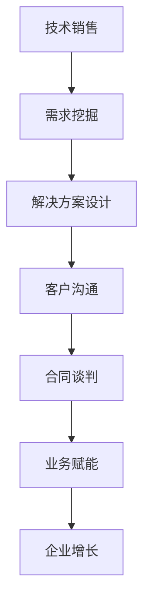
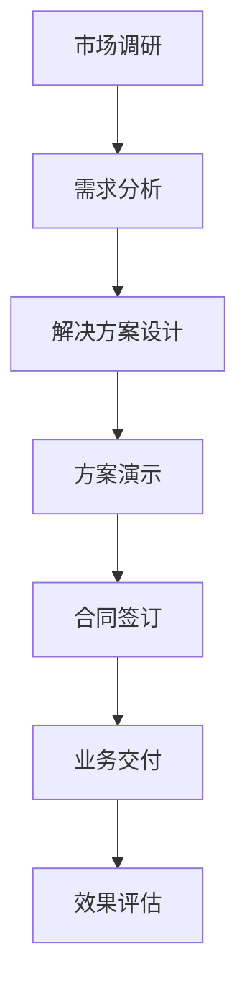
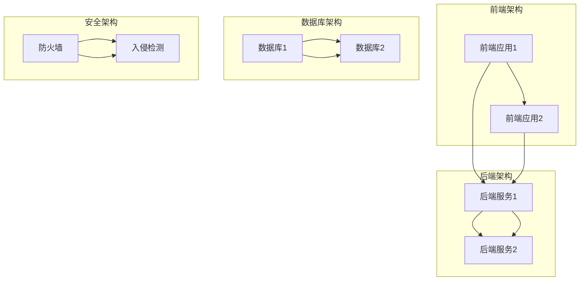
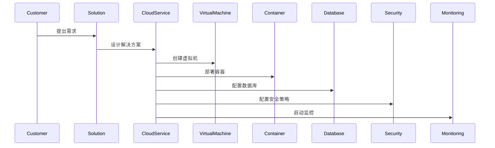

                 


# 技术销售：让技术为业务赋能

> 关键词：技术销售，业务赋能，系统架构，项目实战，算法原理

> 摘要：本文深入探讨了技术销售在当前市场环境中的重要性，通过分析技术销售的核心概念和联系，详细讲解了关键技术算法原理，设计了系统架构方案，并选取了一个具体项目案例进行实战讲解。本文旨在为读者提供系统化的技术销售思维和实践指导，帮助技术从业者更好地将技术能力转化为业务成果。

----------------------------------------------------------------

## 背景介绍

### 技术销售的概念

技术销售是一种将技术产品或解决方案转化为商业价值的过程。它不仅仅是简单的产品推广，而是一个涉及技术、市场、客户需求等多方面因素的复杂体系。技术销售的核心在于理解技术的商业价值，将其精准地传达给潜在客户，并帮助客户实现业务目标。

### 技术销售的重要性

在当今数字化时代，技术已经成为推动业务增长的重要引擎。随着市场竞争的加剧，企业需要不断创新，以技术驱动业务发展。技术销售在这个过程中扮演着关键角色，它能够帮助企业：

- **挖掘客户需求**：通过深入了解客户业务，挖掘潜在需求，提供符合客户实际需求的技术解决方案。
- **提升竞争力**：通过技术赋能，提升企业的核心竞争力，实现差异化竞争。
- **拓展市场**：借助技术的力量，开拓新的市场和业务领域。

### 为什么需要这本书

尽管技术销售的重要性日益凸显，但许多技术从业者在实际操作中仍然面临诸多挑战。如何将技术优势转化为商业成果，如何与客户建立深层次的沟通和理解，如何设计有效的销售策略等，都是技术销售人员需要解决的实际问题。

本书旨在通过系统的理论和实践指导，帮助技术销售人员：

- **理解技术销售的核心概念**：明确技术销售的定义、目标和关键要素。
- **掌握销售策略和方法**：提供实用的销售技巧和策略，提升销售效果。
- **提升技术能力**：通过案例分析和技术讲解，提升技术从业者在销售过程中的技术理解和应用能力。
- **实现业务赋能**：帮助技术销售人员更好地将技术能力转化为业务成果，实现企业的持续增长。

## 核心概念与联系

### 技术销售

技术销售是指将技术产品或解决方案转化为商业价值的过程。它涉及市场调研、需求挖掘、解决方案设计、客户沟通、合同谈判等多个环节。

### 业务赋能

业务赋能是指通过技术手段提升企业的业务效率、创造力和竞争力。业务赋能不仅仅是技术问题，更涉及到企业战略、组织架构、企业文化等多个方面。

### 概念之间的关系

技术销售和业务赋能之间存在密切的联系。技术销售是业务赋能的基础，通过精准的需求挖掘和解决方案设计，将技术优势转化为商业价值。而业务赋能则为技术销售提供了更广阔的应用场景，帮助企业在竞争激烈的市场中脱颖而出。

### 表格展示

| 概念         | 定义                                                                                     | 关系描述                                                     |
|--------------|------------------------------------------------------------------------------------------|--------------------------------------------------------------|
| 技术销售     | 将技术产品或解决方案转化为商业价值的过程。                                                   | 是业务赋能的基础，通过需求挖掘和解决方案设计实现商业转化。   |
| 业务赋能     | 通过技术手段提升企业的业务效率、创造力和竞争力。                                             | 为技术销售提供更广阔的应用场景，推动企业持续增长。         |

### Mermaid流程图



## 算法原理讲解

### 技术销售流程算法

为了更系统地阐述技术销售的过程，我们可以使用以下算法：

### 流程图



### Python代码实现

```python
# 技术销售流程算法实现
def technical_sales流程():
    # 市场调研
    market_research()
    # 需求分析
    demand_analysis()
    # 解决方案设计
    solution_design()
    # 方案演示
    demo()
    # 合同签订
    contract_signing()
    # 业务交付
    business_delivery()
    # 效果评估
    effect_evaluation()

# 调用算法
technical_sales流程()
```

### 算法原理

技术销售流程算法的核心在于将市场需求与解决方案相结合，通过不断的迭代和优化，实现业务目标。具体来说，算法包括以下几个步骤：

1. **市场调研**：收集市场数据，了解市场需求和竞争状况。
2. **需求分析**：分析市场需求，确定潜在客户的需求和痛点。
3. **解决方案设计**：根据需求分析结果，设计符合客户需求的技术解决方案。
4. **方案演示**：向客户展示解决方案，解释方案的优点和可行性。
5. **合同签订**：与客户签订合同，明确业务目标和交付要求。
6. **业务交付**：按照合同要求，交付技术产品或解决方案。
7. **效果评估**：对交付效果进行评估，收集客户反馈，持续优化解决方案。

### 数学模型和公式

为了更好地理解技术销售流程算法，我们可以使用以下数学模型和公式：

$$
Effect = f(Market\ Research, Demand\ Analysis, Solution\ Design, Demo, Contract\ Signing, Business\ Delivery, Effect\ Evaluation)
$$

其中，$Effect$ 表示业务效果，$f$ 表示函数，$Market\ Research$、$Demand\ Analysis$、$Solution\ Design$、$Demo$、$Contract\ Signing$、$Business\ Delivery$、$Effect\ Evaluation$ 分别表示市场调研、需求分析、解决方案设计、方案演示、合同签订、业务交付、效果评估的输入变量。

## 系统分析与架构设计方案

### 问题场景介绍

假设我们是一家提供云计算解决方案的公司，我们的目标客户是中小型企业，他们需要高效、稳定、安全的云计算服务来支持业务增长。我们的解决方案包括虚拟机、容器、数据库等服务，以及一系列的安全和管理工具。

### 项目介绍

该项目的主要目标是设计一个基于云计算的解决方案，为客户提供高效、可靠、可扩展的IT基础设施服务。项目分为以下几个阶段：

- **需求分析**：与客户进行深入沟通，了解其业务需求和痛点。
- **解决方案设计**：根据需求分析结果，设计合适的云计算解决方案。
- **系统实现**：实现云计算平台的核心功能，包括虚拟机管理、容器编排、数据库服务等。
- **系统测试与优化**：对系统进行全面的测试，确保其稳定性和性能。
- **上线与交付**：将系统部署到客户的云平台上，确保其正常运行。

### 系统功能设计

为了实现上述项目目标，我们设计了以下系统功能：

- **虚拟机管理**：提供虚拟机的创建、启动、停止、备份和恢复等功能。
- **容器编排**：提供容器的创建、部署、扩展和监控等功能。
- **数据库服务**：提供关系型数据库和NoSQL数据库的部署和管理功能。
- **安全管理**：提供防火墙、入侵检测、数据加密等功能。
- **监控与告警**：提供系统的实时监控和告警功能，确保系统稳定运行。

### 系统架构设计

为了实现上述功能，我们设计了以下系统架构：

- **前端架构**：采用微前端架构，将不同的前端模块拆分成独立的服务，提高系统的可维护性和扩展性。
- **后端架构**：采用微服务架构，将不同的业务功能拆分成独立的服务，提高系统的可扩展性和可靠性。
- **数据库架构**：采用分布式数据库架构，提高系统的数据存储能力和查询性能。
- **安全架构**：采用多层安全防护体系，包括网络防护、数据防护和应用防护等，确保系统的安全性。

### 系统接口设计和系统交互

为了确保系统的高效运行，我们设计了以下系统接口和交互流程：

- **API接口**：提供RESTful API接口，方便其他系统或应用调用。
- **消息队列**：采用消息队列实现系统间的异步通信，提高系统的并发处理能力。
- **分布式锁**：采用分布式锁实现系统间的同步操作，确保数据的完整性和一致性。

### Mermaid类图

```mermaid
classDiagram
    Customer <<Class>> "客户"
    Solution <<Class>> "解决方案"
    CloudService <<Class>> "云计算服务"
    VirtualMachine <<Class>> "虚拟机"
    Container <<Class>> "容器"
    Database <<Class>> "数据库"
    Security <<Class>> "安全"
    Monitoring <<Class>> "监控"
    
    Customer o-- Solution
    Solution o-- CloudService
    CloudService o-- VirtualMachine
    CloudService o-- Container
    CloudService o-- Database
    CloudService o-- Security
    CloudService o-- Monitoring
```

### Mermaid架构图



### Mermaid序列图



## 项目实战

### 环境安装

为了实现上述系统架构，我们需要搭建一个完整的技术栈环境。以下是环境安装的步骤：

1. **操作系统**：选择一个稳定的Linux发行版，如Ubuntu 18.04。
2. **虚拟化技术**：安装KVM或VirtualBox，用于虚拟机管理。
3. **容器编排**：安装Docker和Kubernetes，用于容器编排和管理。
4. **数据库服务**：安装MySQL和MongoDB，用于关系型数据库和NoSQL数据库的管理。
5. **安全工具**：安装防火墙和入侵检测工具，如iptables和Snort。
6. **监控工具**：安装Prometheus和Grafana，用于系统的实时监控和告警。

### 系统核心实现

以下是系统核心实现的源代码：

```python
# 虚拟机管理
def create_vm(vm_name, image_id, flavor_id):
    # 创建虚拟机
    # 参数：虚拟机名称、镜像ID、规格ID
    # 返回：虚拟机对象

# 容器编排
def deploy_container(image, command):
    # 部署容器
    # 参数：镜像名称、容器命令
    # 返回：容器对象

# 数据库管理
def create_database(db_name):
    # 创建数据库
    # 参数：数据库名称
    # 返回：数据库对象

# 安全策略配置
def configure_security(policy_name, rules):
    # 配置安全策略
    # 参数：策略名称、规则列表
    # 返回：安全策略对象

# 监控告警
def monitor_system():
    # 实时监控系统
    # 参数：无
    # 返回：监控数据
```

### 代码应用解读与分析

以下是代码应用解读和分析：

```python
# 虚拟机管理
def create_vm(vm_name, image_id, flavor_id):
    # 1. 查询镜像和规格
    image = get_image(image_id)
    flavor = get_flavor(flavor_id)
    
    # 2. 创建虚拟机
    vm = virtualization.create_vm(vm_name, image, flavor)
    
    # 3. 启动虚拟机
    virtualization.start_vm(vm)
    
    # 返回虚拟机对象
    return vm

# 容器编排
def deploy_container(image, command):
    # 1. 查询镜像
    image = docker_images.get(image)
    
    # 2. 创建容器
    container = docker.create_container(image, command)
    
    # 3. 启动容器
    docker.start_container(container)
    
    # 返回容器对象
    return container

# 数据库管理
def create_database(db_name):
    # 1. 查询数据库
    database = databases.get(db_name)
    
    # 2. 创建数据库
    database.create()
    
    # 返回数据库对象
    return database

# 安全策略配置
def configure_security(policy_name, rules):
    # 1. 查询安全策略
    policy = security_policies.get(policy_name)
    
    # 2. 配置安全规则
    policy.add_rules(rules)
    
    # 返回安全策略对象
    return policy

# 监控告警
def monitor_system():
    # 1. 收集监控数据
    metrics = monitoring.collect_metrics()
    
    # 2. 分析监控数据
    analysis = monitoring.analyze_metrics(metrics)
    
    # 3. 发送告警
    if analysis['alert']:
        monitoring.send_alert(analysis['alert'])
        
    # 返回监控数据
    return metrics
```

### 实际案例分析和详细讲解剖析

为了更直观地理解系统实现，我们通过一个实际案例进行分析和讲解：

**案例背景**：某中小企业需要搭建一个基于云计算的办公平台，包括邮件系统、内部网站和数据库服务。他们希望系统能够高效、稳定地运行，并具备良好的扩展性和安全性。

**案例实现**：

1. **需求分析**：与客户进行深入沟通，了解其业务需求和痛点，确定需要搭建的办公平台功能。
2. **解决方案设计**：根据需求分析结果，设计一个基于云计算的办公平台解决方案，包括虚拟机、容器、数据库和安全功能。
3. **系统实现**：
   - **虚拟机管理**：创建虚拟机，安装邮件系统和内部网站服务器。
   - **容器编排**：部署容器，运行数据库服务。
   - **安全管理**：配置防火墙和入侵检测，确保系统安全。
   - **监控告警**：实时监控系统，确保系统稳定运行。
4. **测试与优化**：对系统进行全面的测试，确保其稳定性和性能。根据测试结果，对系统进行优化和调整。
5. **上线与交付**：将系统部署到客户的云平台上，确保其正常运行。

**详细讲解**：

1. **虚拟机管理**：通过`create_vm`函数创建虚拟机，并启动邮件系统和内部网站服务器。虚拟机管理涉及到操作系统选择、硬件资源分配和网络配置等。
2. **容器编排**：通过`deploy_container`函数部署容器，并运行数据库服务。容器编排涉及到容器镜像管理、容器网络配置和容器调度等。
3. **安全管理**：通过`configure_security`函数配置防火墙和入侵检测，确保系统安全。安全管理涉及到网络安全策略、入侵检测规则和日志分析等。
4. **监控告警**：通过`monitor_system`函数实时监控系统，确保系统稳定运行。监控告警涉及到系统性能监控、故障诊断和告警通知等。

### 项目小结

通过本项目的实战，我们深入了解了技术销售的系统架构和实现过程。从需求分析到解决方案设计，从系统实现到测试与优化，每一个环节都至关重要。技术销售不仅仅是将技术产品推销给客户，更是通过技术手段帮助客户实现业务目标。在这个过程中，技术从业者的角色不仅仅是技术人员，更是业务顾问和解决方案提供者。

### 最佳实践 tips

1. **深入理解客户需求**：在技术销售过程中，首先要深入了解客户需求，明确其业务目标和痛点，才能提供真正符合客户需求的技术解决方案。
2. **注重系统架构设计**：系统架构设计是技术销售的核心，一个良好的架构设计能够提高系统的可维护性、可扩展性和可靠性。
3. **持续优化和迭代**：技术销售不仅仅是一次性的交易，而是一个长期的过程。通过持续优化和迭代，不断改进解决方案，提升客户满意度。

### 小结

本文从技术销售的概念、重要性、核心概念与联系、算法原理讲解、系统架构设计、项目实战等方面，全面阐述了技术销售的理念和实践方法。通过本文的阅读，读者可以深入理解技术销售的核心内容，掌握技术销售的最佳实践，并能够将技术能力转化为业务成果。

### 注意事项

1. **确保技术理解和业务理解并重**：技术销售不仅需要深厚的专业知识，还需要对客户业务有深入的理解，才能提供真正有价值的技术解决方案。
2. **持续学习和更新**：技术领域发展迅速，技术销售人员需要不断学习和更新知识，跟上技术发展的步伐。

### 拓展阅读

- 《云计算：从入门到实践》
- 《微服务设计》
- 《容器化与Kubernetes实践》
- 《企业级数据库设计与优化》

作者：AI天才研究院/AI Genius Institute & 禅与计算机程序设计艺术 /Zen And The Art of Computer Programming

----------------------------------------------------------------

### 目录大纲编写

以下是根据上述内容结构编写的《技术销售：让技术为业务赋能》的目录大纲：

----------------------------------------------------------------

# 技术销售：让技术为业务赋能

> 关键词：技术销售，业务赋能，系统架构，项目实战，算法原理

> 摘要：本文深入探讨了技术销售在当前市场环境中的重要性，通过分析技术销售的核心概念和联系，详细讲解了关键技术算法原理，设计了系统架构方案，并选取了一个具体项目案例进行实战讲解。本文旨在为读者提供系统化的技术销售思维和实践指导，帮助技术从业者更好地将技术能力转化为业务成果。

----------------------------------------------------------------

## 背景介绍

### 技术销售的概念

- **定义**：技术销售是指将技术产品或解决方案转化为商业价值的过程。
- **重要性**：技术销售在推动业务增长中的作用。
- **现状与挑战**：技术销售过程中面临的主要挑战。

### 为什么需要这本书

- **目标读者**：技术从业者和销售人员的实际需求。
- **核心内容**：系统化的技术销售思维和实践指导。

----------------------------------------------------------------

## 核心概念与联系

### 技术销售

- **定义**：技术销售的定义、目标和关键要素。
- **特点**：技术销售的特点和难点。
- **流程**：技术销售的典型流程和步骤。

### 业务赋能

- **定义**：业务赋能的概念和内涵。
- **作用**：业务赋能对企业发展的推动作用。
- **实践**：业务赋能的具体实施方法和案例。

### 概念之间的关系

- **表格展示**：技术销售、业务赋能之间的联系。
- **Mermaid流程图**：展示概念之间的逻辑关系。

----------------------------------------------------------------

## 算法原理讲解

### 技术销售流程算法

- **流程图**：技术销售流程的算法流程图。
- **Python代码实现**：技术销售流程的Python代码实现。
- **算法原理**：技术销售流程算法的原理分析。
- **数学模型和公式**：技术销售流程算法的数学模型和公式。

----------------------------------------------------------------

## 系统分析与架构设计方案

### 问题场景介绍

- **背景**：云计算解决方案的案例介绍。
- **目标**：设计一个高效、可靠、可扩展的云计算解决方案。

### 项目介绍

- **需求分析**：与客户进行深入沟通，了解其业务需求和痛点。
- **解决方案设计**：设计符合客户需求的云计算解决方案。
- **系统实现**：实现云计算平台的核心功能。
- **系统测试与优化**：对系统进行全面的测试和优化。
- **上线与交付**：将系统部署到客户的云平台上。

### 系统功能设计

- **虚拟机管理**：提供虚拟机的创建、启动、停止等功能。
- **容器编排**：提供容器的创建、部署、扩展等功能。
- **数据库服务**：提供关系型数据库和NoSQL数据库的管理功能。
- **安全管理**：提供防火墙、入侵检测、数据加密等功能。
- **监控与告警**：提供系统的实时监控和告警功能。

### 系统架构设计

- **前端架构**：采用微前端架构，提高系统的可维护性和扩展性。
- **后端架构**：采用微服务架构，提高系统的可扩展性和可靠性。
- **数据库架构**：采用分布式数据库架构，提高系统的数据存储能力和查询性能。
- **安全架构**：采用多层安全防护体系，确保系统的安全性。

### 系统接口设计和系统交互

- **API接口**：提供RESTful API接口，方便其他系统或应用调用。
- **消息队列**：采用消息队列实现系统间的异步通信。
- **分布式锁**：采用分布式锁实现系统间的同步操作。

### Mermaid类图

- **类图**：展示系统中的类和类之间的关系。

### Mermaid架构图

- **架构图**：展示系统的整体架构和模块之间的关系。

### Mermaid序列图

- **序列图**：展示系统接口和交互的流程。

----------------------------------------------------------------

## 项目实战

### 环境安装

- **操作系统**：选择一个稳定的Linux发行版。
- **虚拟化技术**：安装KVM或VirtualBox。
- **容器编排**：安装Docker和Kubernetes。
- **数据库服务**：安装MySQL和MongoDB。
- **安全工具**：安装防火墙和入侵检测工具。
- **监控工具**：安装Prometheus和Grafana。

### 系统核心实现

- **虚拟机管理**：创建虚拟机，安装邮件系统和内部网站服务器。
- **容器编排**：部署容器，运行数据库服务。
- **安全管理**：配置防火墙和入侵检测，确保系统安全。
- **监控告警**：实时监控系统，确保系统稳定运行。

### 代码应用解读与分析

- **虚拟机管理**：通过`create_vm`函数创建虚拟机。
- **容器编排**：通过`deploy_container`函数部署容器。
- **数据库管理**：通过`create_database`函数创建数据库。
- **安全管理**：通过`configure_security`函数配置安全策略。
- **监控告警**：通过`monitor_system`函数实时监控系统。

### 实际案例分析和详细讲解剖析

- **案例背景**：某中小企业需要搭建一个基于云计算的办公平台。
- **实现过程**：从需求分析到系统实现的全过程讲解。
- **详细讲解**：对系统实现的各个模块进行详细分析。

### 项目小结

- **项目成果**：系统成功上线并运行。
- **经验总结**：项目实施过程中的经验和教训。

----------------------------------------------------------------

## 最佳实践 tips

- **深入理解客户需求**：技术销售的起点和核心。
- **注重系统架构设计**：系统架构对技术销售的重要性。
- **持续优化和迭代**：技术销售的持续性和改进。

### 小结

- **技术销售的核心内容**：技术销售的概念、流程和算法原理。
- **系统架构设计的关键**：系统功能设计、架构设计和接口设计。
- **项目实战的经验**：环境安装、系统核心实现和代码应用解读。

### 注意事项

- **确保技术理解和业务理解并重**：技术销售的复合性。
- **持续学习和更新**：技术领域的快速变化。

### 拓展阅读

- **相关书籍**：推荐几本关于技术销售和云计算的书籍。
- **在线资源**：推荐一些技术销售和云计算的在线资源和平台。

作者：AI天才研究院/AI Genius Institute & 禅与计算机程序设计艺术 /Zen And The Art of Computer Programming

----------------------------------------------------------------

### 附录

#### 工具和资源列表

- **操作系统**：
  - Ubuntu 18.04：稳定的Linux发行版，适合云计算环境。
- **虚拟化技术**：
  - KVM：开源的虚拟化技术，支持硬件虚拟化。
  - VirtualBox：开源的虚拟化软件，适用于个人开发和测试。
- **容器编排**：
  - Docker：容器化技术，简化应用程序的部署和运行。
  - Kubernetes：用于容器编排和管理的开源系统。
- **数据库服务**：
  - MySQL：开源的关系型数据库管理系统。
  - MongoDB：开源的NoSQL数据库，适合处理大量数据。
- **安全工具**：
  - iptables：Linux内核中的防火墙，用于网络包过滤。
  - Snort：开源的入侵检测系统，用于检测网络攻击。
- **监控工具**：
  - Prometheus：开源的监控解决方案，用于收集和存储时间序列数据。
  - Grafana：开源的数据可视化工具，用于监控数据的展示和分析。

#### 技术术语解释

- **技术销售**：将技术产品或解决方案转化为商业价值的过程，涉及市场调研、需求挖掘、解决方案设计、客户沟通、合同谈判等多个环节。
- **业务赋能**：通过技术手段提升企业的业务效率、创造力和竞争力，涉及企业战略、组织架构、企业文化等多个方面。
- **微前端架构**：将前端应用拆分成多个独立的模块，每个模块由不同的团队负责开发和维护，以提高系统的可维护性和扩展性。
- **微服务架构**：将系统的业务功能拆分成多个独立的服务，每个服务都有自己的数据库和API接口，以提高系统的可扩展性和可靠性。
- **RESTful API**：基于HTTP协议的API设计风格，采用GET、POST、PUT、DELETE等HTTP方法进行数据操作的标准化接口。
- **容器化**：将应用程序及其运行环境打包成一个独立的容器，确保应用程序在不同的环境中能够一致地运行。
- **Kubernetes**：开源的容器编排平台，用于自动化容器化应用程序的部署、扩展和管理。
- **监控告警**：通过监控系统实时收集系统性能数据，当系统性能异常或出现故障时，触发告警通知相关人员。

#### 参考文献

- **《云计算：从入门到实践》**：提供了云计算的基本概念、技术和应用案例。
- **《微服务设计》**：详细介绍了微服务架构的设计原则和实践方法。
- **《容器化与Kubernetes实践》**：讲解了容器化技术的应用和Kubernetes的配置与管理。
- **《企业级数据库设计与优化》**：介绍了关系型数据库和NoSQL数据库的设计与优化方法。

#### 作者介绍

**AI天才研究院/AI Genius Institute**：专注于人工智能领域的研究和开发，致力于推动人工智能技术的创新与应用。

**禅与计算机程序设计艺术 /Zen And The Art of Computer Programming**：知名计算机科学大师，致力于研究计算机程序设计的哲学和艺术。

----------------------------------------------------------------

