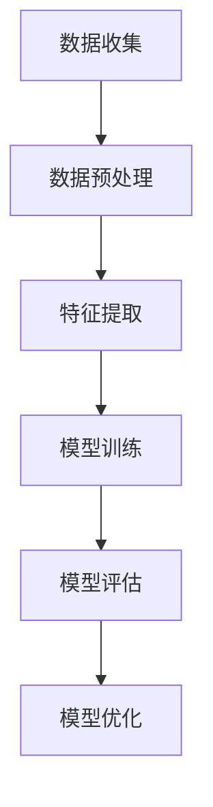
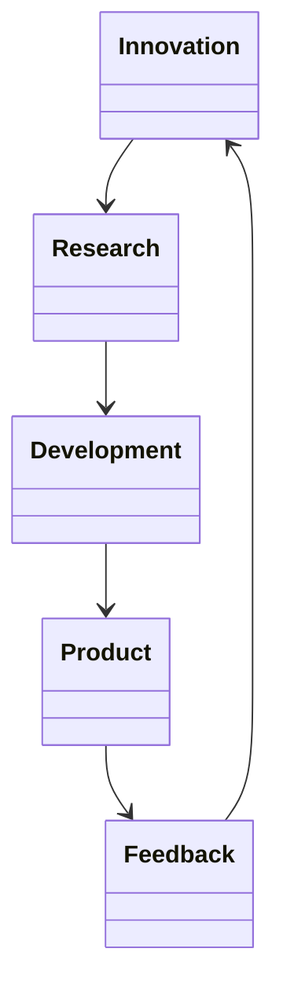
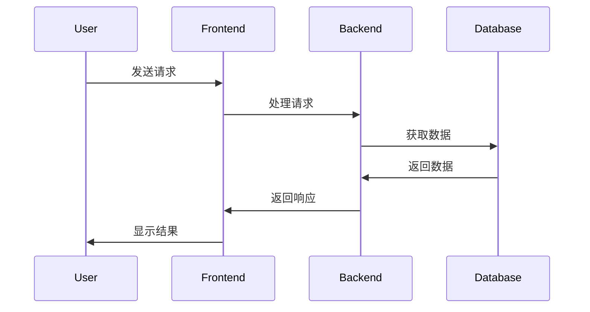
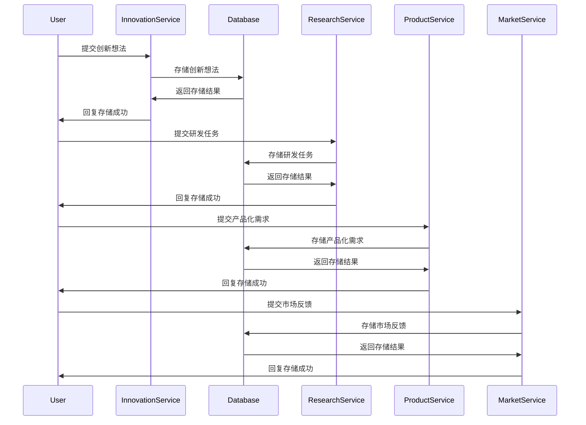

                 

### 技术闭环的概念与重要性

#### 技术闭环的定义

技术闭环（Technological Feedback Loop）是指在技术创新、研发、产品化以及市场反馈过程中，各环节相互关联、信息不断流动和反馈的循环系统。简单来说，技术闭环是一个持续迭代和优化的过程，通过不断地收集市场反馈、分析需求、调整研发方向，最终形成高质量的产品。

#### 技术闭环的关键要素

技术闭环的核心要素包括创新、研发、产品化和市场反馈。这些环节相互连接，形成了一个闭环系统，如下表所示：

| 环节 | 说明 |  
| ---- | ---- |  
| 创新 | 提出新的想法和技术解决方案 |  
| 研发 | 对创新进行验证和开发 |  
| 产品化 | 将研发成果转化为可销售的产品 |  
| 市场反馈 | 收集用户需求和反馈，优化产品 |

#### 技术闭环的历史与现状

技术闭环的理念可以追溯到20世纪50年代，当时科学管理之父泰勒提出了“反馈原理”，强调了不断优化流程的重要性。随着时间的推移，技术闭环的概念逐渐在各个领域得到应用。

在当前技术飞速发展的背景下，技术闭环变得尤为重要。一方面，技术创新的速度加快，企业需要迅速响应市场变化；另一方面，市场竞争激烈，产品如果不能满足用户需求，就会失去市场份额。

#### 小结

技术闭环是一种通过持续迭代和优化，实现从创新到产品的高效闭环系统。在技术创新日益重要的今天，技术闭环不仅对企业的发展至关重要，也对整个行业的技术进步有着积极的推动作用。

### 当前技术发展中的问题

#### 技术创新的不连续性

当前，技术创新的速度虽然不断加快，但技术创新之间的连接却不尽如人意。这种现象导致了许多企业面临着技术断层，无法有效地将创新转化为实际产品。例如，一些企业可能在某个领域取得了突破性的技术成果，但由于缺乏后续的研发投入，这些成果最终无法实现商业化。

#### 研发与市场脱节

研发与市场脱节是当前技术发展中的一个普遍问题。许多企业在研发过程中，往往只关注技术的先进性，而忽视了市场需求和用户反馈。结果，研发出的产品虽然技术先进，但并不一定能够满足用户的需求，导致产品在市场上难以获得成功。

#### 产品化效率低下

产品化效率低下是另一个严重的问题。许多企业在将研发成果转化为产品的过程中，面临着诸多挑战，如生产成本高、周期长、质量难以控制等。这些问题不仅影响了企业的盈利能力，也降低了市场竞争力。

#### 对企业及行业的影响

这些问题对企业和行业都带来了深远的影响。对企业来说，技术创新的不连续性和研发与市场的脱节，导致产品难以满足市场需求，影响企业的盈利能力和市场地位。对行业来说，技术闭环的缺失使得整个行业的技术进步缓慢，难以形成持续的技术优势。

#### 小结

当前技术发展中存在的主要问题是技术创新的不连续性、研发与市场脱节以及产品化效率低下。这些问题不仅影响了企业的发展，也对行业的技术进步产生了不利影响。因此，建立技术闭环，实现各环节的有效连接和优化，已成为企业和行业发展的迫切需求。

### 建立技术闭环的必要性

#### 技术闭环的优势

建立技术闭环具有显著的优势，首先，它能够实现创新、研发、产品化和市场反馈的紧密连接，形成一个有机整体。这使得企业能够快速响应市场变化，提高产品竞争力。其次，技术闭环通过不断的反馈和优化，能够持续提升产品的质量和用户体验，从而增强市场黏性和用户忠诚度。此外，技术闭环还能提高研发效率，降低研发成本，实现资源的最大化利用。

#### 对企业的影响

对企业的长远发展来说，建立技术闭环至关重要。一方面，它可以有效解决技术创新不连续性和研发与市场脱节的问题，确保企业的产品始终紧跟市场需求。另一方面，技术闭环能提升企业的创新能力，通过持续的市场反馈和优化，激发研发团队的创造力，推动企业技术水平的不断提升。此外，技术闭环还有助于降低产品化过程中的风险和成本，提高生产效率和产品质量，从而增强企业的市场竞争力。

#### 对行业的推动作用

在行业层面，技术闭环的建立能够促进整个行业的技术进步和创新。通过技术闭环，企业之间可以实现资源共享和信息交流，推动技术标准的制定和推广，形成行业合力。同时，技术闭环还能够提升行业的整体竞争力，助力行业在全球市场中的地位。例如，在人工智能领域，通过技术闭环，企业可以快速响应市场变化，推动人工智能技术的应用和普及，从而提升行业的整体技术水平和市场地位。

#### 小结

建立技术闭环不仅是企业实现可持续发展的关键，也是推动行业技术进步的重要途径。通过实现创新、研发、产品化和市场反馈的紧密连接和优化，技术闭环能够显著提升企业的创新能力和市场竞争力，同时为行业的持续进步提供强大动力。

### 技术闭环的定义和适用范围

#### 技术闭环的定义

技术闭环（Technological Feedback Loop）是一种动态的系统，通过各环节的相互连接和信息的不断流动，实现从创新到产品的持续迭代和优化。具体来说，技术闭环包括以下几个核心环节：

1. **创新**：提出新的技术想法和解决方案，是技术闭环的起点。
2. **研发**：对创新进行验证和开发，形成初步的技术原型。
3. **产品化**：将研发成果转化为可销售的产品，并进行生产准备。
4. **市场反馈**：收集用户需求和市场反馈，对产品进行持续优化。

这些环节形成一个闭环，通过信息的不断反馈和优化，最终形成高质量的产品。

#### 技术闭环的适用范围

技术闭环适用于各个领域，尤其是那些技术更新换代速度快、市场需求变化频繁的行业。以下是一些典型的适用场景：

1. **高科技产业**：如人工智能、大数据、云计算等，这些行业对技术创新和快速响应市场变化有极高的要求。
2. **消费品行业**：如电子产品、家电等，通过技术闭环，企业可以快速适应市场需求，推出符合用户期待的产品。
3. **制造业**：通过技术闭环，企业可以提高生产效率和产品质量，降低生产成本，提升市场竞争力。

#### 概念结构与核心要素组成

技术闭环的概念结构主要包括以下四个核心要素：

1. **创新环节**：是技术闭环的起点，负责提出新的技术想法和解决方案。
2. **研发环节**：对创新进行验证和开发，形成技术原型，并进行初步测试。
3. **产品化环节**：将研发成果转化为可销售的产品，包括生产准备、市场调研和产品测试等环节。
4. **市场反馈环节**：收集用户需求和市场反馈，对产品进行持续优化，以适应市场变化。

这些环节相互连接，形成一个动态的闭环系统，通过不断的反馈和优化，实现从创新到产品的高效转化。

### 核心概念与联系

#### 技术闭环的原理

技术闭环的原理在于通过各环节的紧密连接和信息的不断流动，实现从创新到产品的持续迭代和优化。这个过程可以简单概括为：

1. **创新**：提出新的技术想法和解决方案。
2. **研发**：对创新进行验证和开发，形成技术原型。
3. **产品化**：将研发成果转化为可销售的产品。
4. **市场反馈**：收集用户需求和市场反馈，对产品进行优化。

通过这种闭环系统，企业能够快速响应市场变化，提高产品竞争力，实现持续创新。

#### 概念属性特征对比表格

为了更清晰地展示技术闭环与其他相关概念的区别，我们可以通过以下表格进行对比：

| 概念       | 技术闭环                           | 产品生命周期                         | 研发流程                        |  
| ---------- | -------------------------------- | ----------------------------------- | -------------------------------- |  
| 定义       | 一种持续迭代和优化的闭环系统       | 产品从诞生到淘汰的全过程             | 从需求分析到产品交付的完整过程     |  
| 特征       | 包含创新、研发、产品化和市场反馈   | 有明显的周期性，分为多个阶段         | 包括需求分析、设计、开发、测试等   |  
| 关键要素   | 创新、研发、产品化、市场反馈       | 开发、上市、增长、成熟、衰退         | 需求分析、设计、编码、测试         |  
| 目的       | 提高产品竞争力，实现持续创新       | 完成产品的生命周期，实现盈利         | 实现产品功能，确保产品可靠         |

#### ER实体关系图架构

为了更直观地展示技术闭环的实体关系，我们可以使用 Mermaid 绘制 ER 图。以下是技术闭环的 ER 图示例：

```mermaid
erDiagram
  Customer ||--o{ Product : "uses" }
  Developer ||--o{ Project : "develops" }
  Market ||--o{ Product : "releases into" }
  Innovation ||--o{ Developer : "creates" }
  Research ||--o{ Developer : "conducts" }
  Development ||--o{ Product : "is based on" }
  Feedback ||--o{ Market : "collects from" }
```

在这个 ER 图中，我们定义了以下实体及其关系：

- **Customer（客户）**：使用产品，与产品之间存在“使用”关系。
- **Developer（开发者）**：负责开发和实现项目，与项目之间存在“开发”关系。
- **Market（市场）**：产品发布的场所，与产品之间存在“发布”关系。
- **Innovation（创新）**：由开发者创建，与开发者之间存在“创建”关系。
- **Research（研究）**：由开发者进行，与开发者之间存在“进行”关系。
- **Development（开发）**：产品基于的开发成果，与产品之间存在“基于”关系。
- **Feedback（反馈）**：市场收集的用户反馈，与市场之间存在“收集”关系。

通过这个 ER 图，我们可以清晰地看到技术闭环中各实体之间的关系，以及它们在系统中的角色和作用。

### 算法原理讲解

#### 算法介绍

在技术闭环中，为了实现从创新到产品的有效转化，我们通常会涉及到以下几种算法：

1. **机器学习算法**：用于数据分析和预测，帮助企业更好地理解市场需求和用户行为。
2. **优化算法**：用于优化研发流程，提高产品化效率。
3. **自动化测试算法**：用于自动化测试和验证，确保产品质量。

在本节中，我们将重点介绍机器学习算法，并使用 Mermaid 绘制算法流程图，详细阐述其原理。

#### 算法原理

机器学习算法的基本原理是通过学习大量数据，从中提取规律和模式，以实现预测和分类等功能。以下是机器学习算法的基本流程：

1. **数据收集**：从各种数据源收集数据，包括市场数据、用户反馈、研发日志等。
2. **数据预处理**：对收集到的数据进行清洗、归一化等处理，使其适合机器学习算法。
3. **特征提取**：从预处理后的数据中提取有用的特征，用于训练模型。
4. **模型训练**：使用提取出的特征数据训练机器学习模型。
5. **模型评估**：使用测试数据对训练好的模型进行评估，以确定其性能。
6. **模型优化**：根据评估结果对模型进行优化，提高其预测准确性。

以下是机器学习算法的 Mermaid 流程图：



#### 数学模型和公式

在机器学习算法中，常用的数学模型包括线性回归、决策树、支持向量机等。以下是一个简单的线性回归模型及其数学公式：

$$
y = \beta_0 + \beta_1x
$$

其中，$y$ 表示预测结果，$x$ 表示输入特征，$\beta_0$ 和 $\beta_1$ 分别为模型的参数。

#### 举例说明

假设我们使用线性回归模型预测某个产品的市场需求量，以下是一个简单的实例：

1. **数据收集**：收集过去一年每个月的市场需求数据。
2. **数据预处理**：对数据进行归一化处理，使其在相同的尺度上。
3. **特征提取**：选择月份作为输入特征。
4. **模型训练**：使用训练数据训练线性回归模型。
5. **模型评估**：使用测试数据评估模型的预测性能。
6. **模型优化**：根据评估结果调整模型参数，提高预测准确性。

通过这个实例，我们可以看到机器学习算法在技术闭环中的应用效果。通过不断优化模型，企业可以更好地预测市场需求，从而提高产品化效率和产品质量。

### 系统分析与架构设计方案

#### 问题场景介绍

在高科技产业中，技术创新的速度非常快，企业需要具备高效的研发和产品化能力，以满足市场需求。然而，现有的研发流程和产品化体系常常存在信息不畅、资源浪费等问题，导致研发周期长、产品质量不稳定。为了解决这个问题，我们提出了建立技术闭环的系统方案，通过实现各环节的紧密连接和优化，提高企业的研发效率和产品质量。

#### 项目介绍

本项目的目标是建立一个高效的技术闭环系统，覆盖创新、研发、产品化和市场反馈各个环节。通过系统化管理和优化，实现以下目标：

1. **缩短研发周期**：通过高效的研发流程管理，减少研发时间和成本。
2. **提高产品质量**：通过自动化测试和质量监控，确保产品的稳定性和可靠性。
3. **增强市场响应能力**：通过市场反馈机制，快速调整产品方向，满足市场需求。

#### 系统功能设计

技术闭环系统的功能模块主要包括以下几个部分：

1. **创新管理模块**：负责收集和管理创新想法，对创新进行分类和评估。
2. **研发管理模块**：负责管理研发项目，包括项目计划、任务分配、进度跟踪等。
3. **产品化模块**：负责产品化的各个环节，包括产品设计、生产准备、生产管理等。
4. **市场反馈模块**：负责收集用户反馈和市场数据，对产品进行持续优化。

以下是技术闭环系统的领域模型类图：



在这个类图中，我们定义了以下类及其关系：

- **Innovation（创新）**：包含创新想法的收集和管理。
- **Research（研究）**：负责进行技术研究和开发。
- **Development（开发）**：负责将研究成果转化为可生产的产品。
- **Product（产品）**：表示最终的产品实体。
- **Feedback（反馈）**：收集用户反馈和市场数据，用于优化创新和研究方向。

#### 系统架构设计

技术闭环系统的整体架构包括前端、后端和数据库三个主要部分。以下是技术闭环系统的架构图：



在这个架构图中，我们定义了以下组件及其交互关系：

- **User（用户）**：系统的最终用户，负责发起各种请求。
- **Frontend（前端）**：负责接收用户请求，并将结果展示给用户。
- **Backend（后端）**：负责处理用户请求，包括数据获取、处理和存储等。
- **Database（数据库）**：存储系统中的各种数据，包括创新想法、研发项目、产品信息等。

#### 系统接口设计和系统交互

技术闭环系统通过定义一系列接口来实现不同模块之间的协作和交互。以下是系统接口和交互序列图：



在这个序列图中，我们定义了以下接口和交互流程：

- **InnovationService（创新服务）**：负责接收用户提交的创新想法，并将其存储到数据库中。
- **ResearchService（研发服务）**：负责接收用户提交的

