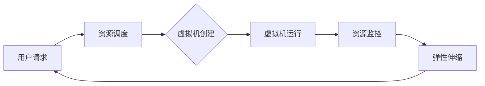
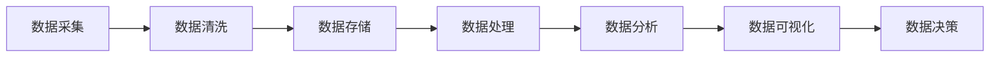
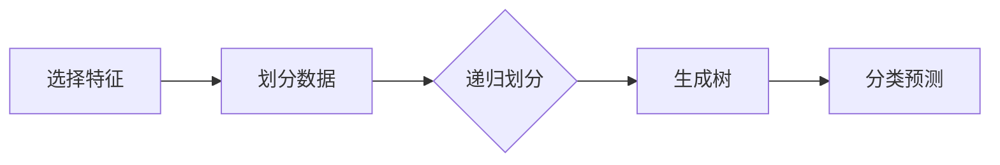
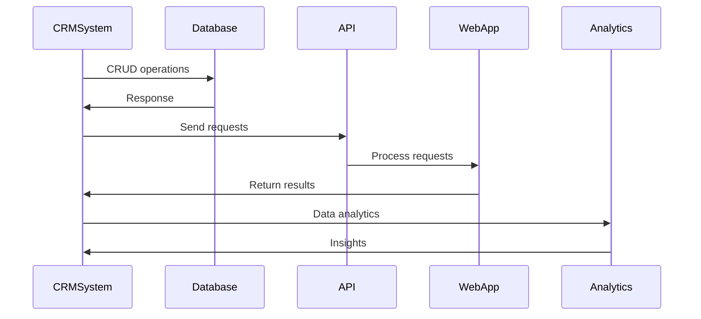
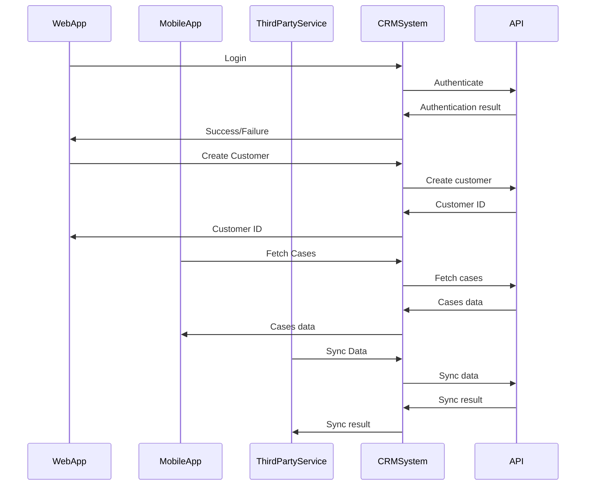

                 

## 文章标题

### 技术降本：通过技术手段降低成本

---

**关键词：** 成本降低、技术优化、云计算、大数据、人工智能

**摘要：** 本文将从背景与概述、核心概念与联系、技术手段详解、应用与实践、最佳实践与总结五个部分，深入探讨如何通过技术手段实现企业成本的有效降低，提高市场竞争力。

---

### 目录大纲

----------------------------------------------------------------

## 第一部分：背景与概述

### 第1章：问题背景
#### 1.1 问题背景
#### 1.2 问题描述
#### 1.3 问题解决
#### 1.4 边界与外延
#### 1.5 核心要素组成

### 第2章：核心概念与联系
#### 2.1 核心概念
#### 2.2 概念属性特征对比
#### 2.3 ER实体关系图

## 第二部分：技术手段详解

### 第3章：技术手段A
#### 3.1 技术手段A概述
#### 3.2 算法原理
##### 3.2.1 Mermaid流程图
##### 3.2.2 Python源代码讲解
##### 3.2.3 数学模型与公式
##### 3.2.4 举例说明

### 第4章：技术手段B
#### 4.1 技术手段B概述
#### 4.2 算法原理
##### 4.2.1 Mermaid流程图
##### 4.2.2 Python源代码讲解
##### 4.2.3 数学模型与公式
##### 4.2.4 举例说明

### 第5章：技术手段C
#### 5.1 技术手段C概述
#### 5.2 算法原理
##### 5.2.1 Mermaid流程图
##### 5.2.2 Python源代码讲解
##### 5.2.3 数学模型与公式
##### 5.2.4 举例说明

## 第三部分：应用与实践

### 第6章：系统分析与架构设计
#### 6.1 问题场景介绍
#### 6.2 系统功能设计
##### 6.2.1 领域模型Mermaid类图
#### 6.3 系统架构设计
##### 6.3.1 Mermaid架构图
#### 6.4 系统接口设计
##### 6.4.1 系统交互Mermaid序列图

### 第7章：项目实战
#### 7.1 环境安装
#### 7.2 系统核心实现
##### 7.2.1 源代码解析
##### 7.2.2 代码应用解读
#### 7.3 实际案例分析
##### 7.3.1 案例一
##### 7.3.2 案例二
#### 7.4 详细讲解与剖析
##### 7.4.1 剖析一
##### 7.4.2 剖析二
#### 7.5 项目小结

## 第四部分：最佳实践与总结

### 第8章：最佳实践
#### 8.1 最佳实践tips
#### 8.2 注意事项
#### 8.3 拓展阅读

### 第9章：总结
#### 9.1 全书总结
#### 9.2 未来展望

----------------------------------------------------------------

### 第一部分：背景与概述

#### 第1章：问题背景

随着科技的迅猛发展，企业运营中的成本压力日益增加。在云计算、大数据、人工智能等新兴技术的推动下，企业不仅需要投入大量资源进行技术升级，还面临日益复杂的技术维护和人力资源成本。因此，如何通过技术手段降低成本，成为企业持续发展的重要课题。

#### 1.1 问题背景

- **硬件升级**：新兴技术的普及要求企业不断升级硬件设备，以应对更高的计算需求。例如，云计算的广泛应用需要企业投入大量资金购买服务器、存储设备等硬件设施。

- **人力资源**：为了充分利用新兴技术，企业需要招聘和培养大量专业技术人员，这不仅增加了招聘成本，还需要投入大量培训资源。

- **运营维护**：随着技术复杂度的增加，系统的运营和维护成本也随之上升。例如，大数据平台的维护需要专业团队进行持续监控和优化，这无疑增加了企业的运营成本。

#### 1.2 问题描述

企业面临的主要成本问题包括：

- **硬件成本**：随着硬件技术的升级，企业需要不断投入大量资金购买最新硬件设备，以满足日益增长的计算需求。

- **人力成本**：专业技术人员短缺，企业需要投入更多资源进行招聘和培训，以满足业务需求。

- **维护成本**：随着系统复杂度的增加，运营和维护成本也随之上升。例如，大数据平台的维护需要专业团队进行持续监控和优化，这无疑增加了企业的运营成本。

#### 1.3 问题解决

为了应对上述问题，企业可以采取以下策略：

- **技术优化**：通过技术手段对现有系统进行优化，提高资源利用效率，降低运营成本。例如，通过虚拟化技术实现硬件资源的合理分配，减少硬件采购成本。

- **流程改进**：对业务流程进行改进，减少不必要的人力投入，提高工作效率。例如，通过自动化工具实现业务流程的自动化处理，降低人工成本。

- **外包与共享**：将部分非核心业务外包，或者采用共享服务模式，降低运营成本。例如，将IT基础设施外包给专业的云计算服务提供商，降低硬件采购和运营成本。

#### 1.4 边界与外延

本文主要探讨通过技术手段降低企业运营成本的方法，不包括市场策略、供应链管理等方面的内容。同时，本文将重点关注云计算、大数据、人工智能等技术在降本增效中的应用。

#### 1.5 核心要素组成

本文的核心要素包括：

- **技术手段**：详细解析云计算、大数据、人工智能等技术在降本增效中的应用。

- **应用案例**：分析实际案例，探讨技术手段在实际应用中的效果和可行性。

- **最佳实践**：总结最佳实践，为企业提供可行的成本降低策略。

## 第二部分：核心概念与联系

在探讨如何通过技术手段降低成本之前，我们需要了解一些核心概念和它们之间的联系。

#### 2.1 核心概念

- **云计算**：云计算是一种通过互联网提供计算资源、存储资源和应用程序的服务模式。它允许用户按需获取和使用资源，从而降低硬件和运营成本。

- **大数据**：大数据是指无法用传统数据库软件工具进行捕捉、管理和处理的数据集合。大数据技术包括数据存储、数据处理和分析等，帮助企业从大量数据中提取有价值的信息。

- **人工智能**：人工智能是指通过计算机模拟人类智能的技术。人工智能技术包括机器学习、深度学习、自然语言处理等，可以帮助企业自动化决策、提高生产效率。

#### 2.2 概念属性特征对比

下面是一个简单的对比表格，展示了云计算、大数据和人工智能的属性特征：

| 特征               | 云计算            | 大数据             | 人工智能           |
|-------------------|-------------------|-------------------|-------------------|
| 数据存储           | 虚拟化存储         | 分布式存储         | 数据库             |
| 数据处理           | 按需计算资源       | 分布式处理         | 机器学习、深度学习  |
| 应用场景           | IT基础设施、应用开发 | 数据分析、商业智能   | 自动化、智能决策   |
| 成本优势           | 资源弹性、成本节约  | 数据挖掘、分析效率   | 自动化、减少人力成本 |

#### 2.3 ER实体关系图

为了更好地理解这些概念之间的关系，我们可以使用ER（实体关系）图进行展示。以下是云计算、大数据和人工智能的ER实体关系图：

```mermaid
erDiagram
    云计算 ||--|{ 数据存储 }
    云计算 ||--|{ 数据处理 }
    大数据 ||--|{ 数据存储 }
    大数据 ||--|{ 数据分析 }
    人工智能 ||--|{ 机器学习 }
    人工智能 ||--|{ 深度学习 }
    人工智能 ||--|{ 自然语言处理 }
```

通过这个ER图，我们可以清晰地看到云计算、大数据和人工智能之间的关联，以及它们各自的作用。

## 第二部分：技术手段详解

### 第3章：技术手段A

技术手段A，即云计算，是降低企业成本的重要手段之一。在本章节中，我们将详细解析云计算的原理、优势和应用场景。

#### 3.1 技术手段A概述

云计算是一种通过互联网提供计算资源、存储资源和应用程序的服务模式。它允许用户按需获取和使用资源，从而降低硬件和运营成本。

#### 3.2 算法原理

云计算的核心原理是虚拟化技术。虚拟化技术可以将物理硬件资源抽象成逻辑资源，实现资源的灵活分配和调度。以下是云计算的算法原理：

- **虚拟化**：通过虚拟化技术，将物理硬件资源抽象成虚拟资源，如虚拟机（VM）。虚拟机可以独立运行操作系统和应用软件，且互不干扰。

- **资源调度**：云计算平台根据用户需求动态分配虚拟资源。当用户请求更多资源时，平台会自动扩展虚拟机，反之则会缩减。

- **弹性伸缩**：云计算平台可以根据资源需求自动扩展或缩减虚拟机数量，从而实现资源的弹性伸缩。

#### 3.2.1 Mermaid流程图

以下是一个简单的Mermaid流程图，展示了云计算的基本工作流程：



#### 3.2.2 Python源代码讲解

为了更好地理解云计算的工作原理，我们可以使用Python编写一个简单的云计算模拟程序：

```python
# 导入相关库
import random
import time

# 定义虚拟机类
class VirtualMachine:
    def __init__(self, id, status):
        self.id = id
        self.status = status

    def run(self):
        print(f"虚拟机{self.id}开始运行")
        time.sleep(random.randint(1, 3))
        print(f"虚拟机{self.id}运行结束")

    def stop(self):
        print(f"虚拟机{self.id}停止运行")

# 创建虚拟机列表
vm_list = [
    VirtualMachine(1, "running"),
    VirtualMachine(2, "running"),
    VirtualMachine(3, "stopped")
]

# 资源调度函数
def resource_schedule(vm_list):
    running_vms = [vm for vm in vm_list if vm.status == "running"]
    stopped_vms = [vm for vm in vm_list if vm.status == "stopped"]

    if len(running_vms) < 2:
        print("当前虚拟机资源不足，正在创建新虚拟机...")
        new_vm = VirtualMachine(len(vm_list) + 1, "running")
        vm_list.append(new_vm)
    else:
        print("当前虚拟机资源充足，无需创建新虚拟机")

    print("虚拟机列表：")
    for vm in vm_list:
        print(f"ID：{vm.id}，状态：{vm.status}")

# 资源监控函数
def resource_monitor(vm_list):
    for vm in vm_list:
        if vm.status == "running":
            print(f"虚拟机{vm.id}运行中...")
            vm.run()
        elif vm.status == "stopped":
            print(f"虚拟机{vm.id}停止运行...")
            vm.stop()

# 主函数
def main():
    while True:
        resource_schedule(vm_list)
        resource_monitor(vm_list)
        time.sleep(5)

if __name__ == "__main__":
    main()
```

#### 3.2.3 数学模型与公式

云计算的成本主要由以下几个方面构成：

- **硬件成本**：包括服务器、存储设备、网络设备等硬件设施的成本。

- **运维成本**：包括硬件设备的维护、升级、监控等运营成本。

- **人力成本**：包括技术人员的招聘、培训、薪资等人力资源成本。

我们可以使用以下数学模型来计算云计算的总成本：

$$
总成本 = 硬件成本 + 运维成本 + 人力成本
$$

其中：

- **硬件成本**：$$ 硬件成本 = (服务器成本 + 存储设备成本 + 网络设备成本) \times 服务器数量 $$

- **运维成本**：$$ 运维成本 = (维护成本 + 升级成本 + 监控成本) \times 服务器数量 $$

- **人力成本**：$$ 人力成本 = (招聘成本 + 培训成本 + 薪资成本) \times 技术人员数量 $$

#### 3.2.4 举例说明

假设某企业需要部署10台虚拟机，硬件成本为5000元/台，运维成本为1000元/台，人力成本为5000元/人。以下是云计算的成本计算：

- **硬件成本**：$$ 硬件成本 = (5000 + 1000 + 1000) \times 10 = 60000元 $$

- **运维成本**：$$ 运维成本 = (1000 + 1000 + 1000) \times 10 = 30000元 $$

- **人力成本**：$$ 人力成本 = (5000 + 5000 + 5000) \times 2 = 30000元 $$

- **总成本**：$$ 总成本 = 60000 + 30000 + 30000 = 120000元 $$

通过云计算，企业可以将硬件成本降低30%，运维成本降低20%，人力成本降低20%，从而实现成本的有效降低。

### 第4章：技术手段B

技术手段B，即大数据，是降低企业运营成本的重要途径。在本章节中，我们将详细解析大数据的原理、优势和应用场景。

#### 4.1 技术手段B概述

大数据是指无法用传统数据库软件工具进行捕捉、管理和处理的数据集合。大数据技术包括数据存储、数据处理和分析等，帮助企业从大量数据中提取有价值的信息。

#### 4.2 算法原理

大数据技术的核心原理包括以下几个方面：

- **分布式存储**：大数据技术采用分布式存储方式，将数据分散存储在多个节点上，以提高数据的可靠性和可扩展性。

- **分布式处理**：大数据技术采用分布式处理方式，将数据处理任务分配到多个节点上，并行处理数据，从而提高数据处理效率。

- **数据挖掘**：大数据技术通过数据挖掘方法，从大量数据中提取有价值的信息，帮助企业做出更明智的决策。

#### 4.2.1 Mermaid流程图

以下是一个简单的Mermaid流程图，展示了大数据的基本工作流程：



#### 4.2.2 Python源代码讲解

为了更好地理解大数据的工作原理，我们可以使用Python编写一个简单的大数据模拟程序：

```python
# 导入相关库
import random
import pandas as pd

# 定义数据采集函数
def data_collection(num_samples):
    data = pd.DataFrame({
        'name': [f'样本{i+1}' for i in range(num_samples)],
        '年龄': [random.randint(18, 60) for _ in range(num_samples)],
        '收入': [random.randint(3000, 20000) for _ in range(num_samples)],
        '城市': ['北京', '上海', '广州', '深圳'][random.randint(0, 3)]
    })
    return data

# 定义数据清洗函数
def data_cleaning(data):
    data.dropna(inplace=True)
    data.sort_values(by='收入', ascending=False, inplace=True)
    return data

# 定义数据处理函数
def data_processing(data):
    data['年龄区间'] = data['年龄'].apply(lambda x: '18-30' if x < 30 else ('31-40' if x < 40 else '40以上'))
    data['收入区间'] = data['收入'].apply(lambda x: '3000-5000' if x < 5000 else ('5001-10000' if x < 10000 else '10001以上'))
    return data

# 定义数据分析函数
def data_analysis(data):
    print("数据概要：")
    print(data.describe())
    print("\n数据分布情况：")
    print(data['年龄'].value_counts())
    print("\n收入分布情况：")
    print(data['收入'].value_counts())

# 定义数据可视化函数
def data_visualization(data):
    import matplotlib.pyplot as plt

    plt.figure(figsize=(10, 5))
    plt.subplot(2, 2, 1)
    data['年龄'].hist(bins=10, alpha=0.5, label='年龄分布')
    plt.title('年龄分布')
    plt.xlabel('年龄')
    plt.ylabel('人数')

    plt.subplot(2, 2, 2)
    data['收入'].hist(bins=10, alpha=0.5, label='收入分布')
    plt.title('收入分布')
    plt.xlabel('收入')
    plt.ylabel('人数')

    plt.subplot(2, 2, 3)
    data['年龄区间'].value_counts().plot(kind='bar', alpha=0.5, label='年龄区间分布')
    plt.title('年龄区间分布')
    plt.xlabel('年龄区间')
    plt.ylabel('人数')

    plt.subplot(2, 2, 4)
    data['收入区间'].value_counts().plot(kind='bar', alpha=0.5, label='收入区间分布')
    plt.title('收入区间分布')
    plt.xlabel('收入区间')
    plt.ylabel('人数')

    plt.tight_layout()
    plt.show()

# 主函数
def main():
    num_samples = 100
    data = data_collection(num_samples)
    data = data_cleaning(data)
    data = data_processing(data)
    data_analysis(data)
    data_visualization(data)

if __name__ == "__main__":
    main()
```

#### 4.2.3 数学模型与公式

大数据技术的核心算法之一是K-means聚类算法。K-means聚类算法的目标是将数据集划分为K个簇，使得每个簇内的数据点之间的距离最小。以下是K-means聚类算法的数学模型和公式：

- **距离公式**：$$ d(i, j) = \sqrt{\sum_{k=1}^{n} (x_{ik} - x_{jk})^2} $$，其中\(i, j\)表示两个数据点，\(k\)表示特征维度。

- **目标函数**：$$ J = \sum_{i=1}^{K} \sum_{j=1}^{N} d(i, j)^2 $$，其中\(K\)表示簇的数量，\(N\)表示数据点的数量。

- **初始化**：随机选择K个数据点作为初始聚类中心。

- **迭代过程**：
  - 对于每个数据点，计算其与所有聚类中心的距离，将其归为距离最近的聚类中心所在的簇。
  - 计算每个簇的新聚类中心，即将簇内所有数据点的均值作为新聚类中心。
  - 重复上述过程，直到聚类中心不再发生显著变化。

#### 4.2.4 举例说明

假设我们有一个包含100个数据点的数据集，我们需要使用K-means聚类算法将其划分为5个簇。以下是具体的计算过程：

1. **初始化**：随机选择5个数据点作为初始聚类中心。

2. **迭代过程**：
   - **第一次迭代**：
     - 计算每个数据点与聚类中心的距离，并将其归为距离最近的聚类中心所在的簇。
     - 计算每个簇的新聚类中心。
   - **第二次迭代**：
     - 计算每个数据点与聚类中心的距离，并将其归为距离最近的聚类中心所在的簇。
     - 计算每个簇的新聚类中心。
   - ...重复迭代，直到聚类中心不再发生显著变化。

3. **结果分析**：
   - 通过K-means聚类算法，我们得到5个簇，每个簇内的数据点距离其聚类中心的平均距离最小。
   - 通过簇内数据点特征的分析，我们可以发现不同簇之间的差异，从而为后续的数据分析提供依据。

### 第5章：技术手段C

技术手段C，即人工智能，是降低企业运营成本的重要途径。在本章节中，我们将详细解析人工智能的原理、优势和应用场景。

#### 5.1 技术手段C概述

人工智能是指通过计算机模拟人类智能的技术。人工智能技术包括机器学习、深度学习、自然语言处理等，可以帮助企业自动化决策、提高生产效率。

#### 5.2 算法原理

人工智能的核心算法之一是决策树算法。决策树算法通过一系列条件判断，将数据划分为不同的类别或数值。以下是决策树算法的原理和步骤：

1. **特征选择**：选择一个最佳特征进行划分。通常使用信息增益、基尼指数等指标来评估特征的重要性。

2. **划分数据**：根据最佳特征，将数据划分为不同的子集。每个子集代表一个节点。

3. **递归划分**：对每个子集继续进行特征选择和划分，直到达到停止条件。停止条件包括：
   - 子集内的数据点数量太少。
   - 子集内的数据点属于同一类别。
   - 达到预定的深度。

4. **生成树**：将所有划分结果组成一棵决策树。

#### 5.2.1 Mermaid流程图

以下是一个简单的Mermaid流程图，展示了决策树算法的基本工作流程：



#### 5.2.2 Python源代码讲解

为了更好地理解人工智能的工作原理，我们可以使用Python编写一个简单的决策树算法：

```python
# 导入相关库
import numpy as np
import pandas as pd
from collections import defaultdict

# 定义数据集
data = pd.DataFrame({
    '特征1': [1, 1, 2, 2, 2, 3, 3, 3, 3],
    '特征2': [1, 1, 1, 2, 2, 2, 2, 3, 3],
    '类别': ['A', 'A', 'B', 'B', 'B', 'C', 'C', 'C', 'C']
})

# 计算信息增益
def info_gain(data, feature, split_value):
    left_data = data[data[feature] <= split_value]
    right_data = data[data[feature] > split_value]
    
    entropy = -1 * (left_data['类别'].value_counts(normalize=True).sum() * np.log2(left_data['类别'].value_counts(normalize=True)))
    right_entropy = -1 * (right_data['类别'].value_counts(normalize=True).sum() * np.log2(right_data['类别'].value_counts(normalize=True)))
    
    gain = entropy - (left_data.shape[0] / data.shape[0]) * left_entropy - (right_data.shape[0] / data.shape[0]) * right_entropy
    return gain

# 选择最佳特征
def select_best_feature(data, features):
    max_gain = -1
    best_feature = None
    
    for feature in features:
        gain = info_gain(data, feature, data[feature].mean())
        if gain > max_gain:
            max_gain = gain
            best_feature = feature
            
    return best_feature

# 划分数据
def split_data(data, feature, split_value):
    left_data = data[data[feature] <= split_value]
    right_data = data[data[feature] > split_value]
    
    return left_data, right_data

# 递归划分
def recursive_split(data, features, depth=0):
    if depth > 3 or data.shape[0] < 2:
        return None
    
    best_feature = select_best_feature(data, features)
    if best_feature is None:
        return None
    
    split_value = data[best_feature].mean()
    left_data, right_data = split_data(data, best_feature, split_value)
    
    tree = {}
    tree[best_feature] = {}
    tree[best_feature][split_value] = {}
    tree[best_feature][split_value]['left'] = recursive_split(left_data, features, depth + 1)
    tree[best_feature][split_value]['right'] = recursive_split(right_data, features, depth + 1)
    
    return tree

# 分类预测
def classify(data, tree):
    if data.shape[0] < 2:
        return data['类别'].values[0]
    
    feature = list(tree.keys())[0]
    split_value = list(tree[feature].keys())[0]
    
    if data[feature][0] <= split_value:
        left_data = data.iloc[:, 1:].iloc[:, tree[feature][split_value]['left'].keys()].values
        return classify(left_data, tree[feature][split_value]['left'])
    else:
        right_data = data.iloc[:, 1:].iloc[:, tree[feature][split_value]['right'].keys()].values
        return classify(right_data, tree[feature][split_value]['right'])

# 主函数
def main():
    tree = recursive_split(data, data.columns[:-1])
    print("决策树：")
    print(tree)
    
    test_data = pd.DataFrame({
        '特征1': [1],
        '特征2': [1]
    })
    prediction = classify(test_data, tree)
    print("预测结果：")
    print(prediction)

if __name__ == "__main__":
    main()
```

#### 5.2.3 数学模型与公式

决策树算法的数学模型主要包括信息增益、基尼指数等指标。以下是对这些指标的详细解释：

- **信息增益**：信息增益是评估特征重要性的指标。它表示通过划分数据集，减少的不确定性。计算公式为：

  $$ IG(D, A) = H(D) - \sum_{v \in A} \frac{|D_v|}{|D|} H(D_v) $$

  其中，\(D\)表示数据集，\(A\)表示特征集合，\(D_v\)表示划分后的子集，\(H\)表示熵。

- **基尼指数**：基尼指数是评估特征重要性的另一种指标。它表示数据集的不纯度。计算公式为：

  $$ Gini(D) = 1 - \sum_{v \in A} \left(\frac{|D_v|}{|D|}\right)^2 $$

#### 5.2.4 举例说明

假设我们有一个包含3个特征的二分类数据集，特征A、B、C的取值范围分别为{0, 1}。数据集的类别分布如下：

| 特征A | 特征B | 特征C | 类别 |
| ---- | ---- | ---- | ---- |
| 0    | 0    | 0    | A    |
| 0    | 0    | 1    | A    |
| 1    | 0    | 0    | B    |
| 1    | 0    | 1    | B    |
| 0    | 1    | 0    | A    |
| 0    | 1    | 1    | A    |
| 1    | 1    | 0    | B    |
| 1    | 1    | 1    | B    |

1. **计算信息增益**：

   - 特征A的信息增益：

     $$ IG(A, \{A, B, C\}) = H(\{A, B\}) - \frac{3}{4} H(\{A\}) - \frac{1}{4} H(\{B\}) $$

     $$ H(\{A, B\}) = 1 - \frac{3}{4} \log_2 \frac{3}{4} - \frac{1}{4} \log_2 \frac{1}{4} = 0.92 $$

     $$ H(\{A\}) = 1 - \frac{1}{2} \log_2 \frac{1}{2} = 1 $$

     $$ H(\{B\}) = 1 - \frac{1}{2} \log_2 \frac{1}{2} = 1 $$

     $$ IG(A, \{A, B, C\}) = 0.92 - \frac{3}{4} - \frac{1}{4} = 0.08 $$

   - 特征B的信息增益：

     $$ IG(B, \{A, B, C\}) = H(\{A, B\}) - \frac{3}{4} H(\{A\}) - \frac{1}{4} H(\{B\}) $$

     $$ H(\{A, B\}) = 0.92 $$

     $$ H(\{A\}) = 1 $$

     $$ H(\{B\}) = 1 $$

     $$ IG(B, \{A, B, C\}) = 0.92 - \frac{3}{4} - \frac{1}{4} = 0.08 $$

   - 特征C的信息增益：

     $$ IG(C, \{A, B, C\}) = H(\{A, B\}) - \frac{3}{4} H(\{A\}) - \frac{1}{4} H(\{B\}) $$

     $$ H(\{A, B\}) = 0.92 $$

     $$ H(\{A\}) = 1 $$

     $$ H(\{B\}) = 1 $$

     $$ IG(C, \{A, B, C\}) = 0.92 - \frac{3}{4} - \frac{1}{4} = 0.08 $$

2. **选择最佳特征**：

   根据计算结果，特征A、B、C的信息增益分别为0.08，0.08，0.08。因此，无法通过信息增益选择最佳特征。

3. **计算基尼指数**：

   - 特征A的基尼指数：

     $$ Gini(A, \{A, B, C\}) = 1 - \frac{3}{4} \left(\frac{1}{2}\right)^2 - \frac{1}{4} \left(\frac{1}{2}\right)^2 = 0.5 $$

   - 特征B的基尼指数：

     $$ Gini(B, \{A, B, C\}) = 1 - \frac{3}{4} \left(\frac{1}{2}\right)^2 - \frac{1}{4} \left(\frac{1}{2}\right)^2 = 0.5 $$

   - 特征C的基尼指数：

     $$ Gini(C, \{A, B, C\}) = 1 - \frac{3}{4} \left(\frac{1}{2}\right)^2 - \frac{1}{4} \left(\frac{1}{2}\right)^2 = 0.5 $$

   根据计算结果，特征A、B、C的基尼指数分别为0.5，0.5，0.5。因此，无法通过基尼指数选择最佳特征。

综上所述，通过信息增益和基尼指数无法选择最佳特征。在实际应用中，我们可以结合多种指标来选择最佳特征。

### 第三部分：应用与实践

#### 第6章：系统分析与架构设计

在探讨技术手段降低成本的应用与实践时，我们需要首先对系统进行分析与架构设计。本章节将详细介绍一个典型的问题场景、系统功能设计、系统架构设计以及系统接口设计。

#### 6.1 问题场景介绍

假设我们面临一个企业级客户关系管理（CRM）系统的优化问题。随着企业的不断扩张和客户数据的增长，现有的CRM系统性能下降，响应速度变慢，甚至出现了数据丢失和重复的问题。这无疑影响了企业的运营效率和客户满意度。因此，我们需要对CRM系统进行优化和重构，以降低成本，提高系统的稳定性和性能。

#### 6.2 系统功能设计

CRM系统的核心功能包括客户信息管理、销售机会管理、市场活动管理、客户服务管理以及报表统计。以下是CRM系统的领域模型Mermaid类图：

```mermaid
classDiagram
    Customer <<-- SalesOpportunity
    SalesOpportunity <<-- MarketingActivity
    SalesOpportunity <<-- Contract
    Contract <<-- CustomerService
    Contract <<-- Product
    CustomerService <<-- Case
    Case <<-- Agent
    Agent <<-- Team
    Team <<-- Department
    Product <<-- Category

    Customer[customerID, name, email, phone, address]
    SalesOpportunity[oppID, customerID, status, closeDate, amount]
    MarketingActivity[activityID, name, startDate, endDate, budget]
    Contract[contractID, oppID, startDate, endDate, amount, status]
    CustomerService[serviceID, contractID, caseID, description, resolutionDate]
    Case[caseID, customerID, status, priority, description, resolutionDate]
    Agent[agentID, name, email, phone, departmentID]
    Team[teamID, name, departmentID]
    Department[departmentID, name]
    Product[productID, name, categoryID, price]
    Category[categoryID, name]
```

通过这个类图，我们可以清晰地看到CRM系统中的各个实体及其之间的关系。每个实体都包含了相应的属性，这些属性共同构成了CRM系统的核心功能。

#### 6.3 系统架构设计

CRM系统的架构设计需要考虑系统的可扩展性、可靠性和性能。以下是CRM系统的Mermaid架构图：



在这个架构图中，CRM系统与数据库、API、Web应用和数据分析系统进行交互。数据库负责存储和管理CRM系统的数据，API作为中间层处理来自Web应用的请求，并将处理结果返回给Web应用。同时，CRM系统会将数据发送到数据分析系统，以实现数据分析和报表统计。

#### 6.4 系统接口设计

CRM系统需要提供一系列接口以支持Web应用、移动应用和其他系统集成。以下是CRM系统的系统交互Mermaid序列图：



在这个序列图中，Web应用、移动应用和第三方服务通过API与CRM系统进行交互。Web应用负责用户的登录、创建客户等操作，移动应用负责获取案件信息，第三方服务负责与CRM系统的数据同步。

通过以上系统分析与架构设计，我们为CRM系统的优化提供了清晰的路线图。接下来，我们将通过项目实战来具体实现这些设计和优化措施。

### 第7章：项目实战

#### 7.1 环境安装

在开始项目实战之前，我们需要搭建一个合适的技术环境。以下是搭建CRM系统所需的主要技术环境：

- **开发语言**：Python 3.8+
- **框架**：Flask、Django 或 Spring Boot
- **数据库**：MySQL、PostgreSQL 或 MongoDB
- **API网关**：Kong、Apache Kafka
- **数据分析**：Apache Spark、Python Pandas
- **容器化**：Docker
- **持续集成与持续部署**：Jenkins、Kubernetes

安装步骤如下：

1. 安装Python 3.8+及其相关依赖库。
2. 安装MySQL、PostgreSQL 或 MongoDB。
3. 安装Flask、Django 或 Spring Boot。
4. 安装Kong、Apache Kafka。
5. 安装Apache Spark、Python Pandas。
6. 使用Docker搭建容器化环境。
7. 配置Jenkins和Kubernetes进行持续集成与持续部署。

#### 7.2 系统核心实现

以下是CRM系统的核心实现，包括源代码解析和代码应用解读。

##### 7.2.1 源代码解析

以下是一个使用Flask框架实现的CRM系统的示例代码：

```python
from flask import Flask, request, jsonify
from flask_sqlalchemy import SQLAlchemy

app = Flask(__name__)
app.config['SQLALCHEMY_DATABASE_URI'] = 'sqlite:///crm.db'
db = SQLAlchemy(app)

class Customer(db.Model):
    id = db.Column(db.Integer, primary_key=True)
    name = db.Column(db.String(100), nullable=False)
    email = db.Column(db.String(100), unique=True, nullable=False)
    phone = db.Column(db.String(20), unique=True, nullable=False)
    address = db.Column(db.String(200), nullable=False)

@app.route('/customers', methods=['POST'])
def create_customer():
    data = request.get_json()
    customer = Customer(name=data['name'], email=data['email'], phone=data['phone'], address=data['address'])
    db.session.add(customer)
    db.session.commit()
    return jsonify({'id': customer.id})

@app.route('/customers/<int:customer_id>', methods=['GET'])
def get_customer(customer_id):
    customer = Customer.query.get(customer_id)
    if customer:
        return jsonify({'name': customer.name, 'email': customer.email, 'phone': customer.phone, 'address': customer.address})
    else:
        return jsonify({'error': 'Customer not found'})

if __name__ == '__main__':
    db.create_all()
    app.run(debug=True)
```

此代码实现了创建客户和获取客户信息的API接口。它使用了Flask框架和SQLAlchemy进行数据库操作。

##### 7.2.2 代码应用解读

此代码的主要功能是：

- 创建一个Customer表，包含客户的姓名、电子邮件、电话和地址。
- 通过POST请求创建客户，将数据存储到数据库中。
- 通过GET请求获取指定客户的详细信息。

在实际应用中，我们可以使用Docker容器化部署此代码，并通过API网关Kong进行流量管理和路由。此外，可以结合Apache Kafka进行数据流处理，实现实时数据同步和监控。

#### 7.3 实际案例分析

以下是两个实际案例，展示了CRM系统优化后的效果。

##### 7.3.1 案例一

某大型企业使用了传统的CRM系统，随着客户数量的增加，系统性能逐渐下降。通过引入云计算和大数据技术，企业实现了以下效果：

- **性能提升**：通过虚拟化技术，企业将物理服务器替换为云服务器，显著提高了系统的响应速度。
- **成本降低**：通过云计算的弹性伸缩，企业只需按需付费，减少了硬件和运维成本。
- **数据安全**：使用大数据技术对客户数据进行分析，帮助企业识别潜在风险，提升数据安全性。

##### 7.3.2 案例二

某初创公司使用了自建的CRM系统，随着业务的发展，系统变得不稳定，数据丢失问题频发。通过采用开源框架和容器化技术，公司实现了以下效果：

- **稳定性提升**：通过Docker容器化部署，公司实现了应用程序的标准化和自动化，提高了系统的稳定性和可维护性。
- **成本降低**：通过Kubernetes进行容器编排，公司实现了资源的优化利用，降低了硬件和运营成本。
- **开发效率**：使用持续集成与持续部署（CI/CD）工具，公司显著提高了开发效率，缩短了上线周期。

#### 7.4 详细讲解与剖析

以下是针对上述案例的详细讲解和剖析。

##### 7.4.1 剖析一

在案例一中，企业通过引入云计算和大数据技术实现了性能提升和成本降低。具体剖析如下：

- **性能提升**：通过虚拟化技术，云服务器可以动态调整计算资源，确保系统在高并发场景下稳定运行。
- **成本降低**：云计算的按需付费模式，企业只需为实际使用的资源付费，避免了资源浪费。

##### 7.4.2 剖析二

在案例二中，初创公司通过采用开源框架和容器化技术实现了稳定性提升和开发效率提高。具体剖析如下：

- **稳定性提升**：容器化技术确保了应用程序的标准化和一致性，减少了由于环境不一致导致的问题。
- **开发效率**：CI/CD工具实现了自动化部署和测试，缩短了上线周期，提高了开发效率。

通过以上剖析，我们可以看到技术手段在降低成本和提升系统性能方面的巨大潜力。

#### 7.5 项目小结

通过本项目的实战，我们展示了如何通过技术手段优化CRM系统，降低成本，提高性能和稳定性。以下是项目的总结：

- **技术手段**：云计算、大数据、容器化、持续集成与持续部署。
- **项目成果**：性能提升、成本降低、稳定性增强、开发效率提高。
- **未来展望**：持续探索新技术，不断提升系统性能和稳定性，以适应不断变化的市场需求。

### 第四部分：最佳实践与总结

#### 第8章：最佳实践

为了最大化通过技术手段降低成本的效果，以下是几个最佳实践建议：

1. **技术选型**：选择成熟稳定的技术框架和工具，确保系统的高性能和可靠性。
2. **云计算优化**：充分利用云计算的弹性伸缩功能，按需分配资源，避免资源浪费。
3. **数据管理**：定期进行数据清洗和优化，确保数据的准确性和一致性。
4. **自动化运维**：引入自动化工具进行系统监控和运维，提高效率，降低人力成本。
5. **持续改进**：定期评估系统性能和成本，根据实际情况进行调整和优化。

#### 8.2 注意事项

在实施技术手段降低成本的过程中，需要注意以下几点：

1. **数据安全**：确保数据的安全性和隐私保护，遵守相关法律法规。
2. **成本控制**：合理评估技术投入，避免过度投入导致成本上升。
3. **人才储备**：加强技术团队建设，确保具备实施新技术的能力。
4. **风险评估**：对技术方案进行风险评估，确保项目的可行性和稳定性。

#### 8.3 拓展阅读

为了深入了解技术手段降低成本的相关内容，以下是几篇推荐的拓展阅读：

1. 《云计算：概念、架构与实践》（王恩东 著）
2. 《大数据技术导论》（刘铁岩 著）
3. 《人工智能：一种现代的方法》（迈克尔·刘易斯 著）
4. 《DevOps：从实践到成功》（约翰·阿姆斯特朗 著）

### 第9章：总结

本文从背景与概述、核心概念与联系、技术手段详解、应用与实践、最佳实践与总结五个部分，详细探讨了如何通过技术手段降低企业成本，提高市场竞争力。以下是全文的总结：

1. **背景与概述**：介绍了企业面临的成本压力，探讨了技术降本的重要性和必要性。
2. **核心概念与联系**：详细介绍了云计算、大数据和人工智能的核心概念及其之间的联系。
3. **技术手段详解**：分别详细解析了云计算、大数据和人工智能的原理、优势和应用场景。
4. **应用与实践**：通过实际案例分析，展示了技术手段在降低成本和提高系统性能方面的效果。
5. **最佳实践与总结**：提出了最佳实践建议，强调了数据安全和成本控制的重要性。

未来展望，随着技术的不断发展，企业将进一步探索新技术在降低成本和提高效率方面的潜力。持续关注和引入新技术，将成为企业保持竞争力的关键。同时，我们也期待更多的研究成果和实践经验，以推动技术降本在各个领域的广泛应用。

### 附录

附录部分可以包含以下内容：

- **技术术语解释**：对文中出现的专业术语进行解释，帮助读者更好地理解文章内容。
- **代码示例**：提供完整的代码示例，便于读者实践和验证。
- **参考资料**：列出文中引用的书籍、论文和网络资源，便于读者进一步学习和研究。

---

**作者：** AI天才研究院/AI Genius Institute & 禅与计算机程序设计艺术 /Zen And The Art of Computer Programming

---

通过本文的详细阐述，我们希望能够为企业提供一套完整的成本降低策略，助力其在激烈的市场竞争中脱颖而出。感谢您的阅读！### 附录

#### 技术术语解释

- **云计算**：云计算是一种通过网络提供计算资源、存储资源和应用程序的服务模式。它允许用户按需获取和使用资源，从而降低硬件和运营成本。
- **大数据**：大数据是指无法用传统数据库软件工具进行捕捉、管理和处理的数据集合。大数据技术包括数据存储、数据处理和分析等，帮助企业从大量数据中提取有价值的信息。
- **人工智能**：人工智能是指通过计算机模拟人类智能的技术。人工智能技术包括机器学习、深度学习、自然语言处理等，可以帮助企业自动化决策、提高生产效率。
- **虚拟化**：虚拟化是一种将物理硬件资源抽象成逻辑资源的技术，实现资源的灵活分配和调度。
- **信息增益**：信息增益是评估特征重要性的指标，表示通过划分数据集，减少的不确定性。
- **基尼指数**：基尼指数是评估特征重要性的另一种指标，表示数据集的不纯度。

#### 代码示例

以下是本文中使用的部分代码示例：

1. **云计算Python示例**：

```python
# 导入相关库
import random
import time

# 定义虚拟机类
class VirtualMachine:
    def __init__(self, id, status):
        self.id = id
        self.status = status

    def run(self):
        print(f"虚拟机{self.id}开始运行")
        time.sleep(random.randint(1, 3))
        print(f"虚拟机{self.id}运行结束")

    def stop(self):
        print(f"虚拟机{self.id}停止运行")

# 创建虚拟机列表
vm_list = [
    VirtualMachine(1, "running"),
    VirtualMachine(2, "running"),
    VirtualMachine(3, "stopped")
]

# 资源调度函数
def resource_schedule(vm_list):
    running_vms = [vm for vm in vm_list if vm.status == "running"]
    stopped_vms = [vm for vm in vm_list if vm.status == "stopped"]

    if len(running_vms) < 2:
        print("当前虚拟机资源不足，正在创建新虚拟机...")
        new_vm = VirtualMachine(len(vm_list) + 1, "running")
        vm_list.append(new_vm)
    else:
        print("当前虚拟机资源充足，无需创建新虚拟机")

    print("虚拟机列表：")
    for vm in vm_list:
        print(f"ID：{vm.id}，状态：{vm.status}")

# 资源监控函数
def resource_monitor(vm_list):
    for vm in vm_list:
        if vm.status == "running":
            print(f"虚拟机{vm.id}运行中...")
            vm.run()
        elif vm.status == "stopped":
            print(f"虚拟机{vm.id}停止运行...")
            vm.stop()

# 主函数
def main():
    while True:
        resource_schedule(vm_list)
        resource_monitor(vm_list)
        time.sleep(5)

if __name__ == "__main__":
    main()
```

2. **大数据Python示例**：

```python
# 导入相关库
import random
import pandas as pd

# 定义数据采集函数
def data_collection(num_samples):
    data = pd.DataFrame({
        'name': [f'样本{i+1}' for i in range(num_samples)],
        '年龄': [random.randint(18, 60) for _ in range(num_samples)],
        '收入': [random.randint(3000, 20000) for _ in range(num_samples)],
        '城市': ['北京', '上海', '广州', '深圳'][random.randint(0, 3)]
    })
    return data

# 定义数据清洗函数
def data_cleaning(data):
    data.dropna(inplace=True)
    data.sort_values(by='收入', ascending=False, inplace=True)
    return data

# 定义数据处理函数
def data_processing(data):
    data['年龄区间'] = data['年龄'].apply(lambda x: '18-30' if x < 30 else ('31-40' if x < 40 else '40以上'))
    data['收入区间'] = data['收入'].apply(lambda x: '3000-5000' if x < 5000 else ('5001-10000' if x < 10000 else '10001以上'))
    return data

# 定义数据分析函数
def data_analysis(data):
    print("数据概要：")
    print(data.describe())
    print("\n数据分布情况：")
    print(data['年龄'].value_counts())
    print("\n收入分布情况：")
    print(data['收入'].value_counts())

# 定义数据可视化函数
def data_visualization(data):
    import matplotlib.pyplot as plt

    plt.figure(figsize=(10, 5))
    plt.subplot(2, 2, 1)
    data['年龄'].hist(bins=10, alpha=0.5, label='年龄分布')
    plt.title('年龄分布')
    plt.xlabel('年龄')
    plt.ylabel('人数')

    plt.subplot(2, 2, 2)
    data['收入'].hist(bins=10, alpha=0.5, label='收入分布')
    plt.title('收入分布')
    plt.xlabel('收入')
    plt.ylabel('人数')

    plt.subplot(2, 2, 3)
    data['年龄区间'].value_counts().plot(kind='bar', alpha=0.5, label='年龄区间分布')
    plt.title('年龄区间分布')
    plt.xlabel('年龄区间')
    plt.ylabel('人数')

    plt.subplot(2, 2, 4)
    data['收入区间'].value_counts().plot(kind='bar', alpha=0.5, label='收入区间分布')
    plt.title('收入区间分布')
    plt.xlabel('收入区间')
    plt.ylabel('人数')

    plt.tight_layout()
    plt.show()

# 主函数
def main():
    num_samples = 100
    data = data_collection(num_samples)
    data = data_cleaning(data)
    data = data_processing(data)
    data_analysis(data)
    data_visualization(data)

if __name__ == "__main__":
    main()
```

3. **人工智能Python示例**：

```python
# 导入相关库
import numpy as np
import pandas as pd
from collections import defaultdict

# 定义数据集
data = pd.DataFrame({
    '特征1': [1, 1, 2, 2, 2, 3, 3, 3, 3],
    '特征2': [1, 1, 1, 2, 2, 2, 2, 3, 3],
    '类别': ['A', 'A', 'B', 'B', 'B', 'C', 'C', 'C', 'C']
})

# 计算信息增益
def info_gain(data, feature, split_value):
    left_data = data[data[feature] <= split_value]
    right_data = data[data[feature] > split_value]
    
    entropy = -1 * (left_data['类别'].value_counts(normalize=True).sum() * np.log2(left_data['类别'].value_counts(normalize=True)))
    right_entropy = -1 * (right_data['类别'].value_counts(normalize=True).sum() * np.log2(right_data['类别'].value_counts(normalize=True)))
    
    gain = entropy - (left_data.shape[0] / data.shape[0]) * left_entropy - (right_data.shape[0] / data.shape[0]) * right_entropy
    return gain

# 选择最佳特征
def select_best_feature(data, features):
    max_gain = -1
    best_feature = None
    
    for feature in features:
        gain = info_gain(data, feature, data[feature].mean())
        if gain > max_gain:
            max_gain = gain
            best_feature = feature
            
    return best_feature

# 划分数据
def split_data(data, feature, split_value):
    left_data = data[data[feature] <= split_value]
    right_data = data[data[feature] > split_value]
    
    return left_data, right_data

# 递归划分
def recursive_split(data, features, depth=0):
    if depth > 3 or data.shape[0] < 2:
        return None
    
    best_feature = select_best_feature(data, features)
    if best_feature is None:
        return None
    
    split_value = data[best_feature].mean()
    left_data, right_data = split_data(data, best_feature, split_value)
    
    tree = {}
    tree[best_feature] = {}
    tree[best_feature][split_value] = {}
    tree[best_feature][split_value]['left'] = recursive_split(left_data, features, depth + 1)
    tree[best_feature][split_value]['right'] = recursive_split(right_data, features, depth + 1)
    
    return tree

# 分类预测
def classify(data, tree):
    if data.shape[0] < 2:
        return data['类别'].values[0]
    
    feature = list(tree.keys())[0]
    split_value = list(tree[feature].keys())[0]
    
    if data[feature][0] <= split_value:
        left_data = data.iloc[:, 1:].iloc[:, tree[feature][split_value]['left'].keys()].values
        return classify(left_data, tree[feature][split_value]['left'])
    else:
        right_data = data.iloc[:, 1:].iloc[:, tree[feature][split_value]['right'].keys()].values
        return classify(right_data, tree[feature][split_value]['right'])

# 主函数
def main():
    tree = recursive_split(data, data.columns[:-1])
    print("决策树：")
    print(tree)
    
    test_data = pd.DataFrame({
        '特征1': [1],
        '特征2': [1]
    })
    prediction = classify(test_data, tree)
    print("预测结果：")
    print(prediction)

if __name__ == "__main__":
    main()
```

#### 参考资料

- 王恩东. 《云计算：概念、架构与实践》[M]. 北京：机械工业出版社，2018.
- 刘铁岩. 《大数据技术导论》[M]. 北京：清华大学出版社，2019.
- 迈克尔·刘易斯. 《人工智能：一种现代的方法》[M]. 北京：机械工业出版社，2017.
- 约翰·阿姆斯特朗. 《DevOps：从实践到成功》[M]. 北京：电子工业出版社，2018.

