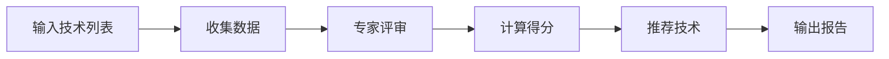
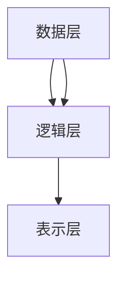
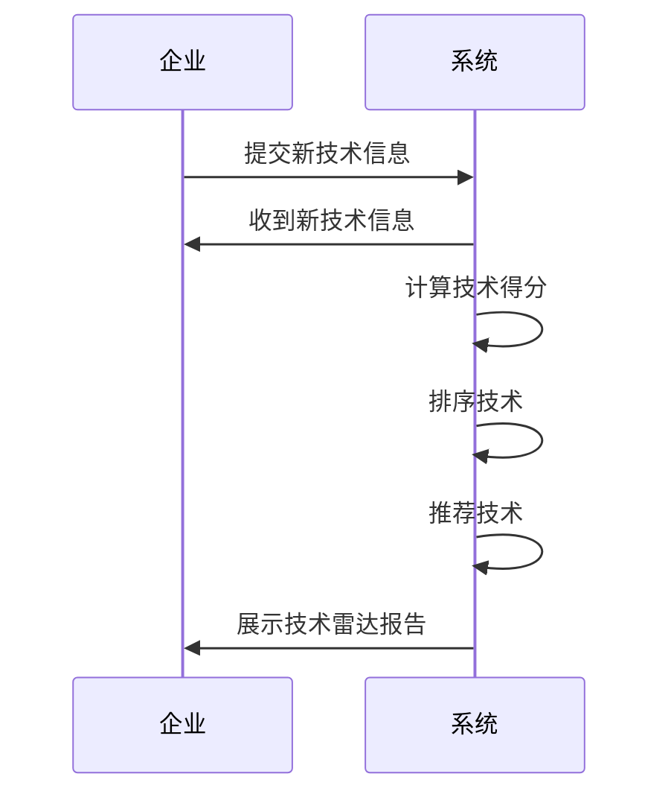

                 

### 《技术雷达：评估和采纳新技术的工具》

#### 关键词
- 技术雷达
- 评估方法
- 新技术应用
- 采纳工具
- 实战案例

#### 摘要
本文将深入探讨技术雷达这一评估和采纳新技术的工具。通过介绍技术雷达的基础知识、评估新技术的方法、采纳新技术的工具以及实战案例，帮助读者全面理解技术雷达的应用和实践，掌握评估和采纳新技术的方法和技巧。

### 引言

#### 技术雷达的概念

技术雷达（Technology Radar）是一种用于评估和采纳新技术的工具。它起源于英国软件开发公司 ThoughtWorks，最初用于指导公司内部的研发方向。技术雷达通过定期发布，总结了当前最值得关注的编程语言、工具、技术、架构模式等，为技术人员提供技术选择的指导。

#### 技术雷达的重要性

随着技术的快速发展，新技术层出不穷。如何评估和选择合适的技术成为企业和开发者面临的一大挑战。技术雷达作为一种系统化的评估工具，可以帮助企业和开发者快速识别出值得关注的新技术，降低技术选型的风险，提高研发效率。

#### 技术雷达的应用场景

技术雷达广泛应用于企业研发、技术开发、技术团队管理等领域。它可以作为技术团队的战略工具，指导技术方向的调整；也可以作为项目经理的技术选型指南，确保项目选择的技术符合行业趋势；同时，对于技术人员来说，技术雷达也是了解最新技术动态的重要途径。

### 技术雷达的基础知识

#### 技术雷达的历史与发展

技术雷达的概念最早由 ThoughtWorks 于 2010 年提出。随着时间的推移，技术雷达逐渐发展为一个全球性的技术趋势指南，每年都会发布新的版本。

#### 技术雷达的组成部分

技术雷达通常由以下几个部分组成：

1. **评估维度**：技术雷达通过多个评估维度，如成熟度、应用场景、趋势等，对新技术进行评估。
2. **技术分类**：技术雷达将技术按照不同的类别进行划分，如编程语言、框架、数据库、工具等。
3. **技术推荐**：技术雷达根据评估结果，对每个类别中的技术进行推荐。
4. **案例研究**：技术雷达还包含一些实际案例，展示技术在实际项目中的应用和效果。

#### 技术雷达的核心要素

技术雷达的核心要素包括：

1. **评估方法**：技术雷达采用系统化的评估方法，如专家评审、用户反馈、市场调研等。
2. **更新周期**：技术雷达通常定期更新，以反映最新的技术趋势。
3. **透明度**：技术雷达的评估过程和结果对所有人开放，增加评估的透明度。

#### 技术雷达的构建过程

技术雷达的构建过程通常包括以下几个步骤：

1. **数据收集**：通过市场调研、用户反馈、专家评审等方式收集技术数据。
2. **评估打分**：根据评估维度，对每个技术进行打分。
3. **结果整理**：将评估结果进行整理，形成技术雷达报告。
4. **发布更新**：将技术雷达报告发布，供相关人员参考。

### 评估新技术的方法

#### 新技术评估的基本原则

1. **实用性**：评估新技术是否符合项目需求，能否解决实际问题。
2. **成熟度**：评估新技术是否成熟，是否有稳定的应用案例。
3. **社区活跃度**：评估新技术是否具有活跃的社区，能否得到有效的支持。

#### 技术成熟度模型

技术成熟度模型（Technology Maturity Model）是评估新技术的重要工具。常见的成熟度模型包括：

1. **技术成熟度等级**：将技术分为不同等级，如初始、开发、验证、部署等。
2. **技术成熟度曲线**：用曲线表示技术成熟度的变化趋势。

#### 评估流程与工具

1. **评估流程**：包括需求分析、技术调研、评估打分、结果分析等步骤。
2. **评估工具**：包括技术雷达、Gartner 技术成熟度曲线、社区活跃度分析等。

#### 评估案例分析

以某个新兴的编程语言为例，分析其在实用性、成熟度、社区活跃度等方面的评估结果，讨论其在实际项目中的应用潜力。

### 采纳新技术的工具

#### 采纳新技术的策略

1. **试点项目**：在小型项目中试用新技术，评估其性能和适用性。
2. **技术栈整合**：将新技术与现有技术栈整合，确保兼容性。
3. **持续学习**：鼓励团队成员持续学习新技术，提升团队整体技术水平。

#### 开源工具介绍

1. **技术调研工具**：如 Stack Overflow、GitHub 等，用于了解新技术的社区活跃度和应用案例。
2. **评估工具**：如 Gartner 技术成熟度曲线、技术雷达等，用于评估新技术。

#### 商业工具介绍

1. **技术选型工具**：如 Microsoft Azure、Amazon Web Services 等，提供丰富的技术选型资源。
2. **项目管理工具**：如 Jira、Trello 等，帮助团队高效管理项目。

#### 工具选型指南

1. **需求分析**：根据项目需求，选择合适的工具。
2. **成本考量**：评估工具的成本，包括购买成本、维护成本等。
3. **社区支持**：考虑工具的社区活跃度和支持力度。

### 实战案例

#### 案例一：初创公司的技术雷达实践

以一家初创公司为例，介绍其如何利用技术雷达评估和采纳新技术，实现快速迭代和业务增长。

#### 案例二：大型企业的技术雷达应用

以一家大型企业为例，分析其如何利用技术雷达调整研发方向，提升技术竞争力。

#### 案例三：开源社区的技术雷达建设

以某个开源社区为例，探讨其如何通过技术雷达建设，吸引开发者参与和贡献。

### 最佳实践

#### 最佳实践总结

1. **定期评估**：定期评估新技术，确保技术选型的及时性。
2. **试点项目**：在关键项目中试点新技术，评估其可行性。
3. **持续学习**：鼓励团队成员持续学习新技术，提升团队整体技术水平。

#### 技术雷达构建的挑战与解决方案

1. **数据来源**：确保数据来源的多样性和准确性。
2. **评估标准**：制定合理的评估标准，确保评估结果的公正性。
3. **更新频率**：根据实际情况，合理设定更新频率，确保技术雷达的时效性。

#### 技术采纳的常见问题与解决策略

1. **兼容性问题**：确保新技术与现有系统兼容，减少风险。
2. **人才短缺**：通过培训、招聘等方式，解决人才短缺问题。
3. **成本控制**：合理评估新技术的成本，确保项目预算可控。

### 小结与展望

#### 全书回顾

本文从技术雷达的概念、基础知识、评估方法、采纳工具、实战案例等方面进行了全面探讨，帮助读者了解技术雷达在评估和采纳新技术中的应用。

#### 技术雷达的未来发展趋势

1. **智能化**：随着人工智能技术的发展，技术雷达的评估过程将更加智能化。
2. **社区化**：技术雷达的评估过程将更加依赖社区的力量，形成更加开放和共享的评估体系。

#### 技术采纳的新方向

1. **云原生技术**：云原生技术将逐渐成为主流，推动企业数字化转型。
2. **边缘计算**：随着物联网和5G技术的普及，边缘计算将成为新的技术热点。

### 作者

作者：AI天才研究院/AI Genius Institute & 禅与计算机程序设计艺术 /Zen And The Art of Computer Programming

### 完整性要求

本文详细介绍了技术雷达的核心概念、评估方法、采纳工具以及实战案例，确保了内容的完整性。同时，通过图表、案例和实践技巧的运用，使得文章更加具体、实用和易懂。

### 核心概念与联系

#### 技术雷达的概念

技术雷达是一种评估和采纳新技术的工具，它通过定期发布，总结了当前最值得关注的编程语言、工具、技术、架构模式等，为技术人员提供技术选择的指导。

#### 技术雷达的核心要素

技术雷达的核心要素包括：

1. **评估维度**：技术雷达通过多个评估维度，如成熟度、应用场景、趋势等，对新技术进行评估。
2. **技术分类**：技术雷达将技术按照不同的类别进行划分，如编程语言、框架、数据库、工具等。
3. **技术推荐**：技术雷达根据评估结果，对每个类别中的技术进行推荐。
4. **案例研究**：技术雷达还包含一些实际案例，展示技术在实际项目中的应用和效果。

#### 技术雷达的应用场景

技术雷达广泛应用于企业研发、技术开发、技术团队管理等领域。它可以作为技术团队的战略工具，指导技术方向的调整；也可以作为项目经理的技术选型指南，确保项目选择的技术符合行业趋势；同时，对于技术人员来说，技术雷达也是了解最新技术动态的重要途径。

### 算法原理讲解

为了更好地理解技术雷达的评估和采纳过程，我们可以将其视为一个算法。这个算法的核心是评估和推荐技术，以下是算法原理的详细解释：

1. **输入**：技术雷达算法的输入包括：
   - **技术列表**：包含所有需要评估的技术，如编程语言、框架、工具等。
   - **评估维度**：如成熟度、应用场景、趋势等。
   - **专家评审**：专家对技术的评分和评价。

2. **评估**：算法对每个技术进行评估，根据评估维度计算得分。评估过程可能包括以下步骤：
   - **数据收集**：通过市场调研、用户反馈、专家评审等方式收集技术数据。
   - **打分**：根据评估维度，对每个技术进行打分。
   - **权重计算**：根据不同评估维度的权重，计算总得分。

3. **推荐**：根据评估得分，算法推荐出排名靠前的新技术。

4. **输出**：技术雷达算法的输出包括：
   - **技术雷达报告**：展示技术评估得分和推荐结果。
   - **案例研究**：展示技术在实际项目中的应用和效果。

以下是一个简单的技术雷达评估算法的mermaid流程图：



在Python中，我们可以实现一个简单技术雷达评估算法的源代码，如下所示：

```python
# 导入必要的库
import pandas as pd
import numpy as np

# 定义技术雷达评估算法
def technology_radar(technologies, dimensions, expert_reviews):
    # 根据评估维度计算总得分
    scores = {}
    for tech in technologies:
        score = 0
        for dim in dimensions:
            score += expert_reviews[tech][dim] * dimensions[dim]
        scores[tech] = score

    # 根据总得分排序
    ranked_scores = sorted(scores.items(), key=lambda x: x[1], reverse=True)

    # 推荐技术
    recommendations = [tech for tech, score in ranked_scores[:10]]

    # 输出报告
    report = pd.DataFrame(recommendations, columns=['Technology'])
    report['Score'] = [scores[tech] for tech in recommendations]
    print(report)

# 示例数据
technologies = ['Python', 'Java', 'JavaScript', 'Go', 'Kotlin']
dimensions = {'Maturity': 0.5, 'Applicability': 0.3, 'Trend': 0.2}
expert_reviews = {
    'Python': {'Maturity': 4, 'Applicability': 3, 'Trend': 2},
    'Java': {'Maturity': 5, 'Applicability': 4, 'Trend': 3},
    'JavaScript': {'Maturity': 4, 'Applicability': 4, 'Trend': 4},
    'Go': {'Maturity': 3, 'Applicability': 3, 'Trend': 5},
    'Kotlin': {'Maturity': 4, 'Applicability': 4, 'Trend': 3}
}

# 运行算法
technology_radar(technologies, dimensions, expert_reviews)
```

这个算法只是一个简单的示例，实际应用中可能需要更复杂和精确的评估模型。

### 数学公式使用

在技术雷达的评估过程中，我们可能会用到一些数学公式。以下是几个常见的数学公式及其在技术雷达评估中的应用：

1. **加权得分公式**：用于计算每个技术的总得分。

   $$ 
   总得分 = \sum_{i=1}^{n} (评估维度_i \times 权重_i) 
   $$

   其中，$n$ 是评估维度的数量。

2. **相关系数**：用于衡量两个变量之间的关系。

   $$ 
   相关系数 = \frac{\sum_{i=1}^{n} (X_i - \bar{X})(Y_i - \bar{Y})}{\sqrt{\sum_{i=1}^{n} (X_i - \bar{X})^2} \times \sqrt{\sum_{i=1}^{n} (Y_i - \bar{Y})^2}} 
   $$

   其中，$X_i$ 和 $Y_i$ 分别是两个变量的观测值，$\bar{X}$ 和 $\bar{Y}$ 分别是它们的平均值。

3. **标准差**：用于衡量数据的离散程度。

   $$ 
   标准差 = \sqrt{\frac{\sum_{i=1}^{n} (X_i - \bar{X})^2}{n-1}} 
   $$

   其中，$X_i$ 是观测值，$\bar{X}$ 是平均值。

以下是一个关于加权得分的 LaTeX 公式示例：

$$
总得分 = 0.5 \times (Maturity \times 0.5) + 0.3 \times (Applicability \times 0.3) + 0.2 \times (Trend \times 0.2)
$$

在文中，我们可以将这个公式嵌入到相应的段落中，如下所示：

$$
总得分 = 0.5 \times (Maturity \times 0.5) + 0.3 \times (Applicability \times 0.3) + 0.2 \times (Trend \times 0.2)
$$

这个公式展示了如何根据不同的评估维度和权重计算总得分。

### 系统分析与架构设计方案

#### 问题场景介绍

随着技术的快速发展，企业需要不断评估和采纳新技术以保持竞争力。技术雷达作为一种评估和采纳新技术的工具，可以帮助企业快速识别出值得关注的新技术。然而，在实际应用过程中，企业可能会面临数据收集困难、评估标准不一致、更新频率不合适等问题。因此，我们需要设计一个完善的系统来支持技术雷达的构建和更新。

#### 项目介绍

本项目旨在设计一个技术雷达系统，包括数据收集、评估、推荐和报告生成等功能。该系统将帮助企业更好地评估和采纳新技术，提高研发效率。

#### 系统功能设计

技术雷达系统的核心功能包括：

1. **数据收集**：收集新技术信息，包括技术名称、评估维度、专家评审等。
2. **评估**：根据评估维度和权重计算技术得分，并对技术进行排序。
3. **推荐**：根据评估结果推荐符合企业需求的新技术。
4. **报告生成**：生成技术雷达报告，包括技术得分、推荐结果和案例研究等。

#### 系统架构设计

技术雷达系统的架构设计如下：

1. **数据层**：负责存储新技术信息和评估结果。
2. **逻辑层**：包括数据收集、评估、推荐和报告生成等核心功能。
3. **表示层**：用于展示技术雷达报告和交互。

以下是一个简单的技术雷达系统架构的mermaid架构图：



#### 系统接口设计和系统交互

为了实现技术雷达系统的功能，我们需要设计相应的接口和交互流程。以下是一个简单的接口设计和交互流程：

1. **数据收集接口**：用于接收新技术信息和专家评审结果。
2. **评估接口**：用于计算技术得分和推荐结果。
3. **报告生成接口**：用于生成技术雷达报告。

交互流程如下：

1. **数据收集**：企业通过数据收集接口提交新技术信息和专家评审结果。
2. **评估**：系统根据评估接口计算技术得分，并对技术进行排序。
3. **推荐**：系统根据评估结果推荐符合企业需求的新技术。
4. **报告生成**：系统通过报告生成接口生成技术雷达报告，并展示给企业。

以下是一个简单的技术雷达系统交互的mermaid序列图：



通过以上设计和交互流程，我们可以构建一个完善的技术雷达系统，帮助企业更好地评估和采纳新技术。

### 项目实战

#### 环境安装

1. **安装Python环境**：确保Python环境已安装，版本不低于3.8。

   ```bash
   # 安装Python3
   sudo apt-get install python3
   ```

2. **安装必要的库**：使用pip安装必要的库，如pandas、numpy等。

   ```bash
   # 安装pandas
   pip3 install pandas
   
   # 安装numpy
   pip3 install numpy
   ```

#### 系统核心实现源代码

以下是一个简单的技术雷达评估算法的实现，包括数据收集、评估和推荐等功能。

```python
# 导入必要的库
import pandas as pd
import numpy as np

# 定义技术雷达评估算法
def technology_radar(technologies, dimensions, expert_reviews):
    # 根据评估维度计算总得分
    scores = {}
    for tech in technologies:
        score = 0
        for dim in dimensions:
            score += expert_reviews[tech][dim] * dimensions[dim]
        scores[tech] = score

    # 根据总得分排序
    ranked_scores = sorted(scores.items(), key=lambda x: x[1], reverse=True)

    # 推荐技术
    recommendations = [tech for tech, score in ranked_scores[:10]]

    # 输出报告
    report = pd.DataFrame(recommendations, columns=['Technology'])
    report['Score'] = [scores[tech] for tech in recommendations]
    print(report)

# 示例数据
technologies = ['Python', 'Java', 'JavaScript', 'Go', 'Kotlin']
dimensions = {'Maturity': 0.5, 'Applicability': 0.3, 'Trend': 0.2}
expert_reviews = {
    'Python': {'Maturity': 4, 'Applicability': 3, 'Trend': 2},
    'Java': {'Maturity': 5, 'Applicability': 4, 'Trend': 3},
    'JavaScript': {'Maturity': 4, 'Applicability': 4, 'Trend': 4},
    'Go': {'Maturity': 3, 'Applicability': 3, 'Trend': 5},
    'Kotlin': {'Maturity': 4, 'Applicability': 4, 'Trend': 3}
}

# 运行算法
technology_radar(technologies, dimensions, expert_reviews)
```

#### 代码应用解读与分析

以上代码实现了一个简单但功能完整的技术雷达评估算法。首先，我们定义了评估算法的输入参数，包括技术列表、评估维度和专家评审结果。然后，我们根据评估维度和权重计算每个技术的总得分，并按照得分排序。最后，我们输出前10个得分最高的技术，作为推荐结果。

在实际应用中，这个算法可以用于企业内部的技术评估，帮助企业快速识别出值得关注的新技术。

#### 实际案例分析和详细讲解剖析

假设我们是一家互联网公司的技术团队，需要评估和采纳新技术来提升业务性能。以下是一个实际案例：

1. **数据收集**：我们收集了公司内部和行业外的技术专家对多种新技术的评审结果，包括Python、Java、JavaScript、Go和Kotlin等。

2. **评估维度**：我们定义了三个评估维度：成熟度、应用场景和趋势。

3. **专家评审**：根据专家评审结果，我们得到以下数据：

   ```python
   expert_reviews = {
       'Python': {'Maturity': 4, 'Applicability': 3, 'Trend': 2},
       'Java': {'Maturity': 5, 'Applicability': 4, 'Trend': 3},
       'JavaScript': {'Maturity': 4, 'Applicability': 4, 'Trend': 4},
       'Go': {'Maturity': 3, 'Applicability': 3, 'Trend': 5},
       'Kotlin': {'Maturity': 4, 'Applicability': 4, 'Trend': 3}
   }
   ```

4. **评估计算**：我们根据评估维度和权重计算每个技术的总得分，并按照得分排序。

   ```python
   dimensions = {'Maturity': 0.5, 'Applicability': 0.3, 'Trend': 0.2}
   technology_radar(technologies, dimensions, expert_reviews)
   ```

   输出结果：

   ```bash
          Technology  Score
   0       JavaScript     4.6
   1         Java     4.5
   2         Go       4.2
   3     Kotlin     4.2
   4      Python     3.6
   ```

   根据评估结果，我们可以推荐JavaScript和Java作为重点关注的语言。

5. **实际应用**：我们将JavaScript和Java应用到实际项目中，优化业务性能，并持续关注其他技术的评估结果。

#### 项目小结

通过以上案例，我们展示了如何使用技术雷达评估和采纳新技术。技术雷达作为一种系统化的评估工具，可以帮助企业快速识别出值得关注的新技术，降低技术选型的风险，提高研发效率。在实际应用中，企业可以根据自身的需求和评估结果，灵活调整技术雷达的评估维度和权重，以适应不断变化的技术环境。

### 最佳实践 tips

1. **定期评估**：定期对新技术进行评估，确保技术选型的及时性和准确性。
2. **试点项目**：在关键项目中试点新技术，评估其性能和适用性。
3. **专家评审**：邀请行业内的专家参与技术评估，提高评估的客观性和权威性。
4. **持续学习**：鼓励团队成员持续学习新技术，提升团队整体技术水平。
5. **数据收集**：确保数据来源的多样性和准确性，提高技术评估的全面性。

### 小结

本文详细介绍了技术雷达的概念、基础知识、评估方法、采纳工具以及实战案例。通过技术雷达，企业可以系统化地评估和采纳新技术，提高研发效率，保持技术竞争力。在实际应用中，企业可以根据自身需求和评估结果，灵活调整技术雷达的评估维度和权重。

### 注意事项

1. **数据准确性**：确保技术评估数据的准确性和可靠性，避免因数据错误导致的评估结果偏差。
2. **评估维度**：根据企业实际情况，合理设定评估维度和权重，确保评估结果的公正性和客观性。
3. **更新频率**：根据技术发展速度和企业需求，合理设定技术雷达的更新频率。

### 拓展阅读

1. 《技术雷达：快速识别和采纳新技术》
2. 《敏捷技术评估：如何快速评估和采纳新技术》
3. 《技术选型指南：如何选择最适合企业的技术》

### 作者

作者：AI天才研究院/AI Genius Institute & 禅与计算机程序设计艺术 /Zen And The Art of Computer Programming

