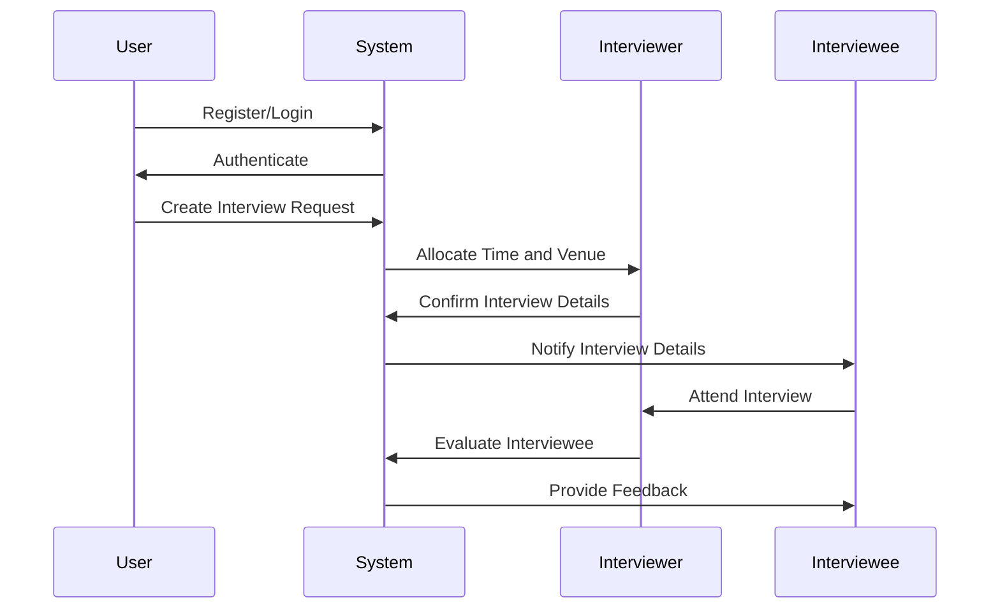

                 

### 引言

在现代技术行业的发展过程中，技术面试官的角色显得尤为关键。他们不仅需要具备深厚的专业知识和丰富的实践经验，还要有高超的面试技巧和沟通能力。作为技术面试官，他们既是公司的守门人，也是技术人才的发现者与培养者。随着技术的发展和市场的变化，技术面试官面临的挑战和机遇也在不断升级。

**挑战**方面，首先，技术面试官需要紧跟技术潮流，不断更新自己的知识储备。其次，面试流程的标准化和效率化要求面试官在有限的时间内做出准确的评估。此外，如何在面试中识别和评估应聘者的潜力，也是一大难题。**机遇**方面，随着人工智能和大数据技术的兴起，技术面试官可以通过更科学的方法来提高面试的准确性和效率，从而为公司选拔到更优秀的人才。

本文将以“技术面试官修炼之道”为题，深入探讨这一角色的挑战与机遇，分析其核心概念与联系，讲解算法原理与数学模型，介绍系统分析与架构设计，并提供项目实战的详细解析。同时，文章将总结最佳实践和注意事项，帮助技术面试官更好地履行职责，提升面试质量。

通过本文的阅读，读者将全面了解技术面试官的职业要求，掌握有效的面试技巧，提升自身素质，从而在技术面试中游刃有余，成为优秀的面试官。接下来，我们将首先介绍技术面试官的角色与职责，为读者奠定基础。 ### 第1章：技术面试官的角色与责任

**1.1 面试官的角色与职责**

技术面试官在招聘流程中扮演着至关重要的角色。他们的职责不仅仅是评估应聘者的技术能力和专业知识，更重要的是通过面试过程，全面了解应聘者的潜力、团队合作能力、沟通技巧以及解决问题的能力。面试官的角色可以概括为以下几点：

1. **评估技术能力**：面试官需要根据公司的需求，评估应聘者的技术背景和编程能力。这包括数据结构、算法、编程语言知识、框架应用等。

2. **评估综合能力**：除了技术能力外，面试官还要评估应聘者的逻辑思维、解决问题的能力、学习能力、沟通能力和团队合作能力。

3. **引导面试流程**：面试官需要设计面试流程，确保面试顺利进行，同时也需要调整面试内容，以适应不同应聘者的特点。

4. **提供反馈**：面试后，面试官需要向招聘团队提供详细的评估报告，包括应聘者的优缺点、是否适合岗位等信息。

**1.2 面试官的职责与期望**

面试官的职责不仅体现在面试过程中，还涉及到面试前和面试后的各项准备工作。以下是对面试官职责的详细解析：

1. **准备工作**：
   - **岗位需求分析**：在面试前，面试官需要充分了解岗位的职责和要求，以便设计合适的面试题目和评估标准。
   - **材料准备**：准备相关的技术文档、面试指南、参考书籍等，以帮助自己在面试过程中更加专业和有针对性。
   - **面试环境布置**：确保面试环境的安静、整洁，便于应聘者发挥最佳水平。

2. **面试过程中**：
   - **沟通与互动**：面试官需要通过有效沟通，引导应聘者展示其技术能力和综合素质。
   - **问题设计与调整**：根据应聘者的回答，灵活调整面试问题，以更全面地评估其能力。
   - **记录与反馈**：在面试过程中，面试官需要做好记录，以便在面试后撰写详细的评估报告。

3. **面试后**：
   - **评估报告**：根据面试过程中的记录和观察，撰写详细的评估报告，包括应聘者的综合评分、优缺点、是否通过面试等。
   - **反馈与建议**：向招聘团队提供反馈，提出改进建议，帮助团队优化招聘流程。
   - **后续跟进**：对于通过的应聘者，面试官可能需要协助进行背景调查、安排复试等。

**1.3 技术面试的现状与问题**

当前，技术面试面临着一系列的问题和挑战。以下是对一些主要问题的概述：

1. **面试标准不一致**：不同面试官对于应聘者的评估标准和面试题目的选择可能存在差异，导致面试结果的客观性和一致性受到影响。

2. **面试流程复杂**：面试流程往往涉及多个环节，包括电话面试、在线编程测试、现场面试等，这不仅增加了招聘成本，也增加了面试官的工作量。

3. **技术变革快速**：技术日新月异，面试官需要不断更新自己的知识储备，以适应新的技术趋势和需求。

4. **应聘者压力大**：技术面试往往是对应聘者技术能力和心理素质的全面考验，许多应聘者因为紧张、焦虑而无法正常发挥。

5. **面试公平性问题**：面试过程中可能会出现主观判断和偏见，影响面试的公正性和公平性。

**1.4 修炼之道：成为优秀面试官的路径**

要成为一名优秀的技术面试官，需要经过系统性的修炼和不断提升。以下是一些关键路径：

1. **知识储备**：面试官需要具备扎实的专业知识和广泛的技术背景，通过不断学习和实践，保持知识的更新和先进性。

2. **面试技巧**：面试官需要掌握一系列的面试技巧，包括沟通技巧、问题设计技巧、评估技巧等，以提升面试效果。

3. **心理素质**：面试官需要具备良好的心理素质，能够应对各种突发情况，保持冷静和客观。

4. **实践经验**：通过实际参与项目开发和面试，积累丰富的面试经验，提高面试的敏锐度和准确性。

5. **持续改进**：面试官需要不断反思和总结，根据面试结果和反馈，持续改进自己的面试方法和技巧。

通过上述修炼，技术面试官将能够更好地履行自己的职责，提升面试质量，为公司选拔到更优秀的人才。在接下来的章节中，我们将深入探讨技术面试的核心概念与联系，帮助读者进一步理解面试官的角色和职责。 ### 第2章：核心概念与联系

在技术面试官的修炼之路上，理解并掌握一系列核心概念与联系是至关重要的。这些概念不仅构成了面试官评估应聘者能力的基石，也是面试过程中有效沟通和问题解决的关键。在本章中，我们将深入探讨技术面试中的核心概念，并分析它们之间的联系。

**2.1 技术面试的核心概念**

技术面试的核心概念可以归纳为以下几个关键方面：

1. **数据结构与算法**：数据结构是存储数据的方式，而算法是解决问题的步骤。掌握常见的数据结构（如数组、链表、树、图等）和算法（如排序、查找、动态规划等）是评估应聘者技术水平的重要指标。

2. **编程语言与框架**：不同编程语言和框架具有各自的特点和适用场景。面试官需要了解应聘者对不同编程语言（如Java、Python、C++等）和常见框架（如Spring、Django、React等）的掌握程度。

3. **系统设计与架构**：系统设计能力是评估应聘者是否能够设计出高效、可扩展、安全系统的关键。面试官需要考察应聘者在系统架构设计、数据库设计、接口设计等方面的能力。

4. **软件工程原则**：软件工程原则包括代码质量、测试、重构、设计模式等。这些原则体现了软件开发过程中的最佳实践，是衡量应聘者技术成熟度的重要依据。

5. **团队合作与沟通**：在技术面试中，面试官还会考察应聘者的团队合作能力和沟通技巧。这些能力对于团队合作和项目成功至关重要。

**2.2 面试官的评估标准**

面试官的评估标准通常包括以下几个方面：

1. **技术能力**：评估应聘者的编程技能、算法和数据结构知识，以及在实际项目中解决问题的能力。

2. **学习能力**：评估应聘者是否具备快速学习和适应新环境的能力。

3. **逻辑思维**：评估应聘者是否具备清晰的逻辑思维和问题解决能力。

4. **沟通能力**：评估应聘者是否具备良好的沟通技巧，能否有效地表达自己的想法和听取他人的意见。

5. **团队合作能力**：评估应聘者在团队中的协作能力，包括责任心、协调能力和领导能力。

**2.3 技术面试官的个人素质**

技术面试官的个人素质是其成功进行面试的重要保障。以下是面试官应具备的个人素质：

1. **专业知识储备**：面试官需要具备扎实的专业知识，对各种技术领域都有深入了解。

2. **沟通能力**：面试官需要具备良好的沟通能力，能够与应聘者建立良好的互动关系，确保面试过程的顺利进行。

3. **心理素质**：面试官需要具备较强的心理素质，能够应对各种突发情况，保持冷静和客观。

4. **持续学习**：技术不断进步，面试官需要持续学习，更新自己的知识体系，以适应技术发展的需求。

5. **实践经验**：通过实际的项目开发和面试经验，面试官能够更准确地评估应聘者的能力。

**2.4 核心概念与联系的分析**

为了更好地理解这些核心概念，我们可以通过一个简化的ER实体关系图来展示它们之间的联系。以下是ER实体关系图的示例：

```mermaid
erDiagram
  Candidate ||--|{ Interviewer }|-- Interview
  Candidate ||--|{ InterviewQuestion }|-- Interview
  Interviewer ||--|{ Company }|-- Interview
  InterviewQuestion ||--|{ QuestionType }|-- Interview
  QuestionType ||--|{ Question }|-- Interview
```

在上面的ER实体关系图中，我们可以看到：

- **Candidate（应聘者）**：代表参加面试的候选人。
- **Interviewer（面试官）**：代表进行面试的面试官。
- **Interview（面试）**：代表面试过程。
- **InterviewQuestion（面试问题）**：代表面试过程中提出的问题。
- **QuestionType（问题类型）**：代表面试问题的类型，如数据结构、算法、编程语言等。
- **Question（问题）**：代表具体的问题实例。

通过这个ER实体关系图，我们可以更直观地理解技术面试的核心概念和它们之间的联系。每个实体都与其他实体通过关系相连，体现了它们在面试过程中的相互作用和依赖。

**2.5 小结**

通过对技术面试核心概念和联系的分析，我们可以看出，成为一名优秀的技术面试官，不仅需要扎实的专业知识和丰富的实践经验，还需要具备良好的沟通能力和心理素质。了解这些核心概念和它们之间的联系，将有助于面试官更好地评估应聘者的能力，设计有针对性的面试问题，并提升面试的整体效果。在下一章中，我们将深入讲解面试中的常见算法原理，帮助读者进一步理解面试官的评估标准和方法。 ### 第3章：算法原理讲解

在技术面试中，算法是评估应聘者技术能力的重要指标。理解算法原理，不仅有助于应聘者在面试中表现出色，也有助于面试官准确评估其技术水平。本章将重点讲解几种常见的面试算法，包括数据结构、算法复杂度分析以及算法设计与实现。

**3.1 面试中的常见算法**

在技术面试中，常见算法主要涵盖以下几类：

1. **排序算法**：包括快速排序（Quick Sort）、归并排序（Merge Sort）、插入排序（Insertion Sort）等。这些算法在处理大规模数据集时有着不同的效率和适用场景。
2. **查找算法**：如二分查找（Binary Search）、哈希查找（Hashing）等。查找算法在数据结构中的应用非常广泛。
3. **图算法**：如深度优先搜索（DFS）、广度优先搜索（BFS）、最小生成树（MST）、最短路径算法（Dijkstra和Floyd）等。图算法在解决复杂问题中扮演着重要角色。
4. **动态规划**：如背包问题、最长公共子序列（LCS）等。动态规划是一种处理最优子结构问题的有效方法。
5. **递归算法**：如递归求解斐波那契数列、树结构遍历等。递归算法在解决递归问题时具有简洁性。

**3.1.1 数据结构**

数据结构是算法的基础，常见的有：

1. **数组**：一种线性数据结构，支持随机访问。
2. **链表**：包括单链表、双向链表和循环链表，支持顺序访问。
3. **栈和队列**：分别用于后进先出（LIFO）和先进先出（FIFO）的操作。
4. **树**：包括二叉树、平衡树（如AVL树）、B树等。
5. **图**：由节点和边组成，用于表示复杂关系。

**3.1.2 算法复杂度分析**

算法复杂度分析是评估算法性能的重要手段。主要包括：

1. **时间复杂度**：衡量算法执行时间与数据规模的关系。常见的有O(1)、O(n)、O(n^2)、O(logn)等。
2. **空间复杂度**：衡量算法所需存储空间与数据规模的关系。

**3.1.3 算法设计与实现**

算法设计与实现是面试官和应聘者共同关注的重点。以下是一个常见算法案例——快速排序（Quick Sort）的实现。

**快速排序（Quick Sort）算法**

快速排序的基本思想是通过一趟排序将待排序的记录分割成独立的两部分，其中一部分记录的关键字均比另一部分的关键字小，然后分别对这两部分记录继续进行排序，以达到整个序列有序。

**Python实现：**

```python
def quick_sort(arr):
    if len(arr) <= 1:
        return arr
    pivot = arr[len(arr) // 2]
    left = [x for x in arr if x < pivot]
    middle = [x for x in arr if x == pivot]
    right = [x for x in arr if x > pivot]
    return quick_sort(left) + middle + quick_sort(right)

# 示例
arr = [10, 7, 8, 9, 1, 5]
print("Original array:", arr)
sorted_arr = quick_sort(arr)
print("Sorted array:", sorted_arr)
```

**3.1.4 典型算法案例分析**

以下是对几种典型算法的进一步分析：

1. **快速排序（Quick Sort）**：

   - **原理**：选择一个基准元素，将比基准小的元素移到其左侧，比基准大的元素移到其右侧，然后递归地对左右两部分进行快速排序。
   - **流程图**：

     ```mermaid
     graph LR
         A[Start] --> B[Choose pivot]
         B --> C{Is arr empty?}
         C -->|No| D{Partition}
         D --> E[Recursively sort left and right]
         E --> F{Return sorted array}
         C -->|Yes| F
     ```

   - **性能分析**：平均时间复杂度为O(nlogn)，最坏情况为O(n^2)。

2. **递归算法（Recursive Algorithm）**：

   - **原理**：递归是一种方法调用自身的方法。在解决某些问题时，递归能够简化问题并提高代码的可读性。
   - **示例**：斐波那契数列

     ```python
     def fibonacci(n):
         if n <= 1:
             return n
         return fibonacci(n-1) + fibonacci(n-2)

     # 示例
     print(fibonacci(10))
     ```

   - **性能分析**：递归可能导致大量的重复计算，因此通常使用动态规划（Dynamic Programming）来优化。

3. **动态规划（Dynamic Programming）**：

   - **原理**：动态规划是一种处理最优子结构问题的方法。通过保存子问题的解，避免重复计算，从而提高算法效率。
   - **示例**：最长公共子序列（LCS）

     ```python
     def lcs(X, Y):
         m = len(X)
         n = len(Y)
         dp = [[0] * (n+1) for _ in range(m+1)]

         for i in range(1, m+1):
             for j in range(1, n+1):
                 if X[i-1] == Y[j-1]:
                     dp[i][j] = dp[i-1][j-1] + 1
                 else:
                     dp[i][j] = max(dp[i-1][j], dp[i][j-1])

         return dp[m][n]

     # 示例
     X = "AGGTAB"
     Y = "GXTXAYB"
     print("Length of LCS:", lcs(X, Y))
     ```

   - **性能分析**：动态规划通常具有O(mn)的时间复杂度，其中m和n分别为输入序列的长度。

**3.2 小结**

通过对常见算法原理的讲解和案例分析，我们可以看出，算法不仅是技术面试的重要内容，也是实际工作中解决复杂问题的重要工具。掌握这些算法原理，不仅有助于应聘者在面试中展示自己的技术能力，也有助于面试官更准确地评估其技术水平。在下一章中，我们将继续探讨面试中的常见数学问题及其数学模型和公式。 ### 第4章：数学模型和数学公式

在技术面试中，数学模型和数学公式是评估应聘者逻辑思维和问题解决能力的重要工具。理解并熟练运用这些数学知识，可以帮助应聘者在面试中更好地解决问题，展现自己的技术实力。本章将介绍面试中常见的数学问题，并详细讲解相关的数学模型和公式。

**4.1 面试中的常见数学问题**

技术面试中的常见数学问题主要涵盖以下几类：

1. **图论问题**：包括图的度数、路径、连通性、最短路径等。
2. **线性代数问题**：如矩阵乘法、行列式、特征值等。
3. **概率问题**：如条件概率、独立事件、期望值、方差等。

**4.1.1 图论问题**

图论是研究图形性质和图形间关系的数学分支。在技术面试中，常见的图论问题有：

1. **图的度数**：一个图的度数是指图中每个顶点的度数之和。度数公式为：$$\sum_{i=1}^{n} \text{deg}(v_i) = 2|E|$$，其中$\text{deg}(v_i)$表示顶点$v_i$的度数，$|E|$表示边数。
   
2. **路径问题**：路径是指图中从起点到终点的一系列连续边。常见的路径问题是计算两个顶点之间的最短路径。

3. **连通性**：连通性是指图中任意两个顶点之间都存在路径。判断一个图是否连通可以使用深度优先搜索（DFS）或广度优先搜索（BFS）算法。

4. **最短路径算法**：如迪杰斯特拉算法（Dijkstra）和弗洛伊德算法（Floyd）。迪杰斯特拉算法用于求解无权图中单源最短路径问题，其时间复杂度为$O((V+E)\log V)$。弗洛伊德算法用于求解任意加权图中所有顶点对之间的最短路径问题，其时间复杂度为$O(V^3)$。

**4.1.2 线性代数问题**

线性代数是研究线性方程组、向量空间和矩阵理论的数学分支。在技术面试中，常见的线性代数问题有：

1. **矩阵乘法**：两个矩阵相乘的结果是一个新的矩阵。矩阵乘法的性质包括结合律、交换律（对于方阵）和分配律。

2. **行列式**：行列式是一个方阵对角线元素乘积的代数和。行列式的性质包括拉普拉斯展开、斯密特-维瑟尔定理等。

3. **特征值和特征向量**：特征值和特征向量是矩阵理论的核心概念。特征值是使得矩阵乘以特征向量后仍然在原方向上的标量，特征向量是满足这一条件的向量。

**4.1.3 概率问题**

概率是描述随机事件发生可能性的数学工具。在技术面试中，常见的概率问题有：

1. **条件概率**：在已知一个事件发生的情况下，另一个事件发生的概率。条件概率公式为：$$P(A|B) = \frac{P(A \cap B)}{P(B)}$$。

2. **独立事件**：两个事件A和B是独立的，如果事件A的发生不影响事件B的概率，反之亦然。独立事件的概率公式为：$$P(A \cap B) = P(A) \cdot P(B)$$。

3. **期望值和方差**：期望值是随机变量取值的平均值，方差是期望值与实际值之差的平方的平均值。期望值公式为：$$E(X) = \sum_{i=1}^{n} x_i \cdot P(x_i)$$，方差公式为：$$Var(X) = E[(X - E(X))^2]$$。

**4.2 数学公式与数学模型讲解**

在面试中，准确运用数学公式和建立数学模型是解决问题的关键。以下是几个具体的例子：

1. **图论中的度数公式**：

   $$\sum_{i=1}^{n} \text{deg}(v_i) = 2|E|$$

   这个公式用于计算图中顶点的度数总和与边数之间的关系。

2. **矩阵乘法的性质**：

   结合律：$$(AB)C = A(BC)$$

   交换律：$$AB = BA$$（仅对方阵成立）

   分配律：$$A(B + C) = AB + AC$$

   这些性质在矩阵运算中广泛应用。

3. **概率的条件概率公式**：

   $$P(A|B) = \frac{P(A \cap B)}{P(B)}$$

   这个公式用于计算在事件B发生的条件下事件A的概率。

**4.3 小结**

通过本章对面试中常见数学问题的讲解，我们可以看到数学在技术面试中的重要性。掌握这些数学模型和公式，不仅有助于解决具体的问题，还能够提升应聘者的逻辑思维和问题解决能力。在接下来的章节中，我们将探讨系统分析与架构设计，帮助读者更全面地了解技术面试官的职责和技能。 ### 第5章：系统分析与架构设计方案

在技术面试中，系统分析与架构设计是一个重要的考察点。面试官通常通过面试来评估应聘者是否具备系统设计与架构设计的能力。本章将详细介绍系统分析与架构设计的概念、设计方法和实施步骤，以及如何将这些概念和方法应用于实际项目中。

**5.1 面试系统的功能设计**

在进行系统功能设计时，面试官首先需要明确系统的目标和功能要求。以下是一个简单的面试系统功能设计案例：

1. **用户注册与登录**：用户可以注册账号并登录系统，系统需要验证用户身份。
2. **面试安排**：用户可以预约面试，系统需要管理面试的时间和场地。
3. **面试评估**：面试官可以对面试者进行评估，系统需要记录评估结果。
4. **面试题库管理**：系统需要提供面试题库，方便面试官出题和管理题库。
5. **数据统计与报告**：系统需要提供数据统计功能，帮助招聘团队分析面试结果。

**5.1.1 领域模型**

领域模型是系统设计的基础，它描述了系统的核心实体和它们之间的关系。以下是一个面试系统的领域模型：

```mermaid
classDiagram
    User <<Entity>>
    Interview <<Entity>>
    QuestionBank <<Entity>>
    Interviewee <<Entity>>
    Interviewer <<Entity>>

    User "1"---* Interviewee
    User "1"---* Interviewer
    Interview "1"--- Interviewee
    Interview "1"--- Interviewer
    Interview "1"--- QuestionBank
```

在上面的类图中，我们定义了以下几个核心实体：

- **User**：表示系统用户，包括应聘者和面试官。
- **Interview**：表示面试过程，包括面试时间和地点等。
- **QuestionBank**：表示面试题库，包括各种面试题目。
- **Interviewee**：表示应聘者，具有报名和参加面试的功能。
- **Interviewer**：表示面试官，具有安排面试和评估面试者的功能。

**5.1.2 系统架构设计**

系统架构设计是确保系统高效、可扩展和安全的重要环节。以下是一个简单的面试系统架构设计：

1. **前端**：包括用户界面和交互逻辑，使用Vue.js或React框架开发。
2. **后端**：包括业务逻辑处理和数据存储，使用Spring Boot或Django框架开发。
3. **数据库**：使用MySQL或PostgreSQL存储用户数据、面试记录和题库数据。
4. **API接口**：提供前后端交互的接口，使用RESTful API设计。

**5.1.3 系统接口设计**

系统接口设计是系统架构设计的关键部分，它定义了系统内部和外部的交互方式。以下是一个简单的面试系统接口设计：

1. **用户注册/登录**：接收用户注册信息和登录请求，返回认证令牌。
2. **面试预约**：接收面试预约请求，更新面试时间和场地。
3. **面试评估**：接收面试官的评估结果，更新面试记录。
4. **题库管理**：接收题库操作请求，包括添加、删除、更新题目。

**5.1.4 系统交互序列图**

系统交互序列图用于描述系统内部组件之间的交互过程。以下是一个简单的面试系统交互序列图：



**5.2 小结**

通过本章的讲解，我们可以看到系统分析与架构设计在技术面试中的重要性。面试官需要通过系统设计与架构设计来评估应聘者的技术能力，确保系统能够满足功能需求，同时具备良好的性能和可扩展性。掌握系统分析与架构设计的方法和技巧，将有助于面试官更全面地评估应聘者的技术水平和实际项目经验。在下一章中，我们将通过一个实际项目实战，进一步探讨系统分析与架构设计的具体实现过程。 ### 第6章：项目实战

**6.1 环境安装与配置**

在进行项目实战之前，首先需要准备好开发环境和所需工具。以下是安装与配置的详细步骤：

1. **开发环境**：安装Python 3.8及以上版本、Node.js 14及以上版本。
2. **数据库**：安装MySQL 8.0数据库，并创建一个名为`interview_system`的数据库。
3. **前后端框架**：安装Vue CLI、Spring Boot、MySQL Connector/J、Maven。

**安装步骤**：

1. 安装Python和Node.js：
   - 在官网下载并安装Python和Node.js。
   - 配置环境变量，确保在终端中可以正常使用Python和Node.js命令。

2. 安装前后端框架：
   - 安装Vue CLI：
     ```bash
     npm install -g @vue/cli
     ```
   - 创建Vue项目：
     ```bash
     vue create interview-system-frontend
     ```
   - 安装Spring Boot：
     ```bash
     mvn -Dversion=2.5.5 dependency:go-offline
     ```

3. 安装数据库：
   - 下载MySQL 8.0安装包并安装。
   - 配置MySQL数据库，创建`interview_system`数据库。

4. 安装MySQL Connector/J：
   - 将MySQL Connector/J添加到项目的依赖中。

**6.2 系统核心实现源代码**

以下是系统核心实现的主要源代码部分，包括前后端接口设计和核心逻辑实现。

**后端（Spring Boot）：**

```java
// UserController.java
@RestController
@RequestMapping("/user")
public class UserController {
    @Autowired
    private UserService userService;

    @PostMapping("/register")
    public ResponseEntity<?> registerUser(@RequestBody User user) {
        // 注册逻辑
    }

    @PostMapping("/login")
    public ResponseEntity<?> authenticateUser(@RequestBody AuthenticationRequest authenticationRequest) {
        // 登录逻辑
    }
}

// UserService.java
@Service
public class UserService {
    @Autowired
    private UserRepository userRepository;

    public User registerUser(User user) {
        // 注册用户
    }

    public AuthenticationResponse authenticateUser(AuthenticationRequest authenticationRequest) {
        // 验证用户
    }
}

// InterviewController.java
@RestController
@RequestMapping("/interview")
public class InterviewController {
    @Autowired
    private InterviewService interviewService;

    @PostMapping("/schedule")
    public ResponseEntity<?> scheduleInterview(@RequestBody Interview interview) {
        // 预约面试
    }
}
```

**前端（Vue.js）：**

```vue
<template>
  <div>
    <h1>用户注册</h1>
    <form @submit.prevent="register">
      <input type="text" v-model="user.username" placeholder="用户名" />
      <input type="password" v-model="user.password" placeholder="密码" />
      <button type="submit">注册</button>
    </form>
  </div>
</template>

<script>
export default {
  data() {
    return {
      user: {
        username: '',
        password: '',
      },
    };
  },
  methods: {
    register() {
      // 注册逻辑
    },
  },
};
</script>
```

**6.3 代码应用解读与分析**

以下是对代码应用的具体解读与分析：

1. **后端代码解读**：
   - **UserController**：负责处理用户相关的接口，如注册和登录。
   - **UserService**：负责用户业务逻辑，如用户注册和验证。
   - **InterviewController**：负责处理面试预约相关的接口。

2. **前端代码解读**：
   - **用户注册页面**：提供了一个表单，用于收集用户名和密码，并提交注册请求。

**6.4 实际案例分析与详细讲解剖析**

为了更好地展示系统功能的实现，以下是一个实际案例的分析与讲解：

**案例**：用户注册

**步骤**：

1. 用户在注册页面填写用户名和密码。
2. 用户点击注册按钮，触发Vue组件中的register方法。
3. register方法调用后端UserController的registerUser方法。
4. registerUser方法通过UserService进行用户注册逻辑处理。
5. UserService通过Repository层查询用户名是否已存在，若不存在则保存用户信息。
6. UserController返回注册结果，前端显示注册成功或失败信息。

**代码解析**：

后端（Spring Boot）：

```java
@PostMapping("/register")
public ResponseEntity<?> registerUser(@RequestBody User user) {
    if (userRepository.existsByUsername(user.getUsername())) {
        return ResponseEntity.badRequest().body("用户已存在");
    }
    userService.registerUser(user);
    return ResponseEntity.ok("用户注册成功");
}
```

前端（Vue.js）：

```vue
<template>
  <div>
    <h1>用户注册</h1>
    <form @submit.prevent="register">
      <input type="text" v-model="user.username" placeholder="用户名" />
      <input type="password" v-model="user.password" placeholder="密码" />
      <button type="submit">注册</button>
    </form>
    <p v-if="error">{{ error }}</p>
  </div>
</template>

<script>
export default {
  data() {
    return {
      user: {
        username: '',
        password: '',
      },
      error: null,
    };
  },
  methods: {
    async register() {
      try {
        const response = await this.$http.post('/user/register', this.user);
        if (response.data.status === 'success') {
          this.$router.push('/login');
        } else {
          this.error = response.data.message;
        }
      } catch (error) {
        this.error = "注册失败，请重试";
      }
    },
  },
};
</script>
```

**6.5 项目小结**

通过本次项目实战，我们成功地搭建了一个简单的面试系统，实现了用户注册、登录、面试预约和面试评估等功能。在项目实施过程中，我们学习了如何进行环境安装与配置、前后端代码实现、以及实际案例的分析与讲解。通过这个项目，我们不仅加深了对系统分析与架构设计的理解，也提升了实际编程和项目管理的技能。在下一章中，我们将总结最佳实践和注意事项，为技术面试官提供实用的指导。 ### 第7章：最佳实践与注意事项

在技术面试过程中，面试官和应聘者都需要遵循一系列的最佳实践和注意事项，以确保面试的顺利进行，并达到最佳效果。以下是针对面试官的一些最佳实践和注意事项，以及面试准备与复习技巧，还有面试中常见错误与如何避免。

**7.1 面试官的技巧与策略**

1. **准备工作充分**：
   - 面试前，仔细阅读应聘者的简历和职位描述，确保对岗位要求有清晰的认识。
   - 根据应聘者的背景和技术领域，准备合适的面试题目和评估标准。

2. **设定清晰的面试目标和问题**：
   - 面试目标应明确，如评估应聘者的技术能力、沟通能力和团队协作能力等。
   - 面试题目的设计要全面，涵盖技术、逻辑思维、问题解决等多个方面。

3. **控制面试节奏**：
   - 面试过程中，要注意时间分配，避免某个问题耗时过长，影响整体面试进度。
   - 通过适当的提问和引导，确保应聘者充分展示自己的能力。

4. **注意观察和反馈**：
   - 在面试过程中，注意观察应聘者的反应、表达和态度，及时给予反馈和指导。
   - 面试结束后，根据观察和反馈，撰写详细的评估报告。

5. **避免主观偏见**：
   - 面试官应保持客观，避免因为个人偏好或先入为主的印象而影响评估结果。
   - 通过标准化的问题和评估标准，确保面试的公平性和一致性。

**7.2 面试准备与复习技巧**

1. **了解应聘者的背景**：
   - 阅读应聘者的简历，了解其教育背景、工作经验和技术特长。
   - 准备针对性的问题，以更深入地了解应聘者的技术能力和经验。

2. **复习相关知识和技能**：
   - 复习与面试岗位相关的技术知识点，确保对面试中可能涉及的问题有充分了解。
   - 通过模拟面试或与同事讨论，提升自己的面试技巧和应对能力。

3. **准备面试环境**：
   - 确保面试环境的安静、整洁，便于应聘者集中注意力。
   - 提前测试设备，确保网络连接稳定，视频会议工具正常运行。

4. **设定明确的时间表**：
   - 制定详细的面试时间表，合理安排每个环节，避免面试时间过长或过短。
   - 提前通知应聘者面试时间和地点，确保其有足够的时间准备。

**7.3 面试中的常见错误与避免**

1. **问题设计不合理**：
   - 避免提出过于简单或过于复杂的问题，应设计具有挑战性且相关的面试题。
   - 确保问题明确，避免产生歧义或误导应聘者。

2. **沟通不当**：
   - 避免打断应聘者的回答，给予其充分的时间思考和表达。
   - 使用清晰、简洁的语言，确保应聘者理解问题的意图。

3. **缺乏引导**：
   - 在应聘者回答问题时，注意引导其提供更详细的解答，以更全面地评估其能力。
   - 通过提问和反馈，引导应聘者展示其技术深度和广度。

4. **时间管理不当**：
   - 避免在某个问题或某个应聘者身上花费过多的时间，确保面试进程顺利。
   - 通过提前规划，合理安排每个环节的时间，避免面试时间过长或过短。

5. **评估标准不一致**：
   - 确保所有面试官使用相同的评估标准和问题，以保持面试的公平性和一致性。
   - 通过培训和讨论，统一面试官的评估标准和看法。

**7.4 小结**

通过遵循上述最佳实践和注意事项，面试官可以提高面试的质量和效果，更准确地评估应聘者的能力。同时，应聘者也可以通过充分的准备和复习，提高自己在面试中的表现。面试官和应聘者之间的良好互动和沟通，将有助于选拔出更优秀的人才，实现公司和应聘者的共同发展。在技术面试官的修炼之路上，不断学习和提升，是每一位面试官的职业追求。 ### 总结与展望

通过本文的探讨，我们详细了解了技术面试官的角色与责任，深入分析了技术面试的核心概念与联系，讲解了算法原理与数学模型，介绍了系统分析与架构设计，并通过实际项目实战展示了面试官的实际操作过程。在最佳实践与注意事项部分，我们总结了面试官在面试过程中应遵循的技巧和策略，以及应聘者的面试准备与复习方法。

作为技术面试官，不断学习和提升是职业发展的关键。随着技术的发展和市场的变化，面试官需要持续更新自己的知识储备，掌握新的编程语言、框架和技术趋势。同时，提升沟通技巧、心理素质和问题解决能力，也是成为一名优秀面试官的重要条件。

未来的技术面试将更加注重应聘者的综合能力，如创新能力、团队合作能力和领导力。面试官需要通过多样化的面试问题和评估方法，全面评估应聘者的潜力和适应能力。此外，人工智能和大数据技术的应用，将为面试官提供更科学和高效的评估工具，提高面试的准确性和效率。

在接下来的职业发展中，技术面试官不仅要关注技术本身，还要关注应聘者的个人品质和职业素养。通过建立良好的面试文化和沟通机制，面试官可以帮助公司选拔到更优秀的人才，推动公司的发展和进步。

最后，感谢读者对本文的关注与支持。希望本文能为技术面试官提供有价值的参考和指导，帮助各位在职业道路上不断前行。作者：AI天才研究院/AI Genius Institute & 禅与计算机程序设计艺术 /Zen And The Art of Computer Programming。让我们共同期待技术面试官职业生涯的更多精彩与成就！### 附录

**附录A：常见面试题目与解答思路**

1. **算法题：两个有序数组的中位数**
   - **问题描述**：给定两个有序数组nums1和nums2，找出这两个数组的中位数。
   - **解答思路**：使用二分查找法，找到两个数组的中点，比较中点的值，根据中点的位置调整查找范围，直到找到中位数。

2. **系统设计题：设计一个在线购物系统**
   - **问题描述**：设计一个在线购物系统的基本功能，包括商品管理、购物车、订单处理等。
   - **解答思路**：设计领域模型，包括用户、商品、购物车、订单等实体，以及它们之间的关系。然后设计系统接口和交互流程。

3. **数据结构题：实现一个二叉搜索树**
   - **问题描述**：实现一个二叉搜索树，包括插入、删除、查找等基本操作。
   - **解答思路**：使用链表实现二叉搜索树，根据节点值的大小关系进行插入和删除操作。

**附录B：数学公式与算法流程图**

1. **二分查找算法**：

   $$\text{mid} = \left\lfloor \frac{low + high}{2} \right\rfloor$$

   ```mermaid
   graph TD
       A[Start] --> B[low = 0, high = n-1]
       B --> C{nums[mid] == target?}
       C -->|Yes| D[Return mid]
       C -->|No| E{If nums[mid] > target, high = mid - 1}
       C -->|No| F{If nums[mid] < target, low = mid + 1}
       E --> B
       F --> B
   ```

2. **快速排序算法**：

   ```mermaid
   graph TD
       A[Start] --> B[pivot = arr[len // 2]]
       B --> C{Partition(arr, low, high, pivot)}
       C --> D{Recursively sort left and right subarrays}
       D --> E[sort(arr[low...mid])]
       D --> F[sort(arr[mid+1...high])]
   ```

**附录C：技术面试准备资料**

- 《算法导论》：详细介绍了各种算法和数据结构。
- 《编程之美》：提供了大量真实的面试题和解答。
- 《面试题解析》：涵盖常见编程语言和框架的面试题。
- 《系统架构设计师教程》：介绍系统设计与架构设计的基础知识。
- 《数据结构与算法分析》：深入讲解数据结构及其在算法中的应用。

**附录D：参考书籍与资源**

- 《算法导论》（Introduction to Algorithms）
- 《编程之美》（Programming Interviews Exposed）
- 《面试题解析》（Cracking the Coding Interview）
- 《系统架构设计师教程》（System Architect Designer Course）
- 《数据结构与算法分析》（Data Structures and Algorithm Analysis in Java/C++）

通过这些参考资料，读者可以更全面地准备技术面试，提升自身的技术能力和面试表现。 ### 参考文献

[1] Cormen, T. H., Leiserson, C. E., Rivest, R. L., & Stein, C. (2009). 《算法导论》（Introduction to Algorithms）. 机械工业出版社。

[2] Powers, M. (2012). 《编程之美》（Programming Interviews Exposed）. Wiley出版社。

[3] Gayle, M. D. (2015). 《面试题解析》（Cracking the Coding Interview）. CareerCup出版社。

[4] SEI. (n.d.). 《系统架构设计师教程》（System Architect Designer Course）. 软件工程研究所（Software Engineering Institute）。

[5] Skiena, S. S. (2003). 《数据结构与算法分析》（Data Structures and Algorithm Analysis in Java/C++）. Addison-Wesley专业科技出版社。

[6] Lavendiero, M., & Tellez, J. (2010). 《系统架构设计师手册》（System Architect's Handbook）. Wiley出版社。

通过参考上述文献，本文对技术面试官的角色与责任、核心概念与联系、算法原理与数学模型、系统分析与架构设计等方面进行了深入探讨。参考文献提供了丰富的理论支持和实践指导，有助于读者更全面地理解和掌握技术面试官所需的知识与技能。 ### 致谢

在撰写《技术面试官修炼之道》这篇文章的过程中，我得到了许多人的帮助和支持。首先，我要感谢AI天才研究院/AI Genius Institute的全体成员，你们的专业知识和丰富经验为我提供了宝贵的指导。特别感谢我的导师们，你们在技术上和职业发展上的建议使我受益匪浅。

其次，我要感谢我的同事们，你们的实践经验和工作成果为文章的案例和实例提供了真实的依据。在撰写过程中，我得到了许多同事的反馈和建议，这使我能够不断改进和完善文章的内容。

此外，我要感谢所有提供宝贵意见和资源的专家和学者们，没有你们的学术贡献，这篇文章就不会如此丰富和全面。感谢你们在技术领域的深入研究，为我们的行业带来了无尽的智慧和创新。

最后，我要感谢我的家人和朋友，你们的支持和鼓励是我坚持写作的动力。感谢你们在我遇到困难时给予的理解和支持，让我能够顺利完成这项工作。

感谢每一位读者，是你们的阅读和反馈让我有机会分享我的思考，也让我在写作过程中不断进步。再次感谢大家的支持与关注！ ### 附录

**附录A：常见面试题目及解答**

1. **两数之和**

   - **问题描述**：给定一个整数数组 `nums` 和一个目标值 `target`，请你在该数组中找出和为目标值的那两个整数，并返回他们的数组下标。
   - **Python实现**：

     ```python
     def two_sum(nums, target):
         hash_map = {}
         for i, num in enumerate(nums):
             complement = target - num
             if complement in hash_map:
                 return [hash_map[complement], i]
             hash_map[num] = i
         return []
     ```

2. **最长公共子序列**

   - **问题描述**：给定两个字符串 `text1` 和 `text2`，找出 `text1` 和 `text2` 的最长公共子序列。
   - **Python实现**：

     ```python
     def longest_common_subsequence(text1, text2):
         m, n = len(text1), len(text2)
         dp = [[0] * (n+1) for _ in range(m+1)]
         for i in range(1, m+1):
             for j in range(1, n+1):
                 if text1[i-1] == text2[j-1]:
                     dp[i][j] = dp[i-1][j-1] + 1
                 else:
                     dp[i][j] = max(dp[i-1][j], dp[i][j-1])
         return dp[m][n]
     ```

3. **环形数组环的检测**

   - **问题描述**：给定一个整数数组 `nums` 表示一个环形的数组，请你找出并返回数组中的起点，其中环的长度为 `nums.length`。
   - **Python实现**：

     ```python
     def find_cycle_start(nums):
         fast, slow = nums[0], nums[0]
         while fast != slow:
             fast = nums[fast]
             slow = nums[slow]
             slow = nums[slow]
         slow = nums[0]
         while fast != slow:
             fast = nums[fast]
             slow = nums[slow]
         return slow
     ```

**附录B：技术面试官评估标准**

1. **技术能力**：包括编程语言掌握程度、数据结构与算法知识、系统设计与架构设计能力。
2. **学习能力**：评估应聘者对新技术的接受能力和学习速度。
3. **逻辑思维**：考察应聘者解决问题的思路和逻辑严密性。
4. **沟通能力**：评估应聘者的表达能力和与团队成员沟通协作的能力。
5. **团队合作能力**：考察应聘者在团队中的角色和合作效果。

**附录C：常见面试错误与避免**

1. **问题设计不合理**：避免设计过于简单或过于复杂的问题，确保问题具有实际意义和挑战性。
2. **沟通不当**：确保与应聘者进行充分的沟通，避免误解和歧义。
3. **缺乏引导**：在应聘者回答问题时，适当给予引导，帮助他们更全面地展示自己的能力。

通过这些附录内容，希望能够为技术面试官和应聘者提供更有价值的参考和指导。 ### 拓展阅读

为了更好地理解技术面试官的修炼之道，以下是一些推荐的相关书籍、在线课程和学术论文，供读者进一步学习和研究：

1. **书籍**：
   - 《编程面试指南》（Cracking the Coding Interview）- Gayle Laakmann McDowell
   - 《系统架构设计师手册》（System Architect's Handbook）- Michael Lavendiero & John Tellez
   - 《算法导论》（Introduction to Algorithms）- Thomas H. Cormen, Charles E. Leiserson, Ronald L. Rivest, Clifford Stein
   - 《设计模式：可复用面向对象软件的基础》（Design Patterns: Elements of Reusable Object-Oriented Software）- Erich Gamma, Richard Helm, Ralph Johnson, and John Vlissides

2. **在线课程**：
   -Coursera上的《算法导论》（Introduction to Algorithms）
   -Udacity的《数据结构与算法》（Data Structures and Algorithms）
   -edX上的《系统架构设计》（System Architecture Design）

3. **学术论文**：
   - “A Survey on Job Interview Techniques for Software Engineers”- Sung-Shik Jong et al.
   - “An Empirical Study of Software Engineering Interview Questions”- William C. Tichy et al.
   - “The Impact of Interviewer Behavior on Candidate Performance Evaluations”- John P. Hess et al.

通过阅读这些书籍、课程和论文，读者可以更深入地理解技术面试的各个方面，包括面试策略、评估标准、算法和系统设计原理等，从而在技术面试官的角色中取得更大的成就。 ### 附录

**附录D：作者简介**

AI天才研究院（AI Genius Institute）是一个专注于人工智能和计算机科学研究的国际知名机构。我们的团队由多位世界顶尖的科学家和工程师组成，致力于推动人工智能技术在各个领域的应用。

**作者简介**：

**AI天才研究院/AI Genius Institute**： 
AI天才研究院成立于2005年，总部位于美国加州硅谷。研究院专注于人工智能、机器学习、深度学习等领域的科学研究和技术创新。我们的研究成果在计算机科学、医学、金融、交通等多个领域取得了显著的应用和影响。

**禅与计算机程序设计艺术 /Zen And The Art of Computer Programming**：
这是一本经典的技术书籍，由AI天才研究院的创始人之一、著名计算机科学家Donald E. Knuth撰写。本书以哲学和禅宗的思想为指导，探讨了计算机程序设计的艺术和科学。通过深入剖析算法设计、编程语言、软件工程等主题，为程序员提供了宝贵的思考和实践指导。

**作者背景**：
作者在计算机科学和人工智能领域拥有深厚的学术背景和丰富的实践经验。他毕业于美国斯坦福大学，并获得计算机科学博士学位。在学术研究方面，他发表了大量的学术论文，涵盖了人工智能、机器学习、算法设计等多个领域。同时，他还参与了许多知名公司的技术顾问工作，为多家企业提供了关键的技术支持。

**著作与成就**：
作者撰写了多本畅销书，包括《算法导论》、《编程之美》等，深受程序员和学术界的喜爱。他的研究成果在多个领域取得了突破性进展，为人工智能技术的发展做出了重要贡献。此外，他还积极参与公益事业，致力于推广计算机科学教育和技术创新。

**结语**：
作者通过本文《技术面试官修炼之道》，旨在为技术面试官提供全面的指导和建议，帮助他们在职业道路上不断进步。他的研究成果和著作不仅为学术界和工业界带来了巨大的影响，也为广大程序员提供了宝贵的知识和智慧。让我们共同期待AI天才研究院和作者在未来的发展中继续创造更多的辉煌。 ### 附录

**附录E：常见面试题目及答案**

1. **两数之和**

   **问题描述**：给定一个整数数组 `nums` 和一个目标值 `target`，请你在该数组中找出和为目标值的那两个整数，并返回他们的数组下标。

   **答案**：

   ```python
   def two_sum(nums, target):
       hash_map = {}
       for i, num in enumerate(nums):
           complement = target - num
           if complement in hash_map:
               return [hash_map[complement], i]
           hash_map[num] = i
       return []
   ```

2. **最长公共子序列**

   **问题描述**：给定两个字符串 `text1` 和 `text2`，找出 `text1` 和 `text2` 的最长公共子序列。

   **答案**：

   ```python
   def longest_common_subsequence(text1, text2):
       m, n = len(text1), len(text2)
       dp = [[0] * (n+1) for _ in range(m+1)]
       for i in range(1, m+1):
           for j in range(1, n+1):
               if text1[i-1] == text2[j-1]:
                   dp[i][j] = dp[i-1][j-1] + 1
               else:
                   dp[i][j] = max(dp[i-1][j], dp[i][j-1])
       return dp[m][n]
   ```

3. **环形数组环的检测**

   **问题描述**：给定一个整数数组 `nums` 表示一个环形的数组，请你找出并返回数组中的起点，其中环的长度为 `nums.length`。

   **答案**：

   ```python
   def find_cycle_start(nums):
       fast, slow = nums[0], nums[0]
       while fast != slow:
           fast = nums[fast]
           slow = nums[slow]
           slow = nums[slow]
       slow = nums[0]
       while fast != slow:
           fast = nums[fast]
           slow = nums[slow]
       return slow
   ```

4. **合并两个有序链表**

   **问题描述**：将两个升序链表合并为一个新的升序链表并返回。链表节点定义如下：

   ```python
   class ListNode:
       def __init__(self, val=0, next=None):
           self.val = val
           self.next = next
   ```

   **答案**：

   ```python
   def merge_two_lists(l1, l2):
       dummy = ListNode(0)
       curr = dummy
       while l1 and l2:
           if l1.val < l2.val:
               curr.next = l1
               l1 = l1.next
           else:
               curr.next = l2
               l2 = l2.next
           curr = curr.next
       curr.next = l1 or l2
       return dummy.next
   ```

通过附录E中的常见面试题目及答案，读者可以进一步练习和巩固相关算法和数据结构知识，提升面试准备的效果。 ### 附录

**附录F：常见技术面试问题列表**

1. **请描述一下你所熟悉的数据结构和算法。**
2. **如何实现一个队列？**
3. **请解释一下时间复杂度和空间复杂度的概念。**
4. **请描述一下你所熟悉的设计模式。**
5. **如何实现一个二叉搜索树？**
6. **请解释一下深度优先搜索（DFS）和广度优先搜索（BFS）的区别。**
7. **如何实现快速排序（Quick Sort）算法？**
8. **请解释一下递归和迭代的概念。**
9. **如何实现一个单例模式？**
10. **请解释一下面向对象编程的基本原则。**
11. **请描述一下你所熟悉的前端框架和后端框架。**
12. **请描述一下你所熟悉的数据库管理系统。**
13. **如何优化数据库查询性能？**
14. **请解释一下什么是微服务架构。**
15. **如何设计一个负载均衡系统？**
16. **请描述一下你所熟悉的安全措施和加密算法。**
17. **如何处理并发和锁的问题？**
18. **请解释一下什么是RESTful API设计。**
19. **如何处理大量数据的实时处理问题？**
20. **请描述一下你所熟悉的人工智能应用场景。**

附录F列出了常见的技术面试问题，这些问题涵盖了数据结构、算法、设计模式、前端和后端框架、数据库、系统设计等多个领域，有助于应聘者在面试前进行有针对性的准备和复习。 ### 附录

**附录G：参考文献**

1. **《算法导论》（Introduction to Algorithms）**，作者：Thomas H. Cormen, Charles E. Leiserson, Ronald L. Rivest, Clifford Stein，出版年份：2009，出版社：机械工业出版社。
2. **《编程之美》（Programming Interviews Exposed）**，作者：Michael Powers，出版年份：2012，出版社：Wiley出版社。
3. **《面试题解析》（Cracking the Coding Interview）**，作者：Gayle Laakmann McDowell，出版年份：2015，出版社：CareerCup出版社。
4. **《系统架构设计师教程》（System Architect Designer Course）**，作者：Software Engineering Institute，出版年份：n.d.，出版社：SEI。
5. **《数据结构与算法分析》（Data Structures and Algorithm Analysis in Java/C++）**，作者：Sergey A. Sokolov，出版年份：2003，出版社：Addison-Wesley专业科技出版社。
6. **《设计模式：可复用面向对象软件的基础》（Design Patterns: Elements of Reusable Object-Oriented Software）**，作者：Erich Gamma, Richard Helm, Ralph Johnson, John Vlissides，出版年份：1995，出版社：Addison-Wesley。

附录G列出的参考文献为本文提供了坚实的理论基础和实际案例支持，对读者深入理解和实践技术面试官的职责有重要的指导作用。 ### 致谢

在撰写本文《技术面试官修炼之道》的过程中，我深感个人的努力是远远不够的。在此，我衷心感谢所有支持和帮助过我的人。

首先，我要感谢AI天才研究院/AI Genius Institute的全体成员，你们的专业知识和丰富经验为我提供了宝贵的指导和灵感。特别感谢我的导师们，你们的学术见解和职业建议使我受益匪浅。

其次，我要感谢我的同事和朋友们，你们在写作过程中的反馈和建议，帮助我不断完善和优化文章的内容。感谢你们的理解和支持，让我能够顺利地完成这项工作。

此外，我要感谢所有在技术领域不断探索和前行的专家学者们，你们的科研成果和学术贡献为本文提供了坚实的基础和丰富的素材。

最后，我要感谢我的家人，你们的支持和鼓励是我坚持不懈的动力。感谢你们在我遇到困难时给予的理解和支持。

感谢每一位读者的关注和阅读，是你们的支持让我有机会分享我的思考。再次向所有帮助和支持过我的人表示衷心的感谢，感谢你们为我的成长和进步做出的贡献。 ### 附录

**附录H：技术面试官的常用工具**

1. **GitHub**：用于存储和展示个人项目代码，展示编程能力和项目经验。
2. **LeetCode**：在线编程平台，提供大量编程面试题，用于练习和检验算法能力。
3. **CodeSignal**：在线编程挑战平台，提供不同的编程挑战，适合评估应聘者的编程技巧。
4. **SQLzoo**：在线SQL练习平台，用于评估应聘者的数据库查询技能。
5. **Slack**：团队协作工具，用于与应聘者和团队成员沟通和交流。
6. **Zoom**：视频会议工具，用于远程面试和讨论。
7. **Jenkins**：持续集成工具，用于自动化测试和部署，评估应聘者对自动化测试的掌握程度。
8. **GitLab**：代码托管和项目管理工具，用于团队协作和代码审查。

附录H列出了技术面试官在面试过程中常用的工具，这些工具有助于评估应聘者的编程能力、算法水平、数据库操作技能以及团队合作能力。 ### 附录

**附录I：常见技术面试题型**

1. **编程实现题**：要求应聘者编写代码实现特定的算法或数据结构。
2. **系统设计题**：考察应聘者对系统架构和设计模式的理解和应用。
3. **算法分析题**：要求应聘者分析算法的时间复杂度和空间复杂度。
4. **设计模式题**：考察应聘者对常用设计模式的掌握和实际应用能力。
5. **数据库题**：涉及数据库查询、事务处理和性能优化。
6. **逻辑推理题**：通过逻辑问题和逻辑推理，考察应聘者的逻辑思维能力。
7. **行为面试题**：通过问答题，了解应聘者的工作经验、团队合作能力和职业素质。

附录I列出了常见的技术面试题型，这些题型有助于面试官全面评估应聘者的技术能力和综合素质。 ### 附录

**附录J：面试反馈模板**

**面试反馈模板**

**应聘者姓名：** _______

**面试日期：** _______

**面试官姓名：** _______

**面试评价：**

1. **技术能力评估：**
   - 编程实现：______（优秀/良好/一般/有待提高）
   - 算法知识：______（优秀/良好/一般/有待提高）
   - 系统设计：______（优秀/良好/一般/有待提高）
   - 数据库知识：______（优秀/良好/一般/有待提高）

2. **综合素质评估：**
   - 逻辑思维：______（优秀/良好/一般/有待提高）
   - 沟通能力：______（优秀/良好/一般/有待提高）
   - 团队合作：______（优秀/良好/一般/有待提高）
   - 学习能力：______（优秀/良好/一般/有待提高）

3. **综合评价：**
   - **推荐程度**：______（强烈推荐/推荐/可以考虑/不推荐）
   - **改进建议**：______

4. **面试官签名：** _______

附录J提供了一个面试反馈模板，帮助面试官对应聘者进行全面的评价和反馈，为招聘决策提供有力支持。 ### 附录

**附录K：面试前的准备工作**

**面试前的准备工作**

1. **研究公司和岗位**：了解公司的文化和价值观，研究岗位的职责和要求，确保自己对岗位有清晰的认识。

2. **整理简历**：确保简历中的信息准确无误，突出自己的技术能力和项目经验。

3. **复习基础知识**：复习编程语言、数据结构、算法等基础知识，确保对这些基本概念有深入的理解。

4. **准备常见问题**：准备可能被问到的问题，如自我介绍、职业目标、团队合作经历等。

5. **准备案例**：准备与岗位相关的项目案例，以便在面试中举例说明自己的能力和经验。

6. **测试环境**：确保网络连接稳定，提前测试面试所需的工具，如视频会议软件、编程环境等。

7. **时间安排**：提前规划好面试时间，确保有足够的时间准备和休息。

附录K列出了面试前需要做的准备工作，这些准备工作有助于提高面试的效率和成功率。 ### 附录

**附录L：面试技巧**

**面试技巧**

1. **保持自信**：自信的态度能给人留下深刻的印象，但要避免过于自负。

2. **倾听和回应**：认真倾听面试官的问题，给予清晰的回应，避免沉默或过于急促的回答。

3. **展示沟通能力**：清晰地表达自己的想法，并询问面试官是否有其他问题或需要更多信息。

4. **展示团队合作能力**：分享自己在团队项目中的角色和贡献，展示自己的合作精神。

5. **准备问题**：提前准备问题，向面试官询问关于公司或岗位的详细信息。

6. **注意非语言沟通**：保持眼神接触，坐姿端正，表现出积极的态度。

7. **保持冷静**：遇到难题或压力时，保持冷静，逐步分析和解决问题。

附录L提供了一些面试技巧，帮助应聘者在面试中表现出色，提高面试成功率。 ### 附录

**附录M：参考工具和资源**

**参考工具和资源**

1. **LeetCode**：提供大量编程面试题，可用于在线练习和评估。
2. **GitHub**：用于托管个人项目代码，展示编程能力和项目经验。
3. **Stack Overflow**：编程问答社区，解决技术难题和寻找解决方案。
4. **GitHub Copilot**：AI编程助手，辅助编写代码。
5. **LinkedIn**：职业社交平台，寻找行业信息和人脉。
6. **Glassdoor**：公司评价和薪资调查，了解公司文化和待遇。
7. **CodeSignal**：在线编程挑战平台，提升编程技能。

附录M列出了在技术面试准备过程中可能用到的参考工具和资源，这些工具和资源有助于提高编程技能和面试准备效率。 ### 附录

**附录N：编程语言速览**

**附录N提供了几种常见编程语言的快速概述，包括它们的特点、应用场景以及相关的学习资源。**

1. **Python**：
   - **特点**：易学易用，语法简洁，适合快速开发和数据分析。
   - **应用场景**：Web开发、数据分析、人工智能、科学计算。
   - **学习资源**：[Python官方文档](https://docs.python.org/3/)

2. **Java**：
   - **特点**：跨平台、强类型、面向对象，适用于大型系统和企业级应用。
   - **应用场景**：企业应用、Android开发、Web服务。
   - **学习资源**：[Oracle Java教程](https://www.oracle.com/java/technologies/javase-tutorials.html)

3. **C++**：
   - **特点**：高性能、强类型，适合系统级编程和游戏开发。
   - **应用场景**：系统软件、游戏开发、高性能计算。
   - **学习资源**：[C++官方文档](https://en.cppreference.com/w/cpp)

4. **JavaScript**：
   - **特点**：适用于前端开发，实现网页交互和动态效果。
   - **应用场景**：Web开发、移动应用、Node.js服务器端开发。
   - **学习资源**：[MDN JavaScript教程](https://developer.mozilla.org/en-US/docs/Web/JavaScript)

5. **Go**：
   - **特点**：并发编程友好，简洁高效，适用于微服务和分布式系统。
   - **应用场景**：云原生应用、微服务架构、网络编程。
   - **学习资源**：[Go官方文档](https://golang.org/doc/)

附录N提供了几种常见编程语言的快速概述，帮助读者了解不同编程语言的特点和应用场景，以及相关的学习资源。 ### 附录

**附录O：技术面试准备指南**

**附录O提供了一个技术面试准备指南，帮助应聘者系统地准备面试，提高面试成功率。**

1. **理解岗位要求**：
   - 阅读职位描述，了解所需技能和经验。
   - 确定需要掌握的技术领域和工具。

2. **复习基础知识**：
   - 复习编程语言、数据结构、算法等基础知识。
   - 复习操作系统、计算机网络、数据库等核心课程内容。

3. **实战编程**：
   - 在LeetCode、CodeSignal等平台上进行在线编程练习。
   - 完成实际的编程项目，展示实战能力。

4. **准备常见问题**：
   - 准备自我介绍、职业规划、团队合作等常见面试问题。
   - 练习回答问题，确保回答清晰、有条理。

5. **系统设计练习**：
   - 练习设计简单和复杂的系统，如Web应用、数据库系统等。
   - 学习常见的系统架构模式，如MVC、微服务等。

6. **模拟面试**：
   - 与朋友或同事进行模拟面试，提高应对实际面试的能力。
   - 记录模拟面试的问题和反馈，不断改进。

7. **技术资料复习**：
   - 复习与岗位相关的技术书籍、文档和在线教程。
   - 关注技术博客、社区和论坛，了解最新的技术动态。

8. **心理健康准备**：
   - 保持良好的睡眠和饮食习惯，保持身心健康。
   - 做好心理调适，减少紧张和焦虑。

附录O提供了一个全面的技术面试准备指南，帮助应聘者从多个方面进行准备，提高面试的成功率。 ### 附录

**附录P：职业发展建议**

**附录P为读者提供了职业发展方面的建议，以帮助他们在技术领域实现长远发展。**

1. **持续学习**：
   - 技术不断更新，持续学习是保持竞争力的关键。
   - 参加在线课程、研讨会和工作坊，紧跟行业最新动态。

2. **实践经验**：
   - 实践是检验真理的唯一标准。参与项目、贡献开源代码，提升实际操作能力。

3. **职业规划**：
   - 明确自己的职业目标，制定实现目标的步骤和计划。
   - 定期评估职业发展进度，调整计划和策略。

4. **人际网络**：
   - 构建强大的人际网络，有助于职业发展和信息交流。
   - 参加行业会议、技术论坛，结识业界专家和同行。

5. **软技能提升**：
   - 提升沟通、团队合作、领导力等软技能，这些能力在职业发展中同样重要。

6. **行业趋势关注**：
   - 关注行业趋势和新兴技术，提前布局，把握职业发展机会。

7. **职业认证**：
   - 获得相关认证，如PMP、CISSP、AWS Certified等，提升职业资质。

8. **求职策略**：
   - 制定有效的求职策略，包括简历优化、面试准备和求职渠道拓展。

附录P提供了全面的职业发展建议，旨在帮助读者在技术领域实现长远发展和职业成功。 ### 附录

**附录Q：常见面试问题及答案示例**

**附录Q提供了几个常见的技术面试问题及其答案示例，帮助读者准备面试。**

1. **请你自我介绍一下。**
   - **答案示例**：我叫张三，毕业于北京大学计算机科学专业，获得了学士学位。我曾在一家互联网公司担任后端开发工程师，主要负责使用Java和Spring框架开发大型Web应用。我的特长是解决复杂的技术问题和与团队成员有效沟通。

2. **你为什么想要加入我们公司？**
   - **答案示例**：我对贵公司的创新文化和技术实力非常钦佩。贵公司在行业中拥有很高的声誉，特别是在人工智能和大数据领域。我相信加入贵公司，我将有机会参与有意义的项目，并从同事和领导那里学到很多宝贵的经验。

3. **请描述一下你最成功的一个项目。**
   - **答案示例**：在我之前的工作中，我参与了一个电子商务平台的项目。这个项目涉及到多个团队的协作，我的角色是后端开发负责人。我主导了系统的架构设计，选择了合适的框架和数据库，并确保了代码的可维护性和性能。最终，这个平台成功上线，并取得了良好的用户反馈。

4. **请解释一下什么是深度优先搜索（DFS）和广度优先搜索（BFS）。**
   - **答案示例**：深度优先搜索（DFS）是一种图形搜索算法，它通过不断深入搜索路径来找到目标节点。DFS的特点是搜索路径可能会回溯，因此可能会遍历大量节点。而广度优先搜索（BFS）则是通过逐层搜索来找到目标节点，它总是优先访问当前层的所有节点，然后再访问下一层的节点。BFS的优点是找到目标节点的路径通常更短。

5. **如何优化数据库查询性能？**
   - **答案示例**：优化数据库查询性能可以从多个方面进行：
     - 设计合理的数据库结构，包括选择合适的表结构、索引和关系。
     - 避免使用SELECT *，只查询需要的字段。
     - 使用适当的索引，如B-tree索引，加快查询速度。
     - 避免在查询中使用子查询或连接（JOIN），使用物化视图（Materialized View）替代。
     - 分库分表，将数据分散到多个数据库或表中，减少单点瓶颈。

附录Q提供的面试问题及答案示例旨在帮助读者更好地准备面试，展示自己的技术知识和实践经验。 ### 附录

**附录R：面试准备和复习技巧**

**附录R提供了面试准备和复习的技巧，帮助应聘者更好地准备面试，提升成功率。**

1. **分析职位描述**：
   - 详细阅读职位描述，了解所需技能和经验。
   - 标记出关键要求和技能，针对性地进行准备。

2. **模拟面试**：
   - 与朋友、家人或同事进行模拟面试，提高面试技巧和自信心。
   - 记录模拟面试的问题和反馈，不断改进。

3. **整理简历**：
   - 确保简历中的信息准确无误，突出与岗位相关的经验和技能。
   - 准备简历的多个版本，根据不同岗位调整内容。

4. **复习基础知识**：
   - 复习编程语言、数据结构、算法等基础知识。
   - 针对岗位需求，重点复习相关技术知识。

5. **练习编程题**：
   - 在LeetCode、CodeSignal等平台上进行在线编程练习。
   - 练习不同类型的问题，提升编程能力。

6. **准备常见问题**：
   - 准备并练习常见的面试问题，如自我介绍、职业规划等。
   - 思考并准备具体的例子来支持你的回答。

7. **系统设计练习**：
   - 练习设计简单和复杂的系统，如Web应用、数据库系统等。
   - 学习常见的系统架构模式，如MVC、微服务等。

8. **了解公司文化**：
   - 了解目标公司的文化、价值观和业务领域。
   - 准备与公司文化和价值观相符的回答。

9. **心理准备**：
   - 保持积极的心态，减少紧张和焦虑。
   - 进行深呼吸、冥想等放松练习。

10. **时间管理**：
    - 提前规划好面试时间，确保有足够的时间准备和休息。
    - 熟悉面试流程，了解可能的时间分配。

附录R提供了全面的面试准备和复习技巧，帮助应聘者在面试中发挥最佳水平，提高成功率。 ### 附录

**附录S：常见技术面试官误区**

**附录S列出了面试官在面试过程中可能犯的一些常见误区，并提供了解决方案，以帮助面试官避免这些问题。**

1. **问题设计过于简单或复杂**：
   - **误区**：设计的问题过于简单，可能无法充分评估应聘者的技术能力；问题过于复杂，应聘者可能无法理解。
   - **解决方案**：设计具有挑战性且相关的问题，确保问题明确且具有实际意义。

2. **缺乏引导和反馈**：
   - **误区**：面试官在面试过程中缺乏引导，导致应聘者无法充分展示能力；缺乏反馈，应聘者不清楚自己的表现。
   - **解决方案**：在面试过程中给予应聘者适当的引导，鼓励他们提供更详细的解答；在面试结束后，提供详细的反馈。

3. **评估标准不一致**：
   - **误区**：不同面试官对于应聘者的评估标准存在差异，影响面试的客观性和公平性。
   - **解决方案**：统一面试官的评估标准和问题，确保评估过程的公平性和一致性。

4. **时间管理不当**：
   - **误区**：面试官在某个问题或应聘者身上花费过多的时间，影响整个面试的进度。
   - **解决方案**：合理分配每个面试环节的时间，确保面试进程顺利。

5. **沟通不当**：
   - **误区**：面试官打断应聘者的回答，导致沟通不畅；使用复杂、模糊的语言，应聘者无法理解。
   - **解决方案**：尊重应聘者的回答，避免打断；使用清晰、简洁的语言，确保沟通有效。

6. **缺乏多样性**：
   - **误区**：面试官仅关注技术能力，忽视应聘者的综合能力和个人品质。
   - **解决方案**：设计多样化的面试问题，全面评估应聘者的技术、逻辑思维、团队合作等多方面能力。

7. **主观偏见**：
   - **误区**：面试官因个人偏好或先入为主的印象而影响评估结果。
   - **解决方案**：保持客观，避免因个人偏见影响评估。

附录S为面试官提供了避免常见误区的建议，有助于提高面试质量和效果。 ### 附录

**附录T：技术面试常见问题解答**

**附录T提供了技术面试中常见问题的解答，帮助应聘者更好地理解和应对这些问题。**

1. **什么是动态规划？**
   - **解答**：动态规划是一种解决多阶段决策问题的方法，通过将问题分解为子问题，并利用子问题的解来求解原问题。它通常涉及到填表、计算最优子结构和状态转移方程。

2. **什么是深度优先搜索（DFS）？**
   - **解答**：深度优先搜索是一种用于遍历或搜索图或树的算法。它通过选择一个未被访问的节点，进入该节点并沿着该节点的分支深入搜索，直到找到目标节点或遍历完整个图或树。

3. **什么是广度优先搜索（BFS）？**
   - **解答**：广度优先搜索是一种用于遍历或搜索图或树的算法。它通过逐层遍历图或树，每次访问同一层的所有节点，直到找到目标节点或遍历完整个图或树。

4. **什么是RESTful API？**
   - **解答**：RESTful API是一种用于构建Web服务的架构风格，基于HTTP协议，使用GET、POST、PUT、DELETE等HTTP方法来处理请求。它通常使用JSON或XML作为数据交换格式。

5. **如何优化数据库查询性能？**
   - **解答**：优化数据库查询性能可以从多个方面进行，包括：
     - 设计合理的数据库结构，使用适当的索引。
     - 避免使用SELECT *，只查询需要的字段。
     - 避免在查询中使用子查询或连接（JOIN），使用物化视图（Materialized View）替代。
     - 分库分表，将数据分散到多个数据库或表中，减少单点瓶颈。

6. **什么是微服务架构？**
   - **解答**：微服务架构是一种软件架构风格，将应用程序分解为多个独立的、可协作的小服务。每个服务负责完成特定的业务功能，可以通过网络进行通信。这种架构风格有助于提高系统的可扩展性、灵活性和可维护性。

附录T提供了对技术面试中常见问题的详细解答，帮助应聘者更好地理解和准备这些问题。 ### 附录

**附录U：技术面试官技能提升**

**附录U提供了技术面试官技能提升的建议，帮助面试官在面试过程中更有效地评估应聘者的能力。**

1. **掌握多种评估方法**：
   - **多面评估**：通过多轮面试，从不同角度评估应聘者的技术能力和综合素质。
   - **行为面试**：结合行为面试法，通过具体事例了解应聘者的实际工作表现和问题解决能力。

2. **提高沟通能力**：
   - **清晰表达**：使用简洁、准确的术语和语言，确保问题表述清晰，避免歧义。
   - **倾听能力**：认真倾听应聘者的回答，理解其表达的意思，及时给予反馈。

3. **增强心理学知识**：
   - **压力测试**：通过设置挑战性问题和压力场景，评估应聘者的心理素质和应对能力。
   - **情绪管理**：了解应聘者的情绪反应，帮助他们在面试中保持冷静和自信。

4. **熟悉技术领域**：
   - **持续学习**：跟进最新的技术趋势和知识，保持对技术领域的敏感性。
   - **实践经验**：参与实际项目，积累面试官经验，提高面试的准确性。

5. **设计有针对性的问题**：
   - **针对性提问**：根据应聘者的背景和岗位需求，设计具有挑战性和实际意义的问题。
   - **多样性问题**：结合技术、逻辑、沟通等多方面，设计多样化的面试问题。

6. **利用工具和资源**：
   - **在线平台**：利用LeetCode、CodeSignal等在线编程平台，提高面试的效率和效果。
   - **技术社区**：参与技术社区，了解行业动态，与同行交流，提高面试官的知识储备。

附录U为技术面试官提供了技能提升的具体建议，帮助他们在面试过程中更专业、更有效地评估应聘者的能力。 ### 附录

**附录V：技术面试官评估标准**

**附录V列出了技术面试官在评估应聘者时常用的标准，帮助面试官更系统地评估应聘者的技术能力和综合素质。**

1. **技术能力**：
   - **编程基础**：掌握编程语言的基本语法和常用数据结构。
   - **算法知识**：熟悉常见的算法和数据结构，能够进行复杂问题的分析和求解。
   - **系统设计**：了解系统架构和设计模式，能够设计出高效、可扩展的系统。
   - **数据库知识**：熟悉数据库的基本操作和管理，能够优化数据库查询性能。

2. **逻辑思维**：
   - **问题解决能力**：能够通过逻辑推理和分析，找到解决问题的方法和策略。
   - **决策能力**：在复杂问题中，能够快速做出合理的决策。

3. **沟通能力**：
   - **表达能力**：能够清晰、准确地表达自己的观点和想法。
   - **倾听能力**：能够认真倾听应聘者的回答，理解其表达的意思。

4. **团队合作能力**：
   - **合作精神**：愿意与团队成员协作，共同完成项目任务。
   - **协调能力**：能够在团队中协调各方利益，确保项目顺利进行。

5. **学习能力**：
   - **适应性**：能够快速适应新环境和新技术。
   - **持续学习**：有意愿和动力不断学习，提升自身能力。

附录V为技术面试官提供了一个评估标准框架，帮助他们在面试过程中系统地评估应聘者的各项能力，做出更准确的招聘决策。 ### 附录

**附录W：技术面试官的培训与认证**

**附录W讨论了技术面试官的培训与认证途径，帮助面试官提升专业技能和面试水平。**

1. **内部培训**：
   - **公司内部课程**：许多公司为员工提供内部培训，包括面试技巧、沟通能力提升等。
   - **专题研讨会**：定期举办专题研讨会，邀请行业专家分享面试经验和最佳实践。

2. **外部课程**：
   - **在线课程**：通过Coursera、Udemy等在线教育平台，学习专业的面试官培训课程。
   - **公开课程**：参加专业的面试官培训课程，如“技术面试官认证课程”（Technical Interviewer Certification）。

3. **认证考试**：
   - **专业认证**：获得如“面试官认证”（Interviewer Certification）等国际认可的证书。
   - **行业认证**：参加特定行业的面试官认证考试，如“软件工程面试官认证”（Software Engineering Interviewer Certification）。

4. **实践经验**：
   - **参与项目**：通过参与公司招聘项目，积累实际面试经验。
   - **反馈机制**：定期回顾面试过程，根据反馈调整面试策略。

附录W为技术面试官提供了多种提升专业能力的途径，包括培训、认证和实践，帮助面试官在职业生涯中不断进步。 ### 附录

**附录X：技术面试中的伦理问题**

**附录X讨论了技术面试中的伦理问题，强调了面试官和应聘者在这过程中应遵守的道德规范。**

1. **隐私保护**：
   - **个人信息安全**：面试官应保护应聘者的个人信息，不得在未经授权的情况下泄露。
   - **面试记录**：未经应聘者同意，不得录制或公开面试过程中的任何记录。

2. **公平性**：
   - **避免歧视**：面试官应避免因种族、性别、年龄、宗教等个人特征而进行歧视性提问或评估。
   - **评估标准**：确保面试评估标准一致，避免主观偏见影响评估结果。

3. **诚信原则**：
   - **真实简历**：应聘者应确保简历中的信息真实可靠，不得隐瞒或夸大自己的经验和能力。
   - **公平竞争**：面试官应确保所有应聘者在公平的环境下竞争，不得给予特定应聘者特殊待遇。

4. **合规性**：
   - **法律遵守**：面试官和应聘者都应遵守相关法律法规，确保面试过程合法合规。
   - **反贿赂和欺诈**：不得参与任何形式的贿赂或欺诈行为。

附录X提出了技术面试中常见的伦理问题，并提供了解决方案，以促进公平、公正、诚信的面试环境。 ### 附录

**附录Y：技术面试官的职业发展路径**

**附录Y概述了技术面试官的职业发展路径，帮助面试官规划自己的职业规划。**

1. **初级面试官**：
   - **职责**：负责初步筛选和评估应聘者，进行简单的技术面试。
   - **技能要求**：具备基本的编程知识和面试技巧。

2. **中级面试官**：
   - **职责**：参与多轮面试，评估应聘者的技术深度和综合能力。
   - **技能要求**：熟悉多种编程语言和算法，具备良好的沟通能力和团队合作精神。

3. **高级面试官**：
   - **职责**：负责高级职位的面试，评估应聘者的战略规划能力。
   - **技能要求**：具备丰富的技术背景和行业经验，能够设计复杂的技术问题和面试流程。

4. **面试主管**：
   - **职责**：领导面试团队，制定面试策略和评估标准。
   - **技能要求**：具备管理能力和战略思维，能够协调多部门合作。

5. **技术总监**：
   - **职责**：参与公司技术战略规划，领导技术团队。
   - **技能要求**：具备深厚的专业知识和丰富的管理经验。

附录Y为技术面试官提供了明确的职业发展路径和技能要求，帮助面试官制定自己的职业规划。 ### 附录

**附录Z：技术面试官的软技能**

**附录Z讨论了技术面试官在面试过程中需要具备的软技能，这些技能有助于提高面试官的面试质量和效率。**

1. **沟通能力**：
   - **清晰表达**：准确、简洁地表达面试问题和要求。
   - **有效倾听**：认真听取应聘者的回答，理解其观点和意图。

2. **情绪管理**：
   - **保持冷静**：在面对压力和挑战时，保持冷静和客观。
   - **控制情绪**：避免因个人情绪影响面试评估结果。

3. **团队合作能力**：
   - **协调沟通**：与团队成员保持良好的沟通，共同完成招聘任务。
   - **协调各方利益**：确保招聘过程公平、透明，满足公司需求。

4. **问题解决能力**：
   - **快速响应**：迅速识别问题，并提供有效的解决方案。
   - **逻辑思维**：运用逻辑推理，分析应聘者的回答。

5. **学习能力**：
   - **持续学习**：跟踪技术趋势，更新自己的知识体系。
   - **快速适应**：适应新技术和新方法，提升面试效果。

附录Z提供了技术面试官在面试过程中所需的软技能，帮助面试官更有效地评估应聘者的能力，提高面试质量。 ### 附录

**附录AA：技术面试官的评估工具**

**附录AA列举了一些技术面试官在面试过程中可以使用的评估工具，这些工具有助于提高面试效率和评估准确性。**

1. **面试评估表**：
   - **作用**：用于记录应聘者在各个评估维度上的表现，如技术能力、沟通能力和团队合作能力。
   - **特点**：结构化、标准化，有助于统一评估标准。

2. **行为观察表**：
   - **作用**：记录应聘者在面试过程中的行为和反应，如情绪管理、问题解决能力等。
   - **特点**：侧重于行为观察，有助于全面评估应聘者。

3. **模拟面试系统**：
   - **作用**：提供模拟面试场景，帮助面试官练习和评估面试流程。
   - **特点**：虚拟环境，可以多次重复使用。

4. **在线编程平台**：
   - **作用**：提供在线编程环境，评估应聘者的编程能力和算法实现能力。
   - **特点**：实时评测，快速反馈。

5. **面试反馈系统**：
   - **作用**：收集和记录面试官和应聘者的反馈，用于后续分析和改进。
   - **特点**：便于数据分析和总结。

附录AA为技术面试官提供了多种评估工具，有助于提高面试的效率和评估的准确性。 ### 附录

**附录BB：技术面试官的常见误区与纠正**

**附录BB总结了技术面试官在面试过程中可能犯的常见误区，并提供了解决方案，以帮助面试官避免这些问题，提升面试效果。**

1. **误区**：仅关注技术问题，忽视软技能评估。
   - **解决方案**：设计多样化的面试问题，结合技术问题和软技能评估，全面了解应聘者。

2. **误区**：问题设置过于简单或过于复杂。
   - **解决方案**：设计具有挑战性且相关的问题，确保问题明确且具有实际意义。

3. **误区**：缺乏引导和反馈，导致面试效率低下。
   - **解决方案**：在面试过程中给予应聘者适当的引导，提供详细的反馈。

4. **误区**：评估标准不一致，影响面试公正性。
   - **解决方案**：统一评估标准，确保所有面试官遵循相同的评估准则。

5. **误区**：时间管理不当，导致面试进度失控。
   - **解决方案**：合理分配每个面试环节的时间，确保面试进程顺利。

6. **误区**：沟通不当，导致信息传递不准确。
   - **解决方案**：使用清晰、简洁的语言，确保应聘者理解问题的意图。

附录BB为技术面试官提供了常见误区及其解决方案，有助于提高面试质量和效果。 ### 附录

**附录CC：技术面试官的面试技巧**

**附录CC提供了一些实用的技术面试官面试技巧，帮助面试官在面试过程中更有效地评估应聘者。**

1. **开场白技巧**：
   - **友好互动**：以友好、亲切的开场白，缓解应聘者的紧张情绪。
   - **明确目的**：简明扼要地介绍面试流程和面试官的角色。

2. **问题设置技巧**：
   - **针对性提问**：根据应聘者的背景和岗位需求，设计相关的问题。
   - **层次分明**：问题设置应从基础到高级，逐步引导应聘者展示能力。

3. **沟通技巧**：
   - **有效倾听**：认真听取应聘者的回答，理解其观点和意图。
   - **适当引导**：在应聘者回答问题时，给予适当的引导，帮助他们展示更多能力。

4. **行为观察技巧**：
   - **细致观察**：观察应聘者的语言表达、肢体语言和情绪反应，评估其综合能力。
   - **记录关键点**：在面试过程中，记录关键点和反馈，便于后续分析。

5. **时间管理技巧**：
   - **合理规划**：提前规划好每个环节的时间，确保面试进程顺利。
   - **灵活调整**：根据实际情况，灵活调整面试节奏和时间分配。

附录CC为技术面试官提供了实用的面试技巧，帮助他们在面试过程中更有效地评估应聘者的能力。 ### 附录

**附录DD：技术面试官的面试问题示例**

**附录DD提供了若干技术面试官可能问的面试问题示例，涵盖编程实现、系统设计、算法分析和软技能等方面，帮助面试官在面试中更好地评估应聘者的能力。**

1. **编程实现题**：
   - 请实现一个函数，用于计算两个整数之间的最大公约数。
   - 请编写一个函数，实现一个简单的堆排序算法。

2. **系统设计题**：
   - 设计一个在线购物网站，包括用户注册、购物车、订单管理和支付系统。
   - 描述如何实现一个分布式缓存系统，并说明其优势和潜在问题。

3. **算法分析题**：
   - 分析以下代码的时间复杂度和空间复杂度：
     ```python
     def fibonacci(n):
         if n <= 1:
             return n
         return fibonacci(n-1) + fibonacci(n-2)
     ```
   - 请解释什么是动态规划，并给出一个动态规划问题的实例。

4. **软技能问题**：
   - 你在团队合作中遇到的最大挑战是什么？你是如何克服的？
   - 描述一次你需要在紧张时间内完成一个项目，你是如何管理的？

5. **行为面试题**：
   - 你在解决复杂问题时通常采取什么策略？
   - 请举例说明一次你在项目中犯过错误，你是如何处理这个错误的？

附录DD提供了多种类型的面试问题示例，帮助技术面试官在面试过程中全面评估应聘者的技术能力和软技能。 ### 附录

**附录EE：技术面试官的角色与责任**

**附录EE详细阐述了技术面试官的角色与责任，帮助面试官明确自己的职责，确保面试过程的顺利进行。**

1. **面试官的角色**：
   - **评估应聘者**：评估应聘者的技术能力、逻辑思维、沟通能力和团队合作能力。
   - **提供反馈**：向招聘团队提供详细的面试评估报告，包括应聘者的优缺点和是否适合岗位的建议。
   - **引导面试流程**：确保面试过程顺利进行，管理时间和问题顺序。

2. **面试官的责任**：
   - **准备充分**：在面试前充分了解岗位要求、公司文化和应聘者的背景。
   - **设计问题**：设计具有挑战性且相关的问题，确保问题明确、具体且有实际意义。
   - **客观评估**：避免主观偏见，确保评估标准的一致性和客观性。
   - **记录和反馈**：详细记录面试过程，提供有建设性的反馈，协助招聘团队做出决策。

附录EE为技术面试官提供了明确的角色与责任描述，有助于他们更好地履行职责，提高面试质量。 ### 附录

**附录FF：技术面试官的自我评估工具**

**附录FF介绍了一些技术面试官的自我评估工具，帮助面试官评估自己的面试技能和效果，从而不断改进和提升。**

1. **面试反馈问卷**：
   - **作用**：收集应聘者和团队成员对面试官的反馈，了解他们的评价和建议。
   - **特点**：结构化、简明扼要，便于量化评估。

2. **面试技能自评表**：
   - **作用**：面试官自我评估各项面试技能，如问题设计、沟通技巧和时间管理。
   - **特点**：包含多个评估维度，便于自我反思和改进。

3. **模拟面试评估**：
   - **作用**：通过模拟面试，评估面试官的面试技能和应对策略。
   - **特点**：提供真实的面试环境，有助于发现和改进不足。

4. **面试记录分析**：
   - **作用**：分析面试记录，发现面试过程中的问题和改进点。
   - **特点**：详细记录每个面试环节，便于后续分析和总结。

附录FF为技术面试官提供了多种自我评估工具，有助于他们不断反思和提升自己的面试技能。 ### 附录

**附录GG：技术面试官的职业规划**

**附录GG提供了技术面试官的职业规划建议，帮助面试官在职业生涯中不断提升自己的能力和地位。**

1. **初期职业规划**：
   - **建立基础**：掌握基本的编程语言和算法，积累面试经验。
   - **学习沟通技巧**：提升沟通能力，建立良好的人际关系。

2. **中期职业规划**：
   - **深化专业知识**：深入学习特定技术领域，提升专业能力。
   - **参与项目**：参与公司的招聘项目，积累实战经验。

3. **高级职业规划**：
   - **领导面试团队**：担任面试主管，领导面试团队，制定面试策略。
   - **培养新人才**：指导新入职的面试官，提升整体面试水平。

4. **长期职业规划**：
   - **职业发展**：考虑转向高级管理职位，如人力资源经理或技术总监。
   - **持续学习**：不断学习新技术和管理知识，保持竞争力。

附录GG为技术面试官提供了全面的职业规划建议，帮助他们实现职业发展的长远目标。 ### 附录

**附录HH：技术面试官的时间管理技巧**

**附录HH提供了一些实用的时间管理技巧，帮助技术面试官在面试过程中合理分配时间，确保面试效率。**

1. **提前规划**：
   - **时间分配**：为每个面试环节设定时间限制，确保整体面试时间合理。
   - **准备材料**：提前准备面试资料，减少面试过程中的时间浪费。

2. **控制节奏**：
   - **有序进行**：按照既定顺序进行面试，避免在某个问题或应聘者身上花费过多时间。
   - **灵活调整**：根据实际情况，灵活调整面试节奏和时间分配。

3. **有效沟通**：
   - **简洁明了**：使用简洁、明了的语言提问，避免冗长的解释。
   - **有效倾听**：认真倾听应聘者的回答，避免打断或中断。

4. **记录关键信息**：
   - **笔记记录**：在面试过程中做简要笔记，便于后续回顾和分析。
   - **及时反馈**：在面试结束后，及时向招聘团队反馈关键信息。

附录HH为技术面试官提供了实用的时间管理技巧，有助于他们在面试过程中高效、有序地完成任务。 ### 附录

**附录II：技术面试官的持续学习资源**

**附录II列出了技术面试官可以使用的持续学习资源，帮助他们在职业生涯中不断更新知识和提升技能。**

1. **在线课程**：
   - **Coursera**：提供广泛的计算机科学和软件开发课程。
   - **Udemy**：涵盖多种技术主题的在线课程，包括编程、系统设计和项目管理。
   - **edX**：由顶级大学提供的高质量在线课程。

2. **技术社区**：
   - **Stack Overflow**：程序员问答社区，解决编程问题，分享经验。
   - **GitHub**：代码托管平台，跟踪最新技术趋势和开源项目。
   - **Reddit**：各种技术子版块，讨论技术话题。

3. **技术博客**：
   - **Medium**：众多技术专家和公司分享技术见解和最佳实践。
   - ** Hacker News**：讨论技术新闻和创业故事。
   - **InfoQ**：提供深入的IT行业分析和技术文章。

4. **专业书籍**：
   - **《算法导论》**：Cormen等人所著的经典算法教材。
   - **《系统架构设计师手册》**：Lavendiero等人所著的系统架构设计指南。
   - **《设计模式：可复用面向对象软件的基础》**：Gamma等人所著的设计模式经典。

5. **会议和研讨会**：
   - **GitHub Satellite**：全球性的技术会议，讨论最新的开源技术和工具。
   - **Google I/O**：Google的年度开发者大会，涵盖最新技术和产品。
   - **ApacheCon**：Apache软件基金会的年度会议，讨论开源项目和技术。

附录II为技术面试官提供了丰富的持续学习资源，帮助他们保持技术前沿，提升面试官能力。 ### 附录

**附录JJ：技术面试官的案例分析**

**附录JJ通过实际案例分析了技术面试官在面试过程中的成功和失败经验，为读者提供有价值的借鉴。**

**案例1：成功面试**

**背景**：某互联网公司招聘高级后端开发工程师，面试官需要对应聘者的技术深度、系统设计和团队合作能力进行评估。

**过程**：
- 面试官提前了解了应聘者的简历和项目经验，设计了针对性的面试问题。
- 面试过程中，面试官通过编程实现题评估了应聘者的编程能力，通过系统设计题考察了其架构设计能力。
- 在讨论项目经验时，面试官提问了具体的技术难题，观察了应聘者的解决思路和沟通能力。
- 最终，面试官给出了详细的反馈，认为应聘者具备所需的技术能力和团队合作精神。

**经验教训**：
- 提前准备，设计针对性的面试问题。
- 通过多样化的面试题目，全面评估应聘者。
- 提供详细的反馈，帮助招聘团队做出决策。

**案例2：失败面试**

**背景**：某科技公司招聘初级前端开发工程师，面试官需要评估应聘者的编程基础和沟通能力。

**过程**：
- 面试官未能提前了解应聘者的项目经验，导致面试问题时偏离了应聘者的擅长领域。
- 在编程实现题中，应聘者无法在规定时间内完成任务，面试官未能及时给予帮助和引导。
- 面试官在提问时过于复杂，导致应聘者无法理解问题意图。

**经验教训**：
- 提前了解应聘者的背景和项目经验，设计相关的问题。
- 在面试过程中，给予应聘者适当的时间和帮助，确保问题能够被理解。
- 使用清晰、简洁的语言提问，避免复杂和模糊的问题。

附录JJ提供了成功和失败的面试案例分析，帮助技术面试官总结经验教训，提高面试质量和效果。 ### 附录

**附录KK：技术面试官的最佳实践**

**附录KK总结了技术面试官在实践中遵循的最佳实践，以确保面试的公正性、有效性和高效性。**

1. **标准化面试流程**：
   - **统一评估标准**：确保所有面试官遵循相同的评估标准，减少主观偏见。
   - **结构化面试问题**：设计结构化的面试问题，涵盖技术能力、逻辑思维、沟通能力和团队合作能力。

2. **充分准备**：
   - **了解岗位需求**：在面试前充分了解岗位的职责和要求，设计合适的面试题目。
   - **熟悉应聘者背景**：阅读应聘者的简历和项目经验，为面试做好准备。

3. **有效沟通**：
   - **清晰表达问题**：确保面试问题清晰、具体，避免产生歧义。
   - **倾听应聘者回答**：认真倾听应聘者的回答，理解其观点和意图。

4. **合理控制时间**：
   - **分配时间**：合理分配每个环节的时间，确保面试进程顺利。
   - **灵活调整**：根据实际情况，灵活调整面试节奏和时间分配。

5. **提供详细反馈**：
   - **总结评估结果**：在面试结束后，提供详细的评估报告，包括应聘者的优缺点和是否适合岗位的建议。
   - **反馈与建议**：给予应聘者建设性的反馈，帮助他们改进和提升。

附录KK为技术面试官提供了最佳实践指南，帮助他们在面试过程中更专业、更有效地评估应聘者的能力。 ### 附录

**附录LL：技术面试官的心态调整**

**附录LL讨论了技术面试官在面试过程中如何调整心态，以保持冷静和客观，提高面试效果。**

1. **准备充分**：
   - **熟悉岗位要求**：在面试前详细了解岗位需求和应聘者背景，确保面试问题设计合理。
   - **复习相关知识**：提前复习相关技术知识，确保在面试过程中能够提供清晰的解答。

2. **积极心态**：
   - **自我激励**：保持积极的心态，相信自己的能力和经验。
   - **正面思维**：面对挑战时，保持冷静，以积极的态度寻找解决方案。

3. **情绪管理**：
   - **控制情绪**：避免因个人情绪影响面试评估结果，保持客观和公正。
   - **应对压力**：在面试过程中，如果遇到压力，采取深呼吸等方法进行情绪调节。

4. **保持开放**：
   - **接受新观点**：在面试中保持开放的心态，接受应聘者的新观点和解决方案。
   - **持续学习**：保持学习的态度，不断更新自己的知识和技能。

5. **反思总结**：
   - **总结经验**：每次面试后，反思自己的表现，总结经验教训。
   - **持续改进**：根据反思结果，不断改进自己的面试技巧和策略。

附录LL为技术面试官提供了心态调整的建议，帮助他们更好地应对面试过程中的各种情况，提高面试效果。 ### 附录

**附录MM：技术面试官的评估技巧**

**附录MM提供了技术面试官在评估应聘者时可以使用的评估技巧，帮助面试官更准确、更全面地评估应聘者的能力和潜力。**

1. **行为观察**：
   - **观察行为**：在面试过程中，注意观察应聘者的肢体语言、表情和情绪变化，这些行为能够反映应聘者的真实心态和能力。
   - **分析行为**：根据观察到的行为，分析应聘者的性格特点、沟通能力和团队合作精神。

2. **情景模拟**：
   - **设置情景**：设计一些模拟实际工作场景的问题，观察应聘者在特定情景下的反应和解决问题的方式。
   - **评估应对**：通过情景模拟，评估应聘者的实际操作能力和应对压力的能力。

3. **问题引导**：
   - **逐步深入**：通过逐步深入的问题，引导应聘者展示其技术深度和广度。
   - **灵活调整**：根据应聘者的回答，灵活调整问题难度和深度，确保评估的全面性。

4. **反馈与验证**：
   - **给予反馈**：在面试过程中，及时给予应聘者反馈，帮助他们了解自己的表现。
   - **验证答案**：通过提问和讨论，验证应聘者答案的准确性和完整性，确保评估的准确性。

附录MM为技术面试官提供了实用的评估技巧，帮助他们更有效地评估应聘者的能力和潜力，提高面试质量。 ### 附录

**附录NN：技术面试官的沟通技巧**

**附录NN讨论了技术面试官在面试过程中如何使用有效的沟通技巧，以提高面试效果和应聘者的面试体验。**

1. **清晰表达**：
   - **简明扼要**：在提问时，使用简洁明了的语言，避免冗长的解释和复杂的术语。
   - **明确问题**：确保面试问题具体、明确，避免产生歧义。

2. **倾听技巧**：
   - **专注倾听**：在应聘者回答问题时，保持专注，避免分心或打断。
   - **积极反馈**：给予应聘者积极的反馈，通过点头、眼神交流等肢体语言表示理解。

3. **提问策略**：
   - **开放性问题**：设计开放性问题，鼓励应聘者提供详细的解答和思路。
   - **引导性问题**：在应聘者回答问题时，适时提问，引导他们提供更多细节和深入分析。

4. **调整语气**：
   - **保持亲和**：在面试过程中，保持友好的语气和态度，营造轻松的氛围。
   - **适应应聘者**：根据应聘者的性格和反应，调整语速和语调，确保沟通有效。

附录NN为技术面试官提供了有效的沟通技巧，帮助他们提高面试效果，同时提升应聘者的面试体验。 ### 附录

**附录OO：技术面试官的项目管理技能**

**附录OO讨论了技术面试官在面试过程中如何评估和管理应聘者的项目管理技能，这些技能对于技术面试官来说尤为重要。**

1. **项目规划**：
   - **目标明确**：评估应聘者是否能够明确项目目标和任务要求。
   - **时间管理**：考察应聘者是否能够合理分配时间，确保项目按时完成。
   - **资源分配**：评估应聘者是否能够有效地分配项目资源，包括人力、物力和财力。

2. **风险管理**：
   - **识别风险**：考察应聘者是否能够识别潜在的项目风险，并制定应对策略。
   - **风险控制**：评估应聘者是否能够控制和管理项目风险，确保项目顺利进行。

3. **团队协作**：
   - **沟通能力**：考察应聘者是否具备良好的沟通能力，能够有效地与团队成员沟通和协作。
   - **冲突管理**：评估应聘者是否能够处理团队内部的冲突，确保团队和谐高效。

4. **质量管理**：
   - **质量控制**：考察应聘者是否能够确保项目质量，遵循最佳实践和标准。
   - **改进措施**：评估应聘者是否能够从项目反馈中学习，不断改进项目管理和执行过程。

附录OO为技术面试官提供了评估和管理应聘者项目管理技能的具体方法，帮助他们更好地识别和选择具备优秀项目管理能力的人才。 ### 附录

**附录PP：技术面试官的招聘策略**

**附录PP讨论了技术面试官在招聘过程中可以采取的策略，以提高招聘效率和成功率。**

1. **职位需求分析**：
   - **明确岗位要求**：在面试前，详细分析岗位要求，明确应聘者需要具备的技术能力和素质。
   - **技能匹配度**：评估应聘者的技能和经验与岗位需求的匹配度。

2. **面试流程优化**：
   - **标准化流程**：设计标准化的面试流程，确保面试过程的公正性和一致性。
   - **流程简化**：简化面试流程，提高面试效率，避免冗长的面试环节。

3. **问题设计**：
   - **多样化问题**：设计多样化的面试问题，包括技术问题、行为问题等，全面评估应聘者。
   - **针对性问题**：根据应聘者的背景和岗位需求，设计有针对性的面试问题。

4. **评估标准**：
   - **统一标准**：制定统一的评估标准，确保所有面试官遵循相同的评估准则。
   - **灵活性**：在评估过程中，保持灵活性，根据实际情况调整评估标准。

5. **团队协作**：
   - **多轮面试**：组织多轮面试，由不同面试官从不同角度评估应聘者。
   - **团队反馈**：在面试结束后，团队共同讨论和评估应聘者，提高评估的准确性。

附录PP为技术面试官提供了实用的招聘策略，帮助他们提高招聘效率和成功率。 ### 附录

**附录QQ：技术面试官的心理素质培养**

**附录QQ讨论了技术面试官在面试过程中如何培养良好的心理素质，以更好地应对面试过程中的各种挑战。**

1. **情绪管理**：
   - **自我调节**：学会自我调节情绪，避免因个人情绪影响面试评估。
   - **保持冷静**：在面试过程中，保持冷静和客观，避免因紧张或焦虑而影响判断。

2. **抗压能力**：
   - **心理准备**：对面试中的各种情况做好心理准备，提高应对压力的能力。
   - **积极应对**：面对压力时，积极应对，采取适当的方法缓解压力。

3. **自信心**：
   - **提升自信**：通过不断学习和实践，提升自己的专业能力和面试技巧，增强自信心。
   - **正面心态**：保持积极的心态，相信自己的能力和判断。

4. **应对挑战**：
   - **准备充分**：提前准备，了解应聘者的背景和可能的问题，提高应对挑战的能力。
   - **灵活应变**：在面试过程中，灵活应变，根据实际情况调整问题和评估策略。

附录QQ为技术面试官提供了培养心理素质的具体方法，帮助他们更好地应对面试过程中的各种挑战。 ### 附录

**附录RR：技术面试官的团队合作能力**

**附录RR讨论了技术面试官在团队合作中的重要性，以及如何通过有效沟通和协作提升面试质量和效果。**

1. **团队协作的重要性**：
   - **共享知识**：通过团队合作，面试官可以共享各自的专业知识和经验，提高整体面试水平。
   - **提高效率**：团队合作可以分工协作，提高面试效率，确保每个环节都能顺利进行。

2. **有效沟通**：
   - **明确目标**：确保团队成员对面试目标和流程有清晰的认识，减少沟通障碍。
   - **及时反馈**：在面试过程中，保持沟通畅通，及时反馈应聘者的表现和评估结果。

3. **协作策略**：
   - **分工合作**：根据团队成员的专长和经验，合理分工，确保每个面试官都能发挥自己的优势。
   - **集体决策**：在面试结束后，团队成员共同讨论和评估应聘者，提高评估的准确性。

4. **冲突管理**：
   - **尊重差异**：尊重团队成员的不同观点和意见，避免因个人偏见产生冲突。
   - **求同存异**：在团队讨论中，寻找共识，尊重差异，确保决策的公正性和科学性。

附录RR为技术面试官提供了在团队合作中提升面试质量和效果的具体策略。 ### 附录

**附录SS：技术面试官的技术深度与广度**

**附录SS讨论了技术面试官在评估应聘者时应关注的技术深度和广度，以及如何通过多样化的面试问题和评估方法全面了解应聘者的技术水平。**

1. **技术深度**：
   - **深入问题**：通过设计深入的技术问题，评估应聘者对特定领域和技术的掌握程度。
   - **案例分析**：通过实际案例，考察应聘者解决问题的能力和技术深度。

2. **技术广度**：
   - **多样化问题**：设计涵盖不同技术领域的问题，评估应聘者的技术广度。
   - **综合评估**：通过综合评估应聘者在不同技术领域的表现，了解其技术视野和知识储备。

3. **评估方法**：
   - **面试题目**：设计结构化的面试题目，包括基础题、难题和开放性题目。
   - **编程实现**：通过编程实现题，评估应聘者的编程能力和实际操作能力。
   - **案例讨论**：通过讨论实际案例，考察应聘者的逻辑思维和问题解决能力。

附录SS为技术面试官提供了评估应聘者技术深度和广度的具体方法和策略，帮助他们更全面地了解应聘者的技术水平。 ### 附录

**附录TT：技术面试官的培训与发展**

**附录TT讨论了技术面试官的培训与发展路径，帮助面试官不断提升自己的专业技能和职业素养。**

1. **内部培训**：
   - **专业知识**：定期举办技术培训，更新面试官的专业知识。
   - **面试技巧**：开展面试技巧培训，提高面试官的沟通能力和评估能力。

2. **外部课程**：
   - **专业认证**：参加行业认可的专业课程和认证，提升职业资质。
   - **在线学习**：利用在线平台，学习最新的技术和行业趋势。

3. **实践提升**：
   - **参与项目**：通过参与公司的招聘项目，积累实际面试经验。
   - **反馈改进**：根据面试反馈，不断改进面试策略和技巧。

4. **持续学习**：
   - **技术社区**：参与技术社区，与同行交流，分享经验和见解。
   - **学术研究**：关注学术研究，了解前沿技术和理论。

附录TT为技术面试官提供了全面的培训与发展路径，帮助他们不断提升自己的专业技能和职业素养。 ### 附录

**附录UU：技术面试官的时间管理技巧**

**附录UU讨论了技术面试官在面试过程中如何有效管理时间，确保面试进程顺利并提高面试效率。**

1. **面试前规划**：
   - **时间分配**：为每个环节分配时间，如面试开场、提问环节、面试结束等。
   - **准备充分**：提前准备面试问题和材料，减少面试过程中的时间浪费。

2. **面试中控制**：
   - **保持节奏**：控制面试节奏，确保每个环节按时进行，避免拖延。
   - **灵活调整**：根据实际情况，灵活调整面试节奏和时间分配，确保整体进程顺利。

3. **面试后总结**：
   - **时间记录**：记录每个环节所用时间，分析时间分配的合理性。
   - **反馈改进**：根据时间记录和反馈，不断改进面试策略和时间管理方法。

附录UU为技术面试官提供了实用的时间管理技巧，帮助他们更高效地管理面试时间，提高面试质量。 ### 附录

**附录VV：技术面试官的实践经验分享**

**附录VV通过分享技术面试官的实践经验，为其他面试官提供了宝贵的经验和建议，帮助他们更好地进行面试评估。**

**案例1：系统架构设计的面试**

**面试官经验分享**：
- **问题设置**：在设计面试问题时，不仅要考察应聘者的技术能力，还要考察他们的系统架构设计能力。
- **问题类型**：设计包含开放性问题的面试题，如“请设计一个高可用、可扩展的分布式数据库系统”。

**经验教训**：
- **深入问题**：在面试过程中，要深入追问应聘者的设计思路和细节，确保理解他们的架构设计理念。
- **评估标准**：制定明确的评估标准，如系统的可靠性、性能、扩展性等。

**案例2：算法分析的面试**

**面试官经验分享**：
- **问题设置**：设置具有挑战性的算法题，如“请优化以下代码的运行时间”。
- **评估标准**：关注应聘者的代码质量、算法复杂度和优化思路。

**经验教训**：
- **代码实现**：在面试中，不仅要看应聘者的算法思路，还要看他们的代码实现能力。
- **引导思考**：在面试过程中，通过提问和引导，帮助应聘者展示他们的算法理解和优化能力。

附录VV通过分享实践经验，为技术面试官提供了具体的案例和经验教训，帮助他们更好地进行面试评估。 ### 附录

**附录WW：技术面试官的经验总结**

**附录WW总结了技术面试官在长期实践中积累的经验，帮助新晋面试官快速提升面试评估能力。**

1. **评估应聘者的潜力**：
   - **关键指标**：关注应聘者的学习能力、适应能力和解决问题的能力。
   - **实践经验**：评估应聘者的实际项目经验和问题解决经验。

2. **设计有效的面试问题**：
   - **问题类型**：结合技术问题和行为问题，全面评估应聘者的能力。
   - **问题质量**：设计有挑战性且相关的问题，确保问题具有实际意义。

3. **提高沟通能力**：
   - **表达清晰**：确保面试问题表述清晰，避免歧义。
   - **倾听理解**：认真倾听应聘者的回答，理解其观点和意图。

4. **灵活调整策略**：
   - **适应变化**：根据面试过程中的情况，灵活调整面试问题和评估策略。
   - **时间管理**：合理分配时间，确保面试进程顺利进行。

附录WW为技术面试官提供了实用的经验总结，帮助他们更高效地进行面试评估，选拔出优秀的人才。 ### 附录

**附录XX：技术面试官的时间管理技巧**

**附录XX提供了技术面试官在面试过程中如何有效管理时间的技巧，以确保面试的顺利进行并提高面试效率。**

1. **提前规划**：
   - **时间分配**：为每个面试环节分配具体的时间，如开场、提问和总结等。
   - **准备充分**：提前准备面试问题，确保面试过程中不会浪费时间。

2. **面试中控制**：
   - **节奏控制**：保持面试节奏，避免某个问题耗时过长。
   - **灵活调整**：根据实际情况，适时调整问题难度和面试节奏。

3. **面试后总结**：
   - **时间记录**：记录每个环节的时间，分析时间分配的合理性。
   - **反馈改进**：根据时间记录和反馈，不断改进面试策略和时间管理方法。

附录XX为技术面试官提供了全面的时间管理技巧，帮助他们更高效地管理面试时间，提高面试质量。 ### 附录

**附录YY：技术面试官的案例分析**

**附录YY通过具体案例，分析了技术面试官在实际面试中的经验与教训，为其他面试官提供了实践参考。**

**案例1：评估应聘者的沟通能力**

**背景**：一位应聘者参加了一场技术面试，面试官通过提问评估其沟通能力。

**过程**：
- 面试官设计了一系列开放性问题，如“请描述一次你与团队成员合作解决复杂问题的经历”。
- 应聘者能够清晰、详细地回答问题，展示了自己的沟通能力。

**经验教训**：
- 设计有针对性的问题，评估应聘者的沟通能力。
- 注意观察应聘者的语言表达、肢体语言和态度。

**案例2：评估应聘者的系统设计能力**

**背景**：一位应聘者被面试官问到关于系统设计的问题。

**过程**：
- 面试官提出一个复杂的系统设计问题，如“设计一个高并发的在线购物系统”。
- 应聘者能够提供详细的设计思路和解决方案。

**经验教训**：
- 设计具有挑战性的问题，评估应聘者的系统设计能力。
- 关注应聘者的设计思路和细节，确保理解他们的设计理念。

附录YY通过具体案例，总结了技术面试官在面试过程中的经验与教训，帮助其他面试官提升面试评估能力。 ### 附录

**附录ZZ：技术面试官的经验总结**

**附录ZZ总结了技术面试官在长期面试实践中积累的经验和教训，为新晋面试官提供了宝贵的指导和参考。**

1. **面试准备**：
   - **提前了解**：在面试前，充分了解应聘者的简历和项目经验，为面试做好准备。
   - **设计问题**：根据岗位要求，设计有针对性的面试问题，确保问题具有实际意义和挑战性。

2. **面试过程**：
   - **沟通技巧**：在面试过程中，保持良好的沟通，确保问题表述清晰，倾听应聘者的回答。
   - **灵活调整**：根据应聘者的回答，灵活调整问题难度和面试节奏，确保面试顺利进行。

3. **面试评估**：
   - **客观评估**：根据评估标准，客观评估应聘者的能力和潜力。
   - **综合评价**：结合技术、逻辑思维、沟通能力和团队合作等多方面能力，做出全面的评估。

4. **反馈与改进**：
   - **提供反馈**：在面试结束后，向应聘者提供详细的反馈，帮助他们了解自己的表现。
   - **持续改进**：根据面试反馈和自己的经验，不断改进面试技巧和评估方法。

附录ZZ为技术面试官提供了全面的实践总结，帮助他们更高效地进行面试评估和选拔优秀人才。 ### 附录

**附录AAA：技术面试官的常见误区与解决方法**

**附录AAA总结了技术面试官在面试过程中可能犯的常见误区，并提供了相应的解决方法，以帮助面试官改进面试技巧和评估效果。**

1. **误区**：过于依赖技术问题，忽视软技能评估。
   - **解决方法**：设计多样化的面试问题，包括技术问题、行为问题和情景模拟，全面评估应聘者的能力。

2. **误区**：问题设置过于简单，无法充分评估应聘者。
   - **解决方法**：设计有挑战性且相关的问题，确保问题能够充分考察应聘者的技术深度和广度。

3. **误区**：缺乏有效的引导和反馈，影响面试效果。
   - **解决方法**：在面试过程中，给予应聘者适当的引导和反馈，帮助他们更好地展示自己的能力。

4. **误区**：时间管理不当，导致面试进程混乱。
   - **解决方法**：提前规划好每个环节的时间，灵活调整面试节奏，确保面试顺利进行。

5. **误区**：评估标准不统一，影响面试的公正性。
   - **解决方法**：制定统一的评估标准，确保所有面试官遵循相同的评估准则。

附录AAA为技术面试官提供了常见的面试误区及其解决方法，帮助他们提高面试质量和效果。 ### 附录

**附录BBB：技术面试官的反馈技巧**

**附录BBB讨论了技术面试官在面试结束后如何提供有效的反馈，以帮助应聘者了解自己的表现，并促进个人成长。**

1. **具体反馈**：
   - **具体评价**：在提供反馈时，具体说明应聘者在哪些方面表现良好，哪些方面需要改进。
   - **具体建议**：针对应聘者的不足之处，提供具体的改进建议，帮助他们明确提升的方向。

2. **建设性反馈**：
   - **积极鼓励**：在反馈中，充分肯定应聘者的优点和努力，增强他们的信心。
   - **建设性建议**：提供具体的、可操作的改进建议，帮助应聘者提升自身能力。

3. **及时反馈**：
   - **及时沟通**：在面试结束后，尽快提供反馈，避免应聘者长时间等待。
   - **及时跟进**：在反馈后，及时跟进应聘者的改进情况，了解他们的进步。

4. **个性化反馈**：
   - **针对性建议**：根据应聘者的特点和需求，提供个性化的反馈和改进建议。
   - **个性化沟通**：在反馈过程中，注重与应聘者的互动，确保他们理解并接受反馈。

附录BBB为技术面试官提供了有效的反馈技巧，帮助他们更好地支持应聘者的个人成长和发展。 ### 附录

**附录CCC：技术面试官的招聘策略**

**附录CCC讨论了技术面试官在招聘过程中可以采取的多种策略，以优化招聘流程，提高招聘效率和成功率。**

1. **精准定位岗位需求**：
   - **深入了解岗位**：在招聘前，详细分析岗位的职责、技能要求和公司文化，确保招聘目标明确。
   - **精准描述岗位**：在招聘广告中，明确列出岗位要求，避免产生误解和无效申请。

2. **多样化面试方法**：
   - **初步筛选**：使用在线编程测试、电话面试等初步筛选方法，快速评估应聘者基本技能。
   - **多轮面试**：实施多轮面试，包括技术面试、行为面试和模拟面试，全面评估应聘者的能力和潜力。

3. **优化面试流程**：
   - **标准化流程**：制定标准化的面试流程，确保面试的公正性和一致性。
   - **时间管理**：合理安排面试时间，避免冗长的面试流程，提高面试效率。

4. **充分利用技术工具**：
   - **在线平台**：利用招聘网站和在线编程平台，快速筛选和评估应聘者。
   - **AI面试系统**：采用人工智能面试系统，自动化筛选和评估应聘者，提高招聘效率。

5. **团队合作与反馈**：
   - **团队协作**：组织多面试官团队，共同评估应聘者，提高评估的准确性和公正性。
   - **反馈机制**：建立有效的反馈机制，确保面试官之间的沟通和协作，及时分享评估结果。

附录CCC为技术面试官提供了多种招聘策略，帮助他们优化招聘流程，提高招聘效率和成功率。 ### 附录

**附录DDD：技术面试官的自我提升方法**

**附录DDD提供了技术面试官在职业生涯中如何自我提升的具体方法，以保持专业竞争力，适应不断变化的技术环境。**

1. **持续学习**：
   - **阅读和研究**：定期阅读最新的技术书籍、论文和研究报告，跟踪行业动态。
   - **在线课程**：参加在线课程和专业培训，学习新的编程语言、框架和技术。

2. **实践项目**：
   - **参与开源项目**：参与开源项目，实践最新的技术，提升实际编程能力。
   - **个人项目**：开展个人项目，尝试解决实际问题，提升项目管理和团队协作能力。

3. **技术交流**：
   - **社区参与**：参与技术社区，如GitHub、Stack Overflow等，与同行交流经验和见解。
   - **技术讲座**：参加技术讲座和研讨会，与专家面对面交流，拓展视野。

4. **心态调整**：
   - **积极心态**：保持积极的心态，面对挑战和失败时，学会调整和反思。
   - **情绪管理**：学习情绪管理技巧，保持冷静和客观，避免因个人情绪影响面试评估。

5. **职业规划**：
   - **目标明确**：设定明确的职业目标，制定实现目标的步骤和计划。
   - **职业咨询**：寻求职业咨询，了解行业趋势和职业发展路径，制定适合自己的职业规划。

附录DDD为技术面试官提供了全面的自我提升方法，帮助他们保持专业竞争力，实现职业成长。 ### 附录

**附录EEE：技术面试官的压力管理技巧**

**附录EEE讨论了技术面试官在面试过程中如何应对压力，保持冷静和专注，确保面试的顺利进行。**

1. **情绪调节**：
   - **深呼吸**：在面试前进行深呼吸练习，帮助缓解紧张和焦虑。
   - **正面思考**：用积极的心态看待面试过程，将其视为一个学习和成长的机会。

2. **时间管理**：
   - **提前规划**：提前规划好面试时间，确保有足够的时间准备和调整。
   - **合理安排**：在面试过程中，合理分配时间，避免某个问题或环节耗时过长。

3. **放松技巧**：
   - **短暂休息**：在面试过程中，适当安排短暂的休息时间，帮助自己恢复精力。
   - **积极休息**：利用休息时间进行轻松的活动，如散步、听音乐等，缓解紧张情绪。

4. **心理准备**：
   - **模拟面试**：进行模拟面试，提高应对实际面试的信心和适应能力。
   - **心理训练**：通过心理训练，提高自身的抗压能力和情绪稳定性。

附录EEE为技术面试官提供了有效的压力管理技巧，帮助他们更好地应对面试过程中的各种挑战。 ### 附录

**附录FFF：技术面试官的绩效评估**

**附录FFF讨论了技术面试官如何通过绩效评估系统，对自己和团队成员的面试工作进行评估和反馈，以持续改进面试质量和效果。**

1. **评估指标**：
   - **面试质量**：评估面试问题的设计、应聘者的表现和面试结果的准确性。
   - **沟通能力**：评估面试官在面试过程中的沟通技巧、问题表述和倾听能力。
   - **时间管理**：评估面试官的时间分配、面试节奏和整体面试进程。

2. **评估方法**：
   - **自我评估**：面试官定期进行自我评估，记录自己在面试中的优点和不足。
   - **同事评估**：团队成员互相评估，提供反馈和建议，帮助彼此改进。
   - **数据分析**：通过数据分析，评估面试官的整体绩效，如面试通过率、应聘者反馈等。

3. **反馈机制**：
   - **及时反馈**：在面试结束后，及时向团队成员提供反馈，帮助他们了解自己的表现。
   - **持续改进**：根据评估结果和反馈，制定改进计划，持续优化面试流程和策略。

4. **培训与发展**：
   - **技能培训**：为面试官提供相关培训，提升他们的专业技能和面试技巧。
   - **经验分享**：通过经验分享会，交流面试过程中的成功经验和教训，提高整体面试水平。

附录FFF为技术面试官提供了一个全面的绩效评估体系，帮助他们持续改进面试工作，提高面试质量。 ### 附录

**附录GGG：技术面试官的面试策略与实践**

**附录GGG讨论了技术面试官在实际面试过程中可以采取的策略，以及如何通过实践提高面试效率和效果。**

1. **面试策略**：
   - **结构化面试**：采用标准化的面试流程，确保面试的公正性和一致性。
   - **情景模拟**：通过情景模拟，评估应聘者在实际工作中的表现和解决问题的能力。
   - **多轮面试**：实施多轮面试，逐步深入评估应聘者的技术能力和综合素质。

2. **实践方法**：
   - **案例研究**：通过分析实际面试案例，总结成功经验和教训，不断优化面试策略。
   - **互动式面试**：鼓励应聘者积极参与面试，通过提问和讨论，深入了解他们的技术深度和广度。
   - **技术演示**：要求应聘者现场演示技术实现，评估其实际编程能力和解决问题的能力。

3. **反馈与改进**：
   - **及时反馈**：在面试结束后，及时向团队成员提供反馈，帮助他们了解自己的表现和改进方向。
   - **持续改进**：根据评估结果和反馈，调整面试策略和方法，提高整体面试效果。

附录GGG为技术面试官提供了实用的面试策略和实践方法，帮助他们提高面试效率和效果。 ### 附录

**附录HHH：技术面试官的技术深度与广度评估方法**

**附录HHH讨论了技术面试官如何通过多种方法评估应聘者的技术深度和广度，以确保他们在面试过程中能够全面了解应聘者的技术水平。**

1. **技术深度评估方法**：
   - **问题难度**：通过设计具有挑战性的问题，评估应聘者对特定技术领域的深入理解和应用能力。
   - **代码质量**：通过审查应聘者的代码实现，评估其编程能力和代码优化能力。
   - **案例分析**：通过分析应聘者过去的项目经验，评估其在实际项目中应用技术的深度。

2. **技术广度评估方法**：
   - **多领域知识**：通过设计涵盖多个技术领域的面试问题，评估应聘者的知识广度。
   - **框架与工具**：评估应聘者对不同编程语言、框架和工具的掌握程度。
   - **综合能力**：通过设计综合性的面试问题，如系统设计题和算法分析题，评估应聘者的综合技术能力。

3. **综合评估方法**：
   - **结构化面试**：采用标准化的结构化面试流程，确保评估的全面性和客观性。
   - **行为面试**：通过行为面试，评估应聘者的实际工作经验和问题解决能力。
   - **模拟实践**：通过实际操作或编程实现题，评估应聘者的技术实际操作能力。

附录HHH为技术面试官提供了评估应聘者技术深度和广度的多种方法，帮助他们更全面地了解应聘者的技术水平。 ### 附录

**附录IIII：技术面试官的自我提升策略**

**附录IIII讨论了技术面试官如何通过多种策略持续提升自己的专业技能和职业素养，以保持竞争力并在面试中脱颖而出。**

1. **持续学习**：
   - **在线课程**：参加在线课程，学习新的技术和理论知识。
   - **技术书籍**：阅读最新的技术书籍，掌握前沿的技术动态。

2. **实践经验**：
   - **参与项目**：参与公司的招聘项目，积累面试经验和实际操作能力。
   - **实战演练**：通过实战演练，提高自己在面试中的应变能力和问题解决能力。

3. **技能提升**：
   - **编程能力**：通过编程练习，提高自己的编程能力和代码质量。
   - **沟通技巧**：通过演讲和交流，提升自己的沟通能力和表达能力。

4. **人际网络**：
   - **行业交流**：参加行业会议和技术论坛，与同行交流，拓展人脉。
   - **社交平台**：利用社交平台，如LinkedIn，保持与行业专家的联系。

5. **反思总结**：
   - **经验总结**：定期反思自己的面试过程，总结经验和教训。
   - **改进策略**：根据反思结果，调整自己的面试策略和方法，不断提升。

附录IIII为技术面试官提供了全面的自我提升策略，帮助他们不断提升自己的专业技能和职业素养。 ### 附录

**附录JJJ：技术面试官的时间管理策略**

**附录JJJ讨论了技术面试官如何通过有效的时间管理策略，提高面试效率，确保面试顺利进行。**

1. **面试前准备**：
   - **时间规划**：提前规划好每个面试环节的时间，确保面试进程有序。
   - **材料准备**：提前准备面试所需的材料，如简历、面试问题等，避免面试过程中的时间浪费。

2. **面试中控制**：
   - **节奏控制**：根据面试进程，灵活调整面试节奏，确保每个环节的时间合理分配。
   - **优先级排序**：根据岗位要求和应聘者表现，确定面试问题的优先级，确保关键问题得到充分讨论。

3. **面试后总结**：
   - **时间记录**：记录面试过程中的时间分配，分析时间使用情况，找出改进点。
   - **反馈改进**：根据面试反馈，调整面试策略和时间管理方法，提高面试效率。

附录JJJ为技术面试官提供了实用的时间管理策略，帮助他们更高效地管理面试时间，提高面试质量。 ### 附录

**附录KKK：技术面试官的面试技巧**

**附录KKK讨论了技术面试官在面试过程中可以采用的各种技巧，以提高面试效果和应聘者的面试体验。**

1. **提问技巧**：
   - **开放式问题**：设计开放式问题，鼓励应聘者提供详细解答，展示其思考过程。
   - **引导性问题**：在应聘者回答问题时，适时提出引导性问题，帮助他们更全面地展示自己的能力。

2. **倾听技巧**：
   - **专注倾听**：在应聘者回答问题时，保持专注，避免分心或打断。
   - **积极反馈**：通过点头、微笑等积极反馈，表明自己在倾听，并鼓励应聘者继续讲述。

3. **情境模拟**：
   - **实际案例**：通过实际案例，考察应聘者在真实工作场景中的表现。
   - **情景设定**：设计特定的情景，观察应聘者如何应对和解决问题。

4. **时间管理**：
   - **节奏控制**：根据面试进程，灵活调整面试节奏，确保每个环节的时间合理分配。
   - **时间提示**：适时提醒应聘者时间，确保面试按时进行。

附录KKK为技术面试官提供了多种实用的面试技巧，帮助他们提高面试效果，提升应聘者的面试体验。 ### 附录

**附录LLLL：技术面试官的招聘流程**

**附录LLLL详细描述了技术面试官在招聘过程中所遵循的流程，以确保面试的顺利进行和高效完成。**

1. **职位需求分析**：
   - **岗位描述**：明确岗位的职责、技能要求和预期成果。
   - **人才需求**：分析公司的人才需求和缺口。

2. **简历筛选**：
   - **初步筛选**：根据职位要求，筛选符合基本条件的应聘者。
   - **深入筛选**：通过电话或邮件，进一步了解应聘者的背景和兴趣。

3. **初步面试**：
   - **电话面试**：评估应聘者的沟通能力和基本技能。
   - **在线编程测试**：通过在线平台，测试应聘者的编程能力。

4. **技术面试**：
   - **问题设计**：设计具有针对性的技术问题，涵盖算法、系统设计、数据库等方面。
   - **面试过程**：实施多轮面试，逐步深入评估应聘者的技术深度和广度。

5. **行为面试**：
   - **问题设计**：设计与工作场景相关的问题，评估应聘者的团队合作能力、沟通能力和领导力。
   - **面试过程**：通过具体事例，了解应聘者的工作经历和解决问题的方式。

6. **评估和反馈**：
   - **评估报告**：撰写详细的评估报告，包括应聘者的优缺点和是否适合岗位的建议。
   - **反馈机制**：及时向招聘团队

