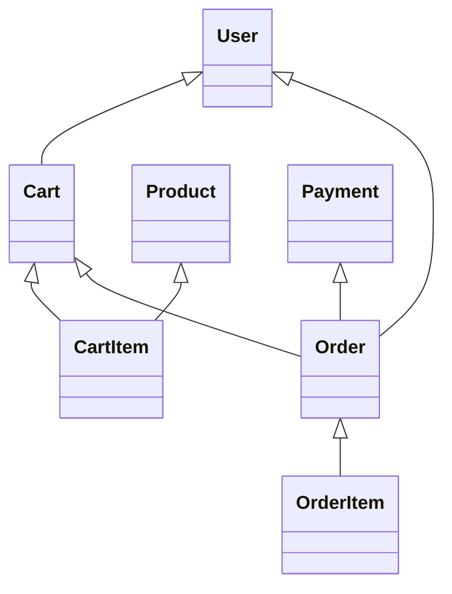
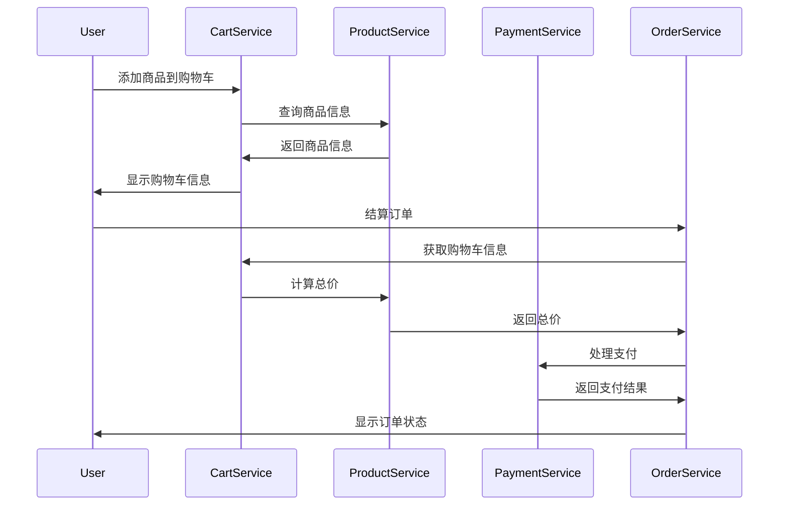
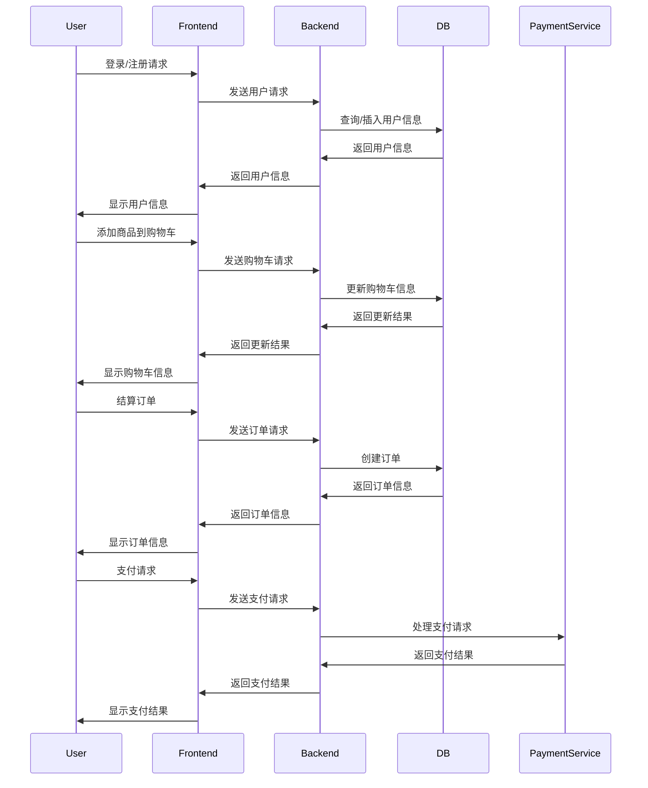

                 


### 第一部分: 技术面试官的素养构建

在成为一名优秀的技术面试官的道路上，素养构建是至关重要的基础。这一部分将从角色定位、能力培养、心理素质和沟通技巧四个方面，详细探讨技术面试官应具备的素养。

#### 第1章: 面试官的角色定位与能力培养

**1.1 面试官的职责与期望**

面试官的角色不仅仅是提问和评分，更是招聘过程中的桥梁，连接着公司和技术人才。面试官需要具备以下职责和期望：

- **评估应聘者的技术能力和潜力**：通过面试，评估应聘者的专业知识、技能水平和解决实际问题的能力。
- **提供真实的工作场景**：通过面试题和面试形式，让应聘者感受到真实的工作环境和挑战，更好地了解公司文化。
- **有效沟通和反馈**：与应聘者进行有效的沟通，给予建设性的反馈，帮助他们了解自己的优势和不足。

**1.2 技术面试官的专业能力要求**

技术面试官需要具备扎实的技术背景，这样才能准确地评估应聘者的技术能力。以下是一些专业能力要求：

- **广泛的技术知识**：掌握至少一个或多个技术领域的核心知识，如编程语言、数据结构、算法、数据库、操作系统等。
- **实践经验**：具备一定年限的软件开发或相关工作经验，能够理解实际开发中的挑战和问题。
- **持续学习**：技术领域日新月异，面试官需要持续学习，跟上最新的技术趋势和变化。

**1.3 面试官的心理素质与沟通技巧**

面试官在面试过程中，不仅需要关注技术问题，还要关注应聘者的心理状态和沟通方式。以下是一些心理素质和沟通技巧：

- **情绪管理**：保持冷静和客观，避免在面试过程中表现出明显的情绪波动。
- **倾听能力**：仔细倾听应聘者的回答，确保理解他们的观点和思路。
- **提问技巧**：通过开放式问题和情境模拟，引导应聘者深入思考，展示他们的能力。
- **反馈能力**：给予应聘者清晰、具体的反馈，帮助他们理解自己的表现和改进方向。

#### 第2章: 技术面试的基本流程

技术面试是一个系统化的过程，包括面试前的准备、面试过程中的技巧以及面试后的反馈和总结。以下将详细探讨每个环节的重要性。

**2.1 面试前的准备**

面试前的准备工作是面试成功的关键。面试官需要：

- **了解应聘者背景**：查阅应聘者的简历，了解他们的教育背景、工作经历和项目经验。
- **准备面试题目**：根据应聘者的背景和职位要求，设计合适的面试题目。
- **熟悉公司文化**：了解公司的价值观、文化氛围和工作流程，以便在面试中与应聘者进行有效沟通。

**2.2 面试过程中的技巧**

面试过程中的技巧决定了面试的质量和效果。面试官需要：

- **营造良好的面试氛围**：通过友好的态度和恰当的沟通方式，让应聘者放松，展示真实的自己。
- **掌握提问技巧**：通过开放式问题和引导性问题，引导应聘者深入思考，展示他们的能力。
- **注意时间管理**：确保面试在规定时间内完成，避免因时间不足或过长而影响面试效果。

**2.3 面试后的反馈与总结**

面试后的反馈和总结是评估面试效果和改进面试流程的重要环节。面试官需要：

- **及时给予反馈**：在面试结束后，及时向应聘者提供反馈，包括他们的表现、优势和需要改进的地方。
- **总结面试经验**：对每个面试过程进行总结，分析成功和失败的原因，为下一次面试提供参考。

#### 第3章: 技术面试题的设计与评估

面试题的设计和评估是技术面试的核心环节。一个优秀的面试题能够全面评估应聘者的技术能力和潜力。以下将探讨面试题的类型、评估标准和题库的构建与维护。

**3.1 面试题的类型与分类**

面试题可以分为以下几种类型：

- **基础知识题**：考察应聘者对基本概念、理论的理解。
- **编程实现题**：考察应聘者的编程能力和问题解决能力。
- **算法设计题**：考察应聘者对算法和数据结构的掌握。
- **行为面试题**：考察应聘者的工作态度、团队合作能力等。

**3.2 面试题的评估标准**

面试题的评估标准包括：

- **解决问题的能力**：考察应聘者是否能够找到合适的解决方案。
- **编程风格与代码质量**：考察应聘者的编程习惯和代码的可读性。
- **沟通能力**：考察应聘者是否能够清晰、准确地表达自己的想法。

**3.3 面试题库的构建与维护**

面试题库的构建和维护是一个长期的过程。面试官需要：

- **收集和整理面试题**：从实际面试中收集成功的面试题，并进行分类整理。
- **定期更新题库**：根据技术趋势和公司需求，定期更新面试题库，确保题目的时效性和有效性。
- **题库管理**：使用合适的工具进行题库管理，方便面试官进行题目检索和分发。

### 第4章: 编程面试的核心技术

编程面试的核心技术主要包括数据结构与算法、软件开发流程与工具、以及实时编程面试技巧。这一章节将详细探讨这些核心技术的应用和技巧。

**4.1 数据结构与算法**

数据结构与算法是编程面试的基石。以下是一些关键点：

- **常见的数据结构**：如数组、链表、栈、队列、树、图等。
- **常见的算法**：如排序算法、搜索算法、动态规划、贪心算法等。
- **面试题应用**：通过实际面试题，如“两数之和”、“最长公共子序列”等，展示数据结构与算法的应用。

**4.2 软件开发流程与工具**

软件开发流程与工具是面试官考察应聘者项目经验和团队合作能力的重要方面。以下是一些关键点：

- **软件开发流程**：如敏捷开发、瀑布开发等。
- **版本控制工具**：如Git、SVN等。
- **持续集成工具**：如Jenkins、Travis CI等。
- **代码审查工具**：如SonarQube、Gerrit等。

**4.3 实时编程面试技巧**

实时编程面试是考察应聘者编程能力和应变能力的重要环节。以下是一些关键点：

- **在线编程平台**：如LeetCode、CodeSignal等。
- **编程语言选择**：根据应聘者的专业背景和面试岗位，选择合适的编程语言。
- **时间管理**：在规定时间内完成编程任务，确保代码质量和逻辑清晰。
- **代码调试**：能够快速定位并解决编程中的问题。

### 第5章: 行为面试与情境模拟

行为面试和情境模拟是面试官评估应聘者工作态度、沟通能力和团队合作能力的重要方式。这一章节将详细探讨这些方法的应用和技巧。

**5.1 行为面试的技巧**

行为面试通过提问应聘者在以往工作中遇到的问题和解决方案，评估他们的工作态度和能力。以下是一些关键点：

- **STAR法则**：面试官通过情境（Situation）、任务（Task）、行动（Action）和结果（Result）四个方面提问。
- **开放式问题**：鼓励应聘者详细描述他们的经历，展示他们的思维过程。
- **行为面试题**：如“描述一次你解决问题的经历”、“描述一次你团队合作的经历”等。

**5.2 情境模拟的设置与应用**

情境模拟是通过模拟工作场景，评估应聘者的应变能力和解决问题的能力。以下是一些关键点：

- **设置模拟情境**：如项目管理、技术挑战、团队冲突等。
- **评估标准**：如沟通能力、决策能力、解决问题能力等。
- **情境模拟题**：如“如何在一个紧迫的项目期限内完成任务”、“如何解决团队中的分歧”等。

**5.3 行为面试的案例分析**

通过实际案例，我们可以更清晰地了解行为面试和情境模拟的应用和效果。以下是一个案例分析：

- **情境**：一个应聘者曾在项目中遇到技术难题，他如何解决？
- **行动**：他查阅资料、与技术专家讨论，并最终找到了解决方案。
- **结果**：项目顺利完成，得到了团队和客户的高度评价。

### 第6章: 多轮面试与团队协作

多轮面试和团队协作是确保招聘质量和效率的重要手段。这一章节将探讨多轮面试的策略、团队协作面试的实施以及面试官之间的沟通协调。

**6.1 多轮面试的策略**

多轮面试可以帮助公司更全面地了解应聘者，同时也有利于应聘者更好地了解公司。以下是一些关键点：

- **多轮面试的好处**：更全面的评估、更深入的沟通、更明确的招聘决策。
- **多轮面试的类型**：技术面试、行为面试、情境模拟、团队面试等。
- **多轮面试的策略**：根据应聘者的表现和岗位需求，合理安排面试轮次和内容。

**6.2 团队协作面试的实施**

团队协作面试是评估应聘者团队协作能力和沟通能力的重要方式。以下是一些关键点：

- **团队面试的好处**：更真实的工作场景、更全面的评估、更有利于团队文化的建设。
- **团队面试的难点**：平衡不同团队成员的意见、确保面试公正性等。
- **团队面试的实施**：设置合理的面试流程、明确面试官的职责和角色、制定评估标准。

**6.3 面试官之间的沟通协调**

面试官之间的沟通协调是确保面试质量和效果的关键。以下是一些关键点：

- **沟通协调的重要性**：确保面试的一致性和有效性、提高面试官的工作效率。
- **沟通协调的方法**：定期召开面试官会议、共享面试反馈、明确沟通渠道和方式等。
- **沟通协调的注意事项**：尊重每位面试官的意见、避免信息不对称、确保沟通的及时性和准确性。

### 第7章: 面试官的自我提升之路

面试官的自我提升是持续提高面试质量和效果的重要途径。这一章节将探讨面试官的持续学习、职业规划和口碑影响力。

**7.1 持续学习与技能更新**

技术领域的快速发展要求面试官不断学习，更新自己的知识和技能。以下是一些关键点：

- **学习的重要性**：确保面试官具备最新的技术知识和面试技巧。
- **学习的方法**：参加技术会议、阅读专业书籍、在线课程等。
- **学习的挑战**：平衡工作和学习、保持学习的动力和兴趣。

**7.2 面试官的职业规划**

面试官的职业规划可以帮助他们更好地规划自己的职业生涯，提高面试官的职业素养和竞争力。以下是一些关键点：

- **职业规划的重要性**：明确职业目标、制定职业发展路径、提升职业素养。
- **职业规划的方法**：自我评估、设定目标、制定计划、持续跟踪和调整。

**7.3 面试官的口碑与影响力**

面试官的口碑和影响力是评估其能力和价值的直接体现。以下是一些关键点：

- **口碑与影响力的定义**：面试官在行业内和招聘界的声誉、评价和认可。
- **口碑与影响力的来源**：优秀的面试技巧、专业的技术知识、良好的沟通能力等。
- **口碑与影响力的提升**：积极参与技术社区、撰写高质量的技术博客、分享面试经验等。

### 文章小结

本文从技术面试官的角色定位、能力培养、面试流程、面试题设计、核心技术、行为面试、多轮面试、自我提升等方面，全面探讨了技术面试官的能力提升之道。通过本文的阅读，相信读者能够对技术面试官的角色和要求有更深入的理解，并为自身的提升提供有益的参考。

### 注意事项

- **面试前准备**：提前了解应聘者背景，准备合适的面试题目。
- **面试过程中**：保持友好态度，关注应聘者心理状态，有效沟通。
- **面试后反馈**：及时给予反馈，总结面试经验，持续改进。

### 拓展阅读

- 《技术面试题精讲与实战》
- 《面试官实战指南：行为面试与情境模拟》
- 《程序员面试金典》

### 作者介绍

作者：AI天才研究院/AI Genius Institute & 禅与计算机程序设计艺术 /Zen And The Art of Computer Programming

AI天才研究院致力于推动人工智能技术的发展和应用，研究院的成员们在人工智能、机器学习、自然语言处理等领域有着深厚的理论基础和丰富的实践经验。同时，作者也以其独特的视角和深入浅出的讲解，为广大读者撰写了一系列关于计算机编程和人工智能的畅销书，深受读者喜爱。本文旨在帮助技术面试官提升自身能力，为技术人才的选拔贡献力量。### 背景介绍

在技术飞速发展的今天，技术面试官的角色越来越重要。他们不仅要具备深厚的技术背景，还需要掌握丰富的面试技巧和沟通能力。技术面试官是连接公司和应聘者之间的桥梁，他们的职责不仅仅是提问和评分，更重要的是通过面试过程，全面评估应聘者的技术能力、潜力以及团队合作精神。一个优秀的面试官能够为公司筛选出最合适的人才，同时也能帮助应聘者更好地了解自己和公司，实现双赢。

本文将从多个维度探讨技术面试官的能力提升之道。首先，我们将介绍面试官的角色定位与能力要求，包括专业能力、沟通技巧和心理素质等方面。接着，我们将详细讨论技术面试的基本流程，包括面试前的准备、面试过程中的技巧以及面试后的反馈和总结。随后，文章将重点探讨面试题的设计与评估，介绍面试题的类型、评估标准和题库的构建与维护。此外，文章还将深入探讨编程面试的核心技术、行为面试与情境模拟、多轮面试与团队协作等内容。最后，我们将探讨面试官的自我提升之路，包括持续学习、职业规划和口碑影响力等方面。

通过本文的阅读，读者将全面了解技术面试官的角色和职责，掌握提升面试官能力的有效方法，从而成为一名更加优秀的技术面试官。

### 核心概念与联系

要成为一名优秀的技术面试官，首先需要理解并掌握一系列核心概念，这些概念不仅是面试过程中必不可少的，也是构建面试官能力的基础。以下是几个关键的核心概念以及它们之间的联系：

1. **面试官的能力要求**：
   - **专业知识**：技术面试官需要具备扎实的专业背景，如编程语言、数据结构、算法、数据库等，这是评估应聘者技术能力的基础。
   - **面试技巧**：包括提问技巧、倾听技巧、沟通技巧等，这些技巧有助于面试官更有效地与应聘者交流，获取准确的信息。
   - **心理素质**：面试官需要具备良好的情绪管理和应变能力，以应对不同应聘者的表现和面试过程中的突发情况。

2. **面试流程**：
   - **面试前的准备**：包括了解应聘者背景、准备面试题目、熟悉公司文化和岗位要求等，这是面试成功的第一步。
   - **面试过程中的技巧**：如营造良好的面试氛围、有效沟通、合理提问等，这些技巧直接影响到面试的效果和应聘者的体验。
   - **面试后的反馈与总结**：及时给予应聘者反馈，总结面试经验和发现的问题，为后续的面试提供改进的方向。

3. **面试题的设计与评估**：
   - **面试题的类型与分类**：包括基础知识题、编程实现题、算法设计题、行为面试题等，不同的题目类型用于评估应聘者的不同能力。
   - **评估标准**：如解决问题的能力、编程风格、沟通能力等，这些标准帮助面试官客观、全面地评估应聘者的表现。
   - **题库的构建与维护**：一个良好的题库是面试官的重要资源，能够确保面试题的多样性和覆盖面。

4. **编程面试的核心技术**：
   - **数据结构与算法**：这是编程面试的核心内容，应聘者需要展示他们对基本数据结构和算法的理解和应用能力。
   - **软件开发流程与工具**：包括敏捷开发、版本控制、持续集成等，这些知识反映应聘者的项目经验和团队协作能力。
   - **实时编程面试技巧**：如时间管理、代码调试、问题解决能力等，这些技巧直接影响应聘者在面试中的表现。

5. **行为面试与情境模拟**：
   - **行为面试**：通过提问应聘者在过去工作中遇到的问题和解决方案，评估他们的工作态度和实际能力。
   - **情境模拟**：通过模拟实际工作场景，评估应聘者的应变能力和解决问题的能力。

6. **多轮面试与团队协作**：
   - **多轮面试**：通过多轮面试，公司可以更全面地了解应聘者，同时也有利于应聘者更深入地了解公司。
   - **团队协作**：通过团队面试和情境模拟，评估应聘者的团队合作精神和沟通能力。

通过理解这些核心概念及其相互之间的联系，技术面试官可以更系统地提升自己的能力，从而成为一名更加专业和高效的面试官。

### 算法原理讲解

在技术面试中，面试题的设计与评估是一个复杂的过程，需要面试官结合岗位需求和技术趋势，科学地设计面试题，并准确地评估应聘者的表现。以下将从面试题的类型、评估标准和题库的构建与维护三个方面，详细讲解面试题的设计与评估原则。

#### 面试题的类型与分类

面试题可以根据考察的内容和形式进行分类，常见的类型包括：

1. **基础知识题**：这类题目主要考察应聘者对基本概念、理论的理解。例如，问应聘者关于数据结构、算法、数据库原理等的基础知识。

2. **编程实现题**：这类题目要求应聘者编写代码解决特定问题，主要考察应聘者的编程能力和问题解决能力。例如，编写一个函数实现两个数的加法，或者编写一个简单的排序算法。

3. **算法设计题**：这类题目要求应聘者设计和实现算法，解决复杂的编程问题。例如，设计一个算法找出数组中的第k个最大元素，或者实现一个最小生成树算法。

4. **行为面试题**：这类题目通过提问应聘者在过去工作中遇到的问题和解决方案，评估应聘者的工作态度、团队合作能力和解决问题的能力。例如，询问应聘者如何处理团队冲突，或者如何在一个紧迫的项目期限内完成任务。

5. **情境模拟题**：这类题目通过模拟实际工作场景，评估应聘者的应变能力和解决问题的能力。例如，设置一个项目管理场景，要求应聘者制定项目计划和分配任务。

#### 面试题的评估标准

在评估应聘者的表现时，面试官需要依据以下标准：

1. **解决问题的能力**：这是评估应聘者技术能力的重要标准。面试官需要考察应聘者是否能够理解问题，并设计出有效的解决方案。

2. **编程风格与代码质量**：良好的编程风格和高质量的代码是评估应聘者编程能力的重要指标。面试官需要评估代码的可读性、可维护性、代码效率等。

3. **沟通能力**：面试官需要考察应聘者是否能够清晰、准确地表达自己的思路和想法。沟通能力不仅是技术面试的重要部分，也是职场中不可或缺的能力。

4. **团队合作能力**：通过行为面试和情境模拟，面试官可以评估应聘者在团队中的表现，包括沟通协作、冲突解决和领导能力等。

#### 面试题库的构建与维护

一个良好的面试题库是面试官的重要资源，能够确保面试题的多样性和覆盖面。以下是构建和维护面试题库的方法：

1. **收集和整理题库**：面试官可以从实际面试经验中收集成功的面试题，并根据不同技术领域和岗位需求进行分类整理。

2. **定期更新题库**：技术领域日新月异，面试官需要定期更新题库，确保题目与时俱进，反映最新的技术趋势和公司需求。

3. **题库管理**：使用合适的工具进行题库管理，如数据库或在线题库系统，方便面试官进行题目检索、分发和评估。

4. **题库共享**：鼓励面试官之间共享面试题库，积累更多的经验和资源，提高面试的整体质量。

#### 面试题库的示例

以下是一个面试题库的示例，展示了不同类型的面试题：

1. **基础知识题**：
   - 请简述快速排序算法的基本原理。

2. **编程实现题**：
   - 编写一个函数，实现两个整数的加法，不使用 `+` 或 `-` 运算符。

3. **算法设计题**：
   - 设计一个算法，找出数组中的第k个最大元素。

4. **行为面试题**：
   - 描述一次你在项目中遇到的最大挑战，以及你是如何解决的。

5. **情境模拟题**：
   - 假设你正在负责一个即将上线的重要项目，但是团队成员之间出现了严重的分歧，你该如何处理？

通过这样的题库，面试官可以根据具体岗位的需求，灵活选择合适的题目，全面评估应聘者的技术能力和潜力。

### 数学模型和数学公式 & 详细讲解 & 举例说明

在技术面试题的设计与评估过程中，数学模型和数学公式是不可或缺的工具。以下将介绍几个常用的数学模型和数学公式，并详细讲解其应用和举例说明。

#### 1. 线性回归模型

线性回归模型是一种用于预测数值型数据的常用统计方法。其数学公式为：

$$
y = wx + b
$$

其中，$y$ 是因变量，$x$ 是自变量，$w$ 是权重（斜率），$b$ 是偏置（截距）。

**应用举例**：

假设我们要预测某个电商平台的月销售额，我们可以使用线性回归模型来建立预测模型。通过收集历史数据，我们可以得到自变量（如广告投放费用、促销活动次数等）和因变量（月销售额）的关系，进而计算出权重和偏置。

#### 2. 决策树模型

决策树模型是一种用于分类和回归分析的方法。其基本结构包括根节点、内部节点和叶节点。数学公式为：

$$
\text{决策树} = \text{根节点} + \text{内部节点} + \text{叶节点}
$$

**应用举例**：

假设我们要对一批客户进行分类，判断他们是否会购买某个产品。我们可以通过收集客户的历史购买记录、年龄、收入等特征，构建一个决策树模型，逐步筛选出特征并划分不同类别的客户。

#### 3. 贪心算法

贪心算法是一种在每一步选择中选择当前最优解的方法。其数学公式为：

$$
\text{贪心算法} = \text{初始状态} + \text{选择最优解} + \text{更新状态}
$$

**应用举例**：

假设我们要在给定的一组城市中，选择一条最短的路径进行旅行。我们可以使用贪心算法，每一步都选择当前最优的路径，最终得到一条总长度最短的路。

#### 4. 动态规划

动态规划是一种用于解决最优化问题的方法，其核心思想是将复杂问题分解为多个子问题，并利用子问题的最优解来求解原问题。其数学公式为：

$$
\text{动态规划} = \text{定义子问题} + \text{求解子问题} + \text{构建最优解}
$$

**应用举例**：

假设我们要求解一个背包问题，即在一个给定的背包容量下，选择若干物品使得总价值最大。我们可以通过动态规划，将问题分解为子问题，并利用子问题的最优解来构建原问题的最优解。

#### 5. 贝叶斯公式

贝叶斯公式是一种用于概率推断的数学公式，其基本形式为：

$$
P(A|B) = \frac{P(B|A) \cdot P(A)}{P(B)}
$$

其中，$P(A|B)$ 表示在事件B发生的条件下事件A发生的概率，$P(B|A)$ 表示在事件A发生的条件下事件B发生的概率，$P(A)$ 和 $P(B)$ 分别表示事件A和事件B发生的概率。

**应用举例**：

假设我们要评估一个应聘者的技术水平，我们可以通过收集多个参考指标（如学历、工作经验、项目经验等），利用贝叶斯公式计算应聘者具备某一技术水平的概率。

通过以上数学模型和数学公式的应用，面试官可以更加科学和系统地设计面试题，评估应聘者的技术能力和潜力。这些模型和公式不仅有助于面试官理解技术原理，也为面试提供了有力的工具。

### 系统分析与架构设计方案

在技术面试中，系统分析与架构设计是一个重要的考察点，它不仅反映了应聘者的技术深度和广度，也展示了他们在复杂系统设计中的思维能力和实际操作经验。以下将从问题场景介绍、系统功能设计、系统架构设计以及系统接口设计和系统交互四个方面，详细阐述系统分析与架构设计方案。

#### 问题场景介绍

假设我们正在为一个电商平台开发一个购物车功能，该功能需要支持用户添加、删除商品，计算总价，以及支持多种支付方式。在这个场景中，我们需要考虑以下关键问题：

- 如何高效地存储和管理购物车中的商品信息？
- 如何确保购物车的数据一致性？
- 如何实现多种支付方式的集成？
- 如何处理用户的异常操作，如商品库存不足等？

通过这些问题场景的介绍，我们可以明确系统设计和开发的目标和需求，从而为后续的架构设计提供依据。

#### 系统功能设计

在系统功能设计中，我们需要明确系统需要实现的核心功能，这些功能通常包括：

1. **用户管理**：用户登录、注册、权限管理等功能。
2. **商品管理**：商品信息添加、删除、更新、查询等功能。
3. **购物车管理**：商品添加到购物车、从购物车中删除商品、更新购物车中的商品数量、计算总价等功能。
4. **支付管理**：支持多种支付方式，如支付宝、微信支付、银联支付等，并进行支付验证和处理。
5. **订单管理**：生成订单、订单查询、订单状态更新等功能。

以下是一个基于Mermaid的领域模型类图，用于展示系统中的主要类及其关系：



在这个类图中，我们可以看到用户（User）与购物车（Cart）和订单（Order）有直接关联，商品（Product）与购物车中的商品项（CartItem）关联，支付（Payment）与订单关联，订单还包含订单项（OrderItem）。

#### 系统架构设计

系统架构设计是系统设计与开发中的关键环节，它决定了系统的扩展性、可靠性和性能。以下是一个使用Mermaid绘制的系统架构图，展示了系统的组成部分及其相互关系：



在这个架构图中，用户通过前端接口与CartService进行交互，CartService负责处理购物车相关的功能，如添加商品、更新商品数量等。ProductService负责处理商品相关的功能，如查询商品信息、计算总价等。PaymentService负责处理支付功能，如支付宝、微信支付等。OrderService负责处理订单相关的功能，如生成订单、更新订单状态等。

#### 系统接口设计

系统接口设计是系统架构设计的重要组成部分，它定义了系统内部以及与外部系统进行交互的接口规范。以下是一个简单的接口设计示例：

1. **用户管理接口**：
   - 用户登录：`POST /user/login`
   - 用户注册：`POST /user/register`
   - 用户信息更新：`PUT /user/{userId}`

2. **商品管理接口**：
   - 商品信息查询：`GET /product/{productId}`
   - 商品信息添加：`POST /product`
   - 商品信息更新：`PUT /product/{productId}`
   - 商品信息删除：`DELETE /product/{productId}`

3. **购物车管理接口**：
   - 添加商品到购物车：`POST /cart/{userId}`
   - 更新购物车商品数量：`PUT /cart/{userId}/{productId}`
   - 从购物车中删除商品：`DELETE /cart/{userId}/{productId}`
   - 获取购物车信息：`GET /cart/{userId}`

4. **支付管理接口**：
   - 支付请求：`POST /payment`
   - 支付查询：`GET /payment/{paymentId}`
   - 支付结果处理：`POST /payment/callback`

5. **订单管理接口**：
   - 订单创建：`POST /order`
   - 订单查询：`GET /order/{orderId}`
   - 订单状态更新：`PUT /order/{orderId}`

#### 系统交互

系统交互设计描述了系统内部以及与外部系统之间的数据流和交互过程。以下是一个使用Mermaid绘制的系统交互序列图，展示了用户与系统之间的交互过程：



在这个交互图中，用户通过前端向系统发送请求，系统后端处理这些请求，并与数据库进行交互，最终将结果返回给前端。支付过程则涉及后端与外部支付服务的交互。

通过以上系统分析与架构设计方案，我们可以清晰地展示系统的功能、架构和交互过程，从而帮助应聘者更好地理解系统设计和开发的复杂性，同时为面试官提供了一个全面的评估标准。

### 项目实战

在技术面试中，项目实战环节是一个重要的评估点，它不仅能够检验应聘者的编程能力和实际操作经验，还能展示他们在面对复杂项目时的解决问题的能力。以下将通过一个具体的案例，详细阐述项目实战的各个阶段，包括环境安装、系统核心实现源代码、代码应用解读与分析、实际案例分析和详细讲解剖析。

#### 环境安装

在进行项目实战之前，我们需要搭建一个合适的技术环境。以下是一个基于Python的简单电商平台的安装步骤：

1. **安装Python**：确保系统中安装了Python 3.x版本，可以从[Python官网](https://www.python.org/downloads/)下载并安装。

2. **安装依赖库**：使用pip命令安装项目所需的依赖库，如Flask（用于Web开发）、SQLAlchemy（用于数据库操作）、Flask-Migrate（用于数据库迁移）等。例如：

   ```shell
   pip install Flask SQLAlchemy Flask-Migrate
   ```

3. **创建虚拟环境**：为了方便管理和隔离项目依赖，可以使用`venv`命令创建一个虚拟环境，并激活该环境：

   ```shell
   python -m venv my_project_env
   source my_project_env/bin/activate  # Windows上使用 `my_project_env\Scripts\activate`
   ```

4. **配置数据库**：使用SQLAlchemy连接到数据库，通常可以使用SQLite、MySQL或PostgreSQL等数据库。以下是一个简单的SQLite配置示例：

   ```python
   from flask_sqlalchemy import SQLAlchemy

   app = Flask(__name__)
   app.config['SQLALCHEMY_DATABASE_URI'] = 'sqlite:///my_db.sqlite3'
   db = SQLAlchemy(app)
   ```

5. **运行数据库迁移**：使用Flask-Migrate初始化数据库迁移，创建所需的数据库表：

   ```shell
   flask db init
   flask db migrate -m "Initial migration."
   flask db upgrade
   ```

#### 系统核心实现源代码

以下是一个简单的电商平台项目核心代码实现，包括用户管理、商品管理、购物车管理、订单管理和支付管理等功能。

**用户管理**：

```python
# models.py
from datetime import datetime
from werkzeug.security import generate_password_hash, check_password_hash
from flask_sqlalchemy import SQLAlchemy

db = SQLAlchemy()

class User(db.Model):
    id = db.Column(db.Integer, primary_key=True)
    username = db.Column(db.String(64), unique=True, nullable=False)
    email = db.Column(db.String(120), unique=True, nullable=False)
    password_hash = db.Column(db.String(128))
    created_at = db.Column(db.DateTime, default=datetime.utcnow)

    def set_password(self, password):
        self.password_hash = generate_password_hash(password)

    def check_password(self, password):
        return check_password_hash(self.password_hash, password)
```

**商品管理**：

```python
# models.py
class Product(db.Model):
    id = db.Column(db.Integer, primary_key=True)
    name = db.Column(db.String(120), nullable=False)
    description = db.Column(db.Text, nullable=True)
    price = db.Column(db.Numeric(10, 2), nullable=False)
    stock = db.Column(db.Integer, nullable=False)
    created_at = db.Column(db.DateTime, default=datetime.utcnow)
```

**购物车管理**：

```python
# models.py
class Cart(db.Model):
    id = db.Column(db.Integer, primary_key=True)
    user_id = db.Column(db.Integer, db.ForeignKey('user.id'), nullable=False)
    created_at = db.Column(db.DateTime, default=datetime.utcnow)

class CartItem(db.Model):
    id = db.Column(db.Integer, primary_key=True)
    cart_id = db.Column(db.Integer, db.ForeignKey('cart.id'), nullable=False)
    product_id = db.Column(db.Integer, db.ForeignKey('product.id'), nullable=False)
    quantity = db.Column(db.Integer, nullable=False)
    created_at = db.Column(db.DateTime, default=datetime.utcnow)
```

**订单管理**：

```python
# models.py
class Order(db.Model):
    id = db.Column(db.Integer, primary_key=True)
    user_id = db.Column(db.Integer, db.ForeignKey('user.id'), nullable=False)
    status = db.Column(db.String(50), nullable=False, default='pending')
    total_price = db.Column(db.Numeric(10, 2), nullable=False)
    created_at = db.Column(db.DateTime, default=datetime.utcnow)

class OrderItem(db.Model):
    id = db.Column(db.Integer, primary_key=True)
    order_id = db.Column(db.Integer, db.ForeignKey('order.id'), nullable=False)
    product_id = db.Column(db.Integer, db.ForeignKey('product.id'), nullable=False)
    quantity = db.Column(db.Integer, nullable=False)
    price = db.Column(db.Numeric(10, 2), nullable=False)
    created_at = db.Column(db.DateTime, default=datetime.utcnow)
```

**支付管理**：

```python
# controllers.py
from flask import request, jsonify
from models import db, Payment

@app.route('/payment', methods=['POST'])
def process_payment():
    payment_data = request.form.to_dict()
    payment = Payment(
        amount=payment_data['amount'],
        status=payment_data['status'],
        transaction_id=payment_data['transaction_id'],
        created_at=datetime.utcnow()
    )
    db.session.add(payment)
    db.session.commit()
    return jsonify({'message': 'Payment processed successfully.'})
```

#### 代码应用解读与分析

以上代码展示了电商平台的核心功能模块，包括用户管理、商品管理、购物车管理、订单管理和支付管理。以下是对关键部分的解读与分析：

1. **用户管理**：通过定义User模型，实现了用户注册、登录和密码加密存储的功能。用户模型包含了用户的基本信息，如用户名、电子邮件和密码等。

2. **商品管理**：Product模型表示商品信息，包括商品名称、描述、价格和库存量等。这些信息通过数据库进行持久化存储，以便在系统中进行查询和管理。

3. **购物车管理**：Cart和CartItem模型共同构成了购物车功能的核心。Cart模型表示购物车，包含用户ID和创建时间等信息；CartItem模型表示购物车中的商品项，包含商品ID、数量和创建时间等信息。

4. **订单管理**：Order和OrderItem模型共同实现了订单管理功能。Order模型表示订单，包含用户ID、订单状态、总价和创建时间等信息；OrderItem模型表示订单中的商品项，包含商品ID、数量、价格和创建时间等信息。

5. **支付管理**：支付管理通过一个简单的接口实现了支付请求的处理。支付请求通过POST方法发送，包括支付金额、支付状态和交易ID等信息。支付成功后，支付信息将被持久化存储。

#### 实际案例分析和详细讲解剖析

以下是一个具体的实际案例，用于展示如何在项目中实现购物车的添加和结算功能。

**案例**：用户添加商品到购物车并结算订单。

1. **用户添加商品到购物车**：

   ```python
   # controllers.py
   from flask import request, jsonify
   from models import db, Cart, CartItem

   @app.route('/cart', methods=['POST'])
   def add_to_cart():
       cart_item = CartItem(
           cart_id=request.form.get('cart_id'),
           product_id=request.form.get('product_id'),
           quantity=int(request.form.get('quantity'))
       )
       db.session.add(cart_item)
       db.session.commit()
       return jsonify({'message': 'Item added to cart successfully.'})
   ```

   解读：在添加商品到购物车的接口中，我们接收用户提交的购物车ID、商品ID和商品数量。然后，我们创建一个CartItem对象，并将其添加到数据库中。

2. **用户结算订单**：

   ```python
   # controllers.py
   from flask import request, jsonify
   from models import db, Order, OrderItem

   @app.route('/order', methods=['POST'])
   def create_order():
       cart_id = request.form.get('cart_id')
       cart_items = CartItem.query.join(Cart).filter(Cart.id == cart_id).all()
       total_price = sum(item.quantity * item.product.price for item in cart_items)
       
       order = Order(
           user_id=cart_items[0].cart.user_id,
           total_price=total_price,
           status='pending'
       )
       db.session.add(order)
       db.session.commit()
       
       for item in cart_items:
           order_item = OrderItem(
               order_id=order.id,
               product_id=item.product_id,
               quantity=item.quantity,
               price=item.product.price
           )
           db.session.add(order_item)
           db.session.delete(item)
       
       db.session.commit()
       return jsonify({'message': 'Order created successfully.'})
   ```

   解读：在结算订单的接口中，我们首先获取购物车中的所有商品项，并计算总价。然后，我们创建一个订单对象，并将其添加到数据库中。接着，我们将每个商品项添加到订单项中，并从购物车中删除对应的商品项。

通过以上实际案例，我们可以看到项目实战是如何结合具体业务需求，实现系统的各个功能模块，并通过代码进行详细讲解和剖析。

#### 项目小结

通过本次项目实战，我们详细阐述了电商平台项目从环境安装到系统核心实现源代码，再到代码应用解读与分析的过程。在这个过程中，我们不仅了解了项目实战的各个阶段，还通过具体的代码示例，掌握了如何实现用户管理、商品管理、购物车管理、订单管理和支付管理等核心功能。这次实战不仅有助于提升我们的编程能力和实际操作经验，也为技术面试中项目实战部分的应对提供了有力支持。

### 最佳实践 tips

1. **准备充分**：在面试前，确保详细了解应聘者的背景资料和职位要求，准备合适的面试题目和案例。

2. **合理分配时间**：在面试过程中，合理分配时间，确保每个问题都有足够的时间进行深入讨论。

3. **提问技巧**：通过开放式问题和情境模拟，引导应聘者深入思考，展示他们的能力。

4. **关注细节**：在评估应聘者时，不仅要关注他们的技术能力，还要关注他们的沟通能力和团队合作精神。

5. **及时反馈**：在面试结束后，及时向应聘者提供反馈，包括他们的表现、优势和需要改进的地方。

6. **持续学习**：技术领域日新月异，面试官需要不断学习，更新自己的知识和技能。

7. **建立题库**：构建和维护一个丰富的面试题库，确保面试题的多样性和时效性。

8. **团队协作**：在多轮面试中，确保面试官之间的沟通协调，提高面试的整体质量。

通过遵循这些最佳实践，技术面试官可以更有效地评估应聘者的技术能力和潜力，为公司的招聘工作提供有力支持。

