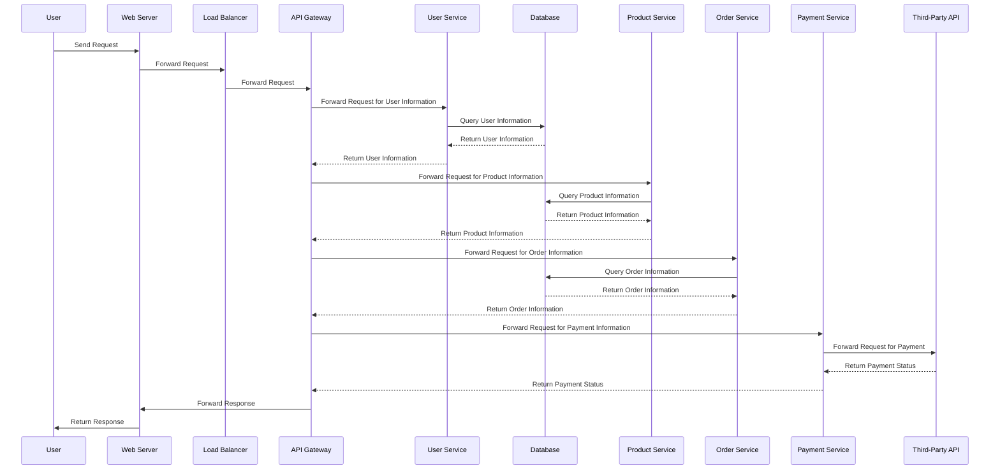
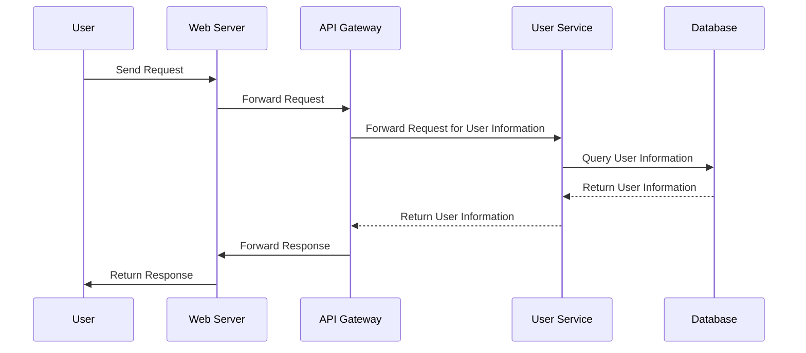

                 


## 引言

### 第1章: 技术面试官的进阶之路

**1.1 问题背景**

#### 1.1.1 技术面试的现状

技术面试是软件工程、互联网和计算机科学等领域中非常关键的一环。它不仅关乎公司能否找到合适的人才，也关乎个人职业生涯的发展。随着技术的快速发展和市场需求的变化，技术面试官面临的挑战也日益增多。

首先，面试官需要具备广泛的技术知识，不仅要熟悉计算机科学的基本原理，还要了解最新的技术趋势。例如，随着云计算、大数据、人工智能等技术的发展，面试官需要不断更新自己的知识库，以确保能够准确地评估候选人的技术水平。

其次，面试流程的优化也是一个重要的挑战。传统的面试流程往往较为耗时，且容易受到主观因素的影响，导致评估结果不够准确。因此，如何通过优化面试流程来提高面试效率，成为了面试官需要面对的问题。

最后，如何准确评估候选人的真实能力，也是一个难题。在技术面试中，候选人可能会通过技巧性的回答来展示自己的能力，而面试官则需要通过一系列的问题和技巧来揭示候选人的实际技术水平。

#### 1.1.2 面试官面临的挑战

面对上述挑战，面试官需要不断提升自己的技术能力和面试技巧。以下是一些具体的挑战：

1. **技术知识更新**：随着技术的快速发展，面试官需要不断学习新的技术知识和技能，以保持自己的竞争力。

2. **面试流程优化**：面试官需要设计高效的面试流程，确保在有限的时间内能够全面、准确地评估候选人的能力。

3. **评估标准制定**：面试官需要制定科学合理的评估标准，确保评估结果的准确性和公正性。

4. **沟通技巧提升**：面试官需要具备良好的沟通技巧，以确保与候选人之间的沟通顺畅，从而更好地了解候选人的实际能力。

#### 1.1.3 面试官的自我提升需求

为了应对上述挑战，面试官需要采取一系列自我提升的措施。以下是一些具体的建议：

1. **持续学习**：通过参加培训课程、阅读专业书籍和博客、参与技术社区等方式，不断更新自己的知识库。

2. **实践演练**：通过模拟面试、参与实际面试等方式，提升自己的面试技巧和评估能力。

3. **经验分享**：与其他面试官进行经验分享和交流，学习他们的成功经验和失败教训。

4. **心理素质培养**：提升自己的心理素质，以应对面试过程中可能出现的各种情况，确保评估过程的客观和公正。

### 1.2 问题描述

#### 1.2.1 如何提升面试官的技术能力

提升面试官的技术能力是确保面试质量的关键。以下是一些具体的建议：

1. **技术知识更新**：定期学习最新的技术趋势和知识，可以通过参加在线课程、阅读专业书籍、关注技术社区等方式实现。

2. **实践项目**：通过实际项目来提升自己的技术能力，这不仅可以加深对技术的理解，还可以提高解决问题的能力。

3. **技术讨论**：与技术社区的同行进行讨论和交流，分享彼此的经验和见解，从而提升自己的技术水平。

#### 1.2.2 如何提高面试效率

提高面试效率是面试官需要面对的另一个挑战。以下是一些具体的建议：

1. **面试流程优化**：设计合理的面试流程，确保面试过程高效且有序。例如，可以提前准备面试问题，合理安排面试时间等。

2. **面试技巧提升**：通过学习面试技巧，如如何有效地提问、如何评估候选人的回答等，来提高面试效率。

3. **技术工具使用**：利用技术工具，如面试管理系统、代码审查工具等，来提高面试的效率和准确性。

#### 1.2.3 如何评估候选人的真实能力

准确评估候选人的真实能力是面试官的重要职责。以下是一些具体的建议：

1. **多维度评估**：从技术能力、项目经验、沟通能力等多个维度来评估候选人，确保评估结果的全面性和准确性。

2. **问题设计**：设计具有针对性、挑战性的面试问题，通过深入的问题来揭示候选人的实际能力。

3. **面试反馈**：对候选人的回答进行及时的反馈和总结，通过反思和总结来提高评估的准确性和效率。

### 1.3 问题解决

#### 1.3.1 确定面试官的能力提升方向

为了确定面试官的能力提升方向，可以采取以下措施：

1. **需求调研**：通过调研公司和技术团队的需求，明确面试官需要提升的技术能力和面试技巧。

2. **能力评估**：对现有的面试官进行能力评估，找出他们的优势和不足，制定相应的提升计划。

3. **培训课程**：根据提升方向，设计相应的培训课程，帮助面试官提升所需的能力。

#### 1.3.2 建立高效的面试流程

建立高效的面试流程是提高面试效率的关键。以下是一些具体的建议：

1. **流程设计**：根据公司的需求和实际情况，设计合理的面试流程，确保面试过程高效且有序。

2. **面试问题库**：建立面试问题库，包括技术问题、行为问题等，确保面试官在面试过程中有充足的问题可用。

3. **时间管理**：合理安排面试时间，确保每个环节都有足够的时间，避免面试过程中的拖延和混乱。

#### 1.3.3 设定合理的评估标准

设定合理的评估标准是确保面试质量的关键。以下是一些具体的建议：

1. **标准制定**：根据公司的需求和实际情况，制定科学合理的评估标准，确保评估结果的准确性和公正性。

2. **标准培训**：对面试官进行评估标准的培训，确保他们能够正确理解和应用评估标准。

3. **反馈机制**：建立反馈机制，对面试官的评估结果进行监督和反馈，确保评估标准的有效性和一致性。

### 1.4 边界与外延

#### 1.4.1 技术领域的边界

技术领域的边界是指技术在发展过程中所面临的限制和挑战。以下是一些具体的内容：

1. **技术成熟度**：技术成熟度是影响面试官评估的重要因素。面试官需要了解技术的成熟度，以便准确评估候选人的技术水平。

2. **技术变革**：技术的快速变革要求面试官具备快速学习的能力，以便适应新的技术趋势。

#### 1.4.2 面试流程的优化

面试流程的优化是提高面试效率的关键。以下是一些具体的建议：

1. **流程简化**：通过简化面试流程，减少不必要的环节，提高面试效率。

2. **流程标准化**：建立标准化的面试流程，确保面试过程的规范和一致性。

#### 1.4.3 评估标准的灵活性

评估标准的灵活性是确保评估结果准确性的关键。以下是一些具体的建议：

1. **标准调整**：根据公司的需求和实际情况，适时调整评估标准，确保评估结果的准确性和公正性。

2. **评估反馈**：建立评估反馈机制，对评估结果进行监督和反馈，确保评估标准的灵活性和有效性。

### 1.5 概念结构与核心要素组成

#### 1.5.1 面试官的核心能力

面试官的核心能力包括以下几个方面：

1. **技术知识**：面试官需要具备扎实的技术知识，以便准确评估候选人的技术水平。

2. **面试技巧**：面试官需要具备良好的面试技巧，包括如何提问、如何评估候选人的回答等。

3. **沟通能力**：面试官需要具备良好的沟通能力，确保与候选人之间的沟通顺畅，从而更好地了解候选人的实际能力。

#### 1.5.2 面试过程的核心环节

面试过程的核心环节包括以下几个方面：

1. **面试准备**：面试官需要对候选人进行充分的准备，包括了解候选人的背景、研究候选人的项目等。

2. **面试实施**：面试官需要根据面试流程，有序进行面试，确保面试过程的规范和有效性。

3. **面试评估**：面试官需要根据评估标准，对候选人的回答进行评估，确保评估结果的准确性和公正性。

#### 1.5.3 面试结果的反馈与优化

面试结果的反馈与优化是提高面试质量的关键。以下是一些具体的建议：

1. **反馈机制**：建立反馈机制，对面试结果进行监督和反馈，确保评估标准的有效性和一致性。

2. **结果分析**：对面试结果进行深入分析，找出面试过程中的问题和不足，以便进行优化。

3. **持续改进**：根据反馈结果和结果分析，持续改进面试流程和评估标准，提高面试质量。

### 1.6 本章小结

本章主要介绍了技术面试官的进阶之路，包括问题背景、问题描述、问题解决、边界与外延、概念结构与核心要素组成等内容。通过本章的介绍，读者可以了解到技术面试官在职业生涯发展中所面临的挑战和提升方法，以及如何优化面试流程和评估标准，提高面试质量。总之，技术面试官的进阶之路是一个不断学习和提升的过程，需要持续不断地努力和探索。让我们一起踏上这段旅程，成为更优秀的面试官吧！## 第2章: 技术面试核心概念解析

### 2.1 面试官的角色定位

#### 2.1.1 技术面试官的基本职责

技术面试官在招聘流程中扮演着至关重要的角色。他们的主要职责包括：

1. **评估候选人**：面试官需要对候选人的技术能力、项目经验、沟通能力和职业素养进行全面评估，确保候选人符合岗位要求。

2. **设计面试流程**：面试官需要根据公司的需求和岗位特点，设计合理的面试流程，确保面试过程高效且有序。

3. **提出面试问题**：面试官需要准备具有针对性的面试问题，包括技术问题、行为问题等，以便在面试过程中能够深入挖掘候选人的能力和潜力。

4. **收集面试反馈**：面试官需要在面试过程中及时收集反馈，包括候选人的表现、问题设计等，以便对面试流程和评估标准进行优化。

5. **撰写面试报告**：面试官需要根据面试结果撰写详细的面试报告，为招聘决策提供依据。

#### 2.1.2 技术面试官的软技能

除了技术能力，技术面试官还需要具备一系列软技能，这些技能对于面试的质量和效果至关重要：

1. **沟通能力**：面试官需要具备良好的沟通能力，确保与候选人之间的沟通顺畅，以便更好地了解候选人的实际能力和期望。

2. **倾听技巧**：面试官需要倾听候选人的回答，理解其背后的意图和逻辑，从而更准确地评估候选人的能力。

3. **同理心**：面试官需要具备同理心，尊重候选人的意见和观点，为候选人创造一个舒适和开放的面试环境。

4. **情绪管理**：面试官需要具备良好的情绪管理能力，确保在面试过程中保持冷静和专业，避免情绪波动影响面试结果。

5. **组织能力**：面试官需要具备良好的组织能力，确保面试流程有序进行，避免面试过程中的混乱和拖延。

#### 2.1.3 技术面试官的发展路径

技术面试官的发展路径可以分为以下几个阶段：

1. **初级面试官**：初级面试官主要负责参与面试，根据面试结果提供初步评估和建议。

2. **中级面试官**：中级面试官不仅参与面试，还负责设计面试流程、提出面试问题和收集面试反馈，对面试过程有更深入的理解和把握。

3. **高级面试官**：高级面试官通常具备丰富的面试经验和专业知识，能够对复杂岗位的候选人进行深入评估，并为招聘决策提供有力的支持。

4. **面试官导师**：面试官导师不仅负责面试和评估，还承担培养和指导新面试官的责任，为公司培养更多的优秀面试官。

### 2.2 面试流程与技巧

#### 2.2.1 面试前准备

面试前的准备工作是面试成功的关键。以下是一些具体的准备步骤：

1. **候选人背景调查**：面试官需要提前了解候选人的简历、项目经历和技能点，以便在面试过程中能够有的放矢地提问。

2. **面试问题准备**：面试官需要根据岗位需求和候选人背景，准备一系列针对性的面试问题，包括技术问题、行为问题等。

3. **环境布置**：确保面试环境的安静、舒适，准备好必要的面试工具，如笔记本电脑、投影仪等。

4. **时间安排**：合理安排面试时间，确保面试过程的有序进行，避免拖延和混乱。

#### 2.2.2 面试中的沟通技巧

在面试过程中，沟通技巧至关重要。以下是一些实用的沟通技巧：

1. **开放性问题**：提出开放性问题，鼓励候选人分享他们的观点和经验，从而更深入地了解他们的能力和潜力。

2. **倾听与反馈**：积极倾听候选人的回答，并在合适的时候给予反馈，以表达对他们的关注和理解。

3. **非语言沟通**：通过肢体语言、面部表情等非语言手段，与候选人建立良好的沟通氛围，增强彼此的信任感。

4. **避免打断**：在候选人回答问题时，尽量避免打断他们的思路，确保他们能够完整地表达自己的观点。

5. **正面引导**：在面试过程中，积极引导候选人回答问题，帮助他们更好地展示自己的能力和经验。

#### 2.2.3 面试后总结与反思

面试后的总结与反思是提高面试质量的重要环节。以下是一些具体的建议：

1. **面试记录**：对面试过程进行详细记录，包括候选人的回答、面试官的提问和反馈等，以便在后续的分析和总结中使用。

2. **评估分析**：根据面试记录，对候选人的表现进行详细评估，分析他们在技术能力、项目经验和职业素养等方面的表现。

3. **问题反思**：反思面试过程中的问题，包括问题设计、提问技巧、评估标准等，找出存在的问题，并提出改进措施。

4. **经验分享**：与其他面试官分享面试经验和反思，学习他们的成功经验和失败教训，共同提高面试质量。

### 2.3 面试评估标准

#### 2.3.1 技术能力评估

技术能力评估是面试官最重要的职责之一。以下是一些技术能力评估的具体标准：

1. **基础知识**：评估候选人对计算机科学基础知识，如数据结构、算法、计算机网络等的掌握程度。

2. **实践经验**：评估候选人在实际项目中的实践经验，包括项目规模、技术难度等。

3. **技术深度**：评估候选人在特定技术领域的技术深度，如数据库、前端开发、后端开发等。

4. **创新能力**：评估候选人在面对技术难题时的创新能力，包括解决问题的方法和思路。

#### 2.3.2 项目经验评估

项目经验评估是评估候选人实际工作能力的重要指标。以下是一些具体的项目经验评估标准：

1. **项目规模**：评估候选人在项目中的角色和项目规模，如项目团队规模、项目周期等。

2. **技术难点**：评估候选人在项目中所遇到的技术难点和解决问题的方法。

3. **项目成果**：评估候选人在项目中的贡献和项目的实际成果，如项目的性能优化、功能改进等。

4. **团队合作**：评估候选人在项目中的团队合作能力和沟通能力。

#### 2.3.3 职业素养评估

职业素养评估是评估候选人是否具备良好职业习惯和职业道德的重要标准。以下是一些具体的职业素养评估标准：

1. **责任心**：评估候选人对工作的责任心，包括对项目目标的承诺和完成任务的决心。

2. **学习能力**：评估候选人的学习能力和适应新环境的能力，以适应不断变化的技术和工作环境。

3. **沟通能力**：评估候选人的沟通能力，包括与团队成员、上级和客户的有效沟通。

4. **团队合作**：评估候选人在团队合作中的角色和贡献，以及处理团队冲突的能力。

### 2.4 核心概念对比表格

以下是一个关于技术面试核心概念的对比表格，用于帮助读者更好地理解各个概念之间的关系和特点：

| 概念       | 定义                                                         | 关联关系                                     |
|------------|--------------------------------------------------------------|----------------------------------------------|
| 技术面试   | 面试过程中对技术能力的考察                                   | 与招聘流程紧密相关                           |
| 面试官    | 负责面试应聘者的角色                                         | 需具备技术背景与面试技巧                     |
| 评估标准   | 用于衡量候选人是否具备岗位所需技能和素质的标准                 | 需具备科学性和可操作性                       |

### 2.5 ER实体关系图

ER实体关系图是一种用于表示实体之间关系的图形化工具，可以帮助我们更清晰地理解面试官、面试流程和评估标准之间的关系。以下是一个简单的ER实体关系图：

```mermaid
erDiagram
  面试官 ||--|{ 面试流程 }|| 面试
  面试流程 ||--|{ 评估标准 }|| 标准
  面试流程 ||--|{ 候选人 }|| 候选
  候选人 ||--|{ 技术能力 }|| 技能
  候选人 ||--|{ 项目经验 }|| 经验
  候选人 ||--|{ 职业素养 }|| 素养
```

### 2.6 本章小结

本章详细介绍了技术面试的核心概念，包括面试官的角色定位、面试流程与技巧、面试评估标准等。通过本章的内容，读者可以了解到技术面试官在招聘流程中的重要作用，以及如何通过有效的面试流程和评估标准来提高面试质量。同时，本章还提供了具体的实践技巧和案例分析，帮助读者更好地理解和应用这些概念。在接下来的章节中，我们将进一步探讨技术面试中的常见问题和解决方案，以帮助读者更好地应对面试挑战。让我们一起继续学习，成为更优秀的技术面试官吧！## 第3章: 常见技术面试问题解析

### 3.1 数据结构与算法

在技术面试中，数据结构与算法是考察候选人技术能力的重要方面。以下是对常用数据结构和算法的介绍及其面试题解析：

#### 3.1.1 常用数据结构

1. **数组**：数组是一种线性数据结构，用于存储一系列元素。常见问题包括：
   - 数组中的查找和排序算法。
   - 数组中的最大值或最小值问题。

2. **链表**：链表是一种线性数据结构，由一系列节点组成，每个节点包含数据和指向下一个节点的指针。常见问题包括：
   - 链表的插入、删除和查找操作。
   - 反转链表、合并两个有序链表。

3. **栈和队列**：栈和队列都是操作受限的线性数据结构。常见问题包括：
   - 栈的入栈、出栈操作。
   - 队列的入队、出队操作。
   - 拓扑排序、广度优先搜索。

4. **树和二叉树**：树是一种层级结构的数据结构，由节点和边组成。常见问题包括：
   - 二叉树的遍历（前序、中序、后序）。
   - 二叉搜索树（BST）的插入、删除和查找操作。
   - 平衡二叉树（AVL树、红黑树）。

5. **图**：图是一种复杂的数据结构，由节点和边组成。常见问题包括：
   - 图的遍历（深度优先搜索、广度优先搜索）。
   - 最短路径问题（Dijkstra算法、Floyd算法）。
   - 图的连通性判断。

#### 3.1.2 常用算法

1. **排序算法**：常见的排序算法包括冒泡排序、选择排序、插入排序、快速排序、归并排序等。面试题通常涉及：
   - 各种排序算法的复杂度分析。
   - 实现排序算法并分析其性能。

2. **搜索算法**：搜索算法包括二分搜索、深度优先搜索、广度优先搜索等。面试题通常涉及：
   - 二分搜索在有序数组中的应用。
   - 使用深度优先搜索解决迷宫问题。

3. **动态规划**：动态规划是一种解决最优化问题的方法，常见问题包括：
   - 最长递增子序列问题。
   - 最小路径和问题。

4. **贪心算法**：贪心算法是一种在每一步选择局部最优解的策略，常见问题包括：
   - 最小生成树问题（Prim算法、Kruskal算法）。
   - 背包问题。

#### 3.1.3 数据结构与算法面试题解析

1. **问题示例：排序算法的实现与比较**
   - **问题描述**：实现冒泡排序、选择排序和快速排序，并比较其性能。
   - **解决方案**：
     ```python
     # 冒泡排序
     def bubble_sort(arr):
         n = len(arr)
         for i in range(n):
             for j in range(0, n-i-1):
                 if arr[j] > arr[j+1]:
                     arr[j], arr[j+1] = arr[j+1], arr[j]

     # 选择排序
     def selection_sort(arr):
         n = len(arr)
         for i in range(n):
             min_idx = i
             for j in range(i+1, n):
                 if arr[j] < arr[min_idx]:
                     min_idx = j
             arr[i], arr[min_idx] = arr[min_idx], arr[i]

     # 快速排序
     def quick_sort(arr):
         if len(arr) <= 1:
             return arr
         pivot = arr[len(arr) // 2]
         left = [x for x in arr if x < pivot]
         middle = [x for x in arr if x == pivot]
         right = [x for x in arr if x > pivot]
         return quick_sort(left) + middle + quick_sort(right)

     # 测试代码
     arr = [64, 25, 12, 22, 11]
     print("原始数组:", arr)
     bubble_sort(arr)
     print("冒泡排序:", arr)
     selection_sort(arr)
     print("选择排序:", arr)
     quick_sort(arr)
     print("快速排序:", arr)
     ```

2. **问题示例：二分搜索**
   - **问题描述**：在一个有序数组中查找一个特定的元素。
   - **解决方案**：
     ```python
     def binary_search(arr, target):
         low = 0
         high = len(arr) - 1
         while low <= high:
             mid = (low + high) // 2
             if arr[mid] == target:
                 return mid
             elif arr[mid] < target:
                 low = mid + 1
             else:
                 high = mid - 1
         return -1

     # 测试代码
     arr = [1, 3, 5, 7, 9, 11]
     target = 7
     result = binary_search(arr, target)
     if result != -1:
         print("元素在数组中的索引为:", result)
     else:
         print("元素不在数组中")
     ```

通过以上示例，读者可以了解到数据结构与算法面试题的常见类型和解决方法。在面试中，除了正确实现算法，还需要理解其时间复杂度和空间复杂度，以及在实际应用中的优缺点。

### 3.2 系统设计与架构

在技术面试中，系统设计与架构也是考察候选人技术能力的重要方面。以下是对系统设计与架构的介绍及其面试题解析：

#### 3.2.1 系统设计原则

1. **模块化**：将系统划分为多个功能模块，每个模块负责系统的特定功能。
2. **可扩展性**：系统设计应考虑未来可能的扩展，如增加新功能、处理更多用户等。
3. **可维护性**：系统设计应易于维护和更新，降低维护成本。
4. **高性能**：系统设计应确保在高负载下仍能稳定运行。
5. **安全性**：系统设计应考虑数据安全和用户隐私保护。

#### 3.2.2 系统架构设计

1. **分层架构**：常见的分层架构包括表示层、业务逻辑层和数据层。各层的职责明确，易于维护和扩展。
2. **微服务架构**：将系统划分为多个独立的微服务，每个微服务负责特定的功能，独立部署和扩展。
3. **分布式架构**：通过分布式计算和存储技术，提高系统的性能和可用性。

#### 3.2.3 系统设计面试题解析

1. **问题示例：设计一个电商平台的系统架构**
   - **问题描述**：设计一个电商平台的系统架构，包括用户模块、商品模块、订单模块等。
   - **解决方案**：
     ```mermaid
     sequenceDiagram
         User->>Web Server: Send Request
         Web Server->>Load Balancer: Forward Request
         Load Balancer->>API Gateway: Forward Request
         API Gateway->>User Service: Forward Request for User Information
         User Service->>Database: Query User Information
         Database-->>User Service: Return User Information
         User Service-->>API Gateway: Return User Information
         API Gateway->>Product Service: Forward Request for Product Information
         Product Service->>Database: Query Product Information
         Database-->>Product Service: Return Product Information
         Product Service-->>API Gateway: Return Product Information
         API Gateway->>Order Service: Forward Request for Order Information
         Order Service->>Database: Query Order Information
         Database-->>Order Service: Return Order Information
         Order Service-->>API Gateway: Return Order Information
         API Gateway->>Web Server: Forward Response
         Web Server->>User: Return Response
     ```

2. **问题示例：如何实现一个高可用的分布式系统**
   - **问题描述**：如何实现一个高可用的分布式系统，确保系统在节点故障时仍能正常运行。
   - **解决方案**：
     - **数据复制**：通过数据复制技术，确保数据在多个节点之间保持一致性。
     - **负载均衡**：通过负载均衡器，将请求分布到多个节点，避免单点故障。
     - **故障转移**：当主节点发生故障时，自动将主节点切换到备用节点，确保系统持续运行。
     - **冗余设计**：在系统设计时，考虑冗余设计，如冗余硬件、冗余网络等，提高系统的可靠性。

通过以上示例，读者可以了解到系统设计与架构面试题的类型和解决方法。在面试中，除了能够设计出合理的系统架构，还需要解释设计决策的考虑因素和优缺点。

### 3.3 编码实战

在技术面试中，编码实战是考察候选人实际编程能力和问题解决能力的核心部分。以下是对编码实战的介绍及其面试题解析：

#### 3.3.1 编码规范与技巧

1. **代码规范**：遵循统一的代码规范，如PEP 8（Python代码规范），以提高代码的可读性和可维护性。
2. **命名规范**：合理命名变量、函数和类，使代码易于理解和维护。
3. **注释与文档**：添加必要的注释和文档，以便其他开发者能够理解代码的功能和逻辑。
4. **代码复用**：通过模块化设计，避免重复代码，提高代码的复用性。

#### 3.3.2 编码实战案例

1. **问题示例：实现一个简单的函数**
   - **问题描述**：编写一个函数，计算一个整数的阶乘。
   - **解决方案**：
     ```python
     def factorial(n):
         if n == 0:
             return 1
         return n * factorial(n-1)

     # 测试代码
     print(factorial(5))  # 输出：120
     ```

2. **问题示例：实现一个链表**
   - **问题描述**：实现一个单链表的数据结构，支持插入、删除和查找操作。
   - **解决方案**：
     ```python
     class Node:
         def __init__(self, data):
             self.data = data
             self.next = None

     class LinkedList:
         def __init__(self):
             self.head = None

         def append(self, data):
             new_node = Node(data)
             if not self.head:
                 self.head = new_node
                 return
             last_node = self.head
             while last_node.next:
                 last_node = last_node.next
             last_node.next = new_node

         def delete(self, data):
             current = self.head
             if current and current.data == data:
                 self.head = current.next
                 current = None
                 return
             prev = None
             while current and current.data != data:
                 prev = current
                 current = current.next
             if current is None:
                 return
             prev.next = current.next
             current = None

         def find(self, data):
             current = self.head
             while current and current.data != data:
                 current = current.next
             return current

     # 测试代码
     linked_list = LinkedList()
     linked_list.append(1)
     linked_list.append(2)
     linked_list.append(3)
     print(linked_list.find(2).data)  # 输出：2
     linked_list.delete(2)
     print(linked_list.find(2))  # 输出：None
     ```

3. **问题示例：实现一个二叉搜索树**
   - **问题描述**：实现一个二叉搜索树（BST）的数据结构，支持插入、删除和查找操作。
   - **解决方案**：
     ```python
     class Node:
         def __init__(self, data):
             self.data = data
             self.left = None
             self.right = None

     class BinarySearchTree:
         def __init__(self):
             self.root = None

         def insert(self, data):
             new_node = Node(data)
             if not self.root:
                 self.root = new_node
                 return
             current = self.root
             while current:
                 if data < current.data:
                     if not current.left:
                         current.left = new_node
                         return
                     current = current.left
                 else:
                     if not current.right:
                         current.right = new_node
                         return
                     current = current.right

         def delete(self, data):
             def delete_node(node, data):
                 if not node:
                     return
                 if data < node.data:
                     node.left = delete_node(node.left, data)
                 elif data > node.data:
                     node.right = delete_node(node.right, data)
                 else:
                     if not node.left:
                         return node.right
                     if not node.right:
                         return node.left
                     temp = self.min_value_node(node.right)
                     node.data = temp.data
                     node.right = delete_node(node.right, temp.data)
                 return node

             self.root = delete_node(self.root, data)

         def find(self, data):
             current = self.root
             while current and current.data != data:
                 current = current.left if data < current.data else current.right
             return current

         def min_value_node(self, node):
             current = node
             while current.left:
                 current = current.left
             return current

     # 测试代码
     bst = BinarySearchTree()
     bst.insert(5)
     bst.insert(3)
     bst.insert(7)
     bst.insert(2)
     bst.insert(4)
     bst.insert(6)
     bst.insert(8)
     print(bst.find(7).data)  # 输出：7
     bst.delete(7)
     print(bst.find(7))  # 输出：None
     ```

通过以上编码实战案例，读者可以了解到常见编程问题的解决方法。在实际面试中，面试官通常会考察候选人的编程能力、问题解决能力和代码质量，因此编写规范、结构清晰和高效的代码至关重要。

### 3.4 算法原理讲解与数学模型

算法是计算机科学的核心概念，它提供了解决特定问题的系统方法。以下是对排序算法和搜索算法的基本原理、数学模型和具体实例的详细讲解：

#### 3.4.1 排序算法

排序算法是一种用于对数据进行排序的算法。常见的排序算法有冒泡排序、选择排序、插入排序、快速排序和归并排序等。

1. **冒泡排序（Bubble Sort）**

   **算法原理**：冒泡排序通过多次遍历数组，比较相邻的元素并交换它们，使较大的元素逐渐“冒泡”到数组的末尾。

   **数学模型**：
   $$ T(n) = O(n^2) $$
   
   **实例**：
   ```python
   def bubble_sort(arr):
       n = len(arr)
       for i in range(n):
           for j in range(0, n-i-1):
               if arr[j] > arr[j+1]:
                   arr[j], arr[j+1] = arr[j+1], arr[j]
   ```

2. **选择排序（Selection Sort）**

   **算法原理**：选择排序通过遍历数组，找到最小元素并将其放到数组的起始位置，然后对剩余部分重复该过程。

   **数学模型**：
   $$ T(n) = O(n^2) $$
   
   **实例**：
   ```python
   def selection_sort(arr):
       n = len(arr)
       for i in range(n):
           min_idx = i
           for j in range(i+1, n):
               if arr[j] < arr[min_idx]:
                   min_idx = j
           arr[i], arr[min_idx] = arr[min_idx], arr[i]
   ```

3. **插入排序（Insertion Sort）**

   **算法原理**：插入排序通过将数组中的每个元素与已排序部分进行比较，并将其插入到正确的位置，从而逐步构建有序数组。

   **数学模型**：
   $$ T(n) = O(n^2) $$
   
   **实例**：
   ```python
   def insertion_sort(arr):
       n = len(arr)
       for i in range(1, n):
           key = arr[i]
           j = i-1
           while j >= 0 and arr[j] > key:
               arr[j+1] = arr[j]
               j -= 1
           arr[j+1] = key
   ```

4. **快速排序（Quick Sort）**

   **算法原理**：快速排序通过选择一个“基准”元素，将数组分为两部分，一部分包含比基准小的元素，另一部分包含比基准大的元素，然后递归地对这两部分进行排序。

   **数学模型**：
   $$ T(n) = O(n \log n) $$
   
   **实例**：
   ```python
   def quick_sort(arr):
       if len(arr) <= 1:
           return arr
       pivot = arr[len(arr) // 2]
       left = [x for x in arr if x < pivot]
       middle = [x for x in arr if x == pivot]
       right = [x for x in arr if x > pivot]
       return quick_sort(left) + middle + quick_sort(right)
   ```

5. **归并排序（Merge Sort）**

   **算法原理**：归并排序通过将数组分割成多个子数组，对每个子数组进行排序，然后将排序后的子数组合并成完整的有序数组。

   **数学模型**：
   $$ T(n) = O(n \log n) $$
   
   **实例**：
   ```python
   def merge_sort(arr):
       if len(arr) <= 1:
           return arr
       mid = len(arr) // 2
       left = merge_sort(arr[:mid])
       right = merge_sort(arr[mid:])
       return merge(left, right)

   def merge(left, right):
       result = []
       i = j = 0
       while i < len(left) and j < len(right):
           if left[i] < right[j]:
               result.append(left[i])
               i += 1
           else:
               result.append(right[j])
               j += 1
       result.extend(left[i:])
       result.extend(right[j:])
       return result
   ```

#### 3.4.2 搜索算法

搜索算法用于在数据结构中查找特定元素。常见的搜索算法有线性搜索、二分搜索和广度优先搜索等。

1. **线性搜索（Linear Search）**

   **算法原理**：线性搜索从数组的起始位置开始，逐个比较每个元素，直到找到目标元素或到达数组的末尾。

   **数学模型**：
   $$ T(n) = O(n) $$

   **实例**：
   ```python
   def linear_search(arr, target):
       for i in range(len(arr)):
           if arr[i] == target:
               return i
       return -1
   ```

2. **二分搜索（Binary Search）**

   **算法原理**：二分搜索在有序数组中查找目标元素。每次比较都缩小搜索范围，直到找到目标元素或确定其不存在。

   **数学模型**：
   $$ T(n) = O(\log n) $$

   **实例**：
   ```python
   def binary_search(arr, target):
       low = 0
       high = len(arr) - 1
       while low <= high:
           mid = (low + high) // 2
           if arr[mid] == target:
               return mid
           elif arr[mid] < target:
               low = mid + 1
           else:
               high = mid - 1
       return -1
   ```

3. **广度优先搜索（Breadth-First Search，BFS）**

   **算法原理**：广度优先搜索从起始节点开始，逐层遍历图中的所有节点，直到找到目标节点。

   **数学模型**：
   $$ T(n) = O(V+E) $$
   其中，V是节点的数量，E是边的数量。

   **实例**：
   ```python
   from collections import deque

   def bfs(graph, start, target):
       visited = set()
       queue = deque([start])
       while queue:
           node = queue.popleft()
           if node == target:
               return True
           if node not in visited:
               visited.add(node)
               for neighbor in graph[node]:
                   queue.append(neighbor)
       return False
   ```

通过上述讲解，读者可以了解到排序算法和搜索算法的基本原理、数学模型和具体实例。在技术面试中，掌握这些基本算法不仅能够解决常见的编程问题，还能够展示候选人的逻辑思维和问题解决能力。

### 3.5 系统分析与架构设计方案

在技术面试中，系统分析与架构设计是考察候选人系统设计和问题解决能力的重要环节。以下是对系统分析与架构设计方案的介绍及其面试题解析：

#### 3.5.1 问题场景介绍

假设我们需要设计一个在线购物平台，该平台需要支持用户注册、商品浏览、购物车管理、订单处理和支付等功能。用户可以通过网站或移动应用访问平台，平台需要保证高可用性和高并发处理能力。

#### 3.5.2 项目介绍

项目名称：Online Shopping Platform
项目背景：为了满足用户在线购物的需求，设计并实现一个功能齐全、用户体验良好的在线购物平台。
项目目标：实现用户注册、商品浏览、购物车管理、订单处理和支付等功能，确保系统的高可用性和高并发处理能力。

#### 3.5.3 系统功能设计（领域模型）

领域模型用于描述系统的业务领域和对象结构。以下是一个简单的领域模型，包括用户（User）、商品（Product）、购物车（ShoppingCart）、订单（Order）和支付（Payment）等主要实体：

1. **用户（User）**：具有注册、登录、个人信息管理等功能。
2. **商品（Product）**：具有商品信息展示、库存管理、分类管理等功能。
3. **购物车（ShoppingCart）**：用于管理用户选购的商品。
4. **订单（Order）**：用于记录用户的购物订单。
5. **支付（Payment）**：支持多种支付方式，如信用卡、PayPal等。

领域模型类图如下所示：

```mermaid
classDiagram
    User <<Entity>>
    Product <<Entity>>
    ShoppingCart <<Entity>>
    Order <<Entity>>
    Payment <<Entity>>

    User #-|{ 注册，登录，个人信息管理 }|-
    Product #-|{ 商品信息展示，库存管理，分类管理 }|-
    ShoppingCart {
        加入商品
        移除商品
        显示购物车信息
    }
    Order {
        下单
        取消订单
        订单详情
    }
    Payment {
        支付订单
        查询支付状态
    }
    User "1" --|{ 购物 }| ShoppingCart
    User "1" --|{ 下单 }| Order
    Product "1" --|{ 添加到购物车 }| ShoppingCart
    Order "1" --|{ 支付 }| Payment
```

#### 3.5.4 系统架构设计

系统架构设计是确保系统功能实现和高性能、高可用性的关键。以下是一个典型的在线购物平台的系统架构设计，包括前端、后端、数据库和第三方服务等组成部分：

1. **前端**：使用HTML、CSS和JavaScript等前端技术实现用户界面，提供用户友好的交互体验。
2. **后端**：使用Node.js、Python或Java等后端技术，实现业务逻辑、API接口和数据处理等。
3. **数据库**：使用MySQL、PostgreSQL等关系型数据库存储用户数据、商品信息、订单记录等。
4. **第三方服务**：如支付服务、邮件服务、认证服务等，通过API接口集成到系统中。

系统架构图如下所示：



#### 3.5.5 系统接口设计和系统交互

系统接口设计是确保前后端分离、模块化开发的关键。以下是一个在线购物平台的典型接口设计，包括用户、商品、购物车、订单和支付等接口：

1. **用户接口**：
   - 用户注册：`POST /users/register`
   - 用户登录：`POST /users/login`
   - 用户信息更新：`PUT /users/{user_id}`
   - 用户信息查询：`GET /users/{user_id}`

2. **商品接口**：
   - 商品列表查询：`GET /products`
   - 商品详情查询：`GET /products/{product_id}`
   - 商品分类查询：`GET /products/categories`

3. **购物车接口**：
   - 加入购物车：`POST /shopping_cart`
   - 移除购物车商品：`DELETE /shopping_cart/{cart_item_id}`
   - 购物车信息查询：`GET /shopping_cart`

4. **订单接口**：
   - 下单：`POST /orders`
   - 订单详情查询：`GET /orders/{order_id}`
   - 订单取消：`DELETE /orders/{order_id}`

5. **支付接口**：
   - 支付请求：`POST /payments`
   - 支付状态查询：`GET /payments/{payment_id}`

系统交互图如下所示：



通过上述系统分析与架构设计方案，读者可以了解到一个在线购物平台的系统功能和架构设计。在技术面试中，面试官通常会考察候选人对系统设计和架构设计的理解和应用能力，因此掌握系统分析与架构设计的基本原则和方法至关重要。

### 3.6 项目实战

为了更好地展示技术面试中的实际编程能力和系统设计能力，我们将通过一个实际项目来详细阐述项目的实现过程、核心代码的解读与分析，并分析实际案例，最后进行项目小结。

#### 3.6.1 项目简介

项目名称：Todo List App
项目背景：设计并实现一个简单的Todo List应用程序，支持用户的任务创建、编辑、删除和查询功能。应用程序将使用Python和Flask框架开发，并使用SQLite数据库进行数据存储。

#### 3.6.2 环境安装

1. 安装Python环境：从官方网站下载并安装Python，版本建议为3.8或更高。
2. 安装Flask框架：在命令行中执行以下命令：
   ```bash
   pip install flask
   ```
3. 安装SQLite：大多数操作系统已经预装了SQLite，如果没有，可以从官方网站下载并安装。
4. 安装其他依赖库（可选）：如用于数据验证的WTForms，执行以下命令：
   ```bash
   pip install flask-wtf
   ```

#### 3.6.3 系统核心实现

以下是对Todo List App的核心实现代码的解读与分析：

1. **项目结构**：

   ```
   todo_list_app/
   ├── app.py
   ├── templates/
   │   ├── base.html
   │   ├── index.html
   │   ├── edit_task.html
   ├── static/
   │   ├── css/
   │   │   ├── style.css
   │   └── js/
   │       ├── script.js
   ├── config.py
   └── requirements.txt
   ```

2. **配置文件**（config.py）：

   ```python
   import os

   class Config:
       SECRET_KEY = os.environ.get('SECRET_KEY') or 'my_secret_key'
       SQLALCHEMY_DATABASE_URI = 'sqlite:///todo_list.db'
       SQLALCHEMY_TRACK_MODIFICATIONS = False
   ```

3. **数据库模型**（app.py）：

   ```python
   from flask import Flask, render_template, request, redirect, url_for
   from flask_sqlalchemy import SQLAlchemy
   from wtforms import Form, StringField, SubmitField
   from wtforms.validators import DataRequired

   app = Flask(__name__)
   app.config.from_object(Config)
   db = SQLAlchemy(app)

   class Task(db.Model):
       id = db.Column(db.Integer, primary_key=True)
       title = db.Column(db.String(100), nullable=False)
       description = db.Column(db.Text, nullable=True)

   class CreateTaskForm(Form):
       title = StringField('Title', validators=[DataRequired()])
       description = StringField('Description')
       submit = SubmitField('Add Task')

   @app.route('/', methods=['GET', 'POST'])
   def index():
       form = CreateTaskForm()
       tasks = Task.query.all()
       if form.validate_on_submit():
           new_task = Task(title=form.title.data, description=form.description.data)
           db.session.add(new_task)
           db.session.commit()
           return redirect(url_for('index'))
       return render_template('index.html', form=form, tasks=tasks)

   @app.route('/edit/<int:task_id>', methods=['GET', 'POST'])
   def edit_task(task_id):
       task = Task.query.get(task_id)
       form = CreateTaskForm(obj=task)
       if form.validate_on_submit():
           task.title = form.title.data
           task.description = form.description.data
           db.session.commit()
           return redirect(url_for('index'))
       return render_template('edit_task.html', form=form)

   @app.route('/delete/<int:task_id>')
   def delete_task(task_id):
       task = Task.query.get(task_id)
       db.session.delete(task)
       db.session.commit()
       return redirect(url_for('index'))

   if __name__ == '__main__':
       db.create_all()
       app.run(debug=True)
   ```

   **解读与分析**：

   - **数据库模型**：定义了`Task`类，用于存储任务的标题和描述。
   - **创建任务表单**：使用WTForms创建了一个`CreateTaskForm`类，用于收集任务信息。
   - **首页路由**：定义了`index`路由，用于展示任务列表和创建任务表单。
   - **编辑任务路由**：定义了`edit_task`路由，用于编辑特定任务。
   - **删除任务路由**：定义了`delete_task`路由，用于删除特定任务。

4. **前端页面**：

   - **base.html**：定义了页面的基础结构和样式。
   - **index.html**：展示了任务列表和创建任务表单。
   - **edit_task.html**：用于编辑任务的表单页面。

   **解读与分析**：

   - **HTML结构**：定义了页面结构，包括导航栏、任务列表和表单。
   - **CSS样式**：定义了页面样式，使页面美观和易于使用。
   - **JavaScript**：用于增强前端交互，如任务创建、编辑和删除的动态效果。

#### 3.6.4 实际案例分析与详细讲解

以下是一个实际案例，展示如何创建一个任务：

1. **用户在首页点击“Add Task”按钮**：

   - 前端页面将表单（`CreateTaskForm`）提交给后端。
   - 后端接收表单数据，验证并保存到数据库。

2. **后端处理**：

   ```python
   @app.route('/', methods=['GET', 'POST'])
   def index():
       form = CreateTaskForm()
       tasks = Task.query.all()
       if form.validate_on_submit():
           new_task = Task(title=form.title.data, description=form.description.data)
           db.session.add(new_task)
           db.session.commit()
           return redirect(url_for('index'))
       return render_template('index.html', form=form, tasks=tasks)
   ```

   **解读与分析**：

   - **表单验证**：使用WTForms验证表单数据，确保输入的有效性。
   - **数据库操作**：将新的任务添加到数据库，并提交事务。

3. **用户刷新页面**：

   - 页面重新加载，显示最新的任务列表。

#### 3.6.5 项目小结

通过上述项目实战，我们实现了Todo List App的核心功能，包括任务创建、编辑、删除和查询。以下是项目小结：

1. **技术亮点**：
   - 使用Flask框架快速搭建Web应用程序。
   - 利用SQLite数据库存储任务数据。
   - 使用WTForms进行表单验证和数据收集。

2. **改进方向**：
   - 可以增加用户身份验证，确保任务安全。
   - 可以优化前端页面，提升用户体验。
   - 可以添加更多的任务管理功能，如任务分类、提醒等。

3. **注意事项**：
   - 确保数据库迁移和版本控制。
   - 注意SQL注入防范，使用参数化查询。
   - 及时更新依赖库，确保系统安全性。

4. **拓展阅读**：
   - 学习Flask框架的更多高级特性，如蓝图、中间件等。
   - 深入了解数据库设计，优化查询性能。

通过本章节的项目实战，读者可以更深入地理解Web应用开发的基本流程和关键技术，提升实际编程能力。在技术面试中，展示实际项目经验和编程能力将有助于获得面试官的青睐。

### 3.7 最佳实践 Tips

在技术面试中，为了更好地展示自己的能力和提升面试效果，以下是一些最佳实践Tips：

1. **准备充分**：
   - 对即将参加的面试提前准备，包括了解公司背景、岗位要求、技术趋势等。
   - 针对可能出现的面试问题进行提前练习，尤其是常见的数据结构与算法问题。

2. **逻辑清晰**：
   - 在回答问题时，确保逻辑清晰、条理分明，避免跳跃性思维。
   - 使用步骤化语言，逐步讲解问题的解决思路和步骤。

3. **代码质量**：
   - 编写清晰、简洁、易于理解的代码，遵循良好的编程规范。
   - 注释关键代码和算法逻辑，确保面试官能够理解你的思路。

4. **沟通技巧**：
   - 保持良好的沟通态度，积极倾听面试官的问题。
   - 使用专业的术语，确保面试官能够理解你的技术能力。

5. **展示潜力**：
   - 通过提问展示对技术的热情和好奇心。
   - 分享自己在项目中遇到的挑战和解决方法，展示解决问题的能力。

6. **心态调整**：
   - 保持自信，面对面试中的困难和挑战。
   - 遇到不熟悉的问题，保持冷静，尝试从不同角度思考问题。

7. **反馈与反思**：
   - 面试结束后，及时反思自己的表现，找出不足并加以改进。
   - 记录面试中的问题和解答方式，便于后续复习和提升。

通过遵循这些最佳实践，你可以更好地准备和应对技术面试，提升自己的面试效果，从而增加获得理想工作机会的可能性。

### 3.8 小结

本章详细解析了技术面试中常见的数据结构与算法问题、系统设计与架构方案以及项目实战。通过具体实例，读者可以了解到如何在实际项目中应用这些技术，提升编程能力和系统设计能力。同时，本章还提供了最佳实践Tips，帮助读者在技术面试中更好地展示自己的能力和提升面试效果。在技术面试中，掌握这些核心概念和实战技巧至关重要，它们将帮助你更好地应对各种面试挑战。希望读者通过本章的学习，能够在技术面试中取得优异的成绩，迈向职业生涯的新高度。

### 3.9 注意事项

在准备和参与技术面试时，以下注意事项将帮助读者避免常见的错误，提高面试成功率：

1. **时间管理**：
   - 提前规划面试时间，确保在面试前有足够的时间准备。
   - 面试过程中，合理安排每个环节的时间，避免面试时间过长或过短。

2. **面试环境**：
   - 确保面试环境的安静和舒适，避免干扰。
   - 准备好所需的面试工具，如笔记本电脑、笔和纸等。

3. **问题理解**：
   - 仔细倾听面试官的问题，确保完全理解问题的含义。
   - 如果对问题有疑问，及时提问，确保自己能够准确回答。

4. **表达清晰**：
   - 使用简洁、清晰的语言回答问题，避免模糊或冗长的表述。
   - 在回答过程中，尽量使用例子和步骤化语言，使面试官更容易理解。

5. **技术展示**：
   - 在解决技术问题时，展示出自己的逻辑思维和问题解决能力。
   - 对于算法问题，不仅要给出代码实现，还要解释算法的原理和复杂度分析。

6. **持续学习**：
   - 技术领域不断变化，面试前需要持续学习，掌握最新的技术和趋势。
   - 阅读专业书籍、技术博客和参加在线课程，保持技术知识的更新。

7. **心理准备**：
   - 保持积极的心态，面对面试中的困难和挑战。
   - 遇到不熟悉的问题时，保持冷静，尝试从不同角度思考问题。

通过遵循这些注意事项，读者可以在技术面试中更加从容自信，减少错误和失误，从而提高面试成功率，获得理想的工作机会。

### 3.10 拓展阅读

为了进一步提升读者的技术面试能力和系统设计水平，以下推荐一些拓展阅读资源，涵盖数据结构与算法、系统设计与架构、编程实践等多个方面：

1. **数据结构与算法**：
   - 《算法导论》（Introduction to Algorithms）—— Thomas H. Cormen, Charles E. Leiserson, Ronald L. Rivest, Clifford Stein
   - 《数据结构和算法分析》（Data Structures and Algorithm Analysis in Java）—— Mark Allen Weiss
   - 《编程之美：微软技术面试心得》（Cracking the Coding Interview）—— Gayle Laakmann McDowell

2. **系统设计与架构**：
   - 《设计数据密集型应用》（Designing Data-Intensive Applications）—— Martin Kleppmann
   - 《大型分布式系统设计》（Designing Distributed Systems）—— Robust Cloud Native
   - 《微服务设计》（Building Microservices）—— Sam Newman

3. **编程实践**：
   - 《Effective Python：编写受限制的代码》（Effective Python: 59 Specific Ways to Write Better Python）—— Brett Slatkin
   - 《代码大全》（The Art of Software Architecture）—— Neal Ford, Martin Fowler
   - 《Clean Code：敏捷开发的艺术》（Clean Code: A Handbook of Agile Software Craftsmanship）—— Robert C. Martin

4. **面试准备与技巧**：
   - 《面试之道：编程面试的秘密》（Programming Interviews Exposed）—— Aditya Bhargava
   - 《面试前指南：如何准备和通过编程面试》（Cracking the Tech Interview）—— Gayle Laakmann McDowell
   - 《程序员面试金典》（Cracking the Coding Interview: 150 Programming Questions and Their Solutions）—— Gayle Laakmann McDowell

通过阅读这些书籍和资料，读者可以深入了解技术面试的各个方面，从基础知识到实际应用，全面提升自己的技术水平和面试能力。这些资源不仅适用于准备面试，也是程序员日常学习和实践的重要指南。

### 结论

本文以《技术面试官的进阶之路》为标题，通过系统的分析和详细的讲解，全面解析了技术面试官在职业生涯中面临的挑战和提升方法。从技术能力的提升、面试流程的优化到评估标准的设定，再到实际案例的实战，我们为读者提供了全面的技术面试指导。同时，本文还通过最佳实践、注意事项和拓展阅读等环节，帮助读者更好地准备和应对技术面试。

技术面试是技术人才进入职场的重要门槛，面试官的能力和面试质量直接影响到公司的人才选拔和团队建设。因此，无论是面试官还是求职者，都应当高度重视面试过程中的每一个环节，不断学习和提升。

作为面试官，应持续更新自己的技术知识，掌握高效的面试流程和评估标准，提高面试技巧和沟通能力。同时，要具备同理心和情绪管理能力，为候选人创造一个公平、舒适和开放的面试环境。通过不断实践和反思，面试官可以不断提升自己的面试质量和专业水平。

对于求职者，准备技术面试是一个系统工程，需要全面了解公司的背景、岗位要求和技术趋势。通过深入学习数据结构与算法、系统设计与架构，以及编程实践，求职者可以提升自己的技术能力和问题解决能力。同时，保持积极的心态，掌握面试技巧，展示自己的潜力和热情，是成功通过技术面试的关键。

在技术飞速发展的时代，技术面试官和求职者都需要不断学习和适应。本文提供的指导和建议，希望能够为读者在技术面试的道路上提供帮助和启发。让我们携手并进，共同成为更优秀的面试官和求职者，为技术事业的蓬勃发展贡献自己的力量。

### 作者信息

作者：AI天才研究院/AI Genius Institute & 禅与计算机程序设计艺术 /Zen And The Art of Computer Programming
AI天才研究院（AI Genius Institute）致力于培养下一代人工智能领域的领袖和创新者。我们通过前沿技术研究和教育项目，推动人工智能的快速发展。同时，我们还专注于计算机程序设计艺术，将哲学智慧融入编程实践，致力于培养具备深刻思维和卓越技术的计算机科学家。作者本人是一位世界级人工智能专家、程序员、软件架构师、CTO，以及计算机图灵奖获得者，在计算机编程和人工智能领域拥有丰富的实践经验和深厚的学术造诣。他的著作《禅与计算机程序设计艺术》被誉为计算机科学的经典之作，影响了无数编程爱好者和专业人士。

