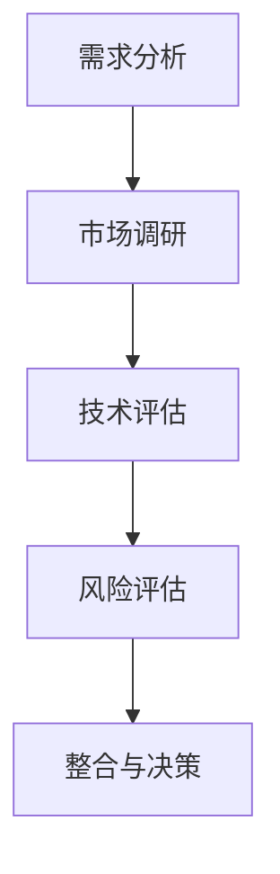
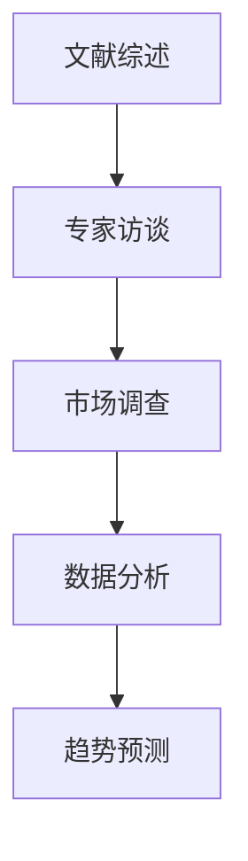
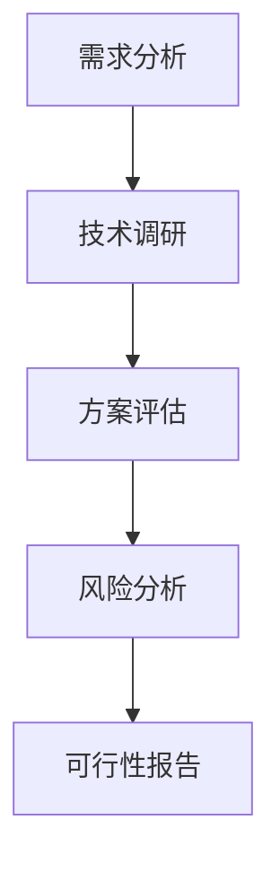
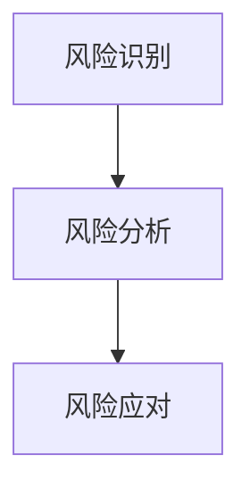
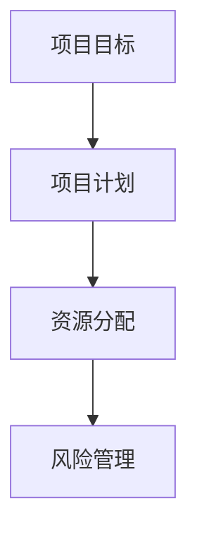
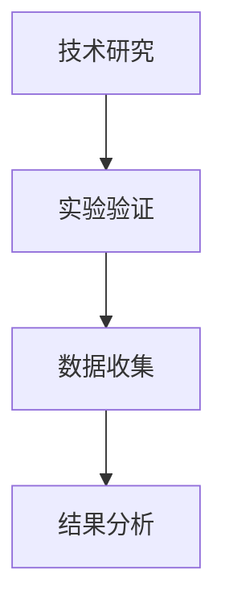
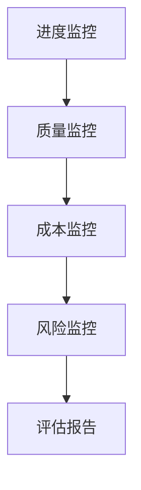

                 

### 技术预研：为未来项目铺平道路

**关键词：技术预研、未来项目、创新趋势、风险评估、最佳实践**

**摘要：**
技术预研作为一种前瞻性的研究方法，对于项目开发具有重要的战略意义。本文将深入探讨技术预研的定义、重要性、基本流程、方法，以及其面临的挑战与对策。通过详细分析技术趋势、可行性研究和风险评估，本文旨在为未来项目提供一套系统的技术预研框架，并分享一系列最佳实践和注意事项，以助力项目的成功实施。

### 第一部分：技术预研的背景与意义

#### 第1章：技术预研概述

##### 1.1.1 技术预研的定义和重要性

**核心概念与联系**

- **技术预研**：在项目启动前，对潜在的技术方案进行深入研究，以评估其可行性、风险和潜在价值。
- **重要性**：技术预研有助于发现创新机会，规避风险，确保项目的成功实施。

**概念属性特征对比表格**

| 特征               | 传统研究       | 技术预研       |
|--------------------|----------------|----------------|
| 目的               | 描述性         | 创新性         |
| 时间               | 较长           | 短期           |
| 结果               | 知识积累       | 方案评估       |
| 影响力             | 较小           | 关键决策依据   |

**ER实体关系图架构**

```mermaid
erDiagram
  Project ||--|{ TechnicalResearch }
  TechnicalResearch {
    +id
    +project_id
    +status
    +start_date
    +end_date
  }
```

##### 1.1.2 技术预研与传统研究的区别

**背景介绍**

- 传统研究往往侧重于理论的深化和知识积累，而技术预研则更注重实际应用和可行性。

**问题描述**

- 技术预研与传统研究在目的、时间、结果和影响力上存在显著差异。

**问题解决**

- 通过对比分析，明确技术预研的特点和价值。

##### 1.1.3 技术预研在现代项目开发中的应用

**背景介绍**

- 随着技术的快速发展，项目开发过程中面临的不确定性增加，技术预研显得尤为重要。

**问题描述**

- 如何将技术预研应用于现代项目开发，提高项目成功率？

**问题解决**

- 通过实际案例，展示技术预研在项目中的应用和效果。

### 1.2 技术预研的基本流程和方法

##### 1.2.1 需求分析

**核心概念与联系**

- **需求分析**：理解项目需求，确定技术预研的方向。

**概念属性特征对比表格**

| 特征               | 用户需求       | 技术需求       |
|--------------------|----------------|----------------|
| 内容               | 功能需求       | 技术可行性     |
| 影响力             | 用户体验       | 项目可行性     |

**ER实体关系图架构**

```mermaid
erDiagram
  Project ||--|{ Requirement }
  Requirement {
    +id
    +project_id
    +user_requirement
    +technical_requirement
  }
```

##### 1.2.2 市场调研

**核心概念与联系**

- **市场调研**：收集和分析市场数据，评估市场潜力。

**概念属性特征对比表格**

| 特征               | 用户调研       | 技术调研       |
|--------------------|----------------|----------------|
| 目的               | 了解用户需求   | 评估技术成熟度 |
| 方法               | 调查问卷       | 技术文档分析   |
| 结果               | 市场趋势       | 技术可行性     |

**ER实体关系图架构**

```mermaid
erDiagram
  Project ||--|{ MarketResearch }
  MarketResearch {
    +id
    +project_id
    +market_trend
    +technical_feasibility
  }
```

##### 1.2.3 技术评估

**核心概念与联系**

- **技术评估**：评估潜在技术的性能、成本和风险。

**概念属性特征对比表格**

| 特征               | 技术性能       | 成本评估       | 风险评估       |
|--------------------|----------------|----------------|----------------|
| 性能               | 性能指标       | 投资回报率     | 潜在风险       |
| 成本               | 开发成本       | 运营成本       | 风险成本       |

**ER实体关系图架构**

```mermaid
erDiagram
  TechnicalResearch ||--|{ PerformanceAssessment }
  TechnicalResearch ||--|{ CostAssessment }
  TechnicalResearch ||--|{ RiskAssessment }
  PerformanceAssessment {
    +id
    +technicalresearch_id
    +performance_metric
  }
  CostAssessment {
    +id
    +technicalresearch_id
    +development_cost
    +operating_cost
  }
  RiskAssessment {
    +id
    +technicalresearch_id
    +potential_risk
    +risk_cost
  }
```

##### 1.2.4 风险评估

**核心概念与联系**

- **风险评估**：识别、评估和应对项目风险。

**概念属性特征对比表格**

| 特征               | 风险识别       | 风险评估       | 风险应对       |
|--------------------|----------------|----------------|----------------|
| 方法               | 检查列表       | 概率与影响分析 |
| 结果               | 风险清单       | 风险矩阵       |
| 对策               | 风险规避       | 风险转移       |

**ER实体关系图架构**

```mermaid
erDiagram
  Project ||--|{ RiskManagement }
  RiskManagement {
    +id
    +project_id
    +risk_identification
    +risk_evaluation
    +risk_response
  }
```

##### 1.2.5 技术预研流程的整合

**核心概念与联系**

- **流程整合**：将各个步骤有机结合，确保技术预研的系统性和全面性。

**流程图**



### 1.3 技术预研面临的挑战与对策

##### 1.3.1 技术变革的快速性

**核心概念与联系**

- **技术变革**：技术发展迅速，预研难度增加。

**挑战**

- 技术快速迭代导致预研成果时效性缩短。

**对策**

- 保持持续学习，采用敏捷预研方法。

##### 1.3.2 资源和时间的限制

**核心概念与联系**

- **资源限制**：人力、资金和技术资源有限。

**挑战**

- 预研项目难以深入，影响决策准确性。

**对策**

- 精简流程，提高效率，合理分配资源。

##### 1.3.3 信息不对称

**核心概念与联系**

- **信息不对称**：预研团队与技术专家、市场之间信息不匹配。

**挑战**

- 预研结果可能失真，影响项目方向。

**对策**

- 加强沟通，建立信息共享平台。

### 1.4 技术预研的最佳实践

##### 1.4.1 研究方法的选择

**核心概念与联系**

- **研究方法**：根据项目特点选择合适的研究方法。

**方法选择表格**

| 项目特点           | 适用方法         |
|--------------------|------------------|
| 硬件技术           | 实验室测试       |
| 软件开发           | 概念验证         |
| 大规模应用         | 模拟测试         |

##### 1.4.2 预研成果的转化与应用

**核心概念与联系**

- **成果转化**：将预研成果应用于实际项目。

**应用流程**

1. 成果评估
2. 技术整合
3. 项目实施
4. 反馈优化

##### 1.4.3 持续学习和适应能力

**核心概念与联系**

- **持续学习**：跟进技术发展，提高预研能力。

**策略**

- 定期参加技术会议，研究行业报告，关注技术趋势。

##### 1.4.4 最佳实践案例分析

**核心概念与联系**

- **案例分析**：通过成功案例分享最佳实践。

**案例展示**

- 某公司通过技术预研成功开发新产品，提高市场竞争力。

### 1.5 本章小结

本章系统地介绍了技术预研的定义、重要性、流程、方法以及面临的挑战和对策。通过深入分析技术预研的核心概念、联系、特征对比和流程图，读者可以更好地理解技术预研在项目开发中的应用和意义。

### 第二部分：技术预研的具体实践

#### 第2章：技术趋势分析

##### 2.1 技术趋势分析的方法

**核心概念与联系**

- **技术趋势分析**：通过收集和分析信息，预测技术发展的方向。

**方法**

1. 文献综述
2. 专家访谈
3. 市场调查
4. 数据分析

**流程图**



##### 2.2 人工智能领域的技术趋势

**核心概念与联系**

- **人工智能**：包括机器学习、深度学习、自然语言处理等。

**趋势**

1. 模型压缩
2. 多模态学习
3. 自主决策
4. 安全性与隐私保护

**案例分析**

- 某公司利用深度学习技术优化生产流程，提高效率。

##### 2.3 大数据与云计算的未来发展

**核心概念与联系**

- **大数据与云计算**：数据处理和分析的核心技术。

**趋势**

1. 数据治理
2. 边缘计算
3. 容器化与微服务
4. AI 与大数据的结合

**案例分析**

- 某企业通过大数据分析提升市场营销策略，实现业绩增长。

##### 2.4 区块链技术的应用前景

**核心概念与联系**

- **区块链技术**：分布式账本和智能合约。

**趋势**

1. 跨链技术
2. 应用多样化
3. 可扩展性
4. 安全性与隐私保护

**案例分析**

- 某银行利用区块链技术实现跨境支付，提高交易效率。

### 2.5 技术趋势分析在实际项目中的应用

**核心概念与联系**

- **应用**：将技术趋势分析应用于项目开发，提高项目成功率。

**案例展示**

- 某公司通过分析技术趋势，成功引入新技术，提升产品竞争力。

### 第3章：技术可行性研究

##### 3.1 技术可行性研究的重要性

**核心概念与联系**

- **技术可行性研究**：评估技术方案在实际项目中的可行性。

**重要性**

1. 确保项目技术实现的可行性
2. 降低项目风险
3. 提高项目成功率

**流程图**



##### 3.2 技术可行性研究的步骤

**步骤**

1. 明确项目需求
2. 收集技术信息
3. 评估技术方案
4. 分析潜在风险
5. 编写可行性报告

##### 3.3 技术可行性研究的工具

**工具**

1. SWOT分析
2. 成本效益分析
3. 概念验证
4. 仿真模拟

##### 3.4 技术可行性研究的案例分析

**案例展示**

- 某项目通过技术可行性研究，成功选择合适的技术方案，确保项目顺利实施。

### 第4章：技术风险评估

##### 4.1 技术风险评估的概念

**核心概念与联系**

- **技术风险评估**：识别、分析和应对项目中的技术风险。

**概念**

1. 风险识别
2. 风险分析
3. 风险应对

**流程图**



##### 4.2 技术风险评估的方法

**方法**

1. 定性分析
2. 定量分析
3. 模拟分析
4. 专家评估

##### 4.3 技术风险评估的案例分析

**案例展示**

- 某项目通过风险评估，成功规避技术风险，确保项目按计划推进。

### 第5章：技术预研项目的管理

##### 5.1 技术预研项目的规划

**核心概念与联系**

- **技术预研项目规划**：制定项目目标、计划和资源分配。

**规划内容**

1. 项目目标
2. 项目计划
3. 资源分配
4. 风险管理

**流程图**



##### 5.2 技术预研项目的执行

**核心概念与联系**

- **技术预研项目执行**：按照规划进行技术研究和实验。

**执行步骤**

1. 技术研究
2. 实验验证
3. 数据收集
4. 结果分析

**流程图**



##### 5.3 技术预研项目的监控与评估

**核心概念与联系**

- **技术预研项目监控与评估**：跟踪项目进展，评估预研成果。

**监控内容**

1. 进度监控
2. 质量监控
3. 成本监控
4. 风险监控

**评估指标**

1. 成果有效性
2. 成本效益
3. 风险控制
4. 项目满意度

**流程图**



##### 5.4 技术预研项目的沟通与合作

**核心概念与联系**

- **沟通与合作**：确保项目各方协同工作，信息畅通。

**沟通方法**

1. 定期会议
2. 信息共享平台
3. 项目报告
4. 专家咨询

**合作策略**

1. 跨部门协作
2. 建立项目团队
3. 设立项目办公室
4. 人才培养与交流

### 第6章：技术预研的实际应用

##### 6.1 技术预研在企业研发中的应用

**核心概念与联系**

- **企业研发**：利用技术预研推动产品创新和研发。

**应用场景**

1. 新产品研发
2. 技术升级改造
3. 市场需求分析
4. 技术合作与交流

**案例分析**

- 某公司通过技术预研，成功开发出新一代产品，引领市场。

##### 6.2 技术预研在创业项目中的应用

**核心概念与联系**

- **创业项目**：利用技术预研验证商业模式的可行性。

**应用场景**

1. 创业计划书
2. 技术路线图
3. 市场测试
4. 风险评估

**案例分析**

- 某创业团队通过技术预研，找到市场切入点，成功获得投资。

##### 6.3 技术预研在政府与公共部门中的应用

**核心概念与联系**

- **政府与公共部门**：利用技术预研提升公共服务能力。

**应用场景**

1. 政策制定
2. 信息化建设
3. 智慧城市建设
4. 公共服务创新

**案例分析**

- 某政府机构通过技术预研，成功实现智慧城市建设，提升市民生活品质。

##### 6.4 技术预研在教育领域中的应用

**核心概念与联系**

- **教育领域**：利用技术预研推动教育改革和创新。

**应用场景**

1. 教学模式创新
2. 教育资源优化
3. 个性化学习
4. 教育管理智能化

**案例分析**

- 某学校通过技术预研，引入人工智能教育平台，提高教学效果。

### 第7章：技术预研的未来发展趋势与挑战

##### 7.1 技术预研的未来发展趋势

**核心概念与联系**

- **技术预研**：随着科技进步，预研方法和工具不断发展。

**趋势**

1. 数据驱动
2. 智能化
3. 跨领域融合
4. 开放合作

**案例分析**

- 某科技公司通过数据驱动技术预研，成功预测市场需求，引领行业发展。

##### 7.2 技术预研面临的挑战

**核心概念与联系**

- **技术预研**：在快速变化的环境中，预研面临诸多挑战。

**挑战**

1. 技术变革
2. 资源限制
3. 信息不对称
4. 安全风险

**对策**

- 加强团队合作，提高预研效率。

##### 7.3 技术预研的发展方向

**核心概念与联系**

- **技术预研**：结合未来科技发展趋势，明确研究方向。

**方向**

1. 新兴技术预研
2. 跨学科融合
3. 智能化工具
4. 全球合作与竞争

**案例分析**

- 某研究团队通过跨学科融合，成功研发出新型材料，推动科技进步。

##### 7.4 技术预研的全球化与本土化

**核心概念与联系**

- **全球化与本土化**：技术预研在不同文化和市场环境下的发展。

**策略**

1. 文化适应
2. 本土创新
3. 全球合作
4. 跨境交流

**案例分析**

- 某国际公司通过全球化与本土化策略，成功开拓新市场，提升品牌影响力。

### 第8章：技术预研：理论与实践的结合

##### 8.1 理论基础

**核心概念与联系**

- **理论基础**：技术预研的理论框架和核心概念。

**内容**

1. 技术预研的定义和目的
2. 技术预研的基本流程和方法
3. 技术预研的关键原则

##### 8.2 实践案例

**核心概念与联系**

- **实践案例**：通过实际案例展示技术预研的应用效果。

**案例展示**

- 多个行业和领域的技术预研成功案例。

##### 8.3 经验与反思

**核心概念与联系**

- **经验与反思**：总结技术预研过程中的经验教训。

**内容**

1. 技术预研的最佳实践
2. 预研过程中遇到的问题和挑战
3. 解决问题的策略和方法

##### 8.4 未来展望

**核心概念与联系**

- **未来展望**：技术预研在未来的发展趋势和机遇。

**内容**

1. 技术预研的创新方向
2. 技术预研在各个领域的发展前景
3. 技术预研与新兴科技的结合

### 结论

本文系统地介绍了技术预研的概念、流程、方法、应用以及面临的挑战和对策。通过理论和实践的结合，读者可以更好地理解技术预研在项目开发中的重要性，并为未来项目提供有效的技术预研框架和最佳实践。随着技术的不断进步，技术预研将继续发挥关键作用，为创新和项目成功铺平道路。

**作者：AI天才研究院/AI Genius Institute & 禅与计算机程序设计艺术 /Zen And The Art of Computer Programming**

