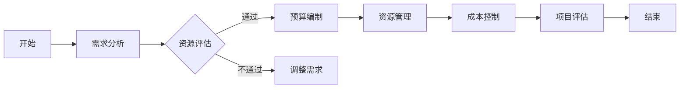
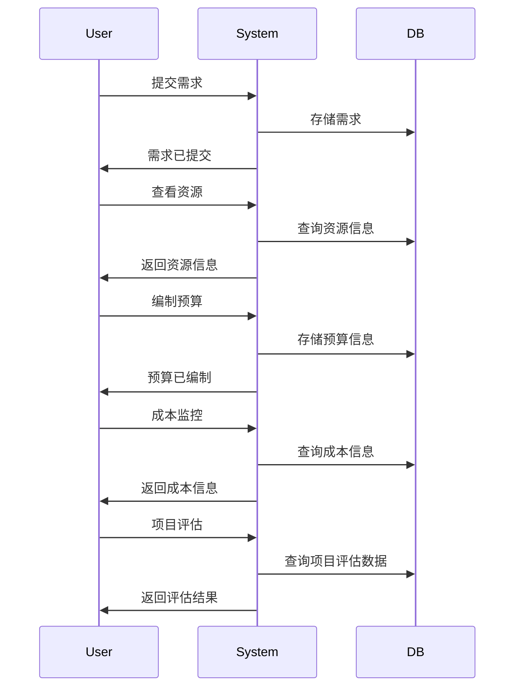
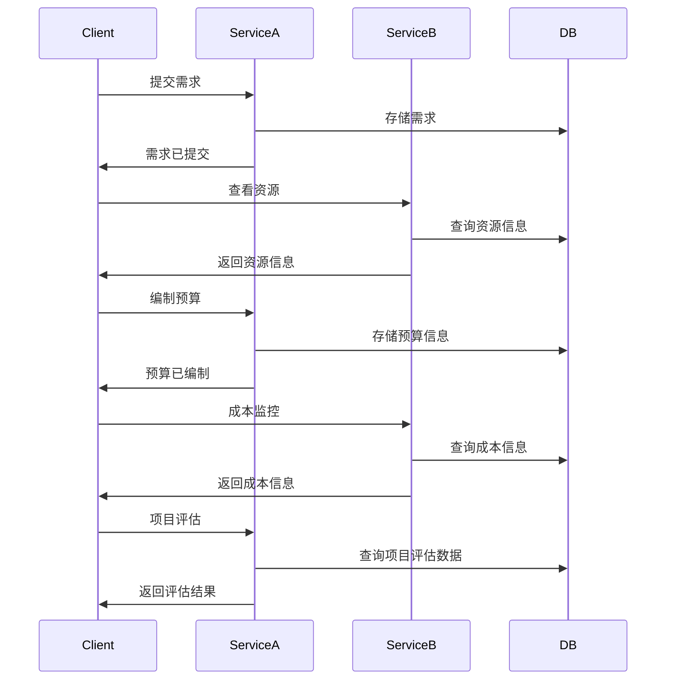

                 


# 技术预算管理：如何合理分配技术资源

> 关键词：技术预算，资源分配，项目管理，成本控制，效率优化

> 摘要：本文深入探讨了技术预算管理的重要性和策略，详细阐述了如何通过合理的资源分配来提升IT项目的效率、控制成本，并确保项目目标的达成。

----------------------------------------------------------------

## 引言

### 技术预算管理的意义

技术预算管理是现代企业中至关重要的一个环节，它涉及到企业如何在其技术项目中合理分配资源，以确保项目目标的实现，同时最大化投资回报率。随着技术的快速发展，企业对IT系统的依赖程度日益加深，技术预算管理的重要性也随之提升。

技术预算管理的核心目标是确保资源的有效利用，避免浪费，同时保证项目按时、按质、按预算完成。这不仅涉及到硬件、软件、人力等直接成本，还包括间接成本，如项目延期导致的损失、资源闲置等。

### 技术资源分配的挑战

在技术预算管理过程中，企业常常面临以下挑战：

1. **需求多样与资源有限**：企业往往需要在多个项目之间分配有限的资源，而这些项目往往有各自的优先级和需求。
2. **预算不确定性**：技术项目的预算往往难以精确预测，可能会受到市场变化、技术进步等因素的影响。
3. **项目管理难度**：技术项目的复杂性高，涉及多个部门、多种技术和不同技能水平的员工，项目管理的难度较大。
4. **成本控制压力**：企业需要在控制成本的同时，确保项目质量，这对项目管理人员提出了更高的要求。

## 第一章 背景介绍

### 核心概念术语说明

在探讨技术预算管理之前，我们需要明确一些核心概念：

- **技术预算**：指企业为技术项目分配的资金预算，通常包括硬件采购、软件开发、人员工资等。
- **资源**：包括人力、硬件、软件和其他相关成本。
- **项目优先级**：指项目在资源分配中的重要性，通常由业务需求决定。
- **成本控制**：指在项目执行过程中，通过各种手段确保实际成本不超过预算。

### 问题背景

随着企业业务的发展和技术的不断更新，技术预算管理的重要性日益凸显。企业需要在有限的资源下，确保多个技术项目的顺利执行，并实现最佳的投资回报率。这不仅需要精准的预算规划，还需要有效的资源分配和管理。

### 问题描述

技术预算管理中的主要问题包括：

1. **资源分配不当**：可能导致项目延期或质量不达标。
2. **预算超支**：影响企业的财务健康和项目后续投资。
3. **项目之间资源争夺**：可能导致关键项目的资源不足。
4. **成本难以控制**：影响项目的盈利能力。

### 问题解决

解决上述问题的方法包括：

1. **制定详细的预算规划**：在项目启动前，明确各项目的预算需求和优先级。
2. **建立资源管理机制**：通过有效的资源调配，确保资源的高效利用。
3. **实施成本控制措施**：监控项目执行过程中的成本，确保实际成本不超过预算。
4. **优化项目管理流程**：通过项目管理工具和方法，提高项目的执行效率和质量。

### 边界与外延

技术预算管理的边界涉及企业内部的多个部门和项目，其外延包括市场趋势、技术发展和企业战略目标。了解这些边界和外延有助于更全面地理解技术预算管理的重要性。

### 概念结构与核心要素组成

技术预算管理的概念结构主要包括以下几个方面：

1. **预算编制**：包括需求分析、预算规划和预算审批。
2. **资源管理**：涉及资源调配、资源监控和资源优化。
3. **成本控制**：包括成本预算、成本分析和成本调整。
4. **项目评估**：对项目执行效果进行评估，为后续预算管理提供依据。

这些核心要素相互关联，共同构成了技术预算管理的整体框架。

## 第二章 核心概念与联系

### 技术预算管理原理

技术预算管理的基本原理是确保企业资源得到最优化的利用，以满足业务需求。具体来说，技术预算管理需要考虑以下几个方面：

1. **需求分析**：了解企业各项目的实际需求，为预算编制提供依据。
2. **资源评估**：评估企业现有资源，确定资源调配策略。
3. **预算编制**：根据需求分析和资源评估，制定详细的预算计划。
4. **资源管理**：在项目执行过程中，合理调配资源，确保项目顺利进行。
5. **成本控制**：监控项目成本，确保实际成本不超过预算。
6. **项目评估**：对项目执行效果进行评估，为后续预算管理提供依据。

### 技术资源分配属性特征对比表格

在技术资源分配中，不同类型的资源具有不同的属性特征。以下是一个对比表格，用于展示不同资源类型的属性特征：

| 资源类型 | 属性特征 |
| -------- | -------- |
| 人力 | 技能水平、工作经验、工作强度 |
| 硬件 | 性能、可靠性、可扩展性 |
| 软件 | 功能性、易用性、可维护性 |
| 资金 | 投资金额、投资回报率、资金用途 |

### ER实体关系图架构

为了更好地理解技术资源分配，我们可以使用ER实体关系图来展示不同实体之间的关系。以下是一个简化的ER图示例：

```mermaid
erDiagram
    Project ||--|{ Resource }|--| Person
    Project ||--|{ Budget }|--| Vendor
    Resource ||--|{ Cost }|--| Person
    Resource ||--|{ Schedule }|--| Project
    Budget ||--|{ Category }|--| Vendor
```

### 算法原理讲解

在技术预算管理中，算法原理起到了关键作用。以下是一个简单的资源分配算法原理，并使用mermaid画出算法流程图：

#### 算法流程图



#### Python代码实现

```python
def resource_allocation的需求分析():
    # 进行需求分析，获取项目需求
    pass

def resource_allocation.资源评估():
    # 评估现有资源，确定资源可用性
    pass

def resource_allocation.预算编制():
    # 根据需求分析和资源评估，制定预算计划
    pass

def resource_allocation.资源管理():
    # 在项目执行过程中，合理调配资源
    pass

def resource_allocation.成本控制():
    # 监控项目成本，确保实际成本不超过预算
    pass

def resource_allocation.项目评估():
    # 对项目执行效果进行评估
    pass
```

### 数学模型和公式讲解

在技术预算管理中，数学模型和公式可以帮助我们更准确地预测和控制成本。以下是一个简单的数学模型示例：

#### 成本预测模型

$$C_t = C_0 + \sum_{i=1}^{n} a_i \cdot P_i$$

其中：

- $C_t$ 是总成本
- $C_0$ 是初始成本
- $a_i$ 是第 $i$ 个项目的成本系数
- $P_i$ 是第 $i$ 个项目的预算

#### 公式解释

- $C_0$ 表示在项目启动时已经确定的初始成本，如固定硬件费用。
- $a_i \cdot P_i$ 表示每个项目的成本系数乘以其预算，表示每个项目对总成本的贡献。

通过这个公式，我们可以根据每个项目的预算和成本系数，预测项目的总成本。

### 系统分析与架构设计方案

在技术预算管理系统中，系统分析与架构设计至关重要。以下是一个简化的系统分析与架构设计方案：

#### 问题场景介绍

企业在进行技术预算管理时，需要处理大量的项目数据，包括项目需求、资源信息、成本数据等。为了高效地管理这些数据，我们需要设计一个可靠、灵活的技术预算管理系统。

#### 项目介绍

项目名称：技术预算管理系统

项目目标：提供一个平台，帮助企业管理技术预算，实现资源的合理分配和成本的有效控制。

#### 系统功能设计

1. **需求分析模块**：收集和整理各项目的需求信息。
2. **资源管理模块**：管理企业现有的资源，包括人力、硬件和软件。
3. **预算编制模块**：根据需求分析和资源评估，制定预算计划。
4. **成本控制模块**：监控项目执行过程中的成本，确保实际成本不超过预算。
5. **项目评估模块**：对项目执行效果进行评估，为后续预算管理提供依据。

#### 系统架构设计

以下是一个简化的系统架构设计图：



#### 系统接口设计和系统交互

以下是一个简化的系统接口设计和系统交互图：



### 项目实战

#### 环境安装

在开始技术预算管理系统的开发之前，我们需要安装相关的开发环境和工具。以下是一个简化的安装步骤：

1. 安装Python 3.8及以上版本。
2. 安装Django 3.2及以上版本。
3. 安装PostgreSQL 12及以上版本。
4. 安装Docker。

#### 系统核心实现源代码

以下是一个简化的技术预算管理系统核心实现源代码：

```python
# manage.py
#!/usr/bin/env python
import os
import sys

def main():
    os.environ.setdefault('DJANGO_SETTINGS_MODULE', 'budget_management.settings')
    sys.exit.timezone(8*3600)
    from django.core.management import execute_from_command_line
    execute_from_command_line(sys.argv)

if __name__ == '__main__':
    main()

# budget_management/settings.py
"""
Django settings for budget_management project.

Generated by 'django-admin startproject' using Django 3.2.

For more information on this file, see
https://docs.djangoproject.com/en/3.2/topics/settings/

For the full list of settings and defaults, see
https://docs.djangoproject.com/en/3.2/ref/settings/
"""

from pathlib import Path

# Build paths inside the project like this: BASE_DIR / 'subdir'.
BASE_DIR = Path(__file__).resolve().parent.parent

# Quick-start development settings - unsuitable for production
# See https://docs.djangoproject.com/en/3.2/howto/deployment/checklist/

# SECURITY WARNING: keep the secret key used in production secret!
SECRET_KEY = 'django-insecure-#请在此处填写您的Secret Key'

# SECURITY WARNING: don't run with debug turned on in production!
DEBUG = True

ALLOWED_HOSTS = []

# Application definition

INSTALLED_APPS = [
    'django.contrib.admin',
    'django.contrib.auth',
    'django.contrib.contenttypes',
    'django.contrib.sessions',
    'django.contrib.messages',
    'django.contrib.staticfiles',
    'budget_app',  # 添加预算应用
]

MIDDLEWARE = [
    'django.middleware.security.SecurityMiddleware',
    'django.contrib.sessions.middleware.SessionMiddleware',
    'django.middleware.common.CommonMiddleware',
    'django.middleware.csrf.CsrfViewMiddleware',
    'django.contrib.auth.middleware.AuthenticationMiddleware',
    'django.contrib.messages.middleware.MessageMiddleware',
    'django.middleware.clickjacking.XFrameOptionsMiddleware',
]

ROOT_URLCONF = 'budget_management.urls'

TEMPLATES = [
    {
        'BACKEND': 'django.template.backends.django.DjangoTemplates',
        'DIRS': [],
        'APP_DIRS': True,
        'OPTIONS': {
            'context_processors': [
                'django.template.context_processors.debug',
                'django.template.context_processors.request',
                'django.contrib.auth.context_processors.auth',
                'django.contrib.messages.context_processors.messages',
            ],
        },
    },
]

WSGI_APPLICATION = 'budget_management.wsgi.application'

# Database
# https://docs.djangoproject.com/en/3.2/ref/settings/#databases

DATABASES = {
    'default': {
        'ENGINE': 'django.db.backends.postgresql',
        'NAME': 'budget_management',
        'USER': 'budget_user',
        'PASSWORD': 'budget_password',
        'HOST': 'localhost',
        'PORT': '5432',
    }
}

# Password validation
# https://docs.djangoproject.com/en/3.2/ref/settings/#auth-password-validators

AUTH_PASSWORD_VALIDATORS = [
    {
        'NAME': 'django.contrib.auth.password_validation.UserAttributeSimilarityValidator',
    },
    {
        'NAME': 'django.contrib.auth.password_validation.MinimumLengthValidator',
    },
    {
        'NAME': 'django.contrib.auth.password_validation.CommonPasswordValidator',
    },
    {
        'NAME': 'django.contrib.auth.password_validation.NumericPasswordValidator',
    },
]

# Internationalization
# https://docs.djangoproject.com/en/3.2/topics/i18n/

LANGUAGE_CODE = 'zh-hans'

TIME_ZONE = 'Asia/Shanghai'

USE_I18N = True

USE_L10N = True

USE_TZ = True

# Static files (CSS, JavaScript, Images)
# https://docs.djangoproject.com/en/3.2/howto/static-files/

STATIC_URL = '/static/'

# Default primary key field type
# https://docs.djangoproject.com/en/3.2/ref/settings/#default-auto-field

DEFAULT_AUTO_FIELD = 'django.db.models.BigAuto
```


```python
# budget_app/models.py
from django.db import models

class Project(models.Model):
    name = models.CharField(max_length=100)
    description = models.TextField()
    start_date = models.DateField()
    end_date = models.DateField()
    budget = models.DecimalField(max_digits=10, decimal_places=2)

class Resource(models.Model):
    name = models.CharField(max_length=100)
    type = models.CharField(max_length=50)
    cost = models.DecimalField(max_digits=10, decimal_places=2)

class BudgetAllocation(models.Model):
    project = models.ForeignKey(Project, on_delete=models.CASCADE)
    resource = models.ForeignKey(Resource, on_delete=models.CASCADE)
    allocation = models.DecimalField(max_digits=10, decimal_places=2)
```

#### 代码应用解读与分析

以上代码提供了一个技术预算管理系统的基础模型。`Project` 类表示项目信息，包括项目名称、描述、起始日期、结束日期和预算。`Resource` 类表示资源信息，包括资源名称、类型和成本。`BudgetAllocation` 类表示预算分配信息，包括项目、资源以及相应的预算分配。

这些模型通过外键关联起来，使得我们可以查询和操作相关的数据。例如，我们可以查询某个项目的所有预算分配，或者查询某个资源的所有分配情况。

#### 实际案例分析和详细讲解剖析

假设我们有一个包含多个项目的公司，每个项目都有特定的预算和资源需求。以下是实际案例分析和详细讲解：

1. **项目需求分析**：我们首先需要分析每个项目的需求，确定项目所需的资源类型和数量。例如，一个新产品的开发项目可能需要高级软件开发人员、数据库管理员和测试人员。

2. **资源评估**：在了解项目需求后，我们需要评估公司现有的资源。例如，公司可能有5名高级软件开发人员，但数据库管理员只有2名。这意味着在分配资源时，我们需要优先考虑数据库管理员。

3. **预算编制**：根据项目需求和资源评估，我们制定预算计划。例如，我们可能为高级软件开发人员分配每月2万元，为数据库管理员分配每月1.5万元。

4. **资源管理**：在项目执行过程中，我们需要根据实际情况调整资源分配。例如，如果某个项目需要额外的测试人员，我们可以从其他项目借调。

5. **成本控制**：我们需要监控项目执行过程中的成本，确保实际成本不超过预算。例如，如果项目实际成本超过了预算，我们需要找出原因并采取相应的措施。

6. **项目评估**：在项目完成后，我们需要对项目执行效果进行评估，为后续预算管理提供依据。例如，我们可以评估项目是否按计划完成，预算是否合理使用。

#### 项目小结

通过以上实际案例分析和详细讲解，我们可以看到技术预算管理在实际操作中的重要性。合理的技术预算管理不仅能够确保项目顺利执行，还能帮助企业优化资源利用，降低成本，提高投资回报率。

### 最佳实践 tips

1. **定期审查预算**：定期审查预算，及时调整资源分配，以适应项目变化。

2. **明确责任**：明确各项目团队成员的责任，确保每个人都了解自己的任务和目标。

3. **利用项目管理工具**：利用项目管理工具，如Jira、Trello等，跟踪项目进度和资源使用情况。

4. **数据驱动决策**：基于数据做出决策，避免主观臆断。

5. **持续优化**：不断优化预算管理流程，提高效率和准确性。

### 小结

技术预算管理是现代企业中不可或缺的一部分。通过合理的预算规划和资源分配，企业能够更有效地管理技术项目，确保项目按时、按质、按预算完成。本文通过实际案例分析和详细讲解，展示了技术预算管理的重要性和方法，希望对读者有所帮助。

### 注意事项

1. **预算编制的准确性**：确保预算编制的准确性，避免因预算错误导致的资源浪费。

2. **资源分配的公平性**：在分配资源时，确保公平性，避免资源过度集中或分配不均。

3. **成本控制的严格性**：严格监控成本，确保实际成本不超过预算。

### 拓展阅读

1. 《项目管理知识体系指南（PMBOK指南）》
2. 《技术项目管理实践：成功的策略和技巧》
3. 《成本控制与管理会计》

### 作者信息

作者：AI天才研究院/AI Genius Institute & 禅与计算机程序设计艺术 /Zen And The Art of Computer Programming

