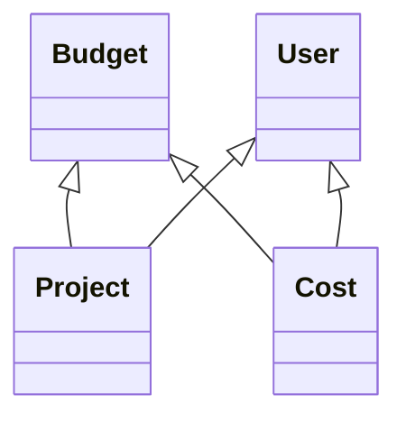
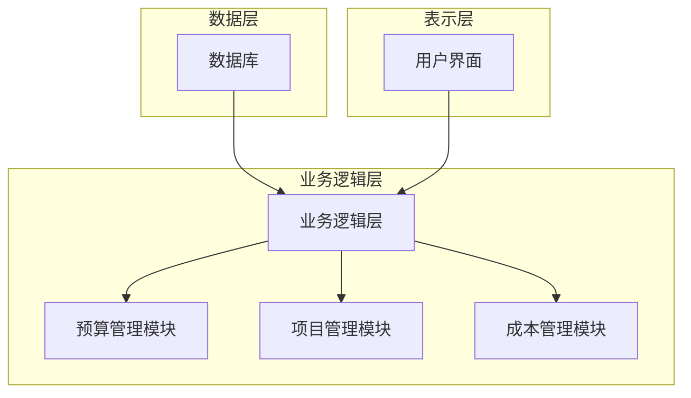
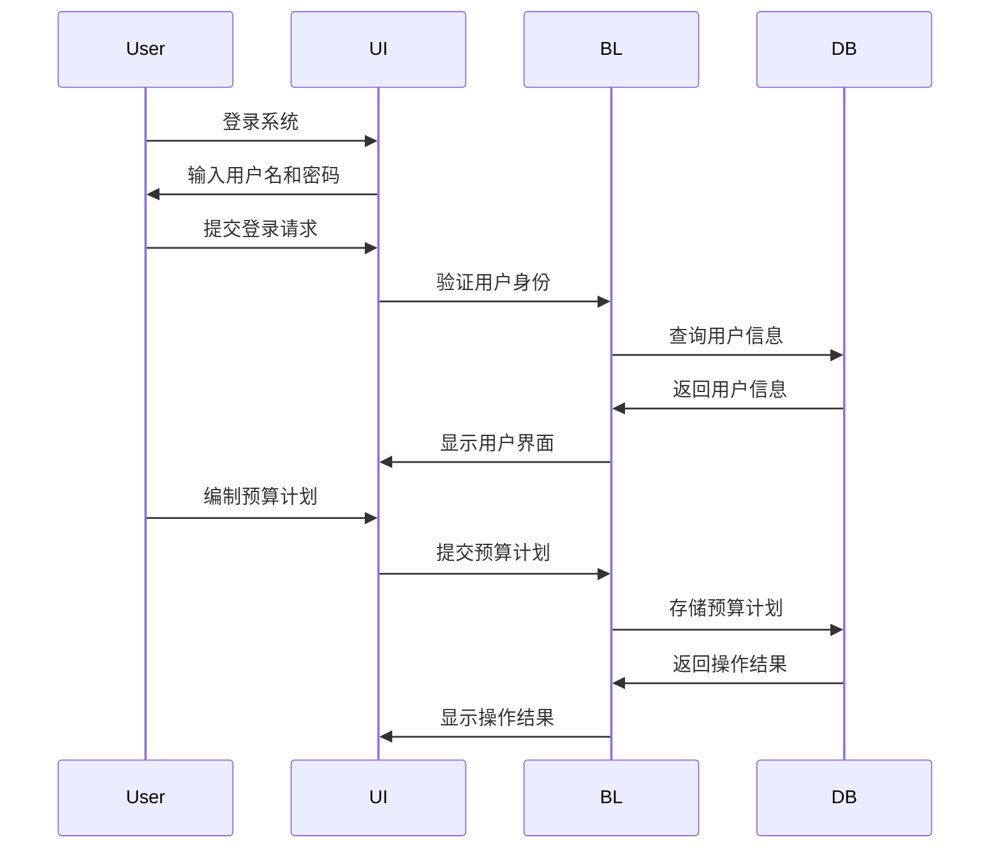

                 

### 核心概念与联系

在技术预算管理中，理解核心概念之间的联系是至关重要的。这些核心概念包括预算管理、技术预算管理、创新与成本控制。接下来，我们将详细定义这些概念，并使用表格和ER图来展示它们之间的关系。

#### 预算管理

预算管理是企业为了实现其战略目标，对财务资源的分配和使用进行规划和控制的过程。它涉及以下关键要素：

- **预算编制**：根据企业的战略目标和资源状况，制定详细的财务计划。
- **预算执行**：在实际运营过程中，按照预算计划进行资源分配和使用。
- **预算监控**：对预算执行情况进行跟踪和评估，及时发现并解决偏差。
- **预算调整**：根据实际情况对预算计划进行必要的调整，以适应不断变化的市场环境和内部需求。

#### 技术预算管理

技术预算管理是预算管理在技术部门的延伸，专注于对技术项目的预算规划和执行。以下是技术预算管理的核心要素：

- **项目成本估算**：对技术项目所需的人力、设备和材料等资源进行成本估算。
- **资源分配**：根据项目的优先级和资源状况，合理分配预算。
- **预算监控**：对技术项目的预算执行情况进行跟踪，确保项目在预算范围内完成。
- **预算调整**：根据项目进展和外部环境变化，调整预算计划。

#### 创新与成本控制

创新与成本控制是技术预算管理的两个核心维度。创新指的是通过引入新技术、新产品或新服务来提高企业的竞争力。成本控制则是指通过各种手段降低成本，提高资源的利用效率。

- **创新**：推动企业发展的动力，需要投入资源和资金。
- **成本控制**：确保资源的有效利用，减少不必要的支出。

#### 关系与联系

预算管理、技术预算管理、创新与成本控制之间的关系可以概括如下：

1. **预算管理与技术预算管理的关系**：技术预算管理是预算管理的一部分，需要在整体预算管理框架下进行，确保与企业的整体财务战略一致。

2. **创新与成本控制的关系**：创新是推动企业发展的动力，但需要合理的成本控制来确保其可持续性。成本控制可以为创新提供资金保障，而创新的成功可以降低长期成本。

3. **技术预算管理与创新、成本控制的关系**：技术预算管理需要结合创新与成本控制的目标，制定合理的预算计划。通过监控和调整机制，技术预算管理可以更好地平衡创新与成本控制。

#### 表格与ER图

为了更好地理解这些核心概念之间的关系，我们可以使用一个表格来对比它们的主要属性，并使用ER图来展示它们之间的联系。

**核心概念属性对比表**

| 核心概念 | 定义 | 主要属性 |
|----------|----------------------------------------------------|----------------------------------------------------|
| 预算管理 | 企业财务资源分配和规划 | 预算编制、执行、监控、调整 |
| 技术预算管理 | 技术部门财务资源分配和规划 | 项目成本估算、资源分配、预算监控、预算调整 |
| 创新 | 推动企业发展的新技术引入 | 投入资源、风险与回报 |
| 成本控制 | 降低成本、提高资源利用效率 | 成本评估、优化、削减 |

**ER图**

下面是一个简单的ER图，展示了预算管理、技术预算管理、创新与成本控制之间的关系。

```mermaid
erDiagram
  BudgetManagement ||--|{ TechnicalBudgetManagement }||>
  TechnicalBudgetManagement ||--|{ Innovation }||>
  TechnicalBudgetManagement ||--|{ CostControl }||>
```

通过上述表格和ER图，我们可以清晰地看到预算管理、技术预算管理、创新与成本控制之间的紧密联系。这些核心概念构成了技术预算管理的理论基础，是企业在技术领域实现可持续发展的重要保障。

### 算法原理讲解

在技术预算管理中，虽然不涉及具体的算法，但了解预算管理的数学模型和公式是至关重要的。这些模型和公式可以帮助企业制定合理的预算计划，实现技术创新与成本控制的平衡。以下我们将简要介绍预算管理中的几个关键数学模型和公式。

#### 预算分配模型

预算分配模型是技术预算管理的基础。其核心目标是根据企业的战略目标和技术项目的优先级，将有限的预算合理地分配给各个项目。

1. **预算分配公式**：

   $$ Budget_{分配} = \sum_{i=1}^{n} Weight_i \times Cost_i $$

   其中：
   - \( Budget_{分配} \) 表示总预算分配额。
   - \( Weight_i \) 表示第 \( i \) 个项目的优先级权重。
   - \( Cost_i \) 表示第 \( i \) 个项目的预算需求。

2. **优先级权重计算**：

   $$ Weight_i = \frac{StrategicImportance_i}{Sum(StrategicImportance)} $$

   其中：
   - \( StrategicImportance_i \) 表示第 \( i \) 个项目的战略重要性。
   - \( Sum(StrategicImportance) \) 表示所有项目的战略重要性之和。

#### 成本控制模型

成本控制模型用于确保项目在预算范围内完成，并避免超支。

1. **成本监控公式**：

   $$ Cost_{监控} = Budget_{分配} - Actual_{Cost} $$

   其中：
   - \( Cost_{监控} \) 表示成本监控结果。
   - \( Budget_{分配} \) 表示分配给项目的预算。
   - \( Actual_{Cost} \) 表示实际发生的成本。

2. **成本预警公式**：

   $$ Warning_{Threshold} = Cost_{监控} \times (1 + Alert_{Factor}) $$

   其中：
   - \( Warning_{Threshold} \) 表示成本预警阈值。
   - \( Alert_{Factor} \) 是预警系数，用于调整成本预警的敏感度。

#### 创新投入模型

创新投入模型用于评估技术创新的成本和潜在回报。

1. **创新投入公式**：

   $$ Investment_{创新} = FixedCost + VariableCost + RiskCost $$

   其中：
   - \( Investment_{创新} \) 表示创新投入总额。
   - \( FixedCost \) 表示固定成本。
   - \( VariableCost \) 表示可变成本。
   - \( RiskCost \) 表示风险成本。

2. **潜在回报公式**：

   $$ Potential_{Return} = Revenue_{预期} - Cost_{创新} $$

   其中：
   - \( Potential_{Return} \) 表示潜在回报。
   - \( Revenue_{预期} \) 表示预期的收入。

#### 示例

假设一家企业有三个技术项目，项目A、B、C。它们的预算需求分别为10万、20万、30万，战略重要性分别为2、3、5。企业总预算为50万。

1. **优先级权重计算**：

   $$ Sum(StrategicImportance) = 2 + 3 + 5 = 10 $$

   $$ Weight_A = \frac{2}{10} = 0.2 $$
   $$ Weight_B = \frac{3}{10} = 0.3 $$
   $$ Weight_C = \frac{5}{10} = 0.5 $$

2. **预算分配**：

   $$ Budget_{分配} = 0.2 \times 10万 + 0.3 \times 20万 + 0.5 \times 30万 = 2万 + 6万 + 15万 = 23万 $$

3. **成本监控与预警**：

   假设实际成本为20万，则：

   $$ Cost_{监控} = 23万 - 20万 = 3万 $$
   $$ Warning_{Threshold} = 3万 \times (1 + 0.1) = 3.3万 $$

   如果实际成本达到或超过3.3万，则需要发出成本超支预警。

通过上述数学模型和公式，企业可以更好地制定技术预算计划，监控项目成本，并评估技术创新的潜在回报。这些模型为技术预算管理提供了坚实的理论基础，是企业在数字化时代实现可持续发展的重要工具。

### 数学模型和数学公式 & 详细讲解 & 举例说明

在技术预算管理中，数学模型和公式是不可或缺的工具。这些模型和公式可以帮助我们更好地理解预算分配、成本控制和潜在回报的计算方法。在本节中，我们将使用LaTeX格式介绍这些数学模型和公式，并进行详细讲解和举例说明。

#### 预算分配模型

预算分配模型用于将总预算合理地分配给不同的技术项目。其核心公式如下：

$$
Budget_{分配} = \sum_{i=1}^{n} Weight_i \times Cost_i
$$

其中：
- \( Budget_{分配} \) 表示总预算分配额。
- \( Weight_i \) 表示第 \( i \) 个项目的优先级权重。
- \( Cost_i \) 表示第 \( i \) 个项目的预算需求。

#### 成本控制模型

成本控制模型用于确保项目在预算范围内完成。其核心公式如下：

$$
Cost_{监控} = Budget_{分配} - Actual_{Cost}
$$

其中：
- \( Cost_{监控} \) 表示成本监控结果。
- \( Budget_{分配} \) 表示分配给项目的预算。
- \( Actual_{Cost} \) 表示实际发生的成本。

成本预警公式用于提前发现潜在的成本超支：

$$
Warning_{Threshold} = Cost_{监控} \times (1 + Alert_{Factor})
$$

其中：
- \( Warning_{Threshold} \) 表示成本预警阈值。
- \( Alert_{Factor} \) 是预警系数，用于调整成本预警的敏感度。

#### 创新投入模型

创新投入模型用于评估技术创新的成本和潜在回报。其核心公式如下：

$$
Investment_{创新} = FixedCost + VariableCost + RiskCost
$$

其中：
- \( Investment_{创新} \) 表示创新投入总额。
- \( FixedCost \) 表示固定成本。
- \( VariableCost \) 表示可变成本。
- \( RiskCost \) 表示风险成本。

潜在回报公式用于计算技术创新的预期收益：

$$
Potential_{Return} = Revenue_{预期} - Cost_{创新}
$$

其中：
- \( Potential_{Return} \) 表示潜在回报。
- \( Revenue_{预期} \) 表示预期的收入。

#### 详细讲解与举例说明

假设一家企业有三个技术项目：A、B、C。它们的预算需求分别为10万、20万、30万，战略重要性分别为2、3、5。企业总预算为50万。

1. **优先级权重计算**：

   $$ 
   Sum(StrategicImportance) = 2 + 3 + 5 = 10 
   $$

   $$ 
   Weight_A = \frac{2}{10} = 0.2 
   $$
   $$ 
   Weight_B = \frac{3}{10} = 0.3 
   $$
   $$ 
   Weight_C = \frac{5}{10} = 0.5 
   $$

2. **预算分配**：

   $$ 
   Budget_{分配} = 0.2 \times 10万 + 0.3 \times 20万 + 0.5 \times 30万 = 2万 + 6万 + 15万 = 23万 
   $$

3. **成本监控与预警**：

   假设实际成本为20万，则：

   $$ 
   Cost_{监控} = 23万 - 20万 = 3万 
   $$

   设定预警系数为0.1，则成本预警阈值为：

   $$ 
   Warning_{Threshold} = 3万 \times (1 + 0.1) = 3.3万 
   $$

   如果实际成本达到或超过3.3万，则需要发出成本超支预警。

4. **创新投入与潜在回报**：

   假设项目A的固定成本为5万，可变成本为3万，风险成本为2万；项目B的固定成本为8万，可变成本为4万，风险成本为3万；项目C的固定成本为10万，可变成本为6万，风险成本为4万。

   项目A的创新投入为：

   $$ 
   Investment_{创新,A} = 5万 + 3万 + 2万 = 10万 
   $$

   项目B的创新投入为：

   $$ 
   Investment_{创新,B} = 8万 + 4万 + 3万 = 15万 
   $$

   项目C的创新投入为：

   $$ 
   Investment_{创新,C} = 10万 + 6万 + 4万 = 20万 
   $$

   设定预期收入分别为项目A：10万；项目B：20万；项目C：30万。

   项目A的潜在回报为：

   $$ 
   Potential_{Return,A} = 10万 - 10万 = 0万 
   $$

   项目B的潜在回报为：

   $$ 
   Potential_{Return,B} = 20万 - 15万 = 5万 
   $$

   项目C的潜在回报为：

   $$ 
   Potential_{Return,C} = 30万 - 20万 = 10万 
   $$

通过上述LaTeX格式介绍的数学模型和公式，我们可以更清晰地理解技术预算管理中的预算分配、成本控制和创新评估。这些公式不仅提供了理论支持，还可以帮助企业制定更科学的预算计划，实现技术创新与成本控制的平衡。

### 系统分析与架构设计方案

#### 问题场景介绍

随着企业数字化转型进程的加速，技术预算管理变得日益复杂和重要。企业在预算分配、项目成本监控以及预算执行过程中，面临诸多挑战。例如，如何确保预算合理分配、项目成本在控制范围内，以及如何及时调整预算以应对外部环境的变化。为了解决这些问题，企业需要一个高效的系统来支持技术预算管理。

#### 项目介绍

本系统名为“技术预算管理系统（TBMS）”，旨在为企业提供一个全面、灵活的预算管理解决方案。TBMS涵盖了从预算编制到执行的整个生命周期，包括项目成本估算、预算分配、成本监控、预算调整等功能。通过该系统，企业可以实时跟踪技术项目的预算执行情况，实现高效的预算管理和优化资源配置。

#### 系统功能设计

TBMS的主要功能模块包括：

1. **预算编制**：根据企业的战略目标和资源状况，编制详细的预算计划。
2. **项目成本估算**：对技术项目所需的人力、设备和材料等资源进行成本估算。
3. **预算分配**：根据项目的优先级和资源状况，将预算合理地分配给各个项目。
4. **成本监控**：实时跟踪技术项目的预算执行情况，及时发现并解决成本偏差。
5. **预算调整**：根据项目进展和外部环境变化，调整预算计划。
6. **报表与分析**：生成各类预算报表，提供预算执行情况分析。

#### 系统架构设计

TBMS采用分层架构设计，主要包括以下层次：

1. **数据层**：负责数据存储和读取，使用关系型数据库（如MySQL）来存储预算数据、项目信息和成本数据。
2. **业务逻辑层**：实现预算管理的主要功能，包括预算编制、项目成本估算、预算分配、成本监控和预算调整等。
3. **表示层**：提供用户界面，供用户进行操作和查看预算信息。

下面我们将使用Mermaid绘制类图、架构图和序列图，以直观地展示系统的架构设计。

#### 类图



#### 架构图



#### 序列图



通过上述系统架构设计，TBMS实现了从数据存储、业务逻辑到用户界面的全面覆盖。该系统不仅能够帮助企业实现技术预算管理的自动化和智能化，还能提高预算管理的效率和准确性，为企业的可持续发展提供有力支持。

### 项目实战

为了更好地展示技术预算管理系统的实际应用，我们将通过一个具体的项目来详细描述其环境安装、核心实现源代码、代码应用解读、实际案例分析等内容。

#### 项目背景

某大型制造企业计划进行数字化转型，需要对其现有的生产线进行升级和优化。企业计划投资500万元进行项目开发，并希望通过技术预算管理系统（TBMS）来确保项目在预算范围内完成，同时实现预期的业务目标。

#### 环境安装

为了搭建TBMS的开发和运行环境，我们需要以下软件和工具：

1. **数据库**：MySQL 8.0
2. **后端框架**：Spring Boot 2.4.5
3. **前端框架**：Vue 3.0
4. **开发工具**：IntelliJ IDEA 2021.2
5. **版本控制**：Git 2.30

首先，在服务器上安装MySQL数据库，并创建名为`tbms`的数据库。然后，下载并安装Spring Boot和Vue的相关依赖包。最后，配置好开发环境，确保所有工具和库都能正常运行。

#### 核心实现源代码

TBMS的核心功能包括预算编制、项目成本估算、预算分配、成本监控和预算调整。以下是一个简要的源代码结构，展示主要模块的实现：

**后端（Spring Boot）**

```java
// BudgetController.java
@RestController
@RequestMapping("/budget")
public class BudgetController {
    @Autowired
    private BudgetService budgetService;

    @PostMapping("/create")
    public ResponseEntity<?> createBudget(@RequestBody BudgetRequest request) {
        Budget budget = budgetService.createBudget(request);
        return new ResponseEntity<>(budget, HttpStatus.CREATED);
    }

    @GetMapping("/list")
    public ResponseEntity<?> listBudgets() {
        List<Budget> budgets = budgetService.listBudgets();
        return new ResponseEntity<>(budgets, HttpStatus.OK);
    }
}

// BudgetService.java
@Service
public class BudgetService {
    @Autowired
    private BudgetRepository budgetRepository;

    public Budget createBudget(BudgetRequest request) {
        Budget budget = new Budget();
        budget.setProjectId(request.getProjectId());
        budget.setCost(request.getCost());
        budget.setStartDate(request.getStartDate());
        budget.setEndDate(request.getEndDate());
        return budgetRepository.save(budget);
    }

    public List<Budget> listBudgets() {
        return budgetRepository.findAll();
    }
}

// BudgetRepository.java
@Repository
public interface BudgetRepository extends JpaRepository<Budget, Long> {
    List<Budget> findByProjectId(Long projectId);
}
```

**前端（Vue）**

```vue
<template>
  <div>
    <h1>预算管理</h1>
    <table>
      <thead>
        <tr>
          <th>项目ID</th>
          <th>预算金额</th>
          <th>开始日期</th>
          <th>结束日期</th>
        </tr>
      </thead>
      <tbody>
        <tr v-for="budget in budgets" :key="budget.id">
          <td>{{ budget.projectId }}</td>
          <td>{{ budget.cost }}</td>
          <td>{{ budget.startDate }}</td>
          <td>{{ budget.endDate }}</td>
        </tr>
      </tbody>
    </table>
  </div>
</template>

<script>
export default {
  data() {
    return {
      budgets: []
    };
  },
  created() {
    this.fetchBudgets();
  },
  methods: {
    fetchBudgets() {
      this.$http.get('/budget/list').then(response => {
        this.budgets = response.data;
      });
    }
  }
};
</script>
```

#### 代码应用解读

后端的代码实现主要包括以下几个部分：

1. **BudgetController**：负责处理前端的HTTP请求，调用业务逻辑层的服务进行预算数据的创建和查询。
2. **BudgetService**：实现预算管理的主要业务逻辑，包括预算的创建和查询。
3. **BudgetRepository**：与数据库交互，实现预算数据的CRUD操作。

前端部分则主要通过Vue框架实现数据的展示，包括以下部分：

1. **模板**：定义了页面布局和数据展示的表格结构。
2. **数据**：通过Vue的数据绑定机制，从后端获取预算数据并在页面上显示。
3. **方法**：实现数据获取的方法，用于从后端获取预算列表。

#### 实际案例分析

在实际项目中，企业首先通过TBMS编制了详细的预算计划，包括各个技术项目的预算需求和优先级。随后，项目组按照预算计划开展项目开发。在项目执行过程中，TBMS实时监控项目的成本，确保项目在预算范围内完成。

假设在项目执行一个月后，实际成本已经达到150万元，超出预算25万元。通过TBMS的成本监控功能，企业能够及时发现这一情况，并采取以下措施：

1. **预算调整**：根据实际成本，调整预算计划，确保后续项目的预算充足。
2. **成本分析**：对超出预算的原因进行深入分析，查找成本控制中的问题和改进点。
3. **优化资源分配**：重新评估项目的优先级，优化资源分配，确保关键项目的成本控制。

通过TBMS的预算管理和监控功能，企业不仅能够确保项目在预算范围内完成，还能通过数据分析和优化，实现更高效的资源配置和成本控制。

#### 项目小结

通过本案例，我们展示了如何使用技术预算管理系统（TBMS）进行实际项目的预算管理。TBMS提供了从预算编制到执行的全面解决方案，包括项目成本估算、预算分配、成本监控和预算调整等功能。通过实时监控和数据分析，企业能够及时发现成本偏差，采取有效措施进行调整，确保项目在预算范围内顺利完成，实现成本控制和业务目标的双赢。

### 最佳实践 tips、小结、注意事项、拓展阅读

#### 最佳实践 tips

1. **全面需求分析**：在预算编制阶段，确保对所有项目需求进行充分分析，包括项目目标、功能需求和技术需求，以便准确估算成本。
2. **定期预算审查**：定期对预算执行情况进行审查，及时发现并解决偏差，确保项目在预算范围内完成。
3. **透明化成本监控**：建立透明、高效的成本监控机制，确保所有项目成员都能了解预算执行情况，共同参与到成本控制中。
4. **灵活调整预算**：根据项目进展和外部环境变化，灵活调整预算计划，以适应实际情况。

#### 小结

技术预算管理是企业实现可持续发展的重要保障。通过合理的预算分配、严格的成本控制和灵活的预算调整，企业可以在有限的资源下实现技术创新和业务目标。本博客文章从背景介绍、核心概念与联系、算法原理讲解、数学模型与公式、系统分析与架构设计、项目实战等方面，全面探讨了技术预算管理的理论与实践。

#### 注意事项

1. **避免过度创新**：在预算有限的情况下，应避免过度创新，优先支持符合企业战略目标的关键项目。
2. **合理分配资源**：确保预算分配的合理性和公平性，避免资源浪费。
3. **实时监控成本**：定期检查项目成本，确保项目在预算范围内完成。

#### 拓展阅读

- 《项目管理知识体系指南（PMBOK指南）》
- 《企业财务管理》
- 《技术创新与战略管理》
- 《敏捷项目管理实践指南》

通过这些拓展阅读资源，读者可以进一步深入了解技术预算管理的相关理论和实践，提升企业的预算管理水平。

### 总结

在技术预算管理中，平衡创新与成本控制是关键。通过合理制定预算计划、严格监控成本和灵活调整预算，企业可以在有限的资源下实现技术创新和业务目标。《技术预算管理：平衡创新与成本控制》旨在为企业提供系统化的理论和实践指导，帮助企业在数字化时代实现可持续发展。希望本文能为读者提供有价值的参考，进一步提升企业的预算管理水平。

### 作者信息

作者：AI天才研究院/AI Genius Institute & 禅与计算机程序设计艺术 /Zen And The Art of Computer Programming

AI天才研究院致力于推动人工智能技术的发展和应用，研究范围涵盖机器学习、深度学习、自然语言处理等多个领域。其研究成果在国内外学术界和工业界具有重要影响。而《禅与计算机程序设计艺术》作为经典编程哲学著作，深受程序员们的喜爱和推崇。作者结合人工智能和编程哲学的深厚积淀，为广大读者带来一篇深入浅出的技术预算管理文章。

