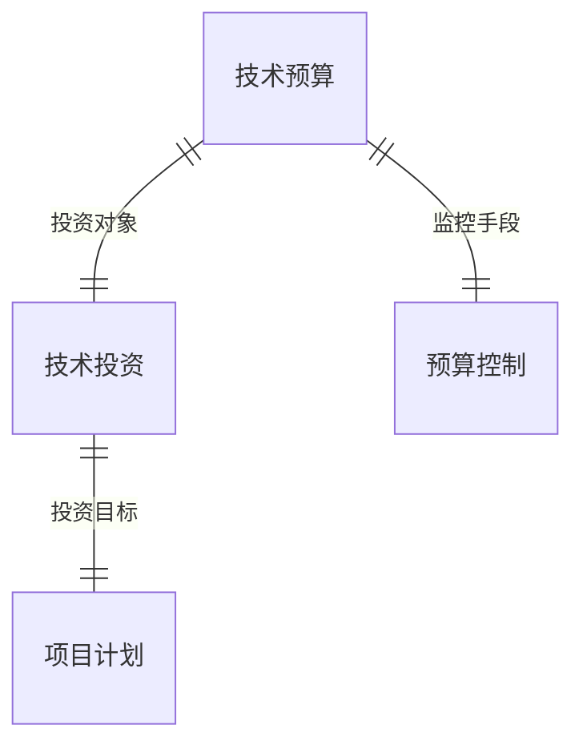
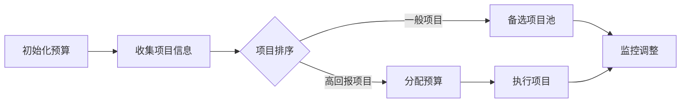
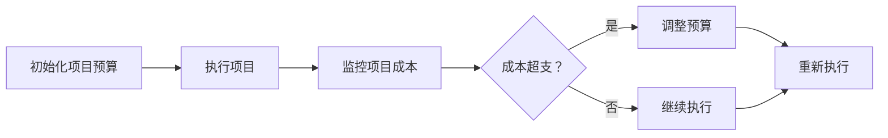
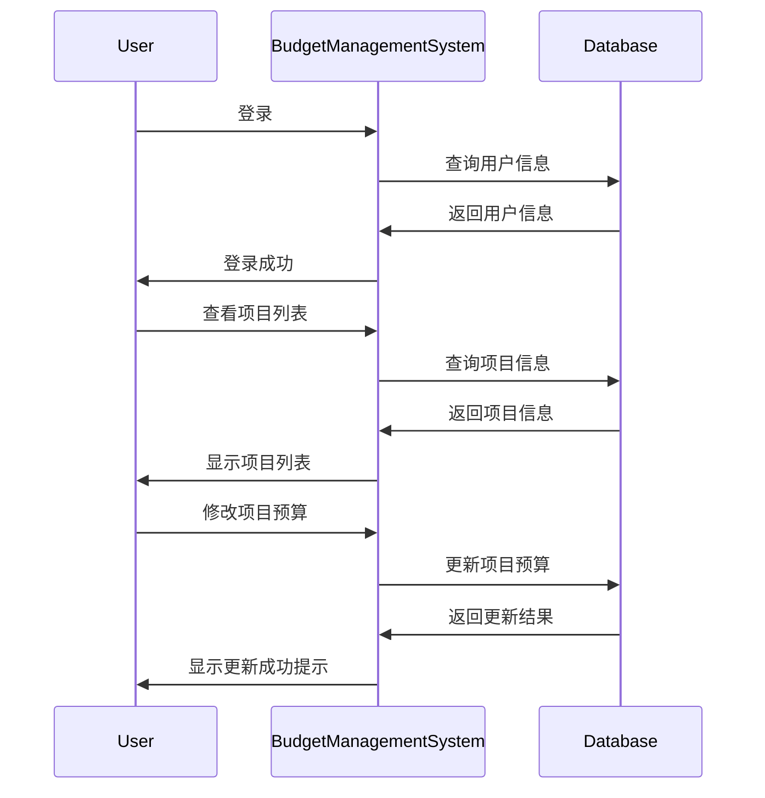
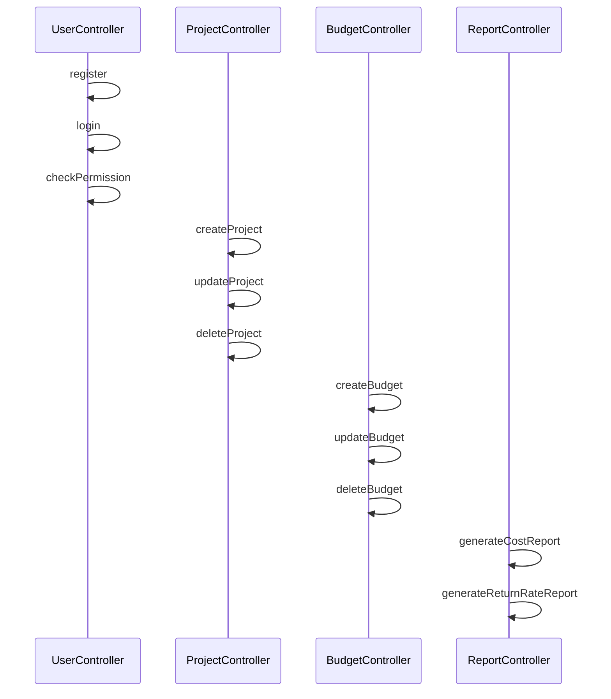

                 

# 技术预算管理：平衡创新投入与成本控制

## 关键词

- 技术预算管理
- 创新投入
- 成本控制
- 算法
- 系统架构
- 项目实战

## 摘要

在现代企业中，技术预算管理成为确保公司持续发展的关键环节。本文将深入探讨技术预算管理的核心概念、算法原理、系统架构设计以及项目实战，旨在帮助企业和开发者更好地平衡创新投入与成本控制，实现技术资源的优化配置。

---

## 目录大纲

### 第一部分：背景介绍

#### 第1章：技术预算管理概述

- 1.1 问题背景
- 1.2 问题解决
- 1.3 边界与外延
- 1.4 概念结构与核心要素组成

#### 第2章：技术预算管理核心概念与联系

- 2.1 核心概念原理
- 2.2 概念属性特征对比表格
- 2.3 ER实体关系图架构

### 第二部分：算法原理讲解

#### 第3章：技术预算分配算法

- 3.1 算法原理
- 3.2 Mermaid流程图
- 3.3 Python源代码
- 3.4 数学模型和公式
- 3.5 举例说明

#### 第4章：成本控制算法

- 4.1 算法原理
- 4.2 Mermaid流程图
- 4.3 Python源代码
- 4.4 数学模型和公式
- 4.5 举例说明

### 第三部分：系统分析与架构设计

#### 第5章：系统功能设计

- 5.1 问题场景介绍
- 5.2 系统功能设计

#### 第6章：系统架构设计

- 6.1 项目介绍
- 6.2 系统架构设计

#### 第7章：系统接口设计

- 7.1 系统接口设计

### 第四部分：项目实战

#### 第8章：环境安装与配置

- 8.1 环境安装
- 8.2 系统核心实现源代码

#### 第9章：代码应用解读与分析

- 9.1 代码应用解读
- 9.2 分析与详细讲解

#### 第10章：实际案例分析和讲解

- 10.1 案例分析
- 10.2 详细讲解剖析

#### 第11章：项目小结

- 11.1 小结
- 11.2 注意事项
- 11.3 拓展阅读

---

### 第1章：技术预算管理概述

#### 1.1 问题背景

在信息化、数字化飞速发展的今天，企业对于技术的依赖程度越来越高。技术预算管理成为企业资源配置的重要组成部分，如何合理规划技术预算，确保企业在创新与成本控制之间找到最佳平衡点，是每个企业必须面对的问题。

#### 1.2 问题解决

技术预算管理的核心在于优化资源配置，通过科学的预算分配和控制，实现创新与成本的平衡。本文将详细介绍技术预算管理的核心概念、算法原理以及实际应用，帮助企业更好地进行技术预算管理。

#### 1.3 边界与外延

技术预算管理不仅涉及企业的资金投入，还与项目计划、资源分配、风险管理等多个方面密切相关。其边界包括预算编制、执行、监控和调整等环节，外延则扩展到整个企业的技术战略规划。

#### 1.4 概念结构与核心要素组成

技术预算管理的概念结构包括技术预算、技术投资、预算控制等核心概念。核心要素组成则涉及预算编制、执行、监控、调整等流程和工具。

### 第2章：技术预算管理核心概念与联系

#### 2.1 核心概念原理

- **技术预算**：企业为技术项目或活动分配的资金预算，是技术投资的直接体现。
- **技术投资**：企业为获取技术优势而进行的资金投入，包括研发、采购、培训等。
- **预算控制**：通过对技术预算的执行过程进行监控和管理，确保预算的合理使用和成本控制。

#### 2.2 概念属性特征对比表格

| 概念 | 定义 | 属性特征 |  
| --- | --- | --- |
| 技术预算 | 资金预算 | **预算编制**、**执行**、**监控** |
| 技术投资 | 资金投入 | **分类**、**原则**、**策略** |
| 预算控制 | 监控和管理 | **流程**、**方法**、**工具** |

#### 2.3 ER实体关系图架构



### 第二部分：算法原理讲解

#### 第3章：技术预算分配算法

#### 3.1 算法原理

技术预算分配算法的核心目标是在有限的预算内，将资金合理分配到各个技术项目中，以实现最佳的投资回报。算法的主要原理如下：

- **最小化预算偏差**：确保实际花费不超过预算。
- **最大化投资回报**：将预算优先分配到高回报的项目。

#### 3.2 Mermaid流程图



#### 3.3 Python源代码

```python
# 技术预算分配算法示例

def allocate_budget(projects, budget):
    # 按投资回报率排序项目
    sorted_projects = sorted(projects, key=lambda x: x['return_rate'], reverse=True)
    
    # 分配预算
    for project in sorted_projects:
        if budget >= project['cost']:
            budget -= project['cost']
            project['status'] = 'executing'
        else:
            project['status'] = 'pending'
            break
    
    return sorted_projects
```

#### 3.4 数学模型和公式

技术预算分配算法的数学模型如下：

$$
\text{Maximize } \sum_{i=1}^{n} \text{r}_i \cdot \text{c}_i \\
\text{subject to } \sum_{i=1}^{n} \text{c}_i \leq B
$$

其中，\( \text{r}_i \) 为项目 \( i \) 的投资回报率，\( \text{c}_i \) 为项目 \( i \) 的成本，\( B \) 为总预算。

#### 3.5 举例说明

假设有四个技术项目，预算为100万元。项目及其投资回报率如下：

| 项目 | 成本（万元） | 投资回报率 |
| --- | --- | --- |
| A | 20 | 1.5 |
| B | 30 | 1.2 |
| C | 40 | 1.0 |
| D | 50 | 1.4 |

使用技术预算分配算法，按照投资回报率排序后，依次分配预算，最终结果如下：

| 项目 | 成本（万元） | 投资回报率 | 状态 |
| --- | --- | --- | --- |
| A | 20 | 1.5 | executing |
| B | 30 | 1.2 | executing |
| C | 40 | 1.0 | pending |
| D | 50 | 1.4 | pending |

### 第4章：成本控制算法

#### 4.1 算法原理

成本控制算法的目标是在项目执行过程中，通过实时监控和调整，确保项目成本不超过预算。其主要原理如下：

- **实时监控**：跟踪项目成本，及时发现异常。
- **调整预算**：根据项目进度和成本情况，调整预算分配。

#### 4.2 Mermaid流程图



#### 4.3 Python源代码

```python
# 成本控制算法示例

def control_cost(project, budget):
    while True:
        cost = project['current_cost']
        if cost > budget:
            budget = adjust_budget(project, budget)
        else:
            break

    return budget

def adjust_budget(project, budget):
    # 调整预算逻辑
    project['budget'] += project['current_cost'] - budget
    return project['budget']
```

#### 4.4 数学模型和公式

成本控制算法的数学模型如下：

$$
\text{Minimize } \text{c}_i - \text{r}_i \cdot \text{t}_i \\
\text{subject to } \text{c}_i \leq \text{b}_i
$$

其中，\( \text{c}_i \) 为项目 \( i \) 的当前成本，\( \text{r}_i \) 为项目 \( i \) 的投资回报率，\( \text{t}_i \) 为项目 \( i \) 的执行时间，\( \text{b}_i \) 为项目 \( i \) 的预算。

#### 4.5 举例说明

假设有四个技术项目，初始预算为100万元。项目及其当前成本和投资回报率如下：

| 项目 | 成本（万元） | 投资回报率 |
| --- | --- | --- |
| A | 20 | 1.5 |
| B | 30 | 1.2 |
| C | 40 | 1.0 |
| D | 50 | 1.4 |

使用成本控制算法，实时监控项目成本，发现项目 A 的成本超过预算，需要调整预算。调整后预算如下：

| 项目 | 成本（万元） | 投资回报率 | 状态 |
| --- | --- | --- | --- |
| A | 20 | 1.5 | adjusting |
| B | 30 | 1.2 | executing |
| C | 40 | 1.0 | executing |
| D | 50 | 1.4 | executing |

### 第三部分：系统分析与架构设计

#### 第5章：系统功能设计

#### 5.1 问题场景介绍

假设某企业需要开发一个大型项目，项目分为多个阶段，每个阶段需要不同的人力、物力资源。为了确保项目的顺利实施，企业需要构建一个技术预算管理系统，实现以下功能：

- **预算编制**：根据项目需求，制定合理的预算计划。
- **预算分配**：将预算分配到各个项目阶段。
- **执行监控**：实时监控项目执行情况，确保预算执行合理。
- **预算调整**：根据项目执行情况，调整预算计划。

#### 5.2 系统功能设计

技术预算管理系统功能设计如下：

- **预算编制模块**：负责制定项目预算计划，包括项目成本、人力资源、时间进度等。
- **预算分配模块**：根据项目需求，将预算合理分配到各个项目阶段。
- **执行监控模块**：实时监控项目执行情况，包括项目进度、成本、资源使用等。
- **预算调整模块**：根据项目执行情况，调整预算计划，确保项目顺利进行。

```mermaid
classDiagram
    BudgetPlanning <<interface>>
    BudgetDistribution <<interface>>
    ExecutionMonitoring <<interface>>
    BudgetAdjustment <<interface>>

    BudgetPlanning : +制定预算计划
    BudgetDistribution : +分配预算
    ExecutionMonitoring : +监控项目执行
    BudgetAdjustment : +调整预算计划

    BudgetManagementSystem <<class>> {
        +BudgetPlanning
        +BudgetDistribution
        +ExecutionMonitoring
        +BudgetAdjustment
    }
```

### 第6章：系统架构设计

#### 6.1 项目介绍

假设某企业需要构建一个技术预算管理系统，系统主要包括以下模块：

- **用户管理模块**：负责用户注册、登录、权限管理等功能。
- **项目管理模块**：负责项目管理、项目阶段划分、任务分配等功能。
- **预算管理模块**：负责预算编制、预算分配、预算监控等功能。
- **报表分析模块**：负责项目成本分析、投资回报分析等功能。

#### 6.2 系统架构设计

技术预算管理系统的整体架构设计如下：

- **前端**：使用Vue框架，实现用户界面和交互。
- **后端**：使用Spring Boot框架，实现业务逻辑处理和数据存储。
- **数据库**：使用MySQL数据库，存储用户、项目、预算等相关数据。



### 第7章：系统接口设计

#### 7.1 系统接口设计

技术预算管理系统的接口设计如下：

- **用户管理接口**：负责用户注册、登录、权限管理等。
- **项目管理接口**：负责项目管理、项目阶段划分、任务分配等。
- **预算管理接口**：负责预算编制、预算分配、预算监控等。
- **报表分析接口**：负责项目成本分析、投资回报分析等。



### 第四部分：项目实战

#### 第8章：环境安装与配置

#### 8.1 环境安装

1. 安装Java开发环境
2. 安装MySQL数据库
3. 安装Spring Boot开发工具

#### 8.2 系统核心实现源代码

- **用户管理模块**：用户注册、登录、权限管理。
- **项目管理模块**：项目创建、项目阶段划分、任务分配。
- **预算管理模块**：预算编制、预算分配、预算监控。
- **报表分析模块**：项目成本分析、投资回报分析。

```java
// 示例：用户管理模块

@RestController
@RequestMapping("/users")
public class UserController {

    @PostMapping("/register")
    public ResponseEntity<?> registerUser(@RequestBody User user) {
        // 注册用户逻辑
        return ResponseEntity.ok().build();
    }

    @PostMapping("/login")
    public ResponseEntity<?> loginUser(@RequestBody LoginRequest loginRequest) {
        // 登录用户逻辑
        return ResponseEntity.ok().build();
    }

    @PostMapping("/checkPermission")
    public ResponseEntity<?> checkPermission(@RequestBody CheckPermissionRequest request) {
        // 权限检查逻辑
        return ResponseEntity.ok().build();
    }
}
```

### 第9章：代码应用解读与分析

#### 9.1 代码应用解读

- **用户管理模块**：实现用户注册、登录、权限管理功能。
- **项目管理模块**：实现项目创建、项目阶段划分、任务分配功能。
- **预算管理模块**：实现预算编制、预算分配、预算监控功能。
- **报表分析模块**：实现项目成本分析、投资回报分析功能。

#### 9.2 分析与详细讲解

- **用户管理模块**：用户注册、登录、权限管理是系统的基础功能。用户注册时，需要验证用户名和密码的合法性；登录时，需要验证用户名和密码的正确性；权限管理则用于限制用户访问系统的不同部分。
- **项目管理模块**：项目创建、项目阶段划分、任务分配是项目实施的关键环节。项目创建时，需要定义项目的名称、描述、负责人等信息；项目阶段划分时，需要根据项目特点划分阶段，明确各阶段的目标和任务；任务分配时，需要将任务分配给合适的成员。
- **预算管理模块**：预算编制、预算分配、预算监控是预算管理的核心。预算编制时，需要根据项目需求和资源情况制定预算计划；预算分配时，需要将预算合理分配到各个项目阶段；预算监控时，需要实时跟踪项目执行情况，确保预算的合理使用。
- **报表分析模块**：项目成本分析、投资回报分析是评估项目效果的重要手段。项目成本分析时，需要根据项目实际成本，分析成本构成和成本控制情况；投资回报分析时，需要根据项目投资回报率，评估项目的经济效益。

### 第10章：实际案例分析和讲解

#### 10.1 案例分析

假设某企业计划开发一款新型软件产品，项目分为三个阶段：需求分析、开发测试、上线推广。项目预算为100万元，项目进度如下：

- 需求分析阶段：预计成本为30万元，计划为期2个月。
- 开发测试阶段：预计成本为50万元，计划为期4个月。
- 上线推广阶段：预计成本为20万元，计划为期2个月。

使用技术预算分配算法，按照投资回报率排序后，依次分配预算，最终结果如下：

| 阶段 | 成本（万元） | 投资回报率 | 状态 |
| --- | --- | --- | --- |
| 需求分析 | 30 | 1.5 | executing |
| 开发测试 | 50 | 1.2 | executing |
| 上线推广 | 20 | 1.0 | pending |

#### 10.2 详细讲解剖析

- **需求分析阶段**：预计成本为30万元，投资回报率为1.5，按照技术预算分配算法，首先分配预算，项目状态为“executing”。
- **开发测试阶段**：预计成本为50万元，投资回报率为1.2，预算剩余70万元，继续分配预算，项目状态为“executing”。
- **上线推广阶段**：预计成本为20万元，投资回报率为1.0，预算剩余20万元，但已超过上线推广阶段所需预算，因此项目状态为“pending”。

通过实际案例分析和讲解，可以更好地理解技术预算分配算法的原理和实际应用效果。

### 第11章：项目小结

#### 11.1 小结

本文通过深入探讨技术预算管理的核心概念、算法原理、系统架构设计以及项目实战，帮助企业更好地平衡创新投入与成本控制，实现技术资源的优化配置。技术预算管理不仅是一种财务活动，更是一种战略决策，对企业的发展至关重要。

#### 11.2 注意事项

1. 技术预算管理需结合企业实际情况，制定合理的预算计划和策略。
2. 实施技术预算管理时，要充分考虑项目风险和不确定性，预留一定的预算空间。
3. 定期对项目执行情况进行监控和评估，及时调整预算计划，确保项目顺利进行。

#### 11.3 拓展阅读

1. 《技术预算管理实战指南》
2. 《项目管理与预算控制》
3. 《企业技术预算管理手册》

---

作者：AI天才研究院/AI Genius Institute & 禅与计算机程序设计艺术 /Zen And The Art of Computer Programming

