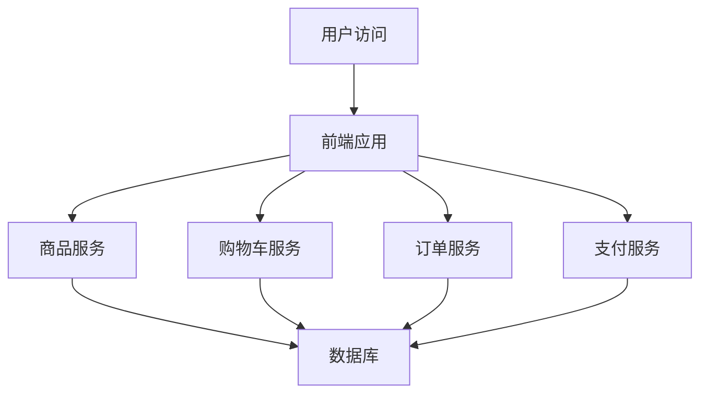

                 

## 引言

在当今快速发展的信息技术时代，技术领导力成为推动企业创新和竞争力提升的关键因素。从高级开发者到架构师的职业发展路径，不仅是技术能力的积累，更是领导力的提升。本文旨在探讨技术领导力的发展过程，分析从高级开发者过渡到架构师所需的技能和素质，帮助读者深入了解这一职业转变背后的逻辑和实际操作。

### 文章关键词

- 技术领导力
- 高级开发者
- 架构师
- 职业发展
- 技术能力
- 领导力
- 转型

### 摘要

本文将分为以下章节展开讨论：

1. **引言**：介绍技术领导力的背景和重要性。
2. **技术领导力的重要性**：阐述技术领导力在企业发展中的作用。
3. **高级开发者的职责与技能**：分析高级开发者的核心技能和工作职责。
4. **架构师的角色与职责**：探讨架构师在企业中的角色和责任。
5. **领导力的培养**：分析如何提升个人的领导力素质。
6. **从高级开发者到架构师的转型路径**：讨论转型的具体步骤和挑战。
7. **核心技术概念的掌握**：介绍架构师所需的核心技术知识。
8. **系统分析与架构设计**：详细阐述架构设计的方法和工具。
9. **项目实战**：通过实际案例展示架构设计的应用。
10. **最佳实践与小结**：总结提升技术领导力的方法和经验。

通过上述章节的讨论，读者将能够清晰地理解技术领导力的发展路径，并找到适合自己的职业发展策略。

## 技术领导力的重要性

技术领导力在企业中的重要性不可忽视。它不仅关乎个人职业生涯的发展，更对企业创新、团队协作和长期竞争力产生深远影响。在这个数字化的时代，技术已经成为驱动企业增长和变革的核心力量。因此，技术领导力不仅仅是技术技能的体现，更是一种能够引领团队、推动创新和实现业务目标的综合能力。

### 技术领导力的定义

技术领导力是指领导者在其技术领域的专业知识和能力，以及运用这些知识和能力来影响、激励和指导团队成员，实现共同目标的能力。它包括技术深度、解决问题的能力、沟通技巧、团队合作精神以及对业务价值的深刻理解。

### 技术领导力在企业中的作用

1. **推动创新**：技术领导者能够敏锐地捕捉技术趋势，提出创新的解决方案，推动企业的技术革新。他们不仅具备深厚的技术背景，还具备前瞻性的视野，能够预见技术变革带来的机遇和挑战。

2. **提升团队效能**：技术领导者能够通过有效的团队管理，激发团队成员的潜力，提升团队的协作效率和创新能力。他们懂得如何通过沟通、协调和激励，使团队达成共同的目标。

3. **提升企业竞争力**：技术领导力是企业保持竞争力的关键。在快速变化的市场环境中，技术领导者能够带领团队迅速适应变化，应对市场竞争，保持技术优势。

4. **促进业务发展**：技术领导者深刻理解业务需求，能够将技术解决方案与业务目标紧密结合，推动业务发展。他们不仅关注技术本身，更关注技术如何创造商业价值。

### 技术领导力的挑战

1. **技术变革的快速性**：技术的快速发展要求技术领导者不断学习新的知识和技能，保持技术的前沿性。

2. **团队管理的复杂性**：技术领导者需要具备丰富的管理经验和人际沟通能力，能够处理团队内部的复杂关系。

3. **业务理解的深度**：技术领导者需要深入了解业务，才能将技术解决方案与业务目标有效结合。

4. **领导角色的转变**：从高级开发者到技术领导者，角色和职责的转变带来了新的挑战，需要领导者具备更高的自我管理能力和领导力。

总之，技术领导力是推动企业发展和创新的关键因素。它不仅要求技术深度，更要求领导力、沟通能力和业务理解。只有具备全面的技术领导力，才能在激烈的市场竞争中脱颖而出。

## 高级开发者的职责与技能

高级开发者是企业技术团队中的中坚力量，他们在软件开发过程中承担着核心职责，并具备一系列关键的技能和知识。理解高级开发者的日常工作职责和所需的技能，对于探讨从高级开发者过渡到架构师的角色转变具有重要意义。

### 高级开发者的职责

1. **代码编写与优化**：高级开发者负责编写高效、可维护的代码，并不断优化现有代码的性能和效率。他们不仅要精通编程语言和开发框架，还需具备良好的编程习惯和代码风格。

2. **项目管理和协调**：高级开发者通常参与项目的管理和协调工作，与产品经理、测试工程师和其他开发人员进行沟通，确保项目按时按质完成。他们需要具备项目规划、资源分配和风险管理的能力。

3. **技术难题解决**：在项目开发过程中，高级开发者需要解决复杂的技术难题，如性能瓶颈、系统架构优化和代码重构。他们必须具备深厚的技术知识和丰富的实战经验。

4. **代码审查与指导**：高级开发者负责对其他开发者的代码进行审查，确保代码质量符合标准，并提供技术指导，帮助团队成员提升技术水平。

5. **技术文档编写**：高级开发者需要编写详细的开发文档，包括技术方案、设计文档和用户手册，以便团队成员和其他利益相关者理解和使用。

### 高级开发者的技能

1. **编程语言与框架**：高级开发者需熟练掌握多种编程语言和开发框架，如Java、Python、JavaScript、Spring框架等。他们需要了解这些语言的特性和最佳实践，并能灵活应用于实际项目中。

2. **系统设计与架构**：高级开发者需具备系统设计和架构的能力，能够设计高性能、可扩展的系统架构，并理解不同架构模式（如MVC、微服务、分布式系统）的优缺点。

3. **算法与数据结构**：高级开发者需掌握常用的算法和数据结构，能够分析复杂度，设计高效的算法解决实际问题。他们需了解常见的排序、查找、图论算法等。

4. **数据库管理**：高级开发者需熟悉关系型数据库（如MySQL、PostgreSQL）和非关系型数据库（如MongoDB、Redis），了解数据库设计和性能优化。

5. **开发工具与平台**：高级开发者需熟练使用各种开发工具和平台，如版本控制工具（Git）、持续集成工具（Jenkins）、容器化技术（Docker、Kubernetes）等，以提高开发效率。

6. **软件工程原则**：高级开发者需遵循软件工程的基本原则，如模块化、可复用性、可维护性等，确保代码和系统的质量。

7. **测试与调试**：高级开发者需具备一定的测试和调试能力，能够编写单元测试、集成测试，并使用调试工具定位和修复代码中的问题。

通过理解高级开发者的职责与技能，我们可以更清晰地看到他们在企业技术团队中的重要角色。高级开发者不仅是技术难题的解决者，更是团队的技术支柱和领导力量。在他们的基础上，进一步提升领导力和架构设计能力，有助于成功转型为架构师。

### 架构师的角色与职责

架构师在企业技术团队中扮演着至关重要的角色。他们不仅是技术领导者，还是业务发展的推动者和团队协作的核心。理解架构师的职责和角色，有助于我们更好地理解他们在企业中的价值和影响力。

#### 架构师的角色

1. **技术决策者**：架构师是企业技术方向和架构设计的决策者。他们需要根据业务需求和公司战略，制定合适的技术路线图，选择最适合的技术方案，以确保系统的长期稳定性和可扩展性。

2. **团队领导者**：架构师需要领导和指导开发团队，确保团队成员能够高效地完成开发任务。他们需要具备出色的沟通和协调能力，能够有效地传达技术愿景和目标，激励团队成员发挥最大潜力。

3. **业务合作伙伴**：架构师不仅是技术的专家，还需要深刻理解业务需求。他们需要与业务团队紧密合作，确保技术解决方案能够真正满足业务需求，推动业务目标实现。

4. **技术创新者**：架构师需要关注最新的技术趋势和创新，不断探索和引入新的技术，推动企业的技术进步和创新能力。

5. **风险管理者**：架构师需要识别和管理技术风险，确保系统的高可用性和稳定性。他们需要制定应急预案和备份方案，以应对可能出现的系统故障或技术问题。

#### 架构师的职责

1. **系统架构设计**：架构师的主要职责是设计和优化系统的整体架构，包括系统模块划分、接口设计、数据流设计等。他们需要确保系统具有良好的可扩展性、高可用性和安全性。

2. **技术方案评审**：架构师需要参与技术方案的评审，评估各种方案的优缺点，选择最佳的技术方案。他们需要具备广泛的技术视野和深厚的专业背景，能够从多个角度分析问题。

3. **团队技术指导**：架构师需要为团队成员提供技术指导和支持，帮助他们解决技术难题。他们需要具备丰富的实战经验，能够通过实例和案例帮助团队成员提升技术水平。

4. **持续集成与部署**：架构师需要关注持续集成和持续部署（CI/CD）的流程，确保开发流程的自动化和高效性。他们需要熟悉各种自动化工具和平台，优化开发流程，提高团队的工作效率。

5. **技术文档编写**：架构师需要编写详细的技术文档，包括系统设计文档、接口文档和使用手册等。这些文档不仅有助于团队成员理解系统，也为未来的维护和扩展提供了重要的参考。

6. **项目管理和协调**：架构师需要参与项目的管理和协调工作，确保项目按时按质完成。他们需要协调不同团队之间的工作，解决项目中的冲突和问题，确保项目顺利进行。

通过上述职责和角色的分析，我们可以看到架构师在企业中的核心地位。他们不仅是技术的专家，还是业务和团队的桥梁，需要具备全面的技术领导力和管理能力。只有在技术和领导力双重能力的支撑下，架构师才能有效地推动企业技术发展和业务创新。

### 领导力的培养

在技术领导力的培养过程中，领导力的提升是一个复杂而持续的过程。领导力不仅关乎个人的专业技能，更涉及到人际关系管理、团队协作、沟通技巧等多方面的能力。以下是一些关键的领导力培养方法，帮助高级开发者顺利转型为架构师。

#### 自我认知与反思

1. **了解自己的长处和短板**：自我认知是提升领导力的第一步。高级开发者需要清楚地了解自己的优势与不足，识别出需要改进的方面。通过自我评估和反馈，可以更有针对性地进行提升。

2. **持续反思与自我提升**：定期反思自己的工作行为和领导风格，分析成功和失败的原因。通过反思，可以不断调整和优化自己的领导方法，提升领导效果。

#### 沟通技巧的提升

1. **清晰明确的表达**：良好的沟通技巧是领导力的核心组成部分。高级开发者需要学会如何清晰、明确地表达自己的想法和意见，确保信息准确传达。

2. **倾听和理解他人**：有效的沟通不仅仅是表达，更重要的是倾听和理解他人。架构师需要具备良好的倾听技巧，理解团队成员的需求和意见，促进团队的协作和共识。

3. **跨部门沟通**：作为架构师，需要与业务团队、项目管理团队等多部门进行沟通。跨部门沟通要求具备更广泛的视角和更强的协调能力。

#### 团队管理与协作

1. **建立信任与协作关系**：团队管理的关键在于建立信任和协作关系。高级开发者需要通过公正、透明和负责任的行为，赢得团队成员的信任。

2. **激励和培养团队成员**：架构师需要关注团队成员的职业发展和技能提升，通过激励和培养，激发团队成员的潜力，提升团队的整体能力。

3. **冲突管理**：团队中难免会出现冲突，架构师需要具备有效的冲突管理能力，通过沟通和协调，找到解决问题的最佳途径。

#### 持续学习与成长

1. **掌握最新技术趋势**：技术领导者需要不断学习最新的技术趋势和知识，保持技术的前沿性。

2. **参加领导力培训**：参加专业的领导力培训课程，系统学习领导力理论和实践方法，提升自身的领导力水平。

3. **阅读相关书籍和文章**：广泛阅读领导力、团队管理和技术领域的书籍和文章，吸取先进的理念和方法。

通过以上方法，高级开发者可以逐步提升自己的领导力，为转型为架构师打下坚实的基础。持续的学习和自我提升，是成为卓越技术领导者的必经之路。

### 从高级开发者到架构师的转型路径

从高级开发者转型为架构师，不仅是技术能力的提升，更是领导力和管理能力的全面成长。这一转型过程涉及多个关键步骤和潜在挑战，以下是详细的分析和指导。

#### 了解架构师的工作内容和职责

1. **职责认知**：首先，高级开发者需要深入了解架构师在企业中的职责。这包括系统架构设计、技术方案评审、团队技术指导、项目管理和协调等。通过阅读相关的技术文档和参考书籍，了解架构师的具体工作内容和要求。

2. **角色定位**：明确架构师的角色定位，从技术专家向技术领导者转变。这要求开发者不仅要精通技术，还要具备良好的沟通能力、团队协作精神和业务理解能力。

#### 培养架构思维

1. **系统思考**：架构师需要具备系统思维，能够从整体上理解和设计复杂系统。高级开发者可以通过学习系统架构设计原则，如SOLID原则、CAP定理等，提升自己的系统设计能力。

2. **设计模式掌握**：熟悉常用的设计模式，如MVC、工厂模式、策略模式等，能够将设计模式应用于实际项目中，提升系统设计的灵活性和可维护性。

3. **架构演化**：理解系统架构的演化过程，包括从单体架构向微服务架构的转型，掌握不同架构模式的优势和适用场景。

#### 提升领导力和管理能力

1. **团队管理**：作为架构师，需要具备团队管理能力。通过参与项目管理、编写技术文档、组织技术分享等方式，提升团队协作和沟通能力。

2. **激励与培养**：关注团队成员的职业发展，通过设定目标和提供反馈，激励团队成员不断进步。培养团队成员的技能，提升团队的整体战斗力。

3. **沟通技巧**：提升跨部门沟通能力，确保技术方案能够与业务需求紧密结合。学会有效表达，提高团队决策效率。

#### 逐步承担更多责任

1. **技术决策**：逐步承担技术决策的责任，从参与决策到独立做出技术决策，提升技术判断力。

2. **项目管理**：参与项目管理和协调工作，提升项目规划、资源分配和风险管理能力。

3. **技术指导**：作为技术专家，为团队成员提供技术指导和支持，提升团队的技术水平。

#### 面临的挑战与应对策略

1. **技术难度**：架构师需要处理更复杂的技术问题，这要求持续学习新知识和技能。应对策略是制定学习计划，定期参加技术培训和研讨会，保持技术前沿。

2. **团队管理**：团队管理带来的挑战包括团队冲突、成员激励和团队士气等。应对策略是通过有效的沟通和冲突管理，建立和谐的团队氛围。

3. **时间管理**：架构师的工作内容丰富多样，需要有效管理时间，确保各项工作顺利进行。应对策略是制定详细的工作计划，优先处理重要任务，避免拖延。

通过上述步骤和策略，高级开发者可以逐步实现从高级开发者到架构师的转型。这一过程不仅需要技术能力的提升，更需要领导力和管理能力的全面发展。只有通过不断的学习和实践，才能成为优秀的架构师，为企业的发展贡献自己的力量。

### 核心技术概念的掌握

成为架构师的过程中，掌握一系列核心技术概念是必不可少的。这些概念不仅帮助架构师理解复杂系统的运作机制，还能为设计高效、可扩展的系统提供理论基础。以下是几个关键的核心技术概念，包括其原理、应用场景和注意事项。

#### 分布式系统

**原理**：分布式系统是指由多个独立的计算机节点组成，通过通信网络互相协作，共同完成计算任务的一组系统。每个节点拥有独立的功能，但通过互相协作，能够提供更高的可用性、扩展性和容错能力。

**应用场景**：分布式系统广泛应用于互联网服务、大数据处理、云计算等领域。例如，电商平台中的商品服务、订单服务、用户服务可以部署在不同的节点上，通过分布式服务框架（如Dubbo、Spring Cloud）进行通信和协调。

**注意事项**：分布式系统设计需要关注数据一致性、网络延迟和分区容忍性。分布式锁、分布式事务、分布式存储等技术是实现高可用性和一致性保障的关键。

#### 微服务架构

**原理**：微服务架构是将大型单体应用拆分为多个小型、独立的服务，每个服务负责应用的一部分功能，并通过轻量级的通信协议（如HTTP、gRPC）进行交互。每个服务可以独立开发、部署和扩展，提高了系统的灵活性、可维护性和扩展性。

**应用场景**：微服务架构适用于复杂业务系统，如电商平台、金融系统、物联网系统等。通过将业务功能拆分为多个微服务，可以更好地应对业务变化和需求。

**注意事项**：微服务架构设计需要注意服务边界、数据一致性、服务发现和负载均衡等问题。使用服务网格（如Istio、Linkerd）和管理平台（如Kubernetes）可以帮助管理复杂的微服务架构。

#### 容器化技术

**原理**：容器化技术通过将应用及其依赖的环境打包到轻量级的容器中，实现了应用的隔离和标准化部署。容器化的核心组件包括Docker、Kubernetes等，能够简化应用部署、扩展和管理。

**应用场景**：容器化技术广泛应用于持续集成/持续部署（CI/CD）流程、云原生应用开发和运维中。通过容器化，可以快速部署和扩展应用，提高开发效率和系统稳定性。

**注意事项**：容器化设计需要关注容器网络、存储、安全等问题。容器编排工具（如Kubernetes）能够自动化管理容器化应用的生命周期。

#### 云计算

**原理**：云计算是一种通过互联网提供计算资源、存储资源和网络资源的模型，用户可以根据需要灵活地获取和使用这些资源。云计算主要分为IaaS、PaaS、SaaS三种服务模式。

**应用场景**：云计算广泛应用于企业IT基础设施、大数据处理、人工智能应用、移动应用后端等场景。通过云计算，企业可以降低IT成本、提高资源利用率和灵活性。

**注意事项**：云计算设计需要关注安全性、数据隐私、多租户隔离等问题。选择合适的云服务提供商和云服务模型，可以优化应用性能和成本。

通过掌握上述核心技术概念，架构师能够更好地理解复杂系统的设计原则和实现方法，为构建高效、可扩展的系统提供有力支持。

### 系统分析与架构设计

系统分析与架构设计是架构师工作中至关重要的一环，它直接关系到系统的性能、可扩展性、可维护性和用户体验。以下是系统分析与架构设计的方法、工具和实践，以及具体的实例和图解，帮助读者更好地理解这一过程。

#### 方法

1. **需求分析**：首先，进行详细的需求分析，明确系统的功能需求和非功能需求，包括性能、可靠性、安全性等。需求分析的结果通常包括需求文档和用户故事。

2. **系统建模**：使用统一建模语言（UML）进行系统建模，包括用例图、类图、序列图等，以可视化地表示系统的结构和行为。

3. **架构设计**：根据需求分析的结果，进行系统架构设计。架构设计包括模块划分、数据流设计、接口设计等，确保系统具有良好的可扩展性和可维护性。

4. **性能优化**：对系统进行性能分析，识别性能瓶颈，并进行优化。常用的性能优化方法包括缓存、分布式系统、异步处理等。

5. **安全性设计**：考虑系统的安全性，设计安全策略和机制，包括数据加密、权限控制、安全审计等。

#### 工具

1. **UML建模工具**：如Visual Paradigm、StarUML等，用于绘制系统模型。

2. **设计模式库**：如Design Patterns: Elements of Reusable Object-Oriented Software，提供了一系列经典的软件设计模式。

3. **性能分析工具**：如JProfiler、VisualVM等，用于监控和分析系统性能。

4. **容器编排工具**：如Kubernetes，用于管理和部署容器化应用。

5. **云服务管理平台**：如AWS、Azure、Google Cloud，提供丰富的云服务和资源管理工具。

#### 实践

1. **实例**：假设我们要设计一个电商平台，首先进行需求分析，明确功能需求（如商品浏览、购物车、下单支付等）和非功能需求（如性能、高可用性、安全性等）。

2. **系统建模**：使用UML绘制用例图，表示系统的用户角色和功能；使用类图，表示系统的类及其关系；使用序列图，表示用户与系统的交互流程。

3. **架构设计**：设计系统的整体架构，包括前端、后端、数据库、缓存、消息队列等模块。每个模块需要明确其功能、接口和数据流。

4. **性能优化**：对系统进行性能测试，识别出瓶颈，如数据库查询效率低、网络延迟等，并进行优化。例如，使用缓存减少数据库查询次数，使用异步处理提高响应速度。

5. **安全性设计**：设计安全策略，如用户认证、权限控制、数据加密等，确保系统数据的安全性和用户隐私。

#### 图解

以下是电商平台系统架构的设计示例：



在上面的示例中，用户访问前端应用，前端应用与商品服务、购物车服务、订单服务和支付服务进行交互，这些服务最终与数据库进行数据存储和查询。

通过上述方法和工具的实践，架构师能够系统地分析和设计复杂系统，确保系统的高效运行和稳定可靠。

### 项目实战

为了更好地理解从高级开发者到架构师的转型过程，以下将通过一个实际项目案例进行详细解析。这个项目是一个电商平台的构建，涵盖从需求分析、系统设计到项目实施的全过程。

#### 项目背景

某电商平台需要构建一个具备高并发、高可用性和扩展性的系统，以支持数百万用户同时在线购物。项目目标包括实现用户注册、登录、商品浏览、购物车管理、订单处理和支付功能，同时确保系统的安全性和稳定性。

#### 需求分析

1. **功能需求**：
   - 用户注册与登录
   - 商品浏览与搜索
   - 购物车管理
   - 下单与订单管理
   - 支付与结算
   - 用户评价与售后

2. **非功能需求**：
   - 性能：支持高并发用户访问，响应时间小于1秒
   - 可用性：系统高可用性达到99.9%
   - 安全性：数据加密传输，用户隐私保护
   - 扩展性：支持业务规模扩展，模块化设计

#### 系统设计

1. **前端架构**：
   - 采用Vue.js框架，实现用户界面和交互
   - 使用Axios进行数据请求，与后端服务进行通信
   - 使用Nuxt.js实现SSR（服务器端渲染），提升SEO性能

2. **后端架构**：
   - 使用Spring Boot作为后端框架，实现业务逻辑
   - 部署在Docker容器中，使用Kubernetes进行管理
   - 使用Redis缓存高频数据，提升系统性能

3. **数据库设计**：
   - 主数据库使用MySQL，实现商品、订单等数据的存储
   - 使用MongoDB存储用户评论、日志等非结构化数据

4. **消息队列**：
   - 使用RabbitMQ实现订单支付的消息队列，确保支付流程的异步处理

#### 项目实施

1. **环境搭建**：
   - 配置Docker环境，构建后端服务的Docker镜像
   - 安装并配置Kubernetes集群，管理容器化应用

2. **前端开发**：
   - 设计并实现用户界面，编写Vue组件
   - 完成前端接口测试，确保与后端服务的兼容性

3. **后端开发**：
   - 完成业务逻辑的实现，包括用户注册、登录、商品浏览等
   - 集成Redis缓存，优化系统性能
   - 使用RabbitMQ实现订单支付的消息队列

4. **数据库迁移**：
   - 设计并执行数据库迁移脚本，确保数据的一致性和完整性

5. **测试与部署**：
   - 进行集成测试，确保各个模块的功能正常
   - 使用JMeter进行性能测试，验证系统的高并发性能
   - 部署到Kubernetes集群，实现应用的自动化部署和扩展

#### 代码实现与分析

以下是一个简单的购物车管理模块的Python代码示例，展示后端业务逻辑的实现：

```python
from flask import Flask, request, jsonify
from redis import Redis

app = Flask(__name__)
redis_client = Redis(host='redis', port=6379)

@app.route('/cart/add', methods=['POST'])
def add_to_cart():
    user_id = request.form['user_id']
    product_id = request.form['product_id']
    quantity = request.form['quantity']
    
    redis_client.hset(f'user:{user_id}:cart', product_id, quantity)
    
    return jsonify({'status': 'success', 'message': 'Product added to cart.'})

@app.route('/cart/remove', methods=['POST'])
def remove_from_cart():
    user_id = request.form['user_id']
    product_id = request.form['product_id']
    
    redis_client.hdel(f'user:{user_id}:cart', product_id)
    
    return jsonify({'status': 'success', 'message': 'Product removed from cart.'})

if __name__ == '__main__':
    app.run(host='0.0.0.0', port=8080)
```

在上面的代码中，我们使用Redis作为缓存存储用户购物车信息。`add_to_cart`函数用于向购物车中添加商品，`remove_from_cart`函数用于从购物车中移除商品。通过使用Redis，可以显著提升系统的性能和扩展性。

#### 实际案例分析与详细讲解

1. **高并发处理**：
   - 在高并发场景下，系统需要处理大量用户请求。通过使用Kubernetes和Redis，可以实现负载均衡和缓存加速，提高系统的响应速度和处理能力。

2. **系统扩展性**：
   - 电商平台的业务规模不断增长，系统需要具备良好的扩展性。通过微服务架构和容器化技术，可以轻松实现服务的动态扩展和部署。

3. **安全性**：
   - 系统的安全性是关键，包括用户数据保护、接口安全等。通过使用HTTPS加密传输、用户认证和权限控制，可以确保系统的安全可靠。

#### 项目小结

通过上述项目实战，我们可以看到从高级开发者到架构师的转型过程不仅涉及技术能力的提升，还包括项目管理、团队协作和业务理解等多方面能力的提升。架构师需要全面掌握系统分析与设计的方法和工具，灵活应用各种技术，确保系统的稳定、高效和可扩展。这一过程需要不断学习和实践，通过实际项目积累经验，不断提升自身的技术领导力。

### 最佳实践与小结

在提升技术领导力的过程中，遵循最佳实践是确保高效发展和成功转型的关键。以下是一些具体的最佳实践和建议，以及总结和注意事项。

#### 最佳实践

1. **持续学习**：技术领域日新月异，持续学习是保持竞争力的必要条件。定期阅读技术书籍、参加线上课程和研讨会，关注技术社区和前沿动态，可以不断更新知识库。

2. **实践经验**：理论知识是基础，但实践是检验真理的唯一标准。通过参与实际项目，将所学知识应用到具体场景中，可以提升问题解决能力和系统设计能力。

3. **团队协作**：良好的团队协作是技术领导力的核心组成部分。通过有效的沟通和协调，建立信任和协作关系，可以提升团队效能和创新能力。

4. **项目管理**：掌握项目管理方法，如敏捷开发、Scrum等，可以优化开发流程，提高项目交付效率和质量。

5. **技术分享**：定期组织技术分享会，不仅可以巩固自己的知识，还可以激发团队成员的积极性和创造力。

6. **反思与总结**：定期反思和总结自己的工作，分析成功和失败的原因，持续改进工作方法和领导风格。

#### 小结

本文从技术领导力的定义、高级开发者的职责与技能、架构师的角色与职责、领导力的培养、转型路径、核心技术概念、系统分析与架构设计、项目实战等多个方面，系统地探讨了从高级开发者到架构师的转型过程。通过详细的分析和实践案例，读者可以清晰地理解这一职业发展的路径和关键要素。

#### 注意事项

1. **技术深度与广度**：架构师需要具备深厚的技术知识和广泛的技术视野，既要精通具体技术，又要了解相关领域的发展动态。

2. **业务理解**：深入理解业务需求是企业成功的关键，技术领导者需要与业务团队紧密合作，确保技术解决方案真正满足业务需求。

3. **领导力提升**：领导力不仅仅是技术能力的延伸，更包括人际沟通、团队管理、冲突解决等多方面能力，需要持续学习和实践。

4. **持续创新**：在快速变化的市场环境中，技术领导者需要具备前瞻性思维，不断探索和引入新技术，推动企业持续创新。

通过遵循上述最佳实践，并结合自身的实际情况，高级开发者可以逐步提升自己的技术领导力，成功转型为架构师，为企业的发展贡献力量。

### 拓展阅读

为了进一步深入了解技术领导力和架构设计，以下是几本推荐的经典书籍和资源，它们涵盖了从基础知识到高级实践的各个方面。

#### 经典书籍

1. **《设计模式：可复用面向对象软件的基础》**（Design Patterns: Elements of Reusable Object-Oriented Software） - 作者：Erich Gamma, Richard Helm, Ralph Johnson, and John Vlissides
   - 内容：详细介绍了23种经典的软件设计模式，帮助开发者理解如何解决常见的软件设计问题。
   - 推荐理由：设计模式是软件工程中的基础，对于提升系统设计的灵活性和可维护性至关重要。

2. **《架构探险：从架构师角度审视微服务、服务网格与Kubernetes》**（Architecting for Scale: How to Create and Run High-Performance Enterprise Systems） - 作者：Martin L. Abbott and Michael T. Fisher
   - 内容：讲述了大规模系统架构的设计原则和最佳实践，包括微服务架构、容器化技术和云原生应用。
   - 推荐理由：书中提供了丰富的实际案例和详细的技术解析，对于理解现代系统架构设计具有重要参考价值。

3. **《代码大全》**（The Art of Computer Programming） - 作者：Donald E. Knuth
   - 内容：这是一套关于算法和程序设计的经典著作，涵盖了从基础算法到复杂数据结构的各个方面。
   - 推荐理由：Knuth博士在程序设计领域享有极高的声誉，书中深入浅出的讲解对提升编程能力和算法思维极为有益。

#### 资源

1. **《微服务设计》**（Designing Microservices） - 作者：Sam Newman
   - 资源类型：在线书籍
   - 链接：[https://www.martinfowler.com/books/microservices.html](https://www.martinfowler.com/books/microservices.html)
   - 内容：详细介绍了微服务架构的设计原则、实施策略和常见挑战。
   - 推荐理由：这本书是微服务领域的经典之作，适合初学者和专业人士参考。

2. **《Kubernetes权威指南》**（Kubernetes Up & Running: Dive into the World's Most Popular Container Orchestration System） - 作者：Kelsey Hightower, Brendan Burns, and Joe Beda
   - 资源类型：在线书籍
   - 链接：[https://www.oreilly.com/library/view/kubernetes-up-and-running/9781492037401/](https://www.oreilly.com/library/view/kubernetes-up-and-running/9781492037401/)
   - 内容：全面介绍了Kubernetes的基本概念、部署和运维方法。
   - 推荐理由：对于想要深入了解Kubernetes的读者，这本书是不可或缺的参考资料。

3. **《技术领导力：如何成为卓越技术领导者》**（Tech Leadership: How to Be a Great Tech Leader） - 作者：Joyce Kim
   - 资源类型：在线课程
   - 链接：[https://www.udemy.com/course/tech-leadership-how-to-be-a-great-tech-leader/](https://www.udemy.com/course/tech-leadership-how-to-be-a-great-tech-leader/)
   - 内容：课程内容包括领导力基础、团队管理、沟通技巧和业务战略等。
   - 推荐理由：适合希望提升领导力的技术专业人士，课程内容实用且易于理解。

通过阅读这些书籍和利用这些资源，读者可以进一步深化对技术领导力和架构设计领域的理解，为自己的职业发展打下坚实的基础。

### 结论

从高级开发者到架构师的转型，不仅需要深厚的技术知识，更要求全面的领导力和管理能力。通过本文的详细分析和实际项目案例，我们可以看到这一转型路径的各个关键步骤和所需技能。技术领导力的提升不仅是个人职业生涯发展的关键，更是企业创新和竞争力的重要保障。

我们鼓励读者不断学习新知识、积累实践经验，并通过团队协作和项目实战提升自身能力。通过遵循最佳实践和持续反思总结，高级开发者可以逐步实现向架构师的转型，为企业的发展贡献卓越的技术领导力。

### 作者信息

作者：AI天才研究院/AI Genius Institute & 禅与计算机程序设计艺术 /Zen And The Art of Computer Programming


