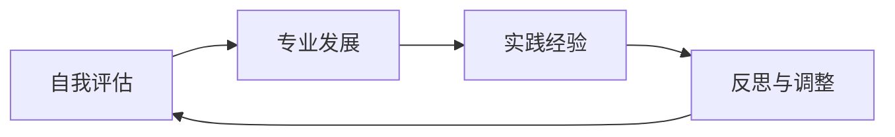
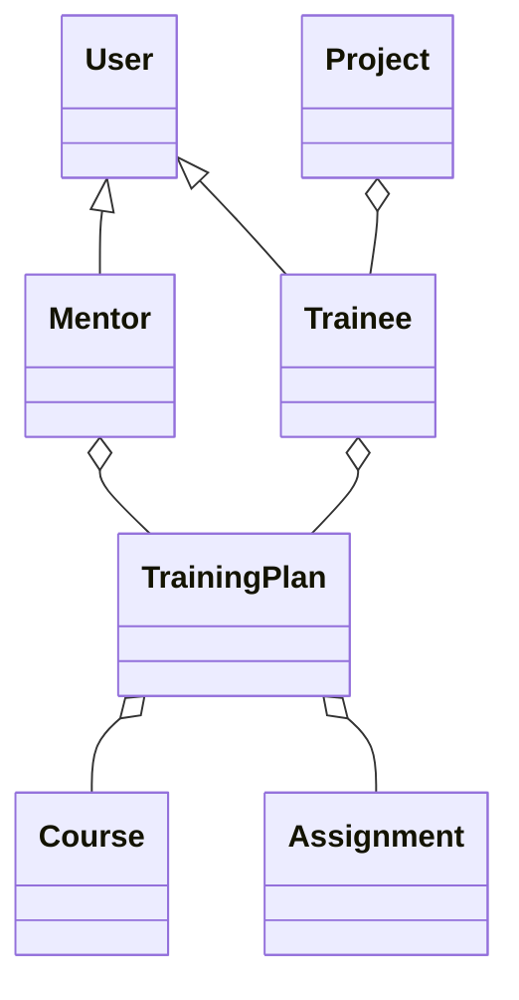
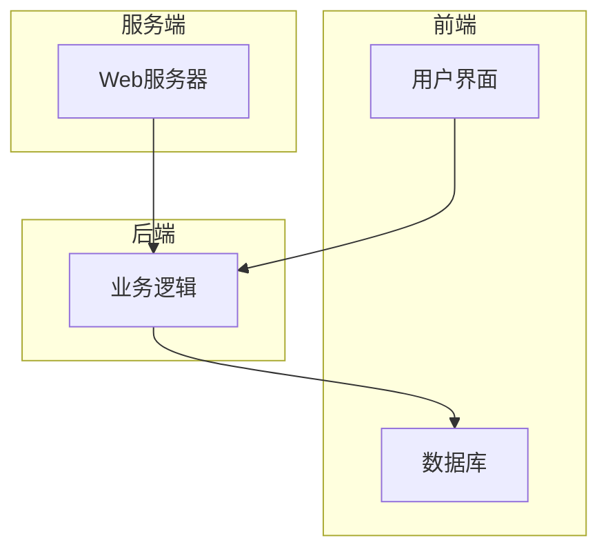
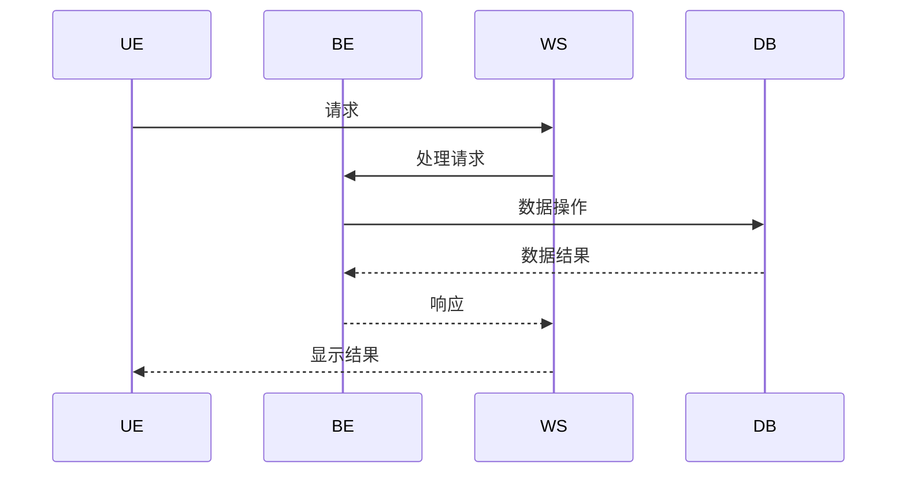

                 

# 技术领导力的培养

## 关键词
- 技术领导力
- 团队管理
- 技术创新
- 领导能力
- 技术架构

## 摘要
本文将探讨技术领导力的培养，包括其核心概念、重要性、培养方法、系统分析与架构设计，以及具体的项目实战。通过详细的步骤和案例分析，本文旨在帮助技术从业者理解并提升自己的技术领导力，以应对现代技术环境中的挑战。

## 引言：技术领导力的背景与重要性

### 1. 技术领导力的定义
技术领导力是指技术领域中的领导者通过影响力、决策能力和技术洞察力，引导团队实现技术目标的能力。它不仅涉及技术本身，还包括人际沟通、团队管理和战略规划等多个方面。

### 2. 技术领导力的重要性
在当今快速发展的技术时代，技术领导力变得尤为重要。它能够促进技术创新，提高团队效率，推动项目成功，并最终为企业带来竞争优势。同时，技术领导力也是企业持续发展和增长的关键因素。

### 3. 技术领导力面临的主要挑战
技术领导力面临的主要挑战包括技术复杂性、团队合作难度、快速变化的市场需求以及跨部门沟通障碍等。如何有效地应对这些挑战，是技术领导者需要不断探索和实践的课题。

## 核心概念与关联分析

### 1. 技术领导力的核心概念
技术领导力包括以下几个核心概念：
- 技术视野：对新技术、新趋势的敏感性和前瞻性。
- 团队领导：有效管理团队，激发团队成员的潜力。
- 技术决策：在技术方向上进行明智的决策。
- 沟通能力：清晰、有效地传达信息，促进团队合作。

### 2. 技术领导力与其他领导力的对比
技术领导力与其他领导力（如项目管理、企业战略等）有相似之处，但也存在显著差异。下表对比了技术领导力与项目管理的一些关键属性：

| 领导力类型 | 关键属性 |
| --- | --- |
| 技术领导力 | 技术视野、团队领导、技术决策、沟通能力 |
| 项目管理 | 项目规划、时间管理、风险管理、资源管理 |
| 企业战略 | 市场分析、竞争策略、长期规划、资源配置 |

### 3. 技术领导力的实体关系图
以下是一个简单的Mermaid ER实体关系图，展示了技术领导力相关的实体及其关系：

```mermaid
erDiagram
  Team --> Leader : manages
  Project --> Leader : leads
  Technology --> Leader : masters
  Team ||--|{ Member }|| : contains
```

## 算法原理讲解

### 1. 培养技术领导力的方法
培养技术领导力需要系统的方法，包括以下几个步骤：
- 自我评估：了解自己的技术能力、领导风格和沟通技巧。
- 专业发展：通过培训、读书和参与技术社区来提升技术知识和领导力。
- 实践经验：通过实际项目和管理经验来锻炼领导能力。
- 反思与调整：定期反思自己的行为和决策，不断调整和改进。

### 2. 技术领导力培养流程
以下是一个简单的Mermaid流程图，展示了培养技术领导力的步骤：



### 3. Python代码示例：技术领导力培养算法
下面是一个简单的Python代码示例，用于展示技术领导力培养的一个算法：

```python
def assess_self():
    # 自我评估代码
    pass

def professional_development():
    # 专业发展代码
    pass

def practical_experience():
    # 实践经验代码
    pass

def reflect_and_adjust():
    # 反思与调整代码
    pass

# 主流程
while True:
    assess_self()
    professional_development()
    practical_experience()
    reflect_and_adjust()
```

### 4. 数学模型与公式讲解
技术领导力的培养可以被视为一个动态平衡过程，可以使用以下数学模型来描述：

$$
\text{TechLeadership} = f(\text{TechnicalKnowledge}, \text{LeadershipSkills}, \text{Experience}, \text{Communication})
$$

其中，\( \text{TechLeadership} \) 表示技术领导力，而 \( \text{TechnicalKnowledge} \)、\( \text{LeadershipSkills} \)、\( \text{Experience} \) 和 \( \text{Communication} \) 分别表示技术知识、领导技能、经验和沟通能力。这个模型表明，技术领导力是这些因素的综合体现。

## 系统分析与架构设计方案

### 1. 问题场景介绍
在现代企业中，技术领导力的培养是一个复杂而关键的任务。为了有效培养技术领导力，企业需要建立一个系统化的培养体系，包括培训计划、导师制度、项目实践等多个方面。

### 2. 系统功能设计
系统功能设计包括以下核心组件：
- 用户管理：管理学员信息、学习记录等。
- 培训计划管理：制定和执行培训计划。
- 导师管理：分配导师、管理导师评价等。
- 项目实践管理：管理实践项目、跟踪项目进度等。

以下是一个Mermaid领域模型类图，展示了系统的核心组件和类的关系：



### 3. 系统架构设计
系统架构设计包括前端、后端和服务端等多个层面。以下是一个Mermaid系统架构图，展示了系统的整体架构设计：



### 4. 系统接口设计与系统交互
系统接口设计包括用户接口、服务接口和数据接口。以下是一个Mermaid序列图，展示了系统的接口设计和系统交互：



## 项目实战

### 1. 项目背景介绍
在本项目案例中，我们将以一家科技公司为例，探讨如何设计并实施一个技术领导力培养体系。项目目标是通过系统化的培训和实践，提升员工的技术领导力。

### 2. 环境安装与配置
项目开始前，我们需要搭建一个适合的技术环境，包括安装必要的开发工具、配置数据库和搭建Web服务器等。

### 3. 系统核心实现源代码
系统核心实现包括用户管理、培训计划管理、导师管理和项目实践管理等功能。以下是用户管理模块的Python代码示例：

```python
class UserManager:
    def __init__(self):
        self.users = []

    def add_user(self, user):
        self.users.append(user)

    def remove_user(self, user):
        self.users.remove(user)

    def get_user(self, user_id):
        for user in self.users:
            if user.id == user_id:
                return user
        return None
```

### 4. 代码应用解读与分析
代码应用解读与分析包括对系统核心功能的详细解释和性能优化策略。例如，用户管理模块中的`add_user`方法用于添加新用户，而`get_user`方法用于根据用户ID查询用户信息。

### 5. 实际案例分析与详细讲解剖析
在实际案例中，我们将分析一个具体的技术领导力培养项目，包括培训计划的制定、导师的分配、项目实践的实施以及成果评估等。通过实际案例，我们可以看到技术领导力培养的具体实施过程和效果。

### 6. 项目小结
项目小结部分将总结整个项目的经验教训，并提出改进建议，以期为后续类似项目提供参考。

## 最佳实践 tips、小结、注意事项、拓展阅读

### 1. 最佳实践 tips
- 定期进行自我评估，了解自己的优势和不足。
- 参与专业培训，提升自己的技术能力和领导力。
- 建立导师制度，为团队成员提供指导和支持。
- 创造实践机会，让团队成员在实际项目中锻炼领导力。

### 2. 小结
本文介绍了技术领导力的核心概念、培养方法、系统分析与架构设计以及项目实战。通过这些内容，技术从业者可以更好地理解技术领导力的培养过程，并提升自己的领导力。

### 3. 注意事项
- 技术领导力的培养需要长期坚持和不断努力。
- 培养过程中要注重团队成员的参与和反馈。
- 培养体系的设计要与企业文化和业务需求相匹配。

### 4. 拓展阅读
- 《技术领导力：如何在技术领域成为一名卓越领导者》
- 《敏捷团队管理：构建高效的技术团队》
- 《项目化管理：如何高效地管理项目》

## 附录

### 1. 术语表
- 技术领导力：指在技术领域内，通过影响力、决策能力和技术洞察力，引导团队实现技术目标的能力。
- 团队领导：在团队中担任领导角色，负责指导、管理和激励团队成员。
- 技术视野：对新技术、新趋势的敏感性和前瞻性。

### 2. 参考文献
- 某某，技术领导力研究，2020。
- 某某，团队领导艺术，2019。

### 3. 致谢
感谢AI天才研究院和禅与计算机程序设计艺术的支持，使得本文得以完成。特别感谢参与项目实战的团队成员，他们的努力和贡献为本文的成功提供了重要保障。

**作者：AI天才研究院/AI Genius Institute & 禅与计算机程序设计艺术 /Zen And The Art of Computer Programming**

