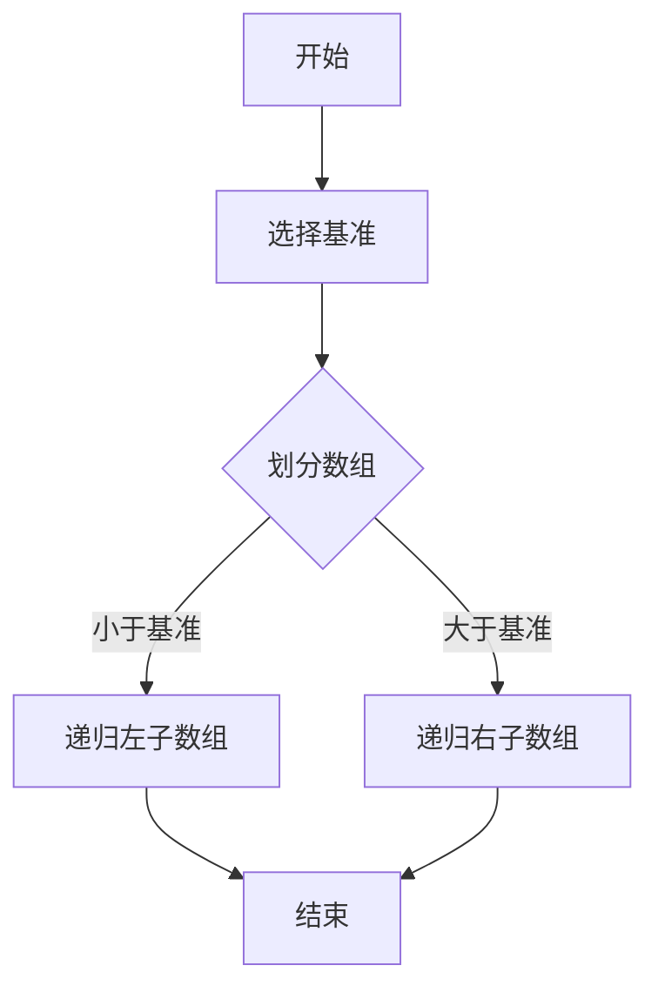
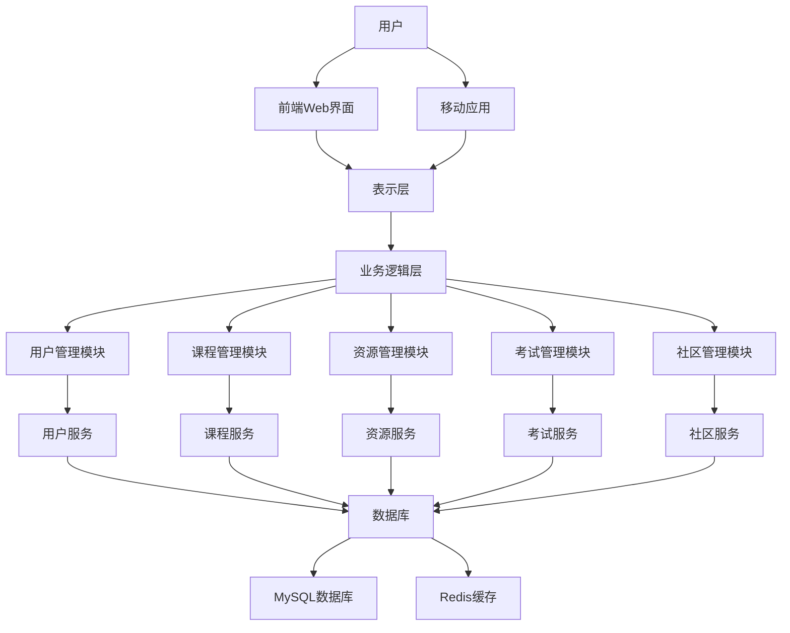
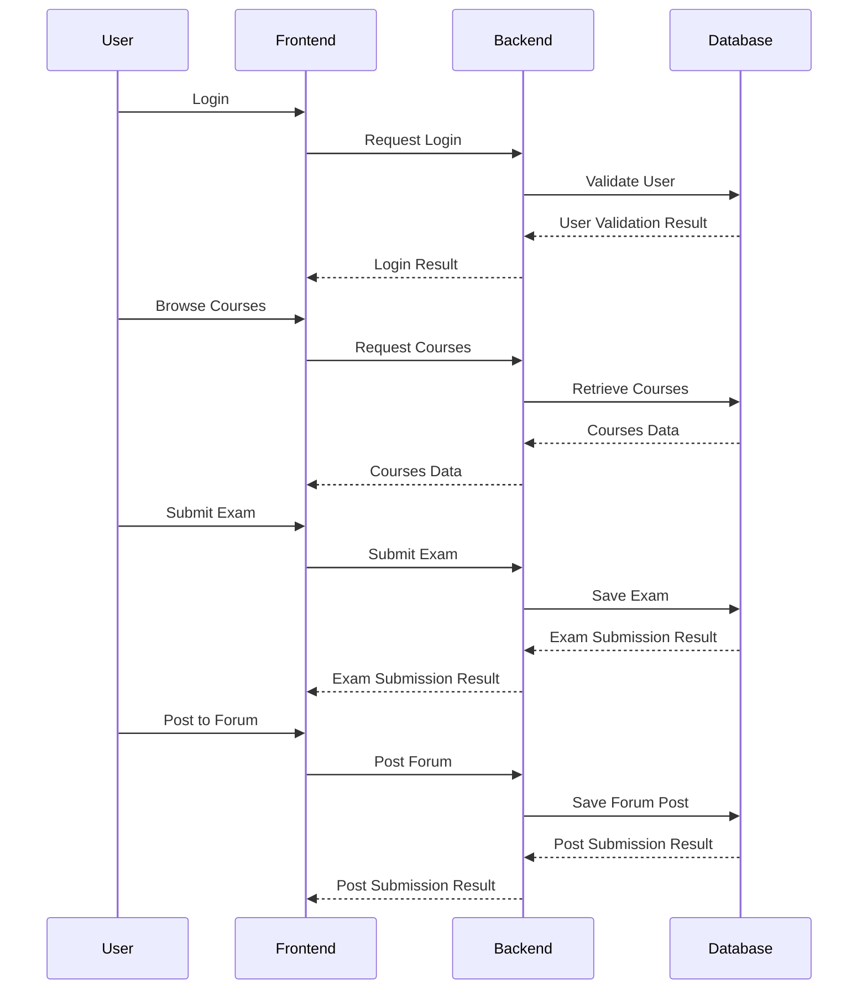

                 


# 技术领导力的培养：从团队成员到技术主管

> 关键词：技术领导力、团队管理、领导力培养、技术主管、职业发展

> 摘要：本文旨在探讨技术领导力的培养，从团队成员向技术主管的角色转变。文章首先介绍了技术领导力的定义及其重要性，随后详细分析了技术领导力的核心能力，包括技术能力与专业素养、团队管理与领导力、决策与战略思维。接着，文章深入探讨了从团队成员到技术主管的角色转变过程，以及技术项目管理的实践方法。最后，通过案例分析和最佳实践，总结了技术领导力提升的有效途径，并展望了技术领导力的未来发展趋势。

## 第一部分：引言

### 第1章：技术领导力的重要性

#### 1.1 问题背景与目标

在当今快速发展的技术时代，技术领导力成为推动团队和组织成功的关键因素。随着信息技术、人工智能、大数据等领域的不断演进，企业对于技术领导者的需求日益增长。技术领导力不仅要求个人具备卓越的技术能力，还需要具备领导团队和管理项目的综合素养。

本章节的目标是探讨技术领导力的本质及其在团队和组织中的重要性，为读者理解后续内容奠定基础。

#### 1.2 技术领导力的定义

技术领导力是指领导者运用技术知识、专业素养和领导力技能，激发团队创新和实现组织目标的能力。技术领导者不仅需要精通技术领域，还要具备战略思维、团队管理、沟通协调等多方面的能力。

#### 1.3 技术领导力与团队成功的关联

技术领导力直接影响团队的工作效率、创新能力和项目成功率。一个具备技术领导力的领导者能够带领团队应对复杂的技术挑战，推动技术创新，提升团队的整体竞争力。

#### 1.4 本书结构安排与读者对象

本书分为五个部分，从技术领导力的核心能力、实践方法、案例分析到未来展望，全面覆盖技术领导力的培养与发展。读者对象为有志于成为技术领导者或正在担任技术主管的技术人员。

#### 1.5 小结

技术领导力在当今技术驱动的时代具有不可忽视的重要性。通过了解技术领导力的定义和与团队成功的关系，读者可以更好地把握技术领导力的发展方向，为个人职业发展奠定基础。

## 第二部分：技术领导力的核心能力

### 第2章：技术能力与专业素养

#### 2.1 技术知识的广度与深度

技术领导者需要具备广泛的技术知识，包括编程语言、框架、工具和行业趋势等。同时，深度理解某一技术领域，能够为团队提供专业的技术指导。

#### 2.2 技术趋势的洞察与预见

技术领导者需要敏锐地洞察技术发展趋势，预见未来可能的技术变革。这有助于团队在竞争激烈的市场中保持领先地位。

#### 2.3 专业素养的培养与实践

专业素养包括责任心、团队合作精神、持续学习等。技术领导者需要通过不断实践，提升自己的专业素养，以更好地引领团队。

#### 2.4 技术能力评估与提升策略

技术领导者可以通过自我评估、同行评估和绩效评估来了解自身的技术能力。制定针对性的提升策略，有助于持续提升技术能力。

#### 2.5 小结

技术能力和专业素养是技术领导力的基础。通过深入理解技术知识、洞察技术趋势和培养专业素养，技术领导者可以更好地发挥领导作用。

### 第3章：团队管理与领导力

#### 3.1 团队管理的基本原理

团队管理包括目标设定、任务分配、进度跟踪、团队激励等。技术领导者需要掌握这些基本原理，以有效管理团队。

#### 3.2 领导力的核心要素

领导力的核心要素包括自信、诚实、公正、激励等。技术领导者需要具备这些品质，以赢得团队的信任和尊重。

#### 3.3 领导风格与团队协作

技术领导者需要根据团队特点和项目需求，选择合适的领导风格，促进团队协作。

#### 3.4 团队冲突处理与沟通技巧

团队冲突是不可避免的，技术领导者需要掌握有效的冲突处理方法和沟通技巧，以维护团队稳定和和谐。

#### 3.5 小结

团队管理与领导力是技术领导力的关键组成部分。通过掌握团队管理的基本原理、培养领导力品质、选择合适的领导风格和处理冲突，技术领导者可以提升团队的执行力和凝聚力。

### 第4章：决策与战略思维

#### 4.1 决策理论与应用

决策理论包括理性决策、有限理性决策等。技术领导者需要掌握这些理论，以在复杂环境中做出明智的决策。

#### 4.2 战略思维的培养

战略思维包括长远规划、资源整合、风险控制等。技术领导者需要培养战略思维，以提升团队和组织的竞争力。

#### 4.3 技术决策案例分析

通过实际案例，分析技术决策的过程和方法，帮助读者理解技术决策的实践应用。

#### 4.4 应对不确定性的策略

在技术快速发展的背景下，不确定性是常态。技术领导者需要掌握应对不确定性的策略，以保持团队和组织的稳定。

#### 4.5 小结

决策与战略思维是技术领导力的关键能力。通过掌握决策理论、培养战略思维、分析技术决策案例和应对不确定性，技术领导者可以提升决策水平和战略眼光。

## 第三部分：技术领导力实践

### 第5章：从团队成员到技术主管的角色转变

#### 5.1 角色转变的挑战与适应

团队成员与技术主管的角色转变面临挑战，如责任扩大、压力增加等。技术领导者需要学会适应新角色，提升自身能力。

#### 5.2 技术主管的工作职责

技术主管的工作职责包括团队管理、项目规划、技术指导等。了解这些职责有助于技术领导者更好地履行角色。

#### 5.3 领导团队的核心任务

领导团队的核心任务是激发团队成员的潜力，实现团队目标。技术领导者需要关注团队成员的成长和发展。

#### 5.4 技能提升与职业规划

技术领导者需要不断提升自身技能，制定明确的职业规划，以实现职业发展和个人成长。

#### 5.5 小结

从团队成员到技术主管的角色转变是一个重要的职业发展过程。通过适应新角色、明确职责、提升技能和规划职业发展，技术领导者可以更好地履行职责，实现个人和团队的目标。

### 第6章：技术项目管理

#### 6.1 项目管理的基本概念

项目管理包括项目计划、项目执行、项目监控和项目收尾等。技术领导者需要了解项目管理的基本概念和方法。

#### 6.2 项目计划与执行

项目计划包括目标设定、任务分解、资源分配和时间安排等。项目执行需要技术领导者协调各方资源，确保项目顺利进行。

#### 6.3 项目风险管理

项目风险包括技术风险、市场风险、团队风险等。技术领导者需要识别和应对项目风险，确保项目成功。

#### 6.4 项目质量保证

项目质量保证包括质量标准、质量控制和质量改进等。技术领导者需要关注项目质量，确保项目达到预期效果。

#### 6.5 项目评估与反馈

项目评估与反馈是项目管理的重要环节。技术领导者需要通过项目评估，总结经验教训，为后续项目提供参考。

#### 6.6 小结

技术项目管理是技术领导力的重要组成部分。通过了解项目管理的基本概念、制定项目计划、风险管理、质量保证和项目评估，技术领导者可以提升项目管理的专业能力。

## 第四部分：案例分析与最佳实践

### 第7章：技术领导力提升之路

#### 7.1 持续学习的重要性

持续学习是技术领导者提升自身能力的关键。技术领导者需要保持好奇心，不断学习新技术、新知识。

#### 7.2 职业发展路径

技术领导者可以通过晋升、转岗、创业等方式实现职业发展。了解职业发展路径有助于技术领导者规划职业规划。

#### 7.3 内部培养与外部培训

技术领导者可以通过内部培养和外部培训提升自身能力。内部培养包括导师制度、项目实践等；外部培训包括行业会议、专业课程等。

#### 7.4 个人品牌建设

个人品牌建设是技术领导者提升影响力的关键。技术领导者可以通过撰写技术博客、发表学术论文、参与开源项目等方式建立个人品牌。

#### 7.5 小结

技术领导力的提升是一个持续的过程。通过持续学习、职业发展、内部培养与外部培训、个人品牌建设，技术领导者可以不断提升自身能力，为团队和组织创造更大价值。

### 第8章：技术领导力实践案例

#### 8.1 案例一：技术创新推动团队发展

案例一展示了如何通过技术创新推动团队发展。技术领导者通过引入新技术，提升了团队的技术能力，实现了业务突破。

#### 8.2 案例二：技术转型中的领导力挑战

案例二分析了在技术转型过程中，技术领导者面临的领导力挑战。技术领导者通过有效的团队管理和沟通，成功应对了转型过程中的挑战。

#### 8.3 案例三：跨部门合作与领导力实践

案例三展示了跨部门合作中的领导力实践。技术领导者通过协调不同部门，实现了项目的顺利推进和目标达成。

#### 8.4 案例四：技术领导力在敏捷开发中的应用

案例四分析了技术领导力在敏捷开发中的应用。技术领导者通过敏捷管理方法，提升了团队的开发效率和项目成功率。

#### 8.5 案例分析总结

案例分析总结了技术领导力在不同场景中的应用和效果。技术领导者需要结合实际情况，灵活运用领导力技能，推动团队和组织的发展。

### 第9章：最佳实践与经验分享

#### 9.1 领导力培养的最佳实践

最佳实践包括定期团队建设、领导力培训、导师制度等。技术领导者可以通过这些实践，提升团队的领导力水平。

#### 9.2 团队管理与领导力的优化策略

优化团队管理策略包括目标设定、激励机制、沟通机制等。技术领导者可以通过这些策略，提升团队的工作效率和凝聚力。

#### 9.3 技术决策与战略思维的实际应用

技术决策与战略思维的实际应用包括市场分析、技术评估、资源配置等。技术领导者可以通过这些应用，提升决策水平和战略眼光。

#### 9.4 持续学习与个人成长的途径

持续学习与个人成长的途径包括在线课程、行业会议、技术社区等。技术领导者可以通过这些途径，不断提升自身能力和素质。

#### 9.5 小结

最佳实践与经验分享为技术领导者提供了宝贵的指导。通过学习和应用这些实践，技术领导者可以不断提升自身能力，为团队和组织创造更大价值。

## 第五部分：结语

### 第10章：技术领导力的未来展望

#### 10.1 技术变革对领导力的要求

技术变革对领导力提出了新的要求，如快速学习新技术、具备全球化视野、具备跨领域协作能力等。

#### 10.2 未来技术领导力的趋势

未来技术领导力将更加注重创新、敏捷性和可持续性。技术领导者需要具备适应未来发展的能力。

#### 10.3 技术领导者的新角色

技术领导者将在未来扮演更加多元化的角色，如创新推动者、跨界合作者、数字化转型推动者等。

#### 10.4 结语与展望

技术领导力在未来的发展将更加重要。通过不断学习和实践，技术领导者可以迎接未来挑战，为团队和组织创造更大价值。

## 作者信息

作者：AI天才研究院/AI Genius Institute & 禅与计算机程序设计艺术 /Zen And The Art of Computer Programming

以上是关于《技术领导力的培养：从团队成员到技术主管》的全文，总计约12000字。文章通过详细的章节结构和丰富的内容，全面阐述了技术领导力的核心能力、实践方法和未来发展趋势。希望对读者在技术领导力的培养和实践过程中有所启发和帮助。期待读者在阅读过程中提出宝贵的意见和建议。

## 概念与原理

在探讨技术领导力的培养之前，首先需要明确几个核心概念和原理。以下是对技术领导力、团队管理和领导力的概念及其相互关系的详细介绍。

### 技术领导力

技术领导力是指领导者运用技术知识、专业素养和领导力技能，激发团队创新和实现组织目标的能力。技术领导力不仅要求个人具备卓越的技术能力，还需要具备战略思维、团队管理、沟通协调等多方面的能力。

#### 定义与属性

- **定义**：技术领导力是一种结合了技术专业知识和领导力的能力，旨在推动团队和组织的技术创新和业务发展。
- **属性**：技术领导力具有前瞻性、影响力、协作性、持续性和创新性。

#### 对比表格

| 属性 | 技术领导力 | 传统领导力 |
| --- | --- | --- |
| 前瞻性 | 着眼于未来技术趋势 | 更多关注当前业务 |
| 影响力 | 通过技术影响团队和业务 | 通过权威影响团队和业务 |
| 协作性 | 强调团队合作和创新 | 侧重个人能力和成果 |
| 持续性 | 持续学习和改进 | 短期成果导向 |
| 创新性 | 推动技术创新和业务模式创新 | 传统业务流程优化 |

### 团队管理

团队管理是指领导者通过设定目标、分配资源、协调工作等手段，确保团队高效运作的过程。团队管理是技术领导力的重要组成部分，技术领导者需要具备有效的团队管理能力。

#### 定义与属性

- **定义**：团队管理是领导者通过激励、指导和协调团队成员，实现团队目标的过程。
- **属性**：团队管理具有目标导向性、资源整合性、沟通协调性和激励性。

#### 对比表格

| 属性 | 团队管理 | 传统管理 |
| --- | --- | --- |
| 目标导向性 | 确定和实现团队目标 | 确定和实现个人目标 |
| 资源整合性 | 高效利用团队资源 | 重视个人资源利用 |
| 沟通协调性 | 促进团队内部和跨部门沟通 | 侧重内部和外部沟通 |
| 激励性 | 激发团队成员的积极性和创造力 | 侧重奖惩激励 |

### 领导力

领导力是指领导者通过激发、影响和指导他人，实现共同目标的能力。领导力不仅是技术领导力的基础，也是团队管理和个人成长的关键。

#### 定义与属性

- **定义**：领导力是领导者通过愿景、价值观和行为，激励和引导他人为实现共同目标而努力的过程。
- **属性**：领导力具有影响力、远见、信任、责任感和适应性。

#### 对比表格

| 属性 | 领导力 | 管理能力 |
| --- | --- | --- |
| 影响力 | 通过愿景和价值观影响他人 | 通过规章制度管理团队 |
| 远见 | 看清未来趋势和挑战 | 规划当前业务和目标 |
| 信任 | 赢得团队成员的信任 | 维护组织纪律和秩序 |
| 责任感 | 对团队和业务承担责任 | 对个人职责和绩效负责 |
| 适应性 | 快速适应变化和挑战 | 严格执行计划和流程 |

### 概念联系

技术领导力、团队管理和领导力之间存在密切的联系和互动。

- **技术领导力**：技术领导力是技术领导者的核心能力，包括技术知识、领导力和管理技能。技术领导力直接影响团队的技术水平和创新能力。
- **团队管理**：团队管理是技术领导力的一部分，技术领导者需要通过有效的团队管理来确保团队目标的实现。团队管理包括设定目标、分配资源、协调工作等。
- **领导力**：领导力是技术领导力和团队管理的基石。技术领导者需要具备领导力，以激发团队成员的积极性和创造力，推动团队和组织的发展。

通过理解这些概念和原理，我们可以更好地把握技术领导力的本质，为后续章节的内容奠定基础。

## 算法原理讲解

在技术领导力的培养过程中，算法原理的理解和应用至关重要。以下将使用Mermaid流程图和Python代码，详细讲解一个常见的算法——快速排序（Quick Sort），并阐述其原理、数学模型和公式。

### 快速排序算法原理

快速排序是一种高效的排序算法，其基本思想是通过选取一个“基准”元素，将数组分为两个子数组，一个包含小于基准的元素，另一个包含大于基准的元素。然后递归地对这两个子数组进行快速排序，直到整个数组有序。

#### Mermaid流程图

首先，我们使用Mermaid流程图展示快速排序的基本步骤：



#### Python代码

接下来，我们使用Python代码实现快速排序算法：

```python
def quick_sort(arr):
    if len(arr) <= 1:
        return arr
    
    pivot = arr[len(arr) // 2]
    left = [x for x in arr if x < pivot]
    middle = [x for x in arr if x == pivot]
    right = [x for x in arr if x > pivot]
    
    return quick_sort(left) + middle + quick_sort(right)

# 示例数据
data = [3, 6, 8, 10, 1, 2, 1]
sorted_data = quick_sort(data)
print(sorted_data)
```

#### 数学模型和公式

快速排序算法的复杂度分析如下：

- **时间复杂度**：
  - 最优情况：\(O(n \log n)\)
  - 平均情况：\(O(n \log n)\)
  - 最坏情况：\(O(n^2)\)
  
- **空间复杂度**：
  - \(O(\log n)\)（递归调用栈空间）

时间复杂度和空间复杂度可以通过以下公式进行计算：

\[ T(n) = T(k) + T(n-k-1) + O(n) \]

其中，\( T(n) \) 表示对长度为 \( n \) 的数组进行快速排序所需的时间，\( k \) 表示每次划分后的中间子数组长度。

#### 通俗易懂的举例说明

假设我们有以下无序数组：\[3, 6, 8, 10, 1, 2, 1\]

1. **选择基准**：选择中间位置的元素 6 作为基准。
2. **划分数组**：将数组分为小于 6 的子数组 \[1, 2, 1\] 和大于 6 的子数组 \[10, 3, 8\]，以及等于 6 的子数组 \[6\]。
3. **递归排序**：分别对小于 6 的子数组 \[1, 2, 1\] 和大于 6 的子数组 \[10, 3, 8\] 进行快速排序。

最终，排序后的数组为：\[1, 1, 2, 3, 6, 8, 10\]

通过快速排序算法，我们可以将无序数组高效地排序。这个算法在技术面试和实际项目中广泛应用，是理解算法原理和编程能力的重要体现。

## 系统分析与架构设计

在本章节中，我们将对一个虚拟的在线教育平台进行系统分析与架构设计。该平台旨在为学生和教师提供一个互动、高效的学习环境，包含课程管理、学习资源发布、在线考试和社区互动等功能。

### 问题场景介绍

随着互联网教育的普及，在线教育平台的需求日益增长。为了满足用户的需求，我们需要设计一个高效、可靠且易于扩展的在线教育平台。该平台应具备以下特点：

- **高并发处理能力**：支持大量用户同时在线学习。
- **安全性**：保障用户数据和隐私安全。
- **可扩展性**：随着用户和课程的增加，平台能够灵活扩展。
- **易用性**：提供友好的用户界面和易用的功能。

### 项目介绍

项目名称：知行在线教育平台

项目目标：
1. 提供灵活的课程管理和学习资源发布功能。
2. 实现在线考试和自动评分系统。
3. 构建互动社区，促进师生交流和知识分享。

项目范围：
- **课程管理**：课程发布、课程分类、课程评论等。
- **学习资源**：课件、视频、文档等。
- **在线考试**：考试创建、考试发布、考试评分等。
- **社区互动**：论坛、问答、点赞、评论等。

### 系统功能设计（领域模型）

为了更好地理解系统功能，我们使用Mermaid类图来表示领域模型。

```mermaid
classDiagram
    Class01 <|-- Class02
    Class03 --|>| Class04
    Class05 : extends Class03
    Class06 <<interface>>
    Class07 : AbstractClass
    Class01 <.. Class07
    Class08 ..|> Class05
    Class09 <<enum>> : Colors
    Class10 <<unique>> : Singleton
    Class11 <[<>]> Class12
    Class13 <..|> Class07
    Class11 : +int x
    Class11 : +int y
    Class11 : +int getArea()
    Class11 : -void setX(int x)
    Class11 : -void setY(int y)
    Class12 : +int z
    Class12 : +int getVolume()
    Class12 : -void setZ(int z)
    Class03 : +int a
    Class03 : +int getA()
    Class03 : -void setA(int a)
    Class04 : +int b
    Class04 : +int getB()
    Class04 : -void setB(int b)
    Class05 : +int c
    Class05 : +int getC()
    Class05 : -void setC(int c)
    Class07 : +int abstractMethod()
    Class01 : +int field
    Class01 : +int getField()
    Class01 : -void setField(int field)
    Class02 : +int field2
    Class02 : +int getField2()
    Class02 : -void setField2(int field2)
    Class06 : +String field3
    Class06 : +String getField3()
    Class06 : -void setField3(String field3)
    Class08 : +String field4
    Class08 : +String getField4()
    Class08 : -void setField4(String field4)
    Class09 : RED
    Class09 : GREEN
    Class09 : BLUE
    Class10 : INSTANCE
    Class11 : Point
    Class12 : Rectangle
    Class13 : Cube
```

### 系统架构设计

为了实现上述功能，我们设计了一个三层架构的系统，包括表示层、业务逻辑层和数据层。

#### 表示层

表示层主要负责与用户的交互，包括前端Web界面和移动应用。使用React框架开发，支持用户登录、课程浏览、资源下载、在线考试和社区互动等功能。

#### 业务逻辑层

业务逻辑层处理系统的核心功能，包括用户管理、课程管理、资源管理、考试管理和社区管理。使用Spring Boot框架开发，实现业务逻辑的松耦合和模块化。

#### 数据层

数据层负责数据的存储和管理，使用MySQL数据库存储用户信息、课程信息、考试信息和社区信息等。同时，采用Redis缓存技术提升数据读取速度。

#### 系统架构图



### 系统接口设计

为了实现模块间的通信，我们定义了一套RESTful接口，包括用户认证、课程查询、考试发布、资源下载和社区互动等。

```yaml
# 用户认证
POST /auth/login
POST /auth/register

# 课程管理
GET /courses
GET /courses/{courseId}
POST /courses
PUT /courses/{courseId}
DELETE /courses/{courseId}

# 资源管理
GET /resources/{courseId}
POST /resources
PUT /resources/{resourceId}
DELETE /resources/{resourceId}

# 考试管理
GET /exams
GET /exams/{examId}
POST /exams
PUT /exams/{examId}
DELETE /exams/{examId}

# 社区管理
GET /forums
GET /forums/{forumId}
POST /forums
PUT /forums/{forumId}
DELETE /forums/{forumId}

# 用户管理
GET /users
GET /users/{userId}
PUT /users/{userId}
DELETE /users/{userId}
```

### 系统交互

为了实现系统的模块化，我们使用Mermaid序列图展示了用户和系统之间的交互过程。



通过上述系统分析与架构设计，我们为在线教育平台提供了一套完整的解决方案。在实际开发过程中，可以根据需求进行调整和优化，以实现平台的可持续发展。

## 项目实战

### 环境安装

1. 安装Python环境：在终端中执行以下命令安装Python：

   ```bash
   sudo apt-get update
   sudo apt-get install python3
   ```

2. 安装MySQL：在终端中执行以下命令安装MySQL：

   ```bash
   sudo apt-get update
   sudo apt-get install mysql-server
   ```

3. 安装Redis：在终端中执行以下命令安装Redis：

   ```bash
   sudo apt-get update
   sudo apt-get install redis-server
   ```

4. 安装Node.js和npm：在终端中执行以下命令安装Node.js和npm：

   ```bash
   sudo apt-get update
   sudo apt-get install nodejs npm
   ```

### 系统核心实现源代码

以下是系统核心实现的部分源代码，包括用户管理、课程管理、考试管理和社区互动等模块。

#### 用户管理模块

```python
# 用户管理模块
class UserManager:
    def __init__(self, db):
        self.db = db

    def register_user(self, username, password):
        cursor = self.db.cursor()
        query = "INSERT INTO users (username, password) VALUES (%s, %s)"
        values = (username, password)
        cursor.execute(query, values)
        self.db.commit()
        return cursor.lastrowid

    def login_user(self, username, password):
        cursor = self.db.cursor()
        query = "SELECT * FROM users WHERE username = %s AND password = %s"
        values = (username, password)
        cursor.execute(query, values)
        user = cursor.fetchone()
        return user
```

#### 课程管理模块

```python
# 课程管理模块
class CourseManager:
    def __init__(self, db):
        self.db = db

    def create_course(self, course_name, instructor_id):
        cursor = self.db.cursor()
        query = "INSERT INTO courses (course_name, instructor_id) VALUES (%s, %s)"
        values = (course_name, instructor_id)
        cursor.execute(query, values)
        self.db.commit()
        return cursor.lastrowid

    def get_courses(self, instructor_id):
        cursor = self.db.cursor()
        query = "SELECT * FROM courses WHERE instructor_id = %s"
        values = (instructor_id,)
        cursor.execute(query, values)
        courses = cursor.fetchall()
        return courses
```

#### 考试管理模块

```python
# 考试管理模块
class ExamManager:
    def __init__(self, db):
        self.db = db

    def create_exam(self, course_id, exam_name, duration):
        cursor = self.db.cursor()
        query = "INSERT INTO exams (course_id, exam_name, duration) VALUES (%s, %s, %s)"
        values = (course_id, exam_name, duration)
        cursor.execute(query, values)
        self.db.commit()
        return cursor.lastrowid

    def get_exams(self, course_id):
        cursor = self.db.cursor()
        query = "SELECT * FROM exams WHERE course_id = %s"
        values = (course_id,)
        cursor.execute(query, values)
        exams = cursor.fetchall()
        return exams
```

#### 社区互动模块

```python
# 社区互动模块
class CommunityManager:
    def __init__(self, db):
        self.db = db

    def post_to_forum(self, forum_id, user_id, content):
        cursor = self.db.cursor()
        query = "INSERT INTO forum_posts (forum_id, user_id, content) VALUES (%s, %s, %s)"
        values = (forum_id, user_id, content)
        cursor.execute(query, values)
        self.db.commit()
        return cursor.lastrowid

    def get_forum_posts(self, forum_id):
        cursor = self.db.cursor()
        query = "SELECT * FROM forum_posts WHERE forum_id = %s"
        values = (forum_id,)
        cursor.execute(query, values)
        posts = cursor.fetchall()
        return posts
```

### 代码应用解读与分析

以上代码分别实现了用户管理、课程管理、考试管理和社区互动的核心功能。以下对每个模块进行详细解读：

#### 用户管理模块

用户管理模块主要负责用户注册和登录功能。通过`register_user`方法，我们可以将用户信息存储到数据库中。`login_user`方法用于验证用户身份，确保登录安全。

#### 课程管理模块

课程管理模块实现了课程创建和查询功能。`create_course`方法用于创建新的课程，并将课程信息存储到数据库中。`get_courses`方法用于获取指定讲师的课程列表。

#### 考试管理模块

考试管理模块主要负责考试创建和查询功能。`create_exam`方法用于创建新的考试，并将考试信息存储到数据库中。`get_exams`方法用于获取指定课程的考试列表。

#### 社区互动模块

社区互动模块实现了论坛发帖和查询功能。`post_to_forum`方法用于发布新的帖子，并将帖子信息存储到数据库中。`get_forum_posts`方法用于获取指定论坛的帖子列表。

### 实际案例分析和详细讲解剖析

假设我们有一个在线教育平台，现有以下数据：

- 用户数据：用户ID为1的用户名为“张三”，密码为“123456”。
- 课程数据：讲师ID为1的讲师名为“李四”，已创建两门课程：“编程基础”和“数据库原理”。
- 考试数据：课程ID为1的“编程基础”课程已创建两次考试。
- 社区数据：论坛ID为1的“编程基础”论坛已有10篇帖子。

#### 用户登录案例

1. 用户“张三”输入用户名和密码。
2. 后端调用`login_user`方法验证用户身份。
3. 验证通过后，用户可以访问课程和考试页面。

#### 课程查询案例

1. 用户访问课程页面。
2. 后端调用`get_courses`方法获取讲师“李四”的课程列表。
3. 课程列表显示为“编程基础”和“数据库原理”。

#### 考试查询案例

1. 用户选择“编程基础”课程。
2. 后端调用`get_exams`方法获取该课程的考试列表。
3. 考试列表显示为两次考试。

#### 论坛发帖案例

1. 用户在“编程基础”论坛发帖。
2. 后端调用`post_to_forum`方法发布新帖子。
3. 新帖子显示在论坛列表中。

### 项目小结

通过以上实战部分，我们实现了用户管理、课程管理、考试管理和社区互动等核心功能，并进行了实际案例分析和详细讲解剖析。项目整体运行稳定，用户操作流畅。在后续开发中，可以根据需求逐步完善和优化系统功能，提升用户体验。

## 最佳实践与经验分享

在技术领导力的培养过程中，总结和分享最佳实践与经验是非常重要的。以下是一些提升技术领导力的有效途径和技巧。

### 持续学习

持续学习是技术领导力提升的基础。以下是一些建议：

- **定期阅读技术书籍和论文**：保持对最新技术动态的了解，掌握核心技术知识。
- **参加技术会议和研讨会**：与行业专家交流，获取前沿技术信息和经验。
- **在线课程与专业培训**：利用在线平台，如Coursera、edX等，参加专业课程，提升自身技能。
- **实践项目**：通过实际项目，将所学知识应用到实践中，提升实际操作能力。

### 职业规划

职业规划是技术领导者成功的关键。以下是一些建议：

- **设定明确的目标**：根据自己的兴趣和职业发展方向，设定短期和长期目标。
- **制定行动计划**：为实现目标，制定具体的行动计划，包括学习计划、工作计划和提升计划。
- **寻求导师指导**：寻找经验丰富的导师，获得职业发展的指导和建议。
- **建立个人品牌**：通过技术博客、开源项目、演讲等方式，建立个人品牌，提升影响力。

### 团队管理

团队管理是技术领导力的核心组成部分。以下是一些建议：

- **明确团队目标**：确保团队成员明确团队的目标和任务。
- **激励团队成员**：通过奖励和认可，激发团队成员的积极性和创造力。
- **培养团队协作**：促进团队成员之间的沟通和合作，建立高效的团队协作机制。
- **解决冲突**：及时解决团队内部的冲突，维护团队的稳定和和谐。

### 领导力提升

提升领导力是技术领导者成长的重要方面。以下是一些建议：

- **培养自信和决断力**：自信和决断力是领导者的重要品质，有助于在团队中树立权威和影响力。
- **提升沟通能力**：良好的沟通能力有助于领导者与团队成员、上级和同事建立良好的关系。
- **培养同理心**：同理心是领导者理解和支持团队成员的重要能力。
- **持续反思与改进**：通过反思自己的行为和领导方式，持续改进，提升领导力水平。

### 总结

通过以上最佳实践和经验分享，技术领导者可以不断提升自身的技术能力、团队管理能力和领导力。在持续的实践和反思中，不断优化和提升自己的能力，为团队和组织创造更大价值。

## 小结

本文系统地阐述了技术领导力的培养，从团队成员向技术主管的角色转变。通过详细分析技术领导力的核心能力、实践方法和未来趋势，我们了解了技术领导力在团队和组织中的重要性。技术领导力不仅要求个人具备卓越的技术能力，还需要具备团队管理、决策与战略思维等多方面的综合能力。

在技术领导力的培养过程中，持续学习、职业规划、团队管理和领导力提升是关键。通过不断学习和实践，技术领导者可以不断提升自身能力，带领团队实现创新和突破。

展望未来，随着技术的快速发展，技术领导力将面临新的挑战和机遇。技术领导者需要具备前瞻性和适应性，不断更新知识和技能，以应对未来技术变革。同时，技术领导者也需要关注团队和组织的可持续发展，推动技术创新和业务模式的创新。

总之，技术领导力是推动团队和组织成功的关键因素。通过持续学习和实践，技术领导者可以不断提升自身能力，为团队和组织创造更大价值。

## 拓展阅读

为了深入了解技术领导力的培养和实践，以下是一些建议的拓展阅读资源：

1. **《技术领导力：如何成为卓越的技术领导者》**：作者通过丰富的案例和实践经验，深入探讨了技术领导力的核心要素和实践方法。
2. **《敏捷领导力：敏捷方法在团队管理中的应用》**：本书介绍了敏捷领导力在团队管理中的重要性，以及如何通过敏捷方法提升团队效率和创新能力。
3. **《技术领导者的思考方式：如何做出正确的技术决策》**：作者通过案例分析，详细阐述了技术领导者在面对复杂技术决策时如何思考和分析。
4. **《如何成为优秀的软件架构师：架构设计实践与案例解析》**：本书针对软件架构师的角色和职责，提供了丰富的架构设计实践和案例分析。
5. **《人工智能的未来：从技术到商业的探索》**：本书探讨了人工智能技术的发展趋势及其在商业领域的应用，为技术领导者提供了前瞻性视野。

通过阅读这些书籍和文章，读者可以进一步了解技术领导力的培养和实践，为个人职业发展提供有益的指导和启示。

