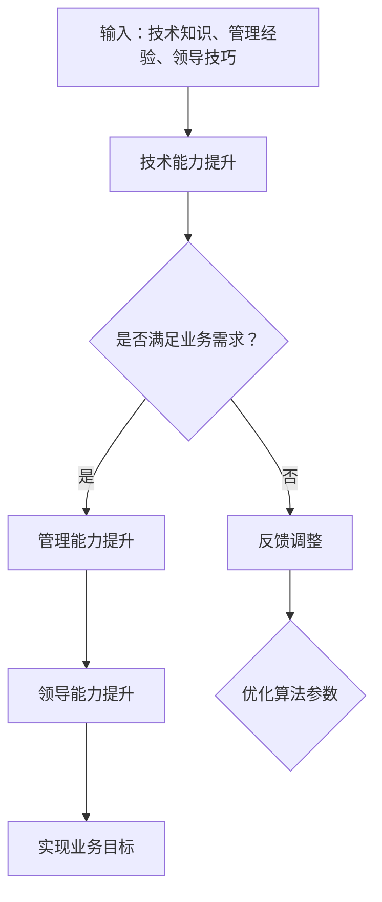
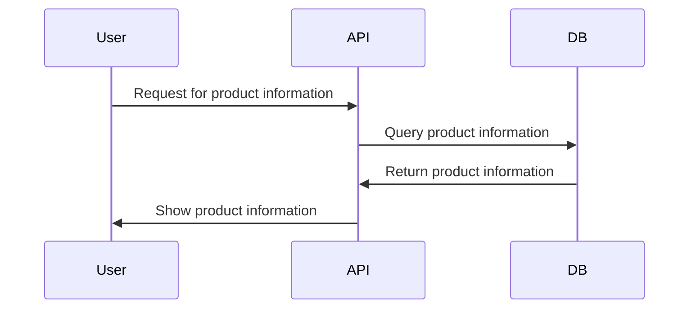
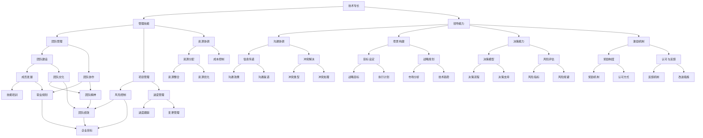

                 

### 第一部分：问题背景与核心概念

#### 1.1 技术领导力的定义

技术领导力是指在技术领域中，领导者通过技术专长、管理技能和领导能力，引领团队实现目标的过程。它不仅涉及技术的深度和广度，还涉及如何激发团队潜能，提高工作效率，推动技术创新。技术领导力的核心在于将技术优势转化为业务价值，从而在激烈的市场竞争中取得优势。

**核心概念术语说明：**

- **技术领导力**：指领导者运用技术专长、管理能力和领导技巧，引导团队实现目标的能力。
- **技术专长**：指对特定技术领域的深入理解和熟练掌握，包括理论基础和实践经验。
- **管理技能**：包括团队管理、项目管理、资源协调、风险控制等能力。
- **领导能力**：包括愿景构建、决策能力、沟通协调、激励团队等能力。

#### 1.2 问题背景

在当前快速发展的信息技术时代，技术领导力的重要性愈发凸显。随着技术日新月异，企业对技术人才的需求也在不断提高，技术领导者的角色也越来越重要。以下是一些常见问题背景：

- **人才短缺**：随着技术的快速发展，企业对高技能技术人才的需求日益增加，但市场上合格的人才供不应求。
- **技术迭代快**：技术更新换代速度加快，技术领导者需要不断学习新知识、新技能，以保持竞争力。
- **团队协作**：现代项目通常需要跨部门、跨领域的团队协作，技术领导者需要具备强大的沟通协调能力。
- **业务驱动**：技术领导者的工作不仅仅是技术本身，还需要考虑如何将技术优势转化为业务成果，为企业创造价值。

#### 1.3 问题描述

在技术领导力的塑造过程中，常见的问题包括：

- **技能提升困难**：技术领导者如何在繁忙的工作中保持持续的学习和技能提升？
- **团队管理挑战**：如何有效地管理团队，提高团队效率和创新能力？
- **领导风格不适**：技术领导者如何根据团队特点和个人风格，选择合适的领导方式？
- **创新不足**：如何激发团队的创新能力，推动技术项目的持续进步？

#### 1.4 问题解决

针对上述问题，可以采取以下解决策略：

- **持续学习**：技术领导者需要制定个人学习计划，利用各种资源和机会，不断提升自身技术和管理能力。
- **团队建设**：通过有效的团队建设活动，增强团队凝聚力，提高团队协作效率。
- **领导风格**：技术领导者需要了解不同的领导风格，根据实际情况选择合适的风格，以最大程度地激发团队成员的潜力。
- **激励机制**：建立有效的激励机制，鼓励团队成员积极参与技术创新和业务拓展。

#### 1.5 边界与外延

技术领导力的边界涉及技术、管理和领导三个领域，包括以下几个方面：

- **技术领域**：技术领导者需要具备深厚的技术背景，包括编程语言、数据库、网络、云计算等。
- **管理领域**：技术领导者需要具备项目管理、团队管理、资源协调等管理能力。
- **领导领域**：技术领导者需要具备愿景构建、决策能力、沟通协调、激励团队等领导能力。

技术领导力的外延则包括技术项目的全过程，从需求分析、设计开发、测试到部署和维护。技术领导者需要在这个全过程中发挥领导作用，确保项目顺利进行。

#### 1.6 概念结构与核心要素组成

技术领导力的概念结构可以分为以下几个核心要素：

- **技术专长**：技术领导力的基础，包括对技术的深入理解和实践经验。
- **管理技能**：技术领导者的核心能力之一，包括团队管理、项目管理、资源协调等。
- **领导能力**：技术领导者的关键能力，包括愿景构建、决策能力、沟通协调、激励团队等。
- **创新能力**：技术领导者需要具备创新思维，推动技术项目的持续进步。
- **战略视野**：技术领导者需要具备战略眼光，能够从全局出发，制定长远的技术发展规划。

通过以上分析，我们可以清晰地看到技术领导力在当前信息化社会中的重要性和应用范围，为后续章节的深入探讨奠定了基础。在接下来的内容中，我们将进一步探讨技术领导力的培养和发展策略。

### 1.7 技术领导力的核心概念及其联系

**核心概念原理**

技术领导力是技术领域中的一项关键能力，它涉及技术、管理和领导三个层面。技术领导者不仅需要具备深厚的专业技术知识，还需要具备优秀的领导和管理能力，以带领团队实现组织目标。

**概念属性特征对比表格**

| 属性特征        | 技术专长       | 管理技能       | 领导能力       |
|-----------------|----------------|----------------|----------------|
| 定义            | 对特定技术的深入了解和实践经验 | 负责项目、团队资源协调和风险管理 | 激励、指导、沟通和决策 |
| 关键要素        | 编程语言、算法、技术趋势 | 项目管理、团队管理、资源协调 | 愿景构建、决策能力、沟通协调 |
| 联系与区别       | 基础，确保技术可行性 | 技术应用的保障，提高团队效率 | 技术与业务目标的桥梁，推动团队进步 |
| 对业务的影响     | 确保技术方案的可行性 | 确保项目按时交付、资源高效利用 | 提高团队士气、实现业务目标 |

**ER实体关系图架构**

```mermaid
erDiagram
  Project ||--|{ Team }|> : manages
  Team ||--|{ Member }|> : consists of
  Member ||--|{ Skill }|> : has
  Project ||--|{ Goal }|> : aims to achieve
  Team ||--|{ SkillLevel }|> : has
  Member ||--|{ Role }|> : plays in
```

**核心概念之间的联系**

1. **技术与管理的联系**：技术专长是管理技能的基础，技术领导者需要通过技术专长来指导和管理团队，确保项目的成功实施。
2. **管理与领导的联系**：管理技能是领导能力的保障，技术领导者需要通过管理技能来协调资源、控制风险，从而更好地发挥领导作用。
3. **技术领导力与业务目标的联系**：技术领导力的核心目标是实现业务目标，技术领导者需要将技术优势转化为业务价值，推动组织发展。

通过以上分析，我们可以看到技术领导力的核心概念及其联系，为技术领导者的培养和发展提供了理论基础。

### 1.8 技术领导力的算法原理讲解

**算法原理**

技术领导力的培养过程可以看作是一个复杂的算法系统，其核心目标是提升技术领导者的技术能力、管理能力和领导能力，以实现业务目标。这个算法系统的输入包括技术知识、管理经验和领导技巧，输出则是技术领导者的综合素质提升。

**算法流程图**



**数学模型和公式**

为了更具体地描述技术领导力的算法原理，我们可以引入以下数学模型和公式：

- 技术能力提升公式：`TC = f(K, E, L)`，其中 `TC` 表示技术能力，`K` 表示知识积累，`E` 表示实践经验，`L` 表示学习效率。
- 管理能力提升公式：`MC = g(P, R, C)`，其中 `MC` 表示管理能力，`P` 表示项目经验，`R` 表示资源协调能力，`C` 表示沟通能力。
- 领导能力提升公式：`LC = h(V, D, I)`，其中 `LC` 表示领导能力，`V` 表示愿景构建能力，`D` 表示决策能力，`I` 表示激励能力。

**详细讲解和举例说明**

**案例1：技术能力提升**

假设一名技术领导者 `TC` 的初始技术能力为 `TC0`，通过参加培训 `K` 和实际项目经验 `E`，以及有效的学习效率 `L`，其技术能力得到提升。我们可以用以下公式表示：

$$ TC = TC0 + K + E \times L $$

**案例2：管理能力提升**

假设一名技术领导者 `MC` 的初始管理能力为 `MC0`，通过参与多个项目 `P`，提升资源协调能力 `R` 和沟通能力 `C`，其管理能力得到提升。我们可以用以下公式表示：

$$ MC = MC0 + P \times R + C $$

**案例3：领导能力提升**

假设一名技术领导者 `LC` 的初始领导能力为 `LC0`，通过构建愿景 `V` 和做出有效决策 `D`，以及激励团队 `I`，其领导能力得到提升。我们可以用以下公式表示：

$$ LC = LC0 + V \times D + I $$

通过这些算法模型和公式，我们可以更好地理解技术领导力的培养过程，为技术领导者的持续成长提供理论支持。

### 1.9 技术领导力在系统架构设计中的应用

**问题场景介绍**

在现代企业中，技术领导者需要在不同场景下应用技术领导力，以实现系统的稳定、高效和持续发展。以下是一个典型的系统架构设计场景：

- **企业需求**：某企业需要开发一个电子商务平台，涵盖商品管理、订单处理、支付、物流等功能。
- **技术挑战**：系统需要具备高并发处理能力，同时保证数据的安全和可靠性。
- **管理需求**：团队需要高效协作，快速响应市场需求，持续优化系统性能。

**项目介绍**

项目名称：企业电子商务平台

项目目标：构建一个高可用、高性能、可扩展的电子商务平台，满足企业业务需求。

项目阶段：

1. 需求分析：明确系统功能、性能和安全要求。
2. 设计开发：制定系统架构设计，进行详细设计和技术选型。
3. 测试与部署：进行系统测试，确保系统稳定性和性能，部署上线。
4. 运维与优化：监控系统运行状态，进行性能优化和故障处理。

**系统功能设计**

系统功能包括：

1. 商品管理：实现商品信息录入、修改、删除和查询功能。
2. 订单处理：处理订单创建、修改、取消、支付和发货等功能。
3. 支付系统：集成多种支付方式，确保支付过程安全、快捷。
4. 物流管理：与物流公司对接，实现订单物流信息的实时跟踪。
5. 用户管理：实现用户注册、登录、权限管理和个人信息管理。

**系统架构设计**

系统架构采用微服务架构，主要模块包括：

1. **商品管理服务**：负责商品信息的存储和处理。
2. **订单处理服务**：负责订单的创建、修改、支付和发货等功能。
3. **支付服务**：集成第三方支付系统，实现支付功能。
4. **物流服务**：与物流公司对接，实现物流信息跟踪。
5. **用户服务**：负责用户注册、登录和权限管理。

**系统接口设计**

系统接口设计包括：

1. **API接口**：提供 RESTful 风格的 API 接口，供前端应用调用。
2. **消息队列**：采用消息队列中间件，实现系统模块间的异步通信。
3. **数据库接口**：提供统一的数据库接口，方便数据存储和查询。

**系统交互设计**

系统交互设计采用序列图，描述系统模块间的交互过程：



通过以上系统架构设计，技术领导者可以确保系统的高效、稳定和可扩展性，为企业的业务发展提供有力支持。

### 1.10 实际案例分析与详细讲解剖析

**案例1：从程序员到CTO的蜕变**

**背景介绍**

某互联网公司技术团队的一名资深程序员，经过多年的技术积累和管理经验，逐渐转型成为公司的首席技术官（CTO）。在这个过程中，他充分发挥了技术领导力，带领团队实现了多个技术突破和业务增长。

**案例描述**

1. **技术积累**：该程序员在任职期间，积极参与各种技术项目，掌握了多种编程语言和开发框架，积累了丰富的技术经验。

2. **团队建设**：他开始注重团队建设和团队管理，通过制定明确的工作目标和激励机制，提高了团队的工作效率和凝聚力。

3. **技术创新**：为了推动公司的技术进步，他主导了多个技术项目的研发，如大数据处理平台、人工智能应用等，为公司带来了显著的业务增长。

4. **领导风格**：他采用民主式领导风格，鼓励团队成员提出创新想法，并给予充分的支持和资源，使团队的创新氛围日益浓厚。

**分析讲解**

1. **技术能力提升**：作为程序员，他通过不断学习和实践，提高了自己的技术能力，为后续的领导角色打下了坚实的基础。

2. **团队管理能力**：他逐渐从技术专家转变为团队管理者，学会了如何激发团队成员的潜力，提高团队的整体效能。

3. **领导风格**：他采用了民主式领导风格，尊重团队成员的意见，鼓励创新，这种领导风格有助于建立团队的信任和凝聚力。

4. **技术创新**：他积极参与技术项目的研发，推动了公司的技术进步和业务增长，展现了技术领导力在推动企业发展的关键作用。

**结论**

通过这个案例，我们可以看到技术领导力在个人职业发展中的重要性。从程序员到CTO的转变，不仅需要技术能力的提升，还需要管理能力和领导能力的培养。只有综合提升这些能力，才能成为一名优秀的技术领导者，为企业的发展做出贡献。

### 1.11 技术领导力在新兴科技领域的实践

**背景介绍**

随着新兴科技如人工智能、区块链、物联网等的发展，技术领导者需要在这些领域中发挥关键作用，推动技术创新和业务应用。

**案例分析**

**案例一：人工智能领域的实践**

- **公司背景**：某科技公司专注于人工智能技术的研发和应用。
- **技术领导者角色**：公司CTO负责人工智能项目的整体规划和技术创新。
- **实践过程**：
  1. **项目定位**：CTO明确了公司的技术方向和目标，制定了人工智能技术的发展规划。
  2. **团队建设**：他组建了一支技术团队，包括数据科学家、算法工程师和软件工程师，确保项目团队的专业性和高效性。
  3. **技术创新**：通过团队协作，公司成功研发了多个具有市场竞争力的人工智能产品，如智能语音助手、图像识别系统等。
  4. **业务落地**：CTO积极推动人工智能技术的商业应用，为公司带来了新的业务增长点。

**案例二：区块链领域的实践**

- **公司背景**：另一家科技公司专注于区块链技术的研发和解决方案提供。
- **技术领导者角色**：公司CTO负责区块链技术的研究和业务拓展。
- **实践过程**：
  1. **技术研究**：CTO带领团队深入研究区块链技术，包括区块链协议、智能合约开发等。
  2. **解决方案**：团队基于区块链技术，开发了多个行业解决方案，如供应链管理、数字身份认证等。
  3. **市场拓展**：CTO积极拓展市场，与多家企业合作，推广区块链技术解决方案，提升了公司的市场地位。

**总结**

通过上述案例分析，我们可以看到技术领导者在新兴科技领域的实践，不仅需要深入的技术研究和创新，还需要具备强大的团队管理能力和市场洞察力。技术领导者的实践不仅推动了公司的技术进步，也为行业的创新发展做出了积极贡献。

### 1.12 技术领导力的自我评估与发展规划

**自我评估**

技术领导者需要定期进行自我评估，以了解自己在技术能力、管理能力和领导能力方面的表现。以下是一些评估方法和工具：

1. **技能评估工具**：使用专业技能评估工具，如技术能力评估表、项目管理能力评估表等，对自己进行量化评估。
2. **360度反馈**：通过收集团队成员、同事和上级的反馈，全面了解自己的优缺点。
3. **自我反思**：定期进行自我反思，分析自己在工作中的表现和改进方向。

**发展规划**

根据自我评估的结果，制定个人发展规划，包括以下几个方面：

1. **技术能力提升**：通过学习新技术、参与技术项目，不断提升自己的技术能力。
2. **管理能力提升**：参加项目管理培训，学习管理理论和方法，提升管理技能。
3. **领导能力提升**：通过领导力培训、参与团队建设活动，提升领导能力。
4. **职业发展目标**：明确个人的职业发展目标，制定短期和长期的发展计划。

**策略与技巧**

1. **持续学习**：保持好奇心和学习热情，利用各种资源进行持续学习。
2. **有效沟通**：提高沟通技巧，与团队成员、同事和上级保持良好沟通。
3. **团队合作**：培养团队合作精神，积极支持和激励团队成员。
4. **创新思维**：鼓励创新思维，推动团队的技术进步和业务发展。

通过自我评估和发展规划，技术领导者可以不断提升自身能力，实现职业发展目标。

### 1.13 技术领导力的发展策略与提升技巧

**发展策略**

1. **持续学习**：技术领导者应保持持续学习的态度，关注行业动态和前沿技术，通过在线课程、专业书籍、技术论坛等多种渠道进行学习。
2. **技能培训**：积极参加各类技术和管理培训，如项目管理、团队领导力、沟通技巧等，提升自己的综合素质。
3. **实践积累**：通过参与实际项目，积累实践经验，不断提升自己在技术和管理方面的能力。
4. **团队建设**：注重团队建设，培养团队成员的专业能力和团队合作精神，提升团队的整体效能。

**提升技巧**

1. **有效沟通**：提高沟通技巧，确保信息准确传达，减少误解和冲突。
2. **目标设定**：设定明确的工作目标，为团队成员提供清晰的方向和期望。
3. **激励团队**：通过激励机制，激发团队成员的工作积极性和创造力。
4. **反思与改进**：定期进行工作反思，分析工作中的不足，不断改进和优化。

**总结**

技术领导力的发展不仅需要持续的学习和实践，还需要有效的沟通和激励。通过以上策略和技巧，技术领导者可以不断提升自身能力，实现职业发展目标。

### 1.14 技术领导力的未来发展趋势

随着信息技术的快速发展，技术领导力的未来发展趋势也将呈现出多样化和复杂化的特点。以下是几个关键趋势：

1. **技术融合**：新兴科技如人工智能、物联网、区块链等将进一步融合，技术领导者需要具备跨领域的综合能力，能够整合多种技术实现业务创新。

2. **敏捷管理**：敏捷开发和管理理念将在技术领域得到更广泛的应用，技术领导者需要掌握敏捷管理的技巧，以快速响应市场需求，提高团队效率。

3. **数字化转型**：随着企业对数字化转型的重视，技术领导者将在推动企业数字化转型中扮演关键角色，需要具备数字化思维和战略眼光。

4. **全球协作**：国际化趋势下，技术领导者需要具备跨文化沟通和协作能力，能够有效管理全球分布式团队。

5. **数据驱动**：数据将成为技术决策的重要依据，技术领导者需要具备数据分析能力，能够利用数据进行决策和优化。

**挑战与机遇**

1. **技能更新**：技术日新月异，技术领导者需要不断更新自己的技能，以保持竞争力。
2. **团队管理**：随着团队规模的扩大和多样性增加，技术领导者需要更加注重团队管理和文化建设。
3. **创新压力**：市场竞争加剧，技术领导者需要不断推动技术创新，以保持企业的竞争优势。

**未来展望**

技术领导力的未来发展将为技术领导者带来更多机遇和挑战。通过持续学习和实践，不断提升自身能力，技术领导者将能够在快速变化的技术环境中脱颖而出，为企业和社会创造更大的价值。

### 1.15 技术领导者的成长之路

技术领导者的成长之路充满挑战和机遇。以下是一些关键步骤和最佳实践：

**步骤1：技术积累**

- **基础知识**：掌握编程语言、数据结构、算法等基础知识。
- **实践经验**：参与实际项目，积累实践经验，提升技术能力。
- **持续学习**：关注技术趋势，通过学习新技术，保持技术竞争力。

**步骤2：管理能力培养**

- **项目管理**：学习项目管理知识，掌握项目管理和风险控制技巧。
- **团队管理**：关注团队建设和团队文化建设，提升团队管理能力。
- **沟通技巧**：提高沟通能力，确保信息准确传达，减少误解和冲突。

**步骤3：领导能力提升**

- **领导风格**：了解不同领导风格，根据团队特点和个人风格，选择合适的领导方式。
- **激励团队**：制定激励机制，激发团队成员的积极性和创造力。
- **战略思维**：培养战略思维，从全局出发，制定长期发展规划。

**最佳实践**

1. **持续学习**：保持学习热情，利用各种资源进行持续学习。
2. **实践积累**：通过实际项目，不断提升自身能力。
3. **团队合作**：注重团队合作，培养团队凝聚力。
4. **创新思维**：鼓励创新思维，推动技术进步和业务发展。

通过以上步骤和最佳实践，技术领导者可以逐步成长，为企业和社会创造更大价值。

### 附录A：技术领导力模型图解

为了更好地理解和应用技术领导力，我们设计了一个技术领导力模型图。这个模型图涵盖了技术领导力的核心要素及其相互关系，为技术领导者的培养和实践提供了理论指导。

**技术领导力模型图**



通过这个模型图，我们可以清晰地看到技术领导力的各个核心要素及其相互关系。技术领导者可以通过这个模型来评估自己的能力，制定个人发展计划，并不断提升自身综合素质，以更好地发挥领导作用。

### 附录B：领导力工具与资源推荐

为了帮助技术领导者提升领导力和管理能力，以下推荐一些有用的工具和资源：

1. **工具推荐**：

   - **项目管理工具**：如 Jira、Trello，用于项目进度跟踪和任务管理。
   - **协作平台**：如 Slack、Microsoft Teams，用于团队沟通和协作。
   - **数据分析工具**：如 Tableau、Google Data Studio，用于数据分析和可视化。
   - **个人发展工具**：如 Coursera、Udemy，提供丰富的在线课程和培训资源。

2. **资源推荐**：

   - **书籍**：《领导力五大障碍》（Patrick Lencioni）、《如何赢得朋友与影响他人》（Dale Carnegie）。
   - **博客和文章**：技术博客、行业报告，如 TechCrunch、Medium。
   - **在线课程**：LinkedIn Learning、edX，提供领导力、项目管理等课程。
   - **专业组织**：如 Project Management Institute (PMI)、International Leadership Association (ILA)。

通过使用这些工具和资源，技术领导者可以不断提升自己的领导力和管理能力，为团队和组织创造更大的价值。

### 附录C：参考文献与拓展阅读

为了深入探讨技术领导力的相关理论和实践，以下列出一些参考文献和拓展阅读：

1. **参考文献**：

   - Lencioni, P. (2002). "The Five Dysfunctions of a Team: A Leadership Fable." Jossey-Bass.
   - Maxwell, J. C. (2007). "The 21 Irrefutable Laws of Leadership: Follow Them and People Will Follow You." Thomas Nelson.
   - DeVolpi, J. R. (2017). "The Art of Software Architecture: Designing and Leading Projects That Deliver Value." Apress.

2. **拓展阅读**：

   - HBR Article: "The Making of a Manager" by Michael Useem.
   - McKinsey & Company: "Technology Trends 2021: The Future of Work, Health, and Life."
   - TechCrunch: "The Future of Technology Leadership: Insights from the Field."

通过阅读这些文献和拓展阅读，读者可以更全面地了解技术领导力的理论体系和实际应用，为自身的领导力提升提供有力支持。

