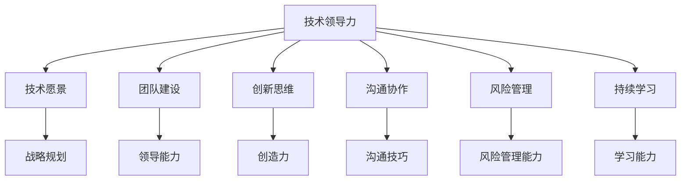
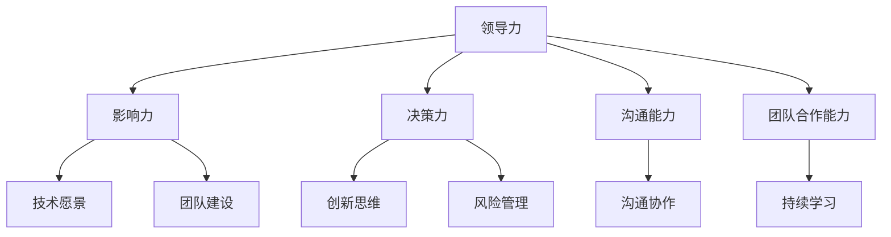

                 

# 技术领导力的核心素质培养

> 关键词：技术领导力、核心素质、团队建设、风险管理、沟通协作、持续学习

> 摘要：本文将深入探讨技术领导力的核心素质培养，从技术愿景、团队建设、创新思维、沟通协作、风险管理到持续学习等方面，详细分析每个素质的重要性及其培养方法。通过实际的案例和实践经验，为技术领导者提供一套完整的素质培养方案，助力他们在竞争激烈的技术领域脱颖而出。

## **引言**

在当今快速发展的技术时代，技术领导力已经成为企业成功的关键因素之一。技术领导者不仅要具备深厚的技术知识，还要拥有卓越的领导才能，能够带领团队迎接挑战，推动技术进步。然而，技术领导力的培养并非一蹴而就，它需要通过不断的实践和学习，逐渐积累和提升。

本文旨在探讨技术领导力的核心素质培养，通过分析技术愿景、团队建设、创新思维、沟通协作、风险管理和持续学习等方面的核心素质，为技术领导者提供一套系统的培养方案。本文将采用逻辑清晰、结构紧凑、简单易懂的专业技术语言，让读者能够深入理解每个素质的培养方法和实践要点。

## **第一部分：技术领导力概述**

### **1.1.1 问题背景**

随着信息技术的快速发展，企业对技术领导者的需求越来越高。技术领导者不仅要具备深厚的技术知识，还要具备领导才能，能够带领团队实现技术突破，推动企业的发展。然而，很多技术领导者往往在领导力方面存在短板，无法充分发挥其技术优势，导致团队效率低下，技术项目进展受阻。

### **1.1.2 问题描述**

如何培养技术领导力的核心素质，提升技术领导者的领导能力和团队协作效率，成为当前企业面临的一个重要问题。技术领导者需要具备哪些核心素质？如何通过实践和培训提升这些素质？这是本文要探讨的主要问题。

### **1.1.3 问题解决**

本文将通过对技术领导力的核心素质进行深入分析，提出一套系统的培养方案，包括技术愿景、团队建设、创新思维、沟通协作、风险管理和持续学习等方面。通过具体的案例和实践经验，帮助技术领导者提升领导力和团队协作能力，为企业创造更大的价值。

### **1.1.4 边界与外延**

技术领导力的核心素质培养不仅仅局限于技术领域，还涉及到管理、沟通、协作等多个方面。本文将重点关注技术领导者需要具备的核心素质及其培养方法，但并不意味着其他方面的能力不重要。在实际培养过程中，技术领导者需要全面提高自己的综合素质，才能更好地发挥领导作用。

### **1.1.5 概念结构**

技术领导力是由多个核心素质组成的，包括技术愿景、团队建设、创新思维、沟通协作、风险管理和持续学习等。这些核心素质相互关联，共同构成了技术领导力的概念结构。图1-1展示了技术领导力的核心素质及其关联。

### **1.1.6 核心要素组成**

技术领导力的核心要素包括技术愿景、团队建设、创新思维、沟通协作、风险管理和持续学习。以下是这些要素的具体定义和特征：

1. **技术愿景**：技术领导者需要具备清晰的技术愿景，能够洞察行业发展趋势，规划技术发展方向。技术愿景需要具备前瞻性、创新性和可行性，能够激励团队共同实现目标。

2. **团队建设**：团队建设是技术领导力的重要组成部分，技术领导者需要具备领导能力和团队协作技巧，能够构建高效、协作的团队。团队建设需要注重团队成员的沟通、协作和成长。

3. **创新思维**：创新思维是技术领导者的核心素质之一，能够带领团队不断突破技术瓶颈，实现技术创新。创新思维需要具备开放性、批判性和创造性。

4. **沟通协作**：沟通协作是技术领导者必备的素质，能够有效传递信息、协调资源、解决冲突。沟通协作需要具备倾听能力、表达能力、协作精神和沟通技巧。

5. **风险管理**：风险管理是技术领导者的重要职责，需要具备识别、评估和管理风险的能力，确保项目顺利进行。风险管理需要具备预见性、敏捷性和决策力。

6. **持续学习**：持续学习是技术领导者不断提升自身能力和素质的关键，需要具备学习意识、学习能力和学习习惯。持续学习需要具备主动性、持续性和深度性。

### **1.2 技术领导力的核心素质**

技术领导力的核心素质是技术领导者成功的关键，这些素质不仅关乎个人的成长，更关乎团队的效率和企业的竞争力。以下将详细探讨技术领导力的核心素质及其重要性。

#### **1.2.1 领导力与核心素质的关系**

领导力是技术领导力的核心素质之一，它决定了技术领导者是否能够有效地带领团队实现目标。领导力包括影响力、决策力、沟通能力和团队合作能力等多个方面，这些能力对于技术领导者的成功至关重要。

领导力与核心素质之间的关系可以用图1-2表示：

从图中可以看出，领导力与技术领导力的其他核心素质紧密相关，共同构成了技术领导力的整体框架。技术领导者需要具备强大的领导力，才能在各个方面发挥核心素质的作用，带领团队实现技术突破。

#### **1.2.2 核心素质的定义与特征**

技术领导力的核心素质包括技术愿景、团队建设、创新思维、沟通协作、风险管理和持续学习，以下是对这些素质的定义与特征进行详细描述：

1. **技术愿景**：技术愿景是指技术领导者对技术发展方向和目标的远见和规划。它包括对行业趋势的洞察、对技术进步的期待以及对未来发展方向的判断。技术愿景不仅能够激励团队，还能为团队提供明确的方向和目标。

   - **特征**：前瞻性、创新性、可行性。

2. **团队建设**：团队建设是指技术领导者通过建立和优化团队结构，提升团队协作效率和团队凝聚力。团队建设包括选拔和培养团队成员、制定团队目标、建立有效的沟通机制以及培养团队合作精神。

   - **特征**：协作性、凝聚力、高效性。

3. **创新思维**：创新思维是指技术领导者具备的能够发现和解决技术问题的新方法和新思路。创新思维能够推动团队不断进步，实现技术创新和业务突破。

   - **特征**：开放性、批判性、创造性。

4. **沟通协作**：沟通协作是指技术领导者通过有效沟通和团队合作，实现团队目标的能力。沟通协作包括倾听、表达、协商和解决冲突等多个方面，是团队协作的重要保障。

   - **特征**：倾听能力、表达能力、协作精神、沟通技巧。

5. **风险管理**：风险管理是指技术领导者对项目风险进行识别、评估和控制的过程。风险管理能够确保项目顺利进行，减少潜在风险对项目的影响。

   - **特征**：预见性、敏捷性、决策力。

6. **持续学习**：持续学习是指技术领导者通过不断学习和更新知识，提升自身能力和团队素质。持续学习是技术领导者保持竞争力的重要途径。

   - **特征**：主动性、持续性、深度性。

#### **1.2.3 核心素质的分类**

技术领导力的核心素质可以分为以下几类：

1. **战略素质**：包括技术愿景、团队建设和风险管理。这些素质关系到技术领导者在战略层面的决策和规划能力，是技术领导者成功的关键。

2. **执行素质**：包括创新思维、沟通协作和持续学习。这些素质关系到技术领导者在执行层面的实际操作能力，是技术领导者带领团队实现目标的基础。

3. **个人素质**：包括领导力和个人魅力。这些素质关系到技术领导者的个人特质和影响力，是技术领导者赢得团队信任和尊重的重要因素。

### **1.3 技术领导力的重要性**

技术领导力在企业发展中起着至关重要的作用，它不仅关乎企业的技术创新和业务突破，还关系到企业的整体竞争力和可持续发展。以下从几个方面阐述技术领导力的重要性。

#### **1.3.1 企业竞争的关键**

在当今快速变化的市场环境中，技术创新是企业保持竞争优势的关键。技术领导者通过技术愿景和创新思维，能够带领团队不断突破技术瓶颈，推动企业实现技术领先。技术领导力是企业竞争力的核心，直接关系到企业在市场中的地位和未来发展。

#### **1.3.2 技术团队效率的提升**

技术团队是企业发展的重要力量，技术领导力能够提升团队协作效率，激发团队成员的潜力和创造力。技术领导者通过团队建设、沟通协作和风险管理，能够构建高效、协作的团队，确保项目顺利进行，提高团队整体效能。

#### **1.3.3 职业发展的优势**

技术领导者是企业发展的重要人才，具备强大的技术领导力能够为个人职业发展带来巨大优势。技术领导者不仅能够获得更高的职位和薪资待遇，还能够提升个人影响力和行业地位。技术领导力是职业发展的重要资本，有助于实现个人的职业目标和人生价值。

## **第二部分：技术愿景与战略规划**

### **2.1 技术愿景的重要性**

技术愿景是技术领导力的核心素质之一，它决定了技术领导者能否带领团队实现技术突破和业务增长。一个清晰、明确的技术愿景能够为团队提供方向和目标，激发团队的创造力，推动企业实现可持续发展。

#### **2.1.1 技术愿景的定义**

技术愿景是指技术领导者对技术发展方向和目标的远见和规划。它是对未来技术的展望，是对企业技术战略的宏观思考。技术愿景不仅包括对当前技术趋势的洞察，还包括对未来技术突破的期待和对企业技术目标的明确。

#### **2.1.2 技术愿景的特征**

1. **前瞻性**：技术愿景需要具备前瞻性，能够洞察行业发展趋势，预见未来技术变革。前瞻性的技术愿景能够为团队提供明确的方向，避免盲目跟风，确保企业技术战略的前瞻性和领先性。

2. **创新性**：技术愿景需要具备创新性，能够推动企业实现技术突破和创新。创新性的技术愿景能够激发团队的创造力，鼓励团队成员勇于探索和尝试，推动企业不断前进。

3. **可行性**：技术愿景需要具备可行性，能够在实际操作中实现。可行性是技术愿景落地的基础，它需要考虑企业现有的资源、能力和技术储备，确保技术愿景能够实现。

#### **2.1.3 技术愿景的作用**

1. **明确方向**：技术愿景能够为团队提供明确的方向，确保团队成员在共同努力下实现企业目标。清晰的技术愿景能够减少团队内部的迷茫和困惑，提高团队的凝聚力。

2. **激励团队**：技术愿景能够激发团队的激情和创造力，鼓励团队成员为实现企业目标而努力。创新性的技术愿景能够激发团队成员的潜能，推动企业实现技术突破。

3. **指导决策**：技术愿景能够指导企业的技术决策，确保企业的技术战略与愿景保持一致。前瞻性的技术愿景能够帮助企业抓住市场机遇，规避潜在风险，确保企业的可持续发展。

### **2.2 战略规划的重要性**

战略规划是技术领导力的重要组成部分，它决定了企业技术发展的方向和路径。一个科学、合理的战略规划能够确保企业技术资源的高效利用，推动企业实现技术突破和业务增长。

#### **2.2.1 战略规划的定义**

战略规划是指技术领导者根据企业愿景和目标，对企业的技术发展方向、技术路线、资源分配和技术创新等进行全面规划和布局。战略规划是企业技术发展的指南针，它需要考虑企业的实际情况、市场环境和竞争对手等因素，确保企业的技术发展具有可行性和可持续性。

#### **2.2.2 战略规划的特征**

1. **系统性**：战略规划需要具备系统性，能够全面考虑企业的技术发展、市场环境和竞争对手等因素。系统性的战略规划能够确保企业技术发展的整体性和协调性。

2. **前瞻性**：战略规划需要具备前瞻性，能够预见未来技术发展趋势和市场变化，确保企业技术战略的前瞻性和领先性。

3. **可行性**：战略规划需要具备可行性，能够在实际操作中实现。可行性的战略规划需要考虑企业的资源、能力和技术储备，确保战略规划能够落地。

#### **2.2.3 战略规划的作用**

1. **明确目标**：战略规划能够明确企业技术发展的目标，确保企业技术资源的集中利用，提高技术开发的效率。明确的目标能够激励团队成员为实现企业目标而努力。

2. **指导资源分配**：战略规划能够指导企业的资源分配，确保企业的技术资源得到合理利用，避免资源浪费。合理的资源分配能够提高企业的技术实力和市场竞争力。

3. **应对风险**：战略规划能够帮助企业预见潜在的风险和挑战，制定相应的应对策略，确保企业的可持续发展。前瞻性的战略规划能够提高企业的风险应对能力。

### **2.3 技术愿景与战略规划的关系**

技术愿景和战略规划是密不可分的，它们相互支持、相互促进，共同推动企业的技术发展和业务增长。

#### **2.3.1 技术愿景指导战略规划**

技术愿景是战略规划的基础，它为战略规划提供了明确的方向和目标。技术愿景能够指导战略规划的制定，确保战略规划与企业的愿景保持一致。通过技术愿景，企业能够明确技术发展的重点和优先级，确保战略规划的科学性和可行性。

#### **2.3.2 战略规划实现技术愿景**

战略规划是实现技术愿景的具体行动方案，它将技术愿景转化为具体的技术目标和实施路径。战略规划能够指导企业的技术投资、技术研发和人才培养等各项工作，确保技术愿景能够实现。通过战略规划，企业能够高效地利用资源，推动技术突破和业务增长。

### **2.4 技术愿景与战略规划的培养**

技术愿景和战略规划是技术领导者的重要素质，它们需要通过系统的培养和不断的实践来提升。

#### **2.4.1 培养技术愿景的方法**

1. **加强行业研究**：技术领导者需要关注行业动态，了解市场趋势和竞争对手的技术发展，为技术愿景提供数据支持。

2. **鼓励创新思维**：技术领导者需要鼓励团队成员勇于创新，推动技术突破，为技术愿景的实现提供动力。

3. **明确技术目标**：技术领导者需要明确企业的技术目标，制定具体的行动计划，确保技术愿景能够实现。

#### **2.4.2 培养战略规划的方法**

1. **制定战略规划**：技术领导者需要制定企业的战略规划，明确技术发展的方向、目标和路径。

2. **优化资源配置**：技术领导者需要优化企业的资源配置，确保技术资源的合理利用。

3. **培养团队协作能力**：技术领导者需要培养团队的协作能力，确保战略规划能够得到有效执行。

## **第三部分：团队建设与领导能力**

### **3.1 团队建设的重要性**

团队建设是技术领导力的核心素质之一，它关系到团队的整体效率和团队凝聚力。一个高效的团队能够实现技术突破，推动企业的可持续发展。因此，团队建设成为技术领导者的重要任务之一。

#### **3.1.1 团队建设的定义**

团队建设是指技术领导者通过一系列措施，提升团队的协作效率、凝聚力和整体绩效的过程。团队建设包括选拔和培养团队成员、建立团队文化、制定团队目标和沟通协调等多个方面。

#### **3.1.2 团队建设的特征**

1. **协作性**：团队建设强调团队成员之间的协作，通过协同工作实现共同的目标。

2. **凝聚力**：团队建设能够增强团队成员之间的凝聚力，形成团结协作的氛围。

3. **高效性**：团队建设能够提升团队的整体效率，使团队能够高效地完成任务。

#### **3.1.3 团队建设的意义**

1. **提高团队效率**：团队建设能够优化团队成员的工作流程，减少内耗，提高团队的整体效率。

2. **增强团队凝聚力**：团队建设能够增强团队成员之间的信任和默契，形成团结协作的氛围。

3. **推动技术创新**：团队建设能够激发团队成员的创造力和创新思维，推动企业的技术进步。

### **3.2 领导能力的重要性**

领导能力是技术领导者的核心素质之一，它决定了技术领导者是否能够有效地带领团队实现目标。强大的领导能力能够提升团队的执行力，推动企业的可持续发展。

#### **3.2.1 领导能力的定义**

领导能力是指技术领导者通过一系列行为和策略，激发和引领团队成员，实现共同目标的能力。领导能力包括决策能力、沟通能力、影响力、团队合作能力和变革能力等多个方面。

#### **3.2.2 领导能力的特征**

1. **决策能力**：领导能力体现在技术领导者的决策能力，他们能够在复杂的环境中做出正确的决策。

2. **沟通能力**：领导能力体现在技术领导者的沟通能力，他们能够有效地与团队成员沟通，传递信息，协调资源。

3. **影响力**：领导能力体现在技术领导者的影响力，他们能够通过自己的言行影响团队成员，带领团队实现目标。

#### **3.2.3 领导能力的意义**

1. **提高团队执行力**：领导能力能够提高团队的执行力，使团队能够高效地完成任务。

2. **激发团队成员潜能**：领导能力能够激发团队成员的潜能，使他们能够发挥最大的价值。

3. **推动企业变革**：领导能力能够推动企业的变革，使企业能够适应市场的变化，保持竞争力。

### **3.3 团队建设与领导能力的关系**

团队建设与领导能力是相辅相成的，它们共同构成了技术领导力的核心素质。

#### **3.3.1 团队建设与领导能力的关系**

1. **团队建设是领导能力的基础**：团队建设是技术领导者发挥领导能力的基础，只有建立起高效、协作的团队，技术领导者才能更好地发挥领导作用。

2. **领导能力是团队建设的关键**：领导能力是技术领导者推动团队建设的关键，只有具备强大的领导能力，技术领导者才能有效地带领团队实现目标。

#### **3.3.2 团队建设与领导能力的互动**

1. **团队建设促进领导能力的提升**：团队建设的过程能够锻炼技术领导者的领导能力，通过面对团队中的各种挑战，技术领导者能够不断提升自己的领导水平。

2. **领导能力推动团队建设**：强大的领导能力能够推动团队建设，技术领导者通过自己的言行影响团队成员，促进团队凝聚力的提升，实现团队的高效协作。

### **3.4 团队建设的实践**

团队建设是一项复杂的任务，需要技术领导者系统地规划和执行。以下是一些团队建设的实践方法：

#### **3.4.1 选拔和培养团队成员**

1. **选拔合适的团队成员**：技术领导者需要选拔具有专业技能和良好团队合作精神的团队成员。

2. **培养团队成员**：技术领导者需要提供培训和学习机会，帮助团队成员提升专业技能和团队协作能力。

#### **3.4.2 建立团队文化**

1. **明确团队价值观**：技术领导者需要明确团队的价值观，确保团队成员在共同的目标和价值观下工作。

2. **营造良好的团队氛围**：技术领导者需要营造积极、开放、包容的团队氛围，鼓励团队成员相互支持、共同进步。

#### **3.4.3 制定团队目标**

1. **明确团队目标**：技术领导者需要明确团队的目标，确保团队成员在共同的目标下努力。

2. **制定具体行动计划**：技术领导者需要制定具体的行动计划，确保团队能够高效地完成任务。

#### **3.4.4 沟通协调**

1. **建立有效的沟通机制**：技术领导者需要建立有效的沟通机制，确保团队成员能够及时、准确地交流信息。

2. **协调团队资源**：技术领导者需要协调团队资源，确保团队能够充分利用资源，实现团队目标。

### **3.5 领导能力的实践**

领导能力是一项需要不断锻炼和提升的素质，技术领导者需要通过实践不断提高自己的领导能力。以下是一些领导能力的实践方法：

#### **3.5.1 提升决策能力**

1. **分析问题**：技术领导者需要深入分析问题，确保决策的准确性。

2. **权衡利弊**：技术领导者需要权衡利弊，做出最优决策。

#### **3.5.2 提升沟通能力**

1. **倾听团队成员的意见**：技术领导者需要倾听团队成员的意见，了解他们的需求和困惑。

2. **清晰表达**：技术领导者需要清晰表达自己的想法和意见，确保团队成员能够理解。

#### **3.5.3 提升影响力**

1. **树立榜样**：技术领导者需要通过自己的言行树立榜样，影响团队成员。

2. **建立信任**：技术领导者需要建立信任，赢得团队成员的尊重和信任。

### **3.6 团队建设的案例**

以下是一个团队建设的案例，该案例展示了技术领导者如何通过团队建设提升团队效率和团队凝聚力。

#### **案例背景**

某互联网公司成立了一支新产品开发团队，该团队负责开发一款创新性的移动应用。然而，团队在成立初期面临诸多挑战，包括成员之间的沟通不畅、团队合作不力、工作效率低下等问题。

#### **案例分析**

技术领导者意识到团队建设的重要性，他采取了一系列措施来提升团队效率和团队凝聚力。

1. **选拔和培养团队成员**：技术领导者选拔了一批具有专业技能和团队合作精神的团队成员，并为团队成员提供了培训和学习机会，提升他们的专业技能和团队协作能力。

2. **建立团队文化**：技术领导者明确了团队的价值观，并营造了积极、开放、包容的团队氛围，鼓励团队成员相互支持、共同进步。

3. **制定团队目标**：技术领导者明确了团队的目标，并制定了具体的行动计划，确保团队成员在共同的目标下努力。

4. **沟通协调**：技术领导者建立了有效的沟通机制，确保团队成员能够及时、准确地交流信息，协调团队资源。

#### **案例结果**

通过团队建设，新产品开发团队的工作效率得到了显著提升，团队成员之间的沟通更加顺畅，团队合作更加紧密。最终，该团队成功开发出了一款创新性的移动应用，获得了市场的广泛认可。

#### **案例启示**

通过这个案例，我们可以看到团队建设对于提升团队效率和团队凝聚力的重要性。技术领导者需要通过选拔和培养团队成员、建立团队文化、制定团队目标和沟通协调等措施，全面提升团队素质，实现团队的高效协作。

## **第四部分：创新思维与持续学习**

### **4.1 创新思维的重要性**

在快速变化的技术时代，创新思维成为企业持续发展的关键。技术领导者需要具备创新思维，能够引领团队不断突破技术瓶颈，推动企业实现技术领先。以下将探讨创新思维的重要性及其培养方法。

#### **4.1.1 创新思维的定义**

创新思维是指技术领导者通过独特、新颖的方式思考问题，寻找解决方案，实现技术突破的能力。创新思维不仅包括对现有技术的改进和优化，还包括对全新技术的探索和创造。

#### **4.1.2 创新思维的特征**

1. **开放性**：创新思维需要具备开放性，能够接受新观念、新方法，不断拓宽思维边界。

2. **批判性**：创新思维需要具备批判性，能够对现有技术进行深入分析和评估，发现其中的问题和不足。

3. **创造性**：创新思维需要具备创造性，能够提出新颖、独特的技术解决方案，推动技术进步。

#### **4.1.3 创新思维的作用**

1. **推动技术进步**：创新思维能够推动技术团队不断突破技术瓶颈，实现技术进步和业务增长。

2. **提高竞争力**：创新思维能够帮助企业保持技术领先地位，提高市场竞争力。

3. **激发团队潜力**：创新思维能够激发团队成员的创造力和创新精神，提高团队整体创新能力。

### **4.2 持续学习的重要性**

在快速变化的技术时代，技术领导者需要不断学习，才能保持竞争力。持续学习不仅能够提升个人能力，还能够推动团队的整体进步。以下将探讨持续学习的重要性及其培养方法。

#### **4.2.1 持续学习的定义**

持续学习是指技术领导者通过不断学习新知识、新技能，不断提升个人能力和团队素质的过程。持续学习是技术领导者适应技术变革、保持竞争力的关键。

#### **4.2.2 持续学习的特征**

1. **主动性**：持续学习需要具备主动性，技术领导者需要主动寻求学习机会，不断充实自己的知识体系。

2. **持续性**：持续学习需要具备持续性，技术领导者需要将学习融入日常工作中，形成持续学习的习惯。

3. **深度性**：持续学习需要具备深度性，技术领导者需要深入学习关键技术，掌握核心原理。

#### **4.2.3 持续学习的作用**

1. **提升个人能力**：持续学习能够提升技术领导者的专业能力和综合素质，使其在技术领域保持领先地位。

2. **推动团队进步**：持续学习能够推动团队整体素质的提升，使团队具备更强的创新能力和发展潜力。

3. **保持企业竞争力**：持续学习能够帮助企业适应技术变革，保持市场竞争力。

### **4.3 创新思维与持续学习的关系**

创新思维和持续学习是相辅相成的，它们共同构成了技术领导力的核心素质。

#### **4.3.1 创新思维指导持续学习**

创新思维是持续学习的重要驱动力，它能够激发技术领导者对新知识、新技能的渴望，推动他们不断学习。通过创新思维，技术领导者能够发现新的学习领域，探索未知的知识，提升自己的创新能力。

#### **4.3.2 持续学习支持创新思维**

持续学习是创新思维的基础，它为技术领导者提供了丰富的知识储备和技能支持。通过持续学习，技术领导者能够掌握最新的技术动态，了解行业发展趋势，为创新思维提供源源不断的灵感。

### **4.4 创新思维与持续学习的实践**

技术领导者需要通过实践不断提升创新思维和持续学习的能力。以下是一些具体的实践方法：

#### **4.4.1 培养创新思维的方法**

1. **多角度思考问题**：技术领导者需要学会从不同角度思考问题，发现问题的本质，寻找创新的解决方案。

2. **保持好奇心**：技术领导者需要保持好奇心，对未知领域保持探索精神，不断寻找新的创新点。

3. **跨学科学习**：技术领导者需要跨学科学习，了解不同领域的知识和技术，拓宽思维边界。

#### **4.4.2 培养持续学习的方法**

1. **制定学习计划**：技术领导者需要制定学习计划，合理安排学习时间，确保持续学习的持续性。

2. **参加培训和学习活动**：技术领导者需要积极参加培训和学习活动，了解最新的技术动态和行业趋势。

3. **阅读相关书籍和资料**：技术领导者需要广泛阅读相关书籍和资料，学习专业知识，提升自己的能力。

### **4.5 创新思维与持续学习的案例**

以下是一个创新思维与持续学习的案例，展示了技术领导者如何通过创新思维和持续学习推动技术进步和团队发展。

#### **案例背景**

某互联网公司成立了一支人工智能团队，负责开发一款智能语音助手。团队在成立初期面临诸多挑战，包括技术瓶颈、资源匮乏、团队成员能力不均衡等问题。

#### **案例分析**

技术领导者意识到创新思维和持续学习的重要性，他采取了一系列措施来推动团队的技术进步和团队发展。

1. **创新思维**：技术领导者鼓励团队成员多角度思考问题，从不同领域寻找灵感。他组织了跨学科研讨会，让团队成员学习不同领域的知识，拓宽思维边界。

2. **持续学习**：技术领导者制定了详细的学习计划，安排团队成员参加培训和学习活动，学习最新的技术动态和行业趋势。他还鼓励团队成员阅读相关书籍和资料，提升自己的专业能力。

#### **案例结果**

通过创新思维和持续学习，人工智能团队克服了技术瓶颈，成功开发出了一款智能语音助手，并在市场上获得了广泛认可。

#### **案例启示**

通过这个案例，我们可以看到创新思维和持续学习对于推动技术进步和团队发展的重要性。技术领导者需要通过创新思维激发团队的创造力，通过持续学习提升团队的整体能力，实现技术突破和团队发展。

## **第五部分：沟通与协作**

### **5.1 沟通的重要性**

沟通是技术领导力中至关重要的一部分，它直接影响团队的工作效率和项目的成功。有效的沟通能够确保信息准确传递，减少误解和冲突，促进团队合作。以下将探讨沟通的重要性及其关键要素。

#### **5.1.1 沟通的定义**

沟通是指信息在不同个体之间传递和交流的过程，包括口头、书面、非语言等方式。在技术团队中，沟通是确保项目顺利进行、团队成员协同工作的重要手段。

#### **5.1.2 沟通的关键要素**

1. **明确的目标**：沟通的目标应该明确，确保双方对信息的理解和预期一致。

2. **有效的表达**：沟通者需要清晰、准确地表达自己的观点和需求，避免模糊和歧义。

3. **倾听**：倾听是沟通的重要部分，通过倾听对方的意见和需求，能够更好地理解对方，建立信任。

4. **反馈**：及时、准确的反馈能够帮助沟通者了解信息的传递效果，确保沟通的有效性。

#### **5.1.3 沟通的作用**

1. **确保团队协作**：有效的沟通能够确保团队成员之间协同工作，减少协作中的摩擦和障碍。

2. **提高工作效率**：沟通能够及时传递项目进展、问题和需求，确保工作的高效进行。

3. **增强团队凝聚力**：良好的沟通能够增强团队成员之间的信任和理解，提升团队凝聚力。

### **5.2 协作的重要性**

协作是团队高效运作的关键，它涉及到团队成员之间的互动、资源的共享和任务的分配。有效的协作能够实现团队目标，提升整体绩效。

#### **5.2.1 协作的定义**

协作是指团队成员为了共同的目标，相互配合、共同努力的过程。协作不仅仅是任务的分工，更包括信息共享、资源共享和互相支持。

#### **5.2.2 协作的关键要素**

1. **明确的角色和职责**：每个团队成员都应该明确自己的角色和职责，确保任务分配合理。

2. **资源共享**：团队成员需要共享资源，如知识、技能、工具等，以提升协作效率。

3. **有效的沟通**：协作离不开沟通，有效的沟通能够确保信息传递准确，减少误解和冲突。

4. **共同的目标**：团队成员需要有一个共同的目标，这能够激发他们的协作动力。

#### **5.2.3 协作的作用**

1. **提高工作效率**：协作能够实现任务的并行处理，提高工作效率。

2. **提升团队绩效**：协作能够发挥团队成员的各自优势，实现资源的最优配置，提升团队整体绩效。

3. **促进创新**：协作能够促进团队成员之间的思想碰撞，激发创新思维。

### **5.3 沟通与协作的关系**

沟通与协作是密不可分的，它们共同构成了团队高效运作的基础。

#### **5.3.1 沟通与协作的互动**

1. **沟通是协作的前提**：有效的沟通能够确保团队成员对项目的理解一致，为协作提供基础。

2. **协作是沟通的延伸**：协作过程中，团队成员需要不断沟通，确保任务的顺利进行。

#### **5.3.2 沟通与协作的融合**

1. **沟通中的协作**：在沟通过程中，团队成员需要相互配合，确保信息的准确传递。

2. **协作中的沟通**：在协作过程中，团队成员需要及时沟通，解决协作中的问题和障碍。

### **5.4 沟通与协作的实践**

技术领导者需要通过实践不断提升沟通和协作的能力。以下是一些具体的实践方法：

#### **5.4.1 提升沟通能力的实践**

1. **定期召开会议**：通过定期召开会议，确保团队成员之间的沟通畅通。

2. **建立沟通渠道**：建立多种沟通渠道，如邮件、即时通讯工具、视频会议等，确保信息传递的及时性。

3. **培训沟通技巧**：定期培训团队成员的沟通技巧，提高他们的表达能力、倾听能力和反馈能力。

#### **5.4.2 提升协作能力的实践**

1. **明确角色和职责**：明确团队成员的角色和职责，确保任务分配合理。

2. **建立协作平台**：建立协作平台，如项目管理工具、共享文档等，确保团队成员能够高效协作。

3. **促进资源共享**：鼓励团队成员共享知识和资源，提升协作效率。

### **5.5 沟通与协作的案例**

以下是一个沟通与协作的案例，展示了技术领导者如何通过有效的沟通和协作提升团队效率和项目成功。

#### **案例背景**

某技术团队负责开发一款复杂的软件系统，项目时间紧、任务重，团队成员来自不同的专业背景，沟通和协作成为项目的关键。

#### **案例分析**

技术领导者采取了一系列措施来提升团队的沟通和协作能力。

1. **定期召开项目会议**：技术领导者每周召开项目会议，确保团队成员对项目进展和问题有清晰的了解。

2. **建立协作平台**：技术领导者建立了协作平台，如JIRA和Confluence，确保团队成员能够实时更新项目进展、共享文档和资源。

3. **培训沟通技巧**：技术领导者组织了沟通技巧培训，提升了团队成员的表达能力和倾听能力。

#### **案例结果**

通过有效的沟通和协作，技术团队成功按时完成了项目，并得到了客户的高度评价。

#### **案例启示**

通过这个案例，我们可以看到沟通与协作对于项目成功的重要性。技术领导者需要通过建立有效的沟通机制、建立协作平台和培训沟通技巧等方法，提升团队的沟通和协作能力，确保项目的顺利进行。

## **第六部分：风险管理**

### **6.1 风险管理的定义与重要性**

风险管理是技术领导力的核心要素之一，它涉及到对企业可能面临的各种风险的识别、评估和应对策略的制定。有效的风险管理能够帮助企业降低风险损失，确保项目的顺利进行，提高企业的整体竞争力。

#### **6.1.1 风险管理的定义**

风险管理是指企业对潜在风险进行识别、评估、控制和监控的过程。通过风险管理，企业能够预见潜在的风险，制定相应的应对策略，降低风险对业务运营的影响。

#### **6.1.2 风险管理的特征**

1. **系统性**：风险管理是一个系统的过程，需要从全局角度考虑，确保各个部门之间的协调和配合。

2. **动态性**：风险管理是一个动态的过程，随着企业内外部环境的变化，风险因素也在不断变化，需要及时调整应对策略。

3. **预防性**：风险管理注重预防，通过识别潜在风险并采取预防措施，降低风险发生的概率。

#### **6.1.3 风险管理的意义**

1. **降低风险损失**：通过有效的风险管理，企业能够降低风险损失，减少不必要的经济损失。

2. **确保项目顺利进行**：风险管理能够帮助企业预见潜在的风险，提前制定应对策略，确保项目顺利进行。

3. **提高企业竞争力**：通过有效的风险管理，企业能够提高自身的风险应对能力，提升企业的整体竞争力。

### **6.2 风险管理的要素**

风险管理涉及到多个方面，以下是对风险管理的主要要素进行详细描述：

#### **6.2.1 风险识别**

风险识别是风险管理的第一步，它涉及到对企业可能面临的各种风险的识别和归类。风险识别需要全面、系统地考虑企业内部和外部的各种因素，包括市场风险、技术风险、财务风险等。

#### **6.2.2 风险评估**

风险评估是对识别出的风险进行定量和定性评估，确定风险的可能性和影响程度。风险评估需要结合企业的实际情况，采用适当的方法和工具，如风险矩阵、蒙特卡洛模拟等。

#### **6.2.3 风险控制**

风险控制是指企业对评估出的风险采取相应的控制措施，降低风险发生的概率和影响程度。风险控制措施包括风险规避、风险转移、风险减轻等。

#### **6.2.4 风险监控**

风险监控是对风险控制措施的实施情况进行监控，确保风险得到有效控制。风险监控需要建立有效的监控机制，如定期评估、风险预警等。

### **6.3 风险管理的实践**

技术领导者需要通过实践不断提升风险管理的能力。以下是一些具体的实践方法：

#### **6.3.1 建立风险管理机制**

1. **制定风险管理政策**：企业需要制定风险管理政策，明确风险管理的目标和原则，确保风险管理工作的规范化。

2. **建立风险管理团队**：企业需要建立风险管理团队，负责风险识别、评估和控制等工作。

#### **6.3.2 采用风险管理工具**

1. **风险矩阵**：通过风险矩阵，企业可以评估风险的严重程度和可能性，制定相应的应对策略。

2. **蒙特卡洛模拟**：蒙特卡洛模拟是一种常用的风险评估方法，通过模拟风险事件的概率分布，评估风险的影响程度。

#### **6.3.3 定期进行风险评估**

1. **定期评估**：企业需要定期对风险进行评估，识别新的风险因素，调整风险控制措施。

2. **风险预警**：建立风险预警机制，及时发现潜在风险，确保风险得到及时应对。

### **6.4 风险管理的案例**

以下是一个风险管理的案例，展示了技术领导者如何通过有效的风险管理确保项目的顺利进行。

#### **案例背景**

某技术团队负责开发一款重要的软件系统，项目时间紧、任务重，同时面临着技术风险、市场风险等多方面的挑战。

#### **案例分析**

技术领导者采取了一系列措施来应对风险：

1. **风险识别**：技术领导者通过访谈、文档审查等方式，识别了项目中可能面临的技术风险、市场风险等。

2. **风险评估**：技术领导者使用风险矩阵和蒙特卡洛模拟等方法，对识别出的风险进行评估，确定风险的严重程度和可能性。

3. **风险控制**：技术领导者制定了详细的风险控制措施，包括技术规避、市场调研等，降低风险发生的概率和影响程度。

4. **风险监控**：技术领导者建立了风险监控机制，定期评估风险控制措施的实施情况，确保风险得到有效控制。

#### **案例结果**

通过有效的风险管理，技术团队成功按时完成了项目，并得到了客户的高度评价。

#### **案例启示**

通过这个案例，我们可以看到风险管理对于项目成功的重要性。技术领导者需要通过有效的风险识别、评估和控制，确保项目的顺利进行，降低风险损失。

## **第七部分：持续学习**

### **7.1 持续学习的定义与重要性**

持续学习是技术领导者保持竞争力、实现职业发展的关键。它涉及到个人知识、技能和思维的不断提升，是适应快速变化的技术环境的重要手段。

#### **7.1.1 持续学习的定义**

持续学习是指个人在职业生涯中不断获取新知识、新技能，持续提升自身能力和素质的过程。持续学习不仅包括专业领域的知识更新，还包括跨学科的知识拓展和个人综合素质的提升。

#### **7.1.2 持续学习的特征**

1. **主动性**：持续学习需要个人具备主动学习的精神，不断寻求学习的机会和资源。

2. **持续性**：持续学习是一个长期的过程，需要个人持续不断地投入时间和精力。

3. **深度性**：持续学习不仅要求知识的广度，更要求对知识进行深度理解和掌握。

#### **7.1.3 持续学习的重要性**

1. **提升竞争力**：持续学习能够帮助技术领导者不断提升自己的专业能力和综合素质，保持竞争力。

2. **适应变化**：技术领域变化迅速，持续学习能够帮助技术领导者适应新的技术趋势和市场需求。

3. **职业发展**：持续学习是职业发展的基石，它能够为技术领导者提供更多的职业机会和发展空间。

### **7.2 持续学习的实践方法**

技术领导者需要通过多种方法实践持续学习，以下是一些具体的实践方法：

#### **7.2.1 自我评估**

1. **识别知识短板**：技术领导者需要定期进行自我评估，识别自己在知识、技能和思维上的短板。

2. **制定学习计划**：根据自我评估的结果，制定详细的学习计划，明确学习目标和时间安排。

#### **7.2.2 学习资源利用**

1. **利用在线课程**：利用国内外优秀的在线课程平台，如Coursera、edX等，学习最新的技术知识。

2. **阅读专业书籍**：定期阅读专业书籍，深入理解关键技术的原理和最佳实践。

#### **7.2.3 参加培训和工作坊**

1. **行业培训**：参加行业内的培训课程，了解最新的技术动态和行业趋势。

2. **技术工作坊**：参加技术工作坊，通过实践操作提升技能。

#### **7.2.4 建立学习社群**

1. **加入专业社群**：加入专业社群，如技术论坛、社交媒体群组等，与其他技术领导者交流心得。

2. **组织学习活动**：定期组织学习活动，如读书会、研讨会等，促进团队成员之间的知识共享。

### **7.3 持续学习的案例**

以下是一个持续学习的案例，展示了技术领导者如何通过持续学习提升团队和企业的竞争力。

#### **案例背景**

某技术公司的技术团队在市场竞争中面临巨大的压力，技术领导者意识到持续学习的重要性，决定推动团队进行全面的技能提升。

#### **案例分析**

1. **自我评估**：技术领导者组织团队成员进行自我评估，识别团队在技术、管理和协作方面的短板。

2. **制定学习计划**：技术领导者根据评估结果，制定了详细的学习计划，明确了学习目标和时间安排。

3. **利用在线课程**：团队成员利用在线课程学习最新的技术知识，如云计算、大数据等。

4. **参加培训和工作坊**：团队成员积极参加行业内的培训课程和技术工作坊，提升技能。

5. **建立学习社群**：技术领导者建立了内部学习社群，定期组织学习活动，促进团队成员之间的知识共享。

#### **案例结果**

通过持续学习，技术团队的整体技能得到了显著提升，团队能够更好地应对市场竞争，公司的业务也得到了快速发展。

#### **案例启示**

通过这个案例，我们可以看到持续学习对于提升团队和企业的竞争力的重要性。技术领导者需要通过自我评估、制定学习计划、利用学习资源、参加培训和工作坊、建立学习社群等多种方式，推动团队的持续学习，实现技术突破和业务增长。

## **总结**

技术领导力的核心素质培养是一项长期而复杂的过程，涉及技术愿景、团队建设、创新思维、沟通协作、风险管理和持续学习等多个方面。通过本文的详细探讨，我们了解到技术领导者需要具备清晰的技术愿景，能够引领团队实现技术突破和业务增长。同时，团队建设、创新思维、沟通协作、风险管理和持续学习等核心素质也是技术领导者成功的关键。

技术领导者不仅要具备深厚的技术知识，还要拥有卓越的领导才能，能够带领团队迎接挑战，推动技术进步。在培养技术领导力的过程中，技术领导者需要不断学习，提升自身的综合素质，同时也要注重团队的建设和发展，确保团队能够高效协作，实现共同目标。

为了提升技术领导力，技术领导者可以采取以下措施：

1. **明确技术愿景**：通过深入研究和市场洞察，明确企业的技术发展方向和目标，为团队提供清晰的方向。

2. **加强团队建设**：选拔和培养团队成员，建立团队文化，确保团队高效协作。

3. **培养创新思维**：鼓励团队成员勇于探索，不断提出创新解决方案，推动技术进步。

4. **提升沟通协作能力**：建立有效的沟通机制，确保团队成员之间的信息传递准确无误。

5. **加强风险管理**：建立完善的风险管理机制，识别和评估潜在风险，确保项目的顺利进行。

6. **持续学习**：定期参加培训和学习活动，更新知识，提升专业技能和综合素质。

通过持续的学习和实践，技术领导者能够不断提升自己的领导力，为企业创造更大的价值。技术领导力的培养不仅对个人职业发展至关重要，更对企业的发展具有深远的影响。希望本文能够为技术领导者提供有益的启示和指导，助力他们在技术领域取得更大的成功。

## **作者信息**

作者：AI天才研究院/AI Genius Institute & 禅与计算机程序设计艺术 /Zen And The Art of Computer Programming

感谢您的阅读，希望本文能够对您的技术领导力培养之路有所启发。如果您有任何问题或建议，欢迎在评论区留言，我将尽力为您解答。祝您在技术领域取得更大的成就！

