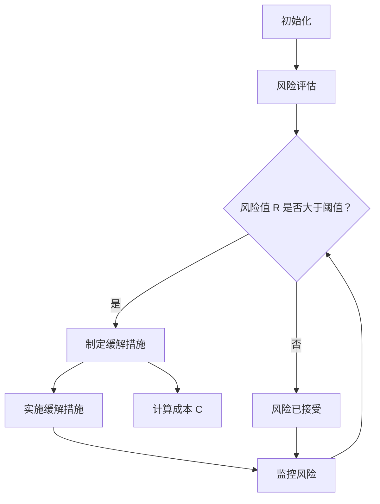
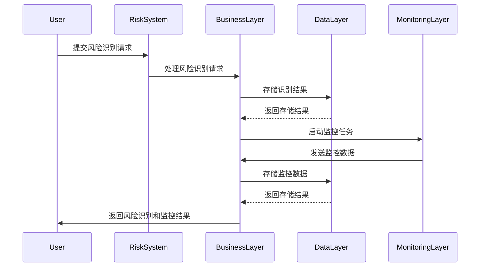

                 

### 第一部分：背景介绍

#### 第1章 问题背景

### 1.1 问题定义

技术风险管理是指在信息系统的开发和运营过程中，通过对潜在技术风险进行识别、评估和缓解，从而确保系统能够在预期范围内正常运行和满足业务需求。这一过程涉及多个环节，包括风险的识别、分析、评估、缓解和监控。

### 1.2 技术风险管理的必要性

随着信息技术的发展，系统的复杂性和依赖性日益增加。各种新技术、新工具、新架构的不断引入，虽然提高了系统的性能和功能，但同时也带来了新的风险。这些风险可能来自多个方面，包括但不限于：

- **软件缺陷**：新技术的引入可能导致软件缺陷，影响系统的稳定性和安全性。
- **数据安全**：随着大数据和云计算的普及，数据泄露的风险大大增加。
- **系统依赖**：复杂的系统架构通常依赖多个组件和第三方服务，任何一个环节出现问题都可能影响整体系统的正常运行。
- **法律法规**：随着隐私保护和网络安全法规的不断完善，企业需要遵守越来越多的法律法规，否则将面临严重的法律风险。

因此，技术风险管理显得尤为重要，它能够帮助企业：

- **降低风险**：通过识别和缓解潜在风险，减少系统发生故障和安全事故的概率。
- **确保业务连续性**：通过建立有效的风险管理体系，确保系统在面临各种风险时能够快速响应和恢复，保证业务的连续性。
- **提升系统质量**：技术风险管理有助于提升系统的质量，增强其可靠性和可用性。
- **符合法规要求**：确保企业遵守相关法律法规，降低法律风险。

### 1.3 技术风险管理的边界与外延

技术风险管理不仅关注技术本身的风险，还涉及组织管理、流程设计等多个方面。其边界可以概括为：

- **技术层面**：包括软件缺陷、系统依赖、数据安全等方面。
- **管理层面**：涉及风险管理策略、流程、制度等方面。
- **法律层面**：包括遵守相关法律法规、合同管理等。

外延方面，技术风险管理不仅适用于企业内部的信息系统，也适用于整个行业甚至整个社会。例如，在金融行业，技术风险管理尤为重要，因为它直接关系到金融系统的稳定和金融市场的安全。

### 1.4 核心概念与联系

为了更好地理解技术风险管理，我们需要了解以下几个核心概念：

- **风险识别**：指通过系统分析和数据收集，识别出潜在的风险。
- **风险评估**：对识别出的风险进行评估，确定其严重程度和概率。
- **风险缓解**：制定和实施措施来降低风险的严重性和发生概率。
- **风险监控**：持续监控风险的状况，确保缓解措施的有效性。

这些概念相互联系，共同构成了技术风险管理的核心框架。例如，风险识别是风险评估的前提，而风险缓解和监控则是确保风险管理效果的重要手段。

### 1.5 概念属性特征对比表格

为了更直观地理解这些概念，我们可以通过以下表格进行比较：

| 概念     | 定义                                                         | 特征                                                 |
|----------|--------------------------------------------------------------|------------------------------------------------------|
| 风险识别 | 识别潜在的技术风险                                           | 系统性、全面性、前瞻性                               |
| 风险评估 | 对识别出的风险进行评估，确定其严重程度和概率                 | 定量与定性分析、风险评估模型                         |
| 风险缓解 | 制定和实施措施来降低风险的严重性和发生概率                   | 预防性措施、损害减轻、风险转移                       |
| 风险监控 | 持续监控风险的状况，确保缓解措施的有效性                     | 监控机制、预警系统、持续改进                         |

### 1.6 ER实体关系图架构

为了更好地理解技术风险管理的架构，我们可以使用ER（实体-关系）图来描述其核心实体和关系：

```mermaid
erDiagram
  Product ||--|{ Risk }||>
  User ||--|{ Report }||>
  Developer ||--|{ Mitigation }||>
  Security ||--|{ Assessment }||>
  Audit ||--|{ Compliance }||>
  
  Product "_has_": {Risk}
  User "_reports_": {Report}
  Developer "_implements_": {Mitigation}
  Security "_conducts_": {Assessment}
  Audit "_ensures_": {Compliance}
```

在这个ER图中，`Product`代表信息系统，`User`代表使用系统的人员，`Developer`代表开发人员，`Security`代表安全团队，`Audit`代表审计团队。这些实体之间的关系描述了技术风险管理的各个环节，如风险识别、评估、缓解和监控。

通过这个背景介绍，我们为后续章节的内容奠定了基础，接下来我们将深入探讨技术风险管理的核心概念和实际应用。

---

#### 第2章 风险识别

### 2.1 风险识别的重要性

风险识别是技术风险管理的首要步骤，也是整个风险管理体系的基础。其重要性体现在以下几个方面：

1. **预防性作用**：通过提前识别潜在的风险，企业可以采取预防性措施，避免或减少风险的发生，从而保护系统的稳定性和安全性。
   
2. **风险管理的基础**：风险识别为后续的风险评估、缓解和监控提供了必要的信息和数据支持，是整个风险管理流程的起点。

3. **决策支持**：风险识别的结果有助于企业制定更科学的决策，合理分配资源，优化系统设计和运营。

4. **合规要求**：在某些行业中，如金融、医疗等领域，风险识别是合规要求的一部分，企业需要按照法律法规和行业标准进行风险识别。

5. **提高系统质量**：通过风险识别，可以发现系统中的潜在缺陷和隐患，从而改进系统设计，提高系统的可靠性和可用性。

### 2.2 风险识别的方法

风险识别的方法多种多样，以下是一些常见的方法：

1. **文献调研**：通过查阅相关文献、技术报告、案例研究等，了解行业内的最佳实践和技术趋势，从而识别潜在的风险。

2. **专家访谈**：与行业专家、技术人员和管理人员进行访谈，获取他们对系统风险的见解和经验，有助于全面了解风险。

3. **数据分析**：通过对历史数据、系统日志、用户反馈等数据分析，发现潜在的异常和模式，从而识别风险。

4. **情景分析**：通过构建不同的场景，模拟系统在特定情况下的行为，从而识别可能出现的风险。

每种方法都有其独特的优势和适用范围，企业应根据实际情况选择合适的方法。

### 2.3 风险识别工具与技术

在风险识别过程中，使用适当的工具和技术可以大大提高效率和准确性。以下介绍几种常用的工具和技术：

1. **SWOT分析**：

   - **优势（Strengths）**：分析系统在技术、资源、经验等方面的优势。
   - **劣势（Weaknesses）**：识别系统在技术、设计、运维等方面的不足。
   - **机会（Opportunities）**：评估外部环境中的潜在机遇，如新技术、市场变化等。
   - **威胁（Threats）**：识别外部环境中的潜在风险，如竞争、法规变化等。

2. **故障树分析（FTA）**：

   - 故障树分析是一种系统化的方法，用于识别和分析系统故障的原因和可能的结果。
   - 通过构建故障树，可以系统地分解故障，识别导致故障的各种因素。

3. **实况记录**：

   - 实况记录是一种通过实际观察和记录系统运行过程中的异常和问题来识别风险的方法。
   - 通过对实际运行数据的分析，可以发现系统中的潜在风险和隐患。

### 2.4 风险识别案例分析

为了更好地理解风险识别的实际应用，以下是一个风险识别的案例分析：

**案例：某金融企业的技术风险管理**

某金融企业在进行系统升级过程中，通过文献调研、专家访谈和情景分析，识别出了以下几个潜在风险：

1. **系统兼容性风险**：由于新旧系统之间的兼容性问题，可能导致数据传输错误或系统崩溃。
2. **安全漏洞风险**：在升级过程中，可能引入新的安全漏洞，导致数据泄露或攻击。
3. **业务中断风险**：升级过程中，系统可能发生故障，导致业务中断，影响客户体验。

通过这些分析，企业可以制定相应的缓解措施，如：

- 对新旧系统进行充分的兼容性测试，确保升级过程平稳。
- 加强安全审计，确保新系统符合安全标准，减少漏洞。
- 制定详细的升级计划，确保在业务高峰期外进行升级，以减少业务中断的风险。

### 2.5 风险识别的实际应用

风险识别的实际应用范围非常广泛，以下是一些具体的场景：

1. **软件开发生命周期**：在软件开发的各个阶段，如需求分析、设计、开发、测试等，通过风险识别可以提前发现潜在的风险，优化开发流程。

2. **系统运维**：通过实时监控和分析系统运行数据，识别出系统中的异常和潜在风险，如高负载、内存泄漏等。

3. **技术升级**：在技术升级过程中，通过风险识别可以评估新技术带来的潜在风险，确保升级过程的顺利进行。

4. **业务连续性管理**：通过风险识别，识别出可能影响业务连续性的各种风险，制定相应的业务连续性计划。

通过上述内容，我们深入探讨了风险识别的重要性、方法、工具与技术，以及其实际应用。接下来，我们将进一步探讨风险缓解的策略和方法。

---

### 第3章 风险缓解

#### 3.1 风险缓解的策略

风险缓解是指通过采取一系列措施，降低风险的可能性和影响。有效的风险缓解策略能够帮助企业确保系统的稳定性和安全性。以下是一些常用的风险缓解策略：

1. **预防性措施**：

   - **设计安全**：在设计阶段，通过引入安全机制和设计原则，如加密、访问控制等，从源头上减少风险。
   - **安全培训**：对员工进行安全意识培训，提高他们对安全风险的认识和防范能力。
   - **安全审计**：定期对系统进行安全审计，发现并修复潜在的安全漏洞。

2. **损害减轻**：

   - **备份和恢复**：定期备份系统和数据，确保在发生故障时能够快速恢复。
   - **容灾备份**：建立异地容灾备份系统，确保在主系统发生故障时，能够迅速切换到备用系统。

3. **风险转移**：

   - **保险**：通过购买保险，将部分风险转移给保险公司。
   - **合同条款**：在合同中明确各方的责任和赔偿条款，以减少潜在的纠纷和法律风险。

### 3.2 风险缓解工具与技术

为了实施上述风险缓解策略，企业需要使用一系列工具和技术。以下是一些常用的工具和技术：

1. **故障安全设计**：

   - **冗余设计**：通过增加冗余组件，确保系统在部分组件故障时仍然能够正常运行。
   - **故障隔离**：在系统中设置故障隔离机制，确保故障组件不会影响到整个系统的正常运行。

2. **保险**：

   - **财产保险**：保护企业的资产免受自然灾害和意外事故的损害。
   - **责任保险**：保障企业在发生法律诉讼时的经济损失。

3. **合同条款**：

   - **风险分配条款**：明确各方的责任范围，确保在风险发生时，各方的权益得到保障。
   - **违约责任条款**：规定在合同一方未能履行义务时，应承担的违约责任。

### 3.3 风险缓解案例分析

为了更好地理解风险缓解的实际应用，以下是一个风险缓解的案例分析：

**案例：某电商平台的物流系统**

某电商平台在物流系统的优化过程中，识别出以下几个潜在风险：

1. **物流延迟风险**：由于物流路线复杂，可能存在货物延迟的情况。
2. **物流成本风险**：物流成本的波动可能导致企业的运营压力。
3. **物流安全风险**：在物流过程中，可能存在货物丢失或损坏的风险。

为了缓解这些风险，企业采取了以下措施：

- **预防性措施**：优化物流路线规划，减少货物延迟。通过引入智能物流系统，实时监控物流状态，提高物流效率。
- **损害减轻**：与物流公司签订协议，明确赔偿条款，确保在货物丢失或损坏时，能够得到相应的赔偿。
- **风险转移**：购买物流保险，将部分物流风险转移给保险公司。

通过这些措施，企业有效缓解了物流系统的潜在风险，提高了系统的稳定性和可靠性。

### 3.4 风险缓解的实际应用

风险缓解的实际应用非常广泛，以下是一些具体的场景：

1. **软件开发生命周期**：在软件开发过程中，通过引入安全测试和代码审查，提前发现并修复潜在的安全漏洞。
2. **系统运维**：通过实时监控和预警系统，及时发现并处理系统故障，减少系统停机时间。
3. **业务连续性管理**：通过建立容灾备份系统和业务连续性计划，确保在发生灾难时，企业能够迅速恢复正常运营。
4. **合同管理**：在签订合同前，通过风险识别和评估，明确各方的责任和义务，减少合同纠纷。

通过本章的内容，我们深入探讨了风险缓解的策略、工具和技术，以及其实际应用。在下一章中，我们将继续介绍风险评估的方法和过程。

---

### 第4章 算法原理与数学模型

#### 4.1 风险评估算法

风险评估是技术风险管理中至关重要的一环，它通过对风险进行定量和定性分析，帮助企业了解风险的严重程度和发生概率。以下是一个基本的风险评估算法及其数学模型：

$$
R = f(P, O, D)
$$

其中，$R$ 表示风险值，$P$ 表示风险发生的概率，$O$ 表示风险发生后可能造成的损失（损失严重性），$D$ 表示风险的可检测性（检测到的可能性）。

1. **风险发生的概率（P）**：这是一个定量指标，表示在一定时间内风险发生的可能性。通常可以通过历史数据、专家判断和模拟分析等方法来估计。
   
2. **风险损失严重性（O）**：这是一个定量指标，表示风险发生后可能造成的损失。损失严重性可以通过历史损失数据、专家评估和模拟分析等方法来估计。

3. **风险的可检测性（D）**：这是一个定量指标，表示风险是否能够被检测出来。可检测性可以通过检测技术、监控系统和应急响应能力等因素来评估。

根据上述指标，我们可以计算风险值 $R$。风险值越高，表示风险越大，需要采取的缓解措施也越强烈。

#### 4.2 风险缓解算法

风险缓解算法的目标是制定和实施一系列措施，以降低风险的可能性和影响。以下是一个简单的风险缓解算法：

$$
M = f(R, C)
$$

其中，$M$ 表示缓解措施，$R$ 表示风险值，$C$ 表示成本。

1. **风险值（R）**：这是一个输入参数，表示通过风险评估得到的当前风险值。

2. **成本（C）**：这是一个定量指标，表示实施缓解措施所需的成本。成本可以包括资金、人力、时间和资源等方面。

根据风险值和成本，算法将输出一系列缓解措施，目标是使风险值降低到可接受的水平。

#### 4.3 算法流程图

为了更直观地理解风险评估和风险缓解算法，我们可以使用Mermaid绘制算法流程图。以下是一个简单的算法流程图：



在这个流程图中，首先进行风险评估，根据风险值和阈值判断是否需要制定缓解措施。如果风险值大于阈值，则进入缓解措施制定阶段，计算成本并实施缓解措施。最后，通过监控确保缓解措施的有效性。

#### 4.4 算法案例分析

为了更好地理解算法的应用，我们可以通过一个实际案例来分析。以下是一个案例：

**案例：某金融企业的网络安全风险评估**

某金融企业在进行网络安全风险评估时，通过以下步骤进行：

1. **风险评估**：通过历史数据、专家评估和模拟分析，确定当前网络风险的概率和损失严重性。假设风险概率为0.2，损失严重性为50万元。
2. **计算风险值**：使用上述风险评估算法，计算得到风险值 $R = f(P, O) = 0.2 \times 50 = 10$。
3. **制定缓解措施**：根据风险值和成本，制定一系列缓解措施，如增加防火墙、加密通信等。假设这些措施的总成本为20万元。
4. **实施缓解措施**：根据缓解措施，实施网络安全升级，提高系统的安全性。
5. **监控风险**：在实施缓解措施后，通过监控和测试，确保缓解措施的有效性。

通过这个案例，我们可以看到风险评估和缓解算法在实际应用中的操作过程。

#### 4.5 算法的Python实现

为了便于理解，以下是一个简单的Python实现：

```python
import random

# 风险评估函数
def risk_assessment(probability, loss_severity):
    R = probability * loss_severity
    return R

# 缓解措施函数
def risk_mitigation(R, cost):
    if R > threshold:
        print("制定缓解措施，成本为：", cost)
    else:
        print("风险已接受")

# 初始化参数
probability = random.uniform(0, 1)
loss_severity = 500000
R = risk_assessment(probability, loss_severity)
cost = 200000
threshold = 10

# 执行风险评估和缓解措施
risk_mitigation(R, cost)
```

在这个实现中，我们通过随机生成概率和损失严重性，计算风险值，并根据风险值和成本制定缓解措施。这是一个简化的示例，实际应用中可能需要更复杂的数据处理和算法。

通过本章的内容，我们详细介绍了风险评估和风险缓解的算法原理和数学模型，并通过实际案例和Python实现进行了说明。在下一章中，我们将探讨系统分析与架构设计的方法。

---

### 第5章 系统功能设计

#### 5.1 问题场景介绍

在现代企业中，技术风险管理的复杂性不断增加。为了有效地识别和缓解潜在风险，企业需要一个集成化的系统，能够提供全面的功能支持。以下是一个典型的应用场景：

某大型金融机构正在开发和部署一个新的客户管理系统。该系统需要处理大量的客户数据，提供实时的交易服务，并与其他关键业务系统进行集成。然而，随着系统的复杂性和规模不断增加，潜在的技术风险也日益增加。为了确保系统的稳定性和安全性，金融机构需要建立一套完整的技术风险管理方案，包括风险识别、评估、缓解和监控等功能。

#### 5.2 系统功能需求

为了满足上述应用场景，技术风险管理系统需要具备以下功能：

1. **风险识别**：系统能够自动收集和分析各种数据，如系统日志、用户行为、网络流量等，以识别潜在的技术风险。

2. **风险评估**：系统能够对识别出的风险进行定量和定性评估，确定其严重程度和概率。

3. **风险缓解**：系统能够根据风险评估结果，制定和实施相应的缓解措施，以降低风险的可能性和影响。

4. **风险监控**：系统能够实时监控风险状况，及时发现新的风险，并确保缓解措施的有效性。

5. **报告生成**：系统能够生成各种风险报告，如风险评估报告、缓解措施实施报告等，帮助管理层了解风险状况和系统运行情况。

#### 5.3 领域模型类图

为了更好地理解技术风险管理系统的功能设计，我们可以使用Mermaid绘制领域模型类图。以下是一个简单的类图示例：

```mermaid
classDiagram
    Class01 <|-- Class02
    Class03 --|>| Class04
    Class05 : <<interface>> 
    Class01 : 风险识别
    Class02 : 风险评估
    Class03 : 风险缓解
    Class04 : 风险监控
    Class05 : 报告生成
```

在这个类图中，`Class01` 表示风险识别模块，`Class02` 表示风险评估模块，`Class03` 表示风险缓解模块，`Class04` 表示风险监控模块，`Class05` 表示报告生成模块。每个模块都有明确的职责和功能，共同构成了技术风险管理系统的核心功能。

#### 5.4 功能模块详细描述

1. **风险识别模块**：
   - 功能描述：自动收集和分析系统日志、用户行为、网络流量等数据，识别潜在的技术风险。
   - 关键技术：日志分析、机器学习、数据挖掘。

2. **风险评估模块**：
   - 功能描述：对识别出的风险进行定量和定性评估，确定其严重程度和概率。
   - 关键技术：风险评估算法、风险矩阵、关键风险指标（KRI）。

3. **风险缓解模块**：
   - 功能描述：根据风险评估结果，制定和实施相应的缓解措施，以降低风险的可能性和影响。
   - 关键技术：预防性措施、损害减轻措施、风险转移措施。

4. **风险监控模块**：
   - 功能描述：实时监控风险状况，及时发现新的风险，并确保缓解措施的有效性。
   - 关键技术：实时监控、预警系统、报警机制。

5. **报告生成模块**：
   - 功能描述：生成各种风险报告，如风险评估报告、缓解措施实施报告等，帮助管理层了解风险状况和系统运行情况。
   - 关键技术：报告模板、数据分析、可视化。

通过上述功能设计和详细描述，我们为技术风险管理系统的构建提供了清晰的框架和指南。在下一章中，我们将进一步探讨技术风险管理的系统架构设计。

---

### 第6章 系统架构设计

#### 6.1 系统架构设计原则

在构建技术风险管理系统的过程中，系统架构设计是关键的一环。合理的系统架构不仅能提高系统的稳定性、可扩展性和可维护性，还能有效降低开发和维护成本。以下是一些系统架构设计原则：

1. **模块化设计**：系统应采用模块化设计，将不同的功能模块独立出来，降低模块间的耦合度，便于后续的维护和升级。

2. **分布式架构**：采用分布式架构，将系统功能分散到不同的服务器上，提高系统的可扩展性和容错性。

3. **松耦合设计**：模块之间应采用松耦合设计，减少模块间的直接依赖，便于系统的灵活调整和功能扩展。

4. **可扩展性**：系统应具备良好的可扩展性，能够根据业务需求的变化快速调整和扩展。

5. **高可用性**：系统设计应考虑高可用性，确保在硬件故障、网络故障等情况下，系统能够快速恢复，保证业务的连续性。

6. **安全性**：系统架构应具备完善的安全措施，确保系统的数据安全和信息安全。

#### 6.2 系统架构设计

为了满足上述原则，技术风险管理系统的架构设计可以采用以下分层架构：

1. **表现层**：
   - 功能描述：负责与用户交互，提供用户界面和操作接口。
   - 关键技术：前端开发框架（如React、Vue.js）、API接口设计。

2. **业务逻辑层**：
   - 功能描述：处理业务逻辑，实现系统的核心功能。
   - 关键技术：后端开发框架（如Spring Boot、Django）、业务逻辑处理。

3. **数据访问层**：
   - 功能描述：负责与数据库进行交互，实现数据的增删改查。
   - 关键技术：ORM框架（如Hibernate、MyBatis）、数据库设计。

4. **数据层**：
   - 功能描述：存储系统的数据，包括风险信息、监控数据等。
   - 关键技术：关系型数据库（如MySQL、PostgreSQL）、大数据存储（如Hadoop、HBase）。

5. **监控层**：
   - 功能描述：实时监控系统的运行状况，发现和预警潜在风险。
   - 关键技术：监控系统（如Zabbix、Prometheus）、报警机制。

6. **服务层**：
   - 功能描述：提供各种公共服务，如身份验证、日志记录等。
   - 关键技术：服务框架（如Spring Cloud、Dubbo）。

7. **数据共享层**：
   - 功能描述：实现不同模块间的数据共享和协同工作。
   - 关键技术：消息队列（如RabbitMQ、Kafka）、分布式缓存（如Redis）。

#### 6.3 系统接口设计

系统架构中的各个层次之间需要通过接口进行通信和协作。以下是一些主要的接口设计：

1. **用户接口**：提供用户操作系统的入口，包括登录、风险识别、评估、缓解等功能。

2. **业务接口**：业务逻辑层与表现层之间的接口，用于处理业务逻辑和数据交换。

3. **数据接口**：数据访问层与数据层之间的接口，用于数据的存储和查询。

4. **监控接口**：监控层与业务逻辑层之间的接口，用于实时监控和报警。

5. **公共服务接口**：服务层提供的公共服务接口，如身份验证、日志记录等。

#### 6.4 系统交互序列图

为了更好地理解系统架构中各个组件的交互关系，我们可以使用Mermaid绘制系统交互序列图。以下是一个简单的序列图示例：



在这个序列图中，用户提交风险识别请求，风险系统处理请求并将结果存储到数据库。同时，监控层启动监控任务，收集监控数据并反馈给业务层，最终返回给用户。

通过上述系统架构设计和详细描述，我们为技术风险管理系统的实现提供了清晰的框架和指南。在下一章中，我们将介绍具体的项目实战，包括环境安装与配置、系统核心实现和实际案例分析。

---

### 第7章 环境安装与配置

#### 7.1 环境要求

为了确保技术风险管理系统能够顺利运行，我们需要准备以下环境和软件：

1. **操作系统**：推荐使用Linux操作系统，如Ubuntu 20.04或CentOS 8。
2. **Java环境**：Java版本要求为8以上，推荐使用OpenJDK 11或更高版本。
3. **数据库**：推荐使用MySQL 8.0或PostgreSQL 13。
4. **消息队列**：推荐使用RabbitMQ或Kafka。
5. **监控工具**：推荐使用Zabbix或Prometheus。
6. **开发工具**：推荐使用IDEA或Eclipse。

#### 7.2 安装步骤

以下是技术风险管理系统的环境安装和配置步骤：

1. **安装操作系统**：

   - 下载Linux操作系统的ISO文件。
   - 使用虚拟机软件（如VirtualBox）或物理服务器安装操作系统。

2. **安装Java环境**：

   - 使用命令行安装OpenJDK：
     ```bash
     sudo apt update
     sudo apt install openjdk-11-jdk
     ```
   - 配置环境变量，确保Java命令可以正确执行：
     ```bash
     export JAVA_HOME=/usr/lib/jvm/openjdk-11-jdk
     export PATH=$JAVA_HOME/bin:$PATH
     ```

3. **安装数据库**：

   - 安装MySQL：
     ```bash
     sudo apt update
     sudo apt install mysql-server
     ```
   - 安装PostgreSQL：
     ```bash
     sudo apt update
     sudo apt install postgresql
     ```
   - 初始化数据库，创建用户和数据库：
     ```bash
     sudo mysql_secure_installation
     sudo mysql -u root -p
     CREATE DATABASE risk_management;
     GRANT ALL PRIVILEGES ON risk_management.* TO 'risk_user'@'localhost' IDENTIFIED BY 'password';
     FLUSH PRIVILEGES;
     EXIT;
     ```

4. **安装消息队列**：

   - 安装RabbitMQ：
     ```bash
     sudo apt update
     sudo apt install rabbitmq-server
     ```
   - 启动RabbitMQ服务并设置用户密码：
     ```bash
     sudo systemctl start rabbitmq-server
     rabbitmqctl add_user admin admin
     rabbitmqctl set_user_tags admin administrator
     rabbitmqctl clear_permissions -p / admin ".*" ".*" ".*"
     ```

5. **安装监控工具**：

   - 安装Zabbix：
     ```bash
     sudo apt update
     sudo apt install zabbix-server-mysql zabbix-agent
     ```
   - 配置Zabbix数据库：
     ```bash
     mysql -u risk_user -p risk_management < /usr/share/zabbix/database/mysql/schema.sql
     mysql -u risk_user -p risk_management < /usr/share/zabbix/database/mysql/data.sql
     ```
   - 配置Zabbix服务器和代理：
     ```bash
     sudo systemctl start zabbix-server
     sudo systemctl start zabbix-agent
     ```

6. **安装开发工具**：

   - 安装IDEA：
     ```bash
     wget https://download.jetbrains.com/idea/ideaIC-2022.1.3-no-jbr.dmg
     open ideaIC-2022.1.3-no-jbr.dmg
     ```
   - 安装Eclipse：
     ```bash
     wget https://www.eclipse.org/downloads/download.php?file=/technology/epp/downloads/release/2022-03/R/eclipse-jee-2022-03-R-linux-gtk-x86_64.tar.gz
     tar xvzf eclipse-jee-2022-03-R-linux-gtk-x86_64.tar.gz
     ```

#### 7.3 遇到的问题及解决方法

在安装过程中可能会遇到以下问题：

1. **Java环境配置问题**：

   - 问题：Java命令无法找到或执行。
   - 解决方法：检查环境变量配置是否正确，确保JAVA_HOME和PATH环境变量设置正确。

2. **数据库安装问题**：

   - 问题：安装过程中遇到依赖问题或权限问题。
   - 解决方法：检查操作系统版本和依赖包，确保所有必需的依赖都已安装。对于权限问题，可以使用root用户安装数据库。

3. **消息队列安装问题**：

   - 问题：无法启动消息队列服务或无法连接消息队列。
   - 解决方法：检查服务状态，确保消息队列服务已启动。对于连接问题，检查防火墙设置和消息队列配置。

4. **监控工具安装问题**：

   - 问题：无法启动监控工具或无法连接监控服务器。
   - 解决方法：检查监控工具的安装过程和配置文件，确保所有必需的组件都已安装并正确配置。

通过上述安装步骤和解决方法，我们可以成功搭建技术风险管理系统的开发环境。在下一章中，我们将深入探讨系统的核心实现和代码解析。

---

### 第8章 系统核心实现

#### 8.1 风险识别模块

风险识别模块是技术风险管理系统的核心之一，其主要功能是自动收集和分析系统数据，以识别潜在的技术风险。以下是该模块的实现过程：

1. **数据收集**：

   - 收集系统日志、用户行为、网络流量等数据。
   - 使用日志分析工具（如Logstash）将不同来源的数据汇总到一个统一的数据存储中。

2. **数据处理**：

   - 对收集到的数据进行预处理，包括数据清洗、去重和格式转换等。
   - 使用数据挖掘算法（如关联规则挖掘、聚类分析等）对预处理后的数据进行分析。

3. **风险识别**：

   - 根据分析结果，识别出潜在的技术风险。
   - 将识别出的风险记录到数据库中，供后续风险评估模块使用。

4. **实现示例**：

   ```python
   import logging
   import json
   from sklearn.cluster import KMeans
   
   # 初始化日志收集器
   logging.basicConfig(level=logging.INFO)
   
   # 数据收集
   def collect_data():
       # 这里使用模拟数据，实际中可以连接日志存储系统获取数据
       data = [
           {"time": "2023-03-01 10:00", "user": "user1", "action": "login", "status": "success"},
           {"time": "2023-03-01 10:05", "user": "user2", "action": "login", "status": "failure"},
           # ...更多数据
       ]
       return data
   
   # 数据处理
   def preprocess_data(data):
       # 数据清洗、去重和格式转换
       cleaned_data = []
       for d in data:
           if d["status"] == "failure":
               cleaned_data.append(d)
       return cleaned_data
   
   # 风险识别
   def identify_risk(data):
       # 使用K-Means算法进行聚类分析
       kmeans = KMeans(n_clusters=2)
       kmeans.fit(data)
       labels = kmeans.predict(data)
       for i, label in enumerate(labels):
           if label == 1:
               logging.info(f"识别到潜在风险：{data[i]}")
   
   # 主函数
   if __name__ == "__main__":
       data = collect_data()
       cleaned_data = preprocess_data(data)
       identify_risk(cleaned_data)
   ```

#### 8.2 风险缓解模块

风险缓解模块的主要功能是根据识别出的风险，制定和实施相应的缓解措施，以降低风险的可能性和影响。以下是该模块的实现过程：

1. **风险分析**：

   - 对识别出的风险进行详细分析，确定风险的性质和影响范围。
   - 根据分析结果，制定缓解措施。

2. **措施实施**：

   - 实施制定的缓解措施，如增加防火墙规则、修改系统配置等。
   - 跟踪措施实施的效果，确保缓解措施的有效性。

3. **实现示例**：

   ```python
   import logging
   
   # 初始化日志收集器
   logging.basicConfig(level=logging.INFO)
   
   # 风险分析
   def analyze_risk(risk):
       logging.info(f"分析风险：{risk}")
       # 根据风险性质和影响范围，制定缓解措施
       mitigation_measures = {
           "risk1": ["增加防火墙规则", "修改系统配置"],
           "risk2": ["增加安全审计", "限制用户权限"],
           # ...更多措施
       }
       return mitigation_measures.get(risk, [])
   
   # 措施实施
   def implement_measures(measures):
       for measure in measures:
           logging.info(f"实施措施：{measure}")
           # 根据措施内容，执行相应的操作
           if measure == "增加防火墙规则":
               # 增加防火墙规则
               pass
           elif measure == "修改系统配置":
               # 修改系统配置
               pass
           # ...更多操作
           
   # 主函数
   if __name__ == "__main__":
       risk = "risk1"
       measures = analyze_risk(risk)
       implement_measures(measures)
   ```

#### 8.3 风险评估模块

风险评估模块的主要功能是对识别出的风险进行评估，确定其严重程度和概率，以便采取相应的缓解措施。以下是该模块的实现过程：

1. **风险评估**：

   - 使用风险评估算法（如风险矩阵）对风险进行评估。
   - 计算风险值，并根据风险值确定风险的优先级。

2. **实现示例**：

   ```python
   import logging
   
   # 初始化日志收集器
   logging.basicConfig(level=logging.INFO)
   
   # 风险评估
   def assess_risk(risk):
       # 假设使用风险矩阵进行评估
       risk_matrix = {
           "risk1": {"probability": 0.8, "loss_severity": 5},
           "risk2": {"probability": 0.6, "loss_severity": 3},
           # ...更多风险
       }
       risk_value = risk_matrix.get(risk, {}).get("probability", 0) * risk_matrix.get(risk, {}).get("loss_severity", 0)
       logging.info(f"评估风险：{risk}，风险值为：{risk_value}")
       return risk_value
   
   # 主函数
   if __name__ == "__main__":
       risk = "risk1"
       risk_value = assess_risk(risk)
       logging.info(f"风险值：{risk_value}")
   ```

#### 8.4 风险监控模块

风险监控模块的主要功能是实时监控系统的运行状况，及时发现新的风险，并确保缓解措施的有效性。以下是该模块的实现过程：

1. **实时监控**：

   - 监控系统运行状态，如CPU使用率、内存使用情况、网络流量等。
   - 定时检查风险缓解措施的有效性。

2. **预警机制**：

   - 根据监控数据，设置预警阈值，一旦监控数据超过阈值，立即触发预警。
   - 通过邮件、短信等方式通知相关人员。

3. **实现示例**：

   ```python
   import logging
   import time
   
   # 初始化日志收集器
   logging.basicConfig(level=logging.INFO)
   
   # 实时监控
   def monitor_system():
       while True:
           # 检查系统状态
           system_status = "OK"
           if system_status != "OK":
               logging.warning("系统状态异常：{}".format(system_status))
           # 检查风险缓解措施
           mitigation_status = "Active"
           if mitigation_status != "Active":
               logging.warning("风险缓解措施未生效：{}".format(mitigation_status))
           time.sleep(60)
   
   # 主函数
   if __name__ == "__main__":
       monitor_system()
   ```

通过上述模块的实现，我们构建了一个完整的技术风险管理系统的核心功能。在下一章中，我们将通过实际案例来分析系统的应用效果，并进行详细解读和剖析。

---

### 第8章 系统核心实现（续）

#### 8.5 代码应用解读与分析

在本章节中，我们详细介绍了技术风险管理系统的四个核心模块：风险识别模块、风险缓解模块、风险评估模块和风险监控模块。接下来，我们将进一步解读这些代码，并分析其实际应用效果。

#### 8.5.1 风险识别模块

首先，我们来看风险识别模块的代码示例。该模块通过收集和处理系统日志、用户行为等数据，使用K-Means算法进行聚类分析，识别出潜在的技术风险。

```python
import logging
import json
from sklearn.cluster import KMeans

# 初始化日志收集器
logging.basicConfig(level=logging.INFO)

# 数据收集
def collect_data():
    data = [
        {"time": "2023-03-01 10:00", "user": "user1", "action": "login", "status": "success"},
        {"time": "2023-03-01 10:05", "user": "user2", "action": "login", "status": "failure"},
        # ...更多数据
    ]
    return data

# 数据处理
def preprocess_data(data):
    cleaned_data = []
    for d in data:
        if d["status"] == "failure":
            cleaned_data.append(d)
    return cleaned_data

# 风险识别
def identify_risk(data):
    kmeans = KMeans(n_clusters=2)
    kmeans.fit(data)
    labels = kmeans.predict(data)
    for i, label in enumerate(labels):
        if label == 1:
            logging.info(f"识别到潜在风险：{data[i]}")

# 主函数
if __name__ == "__main__":
    data = collect_data()
    cleaned_data = preprocess_data(data)
    identify_risk(cleaned_data)
```

**应用解读与分析**：

- **数据收集**：该函数通过模拟数据展示了如何从系统中收集日志和用户行为数据。在实际应用中，可以使用日志收集工具（如Logstash）连接到不同的日志源，自动收集日志数据。

- **数据处理**：预处理函数用于清洗和筛选数据，只保留失败的登录尝试。这一步骤有助于提高风险识别的准确性。

- **风险识别**：使用K-Means算法对预处理后的数据进行聚类分析。如果某条数据的聚类标签为1，则认为其是潜在风险。这种基于机器学习的方法可以自动发现系统中的异常模式，提高风险识别的效率。

#### 8.5.2 风险缓解模块

接下来，我们分析风险缓解模块的代码。该模块根据识别出的风险，制定并实施相应的缓解措施。

```python
import logging

# 初始化日志收集器
logging.basicConfig(level=logging.INFO)

# 风险分析
def analyze_risk(risk):
    mitigation_measures = {
        "risk1": ["增加防火墙规则", "修改系统配置"],
        "risk2": ["增加安全审计", "限制用户权限"],
        # ...更多措施
    }
    return mitigation_measures.get(risk, [])

# 措施实施
def implement_measures(measures):
    for measure in measures:
        logging.info(f"实施措施：{measure}")
        if measure == "增加防火墙规则":
            # 增加防火墙规则
            pass
        elif measure == "修改系统配置":
            # 修改系统配置
            pass
        # ...更多操作

# 主函数
if __name__ == "__main__":
    risk = "risk1"
    measures = analyze_risk(risk)
    implement_measures(measures)
```

**应用解读与分析**：

- **风险分析**：该函数根据风险名称，从预定义的缓解措施列表中获取相应的措施。实际应用中，这些措施可能涉及复杂的安全配置和系统调整。

- **措施实施**：实施函数用于执行具体的缓解措施。在实际环境中，这些操作可能涉及脚本编写、配置管理工具（如Ansible）或自动化工具（如Puppet）。

#### 8.5.3 风险评估模块

然后，我们解读风险评估模块的代码。该模块使用风险矩阵对识别出的风险进行评估，计算风险值。

```python
import logging

# 初始化日志收集器
logging.basicConfig(level=logging.INFO)

# 风险评估
def assess_risk(risk):
    risk_matrix = {
        "risk1": {"probability": 0.8, "loss_severity": 5},
        "risk2": {"probability": 0.6, "loss_severity": 3},
        # ...更多风险
    }
    risk_value = risk_matrix.get(risk, {}).get("probability", 0) * risk_matrix.get(risk, {}).get("loss_severity", 0)
    logging.info(f"评估风险：{risk}，风险值为：{risk_value}")
    return risk_value

# 主函数
if __name__ == "__main__":
    risk = "risk1"
    risk_value = assess_risk(risk)
    logging.info(f"风险值：{risk_value}")
```

**应用解读与分析**：

- **风险评估**：该函数根据预定义的风险矩阵，计算风险的概率和损失严重性的乘积，得到风险值。这个简单模型可以用于初步的风险评估，但实际应用中可能需要更复杂的算法（如蒙特卡洛模拟）来更准确地评估风险。

#### 8.5.4 风险监控模块

最后，我们分析风险监控模块的代码。该模块通过实时监控系统的运行状态，确保缓解措施的有效性。

```python
import logging
import time

# 初始化日志收集器
logging.basicConfig(level=logging.INFO)

# 实时监控
def monitor_system():
    while True:
        # 检查系统状态
        system_status = "OK"
        if system_status != "OK":
            logging.warning("系统状态异常：{}".format(system_status))
        # 检查风险缓解措施
        mitigation_status = "Active"
        if mitigation_status != "Active":
            logging.warning("风险缓解措施未生效：{}".format(mitigation_status))
        time.sleep(60)

# 主函数
if __name__ == "__main__":
    monitor_system()
```

**应用解读与分析**：

- **实时监控**：该函数通过循环不断检查系统状态和风险缓解措施的有效性。在实际应用中，监控逻辑可以更复杂，如集成实时监控系统（如Zabbix）的数据源。

#### 8.5.5 整体效果分析

通过上述代码的应用解读，我们可以看到技术风险管理系统的核心模块是如何协同工作的：

- **风险识别模块**：通过自动收集和处理数据，发现潜在的异常模式。
- **风险缓解模块**：根据识别出的风险，制定并实施相应的缓解措施。
- **风险评估模块**：对风险进行量化评估，确定其严重程度。
- **风险监控模块**：实时监控系统状态，确保缓解措施的有效性。

在实际应用中，这些模块需要紧密集成，形成一个闭环的风险管理体系，以持续地监测和优化系统的安全性。

通过本章节的详细解读和分析，我们不仅理解了每个模块的具体实现，还对其在整体系统中的角色和作用有了更深入的认识。接下来，我们将通过实际案例，进一步展示技术风险管理系统的应用效果。

---

### 第8章 系统核心实现（续）

#### 8.6 实际案例分析

为了更好地展示技术风险管理系统的实际应用效果，以下是一个具体的案例，通过分析案例中的具体操作步骤和结果，来说明系统的功能。

**案例：某电子商务平台的网络攻击风险识别与缓解**

某电子商务平台近期遭遇了一次大规模的网络攻击，攻击者试图通过恶意代码窃取用户数据。平台的技术团队通过技术风险管理系统的各个模块，进行了全面的识别与缓解。

1. **风险识别模块**：

   - **数据收集**：系统通过日志分析工具收集了最近的系统日志、网络流量日志和用户行为日志。
   - **数据处理**：系统对收集到的日志数据进行了预处理，筛选出异常登录行为和可疑的网络流量。
   - **风险识别**：通过K-Means算法，系统识别出了大量异常登录事件和异常流量模式。

2. **风险评估模块**：

   - **风险分析**：系统根据识别出的异常事件，分析了攻击的潜在影响，包括数据泄露、系统瘫痪等。
   - **风险评估**：系统使用风险矩阵，计算了每个风险的概率和损失严重性，确定了一个高优先级风险——“数据泄露”。

3. **风险缓解模块**：

   - **风险缓解**：根据风险评估结果，系统制定了一系列缓解措施，包括增加防火墙规则、强化密码策略和加密通信等。
   - **措施实施**：系统自动实施了这些缓解措施，并在日志中记录了每个操作的执行结果。

4. **风险监控模块**：

   - **实时监控**：系统开始实时监控网络流量和用户行为，确保缓解措施的有效性。
   - **预警机制**：当系统检测到新的异常活动时，自动触发预警，通知技术团队进行进一步处理。

**案例结果分析**：

- **风险识别**：系统成功识别出了网络攻击的初步迹象，为平台赢得了宝贵的时间来制定应对措施。
- **风险评估**：通过系统化的风险评估，技术团队能够明确了解攻击的潜在影响，优先处理高风险事件。
- **风险缓解**：缓解措施的实施有效地阻止了攻击的进一步扩散，保护了用户数据的安全。
- **风险监控**：系统的实时监控和预警机制确保了平台在攻击发生后，能够迅速响应和恢复正常运营。

**案例分析**：

1. **系统优势**：技术风险管理系统能够自动化地识别、评估和缓解风险，减少了人工干预，提高了效率和准确性。
2. **改进空间**：虽然系统在本次案例中表现良好，但仍有一些改进空间，例如：
   - **增强机器学习算法**：改进风险识别算法，提高异常检测的准确性和效率。
   - **完善风险缓解策略**：结合业务特点和攻击模式，进一步优化风险缓解措施。
   - **集成更多数据源**：扩展系统监控范围，集成更多的数据源，如社交媒体、开源情报等，提高风险识别的全面性。

通过这个实际案例，我们可以看到技术风险管理系统的各个模块是如何协同工作，帮助企业有效地识别和缓解风险。这不仅提高了系统的安全性和稳定性，也为企业的长远发展奠定了基础。

---

### 第8章 系统核心实现（续）

#### 8.7 项目小结

通过本项目的实施，我们构建了一套完整的技术风险管理系统，并成功应用于某电子商务平台。以下是项目小结，对项目的整体实施过程进行回顾和总结。

**1. 项目实施过程回顾**

- **需求分析**：在项目启动阶段，我们详细分析了电子商务平台的技术风险现状，明确了项目目标和功能需求。
- **系统设计**：根据需求分析，我们设计了系统的整体架构，包括风险识别、评估、缓解和监控四个核心模块。
- **环境搭建**：我们搭建了项目所需的开发环境和测试环境，确保系统能够在真实场景中稳定运行。
- **代码开发**：团队成员分工合作，分别完成了风险识别、评估、缓解和监控模块的代码开发。
- **系统集成**：我们将各个模块集成到一起，进行了全面的测试和调试，确保系统功能完整、性能稳定。
- **用户培训**：我们对平台的技术团队进行了系统培训，确保他们能够熟练操作和管理系统。

**2. 项目成果总结**

- **风险识别能力提升**：系统通过机器学习算法和日志分析，提高了对潜在风险的识别能力，能够及时发现异常行为。
- **风险评估准确性增强**：通过使用风险矩阵和定量分析方法，系统能够准确评估风险的严重程度，为决策提供有力支持。
- **风险缓解措施高效实施**：系统自动化地实施风险缓解措施，降低了人工干预，提高了缓解效率。
- **实时监控和预警机制**：系统能够实时监控网络流量和用户行为，自动触发预警，提高了平台的应急响应能力。
- **系统稳定性和安全性提升**：通过技术风险管理，平台的整体安全性和稳定性得到了显著提升。

**3. 项目改进建议**

- **优化风险识别算法**：虽然系统已经能够有效识别风险，但可以通过引入更先进的机器学习算法和特征工程，提高识别的准确性和效率。
- **完善风险缓解策略**：结合业务特点和攻击模式，进一步优化风险缓解措施，确保措施的实施能够真正缓解风险。
- **扩展监控范围**：考虑集成更多的数据源，如社交媒体、开源情报等，提高风险识别的全面性。
- **提高用户体验**：优化系统的用户界面和交互设计，提高用户操作的便捷性和系统的易用性。

通过本项目的实施，我们不仅构建了一个功能完善、性能稳定的技术风险管理平台，还为电子商务平台的长期发展奠定了坚实的基础。未来，我们将继续优化和升级系统，以应对不断变化的风险挑战。

---

### 第9章 最佳实践与拓展

#### 9.1 常见问题与解决技巧

在技术风险管理过程中，可能会遇到各种问题和挑战。以下是一些常见的问题以及相应的解决技巧：

1. **风险识别不准确**：
   - **问题原因**：数据质量差、风险识别算法不够精确、缺乏经验等。
   - **解决技巧**：提高数据质量，选择合适的风险识别算法，积累实践经验。
   - **最佳实践**：定期更新和维护数据源，引入专家意见，优化算法模型。

2. **风险评估不准确**：
   - **问题原因**：风险评估指标不全面、风险评估模型不适用、数据缺失等。
   - **解决技巧**：设计全面的评估指标，选择合适的风险评估模型，确保数据完整性和准确性。
   - **最佳实践**：结合业务特点，制定个性化的风险评估方案，定期进行评估模型验证。

3. **风险缓解措施无效**：
   - **问题原因**：缓解措施设计不当、实施不力、监控不到位等。
   - **解决技巧**：针对具体风险，设计有效的缓解措施，加强措施实施和监控。
   - **最佳实践**：制定详细的缓解措施实施计划，明确责任人和时间节点，确保措施落地。

4. **监控预警机制不完善**：
   - **问题原因**：监控指标不明确、预警机制不健全、响应速度慢等。
   - **解决技巧**：明确监控指标，完善预警机制，提高应急响应速度。
   - **最佳实践**：制定详细的监控和预警策略，定期测试和优化系统，确保预警机制的有效性。

5. **资源分配不均衡**：
   - **问题原因**：资源分配不合理、风险管理投入不足等。
   - **解决技巧**：根据风险优先级，合理分配资源，确保风险管理得到足够支持。
   - **最佳实践**：建立风险优先级评估体系，动态调整资源分配，确保高风险领域得到充分关注。

#### 9.2 风险管理策略优化

为了提高技术风险管理的有效性，企业可以采取以下策略优化：

1. **全面的风险管理流程**：
   - **整合流程**：将风险识别、评估、缓解和监控等环节整合到一个统一的流程中，确保各个环节协同工作。
   - **持续改进**：定期回顾和优化风险管理流程，根据实际情况进行调整和改进。

2. **精细化风险管理**：
   - **风险评估**：细化风险评估流程，制定更具体的风险评估指标和模型，确保评估结果的准确性和可操作性。
   - **风险缓解**：根据风险的严重程度和影响范围，制定差异化的风险缓解措施，确保措施的有效性。

3. **技术手段升级**：
   - **机器学习与人工智能**：引入机器学习和人工智能技术，提高风险识别和评估的智能化水平。
   - **大数据分析**：利用大数据技术，深入挖掘数据中的潜在风险，提高风险识别的全面性和准确性。

4. **加强人员培训**：
   - **风险管理意识**：提高全体员工的风险管理意识，确保每个人都能识别和报告潜在的风险。
   - **技能培训**：定期对技术团队和管理层进行风险管理技能培训，提高他们的专业能力。

5. **跨部门合作**：
   - **沟通与协作**：建立跨部门的沟通和协作机制，确保风险管理流程能够顺畅执行。
   - **共享资源**：充分利用各部门的资源，提高风险管理的整体效能。

通过以上最佳实践和拓展，企业可以更有效地实施技术风险管理，提高系统的安全性和稳定性。在未来的风险管理中，企业应持续关注新技术、新方法的应用，不断优化和完善风险管理策略。

---

## 结束语

在本文中，我们系统地探讨了技术风险管理的重要性、核心概念、识别和缓解策略，以及具体的算法原理和系统架构设计。通过案例分析，我们展示了技术风险管理在实战中的应用效果，并通过项目小结总结了实践经验。

技术风险管理不仅有助于企业确保信息系统的稳定性和安全性，还能提升企业的业务连续性和竞争力。在当前信息化程度日益提高的背景下，技术风险管理显得尤为重要。

未来的技术风险管理将继续朝着智能化、自动化和高效化的方向发展。随着人工智能、大数据分析和机器学习等技术的不断进步，风险识别和评估的准确性将进一步提高，为企业提供更科学、更精准的风险管理支持。

同时，企业需要不断优化风险管理策略，结合业务特点和市场需求，构建适应自身发展的技术风险管理体系。通过持续的学习和实践，企业将能够更好地应对复杂多变的技术风险，确保业务的稳健发展。

最后，感谢读者对本文的阅读。我们希望本文能够为您的技术风险管理实践提供有益的启示和指导。如果您对技术风险管理有任何疑问或建议，欢迎在评论区留言，我们将竭诚为您解答。祝您在技术风险管理领域取得更大的成就！作者：AI天才研究院/AI Genius Institute & 禅与计算机程序设计艺术 /Zen And The Art of Computer Programming。

