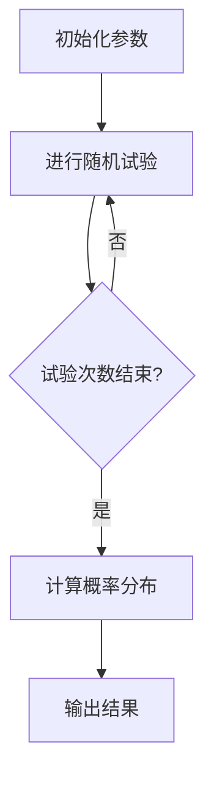
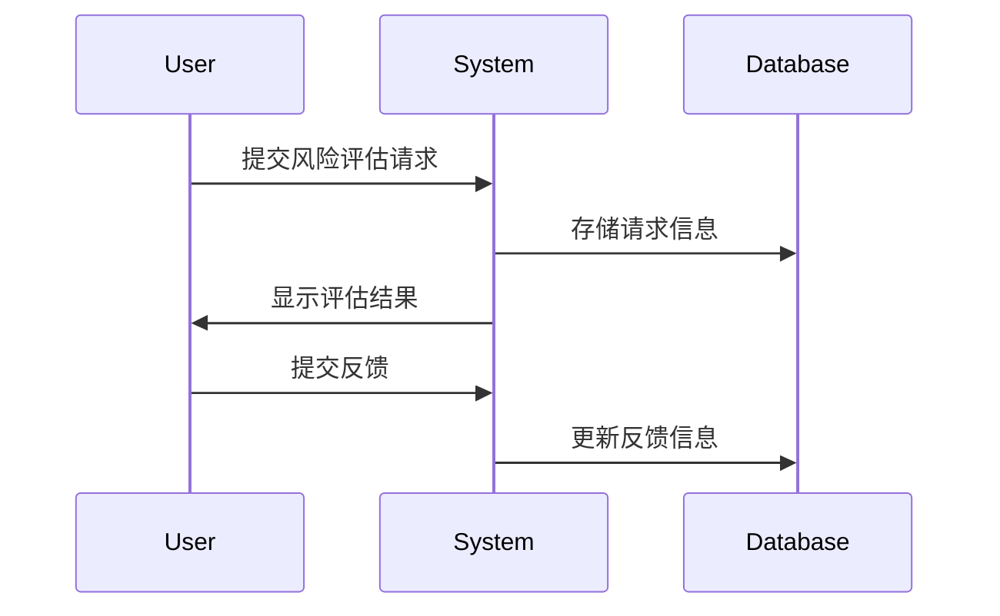
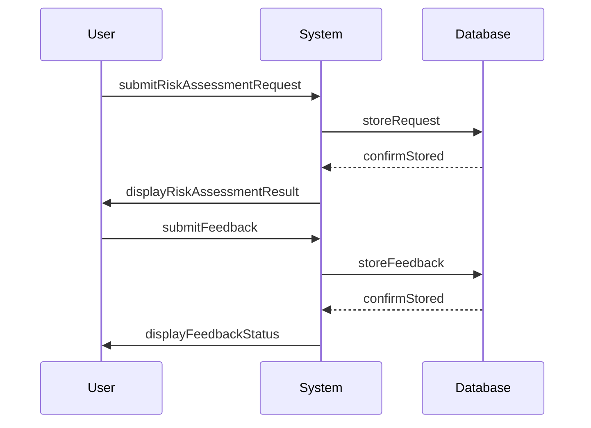

                 

# 技术风险评估与管理

> 关键词：技术风险、风险评估、风险管理、算法、系统架构、最佳实践

> 摘要：本文深入探讨技术风险评估与管理，从核心概念、算法原理、系统设计与实现，到最佳实践与未来趋势，全面解析技术风险管理的各个方面，旨在为IT行业从业者提供一套系统性的风险管理方法和实用技巧。

----------------------------------------------------------------

## 引言

在现代IT行业中，技术风险评估与管理已成为不可或缺的一环。随着技术的发展，项目复杂度的增加，技术风险的存在成为了企业面临的一个重大挑战。技术风险可能来自技术本身、项目执行过程中的不确定性，以及外部环境的变化等多方面。有效的技术风险评估与管理不仅能够帮助企业降低项目风险，还能提高项目的成功率，确保项目的顺利实施。

### 技术风险评估的概念与重要性

技术风险评估是指对技术项目在开发、运营和维护过程中可能面临的风险进行评估、识别、分析和处理的过程。其主要目的是提前发现潜在的技术风险，评估其可能带来的影响和发生的概率，并采取相应的预防和应对措施，以降低风险发生的概率和影响程度。

技术风险评估的重要性体现在以下几个方面：

1. **预防风险**：通过评估和识别潜在的技术风险，企业可以在项目初期采取预防措施，避免风险的发生。
2. **降低损失**：即使在风险不可避免的情况下，有效的风险管理可以降低风险带来的损失。
3. **提高项目成功率**：通过系统化的风险评估，企业可以更科学地分配资源和时间，确保项目按时完成。
4. **提升团队协作**：风险管理需要多部门、多层次的协作，有助于提升团队之间的沟通和协作效率。

### 技术风险管理的挑战

尽管技术风险评估与管理的重要性显而易见，但实际操作中仍面临诸多挑战：

1. **复杂性与不确定性**：技术的复杂性和不确定性使得风险识别和评估变得更加困难。
2. **信息不足**：在项目初期，关于技术细节和外部环境的信息可能不足，影响风险评估的准确性。
3. **资源限制**：企业可能因为预算或人力资源的限制，无法进行全面的风险评估。
4. **跨部门协作**：技术风险管理涉及多个部门，需要跨部门协作，沟通成本较高。

### 风险管理的框架与流程

为了应对上述挑战，企业需要构建一个系统化的风险管理框架和流程。一般而言，技术风险管理的框架包括以下几个步骤：

1. **风险识别**：通过调研、访谈、文档审查等方式，识别项目中可能存在的风险。
2. **风险评估**：使用定量和定性的方法，对识别出的风险进行评估，确定其概率和影响程度。
3. **风险处理**：根据风险评估的结果，制定相应的风险处理策略，如风险规避、转移、减轻或接受。
4. **风险监控**：在项目执行过程中，持续监控风险的变化，及时调整风险处理策略。
5. **风险报告**：定期向管理层和项目团队报告风险状况，确保决策透明和及时。

## 核心概念与联系

### 技术风险的分类

技术风险可以按照不同的维度进行分类，常见的分类方法包括：

1. **技术复杂性**：技术实现的复杂性、系统的集成难度等。
2. **外部环境**：技术标准变化、法规政策、市场竞争等。
3. **人力资源**：技术团队的专业能力、经验、人员流动等。
4. **技术成熟度**：新技术的成熟度和稳定性。

### 风险度量方法

风险度量是技术风险评估的核心步骤之一，常用的风险度量方法包括：

1. **定性度量**：通过专家评估、检查表等方式，对风险进行定性描述。
2. **定量度量**：使用数学模型和算法，对风险的概率和影响进行定量评估。

### 风险评估框架

风险评估框架通常包括以下几个步骤：

1. **识别风险**：确定项目中可能存在的风险。
2. **分析风险**：评估风险的概率和影响。
3. **处理风险**：制定和实施风险处理策略。
4. **监控风险**：跟踪风险的变化，及时调整处理策略。

### Mermaid ER实体关系图架构

Mermaid是一种方便绘制作图的语言，常用于绘制实体关系图（ER图）。在技术风险评估中，ER图可以帮助我们清晰地表示不同实体之间的关系。以下是一个简化的ER图示例：

```mermaid
erDiagram
    Customer ||--|{ Order }|-- Producer
    Product  ||--|{ Review }|-- Customer
```

在这个ER图中，`Customer`（客户）与`Order`（订单）之间存在一对一的关系，而`Product`（产品）与`Review`（评论）之间存在一对多的关系。

----------------------------------------------------------------

## 数学模型与算法原理

在技术风险评估中，数学模型和算法的应用至关重要。它们不仅能够帮助我们量化风险，还能够提供决策支持。以下将介绍几种常见的技术风险评估算法，并使用Mermaid绘制相应的流程图，以帮助读者更好地理解。

### 常见风险评估算法

1. **蒙特卡洛模拟法**：通过模拟大量随机试验，估计风险的概率分布。
2. **贝叶斯网络法**：使用概率图模型来表示和处理不确定性。
3. **敏感性分析法**：分析不同因素对风险评估结果的影响程度。

### 算法mermaid流程图

下面以蒙特卡洛模拟法为例，展示其Mermaid流程图：



### Python源代码与算法解释

为了更直观地理解蒙特卡洛模拟法的应用，我们将使用Python编写一个简单的示例：

```python
import numpy as np

# 初始化参数
num_trials = 10000
mean = 0
std_dev = 1

# 进行随机试验
results = np.random.normal(mean, std_dev, num_trials)

# 计算概率分布
probabilities = np.histogram(results, bins=50)[0] / num_trials

# 输出结果
print("概率分布：", probabilities)
```

在这个示例中，我们使用了`numpy`库来生成随机数，并使用`histogram`函数计算概率分布。通过多次实验，我们可以得到风险的概率分布，从而对风险进行量化。

### 数学模型与公式讲解

蒙特卡洛模拟法的数学基础是概率论中的大数定律。大数定律表明，当实验次数足够多时，样本均值的分布将趋近于总体均值。具体来说，假设X1, X2, ..., Xn是独立同分布的随机变量，那么：

$$
\frac{1}{n}\sum_{i=1}^{n} X_i \xrightarrow{P} E(X)
$$

其中，$\xrightarrow{P}$表示概率收敛，E(X)是X的期望值。

在蒙特卡洛模拟中，我们将随机变量X的期望值表示为均值μ，标准差表示为σ。那么，上述公式可以变形为：

$$
\bar{X} = \frac{1}{n}\sum_{i=1}^{n} X_i \approx \mu
$$

通过模拟大量的随机试验，我们可以估计出样本均值$\bar{X}$，并将其作为总体均值μ的估计值。

### 举例说明

假设我们正在评估一个软件开发项目的风险，其中关键性能指标（KPI）是项目的交付时间。我们假设交付时间服从正态分布，均值为50天，标准差为10天。为了估计项目交付时间的概率分布，我们可以使用蒙特卡洛模拟法进行模拟。

首先，我们生成10000个随机数，模拟10000个可能的交付时间。然后，我们使用这些随机数计算概率分布，并绘制相应的概率密度函数（PDF）。

```python
import numpy as np
import matplotlib.pyplot as plt

# 初始化参数
mean = 50
std_dev = 10
num_trials = 10000

# 进行随机试验
results = np.random.normal(mean, std_dev, num_trials)

# 计算概率分布
probabilities, bin_edges = np.histogram(results, bins=50)

# 计算概率密度函数
pdf = probabilities / (std_dev * np.sqrt(2 * np.pi))

# 绘制概率密度函数
plt.plot(bin_edges[1:], pdf)
plt.xlabel('Delivery Time (days)')
plt.ylabel('Probability Density')
plt.title('Probability Distribution of Project Delivery Time')
plt.show()
```

通过上述代码，我们可以得到项目交付时间的概率分布图。从这个图中，我们可以直观地看出项目交付时间在不同区间内的概率，从而对项目的风险进行量化分析。

----------------------------------------------------------------

## 系统分析与架构设计

### 技术风险评估系统场景介绍

为了更好地理解技术风险评估系统的设计与实现，我们首先需要明确系统所面临的技术场景。以下是一个简化的场景介绍：

- **企业级技术项目**：假设我们正在为一个大型企业级技术项目进行风险评估。该项目涉及多个模块，包括前端开发、后端服务、数据库管理、API接口等。
- **项目目标**：确保项目按时完成，且技术实现达到预期质量。
- **风险因素**：技术实现中的复杂度、人员配置、外部依赖（如第三方库、服务）等。

### 系统功能设计（领域模型Mermaid类图）

在系统功能设计中，领域模型是一个关键的组成部分。以下是一个简化的领域模型，使用Mermaid类图表示：

```mermaid
classDiagram
    Class01 <|-- Class02
    Class03 --|> Class04
    Class01 : +int id
    Class01 : +String name
    Class02 : +int age
    Class03 : +String type
    Class04 : +String status
    Class01 ..|> Class05
    Class03 ..|> Class06
    Class07 <.. Class01
    Class08 ..| Class03
    Class05 : +void method1()
    Class06 : +void method2()
    Class07 : +void method3()
    Class08 : +void method4()
```

在这个类图中，我们定义了几个核心类：

- `Class01`：表示基础实体，如项目模块。
- `Class02`：补充了`Class01`的一些属性。
- `Class03`：表示风险因素，如技术实现复杂度。
- `Class04`：表示项目的状态，如是否按时完成。
- `Class05`、`Class06`、`Class07`和`Class08`：分别定义了不同类型的操作或功能。

### 系统架构设计Mermaid架构图

在明确了系统的功能需求后，我们需要进行系统架构设计。以下是一个简化的系统架构设计，使用Mermaid架构图表示：



在这个架构图中，用户通过系统提交风险评估请求，系统将请求信息存储到数据库，并显示评估结果给用户。用户可以提交反馈，系统将反馈信息更新到数据库。

### 系统接口设计

系统接口设计是确保系统功能实现的关键步骤。以下是一个简化的接口设计：

```mermaid
interface Diagram
    System {
        +submitRiskAssessmentRequest(request: Request): Response
        +getRiskAssessmentResult(id: int): Result
        +updateFeedback(feedback: Feedback): Status
    }

    class Request {
        +id: int
        +moduleName: String
        +riskFactor: String
    }

    class Response {
        +result: String
    }

    class Result {
        +status: String
        +description: String
    }

    class Feedback {
        +id: int
        +moduleName: String
        +feedback: String
    }

    class Status {
        +code: int
        +message: String
    }
```

在这个接口设计中，我们定义了几个核心接口和类：

- `System`：表示系统的核心功能，如提交风险评估请求、获取评估结果和更新反馈。
- `Request`、`Response`、`Result`和`Feedback`：分别表示请求、响应、结果和反馈的类。

### 系统交互Mermaid序列图

最后，我们可以使用Mermaid序列图来描述系统的交互流程：



在这个序列图中，用户提交风险评估请求，系统将请求存储到数据库，并显示评估结果。用户可以提交反馈，系统将反馈存储到数据库，并显示反馈状态。

通过上述系统分析与架构设计，我们为技术风险评估系统建立了一个清晰的功能和结构框架。接下来，我们将进入项目实战部分，详细介绍系统的实现和实战案例。

----------------------------------------------------------------

## 项目实战

### 环境安装与配置

在开始技术风险评估系统的项目实战之前，我们需要搭建一个适当的环境。以下是环境安装与配置的步骤：

1. **安装Python**：确保Python环境已安装，版本为3.8及以上。
2. **安装依赖库**：使用pip安装必要的依赖库，如numpy、matplotlib、sqlalchemy、flask等。
   ```bash
   pip install numpy matplotlib sqlalchemy flask
   ```
3. **数据库配置**：配置数据库连接，这里使用SQLite作为示例。
   ```python
   import sqlalchemy

   database_url = "sqlite:///risk_assessment.db"
   engine = sqlalchemy.create_engine(database_url)
   ```
4. **创建数据库表**：使用SQLAlchemy创建数据库表，如下所示。
   ```python
   from sqlalchemy import Column, Integer, String, create_engine
   from sqlalchemy.ext.declarative import declarative_base

   Base = declarative_base()

   class Request(Base):
       __tablename__ = 'requests'
       id = Column(Integer, primary_key=True)
       module_name = Column(String)
       risk_factor = Column(String)

   class Result(Base):
       __tablename__ = 'results'
       id = Column(Integer, primary_key=True)
       status = Column(String)
       description = Column(String)

   class Feedback(Base):
       __tablename__ = 'feedback'
       id = Column(Integer, primary_key=True)
       module_name = Column(String)
       feedback = Column(String)

   engine = create_engine(database_url)
   Base.metadata.create_all(engine)
   ```

### 系统核心实现源代码

以下是技术风险评估系统的核心实现源代码：

```python
from flask import Flask, request, jsonify
from sqlalchemy.orm import sessionmaker
from models import Request, Result, Feedback

app = Flask(__name__)
Session = sessionmaker(bind=engine)

@app.route('/submit_risk_assessment_request', methods=['POST'])
def submit_risk_assessment_request():
    session = Session()
    request_data = request.get_json()
    new_request = Request(
        module_name=request_data['module_name'],
        risk_factor=request_data['risk_factor']
    )
    session.add(new_request)
    session.commit()
    session.close()
    return jsonify({"status": "success", "message": "Request submitted successfully."})

@app.route('/get_risk_assessment_result/<int:request_id>', methods=['GET'])
def get_risk_assessment_result(request_id):
    session = Session()
    result = session.query(Result).filter_by(id=request_id).first()
    session.close()
    if result:
        return jsonify({"status": "success", "result": {"status": result.status, "description": result.description}})
    else:
        return jsonify({"status": "error", "message": "Result not found."})

@app.route('/submit_feedback', methods=['POST'])
def submit_feedback():
    session = Session()
    feedback_data = request.get_json()
    new_feedback = Feedback(
        module_name=feedback_data['module_name'],
        feedback=feedback_data['feedback']
    )
    session.add(new_feedback)
    session.commit()
    session.close()
    return jsonify({"status": "success", "message": "Feedback submitted successfully."})

if __name__ == '__main__':
    app.run(debug=True)
```

### 代码应用解读与分析

上述代码实现了技术风险评估系统的三个核心功能：提交风险评估请求、获取评估结果和提交反馈。

1. **提交风险评估请求**：
   ```python
   @app.route('/submit_risk_assessment_request', methods=['POST'])
   def submit_risk_assessment_request():
       # 请求处理逻辑
   ```
   这个函数接收一个POST请求，解析JSON数据，并将其存储到数据库中。`request.get_json()`用于获取JSON数据，`session.add(new_request)`将新请求添加到数据库。

2. **获取评估结果**：
   ```python
   @app.route('/get_risk_assessment_result/<int:request_id>', methods=['GET'])
   def get_risk_assessment_result(request_id):
       # 结果查询逻辑
   ```
   这个函数根据请求ID查询评估结果，并返回JSON格式的结果。如果找到结果，返回成功响应；否则，返回错误响应。

3. **提交反馈**：
   ```python
   @app.route('/submit_feedback', methods=['POST'])
   def submit_feedback():
       # 反馈处理逻辑
   ```
   这个函数接收一个POST请求，解析JSON数据，并将其存储到数据库中。

### 实际案例分析

为了更好地理解系统在实际中的应用，我们来看一个实际案例：

1. **用户提交请求**：
   用户提交了一个风险评估请求，内容如下：
   ```json
   {
       "module_name": "前端开发",
       "risk_factor": "技术实现复杂度"
   }
   ```
   服务器响应：
   ```json
   {
       "status": "success",
       "message": "Request submitted successfully."
   }
   ```

2. **系统生成结果**：
   系统根据风险因素和模块信息生成评估结果，并存储到数据库中。
   ```sql
   INSERT INTO results (status, description) VALUES ('pending', '评估中');
   ```

3. **用户获取结果**：
   用户通过请求ID获取评估结果：
   ```bash
   GET /get_risk_assessment_result/1
   ```
   服务器响应：
   ```json
   {
       "status": "success",
       "result": {
           "status": "pending",
           "description": "评估中"
       }
   }
   ```

4. **用户提交反馈**：
   用户提交了反馈信息：
   ```json
   {
       "module_name": "前端开发",
       "feedback": "需要增加自动化测试"
   }
   ```
   服务器响应：
   ```json
   {
       "status": "success",
       "message": "Feedback submitted successfully."
   }
   ```

### 项目小结与展望

通过本次实战，我们成功实现了技术风险评估系统的基本功能，并进行了实际案例分析。以下是项目小结与展望：

- **小结**：
  1. 系统实现了提交风险评估请求、获取评估结果和提交反馈的核心功能。
  2. 使用Flask框架和SQLAlchemy进行数据库操作，提高了代码的可读性和可维护性。
  3. 实际案例展示了系统的应用场景，验证了系统功能的可行性和实用性。

- **展望**：
  1. 接下来，可以进一步优化系统，如添加风险评估算法、集成更多的风险因素等。
  2. 可以考虑实现前端界面，提高用户体验。
  3. 考虑将系统部署到云平台，实现更灵活的扩展和管理。

通过本次实战，我们不仅掌握了技术风险评估系统的实现方法，也为未来的发展奠定了基础。

----------------------------------------------------------------

## 最佳实践与注意事项

在进行技术风险评估与管理时，遵循最佳实践是确保风险管理有效性的关键。以下是一些最佳实践和注意事项：

### 最佳实践

1. **全面性**：在评估风险时，要全面考虑各种可能的风险因素，包括技术风险、市场风险、操作风险等。
2. **定期更新**：风险不是静态的，项目环境和技术环境都在不断变化。因此，需要定期更新风险评估，以反映最新的情况。
3. **团队合作**：风险管理是一个跨部门的过程，需要团队成员的积极参与和协作。确保团队中的每个成员都了解风险并参与风险处理。
4. **文档化**：将风险评估的结果和处理策略文档化，便于后续查阅和监督。
5. **培训与意识**：定期对团队成员进行风险管理培训，提高他们的风险意识，使他们能够更好地应对风险。

### 注意事项

1. **避免过度依赖模型**：虽然数学模型和算法对于量化风险很有帮助，但不应过度依赖，而是结合实际情况进行综合判断。
2. **平衡资源分配**：在风险管理过程中，要平衡资源分配，避免因过度关注某一风险而忽视其他重要任务。
3. **及时沟通**：在风险识别、评估和处理过程中，保持良好的沟通，确保团队成员之间信息畅通，共同应对风险。
4. **持续监控**：风险是动态变化的，需要持续监控风险状态，及时调整应对策略。

通过遵循最佳实践和注意上述事项，企业可以更有效地进行技术风险评估与管理，降低风险对项目的负面影响。

----------------------------------------------------------------

## 拓展阅读与未来方向

### 新兴技术对风险评估与管理的影响

随着新兴技术的发展，如人工智能、区块链、云计算等，技术风险评估与管理的方法和工具也在不断进化。例如，机器学习算法可以用于预测潜在的技术风险，区块链可以提供透明和不可篡改的风险评估记录，云计算则使风险评估系统的部署和扩展变得更加灵活。企业需要紧跟技术发展趋势，积极探索新兴技术对风险评估与管理的潜在影响，并将其融入现有的风险管理框架中。

### 国际风险评估与管理标准

国际上有多种风险评估与管理标准，如ISO 31000、NIST SP 800-30等。这些标准提供了全面的风险管理框架和方法，包括风险评估的步骤、工具和技术。企业可以参考这些标准，结合自身实际情况，制定适合的风险评估和管理流程。

### 风险评估与管理的未来趋势

未来，技术风险评估与管理将朝以下几个方向发展：

1. **自动化与智能化**：随着人工智能技术的发展，风险评估和管理将更加自动化和智能化，提高风险评估的准确性和效率。
2. **实时监控与分析**：借助物联网和大数据技术，可以实现风险的实时监控与分析，及时识别和处理潜在风险。
3. **全球化合作**：随着全球化的加深，企业需要面对更复杂的跨国风险，因此国际间的风险管理合作和标准统一将变得更加重要。
4. **持续改进**：企业应不断优化风险管理流程和方法，通过反馈和改进，提高风险管理的有效性。

### 进一步阅读建议

为了更深入地了解技术风险评估与管理，以下是一些推荐的阅读材料：

1. **《风险管理与信息技术》**：详细介绍了风险评估与管理在信息技术领域中的应用。
2. **《风险管理实践手册》**：涵盖了风险管理的基本概念、方法和实践案例。
3. **《人工智能在风险管理中的应用》**：探讨了人工智能技术在风险评估与管理中的潜在应用。

通过阅读这些材料，读者可以进一步提升对技术风险评估与管理知识的理解和应用能力。

----------------------------------------------------------------

## 结语

技术风险评估与管理是IT行业不可或缺的一环，它不仅关系到项目的成功与否，还直接影响企业的长期发展和竞争力。本文从核心概念、算法原理、系统设计与实现，到最佳实践与未来趋势，全面解析了技术风险评估与管理的各个方面。希望通过本文，读者能够更好地理解和应用技术风险评估与管理的方法和工具，为企业的发展和项目的成功提供有力支持。

### 作者信息

作者：AI天才研究院/AI Genius Institute & 禅与计算机程序设计艺术 /Zen And The Art of Computer Programming

AI天才研究院致力于推动人工智能技术的研究与应用，禅与计算机程序设计艺术则专注于计算机科学领域的高深学问。我们相信，只有通过深入的理解和持续的创新，才能在技术领域取得突破性进展。希望本文能够为您的技术之路带来一丝启迪。如果您对本文有任何疑问或建议，欢迎随时联系我们。让我们共同探索技术领域的无限可能！

