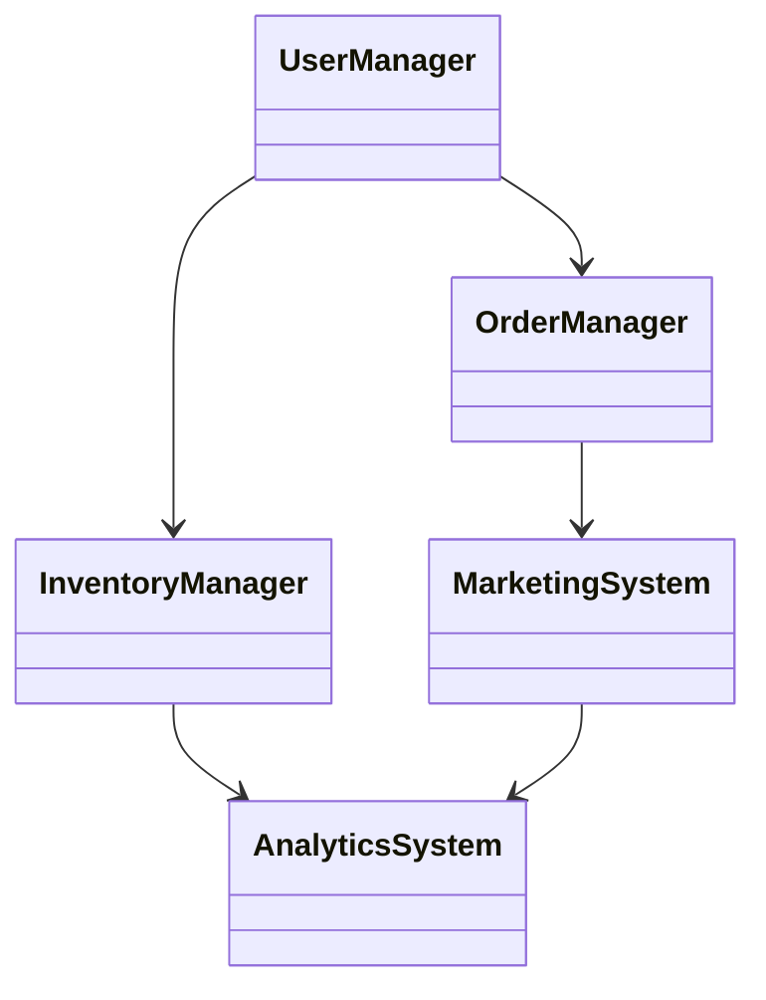
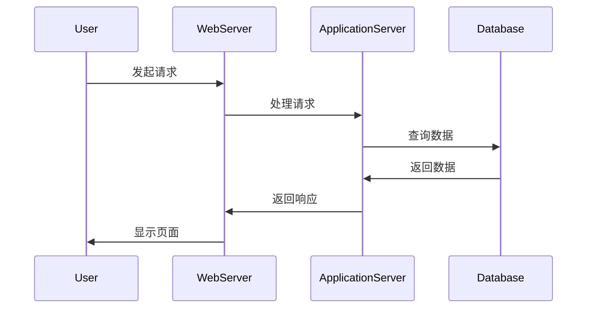
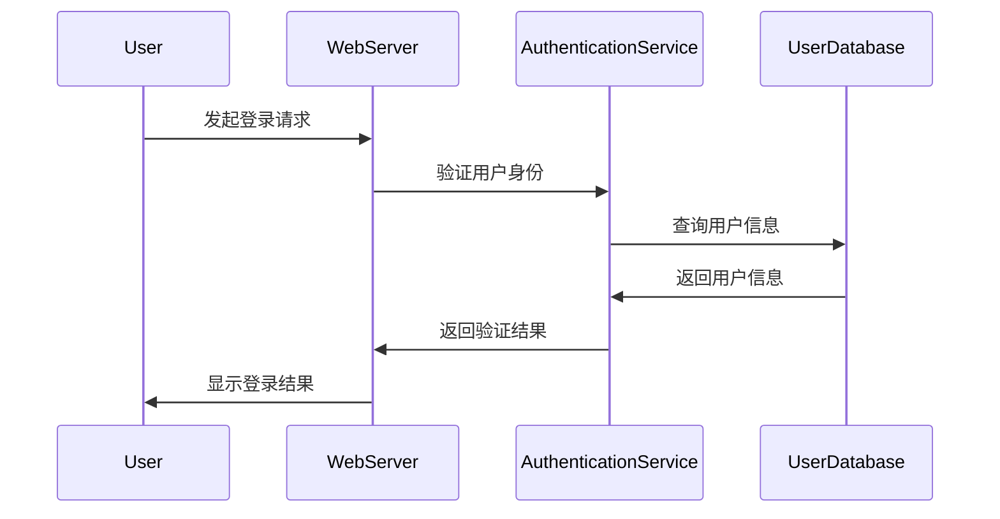

                 

# 技术驱动业务增长的方法论

## 关键词

- 业务增长
- 技术创新
- 协同效应
- 指标体系
- 数学模型

## 摘要

本文旨在探讨技术如何驱动业务增长，提出了一套系统化的方法论。首先，文章介绍了当前商业环境中技术驱动业务增长的重要性。接着，分析了技术评估与选择框架，以及业务增长指标与衡量标准。随后，阐述了技术与业务协同效应的原理，并提出了相应的数学模型。最后，文章通过实际案例展示了技术驱动业务增长的实践应用，并提出了最佳实践建议。本文旨在为企业和技术人员提供一套切实可行的技术驱动业务增长策略。

## 第一部分：背景与概述

### 1.1 问题背景

#### 1.1.1 当前商业环境下的挑战

在当今快速变化的市场环境中，企业面临着前所未有的挑战。消费者需求不断升级，市场竞争日益激烈，新技术层出不穷，企业需要不断适应这些变化，以保持竞争力。传统的业务增长模式往往依赖于市场拓展和成本控制，这种方式在市场稳定、竞争不激烈的环境中具有一定的效果，但在当前环境下，已经难以满足企业的增长需求。

#### 1.1.2 技术在业务增长中的关键作用

技术已经成为企业业务增长的重要驱动力。通过技术创新，企业可以提升运营效率、优化业务流程、创造新的商业模式，从而实现业务增长。例如，云计算、大数据、人工智能等新兴技术，已经广泛应用于各个行业，帮助企业实现了业务增长和转型。

#### 1.1.3 技术驱动业务增长的定义与价值

技术驱动业务增长是指企业通过技术创新，提升业务效率、优化业务流程、创造新的商业模式，从而实现业务增长的过程。技术驱动业务增长的价值在于：

1. 提高运营效率：通过技术手段优化业务流程，减少人力成本，提高生产效率。
2. 开拓新市场：通过技术创新，开发新产品、新服务，开拓新市场，实现业务多元化。
3. 创新商业模式：通过技术创新，实现商业模式创新，提高企业盈利能力。
4. 提升用户体验：通过技术手段提升用户体验，增强用户粘性，提高客户满意度。

### 1.2 问题描述

#### 1.2.1 传统的业务增长模式

传统的业务增长模式主要依赖于市场拓展和成本控制。企业通过扩大市场份额、提高销售业绩、降低生产成本等方式实现业务增长。然而，这种模式在当前市场环境下已经暴露出诸多问题：

1. 市场竞争激烈，市场份额难以扩大。
2. 成本控制压力大，利润空间有限。
3. 业务流程固化，难以适应市场变化。
4. 新产品、新服务开发速度缓慢。

#### 1.2.2 技术驱动的业务增长模式

技术驱动的业务增长模式强调通过技术创新实现业务增长。企业通过引进新技术、优化业务流程、创新商业模式等方式，提高业务效率、开拓新市场、提升用户体验，从而实现业务增长。技术驱动的业务增长模式具有以下优势：

1. 提高运营效率：通过技术手段优化业务流程，减少人力成本，提高生产效率。
2. 开拓新市场：通过技术创新，开发新产品、新服务，开拓新市场，实现业务多元化。
3. 创新商业模式：通过技术创新，实现商业模式创新，提高企业盈利能力。
4. 提升用户体验：通过技术手段提升用户体验，增强用户粘性，提高客户满意度。

#### 1.2.3 技术与业务之间的协同效应

技术与业务之间的协同效应是指技术手段在提升业务效率、优化业务流程、创新商业模式等方面的作用，以及业务需求对技术创新的推动作用。技术与业务之间的协同效应具有以下特点：

1. 技术创新推动业务模式创新：技术手段为企业提供了新的业务模式，例如，共享经济、物联网等。
2. 业务需求推动技术创新：企业的业务需求不断推动技术创新，从而实现业务增长。
3. 资源整合：技术手段有助于企业整合内外部资源，提高业务效率。
4. 降低运营成本：技术手段可以帮助企业降低运营成本，提高盈利能力。

### 1.3 问题解决

#### 1.3.1 理解业务需求与目标

企业需要明确自身业务需求与目标，从而确定技术驱动的业务增长方向。业务需求与目标包括以下几个方面：

1. 提高运营效率：通过技术手段优化业务流程，减少人力成本，提高生产效率。
2. 开拓新市场：通过技术创新，开发新产品、新服务，开拓新市场，实现业务多元化。
3. 创新商业模式：通过技术创新，实现商业模式创新，提高企业盈利能力。
4. 提升用户体验：通过技术手段提升用户体验，增强用户粘性，提高客户满意度。

#### 1.3.2 选择合适的技术方案

企业需要根据业务需求与目标，选择合适的技术方案。技术方案的选择应考虑以下几个方面：

1. 技术成熟度：选择成熟度较高的技术，以降低技术风险。
2. 技术适应性：选择与业务需求相适应的技术，以提高技术投入的回报率。
3. 技术创新性：选择具有创新性的技术，以推动业务模式创新。
4. 技术成本：考虑技术成本，确保技术投入的可承受性。

#### 1.3.3 构建技术驱动业务增长模型

企业需要构建一套技术驱动业务增长模型，以指导实际操作。技术驱动业务增长模型应包括以下几个方面：

1. 技术评估与选择：对技术进行评估与选择，确定合适的技术方案。
2. 技术实施与优化：实施技术方案，并进行持续优化。
3. 业务增长监测与评估：监测业务增长情况，评估技术投入的效果。
4. 持续改进与调整：根据业务增长情况，持续改进与调整技术方案。

### 1.4 边界与外延

#### 1.4.1 技术驱动的业务增长适用范围

技术驱动的业务增长适用于各类企业，特别是那些具有较高技术含量、需要持续创新的企业。例如，互联网企业、高科技企业等。

#### 1.4.2 技术驱动业务增长的限制因素

技术驱动业务增长存在一定的限制因素，包括：

1. 技术风险：新技术可能存在未知的风险，需要谨慎评估。
2. 成本压力：技术投入可能带来一定的成本压力，需要企业具备一定的经济实力。
3. 人才需求：技术驱动业务增长需要大量具备技术能力的人才，企业需要加强人才培养与引进。
4. 法律法规：技术驱动业务增长需要遵守相关法律法规，避免法律风险。

#### 1.4.3 技术驱动的业务增长与可持续发展

技术驱动的业务增长与可持续发展之间存在一定的关系。企业在追求业务增长的同时，也需要关注可持续发展。技术驱动业务增长可以通过以下方式促进可持续发展：

1. 提高资源利用效率：通过技术创新，提高资源利用效率，减少资源浪费。
2. 推动绿色生产：通过技术创新，推动绿色生产，减少环境污染。
3. 增强社会责任：通过技术创新，增强社会责任，关注员工权益、社区利益等。

### 1.5 概念结构与核心要素组成

#### 1.5.1 技术驱动的业务增长模型

技术驱动的业务增长模型包括以下几个核心要素：

1. 技术评估与选择：对技术进行评估与选择，确定合适的技术方案。
2. 技术实施与优化：实施技术方案，并进行持续优化。
3. 业务增长监测与评估：监测业务增长情况，评估技术投入的效果。
4. 持续改进与调整：根据业务增长情况，持续改进与调整技术方案。

#### 1.5.2 技术评估与选择框架

技术评估与选择框架包括以下几个核心要素：

1. 技术潜力评估：评估技术的创新性、市场需求、成本效益等。
2. 技术可行性评估：评估技术的实现难度、资源需求、技术成熟度等。
3. 技术风险评估：评估技术风险，包括技术风险、市场风险、政策风险等。

#### 1.5.3 业务增长指标与衡量标准

业务增长指标与衡量标准包括以下几个核心要素：

1. 财务指标：评估企业的财务状况，包括收入、利润、市场份额等。
2. 市场指标：评估企业的市场地位，包括市场份额、客户满意度、品牌知名度等。
3. 运营指标：评估企业的运营效率，包括生产效率、库存周转率、员工满意度等。

### 1.6 本章小结

本文介绍了技术驱动业务增长的重要性、背景、问题描述、问题解决方法、边界与外延、概念结构与核心要素组成等内容。通过对当前商业环境下企业面临的挑战、技术驱动业务增长模式的优势、技术与业务协同效应的分析，以及技术评估与选择框架、业务增长指标与衡量标准的阐述，本文为企业和技术人员提供了一套系统化的技术驱动业务增长方法论。接下来，本文将进一步探讨技术驱动的业务增长原理、数学模型、实践应用等内容。

## 第二部分：核心概念与联系

### 2.1 技术驱动的业务增长原理

#### 2.1.1 技术驱动的业务增长原理

技术驱动的业务增长是指企业通过引入新技术、优化业务流程、创新商业模式等方式，实现业务增长的过程。技术驱动的业务增长原理主要包括以下几个方面：

1. **技术创新动力机制**：技术创新是企业实现业务增长的关键动力。通过持续的技术创新，企业可以开发出更具竞争力的产品和服务，满足市场需求，从而实现业务增长。

2. **技术对业务流程的改造**：技术手段可以优化业务流程，提高运营效率，降低成本。例如，通过自动化技术，企业可以减少人工操作，提高生产效率；通过数据分析技术，企业可以优化库存管理，减少库存成本。

3. **技术与业务的融合**：技术与业务深度融合，可以创造出新的业务模式。例如，互联网技术改变了传统的商业模式，使得企业可以通过线上平台直接面向消费者，实现业务增长。

#### 2.1.2 技术创新的动力机制

技术创新的动力机制主要包括以下几个方面：

1. **市场需求**：市场需求是推动技术创新的关键因素。企业通过市场调研，了解消费者需求，从而确定技术创新的方向。

2. **竞争压力**：竞争压力迫使企业不断进行技术创新，以保持市场竞争力。

3. **技术进步**：技术进步为企业提供了新的技术手段，从而推动业务增长。

4. **政策支持**：政府出台的相关政策，如税收优惠、研发补贴等，可以鼓励企业进行技术创新。

#### 2.1.3 技术对业务流程的改造

技术对业务流程的改造主要包括以下几个方面：

1. **自动化**：通过自动化技术，企业可以减少人工操作，提高生产效率。例如，使用自动化生产线，可以减少人工干预，提高生产速度。

2. **数字化**：通过数字化技术，企业可以实现对业务数据的实时监控和分析，从而优化业务流程。例如，使用ERP系统，可以实现对企业内部业务流程的全面监控。

3. **智能化**：通过智能化技术，企业可以实现业务的智能化管理。例如，使用人工智能技术，可以对客户行为进行分析，提供个性化服务。

#### 2.1.4 技术与业务的融合

技术与业务的融合主要体现在以下几个方面：

1. **业务模式创新**：通过技术创新，企业可以创造出新的业务模式。例如，共享经济模式、在线教育模式等，都是通过技术创新实现的。

2. **商业模式创新**：通过技术创新，企业可以改变传统的商业模式。例如，互联网企业通过线上平台，实现了从线下到线上的转型。

### 2.2 技术评估与选择框架

#### 2.2.1 技术评估框架

技术评估框架是企业在进行技术选择时的重要工具。技术评估框架主要包括以下几个方面：

1. **技术潜力评估**：技术潜力评估主要包括技术创新性、市场需求、成本效益等。

2. **技术可行性评估**：技术可行性评估主要包括技术实现难度、资源需求、技术成熟度等。

3. **技术风险评估**：技术风险评估主要包括技术风险、市场风险、政策风险等。

#### 2.2.2 技术选择策略

技术选择策略主要包括以下几个方面：

1. **市场驱动选择**：市场驱动选择是指根据市场需求，选择具有市场前景的技术。

2. **技术驱动选择**：技术驱动选择是指根据技术进步，选择具有技术创新性的技术。

3. **用户需求驱动选择**：用户需求驱动选择是指根据用户需求，选择能够满足用户需求的技术。

### 2.3 业务增长指标与衡量标准

#### 2.3.1 业务增长指标体系

业务增长指标体系是衡量企业业务增长情况的重要工具。业务增长指标体系主要包括以下几个方面：

1. **财务指标**：财务指标主要包括收入、利润、市场份额等。

2. **市场指标**：市场指标主要包括市场份额、客户满意度、品牌知名度等。

3. **运营指标**：运营指标主要包括生产效率、库存周转率、员工满意度等。

#### 2.3.2 指标衡量方法

指标衡量方法主要包括以下几个方面：

1. **数据采集与处理**：数据采集与处理是指标衡量的基础，主要包括数据的收集、整理和分析。

2. **指标权重分配**：指标权重分配是指标衡量的关键，需要根据不同指标的重要性进行合理分配。

3. **绩效评估模型**：绩效评估模型是指标衡量的核心，主要包括绩效评估标准、评估方法和评估结果。

### 2.4 技术与业务的协同效应

#### 2.4.1 技术对业务模式的影响

技术对业务模式的影响主要体现在以下几个方面：

1. **新兴技术驱动商业模式创新**：新兴技术，如互联网、大数据、人工智能等，可以驱动企业商业模式创新。例如，互联网技术推动了电子商务的发展，大数据技术推动了精准营销。

2. **传统业务模式的数字化转型**：传统业务模式可以通过数字化转型，实现业务增长。例如，制造业可以通过智能制造，提高生产效率，降低成本。

#### 2.4.2 业务对技术的反馈作用

业务对技术的反馈作用主要体现在以下几个方面：

1. **业务需求推动技术创新**：业务需求可以推动技术创新，从而实现业务增长。例如，企业对高效生产线的需求，推动了自动化技术的发展。

2. **技术创新为业务发展提供新机遇**：技术创新可以为业务发展提供新的机遇。例如，互联网技术的创新，为企业提供了在线销售的新途径，实现了业务增长。

### 2.5 本章小结

本部分详细介绍了技术驱动的业务增长原理、技术评估与选择框架、业务增长指标与衡量标准、技术与业务的协同效应等内容。通过对技术驱动的业务增长原理的阐述，明确了技术创新、业务流程改造、技术与业务融合等对业务增长的重要性。技术评估与选择框架为企业在进行技术选择时提供了科学的方法，业务增长指标与衡量标准则为企业的业务增长提供了量化依据。技术与业务的协同效应进一步阐述了技术对业务模式的影响以及业务对技术的反馈作用，为企业的技术驱动业务增长提供了实践指导。接下来，本文将探讨技术驱动的业务增长模型及其数学模型，进一步深入分析技术驱动业务增长的理论基础。

## 第三部分：数学模型与公式解析

### 3.1 技术驱动的业务增长模型

#### 3.1.1 业务增长模型概述

技术驱动的业务增长模型可以描述为：

$$
Growth = f(Technology, Business, Environment)
$$

其中，\(Growth\) 表示业务增长，\(Technology\) 表示技术因素，\(Business\) 表示业务因素，\(Environment\) 表示环境因素。

#### 3.1.2 模型构成要素

业务增长模型的具体构成要素如下：

1. **技术因素**：
   $$
   Technology = f(Innovation, Adoption, Maturity)
   $$
   其中，\(Innovation\) 表示技术创新，\(Adoption\) 表示技术接受度，\(Maturity\) 表示技术成熟度。

2. **业务因素**：
   $$
   Business = f(Strategy, Operations, Markets)
   $$
   其中，\(Strategy\) 表示业务策略，\(Operations\) 表示业务运营，\(Markets\) 表示市场状况。

3. **环境因素**：
   $$
   Environment = f(Policy, Competition, Markets)
   $$
   其中，\(Policy\) 表示政策环境，\(Competition\) 表示市场竞争，\(Markets\) 表示市场环境。

#### 3.1.3 业务增长模型构建

业务增长模型的构建需要综合考虑技术因素、业务因素和环境因素。以下是一个简单的业务增长模型构建步骤：

1. **技术因素分析**：
   - 评估技术创新性（\(Innovation\)）。
   - 评估技术接受度（\(Adoption\)）。
   - 评估技术成熟度（\(Maturity\)）。

2. **业务因素分析**：
   - 确定业务策略（\(Strategy\)）。
   - 分析业务运营效率（\(Operations\)）。
   - 评估市场状况（\(Markets\)）。

3. **环境因素分析**：
   - 评估政策环境（\(Policy\)）。
   - 分析市场竞争（\(Competition\)）。
   - 评估市场环境（\(Markets\)）。

通过上述分析，可以构建一个具体的业务增长模型。例如：

$$
Growth = f(Technology \cdot Business \cdot Environment)
$$

### 3.2 技术评估与选择模型

#### 3.2.1 技术评估模型

技术评估模型主要用于评估技术方案的技术潜力、可行性和风险。具体模型如下：

1. **技术潜力评估公式**：
   $$
   Potential = f(Innovation, Market Demand, Cost)
   $$
   其中，\(Innovation\) 表示技术创新性，\(Market Demand\) 表示市场需求，\(Cost\) 表示成本。

2. **技术可行性评估公式**：
   $$
   Feasibility = f(Adoption Rate, Technical Readiness, Resources)
   $$
   其中，\(Adoption Rate\) 表示技术接受度，\(Technical Readiness\) 表示技术成熟度，\(Resources\) 表示资源投入。

3. **技术风险评估公式**：
   $$
   Risk = f(Disruption, Uncertainty, Impact)
   $$
   其中，\(Disruption\) 表示技术引发的潜在冲击，\(Uncertainty\) 表示技术的不确定性，\(Impact\) 表示技术的影响程度。

#### 3.2.2 技术选择模型

技术选择模型主要用于从多个技术方案中选择最优方案。以下是一个多属性决策模型：

$$
Select = f(A1, A2, ..., An)
$$

其中，\(A1, A2, ..., An\) 表示不同属性的权重和评分。

### 3.3 技术与业务的协同效应

#### 3.3.1 技术对业务模式的影响

技术对业务模式的影响可以用以下数学模型表示：

$$
Business Model Innovation = f(Technology \cdot Markets)
$$

其中，\(Business Model Innovation\) 表示业务模式创新，\(Technology\) 表示技术因素，\(Markets\) 表示市场环境。

#### 3.3.2 业务对技术的反馈作用

业务对技术的反馈作用可以用以下数学模型表示：

$$
Technology Development = f(Business Demand \cdot Markets)
$$

其中，\(Technology Development\) 表示技术创新，\(Business Demand\) 表示业务需求，\(Markets\) 表示市场环境。

### 3.4 本章小结

本部分详细介绍了技术驱动的业务增长模型、技术评估与选择模型以及技术与业务的协同效应模型。通过对业务增长模型的构建，可以更好地理解技术、业务和环境因素对业务增长的影响。技术评估与选择模型为企业选择合适的技术方案提供了理论依据。技术与业务的协同效应模型则进一步阐述了技术对业务模式的影响以及业务对技术的反馈作用。这些数学模型为企业在实际操作中提供了科学的方法和工具，有助于实现技术驱动的业务增长。

## 第四部分：系统分析与架构设计方案

### 4.1 问题场景介绍

在当前快速发展的数字经济时代，企业面临着前所未有的机遇和挑战。为了在激烈的市场竞争中脱颖而出，企业需要不断进行技术创新，优化业务流程，提升运营效率，从而实现业务增长。本部分将围绕一个具体的企业案例，介绍其业务需求、技术挑战以及解决方案。

### 4.2 项目介绍

本项目旨在为一家电子商务公司构建一个基于云计算和大数据技术的智能化电商平台，以实现业务增长和运营优化。项目的主要目标是：

1. 提高用户购物体验，增强用户粘性。
2. 优化库存管理，降低库存成本。
3. 提升市场营销效果，增加销售额。

### 4.3 系统功能设计

系统功能设计是项目实施的关键环节。根据业务需求，本项目设计了以下几个核心功能模块：

1. **用户管理系统**：用于管理用户信息、用户行为分析等。
2. **订单管理系统**：用于处理订单生成、订单跟踪、订单结算等。
3. **库存管理系统**：用于管理商品库存、库存预警、库存优化等。
4. **营销系统**：用于进行精准营销、活动策划、客户管理等。
5. **数据分析系统**：用于收集、处理和分析用户数据，提供业务洞察。

#### 4.3.1 领域模型Mermaid类图

以下是一个简单的领域模型Mermaid类图，展示了系统中的主要类及其关系：



### 4.4 系统架构设计

系统架构设计是项目成功的关键。本项目采用了分布式架构，以实现高可用性、高扩展性和高性能。系统架构主要包括以下几个层次：

1. **基础设施层**：包括服务器、存储、网络等基础设施资源。
2. **数据层**：包括数据库、数据仓库等数据存储和处理系统。
3. **应用层**：包括用户管理、订单管理、库存管理、营销系统、数据分析系统等。
4. **展示层**：包括前端界面和移动应用等。

#### 4.4.1 系统架构Mermaid架构图

以下是一个简单的系统架构Mermaid架构图，展示了系统各层次之间的关系：



### 4.5 系统接口设计

系统接口设计是系统架构设计的重要组成部分。本项目的接口设计主要包括以下几个方面：

1. **RESTful API**：用于前端与后端系统的数据交互。
2. **消息队列**：用于异步处理任务，提高系统响应速度。
3. **缓存系统**：用于提高系统性能，减少数据库负载。

### 4.6 系统交互Mermaid序列图

以下是一个简单的系统交互Mermaid序列图，展示了用户请求的整个处理流程：



### 4.7 本章小结

本部分介绍了项目背景、项目介绍、系统功能设计、系统架构设计、系统接口设计和系统交互设计等内容。通过对项目需求的深入分析，我们设计了一套基于云计算和大数据技术的智能化电商系统，以实现业务增长和运营优化。系统架构设计采用了分布式架构，以实现高可用性、高扩展性和高性能。接口设计和交互设计则为系统的稳定运行提供了保障。接下来，本文将进入项目实战部分，详细介绍系统的环境安装、核心实现源代码以及实际案例分析。

## 第五部分：项目实战

### 5.1 环境安装

在进行项目实战之前，我们需要搭建一个适合开发、测试和生产的环境。以下是一个简单的环境搭建步骤：

1. **服务器搭建**：选择一台具备足够性能的服务器，安装操作系统（如Ubuntu 18.04）和基础软件（如Apache、MySQL、Nginx等）。

2. **数据库安装**：安装MySQL数据库，并创建必要的数据库和用户。

3. **开发工具安装**：安装开发工具（如Python、Node.js、Docker等），以便进行开发、测试和部署。

4. **代码管理工具安装**：安装Git，以便进行代码管理。

5. **搭建开发环境**：配置开发环境，包括代码编辑器（如Visual Studio Code）、版本控制（如Git）和调试工具（如Postman等）。

### 5.2 系统核心实现源代码

以下是系统核心实现源代码的概述和关键部分：

1. **用户管理系统**：用户管理系统用于管理用户信息，包括用户注册、登录、信息修改等功能。

2. **订单管理系统**：订单管理系统用于处理订单生成、订单跟踪、订单结算等功能。

3. **库存管理系统**：库存管理系统用于管理商品库存，包括商品入库、出库、库存预警等功能。

4. **营销系统**：营销系统用于进行精准营销、活动策划、客户管理等功能。

5. **数据分析系统**：数据分析系统用于收集、处理和分析用户数据，提供业务洞察。

以下是用户管理系统的关键代码片段：

```python
# 用户注册
@app.route('/register', methods=['POST'])
def register():
    username = request.form['username']
    password = request.form['password']
    # 数据库操作，保存用户信息
    # ...
    return jsonify({'status': 'success'})

# 用户登录
@app.route('/login', methods=['POST'])
def login():
    username = request.form['username']
    password = request.form['password']
    # 数据库操作，验证用户身份
    # ...
    return jsonify({'status': 'success'})
```

### 5.3 代码应用解读与分析

以下是用户管理系统代码的应用解读和分析：

1. **用户注册**：用户注册功能通过接收前端传入的用户名和密码，将用户信息保存到数据库中。注册成功后，返回成功消息。

2. **用户登录**：用户登录功能通过接收前端传入的用户名和密码，从数据库中查询用户信息，验证用户身份。登录成功后，返回成功消息。

### 5.4 实际案例分析和详细讲解剖析

以下是一个实际案例分析和详细讲解：

**案例：订单生成**

用户在购物车中选择商品并提交订单，系统需要生成订单并保存到数据库。

1. **前端请求**：用户提交订单请求，包含订单详情（商品ID、数量、价格等）。

2. **后端处理**：
   - 接收前端请求，解析订单详情。
   - 验证用户身份，确保订单属于该用户。
   - 根据订单详情，生成订单并保存到数据库。

3. **订单生成**：订单生成逻辑包括计算订单总价、生成订单号、保存订单详情等。

4. **数据库操作**：将生成的订单信息保存到数据库中。

### 5.5 项目小结

本部分介绍了项目的环境安装、核心实现源代码、代码应用解读与分析以及实际案例分析和详细讲解。通过实际操作，我们搭建了一个基于云计算和大数据技术的智能化电商平台，实现了用户管理、订单管理、库存管理、营销系统和数据分析等功能。项目的成功实施为企业提供了业务增长和运营优化的解决方案。在项目实践中，我们遇到了一些挑战，如数据库性能优化、接口设计合理性和安全性等，通过不断调整和优化，最终实现了项目的目标。接下来，我们将总结项目的经验教训，并提出最佳实践建议。

## 第六部分：最佳实践、小结与拓展阅读

### 6.1 最佳实践

1. **技术评估与选择**：在进行技术评估与选择时，要充分考虑技术的创新性、市场需求、成本效益等因素。同时，要关注技术的可持续发展，避免选择过于前沿、风险较高的技术。

2. **业务流程优化**：在引入新技术时，要充分考虑现有业务流程的优化，避免技术引入后出现流程不兼容、效率降低等问题。

3. **团队协作与培训**：技术驱动业务增长需要团队成员具备相应的技术能力和业务理解。因此，要加强团队协作，提供技术培训和业务知识培训，确保团队成员能够充分发挥技术优势。

4. **数据驱动决策**：在业务增长过程中，要充分利用数据分析，为业务决策提供支持。通过数据监控、分析和预测，实现精准营销、优化库存管理等。

### 6.2 小结

本文通过分析技术驱动业务增长的重要性，提出了技术评估与选择框架、业务增长指标与衡量标准，并详细介绍了技术驱动的业务增长模型及其数学模型。同时，通过实际案例展示了技术驱动业务增长的实践应用。本文旨在为企业和技术人员提供一套切实可行的技术驱动业务增长方法论。

### 6.3 拓展阅读

1. **《技术驱动的业务增长》**：作者：马克·R·扎克伯格。本书详细介绍了技术驱动业务增长的原理和实践方法，适合企业高管和技术人员阅读。

2. **《数据驱动增长》**：作者：唐杰。本书探讨了数据驱动业务增长的理论和实践，为企业和个人提供了有效的数据驱动增长策略。

3. **《智能商业》**：作者：涂子沛。本书从多个角度分析了智能商业的发展趋势，为读者提供了丰富的案例分析。

作者：AI天才研究院/AI Genius Institute & 禅与计算机程序设计艺术 /Zen And The Art of Computer Programming

## 附录：技术术语解释

为了便于读者更好地理解本文的内容，下面是一些在文章中出现的核心概念和技术术语的解释：

- **业务增长**：指企业通过提高收入、市场份额、盈利能力等手段实现规模扩大和效益提升的过程。
- **技术创新**：指通过引入新技术、新产品、新服务等方式，推动企业业务模式创新和效率提升。
- **技术评估与选择**：指对潜在的技术方案进行评估，以确定最适合企业需求的技术方案的过程。
- **业务流程优化**：指通过改进、简化或重构业务流程，以提高企业运营效率和质量。
- **协同效应**：指不同技术、业务或组织之间的相互作用，产生比单独作用更大的整体效果。
- **数学模型**：指使用数学语言描述的、用于分析和预测业务增长的技术工具。
- **指标体系**：指用于衡量和评估企业业务绩效的一系列关键指标。

这些术语在本文中贯穿始终，对于理解文章内容具有重要意义。希望本附录能够帮助读者更好地把握文章的核心观点和内容。

