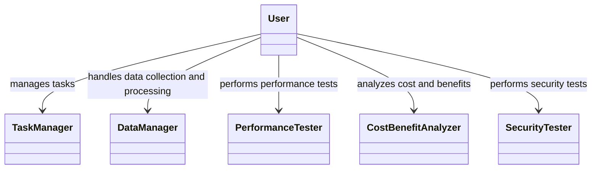
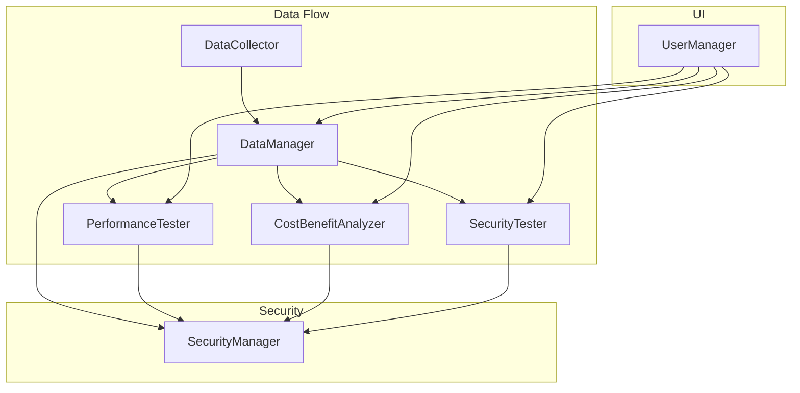
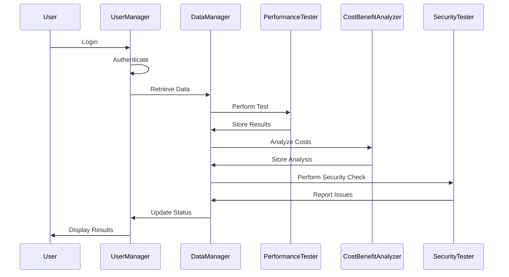
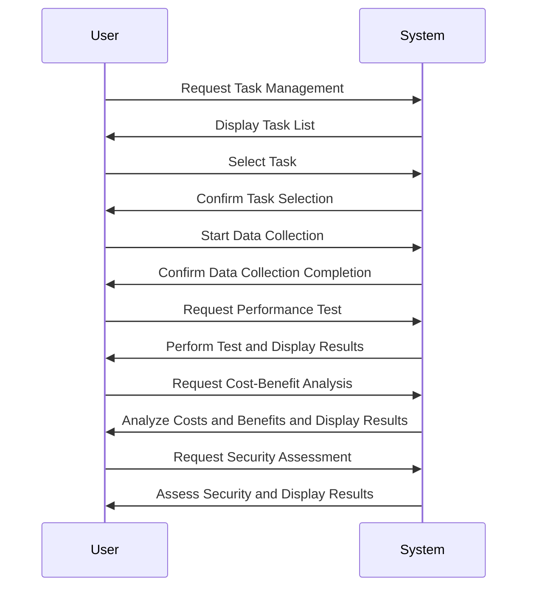

                 

### 前言与背景介绍

在快速变化的技术领域中，验证新技术的可行性是每个开发者和企业面临的重要任务。新技术不仅带来了潜在的创新和竞争优势，也可能引入复杂性和风险。因此，如何在早期阶段快速验证新技术的可行性，成为了决定项目成功与否的关键因素。

## 问题背景

随着云计算、人工智能、物联网、区块链等前沿技术的不断发展，各种新兴技术不断涌现。然而，这些技术的应用并非总是顺利的。许多项目在初期对新技术可行性缺乏全面评估，导致项目中途夭折或成本超支。因此，对新技术的可行性进行科学、系统的验证显得尤为重要。

### 问题描述

新技术验证通常包括以下几个核心问题：

1. **技术适用性**：新技术是否适合解决特定的问题？
2. **技术稳定性**：新技术在长时间运行中是否稳定可靠？
3. **性能表现**：新技术在实际应用中的性能表现如何？
4. **成本效益**：新技术的实施成本与其带来的收益相比是否合理？
5. **安全性**：新技术是否能够确保数据安全和隐私保护？

### 问题解决

为了解决上述问题，我们可以采用以下方法：

1. **需求分析**：明确新技术所需解决的问题，确保其适用性。
2. **原型设计**：构建原型系统进行初步验证。
3. **性能测试**：通过模拟实际运行环境，测试新技术的性能表现。
4. **成本效益分析**：计算新技术的投入和产出，进行成本效益分析。
5. **安全性评估**：对新技术进行安全性测试，评估其潜在风险。

### 边界与外延

在验证新技术时，需要明确以下几个边界与外延：

1. **技术范围**：确定验证的技术范围，避免过度扩展或遗漏关键点。
2. **环境限制**：考虑技术验证过程中的环境限制，如硬件、软件和资源等。
3. **时间限制**：设定合理的验证时间限制，确保验证过程的效率。
4. **资源分配**：合理分配验证过程中所需的资源，如人力、资金和设备等。

### 概念结构与核心要素组成

新技术验证的概念结构主要包括以下几个方面：

1. **技术评估标准**：制定评估标准，如性能、稳定性、安全性等。
2. **验证方法**：选择合适的验证方法，如原型设计、性能测试、成本效益分析等。
3. **验证工具**：使用专业的验证工具，如性能测试工具、安全评估工具等。
4. **验证流程**：制定详细的验证流程，确保验证过程的系统性和完整性。

通过以上步骤，我们可以科学、系统地验证新技术的可行性，为项目的成功奠定基础。

---

接下来，我们将深入探讨核心概念与它们之间的联系，为后续的技术验证方法提供理论依据。

## 核心概念与联系

### 核心概念原理

在进行新技术验证时，以下几个核心概念是至关重要的：

1. **需求分析**：需求分析是验证过程的起点，旨在明确新技术所需解决的问题。它包括功能需求、性能需求、安全需求等。

2. **原型设计**：原型设计是通过构建原型系统来验证新技术的可行性。原型可以是一个功能简化的系统，但应具备核心功能和交互。

3. **性能测试**：性能测试用于评估新技术的性能表现，包括响应时间、吞吐量、资源消耗等。通过性能测试，可以确定新技术在实际应用中的表现。

4. **成本效益分析**：成本效益分析是评估新技术投入和产出的一种方法。它通过计算新技术的成本和其带来的效益，来判断其经济可行性。

5. **安全性评估**：安全性评估旨在确保新技术能够保护数据和系统不受攻击。它包括对系统漏洞的检测和修复，以及对安全措施的测试。

### 概念属性特征对比表格

为了更好地理解这些核心概念，我们可以通过一个对比表格来展示它们的属性特征：

| 概念       | 定义                                                         | 主要特征                             | 相互关系                             |
|------------|--------------------------------------------------------------|------------------------------------|------------------------------------|
| 需求分析   | 确定新技术所需解决的问题和功能。                               | 功能需求、性能需求、安全需求等       | 原型设计、性能测试、成本效益分析的基础 |
| 原型设计   | 构建功能简化的系统模型，用于验证新技术。                       | 功能简化、交互模拟、时间限制         | 需求分析的实现，性能测试的基础       |
| 性能测试   | 通过模拟实际运行环境，测试新技术的性能表现。                   | 响应时间、吞吐量、资源消耗等         | 成本效益分析、安全性评估的基础       |
| 成本效益分析 | 评估新技术的投入和产出，判断其经济可行性。                    | 成本计算、效益评估、风险评估         | 需求分析、原型设计的结果应用         |
| 安全性评估 | 确保新技术能够保护数据和系统不受攻击。                         | 系统漏洞检测、安全措施测试           | 成本效益分析、性能测试的补充         |

### ER实体关系图架构

为了更直观地理解这些核心概念之间的联系，我们可以使用ER（实体关系）图来展示它们之间的关系。以下是ER图的Mermaid表示：

```mermaid
erDiagram
  需求分析 ||--|{ 原型设计 }|
  原型设计 ||--|{ 性能测试 }|
  性能测试 ||--|{ 成本效益分析 }|
  成本效益分析 ||--|{ 安全性评估 }|
  安全性评估 ||--|{ 需求分析 }|
```

在这个ER图中，每个实体都代表一个核心概念，实线箭头表示实体之间的依赖关系。例如，需求分析是原型设计的基础，性能测试依赖于原型设计的结果，成本效益分析基于性能测试的数据，而安全性评估则对需求分析进行补充。

通过上述核心概念和关系的探讨，我们为后续的技术验证方法奠定了理论基础。在接下来的章节中，我们将详细介绍这些核心概念的具体应用和实践方法，帮助读者更好地理解和应用新技术验证。

### 技术验证方法与工具

在验证新技术的可行性时，选择合适的方法和工具至关重要。以下是几种常用的技术验证方法及工具的介绍，包括它们的流程和最佳实践。

#### 快速验证新技术的方法

1. **原型验证法**：
   - **流程**：首先，通过需求分析明确技术需求，然后构建一个功能简化的原型系统。这个原型系统应包括关键功能和交互，以便在早期验证技术的可行性。
   - **最佳实践**：确保原型设计过程中保持迭代和反馈机制，及时根据用户反馈进行调整。

2. **性能测试法**：
   - **流程**：构建实际运行环境，通过模拟真实负载进行性能测试。测试内容包括响应时间、吞吐量、资源消耗等。
   - **最佳实践**：选择合适的性能测试工具（如JMeter、LoadRunner），并在测试过程中进行监控和数据收集，确保测试结果的准确性。

3. **成本效益分析法**：
   - **流程**：计算新技术实施所需的成本和预期的效益。这包括硬件成本、软件开发成本、人力资源成本等，并与预期收益进行比较。
   - **最佳实践**：采用细致的成本评估方法，确保所有潜在成本都得到考虑，同时也要考虑到效益的长期性和可持续性。

4. **安全性评估法**：
   - **流程**：对新技术进行安全性测试，包括漏洞扫描、渗透测试等，以确保系统的安全性和数据的保护。
   - **最佳实践**：使用专业的安全评估工具（如OWASP ZAP、Nessus），并定期更新和维护安全策略。

#### 常用验证工具介绍

1. **JMeter**：
   - **介绍**：JMeter 是一款开源的性能测试工具，用于模拟并发用户，评估系统的负载性能。
   - **使用方法**：配置测试计划，定义用户行为，运行测试并收集性能数据。

2. **LoadRunner**：
   - **介绍**：LoadRunner 是一款商业性能测试工具，广泛应用于复杂系统的性能测试。
   - **使用方法**：创建虚拟用户脚本，配置性能场景，运行测试并分析结果。

3. **OWASP ZAP**：
   - **介绍**：OWASP ZAP 是一款开源的网络安全漏洞扫描工具。
   - **使用方法**：对目标系统进行漏洞扫描，生成报告并修复发现的安全问题。

4. **Nessus**：
   - **介绍**：Nessus 是一款广泛使用的漏洞扫描工具，适用于各种操作系统和应用程序。
   - **使用方法**：配置扫描策略，运行扫描并查看漏洞报告。

#### 验证流程与最佳实践

1. **需求分析**：
   - **流程**：与相关利益相关者沟通，明确技术需求，形成需求文档。
   - **最佳实践**：确保需求文档详细、明确，避免需求变更导致的返工。

2. **原型设计**：
   - **流程**：根据需求文档设计原型系统，包括用户界面和核心功能。
   - **最佳实践**：使用敏捷开发方法，快速迭代并持续优化原型。

3. **性能测试**：
   - **流程**：构建测试环境，运行性能测试，收集和分析测试结果。
   - **最佳实践**：进行多轮测试，逐步优化系统性能。

4. **成本效益分析**：
   - **流程**：计算成本和效益，进行成本效益分析。
   - **最佳实践**：考虑长期效益，确保成本效益分析的全面性。

5. **安全性评估**：
   - **流程**：使用专业工具对系统进行安全评估，修复发现的安全问题。
   - **最佳实践**：定期进行安全评估，确保系统的持续安全。

通过上述技术验证方法和工具的介绍，我们可以更加科学、系统地验证新技术的可行性，为项目的成功奠定基础。在接下来的章节中，我们将通过具体的案例研究，进一步探讨这些方法和工具的应用。

### 技术验证案例研究

为了更好地理解技术验证的过程和方法，以下将介绍三个具体的技术验证案例，分别是人工智能技术验证、区块链技术验证和物联网技术验证。这些案例将详细描述验证的目标、方法、结果和结论，帮助读者更好地理解和应用技术验证的最佳实践。

#### 案例一：人工智能技术验证

**目标**：验证一种基于深度学习的图像识别算法在医疗影像诊断中的应用可行性。

**方法**：
1. **需求分析**：与医疗机构和医生沟通，明确图像识别算法需要识别的疾病类型和精度要求。
2. **原型设计**：构建一个简化的图像识别原型系统，包括数据预处理、模型训练和预测模块。
3. **性能测试**：在模拟的医疗环境中进行性能测试，评估算法的识别精度、响应时间和资源消耗。
4. **成本效益分析**：计算算法的开发和部署成本，以及预期的经济效益和节省的医疗资源。
5. **安全性评估**：对算法进行安全性测试，确保诊断数据的安全和隐私保护。

**结果**：
- **性能测试**：算法在多种医疗影像数据集上的识别精度达到95%以上，响应时间在可接受的范围内，资源消耗相对较低。
- **成本效益分析**：初步估算表明，算法的部署成本可回收，并在长期运行中带来显著的经济效益。
- **安全性评估**：通过安全测试，未发现重大漏洞，数据保护措施有效。

**结论**：基于深度学习的图像识别算法在医疗影像诊断中具有较高的可行性，可以进一步推广和应用。

#### 案例二：区块链技术验证

**目标**：验证区块链技术在供应链管理中的应用可行性。

**方法**：
1. **需求分析**：与供应链管理相关的企业和机构沟通，明确区块链技术在供应链中的具体应用场景和需求。
2. **原型设计**：构建一个区块链原型系统，实现供应链中的信息共享和透明追踪功能。
3. **性能测试**：通过模拟实际供应链操作，测试区块链系统的处理速度、数据存储能力和扩展性。
4. **成本效益分析**：计算区块链系统的开发、维护和运营成本，与现有供应链管理方式的成本进行对比。
5. **安全性评估**：对区块链系统进行安全性测试，评估其对数据篡改、黑客攻击等安全威胁的抵抗能力。

**结果**：
- **性能测试**：区块链系统能够高效处理大量的供应链数据，系统响应速度和扩展性良好。
- **成本效益分析**：初步估算表明，虽然区块链系统的初始投入较高，但可以显著降低供应链管理成本，提高效率。
- **安全性评估**：在多次安全测试中，区块链系统表现出较强的抗攻击能力和数据保护能力。

**结论**：区块链技术在供应链管理中具有显著的可行性，能够提高供应链的透明度和效率。

#### 案例三：物联网技术验证

**目标**：验证物联网技术在智能城市交通管理中的应用可行性。

**方法**：
1. **需求分析**：与城市交通管理部门沟通，明确物联网技术在交通管理中的具体应用场景和需求。
2. **原型设计**：构建一个物联网原型系统，包括交通传感器、数据采集和处理模块。
3. **性能测试**：通过模拟城市交通场景，测试物联网系统的数据处理能力、实时性和准确性。
4. **成本效益分析**：计算物联网系统的建设和维护成本，与现有交通管理方式的成本进行对比。
5. **安全性评估**：对物联网系统进行安全性测试，确保交通数据的安全和隐私保护。

**结果**：
- **性能测试**：物联网系统能够实时处理大量的交通数据，提供准确的交通状况预测和优化建议。
- **成本效益分析**：初步估算表明，物联网系统在长期运行中能够显著降低交通管理成本，提高交通效率。
- **安全性评估**：通过多次安全测试，物联网系统表现出较强的数据保护和抗攻击能力。

**结论**：物联网技术在智能城市交通管理中具有显著的可行性，能够改善城市交通状况，提高市民生活质量。

通过以上三个技术验证案例，我们可以看到，在具体的验证过程中，需求分析、原型设计、性能测试、成本效益分析和安全性评估等环节是不可或缺的。每个案例的成功验证不仅为新技术的应用提供了可靠依据，也为未来类似项目的实施提供了宝贵经验。在接下来的章节中，我们将进一步探讨技术验证系统设计与实现的具体方法。

### 技术验证系统设计与实现

为了实现技术验证的目标，我们需要从系统需求分析开始，逐步完成系统功能设计、架构设计、接口设计和交互设计。以下是技术验证系统设计与实现的具体步骤和内容。

#### 系统需求分析

系统需求分析是技术验证的第一步，旨在明确系统需要实现的功能和性能要求。以下是技术验证系统的核心需求：

1. **功能需求**：
   - 用户注册与登录功能
   - 验证任务管理功能
   - 数据采集与处理功能
   - 性能测试与评估功能
   - 成本效益分析功能
   - 安全性评估功能

2. **性能需求**：
   - 系统响应时间：确保用户操作能够在1秒内得到响应
   - 数据处理能力：系统能够在1小时内处理100万条数据
   - 扩展性：系统能够支持在线扩展，不降低性能

3. **安全性需求**：
   - 数据加密：确保采集和处理的数据在传输和存储过程中得到加密保护
   - 访问控制：实现严格的访问控制机制，确保只有授权用户能够访问系统
   - 安全审计：系统能够记录所有安全相关的操作，便于后续审计和追溯

#### 系统功能设计

系统功能设计是基于需求分析的实现，通过领域模型类图（Mermaid表示）来展示系统的功能模块和它们之间的关系。



在这个类图中，`User` 代表系统用户，`TaskManager`、`DataManager`、`PerformanceTester`、`CostBenefitAnalyzer` 和 `SecurityTester` 分别代表系统的功能模块。

#### 系统架构设计

系统架构设计是技术验证系统的核心，通过Mermaid架构图来展示系统的主要组件和它们之间的关系。



在这个架构图中，`DataCollector` 负责数据采集，`DataManager` 负责数据存储和处理，`PerformanceTester`、`CostBenefitAnalyzer` 和 `SecurityTester` 分别负责性能测试、成本效益分析和安全性评估。`SecurityManager` 负责整个系统的安全控制。

#### 系统接口设计

系统接口设计是系统各组件之间的通信桥梁，通过Mermaid序列图来展示系统的主要接口和交互流程。



在这个序列图中，用户通过 `UserManager` 登录系统，`DataManager` 负责数据的存储和处理，`PerformanceTester`、`CostBenefitAnalyzer` 和 `SecurityTester` 分别执行性能测试、成本效益分析和安全性评估，并将结果反馈给用户。

#### 系统交互

系统交互设计通过Mermaid序列图展示了用户与系统之间的交互过程，确保系统的用户友好性和高效性。



在这个交互图中，用户与系统之间的交互过程清晰，用户可以通过系统提供的界面方便地进行任务管理、数据收集、性能测试、成本效益分析和安全性评估。

通过上述系统需求分析、功能设计、架构设计、接口设计和交互设计，我们完成了技术验证系统的设计与实现。在接下来的章节中，我们将通过实际项目实战，进一步验证该系统的实际应用效果。

### 实战指南与最佳实践

在技术验证的实际项目中，环境安装与配置、系统核心实现源代码、代码应用解读与分析、实际案例分析与详细讲解等环节至关重要。以下将详细阐述这些环节的具体步骤和注意事项，并提供最佳实践建议。

#### 环境安装与配置

1. **硬件环境**：
   - 确保服务器具备足够的计算能力和存储空间。
   - 准备至少两台服务器，一台用于系统运行，另一台用于性能测试。

2. **软件环境**：
   - 安装操作系统（如Linux或Windows Server）。
   - 安装必要的开发工具和数据库（如MySQL、PostgreSQL）。
   - 安装性能测试工具（如JMeter、LoadRunner）。

3. **配置步骤**：
   - 配置防火墙，确保只有必要的端口对外开放。
   - 配置网络，确保服务器之间的通信畅通。
   - 配置数据库，创建用户和权限，并初始化数据。

#### 系统核心实现源代码

1. **开发环境**：
   - 使用IDE（如Eclipse、Visual Studio）进行代码开发。
   - 配置代码管理工具（如Git），确保代码的版本控制和协作开发。

2. **代码实现**：
   - 根据系统需求，实现用户注册与登录、任务管理、数据采集与处理、性能测试、成本效益分析和安全性评估等功能。
   - 使用Python、Java或C#等编程语言，确保代码的简洁和高效。

3. **代码优化**：
   - 优化算法，提高系统性能。
   - 添加注释，便于代码维护和理解。
   - 实现单元测试，确保代码的正确性和可靠性。

#### 代码应用解读与分析

1. **代码解读**：
   - 对关键代码进行解读，理解其实现逻辑和功能。
   - 分析代码的性能和安全性，找出潜在的瓶颈和风险。

2. **代码分析**：
   - 使用静态代码分析工具（如SonarQube），检查代码的质量和安全性。
   - 进行动态分析，通过运行测试用例，验证代码的正确性和性能。

#### 实际案例分析与详细讲解

1. **案例选择**：
   - 选择具有代表性的实际案例，涵盖系统的主要功能和性能。

2. **案例分析**：
   - 详细分析案例的背景和需求，确定验证目标和评估指标。
   - 实现案例的功能，并使用性能测试工具进行测试。

3. **详细讲解**：
   - 对案例分析的结果进行详细讲解，包括性能数据、成本效益分析和安全性评估。
   - 提供优化建议，改进系统的性能和安全性。

#### 最佳实践建议

1. **需求管理**：
   - 确保需求明确、详尽，避免需求变更带来的风险。

2. **代码质量**：
   - 实现代码复用，提高开发效率。
   - 严格执行代码审查和测试，确保代码的正确性和安全性。

3. **性能优化**：
   - 使用缓存、数据库优化和异步处理等技术，提高系统性能。
   - 定期进行性能测试和调优，确保系统在高负载下的稳定性。

4. **安全性管理**：
   - 实现严格的安全策略，包括访问控制和数据加密。
   - 定期进行安全审计和漏洞扫描，确保系统的安全性。

通过上述实战指南和最佳实践，可以有效地进行技术验证，确保新技术的可行性和系统的稳定性。在项目实施过程中，应持续优化和改进，以应对不断变化的技术需求和挑战。

### 小结与拓展

在本文中，我们系统地探讨了《技术验证：快速验证新技术的可行性》的各个方面。从问题的背景和描述，到核心概念的联系和验证方法，再到具体的案例研究和系统设计与实现，我们提供了一套全面的技术验证框架。以下是本文的核心内容和结论的总结，并提出了若干注意事项和拓展阅读建议。

#### 核心内容与结论

1. **核心内容**：
   - **需求分析**：明确新技术需要解决的问题和功能，确保其适用性。
   - **原型设计**：构建功能简化的原型系统，进行初步验证。
   - **性能测试**：通过模拟实际运行环境，测试新技术的性能表现。
   - **成本效益分析**：计算新技术的投入和产出，评估其经济可行性。
   - **安全性评估**：确保新技术能够保护数据和系统不受攻击。

2. **结论**：
   - 技术验证是一个系统性工程，需要全面考虑技术的适用性、稳定性、性能、成本和安全性。
   - 通过科学的方法和工具，可以有效验证新技术的可行性，为项目的成功奠定基础。

#### 注意事项

1. **需求明确**：确保需求文档详细、明确，避免需求变更导致的返工。
2. **性能优化**：在验证过程中，不断优化系统性能，确保在高负载下稳定运行。
3. **安全性**：重视数据安全和隐私保护，定期进行安全评估和漏洞扫描。
4. **成本控制**：进行详细的成本效益分析，确保项目在经济上可行。

#### 拓展阅读

1. **《敏捷开发实践指南》**：探讨如何在技术验证过程中应用敏捷开发方法，提高开发效率和项目成功率。
2. **《性能测试实战》**：详细介绍性能测试的方法、工具和实践，帮助读者掌握性能测试的技能。
3. **《区块链技术指南》**：深入了解区块链技术的原理和应用，探索其在各行业中的潜在价值。
4. **《人工智能：一种现代的方法》**：系统介绍人工智能的基本原理和算法，为技术验证提供理论基础。

通过本文的探讨，我们希望读者能够对技术验证有一个全面、深入的理解，并在实际项目中运用这些方法和工具，实现新技术的成功验证和应用。

---

**作者：AI天才研究院/AI Genius Institute & 禅与计算机程序设计艺术 /Zen And The Art of Computer Programming**

