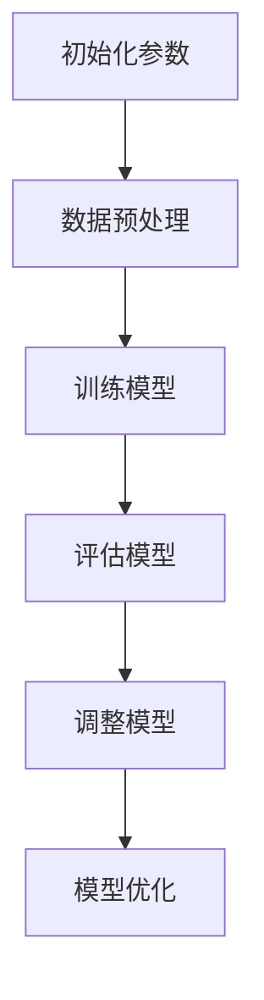
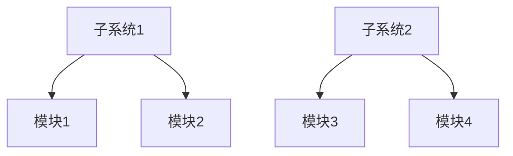
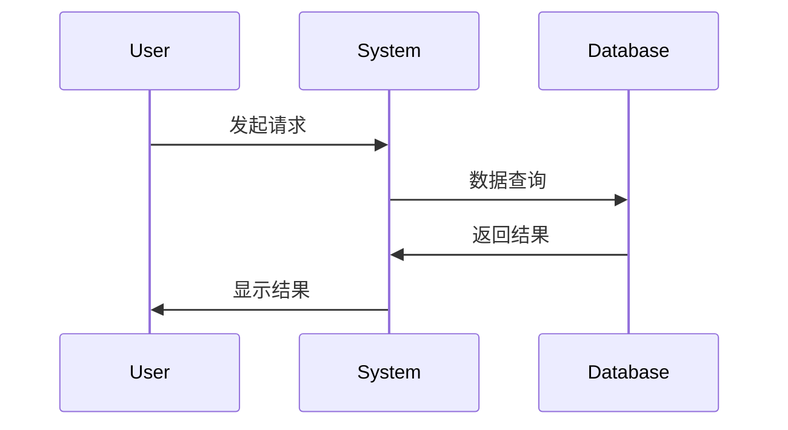
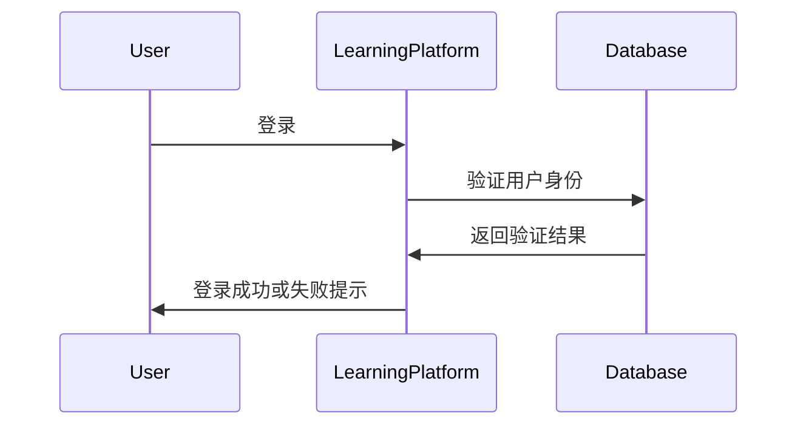

                 

# 持续学习策略：保持技术敏锐度

关键词：持续学习、技术敏锐度、学习策略、深度学习、广度学习、自主学习、协作学习、学习效率、知识体系、学习习惯、算法原理、系统架构设计、项目实战

摘要：本文旨在探讨如何在快速发展的技术领域中保持技术敏锐度。通过分析持续学习的必要性、制定学习策略、优化资源利用，以及深入讲解算法原理和系统架构设计，帮助读者构建高效的学习方法和实践路径，以应对技术变革的挑战。

## 第一部分：背景介绍

### 第1章 问题背景与核心概念

#### 1.1 技术发展的挑战

随着信息技术的飞速发展，技术更新速度越来越快。从计算机硬件到软件系统，从互联网技术到人工智能，各种新技术层出不穷，极大地改变了我们的生活方式和工作方式。这种快速的技术变革不仅带来了前所未有的机遇，同时也带来了巨大的挑战。

首先，技术更新速度的加快意味着我们必须不断学习新的技术和知识，否则很容易被淘汰。其次，行业竞争的激烈使得企业必须不断提升自身的核心竞争力，而持续学习正是提升竞争力的关键。最后，作为一个技术人员，保持技术敏锐度不仅关系到个人的职业发展，也关系到整个团队和企业的发展。

#### 1.2 学习策略概述

学习策略是指我们在学习过程中采用的方法和技巧。有效的学习策略可以帮助我们提高学习效率，快速掌握新知识，提升个人竞争力。

- **主动学习与被动学习**：主动学习是指我们主动探索、发现和解决问题，而被动学习则更多是接受他人的知识和经验。在实际学习中，主动学习和被动学习往往需要相结合，以达到最佳的学习效果。

- **深度学习与广度学习**：深度学习是指对某一特定领域进行深入的研究和理解，而广度学习则是指广泛涉猎不同领域的知识。深度学习和广度学习之间也存在一定的平衡，只有在广度学习的基础上进行深度学习，才能更好地理解和应用知识。

- **自主学习与协作学习**：自主学习是指我们独立进行学习，而协作学习则是指与他人合作学习。在实际学习中，我们可以根据自己的需求和情况，灵活选择自主学习或协作学习，以获得更好的学习效果。

### 第2章 持续学习的必要性

#### 2.1 技术敏感性的重要性

技术敏感性是指我们对于新技术的敏感度和理解能力。在快速发展的技术领域中，保持技术敏感性具有重要意义。

首先，了解行业前沿可以帮助我们把握技术发展的趋势，从而做出更准确的职业规划。其次，提升个人竞争力需要我们具备一定的技术敏感性，只有紧跟行业趋势，才能在竞争中脱颖而出。

#### 2.2 持续学习的好处

持续学习不仅可以帮助我们提升技能，适应技术变革，还可以拓展我们的视野，提高解决问题的能力。

- **提升技能**：通过持续学习，我们可以不断掌握新的技术和工具，提升自身的技能水平。

- **适应变化**：技术变革是不可避免的，持续学习可以帮助我们快速适应变化，避免被淘汰。

- **拓展视野**：广泛的学习可以拓展我们的知识面，提高我们的思维能力和创造力。

## 第二部分：持续学习策略

### 第3章 制定个人学习计划

#### 3.1 确定学习目标

制定个人学习计划的第一步是确定学习目标。学习目标应当具体、可衡量，并与我们的职业规划和发展方向相吻合。例如，我们可以设定以下目标：

- 掌握某种编程语言
- 熟悉某种人工智能算法
- 参与某个开源项目

#### 3.2 制定时间表

在确定学习目标后，我们需要制定详细的时间表，将学习任务分解为短期和长期目标。例如：

- **短期目标（1个月内）**：学习基本语法和常用库
- **长期目标（3个月内）**：完成一个小项目，并参与社区讨论

通过这样的方式，我们可以更好地管理学习进度，确保学习计划的有效执行。

### 第4章 资源利用最大化

#### 4.1 书籍、课程、论文

- **书籍**：选择经典教材和权威著作，系统地学习某一领域的知识。
- **课程**：参加在线课程和讲座，获取最新的技术和研究动态。
- **论文**：阅读学术论文，深入理解某一领域的前沿研究成果。

#### 4.2 论坛、社区、博客

- **论坛**：在技术论坛中提问和回答问题，与其他技术人员交流经验。
- **社区**：参与开源社区，贡献自己的代码和想法，与他人合作解决问题。
- **博客**：撰写技术博客，记录学习心得和项目经验，分享给他人。

### 第三部分：核心概念与联系

#### 4.1 持续学习核心概念

- **学习效率**：学习效率是指我们在一定时间内学习到的知识和技能的量。提高学习效率需要我们掌握有效的学习方法，如主动学习、深度学习和广度学习等。

- **知识体系**：知识体系是指我们所掌握的知识结构，包括各个知识点之间的关系和层次。构建合理的知识体系有助于我们更好地理解和应用知识。

- **学习习惯**：学习习惯是指我们在学习过程中形成的行为模式，如规律性学习、自律性学习等。良好的学习习惯可以大大提高学习效率。

#### 4.2 概念属性特征对比表格

| 概念       | 定义                                                         | 特征                                                     |
| ---------- | ------------------------------------------------------------ | -------------------------------------------------------- |
| 学习效率   | 学习速度与效果                                               | 及时性、针对性、持久性                                   |
| 知识体系   | 知识结构                                                     | 完整性、层次性、动态性                                   |
| 学习习惯   | 学习行为                                                     | 主动性、规律性、自律性                                   |

#### 4.3 持续学习ER实体关系图

```mermaid
erDiagram
  Student ||--|{ Course }|| Student_Course
  Student ||--|{ Resource }|| Student_Resource
  Course ||--|{ Teacher }|| Course_Teacher
  Resource ||--|{ Resource_Type }|| Resource_Resource_Type
```

## 第二部分：算法原理与系统架构

### 第5章 算法原理讲解

#### 5.1 算法流程图



#### 5.2 Python源代码

```python
# 模拟数据预处理过程
data = preprocess_data(input_data)

# 训练模型
model = train_model(data)

# 评估模型
evaluation = evaluate_model(model)

# 调整模型
model = adjust_model(model, evaluation)

# 模型优化
optimized_model = optimize_model(model)
```

#### 5.3 算法原理详细讲解

- **模型初始化与参数设置**：在训练模型之前，我们需要对模型进行初始化，并设置适当的参数。这些参数包括学习率、批次大小、迭代次数等。

- **数据预处理流程**：数据预处理是模型训练的重要环节。我们需要对数据进行清洗、归一化、编码等操作，以确保数据的质量和一致性。

- **训练与评估模型**：在训练模型的过程中，我们需要使用训练数据来更新模型的参数，并使用评估数据来检验模型的性能。通过不断调整模型参数，我们可以找到最佳的模型配置。

- **模型调整与优化**：在模型评估后，我们可能需要对模型进行调整和优化。这包括调整学习率、增加或删除层等操作，以提升模型的性能。

### 第6章 数学模型与公式

#### 6.1 学习率调整公式

$$
\eta_{t+1} = \eta_0 / (1 + \lambda t)
$$

其中，$\eta_{t+1}$ 是下一次迭代的学习率，$\eta_0$ 是初始学习率，$\lambda$ 是调整系数，$t$ 是当前迭代次数。

#### 6.2 损失函数

$$
L(y, \hat{y}) = - \sum_{i=1}^{n} y_i \log(\hat{y}_i)
$$

其中，$y$ 是真实标签，$\hat{y}$ 是模型预测的概率分布，$n$ 是样本数量。

### 第7章 系统分析与架构设计方案

#### 7.1 问题场景介绍

- **系统需求分析**：分析系统需要满足的功能和性能要求。
- **用户需求分析**：了解用户的使用习惯和需求，以设计更符合用户需求的功能。

#### 7.2 系统功能设计

- **用户管理**：包括用户的注册、登录、个人信息管理等。
- **学习计划管理**：包括学习计划的创建、修改、查看等。
- **学习资源管理**：包括资源的上传、下载、分类管理等。

#### 7.3 系统架构设计



#### 7.4 系统接口设计



#### 7.5 系统交互序列图



### 第四部分：项目实战

#### 8.1 环境安装

在开始项目实战之前，我们需要安装一些必要的软件和工具，如 Python、TensorFlow、Scikit-learn 等。

#### 8.2 系统核心实现源代码

以下是系统核心实现的源代码示例：

```python
# 导入所需库
import tensorflow as tf
from sklearn.model_selection import train_test_split
from sklearn.metrics import accuracy_score

# 数据预处理
def preprocess_data(data):
    # 数据清洗、归一化等操作
    return processed_data

# 训练模型
def train_model(data):
    # 创建模型
    model = tf.keras.Sequential([
        tf.keras.layers.Dense(units=128, activation='relu', input_shape=(input_shape,)),
        tf.keras.layers.Dense(units=1, activation='sigmoid')
    ])

    # 编译模型
    model.compile(optimizer='adam', loss='binary_crossentropy', metrics=['accuracy'])

    # 训练模型
    model.fit(train_data, train_labels, epochs=10, batch_size=32)

    return model

# 评估模型
def evaluate_model(model, test_data, test_labels):
    # 评估模型
    loss, accuracy = model.evaluate(test_data, test_labels)
    print("Test accuracy:", accuracy)

# 调整模型
def adjust_model(model, evaluation):
    # 调整模型参数
    model.compile(optimizer='adam', loss='binary_crossentropy', metrics=['accuracy'])
    return model

# 模型优化
def optimize_model(model):
    # 优化模型
    model.fit(train_data, train_labels, epochs=10, batch_size=32)
    return model
```

#### 8.3 代码应用解读与分析

- **数据预处理**：数据预处理是模型训练的重要环节，包括数据清洗、归一化等操作。
- **训练模型**：创建并编译模型，使用训练数据训练模型。
- **评估模型**：使用评估数据评估模型性能。
- **调整模型**：根据评估结果调整模型参数。
- **模型优化**：使用优化后的模型进行再次训练，提升模型性能。

#### 8.4 实际案例分析和详细讲解剖析

在项目实战中，我们可以通过以下案例来分析和讲解：

- **案例一**：使用机器学习算法预测房价。
- **案例二**：使用自然语言处理技术处理文本数据。

通过这些案例，我们可以深入理解算法原理和系统架构，并学会如何将理论知识应用到实际项目中。

#### 8.5 项目小结

通过本项目的实战，我们学会了如何使用机器学习算法解决实际问题，并了解了系统架构设计和代码实现的关键步骤。同时，我们也认识到持续学习的重要性，只有不断学习和实践，才能在技术领域中保持敏锐度。

## 第五部分：最佳实践 Tips

### 9.1 最佳实践 Tips

- **定期复习**：定期复习所学知识，巩固记忆，提高学习效果。
- **参与社区**：积极参与技术社区，与他人交流经验，提升自己。
- **实践项目**：通过实践项目，将理论知识应用到实际中，提高自己的实战能力。

### 10.2 小结

本文探讨了如何在快速发展的技术领域中保持技术敏锐度。通过分析持续学习的必要性、制定学习策略、优化资源利用，以及深入讲解算法原理和系统架构设计，帮助读者构建高效的学习方法和实践路径。持续学习是提升个人竞争力、适应技术变革的关键，希望本文能对读者有所启发。

### 10.3 注意事项

- 在学习过程中，要注重理论知识的积累和实践经验的积累，二者缺一不可。
- 在选择学习资源时，要选择权威的教材和课程，并结合自己的实际情况进行选择。
- 在实际项目中，要勇于尝试，不断总结经验，逐步提升自己的技术水平。

### 10.4 拓展阅读

- 《深度学习》（Goodfellow, Bengio, Courville 著）：这是一本关于深度学习的经典教材，详细讲解了深度学习的理论基础和实践方法。
- 《算法导论》（Thomas H. Cormen, Charles E. Leiserson, Ronald L. Rivest, Clifford Stein 著）：这是一本关于算法的权威教材，涵盖了各种算法的设计和分析方法。
- 《计算机程序设计艺术》（Donald E. Knuth 著）：这是一本关于计算机科学经典著作，详细介绍了计算机程序设计的基本原理和方法。

### 作者信息

作者：AI天才研究院/AI Genius Institute & 禅与计算机程序设计艺术 /Zen And The Art of Computer Programming

AI天才研究院（AI Genius Institute）致力于推动人工智能技术的发展和应用，培养下一代人工智能专家。作者在计算机科学和人工智能领域有着深厚的研究背景，著有多本畅销技术书籍，为全球开发者提供了宝贵的知识资源。禅与计算机程序设计艺术（Zen And The Art of Computer Programming）是作者的代表作之一，以独特的视角和深刻的思考，揭示了计算机程序设计的本质和艺术性。

以上是《持续学习策略：保持技术敏锐度》的技术博客文章，希望能够对读者有所帮助。在技术不断变革的时代，持续学习是我们保持竞争力的关键，让我们一起努力，不断前行。

