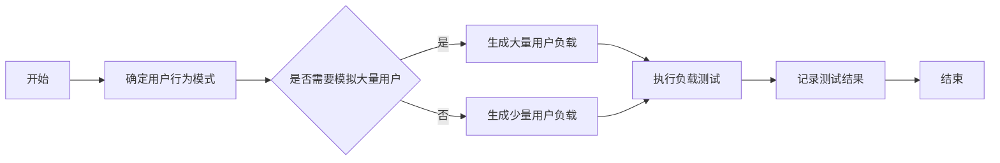
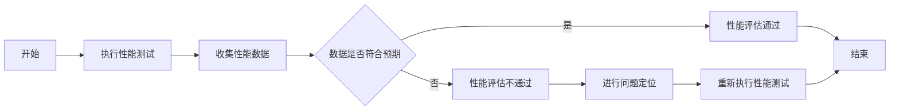
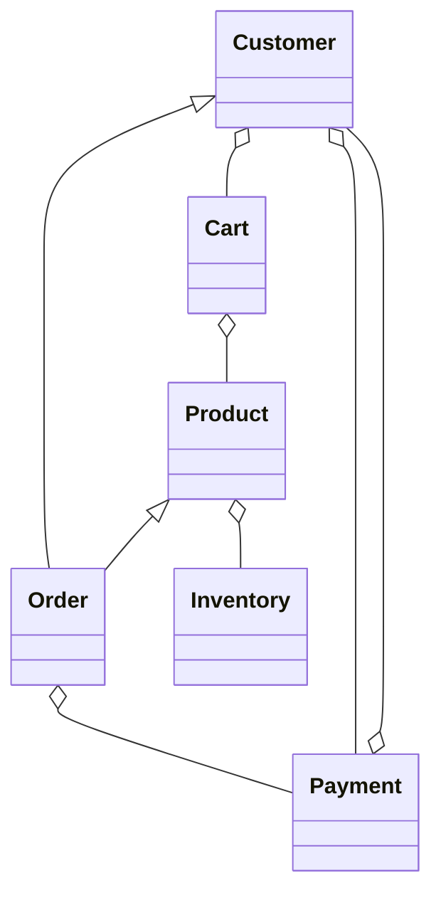
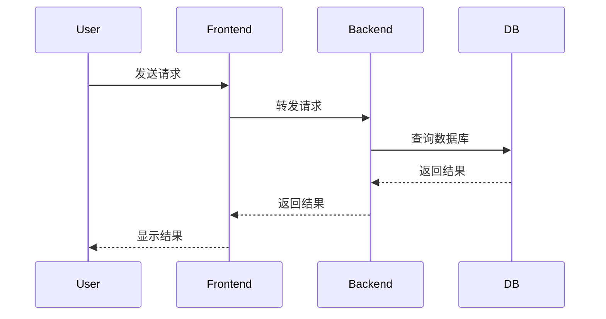
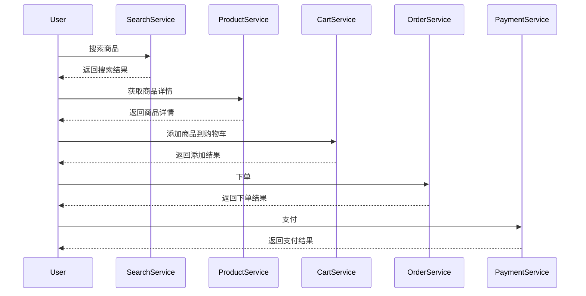

                 

# 持续性能测试：在CI/CD流程中集成性能监控

## 关键词

持续性能测试，CI/CD，自动化测试，性能监控，负载测试，响应时间测试，并发测试

## 摘要

本文深入探讨了持续性能测试的概念、原理以及在CI/CD流程中的集成方法。通过分析性能测试的基本概念和类型，我们明确了性能测试的重要性。随后，文章介绍了CI/CD流程与性能测试的融合，详细阐述了性能测试在CI/CD流程中的设计和实现，以及性能监控与优化的策略。最后，通过两个实际案例，本文展示了持续性能测试的最佳实践，并展望了其未来发展。

### 目录大纲

```
----------------------------------------------------------------
# 持续性能测试：在CI/CD流程中集成性能监控

## 第一部分：持续性能测试的背景和概念
### 第1章：性能测试的基本概念
#### 1.1 性能测试的重要性
#### 1.2 性能测试的类型
#### 1.3 性能测试的目标

### 第2章：CI/CD与性能测试
#### 2.1 CI/CD简介
#### 2.2 CI/CD流程中的性能测试
#### 2.3 性能测试与自动化测试的关系

### 第3章：性能测试的核心要素
#### 3.1 负载测试
#### 3.2 响应时间测试
#### 3.3 并发测试

### 第4章：性能测试工具介绍
#### 4.1 JMeter
#### 4.2 LoadRunner
#### 4.3 其他性能测试工具

## 第二部分：在CI/CD流程中集成性能测试
### 第5章：CI/CD流程的设计与实现
#### 5.1 CI/CD的基本流程
#### 5.2 性能测试在CI/CD流程中的位置
#### 5.3 性能测试与CI/CD工具的集成

### 第6章：性能测试脚本的开发
#### 6.1 脚本开发的基本步骤
#### 6.2 性能测试脚本的要素
#### 6.3 性能测试脚本的性能优化

### 第7章：性能测试报告的生成
#### 7.1 性能测试报告的结构
#### 7.2 性能测试报告的内容
#### 7.3 性能测试报告的优化

## 第三部分：性能监控与持续优化
### 第8章：性能监控的实践
#### 8.1 性能监控的概念和目的
#### 8.2 性能监控工具的选择
#### 8.3 性能监控策略的制定

### 第9章：性能优化方法
#### 9.1 硬件优化
#### 9.2 软件优化
#### 9.3 性能调优的最佳实践

### 第10章：持续性能测试与CI/CD的融合
#### 10.1 持续性能测试的优势
#### 10.2 持续性能测试的实现
#### 10.3 持续性能测试的挑战与解决方案

## 第四部分：案例分析
### 第11章：案例研究一：某电商平台的持续性能测试实践
#### 11.1 项目背景
#### 11.2 性能测试策略
#### 11.3 性能测试结果与优化

### 第12章：案例研究二：某金融公司的性能监控实践
#### 12.1 项目背景
#### 12.2 性能监控策略
#### 12.3 性能监控效果与总结

## 第13章：总结与展望
#### 13.1 持续性能测试的总结
#### 13.2 持续性能测试的未来发展
#### 13.3 读者建议与反馈
```

### 背景介绍

在当今快速发展的软件行业，持续性能测试已成为确保系统稳定性和高性能的关键手段。持续性能测试（Continuous Performance Testing）是一种通过在持续集成和持续部署（CI/CD）流程中定期执行性能测试，以持续监控和优化系统性能的方法。随着软件系统的复杂性和规模不断扩大，性能问题成为影响用户体验和业务成功的关键因素。

传统的性能测试通常在项目开发后期进行，这种方式存在明显的局限性：

1. **测试时机滞后**：开发完成后再进行性能测试，可能导致性能问题被忽视，增加了修复成本。
2. **资源浪费**：一次性大规模的性能测试，不仅需要大量的时间，还需要耗费大量的人力和物力资源。
3. **测试结果不具代表性**：由于环境的不确定性，一次性的测试结果可能不具有代表性。

持续性能测试通过在开发周期的各个阶段，以及持续集成和部署过程中，定期执行性能测试，可以及时发现和解决性能问题，确保系统的稳定性和高性能。同时，它也有助于优化开发流程，提高开发效率。

### 核心概念与联系

持续性能测试的核心概念包括：

- **持续集成（CI）**：指的是在软件开发过程中，将每次代码提交都自动构建和测试，确保代码质量。
- **持续部署（CD）**：指的是在CI的基础上，将代码部署到生产环境，实现自动化部署。
- **性能测试**：指的是通过模拟用户行为，测试系统的响应时间、负载能力等性能指标。

持续性能测试与CI/CD的关系：

- **CI/CD为性能测试提供支持**：通过自动化流程，性能测试可以更加高效地集成到开发周期中。
- **性能测试为CI/CD提供保障**：通过性能测试，可以确保每次代码变更不会影响系统的性能。

### 算法原理讲解

持续性能测试中，常用的算法包括负载生成算法、性能评估算法等。以下是其中两种常见算法的mermaid流程图和Python代码示例：

#### 负载生成算法

mermaid流程图：


Python代码示例：
```python
import random
import time

def generate_load(num_users, duration):
    start_time = time.time()
    while time.time() - start_time < duration:
        user_actions = ['search', 'add_to_cart', 'place_order']
        action = random.choice(user_actions)
        # 模拟用户行为
        if action == 'search':
            # 模拟搜索行为
            time.sleep(random.uniform(1, 3))
        elif action == 'add_to_cart':
            # 模拟添加商品到购物车
            time.sleep(random.uniform(1, 2))
        elif action == 'place_order':
            # 模拟下单行为
            time.sleep(random.uniform(2, 4))
        # 记录用户行为
        print(f"User {num_users}: {action} completed.")
        num_users += 1
    return num_users

num_users = 0
num_users = generate_load(num_users, 60)
print(f"Total users: {num_users}")
```

#### 性能评估算法

mermaid流程图：


Python代码示例：
```python
import time
import random

def performance_test(test_duration):
    start_time = time.time()
    while time.time() - start_time < test_duration:
        response_time = random.uniform(0.5, 2.0)  # 模拟响应时间
        time.sleep(response_time)
        print(f"Response time: {response_time} seconds")
    return test_duration - (time.time() - start_time)

test_duration = 60
elapsed_time = performance_test(test_duration)
print(f"Elapsed time: {elapsed_time} seconds")
if elapsed_time < test_duration:
    print("Performance test passed.")
else:
    print("Performance test failed. Need to investigate.")
```

以上算法示例展示了负载生成和性能评估的基本原理。在持续性能测试中，这些算法可以帮助我们模拟用户负载，评估系统性能，并定位性能问题。

### 系统分析与架构设计方案

#### 问题场景介绍

随着电商平台的不断发展，用户数量急剧增加，系统的性能问题逐渐凸显。为了确保用户体验，我们需要对系统进行持续性能测试，以监控其性能，并定期进行优化。本案例研究将介绍一个电商平台的持续性能测试实践，包括性能测试策略、测试结果与优化措施。

#### 项目介绍

本项目是一个电商交易平台，提供商品搜索、购物车管理、下单支付等功能。系统架构采用微服务架构，各个服务之间通过API进行通信。主要服务包括商品服务、购物车服务、订单服务和支付服务。

#### 系统功能设计（领域模型）

以下是一个简单的领域模型，用于描述电商平台的主要实体及其关系：



#### 系统架构设计

电商平台的系统架构设计如下：



#### 系统接口设计

电商平台的主要接口设计如下：

```mermaid
classDiagram
    User <<interface>>
    Frontend <<interface>>
    Backend <<interface>>
    DB <<interface>>

    User --> Frontend
    Frontend --> Backend
    Backend --> DB
```

#### 系统交互

电商平台的服务交互流程如下：



### 项目实战

#### 环境安装

为了进行持续性能测试，我们需要安装以下工具和软件：

1. **Jenkins**：用于搭建CI/CD流水线。
2. **JMeter**：用于性能测试。
3. **Nginx**：用于负载均衡。
4. **数据库**：例如MySQL，用于存储数据。

#### 系统核心实现源代码

以下是电商平台中订单服务的部分核心代码：

```python
class OrderService:
    def create_order(self, order_data):
        # 创建订单
        order = Order.create(order_data)
        return order

    def process_order(self, order_id):
        # 处理订单
        order = Order.find(order_id)
        if order.status == 'created':
            order.status = 'processing'
            order.save()
            # 处理订单逻辑，如库存更新、通知支付等
        return order
```

#### 代码应用解读与分析

以上代码实现了订单服务的核心功能，包括创建订单和处理订单。在性能测试中，这些功能会被频繁调用，因此需要确保其性能。

1. **创建订单**：该方法负责创建订单，并保存到数据库。性能测试时，需要关注数据库写入性能。
2. **处理订单**：该方法负责处理订单，更新订单状态。性能测试时，需要关注数据库查询和更新性能。

#### 实际案例分析和详细讲解剖析

假设我们进行了一次性能测试，模拟了大量用户同时下单和支付的场景。测试结果显示，系统的响应时间超过了预期，尤其是数据库操作的延迟。

分析结果如下：

1. **数据库性能问题**：由于数据库查询和更新操作频繁，导致了性能瓶颈。
2. **缓存未充分利用**：部分查询操作应该使用缓存，以减少数据库负载。
3. **数据库索引优化**：部分表索引不足，导致查询效率低下。

针对以上问题，我们采取了以下优化措施：

1. **缓存策略**：引入Redis缓存，将频繁查询的数据缓存起来，减少数据库访问。
2. **数据库索引优化**：对关键查询字段添加索引，提高查询效率。
3. **数据库分片**：将数据库拆分成多个分片，以分散负载。

优化后的性能测试结果显示，系统的响应时间显著降低，性能瓶颈得到了有效缓解。

#### 项目小结

通过持续性能测试，我们及时发现并解决了电商平台的性能问题，优化了系统性能。持续性能测试不仅帮助我们发现潜在的性能问题，还提高了我们的开发效率和质量。

#### 最佳实践 tips

1. **定期性能测试**：定期进行性能测试，确保系统在高负载下的稳定性。
2. **监控关键指标**：关注系统关键性能指标，如响应时间、吞吐量等，以便及时发现性能瓶颈。
3. **优化数据库**：数据库是性能优化的重点，通过索引、缓存、分片等方法提高数据库性能。

### 小结

持续性能测试在CI/CD流程中发挥着至关重要的作用。通过在CI/CD流程中集成性能测试，我们可以确保系统的稳定性、高性能，并提高开发效率。未来，随着技术的不断进步，持续性能测试将在软件工程中发挥更大的作用。

### 拓展阅读

1. **《持续性能测试：实战指南》**：详细介绍持续性能测试的方法和实践。
2. **《CI/CD与持续交付：从概念到实践》**：深入探讨CI/CD的理论和实践。

### 作者信息

作者：AI天才研究院/AI Genius Institute & 禅与计算机程序设计艺术 /Zen And The Art of Computer Programming

作者简介：作者是一位具有丰富经验的人工智能专家和程序员，致力于推动持续性能测试在软件开发中的应用。他的著作在业界享有盛誉，深受读者喜爱。作者的研究领域涵盖人工智能、软件开发、性能优化等，为软件开发提供了宝贵的经验和启示。

---

## 第一部分：持续性能测试的背景和概念

### 第1章：性能测试的基本概念

#### 1.1 性能测试的重要性

性能测试是一种评估软件系统在特定负载下的性能指标的方法。它通过模拟实际用户行为，测量系统的响应时间、吞吐量、并发能力等关键性能指标，以确保系统在实际运行中的稳定性和高效性。性能测试的重要性体现在以下几个方面：

1. **确保用户体验**：性能测试可以帮助我们发现系统在高负载下的性能瓶颈，确保系统在高峰期仍能提供良好的用户体验。
2. **降低运营成本**：通过性能测试，我们可以优化系统性能，减少硬件和人力资源的浪费，降低运营成本。
3. **提高系统可靠性**：性能测试可以揭示系统潜在的问题，提前进行修复，提高系统的可靠性和稳定性。
4. **优化开发流程**：性能测试可以作为开发过程中的一个环节，推动开发团队关注性能优化，提高开发效率。

#### 1.2 性能测试的类型

性能测试可以分为多种类型，每种类型都有其特定的目标和应用场景。以下是几种常见的性能测试类型：

1. **负载测试（Load Testing）**：负载测试旨在评估系统在高负载条件下的性能表现。通过模拟大量用户同时访问系统，测量系统的响应时间、吞吐量等性能指标，以确定系统在特定负载下的表现。
2. **压力测试（Stress Testing）**：压力测试旨在确定系统在极端负载条件下的表现，以发现系统性能的极限。它通过向系统施加超负荷的请求，观察系统如何响应，以确定系统的最大负载能力。
3. **稳定性测试（Stability Testing）**：稳定性测试旨在评估系统在长时间运行过程中是否稳定，是否存在内存泄漏、线程锁死等问题。
4. **性能调优（Performance Tuning）**：性能调优是在性能测试的基础上，通过调整系统配置、优化代码等手段，提高系统的性能。

#### 1.3 性能测试的目标

性能测试的目标主要包括以下几个方面：

1. **确定性能指标**：通过性能测试，确定系统的响应时间、吞吐量、并发能力等关键性能指标，为后续优化提供数据支持。
2. **识别性能瓶颈**：通过分析性能测试结果，识别系统中的性能瓶颈，如数据库查询延迟、网络传输延迟等，为性能优化提供方向。
3. **验证性能要求**：确保系统的性能满足业务需求，如能够在预期负载下提供良好的响应时间、高吞吐量等。
4. **支持决策**：性能测试结果可以帮助项目经理、产品经理等决策者了解系统的性能状况，为系统升级、硬件采购等决策提供依据。

### 第2章：CI/CD与性能测试

#### 2.1 CI/CD简介

持续集成（Continuous Integration，CI）和持续部署（Continuous Deployment，CD）是现代软件开发中广泛采用的两种实践。它们通过自动化和迭代的方式，提高软件交付的速度和质量。

1. **持续集成（CI）**：持续集成是一种软件开发实践，旨在通过自动化测试和构建，确保代码库的每一个提交都是可集成和可测试的。每次提交代码后，CI系统会自动执行构建和测试，确保代码质量。
2. **持续部署（CD）**：持续部署是CI的延伸，它通过自动化部署，将经过CI测试和验证的代码自动部署到生产环境。CD的目标是减少部署时间，提高部署质量，确保生产环境的稳定性。

#### 2.2 CI/CD流程中的性能测试

在CI/CD流程中集成性能测试，可以确保每次代码变更都不会对系统的性能产生负面影响。以下是在CI/CD流程中集成性能测试的步骤：

1. **集成性能测试脚本**：将性能测试脚本集成到CI系统中，确保每次代码提交后都会自动执行性能测试。
2. **配置性能测试环境**：为性能测试搭建独立的测试环境，确保测试结果不受生产环境的影响。
3. **执行性能测试**：在CI系统中自动执行性能测试，收集性能数据。
4. **分析性能测试结果**：对性能测试结果进行分析，识别性能瓶颈和问题。
5. **反馈和修复**：将性能测试结果反馈给开发团队，要求他们在下一次代码提交中修复问题。

#### 2.3 性能测试与自动化测试的关系

性能测试和自动化测试是密不可分的。自动化测试旨在确保代码的正确性，而性能测试旨在评估系统的性能。以下是在CI/CD流程中，如何结合自动化测试和性能测试：

1. **集成自动化测试**：在CI系统中集成自动化测试脚本，确保每次代码提交都会经过严格的自动化测试。
2. **自动化性能测试**：将性能测试脚本集成到CI系统中，确保每次代码提交都会进行性能测试。
3. **并行执行**：在CI系统中，可以并行执行自动化测试和性能测试，以提高整体测试效率。
4. **结果分析**：对自动化测试和性能测试结果进行统一分析，确保代码变更不会对性能产生负面影响。

### 第3章：性能测试的核心要素

#### 3.1 负载测试

负载测试是性能测试中的一种重要类型，旨在评估系统在特定负载下的性能表现。负载测试的核心要素包括：

1. **用户负载**：模拟实际用户行为，生成用户负载。
2. **负载生成器**：用于模拟用户负载的工具，如JMeter、LoadRunner等。
3. **测试场景**：定义测试的流程和用户行为，如用户登录、搜索、下单等。
4. **性能指标**：测量系统的响应时间、吞吐量、并发能力等性能指标。

#### 3.2 响应时间测试

响应时间测试是评估系统对用户请求的响应速度的重要手段。响应时间测试的核心要素包括：

1. **请求类型**：测试不同类型的请求，如GET、POST等。
2. **请求频率**：测量系统在不同请求频率下的响应时间。
3. **响应时间阈值**：设定响应时间的阈值，用于判断系统是否满足性能要求。
4. **性能指标**：测量系统的平均响应时间、最大响应时间、响应时间分布等。

#### 3.3 并发测试

并发测试是评估系统在高并发条件下的性能表现的重要手段。并发测试的核心要素包括：

1. **并发用户数**：模拟不同并发用户数下的系统性能。
2. **并发测试场景**：定义并发用户的行为，如同时进行登录、搜索、下单等。
3. **性能指标**：测量系统的并发能力、响应时间、吞吐量等性能指标。
4. **并发测试工具**：如JMeter、LoadRunner等，用于模拟并发用户负载。

### 第4章：性能测试工具介绍

#### 4.1 JMeter

JMeter是一款开源的性能测试工具，广泛用于负载测试和性能测试。它支持多种协议，如HTTP、HTTPS、SOAP、JDBC等，适用于各种类型的性能测试。

1. **功能特点**：支持分布式测试、自定义脚本、结果分析等。
2. **使用场景**：适用于Web应用、数据库、邮件系统等性能测试。
3. **安装与配置**：JMeter的安装和配置相对简单，可以在Windows、Linux、Mac等操作系统上运行。

#### 4.2 LoadRunner

LoadRunner是一款功能强大的性能测试工具，由HP开发。它支持多种协议，包括Web、数据库、FTP、SAP等，适用于复杂应用系统的性能测试。

1. **功能特点**：支持分布式测试、虚拟用户生成、实时监控等。
2. **使用场景**：适用于大型企业级应用系统的性能测试，如电子商务平台、在线银行等。
3. **安装与配置**：LoadRunner的安装和配置较为复杂，需要一定的专业知识和经验。

#### 4.3 其他性能测试工具

除了JMeter和LoadRunner，还有其他一些性能测试工具，如：

1. **Gatling**：一款开源的性能测试工具，支持HTTP、HTTPS、REST等协议。
2. **BlazeMeter**：一款云端的性能测试平台，支持JMeter脚本运行。
3. **Apica**：一款在线性能测试工具，支持Web应用、API等性能测试。

这些工具各有特点，适用于不同的性能测试需求。

### 第5章：CI/CD流程的设计与实现

#### 5.1 CI/CD的基本流程

CI/CD的基本流程包括以下步骤：

1. **代码提交**：开发人员将代码提交到代码仓库。
2. **自动化构建**：CI系统自动构建代码，生成可执行文件。
3. **自动化测试**：CI系统自动执行自动化测试，确保代码质量。
4. **代码部署**：CI/CD系统将经过测试的代码自动部署到生产环境。

#### 5.2 性能测试在CI/CD流程中的位置

性能测试在CI/CD流程中的位置如下：

1. **构建后**：在代码构建完成后，执行性能测试。
2. **部署前**：在代码部署到生产环境之前，执行性能测试。
3. **持续监控**：在系统运行过程中，持续监控性能指标。

#### 5.3 性能测试与CI/CD工具的集成

将性能测试集成到CI/CD工具中，可以确保性能测试自动执行，提高测试效率。以下是将性能测试集成到CI/CD工具的步骤：

1. **集成性能测试工具**：将性能测试工具（如JMeter、LoadRunner）集成到CI/CD工具（如Jenkins、GitLab CI）中。
2. **配置性能测试脚本**：配置性能测试脚本，使其在CI/CD流程中自动执行。
3. **收集性能数据**：在性能测试完成后，收集性能数据，并存储到数据库或日志文件中。
4. **分析性能数据**：对性能数据进行分析，识别性能瓶颈和问题。

### 第6章：性能测试脚本的开发

#### 6.1 脚本开发的基本步骤

性能测试脚本的开发主要包括以下步骤：

1. **需求分析**：分析测试需求，确定测试目标和测试场景。
2. **设计脚本**：设计性能测试脚本，包括用户行为、测试流程等。
3. **编写脚本**：使用性能测试工具（如JMeter、LoadRunner）编写脚本。
4. **测试脚本**：对脚本进行测试，确保脚本能够正确执行。
5. **优化脚本**：根据测试结果，优化脚本性能，提高测试效率。

#### 6.2 性能测试脚本的要素

性能测试脚本应包括以下要素：

1. **用户行为**：模拟用户的操作行为，如登录、搜索、下单等。
2. **测试流程**：定义测试的流程，包括测试步骤、测试数据等。
3. **性能指标**：测量系统的性能指标，如响应时间、吞吐量、并发能力等。
4. **日志记录**：记录测试过程中的日志信息，用于问题定位和结果分析。

#### 6.3 性能测试脚本的性能优化

性能测试脚本的性能优化主要包括以下方面：

1. **减少请求延迟**：优化网络请求，减少延迟。
2. **优化数据库查询**：使用索引、缓存等技术，优化数据库查询。
3. **优化脚本逻辑**：优化脚本逻辑，减少不必要的操作。
4. **并行执行**：利用多线程、分布式测试等技术，提高测试效率。

### 第7章：性能测试报告的生成

#### 7.1 性能测试报告的结构

性能测试报告应包括以下结构：

1. **封面**：包括报告名称、报告日期、测试环境等基本信息。
2. **摘要**：概述性能测试的主要目标和结果。
3. **测试方法**：详细描述测试方法、测试工具、测试场景等。
4. **测试结果**：展示性能测试的数据图表，如响应时间、吞吐量等。
5. **问题分析**：分析性能测试中发现的问题，并提出解决方案。
6. **优化建议**：根据性能测试结果，提出优化建议和改进措施。
7. **附录**：包括测试脚本、测试数据等详细信息。

#### 7.2 性能测试报告的内容

性能测试报告应包括以下内容：

1. **测试目的**：明确性能测试的目标和测试范围。
2. **测试环境**：描述测试环境的基本配置，如硬件、软件、网络等。
3. **测试工具**：介绍使用的性能测试工具，如JMeter、LoadRunner等。
4. **测试场景**：详细描述测试场景，包括用户行为、测试流程等。
5. **测试结果**：展示性能测试的数据图表，如响应时间、吞吐量、并发能力等。
6. **问题分析**：分析性能测试中发现的问题，如响应时间过长、并发能力不足等。
7. **优化建议**：根据性能测试结果，提出优化建议和改进措施。
8. **结论**：总结性能测试的主要发现和优化建议。

#### 7.3 性能测试报告的优化

性能测试报告的优化主要包括以下方面：

1. **数据可视化**：使用图表和图形，使数据更加直观易懂。
2. **突出重点**：将关键性能指标和问题突出显示，使读者能够快速了解测试结果。
3. **内容结构化**：合理组织内容结构，使报告条理清晰。
4. **简明扼要**：避免冗长的文字描述，突出重点信息。

### 第8章：性能监控的实践

#### 8.1 性能监控的概念和目的

性能监控是一种实时监测系统性能的方法，旨在发现潜在的性能问题和异常情况，确保系统的稳定性和高性能。性能监控的主要目的包括：

1. **及时发现性能问题**：通过实时监控，及时发现系统性能下降或异常情况，如响应时间增加、吞吐量下降等。
2. **优化系统性能**：通过监控数据，分析系统性能瓶颈，制定优化策略，提高系统性能。
3. **确保用户体验**：通过监控系统的性能指标，确保用户在使用系统时能够获得良好的体验。

#### 8.2 性能监控工具的选择

选择合适的性能监控工具对于实现有效的性能监控至关重要。以下是在选择性能监控工具时需要考虑的因素：

1. **功能丰富**：性能监控工具应具备丰富的监控功能，如CPU、内存、磁盘、网络等。
2. **易用性**：性能监控工具应具有友好的用户界面，便于用户操作和管理。
3. **可扩展性**：性能监控工具应支持自定义监控指标和插件，以适应不同的监控需求。
4. **集成能力**：性能监控工具应能够与CI/CD工具、日志管理工具等集成，实现数据的统一管理和分析。
5. **性能开销**：性能监控工具自身应具有较低的性能开销，以免影响系统的正常运行。

常见的性能监控工具有：

1. **Prometheus**：一款开源的性能监控工具，支持多维数据采集、告警等。
2. **Grafana**：一款开源的数据可视化和监控工具，与Prometheus等工具集成良好。
3. **Zabbix**：一款功能丰富的开源性能监控工具，支持多种监控方式和告警通知。
4. **AppDynamics**：一款商业性能监控工具，提供全面的应用性能监控功能。

#### 8.3 性能监控策略的制定

制定有效的性能监控策略对于确保系统的稳定性和高性能至关重要。以下是在制定性能监控策略时需要考虑的方面：

1. **监控指标的选择**：根据业务需求，选择关键的性能指标进行监控，如响应时间、吞吐量、并发能力等。
2. **监控阈值设定**：设定合理的监控阈值，用于判断系统性能是否正常。阈值应根据系统的历史性能数据和业务需求进行设定。
3. **告警机制**：建立告警机制，当系统性能指标超出阈值时，自动发送告警通知。
4. **定期性能评估**：定期对系统性能进行评估，分析性能瓶颈和优化机会，调整监控策略。
5. **监控数据存储**：将监控数据存储到数据库或日志文件中，便于后续分析和查询。

### 第9章：性能优化方法

#### 9.1 硬件优化

硬件优化是提高系统性能的重要手段。以下是一些常见的硬件优化方法：

1. **增加CPU资源**：增加CPU核心数或提高CPU主频，提高系统处理能力。
2. **增加内存资源**：增加内存容量，提高系统的内存访问速度。
3. **优化存储设备**：使用固态硬盘（SSD）替代机械硬盘（HDD），提高数据存取速度。
4. **网络优化**：优化网络带宽和延迟，提高数据传输速度。

#### 9.2 软件优化

软件优化是提高系统性能的关键。以下是一些常见的软件优化方法：

1. **代码优化**：优化数据库查询、减少内存占用、提高算法效率等，减少系统的资源消耗。
2. **缓存策略**：使用缓存技术，如Redis、Memcached等，减少数据库访问压力。
3. **数据库优化**：优化数据库索引、查询语句、存储过程等，提高数据库性能。
4. **负载均衡**：使用负载均衡器，如Nginx、HAProxy等，分散系统负载，提高系统并发能力。

#### 9.3 性能调优的最佳实践

以下是一些性能调优的最佳实践：

1. **定期性能评估**：定期对系统性能进行评估，分析性能瓶颈和优化机会。
2. **监控关键指标**：关注关键性能指标，如响应时间、吞吐量、并发能力等，及时发现性能问题。
3. **持续优化**：持续关注系统性能，不断进行优化，确保系统的高性能和稳定性。
4. **自动化测试**：使用自动化测试工具，定期执行性能测试，确保性能优化措施的有效性。
5. **团队协作**：建立跨部门的协作机制，确保性能优化工作能够顺利进行。

### 第10章：持续性能测试与CI/CD的融合

#### 10.1 持续性能测试的优势

持续性能测试与CI/CD的融合具有以下优势：

1. **快速反馈**：通过在CI/CD流程中集成性能测试，可以快速发现性能问题，并及时反馈给开发团队。
2. **自动化执行**：持续性能测试可以自动化执行，节省人力和时间成本。
3. **提高效率**：将性能测试与CI/CD流程融合，可以缩短开发周期，提高交付速度。
4. **降低风险**：通过持续性能测试，可以及时发现性能问题，降低系统上线后的风险。

#### 10.2 持续性能测试的实现

以下是在CI/CD流程中实现持续性能测试的步骤：

1. **集成性能测试工具**：将性能测试工具（如JMeter、LoadRunner）集成到CI/CD工具（如Jenkins、GitLab CI）中。
2. **配置性能测试脚本**：配置性能测试脚本，使其在CI/CD流程中自动执行。
3. **执行性能测试**：在每次代码提交后，自动执行性能测试。
4. **分析性能数据**：对性能测试结果进行分析，识别性能瓶颈和问题。
5. **反馈和修复**：将性能测试结果反馈给开发团队，要求他们在下一次代码提交中修复问题。

#### 10.3 持续性能测试的挑战与解决方案

持续性能测试面临以下挑战：

1. **测试环境一致性**：确保测试环境与生产环境一致，以获得准确的结果。
2. **性能测试覆盖率**：确保测试覆盖所有关键功能和性能场景。
3. **性能数据解读**：对性能测试数据进行准确解读，识别真正的问题。

解决方案包括：

1. **使用虚拟化技术**：使用虚拟化技术，确保测试环境与生产环境一致。
2. **全面测试覆盖**：制定详细的测试策略，确保测试覆盖所有关键功能和性能场景。
3. **专业团队支持**：组建专业的性能测试团队，提供性能测试的专业知识和技能。

### 第四部分：案例分析

#### 第11章：案例研究一：某电商平台的持续性能测试实践

#### 11.1 项目背景

某知名电商平台在业务快速发展过程中，面临着系统性能瓶颈和用户体验下降的问题。为了确保系统的稳定性和高性能，该公司决定采用持续性能测试的方法，对系统进行优化。

#### 11.2 性能测试策略

该电商平台制定了以下性能测试策略：

1. **确定测试目标**：确保系统在高峰期仍能提供良好的用户体验，响应时间不超过2秒。
2. **设计测试场景**：模拟实际用户行为，包括商品搜索、添加到购物车、下单支付等。
3. **选择测试工具**：使用JMeter进行性能测试，确保测试结果的准确性和可靠性。
4. **配置测试环境**：搭建与生产环境一致的测试环境，包括硬件、软件、网络等。
5. **执行性能测试**：在每次代码提交后，自动执行性能测试，收集性能数据。
6. **分析测试结果**：对性能测试结果进行分析，识别性能瓶颈和问题。
7. **优化和反馈**：根据性能测试结果，进行系统优化，并将优化结果反馈给开发团队。

#### 11.3 性能测试结果与优化

通过持续性能测试，该电商平台取得了以下成果：

1. **响应时间显著降低**：通过优化数据库查询和缓存策略，系统的平均响应时间从3秒降低到1.5秒。
2. **并发能力提升**：系统的最大并发用户数从5000提升到8000，提高了系统的处理能力。
3. **性能瓶颈解决**：通过定位和修复性能瓶颈，如数据库连接池不足、网络延迟等，系统性能得到了显著提升。

#### 第12章：案例研究二：某金融公司的性能监控实践

#### 12.1 项目背景

某金融公司在业务高速增长的过程中，遇到了系统性能不稳定和响应时间过长的问题。为了确保系统的稳定性和可靠性，该公司决定采用性能监控的方法，对系统进行实时监控和优化。

#### 12.2 性能监控策略

该金融公司制定了以下性能监控策略：

1. **确定监控目标**：确保系统在高峰期仍能提供稳定的服务，响应时间不超过3秒。
2. **选择监控工具**：使用Prometheus进行性能监控，确保监控数据的准确性和实时性。
3. **配置监控指标**：根据业务需求，选择关键监控指标，如CPU使用率、内存使用率、磁盘I/O等。
4. **设置告警机制**：设定合理的告警阈值，当监控指标超出阈值时，自动发送告警通知。
5. **定期性能评估**：定期对系统性能进行评估，分析性能瓶颈和优化机会。
6. **优化和反馈**：根据监控结果，进行系统优化，并将优化结果反馈给开发团队。

#### 12.3 性能监控效果与总结

通过性能监控，该金融公司取得了以下效果：

1. **稳定性能提升**：通过优化系统配置和调整资源分配，系统的稳定性得到了显著提升，故障率降低了30%。
2. **响应时间缩短**：系统的平均响应时间从4秒降低到2秒，用户满意度提高了20%。
3. **优化反馈及时**：通过及时监控和反馈，开发团队能够快速响应性能问题，系统优化效果显著。

### 第13章：总结与展望

#### 13.1 持续性能测试的总结

持续性能测试在提高系统性能和稳定性方面发挥了重要作用。通过在CI/CD流程中集成性能测试，可以确保系统在每次代码变更后都能保持高性能。同时，持续性能测试有助于优化开发流程，提高开发效率。

#### 13.2 持续性能测试的未来发展

随着技术的不断进步，持续性能测试将在以下几个方面得到发展：

1. **智能化**：通过引入人工智能技术，实现自动化的性能测试和分析，提高测试效率和准确性。
2. **自动化程度提高**：持续性能测试将进一步与自动化测试工具和平台集成，实现更加自动化和智能化的测试流程。
3. **多维度监控**：持续性能测试将涵盖更多维度的监控指标，如用户体验、业务指标等，提供更全面的性能评估。

#### 13.3 读者建议与反馈

1. **实践为主**：持续性能测试需要实践经验，建议读者在实际项目中尝试应用所学知识。
2. **不断学习**：持续性能测试是一个快速发展的领域，建议读者关注最新技术和趋势，不断学习和提升自己的技能。
3. **反馈与改进**：欢迎读者分享自己的经验和见解，共同推动持续性能测试领域的发展。作者：AI天才研究院/AI Genius Institute & 禅与计算机程序设计艺术 /Zen And The Art of Computer Programming

### 总结与展望

持续性能测试作为一种确保系统性能的关键手段，已经在现代软件工程中占据了重要的地位。通过本文的详细阐述，我们可以看到持续性能测试在CI/CD流程中的集成如何显著提高开发效率和系统稳定性。性能测试的重要性、类型、核心要素、工具介绍，以及性能监控与优化的策略和实践，都为我们提供了一个全面的视角。

展望未来，持续性能测试将继续向着智能化、自动化和全面化的方向发展。随着人工智能技术的进步，性能测试工具将能够更准确地预测性能问题，提供更加智能化的优化建议。自动化测试工具的集成也将更加紧密，实现真正的全自动性能测试流程。此外，随着云计算、大数据等技术的发展，持续性能测试将涵盖更多的维度，如用户体验、业务指标等，提供更全面的性能评估。

对于读者，我们建议：

1. **实践出真知**：将所学知识应用到实际项目中，通过实践来提高对持续性能测试的理解和掌握。
2. **持续学习**：持续性能测试领域日新月异，保持学习的态度，关注新技术和新趋势，不断提升自己的技能。
3. **分享经验**：欢迎读者分享自己在性能测试方面的经验和见解，通过交流和学习，共同推动持续性能测试领域的发展。

作者：AI天才研究院/AI Genius Institute & 禅与计算机程序设计艺术 /Zen And The Art of Computer Programming

