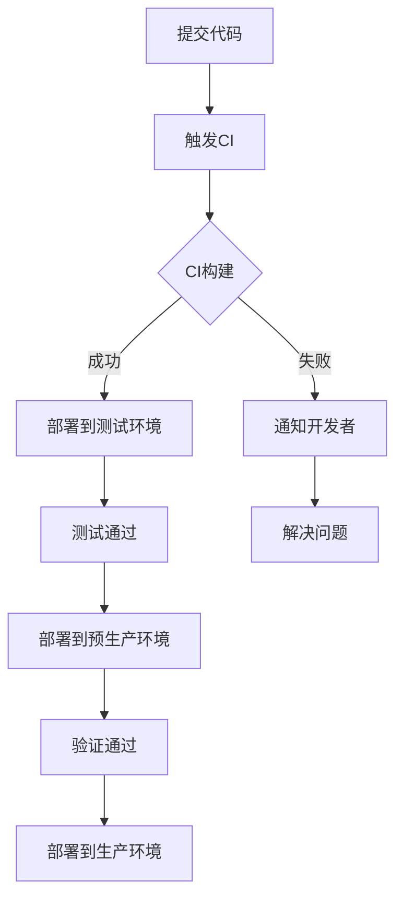

                 

# 持续部署策略：安全高效地发布软件

## 关键词

- 持续部署
- 软件发布
- 自动化
- 安全
- 效率

## 摘要

本文旨在深入探讨持续部署（Continuous Deployment，简称CD）策略，解析其在现代软件开发中的应用与重要性。我们将从基础概念入手，逐步讲解持续部署的核心原理、最佳实践，以及如何通过自动化和监测来提升软件发布的效率和安全性。文章将通过实际案例展示持续部署在实际项目中的应用，并提供一些建议和注意事项，帮助读者更好地理解和实施持续部署策略。

## 目录

1. **概述**
   - 1.1 什么是持续部署
   - 1.2 持续部署的历史与发展
   - 1.3 持续部署的优势与挑战

2. **基础概念**
   - 2.1 核心概念解析
   - 2.2 持续部署工具与技术

3. **原则与实践**
   - 3.1 持续部署的原则
   - 3.2 持续部署的最佳实践
   - 3.3 持续部署的常见问题与解决方法

4. **部署策略**
   - 4.1 不同环境下的部署策略
   - 4.2 部署策略案例分析

5. **自动化与编排**
   - 5.1 自动化在持续部署中的作用
   - 5.2 CI/CD管道及其角色

6. **监测与反馈**
   - 6.1 监测在持续部署中的重要性
   - 6.2 构建反馈循环机制

7. **最佳实践与总结**
   - 7.1 最佳实践建议
   - 7.2 项目实战
   - 7.3 注意事项与拓展阅读

## 1. 概述

### 1.1 什么是持续部署

持续部署是一种软件开发和发布流程，旨在通过自动化和持续集成（CI）来快速、可靠地交付新的软件版本。在这种模式下，每次代码更改都会被自动构建、测试，并在符合质量标准的情况下部署到生产环境。持续部署的核心思想是减少手动操作，加快反馈周期，从而提高软件开发的速度和可靠性。

### 1.2 持续部署的历史与发展

持续部署的概念起源于软件开发方法的演变。早在20世纪80年代，敏捷开发方法开始出现，强调快速反馈和频繁迭代。随着互联网的发展，软件需求变得更加复杂和多变，持续部署应运而生。最早提出持续部署概念的包括ThoughtWorks和Pivotal等公司，他们在2000年代初期开始推广这一理念。

### 1.3 持续部署的优势与挑战

持续部署具有许多优势，包括：

- **加快交付速度**：自动化流程可以显著缩短从代码提交到部署的时间。
- **提高质量**：频繁的测试和反馈可以早期发现和修复问题。
- **减少风险**：逐步部署可以减少大规模变更带来的风险。
- **增强团队协作**：持续部署鼓励开发、测试和运维团队之间的紧密合作。

然而，持续部署也面临一些挑战：

- **安全性**：自动化流程需要确保数据安全和隐私。
- **复杂度**：持续部署增加了系统的复杂度，需要一定的技术基础和资源。
- **文化转变**：持续部署需要团队文化和工作流程的调整。

## 2. 基础概念

### 2.1 核心概念解析

**持续集成（Continuous Integration，CI）**：持续集成是指将代码更改合并到共享仓库中后，立即进行构建和测试的过程。CI的主要目标是确保代码库始终处于可部署状态。

**持续交付（Continuous Delivery，CD）**：持续交付是持续集成的一个扩展，它包括自动化部署到生产环境的过程。持续交付确保任何经过测试的代码都可以随时发布。

**自动化**：自动化是指通过脚本或工具自动执行重复性任务，如构建、测试、部署等。自动化是持续部署的核心，可以减少人为错误，提高效率。

**容器化**：容器化是一种轻量级虚拟化技术，通过容器将应用程序及其依赖项打包在一起，确保在不同环境中的一致性。

**基础设施即代码（Infrastructure as Code，IaC）**：基础设施即代码是将基础设施配置和管理作为代码来处理的方法。IaC可以使用脚本自动化基础设施的创建、配置和部署。

### 2.2 持续部署工具与技术

持续部署涉及到多种工具和技术，以下是其中一些关键工具：

**Jenkins**：Jenkins是一个开源的持续集成服务器，用于自动化构建、测试和部署流程。

**GitLab CI/CD**：GitLab CI/CD是GitLab集成到其平台中的持续集成和持续交付解决方案。

**Docker**：Docker是一个开源的应用容器引擎，用于容器化应用程序。

**Kubernetes**：Kubernetes是一个开源的容器编排平台，用于自动化容器化应用程序的部署、扩展和管理。

**Ansible**：Ansible是一个开源的自动化工具，用于配置管理、应用部署和IT自动化。

## 3. 原则与实践

### 3.1 持续部署的原则

持续部署的原则包括以下几个方面：

**可靠性**：确保软件部署过程稳定可靠，减少系统故障和停机时间。

**安全性**：确保数据安全和隐私，防止恶意攻击和数据泄露。

**性能**：优化软件性能，确保新版本在部署后不会导致性能下降。

**透明性**：保持部署过程的透明，方便团队成员跟踪和解决问题。

**反馈**：及时收集用户反馈，快速响应并改进软件。

### 3.2 持续部署的最佳实践

以下是一些最佳实践，可以帮助团队实现有效的持续部署：

**自动化**：尽可能自动化部署流程，减少手动操作。

**测试**：定期进行自动化测试，确保代码质量和功能完整性。

**版本控制**：使用版本控制系统（如Git）管理代码，确保版本的可追溯性和可复现性。

**监控**：监控应用程序性能和系统状态，及时发现和解决问题。

**文档**：编写详细的部署文档，方便团队成员理解和执行。

**团队协作**：加强团队协作，确保所有成员都对持续部署流程有清晰的认识和责任。

### 3.3 持续部署的常见问题与解决方法

持续部署过程中可能会遇到一些问题，以下是其中一些常见问题及其解决方法：

**问题**：部署失败或部署后出现意外问题。

**解决方法**：进行充分的测试和验证，确保部署流程的可靠性。同时，建立紧急响应机制，以便快速解决问题。

**问题**：部署速度慢，影响开发效率。

**解决方法**：优化部署流程，减少不必要的步骤和等待时间。考虑使用容器化和Kubernetes等工具来提高部署速度。

**问题**：安全问题和合规性问题。

**解决方法**：加强安全审计和合规性检查，确保部署过程符合相关标准和法规。使用加密和安全协议保护数据传输。

## 4. 部署策略

### 4.1 不同环境下的部署策略

持续部署通常涉及到多个环境，包括开发环境、测试环境、预生产环境和生产环境。以下是不同环境下的部署策略：

**开发环境**：开发环境通常用于编写和测试代码。在这个环境中，部署频率较高，可以频繁地进行版本更新和测试。

**测试环境**：测试环境用于验证代码的质量和功能。在这个环境中，部署过程应该与生产环境相似，确保新版本在部署到生产环境之前经过充分测试。

**预生产环境**：预生产环境是过渡环境，用于模拟生产环境的情况。在这个环境中，部署过程应该与生产环境完全一致，以便发现潜在的问题。

**生产环境**：生产环境是最终的部署目标，部署过程应该尽可能稳定和安全。在这个环境中，部署频率通常较低，以确保系统的稳定运行。

### 4.2 部署策略案例分析

以下是一个持续部署策略的实际案例：

**案例**：某公司使用GitLab CI/CD进行持续部署。他们的流程如下：

1. 开发者提交代码到GitLab仓库。
2. GitLab CI自动触发构建和测试。
3. 构建成功后，部署到测试环境进行进一步测试。
4. 测试通过后，部署到预生产环境进行验证。
5. 预生产环境验证通过后，部署到生产环境。

这个案例展示了如何通过自动化和逐步验证来确保软件发布的安全和高效。

## 5. 自动化与编排

### 5.1 自动化在持续部署中的作用

自动化在持续部署中起着至关重要的作用，它可以减少人为错误，提高部署效率和可靠性。以下是自动化在持续部署中的作用：

**减少手动操作**：自动化可以替代手动操作，减少人为错误和重复性工作。
**加快部署速度**：自动化可以显著缩短从代码提交到部署的时间。
**提高一致性**：自动化可以确保每次部署都按照相同的流程进行，减少人为差异。
**增强可追溯性**：自动化可以生成详细的日志和报告，方便团队跟踪和解决问题。

### 5.2 CI/CD管道及其角色

持续集成/持续交付（CI/CD）管道是持续部署的核心，它负责自动化构建、测试和部署流程。CI/CD管道的主要角色包括：

**构建**：将代码编译成可执行的程序，通常包括打包、编译和测试。
**测试**：对构建后的应用程序进行各种测试，包括单元测试、集成测试和性能测试。
**部署**：将测试通过的应用程序部署到目标环境，可以是开发环境、测试环境、预生产环境或生产环境。
**监控**：实时监控应用程序的性能和系统状态，及时发现和解决问题。

## 6. 监测与反馈

### 6.1 监测在持续部署中的重要性

监测在持续部署中至关重要，它可以确保新版本的应用程序在生产环境中正常运行，并提供及时反馈，帮助团队快速响应和解决问题。以下是监测在持续部署中的重要性：

**确保稳定性**：监测可以帮助团队及时发现应用程序的异常情况，确保系统的稳定性。
**提高可用性**：通过监测性能指标，团队可以优化应用程序，提高系统的可用性。
**降低故障率**：及时发现问题并快速修复，可以降低系统的故障率。
**提供反馈**：监测数据可以为未来的开发和部署提供有价值的反馈，帮助团队不断改进。

### 6.2 构建反馈循环机制

构建反馈循环机制是持续部署成功的关键之一。以下是一些关键步骤：

**定义监测指标**：明确需要监测的指标，如响应时间、错误率、CPU使用率、内存使用率等。
**设置警报**：为监测指标设置合理的警报阈值，以便在指标超出预期时及时通知相关人员。
**分析数据**：定期分析监测数据，识别问题和趋势，制定改进计划。
**反馈与改进**：将监测数据反馈给开发、测试和运维团队，共同制定改进措施，优化系统和部署流程。

## 7. 最佳实践与总结

### 7.1 最佳实践建议

以下是一些建议，可以帮助团队更好地实施持续部署：

**自动化**：尽可能自动化部署流程，减少手动操作。
**测试**：定期进行自动化测试，确保代码质量和功能完整性。
**监控**：监控应用程序性能和系统状态，及时发现和解决问题。
**文档**：编写详细的部署文档，方便团队成员理解和执行。
**团队协作**：加强团队协作，确保所有成员都对持续部署流程有清晰的认识和责任。

### 7.2 项目实战

以下是一个持续部署的实际项目案例：

**项目背景**：某电商平台需要快速发布新功能和修复漏洞，以保持竞争力。

**解决方案**：采用GitLab CI/CD进行持续部署，流程如下：

1. 开发者提交代码到GitLab仓库。
2. GitLab CI自动触发构建和测试。
3. 构建成功后，部署到测试环境进行进一步测试。
4. 测试通过后，部署到预生产环境进行验证。
5. 预生产环境验证通过后，部署到生产环境。

**效果**：通过持续部署，该电商平台显著缩短了发布周期，提高了系统稳定性和用户满意度。

### 7.3 注意事项与拓展阅读

**注意事项**：

- 确保部署流程的安全性。
- 合理设置监测指标和警报阈值。
- 定期审查和更新部署文档。

**拓展阅读**：

- 《持续交付：发布可靠软件的系统化方法》
- 《DevOps实践指南：持续交付与基础设施即代码》
- 《Jenkins实战：持续集成与自动化部署》

## 作者信息

作者：AI天才研究院/AI Genius Institute & 禅与计算机程序设计艺术 /Zen And The Art of Computer Programming

### 附录

**附录A：持续部署流程图**

**附录B：持续部署监控指标**

- 响应时间
- 错误率
- CPU使用率
- 内存使用率
- 网络延迟

**附录C：常见持续部署工具**

- Jenkins
- GitLab CI/CD
- Docker
- Kubernetes
- Ansible

**附录D：持续部署最佳实践**

- 自动化部署流程
- 定期进行自动化测试
- 监控应用程序性能和系统状态
- 编写详细的部署文档
- 加强团队协作和沟通

通过上述步骤，我们可以更好地理解和实施持续部署策略，提高软件发布的效率和安全性。持续部署不仅是一种技术手段，更是一种软件开发和运营文化的变革，需要团队共同努力和持续优化。希望本文能够为读者提供有价值的参考和启示。

