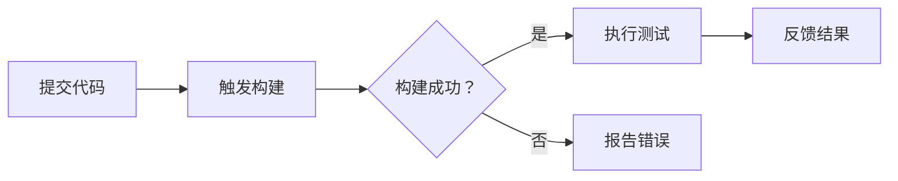
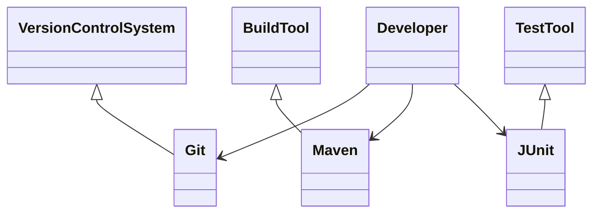
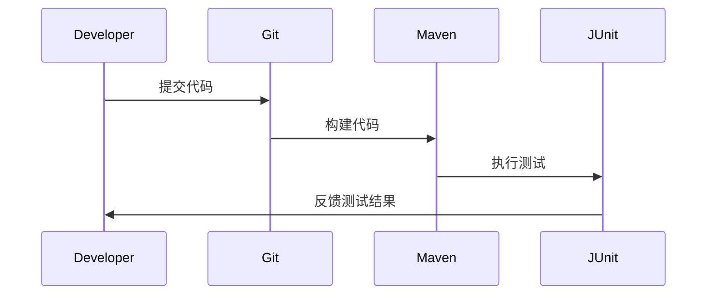
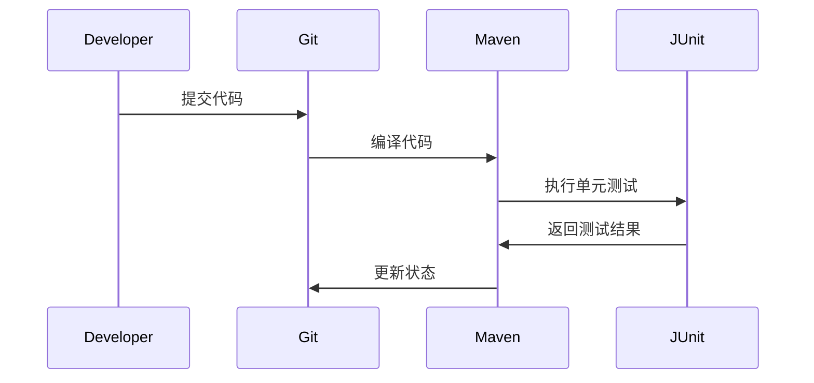
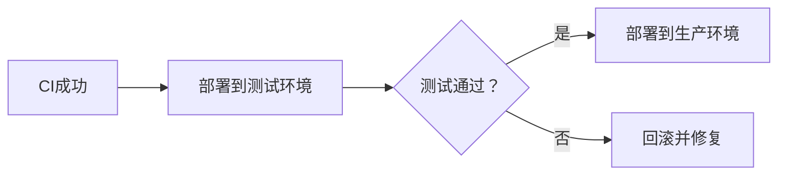
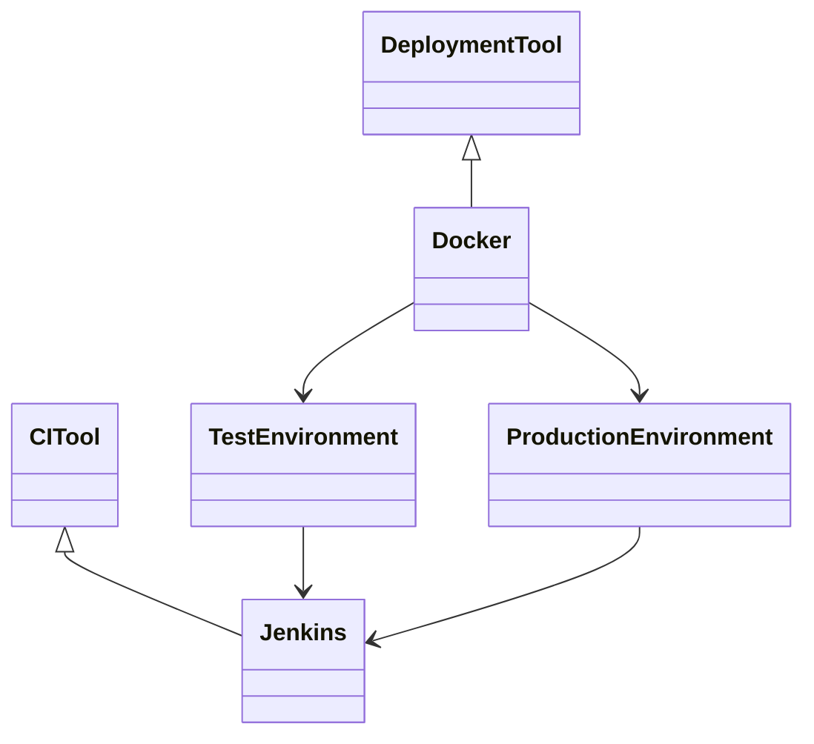
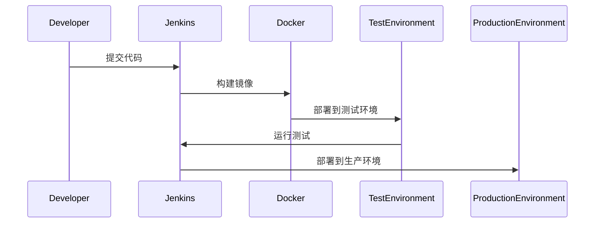
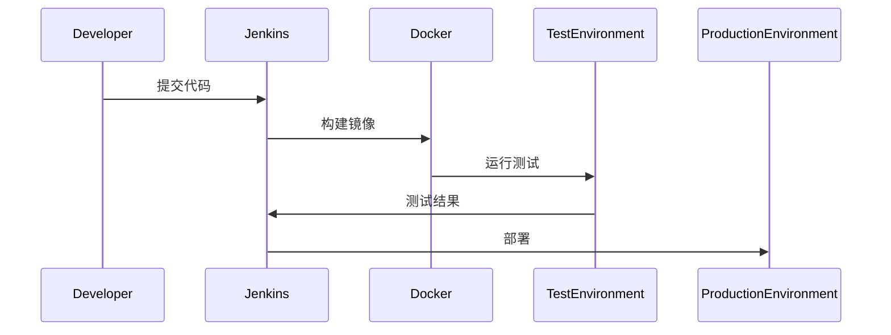

                 


## 让我们一步一步深入思考持续集成与持续部署（CI/CD）的最佳实践

### 文章标题：持续集成与持续部署（CI/CD）的最佳实践

### 关键词：持续集成，持续部署，CI/CD，最佳实践，自动化，效率，质量保证

### 摘要：
本文将深入探讨持续集成（CI）与持续部署（CD）的核心概念、关键实践和最佳方案。我们将通过一步一步的详细分析，帮助读者理解CI/CD的原理、流程、工具选择以及在不同环境中的应用。文章还包含了实际案例分析和最佳实践，旨在为开发团队提供切实可行的CI/CD指导。

## **一、CI/CD基础概念与原理**

### **1.1 什么是CI/CD**

**概念术语说明**：
- **持续集成（Continuous Integration，CI）**：一种软件开发实践，通过自动化构建和测试，确保代码的持续集成和功能的正常运行。
- **持续部署（Continuous Deployment，CD）**：一种自动化部署流程，通过自动化的方式将代码部署到生产环境。

**问题背景**：
在现代软件开发中，项目复杂度和开发速度不断提升，传统的手动测试和部署方式已无法满足快速迭代的需求。CI/CD提供了一种自动化、高效的解决方案。

**问题描述**：
如何通过CI/CD实现软件开发的自动化、高效和质量保证？

**问题解决**：
CI/CD通过自动化构建、测试和部署，确保代码质量，缩短开发周期，提高开发效率。

**边界与外延**：
- **边界**：CI/CD主要关注开发到测试的自动化，而CD则延伸到生产环境的自动化部署。
- **外延**：CI/CD可以应用于各种开发环境，包括云环境、容器环境和微服务架构。

**概念结构与核心要素组成**：

| 概念 | 结构要素 | 组成 |
| --- | --- | --- |
| 持续集成（CI） | 自动化构建、测试、反馈 | 版本控制系统、构建工具、测试工具 |
| 持续部署（CD） | 自动化部署、监控、反馈 | 部署工具、配置管理、监控工具 |

### **1.2 CI/CD的优势**

- **提高开发效率**：自动化流程减少了手动操作，缩短了开发周期。
- **确保代码质量**：通过自动化测试，及时发现并修复问题。
- **降低风险**：自动化的部署流程减少了人为错误，提高了系统的稳定性。

### **1.3 CI/CD的组成部分**

**核心概念与联系**：

- **版本控制系统**：如Git，用于管理代码版本。
- **构建工具**：如Maven、Gradle，用于自动化构建代码。
- **测试工具**：如JUnit、Selenium，用于自动化测试。
- **部署工具**：如Jenkins、Ansible，用于自动化部署。

**概念属性特征对比表格**：

| 工具 | 功能 | 特征 |
| --- | --- | --- |
| Jenkins | 持续集成服务器 | 易用性高，插件丰富 |
| GitLab CI/CD | 持续集成与持续部署 | 内置在GitLab中，支持多种配置 |
| GitHub Actions | 持续集成与持续部署 | 免费计划，支持多种编程语言 |

**ER实体关系图架构的Mermaid流程图**：

```mermaid
erDiagram
    VersionControlSystem ||--o{ BuildTool : 使用 }
    BuildTool ||--|{ TestTool : 测试 }
    TestTool ||--o{ DeploymentTool : 部署 }
```

### **1.4 CI/CD与传统开发的区别**

- **传统开发**：手动测试、部署，周期长，效率低。
- **CI/CD**：自动化测试、部署，周期短，效率高。

## **二、持续集成（CI）**

### **2.1 持续集成的原理与流程**

**算法原理讲解**：

- **构建**：当有新的代码提交到版本控制系统时，构建工具会自动下载最新的代码并编译。
- **测试**：编译完成后，测试工具会执行一系列预定的测试，确保代码的质量。
- **反馈**：测试结果会反馈给开发人员，如果有错误，开发人员需要修复问题。

**Mermaid流程图**：



### **2.2 自动化构建与测试**

**系统分析与架构设计方案**：

**问题场景介绍**：
一个软件项目需要进行持续集成和自动化测试，以确保代码质量和快速迭代。

**项目介绍**：
该项目使用Git进行版本控制，Maven作为构建工具，JUnit作为测试工具。

**系统功能设计（领域模型Mermaid类图）**：



**系统架构设计（Mermaid架构图）**：



**系统接口设计和系统交互（Mermaid序列图）**：



### **2.3 集成代码库的选择**

- **公有代码库**：如GitHub、GitLab，适用于开源项目。
- **私有代码库**：如GitLab Enterprise、Bitbucket Server，适用于企业内部项目。

### **2.4 CI工具的选择与使用**

**常见CI工具**：
- **Jenkins**：开源，插件丰富，适合各种场景。
- **GitLab CI/CD**：内置在GitLab中，易于配置和管理。
- **GitHub Actions**：免费，支持多种编程语言，适用于个人和团队项目。

**Jenkins配置示例**：

```xml
<project>
    <description>My CI Project</description>
    <scm>
        <git>
            <url>https://github.com/yourusername/yourrepo.git</url>
        </git>
    </scm>
    <builders>
        <hudson.tasks.Maven>
            <goals>clean package</goals>
        </hudson.tasks.Maven>
    </builders>
    <publishers>
        <hudson.tasks.TestResultPublisher>
            <pattern>**/*Test.class</pattern>
        </hudson.tasks.TestResultPublisher>
    </publishers>
</project>
```

## **三、持续部署（CD）**

### **3.1 持续部署的原理与流程**

**算法原理讲解**：

- **部署**：通过自动化工具，将经过CI测试的代码部署到测试环境或生产环境。
- **监控**：部署完成后，监控系统会持续监控系统的运行状态，确保系统的稳定性。

**Mermaid流程图**：



### **3.2 自动化部署与流水线**

**系统分析与架构设计方案**：

**问题场景介绍**：
一个电子商务网站需要进行自动化部署，确保在上线新功能时系统的稳定性。

**项目介绍**：
该项目使用Jenkins作为CI/CD工具，Docker用于容器化部署。

**系统功能设计（领域模型Mermaid类图）**：



**系统架构设计（Mermaid架构图）**：



**系统接口设计和系统交互（Mermaid序列图）**：



### **3.3 环境配置与管理**

**环境配置**：
- **测试环境**：用于测试新功能，确保代码质量。
- **生产环境**：用于运行线上业务，确保系统的稳定性。

**环境管理**：
- **配置管理工具**：如Ansible、Puppet，用于管理环境配置。
- **容器编排工具**：如Kubernetes，用于管理容器化环境。

### **3.4 CD工具的选择与使用**

**常见CD工具**：
- **Jenkins**：开源，支持各种插件，适用于各种场景。
- **Docker**：开源，容器化部署，适用于微服务架构。
- **Kubernetes**：开源，容器编排，适用于大规模分布式系统。

**Dockerfile示例**：

```dockerfile
FROM ubuntu:20.04
RUN apt-get update && apt-get install -y python3
COPY . /app
WORKDIR /app
RUN pip3 install -r requirements.txt
CMD ["python3", "app.py"]
```

## **四、CI/CD最佳实践**

### **4.1 设计高效的工作流**

- **自动化**：尽可能将开发、测试和部署过程自动化。
- **简明**：工作流应简明易懂，避免复杂的依赖关系。
- **灵活性**：工作流应具备一定的灵活性，以适应不同的开发需求。

### **4.2 管理代码质量**

- **代码审查**：通过代码审查确保代码质量。
- **自动化测试**：通过自动化测试发现并修复问题。
- **持续反馈**：及时反馈代码质量问题，促进改进。

### **4.3 处理依赖关系**

- **版本控制**：使用版本控制系统管理依赖关系。
- **依赖管理工具**：如Maven、Gradle，用于管理依赖。
- **容器化**：使用容器化技术隔离依赖，确保环境一致性。

### **4.4 安全性与合规性**

- **安全审计**：定期进行安全审计，确保系统的安全性。
- **合规性检查**：确保部署过程符合相关法规和标准。

## **五、CI/CD在不同环境中的应用**

### **5.1 云环境中的CI/CD**

- **云服务提供商**：如AWS、Azure、Google Cloud，提供丰富的CI/CD工具和资源。
- **容器化**：使用容器化技术实现高效、可扩展的CI/CD。

### **5.2 容器环境中的CI/CD**

- **容器编排**：如Kubernetes，用于管理容器化环境。
- **自动化部署**：通过Kubernetes的Helm、Kubectl等工具实现自动化部署。

### **5.3 微服务架构中的CI/CD**

- **服务隔离**：通过容器化技术实现服务隔离。
- **分布式测试**：通过分布式测试框架实现大规模并行测试。

### **5.4 实践案例分享**

- **案例分析**：分享成功和失败的CI/CD实践。
- **经验总结**：总结经验教训，提供改进建议。

## **六、常见CI/CD工具介绍**

### **6.1 Jenkins**

**安装与配置**：

- **安装**：下载并安装Jenkins。
- **配置**：配置Jenkins插件，设置构建管道。

**常用插件**：

- **Git**：用于集成Git代码库。
- **JUnit**：用于执行JUnit测试。
- **Docker**：用于容器化部署。

### **6.2 GitLab CI/CD**

**GitLab CI/CD的架构**：

- **Runner**：执行构建、测试和部署任务。
- **.gitlab-ci.yml**：配置文件，定义构建和部署过程。

**.gitlab-ci.yml文件**：

```yaml
stages:
  - build
  - test
  - deploy

build:
  stage: build
  script:
    - mvn clean package

test:
  stage: test
  script:
    - mvn test

deploy:
  stage: deploy
  script:
    - docker build -t myapp:latest .
    - docker push myapp:latest
```

### **6.3 GitHub Actions**

**GitHub Actions的基础功能**：

- **工作流**：定义构建、测试和部署过程。
- **事件**：触发工作流的事件，如代码提交、分支创建等。

**GitHub Action的集成与使用**：

```yaml
name: CI/CD

on:
  push:
    branches: [ main ]
  pull_request:
    branches: [ main ]

jobs:
  build:
    runs-on: ubuntu-latest
    steps:
    - uses: actions/checkout@v2
    - name: Build
      run: mvn clean package
    - name: Test
      run: mvn test
    - name: Deploy
      if: github.event_name == 'push'
      run: |
        docker build -t myapp:latest .
        docker push myapp:latest
```

## **七、CI/CD平台设计与实现**

### **7.1 平台架构设计**

- **版本控制系统**：如GitLab、GitHub。
- **CI/CD工具**：如Jenkins、GitLab CI/CD。
- **部署工具**：如Docker、Kubernetes。

### **7.2 自动化流水线搭建**

- **流水线设计**：定义构建、测试和部署步骤。
- **流水线执行**：自动化执行流水线任务。

### **7.3 监控与报警机制**

- **监控系统**：如Prometheus、Grafana。
- **报警机制**：设置报警规则，及时发现问题。

### **7.4 持续集成与持续部署的实际应用案例**

- **案例1**：电子商务网站。
- **案例2**：金融科技公司。

## **八、CI/CD最佳实践与案例分析**

### **8.1 设计高效的CI/CD流程**

- **流程设计**：设计简洁、高效的工作流。
- **流程优化**：持续优化工作流，提高效率。

### **8.2 管理代码质量**

- **代码审查**：确保代码质量。
- **自动化测试**：覆盖关键功能和场景。

### **8.3 处理依赖关系**

- **依赖管理**：使用依赖管理工具。
- **容器化**：使用容器化技术隔离依赖。

### **8.4 安全性与合规性**

- **安全审计**：定期进行安全审计。
- **合规性检查**：确保符合相关法规和标准。

## **九、CI/CD案例分析**

### **9.1 某互联网公司CI/CD实践**

**案例分析**：
该公司通过Jenkins和Docker实现了高效的CI/CD流程，大幅提高了开发效率和系统稳定性。

**详细讲解剖析**：
- **流程设计**：设计简洁高效的工作流。
- **工具选择**：使用Jenkins作为CI/CD工具，Docker用于容器化部署。
- **实施效果**：缩短了开发周期，提高了系统稳定性。

### **9.2 某金融行业CI/CD案例**

**案例分析**：
该金融公司通过GitLab CI/CD和Kubernetes实现了自动化部署和容器化架构。

**详细讲解剖析**：
- **流程设计**：设计自动化部署流程，实现快速上线。
- **工具选择**：使用GitLab CI/CD和Kubernetes。
- **实施效果**：提高了系统的可扩展性和稳定性。

### **9.3 某初创企业CI/CD实践**

**案例分析**：
该初创企业通过GitHub Actions和Docker实现了高效的CI/CD流程。

**详细讲解剖析**：
- **流程设计**：设计自动化测试和部署流程。
- **工具选择**：使用GitHub Actions和Docker。
- **实施效果**：降低了开发和运维成本，提高了系统稳定性。

### **9.4 案例分析与总结**

**总结**：
成功的CI/CD实践需要合理设计工作流、选择合适的工具，并持续优化和改进。通过案例分析，读者可以借鉴经验，提高自己的CI/CD实践水平。

## **十、展望与未来**

### **10.1 CI/CD的发展趋势**

- **AI集成**：利用AI技术优化CI/CD流程。
- **服务化**：将CI/CD功能服务化，提高可扩展性。

### **10.2 面临的挑战与解决方案**

- **复杂性**：解决CI/CD流程中的复杂性。
- **安全性**：确保CI/CD过程的安全性。

### **10.3 持续集成与持续部署的未来**

- **智能化**：利用AI和大数据技术，实现智能化CI/CD。
- **生态化**：构建完善的CI/CD生态系统。

### **10.4 对读者的建议**

- **实践**：通过实际项目练习CI/CD。
- **学习**：不断学习新的CI/CD工具和技术。

---

**作者：AI天才研究院/AI Genius Institute & 禅与计算机程序设计艺术 /Zen And The Art of Computer Programming**

