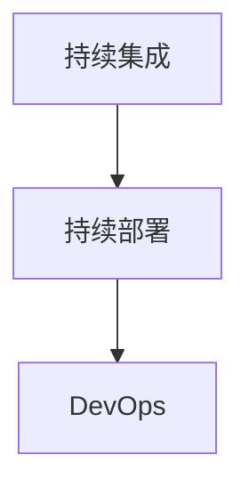

                 


### 持续集成与持续部署：DevOps最佳实践

#### 关键词：持续集成、持续部署、DevOps、最佳实践、性能优化、安全保障

#### 摘要：

本文旨在深入探讨持续集成与持续部署（CI/CD）在DevOps实践中的应用，通过详细的章节结构和专业论述，帮助读者全面理解CI/CD的核心概念、原理及其实现方法。文章首先介绍了CI/CD的背景、定义和重要性，随后分析了它们在DevOps中的联系与作用。接下来，文章逐步讲解了持续集成与持续部署的具体实现、工具介绍、案例分析和优化策略，并提供了实用的最佳实践建议。通过本文的阅读，读者将能够系统地掌握CI/CD的实施方法和优化技巧，为企业的DevOps实践提供有力支持。

---

### 目录大纲设计思路

为了设计出《持续集成与持续部署：DevOps最佳实践》这本书的完整目录大纲，我们将按照以下步骤进行：

1. **明确书籍的核心内容与结构**：首先，我们需要明确这本书的核心内容，即持续集成与持续部署的概念、原理、实践方法以及DevOps的最佳实践。

2. **划分书籍章节**：根据核心内容，我们将书籍划分为多个章节，每个章节对应一个特定的主题或知识点。

3. **细化章节内容**：在每个章节下，我们需要进一步细化内容，确保每个知识点都有详细的阐述。

4. **设计章节标题**：每个章节的标题应该简洁明了，能够准确地概括章节的内容。

5. **确保目录完整性**：目录必须包含至少7章，并且要包含背景介绍、核心概念与联系、算法原理讲解、数学模型和公式、系统分析与架构设计方案、项目实战、最佳实践 tips、小结、注意事项、拓展阅读等内容。

6. **使用Markdown格式**：为了便于阅读和排版，我们将使用Markdown格式来呈现目录大纲。

### 目录大纲

```markdown
----------------------------------------------------------------
# 第一部分: 持续集成与持续部署基础

## 第1章: 持续集成与持续部署概述
### 1.1 持续集成与持续部署的定义与意义
### 1.2 持续集成与持续部署的发展历程
### 1.3 持续集成与持续部署的关系

## 第2章: 持续集成原理与实现
### 2.1 持续集成的基本概念
### 2.2 持续集成的关键原则
### 2.3 持续集成的实现方法
### 2.4 持续集成的工具与技术

## 第3章: 持续部署原理与实现
### 3.1 持续部署的基本概念
### 3.2 持续部署的关键原则
### 3.3 持续部署的实现方法
### 3.4 持续部署的工具与技术

## 第4章: DevOps文化与实践
### 4.1 DevOps概述
### 4.2 DevOps的核心价值观
### 4.3 DevOps的组织结构
### 4.4 DevOps的最佳实践

## 第5章: 持续集成与持续部署工具介绍
### 5.1 Jenkins
### 5.2 GitLab CI/CD
### 5.3 GitHub Actions
### 5.4 Azure DevOps

## 第6章: 持续集成与持续部署案例分析
### 6.1 案例一：某电商平台的持续集成与持续部署实践
### 6.2 案例二：某金融科技公司的持续集成与持续部署实践
### 6.3 案例分析小结

## 第7章: 持续集成与持续部署的优化策略
### 7.1 持续集成与持续部署的性能优化
### 7.2 持续集成与持续部署的安全保障
### 7.3 持续集成与持续部署的运维管理
### 7.4 持续集成与持续部署的持续改进

----------------------------------------------------------------
```

### 核心概念与联系

#### 持续集成与持续部署的概念联系

**持续集成（CI）**：持续集成是一种软件开发实践，通过频繁地将代码集成到主干分支，确保集成过程持续顺畅，快速发现和修复代码冲突。

**持续部署（CD）**：持续部署是持续集成的一个扩展，它包括自动化的构建、测试、部署等过程，确保软件可以快速、安全地交付到生产环境。

**联系**：持续集成与持续部署都是DevOps实践的重要组成部分，持续集成是实现持续部署的前提，而持续部署则是持续集成的最终目标。



#### 核心概念属性特征对比表格

| 特征         | 持续集成（CI）                      | 持续部署（CD）                      |
| ------------ | --------------------------------- | --------------------------------- |
| 目标         | 快速发现和修复代码冲突              | 快速、安全地交付软件到生产环境        |
| 流程         | 编写代码 → 提交代码 → 集成代码 → 测试 | 编写代码 → 提交代码 → 集成代码 → 测试 → 部署 |
| 工具         | Jenkins、GitLab CI、GitHu

----------------------------------------------------------------

#### 持续集成与持续部署的背景

持续集成（Continuous Integration，CI）和持续部署（Continuous Deployment，CD）是现代软件开发中不可或缺的重要实践。它们的出现，源于软件开发过程中不断追求提高开发效率、降低风险、快速响应市场变化的需求。

**背景介绍**：

在传统的软件开发模式中，开发者通常在一个独立的开发环境中进行代码编写和测试，然后将代码提交到版本控制系统。这种模式存在几个问题：

1. **代码集成冲突**：多个开发者同时在一个分支上开发，当各自的代码合并时，很容易产生冲突。
2. **测试不及时**：开发完成后，将代码一次性提交到主干分支进行测试，可能导致潜在的问题在较晚的阶段才被发现。
3. **部署困难**：生产环境与开发环境差异较大，部署过程复杂且容易出现错误。

为了解决这些问题，持续集成和持续部署应运而生。

**问题背景**：

持续集成与持续部署的背景在于现代软件开发过程中的以下几个核心问题：

1. **代码管理**：如何确保不同开发者的代码能够顺利集成，并在集成过程中及时发现问题。
2. **测试效率**：如何在开发过程中持续地、频繁地测试，以确保软件质量。
3. **部署效率**：如何在保持高效开发的同时，安全、快速地将软件部署到生产环境。

**问题描述**：

传统开发模式中的主要问题可以总结为：

- **集成延迟**：代码集成的过程不频繁，导致问题积累。
- **测试滞后**：测试工作集中在开发末期，导致问题难以追踪和修复。
- **部署风险**：部署过程复杂，容易出现人为错误。

**问题解决**：

持续集成与持续部署通过以下方式解决上述问题：

1. **频繁集成**：通过频繁地提交代码并集成到主干分支，及时发现问题并进行修复。
2. **持续测试**：通过自动化测试，确保每个提交的代码都经过充分测试，提高软件质量。
3. **自动化部署**：通过自动化工具，简化部署过程，减少人为干预，提高部署效率。

**边界与外延**：

持续集成与持续部署的应用边界涵盖了整个软件开发生命周期，包括代码提交、集成、测试和部署等环节。其外延还包括DevOps文化的推广和实施，以及相关工具和技术的选择与优化。

**概念结构与核心要素组成**：

持续集成与持续部署的概念结构包括以下几个核心要素：

1. **自动化**：通过自动化工具实现代码的集成、测试和部署。
2. **持续**：持续集成与持续部署强调过程的持续性和自动化，减少人为干预。
3. **反馈**：及时反馈问题，确保开发过程中的问题能够被快速发现和解决。

通过以上对持续集成与持续部署的背景、问题、解决方案、边界与外延以及概念结构的分析，我们可以更加深入地理解这两种实践在软件开发中的重要性。

---

### 持续集成（CI）的原理与实现

#### 持续集成的定义与目的

持续集成（Continuous Integration，CI）是一种软件开发实践，通过频繁地将开发者的代码提交到共享的版本库，并自动构建、测试和部署，以确保软件的持续可靠性和高质量。持续集成的核心目的是减少集成过程中的冲突和问题，提高软件开发的效率和质量。

**持续集成的定义**：

持续集成是一种软件开发实践，通过频繁地将代码集成到主干分支，确保集成过程持续顺畅，快速发现和修复代码冲突。持续集成通常包括以下几个关键步骤：

1. **代码提交**：开发者将代码提交到版本控制系统。
2. **自动构建**：构建工具自动编译和打包代码。
3. **自动化测试**：运行一系列预定义的测试，确保代码的质量和功能。
4. **反馈**：测试结果反馈给开发者和团队，以便及时修复问题。

**持续集成的目的**：

持续集成的目的主要包括以下几个方面：

1. **快速发现和修复问题**：通过频繁的代码集成和测试，及时发现问题并进行修复，减少问题积累。
2. **提高代码质量**：通过自动化测试，确保每个提交的代码都经过充分的测试，从而提高软件的质量。
3. **促进团队合作**：持续集成要求开发者频繁提交代码，这有助于促进团队之间的沟通和协作。
4. **降低集成风险**：通过提前发现和解决集成问题，降低代码集成时的风险。

#### 持续集成的关键原则

持续集成能够成功实施，离不开以下几个关键原则：

1. **频繁提交**：开发者需要频繁提交代码，以确保代码集成过程的持续性和及时性。
2. **自动化**：构建和测试过程需要自动化，以减少人为干预，提高效率。
3. **尽早测试**：测试应该尽早进行，以便在问题发生时尽快发现和解决。
4. **共享仓库**：所有开发者使用共享的版本库，确保代码的一致性。
5. **反馈**：测试结果和集成状态需要及时反馈，以便开发者和团队能够及时响应。

#### 持续集成的实现方法

要实现持续集成，需要选择合适的工具和技术，并遵循一系列最佳实践。以下是一些常见的持续集成实现方法：

1. **选择持续集成工具**：常见的持续集成工具包括Jenkins、GitLab CI、GitHub Actions等。选择合适的工具需要考虑团队规模、项目需求和预算等因素。
2. **编写构建脚本**：构建脚本用于自动化构建和打包代码。常见的构建脚本语言包括Shell、Python、Groovy等。
3. **配置自动化测试**：配置自动化测试脚本，确保在每次代码提交时都运行预定义的测试，以检查代码质量和功能。
4. **集成到版本控制系统**：将持续集成工具与版本控制系统（如Git）集成，以便在代码提交时自动触发构建和测试。
5. **部署到测试环境**：将通过测试的代码部署到测试环境，以便进一步验证软件的功能和性能。

#### 持续集成的工具与技术

**Jenkins**：

Jenkins是一个开源的持续集成工具，支持多种编程语言和平台，具有高度的可扩展性和灵活性。Jenkins可以通过Web界面进行配置和管理，支持多种插件，包括构建、测试、部署等。

**GitLab CI**：

GitLab CI是GitLab内置的持续集成服务，通过`.gitlab-ci.yml`文件进行配置。GitLab CI支持并行构建和多种语言，具有简洁的配置流程和强大的自动化能力。

**GitHub Actions**：

GitHub Actions是GitHub提供的持续集成和持续部署服务，通过`.github/workflows`文件夹中的YAML文件进行配置。GitHub Actions支持多种操作系统、编程语言和容器，具有便捷的部署和管理功能。

**其他工具**：

除了上述工具外，还有其他一些流行的持续集成工具，如Travis CI、CircleCI、Azure DevOps等。这些工具各有特点，可以根据具体需求和预算进行选择。

#### 实践示例

以下是一个简单的Jenkins持续集成实践示例：

1. **安装Jenkins**：从Jenkins官网下载并安装Jenkins。
2. **配置Git**：在Jenkins中配置Git插件，以便与Git版本控制系统集成。
3. **创建项目**：在Jenkins中创建一个新的项目，并配置Git仓库地址。
4. **编写构建脚本**：编写一个构建脚本（如`build.sh`），用于编译和打包代码。
5. **配置构建触发器**：配置Jenkins，以便在代码提交时自动触发构建。
6. **配置测试**：编写测试脚本，配置Jenkins在构建过程中运行测试。
7. **部署到测试环境**：配置Jenkins，将通过测试的代码部署到测试环境。

通过以上步骤，Jenkins将自动构建、测试和部署代码，实现持续集成的自动化流程。

#### 小结

持续集成是一种通过自动化构建、测试和部署来提高软件开发效率和质量的重要实践。通过频繁提交代码、自动化测试和反馈机制，持续集成能够快速发现和修复问题，促进团队合作，降低集成风险。选择合适的工具和技术，并遵循最佳实践，是实现持续集成成功的关键。

---

### 持续部署（CD）的原理与实现

#### 持续部署的定义与目的

持续部署（Continuous Deployment，CD）是持续集成（CI）的扩展，它包括自动化构建、测试、部署等过程，以确保软件可以快速、安全地交付到生产环境。持续部署的目标是减少手动操作和人为干预，提高部署的效率、可靠性和安全性。

**持续部署的定义**：

持续部署是一种软件开发实践，通过自动化的方式，将经过测试的代码部署到生产环境。持续部署通常包括以下几个关键步骤：

1. **自动化构建**：使用构建工具（如Maven、Gradle）自动构建应用程序。
2. **自动化测试**：运行预定义的测试，确保代码的质量和功能。
3. **自动化部署**：将经过测试的代码部署到生产环境，可以包括环境配置、数据库迁移等步骤。
4. **反馈**：部署结果需要反馈给开发者和团队，以便及时响应和解决问题。

**持续部署的目的**：

持续部署的主要目的是：

1. **提高部署效率**：通过自动化减少手动操作，提高部署速度。
2. **降低部署风险**：通过自动化测试和逐步部署，降低部署过程中出现问题的风险。
3. **快速响应市场变化**：快速将功能交付给用户，提高市场竞争力。
4. **促进持续集成**：持续部署依赖于持续集成的成果，二者相辅相成，共同提高软件开发效率。

#### 持续部署的关键原则

为了实现高效、可靠的持续部署，需要遵循以下几个关键原则：

1. **自动化**：所有部署步骤都应自动化，减少手动操作和人为干预。
2. **逐步部署**：采用逐步部署策略，逐步将代码部署到各个环境，以便及时发现和解决问题。
3. **持续测试**：在部署过程中持续运行测试，确保软件质量。
4. **反馈**：部署结果需要实时反馈，以便开发者和团队能够快速响应。
5. **持续监控**：对生产环境进行持续监控，确保软件的稳定运行。

#### 持续部署的实现方法

要实现持续部署，需要选择合适的工具和技术，并遵循一系列最佳实践。以下是一些常见的持续部署实现方法：

1. **选择持续部署工具**：常见的持续部署工具包括Jenkins、GitLab CI/CD、GitHub Actions、Docker等。选择合适的工具需要考虑团队规模、项目需求和预算等因素。
2. **编写部署脚本**：编写部署脚本（如Shell、Python等），用于自动化部署过程，包括环境配置、数据库迁移、应用程序部署等。
3. **配置持续集成工具**：将持续部署脚本集成到持续集成工具中，以便在通过测试的代码提交时自动触发部署。
4. **使用容器化技术**：使用容器化技术（如Docker）简化部署流程，提高部署的可移植性和一致性。
5. **持续监控**：部署完成后，使用监控工具（如Prometheus、Grafana）对生产环境进行实时监控，确保软件的稳定运行。

#### 持续部署的工具与技术

**Jenkins**：

Jenkins是一个开源的持续集成和持续部署工具，支持多种编程语言和平台，具有高度的可扩展性和灵活性。Jenkins可以通过插件系统集成多种部署工具，如Docker、Kubernetes等。

**GitLab CI/CD**：

GitLab CI/CD是GitLab内置的持续集成和持续部署服务，通过`.gitlab-ci.yml`文件进行配置。GitLab CI/CD支持多种操作系统的容器化部署，具有强大的自动化能力和简单的配置流程。

**GitHub Actions**：

GitHub Actions是GitHub提供的持续集成和持续部署服务，通过`.github/workflows`文件夹中的YAML文件进行配置。GitHub Actions支持多种操作系统、编程语言和容器，具有便捷的部署和管理功能。

**其他工具**：

除了上述工具外，还有其他一些流行的持续部署工具，如Travis CI、CircleCI、Azure DevOps等。这些工具各有特点，可以根据具体需求和预算进行选择。

#### 实践示例

以下是一个简单的GitLab CI/CD持续部署实践示例：

1. **编写`.gitlab-ci.yml`文件**：在项目的根目录下创建`.gitlab-ci.yml`文件，配置构建和部署步骤。
2. **配置GitLab CI/CD**：在GitLab中配置CI/CD服务，并设置触发器，以便在代码提交时自动触发构建和部署。
3. **编写部署脚本**：编写一个部署脚本（如`deploy.sh`），用于自动化部署过程。
4. **运行测试**：配置GitLab CI/CD，在部署前运行一系列预定义的测试，确保代码的质量和功能。
5. **部署到生产环境**：通过部署脚本，将通过测试的代码部署到生产环境。

通过以上步骤，GitLab CI/CD将自动构建、测试和部署代码，实现持续部署的自动化流程。

#### 小结

持续部署是一种通过自动化构建、测试和部署来提高软件开发效率和质量的重要实践。通过自动化、逐步部署、持续测试和反馈机制，持续部署能够减少部署风险，提高部署效率，促进持续集成。选择合适的工具和技术，并遵循最佳实践，是实现持续部署成功的关键。

---

### DevOps文化与实践

#### DevOps概述

DevOps是一种软件开发和运维的文化、实践和工具集，旨在通过更紧密的协作和沟通，提高软件开发的效率和质量。DevOps的核心思想是将开发（Development）和运维（Operations）融为一体，从而实现更快速、更可靠和更高效的软件交付。

**定义与意义**：

DevOps（Development and Operations）是一种软件开发和运维的实践方法，强调开发、测试、运维等团队之间的紧密协作，以实现更快速、更可靠和更高质量的软件交付。DevOps的目标是缩短软件交付周期、提高交付速度和可靠性，同时降低成本。

**发展历程**：

DevOps的概念起源于2000年代初期，随着云计算、自动化工具和敏捷开发的普及，传统的开发和运维模式逐渐暴露出许多问题，如沟通障碍、部署困难、风险控制不足等。为了解决这些问题，DevOps应运而生。

- **2000年代初**：DevOps的概念开始萌芽，一些公司开始尝试将开发和运维结合起来。
- **2009年**：Patrick Debois首次提出了“DevOps”这个术语，并推动了DevOps社区的成立。
- **2010年代**：DevOps逐渐成为软件开发和运维领域的重要趋势，许多公司开始实施DevOps实践。

**联系与区别**：

持续集成（CI）和持续部署（CD）是DevOps实践的重要组成部分。CI和CD通过自动化和持续反馈，确保软件在开发过程中始终处于可部署状态，从而实现更快速、更可靠的交付。

- **持续集成**：确保代码集成过程的顺利，及时发现和修复问题。
- **持续部署**：确保通过测试的代码能够快速、安全地部署到生产环境。

**区别**：持续集成和持续部署虽然都是自动化过程，但CI侧重于代码质量和集成过程，而CD侧重于部署效率和可靠性。

#### DevOps的核心价值观

DevOps的核心价值观包括以下几个关键原则：

1. **协作与沟通**：促进开发、测试和运维团队之间的协作和沟通，打破部门壁垒，提高整体效率。
2. **自动化**：通过自动化工具和流程，减少手动操作，提高部署速度和可靠性。
3. **持续反馈**：通过持续反馈机制，及时发现问题并进行调整，确保软件质量和交付速度。
4. **敏捷性**：灵活应对变化，快速响应市场需求，提高软件交付速度。
5. **可靠性**：确保软件的稳定性和可靠性，降低故障率和维护成本。

#### DevOps的组织结构

DevOps通常采用以下几种组织结构：

1. **DevOps团队**：将开发、测试和运维团队合并为一个跨职能团队，共同负责软件的开发和部署。
2. **DevOps文化**：在组织内推广DevOps文化，鼓励团队成员积极参与和推动DevOps实践。
3. **DevOps中心**：设立专门的DevOps中心，负责规划和实施DevOps项目，提供技术支持和培训。

#### DevOps的最佳实践

以下是实施DevOps的最佳实践：

1. **建立持续集成与持续部署流程**：通过自动化工具实现CI/CD，确保代码质量和交付速度。
2. **使用容器化技术**：使用Docker等容器化技术，简化部署过程，提高环境一致性。
3. **微服务架构**：采用微服务架构，提高系统的可扩展性和灵活性。
4. **自动化测试**：持续进行自动化测试，确保软件质量和功能。
5. **基础设施即代码**：将基础设施配置和管理作为代码进行管理，提高部署一致性和可重复性。
6. **持续监控与优化**：对生产环境进行持续监控，及时发现问题并进行优化。

#### 小结

DevOps是一种通过协作、自动化和持续反馈来提高软件开发和运维效率的重要实践。通过实施DevOps，企业可以缩短交付周期、提高交付质量和稳定性，从而在竞争激烈的市场中脱颖而出。实施DevOps需要从组织结构、文化、流程和技术等多个方面进行全面规划和实践。

---

### 持续集成与持续部署工具介绍

在现代软件开发和运维中，选择合适的工具是实现持续集成与持续部署（CI/CD）的关键。本文将介绍几种流行的CI/CD工具，包括Jenkins、GitLab CI/CD、GitHub Actions和Azure DevOps，并比较它们的优缺点。

#### Jenkins

**概述**：

Jenkins是一个开源的持续集成和持续部署工具，由Sun Microsystems的前员工Kit Ford在2004年创建。Jenkins支持多种操作系统，如Linux、Windows和macOS，并且可以通过插件系统扩展其功能。

**优点**：

1. **灵活性**：Jenkins具有高度的可扩展性和灵活性，可以通过安装插件来添加新功能。
2. **强大的社区支持**：Jenkins拥有庞大的社区支持，提供了丰富的插件和文档。
3. **丰富的集成能力**：Jenkins可以与各种版本控制系统、构建工具和部署平台集成。

**缺点**：

1. **配置复杂**：尽管Jenkins具有丰富的功能，但其配置相对复杂，对于新手来说可能较为困难。
2. **性能问题**：在大型项目中，Jenkins的性能可能成为瓶颈。

**适用场景**：

Jenkins适用于需要高度定制化和复杂工作流程的项目，尤其是大型企业和开源项目。

#### GitLab CI/CD

**概述**：

GitLab CI/CD是GitLab内置的持续集成和持续部署服务，通过`.gitlab-ci.yml`文件进行配置。GitLab CI/CD可以在GitLab实例内部运行，也可以部署到自己的服务器上。

**优点**：

1. **集成性**：GitLab CI/CD与GitLab的版本控制系统紧密集成，提供了一站式的解决方案。
2. **易于配置**：`.gitlab-ci.yml`文件的配置简单直观，易于理解和修改。
3. **并行构建**：GitLab CI/CD支持并行构建，提高了构建速度。

**缺点**：

1. **性能瓶颈**：对于非常大的项目，GitLab CI/CD的性能可能不足。
2. **自定义扩展性有限**：虽然GitLab CI/CD提供了丰富的功能，但在某些情况下，自定义扩展性可能不足。

**适用场景**：

GitLab CI/CD适用于中小型项目，特别是那些需要与GitLab版本控制系统紧密集成的项目。

#### GitHub Actions

**概述**：

GitHub Actions是GitHub提供的持续集成和持续部署服务，通过`.github/workflows`文件夹中的YAML文件进行配置。GitHub Actions可以在GitHub实例上运行，也可以部署到自己的服务器上。

**优点**：

1. **便捷性**：GitHub Actions与GitHub紧密集成，可以方便地与GitHub的仓库和议题等特性结合使用。
2. **成本效益**：GitHub Actions提供了免费的运行时间，适合个人项目和初创公司。
3. **灵活性和扩展性**：GitHub Actions支持多种操作系统和编程语言，可以通过插件扩展功能。

**缺点**：

1. **性能问题**：对于非常大的项目，GitHub Actions的性能可能成为瓶颈。
2. **定制化限制**：在某些高级功能上，GitHub Actions的定制化能力可能有限。

**适用场景**：

GitHub Actions适用于个人项目和中小型项目，特别是那些需要与GitHub紧密集成的项目。

#### Azure DevOps

**概述**：

Azure DevOps是微软提供的持续集成和持续部署服务，包括Azure Pipelines（CI/CD服务）、Azure Boards（项目管理工具）和Azure Artifacts（依赖管理）。Azure DevOps可以部署到自己的数据中心或Azure云上。

**优点**：

1. **全面的集成**：Azure DevOps与Microsoft Azure紧密集成，提供了全面的项目管理、构建和测试功能。
2. **强大的扩展性**：Azure DevOps支持多种编程语言和工作流程，可以通过扩展性强大的Azure资源进行部署。
3. **可靠性和稳定性**：作为微软的产品，Azure DevOps具有可靠的性能和稳定的运行环境。

**缺点**：

1. **成本较高**：Azure DevOps的成本相对较高，可能不适合预算有限的项目。
2. **学习曲线**：Azure DevOps的功能较为复杂，新手可能需要较长时间来熟悉。

**适用场景**：

Azure DevOps适用于大型企业和需要与Microsoft Azure集成的大型项目。

#### 小结

选择合适的CI/CD工具对于实现持续集成与持续部署至关重要。Jenkins、GitLab CI/CD、GitHub Actions和Azure DevOps各有优缺点，适用于不同的场景和需求。根据项目规模、需求和个人偏好，选择合适的工具，可以显著提高软件开发的效率和质量。

---

### 持续集成与持续部署案例分析

#### 案例一：某电商平台的持续集成与持续部署实践

**背景介绍**：

某电商平台是一家大型在线零售商，拥有数百万用户和海量的商品数据。随着业务的快速发展，该平台面临着持续集成与持续部署的挑战，需要确保软件的高质量和高可用性。

**问题**：

1. **代码冲突频繁**：由于开发团队众多，代码冲突频繁发生，导致集成和部署困难。
2. **测试效率低下**：测试工作主要集中在开发末期，导致问题难以追踪和修复。
3. **部署时间长**：传统的部署方式复杂且耗时，难以快速响应市场需求。

**解决方案**：

1. **引入持续集成**：采用Jenkins作为持续集成工具，实现代码的自动化构建和测试。
2. **自动化测试**：使用Selenium编写自动化测试脚本，确保每个提交的代码都经过充分的测试。
3. **容器化部署**：使用Docker和Kubernetes实现应用程序的容器化部署，提高部署效率和一致性。

**实施过程**：

1. **搭建Jenkins环境**：在公司的开发服务器上安装Jenkins，并配置Git插件，以便与Git版本控制系统集成。
2. **编写构建脚本**：编写Maven构建脚本，实现代码的自动化构建。
3. **配置自动化测试**：编写Selenium测试脚本，配置Jenkins在构建过程中运行自动化测试。
4. **容器化应用程序**：使用Docker将应用程序容器化，并使用Kubernetes进行部署和管理。

**结果**：

1. **代码冲突减少**：通过频繁提交代码和自动化测试，代码冲突显著减少。
2. **测试效率提高**：自动化测试确保了每个提交的代码都经过充分的测试，测试效率大幅提高。
3. **部署时间缩短**：容器化部署简化了部署流程，部署时间从几天缩短到几个小时。

**总结**：

通过引入持续集成与持续部署，该电商平台显著提高了软件开发的效率和质量，降低了部署风险。持续集成与持续部署不仅帮助团队更快地发现和修复问题，还提高了软件的可靠性和稳定性，为业务的快速发展提供了有力支持。

#### 案例二：某金融科技公司的持续集成与持续部署实践

**背景介绍**：

某金融科技公司专注于金融科技领域的创新，提供在线支付、贷款和其他金融服务。该公司拥有大量的客户数据和敏感信息，对软件质量和安全性要求极高。

**问题**：

1. **安全性问题**：由于代码审查和测试不足，存在潜在的安全漏洞。
2. **部署风险**：部署过程复杂，容易出现人为错误，导致系统故障。
3. **响应速度慢**：传统的开发模式导致响应市场变化的速度较慢。

**解决方案**：

1. **引入持续集成与持续部署**：采用GitLab CI/CD作为持续集成与持续部署工具，确保代码质量和部署效率。
2. **自动化安全测试**：使用SonarQube等工具进行自动化安全测试，及时发现和修复安全漏洞。
3. **使用容器化技术**：采用Docker和Kubernetes实现应用程序的容器化部署，提高部署效率和一致性。

**实施过程**：

1. **搭建GitLab CI/CD环境**：在公司的开发服务器上部署GitLab，并配置GitLab CI/CD服务。
2. **编写`.gitlab-ci.yml`文件**：配置构建、测试和安全检查的步骤，确保代码在提交时自动触发。
3. **集成自动化安全测试**：将SonarQube集成到GitLab CI/CD流程中，实现自动化安全测试。
4. **容器化应用程序**：使用Docker将应用程序容器化，并使用Kubernetes进行部署和管理。

**结果**：

1. **安全性提高**：通过自动化安全测试，及时发现和修复了潜在的安全漏洞。
2. **部署风险降低**：容器化部署简化了部署流程，减少了人为错误，部署风险显著降低。
3. **响应速度加快**：持续集成与持续部署提高了开发效率，使公司能够更快地响应市场需求。

**总结**：

通过实施持续集成与持续部署，该金融科技公司显著提高了软件质量和安全性，降低了部署风险，加快了市场响应速度。持续集成与持续部署不仅帮助公司更好地保护客户数据和敏感信息，还提高了业务竞争力，为公司的持续发展提供了坚实基础。

#### 案例分析小结

通过上述两个案例，我们可以看到持续集成与持续部署在电商和金融科技领域的成功实践。这些案例表明，持续集成与持续部署能够显著提高软件开发和部署的效率、质量和安全性。以下是小结：

1. **减少代码冲突**：通过频繁提交和自动化测试，代码冲突显著减少，提高了团队协作效率。
2. **提高测试效率**：自动化测试确保了代码质量，测试效率大幅提高，问题更容易被及时发现和解决。
3. **降低部署风险**：容器化部署和自动化流程简化了部署过程，减少了人为错误，降低了部署风险。
4. **加快市场响应速度**：持续集成与持续部署提高了开发效率，使企业能够更快地响应市场需求，增强了市场竞争力。

总之，持续集成与持续部署是现代软件开发和运维的重要实践，通过有效的工具和最佳实践，能够帮助企业实现更高效、更可靠的软件交付。

---

### 持续集成与持续部署的优化策略

为了在持续集成与持续部署（CI/CD）实践中实现更高的性能和更低的成本，我们需要关注多个方面的优化策略。以下是一些关键策略：

#### 性能优化

**1. 预热构建环境**：

在构建过程中，预热构建环境可以减少启动容器、加载依赖等操作的时间。例如，可以在Jenkins中配置预热的步骤，提前启动构建节点，以提高构建速度。

**2. 缓存依赖**：

使用缓存技术可以减少重复构建过程中的依赖加载时间。例如，使用Nexus或Artifactory等工具缓存依赖库，避免每次构建都重新下载。

**3. 并行构建**：

利用并行构建可以显著提高构建速度。GitLab CI/CD和Jenkins等工具都支持并行构建，可以在不同的构建任务之间分配资源。

**示例**：

假设我们有一个多模块的Java项目，可以使用以下策略来优化构建：

```yaml
stages:
  - build

build:
  stage: build
  script:
    - ./mvnw clean install
  artifacts:
    paths:
      - target/*.jar
  parallelism: 4
  when: manual
```

以上配置将在4个并行节点上同时构建，提高了构建效率。

#### 安全保障

**1. 实时代码审计**：

通过集成实时代码审计工具（如SonarQube），可以自动检测代码中的安全漏洞和最佳实践违反情况，及时修复问题。

**2. 代码签名和验证**：

在代码提交和部署过程中，使用数字签名确保代码的真实性和完整性。在部署时验证签名，确保代码未被篡改。

**示例**：

在GitLab CI/CD中配置SonarQube：

```yaml
stages:
  - analyze
  - build

analyze:
  stage: analyze
  script:
    - sonar-scanner -Dsonar.host.url=https://sonarqube.example.com
  artifacts:
    paths:
      - .sonar/report.xml

build:
  stage: build
  script:
    - ./mvnw clean install
  only:
    - master
```

以上配置将在主分支上自动运行SonarQube代码审计，确保代码质量。

#### 运维管理

**1. 持续监控**：

通过集成监控工具（如Prometheus和Grafana），可以实时监控应用程序的性能和健康状态，及时发现问题并进行优化。

**2. 自动化故障恢复**：

配置自动化故障恢复机制，如使用Kubernetes的自动扩缩容和自愈功能，确保系统的高可用性。

**示例**：

使用Kubernetes的自动扩缩容：

```yaml
apiVersion: apps/v1
kind: Deployment
metadata:
  name: my-app
spec:
  replicas: 3
  selector:
    matchLabels:
      app: my-app
  template:
    metadata:
      labels:
        app: my-app
    spec:
      containers:
      - name: my-app
        image: my-app:latest
        resources:
          requests:
            memory: "256Mi"
            cpu: "500m"
          limits:
            memory: "512Mi"
            cpu: "1000m"
```

以上配置将根据负载自动调整Pod的数量，确保系统资源利用最大化。

#### 持续改进

**1. 收集反馈**：

通过集成反馈工具（如UserVoice或GitHub Issues），收集用户反馈，持续改进产品和流程。

**2. 定期回顾**：

定期进行回顾会议，分析CI/CD流程中的问题和瓶颈，制定改进计划。

**示例**：

配置Jenkins回顾报告：

```yaml
pipeline:
  name: My Pipeline
  agents: { label: 'master' }
  stages:
    - stage: build
      jobs:
        - name: Build
          script:
            - echo "Build step"
    - stage: deploy
      jobs:
        - name: Deploy
          script:
            - echo "Deploy step"
  post:
    always:
      script:
        - echo "Post build/deploy actions"
      triggers:
        - name: Run on Success
          when: successful
          job: Report
```

以上配置将在构建和部署成功后触发回顾报告，帮助团队分析流程。

通过实施上述优化策略，企业可以显著提高持续集成与持续部署的效率、可靠性和安全性，为业务的快速发展提供有力支持。

---

### 小结

持续集成与持续部署（CI/CD）是现代软件开发中不可或缺的重要实践，通过自动化和持续反馈，它们显著提高了软件开发的效率和质量。本文从背景介绍、核心概念与联系、持续集成与持续部署的原理与实现、DevOps文化与实践、工具介绍、案例分析以及优化策略等方面进行了详细探讨。

通过持续集成，开发者可以频繁提交代码并快速发现和修复问题，确保代码质量；而持续部署则通过自动化构建、测试和部署，提高了部署的效率和安全。DevOps文化的推广和实施，进一步促进了开发与运维团队的合作，推动了持续集成与持续部署的落地。

在实际应用中，选择合适的CI/CD工具、优化流程和策略，可以显著提高软件开发的效率和质量。未来，随着技术的不断进步，CI/CD将继续在软件开发中发挥关键作用，帮助企业更快地响应市场需求，实现持续创新。

### 注意事项

1. **确保工具选择符合需求**：不同的CI/CD工具具有不同的功能和特点，选择时应考虑团队规模、项目需求和预算等因素。
2. **关注安全性**：在CI/CD过程中，确保代码的安全性和完整性，避免潜在的安全漏洞。
3. **定期回顾和优化**：定期进行回顾会议，分析CI/CD流程中的问题和瓶颈，持续优化流程和策略。

### 拓展阅读

1. **《持续交付：发布可靠软件的系统方法》**：作者Jez Humble和Dave Farley详细阐述了持续交付的理论和实践。
2. **《DevOps实践指南》**：作者Gene Kim等介绍了DevOps的核心价值观和最佳实践。
3. **Jenkins官方文档**：Jenkins的官方文档提供了丰富的配置和使用指南。
4. **GitLab CI/CD官方文档**：GitLab CI/CD的官方文档详细介绍了配置和使用方法。
5. **GitHub Actions官方文档**：GitHub Actions的官方文档提供了丰富的教程和示例。

---

### 作者信息

作者：AI天才研究院/AI Genius Institute & 禅与计算机程序设计艺术 /Zen And The Art of Computer Programming

---

以上就是《持续集成与持续部署：DevOps最佳实践》的完整内容。希望本文能帮助您深入理解持续集成与持续部署，并在实际工作中取得更好的成果。如果您有任何问题或建议，欢迎在评论区留言交流。让我们共同探索持续集成与持续部署的最佳实践，推动软件开发的进步。

