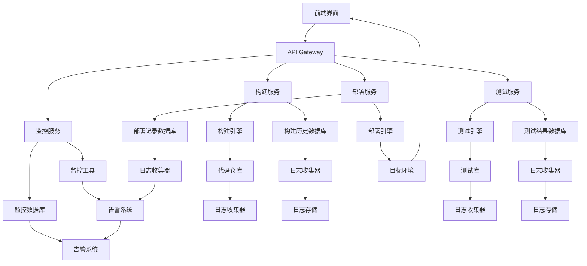

                 

## 持续集成（CI）概述

### 1.1 持续集成的定义与重要性

#### 1.1.1 持续集成的概念

持续集成（Continuous Integration，简称CI）是一种软件开发实践，通过频繁地将开发者的代码变化合并到共享的主干分支中，并对每次合并的代码进行自动化构建和测试。其核心目标是通过自动化和持续的反馈来减少集成时出现的问题，提高代码质量，加速软件交付周期。

持续集成不仅是一种技术实践，更是一种团队文化和协作方式。它强调团队成员之间的沟通和协作，鼓励频繁的代码提交和及时反馈，从而减少代码集成时可能出现的冲突和错误。

#### 1.1.2 持续集成的历史背景

持续集成这一概念最早由ThoughtWorks的工程师Jez Humble和David Farley在其畅销书《持续交付：发布可靠软件的系统化方法》（"Continuous Delivery: Reliable Software Releases through Build, Test, and Deployment Automation"）中提出。虽然其概念源于软件开发领域，但持续集成在实践中受到了广泛的应用，特别是在互联网和敏捷开发领域。

持续集成的发展历程可以追溯到早期软件开发实践中的“集成”概念。传统的软件开发过程中，集成通常是在项目的后期阶段进行的，这往往会导致一系列问题，如集成失败、功能缺失、测试延迟等。为了解决这些问题，软件开发团队开始探索如何在开发过程中更频繁地进行集成和测试，从而提前发现和解决问题。

#### 1.1.3 持续集成在现代软件开发中的作用

在现代软件开发中，持续集成发挥着至关重要的作用。以下是一些持续集成在软件开发中的关键作用：

1. **提高代码质量**：通过频繁的构建和自动化测试，持续集成可以帮助开发人员及时发现问题并修复，从而提高代码质量。

2. **减少集成风险**：通过持续集成，开发人员可以在每次代码合并时都进行全面的测试，从而减少集成时可能出现的问题。

3. **加速软件交付周期**：持续集成通过自动化构建和测试，可以显著缩短集成和部署时间，从而加速软件交付周期。

4. **提高团队协作效率**：持续集成强调频繁的代码提交和及时反馈，有助于团队成员之间的沟通和协作，提高整体开发效率。

5. **增强软件可靠性**：持续集成确保每次代码合并后的软件版本都是稳定和可靠的，从而降低软件故障的风险。

总之，持续集成是一种现代化、高效、可靠的软件开发实践，它对提高代码质量、减少集成风险、加速软件交付周期、提高团队协作效率和增强软件可靠性具有显著的积极影响。

### 1.2 软件交付周期的问题与挑战

#### 1.2.1 软件交付周期的现状

软件交付周期是指从软件开发需求确定到最终软件产品交付给用户所经历的时间。在不同的软件项目中，交付周期的长度差异可能非常大。对于一些大型、复杂的软件项目，交付周期可能长达数年，而一些小型、简单的项目则可能在数月内完成。然而，无论项目大小，交付周期都面临着一系列问题和挑战。

目前，许多软件项目在交付周期上面临着以下问题：

1. **周期过长**：许多软件项目的交付周期过长，导致项目延期交付，影响用户体验和业务发展。
2. **质量问题**：在传统的软件开发过程中，集成和测试通常在项目后期进行，导致质量问题难以及时发现和修复。
3. **协作效率低**：团队成员之间的沟通和协作不充分，导致代码集成时出现冲突和错误。
4. **部署困难**：部署过程通常需要手动操作，不仅费时费力，而且容易出错。

#### 1.2.2 传统软件交付流程的缺陷

传统的软件交付流程通常包括以下几个阶段：需求分析、设计、编码、测试、集成、部署和维护。虽然这种流程在某种程度上是有效的，但它也存在一些明显的缺陷：

1. **集成和测试滞后**：在传统的交付流程中，集成和测试通常在项目后期进行，这导致集成时可能出现大量的质量问题，增加项目风险。
2. **团队协作不足**：在传统流程中，各个开发团队之间的协作往往不足，导致集成时出现冲突和错误。
3. **部署困难**：部署过程通常需要手动操作，不仅费时费力，而且容易出错，增加了部署风险。
4. **反馈延迟**：在传统流程中，用户反馈通常在项目后期才能得到，这导致软件交付后可能需要进行大量的修复和优化。

#### 1.2.3 持续集成如何解决软件交付周期问题

持续集成通过一系列自动化实践，可以有效解决传统软件交付流程中存在的问题，从而显著缩短交付周期：

1. **频繁集成**：持续集成要求开发团队频繁地将代码变化合并到主干分支中，并进行自动化测试，确保每次合并的代码都是可运行的，从而减少集成时的问题。
2. **自动化构建和测试**：通过自动化构建和测试，持续集成可以显著缩短集成和测试的时间，提高开发效率。
3. **早期发现问题**：持续集成确保每次代码合并后都进行全面的测试，从而在早期阶段发现问题并进行修复，降低项目风险。
4. **增强团队协作**：持续集成强调频繁的代码提交和及时反馈，有助于团队成员之间的沟通和协作，提高整体开发效率。
5. **简化部署流程**：通过持续集成平台，部署过程可以完全自动化，减少手动操作，提高部署效率和稳定性。

总之，持续集成通过自动化和持续反馈，有效解决了传统软件交付周期中的问题，提高了代码质量，减少了集成风险，加速了软件交付周期，为软件开发带来了显著的改进。

### 1.3 持续集成与持续交付的关系

持续集成（CI）与持续交付（CD）是现代软件开发中两个重要的概念，它们共同构成了持续交付（Continuous Delivery）的实践。虽然这两个概念有相似之处，但它们在实践中有不同的作用和目标。

#### 1.3.1 持续集成的定义

持续集成是一种软件开发实践，通过频繁地将开发者的代码变化合并到共享的主干分支中，并对每次合并的代码进行自动化构建和测试。其核心目标是通过自动化和持续的反馈来减少集成时出现的问题，提高代码质量，加速软件交付周期。

持续集成的具体实践包括：

1. **频繁提交**：开发人员频繁地提交代码变化，以确保主干分支始终保持稳定。
2. **自动化构建**：每次提交的代码都会被自动化构建，生成可运行的软件版本。
3. **自动化测试**：对构建后的软件版本进行自动化测试，确保代码变化不会引入新的问题。

#### 1.3.2 持续交付的定义

持续交付是一种软件开发实践，通过自动化构建、测试和部署，确保软件可以随时发布。持续交付的目标是确保每次代码提交后的软件都是可部署的，并能够在生产环境中稳定运行。

持续交付的具体实践包括：

1. **自动化构建**：生成可执行的软件版本，并确保其通过所有测试。
2. **自动化测试**：在构建过程中执行自动化测试，确保软件质量。
3. **自动化部署**：将经过测试的软件部署到生产环境，确保其可以稳定运行。

#### 1.3.3 持续集成与持续交付的关系

持续集成和持续交付是紧密相关的两个概念，它们共同构成了持续交付的实践。

1. **持续集成是实现持续交付的前提**：持续集成通过自动化构建和测试，确保每次代码提交后的软件都是可运行的，为持续交付提供了前提条件。
2. **持续交付是持续集成的最终目标**：持续交付的目标是确保软件可以随时发布，而持续集成是实现这一目标的手段。
3. **两者相互促进**：持续集成提高了代码质量，减少了集成风险，为持续交付提供了稳定的软件版本；持续交付则通过自动化部署，确保了软件的快速交付和稳定运行，进一步推动了持续集成实践的完善。

总之，持续集成和持续交付是现代软件开发中不可或缺的实践，它们通过自动化和持续反馈，提高了代码质量，减少了集成风险，加速了软件交付周期，为软件开发带来了显著的改进。在实际应用中，持续集成和持续交付往往结合使用，形成一套完整的持续交付体系，从而实现高效、可靠的软件开发。

## 第二部分: 持续集成核心概念

### 2.1 构建与构建流程

#### 2.1.1 构建的定义

构建（Build）是指将源代码转换为可执行软件的过程。这个过程中，源代码被编译、链接，并生成可运行的程序。构建是软件开发中不可或缺的一环，它确保了代码的可执行性和稳定性。

#### 2.1.2 常见的构建工具

在软件开发中，常见的构建工具有以下几种：

1. **Maven**：Maven是一个强大的项目管理和构建工具，用于处理项目的构建、报告和文档工作。它使用了一组标准的目录结构和插件系统，支持各种开发语言。
   
2. **Gradle**：Gradle是一个基于Apache Ant和Apache Maven理念的构建工具。它提供了灵活的构建脚本，支持多项目构建和复杂的依赖管理。

3. **Gulp**：Gulp是一个前端构建工具，用于自动化前端工作流程。它可以编译ES6代码、压缩CSS和JavaScript文件、重置浏览器缓存等。

4. **Bazel**：Bazel是一个开源的构建和测试工具，由Google开发。它支持多语言和跨平台构建，适用于大型项目。

#### 2.1.3 构建流程的基本步骤

构建流程通常包括以下步骤：

1. **编译**：将源代码编译成目标代码，生成可执行的文件。这通常涉及到将高级编程语言（如Java、C++）转换为机器码。
   
2. **链接**：将编译后的目标代码和库文件链接起来，生成可执行的程序。链接过程将多个编译单元（编译后的文件）合并成一个完整的可执行文件。

3. **测试**：构建过程中通常包含自动化测试，以确保构建出来的软件符合预期。这包括单元测试、集成测试和系统测试等。

4. **部署**：将构建好的软件部署到目标环境，如开发环境、测试环境和生产环境。

### 2.2 测试与测试流程

#### 2.2.1 测试的重要性

测试是确保软件质量的重要手段。通过测试，可以发现和修复软件中的错误，确保软件的功能和性能符合预期。在持续集成实践中，自动化测试是核心组成部分，它可以提高测试效率，确保每次代码提交后的软件都是可靠的。

#### 2.2.2 自动化测试工具

自动化测试工具能够自动化执行测试用例，从而提高测试效率。以下是一些常见的自动化测试工具：

1. **JUnit**：JUnit是一个流行的Java单元测试框架，用于编写和执行Java单元测试。

2. **Selenium**：Selenium是一个开源的自动化测试工具，用于测试Web应用程序。它支持多种浏览器和编程语言，如Java、Python和C#。

3. **Cucumber**：Cucumber是一个行为驱动开发（BDD）框架，用于编写和执行基于自然语言的测试用例。

4. **JUnit**：JUnit是一个流行的Java单元测试框架，用于编写和执行Java单元测试。

5. **Selenium**：Selenium是一个开源的自动化测试工具，用于测试Web应用程序。它支持多种浏览器和编程语言，如Java、Python和C#。

#### 2.2.3 测试流程的优化

优化测试流程可以提高测试效率和代码质量。以下是一些优化策略：

1. **测试自动化**：尽可能将测试自动化，减少手动测试的工作量。

2. **测试覆盖**：确保测试覆盖到代码的关键部分，避免遗漏重要功能。

3. **持续反馈**：及时反馈测试结果，确保问题得到快速解决。

4. **持续测试**：在每次代码提交后都执行自动化测试，确保每次提交的代码都是可运行的。

### 2.3 部署与部署流程

#### 2.3.1 部署的定义

部署（Deployment）是指将构建好的软件安装到目标环境（如服务器）的过程。部署过程可能涉及安装软件、配置环境、启动服务等多个步骤。

#### 2.3.2 常见的部署策略

以下是一些常见的部署策略：

1. **手动部署**：开发人员手动将软件安装到目标环境，这种方式虽然简单，但容易出错且效率低下。

2. **脚本部署**：使用脚本自动化部署过程，如使用Shell脚本或Python脚本。这种方式可以提高部署效率，但需要维护和更新脚本。

3. **持续部署**：将部署过程完全自动化，如使用持续集成平台（如Jenkins、GitLab CI）自动执行部署。这种方式可以提高部署效率和稳定性。

#### 2.3.3 部署流程的自动化

部署流程的自动化是持续集成的重要目标之一。通过自动化部署，可以减少人为错误，提高部署效率。以下是一些自动化部署的关键步骤：

1. **构建和测试**：在持续集成平台中，构建和测试过程是自动完成的。

2. **环境准备**：在部署过程中，需要准备合适的环境，如安装必要的软件和配置网络。

3. **安装和配置**：使用脚本或配置管理工具（如Ansible、Puppet）自动安装和配置软件。

4. **启动和监控**：部署完成后，启动服务并监控其运行状态，确保软件正常运行。

### 2.4 持续集成与持续交付

#### 2.4.1 持续集成的演进

持续集成起源于软件开发实践中对集成和测试的重视。随着时间的推移，持续集成逐渐发展成为一套完整的软件开发实践，涵盖了从代码提交到软件交付的整个过程。

1. **初期**：持续集成最初主要是为了减少集成风险，通过自动化构建和测试来确保代码的可运行性。

2. **发展**：随着持续集成实践的普及，它逐渐扩展到涵盖自动化部署和监控，形成了一套完整的持续交付实践。

3. **成熟**：现代持续集成平台不仅支持自动化构建、测试和部署，还支持持续监控和反馈，为软件开发提供了全方位的支持。

#### 2.4.2 持续交付的概念

持续交付（Continuous Delivery，简称CD）是一种软件开发实践，通过自动化构建、测试和部署，确保软件可以随时发布。持续交付的目标是确保每次代码提交后的软件都是可发布的，并且在生产环境中能够稳定运行。

#### 2.4.3 持续集成与持续交付的关系

持续集成和持续交付是紧密相关的两个概念。持续集成是实现持续交付的前提，通过自动化构建和测试，确保每次代码提交后的软件都是可运行的；而持续交付则是持续集成的最终目标，通过自动化部署和监控，确保软件可以随时发布。

1. **持续集成**：确保每次代码提交后的软件都是可运行的，通过自动化构建和测试实现。
2. **持续交付**：确保每次代码提交后的软件都是可发布的，通过自动化部署和监控实现。

总之，持续集成和持续交付共同构成了现代软件开发的核心实践，通过自动化和持续反馈，提高了代码质量，减少了集成风险，加速了软件交付周期，为软件开发带来了显著的改进。

### 2.5 持续集成工具的选择

在选择持续集成工具时，需要考虑多个因素，如功能需求、团队规模、项目类型等。以下是一些流行的持续集成工具：

#### 2.5.1 Jenkins

Jenkins是一个开源的持续集成工具，支持多种插件和扩展，适用于各种开发语言和平台。它具有强大的社区支持和丰富的功能，如自动化构建、测试、部署和监控。

#### 2.5.2 GitLab CI

GitLab CI是一个集成在GitLab中的持续集成工具，支持自动化构建、测试和部署。它具有简单易用、灵活部署和强大的集成功能，适用于中小型团队。

#### 2.5.3 GitHub Actions

GitHub Actions是一个基于GitHub的持续集成工具，支持多种编程语言和工作流程。它具有简单易用、免费开源和强大的社区支持，适用于个人和团队项目。

#### 2.5.4 CircleCI

CircleCI是一个云端的持续集成工具，支持多种编程语言和平台。它具有快速构建、强大的自动化测试和高效的资源利用，适用于大型团队和复杂项目。

总之，选择合适的持续集成工具对于实现高效的软件开发流程至关重要。不同的工具具有不同的特点和优势，根据具体需求和团队规模进行选择。

## 第三部分: 持续集成的工作流程

### 3.1 持续集成的工作流程概述

持续集成的工作流程包括从代码提交到最终交付的各个环节。通过自动化构建、测试和部署，持续集成确保每次代码合并后的软件都是可运行的，从而提高代码质量和交付效率。以下是持续集成工作流程的概述：

#### 3.1.1 工作流程的组成

持续集成的工作流程通常包括以下几个关键步骤：

1. **代码仓库**：开发人员将代码提交到代码仓库，如Git或SVN。
2. **代码拉取**：持续集成工具从代码仓库拉取最新代码。
3. **构建**：持续集成工具使用构建工具（如Maven、Gradle）编译和构建代码，生成可执行的软件。
4. **测试**：对构建后的软件进行自动化测试，包括单元测试、集成测试和系统测试。
5. **部署**：将测试通过的软件部署到测试或生产环境。
6. **监控**：监控软件的运行状态，确保其稳定运行。

#### 3.1.2 工作流程的执行步骤

以下是持续集成工作流程的具体执行步骤：

1. **代码提交**：开发人员将代码提交到代码仓库，触发持续集成流程。
2. **拉取代码**：持续集成工具从代码仓库拉取最新代码。
3. **构建**：持续集成工具使用构建工具编译和构建代码，生成可执行的软件。
4. **测试**：对构建后的软件进行自动化测试，确保其功能正确和性能稳定。
5. **部署**：将测试通过的软件部署到测试或生产环境。
6. **反馈**：持续集成工具将测试结果和部署状态反馈给开发人员和团队。

### 3.2 构建流程详细解析

#### 3.2.1 源代码管理

源代码管理（Source Code Management，简称SCM）是持续集成的基础。SCM工具（如Git、SVN）用于存储和管理代码，支持版本控制和协作开发。以下是源代码管理的关键步骤：

1. **初始化代码库**：在SCM工具中初始化代码库，用于存储项目的源代码。
2. **克隆代码库**：开发人员从代码库克隆代码，进行本地开发和测试。
3. **代码提交**：开发人员将本地代码提交到代码库，触发持续集成流程。
4. **代码合并**：开发人员将代码合并到主干分支，确保代码一致性。

#### 3.2.2 编译与构建

编译（Compilation）是将源代码转换为机器码的过程。构建（Build）是在编译的基础上，将编译后的目标代码和库文件链接起来，生成可执行的软件。

1. **编译**：使用编译器（如GCC、Java Compiler）将源代码编译成目标代码。
2. **构建**：使用构建工具（如Maven、Gradle）将目标代码和库文件链接起来，生成可执行的软件。

#### 3.2.3 构建结果验证

构建结果验证是确保构建过程成功的关键步骤。以下是一些常见的验证方法：

1. **检查构建日志**：查看构建日志，确保没有编译错误和链接错误。
2. **运行测试**：运行自动化测试，确保构建后的软件符合预期。
3. **静态代码分析**：使用静态代码分析工具（如SonarQube）检查代码质量，发现潜在问题。

### 3.3 测试流程详细解析

#### 3.3.1 单元测试

单元测试（Unit Testing）是测试的最基本形式，用于验证代码的每个单元（如函数、方法）是否按预期工作。以下是一些单元测试的关键步骤：

1. **编写测试用例**：根据代码的功能和需求，编写测试用例，覆盖代码的各个部分。
2. **执行测试**：使用单元测试框架（如JUnit、TestNG）执行测试用例，验证代码的每个单元。
3. **记录结果**：记录测试结果，包括通过、失败和错误，分析测试覆盖率。

#### 3.3.2 集成测试

集成测试（Integration Testing）用于验证代码模块之间的接口和交互是否正确。以下是一些集成测试的关键步骤：

1. **构建集成环境**：搭建集成测试环境，包括数据库、Web服务器等。
2. **编写测试用例**：根据代码的集成需求，编写测试用例，模拟实际使用场景。
3. **执行测试**：使用集成测试框架（如Selenium、Postman）执行测试用例，验证代码模块之间的交互。
4. **记录结果**：记录测试结果，包括通过、失败和错误，分析测试覆盖率。

#### 3.3.3 系统测试

系统测试（System Testing）用于验证整个系统的功能、性能和安全等方面是否满足需求。以下是一些系统测试的关键步骤：

1. **构建测试环境**：搭建与生产环境相似的测试环境，包括服务器、数据库等。
2. **编写测试用例**：根据系统的需求，编写测试用例，覆盖系统的各个功能。
3. **执行测试**：使用系统测试工具（如LoadRunner、QfTest）执行测试用例，验证系统的功能、性能和安全等方面。
4. **记录结果**：记录测试结果，包括通过、失败和错误，分析测试覆盖率。

### 3.4 部署流程详细解析

#### 3.4.1 部署前准备

部署前准备是确保部署过程顺利的关键步骤。以下是一些部署前准备的关键步骤：

1. **环境准备**：搭建部署环境，包括服务器、网络、数据库等。
2. **版本管理**：管理软件的版本，确保部署的是正确的版本。
3. **依赖管理**：管理软件的依赖，确保所有依赖都安装和配置正确。
4. **备份**：备份现有环境，确保在部署过程中出现问题时可以恢复。

#### 3.4.2 部署过程

部署过程是将软件安装到目标环境的过程。以下是一些部署过程的关键步骤：

1. **安装软件**：使用部署工具（如Puppet、Ansible）将软件安装到服务器。
2. **配置环境**：配置软件所需的环境，如数据库连接、服务器设置等。
3. **启动服务**：启动软件的服务，确保其正常运行。
4. **验证部署**：验证部署的结果，确保软件按预期运行。

#### 3.4.3 部署后验证

部署后验证是确保部署成功的最后一步。以下是一些部署后验证的关键步骤：

1. **功能验证**：验证软件的功能是否按预期运行。
2. **性能验证**：验证软件的性能是否达到预期，如响应时间、并发处理能力等。
3. **安全验证**：验证软件的安全性，如是否存在漏洞、安全策略是否正确等。
4. **监控**：部署完成后，开始监控软件的运行状态，确保其稳定运行。

### 3.5 工作流程优化与最佳实践

#### 3.5.1 代码质量监控

代码质量监控是确保代码质量的重要手段。以下是一些代码质量监控的最佳实践：

1. **静态代码分析**：使用静态代码分析工具（如SonarQube）对代码进行分析，发现潜在的问题。
2. **代码审查**：定期进行代码审查，确保代码符合编程规范和最佳实践。
3. **自动化测试**：编写自动化测试用例，覆盖代码的各个部分，确保每次提交的代码都是可运行的。

#### 3.5.2 持续反馈与迭代

持续反馈与迭代是持续集成的重要特点。以下是一些持续反馈与迭代的最佳实践：

1. **及时反馈**：及时反馈测试结果和部署状态，确保问题得到快速解决。
2. **迭代开发**：采用迭代开发模式，快速交付功能，及时收集用户反馈，持续优化软件。
3. **代码审查**：定期进行代码审查，确保代码质量，减少集成风险。

#### 3.5.3 持续集成平台的选择

选择合适的持续集成平台对工作流程的优化至关重要。以下是一些选择持续集成平台时需要考虑的因素：

1. **功能需求**：根据团队的需求选择具有合适功能的持续集成平台。
2. **易用性**：选择易于使用和部署的持续集成平台。
3. **社区支持**：选择有良好社区支持的持续集成平台，确保遇到问题时能够得到及时帮助。
4. **扩展性**：选择具有良好扩展性的持续集成平台，以支持未来的需求变化。

### 3.6 持续集成与持续交付的关系

持续集成（CI）与持续交付（CD）是紧密相关的两个概念。持续集成通过自动化构建、测试和部署，确保每次代码提交后的软件都是可运行的；而持续交付则是确保每次代码提交后的软件都是可发布的。持续集成是实现持续交付的前提，持续交付是持续集成的最终目标。

通过持续集成和持续交付的实践，开发团队可以实现高效的软件开发流程，提高代码质量，减少集成风险，加速软件交付周期，为用户带来更好的体验。

## 第四部分：持续集成系统设计与实现

### 4.1 系统功能需求分析

在设计和实现持续集成系统时，明确系统的功能需求至关重要。持续集成系统需要具备以下功能：

#### 4.1.1 构建管理

1. **自动化构建**：系统能够自动从代码仓库拉取最新代码，并使用构建工具（如Maven、Gradle）进行编译和构建。
2. **构建监控**：系统能够实时监控构建过程，并在构建成功或失败时发送通知。
3. **构建历史记录**：系统保存构建的历史记录，包括构建时间、构建结果和构建日志，便于后续查询和分析。

#### 4.1.2 测试管理

1. **自动化测试**：系统能够自动执行预定的测试用例，包括单元测试、集成测试和系统测试。
2. **测试报告**：系统能够生成详细的测试报告，展示测试结果、测试覆盖率和发现的问题。
3. **测试结果分析**：系统能够对测试结果进行分析，识别常见的错误模式和瓶颈，辅助开发人员进行优化。

#### 4.1.3 部署管理

1. **自动化部署**：系统能够自动将通过测试的构建部署到目标环境，如开发、测试或生产环境。
2. **部署策略**：系统支持多种部署策略，如蓝绿部署、灰度发布等，以满足不同的业务需求。
3. **部署监控**：系统能够实时监控部署过程，并在部署成功或失败时发送通知。

#### 4.1.4 监控和反馈

1. **实时监控**：系统能够实时监控软件的运行状态，包括服务器的性能、应用的响应时间等。
2. **异常告警**：系统在发现异常情况时，能够及时发送告警通知，包括邮件、短信、钉钉等。
3. **反馈机制**：系统提供一个反馈机制，使开发人员能够及时了解用户的反馈和建议。

### 4.2 系统架构设计

持续集成系统的架构设计需要考虑系统的可扩展性、高可用性和安全性。以下是系统架构的设计：

#### 4.2.1 系统架构概述

持续集成系统的架构可以分为以下几个层次：

1. **前端界面层**：提供用户交互界面，包括构建、测试、部署监控等功能。
2. **服务层**：实现业务逻辑，包括构建服务、测试服务、部署服务、监控服务等。
3. **数据层**：存储系统的数据和日志，包括代码仓库、构建历史、测试结果、部署记录等。

#### 4.2.2 架构图与组件说明

以下是持续集成系统的架构图和组件说明：

**组件说明**：

1. **API Gateway**：接收前端请求，转发到相应的服务层。
2. **构建服务**：负责处理构建请求，调用构建引擎执行构建，并将结果保存到构建历史数据库。
3. **测试服务**：负责处理测试请求，调用测试引擎执行测试，并将结果保存到测试结果数据库。
4. **部署服务**：负责处理部署请求，调用部署引擎执行部署，并将结果保存到部署记录数据库。
5. **监控服务**：负责监控系统的运行状态，包括服务器的性能、应用的响应时间等，并将监控数据保存到监控数据库。
6. **构建引擎**：执行构建过程的实际工作，如编译、打包、构建依赖等。
7. **测试引擎**：执行测试过程的实际工作，如单元测试、集成测试、系统测试等。
8. **部署引擎**：执行部署过程的实际工作，如安装软件、配置环境、启动服务等。
9. **代码仓库**：存储项目的源代码，支持版本控制和协作开发。
10. **构建历史数据库**：存储构建历史记录，包括构建时间、构建结果、构建日志等。
11. **测试结果数据库**：存储测试结果，包括测试覆盖率、发现的问题等。
12. **部署记录数据库**：存储部署记录，包括部署时间、部署结果、部署日志等。
13. **监控工具**：监控系统的性能指标，如CPU使用率、内存使用率、响应时间等。
14. **日志收集器**：收集系统的日志，并将日志存储到日志存储中。
15. **日志存储**：存储系统的日志，便于后续查询和分析。
16. **目标环境**：部署后的软件运行环境，如开发、测试、生产环境等。
17. **告警系统**：在发现异常情况时，发送告警通知。

#### 4.2.3 系统可扩展性与高可用性设计

为了确保系统的高可用性和可扩展性，在设计过程中需要考虑以下几个方面：

1. **服务拆分**：将系统拆分成多个独立的服务，如构建服务、测试服务、部署服务、监控服务等。这样可以实现服务的独立扩展和故障隔离。
2. **负载均衡**：使用负载均衡器（如Nginx、HAProxy）实现服务的负载均衡，提高系统的并发处理能力。
3. **分布式存储**：使用分布式存储系统（如HDFS、Cassandra）存储数据和日志，提高存储的可靠性和扩展性。
4. **集群部署**：将系统的关键组件部署在集群中，如数据库集群、服务集群等，提高系统的可用性和容错能力。
5. **备份与恢复**：定期备份系统和数据，并在出现故障时能够快速恢复。

### 4.3 系统接口设计

持续集成系统需要提供多个接口供其他系统和服务调用。以下是系统接口的设计：

#### 4.3.1 API设计

1. **构建API**：用于发起构建请求，包括构建参数、触发方式等。
2. **测试API**：用于发起测试请求，包括测试类型、测试参数等。
3. **部署API**：用于发起部署请求，包括部署目标、部署参数等。
4. **监控API**：用于查询系统的监控数据，包括性能指标、告警记录等。

#### 4.3.2 数据库设计

1. **用户表**：存储用户信息，包括用户ID、用户名、密码等。
2. **项目表**：存储项目信息，包括项目ID、项目名称、项目描述等。
3. **构建表**：存储构建信息，包括构建ID、构建状态、构建日志等。
4. **测试表**：存储测试信息，包括测试ID、测试名称、测试结果等。
5. **部署表**：存储部署信息，包括部署ID、部署状态、部署日志等。
6. **监控表**：存储监控数据，包括监控指标、监控时间等。

### 4.4 系统交互设计

持续集成系统的交互设计需要考虑用户操作和系统内部交互的流程。以下是系统交互的设计：

#### 4.4.1 用户交互流程

1. **登录**：用户使用用户名和密码登录系统。
2. **新建项目**：用户创建新项目，填写项目名称和描述。
3. **配置构建**：用户配置构建参数，包括构建工具、构建脚本、触发方式等。
4. **配置测试**：用户配置测试参数，包括测试类型、测试脚本、触发方式等。
5. **配置部署**：用户配置部署参数，包括部署目标、部署脚本、触发方式等。
6. **发起构建**：用户发起构建请求，系统自动执行构建过程。
7. **查看结果**：用户查看构建、测试和部署的结果，包括成功、失败、警告等信息。
8. **监控系统**：用户查看系统的监控数据，包括性能指标、告警记录等。

#### 4.4.2 系统内部交互

1. **代码仓库交互**：系统从代码仓库拉取最新代码，用于构建和测试。
2. **构建服务交互**：系统调用构建服务的API，执行构建过程，并将构建结果保存到数据库。
3. **测试服务交互**：系统调用测试服务的API，执行测试过程，并将测试结果保存到数据库。
4. **部署服务交互**：系统调用部署服务的API，执行部署过程，并将部署结果保存到数据库。
5. **监控服务交互**：系统调用监控服务的API，获取系统的监控数据，并保存到数据库。
6. **日志收集交互**：系统将构建、测试、部署的日志发送到日志收集器，并存储到日志存储中。

#### 4.4.3 异常处理与监控

1. **异常处理**：系统在出现异常时，记录异常信息，并尝试恢复。
2. **监控告警**：系统在发现异常时，发送告警通知，包括邮件、短信、钉钉等。

### 4.5 系统实现

在系统实现过程中，需要根据需求分析和架构设计，编写具体的代码，并集成各个组件和模块。以下是系统实现的主要步骤：

1. **环境搭建**：搭建持续集成系统所需的环境，包括服务器、数据库、代码仓库等。
2. **代码编写**：根据接口设计和数据库设计，编写系统的代码，包括前端、后端、数据库等。
3. **集成测试**：对系统进行集成测试，确保各个组件和模块之间的交互正常。
4. **功能测试**：对系统进行功能测试，确保系统的各项功能按预期工作。
5. **性能测试**：对系统进行性能测试，确保系统的并发处理能力和响应时间满足需求。
6. **部署上线**：将系统部署到生产环境，并进行监控和优化。

### 4.6 系统案例

以下是一个实际的持续集成系统案例：

**项目背景**：某互联网公司开发一款在线购物平台，需要实现快速迭代和高效交付。

**系统需求**：系统需要支持自动化构建、测试和部署，提供实时监控和告警功能。

**系统架构**：

1. **前端界面**：使用Vue.js实现，提供用户操作界面。
2. **后端服务**：使用Spring Boot实现，提供构建、测试、部署、监控等API。
3. **数据库**：使用MySQL存储用户、项目、构建、测试、部署等数据。
4. **代码仓库**：使用GitLab存储项目代码。
5. **构建工具**：使用Maven进行构建。
6. **测试工具**：使用JUnit进行单元测试，使用Selenium进行集成测试。
7. **部署工具**：使用Docker进行部署。

**系统实现**：

1. **前端界面**：开发用户操作界面，包括登录、新建项目、配置构建、测试、部署等。
2. **后端服务**：实现构建、测试、部署、监控等API，并与前端界面进行集成。
3. **数据库**：设计数据库表结构，并实现数据的增删改查操作。
4. **代码仓库**：配置GitLab CI，实现自动化构建和测试。
5. **构建工具**：编写Maven构建脚本，实现自动化构建。
6. **测试工具**：编写JUnit和Selenium测试脚本，实现自动化测试。
7. **部署工具**：编写Dockerfile，实现自动化部署。

**系统部署**：将前端界面部署到Nginx，后端服务部署到Tomcat，数据库部署到MySQL，代码仓库部署到GitLab，构建和测试工具部署到Jenkins，部署工具部署到Docker。

**系统监控**：使用Prometheus和Grafana进行实时监控，发送告警通知。

### 4.7 系统小结

通过持续集成系统的实施，该公司实现了自动化构建、测试和部署，提高了开发效率和代码质量，缩短了交付周期。系统还提供了实时监控和告警功能，确保软件的稳定运行和快速修复。

### 4.8 最佳实践 tips

1. **合理规划构建和测试流程**：根据项目需求，合理规划构建和测试流程，确保自动化流程的高效运行。
2. **持续优化代码质量**：定期进行代码审查和静态代码分析，持续优化代码质量。
3. **充分利用持续集成平台功能**：充分利用持续集成平台的功能，如流水线、插件等，提高开发效率。
4. **定期进行系统性能测试**：定期进行系统性能测试，确保系统的稳定性和响应速度。
5. **建立健全的监控和告警机制**：建立健全的监控和告警机制，确保软件的稳定运行和快速响应。

### 4.9 注意事项

1. **确保系统的安全性**：确保系统的安全性，包括用户认证、数据加密等。
2. **定期备份系统和数据**：定期备份系统和数据，确保在出现故障时能够快速恢复。
3. **合理规划资源**：合理规划系统的资源，包括服务器、数据库等，确保系统的稳定运行。
4. **及时更新和维护系统**：及时更新和维护系统，包括修复漏洞、升级软件等。

### 4.10 拓展阅读

1. 《持续交付：发布可靠软件的系统化方法》 - Jez Humble和David Farley
2. 《持续集成实践》 - Paul Duvall、Steve Matyas和Andrew Glover
3. 《敏捷软件开发：原则、实践与模式》 - Robert C. Martin
4. 《Docker实战》 - Kevin Dilmore

### 4.11 结论

持续集成是一种现代化、高效、可靠的软件开发实践，通过自动化构建、测试和部署，提高了代码质量，减少了集成风险，加速了软件交付周期。通过本文的介绍，我们了解了持续集成的工作流程、系统设计与实现、以及最佳实践。希望本文能对您在持续集成实践中的应用有所帮助。

---

## 第五部分：持续集成最佳实践

### 5.1 选择合适的持续集成工具

选择适合团队需求的持续集成工具是成功实施持续集成的关键。以下是几个在选择工具时需要考虑的因素：

1. **团队规模**：对于小型团队，可以选择开源工具如Jenkins、GitLab CI，它们易于安装和配置。对于大型团队或企业级应用，可能需要考虑商业工具如CircleCI或GitLab Enterprise Edition，它们提供了更多高级功能和扩展性。
   
2. **功能需求**：评估工具提供的功能，包括构建、测试、部署、监控、通知等。确保所选工具能够满足团队的需求，如多项目支持、并行构建、容器化部署等。

3. **易用性**：工具的易用性对于持续集成的推广至关重要。选择具有良好用户界面和文档的工具，有助于团队成员快速上手。

4. **社区支持和文档**：强大的社区支持和详细的文档可以帮助团队解决在使用过程中遇到的问题。

### 5.2 明确持续集成策略

制定明确的持续集成策略是确保流程顺利进行的基础。以下是几个关键步骤：

1. **定义流程**：明确代码提交到软件交付的每个步骤，包括代码拉取、构建、测试、部署等。

2. **制定规范**：制定代码提交、构建、测试、部署等操作的规范，确保团队成员遵循统一的流程。

3. **版本管理**：使用版本控制工具（如Git）进行代码管理，确保代码的版本控制和安全。

4. **代码质量标准**：设置代码质量标准，包括代码格式、命名规范、注释等，使用代码审查工具（如SonarQube）进行自动检查。

### 5.3 自动化测试

自动化测试是持续集成的重要组成部分，以下是几个最佳实践：

1. **全面覆盖**：编写覆盖项目各个功能模块的测试用例，确保测试的全面性。

2. **持续运行**：定期运行自动化测试，确保每次代码提交后都能快速发现潜在问题。

3. **测试优化**：定期评估和优化测试流程，包括测试用例的编写、执行和结果分析。

4. **静态代码分析**：结合静态代码分析工具，提前发现代码中的潜在问题，如安全漏洞、性能瓶颈等。

### 5.4 部署自动化

部署自动化是持续集成的重要目标之一，以下是几个关键点：

1. **容器化**：使用容器化技术（如Docker）实现应用的打包和部署，提高部署的可靠性和一致性。

2. **持续反馈**：在部署过程中实时监控软件的运行状态，并在出现问题时及时反馈。

3. **版本控制**：使用版本控制系统管理部署脚本和配置文件，确保部署过程的规范化和可追溯性。

4. **安全控制**：在部署过程中实施安全策略，包括用户认证、权限控制、数据加密等。

### 5.5 持续反馈和改进

持续集成是一个不断迭代和改进的过程，以下是几个持续反馈和改进的最佳实践：

1. **定期回顾**：定期回顾持续集成流程的执行情况，包括构建、测试、部署等，识别潜在问题和改进点。

2. **用户反馈**：积极收集用户反馈，了解实际使用中的问题和需求，持续优化软件。

3. **技术交流**：组织技术交流会议，分享持续集成经验和最佳实践，促进团队成员之间的学习和合作。

4. **持续学习**：关注持续集成领域的最新技术和发展动态，不断学习和引进新技术。

### 5.6 最佳实践总结

通过上述最佳实践，团队可以构建一个高效、可靠的持续集成体系，从而提高代码质量，减少集成风险，加速软件交付周期。以下是一个总结：

- **选择合适的工具**：确保工具满足团队需求，具有易用性和良好的社区支持。
- **明确流程规范**：制定明确的持续集成策略和流程规范，确保团队成员遵循。
- **全面自动化测试**：编写全面、持续运行的自动化测试用例，结合静态代码分析提前发现问题。
- **部署自动化**：使用容器化技术实现自动化部署，确保部署过程的可靠性和一致性。
- **持续反馈和改进**：定期回顾流程执行情况，收集用户反馈，不断优化持续集成体系。

通过实施这些最佳实践，团队可以大幅提高软件开发效率，为用户带来更好的体验。

## 小结

本文详细介绍了持续集成（CI）的核心概念、工作流程、系统设计与实现，以及最佳实践。持续集成通过自动化构建、测试和部署，显著提高了代码质量，减少了集成风险，加速了软件交付周期。以下是本文的核心要点总结：

1. **定义与重要性**：持续集成是一种软件开发实践，通过频繁的代码合并和自动化测试，确保代码质量和软件稳定性。
2. **工作流程**：持续集成的工作流程包括代码提交、构建、测试、部署和监控，每个步骤都通过自动化实现，提高了开发效率和交付速度。
3. **核心概念**：构建、测试、部署是持续集成的核心组成部分，持续集成的目标是实现自动化和持续反馈。
4. **系统设计与实现**：持续集成系统需要具备构建管理、测试管理、部署管理、监控和反馈等功能，其架构设计需考虑可扩展性和高可用性。
5. **最佳实践**：选择合适的持续集成工具、明确持续集成策略、自动化测试、部署自动化、持续反馈和改进是成功实施持续集成的关键。

持续集成在现代软件开发中具有重要作用，通过实施持续集成，开发团队可以实现高效、可靠的软件开发流程，为用户带来更好的体验。希望本文能够帮助读者深入了解持续集成，并在实际项目中成功应用。

### 作者信息

**作者：** AI天才研究院/AI Genius Institute & 禅与计算机程序设计艺术 /Zen And The Art of Computer Programming

AI天才研究院（AI Genius Institute）专注于人工智能领域的前沿研究和创新应用，致力于推动人工智能技术的进步和产业发展。研究院的研究成果在自然语言处理、计算机视觉、机器学习等多个领域取得了显著成就。研究院的团队成员包括多位世界级人工智能专家，他们在计算机科学和人工智能领域具有深厚的学术背景和丰富的实践经验。

《禅与计算机程序设计艺术》（Zen And The Art of Computer Programming）是作者邓特·高斯林（Denton G. Garside）的经典著作，该书深入探讨了计算机程序设计的艺术和哲学，提出了许多关于编程和软件开发的重要思想和原则。邓特·高斯林是一位享誉世界的计算机科学家和作家，他的著作对于计算机科学和软件开发领域产生了深远的影响。

