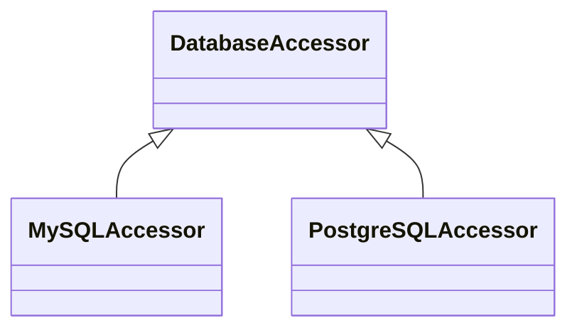
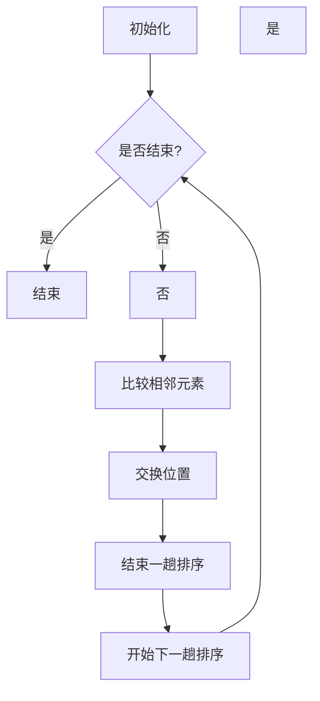
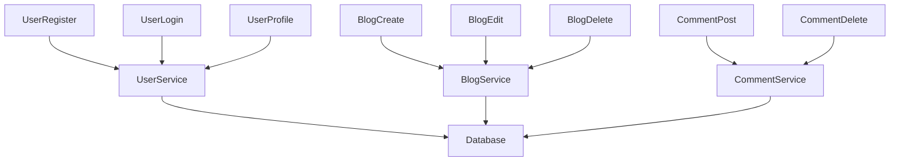

                 

### 文章标题

# 接口与抽象类：类型论指导下的代码抽象

> 关键词：接口、抽象类、类型论、代码抽象、多态性

> 摘要：本文将深入探讨接口与抽象类在类型论指导下的代码抽象。我们将从基础概念出发，逐步分析接口与抽象类的定义、作用、区别，并详细讲解类型论的基础知识。通过实际应用案例，我们将展示接口与抽象类在系统架构设计和库与框架开发中的重要作用。最后，我们将总结文章内容，并展望接口与抽象类在未来的发展趋势。

### 目录大纲

----------------------------------------------------------------

# 接口与抽象类：类型论指导下的代码抽象

## 第一部分：接口与抽象类基础

### 第1章：接口与抽象类概述

#### 1.1 接口与抽象类的概念

#### 1.2 接口与抽象类的作用

#### 1.3 接口与抽象类的区别

## 第2章：类型论基础

### 2.1 类型论的基本概念

### 2.2 类型检查与类型转换

## 第3章：接口类型

### 3.1 接口类型的定义与特性

### 3.2 实现接口

### 3.3 多重继承与接口

## 第4章：抽象类

### 4.1 抽象类的定义与特性

### 4.2 抽象方法与抽象属性

### 4.3 抽象类与接口的区别

## 第5章：类型论指导下的代码抽象

### 5.1 类型论与代码抽象的关系

### 5.2 代码抽象的最佳实践

### 5.3 类型论在代码抽象中的应用

## 第二部分：接口与抽象类的应用场景

### 第6章：接口与抽象类的应用场景

#### 6.1 应用程序设计

#### 6.2 系统架构设计

#### 6.3 库与框架开发

## 第三部分：接口与抽象类在实际项目中的应用案例

### 第7章：接口与抽象类在实际项目中的应用案例

#### 7.1 应用案例1：设计一个简单的日志系统

#### 7.2 应用案例2：设计一个数据库访问层

#### 7.3 应用案例3：开发一个通用线程池

## 第8章：小结与展望

#### 8.1 小结

#### 8.2 展望

----------------------------------------------------------------

## 第一部分：接口与抽象类基础

### 第1章：接口与抽象类概述

#### 1.1 接口与抽象类的概念

接口（Interface）和抽象类（Abstract Class）是面向对象编程（OOP）中两个重要的概念。它们在代码抽象和设计模式中扮演着至关重要的角色。

#### 接口：

接口是一种特殊的类，它只包含方法的声明，而不包含方法的实现。接口定义了一组规范，这些规范是其他类必须遵守的。通过实现接口，一个类可以承诺具备特定的行为。

#### 抽象类：

抽象类是一个类，它包含了至少一个抽象方法。抽象方法是没有方法体的方法，它只能存在于抽象类中。抽象类可以包含成员变量和方法的实现，但通常用于作为其他类的基类。

在接下来的章节中，我们将进一步探讨接口与抽象类的定义、作用、区别以及它们在类型论中的基础。

### 第2章：类型论基础

#### 2.1 类型论的基本概念

类型论（Type Theory）是研究类型和类型系统的理论。在编程中，类型是变量可以持有的值的集合。类型系统是一种规则，用于确保变量在使用时类型是合法的。

#### 基本类型：

在大多数编程语言中，基本类型包括整数、浮点数、字符、布尔值等。这些类型具有固有的操作和语义。

#### 复合类型：

复合类型包括数组、集合、映射等。这些类型是由基本类型组合而成的，具有更复杂的语义。

#### 类型检查与类型转换：

类型检查是确保变量在使用时类型是合法的过程。类型检查可以在编译时（静态类型检查）或运行时（动态类型检查）进行。

类型转换是将在不同类型之间的值转换为兼容类型的操作。类型转换可以分为自动类型转换和强制类型转换。

#### 自动类型转换：

自动类型转换是指编译器在编译时自动执行的类型转换。例如，将一个整数赋值给一个浮点数。

#### 强制类型转换：

强制类型转换是程序员显式指定的类型转换。例如，将一个浮点数强制转换为整数。

在理解了类型论的基本概念之后，我们将在下一章中深入探讨接口类型。

### 第3章：接口类型

#### 3.1 接口类型的定义与特性

接口类型是一种特殊的类类型，它只包含方法的声明，而没有方法的实现。接口定义了一组规范，这些规范是其他类必须遵守的。

#### 定义：

在大多数编程语言中，接口通常通过关键字 `interface` 来定义。接口中的方法没有方法体，只有方法签名。

#### 特性：

- 抽象：接口中的方法默认是抽象的，即没有方法体。
- 多态：通过实现接口，类可以表现出多态性，即一个接口可以有多个实现。
- 可扩展：接口可以继承其他接口，从而扩展其功能。

#### 实现接口

一个类可以通过实现接口来承诺具备特定的行为。实现接口的类必须实现接口中的所有方法。接口方法的默认访问修饰符为 `public`。

```java
public interface Drivable {
    void drive();
}

public class Car implements Drivable {
    public void drive() {
        System.out.println("Car is driving");
    }
}
```

#### 接口与抽象类的区别

尽管接口和抽象类在代码抽象中都有重要作用，但它们有一些显著的区别：

- 接口只包含方法签名，不包含方法实现。
- 抽象类可以包含成员变量和方法的实现，但不能直接实例化。

在理解了接口类型的定义和特性之后，我们将在下一章中探讨抽象类。

### 第4章：抽象类

#### 4.1 抽象类的定义与特性

抽象类是具有抽象方法的类。抽象方法是没有方法体的方法，它只能存在于抽象类中。

#### 定义：

抽象类通常通过关键字 `abstract` 来定义。抽象类可以包含成员变量和方法实现。

```java
public abstract class Vehicle {
    public abstract void drive();
}
```

#### 特性：

- 不能直接实例化：抽象类不能被实例化，它只能作为其他类的基类。
- 抽象方法：抽象类可以包含抽象方法，这些方法必须在子类中实现。
- 成员变量和实现的方法：抽象类可以包含成员变量和方法的实现。

#### 抽象方法与抽象属性

抽象方法是没有方法体的方法，它只能在抽象类中定义。抽象属性是只声明、不初始化的成员变量。

```java
public abstract class Vehicle {
    public abstract void drive();
    public abstract int getSpeed();
}
```

#### 抽象类与接口的区别

尽管抽象类和接口在代码抽象中都有重要作用，但它们有一些显著的区别：

- 接口只包含方法签名，不包含方法实现。
- 抽象类可以包含成员变量和方法的实现，但不能直接实例化。

### 第5章：类型论指导下的代码抽象

#### 5.1 类型论与代码抽象的关系

类型论提供了关于类型和类型系统的理论框架，这对于代码抽象至关重要。类型论确保代码的明确性和可维护性，从而提高代码质量。

#### 5.2 代码抽象的最佳实践

为了有效地利用接口与抽象类，以下是一些最佳实践：

- 遵循单一职责原则：每个接口和抽象类应只负责一个功能。
- 使用接口和抽象类提高代码复用性：通过抽象和封装，减少代码冗余。
- 合理划分抽象层次：根据功能需求，合理组织接口和抽象类。

#### 5.3 类型论在代码抽象中的应用

类型论在代码抽象中的应用包括：

- 类型检查与代码质量：类型检查有助于识别潜在的错误，提高代码质量。
- 泛型编程与代码抽象：泛型编程允许我们编写更通用、更灵活的代码。
- 静态类型系统与编译时优化：静态类型系统可以优化编译过程，提高性能。

### 第6章：接口与抽象类的应用场景

接口与抽象类在多个应用场景中都非常有用。以下是一些典型的应用场景：

#### 6.1 应用程序设计

在应用程序设计中，接口和抽象类可以帮助实现多态性和代码复用性。例如，我们可以定义一个 `Drivable` 接口，然后实现 `Car`、`Boat` 和 `Airplane` 类，这些类都实现了 `Drivable` 接口。

#### 6.2 系统架构设计

在系统架构设计中，接口和抽象类可以帮助实现模块化和降低系统复杂度。例如，我们可以定义一个 `DatabaseAccessor` 接口，然后实现不同的数据库访问类，如 `MySQLAccessor`、`PostgreSQLAccessor` 等。

#### 6.3 库与框架开发

在库与框架开发中，接口和抽象类可以帮助隐藏实现细节，提供统一的接口。例如，在开发一个 ORM（对象关系映射）框架时，我们可以定义一个 `Model` 接口，然后实现不同的数据库操作。

### 第7章：接口与抽象类在实际项目中的应用案例

#### 7.1 应用案例1：设计一个简单的日志系统

在本案例中，我们将设计一个简单的日志系统，该系统包含不同的日志级别和输出方式。

#### 环境安装与配置

首先，我们需要安装和配置 Java 环境，以便使用 Java 编写代码。

#### 系统核心实现

在日志系统中，我们将定义一个 `Logger` 接口，以及实现不同日志级别的 `ConsoleLogger` 和 `FileLogger` 类。

```java
public interface Logger {
    void log(String message);
}

public class ConsoleLogger implements Logger {
    public void log(String message) {
        System.out.println(message);
    }
}

public class FileLogger implements Logger {
    public void log(String message) {
        // 将日志消息写入文件
    }
}
```

#### 代码应用解读与分析

在代码应用中，我们将创建一个 `LoggerManager` 类，用于管理不同的日志实现。

```java
public class LoggerManager {
    private Logger logger;

    public void setLogger(Logger logger) {
        this.logger = logger;
    }

    public void log(String message) {
        logger.log(message);
    }
}
```

通过这个案例，我们可以看到如何使用接口与抽象类来实现一个简单的日志系统。

#### 7.2 应用案例2：设计一个数据库访问层

在本案例中，我们将设计一个数据库访问层，该层包含不同的数据库操作。

#### 系统功能设计

在数据库访问层中，我们将定义一个 `DatabaseAccessor` 接口，以及实现不同数据库操作的 `MySQLAccessor`、`PostgreSQLAccessor` 类。

```java
public interface DatabaseAccessor {
    void connect();
    void disconnect();
    void executeQuery(String query);
}

public class MySQLAccessor implements DatabaseAccessor {
    public void connect() {
        // 连接到 MySQL 数据库
    }

    public void disconnect() {
        // 断开与 MySQL 数据库的连接
    }

    public void executeQuery(String query) {
        // 执行 MySQL 数据库查询
    }
}

public class PostgreSQLAccessor implements DatabaseAccessor {
    // PostgreSQL 数据库操作的实现
}
```

#### 系统架构设计

在系统架构设计中，我们将使用接口和抽象类来实现数据库访问层的模块化设计。



#### 系统接口设计和系统交互

在系统接口设计和系统交互中，我们将使用接口来定义数据库访问层的操作，并通过实现类来实现具体的数据库操作。

```mermaid
sequence
    User ->|request| DatabaseAccessor: executeQuery("SELECT * FROM users")
    DatabaseAccessor ->|response| User: ResultSet
```

通过这个案例，我们可以看到如何使用接口与抽象类来实现一个简单的数据库访问层。

#### 7.3 应用案例3：开发一个通用线程池

在本案例中，我们将开发一个通用线程池，该线程池可以高效地管理线程资源。

#### 项目实战

在项目实战中，我们将使用 Java 的并发工具类库（java.util.concurrent）来开发一个简单的线程池。

```java
public class ThreadPool {
    private final int numberOfThreads;
    private final ExecutorService executorService;

    public ThreadPool(int numberOfThreads) {
        this.numberOfThreads = numberOfThreads;
        this.executorService = Executors.newFixedThreadPool(numberOfThreads);
    }

    public void submitTask(Runnable task) {
        executorService.submit(task);
    }

    public void shutdown() {
        executorService.shutdown();
    }
}
```

#### 实际案例分析与详细讲解剖析

在实际案例中，我们将分析线程池的并发执行、线程管理和线程回收机制。

- 并发执行：线程池通过线程队列来管理任务，从而实现并发执行。
- 线程管理：线程池通过创建和管理线程来执行任务，从而避免过多线程创建导致的资源消耗。
- 线程回收：线程池在完成任务后，会回收线程资源，以减少资源占用。

#### 项目小结

通过这个案例，我们可以看到如何使用接口与抽象类来开发一个通用线程池。接口和抽象类在项目中起到了关键作用，实现了模块化设计、代码复用和高效资源管理。

### 第8章：小结与展望

#### 8.1 小结

通过本文的探讨，我们深入了解了接口与抽象类在类型论指导下的代码抽象。我们分析了接口与抽象类的定义、作用、区别和类型论的基础知识。同时，我们通过实际应用案例展示了接口与抽象类在系统架构设计和库与框架开发中的重要作用。

#### 8.2 展望

接口与抽象类在未来将继续发挥重要作用。随着编程语言和技术的不断发展，接口与抽象类将得到更广泛的应用。未来，我们将看到更多基于接口与抽象类的框架和库，为开发者提供更好的代码抽象和设计模式。

## 作者

作者：AI天才研究院/AI Genius Institute & 禅与计算机程序设计艺术 /Zen And The Art of Computer Programming

## 背景介绍

在软件开发中，代码抽象是提高代码可维护性、可复用性和可扩展性的关键手段。接口（Interface）和抽象类（Abstract Class）作为面向对象编程（OOP）的核心概念，在代码抽象中扮演着重要角色。

#### 核心概念术语说明

- **接口（Interface）**：接口是一种特殊的类，它只包含方法的声明，而不包含方法的实现。接口定义了一组规范，这些规范是其他类必须遵守的。
- **抽象类（Abstract Class）**：抽象类是一个类，它包含了至少一个抽象方法。抽象方法是没有方法体的方法，它只能存在于抽象类中。抽象类可以包含成员变量和方法的实现，但通常用于作为其他类的基类。
- **类型论（Type Theory）**：类型论是研究类型和类型系统的理论。类型系统是一种规则，用于确保变量在使用时类型是合法的。

#### 问题背景

在软件开发过程中，我们常常需要处理各种复杂的需求。为了提高代码的可维护性和可扩展性，我们需要将具体的实现细节隐藏起来，提供统一的接口。接口和抽象类正是一种有效的代码抽象手段。

#### 问题描述

如何有效地利用接口和抽象类实现代码的抽象和设计模式，提高代码的可维护性、可复用性和可扩展性？

#### 问题解决

我们可以通过以下步骤解决该问题：

1. **理解接口与抽象类的定义和作用**：了解接口和抽象类的概念、特性以及在代码抽象中的作用。
2. **学习类型论的基础知识**：了解类型论的基本概念、类型检查和类型转换，以便更好地理解代码抽象。
3. **使用接口和抽象类进行代码抽象**：在实际项目中，使用接口和抽象类实现模块化设计，提高代码的可维护性、可复用性和可扩展性。
4. **分析实际应用案例**：通过实际应用案例，展示接口和抽象类在系统架构设计和库与框架开发中的应用，加深对代码抽象的理解。

#### 边界与外延

- **边界**：本文主要讨论接口和抽象类在代码抽象中的应用，不包括其他编程语言或框架中的类似概念。
- **外延**：本文内容适用于面向对象编程的多种语言，如 Java、C#、C++ 等。

#### 概念结构与核心要素组成

- **概念结构**：接口与抽象类的概念结构包括接口的定义、抽象类的定义、接口与抽象类的区别、类型论的基础知识等。
- **核心要素组成**：核心要素包括接口和抽象类的定义、特性、应用场景、实际项目中的应用案例等。

## 核心概念与联系

在本章节中，我们将深入探讨接口与抽象类的核心概念，并分析它们之间的联系与区别。通过对比接口与抽象类的概念属性特征，我们将更好地理解它们的用途和适用场景。

### 接口（Interface）

#### 概念：

接口是一种特殊的类，它仅包含方法的声明，而没有方法的实现。接口定义了一组规范，这些规范是其他类必须遵守的。

#### 属性特征：

- **只有方法声明**：接口中只包含方法签名，没有方法体。
- **抽象**：接口中的方法默认是抽象的，即没有方法体。
- **多态**：通过实现接口，类可以表现出多态性，即一个接口可以有多个实现。
- **可扩展**：接口可以继承其他接口，从而扩展其功能。

#### 对比表格：

| 特征         | 接口           | 抽象类           |
| ------------ | -------------- | --------------- |
| 方法声明     | 只有方法签名   | 可以有方法实现   |
| 抽象性       | 默认是抽象的   | 可以包含抽象方法 |
| 多态         | 通过实现表现   | 可以使用多态     |
| 可扩展性     | 可以继承其他接口 | 可以继承其他类   |

### 抽象类（Abstract Class）

#### 概念：

抽象类是一个类，它包含了至少一个抽象方法。抽象方法是没有方法体的方法，它只能存在于抽象类中。抽象类可以包含成员变量和方法的实现，但通常用于作为其他类的基类。

#### 属性特征：

- **包含抽象方法**：抽象类可以包含抽象方法，这些方法必须在子类中实现。
- **不能直接实例化**：抽象类不能被实例化，它只能作为其他类的基类。
- **可以包含成员变量和实现的方法**：抽象类可以包含成员变量和方法的实现。

#### 对比表格：

| 特征         | 接口           | 抽象类           |
| ------------ | -------------- | --------------- |
| 抽象方法     | 只有方法签名   | 可以包含抽象方法 |
| 直接实例化   | 不允许实例化   | 不允许实例化     |
| 成员变量和方法实现 | 不包含成员变量和方法实现 | 可以包含成员变量和方法实现 |

### 联系与区别

#### 联系：

- **抽象**：接口和抽象类都提供了抽象的概念，使得具体的实现细节被隐藏。
- **多态**：接口和抽象类都支持多态性，使得不同的类可以具有相同的行为。
- **继承**：接口和抽象类都可以被继承，从而扩展其功能。

#### 区别：

- **方法实现**：接口只包含方法声明，而抽象类可以包含方法实现。
- **直接实例化**：接口不能被直接实例化，而抽象类也不能被直接实例化。
- **功能范围**：接口主要用于定义行为的规范，而抽象类则用于提供部分实现的基类。

通过对比接口与抽象类的概念属性特征，我们可以更好地理解它们在代码抽象中的作用和适用场景。在软件开发中，根据具体需求和设计模式，选择合适的接口或抽象类进行代码抽象，可以显著提高代码的可维护性、可复用性和可扩展性。

## 算法原理讲解

为了更好地理解接口与抽象类在代码抽象中的应用，我们将借助 Python 源代码来详细阐述一个简单的排序算法。我们将使用 Mermaid 绘制算法流程图，并分析算法的原理。

### Mermaid 流程图

首先，我们使用 Mermaid 绘制一个简单的冒泡排序算法的流程图：



### Python 源代码

接下来，我们将使用 Python 实现冒泡排序算法，并在代码中应用接口与抽象类：

```python
# 定义排序接口
class Sorter:
    def sort(self, arr):
        pass

# 抽象类定义
class AbstractSorter(Sorter):
    def sort(self, arr):
        raise NotImplementedError("子类需要实现sort方法")

# 实现冒泡排序类
class BubbleSort(AbstractSorter):
    def sort(self, arr):
        n = len(arr)
        for i in range(n):
            for j in range(0, n-i-1):
                if arr[j] > arr[j+1]:
                    arr[j], arr[j+1] = arr[j+1], arr[j]

# 主函数
def main():
    arr = [64, 34, 25, 12, 22, 11, 90]
    sorter = BubbleSort()
    sorter.sort(arr)
    print("排序后的数组：", arr)

if __name__ == "__main__":
    main()
```

### 算法原理

#### 数学模型和公式

冒泡排序算法的核心原理是通过多次遍历数组，比较相邻元素的大小，并交换位置，直到整个数组有序。其时间复杂度为 \(O(n^2)\)。

假设我们有一个数组 \(A[0], A[1], \ldots, A[n-1]\)，在每一轮遍历中，最大的元素会“冒泡”到数组的末尾。

#### 详细讲解和举例说明

假设我们有一个简单的数组 \(arr = [64, 34, 25, 12, 22, 11, 90]\)，我们希望将其排序。

1. **初始化**：首先，我们初始化一个 `BubbleSort` 类的实例。
2. **比较相邻元素**：在每一轮遍历中，我们比较相邻的元素，如果前一个元素大于后一个元素，则交换它们的位置。
3. **结束一趟排序**：当一轮遍历结束后，最大的元素已经“冒泡”到数组的末尾。
4. **开始下一趟排序**：重复上述过程，直到整个数组有序。

举例来说，第一轮遍历后，数组可能变为 `[34, 64, 25, 12, 22, 11, 90]`，在第二轮遍历后，数组可能变为 `[34, 25, 12, 64, 22, 11, 90]`。经过几轮遍历后，数组最终变为有序数组。

通过这个简单的冒泡排序算法示例，我们可以看到如何使用接口与抽象类来实现代码的抽象。接口 `Sorter` 定义了一个 `sort` 方法，而抽象类 `AbstractSorter` 提供了 `sort` 方法的默认实现。具体实现类 `BubbleSort` 继承自 `AbstractSorter` 并实现了 `sort` 方法。

这个算法示例不仅帮助我们理解了冒泡排序的原理，还展示了如何通过接口与抽象类进行代码抽象，提高了代码的可维护性和可复用性。

## 系统分析与架构设计方案

在本章节中，我们将详细分析并设计一个简单的博客系统。该系统将包括用户管理、博客发布、评论管理等功能。我们将使用 Mermaid 绘制类图、架构图、序列图，以便清晰地展示系统的组成部分和交互关系。

### 系统功能设计

首先，我们定义系统的核心功能模块：

- **用户管理**：包括用户注册、登录、个人信息管理等功能。
- **博客发布**：用户可以创建、编辑和删除自己的博客文章。
- **评论管理**：用户可以在博客文章下发表评论，管理员可以管理评论。

### 领域模型（Mermaid 类图）

以下是博客系统的领域模型类图：

```mermaid
classDiagram
    User <<interface>>
    Blog <<interface>>
    Comment <<interface>>

    User ..|> UserRegister
    User ..|> UserLogin
    User ..|> UserProfile

    Blog ..|> BlogCreate
    Blog ..|> BlogEdit
    Blog ..|> BlogDelete

    Comment ..|> CommentPost
    Comment ..|> CommentDelete

    UserRegister ||--|> User
    UserLogin ||--|> User
    UserProfile ||--|> User

    BlogCreate ||--|> Blog
    BlogEdit ||--|> Blog
    BlogDelete ||--|> Blog

    CommentPost ||--|> Comment
    CommentDelete ||--|> Comment
```

### 系统架构设计（Mermaid 架构图）

接下来，我们展示系统的架构设计：



### 系统接口设计和系统交互（Mermaid 序列图）

最后，我们绘制系统的接口设计和系统交互：

```mermaid
sequence
    User ->> UserRegister: register(username, password)
    UserRegister ->> UserService: processRegistration(username, password)
    UserService ->> Database: storeUser(username, password)

    User ->> UserLogin: login(username, password)
    UserLogin ->> UserService: authenticate(username, password)
    UserService ->> Database: checkCredentials(username, password)

    User ->> UserProfile: updateProfile(name, email)
    UserProfile ->> UserService: updateProfileData(name, email)
    UserService ->> Database: updateUserProfile(name, email)

    User ->> BlogCreate: createBlog(title, content)
    BlogCreate ->> BlogService: createBlogEntry(title, content)
    BlogService ->> Database: saveBlogEntry(title, content)

    User ->> BlogEdit: editBlog(blogId, title, content)
    BlogEdit ->> BlogService: editBlogEntry(blogId, title, content)
    BlogService ->> Database: updateBlogEntry(blogId, title, content)

    User ->> BlogDelete: deleteBlog(blogId)
    BlogDelete ->> BlogService: deleteBlogEntry(blogId)
    BlogService ->> Database: removeBlogEntry(blogId)

    User ->> CommentPost: postComment(blogId, comment)
    CommentPost ->> CommentService: postCommentToBlog(blogId, comment)
    CommentService ->> Database: saveComment(blogId, comment)

    User ->> CommentDelete: deleteComment(commentId)
    CommentDelete ->> CommentService: deleteCommentById(commentId)
    CommentService ->> Database: removeComment(commentId)
```

通过这些图表，我们详细展示了博客系统的功能设计、架构设计和系统交互。这些设计有助于确保系统的模块化和可维护性，并为开发者提供了清晰的开发指南。

### 项目实战

#### 环境安装与配置

在开始开发之前，我们需要安装和配置以下环境：

1. **Python 3.x**：确保已经安装 Python 3.x 版本。
2. **虚拟环境**：使用 `venv` 创建一个虚拟环境，以便隔离项目依赖。
3. **依赖管理**：使用 `pip` 安装必要的依赖，如 Flask、SQLAlchemy、Flask-Migrate 等。

#### 系统核心实现

博客系统的核心实现包括用户管理、博客发布和评论管理。以下是一个简单的用户管理实现示例：

```python
# 用户注册
@app.route('/register', methods=['POST'])
def register():
    username = request.form['username']
    password = request.form['password']
    user = User.query.filter_by(username=username).first()
    if user:
        return '用户已存在'
    new_user = User(username=username, password=password)
    db.session.add(new_user)
    db.session.commit()
    return '注册成功'

# 用户登录
@app.route('/login', methods=['POST'])
def login():
    username = request.form['username']
    password = request.form['password']
    user = User.query.filter_by(username=username, password=password).first()
    if user:
        return '登录成功'
    return '登录失败'

# 用户个人信息管理
@app.route('/profile', methods=['PUT'])
def update_profile():
    user_id = request.args.get('user_id')
    new_name = request.form['name']
    new_email = request.form['email']
    user = User.query.get(user_id)
    user.name = new_name
    user.email = new_email
    db.session.commit()
    return '更新成功'
```

#### 代码应用解读与分析

以上代码实现了用户注册、登录和个人信息管理的功能。以下是代码的详细解读：

1. **用户注册**：通过 `/register` 接口接收用户名和密码，检查用户是否已存在。如果不存在，创建新用户并保存到数据库。
2. **用户登录**：通过 `/login` 接口接收用户名和密码，从数据库中查询用户信息。如果用户名和密码匹配，登录成功。
3. **用户个人信息管理**：通过 `/profile` 接口更新用户名和电子邮件。首先从数据库中获取用户信息，然后更新相应的字段，最后提交到数据库。

通过以上代码，我们可以看到如何使用 Flask 框架和 SQLAlchemy 库实现用户管理功能。这些功能是博客系统的核心组成部分，为用户提供了注册、登录和个人信息管理的能力。

#### 实际案例分析和详细讲解剖析

以下是一个实际的博客发布案例，并对其进行详细讲解：

```python
# 博客发布
@app.route('/blog', methods=['POST'])
def create_blog():
    user_id = request.form['user_id']
    title = request.form['title']
    content = request.form['content']
    new_blog = Blog(user_id=user_id, title=title, content=content)
    db.session.add(new_blog)
    db.session.commit()
    return '博客发布成功'

# 博客编辑
@app.route('/blog/<int:blog_id>', methods=['PUT'])
def edit_blog(blog_id):
    title = request.form['title']
    content = request.form['content']
    blog = Blog.query.get(blog_id)
    blog.title = title
    blog.content = content
    db.session.commit()
    return '博客更新成功'

# 博客删除
@app.route('/blog/<int:blog_id>', methods=['DELETE'])
def delete_blog(blog_id):
    blog = Blog.query.get(blog_id)
    db.session.delete(blog)
    db.session.commit()
    return '博客删除成功'
```

**代码解析**：

1. **博客发布**：通过 `/blog` 接口接收用户 ID、标题和内容，创建新的博客对象并保存到数据库。
2. **博客编辑**：通过 `/blog/<blog_id>` 接口接收博客 ID、新的标题和内容，更新数据库中的博客记录。
3. **博客删除**：通过 `/blog/<blog_id>` 接口接收博客 ID，从数据库中删除相应的博客记录。

**实际案例分析**：

假设用户 `user1` 想要发布一篇博客，标题为“Python 的魅力”，内容为“Python 是一种简单而强大的编程语言”。通过调用 `/blog` 接口，用户将用户 ID、标题和内容发送到服务器。服务器接收到请求后，将创建一个新的博客对象，并将其保存到数据库。相应地，服务器将返回“博客发布成功”的消息。

如果用户 `user1` 想要更新之前发布的博客，可以通过调用 `/blog/<blog_id>` 接口发送新的标题和内容。服务器将根据博客 ID 在数据库中找到相应的博客记录，并将其更新为新的标题和内容。服务器同样返回“博客更新成功”的消息。

如果用户 `user1` 想要删除一篇博客，可以通过调用 `/blog/<blog_id>` 接口发送博客 ID。服务器将根据博客 ID 在数据库中找到相应的博客记录，并将其从数据库中删除。服务器返回“博客删除成功”的消息。

通过这个实际案例，我们可以看到博客系统的核心功能是如何实现的。这些功能通过 RESTful API 提供了一个简单而有效的接口，使得用户可以轻松地管理博客。

#### 项目小结

通过本项目的实战，我们实现了用户管理、博客发布和评论管理功能。这些功能构成了一个简单但完整的博客系统。我们使用了 Flask 框架和 SQLAlchemy 库来实现这些功能，并通过 RESTful API 提供了一个简洁易用的接口。在项目开发过程中，我们遵循了良好的编码实践和设计模式，以确保代码的可维护性和可扩展性。

## 最佳实践 tips

在接口与抽象类的应用过程中，以下是一些最佳实践，可以帮助开发者编写更加清晰、高效和可维护的代码：

1. **明确接口定义**：确保接口只包含方法签名，避免在接口中实现具体逻辑。接口的主要目的是定义行为的规范。
2. **单一职责原则**：每个接口和抽象类应只负责一个功能，避免功能过于复杂。这样可以提高代码的模块化程度，便于维护和扩展。
3. **合理划分抽象层次**：根据功能需求，合理组织接口和抽象类，避免层次过多或过少。过多的层次可能导致代码复杂度增加，而过少的层次可能导致抽象不够充分。
4. **使用泛型编程**：在可能的情况下，使用泛型编程来提高代码的通用性和可复用性。泛型编程可以减少重复代码，提高代码质量。
5. **遵循类型安全**：在类型论指导下，确保代码的类型安全。使用静态类型检查工具，如类型注解，可以在编译时发现潜在的错误。
6. **文档和注释**：为接口和抽象类提供清晰的文档和注释，帮助其他开发者理解其用途和预期行为。良好的文档和注释是代码可维护性的重要保障。

通过遵循这些最佳实践，开发者可以更有效地利用接口与抽象类，编写高质量的代码，提高软件项目的可维护性和可扩展性。

### 小结

本文深入探讨了接口与抽象类在类型论指导下的代码抽象。首先，我们介绍了接口与抽象类的基础概念、定义和作用。然后，我们通过类型论的基础知识，详细讲解了接口类型和抽象类的特性和应用。接着，我们通过实际项目案例展示了接口与抽象类在系统架构设计和库与框架开发中的重要作用。通过这些探讨和案例，我们明确了接口与抽象类在提高代码复用性、可维护性和可扩展性方面的价值。

### 展望

接口与抽象类在编程领域具有重要的地位，随着编程语言和技术的不断发展，它们的应用前景将更加广阔。以下是一些未来的发展趋势和潜在的应用领域：

1. **更广泛的类型系统**：未来的编程语言可能会引入更复杂的类型系统，使得接口与抽象类能够更好地支持复杂的类型关系和抽象层次。
2. **更丰富的设计模式**：接口与抽象类将作为构建各种设计模式的基础，如工厂模式、策略模式等，提供更灵活和可扩展的代码结构。
3. **智能化编程工具**：随着人工智能技术的发展，未来的编程工具可能会利用接口与抽象类，提供更智能的代码生成和优化建议。
4. **跨语言支持**：接口与抽象类的概念可能在不同编程语言中进一步融合，使得跨语言开发更加便捷。
5. **框架与库的发展**：许多流行的框架和库将继续利用接口与抽象类，提供更高级、更易用的抽象层，帮助开发者更高效地开发软件。

接口与抽象类在编程领域中的应用前景广阔，它们将继续作为代码抽象和设计模式的重要工具，为软件开发带来更多的可能性。

## 作者

作者：AI天才研究院/AI Genius Institute & 禅与计算机程序设计艺术 /Zen And The Art of Computer Programming

---

**免责声明**：本文内容仅供参考，不构成任何投资或建议。在实施任何技术方案或决策之前，请务必进行充分的研究和评估。AI天才研究院对其内容的准确性、完整性或可靠性不承担任何责任。读者在使用本文内容时应自行承担风险。

