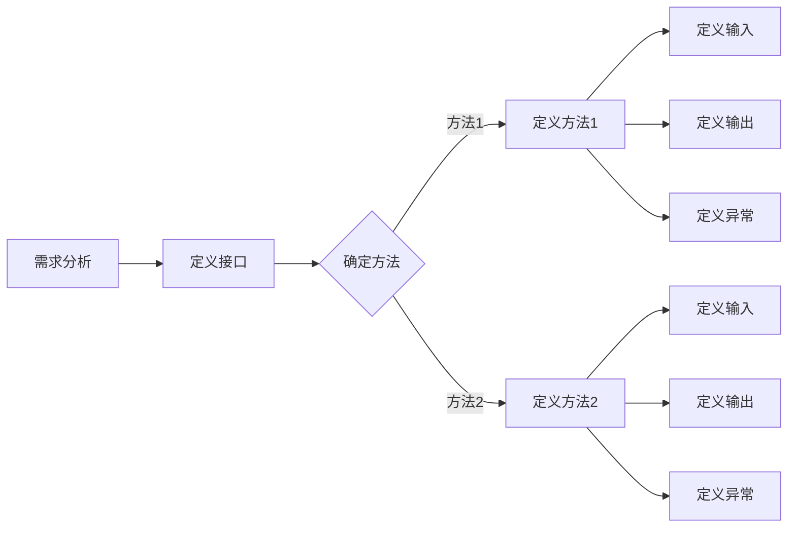

                 

# 接口契约应该怎么做

> 关键词：接口契约、软件设计、API设计、系统架构、设计模式

> 摘要：本文将深入探讨接口契约的概念、重要性、设计原则、实施策略以及相关的工具和框架。通过详细的案例分析，本文旨在为开发人员提供一套完整的接口契约设计指南，帮助他们在软件开发过程中提高系统的可维护性和扩展性。

## 引言

接口契约是软件开发中的一个核心概念，它定义了软件模块之间如何交互的规则和约定。在分布式系统、微服务架构以及API设计中，接口契约尤为重要。它们不仅能够确保模块之间的清晰通信，还能提高系统的可维护性和扩展性。

本文将从以下几个方面展开讨论：

1. 接口契约的定义与重要性
2. 接口契约的核心概念与理论
3. 接口契约的设计与实现策略
4. 接口契约的开发工具与框架
5. 接口契约的测试与验证
6. 接口契约的最佳实践

希望通过本文，读者能够对接口契约有一个全面的理解，并能够将其有效地应用于实际项目中。

## 1. 接口契约的定义与重要性

### 定义

接口契约（Interface Contract）可以理解为在软件组件之间建立的一种协议或合同，它明确规定了组件间的交互规则，包括输入、输出、行为等。这种契约不仅定义了接口的功能性要求，还规定了接口的规范性约束。

在更广泛的意义上，接口契约不仅仅是代码层面的定义，它还包含了设计规范、API文档、测试用例等。通过接口契约，开发人员可以确保不同模块或服务之间的交互符合预期，从而提高系统的稳定性。

### 重要性

接口契约在软件设计中的重要性不可忽视，主要体现在以下几个方面：

#### 提高可维护性

良好的接口契约能够明确模块之间的边界，使得每个模块可以独立开发、测试和维护。这大大降低了系统的复杂性，提高了代码的可维护性。

#### 确保一致性

通过接口契约，可以确保不同模块或服务在交互时保持一致性。这有助于避免因不同实现导致的数据格式不一致或接口行为不一致的问题。

#### 提升扩展性

接口契约为系统的扩展提供了清晰的方向。当需要新增功能或修改现有功能时，只要遵循契约规定，就可以在不影响其他模块的情况下进行。

#### 减少沟通成本

明确的接口契约减少了开发人员之间的沟通成本。接口文档可以作为开发人员的参考，帮助他们快速理解系统的功能和设计。

#### 提高测试覆盖率

接口契约可以帮助开发人员编写更全面的测试用例，从而提高系统的测试覆盖率，确保系统在不同环境下都能稳定运行。

## 2. 接口契约的核心概念与理论

### 核心概念

#### 接口

接口（Interface）是接口契约的核心组成部分，它定义了模块之间的交互点。在面向对象编程中，接口通常表现为一组方法，每种方法对应一种功能操作。通过接口，模块可以实现相互调用，而不需要了解具体的实现细节。

#### 方法

方法（Method）是接口的一部分，它代表了接口能够执行的操作。方法通常包含输入参数和返回值，以及可能抛出的异常。

#### 输入与输出

输入（Input）和输出（Output）是方法的重要部分。输入定义了方法执行前需要接收的数据，而输出定义了方法执行后返回的结果。

#### 异常

异常（Exception）是接口契约中需要考虑的一个方面。当方法执行过程中出现异常情况时，可以通过异常机制进行处理。

### 理论基础

#### 设计原则

- **单一职责原则**：接口应该只关注一个职责，避免接口过于复杂。
- **开闭原则**：接口设计应该对扩展开放，对修改关闭。这意味着当需要新增功能时，应该通过扩展接口而非修改现有接口来实现。
- **里氏替换原则**：任何使用原始接口的地方都能使用其子接口替换，而不影响程序的其他部分。

#### 关系图

为了更好地理解接口契约的结构，可以使用Mermaid ER图来展示接口、方法、输入、输出以及异常之间的关系。

```mermaid
erDiagram
    Interface ||--|{ Method : contains }
    Method ||--|{ Input : requires }
    Method ||--|{ Output : returns }
    Method ||--|{ Exception : throws }
```

这个ER图展示了接口、方法、输入、输出和异常之间的基本关系。接口包含多个方法，每个方法需要输入参数并返回输出结果，同时可能抛出异常。

### 概念属性对比表格

为了更清晰地对比接口契约中的不同概念，我们可以创建一个属性对比表格。

| 概念    | 定义                                           | 属性对比                |
| ------- | ---------------------------------------------- | ----------------------- |
| 接口    | 定义模块间交互规则的抽象层                     | 功能性、规范性         |
| 方法    | 接口的一部分，代表一种操作                     | 输入、输出、异常       |
| 输入    | 方法执行前需要接收的数据                       | 数据类型、约束条件     |
| 输出    | 方法执行后返回的结果                           | 数据类型、返回值类型   |
| 异常    | 方法执行过程中可能抛出的异常情况               | 异常类型、处理策略     |

通过这个表格，我们可以更直观地了解接口契约中各个概念的定义和属性。

## 3. 接口契约的设计与实现策略

### 设计原则

接口契约的设计需要遵循一系列原则，以确保其能够满足系统的需求，同时具备良好的扩展性和可维护性。

#### 单一职责原则

每个接口应该只负责一个功能，避免接口过于复杂，使得其他模块难以理解和使用。

#### 开放封闭原则

接口设计应该对扩展开放，对修改关闭。这意味着，当需要新增功能时，应该通过扩展接口而非修改现有接口来实现。

#### 里氏替换原则

任何使用原始接口的地方都能使用其子接口替换，而不影响程序的其他部分。这保证了接口的兼容性和灵活性。

#### 精确性原则

接口契约的描述应该精确，避免模糊不清。每个方法、输入和输出都应该有明确的定义和文档说明。

### 最佳实践

#### 精简接口

避免在接口中包含过多方法，尽量保持接口的简洁性。每个方法都应该有明确的功能和用途，避免冗余。

#### 明确输入和输出

输入和输出应该是明确和有界的。输入应该定义清楚的数据类型和约束条件，输出应该明确返回的结果和数据类型。

#### 异常处理

接口契约中应该定义可能的异常情况，并明确异常的处理策略。这样可以提高系统的健壮性，避免未处理的异常导致程序崩溃。

#### 接口文档

良好的接口文档是接口契约的重要组成部分。文档应该详细描述接口的功能、输入、输出和异常，并提供使用示例。这有助于开发人员快速理解和使用接口。

### 设计模式

在接口契约的设计中，可以使用一些设计模式来提高其质量和可维护性。以下是一些常用的设计模式：

#### 策略模式

策略模式可以用于定义一组可互换的算法，使得接口可以灵活地选择不同的实现策略。这有助于提高接口的扩展性和灵活性。

#### 代理模式

代理模式可以用于定义一个接口的代理，用于处理一些额外的逻辑，如权限验证、日志记录等。这可以保持接口的简洁性，同时增加额外的功能。

#### 门面模式

门面模式可以用于将一组复杂的接口简化为一个简单的接口。这有助于降低系统的复杂性和开发难度。

### Mermaid流程图

为了更好地展示接口契约的设计过程，我们可以使用Mermaid流程图来描述。



这个流程图展示了从需求分析到定义接口、方法、输入、输出和异常的整个过程。

## 4. 接口契约的开发工具与框架

### 工具

在接口契约的开发过程中，可以使用一些工具来提高效率和质量。以下是一些常用的工具：

#### Swagger

Swagger是一个开源的工具，用于生成、描述和可视化API。它支持接口契约的定义、文档生成和自动化测试。

#### OpenAPI

OpenAPI是Swagger的升级版，它提供了一个统一的接口契约标准，使得不同工具和平台之间可以无缝集成。

#### Postman

Postman是一个流行的API开发工具，它支持接口契约的定义、测试和自动化。

### 框架

在特定编程语言中，也存在一些框架专门用于接口契约的开发。以下是一些常用的框架：

#### Spring Boot

Spring Boot是一个流行的Java框架，它提供了丰富的功能来支持接口契约的开发，包括自动生成文档、接口测试等。

#### Flask

Flask是一个轻量级的Python Web框架，它也支持接口契约的开发，并提供了一些便利的功能。

#### Express

Express是一个流行的Node.js Web框架，它提供了强大的功能来支持接口契约的开发。

### 比较与选择

选择合适的工具和框架取决于具体的项目需求和开发环境。以下是一些比较和选择的标准：

- **功能丰富度**：工具和框架应该提供足够的接口契约功能，包括定义、文档生成、测试等。
- **易用性**：工具和框架应该易于学习和使用，以便快速上手。
- **社区支持**：工具和框架应该有一个活跃的社区，提供足够的文档和问题解决方案。
- **集成度**：工具和框架应该能够与现有的开发工具和框架无缝集成。

### 成功案例分析

以下是一个成功使用接口契约的案例分析：

#### 项目背景

一个电子商务平台需要实现订单管理功能。为了确保不同模块之间的交互稳定可靠，开发团队决定使用接口契约来定义订单管理的API。

#### 解决方案

开发团队使用了Spring Boot框架来定义接口契约，并使用了Swagger来生成接口文档。接口契约包括订单创建、查询、更新和删除等操作，每个操作都有明确的输入和输出定义。

#### 实施效果

通过使用接口契约，开发团队实现了以下效果：

- **提高了代码质量**：接口契约使得代码更加清晰和结构化，降低了代码复杂度。
- **提高了开发效率**：接口文档生成和自动化测试功能大大提高了开发效率。
- **降低了沟通成本**：接口契约提供了明确的交互规则，减少了开发人员之间的沟通成本。

## 5. 接口契约的测试与验证

### 测试的重要性

接口契约的测试与验证是确保接口设计正确、稳定和可靠的关键环节。通过测试，可以验证接口的响应是否符合预期，以及是否能够处理各种异常情况。

### 测试策略

#### 单元测试

单元测试是对接口契约中的每个方法进行独立的测试，以确保其功能正确。通常，单元测试会模拟各种输入条件，验证输出结果和异常处理。

#### 集成测试

集成测试是在多个模块或服务之间进行的测试，确保接口契约在整个系统中能够正常工作。这种测试需要模拟系统的真实运行环境。

#### 压力测试

压力测试用于评估接口契约在极端负载条件下的性能和稳定性。这种测试可以帮助发现潜在的性能瓶颈和问题。

### 测试用例设计

设计有效的测试用例是接口测试的关键。以下是一些常用的测试用例设计方法：

- **边界值分析**：针对输入和输出的边界条件进行测试。
- **等价类划分**：将输入和输出划分为不同的等价类，对每个类进行测试。
- **异常情况测试**：测试接口在异常情况下的响应和处理能力。

### 测试工具

以下是一些常用的测试工具：

- **Postman**：一个功能强大的API测试工具，支持自动化测试。
- **JUnit**：Java的单元测试框架，可以与Spring Boot等框架集成。
- **Selenium**：用于Web应用的自动化测试工具。
- **JMeter**：用于性能测试和压力测试的工具。

### 验证方法

接口契约的验证方法包括：

- **静态验证**：通过代码审查和静态代码分析工具来检查接口契约的定义和实现。
- **动态验证**：在实际运行环境中对接口契约进行测试和验证。

## 6. 接口契约的最佳实践

### 编写清晰的接口文档

良好的接口文档是接口契约的重要组成部分。文档应该详细描述接口的功能、输入、输出和异常，并提供使用示例。以下是一些编写接口文档的最佳实践：

- **一致性**：确保文档的格式和风格一致，便于阅读和理解。
- **精确性**：准确描述每个接口的参数、返回值和异常情况。
- **示例**：提供实际使用示例，帮助开发者快速上手。
- **更新**：及时更新文档，确保其与实际接口保持一致。

### 遵循单一职责原则

每个接口应该只关注一个功能，避免接口过于复杂。以下是一些遵循单一职责原则的最佳实践：

- **方法精简**：避免在一个接口中包含过多方法，每个方法都应该有明确的功能和用途。
- **功能分解**：将复杂的接口分解为多个简单的接口，每个接口负责一个特定的功能。
- **代码重构**：定期对接口进行重构，确保其保持简洁和高效。

### 使用设计模式

设计模式可以提高接口契约的质量和可维护性。以下是一些常用的设计模式：

- **策略模式**：用于定义一组可互换的算法，使得接口可以灵活地选择不同的实现策略。
- **代理模式**：用于定义一个接口的代理，用于处理一些额外的逻辑，如权限验证、日志记录等。
- **门面模式**：用于将一组复杂的接口简化为一个简单的接口，降低系统的复杂性和开发难度。

### 异常处理

良好的异常处理是接口契约的重要组成部分。以下是一些异常处理的最佳实践：

- **明确异常类型**：定义明确的异常类型，以便于开发和测试。
- **统一的异常处理**：确保异常处理的一致性和规范性。
- **详细的异常信息**：提供详细的异常信息，帮助开发人员快速定位和解决问题。

### 持续集成与自动化测试

通过持续集成（CI）和自动化测试，可以确保接口契约的质量和稳定性。以下是一些最佳实践：

- **自动化测试**：编写自动化测试脚本，对接口契约进行自动化测试，提高测试效率。
- **代码审查**：在提交代码前进行代码审查，确保接口契约的定义和实现符合规范。
- **持续集成**：将接口契约的测试集成到CI流程中，确保每次代码变更都能得到及时的测试和反馈。

### 小结

接口契约是软件设计中的核心概念，通过明确的接口契约，可以确保模块之间的交互清晰、稳定和可靠。遵循单一职责原则、使用设计模式、异常处理和持续集成与自动化测试是提高接口契约质量的关键因素。通过本文的探讨，希望读者能够对接口契约有更深入的理解，并在实际项目中有效应用。

## 作者信息

作者：AI天才研究院/AI Genius Institute & 禅与计算机程序设计艺术 /Zen And The Art of Computer Programming

AI天才研究院致力于推动人工智能领域的研究与发展，推动AI技术在实际应用中的落地与普及。而《禅与计算机程序设计艺术》则是一部经典的计算机科学著作，为程序员提供了深刻的编程哲学和思考方式。本文旨在结合两者的研究成果，为读者提供一套完整的接口契约设计指南。希望本文能够为您的软件开发工作带来启发和帮助。

