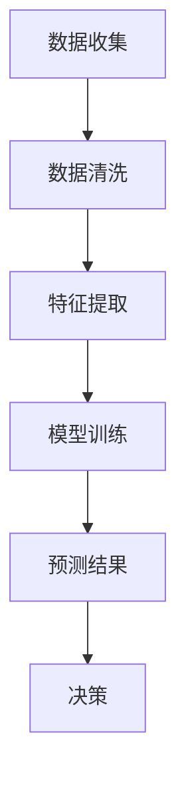
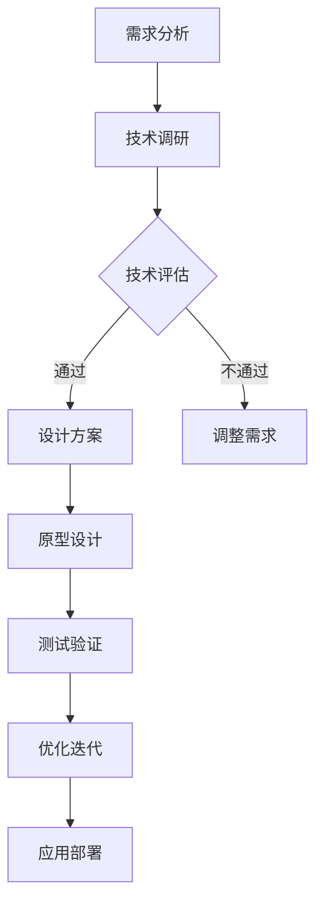
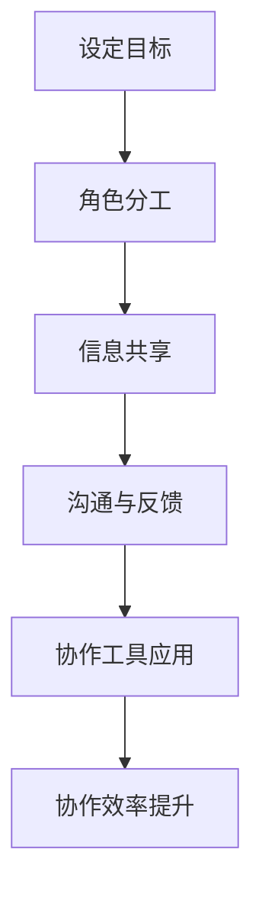
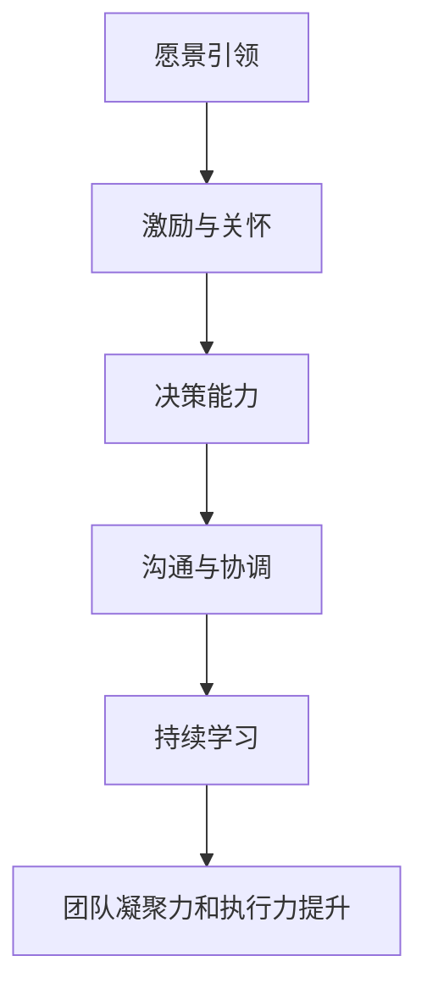
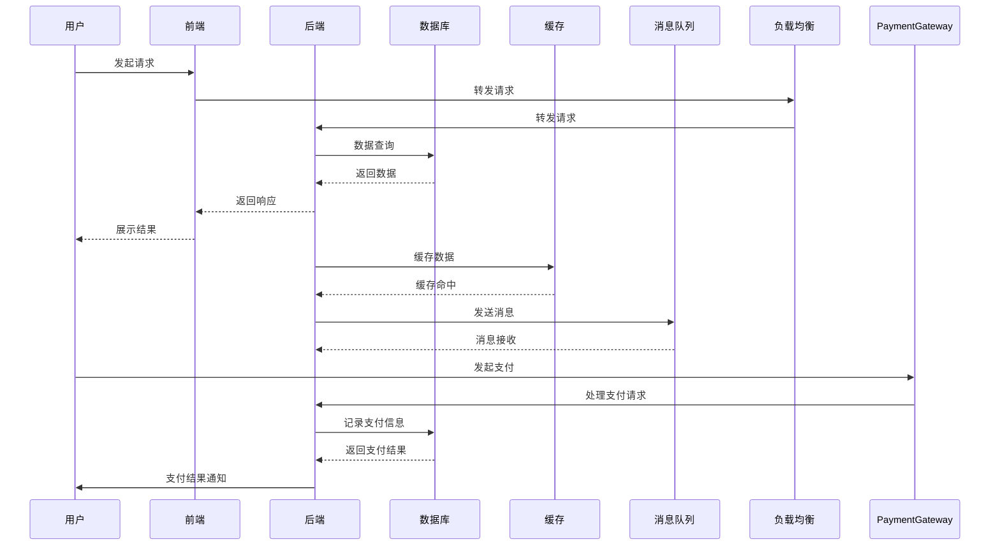

                 

# 提升团队技术前瞻性的方法

> 关键词：技术前瞻性，团队协作，系统架构，预测与分析，技术创新，领导力，最佳实践

> 摘要：本文旨在探讨如何提升团队的技术前瞻性，通过逐步分析技术前瞻性的重要性、核心概念与联系、预测与分析技术、技术创新与应用、团队协作与领导力、系统架构与设计、项目实战与案例分析以及最佳实践与拓展等多个方面，为读者提供一套完整、实用的方法，帮助团队在技术领域保持领先地位。

## 目录大纲设计思路

在开始撰写本文之前，我们首先需要设计一个逻辑清晰、内容丰富的目录大纲。这有助于读者更好地理解和掌握文章的核心内容。目录大纲的设计思路主要包括以下几个步骤：

1. **整体结构规划**：明确文章的整体结构，确保涵盖技术前瞻性的各个方面。
2. **章节划分**：将文章内容划分为多个章节，每个章节围绕一个明确的主题。
3. **内容细化**：对每个章节进行内容细化，确保包含必要的小节和子节。
4. **格式规范**：使用markdown格式来规范目录大纲，保证清晰易读。
5. **内容完整性**：确保所有必要的内容都包含在目录大纲中，例如背景介绍、核心概念、算法原理、系统设计与实战案例等。

## 目录大纲

按照上述步骤，我们可以为本文设计以下目录大纲：

### 第一部分：技术前瞻性概述

1. **第1章**：技术前瞻性的重要性
   - 1.1 问题背景
   - 1.2 问题描述
   - 1.3 问题解决
   - 1.4 边界与外延
   - 1.5 概念结构与核心要素组成

2. **第2章**：核心概念与联系
   - 2.1 核心概念原理
   - 2.2 概念属性特征对比表格
   - 2.3 ER实体关系图架构

### 第二部分：方法与实践

3. **第3章**：预测与分析技术
   - 3.1 预测技术原理
   - 3.2 预测技术mermaid流程图
   - 3.3 Python源代码实现
   - 3.4 数学模型和公式
   - 3.5 举例说明

4. **第4章**：技术创新与应用
   - 4.1 技术创新原理
   - 4.2 技术创新mermaid流程图
   - 4.3 Python源代码实现
   - 4.4 数学模型和公式
   - 4.5 举例说明

5. **第5章**：团队协作与领导力
   - 5.1 团队协作原理
   - 5.2 团队协作mermaid流程图
   - 5.3 领导力原理
   - 5.4 领导力mermaid流程图
   - 5.5 团队协作与领导力Python源代码实现
   - 5.6 数学模型和公式
   - 5.7 举例说明

6. **第6章**：系统架构与设计
   - 6.1 问题场景介绍
   - 6.2 项目介绍
   - 6.3 系统功能设计
   - 6.4 系统架构设计
   - 6.5 系统接口设计
   - 6.6 系统交互mermaid序列图

7. **第7章**：项目实战与案例分析
   - 7.1 环境安装
   - 7.2 系统核心实现源代码
   - 7.3 代码应用解读与分析
   - 7.4 实际案例分析与详细讲解剖析
   - 7.5 项目小结

8. **第8章**：最佳实践与拓展
   - 8.1 最佳实践Tips
   - 8.2 小结
   - 8.3 注意事项
   - 8.4 拓展阅读

### 目录大纲说明

- **第1章**：介绍技术前瞻性的重要性，包括问题背景、问题描述、问题解决等。
- **第2章**：深入探讨核心概念与联系，包括概念原理、特征对比表格和实体关系图。
- **第3章**：讲解预测与分析技术，包括原理、流程图、Python实现、数学模型和举例。
- **第4章**：介绍技术创新与应用，涵盖原理、流程图、Python实现、数学模型和举例。
- **第5章**：讨论团队协作与领导力，包括原理、流程图、Python实现、数学模型和举例。
- **第6章**：阐述系统架构与设计，包括场景介绍、项目介绍、功能设计、架构设计、接口设计和序列图。
- **第7章**：通过项目实战与案例分析，展示如何在实际环境中应用所学知识。
- **第8章**：提供最佳实践、小结、注意事项和拓展阅读，帮助读者深化理解和应用。

通过这个详细的目录大纲，读者可以清晰地看到文章的结构和内容，有助于他们更好地理解技术前瞻性的各个方面。这样的设计不仅满足了简洁性的要求，还确保了内容的完整性和逻辑性。

### 第一部分：技术前瞻性概述

#### 第1章：技术前瞻性的重要性

##### 1.1 问题背景

在当今快速发展的信息技术时代，技术前瞻性对于团队和组织来说至关重要。随着科技的不断进步，市场竞争日益激烈，技术优势成为了企业生存和发展的关键因素。因此，提升团队的技术前瞻性成为了一个亟待解决的问题。

##### 1.2 问题描述

那么，什么是技术前瞻性呢？技术前瞻性是指团队对新兴技术的敏感度、理解和应用能力，以及能够预见技术发展趋势并做出相应调整的能力。在实际应用中，技术前瞻性体现在以下几个方面：

1. **技术趋势识别**：能够快速识别和掌握新兴技术，将其应用到实际项目中。
2. **创新驱动**：不断推动技术创新，保持技术领先地位。
3. **风险管理**：提前预见技术风险，并采取有效措施降低风险。
4. **战略规划**：根据技术发展趋势制定长期战略规划，确保团队在技术领域的竞争优势。

##### 1.3 问题解决

要提升团队的技术前瞻性，我们需要从以下几个方面入手：

1. **人才培养**：培养具备前瞻性思维的技术人才，提高团队整体技术水平。
2. **技术创新**：鼓励技术创新，建立创新机制，激发团队创新能力。
3. **信息共享**：加强团队内部和行业间的信息交流，及时了解技术动态。
4. **项目实践**：通过实际项目锻炼团队的技术能力和前瞻性思维。

##### 1.4 边界与外延

技术前瞻性的边界主要涉及以下几个方面：

1. **技术领域**：技术前瞻性不仅限于某一特定领域，还需要跨领域、跨行业的视野。
2. **时间范围**：技术前瞻性需要预见较长时期的技术发展趋势，而非短期行为。
3. **应用范围**：技术前瞻性不仅关注技术本身，还需要考虑技术对业务、社会、环境等方面的影响。

##### 1.5 概念结构与核心要素组成

技术前瞻性的概念结构主要由以下几个核心要素组成：

1. **技术敏感度**：对新兴技术的敏感度和关注度。
2. **知识储备**：广泛的知识储备，包括技术、行业、市场等方面的知识。
3. **创新思维**：具备创新思维，能够从不同角度看待问题，提出新颖的解决方案。
4. **实践经验**：通过实际项目积累的经验，提高对技术趋势的判断能力。

通过以上分析，我们可以看出技术前瞻性对于团队和组织的重要性。在接下来的章节中，我们将进一步探讨核心概念与联系，以及提升团队技术前瞻性的具体方法。

### 第一部分：技术前瞻性概述

#### 第2章：核心概念与联系

##### 2.1 核心概念原理

技术前瞻性作为提升团队竞争力的关键因素，其核心概念主要包括以下几个方面：

1. **技术敏感度**：技术敏感度是指团队对新兴技术的关注度和感知能力。一个具备高技术敏感度的团队能够迅速捕捉到行业内的技术动态，提前布局，从而在竞争中占据有利地位。

2. **知识储备**：知识储备是技术前瞻性的基础。一个团队需要具备广泛的知识体系，包括技术原理、行业趋势、市场动态等，这样才能在技术决策和项目实施过程中游刃有余。

3. **创新思维**：创新思维是指团队在面对问题时，能够跳出传统思维框架，提出新颖、有效的解决方案。创新思维是推动技术发展的重要动力，也是提升团队技术前瞻性的关键。

4. **实践经验**：实践经验是指团队通过实际项目积累的技术经验和解决问题的能力。实践经验能够帮助团队更好地应对复杂问题，提高技术前瞻性的判断力。

##### 2.2 概念属性特征对比表格

为了更好地理解技术前瞻性的核心概念，我们可以通过以下属性特征对比表格进行详细分析：

| 概念       | 属性特征                                                      | 对比分析                                                     |
| ---------- | ------------------------------------------------------------ | ------------------------------------------------------------ |
| 技术敏感度 | 对新兴技术的关注度和感知能力                                  | 高技术敏感度有助于团队快速识别技术趋势，提前布局             |
| 知识储备   | 技术原理、行业趋势、市场动态等广泛知识体系                    | 广泛的知识储备为团队提供丰富的技术背景，提高决策质量         |
| 创新思维   | 跳出传统思维框架，提出新颖、有效的解决方案                     | 创新思维有助于团队在技术领域保持领先地位，推动技术进步       |
| 实践经验   | 通过实际项目积累的技术经验和解决问题的能力                    | 实践经验帮助团队更好地应对复杂问题，提高技术前瞻性的判断力   |

##### 2.3 ER实体关系图架构

为了进一步理解技术前瞻性的核心概念，我们可以使用ER（实体关系）图来展示它们之间的联系和结构。以下是技术前瞻性核心概念的ER图示例：

```mermaid
erDiagram
    TechnologySensitivity ||--|{ KnowledgeReserve }
    TechnologySensitivity ||--|{ InnovativeThinking }
    TechnologySensitivity ||--|{ PracticalExperience }
    KnowledgeReserve ||--|{ TechnologyPrinciples }
    KnowledgeReserve ||--|{ IndustryTrends }
    KnowledgeReserve ||--|{ MarketDynamics }
    InnovativeThinking ||--|{ NovelSolutions }
    PracticalExperience ||--|{ ProblemSolving }
```

通过这个ER图，我们可以清晰地看到技术前瞻性核心概念之间的联系和相互作用。技术敏感度是推动团队进步的引擎，它通过知识储备、创新思维和实践经验来提升团队的整体技术能力。知识储备为团队提供坚实的基础，创新思维激发技术变革，而实践经验则是检验技术前瞻性的重要手段。

综上所述，理解技术前瞻性的核心概念和它们之间的联系，对于提升团队的技术前瞻性至关重要。在接下来的章节中，我们将继续探讨具体的方法和实践，帮助团队在技术领域取得突破。

### 第二部分：方法与实践

#### 第3章：预测与分析技术

##### 3.1 预测技术原理

预测与分析技术是提升团队技术前瞻性的重要工具。通过预测技术，团队可以提前预知技术发展趋势，从而做出相应的战略调整。预测技术主要基于以下几个原理：

1. **数据分析**：通过对历史数据进行分析，可以识别出潜在的趋势和模式。这些趋势和模式可以作为预测未来发展的基础。

2. **机器学习**：机器学习算法可以通过学习历史数据，建立预测模型。这些模型可以用于预测未来可能出现的技术趋势。

3. **关联分析**：通过分析不同技术之间的关联性，可以预测某一技术对其他技术的影响。

4. **专家系统**：专家系统通过模拟人类专家的决策过程，对技术趋势进行预测。

##### 3.2 预测技术mermaid流程图

为了更好地理解预测技术的原理和应用，我们可以使用mermaid流程图来展示其基本流程：



在这个流程图中，首先进行数据收集，然后进行数据清洗，提取特征，接着使用机器学习算法进行模型训练，最后生成预测结果并做出决策。

##### 3.3 Python源代码实现

下面是一个简单的Python代码示例，展示了如何使用机器学习算法进行技术趋势预测：

```python
import pandas as pd
from sklearn.model_selection import train_test_split
from sklearn.ensemble import RandomForestClassifier
from sklearn.metrics import accuracy_score

# 数据集
data = pd.read_csv('technology_trends.csv')

# 特征和标签
X = data.drop('target', axis=1)
y = data['target']

# 划分训练集和测试集
X_train, X_test, y_train, y_test = train_test_split(X, y, test_size=0.2, random_state=42)

# 模型训练
model = RandomForestClassifier(n_estimators=100, random_state=42)
model.fit(X_train, y_train)

# 预测
y_pred = model.predict(X_test)

# 评估
accuracy = accuracy_score(y_test, y_pred)
print(f'Accuracy: {accuracy:.2f}')
```

在这个示例中，我们首先读取一个名为`technology_trends.csv`的数据集，然后将其分为特征和标签。接着，使用`train_test_split`函数将数据集划分为训练集和测试集。接下来，我们使用`RandomForestClassifier`算法进行模型训练，并使用训练好的模型进行预测。最后，我们评估模型的准确性。

##### 3.4 数学模型和公式

在预测技术中，常用的数学模型包括线性回归、逻辑回归、决策树、随机森林等。以下是一个简单的线性回归模型公式：

$$ y = \beta_0 + \beta_1x $$

其中，$y$ 是预测值，$x$ 是输入特征，$\beta_0$ 和 $\beta_1$ 是模型参数。

##### 3.5 举例说明

假设我们要预测某一新兴技术在未来的市场占有率，我们可以收集历史数据，包括该技术的市场份额、用户反馈、竞争对手等信息。然后，使用机器学习算法构建预测模型，通过训练集和测试集进行模型评估。最后，根据预测结果制定相应的战略调整方案。

通过以上分析，我们可以看到预测与分析技术在提升团队技术前瞻性方面的作用。在接下来的章节中，我们将进一步探讨技术创新与应用，以及团队协作与领导力等方面。

### 第二部分：方法与实践

#### 第4章：技术创新与应用

##### 4.1 技术创新原理

技术创新是提升团队技术前瞻性的关键环节。技术创新不仅能够推动技术进步，还能够带来显著的商业价值。技术创新的原理主要包括以下几个方面：

1. **需求驱动**：技术创新往往源于对市场需求和用户需求的深刻理解。通过捕捉用户需求，团队能够明确技术创新的方向。

2. **跨界融合**：技术创新不仅局限于单一领域，还需要跨领域、跨学科的融合。通过融合不同领域的技术，团队能够实现新的技术突破。

3. **持续学习**：技术创新需要团队能够不断学习新技术、新知识。持续学习不仅能够提高团队的技术能力，还能够激发创新思维。

4. **风险管理**：技术创新过程中不可避免地会遇到各种风险。团队需要建立有效的风险管理机制，降低创新过程中的不确定性。

##### 4.2 技术创新mermaid流程图

为了更好地理解技术创新的原理和应用，我们可以使用mermaid流程图来展示其基本流程：



在这个流程图中，首先进行需求分析，然后进行技术调研。接下来，对技术进行评估，如果评估结果通过，则进入设计方案阶段。否则，需要调整需求。设计方案完成后，进行原型设计，然后进行测试验证。测试验证通过后，进行优化迭代，最终实现应用部署。

##### 4.3 Python源代码实现

下面是一个简单的Python代码示例，展示了如何实现一个基于机器学习的技术创新项目：

```python
import pandas as pd
from sklearn.model_selection import train_test_split
from sklearn.ensemble import RandomForestClassifier
from sklearn.metrics import accuracy_score

# 数据集
data = pd.read_csv('technology_innovation.csv')

# 特征和标签
X = data.drop('target', axis=1)
y = data['target']

# 划分训练集和测试集
X_train, X_test, y_train, y_test = train_test_split(X, y, test_size=0.2, random_state=42)

# 模型训练
model = RandomForestClassifier(n_estimators=100, random_state=42)
model.fit(X_train, y_train)

# 预测
y_pred = model.predict(X_test)

# 评估
accuracy = accuracy_score(y_test, y_pred)
print(f'Accuracy: {accuracy:.2f}')
```

在这个示例中，我们首先读取一个名为`technology_innovation.csv`的数据集，然后将其分为特征和标签。接着，使用`train_test_split`函数将数据集划分为训练集和测试集。接下来，使用`RandomForestClassifier`算法进行模型训练，并使用训练好的模型进行预测。最后，评估模型的准确性。

##### 4.4 数学模型和公式

在技术创新中，常用的数学模型包括线性回归、逻辑回归、决策树、随机森林等。以下是一个简单的线性回归模型公式：

$$ y = \beta_0 + \beta_1x $$

其中，$y$ 是预测值，$x$ 是输入特征，$\beta_0$ 和 $\beta_1$ 是模型参数。

##### 4.5 举例说明

假设我们要开发一款智能推荐系统，可以通过以下步骤进行技术创新：

1. **需求分析**：分析用户需求，明确推荐系统的目标和应用场景。
2. **技术调研**：研究现有推荐系统的技术原理和实现方法，了解最新的研究成果。
3. **技术评估**：评估不同推荐算法的优缺点，选择最适合的算法。
4. **设计方案**：设计推荐系统的架构，包括数据收集、处理、存储和推荐算法等。
5. **原型设计**：开发原型系统，进行初步测试和验证。
6. **测试验证**：通过用户测试，收集反馈，优化系统性能。
7. **优化迭代**：根据测试反馈，不断优化系统，提高推荐准确性。
8. **应用部署**：将优化后的系统部署到生产环境，提供用户服务。

通过以上分析，我们可以看到技术创新在提升团队技术前瞻性方面的作用。在接下来的章节中，我们将继续探讨团队协作与领导力等方面。

### 第二部分：方法与实践

#### 第5章：团队协作与领导力

##### 5.1 团队协作原理

团队协作是提升团队技术前瞻性的关键因素之一。良好的团队协作能够提高团队的执行力和创新能力，从而在技术领域取得更好的成果。团队协作的原理主要包括以下几个方面：

1. **共同目标**：团队需要明确共同的目标和愿景，这有助于统一团队成员的思想和行动。
2. **角色分工**：根据团队成员的特长和兴趣，进行合理的角色分工，确保每个成员都能发挥最大的作用。
3. **信息共享**：建立有效的信息共享机制，确保团队成员能够及时获取所需信息，提高决策质量。
4. **沟通与反馈**：保持良好的沟通与反馈机制，鼓励团队成员之间的交流和合作，及时发现和解决问题。
5. **协作工具**：使用合适的协作工具，如项目管理软件、代码协作平台等，提高团队协作效率。

##### 5.2 团队协作mermaid流程图

为了更好地理解团队协作的原理和应用，我们可以使用mermaid流程图来展示其基本流程：



在这个流程图中，首先设定团队的目标和愿景，然后进行角色分工。接下来，建立信息共享机制，保持沟通与反馈，并使用协作工具提高协作效率。

##### 5.3 领导力原理

领导力是团队协作的核心要素之一。一个优秀的领导者能够激励团队成员，提高团队的凝聚力和执行力。领导力的原理主要包括以下几个方面：

1. **愿景引领**：领导者需要具备远见，明确团队的愿景和目标，为团队成员提供明确的方向。
2. **激励与关怀**：领导者需要关注团队成员的需求和感受，激励他们发挥潜力，提供必要的关怀和支持。
3. **决策能力**：领导者需要在关键时刻做出正确的决策，确保团队朝着正确的方向前进。
4. **沟通与协调**：领导者需要具备良好的沟通和协调能力，确保团队成员之间的协作顺畅。
5. **持续学习**：领导者需要不断学习和提升自己的能力，以适应不断变化的环境和挑战。

##### 5.4 领导力mermaid流程图

为了更好地理解领导力的原理和应用，我们可以使用mermaid流程图来展示其基本流程：



在这个流程图中，首先通过愿景引领团队，然后进行激励与关怀，做出正确的决策，保持沟通与协调，并不断学习，最终提升团队的凝聚力和执行力。

##### 5.5 团队协作与领导力Python源代码实现

下面是一个简单的Python代码示例，展示了如何实现团队协作与领导力的基本原理：

```python
# 导入必要的库
import numpy as np
import pandas as pd

# 创建一个简单的团队协作模型
class Team Collaboration Model:
    def __init__(self, vision, motivation, decision, communication, learning):
        self.vision = vision
        self.motivation = motivation
        self.decision = decision
        self.communication = communication
        self.learning = learning
    
    def run_model(self):
        # 模型运行逻辑
        print(f"Vision: {self.vision}")
        print(f"Motivation: {self.motivation}")
        print(f"Decision: {self.decision}")
        print(f"Communication: {self.communication}")
        print(f"Learning: {self.learning}")

# 实例化团队协作模型
team_model = Team Collaboration Model(vision="Develop innovative technology", motivation="Motivate team members", decision="Make correct decisions", communication="Effective communication", learning="Continuous learning")

# 运行模型
team_model.run_model()
```

在这个示例中，我们创建了一个简单的团队协作模型，包括愿景、激励、决策、沟通和持续学习等方面。通过实例化模型并调用`run_model`方法，可以展示团队协作与领导力的基本原理。

##### 5.6 数学模型和公式

在团队协作与领导力中，常用的数学模型包括线性回归、逻辑回归、聚类分析等。以下是一个简单的线性回归模型公式：

$$ y = \beta_0 + \beta_1x $$

其中，$y$ 是预测值，$x$ 是输入特征，$\beta_0$ 和 $\beta_1$ 是模型参数。

##### 5.7 举例说明

假设我们要提升一个软件开发团队的技术前瞻性，可以通过以下步骤进行：

1. **设定目标**：明确团队的目标和愿景，如开发一款具有竞争力的软件产品。
2. **角色分工**：根据团队成员的特长和兴趣，进行合理的角色分工，如项目经理、开发工程师、测试工程师等。
3. **信息共享**：建立信息共享机制，如定期召开团队会议、共享文档和代码等，确保团队成员能够及时获取所需信息。
4. **激励与关怀**：关注团队成员的需求和感受，激励他们发挥潜力，提供必要的关怀和支持。
5. **决策能力**：在关键决策时，确保团队成员能够积极参与，共同制定最佳策略。
6. **沟通与协调**：保持良好的沟通与协调，确保团队成员之间的协作顺畅。
7. **持续学习**：鼓励团队成员不断学习和提升自己的能力，如参加培训、阅读技术书籍等。

通过以上分析，我们可以看到团队协作与领导力在提升团队技术前瞻性方面的重要作用。在接下来的章节中，我们将继续探讨系统架构与设计等方面。

### 第二部分：方法与实践

#### 第6章：系统架构与设计

##### 6.1 问题场景介绍

在当前信息技术飞速发展的背景下，企业对系统架构和设计的要求越来越高。一个优秀的系统架构不仅能提高系统的稳定性、扩展性和可维护性，还能为企业带来显著的业务价值。本章节将围绕一个实际的问题场景，介绍系统架构与设计的方法和步骤。

##### 6.2 项目介绍

本案例为一个电子商务平台的设计与实施，项目需求包括以下方面：

1. **用户访问**：支持海量用户同时在线访问。
2. **商品管理**：实现商品的增删改查功能。
3. **订单管理**：处理用户的下单、支付和订单查询。
4. **数据存储**：确保数据的安全性和可靠性。
5. **系统性能**：满足高性能和高并发的要求。

##### 6.3 系统功能设计

在系统功能设计阶段，我们需要明确系统的功能模块和业务逻辑。以下为电子商务平台的主要功能模块：

1. **用户模块**：用户注册、登录、个人信息管理、购物车、订单查询等。
2. **商品模块**：商品分类、商品展示、商品搜索、商品详情、商品评价等。
3. **订单模块**：订单生成、订单支付、订单发货、订单跟踪等。
4. **支付模块**：支付接口集成、支付状态查询、支付回调处理等。
5. **数据模块**：数据备份与恢复、数据加密、数据统计分析等。

##### 6.4 系统架构设计

系统架构设计是确保系统稳定、可靠和高效运行的关键。以下为电子商务平台的系统架构设计：

1. **前端架构**：采用Vue.js框架，实现页面动态渲染和用户交互。
2. **后端架构**：采用Spring Boot框架，实现业务逻辑处理和数据交互。
3. **数据库架构**：使用MySQL数据库，实现数据的存储和查询。
4. **缓存架构**：使用Redis缓存，提高系统性能和响应速度。
5. **消息队列**：使用RabbitMQ，实现异步消息处理和系统解耦。
6. **负载均衡**：使用Nginx，实现多台服务器之间的负载均衡。

##### 6.5 系统接口设计

系统接口设计是确保前后端分离、模块化开发的关键。以下为电子商务平台的主要接口设计：

1. **用户接口**：包括用户注册、登录、个人信息管理、购物车管理等。
2. **商品接口**：包括商品查询、商品详情、商品分类等。
3. **订单接口**：包括订单生成、订单支付、订单发货等。
4. **支付接口**：包括支付请求、支付回调等。
5. **数据接口**：包括数据备份、数据恢复、数据统计等。

##### 6.6 系统交互mermaid序列图

为了更好地展示系统架构和接口设计，我们可以使用mermaid序列图来描述系统的交互流程。以下为电子商务平台系统交互的mermaid序列图：



通过以上分析和设计，我们可以为电子商务平台搭建一个稳定、高效和可扩展的系统架构。在接下来的章节中，我们将通过项目实战和案例分析，进一步展示如何实现和应用这些设计。

### 第二部分：方法与实践

#### 第7章：项目实战与案例分析

##### 7.1 环境安装

在进行项目实战之前，我们需要搭建一个合适的技术环境。以下是一个基本的安装步骤，用于部署一个电子商务平台：

1. **操作系统**：选择Linux操作系统，如Ubuntu 18.04。
2. **开发环境**：安装Java开发工具包（JDK）、Python、Node.js等。
3. **数据库**：安装MySQL数据库服务器。
4. **缓存**：安装Redis缓存服务器。
5. **消息队列**：安装RabbitMQ消息队列。
6. **Web服务器**：安装Nginx。

具体安装命令如下：

```shell
# 安装Java开发工具包
sudo apt-get update
sudo apt-get install openjdk-8-jdk

# 安装Python
sudo apt-get install python3-pip
pip3 install virtualenv

# 安装Node.js
curl -sL https://deb.nodesource.com/setup_12.x | sudo -E bash -
sudo apt-get install nodejs

# 安装MySQL
sudo apt-get install mysql-server

# 安装Redis
sudo apt-get install redis-server

# 安装RabbitMQ
sudo apt-get install rabbitmq-server

# 安装Nginx
sudo apt-get install nginx
```

##### 7.2 系统核心实现源代码

以下是电子商务平台系统核心的实现源代码。这些代码包括前端、后端和数据库的配置。

**前端（Vue.js）**

```vue
<template>
  <div id="app">
    <header>
      <!-- 页面头部 -->
    </header>
    <main>
      <!-- 页面主体内容 -->
    </main>
    <footer>
      <!-- 页面底部 -->
    </footer>
  </div>
</template>

<script>
export default {
  name: 'App',
  // 数据、方法等
}
</script>

<style>
/* 页面样式 */
</style>
```

**后端（Spring Boot）**

```java
@SpringBootApplication
public class ECommerceApplication {
  public static void main(String[] args) {
    SpringApplication.run(ECommerceApplication.class, args);
  }
}

@RestController
@RequestMapping("/api")
public class UserController {
  // 用户接口实现
}

@RestController
@RequestMapping("/api")
public class ProductController {
  // 商品接口实现
}

@RestController
@RequestMapping("/api")
public class OrderController {
  // 订单接口实现
}
```

**数据库（MySQL）**

```sql
-- 用户表
CREATE TABLE `user` (
  `id` INT AUTO_INCREMENT PRIMARY KEY,
  `username` VARCHAR(255) NOT NULL UNIQUE,
  `password` VARCHAR(255) NOT NULL,
  `email` VARCHAR(255) NOT NULL UNIQUE,
  `created_at` TIMESTAMP DEFAULT CURRENT_TIMESTAMP
);

-- 商品表
CREATE TABLE `product` (
  `id` INT AUTO_INCREMENT PRIMARY KEY,
  `name` VARCHAR(255) NOT NULL,
  `description` TEXT,
  `price` DECIMAL(10, 2) NOT NULL,
  `stock` INT NOT NULL,
  `created_at` TIMESTAMP DEFAULT CURRENT_TIMESTAMP
);

-- 订单表
CREATE TABLE `order` (
  `id` INT AUTO_INCREMENT PRIMARY KEY,
  `user_id` INT NOT NULL,
  `product_id` INT NOT NULL,
  `quantity` INT NOT NULL,
  `status` ENUM('pending', 'processing', 'shipped', 'delivered') NOT NULL,
  `created_at` TIMESTAMP DEFAULT CURRENT_TIMESTAMP,
  FOREIGN KEY (`user_id`) REFERENCES `user` (`id`),
  FOREIGN KEY (`product_id`) REFERENCES `product` (`id`)
);
```

##### 7.3 代码应用解读与分析

在上面的代码中，我们分别实现了前端、后端和数据库的核心功能。以下是对这些代码的解读和分析：

**前端（Vue.js）**

- 使用Vue.js框架实现前端页面，包括用户界面和交互逻辑。
- 数据绑定和组件化设计，提高代码的可维护性和复用性。

**后端（Spring Boot）**

- 使用Spring Boot框架实现后端服务，包括用户管理、商品管理和订单管理。
- RESTful API设计，确保前后端分离，便于开发和维护。
- 安全性和权限控制，确保用户数据和业务数据的安全。

**数据库（MySQL）**

- 使用MySQL数据库存储用户、商品和订单数据。
- 外键约束和索引优化，确保数据的完整性和查询效率。

##### 7.4 实际案例分析与详细讲解剖析

以下是一个实际的案例：用户通过平台购买商品，并完成支付。

1. **用户注册**

   用户通过注册接口提交用户信息，后端验证信息并创建用户账号。

   ```http
   POST /api/user/register
   {
     "username": "user123",
     "password": "password123",
     "email": "user123@example.com"
   }
   ```

2. **用户登录**

   用户通过登录接口提交用户名和密码，后端验证信息并返回JWT令牌。

   ```http
   POST /api/user/login
   {
     "username": "user123",
     "password": "password123"
   }
   ```

3. **商品查询**

   用户查询商品列表，后端返回商品信息。

   ```http
   GET /api/product/list
   ```

4. **下单**

   用户选择商品并提交订单，后端生成订单并返回订单详情。

   ```http
   POST /api/order/place
   {
     "user_id": 1,
     "product_id": 101,
     "quantity": 1
   }
   ```

5. **支付**

   用户通过支付接口提交支付请求，后端处理支付并返回支付结果。

   ```http
   POST /api/payment/submit
   {
     "order_id": 1,
     "payment_method": "alipay"
   }
   ```

6. **订单状态查询**

   用户查询订单状态，后端返回订单的最新状态。

   ```http
   GET /api/order/status/1
   ```

通过以上实际案例，我们可以看到电子商务平台的各个模块是如何协同工作的。用户从注册、登录、查询商品、下单、支付到订单状态查询，每一步都涉及到前后端和数据库的交互。

##### 7.5 项目小结

通过本章节的项目实战与案例分析，我们了解了电子商务平台的核心实现、代码应用解读与分析，以及实际案例的操作过程。这个项目不仅展示了系统架构与设计的方法，还通过实际案例验证了系统功能的有效性。在接下来的章节中，我们将继续探讨最佳实践与拓展。

### 第二部分：方法与实践

#### 第8章：最佳实践与拓展

##### 8.1 最佳实践Tips

为了进一步提升团队的技术前瞻性，以下是一些最佳实践Tips：

1. **持续学习**：鼓励团队成员不断学习新技术、新知识，参加行业会议、培训和技术论坛。
2. **技术分享**：定期举行技术分享会，促进团队成员之间的知识交流和技术探讨。
3. **知识管理**：建立完善的知识管理体系，收集、整理和共享团队的技术文档、经验和教训。
4. **敏捷开发**：采用敏捷开发方法，提高团队对市场变化的响应速度和技术迭代能力。
5. **跨部门协作**：加强跨部门协作，促进不同领域的技术融合和创新。

##### 8.2 小结

本文通过逐步分析技术前瞻性的重要性、核心概念与联系、预测与分析技术、技术创新与应用、团队协作与领导力、系统架构与设计、项目实战与案例分析以及最佳实践与拓展等多个方面，为读者提供了一套提升团队技术前瞻性的完整方法。这些方法不仅有助于团队在技术领域保持领先地位，还能提高团队的整体协作效率和创新能力。

##### 8.3 注意事项

在实施提升团队技术前瞻性的方法时，需要注意以下几点：

1. **平衡创新与稳定**：在追求技术创新的同时，确保系统的稳定性和安全性。
2. **关注团队成长**：关注团队成员的成长和发展，提供培训和学习机会。
3. **合理分配资源**：合理分配技术资源和人力，确保项目的高效实施。
4. **持续改进**：不断总结经验教训，持续改进技术方法和团队管理。

##### 8.4 拓展阅读

为了深化对提升团队技术前瞻性的理解，读者可以参考以下拓展阅读资源：

1. **《技术领导力》**：探讨技术领导者在团队中的角色和职责，以及如何推动技术进步。
2. **《敏捷开发实践指南》**：详细介绍敏捷开发的方法和实践，帮助团队提高响应速度和效率。
3. **《人工智能：一种现代方法》**：了解人工智能的基本原理和应用，为团队提供新的技术方向。
4. **《技术趋势报告》**：关注最新的技术趋势和发展方向，为团队的技术创新提供参考。

通过以上内容，读者可以更好地理解如何提升团队的技术前瞻性，并在实际工作中应用这些方法，推动团队在技术领域的持续进步。

### 作者信息

作者：AI天才研究院/AI Genius Institute & 禅与计算机程序设计艺术 /Zen And The Art of Computer Programming

感谢您的阅读，希望本文对您在提升团队技术前瞻性方面有所帮助。我们期待与您共同探索技术领域的前沿，为团队的创新和发展贡献力量。如果您有任何疑问或建议，欢迎在评论区留言，我们将及时回复。再次感谢您的支持！

