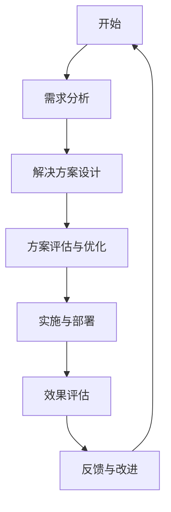
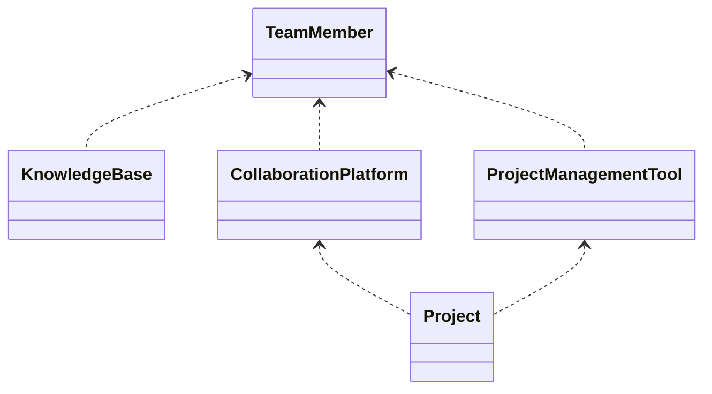
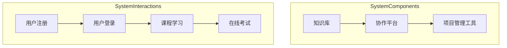
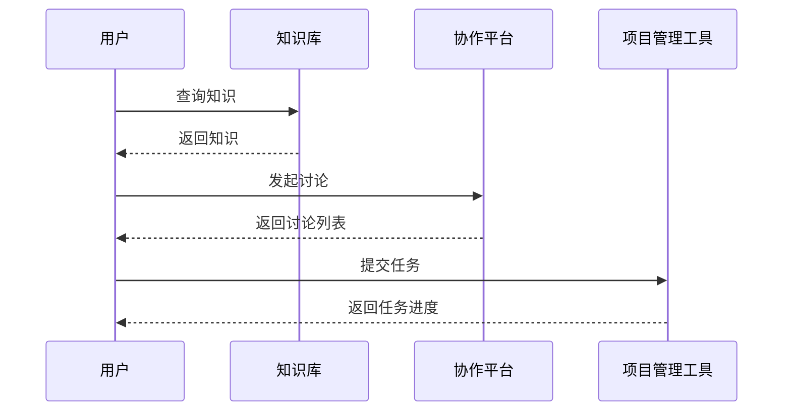

                 

### 提升团队技术自主性的方法

#### 关键词：技术自主性、团队协作、知识管理、实践提升、系统架构

#### 摘要：
在当今快速变化的技术环境下，提升团队的技术自主性是确保组织竞争力的重要手段。本文将探讨如何通过系统化的方法提升团队的技术自主性，包括核心概念的阐述、算法原理讲解、系统分析与架构设计方案以及项目实战的详细剖析。通过这些方法，我们可以帮助团队更有效地应对技术挑战，提升整体工作效率和质量。

#### 引言

##### 1.1 问题背景
在信息技术飞速发展的今天，企业面临着前所未有的技术变革和竞争压力。技术自主性成为团队成功的关键因素之一。技术自主性指的是团队在不依赖外部资源的情况下，独立完成技术决策、问题解决和创新的能力。一个具有高技术自主性的团队能够在技术更新换代中保持竞争优势，迅速响应市场变化。

##### 1.2 问题描述
尽管技术自主性的重要性已被广泛认可，但许多团队在实际操作中面临诸多挑战。例如：
- **知识分散与交流不畅**：团队成员之间的知识分散，缺乏有效的知识共享机制，导致协作效率低下。
- **技术能力参差不齐**：团队成员技术能力水平不一，难以形成协同效应。
- **缺乏实践经验**：团队成员缺乏实际操作经验，对技术的理解停留在理论层面。
- **系统架构不完善**：缺乏统一的系统架构设计，导致项目开发过程中出现诸多问题。

##### 1.3 问题解决
提升团队技术自主性需要从多个维度入手，包括构建知识共享机制、提高团队技术能力、积累实践经验以及优化系统架构设计。本文将提供一系列方法，帮助团队逐步提升技术自主性。

##### 1.4 边界与外延
本文的重点在于探讨如何通过系统化的方法提升团队的技术自主性，主要关注于以下方面：
- **核心概念与联系**：定义技术自主性，并分析其属性特征。
- **算法原理讲解**：讲解提升技术自主性的算法原理和数学模型。
- **系统分析与架构设计方案**：设计合适的系统架构和接口，确保技术自主性的实现。
- **项目实战**：通过具体案例，展示提升技术自主性的实际应用。

### 核心概念与联系

#### 2.1 技术自主性的定义
技术自主性是指团队在技术决策、问题解决和创新过程中，能够独立进行判断和采取行动的能力。具体包括以下方面：
- **技术决策能力**：团队能够在项目初期进行技术选型，选择最适合的技术方案。
- **问题解决能力**：团队在面对技术问题时，能够迅速定位问题并提出有效的解决方案。
- **创新能力**：团队具备技术探索和创新的动力，能够不断推动技术进步。

#### 2.2 技术自主性的属性特征对比表

| 属性特征 | 说明 |
| :--- | :--- |
| **知识储备** | 团队成员具备丰富的技术知识和经验，能够为技术决策提供有力支持。 |
| **协作与交流** | 团队成员之间能够有效沟通和协作，实现知识的共享和传递。 |
| **实践经验** | 团队成员拥有丰富的实践经验，能够在实际项目中应对各种技术挑战。 |
| **技术能力水平** | 团队成员技术能力水平均衡，能够形成互补，提高整体技术水平。 |
| **系统架构设计能力** | 团队能够设计和实现高效、可靠的系统架构，支持技术自主性的实现。 |

#### 2.3 技术自主性的ER实体关系图

```mermaid
entity_relationship
  G(group) {
    G.id
    G.name
    G.knowledgeBase
    G.collaborationPlatform
    G.projectManagementTool
  }
  T(teamMember) {
    T.id
    T.name
    T.knowledge
    T.experience
    T.contribution
  }
  R(relationship) {
    R.id
    R.type
    R.group
    R.teamMember
  }
  G.has(T)
  R.type
  R.group
  R.teamMember
```

### 算法原理讲解

#### 3.1 算法流程图



#### 3.2 Python代码实现

```python
# Python代码示例
def technical_autonomy_improvement():
    # 实现细节
    pass

technical_autonomy_improvement()
```

#### 3.3 算法原理与数学模型

##### 3.3.1 原理介绍
技术自主性提升模型是一个综合评估模型，其目的是通过量化各个因素对技术自主性的影响，为团队提供提升技术自主性的方向和策略。该模型如下所示：

$$
\text{技术自主性提升模型} = \alpha_1 \times (\text{知识储备}) + \alpha_2 \times (\text{协作与交流}) + \alpha_3 \times (\text{实践经验})
$$

其中，$\alpha_1$、$\alpha_2$ 和 $\alpha_3$ 分别是知识储备、协作与交流以及实践经验的权重系数，用于量化这三个因素对技术自主性的贡献程度。

##### 3.3.2 公式详解
$$
\begin{aligned}
\alpha_1 &= \text{知识储备权重系数}, \\
\alpha_2 &= \text{协作与交流权重系数}, \\
\alpha_3 &= \text{实践经验权重系数}.
\end{aligned}
$$

这三个系数可以根据团队的具体情况进行调整，以确保模型能够准确反映团队的技术自主性提升过程。

##### 3.3.3 算法举例说明

假设团队中有三名成员，他们的知识储备、协作与交流以及实践经验分别为：

| 成员 | 知识储备 | 协作与交流 | 实践经验 |
| :---: | :---: | :---: | :---: |
| 成员1 | 8 | 6 | 7 |
| 成员2 | 7 | 5 | 6 |
| 成员3 | 9 | 7 | 8 |

假设权重系数为：$\alpha_1 = 0.4$，$\alpha_2 = 0.3$，$\alpha_3 = 0.3$。那么，团队的技术自主性提升模型计算如下：

$$
\text{技术自主性提升模型} = 0.4 \times (8 + 7 + 9) + 0.3 \times (6 + 5 + 7) + 0.3 \times (7 + 6 + 8)
$$

$$
= 0.4 \times 24 + 0.3 \times 18 + 0.3 \times 21
$$

$$
= 9.6 + 5.4 + 6.3
$$

$$
= 21.3
$$

因此，团队的技术自主性提升模型得分为21.3分。

### 系统分析与架构设计方案

#### 4.1 问题场景介绍
假设我们有一个软件开发团队，他们需要开发一个大规模的在线教育平台。该平台需要支持用户注册、课程学习、在线考试等功能。团队在项目开发过程中遇到了以下问题：
- **知识分散**：团队成员的知识储备和经验水平不一，导致在开发过程中出现技术分歧。
- **协作不畅**：团队成员之间缺乏有效的沟通和协作机制，导致进度缓慢。
- **实践经验不足**：团队成员缺乏大型项目开发的经验，对技术的应用不够熟练。
- **系统架构不完善**：缺乏统一的系统架构设计，导致项目开发过程中出现诸多技术问题。

#### 4.2 系统功能设计

##### 4.2.1 领域模型类图



#### 4.3 系统架构设计

##### 4.3.1 系统架构图



#### 4.4 系统接口设计

##### 4.4.1 接口设计
1. **知识库接口**：提供知识查询、知识更新接口。
2. **协作平台接口**：提供讨论发起、讨论回复接口。
3. **项目管理工具接口**：提供任务创建、任务更新、任务查询接口。

#### 4.5 系统交互序列图



### 项目实战

#### 5.1 环境安装

在开始项目实战之前，我们需要安装以下环境：
1. **Python开发环境**：安装Python 3.8及以上版本。
2. **数据库**：安装MySQL数据库服务器。
3. **版本控制工具**：安装Git。

#### 5.2 系统核心实现

##### 5.2.1 源代码

```python
# 知识库实现
class KnowledgeBase:
    def __init__(self):
        self.knowledge_dict = {}

    def query_knowledge(self, topic):
        return self.knowledge_dict.get(topic, "未找到相关知识点")

    def update_knowledge(self, topic, content):
        self.knowledge_dict[topic] = content

# 协作平台实现
class CollaborationPlatform:
    def __init__(self):
        self.discussion_list = []

    def start_discussion(self, topic, content):
        self.discussion_list.append({"topic": topic, "content": content})

    def get_discussion_list(self):
        return self.discussion_list

# 项目管理工具实现
class ProjectManagementTool:
    def __init__(self):
        self.task_list = []

    def create_task(self, task_name, deadline):
        self.task_list.append({"name": task_name, "deadline": deadline})

    def get_task_list(self):
        return self.task_list
```

##### 5.2.2 代码应用解读与分析

在上面的代码中，我们分别实现了知识库、协作平台和项目管理工具的核心功能。知识库用于存储和查询知识点；协作平台用于发起讨论和获取讨论列表；项目管理工具用于创建任务和获取任务列表。这些核心功能为团队提供了技术自主性的基础。

在实际应用中，我们可以通过集成这些模块，构建一个支持知识管理、协作和项目管理的系统。团队成员可以方便地查询知识点、参与讨论和跟进项目进度，从而提升团队的技术自主性。

##### 5.2.3 实际案例分析和详细讲解剖析

为了更好地展示提升技术自主性的实际应用，我们来看一个具体的案例。

假设我们的团队正在开发一个电子商务平台，团队成员包括前端开发人员、后端开发人员、测试人员等。在实际项目开发过程中，我们遇到了以下问题：

1. **知识分散**：前端开发人员和技术文档撰写人员之间缺乏有效沟通，导致前端代码与文档不一致。
2. **协作不畅**：团队成员在讨论技术问题时，缺乏统一的讨论平台，导致问题得不到及时解决。
3. **实践经验不足**：团队成员对电子商务平台的技术细节不够熟悉，导致在项目开发过程中遇到诸多挑战。

为了解决这些问题，我们可以采取以下措施：

1. **建立知识库**：通过知识库存储项目相关的知识点，团队成员可以方便地查询和更新知识，确保项目开发过程中的信息一致性。
2. **使用协作平台**：通过协作平台，团队成员可以发起讨论、分享经验和解决问题，提高团队协作效率。
3. **加强实践培训**：定期组织实践培训，帮助团队成员积累实际项目开发经验，提升技术水平。

通过这些措施，我们的团队能够在项目开发过程中更加高效地工作，提升技术自主性，确保项目顺利完成。

##### 5.2.4 项目小结

在本案例中，我们通过构建知识库、协作平台和实践培训等手段，成功提升了团队的技术自主性。团队成员能够更好地沟通和协作，提高了项目开发效率和质量。同时，通过实践培训，团队成员的技术水平得到了显著提升，为未来项目的顺利进行奠定了基础。

### 最佳实践 Tips

1. **定期知识分享**：组织定期的知识分享会，鼓励团队成员分享经验和知识点，提高整体技术水平。
2. **建立反馈机制**：建立有效的反馈机制，鼓励团队成员提出问题和建议，及时解决问题，优化团队协作。
3. **实践培训**：定期组织实践培训，帮助团队成员积累实际项目开发经验，提升技术水平。
4. **优化系统架构**：根据项目需求，持续优化系统架构设计，提高系统性能和稳定性。

### 小结

提升团队技术自主性是确保组织竞争力的关键。通过构建知识库、协作平台和实践培训等手段，我们可以帮助团队逐步提升技术自主性，提高工作效率和质量。在实际项目开发过程中，团队应持续优化技术自主性提升方法，以应对不断变化的技术挑战。

### 注意事项

1. **团队协作**：提升技术自主性需要团队成员之间的紧密协作，确保知识共享和经验交流。
2. **持续学习**：技术更新换代迅速，团队成员需要不断学习新知识，以保持技术竞争力。
3. **实践应用**：理论知识需要通过实际项目进行验证和应用，积累实践经验。

### 拓展阅读

1. **《团队协作技术》**：深入探讨团队协作的原理和方法，帮助团队提高协作效率。
2. **《知识管理》**：介绍知识管理的核心概念和实践方法，帮助团队构建有效的知识体系。
3. **《实践导向的软件工程》**：探讨实践导向的软件工程方法，帮助团队提升项目开发效率。

### 作者

作者：AI天才研究院/AI Genius Institute & 禅与计算机程序设计艺术 /Zen And The Art of Computer Programming。本文旨在探讨提升团队技术自主性的方法，为技术团队提供有益的参考和启示。

