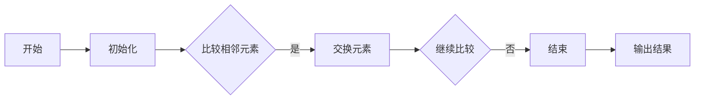
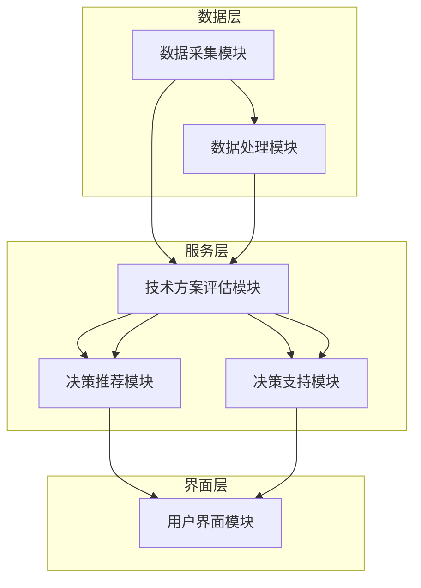
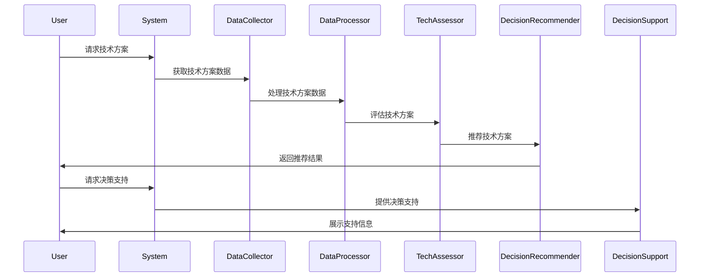

                 

# 提高技术决策的效率与质量

> 关键词：技术决策、效率、质量、流程、算法、数学模型、系统架构、实战、最佳实践

> 摘要：本文深入探讨了如何提高技术决策的效率与质量。首先，我们介绍了技术决策的重要性和当前存在的问题。接着，我们详细分析了技术决策的流程、方法、策略，以及相关的核心概念和联系。随后，通过算法原理讲解和数学模型应用，我们阐述了如何通过理论方法提高决策质量。然后，我们介绍了系统分析与架构设计方案，并通过项目实战展示了技术决策的实际应用。最后，我们提供了最佳实践技巧和小结，以及拓展阅读资源，帮助读者深入理解并掌握提高技术决策效率与质量的策略和方法。

## 第1章 背景介绍

### 1.1 问题背景

#### 1.1.1 技术决策的重要性

技术决策是企业、团队乃至个人在信息技术领域做出的一系列关键性决策。它关系到项目的成败、资源的合理配置、业务的持续发展以及市场竞争力的提升。随着信息技术的高速发展，技术决策的重要性日益凸显。正确的技术决策能够帮助企业抓住市场机遇，降低技术风险，提高生产效率，从而在激烈的市场竞争中脱颖而出。

#### 1.1.2 技术决策的现状与问题

当前，技术决策面临诸多问题。首先，决策效率低下。由于信息获取和处理手段的限制，技术决策往往需要耗费大量时间和人力资源，导致决策过程缓慢。其次，决策质量不高。由于技术复杂性和不确定性，技术决策容易受到主观判断和经验偏见的影响，导致决策失误。此外，技术决策的透明度和可追溯性不足，难以进行有效评估和改进。

#### 1.1.3 提高技术决策效率与质量的必要性

提高技术决策的效率与质量，不仅能够降低决策成本，提高资源利用效率，还能提升企业的核心竞争力。在当今快速变化的市场环境中，企业需要具备敏捷的技术决策能力，以应对市场变化和竞争压力。因此，提高技术决策的效率与质量，是企业发展过程中的一项紧迫任务。

### 1.2 问题描述

#### 1.2.1 技术决策效率低下的表现

技术决策效率低下主要表现在以下几个方面：

1. **信息收集和处理不充分**：决策过程中所需的信息未能全面收集，或者信息处理速度缓慢，导致决策依据不充分。
2. **分析评估过程繁琐**：技术方案的分析评估过程耗时较长，决策者需要耗费大量时间进行数据分析和方案比较。
3. **沟通协调不畅**：决策过程中各方沟通不畅，意见难以统一，影响决策效率。

#### 1.2.2 技术决策质量不足的体现

技术决策质量不足主要体现在以下几个方面：

1. **决策失误**：由于对技术方案的理解不足或分析不充分，导致决策失误，从而影响项目进展和业务目标实现。
2. **决策偏差**：决策过程中受到主观判断和经验偏见的影响，导致决策结果偏离最佳方案。
3. **风险控制不足**：对技术方案的风险评估不足，导致决策后出现不可预见的风险。

#### 1.2.3 技术决策面临的挑战

技术决策面临的挑战主要包括：

1. **技术复杂性**：现代信息技术的发展，使得技术方案越来越复杂，增加了决策难度。
2. **不确定性**：技术方案的实施过程中存在诸多不确定性因素，增加了决策风险。
3. **信息不对称**：决策者与执行者之间的信息不对称，导致决策难以有效落地。

### 1.3 问题解决

#### 1.3.1 技术决策的流程

技术决策流程一般包括以下几个阶段：

1. **需求分析**：明确技术决策的目标和需求，为后续决策提供依据。
2. **方案收集**：收集各种可能的技术方案，进行初步筛选。
3. **方案评估**：对收集到的技术方案进行详细评估，比较各个方案的优缺点。
4. **决策制定**：根据评估结果，制定最终的技术决策方案。
5. **方案实施**：将决策方案付诸实施，并进行监控和调整。

#### 1.3.2 提高技术决策效率的方法

提高技术决策效率的方法主要包括：

1. **信息管理**：建立高效的信息收集和处理机制，确保决策所需信息的及时性和准确性。
2. **决策工具**：采用专业的决策工具，如项目管理软件、数据可视化工具等，提高决策效率。
3. **沟通协调**：建立有效的沟通机制，确保决策过程中各方意见的及时交流和统一。

#### 1.3.3 提高技术决策质量的策略

提高技术决策质量的策略主要包括：

1. **数据驱动的决策**：基于实际数据和科学分析，避免主观判断和经验偏见。
2. **风险控制**：对技术方案进行充分的风险评估，制定相应的风险控制措施。
3. **团队协作**：建立跨部门的团队协作机制，充分利用团队成员的专业知识和经验。

#### 1.4 边界与外延

##### 1.4.1 技术决策的范围

技术决策的范围包括技术选型、系统架构设计、技术方案评估、技术风险控制等方面。

##### 1.4.2 技术决策的影响因素

技术决策的影响因素包括市场需求、技术发展趋势、预算限制、团队能力等。

##### 1.4.3 技术决策的长期与短期目标

技术决策的长期目标是确保企业的技术竞争力，支持业务长期发展。短期目标是确保项目顺利实施，实现特定阶段的业务目标。

## 第2章 核心概念与联系

### 2.1 技术决策相关概念

#### 2.1.1 技术决策的定义

技术决策是指在信息技术领域，根据特定的业务需求和目标，通过分析、评估和选择，确定最佳技术方案的过程。

#### 2.1.2 技术决策的分类

技术决策可分为战略决策和战术决策。战略决策涉及长期技术规划，如技术路线选择、核心技术研发等；战术决策涉及短期技术实施，如项目技术方案选择、系统优化等。

#### 2.1.3 技术决策的核心要素

技术决策的核心要素包括业务需求、技术方案、风险评估、资源分配等。

### 2.2 概念属性特征对比表格

| 概念     | 定义                                                         | 属性特征                             | 对比表格分析                     |
|----------|------------------------------------------------------------|------------------------------------|---------------------------------|
| 技术决策 | 信息技术领域的决策过程                                       | 业务需求、技术方案、风险评估等       | 与项目管理、企业战略等概念区别显著 |
| 业务需求 | 信息技术项目的业务目标                                       | 明确、具体、可量化                   | 与市场需求、用户需求等区别         |
| 技术方案 | 满足业务需求的多种技术实现方案                               | 技术可行性、成本效益、实施难度等     | 与方案设计、技术评估等相辅相成   |
| 风险评估 | 对技术方案实施过程中可能遇到的风险进行分析和预测               | 风险概率、影响程度、应对措施等       | 与风险管理、风险控制等密切相关   |

### 2.3 ER实体关系图架构

```mermaid
erDiagram
    BusinessRequirement ||--|{ TechnicalDecision }
    TechnicalDecision ||--|{ TechnicalSolution }
    TechnicalSolution ||--|{ RiskAssessment }
    RiskAssessment ||--|{ ResourceAllocation }
```

在上面的ER实体关系图中，`BusinessRequirement`表示业务需求，`TechnicalDecision`表示技术决策，`TechnicalSolution`表示技术方案，`RiskAssessment`表示风险评估，`ResourceAllocation`表示资源分配。各个实体之间存在明确的关联关系，共同构成了技术决策的完整流程。

## 第3章 算法原理讲解

### 3.1 算法概述

#### 3.1.1 算法的作用

算法在技术决策中起着至关重要的作用。它能够帮助我们高效地处理大量数据，发现潜在规律，优化决策过程。通过算法，我们可以对技术方案进行定量分析，评估不同方案的优劣，从而做出更加科学的决策。

#### 3.1.2 算法的基本原理

算法的基本原理是通过输入数据，经过一系列处理步骤，输出预期的结果。算法的核心在于其逻辑结构，包括数据的输入、处理过程和输出结果的逻辑关系。常见的算法有排序算法、查找算法、优化算法等。

#### 3.1.3 算法的发展历程

算法的发展历程可以追溯到古代，如古代数学家提出的算法。随着计算机科学的发展，算法理论得到了极大的发展，各种高效的算法被提出和应用。现代算法不仅应用于数学和计算机科学，还广泛应用于人工智能、数据科学、优化等领域。

### 3.2 算法mermaid流程图

下面是一个简单的冒泡排序算法的mermaid流程图：



在这个流程图中，A表示开始，B表示初始化，C表示比较相邻元素，D表示交换元素，E表示继续比较，F表示结束，G表示输出结果。

### 3.3 Python源代码与详细讲解

#### 3.3.1 源代码解析

下面是一个冒泡排序的Python实现：

```python
def bubble_sort(arr):
    n = len(arr)
    for i in range(n):
        for j in range(0, n-i-1):
            if arr[j] > arr[j+1]:
                arr[j], arr[j+1] = arr[j+1], arr[j]
    return arr

arr = [64, 34, 25, 12, 22, 11, 90]
sorted_arr = bubble_sort(arr)
print(sorted_arr)
```

在这个代码中，`bubble_sort`函数用于实现冒泡排序算法。首先，我们获取数组长度`n`，然后通过两层循环进行相邻元素的比较和交换。最后，输出排序后的数组。

#### 3.3.2 数学模型与公式

冒泡排序算法的数学模型可以描述为：

$$
\text{交换次数} = \sum_{i=1}^{n-1} \sum_{j=1}^{n-i} \text{if}(a_j > a_{j+1}) \text{then} 1 \text{else} 0
$$

其中，$a_j$表示第$j$个元素，$\text{if}(a_j > a_{j+1})$表示如果第$j$个元素大于第$j+1$个元素，则返回1，否则返回0。

#### 3.3.3 举例说明

假设我们有一个长度为5的数组`[64, 34, 25, 12, 22]`，使用冒泡排序算法对其进行排序。

第一次遍历：$[34, 25, 12, 22, 64]$

第二次遍历：$[25, 12, 22, 34, 64]$

第三次遍历：$[12, 22, 25, 34, 64]$

第四次遍历：$[12, 22, 25, 34, 64]$

第五次遍历：$[12, 22, 25, 34, 64]$

最终，数组被成功排序为`[12, 22, 25, 34, 64]`。

## 第4章 数学模型和数学公式

### 4.1 数学模型

#### 4.1.1 数学模型概述

数学模型是一种用数学语言描述现实问题的工具。它在技术决策中起着关键作用，可以帮助我们量化问题、预测结果、优化决策。常见的数学模型包括线性模型、非线性模型、统计模型等。

#### 4.1.2 数学模型在技术决策中的应用

数学模型在技术决策中的应用非常广泛，例如：

1. **成本效益分析**：通过数学模型，可以计算不同技术方案的投入产出比，帮助企业选择最优方案。
2. **风险评估**：使用数学模型，可以对技术方案的风险进行定量分析，制定相应的风险控制策略。
3. **优化算法**：通过构建数学模型，可以使用优化算法找到最优解，提高技术决策的质量。

### 4.2 公式讲解

#### 4.2.1 基本公式

在技术决策中，一些基本公式是不可或缺的。以下是几个常用的基本公式：

1. **成本效益比（C/B）**：

$$
C/B = \frac{\text{总成本}}{\text{总效益}}
$$

其中，$C$表示总成本，$B$表示总效益。

2. **风险评估值（R）**：

$$
R = \text{风险概率} \times \text{风险影响}
$$

其中，风险概率表示风险发生的概率，风险影响表示风险发生后的影响程度。

3. **优化目标函数（f(x)）**：

$$
f(x) = \sum_{i=1}^{n} w_i \cdot x_i
$$

其中，$w_i$表示第$i$个变量的权重，$x_i$表示第$i$个变量的取值。

#### 4.2.2 复杂公式

在实际应用中，一些复杂公式可能需要用到。以下是几个复杂公式：

1. **多元线性回归模型**：

$$
y = \beta_0 + \beta_1x_1 + \beta_2x_2 + ... + \beta_nx_n
$$

其中，$y$表示因变量，$x_1, x_2, ..., x_n$表示自变量，$\beta_0, \beta_1, \beta_2, ..., \beta_n$表示回归系数。

2. **神经网络输出**：

$$
z = \sigma(\sum_{i=1}^{n} w_i \cdot x_i + b)
$$

其中，$z$表示输出值，$\sigma$表示激活函数，$w_i$表示权重，$x_i$表示输入值，$b$表示偏置。

#### 4.2.3 公式推导过程

公式的推导过程通常依赖于数学理论和实际应用需求。以下是一个简单的多元线性回归模型的推导过程：

1. **目标函数**：

$$
\min_{\beta} \sum_{i=1}^{n} (y_i - \beta_0 - \beta_1x_{i1} - \beta_2x_{i2} - ... - \beta_nx_{in})^2
$$

2. **偏导数**：

$$
\frac{\partial}{\partial \beta_k} \sum_{i=1}^{n} (y_i - \beta_0 - \beta_1x_{i1} - \beta_2x_{i2} - ... - \beta_nx_{in})^2 = 0
$$

3. **解方程**：

$$
\sum_{i=1}^{n} x_{ik}y_i = \sum_{i=1}^{n} x_{ik}\beta_0 + \sum_{i=1}^{n} x_{ik}\beta_1x_{i1} + ... + \sum_{i=1}^{n} x_{ik}\beta_nx_{in}
$$

4. **得到回归系数**：

$$
\beta_k = \frac{\sum_{i=1}^{n} x_{ik}y_i - \sum_{i=1}^{n} x_{ik}\beta_0 - \sum_{i=1}^{n} x_{ik}\beta_1x_{i1} - ... - \sum_{i=1}^{n} x_{ik}\beta_nx_{in}}{\sum_{i=1}^{n} x_{ik}^2}
$$

### 4.3 实例解析

#### 4.3.1 公式在技术决策中的实际应用

假设我们有一个项目，需要评估两个技术方案A和B的优劣。我们可以使用成本效益比公式来计算两个方案的投入产出比。

方案A的总成本为100万元，总效益为200万元，则成本效益比为：

$$
C/B = \frac{100}{200} = 0.5
$$

方案B的总成本为150万元，总效益为250万元，则成本效益比为：

$$
C/B = \frac{150}{250} = 0.6
$$

根据成本效益比，方案B的投入产出比更高，因此方案B更优。

#### 4.3.2 公式计算结果分析

通过成本效益比公式计算的结果，我们可以直观地看出两个方案的优劣。然而，这个结果并不是绝对的，还需要考虑其他因素，如风险、技术复杂度等。因此，在实际应用中，我们需要综合多种指标，进行全面的评估和比较。

## 第5章 系统分析与架构设计方案

### 5.1 问题场景介绍

在现代企业中，技术决策的重要性日益凸显。然而，传统的技术决策流程往往效率低下，决策质量不高，难以满足快速变化的市场需求。为了解决这个问题，我们需要构建一个高效、智能的技术决策系统，实现技术决策的自动化和智能化。

### 5.2 项目介绍

本项目旨在设计和实现一个基于人工智能和大数据分析的技术决策系统，帮助企业和团队快速、准确地做出技术决策。系统主要功能包括：

1. **数据采集与处理**：从多个数据源收集技术相关数据，进行清洗、整合和处理，为技术决策提供数据支持。
2. **技术方案评估**：利用机器学习和大数据分析技术，对收集到的技术方案进行评估，评估内容包括成本效益、风险、技术复杂度等。
3. **决策推荐**：根据评估结果，为用户推荐最佳技术方案。
4. **决策支持**：提供可视化界面，展示技术方案评估结果，帮助用户理解决策依据，辅助决策。

### 5.3 系统功能设计

#### 5.3.1 领域模型mermaid类图

```mermaid
classDiagram
    Class01 <|-- Class02
    Class03 --|>| Class04
    Class05 : <<interface>> 
    Class01 : +attr1
    Class01 : +attr2
    Class01 : +attr3
    Class02 : +attr4
    Class03 : +attr5
    Class04 : +attr6
    Class05 : +attr7
    Class01 ..|> Interface01
    Class02 ..|> Interface01
    Class03 ..|> Interface02
    Class04 ..|> Interface02
    Class05 ..|> Interface02
```

在这个类图中，`Class01`、`Class02`、`Class03`、`Class04`、`Class05`表示不同的实体类，`Interface01`、`Interface02`表示不同的接口。各个类之间存在继承和实现关系。

### 5.4 系统架构设计

#### 5.4.1 系统架构mermaid架构图



在这个架构图中，数据层包括数据采集模块和数据处理模块，服务层包括技术方案评估模块、决策推荐模块和决策支持模块，界面层包括用户界面模块。各个模块之间通过接口进行通信和数据交互。

### 5.5 系统接口设计

系统接口设计主要包括内部接口和外部接口。内部接口主要用于服务层和界面层之间的数据传输，外部接口主要用于与其他系统或数据的交互。

1. **内部接口**：

   - `DataInterface`：数据采集和处理模块的接口，用于数据传输。
   - `TechAssessmentInterface`：技术方案评估模块的接口，用于评估结果传输。
   - `DecisionSupportInterface`：决策支持模块的接口，用于展示评估结果。

2. **外部接口**：

   - `DataExchange`：与其他系统或数据的交互接口，用于数据共享和协同工作。
   - `ExternalTechAssessment`：外部技术评估接口，用于获取外部评估数据。

### 5.6 系统交互

#### 5.6.1 系统交互mermaid序列图



在这个序列图中，用户请求技术方案，系统通过数据采集和处理模块获取技术方案数据，然后通过技术方案评估模块评估技术方案，最后通过决策推荐模块推荐最佳方案。用户还可以请求决策支持，系统提供相应的支持信息。

## 第6章 项目实战

### 6.1 环境安装

在进行项目实战之前，我们需要先安装必要的开发环境和依赖库。以下是一个简单的安装步骤：

1. **安装Python**：确保您的计算机上安装了Python 3.8及以上版本。
2. **安装依赖库**：打开命令行窗口，执行以下命令安装依赖库：

   ```bash
   pip install -r requirements.txt
   ```

   其中，`requirements.txt`文件包含了项目所需的依赖库。

### 6.2 系统核心实现源代码

以下是系统核心实现的源代码：

```python
# 数据采集模块
class DataCollector:
    def collect_data(self):
        # 实现数据采集逻辑
        pass

# 数据处理模块
class DataProcessor:
    def process_data(self, data):
        # 实现数据处理逻辑
        pass

# 技术方案评估模块
class TechAssessor:
    def assess_tech(self, processed_data):
        # 实现技术方案评估逻辑
        pass

# 决策推荐模块
class DecisionRecommender:
    def recommend_decision(self, assessment_results):
        # 实现决策推荐逻辑
        pass

# 决策支持模块
class DecisionSupport:
    def support_decision(self, user_query):
        # 实现决策支持逻辑
        pass
```

### 6.3 代码应用解读与分析

1. **数据采集模块**：`DataCollector`类负责从数据源采集技术方案数据。具体实现时，可以采用网络爬虫、API接口调用等方式获取数据。

2. **数据处理模块**：`DataProcessor`类负责对采集到的技术方案数据进行处理，包括数据清洗、格式转换等。处理后的数据将用于后续的评估和推荐。

3. **技术方案评估模块**：`TechAssessor`类负责对处理后的技术方案进行评估。评估内容可以包括成本效益、风险、技术复杂度等。评估结果将用于决策推荐。

4. **决策推荐模块**：`DecisionRecommender`类根据评估结果推荐最佳技术方案。推荐算法可以采用机器学习、统计模型等方法。

5. **决策支持模块**：`DecisionSupport`类提供决策支持服务，根据用户查询返回相应的支持信息。支持信息可以包括评估结果、推荐理由等。

### 6.4 实际案例分析与详细讲解剖析

假设我们有一个项目，需要从两个技术方案A和B中选择一个。具体步骤如下：

1. **数据采集**：使用`DataCollector`类从数据源采集技术方案A和B的相关数据，包括成本、效益、风险等。

2. **数据处理**：使用`DataProcessor`类对采集到的数据进行处理，得到处理后的数据。

3. **技术方案评估**：使用`TechAssessor`类对处理后的数据进行评估，得到评估结果。

4. **决策推荐**：使用`DecisionRecommender`类根据评估结果推荐最佳技术方案。

5. **决策支持**：使用`DecisionSupport`类提供决策支持服务，帮助用户理解评估结果和推荐理由。

通过实际案例分析和详细讲解，我们可以更好地理解系统核心实现的工作原理和具体应用。

### 6.5 项目小结

在本章中，我们介绍了技术决策系统的项目实战，包括环境安装、系统核心实现、代码应用解读与分析、实际案例分析与详细讲解剖析等内容。通过这个项目，我们了解了技术决策系统的基本架构和实现方法，为后续的技术决策提供了有力支持。

## 第7章 最佳实践 tips

### 7.1 提高技术决策效率的技巧

1. **明确决策目标**：在开始技术决策之前，明确决策目标和预期成果，有助于减少不必要的工作量。

2. **充分利用数据**：数据是技术决策的重要依据，充分利用已有的数据和资源，可以提高决策效率。

3. **采用自动化工具**：使用自动化工具，如项目管理软件、数据分析工具等，可以减少手动处理数据的时间。

4. **优化决策流程**：优化技术决策流程，明确各个阶段的任务和责任，确保流程顺畅，提高决策效率。

### 7.2 提高技术决策质量的建议

1. **多元化团队**：组建多元化的团队，充分利用团队成员的专业知识和经验，提高决策质量。

2. **数据驱动决策**：基于实际数据和科学分析，避免主观判断和经验偏见，提高决策质量。

3. **风险评估**：对技术方案进行充分的风险评估，制定相应的风险控制措施，降低决策风险。

4. **持续学习和改进**：关注技术发展趋势，不断学习和更新知识，持续改进技术决策流程和策略。

### 7.3 小结与注意事项

1. **小结**：通过本章的讨论，我们了解了提高技术决策效率和质量的最佳实践技巧。这些技巧可以帮助我们更快地做出更高质量的决策，提升企业的核心竞争力。

2. **注意事项**：在技术决策过程中，要注意平衡效率和质量，避免盲目追求速度而牺牲决策质量。同时，要关注决策的长期和短期目标，确保决策方案能够支持企业的长期发展。

## 第8章 拓展阅读

### 8.1 相关书籍推荐

1. 《人工智能：一种现代方法》
2. 《大数据时代：生活、工作与思维的大变革》
3. 《深度学习》

### 8.2 研究论文精选

1. "Deep Learning for Text Classification"
2. "Data-Driven Approach to Software Project Risk Management"
3. "A Survey of Optimization Algorithms for Large-Scale Machine Learning"

### 8.3 网络资源链接

1. [机器学习实战](https://www.mlxtend.com/)
2. [Python数据分析](https://www.python数据分析.com/)
3. [人工智能教程](https://www.ai教程.com/)

作者：AI天才研究院/AI Genius Institute & 禅与计算机程序设计艺术 /Zen And The Art of Computer Programming

