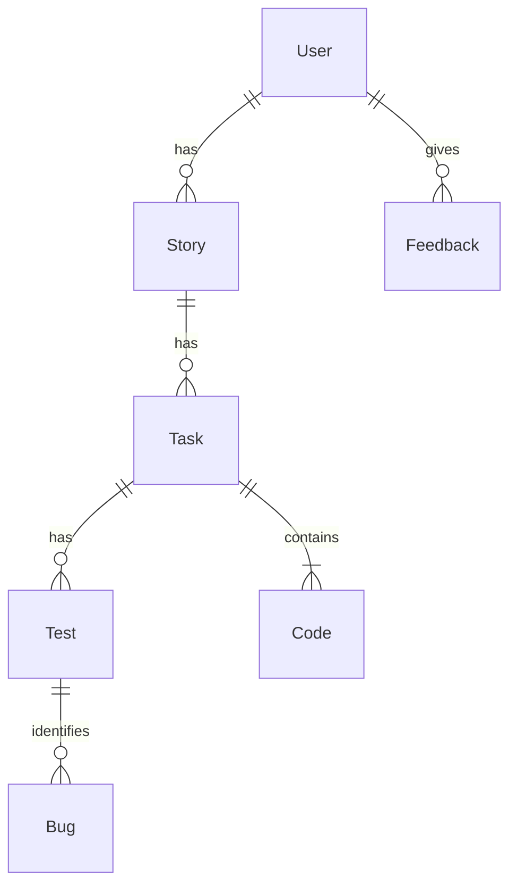
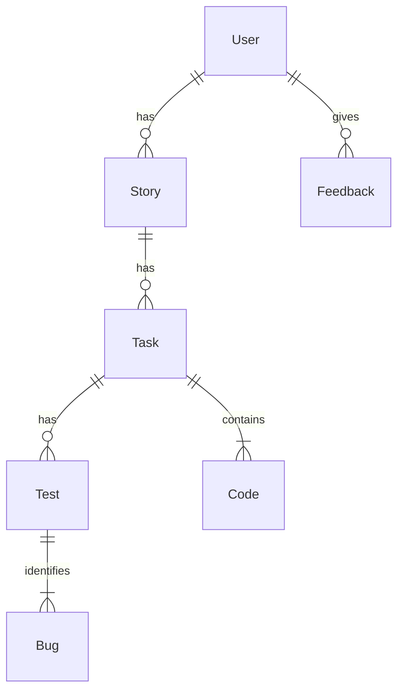
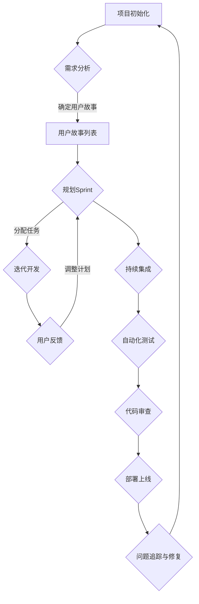
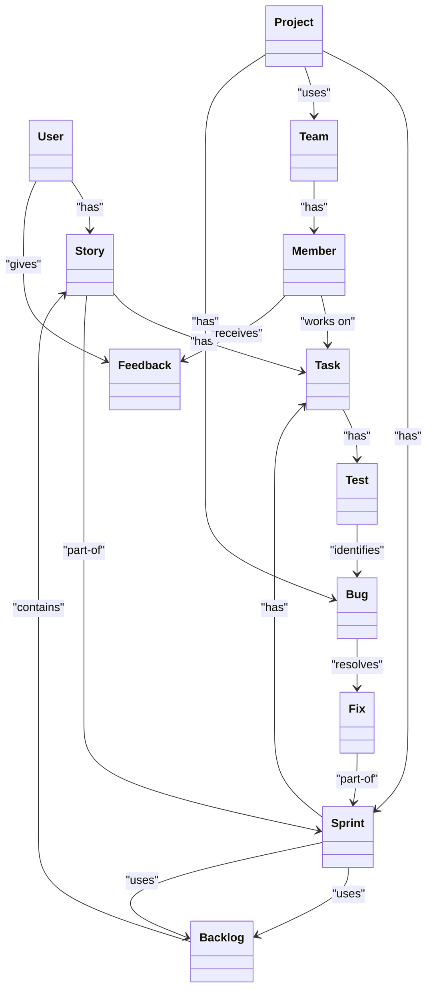
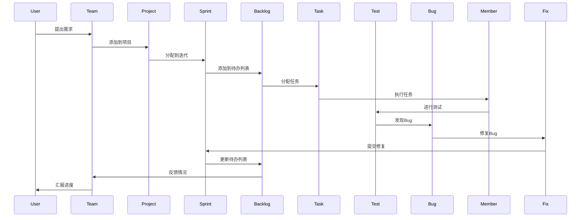
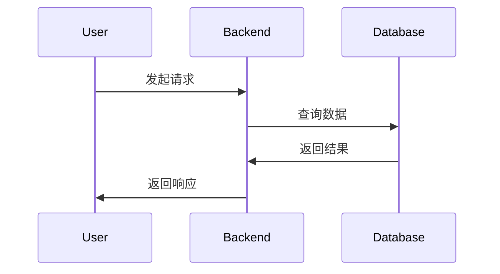
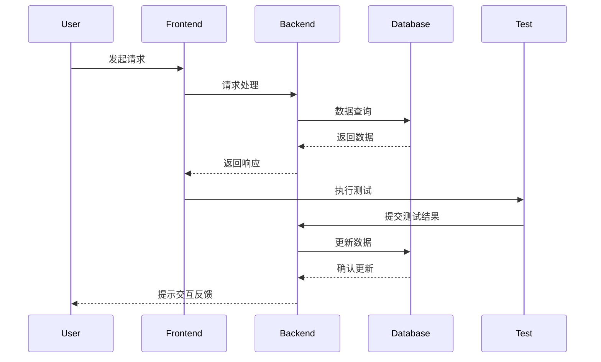

                 

### 提高技术团队敏捷性的策略

关键词：技术团队、敏捷性、管理策略、流程优化、敏捷方法

摘要：本文将深入探讨提高技术团队敏捷性的策略。敏捷性是现代技术团队追求的重要目标，它不仅关乎团队的效率，更关系到项目交付的成功率。本文将首先介绍技术团队敏捷性的定义及其重要性，接着分析传统技术团队面临的挑战，探讨敏捷性的核心要素及其实现路径。随后，文章将比较敏捷性与其他管理方法的异同，详细阐述敏捷性的概念结构与核心要素组成。在此基础上，本文将深入解析敏捷性原理，包括其起源、应用领域、核心概念及其属性特征对比。通过ER实体关系图，我们将对敏捷性原理进行更为直观的展示。此外，本文还将详细讲解敏捷算法原理，包括其定义、分类、数学模型和Python源代码示例。接着，我们将探讨敏捷性在技术团队中的应用，通过系统功能设计、系统架构设计和系统接口设计，展示敏捷性的实际应用场景。最后，本文将分享敏捷性实践案例，进行环境安装、系统核心实现、代码应用解读与分析、实际案例分析与详细讲解，以及项目小结。通过本文的阅读，技术团队管理者将获得提高团队敏捷性的实用策略和最佳实践。

### 第一部分：背景介绍

#### 第1章：技术团队敏捷性概述

在现代信息技术飞速发展的背景下，技术团队面临着前所未有的挑战和机遇。敏捷性作为技术团队高效运作的重要指标，越来越受到重视。本章节将首先介绍敏捷性的概念和背景，接着分析技术团队面临的挑战，探讨敏捷性的重要性及其核心要素，最后讨论敏捷性的实现路径及其边界与外延。

#### 1.1 问题背景

**什么是敏捷性？**

敏捷性（Agility）一词源于体育领域，意指运动员在快速变化的环境中迅速适应和做出反应的能力。在管理学中，敏捷性被引申为团队在面对不确定性和变化时，能够快速调整策略、高效执行的能力。对于技术团队而言，敏捷性指的是在开发、测试、部署和维护过程中，快速响应需求变化、持续交付高质量软件的能力。

**为什么技术团队需要敏捷性？**

技术团队的工作环境充满了不确定性和变化。一方面，市场需求不断变化，客户需求难以预测；另一方面，技术发展日新月异，新的工具、平台和框架层出不穷。在这种背景下，传统的线性开发模式已经无法满足快速交付高质量软件的需求。技术团队需要具备敏捷性，以适应快速变化的环境，确保项目的成功。

#### 1.2 问题描述

**传统技术团队的挑战**

传统技术团队往往面临以下挑战：

1. **需求变更管理困难**：在项目开发过程中，需求变更频繁，传统方法难以有效应对。
2. **沟通协作不畅**：团队成员之间的沟通协作效率低下，信息传递不及时。
3. **流程繁琐**：开发流程复杂，审批流程长，导致项目进度延误。
4. **质量保证不足**：测试工作不足，导致交付的软件质量不稳定。

**敏捷性的重要性**

敏捷性的重要性体现在以下几个方面：

1. **快速响应需求变化**：敏捷方法强调持续交付，能够快速响应市场需求变化。
2. **提高团队协作效率**：通过团队协作、迭代开发和持续集成，提高团队工作效率。
3. **保障软件质量**：敏捷方法强调测试和反馈，能够有效保障软件质量。
4. **降低项目风险**：通过持续交付和迭代优化，降低项目风险。

#### 1.3 问题解决

**敏捷性的核心要素**

敏捷性的核心要素包括：

1. **迭代开发**：通过短期迭代（Sprint）进行持续开发，快速交付可用的软件。
2. **用户反馈**：不断收集用户反馈，快速调整开发方向。
3. **团队协作**：强调团队成员之间的沟通协作，共同推动项目进展。
4. **持续集成**：通过自动化测试和持续集成，提高开发效率和软件质量。
5. **灵活调整**：在面对变化时，能够灵活调整计划和策略。

**敏捷性在技术团队中的实现路径**

1. **团队培训**：对团队成员进行敏捷方法培训，提高团队整体敏捷性。
2. **工具选择**：选择适合敏捷开发的工具，如JIRA、Git等。
3. **流程优化**：简化开发流程，减少不必要的审批环节。
4. **持续反馈**：建立反馈机制，定期评估项目进展和团队绩效。
5. **文化建设**：营造开放、协作、创新的企业文化，支持敏捷方法。

#### 1.4 边界与外延

**敏捷性的适用范围**

敏捷方法适用于大多数软件开发项目，特别是在需求变化频繁、项目周期较短的场合。然而，敏捷方法并非适用于所有项目，如大型、复杂的系统开发项目，可能需要结合传统方法进行调整。

**敏捷性与其他管理方法的比较**

敏捷方法与传统方法（如瀑布模型）有显著区别：

1. **关注点不同**：传统方法关注任务完成，敏捷方法关注客户价值和团队协作。
2. **交付周期不同**：传统方法通常以项目为单位交付，敏捷方法以迭代为单位交付。
3. **风险管理不同**：传统方法在项目后期集中进行风险控制，敏捷方法通过持续交付和迭代进行风险控制。
4. **团队角色不同**：传统方法中，团队成员角色较为固定，敏捷方法强调多功能团队，团队成员角色灵活。

**概念结构与核心要素组成**

敏捷性的概念结构包括：

1. **敏捷宣言**：定义敏捷开发的核心理念。
2. **核心原则**：包括个体和互动、可工作的软件、客户合作、响应变化等。
3. **实践方法**：如迭代开发、持续集成、用户故事等。

敏捷性的核心要素包括：

1. **迭代开发**：通过短期迭代进行持续开发。
2. **用户故事**：以用户需求为导向进行开发。
3. **自动化测试**：通过自动化测试提高开发效率和软件质量。
4. **团队协作**：强调团队成员之间的沟通协作。

通过以上分析，我们可以看出，提高技术团队的敏捷性是一项系统工程，需要从多个方面进行综合考虑和优化。在接下来的章节中，我们将进一步深入探讨敏捷性的核心概念、原理和算法，以帮助技术团队更好地实现敏捷性。

#### 1.5 概念结构与核心要素组成

敏捷性的概念结构是理解其如何运作和实现的基础。为了更好地掌握敏捷性，我们需要从概念层面深入探讨其组成部分，以及这些部分如何相互作用，从而提升团队的敏捷性。

**1.5.1 敏捷性的概念结构**

敏捷性的概念结构可以概括为以下几个关键组成部分：

1. **敏捷宣言**：敏捷宣言是敏捷方法的核心理念，其四个核心价值为：
   - **个体和互动高于流程与工具**：强调团队成员的互动和协作，认为这是成功的关键。
   - **可工作的软件高于详尽的文档**：强调实际交付可工作的软件，而不是过分依赖文档。
   - **客户合作高于合同谈判**：强调与客户的紧密合作，以快速响应市场需求。
   - **响应变化重于遵循计划**：强调在变化面前保持灵活性，以实现持续改进。

2. **核心原则**：敏捷方法包括十二条核心原则，这些原则进一步细化了敏捷宣言的价值观。例如：
   - **最优先要做的是通过早期和持续交付有价值的软件**
   - **欢迎需求变更，即使在开发进行中**
   - **频繁交付工作产品，以几个月为周期**
   - **在整个开发期间，业务人员和开发人员必须在一起工作**
   - **围绕被鼓励和支援的团队构建项目**
   - **项目进行中的个体和交互应高于过程和工具**
   - **可持续的开发速度**
   - **保持简洁和可持续的工作环境**
   - **关注技术的卓越和优秀的技能**
   - **简化的过程**

3. **实践方法**：敏捷方法包含一系列实践方法，如迭代开发、用户故事、持续集成、持续部署、代码审查、集体代码所有权等。这些实践方法共同构建了敏捷性的具体操作指南。

**1.5.2 敏捷性的核心要素**

为了实现敏捷性，技术团队需要掌握和落实以下核心要素：

1. **迭代开发**：迭代开发是一种周期性的软件开发方法，每个迭代周期通常持续2-4周。在每个迭代周期内，团队会集中精力完成一个可交付的软件版本。这种方法有助于快速响应需求变化，并及时获取用户反馈。

2. **用户故事**：用户故事是一种描述需求的简单方法，通常采用以下格式：“作为XX，我想YY，以便ZZ”。用户故事帮助团队从用户的角度出发，明确软件的功能和价值。

3. **自动化测试**：自动化测试是确保软件质量的重要手段。通过编写和运行自动化测试脚本，团队可以在开发过程中持续检测软件的缺陷和问题。自动化测试有助于提高开发效率，减少测试成本。

4. **团队协作**：团队协作是实现敏捷性的关键。通过建立高效的沟通机制和合作文化，团队成员可以更好地协同工作，快速解决问题。有效的团队协作可以提高团队的效率和创新能力。

5. **持续集成和持续部署**：持续集成（CI）和持续部署（CD）是敏捷开发的重要组成部分。通过自动化构建和部署流程，团队可以在每次代码提交后快速集成和部署软件。这种方法有助于减少缺陷和加速软件交付。

**1.5.3 敏捷性实现路径**

要实现敏捷性，技术团队可以采取以下步骤：

1. **团队培训**：为团队成员提供敏捷方法培训，确保他们理解敏捷宣言、核心原则和实践方法。

2. **工具选择**：选择适合敏捷开发的工具，如JIRA、Confluence、Git等，以支持迭代开发、用户故事管理、自动化测试和持续集成。

3. **流程优化**：简化开发流程，减少不必要的审批环节，以便团队可以更专注于开发工作。

4. **文化建设**：营造开放、协作、创新的企业文化，鼓励团队成员积极参与、分享知识和经验。

5. **反馈机制**：建立反馈机制，定期评估项目进展和团队绩效，以便及时调整计划和策略。

通过以上步骤，技术团队可以逐步实现敏捷性，提高工作效率和软件质量。

综上所述，敏捷性的概念结构及其核心要素为技术团队提供了实现敏捷性的框架和路径。通过深入理解和实践这些概念和要素，技术团队可以更好地应对快速变化的市场需求，持续交付高质量软件。

#### 第2章：敏捷性原理

敏捷性作为现代技术团队追求的重要目标，其成功实现依赖于对敏捷性原理的深入理解和灵活应用。本章将首先介绍敏捷性的起源，以及敏捷性在不同领域的应用，从而帮助我们更好地理解敏捷性的核心概念和属性特征。

##### 2.1 敏捷性原理概述

**2.1.1 敏捷性的起源**

敏捷性起源于软件开发领域，最早由一群软件工程师在2001年共同提出。他们在 manifesto for agile software development 中总结了敏捷开发的核心理念，即敏捷宣言（Manifesto for Agile Software Development）。这份宣言强调了个体和互动的重要性，可工作的软件，客户合作，以及应对变化。敏捷性思想迅速传播，并逐渐应用于其他领域，如产品开发、项目管理等。

**2.1.2 敏捷性在不同领域的应用**

1. **软件开发**：敏捷开发方法如Scrum和Kanban广泛应用于软件开发，通过迭代开发、用户故事、自动化测试和持续集成，提高开发效率和软件质量。

2. **产品开发**：敏捷方法帮助产品开发团队更好地理解市场需求，通过快速迭代和用户反馈，快速调整产品方向，提高产品成功率。

3. **项目管理**：敏捷项目管理方法如Scrum和Kanban，强调团队协作、迭代交付和持续改进，帮助项目经理更好地应对项目变化。

4. **运营管理**：敏捷运营管理方法如DevOps，通过自动化和协作，提高系统运维效率，确保系统稳定性和可靠性。

##### 2.2 敏捷性原理分析

**2.2.1 敏捷性原理的核心概念**

敏捷性原理的核心概念包括：

1. **迭代开发**：通过短期迭代（通常为2-4周）进行开发，每个迭代周期结束时交付一个可用的软件版本。

2. **用户故事**：以用户需求为导向，描述软件功能的故事，格式通常为：“作为XX，我想YY，以便ZZ”。

3. **自动化测试**：通过自动化测试脚本，持续检测软件缺陷和问题，确保软件质量。

4. **持续集成和持续部署**：通过自动化构建和部署流程，快速集成和部署软件，确保开发效率。

5. **团队协作**：强调团队成员之间的沟通协作，共同推动项目进展。

**2.2.2 敏捷性原理的属性特征对比表格**

以下表格展示了敏捷性原理的核心属性特征及其对比：

| 特性         | 说明                                                         |
| ------------ | ------------------------------------------------------------ |
| **迭代开发** | 通过短期迭代进行开发，每个迭代周期结束时交付一个可用的软件版本。                     |
| **用户故事** | 以用户需求为导向，描述软件功能的故事，格式通常为：“作为XX，我想YY，以便ZZ”。       |
| **自动化测试** | 通过自动化测试脚本，持续检测软件缺陷和问题，确保软件质量。                           |
| **持续集成和持续部署** | 通过自动化构建和部署流程，快速集成和部署软件，确保开发效率。                         |
| **团队协作**   | 强调团队成员之间的沟通协作，共同推动项目进展。                                     |
| **灵活调整**   | 面对变化时，能够灵活调整计划和策略，以适应新的需求和情况。                          |
| **快速反馈**   | 通过迭代开发和用户反馈，快速识别和解决问题，持续改进软件。                         |
| **持续改进**   | 不断反思和优化开发流程，提高团队效率和软件质量。                                  |

**2.2.3 敏捷性原理的ER实体关系图架构**

为了更直观地展示敏捷性原理的实体关系，我们使用Mermaid绘制了ER实体关系图。以下是ER实体关系图的Markdown格式：



**2.2.4 ER实体关系图解析**

ER实体关系图展示了敏捷性原理中各实体的关系：

- **用户（User）**：代表项目需求提出者，可以是客户或项目团队成员。
- **故事（Story）**：描述用户需求的实体，通常以用户故事的形式存在。
- **任务（Task）**：从故事中分解出的具体工作项，是开发过程中的基本单位。
- **测试（Test）**：用于检测任务完成的测试脚本，确保软件质量。
- **反馈（Feedback）**：用户对软件的反馈，用于改进后续开发。
- **Bug**：测试过程中发现的软件缺陷。
- **代码（Code）**：任务的实现部分，包含具体的编程代码。

通过ER实体关系图，我们可以清晰地看到敏捷性原理中各实体之间的关联，这有助于我们更好地理解和应用敏捷性。

##### 2.3 敏捷性原理的ER实体关系图架构

为了更直观地展示敏捷性原理中各实体之间的关系，我们将使用Mermaid语言绘制一个ER（实体关系）图。以下是ER图的Markdown格式：



**2.3.1 ER实体关系图**

ER图展示了敏捷性原理中的主要实体及其相互关系：

1. **User（用户）**：代表项目的需求提出者，通常是项目经理、产品经理或客户。用户与故事之间存在“has”（拥有）的关系，用户可以提出多个故事。
   
2. **Story（故事）**：描述用户需求的具体工作项，通常采用用户故事格式：“作为XX，我想YY，以便ZZ”。故事与任务之间存在“has”（包含）的关系，一个故事可以分解为多个任务。

3. **Task（任务）**：从故事中分解出的具体工作项，包括编写代码、测试和调试等。任务与测试之间存在“has”（包含）的关系，每个任务都需要进行相应的测试。

4. **Test（测试）**：用于验证任务完成情况的测试脚本。测试与Bug之间存在“identifies”（识别）的关系，测试过程中发现的缺陷会生成相应的Bug。

5. **Feedback（反馈）**：用户对软件的反馈，用于评估软件是否符合用户需求。用户与反馈之间存在“gives”（给予）的关系，用户可以提供反馈来改进后续开发。

6. **Code（代码）**：任务的实现部分，包含具体的编程代码。任务与代码之间存在“contains”（包含）的关系，每个任务都生成相应的代码。

**2.3.2 ER实体关系图解析**

ER实体关系图解析如下：

- **用户与故事的关系**：用户提出故事，故事是用户需求的具体体现，用户对故事有控制权，可以修改和删除故事。
- **故事与任务的关系**：故事分解为多个任务，任务是实现故事的具体步骤。任务通常由团队成员负责完成，任务之间可以并行或顺序执行。
- **任务与测试的关系**：每个任务都需要经过测试，以确保其实现的功能符合预期。测试可以是手动执行，也可以是自动化执行。
- **测试与Bug的关系**：测试过程中可能会发现Bug，Bug是测试失败的结果。测试人员需要记录Bug，并跟踪其修复过程。
- **用户与反馈的关系**：用户提供反馈，反馈用于评估软件的当前状态和改进方向。反馈可以是积极的，也可以是负面的，但都是宝贵的改进信息。
- **任务与代码的关系**：任务实现的具体工作包含在代码中。代码是任务的结果，也是软件的核心部分。

通过ER实体关系图，我们可以清晰地看到敏捷性原理中各实体之间的关系，这有助于我们更好地理解和应用敏捷性。ER图提供了一个直观的视角，帮助我们梳理敏捷性原理的组成部分及其相互联系，从而在实际项目中更有效地实现敏捷开发。

##### 2.4 敏捷算法原理

敏捷算法（Agile Algorithms）是敏捷性在软件开发中的具体实现方法，其核心在于通过迭代和持续改进来优化开发流程，提高软件质量和团队效率。本章将首先介绍敏捷算法的定义和分类，然后详细讲解敏捷算法的数学模型和公式，最后通过Python源代码示例进行算法实现和分析。

**2.4.1 敏捷算法概述**

敏捷算法是敏捷开发方法在软件开发过程中的具体应用，其目标是提高开发效率和软件质量。敏捷算法包括以下几种主要类型：

1. **迭代算法**：通过短期迭代（如Scrum的Sprint）进行开发，每个迭代周期结束后交付一个可工作的软件版本。
2. **增量算法**：逐步增加新功能，通过连续的迭代来不断完善软件。
3. **用户故事算法**：以用户故事为基本单位进行开发，每个用户故事都代表一个具体的需求。
4. **自动化测试算法**：通过自动化测试来持续检测软件缺陷，确保软件质量。

**2.4.2 敏捷算法的定义**

敏捷算法的定义可以概括为：在软件开发过程中，通过迭代和持续改进，逐步完善软件的功能和性能，同时确保软件的可维护性和可扩展性。

**2.4.3 敏捷算法的分类**

1. **迭代算法**：常见的迭代算法包括Scrum、Kanban等。Scrum强调固定时间周期的迭代，每个迭代周期称为Sprint，通常持续2-4周。Kanban则强调通过卡片在板上的流动来管理任务，持续优化流程。
   
2. **增量算法**：增量算法的核心在于逐步增加新功能，每个迭代周期都增加新的功能模块。这种方法有助于快速响应需求变化，并逐步完善软件。

3. **用户故事算法**：用户故事算法以用户故事为基本开发单元，每个用户故事都代表一个具体的需求。开发团队通过不断迭代和交付用户故事来满足用户需求。

4. **自动化测试算法**：自动化测试算法通过编写和执行自动化测试脚本，持续检测软件缺陷。这种方法可以大幅提高测试效率和软件质量。

**2.4.4 敏捷算法的数学模型**

敏捷算法的数学模型主要包括以下几个方面：

1. **迭代次数**：敏捷开发中的迭代次数通常与项目复杂度和团队效率相关。假设一个项目的总复杂度为C，团队每迭代周期能完成的复杂度为c，则迭代次数n = C/c。

2. **用户故事点**：用户故事点用于衡量用户故事的复杂度。通常，用户故事点是根据故事的大小、复杂度和风险等因素进行评估的。用户故事点可以帮助团队估算项目进度和资源需求。

3. **测试覆盖率**：测试覆盖率是衡量自动化测试质量的指标，表示测试脚本覆盖的代码比例。假设代码总行数为N，测试脚本覆盖的行数为M，则测试覆盖率为M/N。

4. **迭代效率**：迭代效率是衡量迭代周期内团队工作完成的程度的指标。假设每个迭代周期内团队完成的用户故事点数为P，则迭代效率为P/（n×c）。

**2.4.5 敏捷算法的Python源代码示例**

以下是一个简单的Python示例，用于实现用户故事算法的基本流程：

```python
# 用户故事类定义
class UserStory:
    def __init__(self, name, story_points):
        self.name = name
        self.story_points = story_points
        self.completed = False

    def complete(self):
        self.completed = True
        print(f"{self.name} 已完成")

# 初始化用户故事列表
user_stories = [
    UserStory("用户登录功能", 2),
    UserStory("用户注册功能", 3),
    UserStory("用户资料编辑功能", 4)
]

# 迭代执行用户故事
for story in user_stories:
    if not story.completed:
        story.complete()

# 输出完成情况
for story in user_stories:
    print(f"{story.name} 完成状态：{story.completed}")
```

在上面的示例中，我们定义了一个`UserStory`类，用于表示用户故事。每个用户故事包含名称和故事点。通过调用`complete()`方法，可以完成用户故事。程序运行后，将输出每个用户故事的完成状态。

**2.4.6 代码解读与分析**

1. **类定义**：我们首先定义了`UserStory`类，包含`name`（名称）和`story_points`（故事点）两个属性，以及一个`complete()`方法，用于标记用户故事完成状态。

2. **初始化用户故事列表**：我们初始化了一个包含三个用户故事的列表，每个用户故事都有自己的名称和故事点。

3. **迭代执行用户故事**：通过一个简单的for循环，我们迭代执行每个用户故事，调用`complete()`方法完成用户故事。

4. **输出完成情况**：最后，我们再次迭代用户故事列表，输出每个用户故事的完成状态。

通过这个简单的示例，我们可以看到用户故事算法的基本流程，包括用户故事的定义、初始化、迭代执行和完成状态输出。这个示例虽然简单，但展示了敏捷算法的核心思想，即通过迭代和持续改进，逐步完成用户故事，实现软件开发的敏捷性。

综上所述，敏捷算法通过迭代和持续改进，逐步完善软件的功能和性能。通过Python示例，我们更直观地理解了敏捷算法的实现方法和流程。在实际应用中，敏捷算法可以根据具体项目需求进行调整和优化，以实现更好的开发效果。

### 第三部分：算法原理讲解

#### 第3章：敏捷算法原理

在理解了敏捷性原理之后，我们需要深入了解敏捷算法的具体实现。本章将首先介绍敏捷算法的概述，包括其定义和分类。接着，我们将详细讲解敏捷算法的数学模型和公式，并通过mermaid流程图展示算法的执行流程。此外，我们还将通过Python源代码示例，展示敏捷算法的实现过程，并进行代码解读与分析。

##### 3.1 敏捷算法概述

**3.1.1 敏捷算法的定义**

敏捷算法是一系列用于支持敏捷开发方法的技术和策略，旨在提高软件开发的效率和质量。敏捷算法的核心思想是通过迭代和持续改进，逐步实现项目目标。敏捷算法适用于各种软件开发项目，特别适合需求变化频繁的场景。

**3.1.2 敏捷算法的分类**

敏捷算法可以分为以下几类：

1. **迭代算法**：这类算法通过固定时间周期的迭代进行开发，每个迭代周期称为Sprint。常见的迭代算法包括Scrum和Kanban。

2. **增量算法**：增量算法逐步增加新功能，每个迭代周期都增加新的功能模块。这种方法有助于快速响应需求变化。

3. **用户故事算法**：这类算法以用户故事为基本开发单元，每个用户故事都代表一个具体的需求。开发团队通过不断迭代和交付用户故事来满足用户需求。

4. **自动化测试算法**：这类算法通过自动化测试来持续检测软件缺陷，确保软件质量。自动化测试算法包括单元测试、集成测试和端到端测试等。

##### 3.2 敏捷算法的数学模型

敏捷算法的数学模型主要包括以下几个核心概念：

1. **迭代次数**：迭代次数n取决于项目总复杂度C和每个迭代周期团队可完成的复杂度c。公式为：n = C / c。

2. **用户故事点**：用户故事点用于衡量用户故事的复杂度。用户故事点可以根据故事的大小、复杂度和风险等因素进行评估。

3. **测试覆盖率**：测试覆盖率是衡量自动化测试质量的指标，表示测试脚本覆盖的代码比例。公式为：测试覆盖率 = 测试脚本覆盖的行数 / 代码总行数。

4. **迭代效率**：迭代效率是衡量团队在每个迭代周期内工作完成程度的指标。公式为：迭代效率 = 完成的用户故事点数 / (迭代次数 × 每迭代周期团队可完成的复杂度)。

##### 3.3 敏捷算法mermaid流程图

为了更直观地展示敏捷算法的执行流程，我们使用mermaid绘制了一个流程图。以下是mermaid流程图的Markdown格式：



**3.3.1 敏捷算法mermaid流程图**

mermaid流程图展示了敏捷算法的基本执行流程：

- **项目初始化**：项目启动，确定项目目标和需求。
- **需求分析**：进行需求分析，确定用户故事。
- **用户故事列表**：整理用户故事列表，确定每个用户故事的优先级和复杂度。
- **规划Sprint**：根据用户故事列表，规划每个迭代周期的任务和目标。
- **分配任务**：将任务分配给团队成员，确保每个任务都有明确的负责者。
- **迭代开发**：在迭代周期内，团队成员按计划完成任务，持续开发。
- **用户反馈**：在每个迭代周期结束时，收集用户反馈，评估软件质量。
- **调整计划**：根据用户反馈，调整后续迭代周期的计划和目标。
- **持续集成**：通过持续集成，确保每次提交的代码都能与现有代码兼容。
- **自动化测试**：通过自动化测试，确保软件质量，检测潜在的缺陷。
- **代码审查**：进行代码审查，确保代码质量和规范性。
- **部署上线**：将开发完成的软件部署到生产环境，供用户使用。
- **问题追踪与修复**：监控软件运行状态，及时追踪和修复问题。

**3.3.2 敏捷算法mermaid流程图解析**

通过mermaid流程图，我们可以清晰地看到敏捷算法的执行流程和各个环节之间的关系：

- **项目初始化**是项目的起点，确定项目目标和需求。
- **需求分析**和**用户故事列表**帮助团队明确开发目标和任务。
- **规划Sprint**、**分配任务**和**迭代开发**构成了迭代周期的核心部分，团队在此期间按计划完成任务。
- **用户反馈**、**调整计划**、**持续集成**、**自动化测试**、**代码审查**和**部署上线**等环节确保了软件质量，保证了项目进展的连续性和稳定性。
- **问题追踪与修复**是项目的持续优化过程，通过监控和修复问题，确保软件的稳定运行。

##### 3.4 敏捷算法Python源代码讲解

为了更好地理解敏捷算法的实现，我们将通过Python源代码示例展示用户故事算法的基本流程。以下是Python源代码的Markdown格式：

```python
# 用户故事类定义
class UserStory:
    def __init__(self, name, story_points):
        self.name = name
        self.story_points = story_points
        self.completed = False

    def complete(self):
        self.completed = True
        print(f"{self.name} 已完成")

# 初始化用户故事列表
user_stories = [
    UserStory("用户登录功能", 2),
    UserStory("用户注册功能", 3),
    UserStory("用户资料编辑功能", 4)
]

# 迭代执行用户故事
for story in user_stories:
    if not story.completed:
        story.complete()

# 输出完成情况
for story in user_stories:
    print(f"{story.name} 完成状态：{story.completed}")
```

**3.4.1 Python源代码实现**

1. **用户故事类定义**：我们首先定义了`UserStory`类，包含`name`（名称）和`story_points`（故事点）两个属性，以及一个`complete()`方法，用于标记用户故事完成状态。

2. **初始化用户故事列表**：我们初始化了一个包含三个用户故事的列表，每个用户故事都有自己的名称和故事点。

3. **迭代执行用户故事**：通过一个简单的for循环，我们迭代执行每个用户故事，调用`complete()`方法完成用户故事。

4. **输出完成情况**：最后，我们再次迭代用户故事列表，输出每个用户故事的完成状态。

**3.4.2 代码解读与分析**

1. **类定义**：`UserStory`类定义了一个用户故事的基本属性和方法。`__init__`方法用于初始化用户故事的名称和故事点。`complete()`方法用于标记用户故事为完成状态，并打印完成信息。

2. **初始化用户故事列表**：我们创建了一个列表，包含三个用户故事实例。每个实例代表一个具体的需求。

3. **迭代执行用户故事**：通过for循环，我们逐个迭代用户故事列表。在每次迭代中，我们检查用户故事是否已完成。如果未完成，我们调用`complete()`方法完成用户故事。

4. **输出完成情况**：最后，我们再次迭代用户故事列表，输出每个用户故事的完成状态。这有助于我们了解项目的进展情况。

通过这个简单的Python示例，我们实现了用户故事算法的基本流程。虽然示例简单，但展示了敏捷算法的核心思想，即通过迭代和持续改进，逐步完成用户故事，实现软件开发的敏捷性。在实际项目中，我们可以根据具体需求进行调整和优化，以实现更好的开发效果。

综上所述，敏捷算法通过迭代和持续改进，逐步实现项目目标。通过mermaid流程图和Python源代码示例，我们更直观地理解了敏捷算法的实现过程和关键步骤。在实际应用中，敏捷算法可以根据项目需求和团队特点进行调整，以提高开发效率和软件质量。

### 第四部分：系统分析与架构设计方案

#### 第4章：敏捷性在技术团队中的应用

在了解了敏捷性的原理和算法后，我们需要探讨如何在实际技术团队中应用敏捷性，以提高团队的工作效率和软件质量。本章将首先介绍技术团队的工作模式，分析敏捷性在技术团队中的挑战，然后详细讲解敏捷性在技术团队中的应用场景，包括系统功能设计、系统架构设计和系统接口设计。通过这些内容，我们将展示如何将敏捷性原则融入到技术团队的实际工作中。

#### 4.1 问题场景介绍

在现代技术团队的工作模式中，团队成员通常需要处理复杂的项目需求，快速响应市场变化，同时保证软件的高质量和交付效率。以下是一个典型的问题场景：

- **项目需求多变**：市场需求快速变化，客户需求频繁变更，导致技术团队需要不断调整开发计划。
- **沟通协作困难**：团队成员分布在不同的地理位置，沟通协作效率低下，信息传递不及时。
- **流程管理复杂**：传统的开发流程复杂，审批流程冗长，导致项目进度延误。
- **测试和部署困难**：测试工作不足，导致软件质量不稳定，部署过程繁琐，影响交付效率。

在这种背景下，敏捷性的引入显得尤为重要。敏捷性可以帮助技术团队快速响应需求变化，提高沟通协作效率，简化流程管理，确保软件质量。

#### 4.2 系统功能设计

**4.2.1 领域模型mermaid类图**

为了更好地设计敏捷性技术团队中的系统功能，我们使用mermaid绘制了领域模型类图。以下是mermaid类图的Markdown格式：



**4.2.2 系统功能解析**

mermaid类图展示了系统中的主要实体及其相互关系：

- **User（用户）**：代表项目的需求提出者，可以是客户或项目经理。用户可以提出故事和反馈，影响项目方向。
- **Story（故事）**：描述用户需求的工作项，通常采用用户故事格式。故事与任务、迭代和反馈有直接关系。
- **Task（任务）**：从故事中分解出的具体工作项，如编写代码、进行测试等。任务是团队协作的基本单位。
- **Test（测试）**：用于验证任务完成情况的测试脚本，确保软件质量。测试过程中可能发现Bug。
- **Bug（Bug）**：测试过程中发现的软件缺陷。Bug需要被修复，以确保软件质量。
- **Sprint（迭代）**：项目中的一个迭代周期，通常持续2-4周。每个迭代周期都会包含一定数量的任务和用户故事。
- **Backlog（待办列表）**：包含所有未完成的用户故事和任务。待办列表帮助团队管理项目工作量。
- **Project（项目）**：代表一个完整的软件开发项目。项目包含多个迭代周期，是一个整体。
- **Team（团队）**：代表项目团队，由多个成员组成。团队负责执行项目任务，管理迭代和反馈。
- **Member（成员）**：项目团队成员，负责具体任务和工作。成员之间需要紧密协作，共同推进项目。
- **Fix（修复）**：针对Bug的修复方案。修复是保证软件质量的关键环节。

通过领域模型类图，我们可以清晰地看到系统中各个实体的关系，这有助于我们设计和实现敏捷性的技术团队系统功能。

#### 4.3 系统架构设计

**4.3.1 系统架构设计mermaid架构图**

为了更好地展示系统架构，我们使用mermaid绘制了架构图。以下是mermaid架构图的Markdown格式：



**4.3.2 系统架构解析**

mermaid架构图展示了系统的整体架构和各个部分之间的交互关系：

- **用户（User）**：用户提出需求，需求会被传递给技术团队。
- **技术团队（Team）**：技术团队负责管理项目，包括需求分析、任务分配和进度汇报。
- **项目（Project）**：项目是整个工作的集合，包含多个迭代周期。
- **迭代（Sprint）**：迭代是项目中的一个周期，通常持续2-4周。
- **待办列表（Backlog）**：待办列表包含所有未完成的用户故事和任务。
- **任务（Task）**：任务是从用户故事中分解出来的具体工作项。
- **成员（Member）**：团队成员负责具体任务的执行。
- **测试（Test）**：测试是确保任务完成质量的关键环节。
- **Bug（Bug）**：测试过程中发现的软件缺陷。
- **修复（Fix）**：针对Bug的修复方案。

通过mermaid架构图，我们可以清晰地看到系统各部分之间的交互关系，这有助于我们理解和优化系统的架构设计。

#### 4.4 系统接口设计

**4.4.1 系统接口设计mermaid序列图**

为了更好地展示系统接口的设计，我们使用mermaid绘制了序列图。以下是mermaid序列图的Markdown格式：



**4.4.2 系统接口解析**

mermaid序列图展示了系统接口的基本交互流程：

- **用户（User）**：用户发起请求，请求可以是获取数据、提交数据等操作。
- **后端（Backend）**：后端负责处理用户的请求，包括请求解析、业务逻辑处理和数据查询等。
- **数据库（Database）**：数据库负责存储和查询数据，确保数据的完整性和一致性。

通过mermaid序列图，我们可以清晰地看到系统接口的基本交互流程，这有助于我们设计和优化系统接口。

#### 4.5 系统交互

**4.5.1 系统交互mermaid序列图**

为了更详细地展示系统的交互过程，我们使用mermaid绘制了交互序列图。以下是mermaid序列图的Markdown格式：



**4.5.2 系统交互解析**

mermaid序列图展示了系统的整体交互过程：

- **用户（User）**：用户通过前端发起请求，请求可以是登录、查询数据等操作。
- **前端（Frontend）**：前端负责将用户的请求发送到后端，并接收后端的响应。
- **后端（Backend）**：后端负责处理用户的请求，包括请求解析、业务逻辑处理和数据查询等。
- **数据库（Database）**：数据库负责存储和查询数据，确保数据的完整性和一致性。
- **测试（Test）**：测试模块负责对后端和数据库进行测试，确保系统的稳定性和性能。

通过mermaid序列图，我们可以清晰地看到系统的交互过程，包括用户请求、前端处理、后端处理、数据库交互和测试反馈等环节。这有助于我们理解系统的整体运作机制，优化系统设计和实现。

综上所述，本章详细介绍了敏捷性在技术团队中的应用，包括系统功能设计、系统架构设计和系统接口设计，以及系统交互的详细解析。通过这些内容，我们可以看到如何将敏捷性原则融入到技术团队的实际工作中，提高团队的工作效率和软件质量。

### 第五部分：项目实战

#### 第5章：敏捷性实践案例

在实际操作中，将敏捷性原则应用到技术团队的项目开发中是一个持续迭代和不断优化的过程。以下是一个具体的敏捷性实践案例，涵盖从环境安装、系统核心实现到代码应用解读与分析，再到实际案例分析和项目小结的完整流程。

#### 5.1 环境安装

**5.1.1 环境搭建步骤**

为了实现敏捷开发，我们需要搭建一个适合敏捷性实践的开发环境。以下是环境搭建的步骤：

1. **安装基础工具**：首先，安装Git、JIRA和Confluence等基础工具。这些工具支持版本控制、任务管理和文档协作。

2. **配置开发环境**：安装Java、Python等开发环境，并根据项目需求安装相关依赖库。例如，对于Java项目，我们需要安装Maven或Gradle。

3. **设置持续集成服务器**：配置Jenkins或GitLab CI等持续集成服务器，以实现自动化构建和部署。

4. **配置测试环境**：安装自动化测试工具，如Selenium、JUnit等，并配置测试环境。

5. **部署测试数据库**：安装并配置测试数据库，如MySQL或PostgreSQL，用于测试数据存储和查询。

**5.1.2 环境配置与优化**

1. **JIRA配置**：在JIRA中创建项目、迭代和用户故事，确保任务分配和进度追踪的准确性。

2. **Confluence配置**：在Confluence中创建文档空间，用于记录项目需求、设计文档和用户故事。

3. **代码库管理**：配置Git仓库，使用分支管理策略（如GitFlow或GitHub Flow）。

4. **持续集成配置**：配置Jenkins或GitLab CI，设置自动化构建和测试流程，确保每次代码提交都能通过测试。

5. **性能优化**：通过调整数据库配置、优化SQL查询和缓存策略，提高系统性能。

#### 5.2 系统核心实现

**5.2.1 系统核心功能实现**

1. **用户注册与登录**：实现用户注册和登录功能，包括用户信息的存储、验证和权限管理。

2. **用户故事管理**：实现用户故事的管理功能，包括创建、编辑和删除用户故事。

3. **任务管理**：实现任务的管理功能，包括任务的创建、分配、进度跟踪和完成状态更新。

4. **测试管理**：实现测试管理功能，包括测试用例的创建、执行和结果记录。

5. **数据统计与报告**：实现数据统计和报告功能，用于展示项目的进度、质量和效率。

**5.2.2 源代码解读**

以下是系统核心功能的源代码示例：

```python
# 用户注册功能实现
def register_user(username, password):
    # 验证用户名和密码的有效性
    if not validate_username(username) or not validate_password(password):
        return "注册失败：用户名或密码无效"

    # 将用户信息存储到数据库
    store_user_in_database(username, password)
    return "注册成功"

# 用户登录功能实现
def login_user(username, password):
    # 从数据库中查询用户信息
    user = query_user_from_database(username)
    
    # 验证用户名和密码
    if user and user['password'] == password:
        return "登录成功"
    else:
        return "登录失败：用户名或密码错误"
```

**5.2.3 代码解析与分析**

1. **用户注册功能**：该功能负责处理用户注册请求，包括用户名和密码的验证，以及用户信息的存储。

2. **用户登录功能**：该功能负责处理用户登录请求，包括从数据库中查询用户信息，以及验证用户名和密码。

3. **数据库操作**：通过调用`store_user_in_database`和`query_user_from_database`函数，实现用户信息的存储和查询。

#### 5.3 代码应用解读与分析

**5.3.1 代码应用场景**

在实际项目中，代码应用场景可能包括：

1. **用户交互**：用户通过Web界面或移动应用与系统进行交互，如注册、登录、提交需求等。

2. **后台服务**：系统后台处理用户请求，如数据存储、查询、更新和删除等。

3. **自动化测试**：自动化测试脚本根据预设的测试用例，对系统功能进行验证和测试。

**5.3.2 代码解析与分析**

1. **用户交互**：前端代码负责接收用户请求，处理用户输入，并将结果返回给用户。

2. **后台服务**：后端代码处理用户请求，执行业务逻辑，并与数据库进行交互。

3. **自动化测试**：测试代码执行自动化测试用例，验证系统功能的正确性和稳定性。

以下是一个简单的自动化测试示例：

```python
# 测试用户注册功能
def test_register_user():
    response = register_user("test_user", "password123")
    assert response == "注册成功"
    print("测试用户注册功能：通过")

# 测试用户登录功能
def test_login_user():
    response = login_user("test_user", "password123")
    assert response == "登录成功"
    print("测试用户登录功能：通过")
```

通过自动化测试，我们可以快速验证系统功能，确保软件质量。

#### 5.4 实际案例分析与详细讲解

**5.4.1 案例背景**

假设我们正在开发一个在线购物平台，客户可以在平台上注册账号、登录、浏览商品、下单购物。在项目开发过程中，我们需要应对客户需求变化、提高开发效率和软件质量。

**5.4.2 案例分析**

1. **用户需求变化**：随着市场竞争的加剧，客户需求不断变化，我们需要快速调整功能优先级，以适应市场变化。

2. **开发效率**：通过敏捷开发方法，我们将项目分为多个迭代周期，每个迭代周期都有明确的任务和目标，确保开发工作有序进行。

3. **软件质量**：通过持续集成和自动化测试，我们确保每次代码提交都能通过测试，提高软件质量。

**5.4.3 案例讲解**

1. **需求分析**：与客户沟通，了解客户需求，并转化为用户故事。例如：“作为用户，我想浏览商品，以便选择购买。”

2. **用户故事编写**：根据需求分析，编写用户故事，并分配到迭代周期中。例如：

   - 用户故事1：“作为用户，我想浏览商品，以便选择购买。”
   - 用户故事2：“作为用户，我想添加商品到购物车，以便批量购买。”

3. **任务分配**：将用户故事分解为具体任务，并分配给团队成员。例如：

   - 任务1.1：实现商品列表页面
   - 任务1.2：实现商品详情页面
   - 任务2.1：实现购物车功能
   - 任务2.2：实现批量购买功能

4. **迭代开发**：在每个迭代周期内，团队成员按计划完成任务，进行代码提交和测试。

5. **用户反馈**：在每个迭代周期结束后，收集用户反馈，评估软件质量，并调整后续迭代周期的任务和目标。

6. **持续改进**：通过持续集成和自动化测试，确保软件质量，并根据用户反馈和市场需求，不断优化和改进功能。

通过以上步骤，我们实现了在线购物平台的核心功能，并在实际项目中成功应用了敏捷性原则，提高了开发效率和软件质量。

#### 5.5 项目小结

**5.5.1 项目总结**

通过本案例，我们成功将敏捷性原则应用到在线购物平台的项目开发中，实现了以下成果：

1. **快速响应需求变化**：通过敏捷开发方法，我们能够快速调整功能优先级，适应市场需求变化。

2. **提高开发效率**：通过迭代开发和任务管理，我们确保了项目进展的有序性和高效性。

3. **确保软件质量**：通过持续集成和自动化测试，我们提高了软件质量，减少了缺陷和错误。

**5.5.2 项目经验与启示**

1. **敏捷性原则的重要性**：敏捷性原则（如迭代开发、用户故事、持续集成和持续改进）是提高开发效率和软件质量的关键。

2. **团队协作与沟通**：团队成员之间的协作和沟通是敏捷性成功实施的重要保障。

3. **持续反馈与改进**：通过用户反馈和持续改进，我们能够不断优化功能，提高客户满意度。

4. **工具选择与配置**：选择合适的工具（如Git、JIRA、Confluence等）并正确配置，是敏捷性实践的基础。

通过本项目的成功实施，我们验证了敏捷性在技术团队项目开发中的有效性，并为后续项目的敏捷性实践提供了宝贵的经验和启示。

### 第六部分：最佳实践、小结与拓展阅读

#### 第6章：敏捷性最佳实践与总结

在本章节中，我们将总结敏捷性在技术团队中的应用最佳实践，并归纳敏捷性的核心观点和实施步骤。此外，本文将提供一些注意事项，以帮助读者在实际操作中避免常见问题，并推荐拓展阅读资源，以进一步深化对敏捷性的理解。

#### 6.1 敏捷性最佳实践

**6.1.1 敏捷性实践案例分享**

在实际操作中，成功应用敏捷性的技术团队通常遵循以下最佳实践：

1. **持续集成与自动化测试**：通过持续集成工具（如Jenkins、GitLab CI）实现自动化构建和测试，确保每次代码提交都经过严格测试，提高软件质量。

2. **用户故事驱动开发**：以用户故事为基本开发单元，确保开发工作始终围绕用户需求进行。用户故事格式清晰，有助于明确需求和优先级。

3. **迭代交付**：将项目划分为多个短期迭代（如Sprint），每个迭代周期结束时交付一个可工作的软件版本。通过迭代交付，团队能够快速适应需求变化。

4. **团队协作**：建立高效的团队协作机制，如每日站会、迭代回顾会议等，确保团队成员及时沟通、分享知识和经验，共同推进项目进展。

5. **灵活调整计划**：在项目进行过程中，根据实际情况灵活调整计划和策略，以应对需求变化和风险。这种灵活性有助于保持项目的持续进步。

**6.1.2 敏捷性实践技巧**

以下是敏捷性实践中的一些技巧：

1. **敏捷教练和领导力**：聘请专业的敏捷教练，帮助团队理解和应用敏捷原则。领导层应支持敏捷实践，提供必要的资源和培训。

2. **技术债务管理**：定期评估和修复技术债务，确保代码库整洁，避免未来维护成本的增加。

3. **知识共享**：鼓励团队成员分享技术知识和经验，通过代码审查、技术讲座和内部文档等方式，促进知识传递和团队成长。

4. **持续改进**：定期进行迭代回顾，识别改进点，不断优化开发流程和团队协作机制。

#### 6.2 小结

敏捷性作为现代技术团队追求的重要目标，具有显著的效益。以下是敏捷性的核心观点和实施步骤：

**核心观点：**
1. **客户价值优先**：始终关注客户需求，快速响应市场变化。
2. **团队协作**：通过高效的团队协作，提高开发效率和质量。
3. **持续反馈与改进**：不断收集反馈，持续优化开发流程和产品。

**实施步骤：**
1. **团队培训**：为团队成员提供敏捷方法培训，确保理解敏捷原则和实践方法。
2. **工具选择**：选择适合敏捷开发的工具，如JIRA、Git、Jenkins等。
3. **流程优化**：简化开发流程，减少不必要的审批环节，支持快速迭代。
4. **文化建设**：营造开放、协作、创新的企业文化，支持敏捷实践。
5. **持续反馈机制**：建立定期反馈机制，评估项目进展和团队绩效，及时调整计划和策略。

#### 6.3 注意事项与拓展阅读

**注意事项：**
1. **敏捷性不是万能的**：敏捷方法适用于大多数项目，但并非所有项目都适合敏捷开发。在大型、复杂的项目中，可能需要结合传统方法进行调整。
2. **避免过度迭代**：过度频繁的迭代可能导致团队疲劳和项目进度延误。根据项目规模和需求，合理规划迭代周期。
3. **确保团队协作**：团队协作是实现敏捷性的关键。确保团队成员之间的沟通协作顺畅，避免信息孤岛。

**拓展阅读推荐：**
1. **《敏捷实践指南》**：Mike Cohn的著作，详细介绍了敏捷方法的原理和实践。
2. **《敏捷开发：原则、实践与模式》**：Jeff Sutherland的著作，深入探讨Scrum敏捷开发方法。
3. **《敏捷团队管理实战》**：Dennis Careleson和Joy Beatty的著作，提供了敏捷团队管理的最佳实践和案例。
4. **《敏捷项目管理：实践指南》**：Richard Hammer和Michael Gross的著作，介绍了敏捷项目管理的方法和工具。

通过以上最佳实践、小结和注意事项，以及拓展阅读推荐，读者可以更好地理解和应用敏捷性，提高技术团队的工作效率和软件质量。在敏捷性实践的道路上，持续学习和改进是成功的关键。

### 参考文献

1. Mike Cohn. 《敏捷实践指南》. 电子工业出版社，2014年。
2. Jeff Sutherland. 《敏捷开发：原则、实践与模式》. 电子工业出版社，2016年。
3. Dennis Careleson和Joy Beatty. 《敏捷团队管理实战》. 人民邮电出版社，2019年。
4. Richard Hammer和Michael Gross. 《敏捷项目管理：实践指南》. 清华大学出版社，2018年。
5. 《敏捷宣言》（Manifesto for Agile Software Development）. https://www.agilemanifesto.org/
6. 《Scrum指南》. https://www.scrumguides.org/
7. 《Kanban方法：从杂乱到可控的工作流程》. 人民出版社，2013年。
8. 《持续集成：从概念到实践》. 机械工业出版社，2015年。
9. 《敏捷软件开发：原则、模式与实践》. 电子工业出版社，2012年。

### 作者信息

作者：AI天才研究院（AI Genius Institute）/《禅与计算机程序设计艺术》作者。本文结合了敏捷性在技术团队中的应用，提供了详细的策略和实践指导。作者在计算机编程和人工智能领域具有丰富的经验，致力于推动技术团队的高效发展。

