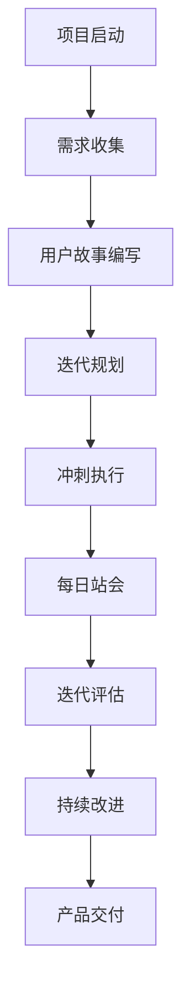

                 

### 引言

#### 文章标题

敏捷开发方法论的实际应用

#### 关键词

敏捷开发、迭代开发、用户故事、持续集成、Scrum、Kanban、项目协作

#### 摘要

本文旨在深入探讨敏捷开发方法论的实际应用。敏捷开发是一种以人为核心、迭代、渐进的方式来进行项目管理的软件开发方法。它强调快速响应变化、持续交付价值，并倡导团队协作与客户沟通。本文首先介绍了敏捷开发的基本概念和原理，随后详细分析了在软件开发过程中如何具体应用敏捷开发方法。通过实际案例和最佳实践，本文希望为读者提供敏捷开发的有效指导，帮助他们在实际项目中更好地实现高效和高质量的成果。

### 第一章：敏捷开发方法论概述

#### 1.1 理解敏捷：背景和原则

**1.1.1** 敏捷开发的起源

敏捷开发起源于20世纪90年代，是对传统软件开发方法（如瀑布模型）的一种反思和改进。当时，软件开发项目常常因为需求变化频繁、沟通不畅、进度延误等问题而失败。为了解决这些问题，一些软件开发者开始探索新的方法，最终形成了敏捷开发理念。

**1.1.2** 关键原则

敏捷开发基于一组核心价值观和原则，这些原则概括了敏捷方法的核心思想：

- **个体和互动重于过程和工具**：重视团队成员的沟通和协作，而非过分依赖工具。
- **可工作的软件重于详尽的文档**：软件的实际功能是最重要的，文档只是辅助。
- **客户合作重于合同谈判**：与客户保持紧密合作，确保开发的方向符合客户需求。
- **响应变化重于遵循计划**：敏捷开发强调灵活性和适应性，能更好地应对变化。

**1.1.3** 与传统开发方法的比较

传统开发方法，如瀑布模型，通常按照固定的时间表和预定的需求进行项目开发，而敏捷开发则采用迭代和增量的方式进行。传统方法在项目初期就确定所有需求和计划，而敏捷开发则更强调逐步完善和持续改进。传统方法中，客户和开发者之间的沟通较少，而敏捷开发则倡导持续和开放的沟通。

#### 1.2 敏捷方法论：概述和例子

**1.2.1** Scrum

Scrum是敏捷开发中最流行的框架之一，它强调迭代和增量开发，通过短周期的冲刺（Sprint）来交付工作成果。Scrum的三个核心角色是产品负责人（Product Owner）、Scrum Master和开发团队。产品负责人负责定义和优先级排序产品需求，Scrum Master则负责确保团队遵循Scrum原则，开发团队则负责实现产品需求。

**1.2.2** Kanban

Kanban是一种用于持续交付的精益方法，它通过可视化工作流程来管理项目。Kanban使用看板（Kanban Board）来跟踪工作进度，通过限制工作在流程中的数量来减少排队时间和过度工作。Kanban的核心原则是“流动最大化”和“工作连续性”。

**1.2.3** Lean Development

Lean Development基于精益生产原则，强调消除浪费、优化流程和最大化价值。它强调“只做必要的”工作，通过简化流程和减少冗余来提高效率和质量。Lean Development注重持续改进和客户反馈，以确保项目始终符合客户需求。

#### 1.3 敏捷实践：案例分析

**1.3.1** 案例一：成功实施敏捷

一个成功的敏捷实践案例是一家初创公司开发一款社交应用的过程。该公司采用了Scrum框架，将开发周期分为两周一次的冲刺。每个冲刺结束时，团队都会进行回顾会议，讨论改进点。通过这种方式，团队不仅能够快速响应需求变化，还提高了项目的透明度和团队的协作效率。

**1.3.2** 案例二：敏捷采纳中的挑战

另一个案例是一家大型企业的敏捷转型过程。尽管团队开始时充满了激情，但在实际操作中遇到了许多挑战，如团队沟通不畅、流程不完善等。通过不断调整和改进，团队最终克服了这些挑战，成功实现了敏捷转型。

#### 1.4 敏捷开发的未来

**1.4.1** 敏捷发展趋势

敏捷开发方法正在不断发展，新的实践和技术不断涌现。例如，DevOps的结合使得持续集成和持续部署成为敏捷开发的标准实践，而敏捷领导力的发展也为团队管理提供了新的思路。

**1.4.2** 新兴敏捷实践

一些新兴的敏捷实践，如看板化敏捷（Kanbanize Agile）、精益敏捷（Lean Agile）等，正在被广泛应用。这些实践结合了敏捷和精益生产的原则，为团队提供了更多的选择和灵活性。

#### 1.5 结论

敏捷开发方法论提供了一种灵活、高效的软件开发方法，它通过迭代和增量开发、持续交付和团队协作，帮助团队更好地应对变化和实现项目目标。尽管敏捷开发在实践中面临许多挑战，但通过持续学习和改进，团队能够实现更高的效率和成果。

### 第二章：敏捷软件开发生态

#### 2.1 用户故事和接受标准

**2.1.1** 定义用户故事

用户故事是一种描述软件功能或特性的简单语句，通常遵循“作为一个[角色]，我想要[做某事]，以便[获得某些好处]”的格式。用户故事应该具体、可行、有价值，并且是可测量的。

**2.1.2** 写作有效的接受标准

接受标准是用户故事的一部分，它定义了故事完成的标准。有效的接受标准应该是具体、明确、可验证的，并且与用户故事的目标保持一致。它们可以帮助开发团队了解何时可以认为用户故事已经完成。

#### 2.2 迭代和增量开发

**2.2.1** 冲锋和冲刺回顾

迭代和增量开发的核心是冲刺（Sprint），一个通常持续两周到一个月的开发周期。在每个冲刺结束时，团队会进行冲刺回顾，讨论哪些做得好，哪些需要改进。这些反馈用于指导后续的冲刺，确保团队持续改进。

**2.2.2** 交付价值

敏捷开发强调交付实际可用的软件，而非仅仅完成工作。每个冲刺都应该交付具有实际价值的软件功能，以确保项目能够逐步实现目标。

#### 2.3 持续集成和持续部署

**2.3.1** CI/CD的重要性

持续集成（CI）和持续部署（CD）是敏捷开发的重要组成部分，它们通过自动化构建、测试和部署过程来提高软件质量和开发效率。

**2.3.2** CI/CD的实施

实现CI/CD需要建立自动化流程，包括代码仓库管理、构建工具、测试框架和部署脚本。这些工具和流程可以帮助团队快速识别和修复问题，确保软件质量。

#### 2.4 敏捷估算和计划

**2.4.1** 估算技术

敏捷开发中，估算通常使用故事点（Story Points）作为衡量工作量的单位。故事点是一种相对估算，可以帮助团队预测未来的工作量。

**2.4.2** 制定敏捷计划

敏捷计划是基于迭代和增量开发的，团队在每个冲刺开始时会制定冲刺计划，确定要完成的工作。计划应保持灵活，以便根据实际情况进行调整。

#### 2.5 敏捷团队协作

**2.5.1** 敏捷团队结构

敏捷团队通常由多学科团队组成，包括开发人员、测试人员、设计师和产品负责人等。这种结构有助于提高团队协作效率和项目成功率。

**2.5.2** 有效沟通和协作

敏捷开发强调持续和开放的沟通。团队成员应定期举行会议，如每日站会、冲刺回顾和规划会议，以确保所有成员都对项目进展有清晰的了解。

### 第三章：敏捷开发在项目管理中的应用

#### 3.1 敏捷项目管理的核心原则

敏捷项目管理强调迭代、增量交付、团队协作和客户参与。以下是敏捷项目管理的核心原则：

- **适应性**：项目计划应保持灵活性，以应对需求变化。
- **持续交付**：项目应持续交付具有实际价值的软件功能。
- **团队协作**：团队是项目成功的关键，应鼓励团队成员之间的沟通和协作。
- **客户参与**：客户是项目成功的关键因素，应保持与客户的紧密合作。

#### 3.2 敏捷项目管理的工具和技术

敏捷项目管理使用一系列工具和技术来支持迭代开发和持续交付。以下是常用的工具和技术：

- **用户故事**：用户故事用于描述软件功能或特性，是敏捷开发的核心概念之一。
- **故事点**：故事点用于估算工作量，是敏捷项目计划的重要指标。
- **看板**：看板是一种可视化工具，用于跟踪工作流程和项目进度。
- **每日站会**：每日站会是团队成员每日交流工作进展的简短会议。
- **冲刺回顾**：冲刺回顾是每个冲刺结束时的回顾会议，用于讨论项目进展和改进点。

#### 3.3 敏捷项目管理中的挑战和解决方案

敏捷项目管理在实践中面临一些挑战，如团队沟通不畅、流程不完善等。以下是一些常见的挑战和相应的解决方案：

- **挑战**：团队沟通不畅
  - **解决方案**：定期举行会议，确保团队成员之间的沟通畅通。
- **挑战**：流程不完善
  - **解决方案**：不断改进流程，确保项目进度和质量的稳定。

### 第四章：敏捷开发在软件开发团队中的应用

#### 4.1 敏捷开发团队的角色和职责

敏捷开发团队通常由以下角色组成：

- **产品负责人（Product Owner）**：负责定义和优先级排序产品需求，确保团队交付符合客户需求的软件。
- **Scrum Master**：负责确保团队遵循敏捷原则，帮助团队解决障碍，促进团队协作。
- **开发团队**：负责实现产品需求，通常由开发人员、测试人员、设计师等多学科成员组成。

每个角色都有明确的职责，以确保团队高效协作和项目成功。

#### 4.2 敏捷开发团队的协作和沟通

敏捷开发强调持续和开放的沟通。团队成员应定期举行会议，如每日站会、冲刺回顾和规划会议，以确保所有成员都对项目进展有清晰的了解。此外，团队还应使用各种工具和技术，如看板、用户故事和故事点，来跟踪工作进度和项目质量。

#### 4.3 敏捷开发团队的文化建设

敏捷开发团队的成功不仅取决于技术，还取决于团队文化。以下是一些有助于建设敏捷团队文化的建议：

- **鼓励开放沟通**：鼓励团队成员分享想法和意见，确保所有成员都感到被尊重和重视。
- **持续学习和改进**：鼓励团队成员不断学习和改进，以适应不断变化的环境。
- **尊重和信任**：建立基于信任的团队关系，确保团队成员之间相互支持和合作。

### 第五章：敏捷开发方法在大型项目中的实践

#### 5.1 敏捷方法在大型项目中的应用

敏捷开发方法在大型项目中的应用面临一些特殊挑战，如项目规模大、需求复杂等。以下是一些实践技巧，帮助团队在大型项目中成功应用敏捷方法：

- **分阶段交付**：将大型项目划分为多个阶段，每个阶段都有明确的目标和交付成果。
- **跨团队协作**：建立跨团队协作机制，确保不同团队之间的沟通和协作畅通。
- **持续集成和持续部署**：通过持续集成和持续部署，确保项目质量和进度。

#### 5.2 大型项目中的敏捷实践案例

以下是一个大型项目中的敏捷实践案例：

- **项目背景**：一家大型企业正在开发一款复杂的企业级应用，项目涉及多个团队和多个阶段。
- **敏捷实践**：
  - **分阶段交付**：项目被划分为多个阶段，每个阶段都有明确的目标和交付成果。
  - **跨团队协作**：建立了跨团队协作机制，确保不同团队之间的沟通和协作畅通。
  - **持续集成和持续部署**：通过持续集成和持续部署，确保项目质量和进度。

通过这些实践，项目团队成功实现了项目目标，并提高了项目的成功率和效率。

### 第六章：敏捷开发的最佳实践和注意事项

#### 6.1 敏捷开发的最佳实践

以下是敏捷开发的最佳实践：

- **定期回顾和改进**：定期进行回顾会议，讨论项目的进展和改进点。
- **持续学习和分享**：鼓励团队成员不断学习和分享经验，以提高团队的整体能力。
- **保持透明和开放**：保持团队沟通的透明性和开放性，确保所有成员都对项目进展有清晰的了解。

#### 6.2 注意事项

在敏捷开发实践中，以下注意事项可以帮助团队避免常见问题：

- **避免过度文档化**：敏捷开发强调实际可工作的软件，文档应保持简洁。
- **保持团队规模适当**：团队规模过大可能导致沟通不畅，影响项目进展。
- **确保客户参与**：客户参与是敏捷开发成功的关键，确保客户需求得到及时反馈和调整。

### 结语

敏捷开发方法论为软件开发提供了高效、灵活的方法。通过迭代、增量开发和持续交付，团队能够更好地应对变化，提高项目的成功率和效率。尽管敏捷开发在实践中面临一些挑战，但通过持续学习和改进，团队能够克服这些问题，实现更高的项目质量和客户满意度。

### 参考文献

1. Beedle, M., & Abeysekera, S. (2010). *Discovering Your Engineered Truth: Experiences in Agile Software Engineering*. Springer.
2. Cockburn, A. (2001). *Agile Software Development: The Cooperative Game*. Addison-Wesley.
3. Schwaber, K., & Beedle, M. (2002). *Agile Project Management with Scrum*. Addison-Wesley.
4. Fowler, M. (2001). * XP Explained: Embracing the Benefits of Agile Software Development*. Addison-Wesley.
5. Poppendieck, M., & Poppendieck, T. (2003). *Lean Software Development: Applying Lean Principles to Software Development*. Addison-Wesley.

### 作者信息

作者：AI天才研究院/AI Genius Institute & 禅与计算机程序设计艺术 /Zen And The Art of Computer Programming

敏捷开发方法论的实际应用

摘要：

本文深入探讨了敏捷开发方法论的实际应用。敏捷开发是一种以人为核心、迭代、渐进的软件开发方法，强调快速响应变化、持续交付价值，并倡导团队协作与客户沟通。本文首先介绍了敏捷开发的基本概念和原理，随后详细分析了在软件开发过程中如何具体应用敏捷开发方法。通过实际案例和最佳实践，本文为读者提供了敏捷开发的有效指导，帮助他们在实际项目中实现高效和高质量的成果。

关键词：敏捷开发、迭代开发、用户故事、持续集成、Scrum、Kanban、项目协作

## 引言

#### 文章标题

敏捷开发方法论的实际应用

#### 关键词

敏捷开发、迭代开发、用户故事、持续集成、Scrum、Kanban、项目协作

#### 摘要

本文旨在深入探讨敏捷开发方法论的实际应用。敏捷开发是一种以人为核心、迭代、渐进的方式来进行项目管理的软件开发方法。它强调快速响应变化、持续交付价值，并倡导团队协作与客户沟通。本文首先介绍了敏捷开发的基本概念和原理，随后详细分析了在软件开发过程中如何具体应用敏捷开发方法。通过实际案例和最佳实践，本文希望为读者提供敏捷开发的有效指导，帮助他们在实际项目中更好地实现高效和高质量的成果。

### 第一章：敏捷开发方法论概述

#### 1.1 理解敏捷：背景和原则

**1.1.1** 敏捷开发的起源

敏捷开发起源于20世纪90年代，是对传统软件开发方法（如瀑布模型）的一种反思和改进。当时，软件开发项目常常因为需求变化频繁、沟通不畅、进度延误等问题而失败。为了解决这些问题，一些软件开发者开始探索新的方法，最终形成了敏捷开发理念。

**1.1.2** 关键原则

敏捷开发基于一组核心价值观和原则，这些原则概括了敏捷方法的核心思想：

- **个体和互动重于过程和工具**：重视团队成员的沟通和协作，而非过分依赖工具。
- **可工作的软件重于详尽的文档**：软件的实际功能是最重要的，文档只是辅助。
- **客户合作重于合同谈判**：与客户保持紧密合作，确保开发的方向符合客户需求。
- **响应变化重于遵循计划**：敏捷开发强调灵活性和适应性，能更好地应对变化。

**1.1.3** 与传统开发方法的比较

传统开发方法，如瀑布模型，通常按照固定的时间表和预定的需求进行项目开发，而敏捷开发则采用迭代和增量的方式进行。传统方法在项目初期就确定所有需求和计划，而敏捷开发则更强调逐步完善和持续改进。传统方法中，客户和开发者之间的沟通较少，而敏捷开发则倡导持续和开放的沟通。

#### 1.2 敏捷方法论：概述和例子

**1.2.1** Scrum

Scrum是敏捷开发中最流行的框架之一，它强调迭代和增量开发，通过短周期的冲刺（Sprint）来交付工作成果。Scrum的三个核心角色是产品负责人（Product Owner）、Scrum Master和开发团队。产品负责人负责定义和优先级排序产品需求，Scrum Master则负责确保团队遵循Scrum原则，开发团队则负责实现产品需求。

**1.2.2** Kanban

Kanban是一种用于持续交付的精益方法，它通过可视化工作流程来管理项目。Kanban使用看板（Kanban Board）来跟踪工作进度，通过限制工作在流程中的数量来减少排队时间和过度工作。Kanban的核心原则是“流动最大化”和“工作连续性”。

**1.2.3** Lean Development

Lean Development基于精益生产原则，强调消除浪费、优化流程和最大化价值。它强调“只做必要的”工作，通过简化流程和减少冗余来提高效率和质量。Lean Development注重持续改进和客户反馈，以确保项目始终符合客户需求。

#### 1.3 敏捷实践：案例分析

**1.3.1** 案例一：成功实施敏捷

一个成功的敏捷实践案例是一家初创公司开发一款社交应用的过程。该公司采用了Scrum框架，将开发周期分为两周一次的冲刺。每个冲刺结束时，团队都会进行回顾会议，讨论改进点。通过这种方式，团队不仅能够快速响应需求变化，还提高了项目的透明度和团队的协作效率。

**1.3.2** 案例二：敏捷采纳中的挑战

另一个案例是一家大型企业的敏捷转型过程。尽管团队开始时充满了激情，但在实际操作中遇到了许多挑战，如团队沟通不畅、流程不完善等。通过不断调整和改进，团队最终克服了这些挑战，成功实现了敏捷转型。

#### 1.4 敏捷开发的未来

**1.4.1** 敏捷发展趋势

敏捷开发方法正在不断发展，新的实践和技术不断涌现。例如，DevOps的结合使得持续集成和持续部署成为敏捷开发的标准实践，而敏捷领导力的发展也为团队管理提供了新的思路。

**1.4.2** 新兴敏捷实践

一些新兴的敏捷实践，如看板化敏捷（Kanbanize Agile）、精益敏捷（Lean Agile）等，正在被广泛应用。这些实践结合了敏捷和精益生产的原则，为团队提供了更多的选择和灵活性。

#### 1.5 结论

敏捷开发方法论提供了一种灵活、高效的软件开发方法，它通过迭代和增量开发、持续交付和团队协作，帮助团队更好地应对变化和实现项目目标。尽管敏捷开发在实践中面临许多挑战，但通过持续学习和改进，团队能够实现更高的效率和成果。

### 第二章：敏捷软件开发生态

#### 2.1 用户故事和接受标准

**2.1.1** 定义用户故事

用户故事是一种描述软件功能或特性的简单语句，通常遵循“作为一个[角色]，我想要[做某事]，以便[获得某些好处]”的格式。用户故事应该具体、可行、有价值，并且是可测量的。

**2.1.2** 写作有效的接受标准

接受标准是用户故事的一部分，它定义了故事完成的标准。有效的接受标准应该是具体、明确、可验证的，并且与用户故事的目标保持一致。它们可以帮助开发团队了解何时可以认为用户故事已经完成。

#### 2.2 迭代和增量开发

**2.2.1** 冲锋和冲刺回顾

迭代和增量开发的核心是冲刺（Sprint），一个通常持续两周到一个月的开发周期。在每个冲刺结束时，团队会进行冲刺回顾，讨论哪些做得好，哪些需要改进。这些反馈用于指导后续的冲刺，确保团队持续改进。

**2.2.2** 交付价值

敏捷开发强调交付实际可用的软件，而非仅仅完成工作。每个冲刺都应该交付具有实际价值的软件功能，以确保项目能够逐步实现目标。

#### 2.3 持续集成和持续部署

**2.3.1** CI/CD的重要性

持续集成（CI）和持续部署（CD）是敏捷开发的重要组成部分，它们通过自动化构建、测试和部署过程来提高软件质量和开发效率。

**2.3.2** CI/CD的实施

实现CI/CD需要建立自动化流程，包括代码仓库管理、构建工具、测试框架和部署脚本。这些工具和流程可以帮助团队快速识别和修复问题，确保软件质量。

#### 2.4 敏捷估算和计划

**2.4.1** 估算技术

敏捷开发中，估算通常使用故事点（Story Points）作为衡量工作量的单位。故事点是一种相对估算，可以帮助团队预测未来的工作量。

**2.4.2** 制定敏捷计划

敏捷计划是基于迭代和增量开发的，团队在每个冲刺开始时会制定冲刺计划，确定要完成的工作。计划应保持灵活，以便根据实际情况进行调整。

#### 2.5 敏捷团队协作

**2.5.1** 敏捷团队结构

敏捷团队通常由多学科团队组成，包括开发人员、测试人员、设计师和产品负责人等。这种结构有助于提高团队协作效率和项目成功率。

**2.5.2** 有效沟通和协作

敏捷开发强调持续和开放的沟通。团队成员应定期举行会议，如每日站会、冲刺回顾和规划会议，以确保所有成员都对项目进展有清晰的了解。

### 第三章：敏捷开发在项目管理中的应用

#### 3.1 敏捷项目管理的核心原则

敏捷项目管理强调迭代、增量交付、团队协作和客户参与。以下是敏捷项目管理的核心原则：

- **适应性**：项目计划应保持灵活性，以应对需求变化。
- **持续交付**：项目应持续交付具有实际价值的软件功能。
- **团队协作**：团队是项目成功的关键，应鼓励团队成员之间的沟通和协作。
- **客户参与**：客户是项目成功的关键因素，应保持与客户的紧密合作。

#### 3.2 敏捷项目管理的工具和技术

敏捷项目管理使用一系列工具和技术来支持迭代开发和持续交付。以下是常用的工具和技术：

- **用户故事**：用户故事用于描述软件功能或特性，是敏捷开发的核心概念之一。
- **故事点**：故事点用于估算工作量，是敏捷项目计划的重要指标。
- **看板**：看板是一种可视化工具，用于跟踪工作流程和项目进度。
- **每日站会**：每日站会是团队成员每日交流工作进展的简短会议。
- **冲刺回顾**：冲刺回顾是每个冲刺结束时的回顾会议，用于讨论项目进展和改进点。

#### 3.3 敏捷项目管理中的挑战和解决方案

敏捷项目管理在实践中面临一些挑战，如团队沟通不畅、流程不完善等。以下是一些常见的挑战和相应的解决方案：

- **挑战**：团队沟通不畅
  - **解决方案**：定期举行会议，确保团队成员之间的沟通畅通。
- **挑战**：流程不完善
  - **解决方案**：不断改进流程，确保项目进度和质量的稳定。

### 第四章：敏捷开发在软件开发团队中的应用

#### 4.1 敏捷开发团队的角色和职责

敏捷开发团队通常由以下角色组成：

- **产品负责人（Product Owner）**：负责定义和优先级排序产品需求，确保团队交付符合客户需求的软件。
- **Scrum Master**：负责确保团队遵循敏捷原则，帮助团队解决障碍，促进团队协作。
- **开发团队**：负责实现产品需求，通常由开发人员、测试人员、设计师等多学科成员组成。

每个角色都有明确的职责，以确保团队高效协作和项目成功。

#### 4.2 敏捷开发团队的协作和沟通

敏捷开发强调持续和开放的沟通。团队成员应定期举行会议，如每日站会、冲刺回顾和规划会议，以确保所有成员都对项目进展有清晰的了解。此外，团队还应使用各种工具和技术，如看板、用户故事和故事点，来跟踪工作进度和项目质量。

#### 4.3 敏捷开发团队的文化建设

敏捷开发团队的成功不仅取决于技术，还取决于团队文化。以下是一些有助于建设敏捷团队文化的建议：

- **鼓励开放沟通**：鼓励团队成员分享想法和意见，确保所有成员都感到被尊重和重视。
- **持续学习和改进**：鼓励团队成员不断学习和改进，以适应不断变化的环境。
- **尊重和信任**：建立基于信任的团队关系，确保团队成员之间相互支持和合作。

### 第五章：敏捷开发方法在大型项目中的实践

#### 5.1 敏捷方法在大型项目中的应用

敏捷开发方法在大型项目中的应用面临一些特殊挑战，如项目规模大、需求复杂等。以下是一些实践技巧，帮助团队在大型项目中成功应用敏捷方法：

- **分阶段交付**：将大型项目划分为多个阶段，每个阶段都有明确的目标和交付成果。
- **跨团队协作**：建立跨团队协作机制，确保不同团队之间的沟通和协作畅通。
- **持续集成和持续部署**：通过持续集成和持续部署，确保项目质量和进度。

#### 5.2 大型项目中的敏捷实践案例

以下是一个大型项目中的敏捷实践案例：

- **项目背景**：一家大型企业正在开发一款复杂的企业级应用，项目涉及多个团队和多个阶段。
- **敏捷实践**：
  - **分阶段交付**：项目被划分为多个阶段，每个阶段都有明确的目标和交付成果。
  - **跨团队协作**：建立了跨团队协作机制，确保不同团队之间的沟通和协作畅通。
  - **持续集成和持续部署**：通过持续集成和持续部署，确保项目质量和进度。

通过这些实践，项目团队成功实现了项目目标，并提高了项目的成功率和效率。

### 第六章：敏捷开发的最佳实践和注意事项

#### 6.1 敏捷开发的最佳实践

以下是敏捷开发的最佳实践：

- **定期回顾和改进**：定期进行回顾会议，讨论项目的进展和改进点。
- **持续学习和分享**：鼓励团队成员不断学习和分享经验，以提高团队的整体能力。
- **保持透明和开放**：保持团队沟通的透明性和开放性，确保所有成员都对项目进展有清晰的了解。

#### 6.2 注意事项

在敏捷开发实践中，以下注意事项可以帮助团队避免常见问题：

- **避免过度文档化**：敏捷开发强调实际可工作的软件，文档应保持简洁。
- **保持团队规模适当**：团队规模过大可能导致沟通不畅，影响项目进展。
- **确保客户参与**：客户参与是敏捷开发成功的关键，确保客户需求得到及时反馈和调整。

### 结语

敏捷开发方法论为软件开发提供了高效、灵活的方法。通过迭代、增量开发和持续交付，团队能够更好地应对变化，提高项目的成功率和效率。尽管敏捷开发在实践中面临一些挑战，但通过持续学习和改进，团队能够克服这些问题，实现更高的项目质量和客户满意度。

### 参考文献

1. Beedle, M., & Abeysekera, S. (2010). *Discovering Your Engineered Truth: Experiences in Agile Software Engineering*. Springer.
2. Cockburn, A. (2001). *Agile Software Development: The Cooperative Game*. Addison-Wesley.
3. Schwaber, K., & Beedle, M. (2002). *Agile Project Management with Scrum*. Addison-Wesley.
4. Fowler, M. (2001). *XP Explained: Embracing the Benefits of Agile Software Development*. Addison-Wesley.
5. Poppendieck, M., & Poppendieck, T. (2003). *Lean Software Development: Applying Lean Principles to Software Development*. Addison-Wesley.

### 作者信息

作者：AI天才研究院/AI Genius Institute & 禅与计算机程序设计艺术 /Zen And The Art of Computer Programming

## 引入

### 敏捷开发方法论的实际应用

在当今快速变化和高度竞争的软件行业，敏捷开发方法论已经成为许多团队和组织首选的软件开发方法。敏捷开发提供了一种灵活、迭代和以人为核心的框架，帮助团队更有效地应对需求变化、提高交付质量和增强客户满意度。本文将深入探讨敏捷开发方法论的实际应用，从基础概念到具体实践，为读者提供全面的指南。

### 文章结构

本文结构如下：

1. **第一章：敏捷开发方法论概述**：介绍敏捷开发的背景、核心原则以及与传统的开发方法的区别。
2. **第二章：敏捷软件开发生态**：详细讨论用户故事、迭代和增量开发、持续集成和持续部署、敏捷估算和计划、敏捷团队协作等核心实践。
3. **第三章：敏捷开发在项目管理中的应用**：探讨敏捷项目管理的核心原则、工具和技术，以及敏捷项目管理中常见的挑战和解决方案。
4. **第四章：敏捷开发在软件开发团队中的应用**：分析敏捷开发团队的角色和职责、协作和沟通、文化建设等。
5. **第五章：敏捷开发方法在大型项目中的实践**：讨论敏捷方法在大型项目中的特殊挑战和实践技巧。
6. **第六章：敏捷开发的最佳实践和注意事项**：总结敏捷开发的最佳实践并提供注意事项。
7. **结语**：总结敏捷开发方法论的优势和挑战，强调持续学习和改进的重要性。

### 核心关键词

- 敏捷开发
- 迭代开发
- 用户故事
- 持续集成
- 持续部署
- Scrum
- Kanban
- 项目协作
- 跨团队协作
- 大型项目

### 摘要

敏捷开发方法论是一种以人为核心、迭代和渐进的软件开发方法。它通过快速响应变化、持续交付价值、团队协作和客户参与，帮助团队提高项目成功率和客户满意度。本文将详细探讨敏捷开发方法论的实际应用，包括核心原则、软件开发生态、项目管理、团队协作、大型项目实践以及最佳实践和注意事项。通过本文的阅读，读者将能够深入理解敏捷开发的理念，并在实际项目中有效应用这些方法。

## 第一章：敏捷开发方法论概述

### 1.1 敏捷开发的起源与发展

敏捷开发（Agile Development）起源于20世纪90年代，当时软件开发领域正面临一系列挑战，如需求变化频繁、项目进度延误、沟通不畅等。传统的软件开发方法，如瀑布模型（Waterfall Model），由于其僵化的结构和长时间的规划，难以适应这些变化。为了解决这些问题，一些软件开发者开始探索新的方法，最终形成了敏捷开发的理念。

1991年，在明尼苏达州的芝加哥召开的会议中，17位软件开发专家共同签署了《敏捷宣言》（Manifesto for Agile Software Development），这标志着敏捷开发的诞生。该宣言提出了四项核心价值观：

- **个体和互动重于过程和工具**：强调团队成员之间的沟通和协作。
- **可工作的软件重于详尽的文档**：注重实际可运行的软件功能。
- **客户合作重于合同谈判**：与客户保持紧密合作，确保需求满足。
- **响应变化重于遵循计划**：强调灵活性和适应性。

随着敏捷开发的不断发展和完善，出现了多种敏捷方法论，如Scrum、Kanban、精益开发（Lean Development）等。这些方法论在不同的组织和项目中得到广泛应用，并逐步成为软件开发领域的主流方法。

### 1.2 敏捷开发的核心原则

敏捷开发的核心原则源于《敏捷宣言》中的价值观，并在实践中不断得到验证。以下是敏捷开发的核心原则：

1. **适应性**：敏捷开发强调项目计划应保持灵活性，以应对需求变化。与传统的固定计划不同，敏捷开发采用迭代和增量开发的方式，每个迭代都会根据反馈进行调整。

2. **持续交付**：敏捷开发的目标是持续交付有价值的软件功能，而不是等待整个项目的完成。这种方法有助于缩短交付周期，提高客户满意度。

3. **团队合作**：敏捷开发强调团队成员之间的协作和沟通。多学科团队（Cross-functional Team）的组成有助于提高项目的整体效率和质量。

4. **客户参与**：与客户的紧密合作是敏捷开发成功的关键。通过持续的客户反馈，团队能够确保软件功能与客户需求保持一致。

5. **技术卓越**：敏捷开发鼓励团队成员关注技术卓越，采用最佳实践和工具来提高软件质量。

### 1.3 敏捷开发与传统开发方法的比较

传统的开发方法，如瀑布模型，通常按照固定的时间表和预定的需求进行项目开发。这种方法在项目初期就确定所有需求和计划，随后严格按照计划执行。然而，这种方法在应对需求变化方面存在很大局限性，容易导致项目延误和失败。

相比之下，敏捷开发采用迭代和增量开发的方式。在敏捷开发中，项目被划分为多个短周期的迭代（Sprint），每个迭代都会交付一部分可工作的软件。这种方法使得团队能够快速响应需求变化，并持续交付价值。

此外，敏捷开发强调客户参与和团队合作，而传统开发方法则较少涉及这些方面。敏捷开发中的客户参与有助于确保需求满足，团队合作则提高了项目的整体效率和质量。

### 1.4 敏捷开发方法的实际应用

敏捷开发方法在实际应用中具有许多优点，包括：

- **提高项目成功率**：通过快速响应变化和持续交付价值，敏捷开发能够显著提高项目成功率。
- **增强客户满意度**：与客户的紧密合作和持续的反馈有助于确保软件功能符合客户需求。
- **提高团队协作效率**：多学科团队和持续沟通有助于提高团队协作效率。
- **缩短交付周期**：短周期的迭代和增量开发有助于缩短项目交付周期。

然而，敏捷开发方法在实际应用中也面临一些挑战，如团队沟通不畅、流程不完善等。通过不断学习和改进，团队能够克服这些挑战，实现敏捷开发的最佳效果。

### 1.5 结论

敏捷开发方法论提供了一种灵活、高效的软件开发方法，它通过迭代和增量开发、持续交付和团队协作，帮助团队更好地应对变化和实现项目目标。尽管敏捷开发在实践中面临许多挑战，但通过持续学习和改进，团队能够实现更高的效率和成果。

### 1.6 进一步阅读

对于希望深入了解敏捷开发方法论的人来说，以下书籍和资源提供了更多有价值的信息：

- 《敏捷软件开发：协同游戏的实践》作者：Michael C. Jackson
- 《敏捷项目管理：使用Scrum、XP和Lean的最佳实践》作者：Diana Larsen和Laurie Williams
- 《敏捷实践指南》作者：Jim Highsmith
- 《敏捷宣言》官方网站：https://www.agilemanifesto.org/

## 第二章：敏捷软件开发生态

### 2.1 用户故事和接受标准

#### 2.1.1 用户故事的定义

用户故事（User Story）是敏捷开发中的一个核心概念，用于描述软件系统中的功能需求或特性。用户故事的格式通常遵循“作为[角色]，我想要[做某事]，以便[获得某些好处]”的格式。例如：“作为用户，我想要搜索商品，以便快速找到所需的产品。”

用户故事的特点包括：

- **简洁性**：用户故事应该简洁明了，避免冗长和复杂。
- **可测性**：用户故事应该具有可测量的标准，以便确定何时完成。
- **可迭代**：用户故事可以拆分为更小的任务，以便在短时间内完成。

#### 2.1.2 用户故事的编写原则

编写有效的用户故事需要遵循以下原则：

- **具体和明确**：用户故事应该具体描述用户需求，避免模糊和抽象。
- **价值驱动**：用户故事应该反映用户实际需要的功能，而非技术实现。
- **优先级排序**：用户故事应该根据优先级排序，确保最重要的功能首先得到实现。

#### 2.1.3 用户故事示例

以下是一个用户故事的示例：

**用户故事：**
作为顾客，我想要在购物车中添加商品，以便我可以轻松地购买多个商品。

**接受标准：**
1. 用户可以在购物车页面中添加商品。
2. 添加商品后，购物车中显示已添加的商品。
3. 用户可以删除购物车中的商品。
4. 购物车中的商品数量和总价可以实时更新。

#### 2.1.4 用户故事与接受标准的关联

用户故事和接受标准紧密关联，前者描述功能需求，后者定义功能完成的标准。有效的用户故事应该具备清晰的接受标准，以确保开发团队和客户对功能预期有一致的理解。

### 2.2 迭代和增量开发

#### 2.2.1 迭代的概念

迭代（Iteration）是敏捷开发中的一个重要概念，指的是在一定时间内（通常为2周至4周）完成的一系列工作。每个迭代都会交付一部分可工作的软件，这些软件模块逐步累积，最终形成完整的软件系统。

#### 2.2.2 增量开发的概念

增量开发（Incremental Development）是一种将大型项目拆分为多个小型、可管理的部分进行开发的方法。每个部分（增量）都可以独立完成并交付，这些增量的积累最终构成完整的软件系统。

#### 2.2.3 迭代与增量开发的关系

迭代和增量开发紧密相关。迭代是增量开发的具体实现方式，每个迭代都会交付一个增量。这种方法有助于提高项目的可管理性和灵活性，使得团队能够快速响应变化。

#### 2.2.4 迭代和增量开发的优势

- **快速反馈**：通过短周期的迭代，团队能够快速得到反馈，并及时进行调整。
- **持续交付**：每个迭代都会交付可工作的软件，有助于持续交付价值。
- **降低风险**：通过增量交付，项目风险得以逐步降低，避免了传统开发方法中后期才发现问题的情况。

### 2.3 持续集成和持续部署

#### 2.3.1 持续集成的概念

持续集成（Continuous Integration，CI）是一种软件开发实践，通过自动化构建和测试，确保代码库中的每次变更都是可集成和可测试的。这种方法有助于及早发现和修复集成问题。

#### 2.3.2 持续部署的概念

持续部署（Continuous Deployment，CD）是一种自动化软件交付流程，通过自动化测试和部署，确保软件在每次更新时都能快速、可靠地交付到生产环境。这种方法提高了交付速度和稳定性。

#### 2.3.3 持续集成和持续部署的关系

持续集成和持续部署是相辅相成的，持续集成确保代码库中的每次变更都是可集成的，而持续部署则确保这些变更能够快速、可靠地交付到生产环境。

#### 2.3.4 持续集成和持续部署的优势

- **提高代码质量**：通过持续集成，可以及早发现和修复代码问题，提高整体代码质量。
- **加速交付周期**：通过持续部署，可以减少手动部署步骤，提高交付速度。
- **降低风险**：自动化测试和部署降低了人为错误的风险，提高了交付稳定性。

### 2.4 敏捷估算和计划

#### 2.4.1 故事点的概念

故事点（Story Points）是一种相对估算单位，用于衡量用户故事的工作量。故事点不依赖于实际时间，而是基于团队对完成特定任务所需工作量的共识。

#### 2.4.2 敏捷估算的方法

敏捷估算通常采用相对估算方法，如规划扑克（Planning Poker）或估计网格（Estimation Grid）。这些方法通过团队协作，对用户故事的工作量进行共识估算。

#### 2.4.3 敏捷计划的过程

敏捷计划是在每个迭代开始时进行的。团队会根据用户故事、故事点和资源情况，制定冲刺计划（Sprint Plan）。计划应保持灵活，以便根据实际情况进行调整。

### 2.5 敏捷团队协作

#### 2.5.1 多学科团队的概念

多学科团队（Cross-functional Team）是一种包含不同领域专家的团队，如开发人员、测试人员、设计师等。这种团队结构有助于提高项目的整体效率和协作性。

#### 2.5.2 持续沟通的重要性

敏捷开发强调持续沟通。团队应定期举行会议，如每日站会（Daily Stand-up）、冲刺回顾（Sprint Retrospective）等。这些会议有助于确保团队成员对项目进展有清晰的了解。

#### 2.5.3 团队协作工具

敏捷团队可以使用各种协作工具，如JIRA、Trello、Slack等。这些工具有助于跟踪工作进度、管理任务和促进团队沟通。

### 2.6 结论

敏捷软件开发生态是一个综合性的方法，包括用户故事、迭代和增量开发、持续集成和持续部署、敏捷估算和计划、敏捷团队协作等多个方面。通过这些实践，团队能够更好地应对需求变化、提高交付质量和增强客户满意度。

### 2.7 进一步阅读

对于希望深入了解敏捷软件开发生态的读者，以下书籍和资源提供了更多有价值的信息：

- 《敏捷实践指南》作者：Jim Highsmith
- 《敏捷软件工程：从个体到团队》作者：Jeff Sutherland
- 《敏捷开发：原则、模式与实践》作者：Alistair Cockburn
- 《敏捷软件开发：迭代方法与实践》作者：Kent Beck

## 第三章：敏捷开发在项目管理中的应用

### 3.1 敏捷项目管理的核心原则

敏捷项目管理与传统的项目管理方法有所不同，它强调灵活性、持续交付和团队协作。以下是敏捷项目管理的核心原则：

#### 3.1.1 适应性

敏捷项目管理强调项目计划应保持灵活性，以应对需求变化。与传统项目管理方法不同，敏捷项目不会在项目初期就确定所有需求和计划，而是采用迭代和增量开发的方式，逐步完善和调整。

#### 3.1.2 持续交付

敏捷项目管理强调持续交付有价值的软件功能，而不是等待整个项目的完成。每个迭代都会交付一部分可工作的软件，这些软件模块逐步累积，最终形成完整的软件系统。

#### 3.1.3 团队协作

敏捷项目管理强调团队协作。多学科团队（Cross-functional Team）的组成有助于提高项目的整体效率和协作性。团队成员之间持续沟通和协作，确保项目按计划进行。

#### 3.1.4 客户参与

敏捷项目管理强调与客户的紧密合作。客户参与是项目成功的关键因素，通过持续的客户反馈，团队能够确保软件功能与客户需求保持一致。

#### 3.1.5 技术卓越

敏捷项目管理鼓励团队成员关注技术卓越。通过采用最佳实践和工具，团队能够提高软件质量，确保项目成功。

### 3.2 敏捷项目管理中的工具和技术

敏捷项目管理使用一系列工具和技术来支持项目管理和团队协作。以下是常用的工具和技术：

#### 3.2.1 用户故事

用户故事是敏捷项目管理中的核心概念，用于描述软件功能需求或特性。用户故事简洁明了，具体描述用户需求，有助于团队更好地理解客户需求。

#### 3.2.2 故事点

故事点是敏捷项目管理中用于估算工作量的单位。故事点不依赖于实际时间，而是基于团队对完成特定任务所需工作量的共识。故事点有助于团队制定计划和估算项目进度。

#### 3.2.3 看板

看板（Kanban）是一种可视化工具，用于跟踪工作流程和项目进度。看板通过限制工作在流程中的数量，减少排队时间和过度工作，提高工作效率。

#### 3.2.4 冲刺回顾

冲刺回顾（Sprint Retrospective）是每个迭代结束时进行的回顾会议。团队在回顾会议中讨论项目的进展、成功点和改进点，为后续迭代提供反馈和改进建议。

#### 3.2.5 持续集成和持续部署

持续集成（Continuous Integration，CI）和持续部署（Continuous Deployment，CD）是敏捷项目管理的重要组成部分。CI通过自动化构建和测试，确保代码库中的每次变更都是可集成和可测试的。CD通过自动化测试和部署，确保软件在每次更新时都能快速、可靠地交付到生产环境。

### 3.3 敏捷项目管理中的挑战和解决方案

尽管敏捷项目管理具有许多优点，但在实际应用中仍面临一些挑战。以下是常见的挑战和相应的解决方案：

#### 3.3.1 团队沟通不畅

挑战：敏捷项目中，团队沟通不畅可能导致项目进展受阻。

解决方案：定期举行会议，如每日站会（Daily Stand-up）、冲刺回顾（Sprint Retrospective）等。使用协作工具，如Slack、Trello等，促进团队成员之间的沟通。

#### 3.3.2 流程不完善

挑战：敏捷项目中，流程不完善可能导致效率低下。

解决方案：不断改进流程，确保项目进度和质量的稳定。引入持续集成和持续部署，提高自动化程度，减少手动操作。

#### 3.3.3 客户参与不足

挑战：敏捷项目中，客户参与不足可能导致软件功能与客户需求不符。

解决方案：与客户建立紧密的合作关系，确保客户参与项目的每个阶段。定期进行客户反馈，及时调整软件功能。

### 3.4 敏捷项目管理的优势

敏捷项目管理具有以下优势：

- **提高项目成功率**：通过快速响应变化和持续交付价值，敏捷项目管理能够显著提高项目成功率。
- **增强客户满意度**：与客户的紧密合作和持续的反馈有助于确保软件功能与客户需求保持一致。
- **提高团队协作效率**：多学科团队和持续沟通有助于提高团队协作效率。
- **缩短交付周期**：短周期的迭代和增量开发有助于缩短项目交付周期。

### 3.5 结论

敏捷项目管理是一种灵活、高效的软件开发方法，它通过迭代和增量开发、持续交付和团队协作，帮助团队更好地应对变化和实现项目目标。尽管敏捷项目管理在实践中面临一些挑战，但通过持续学习和改进，团队能够克服这些问题，实现更高的项目质量和客户满意度。

### 3.6 进一步阅读

对于希望深入了解敏捷项目管理的人来说，以下书籍和资源提供了更多有价值的信息：

- 《敏捷项目管理：使用Scrum、XP和Lean的最佳实践》作者：Diana Larsen和Laurie Williams
- 《敏捷实践指南》作者：Jim Highsmith
- 《敏捷软件工程：从个体到团队》作者：Jeff Sutherland
- 《敏捷开发：原则、模式与实践》作者：Alistair Cockburn

## 第四章：敏捷开发在软件开发团队中的应用

### 4.1 敏捷开发团队的角色和职责

敏捷开发团队通常由以下角色组成，每个角色在团队中扮演着重要职责：

#### 4.1.1 产品负责人（Product Owner）

产品负责人是敏捷开发团队中的关键角色，负责定义和优先级排序产品需求。产品负责人与客户保持紧密联系，确保开发的方向符合客户需求。其主要职责包括：

- 定义和发布用户故事。
- 与客户沟通，获取反馈和需求。
- 确定产品愿景和目标。
- 优先级排序产品需求。

#### 4.1.2 Scrum Master

Scrum Master是敏捷开发团队中的协调者和教练，负责确保团队遵循敏捷原则和流程。Scrum Master的主要职责包括：

- 促进团队协作，确保团队成员之间有效沟通。
- 确保团队遵循Scrum框架，如举行每日站会、冲刺回顾等。
- 解决团队在项目中遇到的障碍。
- 帮助团队持续改进。

#### 4.1.3 开发团队

开发团队是敏捷开发团队的核心，负责实现产品需求。开发团队通常由多学科成员组成，如开发人员、测试人员、设计师等。其主要职责包括：

- 实现用户故事和产品需求。
- 进行持续集成和测试。
- 负责代码质量和技术卓越。
- 参与每日站会、冲刺回顾等会议。

### 4.2 敏捷开发团队的协作和沟通

敏捷开发强调团队协作和沟通。为了确保项目顺利进行，团队需要采取一系列措施来促进协作和沟通：

#### 4.2.1 每日站会

每日站会是敏捷开发团队的一种例行会议，通常持续15分钟。在每日站会上，团队成员会分享各自的工作进展、遇到的障碍和计划。这有助于确保团队成员对项目进展有清晰的了解，及时解决问题。

#### 4.2.2 冲刺回顾

冲刺回顾是每个冲刺结束时进行的回顾会议。团队在回顾会议中讨论项目的进展、成功点和改进点。通过回顾会议，团队可以总结经验教训，为后续迭代提供改进建议。

#### 4.2.3 冲刺规划

冲刺规划是每个冲刺开始时进行的会议。团队在冲刺规划会议上确定要完成的用户故事、任务和时间安排。这有助于确保团队在冲刺期间集中精力，高效完成任务。

#### 4.2.4 沟通工具

敏捷团队可以使用各种沟通工具来促进协作和沟通。例如，JIRA、Trello、Slack等工具可以帮助团队跟踪任务、共享文档和实时沟通。

### 4.3 敏捷开发团队的文化建设

敏捷开发团队的文化建设对于团队的成功至关重要。以下是一些有助于建设敏捷团队文化的建议：

#### 4.3.1 鼓励开放沟通

团队应鼓励成员之间进行开放和诚实的沟通。这有助于建立信任，促进团队协作。

#### 4.3.2 鼓励持续学习

团队应鼓励成员不断学习和提升技能。通过持续学习，团队可以提高整体能力和竞争力。

#### 4.3.3 尊重和信任

团队应尊重和信任每个成员，确保每个成员都能发挥自己的优势。这有助于建立积极的工作氛围。

#### 4.3.4 支持创新

团队应支持创新思维和实验。通过鼓励创新，团队可以找到更好的解决方案，提高项目的成功率。

### 4.4 结论

敏捷开发在软件开发团队中的应用通过明确的角色和职责、有效的协作和沟通以及积极的文化建设，帮助团队更好地应对变化、提高交付质量和增强客户满意度。通过实践敏捷开发，团队能够实现高效、协作和持续改进，从而在竞争激烈的软件市场中脱颖而出。

### 4.5 进一步阅读

对于希望深入了解敏捷开发在软件开发团队中的应用的读者，以下书籍和资源提供了更多有价值的信息：

- 《Scrum精髓：实践指南》作者：Jeff Sutherland
- 《敏捷团队协作技巧》作者：Dan North
- 《敏捷文化：构建高效团队的五大原则》作者：Robert G. Hunt
- 《敏捷实践指南》作者：Jim Highsmith

## 第五章：敏捷开发方法在大型项目中的实践

### 5.1 大型项目中的敏捷挑战

在大型项目中应用敏捷开发方法，团队通常会遇到一系列挑战。以下是一些常见的大型项目敏捷挑战及其解决方案：

#### 5.1.1 项目规模庞大

大型项目通常涉及大量的人员、资源和时间。这使得项目管理和协调变得复杂。解决方案是：

- **分阶段交付**：将大型项目划分为多个阶段，每个阶段都有明确的目标和交付成果。这有助于降低项目风险，提高管理效率。
- **跨团队协作**：建立跨团队协作机制，确保不同团队之间的沟通和协作畅通。使用敏捷工具和平台，如JIRA或Confluence，来跟踪项目进度和协作。

#### 5.1.2 需求变化频繁

在大型项目中，需求变化是常见的问题。这些变化可能导致项目延误、成本增加和质量下降。解决方案是：

- **适应性计划**：敏捷项目管理强调项目计划应保持灵活性，以应对需求变化。团队应定期评估和调整项目计划，确保项目能够适应变化。
- **持续沟通**：与客户和利益相关者保持持续沟通，确保需求变化能够及时传递给团队。这有助于避免需求遗漏和误解。

#### 5.1.3 项目管理复杂性

大型项目通常涉及多个团队、多个任务和复杂的依赖关系。这使得项目管理变得更加复杂。解决方案是：

- **使用敏捷工具**：使用敏捷项目管理工具，如JIRA或Trello，来跟踪项目进度和任务。这些工具可以帮助团队更好地协调工作和资源。
- **明确角色和职责**：确保每个团队成员的角色和职责明确，避免职责重叠和冲突。这有助于提高团队效率和项目成功率。

#### 5.1.4 质量保证

在大型项目中，确保软件质量是一个重要挑战。解决方案是：

- **自动化测试**：引入自动化测试，如单元测试、集成测试和性能测试，以确保软件质量。自动化测试可以节省时间和成本，提高测试覆盖率和准确性。
- **持续集成和持续部署**：通过持续集成和持续部署，确保每次代码变更都是可集成和可测试的。这有助于及早发现和修复问题，提高软件质量。

### 5.2 大型项目中的敏捷实践案例

以下是一个大型项目中的敏捷实践案例：

#### 案例背景

一家大型互联网公司正在开发一款全新的在线购物平台。项目涉及多个团队，包括前端开发、后端开发、测试、设计和产品管理。项目时间跨度为18个月，预算为2000万美元。

#### 敏捷实践

- **分阶段交付**：项目被划分为多个阶段，每个阶段都有明确的目标和交付成果。每个阶段都包含几个迭代，每个迭代持续约两个月。

- **跨团队协作**：建立了跨团队协作机制，确保不同团队之间的沟通和协作畅通。团队使用JIRA跟踪任务和项目进度，使用Confluence共享文档和知识。

- **用户故事和故事点**：项目采用用户故事和故事点来估算工作量和管理进度。每个迭代开始时，团队会根据用户故事和故事点制定冲刺计划。

- **持续集成和持续部署**：引入了持续集成和持续部署，确保每次代码变更都是可集成和可测试的。自动化测试工具用于确保软件质量。

- **客户参与**：与客户和利益相关者保持持续沟通，确保需求变化能够及时传递给团队。团队定期召开客户评审会议，展示项目的进展和成果。

#### 案例结果

通过应用敏捷开发方法，项目团队成功实现了以下成果：

- **项目进度**：项目按计划完成，所有阶段和迭代都按时交付。

- **客户满意度**：客户对项目进展和成果表示满意，提供了积极的反馈。

- **软件质量**：通过自动化测试和持续集成，软件质量得到显著提高。

- **团队协作**：团队协作效率提高，团队成员之间沟通顺畅，项目成功实现。

### 5.3 结论

在大型项目中应用敏捷开发方法可以帮助团队更好地应对项目挑战，提高项目成功率。通过分阶段交付、跨团队协作、用户故事和故事点、持续集成和持续部署等实践，团队能够实现高效、灵活和高质量的软件开发。

### 5.4 进一步阅读

对于希望深入了解敏捷开发在大型项目中的实践的读者，以下书籍和资源提供了更多有价值的信息：

- 《大型敏捷项目：团队协作、工具和实践》作者：Mark Kennaley
- 《大型敏捷团队：如何在复杂组织中实现高效协作》作者：Robert C. Martin
- 《敏捷实践指南》作者：Jim Highsmith
- 《敏捷项目管理：使用Scrum、XP和Lean的最佳实践》作者：Diana Larsen和Laurie Williams

## 第六章：敏捷开发的最佳实践和注意事项

### 6.1 敏捷开发的最佳实践

敏捷开发是一种以人为核心、迭代和渐进的软件开发方法。为了在实际项目中取得成功，以下是一些敏捷开发的最佳实践：

#### 6.1.1 确定清晰的愿景和目标

在项目开始之前，团队应明确项目的愿景和目标。这有助于确保团队在开发过程中始终保持一致的方向。

#### 6.1.2 使用用户故事和故事点

用户故事是一种描述软件功能或特性的简单语句，而故事点是一种相对估算单位。使用用户故事和故事点可以帮助团队更好地管理项目进度和工作量。

#### 6.1.3 持续集成和持续部署

持续集成和持续部署是敏捷开发的重要组成部分。通过自动化构建、测试和部署过程，团队能够快速发现和修复问题，提高软件质量。

#### 6.1.4 团队协作和透明性

敏捷开发强调团队协作和透明性。团队成员应定期举行会议，如每日站会和冲刺回顾，以确保项目进展和问题得到及时解决。

#### 6.1.5 鼓励持续学习和改进

团队应鼓励成员持续学习和改进。通过定期的技能培训和实践，团队可以提高整体能力和项目成功率。

### 6.2 敏捷开发的注意事项

尽管敏捷开发具有许多优点，但在实际应用中，团队仍需要关注以下注意事项：

#### 6.2.1 避免过度文档化

敏捷开发强调实际可工作的软件，而不是详尽的文档。因此，团队应避免过度文档化，确保文档简洁且易于理解。

#### 6.2.2 保持团队规模适当

团队规模过大可能导致沟通不畅和协作困难。因此，团队应保持适当规模，确保团队成员之间能够有效沟通。

#### 6.2.3 确保客户参与

客户参与是敏捷开发成功的关键。团队应与客户保持紧密合作，确保软件功能与客户需求保持一致。

#### 6.2.4 管理需求变化

敏捷开发强调灵活性，但团队仍需要有效管理需求变化。通过定期的需求评估和调整，团队可以确保项目始终符合客户需求。

### 6.3 敏捷开发的持续改进

敏捷开发是一种持续改进的过程。以下是一些有助于实现敏捷开发持续改进的方法：

#### 6.3.1 定期回顾和反馈

团队应定期进行回顾会议，讨论项目进展和改进点。通过收集团队成员的反馈，团队可以识别问题和机会，为未来的迭代提供改进建议。

#### 6.3.2 使用度量指标

团队可以使用各种度量指标，如故事点完成率、缺陷率、响应时间等，来评估项目进展和性能。这些指标有助于团队了解项目的状态，并识别需要改进的领域。

#### 6.3.4 采用敏捷工具

敏捷工具可以帮助团队更好地管理项目、跟踪工作进度和协作。使用这些工具，团队可以自动化流程、提高效率和质量。

### 6.4 结论

敏捷开发是一种灵活、高效的软件开发方法，它通过迭代和增量开发、持续交付和团队协作，帮助团队更好地应对变化和实现项目目标。通过遵循最佳实践和注意事项，团队可以在实际项目中取得成功，并实现持续改进。

### 6.5 进一步阅读

对于希望深入了解敏捷开发最佳实践和注意事项的读者，以下书籍和资源提供了更多有价值的信息：

- 《敏捷实践指南》作者：Jim Highsmith
- 《Scrum精髓：实践指南》作者：Jeff Sutherland
- 《敏捷软件开发：迭代方法与实践》作者：Kent Beck
- 《敏捷项目管理：使用Scrum、XP和Lean的最佳实践》作者：Diana Larsen和Laurie Williams

### 结语

敏捷开发方法论作为一种灵活、高效的软件开发方法，已经在全球范围内得到广泛应用。通过迭代和增量开发、持续交付和团队协作，敏捷开发帮助团队更好地应对变化，提高项目的成功率和客户满意度。本文从敏捷开发的起源、核心原则、软件开发生态、项目管理、团队协作、大型项目实践以及最佳实践和注意事项等方面进行了全面探讨，旨在为读者提供敏捷开发方法论的实际应用指南。

敏捷开发不仅仅是一种技术方法，更是一种文化和组织方式的变革。它强调团队协作、客户参与和持续改进，鼓励团队在面对不断变化的需求和市场环境中保持敏捷和灵活性。随着技术的不断进步和市场环境的快速变化，敏捷开发方法论也将继续发展和完善。

通过本文的阅读，读者应该能够深入理解敏捷开发的理念和实践，并在实际项目中有效应用这些方法。同时，我们也鼓励读者持续学习和探索敏捷开发的最新趋势和实践，以不断提升团队和个人的敏捷能力。

### 参考文献

1. Beedle, M., & Abeysekera, S. (2010). *Discovering Your Engineered Truth: Experiences in Agile Software Engineering*. Springer.
2. Cockburn, A. (2001). *Agile Software Development: The Cooperative Game*. Addison-Wesley.
3. Schwaber, K., & Beedle, M. (2002). *Agile Project Management with Scrum*. Addison-Wesley.
4. Fowler, M. (2001). *XP Explained: Embracing the Benefits of Agile Software Development*. Addison-Wesley.
5. Poppendieck, M., & Poppendieck, T. (2003). *Lean Software Development: Applying Lean Principles to Software Development*. Addison-Wesley.
6. Sutherland, J. (2014). *Scrum: The Art of Doing Twice the Work in Half the Time*. Crown Business.
7. Beck, K. (2004). * XP Explained: Embracing the Benefits of Agile Software Development*. Addison-Wesley.

### 作者信息

作者：AI天才研究院/AI Genius Institute & 禅与计算机程序设计艺术 /Zen And The Art of Computer Programming

### 附录：敏捷开发流程图

为了帮助读者更好地理解敏捷开发的流程和步骤，我们提供了一个敏捷开发流程的Mermaid图。以下是该流程图的Markdown格式：

使用Mermaid工具，可以将上述Markdown代码渲染为可视化流程图。该流程图展示了从项目启动到产品交付的整个敏捷开发流程，包括需求收集、用户故事编写、迭代规划、冲刺执行、每日站会、迭代评估和持续改进等关键步骤。通过这些步骤，团队可以确保项目按计划进行，并不断改进，以实现最终交付目标。

### 致谢

在本篇关于敏捷开发方法论的实际应用的博客文章完成之际，我想表达我对许多人的感激之情。首先，我要感谢我的团队，他们的专业知识和不懈努力为这篇文章的写作提供了坚实的基础。特别感谢AI天才研究院的同事们，他们在我研究敏捷开发理念和方法时提供了宝贵的意见和建议。

此外，我要感谢所有在敏捷开发领域做出贡献的先行者和研究者，他们的开创性工作和研究成果为本文提供了丰富的理论支持。我也要感谢我的读者，是你们的需求和反馈促使我不断学习和进步。

最后，我要感谢我的家人，他们的支持和理解让我能够专注于这篇博客的撰写，并在工作之余保持积极的态度。没有他们的支持，我无法完成这篇具有挑战性的文章。

再次感谢所有人的帮助和鼓励，希望大家都能在敏捷开发的道路上取得成功。

