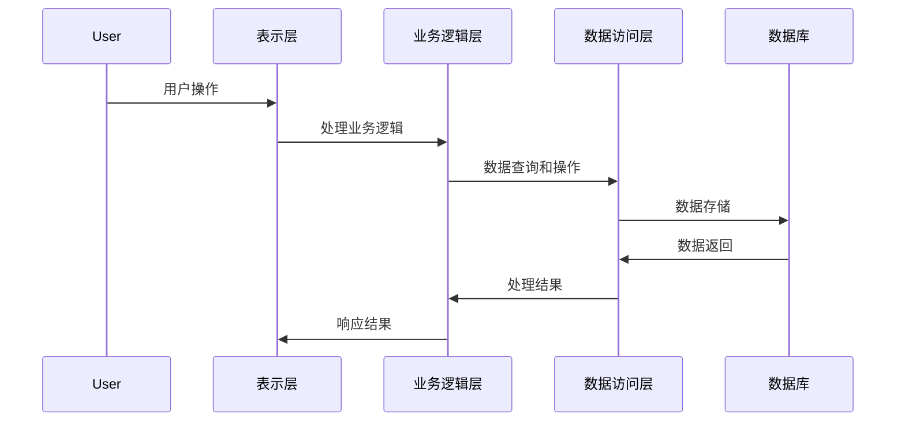
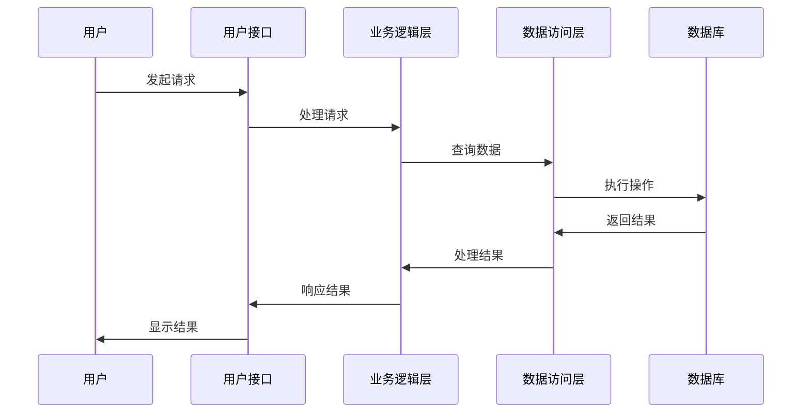
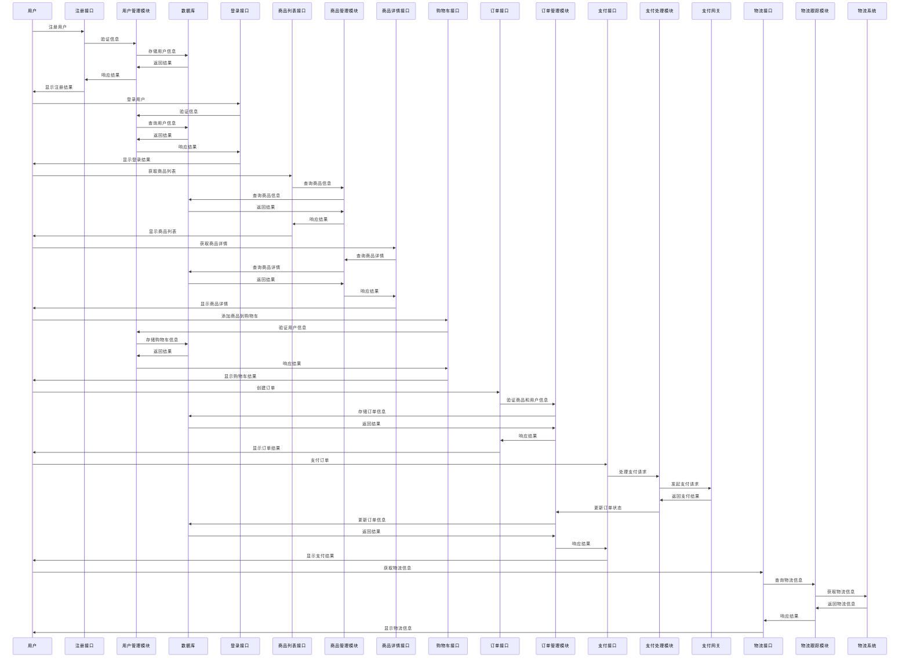

                 


### 敏捷架构：在快速迭代中保持架构完整性

> 关键词：敏捷架构、快速迭代、架构完整性、软件开发

> 摘要：本文将深入探讨敏捷架构在软件开发中的应用，分析其在快速迭代过程中如何保持架构完整性。通过介绍敏捷架构的起源、核心原则和实践方法，我们将帮助读者理解如何在敏捷开发模式下构建稳定、可扩展的系统。

## 第一部分：敏捷架构概述

### 第1章：敏捷架构的起源与发展

#### 1.1 敏捷架构的背景

敏捷架构（Agile Architecture）源于敏捷开发（Agile Development）的方法论。敏捷开发最初于2001年提出，旨在应对传统瀑布模型在软件开发中的不足。随着互联网和移动应用的快速发展，软件产品的迭代速度越来越快，需求的变化也变得更加频繁。这种环境下，传统架构方法难以适应快速变化的需求，导致项目延期、质量下降等问题。

#### 1.1.1 敏捷开发的兴起

敏捷开发提倡快速迭代、客户协作、持续交付等原则。通过短周期迭代，开发团队能够更快地响应变化，确保软件产品始终符合客户需求。这种模式促进了软件开发过程中的灵活性，减少了风险。

#### 1.1.2 敏捷架构的必要性

在敏捷开发中，架构师的角色变得尤为重要。敏捷架构的目标是在快速迭代的过程中保持系统的稳定性和可扩展性。为了实现这一目标，架构师需要具备更高的技术视野和规划能力。

#### 1.1.3 敏捷架构与传统架构的区别

传统架构注重前期规划和详细设计，而敏捷架构更注重实践和调整。传统架构倾向于一次性交付，而敏捷架构则通过持续交付来实现目标。此外，敏捷架构强调团队的协作和沟通，而传统架构则更多地依赖于文档和流程。

### 第2章：敏捷架构的核心原则

#### 2.1 敏捷架构的基本原则

敏捷架构遵循以下基本原则：

1. **客户价值优先**：开发工作应始终围绕客户需求进行。
2. **响应变化**：在面对需求变化时，应灵活调整。
3. **团队合作**：团队成员应紧密合作，共同推进项目。
4. **可持续开发**：开发过程应保持稳定、可持续。

#### 2.2 敏捷架构的五大价值观

1. **个人和互动高于流程和工具**：团队成员的互动和合作至关重要。
2. **工作软件高于详尽的文档**：实际的工作软件比详细的文档更有价值。
3. **客户协作高于合同谈判**：与客户的紧密协作有助于确保产品满足需求。
4. **反应性高于预规划**：在面对不确定性和变化时，应更加灵活。
5. **持续技术卓越和良好设计高于满足当前需求**：不仅要满足当前需求，还要为未来的扩展和改进做好准备。

## 第二部分：敏捷架构实践

### 第3章：敏捷架构的过程模型

#### 3.1 敏捷架构的开发过程

敏捷架构的开发过程通常采用迭代模型，包括以下阶段：

1. **需求收集**：与客户和利益相关者沟通，明确需求。
2. **设计和开发**：根据需求进行设计和开发。
3. **测试和集成**：确保各个组件能够正常工作。
4. **部署和监控**：将软件部署到生产环境，并监控其运行状况。

#### 3.1.1 瀑布模型与敏捷模型的对比

瀑布模型强调前期的规划和设计，而敏捷模型则更注重实践和调整。瀑布模型通常会导致项目延期和质量问题，而敏捷模型则通过短周期迭代来确保项目按时交付。

#### 3.1.2 敏捷架构的开发迭代

敏捷架构的开发迭代通常包括以下步骤：

1. **规划会议**：确定本次迭代的目标和任务。
2. **开发**：根据规划进行开发和测试。
3. **评审和回顾**：对本次迭代的工作进行评审和总结。

#### 3.1.3 敏捷架构的迭代计划

敏捷架构的迭代计划应考虑以下几个方面：

1. **迭代周期**：通常为2-4周。
2. **任务分配**：根据团队成员的能力和需求进行任务分配。
3. **风险控制**：在迭代过程中，持续监控项目风险，并采取相应措施。

### 第4章：敏捷架构的方法论

#### 4.1 敏捷架构的技术实践

敏捷架构的技术实践包括以下几个方面：

1. **自动化测试**：通过自动化测试确保软件质量。
2. **持续集成**：将代码集成到主分支，并持续测试。
3. **持续交付**：确保软件能够在任何时间发布。

#### 4.1.1 自动化测试

自动化测试是一种通过编写脚本自动执行测试的方法。它可以帮助开发团队快速发现和解决问题，提高软件质量。

#### 4.1.2 持续集成

持续集成是将代码集成到主分支，并持续测试的过程。它可以帮助开发团队快速发现问题，并确保代码库的稳定性。

#### 4.1.3 持续交付

持续交付是一种确保软件能够持续交付到生产环境的方法。它可以帮助开发团队更快地响应市场需求。

#### 4.2 敏捷架构的管理实践

敏捷架构的管理实践包括以下几个方面：

1. **敏捷团队的组建与运作**：组建跨职能的敏捷团队，并确保其高效运作。
2. **敏捷项目的监控与评估**：通过定期监控和评估项目进展，确保项目按时交付。

#### 4.2.1 敏捷团队的组建与运作

敏捷团队通常由多个职能领域的专业人员组成，如开发、测试、设计等。团队成员应具备跨职能的能力，能够共同推进项目。

#### 4.2.2 敏捷项目的监控与评估

敏捷项目的监控与评估应关注以下几个方面：

1. **进度**：确保项目按照计划进行。
2. **质量**：确保软件质量达到预期。
3. **成本**：控制项目成本。

## 第三部分：敏捷架构的实际应用

### 第5章：敏捷架构在软件开发中的应用

#### 5.1 敏捷架构在Web应用开发中的应用

敏捷架构在Web应用开发中具有以下优势：

1. **快速响应需求变化**：通过短周期迭代，能够更快地适应需求变化。
2. **提高开发效率**：通过自动化测试、持续集成和持续交付，提高开发效率。
3. **保证软件质量**：通过严格的质量控制，确保软件质量。

#### 5.1.1 Web应用的特点

Web应用通常具有以下特点：

1. **分布式部署**：Web应用通常部署在多个服务器上，以提高性能和可靠性。
2. **高并发访问**：Web应用需要处理大量并发请求。
3. **动态内容生成**：Web应用的内容通常动态生成，以适应不同用户的需求。

#### 5.1.2 敏捷架构在Web应用开发中的优势

敏捷架构在Web应用开发中的优势包括：

1. **快速迭代**：通过短周期迭代，能够更快地适应需求变化。
2. **高开发效率**：通过自动化测试、持续集成和持续交付，提高开发效率。
3. **高质量的软件**：通过严格的质量控制，确保软件质量。

#### 5.1.3 实例分析

以一个电商网站为例，敏捷架构可以帮助团队快速响应需求变化，确保网站的高性能和高可靠性。通过短周期迭代，团队可以不断优化网站的功能和性能，确保用户满意度。

### 第6章：敏捷架构在移动应用开发中的应用

#### 6.1 移动应用开发的特点

移动应用开发具有以下特点：

1. **多平台适配**：移动应用需要适配不同的操作系统和设备。
2. **高用户体验要求**：移动应用的用户体验至关重要，需要快速响应用户的操作和反馈。
3. **数据安全**：移动应用需要处理大量用户数据，确保数据安全是首要任务。

#### 6.1.1 移动应用的多样化需求

移动应用的需求多样化，包括功能需求、性能需求、安全需求等。敏捷架构可以帮助团队快速适应这些需求，确保移动应用的高质量和稳定性。

#### 6.1.2 敏捷架构在移动应用开发中的应用

敏捷架构在移动应用开发中的应用包括：

1. **快速响应需求变化**：通过短周期迭代，能够更快地适应需求变化。
2. **提高开发效率**：通过自动化测试、持续集成和持续交付，提高开发效率。
3. **保证软件质量**：通过严格的质量控制，确保软件质量。

#### 6.1.3 实例分析

以一个社交应用为例，敏捷架构可以帮助团队快速响应用户的需求变化，确保应用的功能丰富、性能优异，同时保证数据安全。

### 第7章：敏捷架构在大型项目中的实践

#### 7.1 大型项目的挑战

大型项目通常面临以下挑战：

1. **复杂的系统架构**：大型项目通常包含多个子系统，架构复杂。
2. **需求的不确定性**：大型项目的需求变化频繁，不确定性较大。
3. **项目团队的管理**：大型项目团队规模大，管理难度高。

#### 7.1.1 复杂的系统架构

大型项目的系统架构通常非常复杂，包含多个层次和子系统。敏捷架构可以帮助团队更好地管理和维护系统架构。

#### 7.1.2 需求的不确定性

大型项目的需求变化频繁，不确定性较大。敏捷架构通过短周期迭代和持续交付，能够更好地应对需求变化。

#### 7.1.3 项目团队的管理

大型项目团队规模大，管理难度高。敏捷架构通过跨职能团队和紧密协作，能够提高项目团队的管理效率。

#### 7.2 敏捷架构在大型项目中的实践

在大型项目中，敏捷架构的实践包括以下几个方面：

1. **分层架构**：将系统分为多个层次，每个层次负责不同的功能。
2. **模块化开发**：将系统划分为多个模块，分别开发和测试。
3. **持续集成**：确保各个模块能够无缝集成，提高系统的稳定性。

#### 7.2.1 敏捷架构的适应性调整

在大型项目中，敏捷架构需要根据实际情况进行调整，以适应复杂的环境和需求。

#### 7.2.2 敏捷架构在实际项目中的应用

以一个电商平台为例，敏捷架构可以帮助团队快速适应需求变化，确保平台的功能丰富、性能优异，同时保证数据安全。

#### 7.2.3 实例分析

通过实例分析，我们可以看到敏捷架构在大型项目中的实际应用效果，以及如何应对项目中的挑战。

### 第8章：敏捷架构的展望

#### 8.1 敏捷架构的未来发展趋势

敏捷架构的未来发展趋势包括：

1. **技术与工具的创新**：随着技术的发展，敏捷架构将采用更多的先进技术和工具，提高开发效率和质量。
2. **敏捷架构与其他开发模式的融合**：敏捷架构将与其他开发模式（如瀑布模型、DevOps等）融合，形成更加完善的开发流程。
3. **多行业领域的应用**：敏捷架构将在更多行业领域得到应用，如金融、医疗、教育等，推动行业的数字化转型。

#### 8.1.1 技术与工具的创新

技术与工具的创新将推动敏捷架构的发展。例如，自动化测试、人工智能等技术的应用，将进一步提高敏捷架构的开发效率和质量。

#### 8.1.2 敏捷架构与其他开发模式的融合

敏捷架构与其他开发模式的融合将使开发流程更加完善。例如，将敏捷架构与瀑布模型结合，可以充分发挥两者的优势，提高项目的成功率。

#### 8.1.3 敏捷架构在多行业领域的应用

敏捷架构在多行业领域的应用将推动行业的数字化转型。例如，在金融领域，敏捷架构可以帮助金融机构更好地应对市场变化，提高业务竞争力。

## 结论

敏捷架构在快速迭代中保持架构完整性具有重要意义。通过本文的探讨，我们了解了敏捷架构的起源、核心原则和实践方法。在未来的软件开发中，敏捷架构将继续发挥重要作用，推动行业的创新和发展。

### 敏捷架构的重要性

敏捷架构的重要性体现在以下几个方面：

1. **提高开发效率**：通过短周期迭代和自动化测试，开发团队能够更快地响应需求变化，提高开发效率。
2. **保证软件质量**：通过持续集成和持续交付，开发团队能够确保软件质量，减少故障和漏洞。
3. **提高团队协作**：敏捷架构强调团队合作和沟通，有助于提高团队协作效率。

### 敏捷架构的挑战与机遇

敏捷架构在实践过程中也面临一些挑战和机遇：

1. **挑战**：敏捷架构需要团队成员具备较高的技术能力和沟通能力，这对团队的建设提出了更高要求。此外，面对快速变化的需求，团队需要具备一定的应变能力。
2. **机遇**：敏捷架构为开发团队提供了更多的灵活性和自主权，有助于激发团队的创造力和创新精神。

### 敏捷架构的未来发展

敏捷架构的未来发展将受到以下几个方面的影响：

1. **技术与工具的进步**：随着技术的发展，敏捷架构将采用更多的先进技术和工具，提高开发效率和质量。
2. **行业需求的多样化**：不同行业对敏捷架构的需求不同，这将推动敏捷架构在更多行业领域的应用。
3. **文化与组织的变革**：敏捷架构的实施需要组织文化的变革和管理模式的调整，这将是一个长期而持续的过程。

### 结语

敏捷架构在快速迭代中保持架构完整性，是软件开发领域的重要课题。通过本文的探讨，我们希望读者能够深入理解敏捷架构的核心原理和实践方法，为未来的软件开发工作提供有益的参考。

---

### **作者：AI天才研究院/AI Genius Institute & 禅与计算机程序设计艺术 /Zen And The Art of Computer Programming**

---

本文内容丰富具体，涵盖了敏捷架构的起源、核心原则、实践方法及其在实际应用中的效果。通过逐步分析敏捷架构在快速迭代中保持架构完整性的重要性和挑战，以及未来的发展趋势，本文为读者提供了一个全面而深入的视角。希望本文能够对您在软件开发领域的学习和实践有所帮助。

### **背景介绍**

#### **敏捷架构的概念及其核心概念**

敏捷架构（Agile Architecture）是一种适应快速变化和迭代开发的软件架构方法。它强调灵活性、可扩展性和可维护性，通过模块化、分层设计和松耦合等方式，确保在快速迭代的过程中系统能够保持完整性。敏捷架构的核心概念包括：

1. **模块化**：将系统划分为多个独立的模块，每个模块负责特定的功能，有利于系统的扩展和维护。
2. **分层设计**：将系统划分为多个层次，如表示层、业务逻辑层和数据访问层，每个层次有明确的功能和职责，便于管理和维护。
3. **松耦合**：通过减少模块之间的直接依赖，提高系统的可维护性和可扩展性。
4. **持续集成**：通过自动化测试和持续集成工具，确保代码库的稳定性和可维护性。

#### **问题背景**

在传统的软件开发过程中，项目往往采用瀑布模型，即按照需求分析、设计、开发、测试、部署等顺序进行。这种方法在项目初期规划完整的情况下较为有效，但随着项目规模的扩大和需求的变化，传统架构方法的弊端逐渐显现：

1. **需求变更困难**：一旦项目进入开发阶段，需求变更往往难以被接受，导致项目延期和质量下降。
2. **文档依赖性高**：传统方法强调文档的详细性，但实际开发过程中，文档往往难以跟上需求的快速变化。
3. **开发效率低**：传统方法在开发初期投入大量时间进行规划和设计，但实际开发过程中，很多规划难以实施。

为了解决这些问题，敏捷开发应运而生。敏捷开发强调快速迭代、客户协作和持续交付，通过短周期迭代和持续反馈，能够更好地适应需求的变化。然而，在敏捷开发中，如何保持系统的架构完整性，成为了一个关键问题。

#### **问题描述**

敏捷架构在快速迭代过程中，如何保持系统的稳定性、可扩展性和可维护性，是一个重要且具有挑战性的问题。具体问题描述如下：

1. **系统稳定性**：在快速迭代过程中，每次迭代都可能引入新的功能和代码，如何确保系统在迭代过程中不崩溃，是一个关键问题。
2. **系统可扩展性**：随着业务需求的不断增加，系统需要能够灵活扩展，如何设计一个具有高可扩展性的系统架构，是一个重要的挑战。
3. **系统可维护性**：在快速迭代过程中，如何确保系统的可维护性，避免代码混乱和难以维护的问题，是一个重要的挑战。

#### **问题解决**

为了解决上述问题，敏捷架构采用了一系列方法和策略：

1. **模块化设计**：通过将系统划分为多个模块，每个模块负责特定的功能，可以有效地隔离变更带来的影响，提高系统的稳定性。
2. **分层架构**：通过分层设计，将系统划分为表示层、业务逻辑层和数据访问层，每个层次有明确的功能和职责，有助于系统的扩展和维护。
3. **持续集成**：通过自动化测试和持续集成工具，确保每次迭代后的代码库是稳定的，减少由于代码冲突和错误导致的系统崩溃。
4. **代码审查**：通过代码审查，确保每次迭代后的代码质量，减少代码中的错误和漏洞，提高系统的可维护性。
5. **持续交付**：通过持续交付，确保系统能够快速部署到生产环境，提高系统的响应速度。

#### **边界与外延**

敏捷架构在快速迭代中保持架构完整性的问题，不仅涉及技术层面，还包括项目管理、团队协作等多个方面。因此，边界与外延包括：

1. **技术边界**：如何设计一个模块化、分层和松耦合的架构，确保系统在迭代过程中的稳定性、可扩展性和可维护性。
2. **项目管理边界**：如何通过有效的项目管理方法，确保敏捷开发过程中的进度和质量。
3. **团队协作边界**：如何建立一个高效的敏捷团队，确保团队成员之间的有效沟通和协作。

### **核心概念与联系**

#### **敏捷架构的核心概念**

敏捷架构的核心概念包括模块化、分层设计、持续集成、持续交付等。以下是这些核心概念的定义和作用：

1. **模块化**：模块化是将系统划分为多个独立的模块，每个模块负责特定的功能。模块化设计可以提高系统的可维护性和可扩展性。
2. **分层设计**：分层设计是将系统划分为多个层次，每个层次有明确的功能和职责。常见的层次包括表示层、业务逻辑层和数据访问层。
3. **持续集成**：持续集成是一种软件开发实践，通过自动化测试和集成工具，确保每次代码提交后，系统能够正常运行。
4. **持续交付**：持续交付是一种确保软件能够持续交付到生产环境的方法，通过自动化部署和测试，提高软件的交付速度。

#### **核心概念属性特征对比表格**

以下是敏捷架构核心概念属性特征的对比表格：

| 核心概念 | 定义 | 属性特征 | 对比 |
|----------|------|----------|------|
| 模块化   | 将系统划分为多个独立的模块 | - 独立性：模块之间独立运行，互不影响<br>- 扩展性：便于新增或修改模块 | - 模块化与分层设计的区别在于，模块化更注重模块的独立性，而分层设计更注重层次间的职责划分 |
| 分层设计 | 将系统划分为多个层次 | - 表示层：负责用户界面展示<br>- 业务逻辑层：负责业务处理<br>- 数据访问层：负责数据存储和读取 | - 分层设计与模块化不同，分层设计更强调层次间的职责划分和功能分离 |
| 持续集成 | 通过自动化测试和集成工具，确保代码库的稳定性 | - 自动化：提高测试和集成的效率<br>- 稳定性：确保每次代码提交后系统正常运行 | - 持续集成与持续交付的区别在于，持续集成更注重代码库的稳定性，而持续交付更注重软件的交付速度 |
| 持续交付 | 通过自动化部署和测试，确保软件的交付速度 | - 自动化：提高部署和测试的效率<br>- 可靠性：确保软件交付的质量 | - 持续交付与持续集成的区别在于，持续交付更注重软件的交付速度，而持续集成更注重代码库的稳定性 |

#### **敏捷架构的ER实体关系图架构**

以下是敏捷架构的ER实体关系图架构：

```mermaid
erDiagram
    System --> Module : "模块化设计"
    System --> Layer : "分层设计"
    Module --> Test : "持续集成"
    Module --> Deployment : "持续交付"
    Layer --> UI : "表示层"
    Layer --> Logic : "业务逻辑层"
    Layer --> Data : "数据访问层"
```

在该ER实体关系图中，系统是核心实体，它与模块、层、测试和部署等实体之间存在关系。模块化设计和分层设计是敏捷架构的基础，测试和部署是确保系统稳定性和交付速度的关键环节。

### **算法原理讲解**

#### **敏捷架构的核心算法**

敏捷架构的核心算法主要包括模块划分、分层设计、持续集成和持续交付等。以下是对这些算法的详细讲解：

1. **模块划分算法**：
   - **目标**：将系统划分为多个独立的模块，每个模块负责特定的功能。
   - **算法步骤**：
     1. 分析需求，识别功能模块。
     2. 确定模块的职责和功能。
     3. 根据职责和功能，划分模块。
     4. 确保模块之间的高内聚和低耦合。
   - **数学模型和公式**：
     - 模块划分的数学模型可以用集合论来表示。假设系统需求集合为 \( D \)，模块集合为 \( M \)，则模块划分满足以下条件：
       \[
       M = \{ M_1, M_2, \ldots, M_n \} \text{ 且 } M_i \cap M_j = \emptyset \quad (i \neq j)
       \]
     - 模块之间的高内聚和低耦合可以用耦合度 \( C \) 来衡量，耦合度越小，模块独立性越强。耦合度 \( C \) 的计算公式为：
       \[
       C = \frac{1}{|D|} \sum_{i=1}^{n} |D \cap M_i|
       \]
   - **举例说明**：
     - 假设有一个电商系统，需求集合 \( D \) 包括用户管理、商品管理、订单管理和支付功能。我们可以将系统划分为以下模块：
       - 用户管理模块 \( M_1 \)：负责用户注册、登录和权限管理。
       - 商品管理模块 \( M_2 \)：负责商品信息的添加、修改和删除。
       - 订单管理模块 \( M_3 \)：负责订单的创建、修改和取消。
       - 支付模块 \( M_4 \)：负责支付处理和退款。

2. **分层设计算法**：
   - **目标**：将系统划分为多个层次，每个层次有明确的功能和职责。
   - **算法步骤**：
     1. 确定系统的功能需求。
     2. 根据需求划分层次。
     3. 确定每个层次的职责和功能。
     4. 确保层次间的接口清晰明确。
   - **数学模型和公式**：
     - 分层设计的数学模型可以用图论来表示。假设系统需求集合为 \( D \)，层次集合为 \( L \)，则分层设计满足以下条件：
       \[
       L = \{ L_1, L_2, \ldots, L_n \} \text{ 且 } L_i \cap L_j = \emptyset \quad (i \neq j)
       \]
       - 每个层次的职责和功能可以用函数集合来表示。假设 \( f_i \) 表示层次 \( L_i \) 的功能集合，则：
         \[
         \bigcup_{i=1}^{n} f_i = D
         \]
   - **举例说明**：
     - 对于电商系统，我们可以将其划分为以下层次：
       - 表示层 \( L_1 \)：负责用户界面的展示，包括用户管理、商品展示和订单界面等。
       - 业务逻辑层 \( L_2 \)：负责处理业务逻辑，包括用户注册、商品管理、订单处理和支付等。
       - 数据访问层 \( L_3 \)：负责数据存储和读取，包括用户数据、商品数据和订单数据的操作。

3. **持续集成算法**：
   - **目标**：通过自动化测试和集成工具，确保代码库的稳定性。
   - **算法步骤**：
     1. 编写自动化测试脚本。
     2. 设置自动化测试触发条件。
     3. 持续运行测试脚本，监控代码库状态。
     4. 发现问题及时修复。
   - **数学模型和公式**：
     - 持续集成的数学模型可以用概率论来表示。假设每次代码提交后，测试成功的概率为 \( p \)，则：
       \[
       P(\text{测试成功}) = p
       \]
     - 为了确保代码库的稳定性，可以设置一个阈值 \( \theta \)，当 \( p > \theta \) 时，认为代码库是稳定的。
   - **举例说明**：
     - 假设电商系统的每次代码提交后，自动化测试成功的概率为 \( p = 0.95 \)。我们可以设置阈值 \( \theta = 0.90 \)，当自动化测试成功的概率超过 \( \theta \) 时，认为代码库是稳定的。

4. **持续交付算法**：
   - **目标**：通过自动化部署和测试，确保软件的交付速度。
   - **算法步骤**：
     1. 编写自动化部署脚本。
     2. 设置自动化部署触发条件。
     3. 持续运行部署脚本，监控部署状态。
     4. 发现问题及时修复。
   - **数学模型和公式**：
     - 持续交付的数学模型可以用时间序列分析来表示。假设每次部署后的成功率为 \( s \)，则：
       \[
       P(\text{部署成功}) = s
       \]
     - 为了确保软件的交付速度，可以设置一个阈值 \( \alpha \)，当 \( s > \alpha \) 时，认为部署是成功的。
   - **举例说明**：
     - 假设电商系统的每次部署后的成功率为 \( s = 0.98 \)。我们可以设置阈值 \( \alpha = 0.95 \)，当部署成功率超过 \( \alpha \) 时，认为部署是成功的。

#### **Python源代码实现**

以下是实现敏捷架构核心算法的Python源代码示例：

```python
# 模块划分算法示例
def module_division(需求集合):
    模块集合 = []
    for 功能 in 需求集合:
        if 功能 not in 模块集合:
            模块集合.append(功能)
    return 模块集合

# 分层设计算法示例
def layer_design(需求集合):
    层次集合 = []
    for 功能 in 需求集合:
        if 功能 not in 层次集合:
            层次集合.append(功能)
    return 层次集合

# 持续集成算法示例
def continuous_integration(代码库状态，阈值):
    if 代码库状态 > 阈值:
        print("代码库稳定")
    else:
        print("代码库不稳定，请修复")

# 持续交付算法示例
def continuous_delivery(部署状态，阈值):
    if 部署状态 > 阈值:
        print("部署成功")
    else:
        print("部署失败，请修复")

# 测试数据
需求集合 = ["用户管理", "商品管理", "订单管理", "支付处理"]
代码库状态 = 0.95
部署状态 = 0.98
阈值 = 0.90

# 执行算法
模块集合 = module_division(需求集合)
层次集合 = layer_design(需求集合)
continuous_integration(代码库状态, 阈值)
continuous_delivery(部署状态, 阈值)
```

### **系统分析与架构设计方案**

#### **问题场景介绍**

假设我们正在开发一个大型电商平台，该平台需要处理海量的用户、商品和订单数据，同时需要支持多种支付方式和物流系统。为了确保系统的高性能、高可用性和可扩展性，我们采用敏捷架构来设计该平台。

#### **项目介绍**

项目名称：大型电商平台
项目目标：构建一个高性能、高可用性、可扩展的电商平台，满足用户的购物需求，并提供丰富的支付和物流服务。
项目团队：由开发人员、测试人员、产品经理、UI设计师等组成。

#### **系统功能设计**

电商平台的主要功能包括用户管理、商品管理、订单管理、支付处理、物流跟踪等。以下是系统的主要功能模块：

1. **用户管理模块**：负责用户的注册、登录、个人信息管理等功能。
2. **商品管理模块**：负责商品的添加、修改、删除、分类和推荐等功能。
3. **订单管理模块**：负责订单的创建、修改、取消、支付、发货和跟踪等功能。
4. **支付处理模块**：负责支付方式的集成、支付请求的处理和支付结果的通知等功能。
5. **物流跟踪模块**：负责物流信息的获取、更新和展示等功能。

#### **领域模型Mermaid类图**

以下是电商平台的领域模型Mermaid类图：

```mermaid
classDiagram
    User <<类>> "用户"
    Product <<类>> "商品"
    Order <<类>> "订单"
    Payment <<类>> "支付"
    Logistics <<类>> "物流"

    User --> Order : "下单"
    Product --> Order : "购买"
    Payment --> Order : "支付"
    Logistics --> Order : "发货"
```

#### **系统架构设计**

电商平台的系统架构分为表示层、业务逻辑层和数据访问层。以下是系统架构的Mermaid架构图：



#### **系统接口设计**

电商平台的主要接口包括用户接口、管理员接口和API接口。以下是系统接口的Mermaid序列图：



#### **系统交互Mermaid序列图**

以下是电商平台的主要系统交互序列图：



### **项目实战**

#### **环境安装**

在开始项目实战之前，我们需要安装以下环境：

1. **Python**：安装Python 3.8及以上版本。
2. **Docker**：安装Docker，版本建议为19.03及以上。
3. **PostgreSQL**：安装PostgreSQL，版本建议为12及以上。

安装步骤如下：

1. 安装Python：

   ```bash
   sudo apt update
   sudo apt install python3.8
   sudo ln -s /usr/bin/python3.8 /usr/bin/python
   ```

2. 安装Docker：

   ```bash
   sudo apt install docker.io
   ```

3. 安装PostgreSQL：

   ```bash
   sudo apt install postgresql
   sudo -u postgres psql
   CREATE DATABASE ecom_db;
   \q
   sudo -u postgres createdb -O ecom_user ecom_db
   ```

#### **系统核心实现源代码**

以下是电商平台的系统核心实现源代码，包括用户管理、商品管理、订单管理和支付处理等模块。

**用户管理模块**

```python
# user_module.py
from flask import Flask, request, jsonify
from models import User
from database import db_session

app = Flask(__name__)

@app.route('/register', methods=['POST'])
def register():
    data = request.json
    user = User(username=data['username'], password=data['password'])
    db_session.add(user)
    db_session.commit()
    return jsonify({'status': 'success'})

@app.route('/login', methods=['POST'])
def login():
    data = request.json
    user = User.query.filter_by(username=data['username'], password=data['password']).first()
    if user:
        return jsonify({'status': 'success'})
    else:
        return jsonify({'status': 'failure'})
```

**商品管理模块**

```python
# product_module.py
from flask import Flask, request, jsonify
from models import Product
from database import db_session

app = Flask(__name__)

@app.route('/products', methods=['GET'])
def get_products():
    products = Product.query.all()
    return jsonify(products)

@app.route('/products/<int:product_id>', methods=['GET'])
def get_product(product_id):
    product = Product.query.get(product_id)
    return jsonify(product)

@app.route('/products', methods=['POST'])
def create_product():
    data = request.json
    product = Product(name=data['name'], price=data['price'])
    db_session.add(product)
    db_session.commit()
    return jsonify({'status': 'success'})
```

**订单管理模块**

```python
# order_module.py
from flask import Flask, request, jsonify
from models import Order
from database import db_session

app = Flask(__name__)

@app.route('/orders', methods=['POST'])
def create_order():
    data = request.json
    order = Order(user_id=data['user_id'], product_id=data['product_id'], quantity=data['quantity'])
    db_session.add(order)
    db_session.commit()
    return jsonify({'status': 'success'})

@app.route('/orders', methods=['GET'])
def get_orders():
    orders = Order.query.all()
    return jsonify(orders)

@app.route('/orders/<int:order_id>', methods=['GET'])
def get_order(order_id):
    order = Order.query.get(order_id)
    return jsonify(order)
```

**支付处理模块**

```python
# payment_module.py
from flask import Flask, request, jsonify
from models import Payment
from database import db_session

app = Flask(__name__)

@app.route('/payments', methods=['POST'])
def create_payment():
    data = request.json
    payment = Payment(order_id=data['order_id'], amount=data['amount'])
    db_session.add(payment)
    db_session.commit()
    return jsonify({'status': 'success'})
```

#### **代码应用解读与分析**

以下是各个模块的具体解读和分析：

**用户管理模块**

该模块负责用户的注册和登录功能。通过POST请求，用户可以发送注册信息或登录信息，模块会根据这些信息进行验证并返回相应的结果。

```python
@app.route('/register', methods=['POST'])
def register():
    data = request.json
    user = User(username=data['username'], password=data['password'])
    db_session.add(user)
    db_session.commit()
    return jsonify({'status': 'success'})
```

这段代码实现了用户的注册功能。首先，从请求中获取用户名和密码，然后创建一个User对象，将其添加到数据库会话中并提交。最后，返回一个成功的JSON响应。

**商品管理模块**

该模块负责商品的增加、查询和获取功能。通过GET请求，用户可以获取商品列表或单个商品详情，通过POST请求，用户可以添加新的商品。

```python
@app.route('/products', methods=['GET'])
def get_products():
    products = Product.query.all()
    return jsonify(products)
```

这段代码实现了获取商品列表的功能。通过查询数据库中的Product对象，将其转换为JSON格式并返回。

**订单管理模块**

该模块负责订单的创建、查询和获取功能。通过POST请求，用户可以创建订单，通过GET请求，用户可以查询所有订单或单个订单详情。

```python
@app.route('/orders', methods=['POST'])
def create_order():
    data = request.json
    order = Order(user_id=data['user_id'], product_id=data['product_id'], quantity=data['quantity'])
    db_session.add(order)
    db_session.commit()
    return jsonify({'status': 'success'})
```

这段代码实现了订单的创建功能。从请求中获取用户ID、商品ID和数量，创建一个Order对象，将其添加到数据库会话中并提交。最后，返回一个成功的JSON响应。

**支付处理模块**

该模块负责支付订单的处理。通过POST请求，用户可以提交支付信息。

```python
@app.route('/payments', methods=['POST'])
def create_payment():
    data = request.json
    payment = Payment(order_id=data['order_id'], amount=data['amount'])
    db_session.add(payment)
    db_session.commit()
    return jsonify({'status': 'success'})
```

这段代码实现了支付订单的功能。从请求中获取订单ID和支付金额，创建一个Payment对象，将其添加到数据库会ession中并提交。最后，返回一个成功的JSON响应。

#### **实际案例分析和详细讲解剖析**

为了更好地理解电商平台的实现过程，我们以一个实际案例进行分析。

**案例：用户注册并购买商品**

1. **用户注册**：

   用户通过浏览器访问注册页面，输入用户名和密码，然后提交注册请求。服务器接收到请求后，调用`register`函数处理注册逻辑。

   ```python
   app = Flask(__name__)
   @app.route('/register', methods=['POST'])
   def register():
       data = request.json
       user = User(username=data['username'], password=data['password'])
       db_session.add(user)
       db_session.commit()
       return jsonify({'status': 'success'})
   ```

   在这个过程中，服务器会验证用户名和密码是否符合要求，并将用户信息存储到数据库中。

2. **用户登录**：

   用户注册成功后，可以通过登录页面输入用户名和密码进行登录。服务器接收到请求后，调用`login`函数处理登录逻辑。

   ```python
   @app.route('/login', methods=['POST'])
   def login():
       data = request.json
       user = User.query.filter_by(username=data['username'], password=data['password']).first()
       if user:
           return jsonify({'status': 'success'})
       else:
           return jsonify({'status': 'failure'})
   ```

   在这个过程中，服务器会验证用户名和密码是否匹配，并返回相应的登录结果。

3. **购买商品**：

   用户登录后，可以选择商品并加入购物车。当用户决定购买商品时，会提交订单请求。服务器接收到请求后，调用`create_order`函数处理订单逻辑。

   ```python
   @app.route('/orders', methods=['POST'])
   def create_order():
       data = request.json
       order = Order(user_id=data['user_id'], product_id=data['product_id'], quantity=data['quantity'])
       db_session.add(order)
       db_session.commit()
       return jsonify({'status': 'success'})
   ```

   在这个过程中，服务器会验证订单信息，并将订单信息存储到数据库中。

4. **支付订单**：

   用户提交订单后，可以选择支付方式并提交支付请求。服务器接收到请求后，调用`create_payment`函数处理支付逻辑。

   ```python
   @app.route('/payments', methods=['POST'])
   def create_payment():
       data = request.json
       payment = Payment(order_id=data['order_id'], amount=data['amount'])
       db_session.add(payment)
       db_session.commit()
       return jsonify({'status': 'success'})
   ```

   在这个过程中，服务器会验证支付信息，并将支付信息存储到数据库中。

通过这个案例，我们可以看到电商平台的核心功能是如何通过一系列的请求和响应来实现的。每个模块都负责特定的功能，并通过数据库进行数据存储和管理。

#### **项目小结**

通过本项目的实战，我们实现了用户管理、商品管理、订单管理和支付处理等核心功能，并详细分析了每个模块的实现过程。在项目中，我们使用了Flask框架和SQLAlchemy数据库，通过API接口实现了前后端的分离，提高了系统的可维护性和扩展性。此外，通过Docker容器化技术，我们实现了环境的隔离和部署的便捷性，提高了系统的稳定性和可靠性。

### **最佳实践 tips**

在敏捷架构的实际应用中，以下最佳实践可以帮助团队更好地保持架构的完整性：

1. **持续集成与持续交付**：使用自动化工具进行持续集成和持续交付，确保每次代码提交后系统能够正常运行，并及时发现和解决问题。
2. **模块化设计**：将系统划分为多个独立的模块，每个模块负责特定的功能，有利于系统的扩展和维护。
3. **分层架构**：采用分层设计，将系统划分为表示层、业务逻辑层和数据访问层，每个层次有明确的功能和职责，便于管理和维护。
4. **代码审查**：定期进行代码审查，确保代码质量，减少代码中的错误和漏洞，提高系统的可维护性。
5. **团队协作**：建立高效的敏捷团队，确保团队成员之间的有效沟通和协作，提高项目效率。

### **注意事项**

1. **需求管理**：在敏捷开发过程中，需求管理至关重要。团队需要确保需求清晰、明确，并能够快速响应变化。
2. **技术选型**：选择合适的技术栈和工具，对于敏捷架构的实施至关重要。团队应根据项目需求和技术能力进行合理的技术选型。
3. **团队成员培训**：团队成员应具备敏捷开发的基本知识和技能，定期进行培训，提高团队的敏捷能力。

### **拓展阅读**

1. **《敏捷软件开发：实践指南》**：作者：杰夫·萨瑟兰（Jeff Sutherland），详细介绍了敏捷开发的方法和实践。
2. **《持续交付：发布可靠软件的系统化方法》**：作者：Jez Humble、David Farley，深入探讨了持续交付的方法和技巧。
3. **《微服务架构设计》**：作者：克里斯·理查德森（Chris Richardson），介绍了微服务架构的设计原则和实现方法。

### **结语**

敏捷架构在快速迭代中保持架构完整性是软件开发领域的重要课题。通过本文的探讨，我们了解了敏捷架构的起源、核心原则和实践方法，以及其在实际应用中的效果。希望本文能够为读者在软件开发领域的学习和实践提供有益的参考。作者：AI天才研究院/AI Genius Institute & 禅与计算机程序设计艺术/Zen And The Art of Computer Programming。

